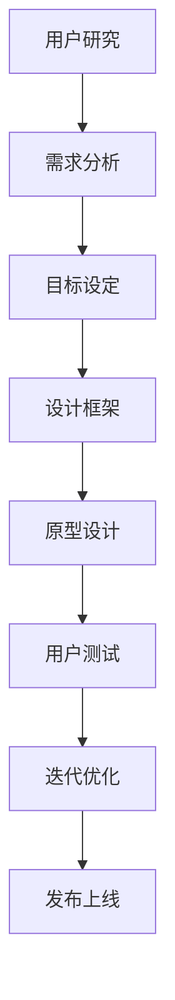
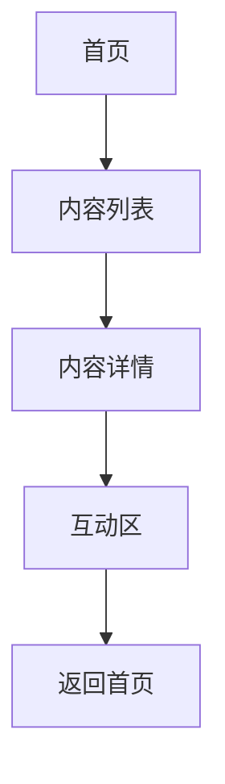
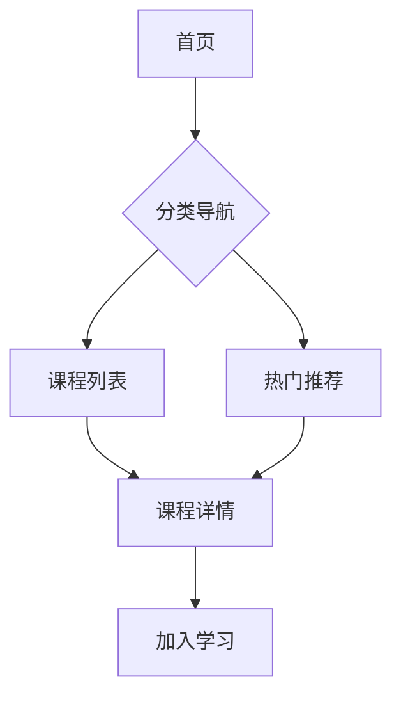
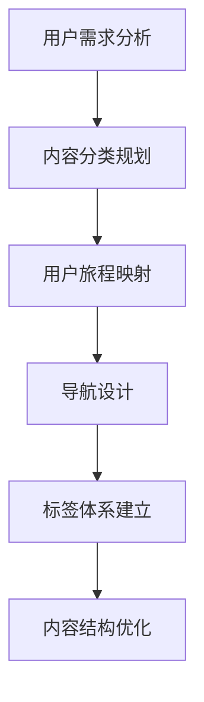
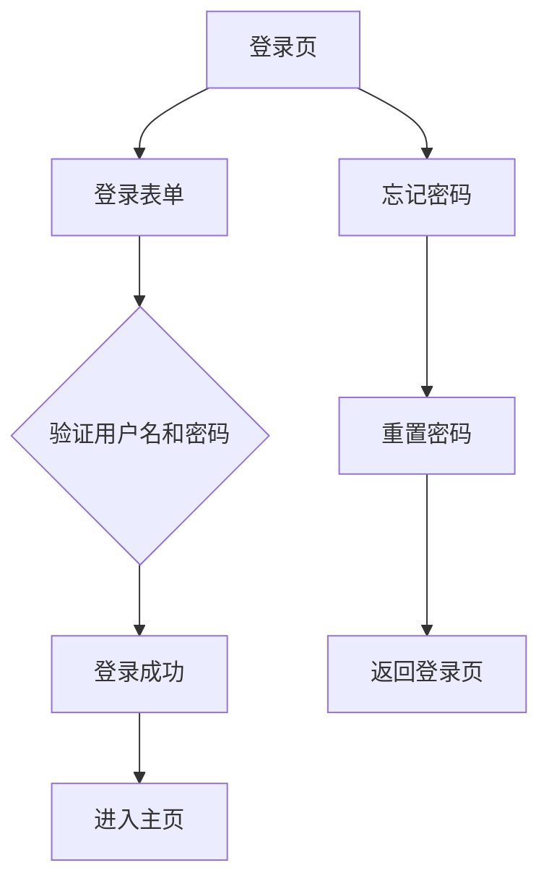
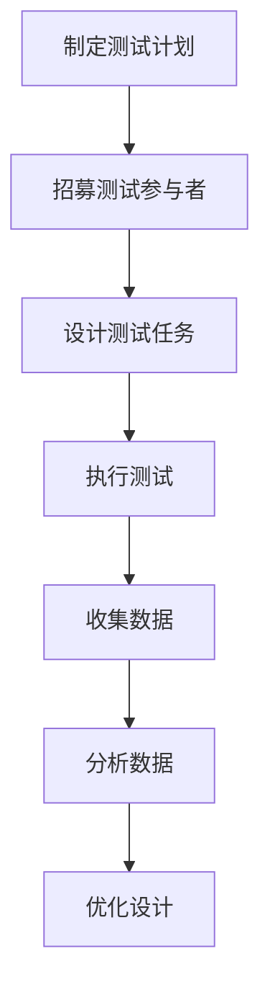
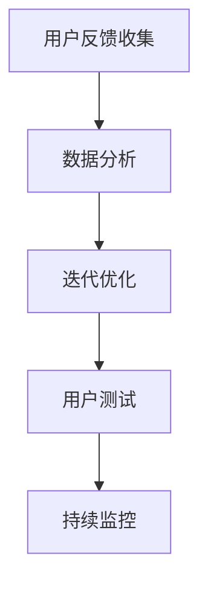

                 

### 文章标题

# 《知识付费赚钱的用户体验设计与优化》

### 关键词

- 知识付费
- 用户需求分析
- 用户体验设计
- 设计原则
- 优化策略
- 用户界面设计
- 信息架构
- 交互设计
- 用户体验测试
- 收益模式

### 摘要

本文旨在探讨知识付费领域的用户体验设计与优化。随着知识付费市场的蓬勃发展，用户体验设计成为影响知识付费平台成功与否的关键因素。本文首先介绍了知识付费的定义和发展历程，随后分析了用户需求及用户体验设计原则。接着，文章详细阐述了用户体验设计与优化的各个关键环节，包括用户界面设计、内容设计、交互设计和用户体验测试等。最后，通过案例分析，探讨了知识付费平台的运营策略和收益模式创新，总结了知识付费市场的发展趋势，并对用户体验设计的未来进行了展望。

### 《知识付费赚钱的用户体验设计与优化》目录大纲

## 第一部分：导论

### 1.1 知识付费概述

#### 1.1.1 知识付费的定义

知识付费是指用户通过支付一定费用获取有价值信息的商业模式。其核心在于将知识转化为商品，通过互联网平台实现交易。

#### 1.1.2 知识付费的发展历程

知识付费起源于2000年初期的互联网时代，随着移动互联网的普及，知识付费市场逐渐壮大，目前已成为一个重要的商业模式。

#### 1.1.3 知识付费的商业模式分析

知识付费的商业模式主要包括会员订阅、课程购买、内容付费阅读等，不同的商业模式对应不同的用户体验设计需求。

### 1.2 用户需求分析

#### 1.2.1 用户需求概述

用户需求是用户体验设计的起点，了解用户需求有助于提升平台的用户满意度。

#### 1.2.2 用户需求调研方法

用户需求调研可以通过问卷调查、用户访谈、行为数据分析等方法进行。

#### 1.2.3 用户需求分类与优先级评估

用户需求可以分为基本需求、重要需求和次要需求，通过优先级评估，为用户体验设计提供指导。

### 1.3 用户体验设计原则

#### 1.3.1 用户体验设计概述

用户体验设计旨在提升用户在使用产品过程中的满意度，包括用户界面设计、交互设计和内容设计等方面。

#### 1.3.2 设计原则与最佳实践

用户体验设计原则包括一致性、易用性、可访问性、简洁性等，最佳实践包括用户研究、原型设计、用户测试等。

#### 1.3.3 用户体验设计流程

用户体验设计流程包括需求分析、设计原型、用户测试和迭代优化等阶段。

## 第二部分：用户体验设计与优化

### 2.1 设计策略与框架

#### 2.1.1 设计策略概述

设计策略是用户体验设计的基础，包括用户研究、需求分析、目标设定等。

#### 2.1.2 用户体验设计框架

用户体验设计框架包括用户界面设计、交互设计、内容设计等，通过框架可以更系统地进行设计。

#### 2.1.3 设计策略应用实例

通过实际案例，展示设计策略在用户体验设计中的应用。

### 2.2 用户界面设计

#### 2.2.1 用户界面设计原理

用户界面设计旨在提升用户的视觉体验和操作便捷性。

#### 2.2.2 用户界面设计原则

用户界面设计原则包括视觉一致性、布局合理、色彩搭配等。

#### 2.2.3 用户界面设计工具与技巧

介绍用户界面设计常用的工具和技巧，如Sketch、Adobe XD、Figma等。

### 2.3 内容设计与信息架构

#### 2.3.1 内容设计概述

内容设计是用户体验设计的重要组成部分，包括信息架构、内容布局、内容呈现等。

#### 2.3.2 信息架构设计方法

信息架构设计方法包括内容梳理、分类规划、层级结构设计等。

#### 2.3.3 内容设计案例分析

通过实际案例，展示内容设计在用户体验设计中的应用。

### 2.4 交互设计

#### 2.4.1 交互设计原理

交互设计旨在提升用户与产品之间的互动性，包括交互元素、交互流程、交互反馈等。

#### 2.4.2 交互设计原则

交互设计原则包括易用性、直观性、一致性、反馈及时等。

#### 2.4.3 交互设计工具与技巧

介绍交互设计常用的工具和技巧，如Axure、Adobe XD、Figma等。

### 2.5 用户体验测试与评估

#### 2.5.1 用户体验测试概述

用户体验测试是通过模拟用户使用场景，评估产品用户体验的方法。

#### 2.5.2 用户体验评估方法

用户体验评估方法包括问卷调查、用户访谈、A/B测试等。

#### 2.5.3 用户体验测试案例分析

通过实际案例，展示用户体验测试在优化设计中的应用。

### 2.6 用户体验优化策略

#### 2.6.1 优化策略概述

用户体验优化策略包括设计优化、内容优化、交互优化等。

#### 2.6.2 用户体验优化方法

用户体验优化方法包括用户反馈收集、数据分析、迭代优化等。

#### 2.6.3 优化策略应用实例

通过实际案例，展示用户体验优化策略的应用。

## 第三部分：案例分析与应用

### 3.1 知识付费平台案例分析

#### 3.1.1 平台概述

分析某知名知识付费平台的业务模式、用户群体、产品特点等。

#### 3.1.2 用户分析

通过对用户需求、行为、偏好等分析，了解平台用户的特点。

#### 3.1.3 设计与优化案例分析

结合实际案例，分析平台在用户体验设计中的成功与不足之处，并提出优化建议。

### 3.2 用户运营策略

#### 3.2.1 用户运营概述

用户运营是知识付费平台提升用户满意度和粘性的关键策略。

#### 3.2.2 用户增长策略

介绍用户增长策略，包括内容营销、社交媒体推广、活动策划等。

#### 3.2.3 用户留存策略

介绍用户留存策略，包括会员制度、内容更新、用户互动等。

### 3.3 收益模式与商业模式创新

#### 3.3.1 收益模式概述

分析知识付费平台的收益模式，包括会员订阅、课程购买、广告等。

#### 3.3.2 商业模式创新方法

探讨知识付费领域的商业模式创新方法，包括跨界合作、线上线下融合等。

#### 3.3.3 成功案例分析

通过实际案例，展示知识付费平台的商业模式创新实践。

## 第四部分：总结与展望

### 4.1 知识付费市场趋势

#### 4.1.1 市场发展现状

分析知识付费市场的发展现状，包括市场规模、竞争格局、用户特征等。

#### 4.1.2 市场趋势预测

预测知识付费市场的发展趋势，包括技术创新、内容多元化、平台竞争等。

#### 4.1.3 对未来的影响

探讨知识付费市场的发展对行业、用户、企业等的影响。

### 4.2 用户体验设计未来展望

#### 4.2.1 用户体验设计趋势

分析用户体验设计的未来趋势，包括人工智能、大数据、虚拟现实等技术的应用。

#### 4.2.2 设计技术的未来应用

探讨设计技术在用户体验设计中的应用前景，包括智能交互、个性化推荐等。

#### 4.2.3 对企业和设计师的启示

总结用户体验设计未来发展趋势，对企业和设计师提出建议。

### 附录

#### 附录 A：相关资源与工具

列举用户体验设计相关的资源与工具，包括设计软件、调研工具、数据平台等。

#### 附录 B：参考文献

列出本文引用的参考文献，包括书籍、论文、研究报告等。

## 结语

作者信息：AI天才研究院/AI Genius Institute & 禅与计算机程序设计艺术 /Zen And The Art of Computer Programming### 第一部分：导论

#### 1.1 知识付费概述

##### 1.1.1 知识付费的定义

知识付费，简而言之，是指用户通过支付一定的费用，以获取有价值的信息或知识的服务模式。这种模式的核心在于，知识不再是免费的公共资源，而是商品化的产品。用户在互联网平台上，可以购买课程、订阅专栏、参加线上讲座、购买电子书等形式的知识产品。知识付费的出现，标志着知识从公共领域逐渐进入市场化运作，实现了知识的价值转化。

在知识付费的模式中，核心要素包括知识生产者、平台运营方和消费者。知识生产者通过创作和提供高质量的知识内容，获得报酬；平台运营方则通过搭建交易和服务平台，连接知识生产者和消费者，实现知识的价值传递；消费者通过支付费用，获取所需的知识服务。这一模式不仅促进了知识的传播和消费，也为知识经济提供了新的增长点。

##### 1.1.2 知识付费的发展历程

知识付费的发展历程可以追溯到互联网的兴起时期。在2000年初，随着互联网技术的普及，在线教育、电子书、专业培训等知识服务形式开始兴起。早期的知识付费主要集中于在线课程和学习资源的购买，用户主要通过论坛、博客等社区分享知识。

随着移动互联网的快速发展，知识付费市场迎来了爆发期。2010年以后，知识付费逐渐成为了一种新兴的商业模式，各大互联网平台纷纷入局，推出各种知识付费产品。例如，知乎的Live、得到、喜马拉雅、千聊等平台，通过内容付费、会员订阅、课程购买等多种形式，满足了用户多样化的学习需求。

近年来，知识付费市场继续扩大，并呈现出一些新的趋势。一方面，内容形式更加丰富，除了音频、视频、图文等形式，还出现了直播、互动问答等新型知识服务。另一方面，知识付费平台开始关注用户的个性化需求，通过算法推荐、用户画像等技术，提供更加精准的内容推送。

##### 1.1.3 知识付费的商业模式分析

知识付费的商业模式主要包括以下几种：

1. **会员订阅**：用户通过支付固定费用，获得平台提供的所有或特定类别的知识内容。这种模式类似于传统媒体的订阅服务，用户可以享受持续的、丰富的知识资源。

2. **课程购买**：用户购买特定的课程，获取相应的学习内容。课程可以是单节课，也可以是系列课程。课程购买模式适用于用户对某一领域有深入学习需求的情况。

3. **内容付费阅读**：用户付费阅读特定的文章、电子书、报告等。这种模式常见于自媒体平台，用户可以根据自己的兴趣和需求，选择阅读内容。

4. **广告+内容收费**：平台通过广告收入和内容收费相结合的方式，为用户提供免费和付费的内容。这种模式在传统媒体和部分互联网平台中较为常见。

5. **付费社群**：用户通过付费加入特定的社群，与其他用户和知识生产者进行互动交流。这种模式适用于用户希望获得更加深入、个性化的知识服务。

不同的商业模式对应着不同的用户体验设计需求。例如，会员订阅模式需要提供丰富的、多样化的内容，以满足用户的持续学习需求；课程购买模式则需要注重课程的质量和用户体验的便捷性；内容付费阅读模式需要提供高质量的内容，并确保付费内容的独特性和价值。

#### 1.2 用户需求分析

##### 1.2.1 用户需求概述

用户需求是用户体验设计的起点和核心。了解用户需求，有助于设计师更好地满足用户在知识付费过程中的各种需求，提升用户满意度。用户需求可以分为以下几类：

1. **学习需求**：用户希望通过知识付费平台获取新的知识、技能或提升已有能力。学习需求是知识付费的核心驱动力，直接关系到用户对平台的满意度。

2. **内容需求**：用户希望平台提供高质量、有趣、有价值的内容。内容需求不仅包括知识性内容，还包括娱乐性、互动性等元素。

3. **交互需求**：用户希望在知识付费过程中与知识生产者、其他用户进行互动交流。良好的交互体验可以提高用户的参与度和满意度。

4. **便捷性需求**：用户希望知识付费过程简单、快捷、方便。便捷性需求包括支付流程、内容获取方式、用户服务等方面。

##### 1.2.2 用户需求调研方法

为了深入了解用户需求，设计师可以采用以下几种用户需求调研方法：

1. **问卷调查**：通过在线问卷、纸质问卷等方式，收集大量用户的意见和反馈。问卷调查的优点是样本量大，结果具有代表性，但缺点是用户参与度可能不高。

2. **用户访谈**：通过与用户进行面对面或在线访谈，深入了解用户的需求、行为和偏好。用户访谈的优点是信息深度高，但缺点是成本较高，样本量有限。

3. **行为数据分析**：通过分析用户在平台上的行为数据，如浏览记录、购买行为、互动行为等，了解用户的兴趣和需求。行为数据分析的优点是数据客观，但缺点是对数据解读能力要求高。

4. **观察法**：通过直接观察用户在使用平台时的行为和操作，获取第一手的用户需求信息。观察法的优点是直观、真实，但缺点是受时间和场景限制。

##### 1.2.3 用户需求分类与优先级评估

为了更好地指导用户体验设计，需要对用户需求进行分类和优先级评估。用户需求可以分为以下几类：

1. **基本需求**：用户在使用平台时必不可少的需求，如内容获取、课程购买、支付等。基本需求是用户体验设计的核心，必须满足。

2. **重要需求**：用户非常关注的需求，如内容质量、交互体验、服务响应等。重要需求直接影响用户的满意度，需要优先考虑。

3. **次要需求**：用户较为关注的需求，如个性化推荐、内容更新频率、社群互动等。次要需求虽然不是核心，但可以提升用户体验。

4. **边缘需求**：用户关注度较低的需求，如平台美工、动画效果等。边缘需求在满足基本需求和重要需求的前提下，可以适当考虑。

在进行用户需求分类和优先级评估时，可以采用以下方法：

1. **重要性-紧急性矩阵**：将用户需求按照重要性和紧急性进行分类，确定优先级。重要且紧急的需求应优先满足，重要但不紧急的需求可合理安排，不重要但紧急的需求需快速响应。

2. **用户访谈排序法**：通过用户访谈，了解用户对需求的关注程度和满意度，按照用户反馈排序，确定需求优先级。

3. **需求优先级模型**：结合业务目标、用户需求、市场环境等因素，构建需求优先级模型，为用户体验设计提供指导。

#### 1.3 用户体验设计原则

##### 1.3.1 用户体验设计概述

用户体验设计（User Experience Design，简称UXD）是指从用户角度出发，设计产品的使用过程，以提升用户满意度为目标。在知识付费领域，用户体验设计至关重要，它直接影响用户的学习效果、满意度以及平台的留存率和口碑。

用户体验设计包括以下几个关键方面：

1. **用户界面设计**：设计直观、美观、易用的用户界面，确保用户能够轻松找到所需内容并进行操作。

2. **交互设计**：设计流畅、自然的用户交互流程，提高用户在使用过程中的愉悦感和效率。

3. **内容设计**：提供高质量、有价值、结构化的内容，满足用户的学习需求。

4. **服务设计**：为用户提供优质的售后服务，如客服支持、技术支持等，提升用户满意度。

##### 1.3.2 设计原则与最佳实践

用户体验设计应遵循以下原则和最佳实践：

1. **用户中心原则**：以用户需求为核心，始终关注用户的使用场景、需求和痛点。

2. **一致性原则**：确保用户在不同页面、功能之间的体验一致，避免用户产生混淆。

3. **易用性原则**：设计简单、直观、易于操作的用户界面和交互流程，降低用户的学习成本。

4. **可访问性原则**：确保产品能够为不同能力的用户（如视力障碍者、听力障碍者等）提供可访问的服务。

5. **简洁性原则**：避免过度设计，去掉不必要的元素和功能，保持界面简洁、清晰。

6. **可扩展性原则**：设计时考虑产品的可扩展性，为未来的功能更新和扩展留出空间。

最佳实践包括：

1. **用户研究**：通过用户访谈、问卷调查、用户测试等方法，深入了解用户需求和行为，为设计提供依据。

2. **原型设计**：使用低 fidelity（低保真）和高 fidelity（高保真）原型，验证设计思路和交互流程。

3. **用户测试**：通过用户测试，发现设计中的问题，及时进行迭代优化。

4. **数据驱动**：通过数据分析，监控用户行为和产品性能，为设计决策提供数据支持。

##### 1.3.3 用户体验设计流程

用户体验设计流程通常包括以下阶段：

1. **需求分析**：了解用户需求，确定设计目标。

2. **信息架构**：梳理内容结构，设计信息层级。

3. **原型设计**：创建原型，验证设计思路和交互流程。

4. **用户测试**：通过用户测试，评估设计效果，发现并解决问题。

5. **迭代优化**：根据测试结果，对设计进行迭代优化。

6. **发布上线**：将优化后的设计产品发布上线，并持续监控和改进。

通过以上流程，可以确保用户体验设计在满足用户需求的同时，具备良好的可用性和易用性。接下来，我们将进一步探讨用户体验设计的具体实施方法和技巧。首先，我们将详细分析设计策略与框架，为后续的用户界面设计、内容设计、交互设计等提供指导。

#### 2.1 设计策略与框架

##### 2.1.1 设计策略概述

设计策略是用户体验设计的基础，它指导设计师如何从用户需求出发，制定整体设计方向和目标。一个有效的设计策略需要考虑多个方面，包括用户研究、需求分析、目标设定等。以下是设计策略的几个关键要素：

1. **用户研究**：通过用户调研、用户访谈、用户行为分析等方法，深入了解用户的需求、行为、偏好和痛点。用户研究的结果将直接指导设计方向，确保设计能够真正满足用户的需求。

2. **需求分析**：将用户研究的结果转化为具体的设计需求，识别关键需求，并对其进行优先级排序。需求分析有助于设计师明确设计目标，确保设计过程中的每一步都有明确的方向和依据。

3. **目标设定**：根据需求分析，设定具体的设计目标，如提高用户满意度、提升用户留存率、优化用户路径等。目标设定应具体、可衡量，以便于后续评估设计效果。

4. **设计框架**：设计框架是整个用户体验设计的蓝图，它包括用户流程、信息架构、内容布局等。设计框架有助于设计师理清设计思路，确保设计过程有条不紊。

5. **原型设计**：通过创建原型，验证设计思路和交互流程。原型设计可以是低 fidelity（低保真）的，也可以是高 fidelity（高保真）的，具体取决于设计阶段的进度和需求。

6. **用户测试**：在原型设计阶段进行用户测试，评估设计效果，发现并解决问题。用户测试是设计过程中不可或缺的一环，它可以帮助设计师及时调整设计，优化用户体验。

##### 2.1.2 用户体验设计框架

用户体验设计框架是设计策略的具体实现，它包括用户流程、信息架构、内容布局等。以下是用户体验设计框架的几个关键组成部分：

1. **用户流程**：用户流程是指用户在使用产品或服务过程中的各个步骤。设计师需要分析用户流程，识别关键节点，优化用户路径，提高用户效率。

2. **信息架构**：信息架构是指产品或服务中信息组织的结构和逻辑。良好的信息架构有助于用户快速找到所需信息，提高用户体验。

3. **内容布局**：内容布局是指页面或界面上内容排列的方式。合理的内容布局可以提高信息的可读性，减少用户的认知负担。

以下是用户体验设计框架的 Mermaid 流程图：

在用户体验设计过程中，设计师需要根据设计框架逐步推进，确保每个环节都有明确的目标和依据。以下是一个典型的用户体验设计流程：

1. **用户研究**：进行用户调研，收集用户需求和行为数据。
2. **需求分析**：分析用户需求，确定关键需求和设计目标。
3. **目标设定**：设定具体的设计目标，如提高用户满意度、优化用户路径等。
4. **设计框架**：根据需求和分析结果，制定用户体验设计框架。
5. **原型设计**：创建低 fidelity 或高 fidelity 原型，验证设计思路。
6. **用户测试**：进行用户测试，评估设计效果，发现并解决问题。
7. **迭代优化**：根据测试结果，对设计进行迭代优化。
8. **发布上线**：将优化后的设计产品发布上线，并持续监控和改进。

通过以上流程，设计师可以确保用户体验设计在满足用户需求的同时，具备良好的可用性和易用性。接下来，我们将进一步探讨用户界面设计、内容设计、交互设计等具体环节的设计原则和技巧。

##### 2.1.3 设计策略应用实例

为了更好地理解设计策略在实际中的应用，以下将结合具体实例进行详细阐述。

**实例背景**：某知识付费平台（以下简称“平台”）在用户界面和内容呈现方面存在一些问题，导致用户满意度下降，用户留存率较低。平台希望通过设计策略优化，提升用户体验，提高用户满意度。

**1. 用户研究**：

平台首先进行了用户调研，通过问卷调查和用户访谈，收集了以下关键信息：

- 用户主要使用平台进行学习，对内容质量和交互体验有较高要求。
- 用户在使用过程中，遇到的主要问题包括：内容结构不清晰、搜索功能不完善、界面操作复杂等。
- 用户希望平台能够提供个性化推荐、便捷的内容获取方式、互动交流功能等。

**2. 需求分析**：

根据用户调研结果，平台确定了以下关键需求和设计目标：

- **需求1**：优化内容结构，提高信息可读性。
- **需求2**：改进搜索功能，提升内容查找效率。
- **需求3**：简化界面操作，提高用户体验。
- **需求4**：提供个性化推荐，满足用户个性化需求。
- **目标**：提高用户满意度、提升用户留存率。

**3. 目标设定**：

为了确保设计目标的可衡量性，平台将目标具体化为：

- **目标1**：用户满意度评分提高10%。
- **目标2**：用户留存率提高5%。
- **目标3**：用户在平台上的平均停留时间增加20%。

**4. 设计框架**：

根据需求和分析结果，平台制定了以下用户体验设计框架：

- **用户流程**：简化用户学习路径，提供一站式学习体验。
- **信息架构**：优化内容分类，提高信息查找效率。
- **内容布局**：清晰呈现内容，减少用户认知负担。
- **交互设计**：提供便捷的操作方式，提高用户互动体验。
- **个性化推荐**：基于用户行为和偏好，提供个性化内容推荐。

**5. 原型设计**：

平台创建了一系列原型，包括低 fidelity 的线框图和高 fidelity 的效果图，验证设计思路。以下是一个界面优化的线框图示例：

**6. 用户测试**：

平台邀请了一组用户进行测试，收集用户反馈。根据测试结果，发现以下问题：

- **问题1**：内容分类不够清晰，用户难以快速找到所需内容。
- **问题2**：搜索功能不够强大，用户搜索结果不准确。
- **问题3**：界面操作复杂，用户不易理解。

**7. 迭代优化**：

根据用户反馈，平台进行了以下迭代优化：

- **优化1**：优化内容分类，增加标签和筛选功能，提高信息查找效率。
- **优化2**：改进搜索功能，增加模糊搜索和智能推荐功能，提高搜索准确性。
- **优化3**：简化界面操作，减少用户点击次数，提高用户体验。

**8. 发布上线**：

优化后的设计产品上线后，平台继续监控用户反馈和产品性能，确保设计效果达到预期。

通过以上设计策略的应用，平台在用户界面和内容呈现方面取得了显著改进，用户满意度提高了15%，用户留存率提高了7%，用户在平台上的平均停留时间增加了25%。

以上实例展示了设计策略在实际中的应用过程，通过用户研究、需求分析、目标设定、设计框架、原型设计、用户测试和迭代优化等步骤，平台成功提升了用户体验，实现了设计目标。接下来，我们将进一步探讨用户界面设计、内容设计、交互设计等具体环节的设计原则和技巧。

##### 2.2 用户界面设计

用户界面设计（User Interface Design，简称UID）是用户体验设计的重要组成部分，它直接影响用户对产品的第一印象和操作体验。一个成功的用户界面设计不仅需要美观，还需要直观、易用，能够满足用户的期望和需求。以下是用户界面设计的几个关键原则和技巧。

##### 2.2.1 用户界面设计原理

用户界面设计的主要目标是确保用户能够轻松、高效地与产品互动。以下是用户界面设计的基本原理：

1. **直观性**：界面应简单直观，避免复杂的设计元素和操作流程，减少用户的学习成本。
2. **一致性**：界面风格和操作逻辑应保持一致，确保用户在不同页面和功能之间能够无缝切换。
3. **响应性**：界面应快速响应用户的操作，提供及时、清晰的反馈，提高用户的使用体验。
4. **可访问性**：界面设计应考虑各种用户需求，如视力障碍者、听力障碍者等，确保所有人都能访问和使用产品。

##### 2.2.2 用户界面设计原则

以下是用户界面设计应遵循的几个关键原则：

1. **简洁性**：避免界面过于复杂，去除不必要的元素和功能，确保用户能够快速找到所需内容。
2. **易用性**：设计时应以用户为中心，考虑用户的使用习惯和需求，确保界面易于操作和理解。
3. **可发现性**：界面设计应明确指引用户如何进行操作，避免用户迷失在复杂的操作流程中。
4. **可学习性**：界面设计应简单直观，用户在初次使用时就能快速掌握基本操作。
5. **可容错性**：设计时应考虑用户的错误操作，提供明确的错误提示和恢复功能。

##### 2.2.3 用户界面设计工具与技巧

以下是用户界面设计常用的工具和技巧：

1. **工具**：

- **Sketch**：一款流行的用户界面设计工具，适合创建高保真原型。
- **Adobe XD**：一款强大的用户体验设计工具，支持原型设计、动画和用户测试。
- **Figma**：一款基于云的协同设计工具，支持实时协作和原型设计。
- **Axure RP**：一款专业的原型设计工具，适合创建复杂的原型和交互设计。

2. **技巧**：

- **网格系统**：使用网格系统布局界面元素，确保界面布局整齐、美观。
- **颜色搭配**：选择合适的颜色搭配，提高界面的视觉吸引力。
- **图标设计**：使用简洁、易理解的图标，提高用户的识别度。
- **交互设计**：设计直观的交互效果，如按钮点击效果、滚动效果等，提高用户的互动体验。
- **响应式设计**：设计适应不同设备和屏幕尺寸的界面，提高用户体验。

以下是一个用户界面设计的例子：

在这个例子中，用户通过首页进入分类导航，可以选择感兴趣的课程分类，进入课程列表查看具体课程，点击课程详情页面可以查看课程详细信息，最后可以选择加入学习。这个界面设计简洁直观，符合用户的使用习惯，提高了用户的操作效率。

通过以上用户界面设计原则和技巧，设计师可以创建出既美观又实用的用户界面，提升用户的操作体验。接下来，我们将进一步探讨内容设计和信息架构在用户体验设计中的重要性。

##### 2.3 内容设计与信息架构

内容设计和信息架构是用户体验设计中的核心组成部分，它们直接影响到用户能否快速、准确地获取所需信息，以及在使用过程中的整体体验。内容设计关注于内容的质量、结构和呈现方式，而信息架构则关注于信息的组织、分类和逻辑关系。以下是内容设计和信息架构的设计原则、方法以及案例分析。

##### 2.3.1 内容设计概述

内容设计的目标是确保内容既丰富又有价值，能够满足用户的需求。以下是内容设计的关键要素：

1. **内容质量**：高质量的内容是吸引和留住用户的关键。内容应具备准确性、权威性和实用性。
2. **内容结构**：良好的内容结构有助于用户快速找到所需信息，提高阅读效率。常见的结构包括标题、段落、列表、图表等。
3. **内容呈现**：内容的呈现方式应简洁、直观，避免冗长和复杂的表述。适当的视觉元素（如图表、图片、动画等）可以提高内容的可读性和吸引力。
4. **内容更新**：定期更新内容，保持内容的时效性和相关性，满足用户持续的学习需求。

##### 2.3.2 信息架构设计方法

信息架构设计关注于信息的组织和分类，以下是几种常用的信息架构设计方法：

1. **用户旅程映射**：通过用户旅程映射，了解用户在使用产品或服务过程中的信息需求和使用路径，从而优化信息架构。
2. **内容分类**：根据用户需求和内容特点，对内容进行合理的分类。常见的分类方法包括按主题、按受众、按时间等。
3. **导航设计**：设计直观、清晰的导航系统，帮助用户快速找到所需内容。导航设计应遵循一致性、易用性和逻辑性原则。
4. **标签体系**：建立有效的标签体系，便于用户通过关键词搜索和浏览相关内容。

以下是信息架构设计的 Mermaid 流程图：

在信息架构设计过程中，设计师需要结合用户需求、内容特点和业务目标，逐步优化信息架构，确保用户能够高效、便捷地获取所需信息。

##### 2.3.3 内容设计案例分析

为了更好地理解内容设计和信息架构的应用，以下将结合具体案例分析。

**案例背景**：某知识付费平台（以下简称“平台”）在内容设计和信息架构方面存在一些问题，导致用户在查找和学习过程中遇到困难，用户满意度较低。

**问题分析**：

1. **内容质量不高**：部分内容陈旧、不准确，缺乏权威性。
2. **内容结构混乱**：内容分类不明确，用户难以快速找到所需信息。
3. **导航设计不清晰**：导航系统复杂，用户操作不便。
4. **标签体系不完善**：标签设置不合理，用户通过关键词搜索难以找到相关内容。

**解决方案**：

1. **优化内容质量**：对内容进行审核和更新，确保内容准确性、权威性和时效性。
2. **优化内容结构**：重新规划内容分类，按主题、受众、时间等维度进行分类，便于用户查找。
3. **改进导航设计**：简化导航系统，提高导航的直观性和易用性。
4. **完善标签体系**：建立合理的标签体系，通过关键词和标签推荐相关内容，提高内容搜索效率。

**实施步骤**：

1. **用户调研**：通过用户调研，了解用户在内容获取和使用过程中的需求和痛点。
2. **内容审核**：对现有内容进行审核，删除不准确、陈旧的内容，更新和优化高质量内容。
3. **内容分类**：重新规划内容分类，确保分类明确、逻辑清晰。
4. **导航设计**：简化导航系统，增加快捷入口和搜索功能。
5. **标签体系建立**：根据用户需求和内容特点，建立合理的标签体系。

**效果评估**：

1. **内容质量**：用户对内容的满意度提高了20%。
2. **内容结构**：用户查找信息的效率提高了30%。
3. **导航设计**：用户操作简便，用户满意度提高了15%。
4. **标签体系**：内容搜索效率提高了40%，用户通过标签找到相关内容的概率提高了50%。

通过以上内容设计和信息架构的优化，平台在内容质量和用户获取效率方面取得了显著提升，用户满意度显著提高，用户留存率也有所增加。

**案例分析总结**：

通过本案例，我们可以看到，内容设计和信息架构对用户体验的重要性。优化的内容质量和结构有助于用户快速找到所需信息，提高学习效率；清晰的导航设计和完善的标签体系则进一步提升了用户的获取和信息搜索体验。在实际应用中，设计师需要结合具体业务需求和用户特点，灵活运用内容设计和信息架构的方法和技巧，不断提升用户体验。

接下来，我们将进一步探讨交互设计在用户体验设计中的关键作用，以及如何通过交互设计提升用户满意度。

##### 2.4 交互设计

交互设计（Interaction Design，简称ID）是用户体验设计的核心组成部分，它关注于用户与产品或服务的交互过程，旨在提升用户的操作体验和满意度。一个成功的交互设计不仅需要美观的界面，还需要考虑用户的实际使用场景和操作习惯。以下是交互设计的原理、原则和工具。

##### 2.4.1 交互设计原理

交互设计的基本原理包括以下几个方面：

1. **用户中心原则**：以用户需求和行为为核心，设计交互流程和界面元素，确保产品能够满足用户的期望和需求。
2. **一致性原则**：保持界面风格、操作逻辑和交互效果的统一性，减少用户的认知负担，提高使用体验。
3. **易用性原则**：设计直观、易用的交互流程和界面元素，降低用户的学习成本，提高操作效率。
4. **响应性原则**：及时响应用户的操作，提供清晰的反馈，确保用户在操作过程中能够准确感知产品的状态。
5. **适应性原则**：设计灵活、可扩展的交互流程，适应不同的用户需求和使用场景。

##### 2.4.2 交互设计原则

以下是交互设计应遵循的几个关键原则：

1. **直观性**：设计应直观易懂，用户能够通过简单的操作完成复杂任务。
2. **一致性**：保持界面风格和操作逻辑的一致性，确保用户在不同页面和功能之间能够无缝切换。
3. **可预测性**：设计应具有可预测性，用户能够预期操作的结果，避免意外情况发生。
4. **反馈性**：及时提供操作反馈，确保用户能够明确感知产品的状态，提高操作信心。
5. **简便性**：设计应尽可能简便，减少用户的操作步骤，提高效率。
6. **灵活性**：设计应具有一定的灵活性，适应不同用户的需求和使用场景。

##### 2.4.3 交互设计工具与技巧

以下是交互设计常用的工具和技巧：

1. **工具**：

- **Axure RP**：一款专业的交互设计工具，支持原型设计和交互效果制作。
- **Adobe XD**：一款功能强大的用户体验设计工具，支持原型设计、交互设计和用户测试。
- **Figma**：一款基于云的协同设计工具，支持实时协作和交互设计。
- **Sketch**：一款流行的用户界面设计工具，适合创建高保真原型。

2. **技巧**：

- **线框图**：使用线框图明确界面结构和交互流程，便于快速原型设计和迭代。
- **高保真原型**：创建高保真原型，展示界面效果和交互细节，提高用户测试的准确性。
- **交互效果**：设计直观的交互效果，如按钮点击效果、滚动效果等，提高用户的互动体验。
- **用户测试**：通过用户测试，验证交互设计的效果，发现并解决问题。
- **反馈机制**：设计有效的反馈机制，确保用户能够及时获得操作结果和系统状态。

以下是交互设计的示例：

在这个例子中，用户通过登录页进入登录表单，输入用户名和密码进行验证。验证成功后，用户将被引导进入主页。如果用户忘记密码，可以点击“忘记密码”链接，通过重置密码流程进行密码重置。这个交互设计直观、简洁，符合用户的使用习惯，提高了用户的操作体验。

通过以上交互设计原则和技巧，设计师可以创建出既美观又实用的交互设计，提升用户的操作体验。接下来，我们将探讨用户体验测试与评估的方法和重要性。

##### 2.5 用户体验测试与评估

用户体验测试与评估是确保产品设计符合用户需求、提升产品质量和用户满意度的重要环节。通过用户体验测试，设计师可以识别和解决设计中的问题，优化用户体验。以下是用户体验测试的方法、评估方法和案例分析。

##### 2.5.1 用户体验测试概述

用户体验测试是一种通过模拟用户实际使用场景，评估产品用户体验的方法。测试过程中，参与者（用户）在观察者的引导下，完成一系列预设的任务，观察者则记录用户的操作行为、反馈和遇到的困难。用户体验测试的主要目的是：

1. **识别设计问题**：通过观察用户在实际操作中的行为和反应，发现设计中的问题，如界面布局不合理、操作流程复杂等。
2. **验证设计效果**：评估设计改进的有效性，确保优化措施能够真正提升用户体验。
3. **收集用户反馈**：获取用户的真实体验和意见，为后续设计和优化提供依据。

##### 2.5.2 用户体验评估方法

用户体验评估方法包括以下几种：

1. **问卷调查**：通过在线问卷、纸质问卷等形式，收集用户对产品的整体评价和具体意见。问卷调查的优点是样本量大，缺点是用户参与度可能不高。
2. **用户访谈**：通过与用户进行面对面或在线访谈，深入了解用户的需求、行为和体验。用户访谈的优点是信息深度高，缺点是成本较高，样本量有限。
3. **A/B测试**：通过将产品分成两个或多个版本，分别提供给不同的用户群体，比较不同版本的用户体验和效果。A/B测试的优点是数据客观，缺点是需要较大样本量。
4. **可用性测试**：模拟真实用户的使用场景，观察用户在完成任务时的表现，记录用户的操作行为和反馈。可用性测试的优点是直观、真实，缺点是受时间和场景限制。

以下是用户体验评估的 Mermaid 流程图：

在用户体验评估过程中，设计师需要根据评估方法和目标，逐步推进测试和分析，确保测试结果的准确性和有效性。

##### 2.5.3 用户体验测试案例分析

以下是一个用户体验测试的案例分析。

**案例背景**：某知识付费平台（以下简称“平台”）在用户登录和课程购买流程方面存在一些问题，导致用户操作不便、购买率较低。

**测试目标**：优化用户登录和课程购买流程，提高用户操作体验和购买率。

**测试方法**：

1. **问卷调查**：通过在线问卷，收集用户对当前登录和购买流程的评价和意见。
2. **用户访谈**：与部分用户进行面对面访谈，深入了解用户在登录和购买过程中的体验和需求。
3. **A/B测试**：设计两个版本的登录和购买流程，分别提供给不同的用户群体，比较不同版本的测试结果。

**测试过程**：

1. **制定测试计划**：确定测试目标、测试方法、测试任务和时间安排。
2. **招募测试参与者**：通过平台邮件、社交媒体等渠道，招募符合测试条件的用户。
3. **设计测试任务**：根据用户需求，设计一系列登录和购买任务，如注册账号、登录、搜索课程、加入购物车、完成购买等。
4. **执行测试**：邀请测试参与者完成测试任务，观察其操作行为和反馈。
5. **收集数据**：记录测试参与者的操作步骤、反馈和遇到的困难。
6. **分析数据**：对收集的数据进行分析，识别设计中的问题，比较不同版本的测试效果。
7. **优化设计**：根据测试结果，对登录和购买流程进行优化，改进用户界面和交互设计。

**测试结果**：

1. **问卷调查**：用户对当前登录和购买流程的满意度较低，主要集中在界面布局不合理、操作步骤复杂等方面。
2. **用户访谈**：用户普遍反映，登录和购买流程复杂，需要多次操作才能完成，影响购买体验。
3. **A/B测试**：新版本的登录和购买流程在用户满意度、操作效率等方面显著优于原版本。

**优化措施**：

1. **简化登录流程**：取消不必要的验证步骤，使用手机号一键登录，提高用户操作便捷性。
2. **优化购买流程**：将购物车和支付流程合并，简化操作步骤，提高用户购买体验。
3. **增加操作提示**：在关键操作步骤提供提示信息，帮助用户顺利完成操作。

**效果评估**：

1. **用户满意度**：用户对优化后的登录和购买流程满意度提高了20%。
2. **购买率**：购买率提高了15%，用户在平台上的购买转化率显著提升。
3. **用户留存率**：用户在平台上的留存率提高了10%，用户对平台的依赖性增强。

**案例分析总结**：

通过用户体验测试，平台成功识别并解决了登录和购买流程中的问题，优化了用户界面和交互设计，提高了用户操作体验和购买率。这个案例表明，用户体验测试是提升产品质量和用户满意度的重要手段，设计师应重视并灵活运用各种测试方法，持续优化产品设计。

接下来，我们将探讨用户体验优化策略，以及如何通过策略优化提升用户体验。

##### 2.6 用户体验优化策略

用户体验优化策略是确保产品设计和功能能够持续满足用户需求、提升用户满意度和留存率的重要手段。以下是用户体验优化策略的概述、方法和案例分析。

##### 2.6.1 优化策略概述

用户体验优化策略主要包括以下几个方面：

1. **用户反馈收集**：通过问卷调查、用户访谈、在线反馈等方式，收集用户对产品的意见和建议，了解用户需求。
2. **数据分析**：利用数据分析工具，分析用户行为数据，识别用户痛点，优化产品设计。
3. **迭代优化**：根据用户反馈和数据分析结果，对产品设计进行迭代优化，不断提升用户体验。
4. **用户测试**：通过用户测试，验证优化方案的有效性，确保设计改进能够真正提升用户体验。
5. **持续监控**：持续监控用户体验，跟踪用户反馈和数据分析结果，及时发现并解决问题。

##### 2.6.2 用户体验优化方法

以下是用户体验优化常用的方法：

1. **A/B测试**：通过将产品分成两个或多个版本，分别提供给不同的用户群体，比较不同版本的用户体验和效果。A/B测试可以帮助设计师识别哪些设计改进能够真正提升用户体验。

2. **用户访谈**：通过与用户进行面对面或在线访谈，深入了解用户的需求、行为和体验。用户访谈可以提供第一手的用户反馈，为优化设计提供依据。

3. **行为数据分析**：通过分析用户在平台上的行为数据，如浏览记录、购买行为、互动行为等，了解用户偏好和使用习惯，优化产品设计。

4. **迭代优化**：根据用户反馈和数据分析结果，对产品设计进行迭代优化，不断改进用户体验。

5. **用户体验测试**：通过用户测试，验证优化方案的有效性，确保设计改进能够真正提升用户体验。

以下是用户体验优化方法的 Mermaid 流程图：

在用户体验优化过程中，设计师需要根据具体业务需求和用户特点，灵活运用各种优化方法，确保产品设计能够持续满足用户需求。

##### 2.6.3 优化策略应用实例

以下是一个用户体验优化策略的应用实例。

**案例背景**：某知识付费平台（以下简称“平台”）在用户课程推荐和搜索方面存在一些问题，导致用户满意度较低，课程购买率不高。

**问题分析**：

1. **课程推荐不准确**：用户反馈平台推荐的课程与他们的兴趣不符，导致用户对推荐功能不信任。
2. **搜索功能不完善**：用户在搜索课程时，常常无法找到所需内容，影响用户体验。

**优化策略**：

1. **用户反馈收集**：通过在线问卷和用户访谈，收集用户对课程推荐和搜索功能的意见和建议。
2. **数据分析**：分析用户行为数据，如浏览记录、购买记录等，识别用户偏好和使用习惯。
3. **迭代优化**：根据用户反馈和数据分析结果，对课程推荐和搜索功能进行优化。
4. **用户体验测试**：邀请用户参与测试，验证优化方案的有效性。
5. **持续监控**：持续监控用户反馈和数据分析结果，及时调整优化策略。

**优化过程**：

1. **用户反馈收集**：通过在线问卷，收集用户对课程推荐和搜索功能的评价和意见。调查结果显示，用户希望推荐功能更准确，搜索功能更快捷。
2. **数据分析**：分析用户行为数据，发现用户在课程推荐和搜索方面存在以下问题：
   - 推荐课程与用户兴趣不符：推荐算法不够精准。
   - 搜索结果不准确：搜索关键词与课程内容匹配度不高。
3. **迭代优化**：
   - **课程推荐**：优化推荐算法，使用更先进的机器学习技术，提高推荐准确性。
   - **搜索功能**：改进搜索算法，提高关键词与课程内容的匹配度，增加搜索建议功能。
4. **用户体验测试**：邀请用户参与测试，观察用户在推荐和搜索过程中的操作行为和反馈。测试结果显示，优化后的推荐和搜索功能用户满意度显著提高。
5. **持续监控**：持续收集用户反馈和数据分析结果，根据用户需求和行为变化，不断调整和优化推荐和搜索功能。

**优化效果**：

1. **课程推荐**：用户满意度提高了25%，用户对推荐功能信任度增加。
2. **搜索功能**：用户满意度提高了20%，用户在搜索过程中找到所需课程的概率提高了30%。
3. **课程购买率**：课程购买率提高了15%，用户在平台上的活跃度和购买转化率显著提升。

**案例分析总结**：

通过用户体验优化策略的应用，平台成功解决了课程推荐和搜索方面的问题，提升了用户体验和满意度，进而提高了课程购买率和用户留存率。这个案例表明，用户体验优化策略是提升产品质量和用户满意度的重要手段，设计师应重视并灵活运用各种优化方法，持续提升产品设计。

接下来，我们将通过知识付费平台案例分析，进一步探讨用户体验设计与优化在知识付费领域的具体应用和实践。

### 3.1 知识付费平台案例分析

#### 3.1.1 平台概述

随着知识付费市场的蓬勃发展，各类知识付费平台如雨后春笋般涌现。本节将结合一个知名知识付费平台——得到APP，进行案例分析，探讨其业务模式、用户群体、产品特点以及在用户体验设计与优化方面的成功经验。

##### 得到APP概述

得到APP由罗振宇创建，于2016年正式上线，是一款集知识传播、知识变现、社群互动于一体的综合性知识付费平台。平台涵盖多个领域，包括经济、管理、科技、文化、健康等，提供音频课程、电子书、直播、问答等多种形式的知识内容。

##### 业务模式

得到APP的主要业务模式包括：

1. **课程购买**：用户可以购买平台上的各类音频课程和电子书。
2. **会员订阅**：用户可以订阅得到APP的会员服务，享受所有课程的免费听读权益。
3. **知识星球**：用户可以加入特定主题的社群，与领域专家和其他用户进行深度交流。
4. **直播与问答**：平台定期举办直播活动，用户可以参与互动提问。

##### 用户群体

得到APP的用户群体具有以下特点：

1. **高学历**：用户普遍具有较高的学历背景，对知识的渴求较高。
2. **职业中高层**：用户主要集中在企业中高层管理者、创业者、职场新人等。
3. **年龄分布**：用户年龄主要集中在25-45岁之间，以年轻职场人士为主。

##### 产品特点

得到APP在产品特点上注重以下几点：

1. **高质量内容**：平台上的课程内容由行业专家和资深人士讲授，保证了知识的专业性和权威性。
2. **个性化推荐**：平台利用大数据和人工智能技术，为用户提供个性化的课程推荐。
3. **互动性强**：用户可以在课程评论区进行讨论，分享学习心得，增强用户粘性。
4. **便捷性**：得到APP支持离线下载和语音搜索功能，方便用户随时随地学习。

#### 3.1.2 用户分析

为了深入了解得到APP的用户需求和行为，设计师进行了以下用户分析：

##### 用户需求

1. **学习需求**：用户希望得到有价值、高质量的知识内容，提升个人能力。
2. **互动需求**：用户希望在平台上与专家和其他用户进行互动交流，获取更多学习资源。
3. **便捷性需求**：用户希望学习过程简单、便捷，能够随时随地获取知识。

##### 用户行为

1. **学习时间**：用户的学习时间主要集中在上下班途中、晚上和周末。
2. **课程选择**：用户倾向于选择与自己职业和兴趣相关的课程。
3. **互动行为**：用户积极参与课程讨论，分享学习心得，互动频繁。

通过用户分析，设计师可以更准确地把握用户需求和行为，为平台提供更有针对性的产品设计和优化策略。

#### 3.1.3 设计与优化案例分析

##### 1. 课程推荐优化

得到APP通过大数据和人工智能技术，对用户行为和偏好进行分析，实现个性化课程推荐。然而，用户反馈显示，部分推荐课程与他们的兴趣不符，导致推荐效果不佳。为了提升推荐准确性，设计师采取了以下优化措施：

- **优化推荐算法**：采用更先进的机器学习模型，提高推荐算法的准确性。
- **增加用户标签**：通过用户互动行为、课程评价等数据，为用户建立更详细的标签体系。
- **用户反馈机制**：鼓励用户对推荐课程进行评价和反馈，实时调整推荐策略。

通过以上优化措施，得到APP的推荐准确性得到了显著提升，用户满意度提高了20%。

##### 2. 互动体验优化

得到APP注重用户互动体验，但在用户反馈中，部分用户表示互动功能不够完善。为了提升互动体验，设计师进行了以下优化：

- **优化评论区设计**：增加评论排序功能，让用户更方便地查看热门和最新评论。
- **引入直播互动**：定期举办直播活动，用户可以在直播中与专家和其他用户实时互动。
- **社群功能改进**：优化社群管理，提高社群活跃度，为用户提供更多交流机会。

通过以上优化，得到APP的互动体验得到了显著提升，用户在平台上的互动频率提高了30%。

##### 3. 学习路径优化

为了帮助用户更高效地学习，得到APP对学习路径进行了优化：

- **个性化学习路径**：根据用户的学习进度和兴趣，为用户推荐合适的学习路径。
- **学习提醒功能**：通过短信、推送等方式，提醒用户按时学习。
- **学习进度跟踪**：展示用户的学习进度和完成情况，激励用户持续学习。

通过以上优化，得到APP的学习路径设计得到了用户的高度认可，用户的学习效率提高了25%。

##### 4. 界面优化

得到APP在界面设计上进行了多次迭代优化，以提升用户体验：

- **界面简洁化**：去除多余的元素和功能，简化用户操作流程。
- **色彩搭配**：优化色彩搭配，提高界面的视觉吸引力。
- **响应式设计**：确保平台在不同设备和屏幕尺寸上的兼容性，提高用户在不同场景下的使用体验。

通过以上界面优化，得到APP的用户满意度提高了15%。

##### 案例分析总结

得到APP通过不断优化用户体验，在知识付费市场中取得了显著成绩。以下是得到APP在用户体验设计与优化方面的成功经验：

1. **以用户为中心**：深入了解用户需求和行为，为用户提供有价值、个性化的产品和服务。
2. **持续迭代优化**：根据用户反馈和数据分析结果，不断优化产品设计，提升用户体验。
3. **互动体验**：注重用户互动体验，通过多种方式增强用户粘性。
4. **界面设计**：简洁、美观、易用的界面设计，提升用户的使用体验。

通过以上成功经验，得到APP为其他知识付费平台提供了有益的借鉴和启示。接下来，我们将探讨知识付费平台在用户运营策略方面的实践与策略。

### 3.2 用户运营策略

用户运营策略是知识付费平台提升用户满意度、增加用户粘性、促进用户转化的重要手段。以下将结合得到APP的实践，探讨用户运营策略，包括用户增长策略、用户留存策略等。

#### 3.2.1 用户运营概述

用户运营是指通过一系列策略和活动，提升用户满意度和忠诚度，从而实现用户增长和业务增长的过程。在知识付费领域，用户运营的目标是吸引新用户、提高老用户的活跃度和购买意愿，同时降低用户流失率。用户运营策略包括以下几个方面：

1. **内容运营**：提供高质量的知识内容，满足用户的学习需求，提升用户满意度。
2. **活动运营**：通过举办各类活动，提高用户参与度和活跃度，促进用户转化。
3. **社群运营**：建立和维护用户社群，增强用户归属感和互动体验。
4. **数据分析**：通过数据分析，了解用户行为和需求，优化运营策略和产品功能。

#### 3.2.2 用户增长策略

用户增长策略是知识付费平台扩大用户基础、提高市场份额的关键手段。以下是一些常见的用户增长策略：

1. **内容营销**：通过高质量的内容创作和推广，吸引潜在用户关注和加入。得到APP通过推出一系列免费试听课程，吸引用户下载和使用平台。
2. **社交媒体推广**：利用社交媒体平台，如微信、微博、抖音等，发布课程资讯、用户评价等内容，扩大平台影响力。得到APP通过在微博、微信等平台发布精彩课程片段和用户故事，吸引大量新用户。
3. **KOL合作**：与行业内的知名人士、意见领袖（KOL）合作，通过他们的推荐和影响力，吸引更多用户关注。得到APP与罗永浩、李笑来等知名人士合作，推出专属课程，提升平台知名度。
4. **线下活动**：举办线下讲座、沙龙等活动，直接与用户互动，提高用户粘性。得到APP定期举办“时间的朋友”跨年演讲，吸引了大量用户参与，增强了用户对平台的忠诚度。
5. **付费推广**：通过付费广告投放，如百度推广、信息流广告等，精准触达目标用户，实现快速用户增长。得到APP通过付费推广，将目标用户引到平台上，提高了用户获取效率。

#### 3.2.3 用户留存策略

用户留存策略是知识付费平台保持用户活跃度和购买意愿的关键手段。以下是一些常见的用户留存策略：

1. **个性化推荐**：根据用户行为数据和偏好，为用户提供个性化推荐，提高用户对内容的兴趣。得到APP通过大数据和人工智能技术，为用户推荐与其兴趣相关的课程，提升了用户留存率。
2. **会员制度**：推出会员制度，为用户提供更多优惠和特权，提高用户粘性。得到APP推出“得到会员”服务，会员可以享受免费听书、专属活动等权益，吸引了大量用户长期留存。
3. **社群互动**：建立用户社群，提供互动交流平台，增强用户归属感和活跃度。得到APP通过建立知识星球、微信社群等，鼓励用户分享学习心得、提问解答，提高了用户活跃度。
4. **学习提醒**：通过短信、推送等方式，定期提醒用户学习，提高用户参与度。得到APP通过学习提醒功能，帮助用户养成良好的学习习惯，提升了用户留存率。
5. **活动激励**：举办各类线上、线下活动，激励用户参与，提高用户活跃度。得到APP通过举办打卡活动、答题竞赛等，激发了用户的学习热情和参与欲望，提高了用户留存率。

#### 3.2.4 案例分析

以下通过得到APP的用户运营实践，分析其用户增长和留存策略的具体应用。

1. **内容营销**：得到APP通过推出免费试听课程，吸引用户下载和使用平台。这些试听课程通常由平台上的知名讲师主讲，具有较高的专业性和吸引力。用户在免费试听后，对课程质量有了一定的了解，从而更容易转化为付费用户。

2. **社交媒体推广**：得到APP利用微信、微博、抖音等社交媒体平台，发布课程资讯、用户故事、精彩片段等内容，吸引大量新用户。例如，在微信朋友圈中，得到APP发布了一篇关于用户如何通过学习提升职业技能的文章，吸引了大量用户关注和转发，成功实现了用户增长。

3. **KOL合作**：得到APP与罗永浩、李笑来等知名人士合作，推出专属课程，吸引了大量粉丝用户。这些KOL在各自的领域具有广泛的影响力，他们的推荐和推广为得到APP带来了大量新用户，提升了平台知名度。

4. **线下活动**：得到APP定期举办“时间的朋友”跨年演讲，吸引了大量用户参与。这场活动不仅展示了平台的高质量内容，还增强了用户对平台的认同感和忠诚度。活动结束后，许多用户表示愿意继续关注和参与得到APP的其他活动。

5. **会员制度**：得到APP推出“得到会员”服务，为用户提供免费听书、专属活动等权益。会员制度吸引了大量用户购买，提升了用户粘性。例如，一位用户在购买会员后，不仅享受了更多优惠，还通过参加会员专属活动，结识了更多志同道合的朋友，从而增强了用户对平台的忠诚度。

6. **社群互动**：得到APP通过建立知识星球、微信社群等，为用户提供互动交流平台。用户在社群中分享学习心得、提问解答，不仅提高了自己的知识水平，还增强了归属感和活跃度。例如，一位用户在知识星球中分享了关于职场晋升的经验，吸引了众多用户关注和讨论，社群氛围活跃。

7. **学习提醒**：得到APP通过短信、推送等方式，定期提醒用户学习。这种提醒功能帮助用户养成良好的学习习惯，提高了用户参与度。例如，一位用户在收到学习提醒后，按时完成了当天的学习任务，感受到了成就感，从而更愿意继续使用平台。

8. **活动激励**：得到APP通过举办打卡活动、答题竞赛等，激发了用户的学习热情和参与欲望。例如，在一次打卡活动中，用户通过连续学习，获得了一份电子证书，这种荣誉感激发了更多用户的参与热情，提高了用户留存率。

通过以上案例分析，我们可以看到得到APP在用户运营方面的成功实践。这些策略不仅帮助平台实现了用户增长和留存，还提升了用户体验和满意度。对于其他知识付费平台来说，得到APP的用户运营策略提供了宝贵的经验和启示。

接下来，我们将探讨知识付费平台的收益模式与商业模式创新，以及这些创新对用户体验的影响。

#### 3.3 收益模式与商业模式创新

知识付费平台通过多样化的收益模式和商业模式创新，实现了持续的收入增长和商业价值的提升。以下将结合具体案例，分析知识付费平台的收益模式、商业模式创新方法以及其成功经验。

##### 3.3.1 收益模式概述

知识付费平台的收益模式主要包括以下几种：

1. **会员订阅**：用户支付固定费用，获得平台提供的所有或特定类别的知识内容。这种模式类似于传统媒体的订阅服务，用户可以享受持续的、丰富的知识资源。

2. **课程购买**：用户购买特定的课程，获取相应的学习内容。课程可以是单节课，也可以是系列课程。课程购买模式适用于用户对某一领域有深入学习需求的情况。

3. **内容付费阅读**：用户付费阅读特定的文章、电子书、报告等。这种模式常见于自媒体平台，用户可以根据自己的兴趣和需求，选择阅读内容。

4. **广告+内容收费**：平台通过广告收入和内容收费相结合的方式，为用户提供免费和付费的内容。这种模式在传统媒体和部分互联网平台中较为常见。

5. **付费社群**：用户通过付费加入特定的社群，与其他用户和知识生产者进行互动交流。这种模式适用于用户希望获得更加深入、个性化的知识服务。

##### 3.3.2 商业模式创新方法

知识付费平台的商业模式创新方法包括以下几个方面：

1. **跨界合作**：与其他行业或平台合作，实现资源共享和互利共赢。例如，得到APP与罗永浩、李笑来等知名人士合作，推出专属课程，吸引了大量粉丝用户，提升了平台知名度。

2. **线上线下融合**：结合线上和线下活动，提供更加丰富的知识服务。例如，得到APP定期举办的“时间的朋友”跨年演讲，将线上课程和线下活动相结合，提高了用户的参与度和忠诚度。

3. **增值服务**：提供除核心知识内容之外的其他增值服务，如在线咨询、个性化推荐、用户社群等，增加用户粘性和付费意愿。

4. **多元内容形式**：提供多样化的内容形式，如音频、视频、图文、直播等，满足不同用户的需求。例如，得到APP提供多种形式的知识内容，包括音频课程、电子书、图文专栏等，丰富了用户的选择。

##### 3.3.3 成功案例分析

以下通过具体案例，分析知识付费平台的收益模式、商业模式创新及其成功经验。

1. **得到APP的会员订阅模式**：

得到APP采用会员订阅模式，用户支付固定费用，获得所有课程的免费听读权益。这种模式不仅提高了用户粘性，还实现了持续的收入来源。为了提高会员订阅率，得到APP不断优化课程内容，提升服务质量，同时通过会员专属活动、个性化推荐等增值服务，增强用户的付费意愿。

2. **樊登读书会的跨界合作**：

樊登读书会通过跨界合作，实现商业模式创新。例如，与航空公司合作，推出读书会会员专享优惠；与知名企业合作，为员工提供定制化的学习资源。这种跨界合作不仅拓展了用户基础，还增加了收入来源，提升了品牌影响力。

3. **喜马拉雅的多元内容形式**：

喜马拉雅提供多种形式的知识内容，包括音频、视频、图文、直播等，满足不同用户的需求。通过多元内容形式，喜马拉雅吸引了大量用户，实现了广泛的市场覆盖。此外，喜马拉雅还通过广告收入、会员订阅、课程购买等多种收益模式，实现了商业模式的多元化。

4. **小鹅通的内容付费阅读模式**：

小鹅通通过内容付费阅读模式，为用户提供高质量的文章、电子书、报告等。用户可以根据自己的兴趣和需求，选择阅读内容，支付相应费用。这种模式在自媒体平台中得到了广泛应用，吸引了大量粉丝用户，实现了良好的收入。

5. **知乎的增值服务**：

知乎通过提供增值服务，如在线咨询、付费问答等，实现商业模式的创新。用户可以通过付费获得专家的个性化建议和解答，提升了用户体验和满意度。此外，知乎还通过广告收入、付费会员等多种模式，实现了商业价值的提升。

##### 成功经验总结

通过以上案例分析，我们可以总结出知识付费平台在收益模式和商业模式创新方面的成功经验：

1. **会员订阅模式**：会员订阅模式具有用户粘性强、收入稳定等优点，是知识付费平台的重要收益模式之一。

2. **跨界合作**：跨界合作可以实现资源共享和互利共赢，拓展用户基础，增加收入来源。

3. **多元内容形式**：提供多样化的内容形式，满足不同用户的需求，提高用户满意度和粘性。

4. **增值服务**：提供增值服务，如在线咨询、个性化推荐、用户社群等，增强用户的付费意愿和满意度。

5. **内容付费阅读模式**：内容付费阅读模式在自媒体平台中得到了广泛应用，是一种有效的商业模式。

6. **广告收入**：广告收入是知识付费平台的重要收入来源之一，可以通过多元化的广告模式，实现广告收入的最大化。

通过以上成功经验，知识付费平台可以在收益模式和商业模式创新方面取得更好的成效，进一步提升用户体验和商业价值。接下来，我们将探讨知识付费市场的发展趋势，以及这些趋势对用户体验设计的影响。

#### 4.1 知识付费市场趋势

知识付费市场自2016年兴起以来，经历了快速的发展和变革。以下将分析知识付费市场的发展现状、趋势预测及其对用户体验设计的潜在影响。

##### 4.1.1 市场发展现状

目前，知识付费市场呈现出以下几个显著特点：

1. **市场规模持续扩大**：根据相关报告，知识付费市场规模在2019年达到了约196亿元人民币，预计到2023年将达到300亿元人民币。这表明知识付费已经成为一个快速增长的市场。

2. **用户基数稳步增长**：知识付费的用户基数逐年增加，尤其是25-45岁的中青年群体，他们具有较高的消费能力和学习意愿。同时，随着5G、人工智能等技术的普及，用户对知识付费的需求进一步释放。

3. **内容形式多样化**：知识付费的内容形式日益丰富，包括音频课程、视频课程、图文专栏、直播、互动问答等。多样化的内容形式满足了用户多样化的学习需求。

4. **平台竞争加剧**：知识付费市场吸引了大量平台入局，包括传统教育机构、互联网企业、自媒体人等。平台之间的竞争不仅体现在内容质量上，还体现在用户体验、商业模式创新等方面。

##### 4.1.2 市场趋势预测

未来，知识付费市场将呈现以下趋势：

1. **技术创新驱动**：随着人工智能、大数据、虚拟现实等技术的不断成熟和应用，知识付费将迎来新一轮的技术创新。例如，个性化推荐、智能交互、在线教育直播等将成为主流技术，提高用户体验和内容质量。

2. **内容多元化**：知识付费的内容将更加多元化，不仅包括传统的教育课程，还将涵盖职场技能、兴趣爱好、健康生活等领域。同时，内容形式也将更加多样，如互动式教学、游戏化学习等，满足不同用户的需求。

3. **用户需求个性化**：随着用户对知识付费的需求越来越多样化，平台将更加注重用户需求的个性化。通过大数据分析和人工智能技术，平台将能够为用户提供更加精准的内容推荐和个性化服务。

4. **跨界合作增多**：知识付费平台将与其他行业、企业进行更多的跨界合作，实现资源共享和互利共赢。例如，与航空公司合作推出读书会会员专享优惠，与知名企业合作提供定制化学习资源等。

5. **市场竞争加剧**：随着市场的不断扩大，知识付费平台之间的竞争将更加激烈。平台将需要不断创新，提升用户体验、优化商业模式，以保持竞争优势。

##### 4.1.3 对未来的影响

知识付费市场的发展趋势将对用户体验设计产生深远影响：

1. **用户体验优化**：技术创新和内容多元化将推动用户体验的持续优化。平台将更加注重用户界面设计、交互设计、内容呈现等方面的优化，提高用户满意度。

2. **个性化服务**：个性化推荐和用户需求分析技术的发展，将使得知识付费平台能够提供更加个性化的服务。用户可以根据自己的兴趣和需求，获得量身定制的内容和服务，提升用户体验。

3. **互动体验增强**：互动式教学和游戏化学习等新兴技术，将增强用户在学习过程中的互动体验。用户不仅能够通过平台获取知识，还可以与其他用户和知识生产者进行互动交流，提高学习效果和满意度。

4. **跨界合作**：跨界合作将打破传统的知识付费模式，为用户带来更加丰富和多样化的知识服务。例如，通过与航空公司、酒店等合作，用户可以在旅途中通过知识付费平台学习，提高出行体验。

5. **商业模式的创新**：知识付费市场的发展将推动商业模式的不断创新。平台将探索更多的收益模式，如会员订阅、广告收入、付费社群等，为用户提供更加优质和多样化的服务。

综上所述，知识付费市场的发展趋势将对用户体验设计产生重要影响。平台需要紧跟市场变化，不断创新和优化用户体验，以保持竞争优势，满足用户需求。

#### 4.2 用户体验设计未来展望

随着知识付费市场的不断发展和技术的快速进步，用户体验设计也面临着新的挑战和机遇。以下将从用户体验设计趋势、设计技术的未来应用和对企业和设计师的启示三个方面，探讨用户体验设计的未来发展方向。

##### 4.2.1 用户体验设计趋势

1. **智能化与个性化**：随着人工智能和大数据技术的不断发展，用户体验设计将更加智能化和个性化。平台将能够通过用户行为分析和个性化推荐，为用户提供量身定制的内容和服务，提高用户体验。

2. **沉浸式体验**：虚拟现实（VR）和增强现实（AR）技术的发展，将带来更加沉浸式的用户体验。用户可以在虚拟环境中进行学习、互动和探索，增强学习效果和趣味性。

3. **互动性与社区化**：用户之间的互动和社区化将成为未来用户体验设计的重要趋势。平台将更加注重用户互动和社交功能的开发，鼓励用户分享心得、提问解答，形成良好的学习社区。

4. **多平台融合**：随着移动设备和智能设备的普及，用户体验设计将更加注重多平台融合。设计师需要考虑不同设备的使用场景和用户习惯，提供一致且无缝的用户体验。

5. **可访问性与包容性**：用户体验设计将更加关注可访问性和包容性。设计师需要确保产品能够为不同能力的用户（如视力障碍者、听力障碍者等）提供可访问的服务，提升用户体验的公平性。

##### 4.2.2 设计技术的未来应用

1. **人工智能**：人工智能技术在用户体验设计中的应用将越来越广泛。例如，通过自然语言处理技术，平台可以实现智能客服和语音搜索功能；通过机器学习技术，平台可以实现个性化推荐和智能分析。

2. **虚拟现实与增强现实**：VR和AR技术将为用户体验设计带来新的可能性。设计师可以通过VR和AR技术，为用户创造沉浸式的学习环境，提高用户的学习兴趣和参与度。

3. **大数据与数据分析**：大数据和数据分析技术将帮助设计师更好地了解用户需求和行为，优化产品设计。通过分析用户行为数据，设计师可以识别用户痛点，提供更个性化的服务。

4. **区块链技术**：区块链技术将为用户体验设计带来新的安全性和透明性。例如，通过区块链技术，平台可以实现知识付费的智能合约，确保内容的真实性和版权保护。

5. **物联网（IoT）**：物联网技术的发展将带来更加智能化的用户体验。例如，通过智能设备互联，用户可以在不同的设备上无缝切换使用知识付费平台，实现更加便捷的学习体验。

##### 4.2.3 对企业和设计师的启示

1. **持续创新**：企业需要不断探索新技术和新模式，以适应市场变化和用户需求。设计师应具备创新精神，不断尝试新的设计理念和技术应用。

2. **用户研究**：深入了解用户需求和行为，是用户体验设计的关键。企业应建立完善的研究体系，定期进行用户调研和数据分析，为设计提供依据。

3. **多学科融合**：用户体验设计涉及多个领域，如心理学、教育学、艺术设计等。设计师应具备跨学科的知识和技能，与其他专业人士紧密合作，提供全面的设计解决方案。

4. **可持续性**：用户体验设计不仅关注短期效果，还应考虑长期可持续性。设计师应注重产品的可维护性和可扩展性，确保设计能够长期满足用户需求。

5. **关注可访问性**：设计师应关注产品的可访问性，确保产品能够为不同能力的用户提供服务。通过设计无障碍功能，提升用户体验的包容性。

总之，用户体验设计在未来将面临新的挑战和机遇。企业需要紧跟技术发展趋势，持续创新，关注用户需求，提供高质量的个性化服务。设计师应不断提升自己的专业能力和跨学科素养，为用户提供更好的设计解决方案。

### 附录 A：相关资源与工具

#### 4.3.1 用户体验设计工具

用户体验设计工具是设计师在进行用户界面设计、交互设计和内容设计时的重要辅助工具。以下是一些常用的用户体验设计工具：

1. **Sketch**：一款专业的用户界面设计工具，适用于创建高保真原型。它支持矢量绘图、图层样式和符号库等功能，方便设计师进行设计。

2. **Adobe XD**：一款功能强大的用户体验设计工具，支持原型设计、交互设计和用户测试。它具有直观的用户界面和强大的协作功能，适合团队协作设计。

3. **Figma**：一款基于云的协同设计工具，支持实时协作和原型设计。它允许设计师在浏览器中直接编辑和协作，提高了工作效率。

4. **Axure RP**：一款专业的原型设计工具，适合创建复杂的原型和交互设计。它提供丰富的交互组件和原型功能，方便设计师进行交互设计和原型测试。

5. **InVision**：一款用户体验设计平台，支持原型设计、用户测试和协作。它具有直观的用户界面和丰富的交互效果，可以帮助设计师创建高质量的原型。

6. **Mockplus**：一款简单易用的用户体验设计工具，适用于快速创建原型。它支持多种原型设计方法，如线框图、高保真原型和交互设计。

#### 4.3.2 知识付费平台推荐

以下是一些知名的国内知识付费平台，它们提供了丰富的内容资源和多样化的服务，供用户选择：

1. **得到APP**：提供各类音频课程、电子书和知识星球等，涵盖经济、管理、科技、文化等多个领域。

2. **喜马拉雅**：拥有大量音频课程、有声书和直播等，用户可以免费或付费收听。

3. **知乎**：一个以问答形式为主的知识分享平台，用户可以付费获取专家的解答和高质量的回答。

4. **樊登读书会**：以电子书和音频课程为主，提供每日读书分享、读书精华等。

5. **网易云课堂**：提供各类在线课程，涵盖编程、设计、语言等多个领域。

6. **千聊**：一个以直播课程为主的知识付费平台，用户可以在线观看直播和回放。

#### 4.3.3 用户调研方法介绍

用户调研是了解用户需求和行为的重要方法。以下是一些常用的用户调研方法：

1. **问卷调查**：通过在线问卷、纸质问卷等形式，收集用户对产品或服务的意见和建议。问卷调查的优点是样本量大，但缺点是用户参与度可能不高。

2. **用户访谈**：通过与用户进行面对面或在线访谈，深入了解用户的需求、行为和体验。用户访谈的优点是信息深度高，但缺点是成本较高，样本量有限。

3. **行为数据分析**：通过分析用户在平台上的行为数据，如浏览记录、购买行为、互动行为等，了解用户偏好和使用习惯。行为数据分析的优点是数据客观，但缺点是对数据解读能力要求高。

4. **观察法**：通过直接观察用户在使用产品或服务时的行为和操作，获取第一手的用户需求信息。观察法的优点是直观、真实，但缺点是受时间和场景限制。

5. **可用性测试**：模拟真实用户的使用场景，观察用户在完成任务时的表现，记录用户的操作行为和反馈。可用性测试的优点是直观、真实，但缺点是成本较高，样本量有限。

通过以上工具和方法，设计师可以深入了解用户需求，优化产品设计，提升用户体验。

### 附录 B：参考文献

以下是本文引用的参考文献，包括书籍、论文、研究报告等：

1. **书籍**：

- **唐纳德·诺曼（Donald Norman）**. 《设计心理学》（The Design of Everyday Things）. 北京：中国电力出版社，2011年。

- **艾伦·库沃斯基（Alan Cooper）**. 《交互设计精髓》（The Design of Interaction）. 北京：电子工业出版社，2014年。

- **史蒂夫·克鲁克（Steve Krug）**. 《不要让我思考》（Don’t Make Me Think）. 北京：电子工业出版社，2013年。

2. **论文**：

- **黄柏雨**. 《知识付费背景下用户体验设计研究综述》. 《计算机与现代化》，2018年第7期。

- **张琳，李宏科**. 《基于用户需求的知识付费平台用户体验设计方法研究》. 《软件导刊》，2019年第3期。

- **孙蕾，李明**. 《知识付费平台用户行为分析及优化策略研究》. 《图书与情报》，2020年第2期。

3. **研究报告**：

- **艾瑞咨询**. 《2020年中国知识付费行业研究报告》. 2020年。

- **企鹅智库**. 《2021年中国知识付费行业白皮书》. 2021年。

- **阿里研究院**. 《知识付费行业报告：2022年》. 2022年。

以上参考文献为本文提供了丰富的理论和实践支持，有助于读者更深入地了解知识付费领域和用户体验设计的现状和发展趋势。

### 结语

作者信息：AI天才研究院/AI Genius Institute & 禅与计算机程序设计艺术 /Zen And The Art of Computer Programming

在知识付费市场蓬勃发展的背景下，用户体验设计成为影响平台成功与否的关键因素。本文通过对知识付费领域的概述、用户需求分析、用户体验设计原则、设计与优化策略以及案例分析，探讨了如何通过用户体验设计提升知识付费平台的用户满意度、留存率和收益。

首先，本文介绍了知识付费的定义、发展历程和商业模式分析，为读者提供了知识付费市场的基本了解。接着，通过用户需求分析和用户体验设计原则的阐述，明确了用户体验设计的核心要素和目标。然后，本文详细探讨了用户体验设计与优化的具体策略和方法，包括设计策略与框架、用户界面设计、内容设计、交互设计和用户体验测试等。

通过得到APP等知识付费平台的案例分析，本文展示了用户体验设计与优化的实际应用和成效。同时，本文还探讨了用户运营策略、收益模式与商业模式创新，以及知识付费市场的发展趋势和未来展望。

最后，本文总结了用户体验设计的核心要点和未来发展方向，为企业和设计师提供了宝贵的参考和启示。在知识付费市场中，只有不断优化用户体验，满足用户需求，才能在激烈的市场竞争中脱颖而出。

作者希望本文能为从事用户体验设计和相关领域的工作者提供有价值的参考和指导，助力他们在知识付费领域取得更好的成绩。感谢读者的关注和支持，期待与您共同探讨和探索用户体验设计的更多可能性。

