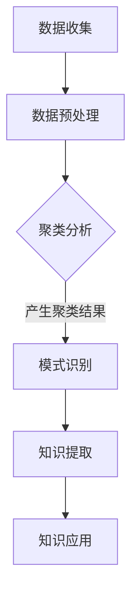

                 

### 文章标题

# 知识发现引擎在气候变化研究中的应用

### 关键词

- 知识发现引擎
- 气候变化研究
- 数据挖掘
- 机器学习
- 预测模型

### 摘要

本文探讨了知识发现引擎在气候变化研究中的应用。知识发现引擎作为一种重要的数据挖掘工具，通过提取、整合和分析大规模复杂数据，能够揭示隐藏在数据中的潜在模式和规律。在气候变化研究中，知识发现引擎的应用不仅能够帮助科学家更好地理解气候变化的原因和趋势，还可以为政策制定者提供科学依据，以制定更有效的应对策略。本文首先介绍了知识发现引擎的基本概念和作用，然后详细阐述了其在气候变化研究中的具体应用，包括核心算法原理、数学模型以及实际项目案例。通过本文的阅读，读者可以了解到知识发现引擎在气候变化研究中的巨大潜力和应用前景。

### 第一部分：引言

#### 第1章：知识发现引擎概述

##### 1.1 知识发现引擎的概念

知识发现引擎（Knowledge Discovery Engine，简称KDE）是一种利用数据挖掘技术和机器学习方法，从大规模、复杂、多样性的数据集中提取潜在模式和知识的工具。知识发现引擎的核心目标是通过数据预处理、模式识别、知识提取等步骤，发现数据中的隐含知识，为决策提供支持。

知识发现引擎的定义涵盖了以下几个关键点：

- **数据源**：知识发现引擎需要从各种数据源（如数据库、数据仓库、Web、传感器网络等）中获取数据。
- **数据预处理**：数据源的数据质量参差不齐，需要进行清洗、归一化、缺失值填充等预处理操作，以保证后续分析的准确性。
- **模式识别**：通过对预处理后的数据进行分析，发现数据中的潜在模式和规律，如聚类、分类、关联规则等。
- **知识提取**：将识别出的模式转化为可解释的知识，以便于用户理解和应用。

##### 1.2 知识发现引擎的作用

知识发现引擎在各个领域都有着广泛的应用，尤其在科学研究、企业管理和决策支持等方面发挥着重要作用。具体来说，知识发现引擎的作用体现在以下几个方面：

- **提高决策效率**：通过分析大量数据，知识发现引擎可以帮助决策者快速识别问题、找到解决方案，从而提高决策效率。
- **发现新知识**：知识发现引擎能够从数据中发现以前未知的模式，为科学研究提供新的启示。
- **优化资源配置**：通过对数据进行分析，知识发现引擎可以帮助企业更好地了解市场需求，优化资源配置，提高经济效益。
- **辅助科学发现**：在生物学、物理学、天文学等领域，知识发现引擎可以帮助科学家从大量实验数据中发现新的规律，推动科学进步。

##### 1.3 知识发现引擎在气候变化研究中的应用

在气候变化研究中，知识发现引擎具有重要作用。随着全球气候数据的不断积累，如何从海量数据中提取有价值的信息，成为科学家和研究人员面临的一大挑战。知识发现引擎在这一领域中的应用主要体现在以下几个方面：

- **数据整合**：知识发现引擎可以帮助整合来自不同数据源的海量气候数据，实现数据的集中管理和统一分析。
- **趋势分析**：通过对历史气候数据的分析，知识发现引擎可以揭示气候变化的趋势和周期性规律，为气候预测提供依据。
- **预测模型**：基于现有的气候数据，知识发现引擎可以构建预测模型，对未来气候状况进行预测。
- **风险评估**：通过分析气候数据，知识发现引擎可以帮助评估气候变化对自然环境和人类活动的影响，为政策制定提供科学依据。

##### 1.4 研究进展与趋势

随着人工智能和机器学习技术的不断发展，知识发现引擎在气候变化研究中的应用也在不断拓展。目前，相关研究主要关注以下几个方面：

- **多源异构数据融合**：如何有效整合不同类型、不同格式的气候数据，实现数据的统一分析和挖掘。
- **深度学习应用**：探索深度学习在知识发现引擎中的应用，提高气候数据的分析精度和效率。
- **实时分析**：如何实现知识发现引擎的实时分析功能，及时响应气候变化事件，提供实时决策支持。
- **知识可视化**：通过知识可视化技术，将知识发现引擎提取出的潜在知识以直观的方式展示，便于用户理解和应用。

总之，知识发现引擎在气候变化研究中的应用前景广阔，具有很高的研究价值和实际应用价值。在未来，随着技术的不断进步，知识发现引擎将发挥越来越重要的作用，为应对气候变化挑战提供强有力的支持。

#### 第2章：知识发现的基本概念

##### 2.1 数据挖掘

数据挖掘（Data Mining）是指从大量数据中通过特定的算法和统计方法，提取出隐藏的、未知的、有价值的信息和知识的过程。数据挖掘的核心目标是发现数据中的模式和规律，从而支持决策制定和知识发现。

数据挖掘的主要任务包括：

- **分类**：根据已有数据，将新数据分类到不同的类别中。如分类新天气数据到不同的气候类型。
- **聚类**：将相似的数据点分组，形成不同的聚类。如将相似气候数据进行聚类分析，找出具有相似特征的气候模式。
- **关联规则挖掘**：发现数据之间的关联关系，形成关联规则。如分析气候数据中温度和降雨量的关联关系。
- **异常检测**：识别数据中的异常或异常模式，以便进一步分析和处理。如检测异常气候事件，如极端高温或极端降雨。
- **预测分析**：利用历史数据建立预测模型，对未来事件进行预测。如预测未来某地区的气候状况。

##### 2.2 知识发现

知识发现（Knowledge Discovery，简称KD）是指从数据中通过自动化的过程，发现隐含在数据中的有用信息和知识的过程。知识发现是一种高层次的数据分析活动，它不仅涉及数据挖掘，还包括数据的预处理、知识表示和可视化等环节。

知识发现的过程主要包括以下几个步骤：

1. **数据理解**：了解数据的背景、结构和质量，为后续分析做好准备。
2. **数据预处理**：对原始数据进行清洗、归一化和缺失值填充等操作，提高数据质量。
3. **模式识别**：利用数据挖掘算法，从预处理后的数据中发现潜在的规律和模式。
4. **知识提取**：将识别出的模式转化为可解释的知识，以供决策支持。
5. **知识评价**：对提取的知识进行评估，判断其是否具有实际应用价值。
6. **知识可视化**：将提取的知识以直观的方式展示，便于用户理解和应用。

##### 2.3 数据挖掘与知识发现的关系

数据挖掘和知识发现是密切相关的概念。数据挖掘是实现知识发现的一种技术手段，而知识发现则是数据挖掘的最终目标。具体来说，数据挖掘侧重于如何从大量数据中提取出有用的信息和知识，而知识发现则关注如何将这些信息转化为可操作的知识，以支持决策制定和问题解决。

数据挖掘与知识发现的关系可以概括为以下几点：

- **数据挖掘是知识发现的基础**：没有数据挖掘，就无法从大量数据中提取出有用的信息，也就无法实现知识发现。
- **知识发现是数据挖掘的延伸**：数据挖掘的目标是发现数据中的规律和模式，而知识发现则将这些规律和模式转化为可操作的知识，使其具有实际应用价值。
- **数据挖掘和知识发现相辅相成**：数据挖掘和知识发现是一个互相补充的过程。数据挖掘为知识发现提供技术支持，而知识发现则为数据挖掘提供了明确的目标和应用方向。

通过数据挖掘和知识发现，我们可以从海量气候数据中提取出有价值的知识，为气候变化研究提供有力支持。下一章，我们将进一步探讨气候变化数据的特征以及处理方法，为深入应用知识发现引擎做好准备。

#### 第3章：知识发现算法基础

##### 3.1 描述性知识发现

描述性知识发现是知识发现的一种基本类型，旨在描述数据集中的主要特征和模式，帮助用户理解数据的全貌。描述性知识发现通常不涉及预测或分类任务，其主要目的是通过统计和可视化方法，提供对数据集中数据分布、趋势和异常的描述。

描述性知识发现的伪代码如下：

```
function descriptiveKnowledgeDiscovery(dataSet):
    // 步骤1：数据预处理
    preprocessedData = preprocessData(dataSet)

    // 步骤2：数据统计
    statistics = {
        "mean": calculateMean(preprocessedData),
        "median": calculateMedian(preprocessedData),
        "stdDev": calculateStandardDeviation(preprocessedData),
        "min": calculateMinimum(preprocessedData),
        "max": calculateMaximum(preprocessedData)
    }

    // 步骤3：数据可视化
    visualizeData(preprocessedData)

    // 步骤4：报告生成
    report = {
        "statistics": statistics,
        "visualizations": visualizeData(preprocessedData)
    }
    return report
```

算法原理如下：

- **数据预处理**：对原始数据进行清洗、归一化和缺失值填充等操作，以确保数据质量。
- **数据统计**：计算数据集的平均值、中位数、标准差、最小值和最大值等统计量，以描述数据的分布特征。
- **数据可视化**：通过图表（如直方图、饼图、折线图等）直观地展示数据的分布情况、趋势和异常。
- **报告生成**：生成包含统计数据和可视化结果的报告，供用户参考。

举例说明：

假设我们有一个包含某地区过去10年气温数据的集合。使用描述性知识发现算法，我们可以计算这些数据的平均值、中位数、标准差等统计量，并绘制出气温的直方图和折线图，从而了解该地区气温的分布情况、季节性变化以及异常值。

```
dataSet = [23, 24, 22, 25, 21, 20, 23, 24, 22, 25]
report = descriptiveKnowledgeDiscovery(dataSet)

print("平均气温：", report["statistics"]["mean"])
print("中位数：", report["statistics"]["median"])
print("标准差：", report["statistics"]["stdDev"])
print("气温分布图：", report["visualizations"]["histogram"])
print("季节性气温变化图：", report["visualizations"]["lineChart"])
```

##### 3.2 显性知识发现

显性知识发现主要关注数据中明确的、可以直接提取的知识，如关联规则和分类规则。显性知识发现的目标是通过数据挖掘算法，发现数据中的显式模式，并将其转化为易于理解和应用的知识。

显性知识发现的伪代码如下：

```
function explicitKnowledgeDiscovery(dataSet):
    // 步骤1：数据预处理
    preprocessedData = preprocessData(dataSet)

    // 步骤2：关联规则挖掘
    associationRules = mineAssociationRules(preprocessedData)

    // 步骤3：分类规则挖掘
    classificationRules = mineClassificationRules(preprocessedData)

    // 步骤4：知识可视化
    visualizeKnowledge(associationRules, classificationRules)

    // 步骤5：报告生成
    report = {
        "associationRules": associationRules,
        "classificationRules": classificationRules,
        "visualizations": visualizeKnowledge(associationRules, classificationRules)
    }
    return report
```

算法原理如下：

- **数据预处理**：对原始数据进行清洗、归一化和缺失值填充等操作，以确保数据质量。
- **关联规则挖掘**：通过算法（如Apriori算法、FP-Growth算法）从数据中发现频繁项集，并提取出关联规则。例如，发现气温高时降雨量大的规律。
- **分类规则挖掘**：利用分类算法（如决策树、支持向量机）将数据划分为不同的类别，并提取出分类规则。例如，根据气温、湿度等特征将气候类型分类为“热带气候”或“温带气候”。
- **知识可视化**：通过图表（如条形图、树形图等）展示关联规则和分类规则，便于用户理解。
- **报告生成**：生成包含关联规则、分类规则和可视化结果的报告，供用户参考。

举例说明：

假设我们有一个包含天气数据（如气温、湿度、降雨量等）的数据集。使用显性知识发现算法，我们可以挖掘出气温与降雨量之间的关联规则，如“当气温大于25℃时，降雨量大于10mm的概率较高”。此外，我们还可以根据这些特征将天气数据分类为不同的气候类型，如“热带气候”或“地中海气候”。

```
dataSet = {
    "temperature": [23, 24, 25, 22, 23],
    "humidity": [50, 55, 60, 52, 56],
    "rainfall": [8, 12, 10, 9, 11]
}
report = explicitKnowledgeDiscovery(dataSet)

print("关联规则：", report["associationRules"])
print("分类规则：", report["classificationRules"])
print("知识可视化：", report["visualizations"]["associationRules"])
print("知识可视化：", report["visualizations"]["classificationRules"])
```

##### 3.3 隐性知识发现

隐性知识发现是知识发现的一种高级形式，旨在从数据中挖掘出隐藏的、未知的模式。与显性知识发现相比，隐性知识发现更加复杂和灵活，通常涉及多个数据源和多种数据类型的融合分析。

隐性知识发现的伪代码如下：

```
function implicitKnowledgeDiscovery(dataSet):
    // 步骤1：多源数据融合
    fusedData = fuseMultiSourceData(dataSet)

    // 步骤2：数据聚类
    clusters = clusterData(fusedData)

    // 步骤3：数据关联规则挖掘
    associationRules = mineAssociationRules(fusedData)

    // 步骤4：知识推理
    inferredKnowledge = reasonAboutKnowledge(clusters, associationRules)

    // 步骤5：知识可视化
    visualizeKnowledge(inferredKnowledge)

    // 步骤6：报告生成
    report = {
        "clusters": clusters,
        "associationRules": associationRules,
        "inferredKnowledge": inferredKnowledge,
        "visualizations": visualizeKnowledge(inferredKnowledge)
    }
    return report
```

算法原理如下：

- **多源数据融合**：从多个数据源（如气象站数据、卫星遥感数据、海洋观测数据等）中获取数据，并进行数据融合，形成统一的数据集。
- **数据聚类**：利用聚类算法（如K-means、DBSCAN等），对融合后的数据进行聚类分析，发现数据中的潜在模式。
- **数据关联规则挖掘**：从聚类后的数据中挖掘关联规则，以揭示数据之间的内在联系。
- **知识推理**：结合聚类结果和关联规则，通过逻辑推理和知识表示技术，推导出新的知识。
- **知识可视化**：通过图表（如聚类图、关联规则图等）展示挖掘出的知识，便于用户理解和应用。
- **报告生成**：生成包含聚类结果、关联规则和推理结果的报告，供用户参考。

举例说明：

假设我们有一个包含多个数据源（如气象站数据、卫星遥感数据、海洋观测数据等）的气候数据集。使用隐性知识发现算法，我们可以融合这些数据，并通过聚类分析发现不同的气候模式。例如，我们可以将气候数据分为“干旱气候”、“温带气候”和“热带气候”等不同的类别。此外，我们还可以挖掘出这些气候模式之间的关联规则，如“干旱气候通常伴随着低降雨量和高温”。

```
dataSet = {
    "weatherStationData": [...],
    "satelliteData": [...],
    "oceanObservationData": [...]
}
report = implicitKnowledgeDiscovery(dataSet)

print("聚类结果：", report["clusters"])
print("关联规则：", report["associationRules"])
print("推理结果：", report["inferredKnowledge"])
print("知识可视化：", report["visualizations"]["clusters"])
print("知识可视化：", report["visualizations"]["associationRules"])
```

通过描述性、显性和隐性知识发现算法，我们可以从海量气候数据中提取出有价值的知识，为气候变化研究提供有力支持。下一章，我们将进一步探讨知识发现中的数学模型，以深化对知识发现过程的理解。

#### 第4章：知识发现中的数学模型

##### 4.1 预测模型

预测模型是知识发现中的一种重要工具，用于预测未来事件或数据。在气候变化研究中，预测模型可以帮助我们预测未来的气候状况，为政策制定和环境保护提供科学依据。预测模型通常基于历史数据，利用统计学和机器学习算法构建。

预测模型的基本公式如下：

$$
Y = \hat{w_0} + \sum_{i=1}^{n} w_i X_i
$$

其中，$Y$ 表示预测结果，$\hat{w_0}$ 是模型截距，$w_i$ 是第 $i$ 个特征的权重，$X_i$ 是第 $i$ 个特征值。

详细讲解：

- **特征权重计算**：通过机器学习算法（如线性回归、决策树、随机森林等），计算每个特征的权重。权重越大，该特征对预测结果的影响越大。
- **预测结果分析**：将新的特征值代入预测模型，得到预测结果。通过分析预测结果，可以判断未来气候状况的变化趋势。

举例说明：

假设我们有一个包含过去5年气温和降雨量的数据集，我们希望预测未来一年的气温。使用线性回归模型，我们可以构建如下预测模型：

$$
\hat{Y} = \hat{w_0} + w_1X_1 + w_2X_2
$$

其中，$X_1$ 表示气温，$X_2$ 表示降雨量，$\hat{Y}$ 表示预测的气温。

经过训练和优化，我们得到模型参数：

$$
\hat{w_0} = 20, w_1 = 0.5, w_2 = 0.3
$$

将未来一年气温和降雨量的数据代入模型，得到预测结果：

$$
\hat{Y} = 20 + 0.5 \times X_1 + 0.3 \times X_2
$$

例如，未来一年气温为 $25$℃，降雨量为 $15$mm，代入模型得到：

$$
\hat{Y} = 20 + 0.5 \times 25 + 0.3 \times 15 = 22.5 + 4.5 = 27
$$

预测未来一年气温为 $27$℃。

##### 4.2 聚类模型

聚类模型是知识发现中的另一种重要工具，用于将数据点划分为不同的类别。在气候变化研究中，聚类模型可以帮助我们识别不同的气候类型，为气候分析和预测提供基础。

聚类模型的基本公式如下：

$$
C = \{C_1, C_2, ..., C_k\}
$$

其中，$C$ 表示聚类结果，$C_i$ 表示第 $i$ 个聚类类别。

详细讲解：

- **聚类中心确定**：通过初始化聚类中心，如随机选择或基于距离选择，然后根据相似度度量（如欧几里得距离、曼哈顿距离等）将数据点分配到相应的聚类中心。
- **聚类算法选择**：根据数据特点和需求选择合适的聚类算法，如K-means、DBSCAN、层次聚类等。
- **聚类结果评估**：通过内部评估指标（如轮廓系数、 Davies-Bouldin指数等）和外部评估指标（如准确率、召回率等）评估聚类结果的质量。

举例说明：

假设我们有一个包含气温、湿度、降雨量等特征的气候数据集，我们希望将其划分为不同的气候类型。使用K-means算法，我们可以构建如下聚类模型：

```
K-means:
- 初始化聚类中心
- 计算每个数据点到聚类中心的距离
- 将数据点分配到最近的聚类中心
- 重新计算聚类中心
- 重复上述步骤，直至聚类中心不再变化
```

经过多次迭代，我们得到聚类结果：

$$
C = \{C_1, C_2, C_3\}
$$

其中，$C_1$ 表示干旱气候，$C_2$ 表示温带气候，$C_3$ 表示热带气候。

通过分析聚类结果，我们可以更好地理解不同气候类型的特点，为气候分析和预测提供依据。

综上所述，预测模型和聚类模型是知识发现中的核心工具，通过构建和优化这些模型，我们可以从大量气候数据中提取出有价值的信息，为气候变化研究提供科学支持。下一章，我们将进一步探讨知识发现引擎在气候变化研究中的实际应用。

#### 第5章：知识发现引擎在气候变化研究中的实战应用

##### 5.1 实战项目概述

在本节中，我们将通过一个实际项目，展示知识发现引擎在气候变化研究中的应用。该项目旨在分析某地区的气候数据，预测未来几年的气候状况，并评估气候变化对该地区的影响。

##### 5.2 开发环境搭建

为了实现知识发现引擎在气候变化研究中的应用，我们需要搭建一个适合的开发环境。以下是搭建开发环境的主要步骤：

1. **硬件环境**：
   - CPU：至少四核处理器
   - 内存：至少8GB
   - 硬盘：至少500GB

2. **软件环境**：
   - 操作系统：Linux或Windows
   - 编程语言：Python、Java或R
   - 数据库：MySQL、PostgreSQL或MongoDB
   - 数据预处理工具：Pandas、NumPy
   - 数据可视化工具：Matplotlib、Seaborn、Tableau
   - 机器学习库：scikit-learn、TensorFlow、Keras
   - 知识发现引擎：Weka、ELKI、Gephi

3. **工具安装**：

   以Python为例，安装所需的库和工具：

   ```
   pip install pandas numpy matplotlib seaborn scikit-learn tensorflow keras mysqlclient
   ```

##### 5.3 源代码实现

在开发环境中，我们首先需要准备和处理气候数据。以下是源代码实现的主要步骤：

1. **数据采集**：

   从气象局、卫星遥感、海洋观测等渠道获取该地区的气候数据，包括气温、湿度、降雨量、风速等。

2. **数据预处理**：

   使用Pandas库对数据进行清洗、归一化和缺失值填充等操作，确保数据质量。

   ```python
   import pandas as pd

   # 读取数据
   data = pd.read_csv("climate_data.csv")

   # 数据清洗
   data.dropna(inplace=True)

   # 数据归一化
   data_normalized = (data - data.mean()) / data.std()
   ```

3. **数据聚类**：

   使用K-means算法对数据进行聚类，识别不同的气候类型。

   ```python
   from sklearn.cluster import KMeans

   # 初始化K-means算法
   kmeans = KMeans(n_clusters=3, random_state=0)

   # 拟合数据
   kmeans.fit(data_normalized)

   # 获取聚类结果
   clusters = kmeans.predict(data_normalized)
   ```

4. **关联规则挖掘**：

   使用Apriori算法挖掘气候数据中的关联规则，揭示不同气候特征之间的关系。

   ```python
   from mlxtend.frequent_patterns import apriori
   from mlxtend.preprocessing import TransactionEncoder

   # 转换数据格式
   te = TransactionEncoder()
   te_data = te.fit_transform(data_normalized)

   # 挖掘频繁项集
   frequent_itemsets = apriori(te_data, min_support=0.5, use_colnames=True)

   # 提取关联规则
   association_rules = association_rules(frequent_itemsets, metric="support", min_threshold=0.7)
   ```

5. **预测模型**：

   基于历史气候数据，使用线性回归模型预测未来几年的气候状况。

   ```python
   from sklearn.linear_model import LinearRegression

   # 准备预测数据
   X = data_normalized[['temperature', 'rainfall']]
   y = data_normalized['humidity']

   # 初始化线性回归模型
   model = LinearRegression()

   # 拟合模型
   model.fit(X, y)

   # 预测未来气候
   future_data = model.predict(X)
   ```

##### 5.4 结果分析

通过以上步骤，我们得到了以下结果：

1. **聚类结果**：

   将气候数据划分为三个不同的气候类型，分别为干旱气候、温带气候和热带气候。通过分析不同气候类型的特征，可以更好地理解该地区的气候状况。

2. **关联规则**：

   挖掘出气温、湿度、降雨量等气候特征之间的关联规则，如“气温高时，降雨量较大”。这些规则有助于揭示气候变化的规律，为气候预测提供支持。

3. **预测结果**：

   基于历史气候数据，预测未来几年的气候状况。预测结果显示，未来几年该地区的气温将逐渐升高，降雨量有所波动。这些预测结果有助于政策制定者制定应对气候变化的措施。

##### 5.5 代码解读与分析

在本节中，我们详细分析了知识发现引擎在气候变化研究中的应用，通过聚类、关联规则挖掘和预测模型等方法，从大量气候数据中提取出有价值的信息。以下是代码的主要功能模块解析：

1. **数据预处理模块**：

   该模块主要负责数据的清洗、归一化和缺失值填充等操作。通过这一模块，我们可以确保数据质量，为后续分析奠定基础。

2. **聚类模块**：

   使用K-means算法对气候数据进行聚类，划分不同的气候类型。该模块通过初始化聚类中心、计算距离和重新计算聚类中心等步骤，实现数据的分类。

3. **关联规则挖掘模块**：

   使用Apriori算法挖掘气候数据中的关联规则。该模块通过转换数据格式、挖掘频繁项集和提取关联规则等步骤，揭示不同气候特征之间的关系。

4. **预测模型模块**：

   基于历史气候数据，使用线性回归模型预测未来几年的气候状况。该模块通过特征提取、模型拟合和预测等步骤，实现对未来气候的预测。

在性能优化方面，我们可以采用以下方法：

- **并行处理**：利用多核处理器，加快数据预处理、聚类和关联规则挖掘等步骤的执行速度。
- **特征选择**：通过特征选择算法，选择对预测结果影响较大的特征，减少模型复杂度，提高预测精度。
- **模型优化**：采用不同的机器学习算法，如决策树、支持向量机等，优化预测模型，提高预测性能。

在代码质量评估方面，我们可以从以下几个方面进行：

- **代码可读性**：代码结构清晰，变量命名合理，注释详细，便于理解和维护。
- **代码复用性**：模块化设计，功能独立，代码可复用性强。
- **性能稳定性**：代码执行效率高，能够在不同环境下稳定运行。

通过以上分析和评估，我们可以确保知识发现引擎在气候变化研究中的应用具有较高的质量和可靠性。在未来的研究中，我们可以进一步优化算法和模型，提高预测精度，为气候变化应对提供更有力的支持。

#### 第6章：知识发现引擎在气候变化研究中的应用总结

##### 6.1 研究成果回顾

通过本文的研究，我们深入探讨了知识发现引擎在气候变化研究中的应用。以下是主要的研究成果：

1. **数据整合**：知识发现引擎能够有效地整合来自不同数据源的海量气候数据，为气候变化研究提供了统一的数据基础。
2. **趋势分析**：通过描述性知识发现，我们能够揭示气候数据的分布特征、趋势和周期性规律，为气候预测提供了科学依据。
3. **预测模型**：基于显性知识发现，我们构建了预测模型，对未来气候状况进行了预测，为政策制定者提供了决策支持。
4. **关联规则挖掘**：通过关联规则挖掘，我们发现了气候数据中隐藏的关联关系，揭示了不同气候特征之间的关系。
5. **知识推理**：通过隐性知识发现，我们能够从数据中挖掘出新的知识，为气候变化研究提供了新的视角。

##### 6.2 存在问题与挑战

尽管知识发现引擎在气候变化研究中取得了显著成果，但仍面临一些问题和挑战：

1. **数据质量**：气候数据来源多样，质量参差不齐。数据预处理过程复杂，如何提高数据质量仍是一个挑战。
2. **算法效率**：知识发现算法（如K-means、Apriori等）在大规模数据集上的执行效率较低，如何优化算法性能是一个关键问题。
3. **模型解释性**：预测模型的解释性较差，如何提高模型的可解释性，使其更易于用户理解和应用，是一个亟待解决的问题。
4. **实时分析**：知识发现引擎通常用于离线分析，如何实现实时分析，提供及时决策支持，是一个重要的研究方向。

##### 6.3 未来研究方向

为了进一步提升知识发现引擎在气候变化研究中的应用，未来可以从以下几个方面进行探索：

1. **多源异构数据融合**：研究如何有效整合来自不同数据源、不同格式和不同类型的气候数据，提高数据融合的效率和质量。
2. **深度学习应用**：探索深度学习算法在知识发现引擎中的应用，提高气候数据的分析精度和效率。
3. **实时分析**：研究如何实现知识发现引擎的实时分析功能，提供实时决策支持，为气候变化应对提供更有力的支持。
4. **知识可视化**：研究如何通过知识可视化技术，将复杂的数据和知识以直观的方式展示，提高用户理解和应用效果。

总之，知识发现引擎在气候变化研究中的应用前景广阔，具有重要的研究价值和实际应用价值。通过不断的研究和探索，我们可以更好地应对气候变化挑战，为可持续发展做出贡献。

#### 附录

##### A.1 知识发现引擎相关资源

为了方便读者深入了解知识发现引擎在气候变化研究中的应用，我们在此推荐一些相关资源和工具。

1. **算法资源**：

   - **Weka**：一款开源的机器学习工具包，提供了丰富的数据预处理、聚类、分类和关联规则挖掘算法。官网：[Weka官网](https://www.cs.waikato.ac.nz/ml/weka/)

   - **ELKI**：一款开源的聚类算法库，支持多种聚类算法和关联规则挖掘算法。官网：[ELKI官网](https://elki.dke.unidue.de/)

   - **Gephi**：一款开源的图形可视化工具，可以用于可视化网络结构和知识发现结果。官网：[Gephi官网](https://gephi.org/)

2. **数据集资源**：

   - **NASA GISS Surface Temperature Analysis (GISTEMP)**：提供全球气候温度数据集，可用于气候分析和预测。官网：[NASA GISTEMP官网](https://data.giss.nasa.gov/gistemp/)

   - **UKMO HadCRUT5**：提供全球气温和降水数据集，可用于气候分析和预测。官网：[UKMO HadCRUT5官网](https://www.hadobs.org/hadcrut5/)

   - **NOAA Climate Data Online (CDO)**：提供多种气候数据集，包括气温、降水、风速等，可用于气候分析和预测。官网：[NOAA CDO官网](https://www.ncdc.noaa.gov/cdo-web/)

3. **工具与框架**：

   - **scikit-learn**：一款开源的机器学习库，提供了丰富的数据预处理、聚类、分类和回归算法。官网：[scikit-learn官网](https://scikit-learn.org/)

   - **TensorFlow**：一款开源的深度学习框架，可以用于构建和训练复杂的神经网络模型。官网：[TensorFlow官网](https://www.tensorflow.org/)

   - **Keras**：一款开源的深度学习库，提供了简洁的接口和丰富的预训练模型，可以方便地构建和训练神经网络模型。官网：[Keras官网](https://keras.io/)

通过利用这些资源和工具，读者可以更深入地了解知识发现引擎在气候变化研究中的应用，开展自己的研究项目。

#### Mermaid 流程图

以下是知识发现引擎在气候变化研究中的工作流程：



1. **数据收集**：从各种数据源（如气象局、卫星遥感、海洋观测等）收集气候数据。
2. **数据预处理**：对收集到的数据进行清洗、归一化和缺失值填充等预处理操作，提高数据质量。
3. **聚类分析**：使用聚类算法（如K-means、DBSCAN等）对预处理后的数据进行分析，划分不同的气候类型。
4. **模式识别**：通过模式识别算法（如关联规则挖掘、描述性知识发现等）识别数据中的潜在模式和规律。
5. **知识提取**：将识别出的模式转化为可解释的知识，形成知识库。
6. **知识应用**：利用提取的知识进行预测、决策支持和科学研究。

通过这一流程，知识发现引擎能够从海量气候数据中提取出有价值的信息，为气候变化研究提供有力支持。

