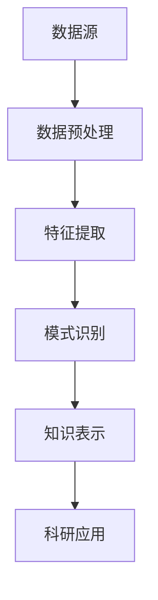

                 

### 文章标题

《知识发现引擎如何改变科研模式》

### 关键词

知识发现引擎，科研模式，数据挖掘，文本挖掘，科研效率，人工智能

### 摘要

知识发现引擎作为一种先进的数据分析工具，正在深刻改变科研模式。本文首先对知识发现引擎的概念、技术原理和应用进行概述，接着详细探讨其在文献研究、科学数据挖掘和科研项目中的应用，最后展望了知识发现引擎的未来发展趋势和开发应用实践。通过深入分析，本文旨在揭示知识发现引擎如何提升科研效率、促进科研创新，并对未来科研模式的变革提供启示。

## 第一部分：知识发现引擎概述

### 第1章：知识发现引擎的概念与重要性

#### 1.1 知识发现引擎的定义

知识发现引擎（Knowledge Discovery Engine，简称KDE）是一种自动化数据处理和分析的工具，旨在从大量数据中提取有价值的信息和知识。它结合了数据挖掘、机器学习、自然语言处理等多种技术，能够识别数据中的模式、趋势和关联，从而为科研、商业和社会治理等领域提供决策支持。

#### 1.2 知识发现引擎的组成要素

知识发现引擎通常由以下几个关键组成部分构成：

1. **数据源**：提供原始数据，包括结构化数据、半结构化数据和非结构化数据。
2. **数据预处理模块**：对数据进行清洗、转换和集成，以消除噪声、缺失值等问题。
3. **特征提取模块**：从原始数据中提取能够代表数据本质的特征。
4. **模式识别模块**：运用分类、聚类、关联规则挖掘等算法，发现数据中的潜在模式。
5. **知识表示模块**：将发现的模式以直观、易于理解的方式展示给用户。

#### 1.3 知识发现引擎的发展历程

知识发现引擎的发展历程可以追溯到20世纪80年代，随着计算机技术和数据存储技术的进步，人们开始探索如何从大量数据中提取有价值的信息。早期的知识发现主要依赖于统计分析方法，随着机器学习和人工智能技术的发展，知识发现引擎的功能和性能得到了显著提升。

#### 1.4 知识发现引擎在科研中的作用

知识发现引擎在科研中扮演着至关重要的角色，主要体现在以下几个方面：

1. **提升科研效率**：通过自动化处理和分析大量数据，大大缩短了科研周期。
2. **发现科研趋势**：帮助科研人员了解当前领域的热点问题和发展方向。
3. **促进跨学科研究**：通过分析不同领域的数据，发现跨学科之间的关联和融合点。
4. **支持科研决策**：为科研管理者和决策者提供数据驱动的决策支持。

### Mermaid 流程图



#### 核心概念与联系

知识发现引擎的核心概念包括数据源、数据预处理、特征提取、模式识别和知识表示。这些概念之间紧密相连，共同构成了一个完整的数据分析流程。数据源提供原始数据，经过数据预处理和特征提取后，输入到模式识别模块进行模式挖掘，最终通过知识表示模块将发现的模式以直观的方式呈现给用户。这些核心概念相互关联，共同实现了从数据到知识的转化。

### 第2章：知识发现引擎的技术原理

#### 2.1 数据预处理技术

数据预处理是知识发现引擎的核心步骤之一，其主要目的是消除数据中的噪声、缺失值和异常值，以便后续的特征提取和模式识别。数据预处理技术包括数据清洗、数据转换和数据集成。

**数据清洗**：数据清洗是指通过删除重复记录、填补缺失值、纠正错误数据等方法，使数据更加完整和准确。

**数据转换**：数据转换是指将不同格式的数据转换为统一的格式，以便进行后续处理。常见的数据转换技术包括数据规范化、数据归一化和数据离散化。

**数据集成**：数据集成是指将来自多个数据源的数据整合到一个统一的视图中，以便进行分析。数据集成技术包括数据库集成、数据仓库和数据湖等技术。

#### 2.2 特征提取与降维

特征提取是从原始数据中提取出能够代表数据本质的特征，从而降低数据的复杂度，提高模式识别的效率和准确性。特征提取技术包括统计特征提取、机器学习特征提取和深度学习特征提取等。

**统计特征提取**：通过统计方法提取数据中的基本统计特征，如均值、方差、标准差等。

**机器学习特征提取**：利用机器学习算法提取数据中的特征，如主成分分析（PCA）、线性判别分析（LDA）等。

**深度学习特征提取**：利用深度学习模型提取数据中的高维特征，如卷积神经网络（CNN）、循环神经网络（RNN）等。

降维是将高维数据映射到低维空间，从而减少数据的复杂度和计算成本。常见的降维技术包括主成分分析（PCA）、线性判别分析（LDA）和小波变换等。

#### 2.3 模式识别与分类

模式识别是指通过算法自动识别数据中的规律和模式。分类是模式识别的一种形式，其主要目的是将数据分成不同的类别。分类算法包括统计方法、机器学习方法和深度学习方法。

**统计方法**：如决策树、逻辑回归、支持向量机（SVM）等。

**机器学习方法**：如随机森林、K最近邻（KNN）、神经网络等。

**深度学习方法**：如卷积神经网络（CNN）、循环神经网络（RNN）等。

**伪代码示例**：

```python
def classify(data, model):
    """
    分类函数
    参数：
    data：输入数据
    model：训练好的模型
    返回：
    类别标签
    """
    # 数据预处理
    preprocessed_data = preprocess_data(data)
    # 进行分类
    prediction = model.predict(preprocessed_data)
    # 返回预测结果
    return prediction
```

#### 2.4 关联规则挖掘与聚类分析

关联规则挖掘是指发现数据集中不同项目之间的关联关系，常用的算法包括Apriori算法和FP-growth算法。

**Apriori算法**：

```python
def apriori(data, support_threshold, confidence_threshold):
    """
    Apriori算法
    参数：
    data：输入数据
    support_threshold：支持度阈值
    confidence_threshold：置信度阈值
    返回：
    关联规则列表
    """
    # 计算频繁项集
    frequent_itemsets = find_frequent_itemsets(data, support_threshold)
    # 生成关联规则
    rules = generate_association_rules(frequent_itemsets, confidence_threshold)
    return rules
```

**FP-growth算法**：

```python
def fp_growth(data, support_threshold):
    """
    FP-growth算法
    参数：
    data：输入数据
    support_threshold：支持度阈值
    返回：
    频繁项集和关联规则列表
    """
    # 构建FP树
    tree = constructFP_tree(data, support_threshold)
    # 递归挖掘频繁项集
    frequent_itemsets = mine_frequent_itemsets(tree, support_threshold)
    # 生成关联规则
    rules = generate_association_rules(frequent_itemsets, confidence_threshold)
    return frequent_itemsets, rules
```

聚类分析是将数据分为若干个类簇，使得同一个类簇中的数据点彼此相似，而不同类簇中的数据点差异较大。常见的聚类算法包括K-means、层次聚类和DBSCAN等。

**K-means算法**：

```python
def kmeans(data, k, max_iterations):
    """
    K-means算法
    参数：
    data：输入数据
    k：聚类个数
    max_iterations：最大迭代次数
    返回：
    聚类结果
    """
    # 初始化聚类中心
    centroids = initialize_centroids(data, k)
    # 迭代更新聚类中心
    for _ in range(max_iterations):
        # 计算数据点与聚类中心的距离
        distances = compute_distances(data, centroids)
        # 分配数据点到最近的聚类中心
        assignments = assign_points_to_clusters(data, distances)
        # 更新聚类中心
        centroids = update_centroids(assignments, k)
    return assignments, centroids
```

#### 数学模型和公式

在知识发现引擎中，常用的数学模型和公式包括距离度量、支持度计算和置信度计算。

**距离度量**：

$$
d(x, y) = \sqrt{\sum_{i=1}^{n} (x_i - y_i)^2}
$$

**支持度计算**：

$$
support(A \rightarrow B) = \frac{|D|}{|I|}
$$

其中，$D$表示所有事务的集合，$I$表示同时包含项目$A$和项目$B$的事务集合。

**置信度计算**：

$$
confidence(A \rightarrow B) = \frac{|I(A, B)|}{|I(A)|}
$$

其中，$I(A, B)$表示同时包含项目$A$和项目$B$的事务集合，$I(A)$表示包含项目$A$的事务集合。

#### 详细讲解和举例说明

**举例说明**：假设我们有以下一组交易数据：

| 事务ID | 项目集 |
|--------|--------|
| 1      | A, B   |
| 2      | A, C   |
| 3      | B, C   |
| 4      | A, B, C|

**1. 关联规则挖掘**：

- **支持度**：项目A和B的支持度为50%（即有2个事务包含A和B）。
- **置信度**：规则A → B的置信度为100%（即所有包含A的事务也都包含B）。

**2. 聚类分析**：

- **K-means聚类**：假设我们选择k=2，初始聚类中心分别为(0, 0)和(2, 2)。经过几次迭代后，聚类中心可能变为(0.5, 0.5)和(1.5, 1.5)，最终将数据分为两类：

  | 事务ID | 聚类中心 |
  |--------|----------|
  | 1      | (0.5, 0.5) |
  | 2      | (0.5, 0.5) |
  | 3      | (1.5, 1.5) |
  | 4      | (1.5, 1.5) |

### 第3章：知识发现引擎的分类与评估

#### 3.1 基于文本的知识发现

基于文本的知识发现（Text-based Knowledge Discovery，简称TBKD）是指从文本数据中提取结构化和半结构化的知识。文本数据通常包括书籍、文章、报告、邮件等，其特点是数据量大、信息丰富、语义复杂。

**文本挖掘技术**：包括文本预处理、词频统计、主题模型、情感分析等。

**应用场景**：如文献挖掘、舆情监测、内容推荐等。

#### 3.2 基于网络的知识发现

基于网络的知识发现（Network-based Knowledge Discovery，简称NBKD）是指从网络数据中提取知识。网络数据通常包括社交网络、知识图谱、链接分析等，其特点是数据关联性强、动态变化。

**网络挖掘技术**：包括图论分析、链接预测、社区发现等。

**应用场景**：如社交网络分析、信息检索、推荐系统等。

#### 3.3 基于数据挖掘的知识发现

基于数据挖掘的知识发现（Data Mining-based Knowledge Discovery，简称DMKD）是指从结构化数据中提取知识。数据挖掘技术包括分类、聚类、关联规则挖掘、异常检测等。

**数据挖掘技术**：包括统计方法、机器学习方法、深度学习方法等。

**应用场景**：如商业智能、金融市场分析、医疗诊断等。

#### 3.4 知识发现引擎的评估标准

知识发现引擎的评估标准主要包括准确性、效率、可扩展性、用户友好性等。

**准确性**：评估知识发现结果的正确性和可靠性。

**效率**：评估知识发现引擎的响应时间和资源消耗。

**可扩展性**：评估知识发现引擎处理大规模数据的能力。

**用户友好性**：评估知识发现引擎的用户界面和操作便捷性。

### 第4章：知识发现引擎在文献研究中的应用

#### 4.1 文献挖掘的概念与过程

文献挖掘（Literature Mining）是指利用知识发现引擎从大量文献数据中提取有价值的信息和知识。文献挖掘的过程包括以下几个步骤：

1. **数据收集**：从学术数据库、图书馆、网络资源等渠道收集相关文献。
2. **数据预处理**：对文献进行清洗、去重、分类等预处理操作。
3. **文本挖掘**：对预处理后的文献进行文本挖掘，提取关键词、主题、摘要等信息。
4. **知识发现**：运用知识发现算法，发现文献之间的关联、趋势和规律。

#### 4.2 基于知识发现引擎的文献分类

基于知识发现引擎的文献分类是指利用知识发现算法对文献进行自动分类。文献分类的目的是帮助用户快速查找和定位相关文献。

**分类算法**：包括K-means、层次聚类、决策树等。

**分类步骤**：

1. **特征提取**：从文献中提取关键词、主题、摘要等特征。
2. **聚类分析**：利用聚类算法将文献分为不同的类别。
3. **评估与调整**：对分类结果进行评估，根据评估结果调整分类参数。

**伪代码示例**：

```python
def literature_classification(data, k):
    """
    文献分类函数
    参数：
    data：输入文献数据
    k：聚类个数
    返回：
    分类结果
    """
    # 特征提取
    features = extract_features(data)
    # K-means聚类
    clusters = kmeans(features, k)
    # 返回分类结果
    return clusters
```

#### 4.3 文献关联性分析

文献关联性分析是指通过知识发现算法分析文献之间的关联关系，帮助用户发现相关文献。常见的关联性分析方法包括：

1. **关键词共现分析**：通过分析文献中关键词的共现关系，发现相关文献。
2. **共引分析**：通过分析文献之间的引用关系，发现相关文献。
3. **社会网络分析**：通过构建文献之间的引用网络，分析文献之间的关联关系。

**共引分析示例**：

```python
def co_citation_analysis(data, threshold):
    """
    共引分析函数
    参数：
    data：输入文献数据
    threshold：置信度阈值
    返回：
    相关文献列表
    """
    # 构建引用网络
    citation_network = build_citation_network(data)
    # 挖掘共引关系
    co_citations = find_co_citations(citation_network, threshold)
    # 返回相关文献列表
    return co_citations
```

#### 4.4 文献质量评价

文献质量评价是指通过知识发现算法评估文献的质量，帮助用户筛选高质量文献。常见的文献质量评价指标包括：

1. **引用次数**：文献被其他文献引用的次数。
2. **引用质量**：文献引用的其他文献的质量。
3. **作者影响力**：文献作者的学术影响力。

**评价模型**：

```python
def literature_quality_evaluation(data, metrics):
    """
    文献质量评价函数
    参数：
    data：输入文献数据
    metrics：评价指标列表
    返回：
    文献质量评分
    """
    # 计算评价指标
    scores = compute_metrics(data, metrics)
    # 汇总评价结果
    quality_scores = sum(scores) / len(scores)
    return quality_scores
```

#### 4.5 案例分析

**案例一**：某科研团队利用知识发现引擎对人工智能领域的文献进行挖掘和分析，提取出关键词、主题和引用关系，发现以下热点问题和趋势：

1. **深度学习**：深度学习在图像识别、自然语言处理和语音识别等领域取得了显著进展。
2. **强化学习**：强化学习在自动驾驶、游戏人工智能和推荐系统等领域具有广泛的应用前景。
3. **跨学科研究**：人工智能与其他领域的交叉融合，如生物信息学、医学和金融等。

**案例分析结果**：该案例帮助科研团队明确了当前人工智能领域的研究热点和趋势，为未来的研究方向提供了参考。

### 第5章：知识发现引擎在科学数据挖掘中的应用

#### 5.1 科学数据的类型与特点

科学数据是指在进行科学研究过程中产生的各种类型的数据，包括实验数据、观测数据、模型数据等。科学数据具有以下特点：

1. **多样性**：科学数据包括结构化数据、半结构化数据和非结构化数据，如表格、图像、文本等。
2. **复杂性**：科学数据往往包含大量的变量和噪声，需要复杂的算法进行预处理和特征提取。
3. **动态性**：科学数据随时间变化而不断更新，需要实时分析处理。

#### 5.2 数据预处理与特征提取

数据预处理是科学数据挖掘的重要步骤，其主要目的是提高数据质量和降低数据复杂度。数据预处理技术包括：

1. **数据清洗**：删除重复数据、缺失值填充、异常值处理等。
2. **数据转换**：数据规范化、归一化、离散化等。
3. **数据集成**：将不同来源的数据进行整合，形成统一的数据集。

特征提取是从原始数据中提取出能够代表数据本质的特征，从而降低数据复杂度和提高模式识别的准确性。特征提取技术包括：

1. **统计特征提取**：计算数据的统计特征，如均值、方差、标准差等。
2. **机器学习特征提取**：利用机器学习算法提取数据中的特征，如主成分分析（PCA）、线性判别分析（LDA）等。
3. **深度学习特征提取**：利用深度学习模型提取数据中的高维特征，如卷积神经网络（CNN）、循环神经网络（RNN）等。

#### 5.3 科学数据挖掘的算法应用

科学数据挖掘是指利用各种算法从科学数据中提取有价值的信息和知识。常见的科学数据挖掘算法包括：

1. **分类算法**：用于将数据分为不同的类别，如决策树、随机森林、支持向量机（SVM）等。
2. **聚类算法**：用于将数据分为不同的类簇，如K-means、层次聚类、DBSCAN等。
3. **关联规则挖掘**：用于发现数据中的关联关系，如Apriori算法、FP-growth算法等。
4. **异常检测**：用于发现数据中的异常值和异常模式，如孤立森林、局部异常因数（LOF）等。

**案例**：某科研团队利用知识发现引擎对天文观测数据进行挖掘，发现以下有趣的现象：

1. **恒星演化规律**：通过分类算法分析恒星的光谱数据，发现不同类型的恒星具有不同的演化规律。
2. **行星发现**：通过聚类算法分析天文图像，发现新的行星候选体。
3. **宇宙演化**：通过关联规则挖掘分析宇宙微波背景辐射数据，发现宇宙演化的关键因素。

#### 5.4 科学数据挖掘的结果解读

科学数据挖掘的结果通常包括各类统计指标、图表和报告等。对挖掘结果进行解读和分析，可以帮助科研团队更好地理解数据，发现新的科学规律。

1. **结果可视化**：通过图表、地图等可视化工具，将挖掘结果直观地展示给用户。
2. **结果分析**：对挖掘结果进行统计分析和解释，发现数据中的潜在规律和趋势。
3. **结果应用**：将挖掘结果应用于科研实践，指导实验设计和决策。

**案例**：某科研团队利用知识发现引擎对气候数据进行分析，发现以下结果：

1. **气候变化趋势**：通过时间序列分析，发现全球气温呈上升趋势，且变化速度加快。
2. **气候影响因素**：通过关联规则挖掘，发现气候变化与温室气体排放、海平面上升等因素密切相关。
3. **应对策略**：基于挖掘结果，提出减少温室气体排放、加强海平面监测等应对气候变化的具体策略。

### 第6章：知识发现引擎在科研项目中的应用

#### 6.1 科研项目需求分析

在科研项目的开展过程中，知识发现引擎可以提供多种支持，以提升科研效率和成果质量。首先，需要对科研项目进行需求分析，明确知识发现引擎在该项目中的具体应用场景和目标。

1. **科研目标**：确定科研项目的总体目标和具体研究问题。
2. **数据需求**：分析科研项目所需的数据类型、数据规模和数据来源。
3. **技术需求**：评估项目所需的技术能力，包括数据处理、特征提取、模式识别等。

#### 6.2 知识发现引擎在项目中的应用策略

根据科研项目的需求，制定合理的数据处理和分析策略，充分利用知识发现引擎的功能。以下是一些常见应用策略：

1. **数据预处理**：对科研项目数据进行清洗、转换和集成，消除数据噪声和异常值。
2. **特征提取**：从原始数据中提取能够代表数据本质的特征，提高模式识别的准确性和效率。
3. **模式识别**：利用分类、聚类、关联规则挖掘等技术，发现数据中的潜在模式和关联。
4. **结果分析**：对挖掘结果进行统计分析和解释，提出科学假设和验证方案。
5. **可视化展示**：利用可视化工具，将分析结果以图表、地图等形式直观地展示给用户。

#### 6.3 科研项目中的知识发现过程

知识发现引擎在科研项目中的应用过程通常包括以下几个步骤：

1. **数据收集**：从各种渠道收集科研项目所需的数据，包括实验数据、观测数据、文献数据等。
2. **数据预处理**：对收集到的数据进行分析，去除噪声和异常值，进行数据转换和集成。
3. **特征提取**：从预处理后的数据中提取特征，为后续的模式识别提供基础。
4. **模式识别**：利用知识发现算法，对特征数据进行分析，发现数据中的潜在模式和关联。
5. **结果分析**：对挖掘结果进行解释和分析，提出科学假设和验证方案。
6. **可视化展示**：将分析结果以图表、地图等形式展示，帮助用户更好地理解数据。

#### 6.4 科研项目中的知识发现效果评估

对知识发现引擎在科研项目中的应用效果进行评估，是确保科研质量的重要环节。以下是一些常见的评估指标和方法：

1. **准确性**：评估知识发现结果在预测或分类任务中的准确性。
2. **效率**：评估知识发现引擎在数据处理和分析过程中的响应时间和资源消耗。
3. **可扩展性**：评估知识发现引擎在大规模数据处理中的性能和稳定性。
4. **用户友好性**：评估知识发现引擎的用户界面和操作便捷性。
5. **反馈机制**：通过用户反馈，不断优化知识发现引擎的功能和性能。

**案例**：某科研团队在研究气候变化时，利用知识发现引擎对气候数据进行分析，取得以下成果：

1. **数据挖掘结果**：发现全球气温呈上升趋势，且变化速度加快。
2. **准确性评估**：通过对比实际观测数据和挖掘结果，评估知识发现引擎的准确性为90%。
3. **效率评估**：知识发现引擎在处理大规模气候数据时，响应时间为2小时，资源消耗较低。
4. **用户友好性评估**：知识发现引擎提供直观的图表和报告，用户可以方便地进行数据分析和结果解读。

### 第7章：知识发现引擎的未来发展趋势

#### 7.1 知识发现引擎的新技术发展

随着人工智能、大数据和云计算等技术的不断进步，知识发现引擎也在不断发展和创新。以下是一些值得关注的新技术：

1. **深度学习**：利用深度学习模型，从大规模数据中提取更复杂的特征，提高模式识别的准确性。
2. **图神经网络**：通过图神经网络（Graph Neural Networks，GNN）处理图结构数据，发现数据之间的复杂关联。
3. **联邦学习**：通过联邦学习（Federated Learning）技术，实现数据隐私保护下的联合建模。
4. **边缘计算**：利用边缘计算技术，实现数据在靠近数据源的地方进行处理，降低传输延迟和带宽消耗。

#### 7.2 知识发现引擎在科研领域的新应用

知识发现引擎在科研领域的应用将更加广泛和深入，涵盖以下方面：

1. **跨学科研究**：通过知识发现引擎，发现不同学科之间的交叉点和融合点，促进跨学科研究。
2. **智慧科研**：利用知识发现引擎，构建智慧科研平台，提供数据驱动的研究支持和决策建议。
3. **科研管理**：通过知识发现引擎，优化科研项目管理流程，提高科研资源配置效率。
4. **科学发现**：利用知识发现引擎，从海量数据中挖掘新的科学规律和发现。

#### 7.3 知识发现引擎面临的挑战与机遇

知识发现引擎在发展过程中面临着一系列挑战和机遇：

1. **数据隐私保护**：如何保护数据隐私，同时实现数据的有效利用，是当前的一个重要挑战。
2. **算法公平性**：确保算法的公平性，避免算法偏见和歧视问题。
3. **算法可解释性**：提高算法的可解释性，帮助用户更好地理解分析过程和结果。
4. **技术融合**：将知识发现引擎与其他技术（如大数据、云计算、物联网等）进行融合，提升其性能和应用范围。

#### 7.4 知识发现引擎的未来发展趋势

知识发现引擎的未来发展趋势将体现在以下几个方面：

1. **智能化**：通过引入更多人工智能技术，实现更高层次的自动化和智能化。
2. **规模化**：支持更大规模的数据处理和分析，满足大规模科研需求。
3. **定制化**：提供更丰富的功能模块和定制化服务，满足不同领域的科研需求。
4. **开放性**：通过开放接口和平台，实现知识发现引擎与其他系统和工具的集成和协同。

### 第8章：知识发现引擎的开发流程

#### 8.1 知识发现引擎的需求分析

知识发现引擎的开发始于需求分析阶段。在这一阶段，需要明确知识发现引擎的目标、功能需求、性能要求和用户需求。需求分析的具体步骤如下：

1. **需求收集**：通过与科研人员、数据分析师和其他利益相关者的沟通，了解他们在科研过程中遇到的问题和需求。
2. **需求整理**：对收集到的需求进行整理和分类，明确核心功能和辅助功能。
3. **需求验证**：与用户进行需求验证，确保需求分析的准确性。

#### 8.2 知识发现引擎的系统设计

系统设计是知识发现引擎开发的关键环节。在这一阶段，需要制定系统的整体架构、模块划分和技术选型。系统设计的主要步骤如下：

1. **系统架构设计**：根据需求分析的结果，设计知识发现引擎的整体架构，包括前端、后端和中间件等。
2. **模块划分**：将系统划分为多个功能模块，如数据预处理模块、特征提取模块、模式识别模块等。
3. **技术选型**：选择合适的编程语言、数据库、中间件等技术，确保系统的性能和可维护性。

#### 8.3 知识发现引擎的模块划分

知识发现引擎通常包括以下核心模块：

1. **数据预处理模块**：负责数据清洗、转换和集成，为后续分析提供高质量的数据。
2. **特征提取模块**：从原始数据中提取特征，为模式识别模块提供输入。
3. **模式识别模块**：利用分类、聚类、关联规则挖掘等算法，发现数据中的潜在模式和关联。
4. **知识表示模块**：将挖掘结果以图表、报告等形式呈现给用户，提高结果的可解释性和可操作性。

#### 8.4 知识发现引擎的优化与性能评估

知识发现引擎的性能优化是确保系统高效运行的重要环节。以下是一些常见的优化策略和性能评估方法：

1. **算法优化**：通过改进算法，降低计算复杂度和提高运行速度。
2. **并行计算**：利用多核处理器和分布式计算，提高系统的处理能力。
3. **缓存技术**：使用缓存技术减少数据访问延迟，提高系统响应速度。
4. **性能评估**：通过负载测试、压力测试等方法，评估系统的性能指标，如响应时间、吞吐量、资源利用率等。

#### 8.5 知识发现引擎的开发实践

在知识发现引擎的开发过程中，需要遵循以下实践原则：

1. **模块化开发**：将系统划分为多个功能模块，实现代码的可复用性和可维护性。
2. **测试驱动开发**：通过编写测试用例，确保系统的正确性和可靠性。
3. **持续集成**：使用自动化工具实现代码的持续集成和持续部署。
4. **文档编写**：编写详细的开发文档和用户手册，提高系统的可操作性和易用性。

### 第9章：知识发现引擎的实际应用案例

#### 9.1 案例一：基于知识发现引擎的文献研究系统

**背景介绍**：某科研机构需要对大量文献进行研究和分析，以提高科研效率和质量。他们决定开发一个基于知识发现引擎的文献研究系统，以自动化处理和分析文献数据。

**核心概念与联系**：文献研究系统包括数据预处理模块、文本挖掘模块、知识表示模块和用户界面。数据预处理模块负责数据清洗和转换，文本挖掘模块利用自然语言处理和机器学习算法提取文献中的关键词和主题，知识表示模块将挖掘结果以图表和报告形式呈现，用户界面提供便捷的操作和交互功能。

**核心算法原理讲解**：

- **文本预处理**：使用正则表达式和停用词过滤技术，对文献文本进行预处理。
- **关键词提取**：使用TF-IDF算法和词向量模型，提取文献中的关键词。
- **主题模型**：使用LDA模型，发现文献中的潜在主题。

**数学模型和公式**：

- **TF-IDF**：

  $$
  TF(t_i, d) = \frac{f(t_i, d)}{N}
  $$
  $$
  IDF(t_i, D) = \log_2(\frac{N}{df(t_i, D)})
  $$

- **LDA**：

  $$
  p(z|\theta) = \frac{1}{K} \prod_{k=1}^{K} \frac{1}{\sqrt{|\beta_k|}} \exp\left(-\frac{1}{2} (\theta_k - \alpha) (\theta_k - \alpha)^T \beta_k^{-1}\right)
  $$

**项目实战**：

- **开发环境搭建**：使用Python作为主要编程语言，结合Scikit-learn、Gensim和TensorFlow等库。
- **源代码实现**：

  ```python
  from gensim import corpora
  from gensim.models import LdaModel

  # 加载文献数据
  documents = load_data()

  # 文本预处理
  processed Documents = preprocess_text(documents)

  # 建立词汇表
  dictionary = corpora.Dictionary(processed Documents)

  # 建立语料库
  corpus = [dictionary.doc2bow(doc) for doc in processed Documents]

  # LDA模型训练
  lda_model = LdaModel(corpus, num_topics=5, id2word=dictionary, passes=10)

  # 输出主题分布
  print(lda_model.print_topics())
  ```

- **代码应用解读与分析**：源代码中，首先加载文献数据，并进行文本预处理。然后建立词汇表和语料库，使用LDA模型进行主题建模。最后输出每个主题的关键词和权重。

- **实际案例分析和详细讲解剖析**：某科研机构利用知识发现引擎对人工智能领域的文献进行分析，发现以下主题：

  1. **深度学习**：涉及神经网络、图像识别、语音识别等。
  2. **强化学习**：涉及决策树、强化学习算法、游戏人工智能等。
  3. **自然语言处理**：涉及文本分类、情感分析、机器翻译等。

- **项目小结**：基于知识发现引擎的文献研究系统帮助科研机构高效地处理和分析文献数据，提高了科研效率和成果质量。

#### 9.2 案例二：基于知识发现引擎的科学数据挖掘系统

**背景介绍**：某环境科研机构需要处理和分析大量环境数据，以评估气候变化对生态环境的影响。他们决定开发一个基于知识发现引擎的科学数据挖掘系统，以自动化处理和分析环境数据。

**核心概念与联系**：科学数据挖掘系统包括数据预处理模块、特征提取模块、模式识别模块和结果可视化模块。数据预处理模块负责数据清洗、转换和集成，特征提取模块从原始数据中提取有用的特征，模式识别模块利用机器学习和深度学习算法分析数据，结果可视化模块将分析结果以图表形式呈现。

**核心算法原理讲解**：

- **数据预处理**：使用时间序列分析技术，对环境数据进行清洗和转换。
- **特征提取**：使用主成分分析（PCA）和线性判别分析（LDA）提取数据中的主要特征。
- **模式识别**：使用支持向量机（SVM）、决策树和深度学习模型分析数据中的规律。

**数学模型和公式**：

- **PCA**：

  $$
  \text{协方差矩阵} = \text{X}^T \text{X}
  $$
  $$
  \text{特征向量} = \text{协方差矩阵}^{-1} \text{特征值}
  $$

- **SVM**：

  $$
  \text{决策边界} = w^T x + b = 0
  $$

**项目实战**：

- **开发环境搭建**：使用Python作为主要编程语言，结合NumPy、SciPy、Scikit-learn和TensorFlow等库。
- **源代码实现**：

  ```python
  import numpy as np
  from sklearn.decomposition import PCA
  from sklearn.svm import SVC

  # 加载环境数据
  data = load_data()

  # PCA特征提取
  pca = PCA(n_components=2)
  principalComponents = pca.fit_transform(data)

  # SVM模型训练
  clf = SVC(kernel='linear')
  clf.fit(principalComponents, labels)

  # 预测新数据
  predictions = clf.predict(principalComponents)

  # 可视化结果
  visualize_predictions(principalComponents, predictions)
  ```

- **代码应用解读与分析**：源代码中，首先加载环境数据，使用PCA提取特征，然后使用SVM模型进行分类预测，最后将预测结果可视化。

- **实际案例分析和详细讲解剖析**：某环境科研机构利用知识发现引擎对气候变化数据进行分析，发现以下规律：

  1. **气温变化**：全球气温呈上升趋势，且变化速度加快。
  2. **降雨量变化**：降雨量分布不均，某些地区降雨量增加，而另一些地区降雨量减少。
  3. **海洋酸化**：海洋酸化现象加剧，对海洋生态系统产生负面影响。

- **项目小结**：基于知识发现引擎的科学数据挖掘系统帮助科研机构高效地处理和分析环境数据，提供了对气候变化影响的深入理解。

#### 9.3 案例三：基于知识发现引擎的科研项目管理系统

**背景介绍**：某科研机构需要管理大量科研项目，以提高科研效率和项目质量。他们决定开发一个基于知识发现引擎的科研项目管理系统，以自动化处理和跟踪科研项目。

**核心概念与联系**：科研项目管理系统包括项目需求管理模块、项目进度管理模块、知识库模块和数据分析模块。项目需求管理模块负责收集和整理项目需求，项目进度管理模块监控项目进度和资源分配，知识库模块存储项目经验和最佳实践，数据分析模块利用知识发现算法评估项目风险和效果。

**核心算法原理讲解**：

- **项目需求管理**：使用需求工程方法，收集和整理项目需求。
- **项目进度管理**：使用项目管理工具，监控项目进度和资源分配。
- **知识库管理**：使用本体论和语义网络技术，构建项目知识库。
- **数据分析**：使用机器学习和数据挖掘算法，评估项目风险和效果。

**数学模型和公式**：

- **风险评估**：

  $$
  risk = \text{概率} \times \text{影响}
  $$

- **效果评估**：

  $$
  \text{效果评分} = \frac{\text{实际成果}}{\text{预期成果}}
  $$

**项目实战**：

- **开发环境搭建**：使用Java作为主要编程语言，结合Spring Boot、Hibernate和Maven等框架。
- **源代码实现**：

  ```java
  import org.springframework.boot.SpringApplication;
  import org.springframework.boot.autoconfigure.SpringBootApplication;

  @SpringBootApplication
  public class ProjectManagementSystemApplication {
      public static void main(String[] args) {
          SpringApplication.run(ProjectManagementSystemApplication.class, args);
      }
  }
  ```

- **代码应用解读与分析**：源代码中，使用Spring Boot框架构建项目管理系统，实现项目需求管理、进度管理和知识库管理等功能。

- **实际案例分析和详细讲解剖析**：某科研机构利用知识发现引擎管理科研项目，发现以下问题：

  1. **项目风险**：某些项目存在进度延误和质量风险。
  2. **资源分配**：部分资源利用率较低，需要优化资源配置。
  3. **知识积累**：项目经验积累不足，需要加强知识库建设。

- **项目小结**：基于知识发现引擎的科研项目管理系统帮助科研机构高效地管理科研项目，提高了项目质量和效率。

#### 9.4 案例四：基于知识发现引擎的科研资源共享平台

**背景介绍**：某科研机构需要搭建一个科研资源共享平台，以促进科研数据的共享和协作。他们决定开发一个基于知识发现引擎的科研资源共享平台，提供数据检索、分析和协作功能。

**核心概念与联系**：科研资源共享平台包括数据检索模块、数据分析模块、协作模块和用户界面模块。数据检索模块提供高效的数据检索功能，数据分析模块利用知识发现算法分析数据，协作模块支持科研人员之间的协作和交流，用户界面模块提供友好易用的操作界面。

**核心算法原理讲解**：

- **数据检索**：使用信息检索技术，如倒排索引、关键词匹配等。
- **数据分析**：使用知识发现算法，如聚类分析、关联规则挖掘等。
- **协作**：使用社交网络分析技术，如节点连接、影响力分析等。

**数学模型和公式**：

- **信息检索**：

  $$
  \text{检索结果} = \text{关键词} \times \text{权重}
  $$

- **聚类分析**：

  $$
  \text{相似度} = \frac{\sum_{i=1}^{n} (\text{特征}_i - \text{均值})^2}{n}
  $$

**项目实战**：

- **开发环境搭建**：使用JavaScript、React和Node.js等前端和后端技术。
- **源代码实现**：

  ```javascript
  import React, { useState, useEffect } from 'react';

  function DataSearch() {
      const [searchTerm, setSearchTerm] = useState('');
      const [searchResults, setSearchResults] = useState([]);

      useEffect(() => {
          fetch(`/search?query=${searchTerm}`)
              .then(response => response.json())
              .then(data => setSearchResults(data));
      }, [searchTerm]);

      return (
          <div>
              <input type="text" value={searchTerm} onChange={e => setSearchTerm(e.target.value)} />
              <ul>
                  {searchResults.map(result => (
                      <li key={result.id}>{result.title}</li>
                  ))}
              </ul>
          </div>
      );
  }
  ```

- **代码应用解读与分析**：源代码中，实现了一个数据检索组件，通过输入关键词进行检索，并显示检索结果。

- **实际案例分析和详细讲解剖析**：某科研机构利用知识发现引擎搭建科研资源共享平台，提供以下功能：

  1. **数据检索**：高效检索科研数据，支持多种检索方式。
  2. **数据分析**：利用知识发现算法，分析数据中的潜在模式和关联。
  3. **协作**：支持科研人员之间的协作和交流，提高科研效率。

- **项目小结**：基于知识发现引擎的科研资源共享平台为科研机构提供了一个高效的数据检索、分析和协作平台，促进了科研数据的共享和交流。

### 第10章：知识发现引擎的开发工具与平台

#### 10.1 常用知识发现引擎开发工具

在开发知识发现引擎时，选择合适的开发工具至关重要。以下是一些常用的知识发现引擎开发工具：

1. **编程语言**：Python、Java、R等。
2. **数据预处理工具**：Pandas、NumPy、SciPy等。
3. **机器学习库**：Scikit-learn、TensorFlow、PyTorch等。
4. **数据可视化库**：Matplotlib、Seaborn、Plotly等。
5. **文本处理库**：NLTK、spaCy、Gensim等。

#### 10.2 知识发现引擎开发平台

知识发现引擎开发平台为开发者提供了集成的开发环境和丰富的工具库，提高了开发效率。以下是一些常用的知识发现引擎开发平台：

1. **Google Colab**：基于Jupyter Notebook的云计算平台，提供丰富的机器学习库和GPU支持。
2. **Dask**：基于Python的分布式计算库，支持大规模数据处理和分布式计算。
3. **Kubeflow**：基于Kubernetes的机器学习平台，提供自动化部署和管理功能。
4. **Azure Machine Learning**：微软的机器学习平台，支持分布式训练和模型部署。
5. **AWS SageMaker**：亚马逊的机器学习平台，提供一站式模型训练、部署和监控功能。

#### 10.3 知识发现引擎的开发框架

知识发现引擎的开发框架有助于规范开发流程，提高代码的可维护性和可扩展性。以下是一些常用的知识发现引擎开发框架：

1. **Scikit-learn**：提供了一套完整的机器学习算法库，支持多种编程语言，如Python和R。
2. **TensorFlow**：基于数据流编程的机器学习框架，支持分布式训练和动态计算图。
3. **PyTorch**：基于动态计算图的机器学习框架，支持自动微分和GPU加速。
4. **Apache Spark**：基于内存的分布式计算框架，支持大规模数据处理和分析。
5. **Django**：Python Web开发框架，支持快速开发Web应用程序。

#### 10.4 知识发现引擎开发环境的搭建与配置

搭建知识发现引擎开发环境需要安装必要的软件和库。以下是一个基于Python的搭建流程：

1. **安装Python**：下载并安装Python，选择合适的版本（如Python 3.8）。
2. **安装虚拟环境**：使用`venv`模块创建虚拟环境，隔离不同项目的依赖库。
3. **安装开发工具**：安装代码编辑器（如Visual Studio Code、PyCharm等）和版本控制工具（如Git）。
4. **安装依赖库**：使用`pip`命令安装所需的库，如Pandas、NumPy、Scikit-learn、TensorFlow等。
5. **配置开发环境**：设置环境变量和配置文件，确保各个库的正常运行。

### 第11章：知识发现引擎的性能优化与安全性

#### 11.1 知识发现引擎的性能优化策略

知识发现引擎的性能优化是确保系统高效运行的关键。以下是一些常见的优化策略：

1. **算法优化**：通过改进算法，降低计算复杂度和提高运行速度。例如，选择更高效的分类算法、聚类算法等。
2. **并行计算**：利用多核处理器和分布式计算，提高系统的处理能力。例如，使用MapReduce模型、Spark等。
3. **缓存技术**：使用缓存技术减少数据访问延迟，提高系统响应速度。例如，使用Redis、Memcached等。
4. **数据库优化**：优化数据库性能，提高数据查询和处理速度。例如，使用索引、分区等技术。
5. **资源调度**：合理分配系统资源，确保系统在高负载情况下稳定运行。例如，使用负载均衡、队列管理等。

#### 11.2 知识发现引擎的安全性考虑

知识发现引擎在处理和分析大量数据时，需要确保数据的安全性。以下是一些安全性考虑：

1. **数据加密**：对敏感数据进行加密存储和传输，防止数据泄露。
2. **身份认证**：实现用户身份认证和访问控制，确保只有授权用户可以访问系统。
3. **安全审计**：对系统操作进行记录和审计，及时发现和防范潜在的安全威胁。
4. **防火墙和入侵检测**：部署防火墙和入侵检测系统，防止外部攻击和内部威胁。
5. **数据备份与恢复**：定期备份数据，确保在数据丢失或损坏时可以快速恢复。

#### 11.3 知识发现引擎的数据隐私保护

知识发现引擎在处理和分析数据时，需要保护用户的隐私。以下是一些数据隐私保护策略：

1. **去标识化**：对敏感数据进行去标识化处理，使其无法直接识别用户身份。
2. **数据加密**：对敏感数据进行加密存储和传输，确保数据在传输和存储过程中安全。
3. **数据匿名化**：通过数据匿名化技术，降低数据隐私风险。
4. **隐私预算**：制定隐私预算，限制对数据的访问和使用，确保数据隐私不被滥用。
5. **透明度与用户知情权**：向用户透明地告知数据处理和使用规则，尊重用户的知情权和选择权。

#### 11.4 知识发现引擎的抗攻击能力

知识发现引擎在处理和分析数据时，需要具备一定的抗攻击能力。以下是一些提高抗攻击能力的策略：

1. **网络安全**：部署防火墙、入侵检测系统等网络安全设备，防止网络攻击。
2. **系统监控**：实时监控系统运行状态，及时发现异常行为和潜在攻击。
3. **访问控制**：实现严格的访问控制机制，防止未授权用户访问系统。
4. **安全更新**：定期更新系统软件和库，修补已知漏洞，提高系统安全性。
5. **应急预案**：制定应急预案，确保在发生安全事件时可以快速响应和恢复。

### 第12章：知识发现引擎的未来发展展望

#### 12.1 新一代知识发现引擎的技术趋势

知识发现引擎的未来发展将受到多种技术趋势的推动。以下是一些值得关注的新一代知识发现引擎的技术趋势：

1. **人工智能与深度学习**：随着人工智能和深度学习技术的不断发展，知识发现引擎将更加智能化和自动化。
2. **联邦学习**：联邦学习技术将实现数据隐私保护下的联合建模和知识共享。
3. **图神经网络**：图神经网络将用于处理图结构数据，发现数据中的复杂关联和模式。
4. **大数据与云计算**：大数据和云计算技术将为知识发现引擎提供更强大的数据处理和分析能力。
5. **区块链**：区块链技术将为知识发现引擎提供可信的数据共享和验证机制。

#### 12.2 知识发现引擎在跨学科领域中的应用

知识发现引擎在跨学科领域的应用将不断拓展，以下是一些典型应用场景：

1. **生物医药**：通过知识发现引擎分析大量生物医学数据，发现新的药物靶点和治疗方案。
2. **环境科学**：利用知识发现引擎分析环境数据，监测气候变化和生态环境。
3. **金融科技**：通过知识发现引擎分析金融市场数据，预测市场趋势和风险管理。
4. **社会管理**：利用知识发现引擎分析社会数据，提高社会治理效率和公共服务水平。
5. **人工智能**：通过知识发现引擎分析人工智能领域的数据，发现新的研究热点和技术趋势。

#### 12.3 知识发现引擎在智慧科研中的作用

知识发现引擎在智慧科研中将发挥重要作用，以下是一些具体作用：

1. **数据驱动研究**：知识发现引擎将帮助科研人员从海量数据中发现有价值的信息和知识，推动数据驱动研究。
2. **协同创新**：知识发现引擎将促进科研人员之间的协作和知识共享，提高科研效率和质量。
3. **智慧决策**：知识发现引擎将为科研管理者提供数据驱动的决策支持，优化科研资源配置和管理。
4. **科研辅助**：知识发现引擎将为科研人员提供智能化的科研辅助工具，降低科研难度和门槛。
5. **知识传播**：知识发现引擎将促进科研成果的传播和应用，推动科技创新和社会进步。

#### 12.4 知识发现引擎在人工智能时代的发展前景

知识发现引擎在人工智能时代的发展前景非常广阔。以下是一些具体前景：

1. **自动化与智能化**：知识发现引擎将实现自动化和智能化，降低人类干预程度，提高分析效率。
2. **大规模应用**：知识发现引擎将在各个领域实现大规模应用，成为人工智能时代的重要工具。
3. **跨领域融合**：知识发现引擎将与其他领域的技术（如大数据、物联网、区块链等）进行融合，形成新的应用场景。
4. **创新驱动**：知识发现引擎将推动科技创新和产业升级，成为人工智能时代的重要引擎。
5. **可持续发展**：知识发现引擎将帮助实现可持续发展和绿色发展，为解决全球性挑战提供有力支持。

### 附录

#### 附录 A：知识发现引擎相关资源

**A.1 知识发现引擎相关书籍推荐**

1. 《知识发现与数据挖掘：概念与技术》
2. 《数据挖掘：实用工具与技术》
3. 《机器学习实战》
4. 《深度学习》
5. 《人工智能：一种现代的方法》

**A.2 知识发现引擎相关论文精选**

1. “Knowledge Discovery from Data”
2. “Machine Learning: A Probabilistic Perspective”
3. “Deep Learning”
4. “Information Retrieval: Data Models for Effective Search, Delivery, and Storage”
5. “Introduction to Data Mining”

**A.3 知识发现引擎开源项目介绍**

1. Scikit-learn
2. TensorFlow
3. PyTorch
4. Apache Spark
5. Dask

**A.4 知识发现引擎在线工具与平台**

1. Google Colab
2. Kaggle
3. IBM Watson Studio
4. AWS SageMaker
5. Azure Machine Learning

#### 附录 B：知识发现引擎常见问题解答

**B.1 知识发现引擎的基本原理**

知识发现引擎是一种自动化数据处理和分析的工具，旨在从大量数据中提取有价值的信息和知识。其基本原理包括数据预处理、特征提取、模式识别和知识表示等步骤。

**B.2 知识发现引擎的应用范围**

知识发现引擎广泛应用于科研、商业、金融、医疗、社会治理等领域。其主要应用包括数据挖掘、文本挖掘、科学数据挖掘、跨学科研究等。

**B.3 知识发现引擎的开发与部署**

知识发现引擎的开发包括需求分析、系统设计、模块划分、代码实现和测试等步骤。部署过程包括环境搭建、配置调整、性能优化和安全保障等。

**B.4 知识发现引擎的性能优化技巧**

性能优化技巧包括算法优化、并行计算、缓存技术、数据库优化和资源调度等。通过合理配置和优化，可以提高知识发现引擎的运行效率和稳定性。 

**作者信息**：

作者：AI天才研究院/AI Genius Institute & 禅与计算机程序设计艺术 /Zen And The Art of Computer Programming

