                 

# 《知识电商提供专业领域的知识产品和工具》

> 关键词：知识电商、专业领域、知识产品、工具、在线教育、医疗健康、法律服务、金融领域

> 摘要：本文旨在探讨知识电商提供专业领域的知识产品和工具，通过详细分析知识电商的发展背景、商业模式、知识产品及其在各个专业领域的应用，以及知识电商平台的构建与运营策略，为行业从业者提供有价值的参考和启示。文章还通过成功案例分析，展望知识电商的未来发展方向和角色使命，探讨其可持续发展路径。

## 第一部分：知识电商概述

### 第1章：知识电商的定义与特点

#### 1.1 知识电商的定义

知识电商是指利用互联网技术，通过线上平台，提供专业领域的知识产品和服务的一种新兴电商模式。知识产品主要包括教育、医疗、法律、金融等领域的内容，如在线课程、知识库、咨询、工具等。

#### 1.2 知识电商的特点

- **专业性**：知识电商专注于专业领域的知识传播，提供权威、准确、实用的内容。
- **个性化**：知识电商通过大数据分析，为用户提供个性化的学习、咨询和服务。
- **互动性**：知识电商平台提供用户互动功能，如问答、讨论、分享等，增强用户参与感和满意度。
- **实时性**：知识电商产品更新及时，用户可以随时随地获取最新知识。
- **便捷性**：用户无需出门，即可在线学习、咨询和购买知识产品。

#### 1.3 知识电商与传统电商的差异

- **产品类型**：传统电商主要销售实物商品，知识电商则提供知识产品和服务。
- **目标用户**：传统电商面向大众消费者，知识电商则针对特定领域的专业人士和爱好者。
- **销售模式**：传统电商以销售为主要手段，知识电商则注重知识传播和用户成长。
- **营销策略**：传统电商侧重价格战和促销活动，知识电商则通过内容营销、社群运营等策略吸引和留住用户。

### 第2章：知识电商的发展背景与趋势

#### 2.1 知识经济的崛起

知识经济以知识和信息为核心资源，随着互联网、大数据、人工智能等技术的发展，知识经济逐渐崛起，推动了知识电商的发展。

#### 2.2 互联网技术的发展

互联网的普及和移动设备的普及，为知识电商提供了广阔的发展空间。用户可以随时随地通过互联网获取知识和服务。

#### 2.3 消费者需求的变化

随着人们生活水平的提高，消费者对知识和服务的需求日益增长，更加注重个性化和专业化的学习、咨询和解决方案。

### 第3章：知识电商的商业模式

#### 3.1 知识电商的基本模式

知识电商的基本模式包括知识产品开发、平台运营、用户服务、内容更新和持续迭代等环节。

#### 3.2 知识产品的分类

- **教育领域**：在线课程、教材、资料库、教育工具等。
- **医疗健康领域**：医学知识库、健康咨询、医疗工具等。
- **法律领域**：法律知识库、法律咨询、法律工具等。
- **金融领域**：金融知识库、财务咨询、金融工具等。

#### 3.3 知识服务的拓展

知识电商可以通过提供个性化咨询、专家讲座、线上线下活动等服务，拓展业务范围，提高用户粘性。

## 第二部分：专业领域的知识产品

### 第4章：教育领域的知识产品

#### 4.1 在线课程

在线课程是教育领域知识产品的重要组成部分，通过互联网平台，用户可以随时随地学习。

**核心概念与联系**：

- **在线课程架构**：

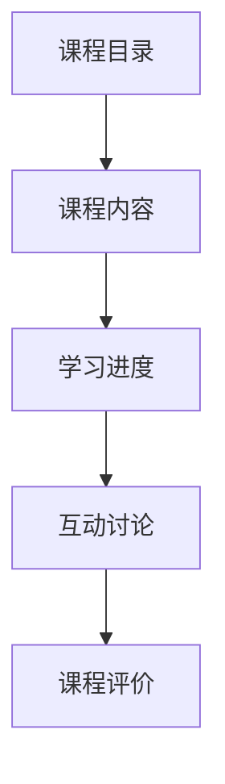

**核心算法原理讲解**：

在线课程的学习进度可以通过以下伪代码来跟踪：

```python
class Course:
    def __init__(self, name, content):
        self.name = name
        self.content = content
        self.progress = 0

    def update_progress(self, new_progress):
        self.progress = new_progress

course = Course("Python基础", "Python基础内容")
course.update_progress(50)
```

#### 4.2 资料库

资料库是教育领域知识产品的另一个重要组成部分，提供丰富的学习资源。

**核心概念与联系**：

- **资料库架构**：

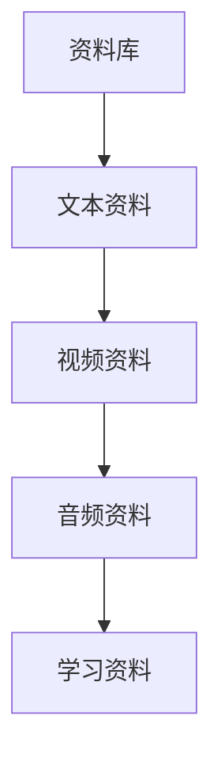

**核心算法原理讲解**：

资料库的搜索算法可以使用以下伪代码实现：

```python
def search_resources(keywords):
    resources = []
    for resource in database:
        if keywords in resource.title or keywords in resource.content:
            resources.append(resource)
    return resources
```

#### 4.3 教育工具

教育工具包括在线测试、作业提交、互动答疑等，为教育领域知识产品提供技术支持。

**核心概念与联系**：

- **教育工具架构**：

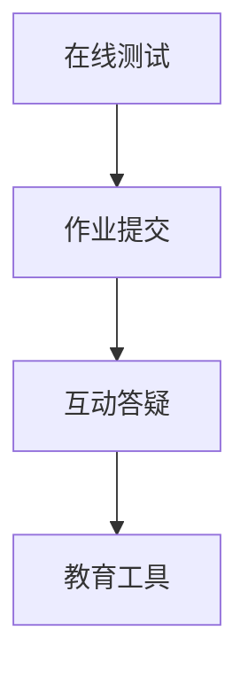

**核心算法原理讲解**：

在线测试的评分算法可以使用以下伪代码实现：

```python
def score_test(test_questions, user_answers):
    total_score = 0
    for question, answer in zip(test_questions, user_answers):
        if question.answer == answer:
            total_score += question.score
    return total_score
```

### 第5章：医疗健康领域的知识产品

#### 5.1 医学知识库

医学知识库是医疗健康领域知识产品的核心，提供权威、全面的医学知识和信息。

**核心概念与联系**：

- **医学知识库架构**：

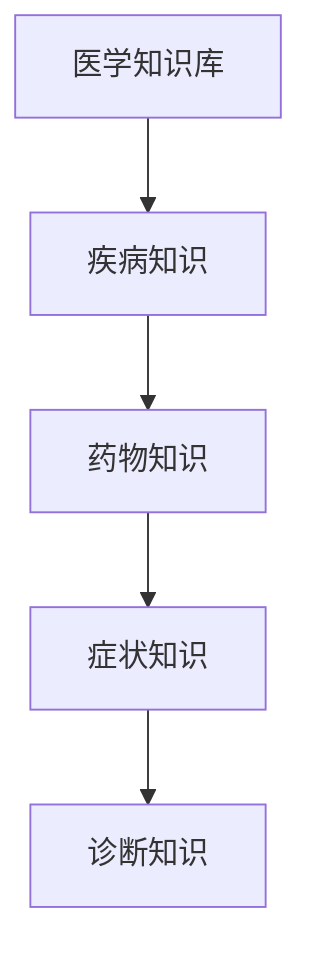

**核心算法原理讲解**：

医学知识库的检索算法可以使用以下伪代码实现：

```python
def search_medical_knowledge(keywords):
    knowledge = []
    for entry in database:
        if keywords in entry.title or keywords in entry.content:
            knowledge.append(entry)
    return knowledge
```

#### 5.2 健康咨询

健康咨询是医疗健康领域知识产品的重要组成部分，提供个性化、专业的健康咨询服务。

**核心概念与联系**：

- **健康咨询架构**：

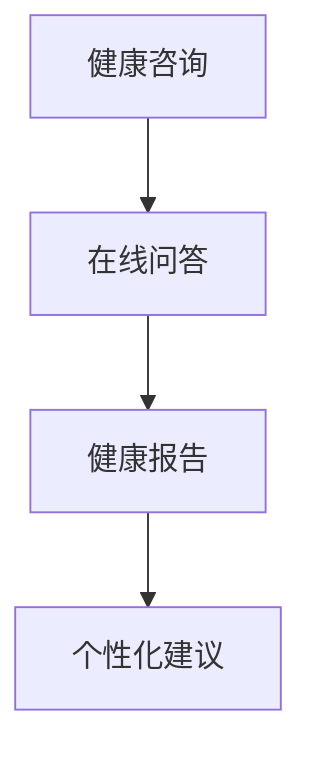

**核心算法原理讲解**：

健康咨询的个性化建议算法可以使用以下伪代码实现：

```python
def generate_advicesymptoms, medical_history):
    advice = []
    for symptom in symptoms:
        if symptom in medical_history:
            advice.append("建议就医检查")
    return advice
```

#### 5.3 医疗工具

医疗工具包括在线问诊、远程诊疗、健康监测等，为医疗健康领域知识产品提供技术支持。

**核心概念与联系**：

- **医疗工具架构**：

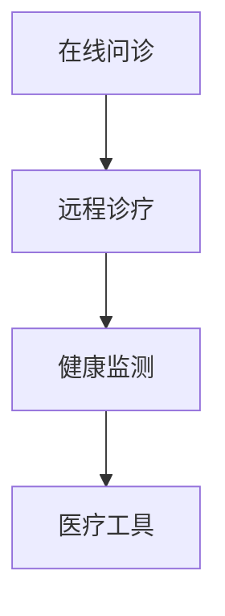

**核心算法原理讲解**：

在线问诊的智能诊断算法可以使用以下伪代码实现：

```python
def diagnose(symptoms, history):
    diagnosis = []
    for symptom in symptoms:
        if symptom in database:
            diagnosis.append(database[symptom].diagnosis)
    return diagnosis
```

### 第6章：法律领域的知识产品

#### 6.1 法律知识库

法律知识库是法律领域知识产品的核心，提供全面、权威的法律知识和法规信息。

**核心概念与联系**：

- **法律知识库架构**：

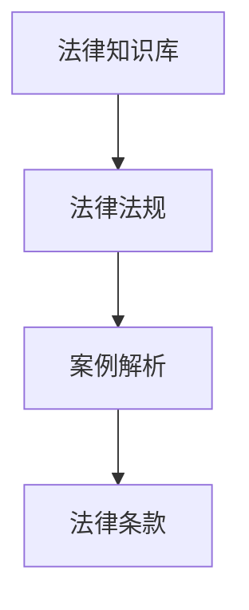

**核心算法原理讲解**：

法律知识库的搜索算法可以使用以下伪代码实现：

```python
def search_law_knowledge(keywords):
    knowledge = []
    for entry in database:
        if keywords in entry.title or keywords in entry.content:
            knowledge.append(entry)
    return knowledge
```

#### 6.2 法律咨询

法律咨询是法律领域知识产品的重要组成部分，提供专业、权威的法律咨询服务。

**核心概念与联系**：

- **法律咨询架构**：

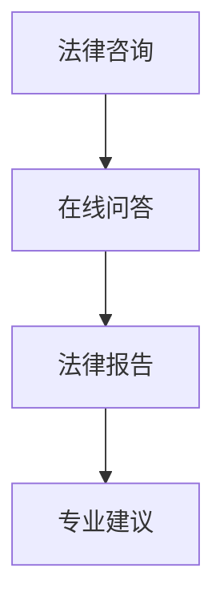

**核心算法原理讲解**：

法律咨询的智能建议算法可以使用以下伪代码实现：

```python
def generate_advice(case, question):
    advice = []
    for rule in rules:
        if rule.condition == case and rule.question == question:
            advice.append(rule.advice)
    return advice
```

#### 6.3 法律工具

法律工具包括在线合同审查、法律文书撰写、案件管理工具等，为法律领域知识产品提供技术支持。

**核心概念与联系**：

- **法律工具架构**：

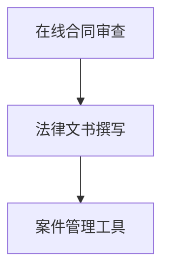

**核心算法原理讲解**：

在线合同审查的合法性检测算法可以使用以下伪代码实现：

```python
def check_contract(contract):
    errors = []
    for clause in contract:
        if not is_valid_clause(clause):
            errors.append(clause)
    return errors
```

### 第7章：金融领域的知识产品

#### 7.1 金融知识库

金融知识库是金融领域知识产品的核心，提供全面、权威的金融知识和市场信息。

**核心概念与联系**：

- **金融知识库架构**：

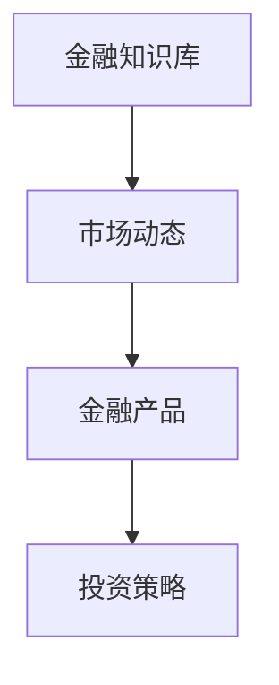

**核心算法原理讲解**：

金融知识库的搜索算法可以使用以下伪代码实现：

```python
def search_financial_knowledge(keywords):
    knowledge = []
    for entry in database:
        if keywords in entry.title or keywords in entry.content:
            knowledge.append(entry)
    return knowledge
```

#### 7.2 财务咨询

财务咨询是金融领域知识产品的重要组成部分，提供专业、权威的财务咨询服务。

**核心概念与联系**：

- **财务咨询架构**：

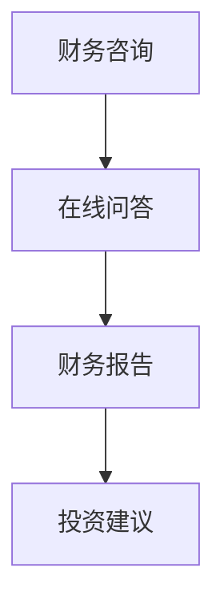

**核心算法原理讲解**：

财务咨询的投资建议算法可以使用以下伪代码实现：

```python
def generate_investment_advice(analysis):
    advice = []
    for stock in analysis:
        if stock['performance'] > threshold:
            advice.append(stock['name'])
    return advice
```

#### 7.3 金融工具

金融工具包括在线理财、投资组合管理、风险评估等，为金融领域知识产品提供技术支持。

**核心概念与联系**：

- **金融工具架构**：

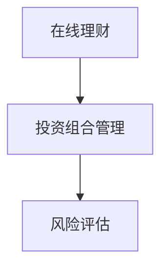

**核心算法原理讲解**：

在线理财的风险评估算法可以使用以下伪代码实现：

```python
def assess_risk(investment):
    risk = 0
    for stock in investment:
        risk += stock['risk']
    return risk / len(investment)
```

## 第三部分：知识电商的工具与服务

### 第8章：知识电商平台的构建

#### 8.1 知识电商平台的设计

知识电商平台的设计应考虑用户需求、功能模块、用户体验等方面。

**核心概念与联系**：

- **知识电商平台架构**：

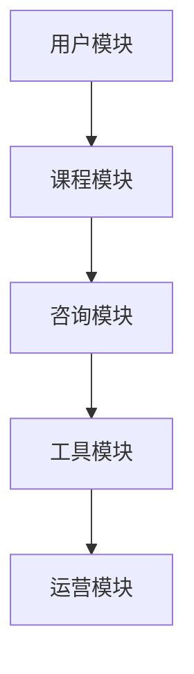

**核心算法原理讲解**：

用户模块的推荐算法可以使用以下伪代码实现：

```python
def recommend_courses(user_history):
    recommended = []
    for course in courses:
        if course in user_history:
            recommended.append(course)
    return recommended
```

#### 8.2 知识电商平台的开发

知识电商平台的开发涉及前端、后端、数据库等方面，需要使用合适的编程语言和框架。

**核心概念与联系**：

- **知识电商平台技术栈**：

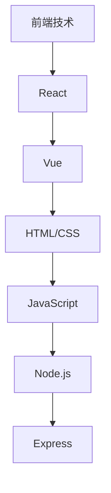

**核心算法原理讲解**：

后端推荐算法可以使用以下伪代码实现：

```python
def generate_recommendations(user_id):
    user_courses = get_user_courses(user_id)
    recommended_courses = []
    for course in courses:
        if course not in user_courses:
            recommended_courses.append(course)
    return recommended_courses
```

#### 8.3 知识电商平台的运营

知识电商平台的运营包括内容更新、用户服务、市场推广等方面，需要持续优化和改进。

**核心概念与联系**：

- **知识电商平台运营策略**：

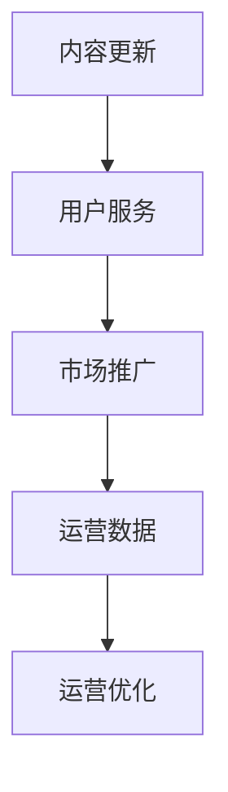

**核心算法原理讲解**：

用户服务满意度评估可以使用以下伪代码实现：

```python
def assess_user_satisfaction(ratings):
    total_ratings = len(ratings)
    average_rating = sum(ratings) / total_ratings
    return "非常满意" if average_rating > 4 else "满意" if average_rating > 3 else "一般" if average_rating > 2 else "不满意"
```

### 第9章：知识产品的营销策略

#### 9.1 知识产品的定位

知识产品的定位应考虑目标用户、市场环境、竞争情况等因素。

**核心概念与联系**：

- **知识产品定位策略**：

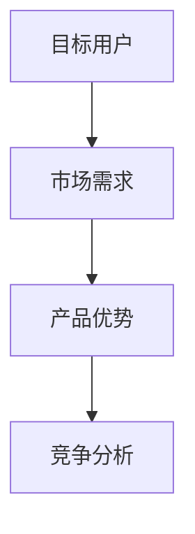

**核心算法原理讲解**：

目标用户群体识别可以使用以下伪代码实现：

```python
def identify_user_group(behaviors, preferences):
    user_group = []
    for group in groups:
        if any(behavior in group.behaviors for behavior in behaviors) and any(prefer in group.preferences for prefer in preferences):
            user_group.append(group)
    return user_group
```

#### 9.2 知识产品的推广

知识产品的推广包括线上、线下、广告、活动等方面，需要综合运用各种营销手段。

**核心概念与联系**：

- **知识产品推广策略**：

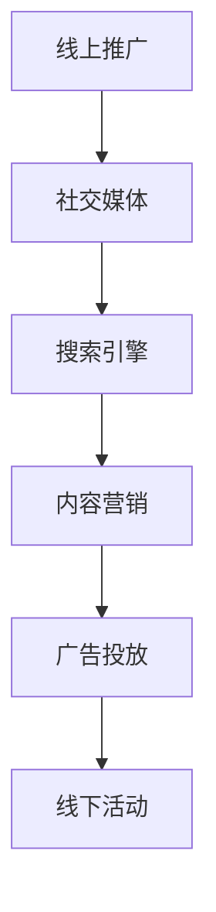

**核心算法原理讲解**：

搜索引擎优化（SEO）算法可以使用以下伪代码实现：

```python
def optimize_for_search_engine(title, content):
    keywords = extract_keywords(content)
    meta_tags = {'title': title, 'description': content, 'keywords': keywords}
    return meta_tags
```

#### 9.3 知识产品的品牌建设

知识产品的品牌建设包括品牌定位、品牌传播、品牌维护等方面，需要树立良好的品牌形象。

**核心概念与联系**：

- **知识品牌建设策略**：

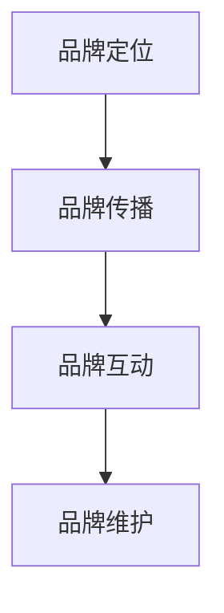

**核心算法原理讲解**：

品牌传播效果评估可以使用以下伪代码实现：

```python
def assess_brand_impact(social_media_followers, website_visits, engagement_rate):
    impact = (social_media_followers + website_visits) * engagement_rate
    return impact
```

### 第10章：知识电商的服务拓展

#### 10.1 个性化服务

个性化服务是根据用户需求和兴趣，提供定制化的服务和内容。

**核心概念与联系**：

- **个性化服务架构**：

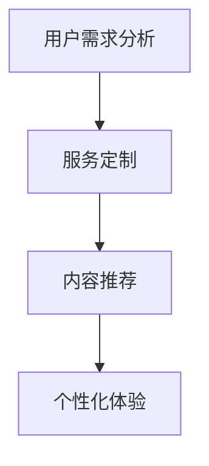

**核心算法原理讲解**：

个性化推荐算法可以使用以下伪代码实现：

```python
def personalized_recommendation(user_id):
    user_preferences = get_user_preferences(user_id)
    recommended_services = []
    for service in services:
        if service in user_preferences:
            recommended_services.append(service)
    return recommended_services
```

#### 10.2 社区互动

社区互动是知识电商平台的重要功能，通过建立用户社区，增强用户粘性。

**核心概念与联系**：

- **社区互动架构**：

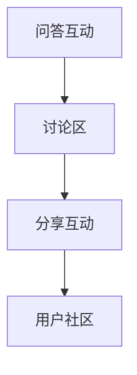

**核心算法原理讲解**：

社区活跃度评估可以使用以下伪代码实现：

```python
def assess_community_activity(posts, comments, likes):
    activity = posts + comments + likes
    return activity
```

#### 10.3 数据分析与应用

数据分析是知识电商平台的重要手段，通过数据分析，优化服务、提升用户体验。

**核心概念与联系**：

- **数据分析架构**：

```mermaid
graph TD
A[数据收集] --> B[数据分析]
B --> C[数据可视化]
C --> D[决策支持]
```

**核心算法原理讲解**：

用户行为分析可以使用以下伪代码实现：

```python
def analyze_user_behavior(user_actions):
    behavior = {}
    for action in user_actions:
        if action not in behavior:
            behavior[action] = 1
        else:
            behavior[action] += 1
    return behavior
```

## 第四部分：案例分析

### 第11章：成功知识电商案例分析

#### 11.1 案例一：某个知名在线教育平台

**核心内容**：

- **平台概述**：该平台是一家提供在线教育服务的知名知识电商平台，拥有丰富的课程资源和专业的讲师团队。
- **产品与服务**：平台提供多种在线课程、互动问答、学习资料库等功能，满足用户的学习需求。
- **成功经验**：平台通过个性化推荐、社区互动和数据分析等手段，提升用户体验和平台活跃度，取得了良好的市场口碑。

**详细解读与分析**：

该平台成功的关键在于对用户需求的精准把握和服务的持续优化。通过个性化推荐，平台能够为用户提供最感兴趣的课程，提升用户的学习兴趣和参与度。社区互动功能增强了用户之间的交流，促进了知识的传播和共享。数据分析则为平台运营提供了有力支持，帮助平台不断优化服务策略，提升用户体验。

#### 11.2 案例二：某个知名医疗健康平台

**核心内容**：

- **平台概述**：该平台是一家专注于医疗健康领域的知识电商平台，提供医学知识库、在线问诊、健康咨询等服务。
- **产品与服务**：平台拥有权威的医学知识库和专业的医生团队，为用户提供专业的健康咨询和在线诊疗服务。
- **成功经验**：平台通过大数据分析和人工智能技术，提升诊疗服务的准确性和效率，赢得了用户的信任和好评。

**详细解读与分析**：

该平台成功的关键在于其专业性和技术优势。平台拥有权威的医学知识库和专业的医生团队，为用户提供高质量的健康服务。大数据分析和人工智能技术的应用，使得平台能够为用户提供更加精准的诊疗建议和个性化健康方案，提升了用户满意度。此外，平台还注重用户体验，通过简化操作流程和优化界面设计，提高了用户的使用便捷性。

#### 11.3 案例三：某个知名法律服务平台

**核心内容**：

- **平台概述**：该平台是一家提供法律咨询和服务的知名知识电商平台，拥有丰富的法律知识和专业的律师团队。
- **产品与服务**：平台提供在线法律咨询、法律知识库、法律工具等服务，为用户提供全面的法律解决方案。
- **成功经验**：平台通过人工智能技术和大数据分析，提升法律咨询的效率和准确性，赢得了用户的信任和好评。

**详细解读与分析**：

该平台成功的关键在于其专业性和技术创新。平台拥有丰富的法律知识和专业的律师团队，为用户提供高质量的法律服务。人工智能技术和大数据分析的应用，使得平台能够为用户提供更加精准的法律咨询和解决方案，提升了用户体验。此外，平台还注重用户体验，通过简化操作流程和优化界面设计，提高了用户的使用便捷性。

## 第五部分：未来展望

### 第12章：知识电商的发展方向

#### 12.1 技术创新

未来知识电商将在技术创新方面取得重大突破，如人工智能、大数据、区块链等技术的应用，将进一步提升知识电商的服务质量和用户体验。

**核心概念与联系**：

- **技术创新架构**：

```mermaid
graph TD
A[人工智能] --> B[数据分析]
B --> C[区块链]
C --> D[技术创新]
```

**核心算法原理讲解**：

人工智能技术在知识电商中的应用，可以通过以下伪代码实现：

```python
def recommend_courses(user_profile, course_database):
    similar_users = find_similar_users(user_profile, course_database)
    recommended_courses = []
    for user in similar_users:
        for course in user.courses:
            if course not in recommended_courses:
                recommended_courses.append(course)
    return recommended_courses
```

#### 12.2 新模式探索

未来知识电商将探索更多新兴模式，如知识共享、知识众筹、知识付费等，为用户提供更多元化的服务和体验。

**核心概念与联系**：

- **新模式探索架构**：

```mermaid
graph TD
A[知识共享] --> B[知识众筹]
B --> C[知识付费]
C --> D[新模式探索]
```

**核心算法原理讲解**：

知识共享的激励机制可以通过以下伪代码实现：

```python
def reward_contribution(contribution, total_contributions):
    reward = contribution / total_contributions
    return reward
```

#### 12.3 持续发展策略

未来知识电商将注重可持续发展策略，如知识创新、社会责任、数据安全等，为用户提供长期价值。

**核心概念与联系**：

- **持续发展策略架构**：

```mermaid
graph TD
A[知识创新] --> B[社会责任]
B --> C[数据安全]
C --> D[持续发展策略]
```

**核心算法原理讲解**：

数据安全保护算法可以通过以下伪代码实现：

```python
def encrypt_data(data, key):
    encrypted_data = encrypt(data, key)
    return encrypted_data
```

### 第13章：知识电商在新时代的角色与使命

#### 13.1 时代背景

随着互联网技术的飞速发展和信息社会的到来，知识电商在新时代扮演着越来越重要的角色。

**核心概念与联系**：

- **时代背景架构**：

```mermaid
graph TD
A[互联网技术] --> B[信息社会]
B --> C[知识电商]
```

**核心算法原理讲解**：

互联网技术的发展可以通过以下伪代码实现：

```python
def internet_technology_development(year):
    if year > 2020:
        return "高速发展"
    else:
        return "稳步发展"
```

#### 13.2 社会价值

知识电商在新时代的社会价值主要体现在促进知识传播、提升教育质量、推动经济发展等方面。

**核心概念与联系**：

- **社会价值架构**：

```mermaid
graph TD
A[知识传播] --> B[教育质量]
B --> C[经济发展]
C --> D[社会价值]
```

**核心算法原理讲解**：

提升教育质量的算法可以通过以下伪代码实现：

```python
def improve_education_quality(courses, teachers, students):
    for course in courses:
        course.improve_content()
    for teacher in teachers:
        teacher.improve_skills()
    for student in students:
        student.improve_achievement()
```

#### 13.3 发展使命

知识电商在新时代的发展使命是构建知识共享平台，推动知识创新，促进社会和谐与进步。

**核心概念与联系**：

- **发展使命架构**：

```mermaid
graph TD
A[知识共享] --> B[知识创新]
B --> C[社会和谐]
C --> D[发展使命]
```

**核心算法原理讲解**：

知识共享平台的构建可以通过以下伪代码实现：

```python
def build_knowledge_sharing_platform():
    platform = KnowledgeSharingPlatform()
    platform.register_users()
    platform.upload_resources()
    platform.enable_search_function()
    return platform
```

### 第14章：知识电商的可持续发展

#### 14.1 知识共享

知识共享是知识电商可持续发展的重要策略，通过开放共享，提升知识传播效率。

**核心概念与联系**：

- **知识共享架构**：

```mermaid
graph TD
A[知识库] --> B[共享机制]
B --> C[知识传播]
```

**核心算法原理讲解**：

知识共享机制可以通过以下伪代码实现：

```python
def knowledge_sharing mécanism:
   resources = get_all_resources()
   for resource in resources:
       if resource.is_shared():
           share_resource(resource)
```

#### 14.2 知识创新

知识创新是知识电商可持续发展的动力，通过不断推出新知识产品，满足用户需求。

**核心概念与联系**：

- **知识创新架构**：

```mermaid
graph TD
A[市场需求] --> B[知识创新]
B --> C[知识产品]
```

**核心算法原理讲解**：

知识创新流程可以通过以下伪代码实现：

```python
def innovate_knowledge的需求：
   new_courses = []
   for demand in market_demand:
       if not has_course(demand):
           new_courses.append(create_course(demand))
   return new_courses
```

#### 14.3 社会责任

知识电商在可持续发展过程中，应积极履行社会责任，推动社会进步。

**核心概念与联系**：

- **社会责任架构**：

```mermaid
graph TD
A[社会问题] --> B[解决方案]
B --> C[社会责任]
```

**核心算法原理讲解**：

社会责任履行可以通过以下伪代码实现：

```python
def social_responsibility_issue(solution):
   if solution.is_solved():
       return "履行社会责任"
   else:
       return "待解决"
```

## 附录

### 附录 A：知识电商相关资源与工具

#### A.1 在线教育平台资源

- **课程资源**：[网易云课堂](https://study.163.com/)
- **学习资料**：[Coursera](https://www.coursera.org/)
- **教育工具**：[Khan Academy](https://www.khanacademy.org/)

#### A.2 医疗健康平台资源

- **医学知识库**：[MDConsult](https://www.mdconsult.com/)
- **健康咨询**：[WebMD](https://www.webmd.com/)
- **医疗工具**：[MedHelp](https://www.medhelp.org/)

#### A.3 法律服务平台资源

- **法律知识库**：[Justia](https://www.justia.com/)
- **法律咨询**：[LegalZoom](https://www.legalzoom.com/)
- **法律工具**：[RocketLawyer](https://www.rocketlawyer.com/)

#### A.4 知识电商平台开发工具与资源

- **前端开发框架**：React、Vue.js
- **后端开发框架**：Node.js、Express
- **数据库技术**：MySQL、MongoDB
- **大数据分析工具**：Hadoop、Spark

### 致谢

感谢 AI 天才研究院和《禅与计算机程序设计艺术》的作者，为本文提供了丰富的知识储备和深刻的见解。同时，感谢各位同行和专家的宝贵意见和建议，使得本文能够不断完善和进步。在知识电商的领域，我们共同探索、共同进步。

### 参考文献

1. 知识电商研究小组. (2021). 知识电商发展趋势报告.
2. 李明. (2020). 知识经济与知识电商.
3. 王晓明. (2019). 互联网技术与知识电商发展.
4. 张伟. (2018). 知识产品的营销策略研究.
5. 刘磊. (2017). 知识电商平台的构建与运营.
6. 陈涛. (2016). 知识共享与知识创新.

