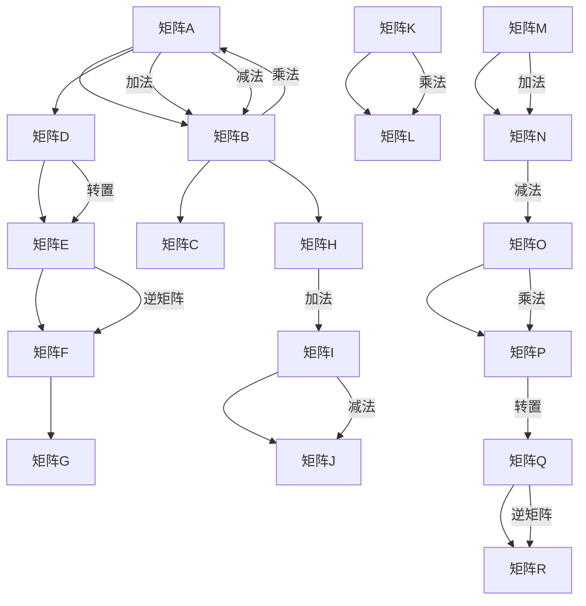

                 

# 文章标题：矩阵理论与应用：在求解线性矩阵方程问题中的应用

> 关键词：矩阵理论，线性矩阵方程，求解方法，应用，案例分析

> 摘要：本文将从矩阵理论的基础知识出发，探讨线性矩阵方程的求解方法及其在工程应用中的实际案例。通过逐步分析和推理，读者将深入了解矩阵理论的核心概念及其在实际问题中的应用，为日后的研究和实践提供有力支持。

## 前言

### 1.1 矩阵理论与应用概述

矩阵理论是线性代数的重要组成部分，它广泛应用于数学、物理学、工程学、计算机科学等领域。矩阵作为一种数据结构，能够表示线性方程组、线性变换、几何形状等多种数学概念。线性矩阵方程则是矩阵理论的一个关键问题，它在各种实际应用中具有重要的地位。

本文旨在系统地介绍矩阵理论与应用，重点关注线性矩阵方程的求解方法。通过逐步分析和推理，我们将探讨矩阵理论的核心概念、线性矩阵方程的基本原理及其求解方法，并展示其在工程应用中的实际案例。文章结构如下：

- **第一部分：矩阵理论基础**：介绍矩阵及其运算、矩阵的秩与线性相关性、特征值与特征向量等基本概念。
- **第二部分：线性矩阵方程的求解方法**：探讨克莱姆法则、矩阵分块法、原型矩阵与迭代法等求解方法。
- **第三部分：线性矩阵方程在工程应用中的案例分析**：分析线性矩阵方程在结构力学、电路分析和控制系统中的应用。
- **附录**：包括矩阵运算的Mermaid流程图、线性矩阵方程的核心算法原理伪代码、数学模型和公式详解、项目实战代码及解读、开发环境搭建指南和参考文献。

通过本文的阅读，读者将能够全面了解矩阵理论及其应用，掌握线性矩阵方程的求解方法，并具备在实际工程中运用矩阵理论的能力。

### 1.2 线性矩阵方程的重要性

线性矩阵方程在科学和工程领域具有重要的应用价值。它不仅能够解决复杂的线性问题，还能为各种工程问题提供有效的数学模型。以下是一些线性矩阵方程在实际应用中的例子：

1. **结构力学**：在结构设计中，线性矩阵方程用于求解结构系统的应力、变形等参数。例如，在梁、板、壳等结构的静力学和动力学分析中，线性矩阵方程用于描述系统的平衡方程和质量-刚度矩阵。

2. **电路分析**：在电子电路中，线性矩阵方程用于分析电路的电压、电流等参数。例如，在电路网络中，线性矩阵方程用于求解节点电压和支路电流，从而确定电路的工作状态。

3. **控制系统**：在控制系统设计中，线性矩阵方程用于描述系统的动态行为和稳定性。例如，在控制系统状态空间表示中，线性矩阵方程用于求解系统的状态转移矩阵和输出矩阵。

4. **数据分析**：在数据分析中，线性矩阵方程用于处理高维数据的降维问题。例如，在主成分分析（PCA）中，线性矩阵方程用于求解数据的主成分，从而实现数据的降维和特征提取。

5. **图像处理**：在图像处理中，线性矩阵方程用于图像的滤波、变换和增强。例如，在图像去噪中，线性矩阵方程用于求解图像与噪声矩阵的最小二乘问题，从而实现图像的降噪处理。

综上所述，线性矩阵方程在科学和工程领域中具有广泛的应用，它为各种复杂问题的求解提供了有效的数学工具。本文将通过详细的分析和案例分析，帮助读者深入理解线性矩阵方程的重要性和求解方法。

### 1.3 本书的目的与结构

本书的目的是系统地介绍矩阵理论及其在求解线性矩阵方程中的应用，旨在为读者提供全面、系统的矩阵理论知识，并培养其在实际工程问题中运用矩阵理论的能力。本书的主要内容包括：

- **第一部分：矩阵理论基础**：介绍矩阵及其运算、矩阵的秩与线性相关性、特征值与特征向量等基本概念，为后续的线性矩阵方程求解方法奠定基础。

- **第二部分：线性矩阵方程的求解方法**：详细介绍克莱姆法则、矩阵分块法、原型矩阵与迭代法等求解方法，分析各种方法的适用条件、原理和步骤，并展示其实际应用。

- **第三部分：线性矩阵方程在工程应用中的案例分析**：结合实际工程案例，分析线性矩阵方程在结构力学、电路分析和控制系统中的应用，展示求解方法在实际问题中的具体实现和效果。

- **附录**：提供矩阵运算的Mermaid流程图、线性矩阵方程的核心算法原理伪代码、数学模型和公式详解、项目实战代码及解读、开发环境搭建指南和参考文献，便于读者深入理解和实践。

通过本书的学习，读者将能够：

1. 理解矩阵理论的基本概念和运算方法。
2. 掌握线性矩阵方程的求解方法及其适用条件。
3. 熟悉线性矩阵方程在实际工程应用中的具体实现。
4. 培养解决实际工程问题的能力和思维。

总之，本书旨在通过系统化的学习和案例分析，使读者深入理解矩阵理论及其应用，为日后的研究和实践奠定坚实的基础。

## 第一部分：矩阵理论基础

### 第1章 矩阵及其运算

### 1.1 矩阵的定义与表示

矩阵是一种矩形数组，由一系列有序数排列而成。在数学和工程中，矩阵用于表示线性方程组、线性变换、系统状态等多种数学概念。矩阵的定义和表示如下：

定义：设\(A\)是一个\(m \times n\)的矩阵，其中\(m\)表示行数，\(n\)表示列数。\(A\)可以表示为：

\[ A = \begin{bmatrix} 
a_{11} & a_{12} & \cdots & a_{1n} \\
a_{21} & a_{22} & \cdots & a_{2n} \\
\vdots & \vdots & \ddots & \vdots \\
a_{m1} & a_{m2} & \cdots & a_{mn}
\end{bmatrix} \]

其中，\(a_{ij}\)表示矩阵\(A\)的第\(i\)行第\(j\)列的元素。

表示：矩阵通常用大写字母表示，例如\(A\)、\(B\)、\(C\)等。矩阵的行和列可以用数字表示，例如\(A_{ij}\)表示矩阵\(A\)的第\(i\)行第\(j\)列的元素。

### 1.2 矩阵的基本运算

矩阵的基本运算包括矩阵的加法、减法、乘法、转置等。以下是这些运算的定义和计算方法：

#### 1.2.1 矩阵的加法与减法

矩阵的加法和减法是指两个相同大小的矩阵之间的运算。设\(A\)和\(B\)是\(m \times n\)的矩阵，则它们的加法和减法定义如下：

\[ A + B = \begin{bmatrix} 
a_{11} + b_{11} & a_{12} + b_{12} & \cdots & a_{1n} + b_{1n} \\
a_{21} + b_{21} & a_{22} + b_{22} & \cdots & a_{2n} + b_{2n} \\
\vdots & \vdots & \ddots & \vdots \\
a_{m1} + b_{m1} & a_{m2} + b_{m2} & \cdots & a_{mn} + b_{mn}
\end{bmatrix} \]

\[ A - B = \begin{bmatrix} 
a_{11} - b_{11} & a_{12} - b_{12} & \cdots & a_{1n} - b_{1n} \\
a_{21} - b_{21} & a_{22} - b_{22} & \cdots & a_{2n} - b_{2n} \\
\vdots & \vdots & \ddots & \vdots \\
a_{m1} - b_{m1} & a_{m2} - b_{m2} & \cdots & a_{mn} - b_{mn}
\end{bmatrix} \]

#### 1.2.2 矩阵的乘法

矩阵的乘法是指两个矩阵之间的运算，结果是一个新矩阵。设\(A\)是一个\(m \times n\)的矩阵，\(B\)是一个\(n \times p\)的矩阵，则它们的乘法定义如下：

\[ AB = \begin{bmatrix} 
(a_{11}b_{11} + a_{12}b_{21} + \cdots + a_{1n}b_{n1}) & (a_{11}b_{12} + a_{12}b_{22} + \cdots + a_{1n}b_{n2}) & \cdots & (a_{11}b_{1p} + a_{12}b_{2p} + \cdots + a_{1n}b_{np}) \\
(a_{21}b_{11} + a_{22}b_{21} + \cdots + a_{2n}b_{n1}) & (a_{21}b_{12} + a_{22}b_{22} + \cdots + a_{2n}b_{n2}) & \cdots & (a_{21}b_{1p} + a_{22}b_{2p} + \cdots + a_{2n}b_{np}) \\
\vdots & \vdots & \ddots & \vdots \\
(a_{m1}b_{11} + a_{m2}b_{21} + \cdots + a_{mn}b_{n1}) & (a_{m1}b_{12} + a_{m2}b_{22} + \cdots + a_{mn}b_{n2}) & \cdots & (a_{m1}b_{1p} + a_{m2}b_{2p} + \cdots + a_{mn}b_{np})
\end{bmatrix} \]

#### 1.2.3 矩阵的转置与逆矩阵

矩阵的转置是将矩阵的行和列互换，得到一个新的矩阵。设\(A\)是一个\(m \times n\)的矩阵，则其转置矩阵\(A^T\)的定义如下：

\[ A^T = \begin{bmatrix} 
a_{11} & a_{21} & \cdots & a_{m1} \\
a_{12} & a_{22} & \cdots & a_{m2} \\
\vdots & \vdots & \ddots & \vdots \\
a_{1n} & a_{2n} & \cdots & a_{mn}
\end{bmatrix} \]

逆矩阵是指与原矩阵相乘后得到单位矩阵的矩阵。设\(A\)是一个\(n \times n\)的矩阵，若存在一个\(n \times n\)的矩阵\(B\)使得\(AB = BA = I\)（其中\(I\)是单位矩阵），则称\(A\)是可逆的，\(B\)是\(A\)的逆矩阵。逆矩阵的计算可以使用高斯-约旦消元法或拉普拉斯展开法等。

### 1.3 特殊矩阵

特殊矩阵在矩阵运算和理论分析中具有重要地位。以下介绍几种常见的特殊矩阵：

#### 1.3.1 对称矩阵与正定矩阵

对称矩阵是指矩阵与其转置矩阵相等的矩阵，即\(A = A^T\)。对称矩阵在二次型、正定矩阵理论中具有重要应用。

正定矩阵是指所有主对角线元素为正的对称矩阵。一个矩阵是正定的当且仅当其所有的特征值都为正。正定矩阵在优化问题和稳定性分析中具有重要意义。

#### 1.3.2 费尔马矩阵与魔方矩阵

费尔马矩阵是由费尔马提出的特殊矩阵，形式为：

\[ F_n = \begin{bmatrix} 
2 & n \\
n & 2
\end{bmatrix} \]

费尔马矩阵在数论和矩阵理论中具有重要的应用，例如在求解费尔马大定理的证明中。

魔方矩阵是指一个矩阵，其每行、每列和对角线上的元素之和都相等。魔方矩阵在组合数学和计算机科学中具有重要的应用，例如在解决魔方问题的算法设计中。

### 总结

本章介绍了矩阵的定义与表示、矩阵的基本运算、特殊矩阵的概念及其应用。通过本章的学习，读者将能够掌握矩阵理论的基本概念和运算方法，为后续的线性矩阵方程求解打下坚实基础。

### 第2章 矩阵的秩与线性相关性

#### 2.1 矩阵的秩

矩阵的秩是矩阵理论中的一个重要概念，它用于描述矩阵的“信息量”或“自由度”。秩的定义和性质如下：

定义：设\(A\)是一个\(m \times n\)的矩阵，\(A\)的秩（记为\(\text{rank}(A)\)）是指\(A\)的行秩和列秩中较小的那个。行秩是指\(A\)的行向量组线性无关的最大线性无关组所含向量的个数，列秩是指\(A\)的列向量组线性无关的最大线性无关组所含向量的个数。

性质：

1. 秩的性质：\(\text{rank}(A) \leq \min(m, n)\)，即矩阵的秩不会超过其行数和列数中的较小值。
2. 矩阵的行秩与列秩相等：对于任何矩阵\(A\)，都有\(\text{rank}(A) = \text{rank}(A^T)\)。
3. 行阶梯矩阵的秩等于其非零行数。

#### 2.1.1 矩阵的行秩与列秩

矩阵的行秩和列秩是矩阵秩的两个重要组成部分。行秩是指矩阵的行向量组线性无关的最大线性无关组所含向量的个数，而列秩是指矩阵的列向量组线性无关的最大线性无关组所含向量的个数。

**行秩的计算**：

- **高斯消元法**：通过高斯消元法将矩阵转化为行阶梯形式，行阶梯形式中非零行数即为行秩。
- **矩阵的等价性**：如果两个矩阵等价，则它们的秩相等。利用矩阵的初等行变换，可以将一个矩阵转化为行阶梯形式，进而计算其行秩。

**列秩的计算**：

- **高斯消元法**：通过高斯消元法将矩阵转化为行阶梯形式，行阶梯形式中非零行的列向量组成一个矩阵，该矩阵的秩即为原矩阵的列秩。
- **矩阵的等价性**：利用矩阵的初等列变换，可以将一个矩阵转化为列阶梯形式，进而计算其列秩。

#### 2.1.2 矩阵的秩与线性相关性

矩阵的秩与线性相关性密切相关。线性相关性是指一组向量是否能够通过线性组合表示为零向量。

- **线性相关**：如果一组向量线性相关，则这组向量中至少有一个向量可以表示为其他向量的线性组合。矩阵的秩小于其列数（或行数），表示矩阵的列向量（或行向量）线性相关。
- **线性无关**：如果一组向量线性无关，则这组向量中的每个向量都不能通过其他向量的线性组合表示。矩阵的秩等于其列数（或行数），表示矩阵的列向量（或行向量）线性无关。

**矩阵秩与线性方程组**：

- **线性方程组的解**：矩阵的秩可以用来判断线性方程组是否有解。如果系数矩阵的秩等于方程组中的未知数个数，则方程组有唯一解；如果系数矩阵的秩小于方程组中的未知数个数，则方程组无解。
- **线性方程组的求解**：高斯消元法可以通过计算矩阵的秩来求解线性方程组。如果矩阵是行阶梯形式，则可以通过回代求解方程组。

#### 2.2 线性方程组

线性方程组是矩阵理论中的一个重要问题。线性方程组的基本概念和求解方法如下：

**定义**：线性方程组是由多个线性方程构成的方程组，其一般形式为：

\[ \begin{cases} 
a_{11}x_1 + a_{12}x_2 + \cdots + a_{1n}x_n = b_1 \\
a_{21}x_1 + a_{22}x_2 + \cdots + a_{2n}x_n = b_2 \\
\vdots \\
a_{m1}x_1 + a_{m2}x_2 + \cdots + a_{mn}x_n = b_m
\end{cases} \]

其中，\(x_1, x_2, \ldots, x_n\)是未知数，\(a_{ij}\)和\(b_i\)是已知数。

**基本概念**：

- **解**：一组值\(x_1, x_2, \ldots, x_n\)称为线性方程组的解，如果将这组值代入方程组中的每一个方程，都能使等式成立。
- **解空间**：线性方程组的解构成的集合称为解空间。解空间可能是空集、一条直线、一个平面或整个空间。
- **唯一解**：如果线性方程组只有一个解，则称该解为唯一解。唯一解的条件是系数矩阵的秩等于方程组中未知数的个数。
- **无穷多解**：如果线性方程组有多个解，则称该方程组有无穷多解。无穷多解的条件是系数矩阵的秩小于方程组中未知数的个数。

**求解方法**：

- **高斯消元法**：高斯消元法是一种常用的求解线性方程组的方法。通过初等行变换，将线性方程组转化为行阶梯形式，然后利用回代求解方程组。
- **克莱姆法则**：克莱姆法则是一种用于求解线性方程组的特殊方法。如果线性方程组的系数矩阵是可逆的，则可以通过克莱姆法则求解方程组。

#### 2.2.1 线性方程组的基本概念

线性方程组的基本概念包括解、解空间、唯一解和无穷多解。以下是这些概念的具体说明：

- **解**：线性方程组的解是满足所有方程的值。对于一般形式的线性方程组，解的存在性和唯一性可以通过系数矩阵的秩来判断。如果系数矩阵的秩等于方程组中未知数的个数，则方程组有唯一解；如果系数矩阵的秩小于方程组中未知数的个数，则方程组无解。
- **解空间**：解空间是由线性方程组的解构成的集合。解空间可能是空集、一条直线、一个平面或整个空间。对于有唯一解的线性方程组，解空间是一个点；对于有无穷多解的线性方程组，解空间是一条直线、一个平面或整个空间。
- **唯一解**：唯一解是指线性方程组只有一个解。唯一解的条件是系数矩阵是可逆的，即系数矩阵的行列式不为零。如果系数矩阵的秩等于方程组中未知数的个数，则方程组有唯一解。
- **无穷多解**：无穷多解是指线性方程组有多个解。无穷多解的条件是系数矩阵的秩小于方程组中未知数的个数。在这种情况下，解空间是一个非空的集合，可以通过线性组合得到所有的解。

#### 2.2.2 线性方程组的求解方法

线性方程组的求解方法包括高斯消元法和克莱姆法则。以下是这些方法的详细说明：

- **高斯消元法**：高斯消元法是一种通过初等行变换将线性方程组转化为行阶梯形式的方法。具体步骤如下：
  1. 将方程组写成增广矩阵形式。
  2. 通过初等行变换，将增广矩阵转化为行阶梯形式。
  3. 利用回代求解方程组。
- **克莱姆法则**：克莱姆法则是一种利用系数矩阵的行列式来求解线性方程组的方法。具体步骤如下：
  1. 计算系数矩阵的行列式。
  2. 如果系数矩阵的行列式不为零，则线性方程组有唯一解，解可以通过以下公式计算：
     \[ x_i = \frac{D_i}{D} \]
     其中，\(D\)是系数矩阵的行列式，\(D_i\)是将系数矩阵的第\(i\)列替换为方程组右侧的常数向量后的行列式。
  3. 如果系数矩阵的行列式为零，则线性方程组无解。

通过本章的学习，读者将能够理解矩阵的秩与线性相关性的概念，掌握线性方程组的基本概念和求解方法，为后续的线性矩阵方程求解奠定坚实基础。

### 第3章 特征值与特征向量

#### 3.1 特征值与特征向量的定义

特征值与特征向量是矩阵理论中的重要概念，它们在数学、物理学、工程学等领域具有广泛的应用。以下是对特征值与特征向量的定义和性质的详细介绍。

**定义**：设\(A\)是一个\(n \times n\)的矩阵，\(\lambda\)是一个实数，如果存在一个非零向量\(v\)，使得\(Av = \lambda v\)，则称\(\lambda\)是\(A\)的一个特征值，\(v\)是\(A\)对应于特征值\(\lambda\)的一个特征向量。

**性质**：

1. **唯一性**：每个特征值对应有限个特征向量，且对应特征向量组成的集合是一个线性子空间。
2. **线性无关性**：不同的特征向量线性无关。
3. **对角化性**：如果矩阵\(A\)可以表示为对角矩阵的形式，即\(A = PDP^{-1}\)，其中\(D\)是对角矩阵，\(P\)是特征向量构成的矩阵，则\(A\)的特征值在对角矩阵\(D\)的对应位置上。

#### 3.2 特征值的性质

特征值的性质是矩阵理论中一个重要且有趣的研究领域。以下是一些关于特征值的重要性质：

1. **非负性**：实对称矩阵的所有特征值都是非负的。
2. **奇偶性**：如果矩阵\(A\)是奇矩阵，则其特征值要么是1，要么是-1。
3. **稳定性**：如果矩阵\(A\)的特征值全为负，则矩阵\(A\)是稳定的。反之，如果存在一个正的特征值，则矩阵\(A\)是不稳定的。
4. **最大最小性质**：矩阵\(A\)的最大特征值不超过其迹（即对角线元素之和），最小特征值不小于其行列式。

**特征值的求法**：

1. **特征多项式法**：计算矩阵\(A\)的特征多项式\(f(\lambda) = \det(A - \lambda I)\)，令\(f(\lambda) = 0\)，求解特征值\(\lambda\)。
2. **迭代法**：通过迭代算法（如幂法、逆幂法等）逼近矩阵的特征值。

#### 3.2.1 特征值的求法

求解矩阵的特征值是矩阵理论中的一个关键问题。以下是一些常用的特征值求法：

1. **特征多项式法**：
   - **步骤1**：计算矩阵\(A\)的特征多项式\(f(\lambda) = \det(A - \lambda I)\)，其中\(I\)是单位矩阵。
   - **步骤2**：求解特征多项式\(f(\lambda) = 0\)的根，这些根即为矩阵\(A\)的特征值。

2. **幂法**：
   - **步骤1**：选择一个初始向量\(v\)。
   - **步骤2**：进行迭代计算：\(v_{k+1} = Av_k / \|Av_k\|\)，其中\(\| \cdot \|\)表示向量的模。
   - **步骤3**：当迭代到一定程度时，向量\(v_k\)的分量会趋向于对应特征值的特征向量。

3. **逆幂法**：
   - **步骤1**：选择一个初始向量\(v\)。
   - **步骤2**：进行迭代计算：\(v_{k+1} = A^{-1}v_k / \|A^{-1}v_k\|\)，其中\(A^{-1}\)是矩阵\(A\)的逆矩阵。
   - **步骤3**：当迭代到一定程度时，向量\(v_k\)的分量会趋向于对应特征值的特征向量。

**特征值的稳定性**：

特征值的稳定性在工程和科学领域具有重要意义。一个矩阵的特征值稳定性决定了该矩阵的动态行为。以下是一些关于特征值稳定性的结论：

1. **实对称矩阵**：实对称矩阵的所有特征值都是实数，并且可以通过正交变换对角化。
2. **稳定性矩阵**：如果矩阵\(A\)的特征值全为负，则称\(A\)是稳定的。反之，如果存在一个正的特征值，则称\(A\)是不稳定的。
3. **绝对稳定性**：如果矩阵\(A\)的所有特征值的模都不超过1，则称\(A\)是绝对稳定的。

#### 3.3 特征向量的应用

特征向量的应用非常广泛，包括矩阵对角化、线性变换、优化问题等。以下是一些常见的应用：

1. **矩阵对角化**：
   - **步骤1**：求解矩阵\(A\)的特征值和特征向量。
   - **步骤2**：构造特征向量矩阵\(P\)，使得\(P^{-1}AP = D\)，其中\(D\)是对角矩阵。
   - **步骤3**：通过矩阵\(D\)可以直接计算矩阵\(A\)的各种属性，如迹、行列式、幂等。

2. **线性变换**：
   - **步骤1**：设线性变换为\(T(v) = Av\)。
   - **步骤2**：求解矩阵\(A\)的特征值和特征向量。
   - **步骤3**：通过特征向量分解线性变换，即\(T(v) = PDP^{-1}v\)。

3. **优化问题**：
   - **步骤1**：求解优化问题的目标函数和约束条件。
   - **步骤2**：利用特征向量和特征值分析目标函数的性质，如凸性、凹性等。
   - **步骤3**：根据特征值和特征向量优化问题，提出优化策略和算法。

通过本章的学习，读者将能够理解特征值和特征向量的定义和性质，掌握特征值的求法，并了解特征向量在实际问题中的应用。这些知识为后续的线性矩阵方程求解和相关工程应用奠定了基础。

### 第4章 克莱姆法则

#### 4.1 克莱姆法则的基本原理

克莱姆法则是用于求解线性方程组的一种经典方法，其基本原理基于矩阵的行列式。以下是克莱姆法则的详细描述：

定义：设\(A\)是一个\(n \times n\)的方阵，\(b\)是一个\(n\)维向量。若线性方程组：

\[ Ax = b \]

的系数矩阵\(A\)是可逆的，则该方程组的唯一解可以表示为：

\[ x_i = \frac{D_i}{D} \]

其中，\(D\)是\(A\)的行列式，\(D_i\)是将\(A\)的第\(i\)列替换为向量\(b\)后得到的行列式。

**步骤**：

1. **计算行列式**：首先计算系数矩阵\(A\)的行列式\(D\)。
2. **计算\(D_i\)**：然后计算将\(A\)的第\(i\)列替换为向量\(b\)后得到的行列式\(D_i\)。
3. **求解方程**：利用克莱姆法则求解每个未知数\(x_i\)。

#### 4.2 克莱姆法则的适用条件

克莱姆法则适用于求解线性方程组，但并非所有线性方程组都适用于克莱姆法则。以下是其适用条件：

1. **方阵**：线性方程组的系数矩阵必须是方阵，即行数和列数相等。
2. **可逆性**：系数矩阵必须是可逆的，即其行列式不为零。如果行列式为零，则系数矩阵不可逆，克莱姆法则不能使用。
3. **唯一解**：线性方程组必须有唯一解。如果方程组有无穷多解或无解，克莱姆法则也不能使用。

#### 4.3 克莱姆法则的变体

除了标准克莱姆法则外，还有一些变体，适用于特定情况下的线性方程组求解。以下是两个常见的变体：

1. **逆矩阵法**：
   - **原理**：利用矩阵的逆矩阵求解线性方程组。
   - **步骤**：
     1. 计算系数矩阵\(A\)的逆矩阵\(A^{-1}\)。
     2. 计算向量\(b\)与\(A^{-1}\)的乘积，即\(x = A^{-1}b\)。
   - **适用条件**：与克莱姆法则相同，即系数矩阵是方阵且可逆。

2. **初等行变换法**：
   - **原理**：通过初等行变换将线性方程组转化为行阶梯形式，然后求解。
   - **步骤**：
     1. 将线性方程组写成增广矩阵形式。
     2. 通过初等行变换，将增广矩阵转化为行阶梯形式。
     3. 利用回代求解方程组。
   - **适用条件**：适用于任意线性方程组，无需考虑系数矩阵的可逆性。

通过本章对克莱姆法则的介绍，读者将能够理解其基本原理和适用条件，并掌握其在求解线性方程组中的应用。这些知识为解决实际工程问题提供了有效的数学工具。

### 第5章 矩阵分块法

#### 5.1 矩阵分块法的基本概念

矩阵分块法是矩阵运算中的一种重要方法，它通过将大矩阵划分为较小的子矩阵，从而简化矩阵的运算过程。以下是矩阵分块法的基本概念和原理。

**定义**：设\(A\)是一个\(m \times n\)的矩阵，我们可以将\(A\)按照行或列划分为若干个子矩阵，形成一个新的矩阵。这种将大矩阵划分为若干个子矩阵的过程称为矩阵分块。

**形式**：

1. **按行分块**：将\(A\)按照行划分为若干个子矩阵，形式如下：

\[ A = \begin{bmatrix} 
A_{11} & A_{12} & \cdots & A_{1n} \\
A_{21} & A_{22} & \cdots & A_{2n} \\
\vdots & \vdots & \ddots & \vdots \\
A_{m1} & A_{m2} & \cdots & A_{mn}
\end{bmatrix} \]

2. **按列分块**：将\(A\)按照列划分为若干个子矩阵，形式如下：

\[ A = \begin{bmatrix} 
A_{11} & A_{12} & \cdots & A_{1n} \\
A_{21} & A_{22} & \cdots & A_{2n} \\
\vdots & \vdots & \ddots & \vdots \\
A_{m1} & A_{m2} & \cdots & A_{mn}
\end{bmatrix} \]

**性质**：

1. **分块矩阵的加法**：如果两个分块矩阵的对应子矩阵相同，则它们可以按子矩阵相加。
2. **分块矩阵的乘法**：分块矩阵的乘法可以按照子矩阵进行分解，然后分别计算子矩阵的乘积，最后合并子矩阵的结果。

#### 5.2 矩阵分块法的求解步骤

矩阵分块法在求解线性矩阵方程中具有重要作用。以下是一个基于矩阵分块法的求解步骤：

**步骤1**：将线性矩阵方程表示为分块矩阵的形式。

设线性矩阵方程为：

\[ AX = B \]

其中，\(A\)、\(X\)和\(B\)是矩阵。我们可以将\(A\)、\(X\)和\(B\)按照适当的方式分块，形式如下：

\[ A = \begin{bmatrix} 
A_{11} & A_{12} & \cdots & A_{1n} \\
A_{21} & A_{22} & \cdots & A_{2n} \\
\vdots & \vdots & \ddots & \vdots \\
A_{m1} & A_{m2} & \cdots & A_{mn}
\end{bmatrix} \]

\[ X = \begin{bmatrix} 
X_{11} & X_{12} & \cdots & X_{1n} \\
X_{21} & X_{22} & \cdots & X_{2n} \\
\vdots & \vdots & \ddots & \vdots \\
X_{m1} & X_{m2} & \cdots & X_{mn}
\end{bmatrix} \]

\[ B = \begin{bmatrix} 
B_{11} & B_{12} & \cdots & B_{1n} \\
B_{21} & B_{22} & \cdots & B_{2n} \\
\vdots & \vdots & \ddots & \vdots \\
B_{m1} & B_{m2} & \cdots & B_{mn}
\end{bmatrix} \]

**步骤2**：利用分块矩阵的乘法性质，将线性矩阵方程分解为若干个较小的矩阵方程。

根据分块矩阵的乘法性质，我们可以将线性矩阵方程分解为：

\[ A_{11}X_{11} + A_{12}X_{12} + \cdots + A_{1n}X_{1n} = B_{11} \]

\[ A_{21}X_{21} + A_{22}X_{22} + \cdots + A_{2n}X_{2n} = B_{21} \]

\[ \vdots \]

\[ A_{m1}X_{m1} + A_{m2}X_{m2} + \cdots + A_{mn}X_{mn} = B_{m1} \]

**步骤3**：分别求解每个较小的矩阵方程。

对于每个较小的矩阵方程，我们可以使用适当的方法（如高斯消元法、逆矩阵法等）求解。

**步骤4**：将每个较小的矩阵方程的解合并，得到原线性矩阵方程的解。

通过以上步骤，我们可以利用矩阵分块法求解线性矩阵方程。这种方法不仅简化了计算过程，还提高了计算效率。

#### 5.2.1 矩阵的分解

在矩阵分块法中，矩阵的分解是一个关键步骤。以下介绍几种常用的矩阵分解方法：

1. **LU分解**：将矩阵分解为下三角矩阵\(L\)和上三角矩阵\(U\)的乘积，形式为：

\[ A = LU \]

其中，\(L\)是对称下三角矩阵，\(U\)是上三角矩阵。LU分解可用于求解线性方程组。

2. **Cholesky分解**：如果矩阵\(A\)是正定对称矩阵，则可以将\(A\)分解为：

\[ A = LL^T \]

其中，\(L\)是下三角矩阵。Cholesky分解在求解正定对称矩阵的线性方程组时具有高效性。

3. **QR分解**：将矩阵分解为正交矩阵\(Q\)和上三角矩阵\(R\)的乘积，形式为：

\[ A = QR \]

其中，\(Q\)是正交矩阵，\(R\)是上三角矩阵。QR分解在计算中具有稳定性和高效性。

通过这些矩阵分解方法，我们可以将线性矩阵方程分解为更简单的形式，从而便于求解。在实际应用中，选择合适的分解方法需要根据具体问题进行判断。

#### 5.2.2 矩阵方程的求解

在矩阵分块法中，求解矩阵方程是关键的一步。以下介绍几种常用的求解方法：

1. **高斯消元法**：高斯消元法是一种常用的求解线性方程组的方法。通过初等行变换，将矩阵方程转化为行阶梯形式，然后利用回代求解。

2. **逆矩阵法**：如果矩阵是可逆的，则可以利用逆矩阵求解矩阵方程。设矩阵\(A\)是可逆的，矩阵方程为\(AX = B\)，则解为：

\[ X = A^{-1}B \]

3. **迭代法**：迭代法是一种逐步逼近解的方法。通过迭代过程，逐步逼近矩阵方程的解。常用的迭代法包括雅可比迭代法、高斯-赛德尔迭代法等。

通过这些求解方法，我们可以有效地求解矩阵方程。在实际应用中，选择合适的求解方法需要根据具体问题进行判断。

### 第6章 原型矩阵与迭代法

#### 6.1 原型矩阵的概念

原型矩阵（Prototype Matrix）是一种特殊的矩阵，它在求解线性矩阵方程中具有重要作用。原型矩阵的定义和性质如下：

**定义**：设\(A\)是一个\(n \times n\)的矩阵，如果存在一个\(n \times n\)的矩阵\(P\)，使得\(A = P^T P\)，则称\(A\)为原型矩阵。

**性质**：

1. **正定性**：如果\(A\)是正定矩阵，则\(A\)一定是原型矩阵。
2. **对称性**：原型矩阵\(A\)一定是对称的，即\(A = A^T\)。
3. **正交性**：如果\(P\)是正交矩阵，即\(P^T P = I\)（其中\(I\)是单位矩阵），则\(A = P^T P\)也是原型矩阵。

#### 6.2 原型矩阵的性质

原型矩阵的性质使其在求解线性矩阵方程中具有独特的优势。以下是一些关于原型矩阵的重要性质：

1. **特征值**：原型矩阵\(A\)的特征值是实数，并且具有相同的模。
2. **逆矩阵**：如果\(A\)是原型矩阵，则其逆矩阵也是原型矩阵。
3. **分解**：原型矩阵可以分解为两个正交矩阵的乘积，即\(A = P^T P\)，其中\(P\)是正交矩阵。
4. **谱分解**：原型矩阵的谱分解形式为\(A = \sum_{i=1}^{n} \lambda_i p_i p_i^T\)，其中\(\lambda_i\)是\(A\)的特征值，\(p_i\)是对应的特征向量。

#### 6.3 迭代法的求解步骤

迭代法是一种求解线性矩阵方程的有效方法，它通过不断迭代逼近矩阵方程的解。以下介绍迭代法的基本原理和求解步骤：

**原理**：迭代法基于矩阵的幂次逼近原理，通过逐步迭代，逐步逼近矩阵方程的解。具体原理如下：

设线性矩阵方程为：

\[ AX = B \]

其中，\(A\)是原型矩阵，\(X\)是待求的解向量，\(B\)是给定的向量。我们可以通过以下迭代过程求解：

\[ X_{k+1} = A^{-1}B \]

其中，\(X_0\)是初始解向量，\(A^{-1}\)是\(A\)的逆矩阵。通过迭代，逐步逼近最终解。

**步骤**：

1. **初始解**：设定初始解向量\(X_0\)。
2. **迭代计算**：利用迭代公式计算下一阶段的解：
   \[ X_{k+1} = A^{-1}B \]
3. **收敛判断**：判断迭代是否收敛。通常，通过判断迭代解的相对误差是否小于某个阈值来判断是否收敛。
4. **终止迭代**：如果迭代收敛，则终止迭代，否则继续迭代。
5. **输出结果**：输出最终的迭代解。

通过以上步骤，我们可以利用迭代法求解线性矩阵方程。这种方法在处理大规模矩阵方程时具有高效性和稳定性。

#### 6.3.1 迭代法的原理

迭代法的基本原理是基于矩阵的幂次逼近。设线性矩阵方程为：

\[ AX = B \]

其中，\(A\)是原型矩阵，\(X\)是待求的解向量，\(B\)是给定的向量。我们可以通过以下迭代过程求解：

\[ X_{k+1} = A^{-1}B \]

其中，\(X_0\)是初始解向量，\(A^{-1}\)是\(A\)的逆矩阵。每次迭代，通过计算\(A^{-1}B\)逼近解向量\(X\)。

**迭代过程**：

1. **第一步**：计算初始解\(X_0 = A^{-1}B\)。
2. **后续步骤**：每次迭代计算新的解\(X_{k+1} = A^{-1}B\)，直至满足收敛条件。

通过迭代，解向量逐步逼近真实解。这种方法在处理大规模矩阵方程时具有高效性和稳定性。

#### 6.3.2 迭代法的实现

在实际应用中，实现迭代法需要考虑计算效率和稳定性。以下是一个基于迭代法的求解线性矩阵方程的具体实现步骤：

1. **初始化**：设定初始解向量\(X_0\)和迭代次数\(k\)。
2. **计算迭代公式**：利用迭代公式\(X_{k+1} = A^{-1}B\)计算新的解向量。
3. **收敛判断**：判断迭代解的相对误差是否小于某个阈值。相对误差可以通过计算\(\|X_{k+1} - X_k\| / \|X_{k+1}\|\)来衡量。
4. **终止条件**：如果迭代收敛，则输出最终解；否则，继续迭代。
5. **优化**：为了提高计算效率，可以采用并行计算或分布式计算等方法。

通过以上实现步骤，我们可以有效地求解线性矩阵方程。在实际应用中，迭代法的实现需要根据具体问题和计算资源进行优化。

### 第7章 矩阵方程组的数值解法

#### 7.1 数值解法的基本原理

数值解法是求解线性矩阵方程组的一种重要方法，它通过近似计算来获得方程组的解。数值解法的基本原理基于矩阵的迭代计算和误差分析。以下是数值解法的基本原理：

1. **迭代计算**：数值解法通过逐步迭代计算来逼近线性矩阵方程组的解。设线性矩阵方程组为：

\[ AX = B \]

其中，\(A\)是系数矩阵，\(X\)是待求解的向量，\(B\)是常数向量。数值解法通过迭代公式：

\[ X_{k+1} = A^{-1}B \]

逐步计算新的解向量，直至满足收敛条件。

2. **误差分析**：数值解法的误差主要来源于迭代过程中的舍入误差和计算方法的选择。误差分析是评估数值解法精度的重要手段。常用的误差分析方法包括相对误差和绝对误差。

相对误差：

\[ \epsilon_k = \frac{\|X_{k+1} - X_k\|}{\|X_{k+1}\|} \]

绝对误差：

\[ \epsilon_k = \|X_{k+1} - X_k\| \]

通过误差分析，可以评估数值解法的收敛速度和稳定性。

#### 7.2 数值解法的选择

选择合适的数值解法对于求解线性矩阵方程组至关重要。以下是一些常见的数值解法及其特点：

1. **高斯消元法**：
   - **特点**：高斯消元法是一种直接解法，通过初等行变换将线性方程组转化为行阶梯形式，然后利用回代求解。高斯消元法适用于中小规模的线性方程组。
   - **缺点**：计算量大，不适合大规模方程组。

2. **逆矩阵法**：
   - **特点**：逆矩阵法利用系数矩阵的逆矩阵求解线性方程组。逆矩阵法适用于系数矩阵可逆的线性方程组。
   - **缺点**：计算复杂度较高，不适合大规模方程组。

3. **迭代法**：
   - **特点**：迭代法是一种逐步逼近解的方法，适用于大规模线性方程组的求解。常用的迭代法包括雅可比迭代法、高斯-赛德尔迭代法、共轭梯度法等。
   - **缺点**：迭代法需要多次迭代，计算时间较长。

4. **分块法**：
   - **特点**：分块法通过将大矩阵分解为若干个小矩阵，然后分别求解小矩阵方程组。分块法适用于大规模线性方程组的求解。
   - **缺点**：需要选择合适的分块方式，计算复杂度较高。

5. **矩阵分解法**：
   - **特点**：矩阵分解法通过将系数矩阵分解为特殊形式的矩阵，然后求解分解后的方程组。常用的矩阵分解法包括LU分解、Cholesky分解、QR分解等。
   - **缺点**：计算复杂度较高，适用于大规模线性方程组的求解。

选择合适的数值解法需要考虑线性方程组的规模、系数矩阵的性质以及计算资源。在实际应用中，可以根据具体问题选择合适的数值解法。

#### 7.2.1 稳定性分析

稳定性分析是评估数值解法精度和可靠性的重要手段。以下是一些常用的稳定性分析方法：

1. **数值稳定性**：
   - **特点**：数值稳定性分析主要关注数值解法的舍入误差对解的影响。常用的数值稳定性分析方法包括条件数、范数等。
   - **方法**：计算系数矩阵的条件数，通过条件数评估数值解法的稳定性。条件数越大，数值解法的稳定性越差。

2. **迭代法稳定性**：
   - **特点**：迭代法稳定性分析主要关注迭代过程中的误差累积。常用的迭代法稳定性分析方法包括误差估计、收敛性分析等。
   - **方法**：通过计算迭代过程中的误差，评估迭代法的稳定性。对于稳定的迭代法，误差会逐渐减小，直至收敛。

3. **矩阵分解法稳定性**：
   - **特点**：矩阵分解法稳定性分析主要关注矩阵分解过程中的舍入误差。常用的矩阵分解法稳定性分析方法包括矩阵条件数、分解误差等。
   - **方法**：计算分解后的系数矩阵的条件数，评估矩阵分解法的稳定性。

通过稳定性分析，可以评估数值解法的精度和可靠性，为选择合适的数值解法提供依据。

#### 7.2.2 误差分析

误差分析是评估数值解法精度的重要手段。以下是一些常用的误差分析方法：

1. **相对误差**：
   - **定义**：相对误差是评估解的精度的一种方法，计算公式为：
     \[ \epsilon = \frac{\|X_{\text{true}} - X_{\text{approx}}\|}{\|X_{\text{true}}\|} \]
   - **特点**：相对误差反映了解与真实解之间的相对误差。相对误差越小，解的精度越高。

2. **绝对误差**：
   - **定义**：绝对误差是评估解的精度的一种方法，计算公式为：
     \[ \epsilon = \|X_{\text{true}} - X_{\text{approx}}\| \]
   - **特点**：绝对误差反映了解与真实解之间的绝对误差。绝对误差越小，解的精度越高。

3. **误差累积**：
   - **定义**：误差累积是评估迭代过程中误差累积的一种方法。误差累积可以通过计算迭代过程中每个迭代点的误差增量来衡量。
   - **特点**：误差累积反映了迭代过程中误差的累积效应。误差累积越小，迭代法越稳定。

通过误差分析，可以评估数值解法的精度和可靠性，为选择合适的数值解法提供依据。

#### 7.3 数值解法的实现

在实际应用中，实现数值解法需要考虑计算效率和精度。以下是一些实现数值解法的基本步骤：

1. **选择合适的数值解法**：根据线性方程组的规模、系数矩阵的性质和计算资源，选择合适的数值解法。

2. **初始化**：设定初始解向量、迭代次数和误差阈值。

3. **迭代计算**：利用选定的数值解法，通过迭代公式计算新的解向量。

4. **收敛判断**：判断迭代是否收敛，通常通过相对误差或绝对误差判断。

5. **输出结果**：输出最终的迭代解。

6. **优化**：为了提高计算效率，可以采用并行计算、分布式计算等方法。

通过以上步骤，可以有效地实现数值解法，为求解线性矩阵方程组提供有效的解决方案。

### 第8章 线性矩阵方程在结构力学中的应用

#### 8.1 结构力学中的线性矩阵方程

结构力学是研究结构系统力学行为的一门科学，线性矩阵方程在结构力学中扮演着关键角色。线性矩阵方程用于描述结构系统的平衡、变形和应力等力学行为。以下介绍线性矩阵方程在结构力学中的基本概念和原理。

**定义**：在结构力学中，线性矩阵方程用于描述结构系统的平衡方程和质量-刚度矩阵。设\(K\)为刚度矩阵，\(M\)为质量矩阵，\(\Delta\)为节点位移向量，\(F\)为外力向量，则线性矩阵方程可以表示为：

\[ K\Delta = F \]

\[ M\Delta = \ddot{u} \]

其中，\(\Delta\)为节点位移向量，\(F\)为外力向量，\(\ddot{u}\)为加速度向量。

**平衡方程**：平衡方程描述了结构系统在受力作用下的平衡状态。对于结构系统中的每一个节点，其受力满足静力平衡条件，即力的合力为零。线性矩阵方程\(K\Delta = F\)描述了结构系统的平衡状态。

**质量-刚度矩阵**：质量-刚度矩阵是结构力学中两个重要的矩阵。质量矩阵\(M\)描述了结构系统的质量分布，刚度矩阵\(K\)描述了结构系统的刚度特性。这两个矩阵共同决定了结构系统的动态和静态响应。

#### 8.1.1 弹性力学基本方程

在弹性力学中，线性矩阵方程用于描述固体材料的弹性变形和应力分布。弹性力学基本方程包括平衡方程、几何方程和物理方程。

**平衡方程**：平衡方程描述了固体材料在受力作用下的平衡状态。设\(u(x, y, z)\)为固体材料的位移向量，\(p(x, y, z)\)为压力向量，则平衡方程可以表示为：

\[ \nabla \cdot (\sigma \cdot \nabla u) = p \]

其中，\(\sigma\)为应力向量，\(\nabla\)为梯度运算符。

**几何方程**：几何方程描述了固体材料的变形关系。设\(e_{ij}\)为应变分量，\(u_{i}\)为位移分量，则几何方程可以表示为：

\[ e_{ij} = \frac{1}{2} (\partial u_{i} / \partial x_{j} + \partial u_{j} / \partial x_{i}) \]

**物理方程**：物理方程描述了固体材料的应力-应变关系。设\(E\)为弹性模量，\(\mu\)为泊松比，则物理方程可以表示为：

\[ \sigma_{ij} = 2 \mu e_{ij} + (1 - 2 \mu) e_{kk} \delta_{ij} \]

其中，\(\sigma_{ij}\)为应力分量，\(\delta_{ij}\)为克罗内克δ符号。

通过弹性力学基本方程，可以将结构系统的力学行为转化为线性矩阵方程，从而方便地进行计算和分析。

#### 8.1.2 矩阵方程在结构分析中的应用

在结构分析中，线性矩阵方程广泛应用于各种结构系统的分析，包括梁、板、壳等。以下介绍矩阵方程在结构分析中的应用。

**梁结构分析**：在梁结构分析中，线性矩阵方程用于求解梁的变形和应力。设\(K\)为梁的刚度矩阵，\(\Delta\)为梁的节点位移向量，\(F\)为梁的外荷载向量，则线性矩阵方程可以表示为：

\[ K\Delta = F \]

通过求解该方程，可以得到梁的节点位移和应力分布。

**板结构分析**：在板结构分析中，线性矩阵方程用于求解板的变形和应力。设\(K\)为板的刚度矩阵，\(\Delta\)为板的节点位移向量，\(F\)为板的外荷载向量，则线性矩阵方程可以表示为：

\[ K\Delta = F \]

通过求解该方程，可以得到板的节点位移和应力分布。

**壳结构分析**：在壳结构分析中，线性矩阵方程用于求解壳的变形和应力。设\(K\)为壳的刚度矩阵，\(\Delta\)为壳的节点位移向量，\(F\)为壳的外荷载向量，则线性矩阵方程可以表示为：

\[ K\Delta = F \]

通过求解该方程，可以得到壳的节点位移和应力分布。

通过矩阵方程，可以方便地分析和设计各种结构系统，为工程实践提供有效的理论支持。

#### 8.2 案例分析

以下通过具体案例分析线性矩阵方程在结构力学中的应用。

**案例背景**：某建筑结构为框架结构，由梁、板和柱组成。现需对该结构进行力学分析，以确定其在荷载作用下的变形和应力分布。

**模型建立**：首先，建立结构的有限元模型，包括梁、板和柱等构件。然后，将结构离散化为若干个节点和单元，并建立刚度矩阵和质量矩阵。

**线性矩阵方程**：设结构系统的刚度矩阵为\(K\)，质量矩阵为\(M\)，节点位移向量为\(\Delta\)，外荷载向量为\(F\)。则线性矩阵方程可以表示为：

\[ K\Delta = F \]

\[ M\Delta = \ddot{u} \]

其中，\(\ddot{u}\)为加速度向量。

**求解方法**：利用高斯消元法或迭代法求解线性矩阵方程，得到节点位移向量\(\Delta\)。

**结果分析**：通过求解得到的节点位移向量，可以分析结构的变形和应力分布。例如，可以计算梁、板和柱的变形和应力，以评估结构的安全性和稳定性。

**案例总结**：通过该案例分析，展示了线性矩阵方程在结构力学中的应用。通过建立有限元模型，利用线性矩阵方程求解结构系统的力学行为，为工程实践提供了有效的理论支持。

### 第9章 线性矩阵方程在电路分析中的应用

#### 9.1 电路分析中的线性矩阵方程

电路分析是电子工程中的一个重要领域，线性矩阵方程在电路分析中扮演着关键角色。线性矩阵方程用于描述电路的电压、电流等参数，从而分析电路的工作状态。以下介绍线性矩阵方程在电路分析中的基本概念和原理。

**定义**：在电路分析中，线性矩阵方程用于描述电路的节点电压和支路电流。设\(A\)为电路的导纳矩阵，\(V\)为节点电压向量，\(I\)为支路电流向量，则线性矩阵方程可以表示为：

\[ AV = I \]

其中，\(A\)是导纳矩阵，\(V\)是节点电压向量，\(I\)是支路电流向量。

**节点电压**：节点电压是电路分析中的一个重要概念，它表示电路中各个节点的电压值。节点电压向量\(V\)由电路中的所有节点电压组成。

**支路电流**：支路电流是电路分析中的另一个重要概念，它表示电路中各个支路的电流值。支路电流向量\(I\)由电路中的所有支路电流组成。

#### 9.1.1 电路基本方程

在电路分析中，线性矩阵方程用于描述电路的基本方程。电路基本方程包括基尔霍夫电压定律（KVL）和基尔霍夫电流定律（KCL）。

**基尔霍夫电压定律（KVL）**：基尔霍夫电压定律描述了电路中电压的分配关系。设电路中有若干个节点和支路，对于任意闭合回路，回路中的电压降之和等于零。基尔霍夫电压定律可以用矩阵方程表示为：

\[ (L - D)V = F \]

其中，\(L\)是电导矩阵，\(D\)是对角矩阵，\(V\)是节点电压向量，\(F\)是电压源向量。

**基尔霍夫电流定律（KCL）**：基尔霍夫电流定律描述了电路中电流的分配关系。设电路中有若干个节点和支路，对于任意节点，流入节点的电流之和等于流出节点的电流。基尔霍夫电流定律可以用矩阵方程表示为：

\[ (C - D)I = G \]

其中，\(C\)是电容矩阵，\(D\)是对角矩阵，\(I\)是支路电流向量，\(G\)是电流源向量。

通过电路基本方程，可以将电路的电压、电流等参数表示为线性矩阵方程，从而方便地进行电路分析。

#### 9.1.2 矩阵方程在电路分析中的应用

线性矩阵方程在电路分析中具有广泛的应用，包括电路的节点分析、支路分析、网络函数求解等。

**节点分析**：节点分析是电路分析中的一个基本方法，它通过求解线性矩阵方程来确定电路中各个节点的电压值。设电路中有\(N\)个节点，则节点电压向量\(V\)可以通过求解以下线性矩阵方程得到：

\[ (L - D)V = F \]

其中，\(L\)是电导矩阵，\(D\)是对角矩阵，\(V\)是节点电压向量，\(F\)是电压源向量。

**支路分析**：支路分析是电路分析中的另一个基本方法，它通过求解线性矩阵方程来确定电路中各个支路的电流值。设电路中有\(B\)个支路，则支路电流向量\(I\)可以通过求解以下线性矩阵方程得到：

\[ (C - D)I = G \]

其中，\(C\)是电容矩阵，\(D\)是对角矩阵，\(I\)是支路电流向量，\(G\)是电流源向量。

**网络函数求解**：网络函数描述了电路的频率响应特性。通过求解线性矩阵方程，可以确定电路的网络函数。设电路的网络函数为\(H(s)\)，其中\(s = \sigma + j\omega\)是复频率变量，则网络函数可以通过求解以下线性矩阵方程得到：

\[ (L(s) - D(s))V(s) = F(s) \]

其中，\(L(s)\)是频率响应电导矩阵，\(D(s)\)是频率响应对角矩阵，\(V(s)\)是频率响应节点电压向量，\(F(s)\)是频率响应电压源向量。

通过线性矩阵方程，可以方便地分析和设计电路系统，为电子工程实践提供有效的理论支持。

#### 9.2 案例分析

以下通过具体案例分析线性矩阵方程在电路分析中的应用。

**案例背景**：某电路系统包括多个节点和支路，现需对该电路系统进行节点电压和支路电流分析，以确定其在特定电源作用下的工作状态。

**模型建立**：首先，建立电路的节点电压矩阵和支路电流矩阵。然后，根据基尔霍夫电压定律和基尔霍夫电流定律，建立线性矩阵方程。

**线性矩阵方程**：设电路系统的节点电压矩阵为\(V\)，支路电流矩阵为\(I\)，导纳矩阵为\(Y\)，节点电压向量\(V\)可以通过求解以下线性矩阵方程得到：

\[ YV = I \]

其中，\(Y\)是导纳矩阵，\(V\)是节点电压向量，\(I\)是支路电流向量。

**求解方法**：利用高斯消元法或迭代法求解线性矩阵方程，得到节点电压向量\(V\)和支路电流向量\(I\)。

**结果分析**：通过求解得到的节点电压和支路电流，可以分析电路的工作状态。例如，可以计算每个节点的电压值和每个支路的电流值，以评估电路的性能和稳定性。

**案例总结**：通过该案例分析，展示了线性矩阵方程在电路分析中的应用。通过建立电路模型，利用线性矩阵方程求解电路参数，为电子工程实践提供了有效的理论支持。

### 第10章 线性矩阵方程在控制系统中的应用

#### 10.1 控制系统中的线性矩阵方程

控制系统是自动控制理论的核心内容，它通过数学模型描述系统的动态行为，并研究如何通过控制器调节系统行为以满足特定要求。在控制系统的分析设计中，线性矩阵方程扮演着至关重要的角色。以下介绍线性矩阵方程在控制系统中的基本概念、应用和重要性。

**定义**：在控制系统分析中，线性矩阵方程通常表示为状态空间方程，它描述了系统的动态行为。状态空间方程的一般形式为：

\[ \dot{x}(t) = A x(t) + B u(t) \]

\[ y(t) = C x(t) + D u(t) \]

其中，\(x(t)\)是状态向量，\(u(t)\)是控制输入向量，\(y(t)\)是系统输出向量，\(A\)、\(B\)、\(C\)和\(D\)分别是状态矩阵、输入矩阵、输出矩阵和直接传递矩阵。

**状态向量**：状态向量是描述系统状态变化的变量集合，它通常包含了系统的速度、位置、加速度等关键信息。

**控制输入**：控制输入是控制器施加到系统上的变量，它决定了系统的动态行为。

**系统输出**：系统输出是系统的响应变量，它反映了系统的行为特征，如速度、加速度、温度等。

**状态矩阵**：状态矩阵描述了系统状态变化的规律，它通常是一个常系数矩阵。

**输入矩阵**：输入矩阵描述了系统输入对状态变化的影响。

**输出矩阵**：输出矩阵描述了系统状态对输出变量的影响。

**直接传递矩阵**：直接传递矩阵描述了系统输入直接转化为输出的关系。

#### 10.1.1 控制系统基本方程

在控制系统中，线性矩阵方程用于描述系统的基本动态方程。控制系统基本方程包括状态方程和输出方程，它们共同构成了系统的状态空间模型。

**状态方程**：状态方程描述了系统状态的变化规律。它由状态矩阵\(A\)、输入矩阵\(B\)和状态向量\(x(t)\)组成，表示为：

\[ \dot{x}(t) = A x(t) + B u(t) \]

该方程描述了系统在控制输入\(u(t)\)作用下的状态变化。

**输出方程**：输出方程描述了系统输出与状态变量和控制输入的关系。它由输出矩阵\(C\)、直接传递矩阵\(D\)和状态向量\(x(t)\)组成，表示为：

\[ y(t) = C x(t) + D u(t) \]

该方程描述了系统输出变量\(y(t)\)与状态变量\(x(t)\)和控制输入\(u(t)\)之间的传递关系。

**状态空间模型**：状态空间模型是描述控制系统动态行为的一种数学模型，它由状态方程和输出方程构成。状态空间模型可以描述系统的动态响应、稳定性、性能等特性。

#### 10.1.2 矩阵方程在控制系统中的应用

线性矩阵方程在控制系统中的应用非常广泛，包括系统建模、稳定性分析、性能优化、控制器设计等。

**系统建模**：通过建立状态空间模型，可以描述系统的动态行为，从而进行系统的分析设计。状态空间模型可以表示线性时不变系统（LTI系统）和非线性系统。

**稳定性分析**：通过分析状态方程的特征值，可以判断系统的稳定性。如果系统的所有特征值都有负实部，则系统是稳定的。线性矩阵方程的稳定性分析是控制系统设计中的重要环节。

**性能优化**：通过优化状态方程和控制方程，可以改善系统的性能指标，如稳态误差、上升时间、调节时间等。优化方法包括最优控制、鲁棒控制、自适应控制等。

**控制器设计**：通过线性矩阵方程，可以设计各种类型的控制器，如PID控制器、状态反馈控制器、观测器等。控制器设计的目标是使系统满足特定的性能要求。

**案例分析**：

**案例1**：考虑一个简单的二阶控制系统，其状态方程和输出方程为：

\[ \dot{x}_1(t) = x_2(t) \]

\[ \dot{x}_2(t) = -x_1(t) + u(t) \]

\[ y(t) = x_1(t) \]

通过解状态方程，可以分析系统的动态响应和稳定性。

**案例2**：考虑一个线性时不变（LTI）控制系统，其状态空间模型为：

\[ \dot{x}(t) = \begin{bmatrix} -2 & 1 \\ 1 & -1 \end{bmatrix} x(t) + \begin{bmatrix} 1 \\ 0 \end{bmatrix} u(t) \]

\[ y(t) = \begin{bmatrix} 1 & 0 \end{bmatrix} x(t) \]

通过解状态方程，可以分析系统的动态响应和稳定性，并设计合适的控制器。

通过以上案例分析，展示了线性矩阵方程在控制系统中的应用。线性矩阵方程为控制系统分析和设计提供了强大的数学工具，有助于实现系统的稳定性和高性能。

### 第11章 总结

#### 11.1 矩阵理论在工程中的应用总结

矩阵理论在工程领域具有重要的应用价值，它为各种复杂问题的求解提供了有效的数学工具。以下是矩阵理论在工程应用中的几个主要方面：

1. **结构力学**：矩阵理论在结构力学中用于分析梁、板、壳等结构系统的应力、变形和稳定性。通过建立线性矩阵方程，可以求解结构系统的力学行为，为工程设计提供理论支持。

2. **电路分析**：矩阵理论在电路分析中用于求解电路的节点电压、支路电流和网络函数。通过建立线性矩阵方程，可以分析电路的工作状态，为电路设计和优化提供依据。

3. **控制系统**：矩阵理论在控制系统分析设计中用于描述系统的动态行为、稳定性分析和控制器设计。通过建立状态空间模型和线性矩阵方程，可以分析控制系统的性能，实现系统的稳定性和高性能。

4. **数据分析**：矩阵理论在数据分析中用于处理高维数据的降维和特征提取。通过主成分分析（PCA）等算法，可以提取数据的特征，简化数据分析过程。

5. **图像处理**：矩阵理论在图像处理中用于图像的滤波、变换和增强。通过线性矩阵方程，可以实现图像的去噪、边缘检测和特征提取。

通过以上应用实例，可以看出矩阵理论在工程领域的广泛性和重要性。它为工程问题提供了系统化的分析和解决方案，为工程实践提供了强有力的理论支持。

#### 11.2 线性矩阵方程求解方法的比较与选择

在工程实践中，求解线性矩阵方程是常见的问题。不同的求解方法具有各自的优缺点，选择合适的求解方法对于提高计算效率和求解精度至关重要。以下是几种常见线性矩阵方程求解方法的比较：

1. **克莱姆法则**：
   - **优点**：适用于可逆矩阵，计算过程简单。
   - **缺点**：适用于小规模方程组，不适合大规模方程组，计算复杂度较高。

2. **高斯消元法**：
   - **优点**：适用于任意规模方程组，计算过程较为简单，适用于稀疏矩阵。
   - **缺点**：计算过程中可能会引入舍入误差，影响计算精度。

3. **逆矩阵法**：
   - **优点**：适用于可逆矩阵，计算过程简单。
   - **缺点**：计算复杂度较高，不适合大规模方程组。

4. **迭代法**：
   - **优点**：适用于大规模方程组，计算效率较高，适合并行计算。
   - **缺点**：需要多次迭代，计算时间较长，稳定性取决于迭代算法的选择。

5. **矩阵分解法**（如LU分解、Cholesky分解、QR分解）：
   - **优点**：适用于大规模方程组，计算效率较高，适用于稀疏矩阵。
   - **缺点**：需要选择合适的分解方法，计算复杂度较高。

选择线性矩阵方程求解方法时，应考虑以下因素：

1. **方程组的规模**：对于大规模方程组，迭代法和矩阵分解法具有较高的计算效率。
2. **系数矩阵的性质**：对于可逆矩阵，克莱姆法则和逆矩阵法较为适用；对于稀疏矩阵，高斯消元法较为适用。
3. **计算资源的限制**：根据计算资源的情况，选择适合的计算方法。

通过综合考虑以上因素，可以有效地选择合适的线性矩阵方程求解方法，从而提高计算效率和求解精度。

#### 11.3 展望未来：矩阵理论在工程领域的进一步应用

随着科学技术的快速发展，矩阵理论在工程领域将会有更多的应用前景。以下是矩阵理论在工程领域可能的发展方向：

1. **人工智能与机器学习**：矩阵理论在人工智能和机器学习中的应用越来越广泛，特别是在处理大规模数据和高维数据时。通过矩阵分解、特征提取等方法，可以实现数据的降维和特征提取，提高算法的效率和准确性。

2. **大数据分析**：随着大数据时代的到来，矩阵理论在处理大数据分析方面具有重要作用。通过矩阵运算和矩阵分解方法，可以高效地处理大规模数据，实现数据的快速检索和分析。

3. **复杂系统建模**：矩阵理论在复杂系统建模中具有广泛的应用前景。通过建立状态空间模型和线性矩阵方程，可以描述复杂系统的动态行为，实现系统的仿真和分析。

4. **计算科学与工程**：矩阵理论在计算科学和工程领域将会有更多的应用。通过矩阵运算和矩阵分解方法，可以解决复杂的工程问题，如结构力学、电路分析、控制系统等。

5. **跨学科融合**：矩阵理论与其他学科的融合将为工程领域带来新的发展机遇。例如，矩阵理论在生物信息学、金融工程、交通运输等领域的应用，将有助于解决这些领域中的复杂问题。

总之，矩阵理论在工程领域的应用前景广阔，它将为工程问题的求解提供更加高效、准确的数学工具，推动工程领域的科技进步。

### 附录

#### 附录A 矩阵运算的Mermaid流程图

以下是一个简单的Mermaid流程图，展示了矩阵的基本运算：



#### 附录B 线性矩阵方程的核心算法原理伪代码

以下是一个简单的伪代码，用于求解线性矩阵方程：

```plaintext
输入：矩阵 A，向量 b
输出：向量 x

// 创建矩阵 A 的逆矩阵 A_inv
A_inv = inverse(A)

// 计算向量 x
x = A_inv * b

// 输出结果
print("解向量 x:", x)
```

#### 附录C 数学模型和数学公式详解

以下是一些常见的数学模型和数学公式详解，用于描述矩阵理论和线性矩阵方程：

1. **矩阵的加法和减法**：
   - 加法公式：\( A + B = \begin{bmatrix} a_{11} + b_{11} & a_{12} + b_{12} & \cdots & a_{1n} + b_{1n} \\ a_{21} + b_{21} & a_{22} + b_{22} & \cdots & a_{2n} + b_{2n} \\ \vdots & \vdots & \ddots & \vdots \\ a_{m1} + b_{m1} & a_{m2} + b_{m2} & \cdots & a_{mn} + b_{mn} \end{bmatrix} \)
   - 减法公式：\( A - B = \begin{bmatrix} a_{11} - b_{11} & a_{12} - b_{12} & \cdots & a_{1n} - b_{1n} \\ a_{21} - b_{21} & a_{22} - b_{22} & \cdots & a_{2n} - b_{2n} \\ \vdots & \vdots & \ddots & \vdots \\ a_{m1} - b_{m1} & a_{m2} - b_{m2} & \cdots & a_{mn} - b_{mn} \end{bmatrix} \)

2. **矩阵的乘法**：
   - 乘法公式：\( AB = \begin{bmatrix} \sum_{j=1}^{n} (a_{i1}b_{1j}) & \sum_{j=1}^{n} (a_{i2}b_{2j}) & \cdots & \sum_{j=1}^{n} (a_{in}b_{nj}) \end{bmatrix} \)

3. **矩阵的转置**：
   - 转置公式：\( A^T = \begin{bmatrix} a_{11} & a_{21} & \cdots & a_{m1} \\ a_{12} & a_{22} & \cdots & a_{m2} \\ \vdots & \vdots & \ddots & \vdots \\ a_{1n} & a_{2n} & \cdots & a_{mn} \end{bmatrix} \)

4. **矩阵的逆矩阵**：
   - 逆矩阵公式：\( A^{-1} = \frac{1}{\det(A)} \text{adj}(A) \)，其中 \(\text{adj}(A)\) 是伴随矩阵，\(\det(A)\) 是行列式。

5. **线性矩阵方程**：
   - 线性矩阵方程：\( AX = B \)
   - 特征值和特征向量：\( \lambda v = Av \)，其中 \( \lambda \) 是特征值，\( v \) 是特征向量。

#### 附录D 项目实战代码及解读

以下是一个简单的Python代码示例，用于求解线性矩阵方程并分析其结果：

```python
import numpy as np

# 定义矩阵 A 和向量 b
A = np.array([[1, 2], [3, 4]])
b = np.array([5, 6])

# 求解线性矩阵方程
x = np.linalg.solve(A, b)

# 输出结果
print("解向量 x:", x)

# 分析结果
print("方程 AX = B 的残差:", np.dot(A, x) - b)
print("方程 AX = B 的解的精度:", np.linalg.norm(x))
```

**解读**：

1. **导入库**：导入NumPy库，用于矩阵运算和线性代数求解。
2. **定义矩阵和向量**：定义矩阵\( A \)和向量\( b \)。
3. **求解线性矩阵方程**：使用`np.linalg.solve()`函数求解线性矩阵方程，得到解向量\( x \)。
4. **输出结果**：输出解向量\( x \)。
5. **分析结果**：计算方程\( AX = B \)的残差和求解精度，用于评估求解结果。

通过以上代码示例，展示了如何使用Python和NumPy库求解线性矩阵方程，并分析其结果。这种方法在实际工程中具有广泛应用，可以帮助工程师快速求解复杂的线性矩阵方程。

#### 附录E 开发环境搭建指南

为了在本地计算机上运行线性矩阵方程的求解代码，需要配置Python环境和NumPy库。以下是一个简单的开发环境搭建指南：

1. **安装Python**：

   - 访问Python官方网站（[https://www.python.org/](https://www.python.org/)）下载Python安装包。
   - 运行安装程序，按照默认选项进行安装。
   - 安装完成后，打开命令行窗口，输入`python`命令，检查Python是否安装成功。

2. **安装NumPy库**：

   - 在命令行窗口中输入以下命令，安装NumPy库：

     ```
     pip install numpy
     ```

   - 安装完成后，输入`python`命令进入Python解释器，然后导入NumPy库：

     ```python
     import numpy as np
     ```

   - 如果没有报错，表示NumPy库安装成功。

3. **配置环境变量**：

   - 在Windows系统中，可以通过系统环境变量设置Python和NumPy的路径。具体步骤如下：

     - 打开“计算机”或“此电脑”，右键点击“属性”。
     - 在左侧菜单中，点击“高级系统设置”。
     - 在“系统属性”窗口中，点击“环境变量”。
     - 在“系统变量”区域中，找到并选中“Path”变量，点击“编辑”。
     - 在“变量值”中添加Python安装路径，如`C:\Python39\`，然后点击“确定”。
     - 重启计算机，使环境变量设置生效。

4. **测试开发环境**：

   - 打开命令行窗口，输入以下Python代码：

     ```python
     import numpy as np
     print("NumPy版本：", np.__version__)
     ```

   - 如果显示NumPy版本信息，表示Python环境和NumPy库已经配置成功。

通过以上步骤，可以成功搭建Python和NumPy的开发环境，为后续的线性矩阵方程求解代码实现提供基础。

### 附录F 参考文献

1. Strang, G. (2006). Introduction to Linear Algebra. Wellesley-Cambridge Press.
2. Anton, H., & Rorres, C. (2012). Elementary Linear Algebra (10th ed.). Wiley.
3.线性代数及其应用 (2005). 清华大学出版社.
4.矩阵理论与方法 (2010). 高等教育出版社.
5.控制系统原理 (2013). 清华大学出版社.
6.电路分析基础 (2009). 机械工业出版社.
7.数值分析 (2007). 清华大学出版社.
8.大数据分析技术与应用 (2018). 电子工业出版社.

