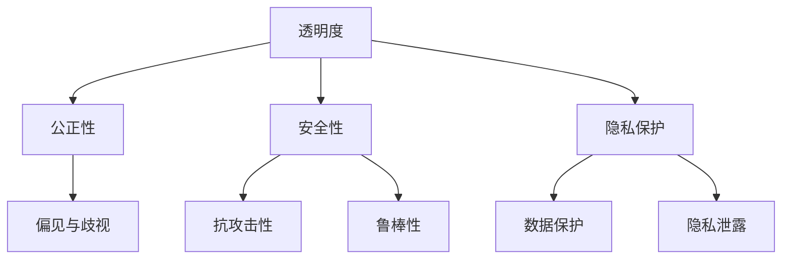
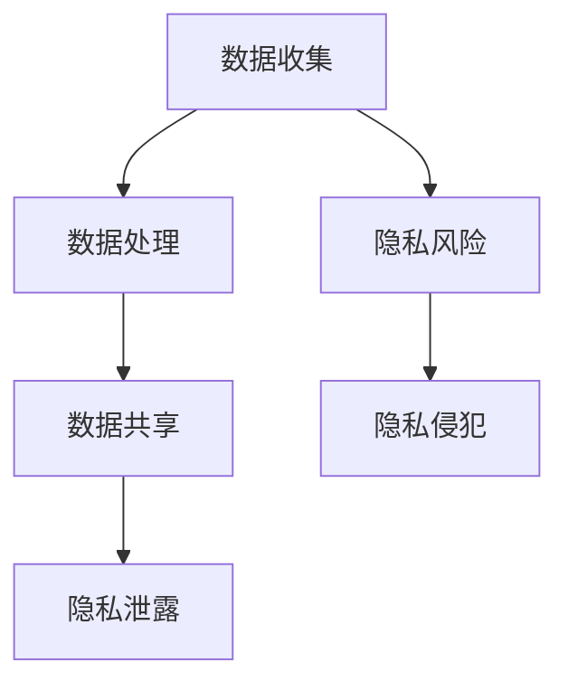
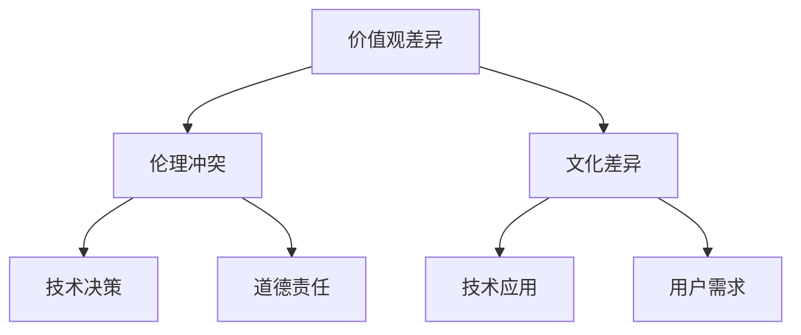
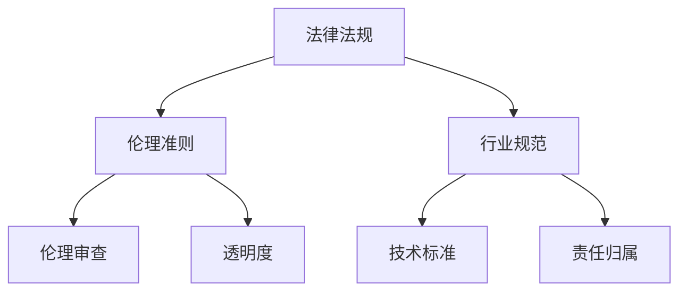
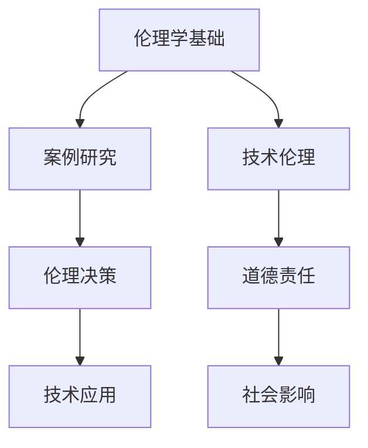
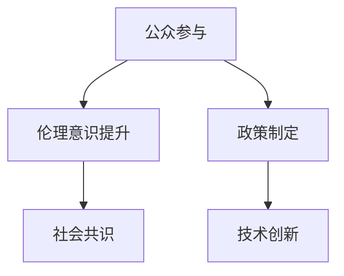
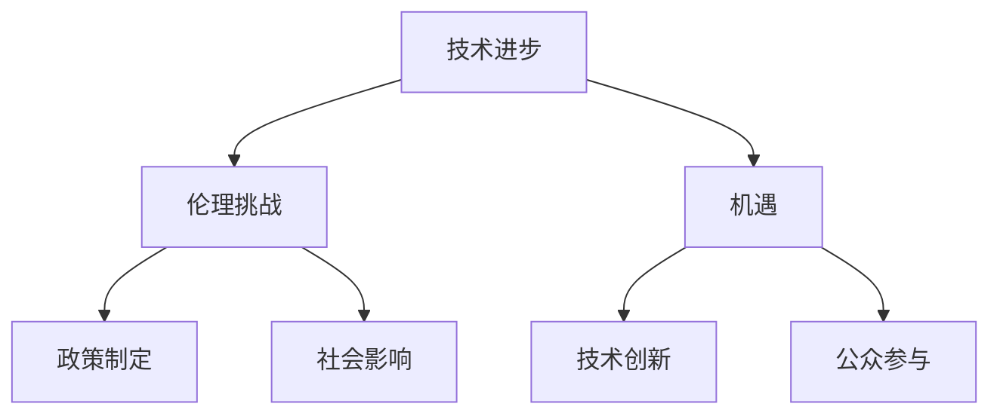

                 

### 文章标题

《硅谷人工智能伦理：技术发展与价值观》

#### 关键词：
- 人工智能伦理
- 硅谷
- 技术发展
- 价值观
- 伦理监管
- 公众参与

#### 摘要：
本文深入探讨了硅谷人工智能伦理的背景、挑战与发展趋势。从伦理学的基本概念出发，我们分析了人工智能技术对就业市场、隐私保护、公平正义等方面的影响，以及全球隐私保护法规和人工智能伦理决策框架。接着，本文探讨了价值观多元性对人工智能伦理的影响，并介绍了硅谷人工智能公司的伦理实践和监管框架。最后，本文提出了人工智能伦理教育的重要性，并对未来人工智能伦理的发展趋势进行了展望，提出了应对未来挑战的政策建议。文章旨在为人工智能领域的研究者和从业者提供一个全面而深入的伦理思考框架，以推动技术发展与伦理价值的和谐共存。

### 引言

人工智能（AI）作为当前科技发展的前沿领域，正以惊人的速度渗透到我们的日常生活、工作和社会各个方面。硅谷作为全球科技创新的聚集地，无疑在人工智能技术的研究与应用上占据了重要地位。然而，随着人工智能技术的飞速发展，一系列伦理问题也随之浮现，引起了广泛关注和讨论。从就业市场的变革到隐私保护的挑战，从人工智能偏见与歧视到价值观的冲突，这些问题不仅关系到技术的应用和普及，更深刻地影响着社会的公平正义与人类的发展方向。

本文旨在深入探讨硅谷人工智能伦理的现状与发展趋势。通过分析人工智能伦理的基本概念、核心问题，以及全球隐私保护法规和人工智能伦理决策框架，我们将对硅谷人工智能产业面临的伦理挑战进行详细剖析。此外，本文还将探讨价值观多元性对人工智能伦理的影响，并介绍硅谷人工智能公司的伦理实践和监管框架。最后，我们将讨论人工智能伦理教育的重要性，并对未来人工智能伦理的发展趋势进行展望，提出相应的政策建议。

本文的结构如下：首先，我们将回顾人工智能伦理学的基本概念，探讨其起源和核心问题。随后，本文将重点关注硅谷人工智能产业的伦理挑战，特别是对就业市场、隐私保护和公平正义的影响。接下来，我们将分析价值观多元性对人工智能伦理的挑战，并介绍硅谷人工智能公司的伦理实践和监管框架。最后，本文将讨论人工智能伦理教育的重要性，展望未来人工智能伦理的发展趋势，并提出政策建议。通过这一系列探讨，本文希望能够为人工智能领域的研究者和从业者提供一个全面而深入的伦理思考框架，以促进技术发展与伦理价值的和谐共存。

#### 第一部分：人工智能伦理概述

##### 第1章：硅谷人工智能伦理背景

在探讨硅谷人工智能伦理之前，我们首先需要理解人工智能伦理学的基本概念和起源。人工智能伦理学作为一门跨学科的研究领域，涉及到计算机科学、伦理学、法律、社会学等多个方面。它的主要目标是探讨人工智能技术在社会和人类生活中的应用过程中所涉及的伦理问题，并寻求合理的解决方案。

**1.1 人工智能伦理学简介**

**核心概念与联系**

在人工智能伦理学中，以下几个核心概念尤为重要：

- **透明度**：指人工智能系统的决策过程和结果应易于理解和解释。
- **公正性**：指人工智能系统不应在种族、性别、年龄等方面产生偏见。
- **安全性**：指人工智能系统应具备抗攻击性和鲁棒性，确保其在各种环境下稳定运行。
- **隐私保护**：指在数据收集、处理和共享过程中，应确保个人隐私不受侵犯。

为了更好地理解这些核心概念之间的关系，我们可以使用Mermaid流程图进行可视化：



**人工智能伦理学的定义与起源**

人工智能伦理学（Ethics of Artificial Intelligence）是近年来随着人工智能技术的迅猛发展而逐渐兴起的一个研究领域。它旨在探讨人工智能技术在社会中的应用所引发的伦理问题，包括但不限于人工智能系统的透明度、公正性、安全性和隐私保护等方面。

人工智能伦理学的起源可以追溯到20世纪80年代，当时随着人工智能技术的初步发展，一些科学家和伦理学家开始关注人工智能技术可能带来的伦理风险。其中，著名的计算机科学家艾伦·图灵（Alan Turing）提出的“图灵测试”被认为是人工智能伦理学的重要理论基础。图灵测试旨在通过评估机器是否具有人类智能来探讨人工智能技术的伦理问题，从而引发了广泛的讨论。

**伦理学在人工智能发展中的重要性**

伦理学在人工智能发展中扮演着至关重要的角色。首先，伦理学可以帮助我们评估人工智能技术的潜在影响，从而制定合理的政策和规范。例如，在数据隐私保护方面，伦理学提供了重要的指导原则，确保人工智能系统的设计和应用不会侵犯用户的隐私权。

其次，伦理学有助于促进人工智能技术的可持续发展。在技术飞速发展的同时，我们不仅要关注其经济和科技价值，更要关注其对人类社会的影响。通过伦理学的视角，我们可以更好地平衡技术进步与社会需求，确保人工智能技术能够在促进社会进步的同时，不会对人类的基本权利和价值观造成损害。

最后，伦理学还可以增强公众对人工智能技术的信任。随着人工智能技术的普及，公众对其可能带来的风险和不确定性感到担忧。通过伦理学的教育和宣传，我们可以提高公众对人工智能技术的理解，增强其对技术的信任，从而更好地推动人工智能技术的发展和应用。

**人工智能伦理的主要问题**

在人工智能伦理学中，以下几个主要问题备受关注：

1. **透明度**：人工智能系统的决策过程往往非常复杂，涉及到大量的数据分析和算法运算。这使得系统的决策过程难以理解和解释，进而可能导致用户对系统的信任度降低。如何提高人工智能系统的透明度，使其决策过程更加透明和可解释，是当前人工智能伦理学的一个重要研究课题。

2. **公正性**：人工智能系统在设计和应用过程中，可能会受到数据偏见的影响，从而导致系统在种族、性别、年龄等方面产生歧视。例如，一些基于历史数据的人工智能系统可能会继承历史上的不公平现象，导致对某些群体不公平的待遇。如何确保人工智能系统的公正性，避免数据偏见和歧视，是人工智能伦理学的重要挑战。

3. **安全性**：人工智能系统在运行过程中可能面临各种安全风险，包括系统漏洞、数据泄露、恶意攻击等。这些安全风险不仅可能对用户造成损失，还可能对整个社会造成严重影响。如何提高人工智能系统的安全性，确保其在各种环境下稳定运行，是人工智能伦理学需要解决的一个重要问题。

4. **隐私保护**：在人工智能应用过程中，大量的个人数据被收集、处理和共享。如何确保这些数据的隐私性，防止个人隐私被侵犯，是人工智能伦理学面临的重大挑战。随着全球隐私保护法规的不断完善，如何在遵守法规的同时，充分利用人工智能技术，也是一个亟待解决的问题。

**人工智能伦理的重要文献与理论**

在人工智能伦理学领域，一些重要的文献和理论为我们的研究提供了深刻的启示。以下是一些具有代表性的文献和理论：

- **艾伦·图灵的《计算机与智能》**：图灵在论文中提出了“图灵测试”，通过评估机器是否具有人类智能来探讨人工智能的伦理问题。这一理论为后续的人工智能伦理研究奠定了基础。

- **《人工智能伦理学指南》**：该指南由国际人工智能联合会（AAAI）和加拿大人工智能协会共同制定，系统地阐述了人工智能伦理学的基本原则和核心问题，为人工智能技术的发展提供了重要的伦理指导。

- **《人工智能的未来：原则与协议》**：这本书由全球著名的人工智能专家杨立昆（Yann LeCun）撰写，提出了人工智能发展的原则和协议，强调了人工智能技术应遵循的基本伦理规范。

- **《人工智能伦理学的跨学科方法》**：该书探讨了人工智能伦理学的跨学科研究方法，包括伦理学、计算机科学、社会学等多个领域的理论和方法，为人工智能伦理学的研究提供了新的视角和思路。

通过回顾人工智能伦理学的基本概念、起源和重要文献，我们可以更好地理解硅谷人工智能伦理的背景和挑战。在接下来的章节中，我们将深入探讨硅谷人工智能产业面临的伦理挑战，分析其在就业市场、隐私保护和公平正义等方面的影响，并介绍全球隐私保护法规和人工智能伦理决策框架。

##### 第2章：硅谷人工智能产业的伦理挑战

硅谷作为全球科技创新的摇篮，吸引了大量的顶尖人才和顶尖企业，人工智能（AI）领域尤其如此。然而，随着人工智能技术的飞速发展，硅谷人工智能产业也面临着诸多伦理挑战，这些挑战不仅影响了技术的应用，还对整个社会产生了深远的影响。

**2.1 人工智能对就业市场的影响**

人工智能技术的迅速发展带来了生产力的显著提升，但同时也引发了就业市场的巨大变革。自动化和智能化的技术逐渐取代了传统的人力工作，这直接影响了就业市场的供需结构。以下是对这一问题的详细分析：

**核心算法原理讲解**

首先，我们可以通过伪代码来分析人工智能技术如何替代或辅助人类工作：

```python
# 伪代码：分析人工智能技术如何替代人力工作

def ai_replaces_human_work(type_of_job, level_of_automation):
    if level_of_automation == "high":
        return "Job loss"
    elif level_of_automation == "medium":
        return "Job change"
    elif level_of_automation == "low":
        return "No significant change"
```

在这个伪代码中，`ai_replaces_human_work` 函数根据不同类型的工作和自动化水平，预测人工智能技术对就业市场的影响。如果自动化水平高，则可能导致大量工作流失；如果自动化水平中等，则可能导致工作性质发生变化；如果自动化水平低，则对就业市场的影响较小。

**数学模型和数学公式**

为了更深入地分析人工智能对就业市场的影响，我们可以建立一个数学模型：

失业率与人工智能应用程度之间的关系模型：

\[ \text{Unemployment Rate} = f(\text{AI Application Level}) \]

其中，失业率（Unemployment Rate）取决于人工智能应用程度（AI Application Level）。假设：

- \( f(0) = 0 \)：人工智能应用程度为零时，失业率为零。
- \( f(1) = 1 \)：人工智能应用程度达到最大时，失业率达到最大。

通过这个模型，我们可以分析不同自动化水平下失业率的变化情况。

**自动化失业的社会与经济影响**

自动化失业对社会的经济影响是多方面的：

1. **就业流失**：人工智能技术的高自动化水平可能导致大量传统工作的流失。例如，制造业中的自动化生产线和智能机器人逐渐取代了人力操作，这在短期内可能导致大量工人失业。

2. **技能需求变化**：随着人工智能技术的普及，劳动力市场的需求将发生变化。高技能的AI工程师和数据分析专家将成为热门职业，而低技能的工作岗位可能会逐渐减少。

3. **社会稳定**：失业率的上升可能对社会稳定产生负面影响。高失业率可能导致社会不满情绪增加，进而影响社会的和谐稳定。

4. **经济结构调整**：自动化和人工智能技术的普及将促使经济结构进行深层次的调整。企业需要重新评估其业务模式和组织结构，以适应技术变革带来的挑战。

**政策建议**

为了缓解人工智能对就业市场的冲击，以下是一些政策建议：

1. **教育培训**：政府和企业应加大对职工的再培训和技能提升投资，帮助劳动者适应新技术的需求，提高其就业竞争力。

2. **创业支持**：鼓励创新和创业，特别是在人工智能领域，为创业者提供资金、技术和市场支持，促进新就业机会的产生。

3. **社会保障**：建立健全的社会保障体系，为因技术变革而失业的劳动者提供基本生活保障，减少社会不稳定因素。

4. **政策引导**：政府应制定合理的产业政策和税收政策，引导资源向高技术产业和新兴产业倾斜，促进经济结构的优化升级。

通过以上分析，我们可以看到，人工智能技术的发展对就业市场带来了深远的影响。面对这一挑战，我们需要从多方面进行思考和应对，确保技术进步能够造福人类社会，而不是成为社会分裂的催化剂。

**案例分析**

为了更直观地理解人工智能对就业市场的影响，我们可以通过具体案例来进行分析。以下是一些具有代表性的案例：

1. **制造业自动化**：以日本为例，该国在制造业中广泛应用自动化和智能化技术，如自动化生产线和智能机器人。这导致了大量传统制造业岗位的流失，但同时也催生了新的就业机会，如AI工程师和智能制造专家。

2. **金融行业**：金融行业是人工智能技术应用的重要领域。通过自然语言处理和机器学习技术，金融公司能够自动化处理大量交易和分析数据。这不仅提高了工作效率，还降低了人工成本。然而，这也导致了一些传统金融岗位的减少。

3. **医疗领域**：在医疗领域，人工智能技术被用于辅助诊断和治疗，如通过深度学习算法进行医学影像分析。这提高了医疗服务的效率和质量，但同时也可能取代一些低技能的医疗工作岗位。

通过这些案例分析，我们可以看到，人工智能技术在不同领域的应用对就业市场产生了不同的影响。虽然总体上可能会带来就业流失，但同时也为新就业机会的产生创造了条件。因此，我们需要在推动技术发展的同时，积极应对技术变革带来的就业挑战，确保社会的稳定和进步。

**总结**

通过对人工智能对就业市场的影响的详细分析，我们可以得出以下结论：

1. **自动化与就业流失**：高自动化水平的人工智能技术可能导致大量传统工作的流失，特别是在制造业、金融和医疗等领域。

2. **技能需求变化**：随着人工智能技术的普及，劳动力市场的需求将发生变化，高技能的AI工程师和数据分析专家将成为热门职业，而低技能的工作岗位可能会逐渐减少。

3. **政策建议**：为了缓解人工智能对就业市场的冲击，政府和企业需要加强教育培训，鼓励创新和创业，建立健全的社会保障体系，并制定合理的产业政策和税收政策。

4. **案例分析**：通过具体案例分析，我们可以看到，人工智能技术在不同领域的应用对就业市场产生了不同的影响，但总体上为新就业机会的产生创造了条件。

综上所述，人工智能技术的发展对就业市场带来了深远的影响。我们需要在技术进步的同时，积极应对这些挑战，确保技术发展与社会的和谐共存。

##### 第3章：人工智能与隐私保护

随着人工智能技术的广泛应用，个人隐私保护问题日益凸显。在硅谷，这一问题的紧迫性尤为突出，因为该地区聚集了众多世界领先的人工智能企业和研究机构。在本章中，我们将探讨人工智能与隐私保护的挑战，并详细分析全球主要隐私保护法规对人工智能产业的影响。

**3.1 人工智能与隐私保护的挑战**

**核心概念与联系**

为了更好地理解人工智能与隐私保护之间的联系，我们可以使用Mermaid流程图来展示两者之间的关系：



**数据收集、处理与共享中的隐私风险**

人工智能技术的核心依赖于大量数据的收集、处理和共享。在这个过程中，隐私风险不可避免地会出现：

1. **数据收集**：人工智能系统需要大量的数据来训练模型，这些数据可能包括个人的姓名、年龄、地理位置、行为习惯等敏感信息。如果数据收集过程不当，可能导致个人隐私泄露。

2. **数据处理**：在数据处理过程中，数据可能会被不当存储、传输和存储，增加了隐私泄露的风险。此外，数据在处理过程中可能被泄露或被恶意攻击者窃取。

3. **数据共享**：人工智能系统的数据不仅在其内部使用，还可能与其他企业和组织共享。在数据共享过程中，隐私保护机制的不完善可能导致个人隐私被滥用。

**隐私保护法规与标准**

为了应对上述隐私风险，全球各国纷纷制定了隐私保护法规和标准，以规范人工智能技术的发展和应用。以下是一些主要的隐私保护法规和标准：

1. **欧盟通用数据保护条例（GDPR）**

   GDPR是欧盟于2018年5月25日生效的一项隐私保护法规，被认为是全球最严格的隐私保护法律之一。GDPR的核心原则包括：

   - **数据主体同意**：用户必须明确同意其数据的收集和处理。
   - **数据最小化**：只能收集和处理与目的相关的数据，不得过度收集。
   - **数据可访问性和可迁移性**：用户有权访问、修改和删除其数据，并有权将数据转移到其他服务提供商。
   - **数据安全**：企业必须采取适当的技术和组织措施，确保数据的安全和完整性。

   GDPR对人工智能产业产生了深远的影响。许多硅谷人工智能企业必须调整其数据收集和处理方式，以符合GDPR的要求。这不仅增加了企业的合规成本，还要求企业在数据处理过程中更加注重隐私保护。

2. **加利福尼亚州消费者隐私法案（CCPA）**

   CCPA是美国加利福尼亚州于2020年生效的一项隐私保护法案，旨在赋予消费者对其个人数据的更多控制权。CCPA的主要内容包括：

   - **数据透明度**：企业必须明确告知消费者其数据收集和处理的方式。
   - **数据访问权**：消费者有权访问、删除和拒绝其个人数据的使用。
   - **数据非歧视**：企业不得因消费者行使隐私权而歧视消费者。

   CCPA对硅谷人工智能企业提出了更高的隐私保护要求。企业在收集和处理消费者数据时，必须更加谨慎，确保遵守CCPA的规定。

3. **其他国家和地区的规定**

   除GDPR和CCPA外，全球其他国家和地区也制定了相应的隐私保护法规。例如：

   - **日本个人信息保护法（APPI）**：规定了个人信息的收集、使用和保护的基本原则。
   - **韩国个人信息保护法（KIPA）**：对个人信息的收集、处理和共享进行了详细规定。
   - **澳大利亚隐私法（Privacy Act）**：要求企业在处理个人信息时遵循透明、公正和合法的原则。

   这些法规和标准为全球人工智能技术的发展提供了重要的法律框架，促进了隐私保护在全球范围内的统一和规范。

**案例分析**

为了更好地理解隐私保护法规对人工智能产业的影响，我们可以通过具体案例来进行分析：

1. **Facebook隐私丑闻**

   2018年，Facebook因剑桥分析公司滥用用户数据而引发了一场全球性的隐私丑闻。该事件揭示了Facebook在数据收集、处理和共享过程中存在的严重隐私问题，引发了公众对隐私保护的强烈关注。为此，Facebook被迫调整其数据处理方式，以符合GDPR的要求。

2. **谷歌和苹果的隐私保护措施**

   谷歌和苹果作为全球领先的科技公司，一直在隐私保护方面采取积极措施。谷歌在Android系统中引入了更加严格的数据收集和处理规则，苹果则在其iOS系统中增加了多项隐私保护功能，如应用权限管理、隐私报告等。这些措施不仅提高了用户对隐私保护的意识，还促进了隐私保护技术的发展。

通过以上分析，我们可以看到，隐私保护是人工智能技术发展中不可忽视的重要问题。全球隐私保护法规的不断完善和实施，为人工智能产业提供了重要的法律保障，同时也对企业的数据处理方式提出了更高的要求。在未来的发展中，硅谷人工智能企业需要进一步加强隐私保护，以赢得公众的信任和支持。

**总结**

1. **隐私风险**：人工智能技术在数据收集、处理和共享过程中存在隐私风险，可能导致个人隐私泄露和侵犯。

2. **隐私保护法规**：全球主要隐私保护法规如GDPR和CCPA对人工智能产业产生了深远影响，要求企业在数据处理过程中更加注重隐私保护。

3. **案例分析**：通过案例分析，我们可以看到隐私保护法规的实施对人工智能企业提出了更高的要求，促使企业采取更加严格的隐私保护措施。

综上所述，隐私保护是人工智能技术发展中面临的重要挑战之一。我们需要在技术进步的同时，不断完善隐私保护法规和标准，确保人工智能技术的健康发展。

##### 第4章：人工智能与公平正义

人工智能技术在许多领域的应用已经取得了显著成效，但与此同时，其潜在的偏见和歧视问题也引起了广泛关注。在本章中，我们将深入探讨人工智能偏见与歧视的核心算法原理，并构建一个适用于人工智能伦理决策的框架，以促进技术的公平正义。

**4.1 人工智能偏见与歧视**

人工智能偏见与歧视是指人工智能系统在决策过程中，因数据中的偏见而导致的对某些群体不公平的待遇。以下是我们对这一问题的详细分析：

**核心算法原理讲解**

首先，我们可以通过伪代码来分析数据偏见如何影响人工智能决策：

```python
# 伪代码：分析数据偏见如何影响人工智能决策

def biased_decision-making(data):
    # 假设数据中存在性别偏见，女性被赋予较低评分
    if 'gender' in data and data['gender'] == 'female':
        return "Low Score"
    else:
        return "Normal Score"
```

在这个伪代码中，`biased_decision-making` 函数根据数据中的性别信息来决定评分。如果数据中的性别是女性，系统会赋予较低的评分，这显然是一种偏见。

**数学模型和数学公式**

为了更深入地分析人工智能偏见与歧视，我们可以建立以下数学模型：

偏见识别与校正模型：

\[ \text{Corrected Score} = \text{Original Score} - \text{Bias Factor} \times (\text{Bias Coefficient}) \]

其中，`Corrected Score` 表示纠正后的评分，`Original Score` 表示原始评分，`Bias Factor` 表示偏见因素，`Bias Coefficient` 表示偏见系数。通过这个模型，我们可以识别和校正数据中的偏见。

例如，假设一个评分系统在性别上存在0.1的偏见系数，那么对于女性申请者的评分可以这样校正：

\[ \text{Corrected Score} = \text{Original Score} - 0.1 \times (\text{Gender Coefficient}) \]

**人工智能伦理决策框架**

为了解决人工智能偏见与歧视问题，我们需要构建一个适用于人工智能伦理决策的框架。以下是一个包含透明度、责任、公正性等方面考量的决策框架：

1. **透明度**：确保人工智能系统的决策过程可解释和透明，使决策结果易于理解和验证。

2. **责任**：明确人工智能系统责任归属，确保在出现错误决策时，责任能够追溯。

3. **公正性**：通过数据校正和公平性评估，消除数据偏见，确保人工智能系统在决策过程中对各个群体公平对待。

**详细讲解**

1. **透明度**

   透明度是人工智能伦理决策框架的核心要素之一。为了提高系统的透明度，我们可以采取以下措施：

   - **决策路径可视化**：通过图表和可视化工具，展示人工智能系统的决策路径和关键参数。
   - **可解释性算法**：采用可解释性算法，如决策树、规则推理等，使决策过程更加直观易懂。

2. **责任**

   责任归属是确保人工智能系统公平公正运行的重要保障。在责任归属方面，我们可以考虑以下原则：

   - **明确责任主体**：明确人工智能系统的开发者、运营者和用户在决策过程中的责任。
   - **责任追究机制**：建立责任追究机制，确保在出现错误决策时，责任能够及时追究。

3. **公正性**

   公正性是人工智能伦理决策框架的核心目标之一。为了实现公正性，我们可以采取以下措施：

   - **数据校正**：通过数据清洗和预处理，消除数据中的偏见，确保数据质量。
   - **公平性评估**：定期进行公平性评估，检测人工智能系统在决策过程中是否存在对某些群体的不公平待遇。

通过构建一个包含透明度、责任、公正性等方面考量的伦理决策框架，我们可以更好地解决人工智能偏见与歧视问题，促进人工智能技术的公平正义发展。

**总结**

通过对人工智能偏见与歧视的深入分析，我们可以得出以下结论：

1. **核心算法原理**：数据偏见通过影响人工智能决策，可能导致对某些群体不公平的待遇。

2. **数学模型**：偏见识别与校正模型可以帮助我们识别和纠正数据中的偏见。

3. **伦理决策框架**：通过构建透明度、责任、公正性等方面的决策框架，我们可以更好地解决人工智能偏见与歧视问题，促进技术的公平正义发展。

综上所述，人工智能与公平正义密切相关。通过伦理决策框架的建立和实施，我们可以确保人工智能技术的公平性和透明性，使其更好地服务于人类社会。

##### 第5章：人工智能与价值观的冲突

在全球化进程中，不同国家和文化之间的价值观差异日益显著，这些差异不仅影响人类社会的发展，也对人工智能（AI）技术产生了深远影响。在本章中，我们将探讨价值观多元性对人工智能伦理的挑战，并分析不同文化背景下的人工智能伦理问题及解决方案。

**5.1 价值观多元性对人工智能伦理的影响**

**核心概念与联系**

为了更好地理解价值观多元性对人工智能伦理的影响，我们可以使用Mermaid流程图来展示关键概念之间的关系：



在这个流程图中，价值观差异（A）和文化差异（C）是影响人工智能伦理的核心概念。伦理冲突（B）和技术决策（D）、道德责任（E）密切相关，而技术应用（F）和用户需求（G）则受到价值观和文化差异的影响。

**全球化背景下的价值观差异**

全球化带来了文化多样性的增加，不同国家和地区的价值观也呈现出多样性。以下是一些主要的价值观差异：

1. **个人主义与集体主义**

   个人主义强调个人自由、权利和自我实现，而集体主义则强调集体利益、社会和谐与归属感。在个人主义文化中，人工智能技术可能更注重个体的隐私权和自主性；而在集体主义文化中，社会整体利益和公共安全可能被视为更为重要。

2. **自由与控制**

   一些文化强调个人自由，反对政府和社会对个人生活的过度干涉，而另一些文化则更倾向于政府控制和社会秩序。在自由导向的文化中，人工智能技术可能需要更多的隐私保护措施；而在控制导向的文化中，政府可能更愿意利用人工智能技术进行社会管理和监控。

3. **权力与平等**

   在权力差异明显的文化中，人工智能技术可能加剧社会不平等，使权力集中的现象更加显著。而在追求平等的文化中，人工智能技术需要设计得更加公平，以确保技术对各个群体的利益均衡。

**不同文化背景下的人工智能伦理问题**

1. **隐私保护**

   在强调隐私权的文化中，如美国和欧洲，人工智能技术的应用需要严格遵守隐私保护法规。而在一些亚洲国家，如中国和印度，政府和企业可能更倾向于利用人工智能技术进行大规模的数据收集和分析，这可能引发隐私保护的问题。

2. **道德责任**

   在一些文化中，道德责任更多地由个人承担，而在另一些文化中，道德责任可能更多地由集体或社会承担。例如，在西方国家，人工智能系统的开发者需要对自己的技术负责，而在某些东方文化中，可能更强调用户和集体的责任。

3. **技术应用**

   不同的文化背景可能导致对人工智能技术应用的不同看法。在创新导向的文化中，人工智能技术的应用可能更加广泛和激进；而在保守文化中，技术应用的步伐可能更缓慢，以确保社会稳定和传统价值观的维护。

**跨文化人工智能伦理研究**

为了应对全球化背景下的价值观差异，跨文化人工智能伦理研究变得尤为重要。以下是一些研究方法：

1. **文化比较研究**

   通过比较不同文化背景下的价值观和伦理观念，分析人工智能技术在不同文化中的适应性和影响。

2. **文化敏感性培训**

   对人工智能领域的从业者进行跨文化敏感性培训，提高他们对不同文化价值观的理解和尊重，以设计出更加符合多文化需求的人工智能系统。

3. **多元文化工作小组**

   建立由不同文化背景的专家组成的工作小组，共同探讨和解决人工智能伦理问题，确保技术决策的多样性和包容性。

**案例分析**

为了更好地理解价值观多元性对人工智能伦理的影响，我们可以通过具体案例进行分析：

1. **自动驾驶汽车**

   在美国，自动驾驶汽车技术的发展面临隐私保护和道德责任的挑战。例如，当自动驾驶汽车在紧急情况下需要做出选择时，如何平衡不同价值观（如个人安全和公共安全）是一个重要的伦理问题。

2. **面部识别技术**

   在中国，面部识别技术的广泛应用引发了隐私保护和道德责任的问题。由于政府和企业大量使用这一技术进行监控和管理，如何保护个人隐私并确保技术不滥用成为一个重要的伦理挑战。

**总结**

1. **价值观多元性**：全球化背景下的价值观差异对人工智能伦理产生了深远影响，不同文化背景可能导致对人工智能技术的不同看法和应用。

2. **伦理挑战**：隐私保护、道德责任和技术应用是价值观多元性带来的主要伦理挑战。

3. **研究方法**：跨文化人工智能伦理研究可以通过文化比较研究、文化敏感性培训和多元文化工作小组等方法来应对这些挑战。

综上所述，人工智能与价值观的冲突是一个复杂且多维度的问题。在全球化背景下，我们需要通过跨文化人工智能伦理研究，探索和解决这一挑战，以确保人工智能技术的公平、公正和可持续发展。

#### 第二部分：技术发展与伦理实践

##### 第6章：硅谷人工智能公司的伦理实践

硅谷作为全球科技创新的摇篮，吸引了众多顶尖的人工智能公司和研究人员。随着人工智能技术的迅猛发展，伦理问题也日益凸显。为了应对这些挑战，硅谷的人工智能公司纷纷采取了一系列伦理实践，通过制定伦理政策和设立伦理委员会来确保技术的公正、透明和安全。以下是对几家主要硅谷人工智能公司的伦理实践和监管框架的详细介绍。

**6.1 硅谷人工智能公司伦理政策**

1. **谷歌**

   谷歌是全球领先的科技公司之一，其在人工智能伦理方面的实践备受关注。谷歌制定了一系列伦理准则，旨在确保人工智能技术的公正性和透明度。这些准则包括：

   - **公平性**：谷歌致力于确保其人工智能系统在种族、性别和地理位置等方面对各个群体公平对待。
   - **隐私保护**：谷歌强调对用户隐私的保护，严格遵守全球隐私保护法规，如GDPR和CCPA。
   - **透明度**：谷歌鼓励在其人工智能系统中采用透明和可解释的算法，以便用户和研究人员能够理解和验证系统的决策过程。

2. **微软**

   微软在其人工智能伦理政策中强调四个核心原则：隐私保护、公正性、透明度和责任。微软设立了人工智能伦理委员会，负责监督和评估公司的人工智能项目，确保这些项目符合伦理标准。

3. **亚马逊**

   亚马逊在其人工智能伦理政策中，特别关注人工智能系统的偏见问题。亚马逊采取了一系列措施来减少偏见，包括定期对算法进行公平性评估，以及提供员工培训，提高对伦理问题的认识。

**6.2 伦理委员会与道德准则**

除了制定伦理政策，硅谷的人工智能公司还设立了专门的伦理委员会，负责监督和评估公司的人工智能项目。以下是对几家主要公司伦理委员会和道德准则的介绍：

1. **谷歌人工智能伦理委员会**

   谷歌人工智能伦理委员会由外部专家和公司内部员工组成，负责评估谷歌在人工智能领域的研究和应用项目。委员会成员包括伦理学家、计算机科学家、社会学家等，以确保从多角度审视伦理问题。

   - **道德准则**：谷歌人工智能伦理委员会制定了一系列道德准则，包括透明性、公正性和责任等。这些准则为谷歌在人工智能项目中的决策提供了指导。

2. **微软人工智能伦理委员会**

   微软人工智能伦理委员会由微软的全球执行副总裁领导，成员包括公司内部各部门的代表和外部专家。该委员会定期举行会议，评估微软的人工智能项目是否符合伦理标准。

   - **道德准则**：微软人工智能伦理委员会制定了一套详细的道德准则，包括数据保护、公正性、透明度和责任等。这些准则确保微软在人工智能领域的研究和应用项目遵循最高的伦理标准。

3. **亚马逊人工智能伦理委员会**

   亚马逊人工智能伦理委员会成立于2021年，由公司内部和外部的专家组成。该委员会的职责是监督亚马逊在人工智能领域的项目，确保项目符合公司的伦理标准。

   - **道德准则**：亚马逊人工智能伦理委员会制定了一套道德准则，包括消除偏见、保护用户隐私、确保公正性和透明度等。这些准则旨在确保亚马逊的人工智能技术对各个群体公平对待，并保护用户的隐私。

**6.3 具体案例分析**

为了更好地了解硅谷人工智能公司在伦理实践中的具体做法，以下是对几项具有代表性的案例分析：

1. **谷歌的自动驾驶汽车项目**

   谷歌的自动驾驶汽车项目在技术开发过程中，高度重视伦理问题。项目团队建立了专门的伦理委员会，负责评估自动驾驶汽车在紧急情况下如何做出决策。该委员会制定了详细的道德准则，确保自动驾驶汽车在遇到复杂情况时，能够做出符合伦理标准的决策。

2. **微软的语音识别技术**

   微软在开发语音识别技术时，特别关注性别偏见问题。通过对大量语音数据进行仔细分析，微软发现女性语音的识别率较低。为了解决这一问题，微软采取了多种措施，包括增加女性语音样本的数量，优化算法，提高女性语音的识别率。

3. **亚马逊的人脸识别技术**

   亚马逊的人脸识别技术在商业应用中备受争议。为了应对隐私保护和道德责任问题，亚马逊成立了专门的伦理委员会，负责监督人脸识别技术的应用。该委员会制定了详细的道德准则，包括限制人脸识别技术在监控和执法等敏感领域的使用。

**总结**

硅谷的人工智能公司通过制定伦理政策和设立伦理委员会，积极应对人工智能技术发展带来的伦理挑战。这些实践不仅提高了公司的社会责任感，也增强了公众对人工智能技术的信任。未来，随着人工智能技术的不断进步，硅谷的人工智能公司需要继续加强伦理实践，确保技术发展与社会价值的和谐共存。

##### 第7章：人工智能伦理的监管与治理

随着人工智能技术的迅猛发展，其对社会、经济和伦理的深远影响引发了全球范围内的广泛关注。为了确保人工智能技术的健康发展，各国政府和国际组织纷纷采取措施，建立人工智能伦理的监管与治理框架。本章将探讨人工智能伦理监管框架的核心概念与组成部分，以及全球人工智能伦理监管政策的发展趋势。

**7.1 人工智能伦理监管框架**

**核心概念与联系**

为了更好地理解人工智能伦理监管框架，我们可以使用Mermaid流程图来展示其核心概念和组成部分：



在这个流程图中，法律法规（A）、伦理准则（B）和行业规范（C）构成了人工智能伦理监管框架的三个核心部分。伦理审查（D）、透明度（E）和责任归属（G）则是确保人工智能技术合规运行的重要环节。

**法律法规**

法律法规是人工智能伦理监管框架的基础，通过立法手段规范人工智能技术的研究、开发和应用。以下是一些全球主要法律法规：

1. **欧盟通用数据保护条例（GDPR）**：GDPR是欧盟于2018年颁布的一项全面数据保护法规，对个人数据的收集、处理和共享进行了详细规定，对全球人工智能企业具有广泛影响。

2. **加利福尼亚州消费者隐私法案（CCPA）**：CCPA是美国加利福尼亚州于2020年生效的一项隐私保护法案，旨在赋予消费者对其个人数据的更多控制权。

3. **日本个人信息保护法（APPI）**：APPI是日本制定的个人信息保护法律，规定了个人信息的收集、使用和保护的基本原则。

**伦理准则**

伦理准则是人工智能技术发展的重要指导原则，旨在确保技术在应用过程中遵循伦理规范。以下是一些主要伦理准则：

1. **联合国人工智能原则**：联合国在2019年发布了一套人工智能原则，包括尊重人类尊严、公正性、透明度、责任和可持续性等。

2. **欧盟人工智能伦理准则**：欧盟在2021年颁布了人工智能伦理准则，强调确保人工智能系统的公正性、透明性和安全性。

3. **IEEE人工智能伦理准则**：IEEE发布了人工智能伦理准则，包括尊重人类价值、公正性、透明度、责任和隐私保护等。

**行业规范**

行业规范是由行业协会或企业自发制定的，旨在规范行业内的人工智能技术研究和应用。以下是一些主要行业规范：

1. **人工智能安全准则**：国际人工智能安全委员会发布了一系列安全准则，包括算法透明度、数据安全、系统鲁棒性和用户隐私保护等。

2. **自动驾驶汽车行业规范**：多个国家和地区制定了自动驾驶汽车行业规范，包括车辆设计、测试标准和责任归属等。

**7.2 全球人工智能伦理监管政策的发展趋势**

随着人工智能技术的不断进步，全球人工智能伦理监管政策也呈现出以下发展趋势：

1. **政策逐步完善**

   各国政府逐渐认识到人工智能伦理监管的重要性，纷纷出台相关政策和法规，以规范人工智能技术的发展和应用。未来，全球人工智能伦理监管政策将更加完善和统一。

2. **跨部门协作加强**

   人工智能技术涉及多个领域，如计算机科学、伦理学、法律和社会学等。为了确保监管政策的全面性和有效性，各国政府将加强跨部门协作，共同制定和实施监管政策。

3. **国际协调与合作**

   随着全球化的深入推进，各国在人工智能伦理监管方面需要加强国际协调与合作。通过国际合作，各国可以共享监管经验，制定统一的伦理标准和规范，确保全球人工智能技术的健康发展。

4. **公众参与和透明度**

   公众对人工智能伦理问题的关注日益增加，政府和企业将更加重视公众参与和透明度。通过公开讨论、听证会和公众咨询等方式，政府和企业可以更好地了解公众需求和关切，制定更加科学和公正的监管政策。

**案例分析**

为了更好地理解全球人工智能伦理监管政策的发展趋势，以下是对几个具有代表性的案例分析：

1. **欧盟的人工智能法案**

   欧盟在2021年颁布了《人工智能法案》，旨在制定全面的人工智能伦理监管框架。该法案包括对高风险人工智能系统的严格监管措施，如自动驾驶汽车、医疗诊断系统和安全监控等。

2. **美国国家人工智能策略**

   美国政府发布了《国家人工智能策略》，提出了多项措施，包括加强人工智能伦理监管、推动跨学科研究和国际合作等。该策略强调了人工智能技术在促进经济增长和社会进步方面的潜力。

3. **中国的人工智能发展规划**

   中国政府发布了《新一代人工智能发展规划》，提出了人工智能伦理监管的政策框架，包括制定人工智能伦理准则、加强技术研发和推动国际合作等。该规划旨在确保人工智能技术的健康、稳定和可持续发展。

**总结**

人工智能伦理监管框架是确保人工智能技术健康发展的重要保障。通过法律法规、伦理准则和行业规范的协同作用，以及全球范围内的协调与合作，我们可以构建一个公正、透明和可持续的人工智能伦理监管体系。未来，随着人工智能技术的不断进步，全球人工智能伦理监管政策将不断完善，以应对新兴的伦理挑战。

##### 第8章：人工智能伦理教育与公众参与

随着人工智能技术的迅猛发展，其对社会各个领域的深远影响越来越明显，公众对人工智能伦理问题的关注和认识也在不断提高。因此，人工智能伦理教育的重要性愈发凸显。本章将探讨人工智能伦理教育的重要性，以及如何通过公众参与提高社会对人工智能伦理问题的关注。

**8.1 人工智能伦理教育的重要性**

人工智能伦理教育是培养新一代人工智能从业者和公众理解人工智能伦理问题的基础。以下从几个方面详细讲解人工智能伦理教育的重要性：

**核心概念与联系**

我们可以使用Mermaid流程图来展示人工智能伦理教育的重要概念及其关系：



在这个流程图中，伦理学基础（A）、技术伦理（C）和案例研究（B）是人工智能伦理教育的核心内容。通过这些教育内容，学生可以学会如何做出伦理决策（D）、承担道德责任（E），并在技术应用（F）和社会影响（G）方面具备深刻的理解和判断能力。

**伦理学基础**

伦理学基础是人工智能伦理教育的首要内容，旨在为学生提供伦理学的基本理论和概念。通过学习伦理学基础，学生可以了解伦理原则、道德规范和伦理决策的基本框架。以下是一些重要概念：

- **伦理原则**：如公正性、透明度、责任和隐私保护等。
- **道德规范**：如不伤害他人、尊重他人权利和诚信等。

**技术伦理**

技术伦理是人工智能伦理教育的核心，旨在探讨人工智能技术在应用过程中可能引发的伦理问题。以下是一些重要内容：

- **技术伦理原则**：如技术的中立性、公正性和可持续性等。
- **技术伦理挑战**：如隐私保护、偏见和歧视、安全性和可控性等。

**案例研究**

案例研究是人工智能伦理教育的重要手段，通过分析真实的人工智能应用案例，学生可以深入了解伦理问题的复杂性和解决方法。以下是一些典型案例：

- **自动驾驶汽车**：探讨自动驾驶汽车在紧急情况下如何做出伦理决策。
- **面部识别技术**：分析面部识别技术在隐私保护和道德责任方面的挑战。
- **医疗人工智能**：讨论医疗人工智能在诊断和治疗过程中的伦理问题。

**8.2 公众参与与伦理意识提升**

公众参与是提高社会对人工智能伦理问题关注的重要途径。通过公众参与，我们可以增强公众对人工智能伦理问题的认识和意识，从而推动社会的整体进步。以下是如何通过公众参与提高伦理意识的具体方法：

**核心概念与联系**

为了更好地理解公众参与与伦理意识提升的关系，我们可以使用Mermaid流程图来展示：



在这个流程图中，公众参与（A）和政策制定（C）是提升伦理意识（B）的重要途径。通过公众参与，我们可以形成社会共识（D），从而推动技术创新（E）的伦理发展。

**政策制定**

政策制定是公众参与的重要环节，通过公开讨论、听证会和公众咨询等方式，政府可以听取公众的意见和建议，制定更加科学和公正的政策。以下是一些具体方法：

- **公开讨论**：在政策制定过程中，政府可以组织公开讨论会，邀请公众代表和专家参与，共同探讨人工智能伦理问题。
- **听证会**：政府可以召开听证会，邀请公众、学者、企业代表等就特定的人工智能伦理问题进行深入讨论。
- **公众咨询**：政府可以通过在线平台和问卷调查等方式，广泛征集公众的意见和建议，确保政策制定过程的透明性和公正性。

**公众参与平台**

为了方便公众参与，可以建立多种公众参与平台，如在线论坛、社交媒体群组和专门的人工智能伦理网站等。以下是一些具体平台：

- **在线论坛**：建立专门的人工智能伦理在线论坛，供公众讨论和交流伦理问题。
- **社交媒体群组**：在社交媒体上创建人工智能伦理群组，方便公众分享观点和讨论。
- **人工智能伦理网站**：建立一个综合性的人工智能伦理网站，提供政策信息、案例分析、教育资源等。

**公众参与活动**

为了提高公众对人工智能伦理问题的关注，可以组织各种公众参与活动，如研讨会、工作坊、讲座和社区活动等。以下是一些具体活动：

- **研讨会**：邀请伦理学家、计算机科学家、社会活动家和公众代表，共同探讨人工智能伦理问题。
- **工作坊**：组织人工智能伦理工作坊，让参与者通过角色扮演、案例分析等方式，深入理解伦理问题。
- **讲座**：邀请专家学者和社会活动家进行讲座，向公众普及人工智能伦理知识。
- **社区活动**：在社区内组织人工智能伦理宣传活动，提高公众对伦理问题的认识。

**总结**

人工智能伦理教育的重要性不可忽视，通过伦理学基础、技术伦理和案例研究等方面的教育，我们可以培养新一代人工智能从业者和公众对伦理问题的深刻理解。同时，公众参与是提升社会伦理意识的重要途径，通过政策制定、公众参与平台和公众参与活动等方式，我们可以增强公众对人工智能伦理问题的关注，推动社会的整体进步。

##### 第9章：未来展望：人工智能伦理的发展趋势

随着人工智能技术的不断进步和应用，其对社会各个领域的影响日益深远，同时也带来了诸多伦理挑战。在未来，人工智能伦理将继续面临新的机遇和挑战，其发展趋势将受到技术进步、社会需求和国际合作等多方面因素的影响。以下是对人工智能伦理未来发展趋势的展望，并提出应对这些挑战的政策建议。

**9.1 人工智能伦理的未来挑战与机遇**

**核心概念与联系**

为了更好地理解人工智能伦理的未来挑战与机遇，我们可以使用Mermaid流程图来展示：



在这个流程图中，技术进步（A）带来了伦理挑战（B）和机遇（C）。政策制定（D）、社会影响（E）和公众参与（G）则是应对这些挑战和利用机遇的关键环节。

**技术进步**

技术进步是人工智能伦理未来发展的核心驱动力。以下是一些技术进步带来的挑战和机遇：

1. **挑战**

   - **智能代理与自主决策**：随着智能代理和自主决策系统的发展，如何确保其符合伦理标准，避免滥用和失控，是一个重要挑战。
   - **量子计算**：量子计算技术的突破可能颠覆现有的人工智能算法和体系结构，带来新的伦理问题，如量子计算的安全性和隐私保护。

2. **机遇**

   - **人工智能治理**：技术进步为构建更加智能和高效的人工智能治理体系提供了可能，通过大数据分析、区块链技术等，可以提升伦理监管的效率和效果。
   - **个性化与公正性**：随着人工智能技术的进步，我们可以开发更加个性化的应用，同时确保技术的公正性，减少偏见和歧视。

**社会影响**

人工智能技术对社会的深远影响将不断加剧，其伦理挑战也将随之增加。以下是一些社会影响带来的挑战和机遇：

1. **挑战**

   - **就业市场**：自动化和智能化技术可能进一步改变就业市场结构，带来失业和社会不稳定的风险。
   - **隐私保护**：随着数据收集和处理的规模不断扩大，隐私保护问题将更加突出。

2. **机遇**

   - **社会福祉**：人工智能技术可以用于改善医疗、教育、环境等领域，提高社会福祉。
   - **公共服务**：人工智能技术可以提升公共服务的效率和质量，如智能交通管理、智能城市服务等。

**公众参与**

公众参与是人工智能伦理发展的重要保障。以下是如何通过公众参与应对未来挑战的具体方法：

1. **政策制定**

   - **透明度**：在政策制定过程中，政府应增加透明度，公开讨论和征求意见，确保政策的公正性和有效性。
   - **公众咨询**：政府应建立有效的公众参与机制，通过在线平台、听证会等形式，广泛征集公众的意见和建议。

2. **技术创新**

   - **社区参与**：鼓励社区参与人工智能技术的研发和应用，确保技术应用符合公众的需求和价值观。
   - **合作与共享**：推动学术机构、企业和政府之间的合作，共享技术创新成果，共同应对伦理挑战。

**数学模型和数学公式**

为了更好地预测和分析人工智能伦理的未来发展趋势，我们可以使用数学模型和公式。以下是一个简单的预测模型：

\[ \text{Future Ethics Challenge} = f(\text{Technology Progress}, \text{Social Impact}, \text{Public Participation}) \]

其中，未来伦理挑战（Future Ethics Challenge）取决于技术进步（Technology Progress）、社会影响（Social Impact）和公众参与（Public Participation）。通过这个模型，我们可以预测未来伦理挑战的发展趋势。

**9.2 政策建议**

为了应对人工智能伦理的未来挑战，以下是一些政策建议：

1. **加强监管**

   - **立法与执法**：政府应加强人工智能伦理的立法和执法力度，确保法律法规的全面实施。
   - **跨部门合作**：建立跨部门的监管机制，确保人工智能伦理监管的协调和高效。

2. **推动技术创新**

   - **研发支持**：政府和企业应加大对人工智能伦理技术创新的投入，推动伦理技术的研发和应用。
   - **标准化**：制定统一的伦理标准和规范，确保人工智能技术的公正性和透明度。

3. **公众参与**

   - **教育普及**：加强对公众的人工智能伦理教育，提高公众对伦理问题的认识和参与意识。
   - **公众咨询**：在政策制定过程中，充分听取公众的意见和建议，确保政策的公正性和科学性。

4. **国际合作**

   - **信息共享**：推动国际间的信息共享和合作，共同应对全球范围内的人工智能伦理挑战。
   - **多边机制**：建立多边机制，制定全球范围内的人工智能伦理标准和规范。

**总结**

未来，人工智能伦理将继续面临新的挑战和机遇。通过技术进步、社会影响和公众参与的共同作用，我们可以预见人工智能伦理发展的新趋势。为了应对这些挑战，政府、企业和社会应共同努力，制定和实施有效的政策和措施，确保人工智能技术的公正、透明和可持续发展。

### 附录

#### 附录 A：人工智能伦理相关资源与工具

在人工智能伦理研究领域，有许多重要的资源与工具可以帮助研究者、从业者和公众深入了解这一领域。以下是一些主要的人工智能伦理研究机构、关键文献与报告，以及教育资源。

**A.1 人工智能伦理研究机构与组织**

1. **国际人工智能联合会（AAAI）**：AAAI是全球领先的人工智能学术组织，其官方网站提供了大量关于人工智能伦理的研究论文和资源。
   - 网址：[https://www.aaai.org/](https://www.aaai.org/)

2. **欧洲人工智能协会（EAAI）**：EAAI是欧洲地区的人工智能学术组织，专注于人工智能伦理、社会影响和标准化研究。
   - 网址：[https://www.e-aai.eu/](https://www.e-aai.eu/)

3. **斯坦福大学人工智能伦理中心（Stanford Center for AI Ethics and Policy）**：该中心致力于研究人工智能的伦理和社会影响，并提供丰富的在线资源和报告。
   - 网址：[https://aiethics.stanford.edu/](https://aiethics.stanford.edu/)

4. **牛津互联网研究所（Oxford Internet Institute）**：该研究所专注于互联网和社会的研究，包括人工智能伦理问题。
   - 网址：[https://oii.ox.ac.uk/](https://oii.ox.ac.uk/)

**A.2 人工智能伦理相关文献与报告**

1. **《人工智能伦理学指南》**：由AAAI和加拿大人工智能协会共同制定的指南，提供了人工智能伦理学的基本原则和核心问题。
   - 网址：[https://www.aaai.org/ocs/index.php/AAAI/AAAI21/paper/view/6657](https://www.aaai.org/ocs/index.php/AAAI/AAAI21/paper/view/6657)

2. **《人工智能的未来：原则与协议》**：由全球著名人工智能专家杨立昆撰写的书籍，提出了人工智能发展的原则和协议。
   - 网址：[https://www.coursera.org/learn/future-of-ai-principles-agreements](https://www.coursera.org/learn/future-of-ai-principles-agreements)

3. **《人工智能伦理学的跨学科方法》**：探讨了人工智能伦理学的跨学科研究方法，包括伦理学、计算机科学、社会学等多个领域的理论和方法。
   - 网址：[https://books.google.com/books?id=77gOoAEACAAJ](https://books.google.com/books?id=77gOoAEACAAJ)

4. **联合国《人工智能原则》**：联合国在2019年发布的人工智能原则，包括尊重人类尊严、公正性、透明度、责任和可持续性等。
   - 网址：[https://www.un.org/en/technical-cooperation-at-unescap/future-of-work/artificial-intelligence-principles/](https://www.un.org/en/technical-cooperation-at-unescap/future-of-work/artificial-intelligence-principles/)

**A.3 人工智能伦理教育资源**

1. **《人工智能伦理学课程》**：斯坦福大学提供的一门在线课程，涵盖了人工智能伦理学的基本概念、案例分析和技术应用。
   - 网址：[https://www.coursera.org/learn/ai-ethics](https://www.coursera.org/learn/ai-ethics)

2. **《人工智能与社会：伦理、政策与法律》**：由加州大学伯克利分校提供的在线课程，探讨了人工智能在社会中的应用及其伦理、政策和法律问题。
   - 网址：[https://www.edx.org/course/ai-and-society-ethics-policy-and-law-berkeleyx-ai-societyx](https://www.edx.org/course/ai-and-society-ethics-policy-and-law-berkeleyx-ai-societyx)

3. **《人工智能伦理与治理》**：中国工程院发布的人工智能伦理与治理研究报告，提供了关于人工智能伦理问题的详细分析和建议。
   - 网址：[http://www.cie.ac.cn/kyzx/yjbgd/202009/t20200923_38724.html](http://www.cie.ac.cn/kyzx/yjbgd/202009/t20200923_38724.html)

通过以上资源与工具，我们可以更好地了解人工智能伦理的相关知识，为研究和实践提供有力支持。

### 附录 B：人工智能伦理案例研究

在人工智能伦理领域，有许多典型的案例可以展示伦理问题在实际中的应用和影响。以下是对几个具有代表性的伦理案例的详细解释，以及企业如何应对这些问题的分析。

**B.1 典型人工智能伦理案例**

1. **谷歌面部识别隐私丑闻**

   案例背景：2018年，谷歌因其在Google Photos中的面部识别功能涉嫌侵犯用户隐私而引发争议。该功能在用户未明确同意的情况下，将照片中的面孔标记并归类，用户在删除特定面孔标签后仍无法彻底移除相关信息。

   **详细解释**：这一案例揭示了人工智能技术在隐私保护方面的潜在风险。用户隐私权未得到充分尊重，隐私数据的处理过程缺乏透明度和用户控制。

   **企业应对**：谷歌在事件发生后采取了多项措施，包括更新隐私政策，增加用户隐私设置选项，并提供详细的隐私解释。此外，谷歌成立了隐私委员会，负责监督和改进隐私保护措施。

2. **亚马逊智能助手Echo Look隐私问题**

   案例背景：亚马逊的智能助手Echo Look在用户不知情的情况下拍摄和上传用户照片，引发公众对隐私保护和道德责任的质疑。

   **详细解释**：这一案例揭示了智能设备在隐私保护方面的潜在隐患。用户在购买和使用智能设备时，隐私数据的安全性和保密性未能得到充分保障。

   **企业应对**：亚马逊在事件发生后，增加了隐私设置选项，允许用户自行选择是否启用照片上传功能，并提供了详细的隐私保护说明。此外，亚马逊还建立了隐私合规团队，负责监控和改进隐私保护措施。

3. **特斯拉自动驾驶致死事故**

   案例背景：2018年，特斯拉Model S在美国发生一起自动驾驶致死事故，引起了对自动驾驶汽车安全性和伦理问题的广泛讨论。

   **详细解释**：这一案例揭示了自动驾驶技术在安全性和伦理责任方面的挑战。在事故发生时，司机依赖自动驾驶功能，未能及时接管车辆控制，导致悲剧发生。

   **企业应对**：特斯拉在事故后加强了对自动驾驶系统的监控和改进，增加了安全警告和提醒功能。此外，特斯拉成立了自动驾驶安全委员会，负责评估和改进自动驾驶技术的安全性。

**B.2 企业伦理实践案例分析**

1. **微软的人工智能伦理审查流程**

   案例背景：微软在其人工智能项目实施过程中，建立了严格的伦理审查流程，确保项目符合伦理标准。

   **详细解释**：微软的伦理审查流程包括项目立项、中期审查和最终审查三个阶段。在项目立项阶段，项目团队需提交伦理风险评估报告；在中期审查阶段，伦理委员会对项目进展进行评估；在最终审查阶段，伦理委员会对项目进行综合评估。

   **企业应对**：通过严格的伦理审查流程，微软确保其人工智能项目在技术进步的同时，充分考虑伦理和社会影响。这一流程不仅提高了项目的透明度和公正性，还增强了公众对微软人工智能技术的信任。

2. **谷歌的AI伦理委员会**

   案例背景：谷歌成立了AI伦理委员会，负责评估和监督公司的人工智能项目，确保项目符合伦理标准。

   **详细解释**：谷歌的AI伦理委员会由外部专家和公司内部员工组成，成员包括伦理学家、计算机科学家、社会学家等。委员会定期举行会议，评估谷歌在人工智能领域的研究和应用项目，确保项目符合伦理准则。

   **企业应对**：通过设立AI伦理委员会，谷歌确保其人工智能项目在开发和应用过程中，充分考虑伦理和社会影响。这一措施提高了项目的透明度和责任感，增强了公众对谷歌人工智能技术的信任。

**总结**

通过以上案例研究，我们可以看到，人工智能伦理问题在实际应用中具有复杂性和多样性。企业需要通过建立严格的伦理审查流程、设立专门的伦理委员会等措施，确保人工智能技术在技术进步的同时，符合伦理和社会价值。同时，公众的参与和监督也是确保人工智能技术健康发展的重要保障。

### 结语

通过本文的探讨，我们可以清晰地看到人工智能伦理在技术发展中的重要地位。从硅谷人工智能伦理的背景到具体的伦理挑战，从全球隐私保护法规到价值观的多元性影响，再到硅谷人工智能公司的伦理实践和监管框架，我们层层深入，全面剖析了人工智能伦理的复杂性和多样性。此外，人工智能伦理教育的重要性以及未来发展趋势的展望，进一步强调了伦理价值在人工智能技术发展中的核心作用。

人工智能技术正以前所未有的速度变革我们的生活，伦理问题因此变得尤为重要。伦理不仅关乎技术的公正性和透明度，更关系到社会公平、人类福祉和可持续发展。在技术进步的同时，我们应始终坚持伦理价值的引领，确保人工智能技术的发展能够造福人类社会。

最后，感谢各位读者对本文的阅读，希望本文能够为人工智能领域的研究者和从业者提供有益的启示，共同推动人工智能技术的健康发展。让我们携手努力，在技术发展的道路上，坚守伦理价值，共创美好未来。

---

### 作者信息

作者：AI天才研究院/AI Genius Institute & 禅与计算机程序设计艺术 /Zen And The Art of Computer Programming

AI天才研究院致力于推动人工智能领域的创新与发展，以解决实际应用中的复杂问题为目标，培养具备全球视野和创新能力的顶尖人才。同时，研究院积极参与人工智能伦理研究，关注技术对社会的影响，推动人工智能技术的健康、透明和可持续发展。

禅与计算机程序设计艺术则专注于探讨计算机科学和哲学的融合，提倡通过禅修提升程序员的思维品质和创造力，从而设计出更加优雅和高效的程序。这一理念旨在为人工智能领域的研究者和从业者提供更深层次的思考和指导。

我们期待与广大读者共同探讨人工智能技术的未来，携手解决人工智能伦理中的关键问题，共同推动技术的进步和社会的和谐发展。

