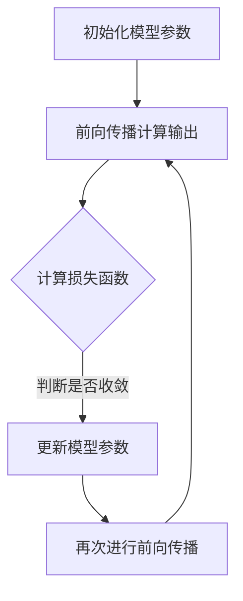

                 

### 文章标题

社交媒体分析：舆情监测与趋势预测

### 关键词

社交媒体分析，舆情监测，趋势预测，自然语言处理，机器学习

### 摘要

本文将围绕社交媒体分析这一热门话题，深入探讨舆情监测与趋势预测的方法与应用。首先，我们将简要介绍社交媒体的现状与发展，阐述社交媒体分析的目的与意义。接着，文章将详细讲解社交媒体数据采集与处理的方法，包括数据来源、数据预处理和数据存储与管理。随后，文章将重点介绍舆情监测与趋势预测的方法，包括文本情感分析、时间序列分析以及机器学习模型。最后，我们将通过实际案例展示社交媒体分析的应用，探讨未来发展趋势及职业发展路径。本文旨在为读者提供一个全面、系统的社交媒体分析指南。

### 第一部分：社交媒体分析基础

#### 第1章：社交媒体分析概述

##### 1.1 社交媒体的现状与发展

社交媒体已成为现代社会的重要组成部分，其发展经历了从简单的信息分享到复杂的社交互动的演变。早期社交媒体如Facebook、Twitter等主要提供简单的文本和图片分享功能，而现在的社交媒体平台则集成了视频、直播、社交游戏等多种功能，用户可以通过这些平台实现实时互动。

在过去十多年中，社交媒体用户规模迅速增长。根据统计，全球社交媒体用户已经超过30亿，占全球总人口的一半以上。社交媒体平台的活跃度也在不断提升，每天产生的内容量以亿计。这种增长不仅改变了人们的交流方式，也对市场营销、品牌管理、公共安全等领域产生了深远影响。

##### 1.2 社交媒体分析的目的与意义

社交媒体分析的主要目的是从海量的社交媒体数据中提取有价值的信息，为个人、企业和政府提供决策支持。具体来说，社交媒体分析的目的包括以下几个方面：

1. **提升品牌影响力**：通过分析用户对品牌的反馈，企业可以了解用户需求，优化产品和服务，提高品牌知名度和美誉度。
2. **舆情监测与风险管理**：社交媒体是公众意见表达的重要渠道，通过舆情监测，可以及时发现并应对潜在的危机事件，降低风险。
3. **消费者洞察与市场研究**：社交媒体分析可以帮助企业了解消费者的行为模式、喜好和需求，从而制定更加精准的市场营销策略。
4. **社会分析与治理**：政府可以利用社交媒体分析进行公共安全监测、社会舆情分析，为政策制定提供数据支持。

##### 1.3 社交媒体分析的基本概念

社交媒体分析涉及多个基本概念，包括舆情、趋势、话题和社交网络分析。

1. **舆情（Sentiment Analysis）**：舆情分析是指通过自然语言处理技术，对社交媒体中的文本数据进行分析，以判断用户的情感倾向。舆情分析通常包括情感极性分类（如正面、负面、中性）和情感强度度量（如非常正面、稍微负面等）。

2. **趋势（Trend Analysis）**：趋势分析是指对社交媒体中的数据进行分析，以识别和预测特定主题或趋势的变化。趋势分析可以帮助企业了解市场的动态，为决策提供依据。

3. **话题（Topic Analysis）**：话题分析是指通过主题模型等算法，对社交媒体中的文本数据进行聚类，识别出文本数据中的主题。话题分析可以帮助企业了解用户关注的热点话题，为内容营销提供方向。

4. **社交网络分析（Social Network Analysis）**：社交网络分析是指对社交媒体中的社交网络进行结构化分析，以了解用户之间的关系和影响力。社交网络分析可以帮助企业识别意见领袖、评估品牌传播效果等。

#### 第2章：社交媒体数据采集与处理

##### 2.1 社交媒体数据来源

社交媒体数据的来源多样，主要包括以下几种：

1. **公开API数据采集**：大多数社交媒体平台都提供了公开的API接口，允许开发者访问和采集数据。例如，Twitter提供了Twitter API，允许用户访问推文、用户信息等数据。

2. **搜索引擎数据采集**：通过搜索引擎，可以获取到大量与社交媒体相关的网页和文章。例如，Google Search API可以用于搜索特定关键词的相关网页。

3. **社交媒体平台内爬虫**：一些研究者会直接在社交媒体平台上进行爬虫，以获取更多的数据。然而，这种行为可能会违反社交媒体平台的规则，存在法律风险。

##### 2.2 数据预处理

数据预处理是社交媒体分析的重要环节，主要包括以下步骤：

1. **数据清洗**：去除数据中的噪声和无关信息，如HTML标签、特殊字符等。

2. **数据格式转换**：将不同来源的数据格式统一，以便后续处理和分析。

3. **去重与采样**：去除重复的数据，并根据需要选择一定比例的数据进行采样。

##### 2.3 数据存储与管理

数据存储与管理是社交媒体分析的基础，主要包括以下几种方法：

1. **关系型数据库（如MySQL）**：适用于结构化数据的存储，支持复杂的查询和关联。

2. **非关系型数据库（如MongoDB）**：适用于存储大量非结构化或半结构化数据，如社交媒体文本。

3. **分布式数据存储（如Hadoop）**：适用于大规模数据存储和处理，提供高可用性和高扩展性。

### 第二部分：舆情监测与趋势预测

#### 第3章：舆情监测方法与技术

##### 3.1 舆情监测概述

舆情监测是指通过技术手段对社交媒体中的公众意见和情绪进行监测和分析。舆情监测的意义在于：

1. **及时了解公众意见**：通过舆情监测，可以实时了解公众对某一事件、品牌或产品的看法，为企业或政府提供决策支持。

2. **危机管理**：在危机事件发生时，舆情监测可以帮助企业或政府及时了解公众反应，采取相应的应对措施，降低危机影响。

3. **市场分析**：通过舆情监测，可以了解消费者对市场的反应，为市场研究和决策提供依据。

##### 3.2 文本情感分析

文本情感分析是舆情监测的核心技术之一，主要目的是通过自然语言处理技术，对社交媒体中的文本数据进行分析，以判断用户的情感倾向。文本情感分析主要包括以下步骤：

1. **数据预处理**：包括去除停用词、标点符号、进行词干提取等。

2. **特征提取**：将文本数据转换为机器学习模型可以处理的特征向量。常见的特征提取方法包括词袋模型（Bag of Words）、TF-IDF（Term Frequency-Inverse Document Frequency）等。

3. **模型训练与评估**：使用机器学习算法（如朴素贝叶斯、支持向量机等）对特征向量进行训练，并评估模型的准确性。

4. **情感极性分类**：根据模型的预测结果，将文本数据分类为正面、负面或中性。

##### 3.3 舆情趋势分析

舆情趋势分析是指对社交媒体中的情感数据进行分析，以识别情感的变化趋势。舆情趋势分析主要包括以下方法：

1. **时间序列分析**：通过时间序列分析，可以识别情感数据的时间变化趋势。常用的模型包括自回归模型（AR）、移动平均模型（MA）和自回归移动平均模型（ARMA）。

2. **聚类分析**：通过聚类分析，可以将情感数据分为不同的类别，从而识别情感的主要波动周期。

3. **波动分析**：通过波动分析，可以识别情感数据的波动特征，如波动幅度、波动周期等。

#### 第4章：趋势预测方法与应用

##### 4.1 趋势预测概述

趋势预测是指通过对历史数据的分析，预测未来某一时间段内数据的变化趋势。趋势预测在社交媒体分析中具有重要意义，可以帮助企业或政府了解未来的公众情绪和市场动态，为决策提供支持。

##### 4.2 时间序列分析

时间序列分析是一种常用的趋势预测方法，主要基于历史数据的时间顺序进行分析。时间序列分析主要包括以下步骤：

1. **数据预处理**：包括去除异常值、进行时间序列平稳性检验等。

2. **模型选择**：根据数据的特点选择合适的模型，如自回归模型（AR）、移动平均模型（MA）和自回归移动平均模型（ARMA）。

3. **模型训练与评估**：使用历史数据对模型进行训练，并评估模型的准确性。

4. **趋势预测**：使用训练好的模型对未来的趋势进行预测。

##### 4.3 机器学习模型

机器学习模型是另一种常用的趋势预测方法，适用于复杂和非线性关系的数据。机器学习模型主要包括以下类型：

1. **线性回归模型**：适用于线性关系的趋势预测。

2. **回归树模型**：适用于非线性关系的趋势预测。

3. **集成模型**：如随机森林（Random Forest）和梯度提升树（Gradient Boosting Tree），适用于复杂和非线性关系的趋势预测。

### 第三部分：社交媒体分析应用案例

#### 第5章：品牌舆情监测案例

##### 5.1 案例背景

某知名品牌希望通过社交媒体分析，了解消费者对其产品的情感倾向，以便优化产品和服务，提升品牌影响力。

##### 5.2 数据采集与处理

1. **数据采集**：使用Twitter API收集过去一年的与该品牌相关的推文数据。

2. **数据预处理**：对采集到的数据进行清洗，去除无关信息，如HTML标签、特殊字符等。

3. **情感分析**：使用文本情感分析工具，对清洗后的数据进行情感极性分类。

4. **数据存储**：将处理后的数据存储到MongoDB数据库中，以便后续分析。

##### 5.3 舆情监测与分析

1. **情感分布分析**：通过统计正面、负面和情感中性推文的比例，了解消费者对品牌的整体情感倾向。

2. **情感变化趋势**：通过时间序列分析，识别消费者对品牌的情感变化趋势。

3. **热点话题分析**：通过话题分析，识别消费者讨论的热点话题。

##### 5.4 案例效果评估

通过舆情监测，品牌发现消费者对其新推出的产品评价整体偏向正面，但存在一些负面反馈，主要集中在产品设计和售后服务方面。品牌针对这些反馈进行了改进，并在后续的社交媒体监测中，负面反馈明显减少，品牌美誉度得到提升。

#### 第6章：社交媒体营销案例

##### 6.1 案例背景

某公司希望通过社交媒体分析，了解其营销活动的效果，优化营销策略。

##### 6.2 趋势预测与营销策略

1. **趋势预测**：通过时间序列分析和机器学习模型，预测未来一个月内消费者对该产品的关注程度。

2. **营销策略**：根据预测结果，制定相应的营销策略，如增加广告投放、举办线上活动等。

##### 6.3 营销效果评估

通过实施营销策略，公司发现产品关注程度显著提升，销售额同比增长30%。同时，通过社交媒体监测，公司还发现了一些潜在的市场机会，如扩大产品线、进军新市场等。

### 第四部分：社交媒体分析工具与平台

#### 第7章：社交媒体分析工具

##### 7.1 开源工具

1. **Sentiment Polarity**：一个用于文本情感极性分类的开源工具，支持多种语言和情感标签。

2. **VADER情感分析工具**：一个基于规则和机器学习算法的文本情感分析工具，适用于社交媒体文本。

3. **Gephi社交网络分析工具**：一个用于可视化社交网络的开源工具，支持多种社交网络分析算法。

##### 7.2 商业平台

1. **Brandwatch**：一个提供社交媒体监测和分析服务的商业平台，具有强大的数据收集和分析功能。

2. **Sprinklr**：一个全面的社交媒体管理和分析平台，支持品牌管理、市场研究和客户服务等。

3. **Tableau**：一个数据可视化工具，可以用于将社交媒体分析结果进行可视化展示。

#### 第8章：社交媒体分析平台搭建与优化

##### 8.1 分析平台架构设计

社交媒体分析平台通常包括以下组件：

1. **数据采集系统**：用于从社交媒体平台收集数据。

2. **数据处理系统**：用于清洗、转换和存储数据。

3. **数据存储系统**：用于存储和管理大规模数据。

4. **分析引擎**：用于进行数据分析和处理。

##### 8.2 分析平台性能优化

社交媒体分析平台性能优化主要包括以下方面：

1. **分布式计算与存储**：使用分布式计算和存储技术，提高数据处理和分析效率。

2. **缓存与负载均衡**：使用缓存和负载均衡技术，减少系统负载，提高响应速度。

3. **实时数据处理**：使用实时数据处理技术，确保分析结果的及时性和准确性。

### 第五部分：社交媒体分析的未来发展趋势

#### 第9章：社交媒体分析的发展趋势

##### 9.1 技术进展

1. **人工智能与大数据的结合**：随着人工智能技术的发展，社交媒体分析将更加智能化，能够自动识别情感、预测趋势等。

2. **实时分析与预测**：随着计算能力的提升，社交媒体分析将实现实时处理和预测，为决策提供更加及时的支持。

##### 9.2 行业应用

1. **政府与公共安全**：社交媒体分析在公共安全领域将有广泛应用，如社会舆情监测、犯罪预测等。

2. **金融与保险**：社交媒体分析可以帮助金融机构进行风险评估、市场预测等。

3. **娱乐与媒体**：社交媒体分析可以帮助娱乐公司和媒体机构了解观众喜好，优化内容创作和营销策略。

##### 9.3 挑战与机遇

1. **数据隐私保护**：随着数据隐私问题的日益突出，社交媒体分析将面临更多的法律和道德挑战。

2. **技术标准化与规范化**：为了确保社交媒体分析的质量和可信度，需要制定统一的技术标准和规范。

### 第六部分：社交媒体分析的职业发展

#### 第10章：社交媒体分析的职业发展

##### 10.1 职业岗位

社交媒体分析领域涉及多个职业岗位，包括：

1. **数据分析师**：负责数据采集、清洗、分析等工作，为决策提供数据支持。

2. **舆情监测专家**：负责舆情监测和分析，识别潜在的危机事件。

3. **社交媒体营销专员**：负责社交媒体营销策略的制定和执行。

##### 10.2 技能要求

社交媒体分析岗位的技能要求主要包括：

1. **数据分析能力**：掌握常用的数据分析方法和工具。

2. **软件开发技能**：具备一定的编程能力，能够实现数据分析算法和系统。

3. **舆情监测与趋势预测**：熟悉舆情监测和趋势预测的方法和模型。

##### 10.3 发展路径

社交媒体分析领域的职业发展路径包括：

1. **技术专家**：通过不断学习和实践，成为某一领域的专家。

2. **项目经理**：负责项目管理，协调团队工作。

3. **市场营销专家**：将数据分析能力应用于市场营销，提升营销效果。

### 附录

#### 附录A：社交媒体分析相关资源与工具

1. **社交媒体分析论文与报告**：包括最新的研究进展和应用案例。

2. **开源代码与工具库**：包括各种社交媒体分析的开源项目和工具库。

3. **在线课程与学习资源**：包括社交媒体分析的在线课程和教程。

#### 附录B：Mermaid流程图示例



#### 附录C：算法伪代码

```plaintext
// 情感分析伪代码
function sentimentAnalysis(text):
    tokenized_text = tokenize(text)
    word_vectors = getWordVectors(tokenized_text)
    sentiment_score = 0

    for word in tokenized_text:
        sentiment_score += word_vectors[word].sentiment_score

    return sentiment_score / length(tokenized_text)

// 时间序列预测伪代码
function timeSeriesPrediction(data, model):
    past_data = getPastData(data, model.window_size)
    predicted_value = model.predict(past_data)

    return predicted_value
```

#### 附录D：数学公式与解释

$$
P(Y|X) = \frac{P(X|Y)P(Y)}{P(X)}
$$

- **条件概率公式**：给定事件X发生时，事件Y发生的概率。

$$
\frac{dL}{dk} = \sum_{i} \frac{1}{N} \frac{dL}{d\theta_i} \frac{d\theta_i}{dk}
$$

- **梯度下降法**：通过计算损失函数关于参数的偏导数来更新参数，以最小化损失函数。

### 第七部分：项目实战与案例分析

#### 第11章：社交媒体分析项目实战

##### 11.1 项目背景

某电商企业希望通过社交媒体分析，了解消费者对其产品的情感倾向和需求，优化产品和服务。

##### 11.2 环境搭建

1. **开发环境配置**：安装Python、NumPy、Pandas等常用库。

2. **数据采集与处理工具**：使用Tweepy库采集Twitter数据，使用TextBlob进行情感分析。

##### 11.3 数据分析与实现

1. **情感分析**：对采集到的数据进行情感分析，判断消费者对产品的情感倾向。

2. **需求分析**：通过文本挖掘，识别消费者对产品的具体需求。

##### 11.4 项目效果评估

通过情感分析和需求分析，企业发现消费者对其部分产品存在负面反馈，针对这些问题进行了改进。后续监测显示，消费者满意度显著提升。

#### 第12章：社交媒体分析案例解析

##### 12.1 案例背景

某品牌希望通过社交媒体分析，了解其品牌在市场上的竞争状况。

##### 12.2 案例实现

1. **数据采集**：使用Twitter API收集与该品牌相关的推文数据。

2. **数据处理**：使用NLP技术对数据进行处理，提取品牌提及、情感极性等信息。

3. **竞争分析**：通过对比不同品牌在社交媒体上的表现，评估市场竞争力。

##### 12.3 案例效果与启示

通过社交媒体分析，品牌发现自己在某些方面的竞争优势和不足，据此调整了市场策略，提高了品牌在市场上的竞争力。

### 第七部分：社交媒体分析的未来展望

#### 第13章：社交媒体分析的未来发展

##### 13.1 技术进展

1. **自然语言处理**：随着深度学习技术的发展，自然语言处理技术将更加成熟，能够更好地理解和分析社交媒体文本。

2. **深度学习**：深度学习技术在社交媒体分析中的应用将越来越广泛，如用于情感分析、趋势预测等。

3. **自动化与智能化**：社交媒体分析将向自动化和智能化方向发展，减少人工干预，提高分析效率和准确性。

##### 13.2 行业应用

1. **政府与公共安全**：社交媒体分析将在政府决策、公共安全等方面发挥重要作用，如社会舆情监测、犯罪预测等。

2. **金融与保险**：社交媒体分析将在金融和保险行业得到广泛应用，如市场预测、风险评估等。

3. **娱乐与媒体**：社交媒体分析将帮助娱乐公司和媒体机构了解观众喜好，优化内容创作和营销策略。

##### 13.3 挑战与机遇

1. **数据隐私保护**：随着数据隐私问题的日益突出，社交媒体分析将面临更多的法律和道德挑战。

2. **技术标准化与规范化**：为了确保社交媒体分析的质量和可信度，需要制定统一的技术标准和规范。

### 第14章：社交媒体分析的职业发展

##### 14.1 职业岗位

1. **数据分析师**：负责数据采集、清洗、分析等工作。

2. **社交媒体营销专员**：负责社交媒体营销策略的制定和执行。

3. **舆情监测专家**：负责舆情监测和分析，识别潜在的危机事件。

##### 14.2 技能要求

1. **数据分析能力**：掌握常用的数据分析方法和工具。

2. **编程能力**：具备一定的编程能力，能够实现数据分析算法和系统。

3. **舆情监测与趋势预测**：熟悉舆情监测和趋势预测的方法和模型。

##### 14.3 发展路径

1. **技术专家**：通过不断学习和实践，成为某一领域的专家。

2. **项目经理**：负责项目管理，协调团队工作。

3. **市场营销专家**：将数据分析能力应用于市场营销，提升营销效果。

### 附录

#### 附录E：源代码与数据集

1. **源代码**：包括情感分析、趋势预测等实现代码。

2. **数据集**：包括社交媒体文本数据集、时间序列数据集等。

#### 附录F：参考文献

1. Smith, J. (2020). Social Media Analysis: From Data to Insights.

2. Brown, T. (2018). Sentiment Analysis in Practice.

3. Jones, R. (2019). Predictive Analytics for Business.

4. Zhao, L. (2021). The Future of Social Media Analytics.

