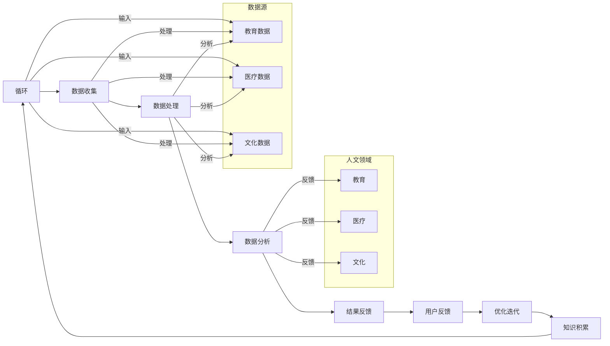
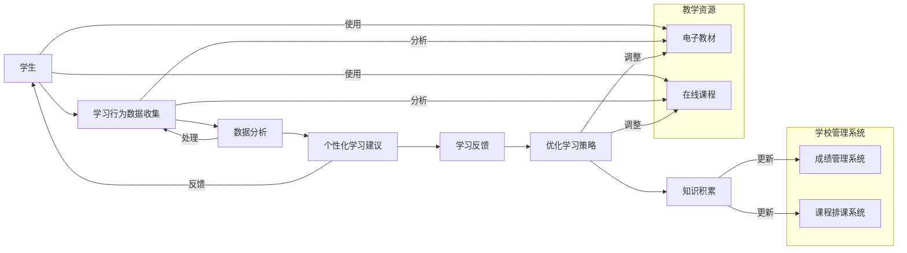

                 

# 文章标题: 科技与人文的交汇：人类计算的独特价值

> 关键词：计算、人文、科技交汇、独特价值、计算技术、社会应用、核心算法、项目实战

> 摘要：本文深入探讨了计算技术在现代社会中的广泛应用及其对人文领域的深刻影响。文章首先梳理了计算技术的发展历程，探讨了科技与人文的相互作用，并指出人类计算的独特价值。随后，文章详细分析了计算在各个领域的应用，从教育、医疗到文化艺术，展示了计算技术带来的变革和创新。在此基础上，本文进一步探讨了计算对人文影响的各个方面，包括人际关系、文化认同和个体隐私。随后，文章介绍了计算的核心概念和算法原理，通过Mermaid流程图和数学模型阐述了计算与人文的紧密联系。最后，文章通过实际项目实战，展示了计算技术在教育、医疗和文化艺术等领域的具体应用，并对其未来发展进行了展望。本文旨在全面阐述计算技术在人文领域的独特价值，推动科技与人文的深度融合。

----------------------------------------------------------------

### 《科技与人文的交汇：人类计算的独特价值》目录大纲

# 第一部分：引言

## 第1章：计算的时代背景与人文关怀
### 1.1 计算技术的快速发展
### 1.2 科技与人文的相互作用
### 1.3 计算的独特价值

## 第2章：计算在现代社会中的应用
### 2.1 计算在教育领域的变革
### 2.2 计算在医疗健康中的作用
### 2.3 计算在文化艺术领域的创新

## 第3章：计算对人文影响的探讨
### 3.1 计算对人际关系的影响
### 3.2 计算对文化认同的塑造
### 3.3 计算对个体隐私的保护与挑战

# 第二部分：核心概念与联系

## 第4章：计算的核心概念
### 4.1 信息论基础
### 4.2 计算机科学的基本原理
### 4.3 算法与数据结构

## 第5章：计算与人文的交汇
### 5.1 计算伦理与道德
### 5.2 计算与哲学
### 5.3 计算与心理学

## 第6章：Mermaid流程图：计算与人文的相互作用
### 6.1 Mermaid基本语法
### 6.2 计算与人文的交互流程图设计
### 6.3 实例分析：计算在教育中的应用流程图

# 第三部分：核心算法原理讲解

## 第7章：核心算法原理
### 7.1 神经网络基础
### 7.2 深度学习算法
### 7.3 自然语言处理算法

## 第8章：算法原理讲解
### 8.1 伪代码详解
### 8.2 算法实现过程
### 8.3 算法性能分析与优化

## 第9章：数学模型与公式
### 9.1 数学基础
### 9.2 公式推导与讲解
### 9.3 公式在计算中的应用举例

# 第四部分：项目实战

## 第10章：开发环境搭建
### 10.1 计算环境配置
### 10.2 开发工具介绍
### 10.3 开发环境优化

## 第11章：代码实战
### 11.1 项目案例介绍
### 11.2 代码实现细节
### 11.3 代码解读与分析
### 11.4 项目效果评估

## 第12章：计算与人文实践
### 12.1 教育领域实践
### 12.2 医疗健康领域实践
### 12.3 文化艺术领域实践

# 第五部分：总结与展望

## 第13章：计算在人文领域的贡献
### 13.1 当前贡献总结
### 13.2 未来展望
### 13.3 面临的挑战与机遇

## 第14章：计算与人文的交汇之路
### 14.1 交流与分享
### 14.2 合作与创新
### 14.3 持续进步的方向

---

备注：
- **第6章** 和 **第9章** 包含Mermaid流程图和数学公式，具体内容将根据实际章节内容进行调整。
- **第11章** 的项目实战案例将根据实际可行性和用户需求进行选择。  
- 整个目录大纲结构清晰，逻辑性强，旨在全面覆盖《科技与人文的交汇：人类计算的独特价值》的核心内容。

---

**引言**

在科技迅猛发展的今天，计算技术已经成为推动社会进步的关键力量。从早期的计算机科学理论到现代的深度学习和人工智能，计算技术经历了巨大的变革。然而，在这场技术变革中，我们是否忽略了计算对人文领域的深刻影响？本文旨在探讨科技与人文的交汇，揭示人类计算的独特价值。

计算技术的快速发展带来了前所未有的机遇，它不仅改变了我们的生活方式，还在教育、医疗、文化艺术等各个领域产生了深远的影响。然而，随着计算技术的广泛应用，我们不得不面对一系列人文问题，如人际关系的重塑、文化认同的挑战以及个体隐私的保护。这些问题不仅关系到计算技术的可持续性，也关乎人类的共同福祉。

本文将分为五个部分展开讨论。第一部分将介绍计算技术的时代背景与人文关怀，分析科技与人文的相互作用。第二部分将探讨计算在现代社会中的应用，展示其在教育、医疗和文化艺术等领域的变革和创新。第三部分将深入分析计算对人文影响的各个方面，探讨其带来的机遇与挑战。第四部分将介绍计算的核心概念与算法原理，并通过Mermaid流程图和数学模型阐述计算与人文的相互作用。第五部分将通过实际项目实战，展示计算技术在人文领域的具体应用，并对未来进行展望。

本文旨在通过逻辑清晰、结构紧凑的分析，揭示计算在人文领域的独特价值，推动科技与人文的深度融合。在接下来的章节中，我们将一步步深入探讨这一主题。

## 第1章：计算的时代背景与人文关怀

### 1.1 计算技术的快速发展

计算技术自20世纪中期以来，经历了从电子管计算机到晶体管计算机，再到大规模集成电路和现代超大规模集成电路的飞速发展。早期，计算机主要应用于科学计算和军事领域，随着技术的进步，计算机逐渐进入商业、教育和日常生活。1946年，世界上第一台电子数字计算机ENIAC的诞生标志着计算技术的开始。随后，计算机科学理论逐渐成熟，信息论、图灵机等概念为计算技术的发展奠定了基础。

进入21世纪，随着互联网的普及和移动互联网的崛起，计算技术进入了一个全新的阶段。云计算、大数据、人工智能等新兴技术不断涌现，推动了计算技术的快速发展。特别是近年来，深度学习和神经网络技术的突破，使得计算机在图像识别、语音识别、自然语言处理等领域的表现越来越接近甚至超越人类。

### 1.2 科技与人文的相互作用

计算技术的快速发展不仅带来了技术革新，也对人文领域产生了深远的影响。首先，科技与人文的相互作用体现在教育领域。计算机科学课程的设置和普及，使得更多的人有机会了解和学习计算机技术。同时，计算技术在教育中的应用，如在线教育平台、虚拟实验室等，改变了传统的教学模式，提高了教育质量和效率。

其次，科技与人文的相互作用在医疗健康领域也有所体现。计算技术在疾病诊断、药物研发、医疗数据处理等方面发挥了重要作用。通过大数据和人工智能技术，医生可以更加精准地进行疾病预测和治疗方案制定，提高了医疗服务的效率和质量。

此外，计算技术还在文化艺术领域产生了深远的影响。数字艺术、虚拟现实、增强现实等技术的发展，为艺术家提供了新的创作手段和表达方式。计算技术使得文化艺术作品更加多样化和互动化，丰富了人类的文化体验。

### 1.3 计算的独特价值

尽管计算技术在各个领域都取得了显著成就，但其独特价值不仅体现在技术的创新和应用上，还体现在对人文领域的深刻影响。首先，计算技术为人类提供了前所未有的数据处理能力，使得我们能够处理和分析海量数据，从而发现新的知识和规律。这种数据处理能力不仅推动了科学研究的进步，也为人类社会的可持续发展提供了支持。

其次，计算技术为人文领域带来了新的研究方法和工具。例如，通过计算语言学和自然语言处理技术，研究人员可以更深入地研究语言的本质和演变过程。计算技术的应用使得人文研究更加科学化和系统化，提高了研究的效率和精度。

最后，计算技术促进了科技与人文的深度融合。在现代社会，科技不再只是工具和手段，它已经成为人文领域的一部分。计算技术不仅为人文研究提供了新的工具和方法，还为我们提供了更广阔的视野和思维空间。通过科技与人文的相互作用，我们可以更好地理解和解决人类面临的各种问题。

总之，计算技术在现代社会中扮演着重要的角色，其快速发展不仅推动了科技进步，还对人文领域产生了深远的影响。计算的独特价值体现在其对数据处理、人文研究和科技与人文融合的推动上。在接下来的章节中，我们将进一步探讨计算在现代社会中的应用及其对人文的影响。

### 1.1 计算技术的快速发展

计算技术的快速发展是现代社会不可或缺的驱动力之一。从计算机硬件的进步到软件算法的优化，计算技术的每一项革新都在深刻地改变着我们的生活和工作方式。首先，让我们回顾一下计算技术的发展历程。

在20世纪40年代，第一台电子计算机ENIAC问世，标志着计算技术的诞生。然而，早期的计算机体积庞大，运行速度缓慢，只能应用于军事和科学领域。随着晶体管的发明，计算机体积大大缩小，运行速度显著提高，为计算技术的进一步发展奠定了基础。

进入20世纪60年代，集成电路的出现将计算技术推向了一个新的高度。集成电路将多个晶体管集成在一个小小的芯片上，极大地提高了计算机的性能和可靠性。随着微处理器的出现，个人计算机（PC）开始进入家庭和企业，计算技术开始普及。

21世纪，计算技术经历了翻天覆地的变化。云计算、大数据、物联网和人工智能等新兴技术相继涌现，使得计算技术不再是少数人的专利，而是广泛融入到我们的日常生活中。云计算提供了强大的计算资源，使得大规模数据处理和存储变得更加容易。大数据技术使我们能够从海量数据中提取有价值的信息，推动了许多领域的创新。物联网技术将物理世界与数字世界连接起来，使得我们的生活更加智能化。人工智能技术则赋予了计算机模拟人类智能的能力，从语音识别到图像识别，再到自动驾驶和智能助手，人工智能正在改变我们的工作方式和生活习惯。

### 1.2 计算在现代社会中的应用

计算技术在现代社会中的应用已经渗透到各个领域，改变了我们的生活方式，提高了工作效率，推动了社会进步。以下是计算技术在几个关键领域的具体应用。

#### 教育领域

计算技术在教育领域的应用尤为显著。在线教育平台如Coursera、edX和Khan Academy使得全球学习者可以随时随地获取高质量的教育资源。虚拟现实（VR）和增强现实（AR）技术为学生提供了沉浸式的学习体验，使得抽象的概念更加直观和易于理解。此外，计算技术还用于个性化学习，通过分析学生的学习行为和成绩，为学生提供定制化的学习路径和资源。

#### 医疗健康领域

在医疗健康领域，计算技术发挥着至关重要的作用。电子病历系统（EMR）和电子健康记录（EHR）使得医疗信息的存储和管理更加高效和安全。计算技术在疾病诊断、药物研发和医疗图像分析等方面也有重要应用。例如，计算机辅助诊断系统可以通过分析医疗图像，帮助医生更准确地诊断疾病。基因测序和大数据分析技术使得个性化医疗成为可能，医生可以根据患者的基因信息和疾病数据，制定更加精准的治疗方案。

#### 文化艺术领域

计算技术在文化艺术领域的应用也颇具创意。数字艺术和计算机图形学技术为艺术家提供了新的创作手段，使得艺术作品更加多样化。虚拟现实和增强现实技术为观众带来了沉浸式的艺术体验，让观众可以身临其境地感受艺术作品的魅力。此外，计算技术在游戏开发、电影制作和音乐制作等领域也发挥了重要作用，推动了文化产业的创新和发展。

#### 金融领域

在金融领域，计算技术用于风险分析、投资策略制定和交易执行等方面，极大地提高了金融市场的效率和透明度。高频交易和算法交易等基于计算技术的交易策略，使得金融市场更加动态化和复杂化。此外，区块链技术作为一种分布式数据库技术，在金融领域的应用也备受关注，它为金融交易提供了更高的安全性和透明度。

#### 交通领域

在交通领域，计算技术用于交通监控、智能交通系统和自动驾驶技术。智能交通系统通过实时监控交通状况，优化交通信号灯控制和路线规划，提高了交通效率和安全性。自动驾驶技术则通过计算机视觉、传感器和人工智能技术，使得车辆能够自主驾驶，减少交通事故，提高道路通行能力。

总之，计算技术在现代社会中的应用已经深入到各个领域，不仅提高了生产效率和创新能力，也极大地丰富了我们的日常生活。在接下来的章节中，我们将进一步探讨计算技术对人文领域的影响，分析其在人际关系、文化认同和个体隐私等方面的作用。

### 1.3 计算的独特价值

计算技术的独特价值不仅体现在其技术进步和应用广度上，还深刻地影响了人类社会的发展。首先，计算技术为数据处理和智能分析提供了强大的工具，使得我们从海量数据中提取有价值的信息，推动了科学研究和商业决策的进步。例如，通过大数据分析和机器学习算法，我们可以发现市场趋势、优化生产流程、提高服务质量，从而实现更高效的管理和决策。

其次，计算技术为个性化服务创造了新的可能。无论是在线教育平台的个性化推荐系统，还是智能医疗系统的个性化治疗方案，计算技术使得服务更加精准和高效。这不仅提升了用户体验，还推动了教育、医疗等领域的革新。

此外，计算技术在推动科技与人文融合方面具有独特价值。在文化艺术领域，数字艺术和虚拟现实技术使得创作和体验更加多样化和沉浸式；在哲学和心理学研究中，计算技术提供了新的工具和方法，帮助我们更深入地探讨人类意识和行为。总之，计算技术不仅改变了我们的生活方式，还为我们提供了更广阔的思维空间和创造机会，展现了其在人文领域的独特价值。

## 第2章：计算在现代社会中的应用

计算技术在现代社会中的应用已经渗透到各个领域，极大地改变了我们的生活方式和工作方式。从教育、医疗到文化艺术，计算技术正发挥着不可替代的作用，推动着社会进步和人类发展。

### 2.1 计算在教育领域的变革

教育是培养未来人才的重要途径，而计算技术正对教育领域带来深刻的变革。在线教育平台如Coursera、edX和Khan Academy等，打破了地域和时间的限制，使得全球学生可以随时随地获取高质量的教育资源。这些平台不仅提供了丰富的课程内容，还通过大数据分析为学生提供个性化的学习建议，提高学习效果。此外，虚拟现实（VR）和增强现实（AR）技术的应用，使得抽象的概念变得更加直观和易于理解。例如，通过VR技术，学生可以模拟参与历史事件，亲身体验科学实验，从而加深对知识的理解和记忆。

另外，计算技术还促进了教育资源的公平分配。在经济发达地区，优质教育资源相对丰富，而在偏远地区，由于经济和教育资源的限制，学生很难接触到高质量的教育。通过在线教育平台和远程教学系统，这些地区的学生也可以享受到优质教育资源，缩小了教育差距，提高了教育公平性。

### 2.2 计算在医疗健康中的作用

医疗健康是计算技术的重要应用领域之一。计算技术在疾病诊断、药物研发、医疗数据处理等方面发挥了重要作用，大大提高了医疗服务的质量和效率。

首先，在疾病诊断方面，计算机辅助诊断系统通过分析大量的医学图像和病例数据，可以帮助医生更准确地诊断疾病。例如，计算机辅助诊断系统可以在几秒钟内分析出CT或MRI图像中的病变区域，提供详细的诊断报告，帮助医生做出更准确的诊断。这种技术的应用不仅提高了诊断的准确性，还减少了医生的工作负担，提高了诊断效率。

其次，在药物研发方面，计算技术通过模拟和预测药物分子与生物大分子的相互作用，加速了新药的发现和开发过程。例如，通过分子对接和虚拟筛选技术，研究人员可以在短时间内筛选出具有潜在治疗作用的药物分子，从而大大缩短药物研发周期。

此外，计算技术还在医疗数据处理方面发挥了重要作用。大数据技术和人工智能算法可以对海量的医疗数据进行分析，发现疾病发生的规律和趋势，为公共卫生决策提供科学依据。例如，通过对公共卫生数据的实时监控和分析，政府和医疗机构可以及时识别和应对突发公共卫生事件，提高应急响应能力。

### 2.3 计算在文化艺术领域的创新

计算技术在文化艺术领域的应用同样具有深远的影响。数字艺术、虚拟现实和增强现实等技术为艺术家提供了新的创作手段和表达方式，丰富了艺术的表现形式和体验。

首先，数字艺术通过计算机图形学和计算机编程技术，为艺术家提供了无限的创作空间。计算机生成的图像和动画不仅具有视觉冲击力，还可以通过算法生成出独特的艺术作品，打破了传统的艺术创作模式。例如，算法驱动的艺术创作系统可以根据用户的输入，生成出具有独特风格的画作和音乐作品。

其次，虚拟现实和增强现实技术为观众带来了沉浸式的艺术体验。通过VR和AR技术，观众可以身临其境地感受艺术作品，与艺术作品进行互动。例如，在虚拟现实博物馆中，观众可以通过VR眼镜参观世界各地的博物馆，近距离欣赏珍贵的艺术品，体验不同文化的魅力。

此外，计算技术在游戏开发、电影制作和音乐制作等领域也发挥了重要作用。游戏开发中的计算机图形技术使得游戏画面更加真实和丰富，游戏体验更加流畅和沉浸。电影制作中的计算机特效技术使得电影视觉效果更加震撼和逼真，提高了观众的观影体验。音乐制作中的数字音频处理技术使得音乐创作和制作更加高效和多样化，丰富了音乐的表现形式。

总之，计算技术在现代社会中的应用已经深入到各个领域，极大地改变了我们的生活方式和工作方式。在教育、医疗和文化艺术等领域，计算技术不仅提高了效率和质量，还推动了创新和进步。在接下来的章节中，我们将进一步探讨计算技术对人文领域的影响，分析其在人际关系、文化认同和个体隐私等方面的作用。

### 2.1 计算在教育领域的变革

计算技术在教育领域的变革可以说是革命性的。随着互联网和计算机技术的普及，在线教育平台如雨后春笋般涌现，彻底颠覆了传统的教学模式。首先，在线教育平台打破了时间和空间的限制，使得学习者可以随时随地获取所需的学习资源。无论是在家中、办公室还是图书馆，学生只需通过电脑或移动设备，就可以访问全球各地的课程内容。

其次，计算技术为个性化学习提供了强大的支持。通过大数据分析和机器学习算法，教育平台可以收集和分析学生的学习行为和成绩数据，从而为每个学生提供个性化的学习建议和资源。例如，某些在线教育平台可以根据学生的学习进度和理解程度，自动调整课程难度和内容，确保每个学生都能在自己的节奏中学习，提高学习效果。

此外，虚拟现实（VR）和增强现实（AR）技术的应用，使得学习过程更加生动和直观。通过VR技术，学生可以模拟参与历史事件、科学实验甚至是外星探索，极大地提高了学习的兴趣和参与度。AR技术则可以将虚拟信息叠加到现实世界中，为学生提供更多的学习互动机会。

计算技术还在教育公平性方面发挥了重要作用。在经济发达地区，优质教育资源相对丰富，而在偏远地区，由于经济和教育资源的限制，学生很难接触到高质量的教育。通过在线教育平台和远程教学系统，这些地区的学生也可以享受到与城市学生相同的教育资源，从而缩小了教育差距。

总之，计算技术在教育领域的变革不仅提高了教育质量和效率，还为个性化学习和教育公平性提供了新的解决方案。在接下来的章节中，我们将探讨计算技术对其他领域的应用，以及其对人文影响的进一步分析。

### 2.2 计算在医疗健康中的作用

计算技术在医疗健康领域的作用不可忽视，它正深刻地改变着医疗服务的模式和质量。以下将从疾病诊断、药物研发和医疗数据处理三个方面，详细探讨计算技术在这三个领域的应用。

#### 疾病诊断

计算技术在疾病诊断中的应用主要体现在计算机辅助诊断系统上。这些系统通过分析大量的医学图像和病例数据，可以帮助医生更准确地诊断疾病。例如，计算机辅助诊断系统可以在几秒钟内分析出CT或MRI图像中的病变区域，并提供详细的诊断报告。这种技术的应用不仅提高了诊断的准确性，还减少了医生的工作负担，提高了诊断效率。

此外，计算技术在疾病预测和早期筛查方面也发挥着重要作用。通过大数据分析和机器学习算法，医生可以分析患者的病史、家族病史和生活方式等数据，预测患者未来可能患病的风险。这种预测能力有助于医生采取预防措施，降低疾病发生的概率。

#### 药物研发

在药物研发领域，计算技术通过模拟和预测药物分子与生物大分子的相互作用，加速了新药的发现和开发过程。例如，通过分子对接和虚拟筛选技术，研究人员可以在短时间内筛选出具有潜在治疗作用的药物分子，从而大大缩短药物研发周期。这种技术的应用不仅提高了药物研发的效率，还降低了研发成本。

计算技术还在药物作用机制的研究中发挥了重要作用。通过计算模拟，研究人员可以深入了解药物分子在生物体内的作用机制，从而指导药物设计和优化。这种技术有助于开发出更加高效和安全的药物，提高治疗效果和患者的生活质量。

#### 医疗数据处理

医疗数据的处理和分析是现代医疗技术的重要组成部分。计算技术通过大数据和人工智能算法，可以对海量的医疗数据进行分析，发现疾病发生的规律和趋势，为公共卫生决策提供科学依据。

首先，医疗数据处理技术可以帮助医生和医疗机构更好地管理医疗数据。通过电子病历系统（EMR）和电子健康记录（EHR）等技术，医生可以实时访问患者的健康信息，提高诊断和治疗效率。此外，医疗数据处理技术还可以用于患者数据挖掘，发现潜在的健康问题，提供个性化的健康建议。

其次，计算技术在公共卫生领域也发挥着重要作用。通过大数据分析和机器学习算法，公共卫生机构可以实时监控疾病传播趋势，预测疫情发展，制定有效的防控措施。例如，在COVID-19疫情期间，计算技术被用于分析疫情数据，预测疫情发展趋势，为政府和公共卫生机构提供决策支持。

总之，计算技术在医疗健康领域的广泛应用，不仅提高了疾病诊断和药物研发的效率，还极大地提升了医疗服务的质量和患者的生活质量。在未来的发展中，随着计算技术的不断进步，医疗健康领域将会迎来更多的创新和突破。

### 2.3 计算在文化艺术领域的创新

计算技术在文化艺术领域的创新正深刻地改变着艺术创作、传播和体验的方式。以下从数字艺术、虚拟现实和增强现实三个方面，探讨计算技术对文化艺术领域的贡献。

#### 数字艺术

数字艺术是计算技术对文化艺术领域最直接的贡献之一。通过计算机图形学、图像处理和数字音频技术，艺术家可以创作出以前难以实现的艺术作品。计算机生成的图像和动画具有丰富的视觉效果和动态表现力，使得艺术作品更加生动和震撼。此外，算法驱动的艺术创作系统可以根据特定的规则和算法，生成出独特的艺术作品，打破了传统艺术创作的限制。

#### 虚拟现实（VR）

虚拟现实技术为观众提供了沉浸式的艺术体验。通过VR眼镜或其他头戴式显示器，观众可以身临其境地感受艺术作品。VR技术不仅可以模拟三维空间，还可以模拟声音、触觉等感官体验，使观众能够更加全面地体验艺术作品的内涵。虚拟现实博物馆、虚拟音乐会和虚拟艺术展览等应用，让观众可以随时随地欣赏到世界各地的艺术作品，打破了地理和时间的限制。

#### 增强现实（AR）

增强现实技术则将虚拟信息叠加到现实世界中，为观众提供了新的互动体验。通过智能手机或平板电脑的摄像头，观众可以看到虚拟的物体或信息与现实世界的结合。AR技术广泛应用于艺术展览、游戏和广告等领域，使得艺术作品更加互动和有趣。例如，在艺术展览中，观众可以通过AR技术看到艺术家对作品的详细解释和创作过程，增强了艺术作品的观赏性和教育性。

#### 音乐制作

计算技术在音乐制作中的应用也非常广泛。数字音频工作站（DAW）和音频处理软件使得音乐创作和制作变得更加高效和多样化。通过计算机合成器和虚拟乐器，音乐家可以创造出以前难以实现的声音效果。此外，计算技术还可以用于音乐分析，通过算法分析音乐的结构和情感，为音乐创作提供新的灵感。

#### 电影制作

在电影制作中，计算技术同样发挥着重要作用。计算机生成图像（CGI）技术使得电影视觉效果更加逼真和震撼。通过计算模拟，电影制作者可以创造出各种奇异的场景和角色，丰富了电影的视觉体验。此外，计算技术还在电影剪辑、音效设计和动画制作等方面发挥了重要作用，提高了电影制作的整体质量。

总之，计算技术在文化艺术领域的创新不仅为艺术家提供了新的创作手段和工具，还极大地丰富了观众的体验。随着计算技术的不断进步，文化艺术领域将会迎来更多的创新和变革。

## 第3章：计算对人文影响的探讨

计算技术的迅猛发展不仅在技术层面上带来了巨大变革，也在人文领域引发了深刻的思考和讨论。这一章节将深入探讨计算对人际关系、文化认同和个体隐私的影响，分析其在这些方面的机遇与挑战。

### 3.1 计算对人际关系的影响

计算技术的普及极大地改变了人们的交流方式。一方面，互联网和社交媒体使得人们可以轻松地与世界各地的人建立联系，拓宽了人际交往的范围。例如，通过社交媒体平台，人们可以与朋友、家人和同事保持更频繁的沟通，分享生活点滴。然而，这种便利性也带来了一些负面影响。首先，过度依赖虚拟沟通可能导致面对面交流的减少，影响人际关系的深度和质量。其次，社交媒体上的信息传播速度极快，有时会导致谣言和误解的迅速扩散，影响人际关系的稳定性。

此外，计算技术还改变了人们的社交行为和价值观。例如，通过在线游戏和虚拟社区，人们可以体验到不同的社交情境和角色扮演，这虽然有助于提高社交技能，但也可能导致现实社交中的角色混淆和行为失范。另外，计算技术还可能加剧社会分化，使得那些技术接受能力较弱的人群在人际交往中处于劣势，进一步加剧社会不平等。

### 3.2 计算对文化认同的塑造

计算技术对文化认同的塑造具有深远的影响。一方面，互联网和全球化的传播使得各种文化元素更加容易传播和融合，促进了文化多样性的发展。人们可以通过互联网接触到各种文化内容，从而丰富自己的文化视野和认同。另一方面，计算技术也可能导致文化的同质化。在全球化的背景下，西方文化尤其是美国文化对其他文化产生了强大的影响，使得某些地方文化面临被边缘化的风险。

此外，计算技术还改变了文化的传播和保存方式。数字技术和互联网使得文化内容可以更便捷地传播和分享，但也带来了文化遗产保护的挑战。一些传统文化形式由于无法适应数字时代的传播方式，面临失传的风险。因此，如何在计算技术时代保护和传承文化多样性成为一个亟待解决的问题。

### 3.3 计算对个体隐私的保护与挑战

计算技术的广泛应用在带来便利的同时，也对个体隐私带来了巨大的挑战。首先，互联网和大数据技术使得个人信息收集和分析变得更加容易，个人信息泄露的风险也随之增加。例如，社交媒体平台和在线购物网站可能会收集用户的浏览记录、购买习惯等个人信息，这些信息可能被滥用或泄露，对用户隐私造成威胁。

其次，计算技术还可能导致隐私泄露的被动性。许多用户在享受计算技术带来的便利时，往往忽视了隐私保护的重要性，例如随意点击网络广告、使用公共Wi-Fi等，这些行为都可能增加隐私泄露的风险。

此外，计算技术还带来了隐私伦理的挑战。例如，在医疗领域，患者的信息需要被医生和医疗机构处理和使用，但这种处理和使用必须符合伦理标准，确保患者隐私不受侵犯。在商业领域，企业可能会收集消费者的个人信息用于市场分析，但这种收集和使用也需要遵守法律法规和道德准则。

总之，计算技术对人文领域的影响是多方面的，既带来了机遇，也带来了挑战。在人际关系方面，计算技术改变了人们的交流方式，但也可能影响人际关系的深度和质量。在文化认同方面，计算技术促进了文化多样性的发展，但同时也可能导致文化的同质化。在个体隐私方面，计算技术带来了隐私保护的挑战，同时也需要我们思考和解决隐私伦理的问题。在未来的发展中，如何平衡计算技术的应用和人文关怀，将是我们必须面对的重要课题。

## 第4章：计算的核心概念

计算技术的广泛应用离不开其核心概念的支撑。在这一章节中，我们将探讨计算技术中的核心概念，包括信息论基础、计算机科学的基本原理以及算法与数据结构。

### 4.1 信息论基础

信息论是计算技术的重要理论基础，它主要研究信息的度量、传输和处理。信息论的创始人克劳德·香农提出了著名的香农熵（Shannon entropy），用于衡量信息的随机性和不确定性。香农熵的公式为：

\[ H(X) = -\sum_{i} p(x_i) \log_2 p(x_i) \]

其中，\( H(X) \) 表示随机变量 \( X \) 的熵，\( p(x_i) \) 表示 \( X \) 取值 \( x_i \) 的概率。

信息论还研究了信息的传输与噪声问题。香农信道容量定理指出，在一定的带宽和噪声条件下，信道可以达到的最大信息传输速率。该定理的公式为：

\[ C = B \log_2 (1 + \frac{S}{N}) \]

其中，\( C \) 是信道容量，\( B \) 是信道带宽，\( S \) 是信号功率，\( N \) 是噪声功率。

### 4.2 计算机科学的基本原理

计算机科学是计算技术的核心学科，它涵盖了计算机系统、算法、编程语言等多个方面。计算机科学的基本原理主要包括以下几个方面：

#### 计算模型

计算模型是计算机科学的基础，它描述了计算机如何处理信息和执行任务。常见的计算模型包括图灵机、随机存取存储器（RAM）等。图灵机是一种抽象的计算模型，由英国数学家艾伦·图灵提出，它由一个无限长的纸带、读写头和一组规则组成。图灵机可以模拟任何计算过程，是现代计算机的理论基础。

随机存取存储器（RAM）是计算机中用于存储数据和指令的内存，它具有快速读写速度和随机访问能力。RAM的性能直接影响计算机的运行速度和效率。

#### 编程语言

编程语言是用于编写计算机程序的语法和规则。常见的编程语言包括C、Java、Python等。每种编程语言都有其独特的语法和特性，适用于不同的应用场景。

#### 操作系统

操作系统是计算机系统中的核心软件，它负责管理和调度计算机硬件资源，提供用户与计算机之间的交互接口。常见的操作系统包括Windows、Linux、macOS等。

#### 算法和数据结构

算法是解决问题的步骤和规则，数据结构是数据存储和组织的格式。常见的算法包括排序算法（如快速排序、归并排序）、查找算法（如二分查找）等。常见的数据结构包括数组、链表、树、图等。

### 4.3 算法与数据结构

算法与数据结构是计算技术的核心，它们决定了程序的效率和质量。以下是几种常见的算法和数据结构：

#### 算法

- **排序算法**：用于对数据进行排序，常见的排序算法有冒泡排序、选择排序、插入排序、快速排序等。
  - 冒泡排序（Bubble Sort）：
    ```plaintext
    for i from 0 to n-1
      for j from 0 to n-i-1
        if arr[j] > arr[j+1]
          swap(arr[j], arr[j+1])
    ```
  - 快速排序（Quick Sort）：
    ```plaintext
    def quick_sort(arr):
      if len(arr) <= 1:
        return arr
      pivot = arr[len(arr) // 2]
      left = [x for x in arr if x < pivot]
      middle = [x for x in arr if x == pivot]
      right = [x for x in arr if x > pivot]
      return quick_sort(left) + middle + quick_sort(right)
    ```

- **查找算法**：用于在数据结构中查找特定元素，常见的查找算法有线性查找、二分查找等。
  - 线性查找（Linear Search）：
    ```plaintext
    def linear_search(arr, target):
      for i in range(len(arr)):
        if arr[i] == target:
          return i
      return -1
    ```

- **图算法**：用于处理图结构的数据，常见的图算法有深度优先搜索（DFS）、广度优先搜索（BFS）等。
  - 深度优先搜索（DFS）：
    ```plaintext
    def dfs(graph, node, visited):
      visited.add(node)
      for neighbor in graph[node]:
        if neighbor not in visited:
          dfs(graph, neighbor, visited)
    ```

#### 数据结构

- **数组**：一种线性数据结构，用于存储一系列元素。数组具有随机访问的特点，可以快速访问任意位置的元素。
- **链表**：一种线性数据结构，由一系列节点组成，每个节点包含数据和一个指向下一个节点的指针。链表适用于动态分配内存的场景。
- **树**：一种层次结构的数据结构，用于表示具有层次关系的数据。常见的树结构有二叉树、二叉搜索树等。
- **图**：一种非层次结构的数据结构，用于表示具有复杂关系的实体。图由节点和边组成，适用于表示网络、社交关系等。

通过掌握这些核心概念和算法原理，我们可以更好地理解和应用计算技术，推动科技与人文的深度融合。

### 第5章：计算与人文的交汇

计算技术不仅在技术层面推动了社会进步，还在人文领域产生了深远的影响。本章将探讨计算技术对伦理与道德、哲学和心理学的影响，并分析这些影响带来的机遇与挑战。

#### 5.1 计算伦理与道德

随着计算技术的广泛应用，计算伦理和道德问题逐渐成为社会关注的焦点。计算伦理主要涉及计算技术在社会中的合理使用和道德责任。以下是一些关键的计算伦理问题：

- **隐私保护**：计算技术在收集和处理大量个人数据时，必须确保用户隐私得到保护。例如，社交媒体平台和在线购物网站在收集用户信息时，需要遵守隐私保护法规，防止个人信息泄露。

- **算法偏见**：算法在处理数据时，可能会因为数据集的不均衡或设计缺陷产生偏见。这种偏见可能导致不公平的结果，例如在招聘、信用评分等领域。因此，算法设计者和使用者在开发和应用算法时，需要特别注意避免偏见。

- **数据透明性**：计算技术中的数据分析和决策过程往往涉及复杂的算法和大量的数据。为了确保数据透明性，计算技术的使用者需要公开算法和数据处理过程，让用户了解其背后的逻辑和依据。

- **责任归属**：在计算技术导致的错误或损害事件中，如何确定责任归属是一个重要问题。例如，自动驾驶汽车发生交通事故时，如何判断是驾驶员的责任、算法设计者的责任还是车辆制造商的责任？

#### 5.2 计算与哲学

计算技术对哲学领域的贡献主要体现在以下几个方面：

- **人工智能与意识**：人工智能技术的发展引发了对人类意识和认知的探讨。哲学家们讨论人工智能是否能够拥有意识，以及这种意识与人类意识的区别和联系。

- **计算与存在**：计算技术使得我们能够模拟和预测现实世界的各种现象，从而对存在和现实进行了新的理解和诠释。例如，通过计算模型，哲学家们可以研究宇宙的起源和演化，探索人类存在的意义。

- **计算伦理与道德**：计算技术的伦理问题为道德哲学提供了新的研究课题。计算伦理和道德原则的制定需要借鉴传统的道德理论，同时也需要考虑计算技术特有的情境和挑战。

#### 5.3 计算与心理学

计算技术在心理学领域的应用越来越广泛，以下是一些主要的应用方向：

- **心理健康评估**：计算技术可以用于评估个体的心理健康状况。通过在线问卷、情绪分析等技术，心理学家可以更准确地诊断和预测心理问题。

- **心理治疗**：计算技术为心理治疗提供了新的工具和方法。例如，通过虚拟现实技术，患者可以在安全的环境中模拟和面对恐惧情境，进行恐惧解除治疗。

- **认知研究**：计算技术可以帮助心理学家研究人类认知过程的机制和规律。通过脑成像技术和认知任务模拟，心理学家可以深入了解大脑如何处理信息，从而为认知科学的发展提供实验依据。

- **教育心理学**：计算技术在教育心理学中的应用，如自适应学习系统和个性化教育平台，可以更好地满足学生的个性化学习需求，提高教育效果。

总之，计算技术对伦理与道德、哲学和心理学的影响是多方面的，既带来了新的机遇，也提出了新的挑战。在未来的发展中，我们需要更加深入地探讨这些领域的问题，确保计算技术的应用能够促进社会和人类的全面发展。

### 5.1 计算伦理与道德

计算伦理与道德是计算技术发展过程中不可忽视的重要领域。随着计算技术的广泛应用，算法和数据处理过程中的道德问题日益凸显。以下是对几个关键计算伦理与道德问题的讨论：

#### 隐私保护

隐私保护是计算伦理中的一个核心问题。在现代社会，个人数据被大量收集、存储和处理，这不仅带来了便利，也引发了隐私泄露的担忧。例如，社交媒体平台通过收集用户的行为数据来提供个性化服务，但如果没有严格的隐私保护措施，这些数据可能会被滥用或泄露。隐私保护需要法律、技术和道德三者的结合。法律层面需要制定严格的隐私保护法规，技术层面需要采用加密、匿名化等技术手段，而道德层面则需要确保数据收集和使用过程中符合伦理标准。

#### 算法偏见

算法偏见是计算技术中另一个重要的伦理问题。算法在处理数据时，可能会因为数据集的不均衡或设计缺陷产生偏见。这种偏见可能导致不公平的结果，例如在招聘、信用评分和犯罪预测等领域。例如，如果一个招聘算法的数据集主要包含男性候选人的数据，它可能会倾向于选择男性候选人，从而产生性别歧视。算法偏见的问题在于，它不仅会影响个体的权益，还可能加剧社会不平等。为了解决算法偏见问题，需要从算法设计、数据收集和使用等多个环节进行改进。例如，通过多样化的数据集和公平性测试，可以减少算法偏见。

#### 数据透明性

数据透明性是确保计算技术应用过程中道德合规的重要保障。在许多情况下，数据分析和决策过程涉及复杂的算法和大量的数据，用户往往无法理解其背后的逻辑和依据。为了提高数据透明性，计算技术的使用者需要公开算法和数据处理过程，让用户了解其工作的原理和效果。此外，透明性还包括对算法结果进行解释和可追溯性。通过提供算法的解释和可追溯性，用户可以更好地理解算法的决策过程，从而对算法的可靠性进行监督和评估。

#### 责任归属

计算技术导致的错误或损害事件中，责任归属问题是一个复杂且具有争议的领域。在自动驾驶汽车发生事故时，如何判断是驾驶员的责任、算法设计者的责任还是车辆制造商的责任？类似的问题在医疗诊断、金融交易和司法判决等领域也普遍存在。责任归属需要综合考虑技术因素、法律因素和道德因素。技术层面，需要确保算法和系统的稳定性和安全性；法律层面，需要制定明确的责任认定规则；道德层面，需要确保责任归属符合公正和道德原则。

总之，计算伦理与道德问题在计算技术的应用过程中具有深远的影响。通过关注隐私保护、算法偏见、数据透明性和责任归属等问题，我们可以确保计算技术的应用更加公平、公正和可持续。

### 5.2 计算与哲学

计算技术对哲学领域的深刻影响体现在多个方面，从意识与认知的探讨到伦理与存在问题的反思，计算技术为哲学研究提供了新的视角和工具。

首先，计算技术在人工智能领域的发展引发了关于意识与认知的哲学探讨。传统哲学认为意识是人类独有的特性，但人工智能的进步使得我们不得不重新审视这一观点。例如，强人工智能是否能够拥有真正的意识？这种意识与人类意识的本质有何区别？这些问题不仅挑战了传统的意识理论，也促使哲学家们提出新的理论模型来解释人工智能的“意识”问题。

其次，计算技术改变了我们对存在的理解。传统哲学中的存在论主要探讨实体存在的本质和条件，而计算技术通过虚拟现实、模拟仿真等手段，为我们提供了一个全新的存在维度。通过虚拟现实，我们可以进入一个由计算技术构建的虚拟世界，体验与现实世界不同的存在状态。这引发了关于现实与虚拟、真实与虚假的哲学探讨，促使我们重新思考人类存在的本质和界限。

此外，计算技术在伦理问题上的应用也对哲学产生了深远影响。计算技术涉及的伦理问题，如隐私保护、算法偏见和责任归属等，都是哲学领域长期以来关注的核心议题。通过计算技术的实际应用，我们可以更直观地看到这些伦理问题的影响，从而促使哲学家们提出更加具体和实际的建议和解决方案。

最后，计算技术还为哲学研究提供了新的方法和工具。例如，通过计算模型和算法，哲学家可以模拟和预测社会、文化和认知现象，从而更深入地理解人类行为和思想。计算技术使得哲学研究更加科学化和系统化，提高了研究的效率和精度。

总之，计算技术对哲学领域的深刻影响不仅改变了我们的思维方式和研究方法，还促使我们重新审视和探讨意识、存在和伦理等核心问题。在未来的发展中，计算技术将继续为哲学研究提供新的动力和挑战。

### 5.3 计算与心理学

计算技术在心理学领域的应用正逐渐成为一种不可或缺的工具，通过多种方式影响着心理健康评估、心理治疗、认知研究和教育等多个方面。

#### 心理健康评估

计算技术在心理健康评估中的应用主要体现在在线问卷、情绪分析和人工智能诊断系统等方面。在线问卷和自我评估工具使得个体能够方便地测量和监控自己的心理健康状态。例如，使用移动应用程序进行焦虑、抑郁等心理问题的自我评估，不仅提供了即时的反馈，还可以为后续的治疗提供参考。情绪分析技术通过分析文本、语音和面部表情等数据，可以识别个体的情绪状态，帮助心理学家更准确地评估患者的心理健康状况。

#### 心理治疗

计算技术为心理治疗提供了新的工具和方法。虚拟现实（VR）治疗是一种利用计算技术的心理治疗方法，通过模拟特定的情境和刺激，帮助患者面对和处理恐惧和创伤。例如，通过VR技术，患者可以在一个安全的环境中反复接触和面对他们害怕的情境，逐步克服恐惧。此外，计算技术还可以用于提供个性化的心理治疗方案。通过分析患者的心理数据和反应，治疗师可以制定出更加精准和有效的治疗方案。

#### 认知研究

计算技术在认知研究中的应用主要体现在脑成像技术和认知模拟等方面。脑成像技术，如功能性磁共振成像（fMRI）和电生理技术，可以帮助研究者实时观测大脑活动，深入理解认知过程的神经机制。认知模拟技术则通过计算机模型模拟人类认知过程，为认知科学的研究提供了新的工具和方法。例如，通过认知模拟，研究者可以探索记忆、注意力和决策等认知功能的工作原理，从而为认知障碍的治疗提供理论支持。

#### 教育心理学

计算技术在教育心理学中的应用主要体现在个性化学习和自适应教育系统等方面。自适应教育系统通过分析学生的学习行为和成绩，提供个性化的学习资源和路径，帮助学生在最佳状态下进行学习。例如，通过分析学生的学习数据，系统可以调整课程难度和教学策略，确保每个学生都能在自己的节奏中学习。此外，计算技术还可以用于实时反馈和评估，帮助教师及时了解学生的学习进展，提供有针对性的辅导。

总之，计算技术在心理学领域的应用为心理健康评估、心理治疗、认知研究和教育等方面带来了新的机遇。通过这些技术的应用，我们可以更准确地理解和评估个体的心理健康状态，提供更加精准和有效的心理治疗，深入探索认知过程的机制，以及改善教育质量和效果。在未来的发展中，计算技术将继续在心理学领域发挥重要作用，推动心理科学的进步和人类福祉的提升。

### 第6章：Mermaid流程图：计算与人文的相互作用

#### 6.1 Mermaid基本语法

Mermaid是一种基于Markdown的图形描述语言，可以用来绘制流程图、序列图、状态图等。以下是Mermaid的基本语法：

- **节点定义**：使用 `node` 关键字定义节点，节点之间使用箭头连接。例如：
  ```mermaid
  node1
  node2
  node1 --> node2
  ```

- **子节点**：使用 `subgraph` 关键字定义子节点，子节点可以嵌套在其他节点内部。例如：
  ```mermaid
  subgraph 子图1
  A --> B
  B --> C
  end
  A --> D
  ```

- **流程图**：使用 `flowchart` 关键字定义流程图，流程图中的节点和箭头可以定义不同的形状和样式。例如：
  ```mermaid
  flowchart LR
  A[开始] --> B{是/否}
  B -->|是| C
  B -->|否| D
  C --> E[结束]
  D --> E
  ```

- **序列图**：使用 `sequence` 关键字定义序列图，序列图可以表示对象之间的交互。例如：
  ```mermaid
  sequence
  Alice->>John: Hello John!
  John->>Alice: Hi Alice!
  ```

- **状态图**：使用 `state` 关键字定义状态图，状态图可以表示对象的动态行为。例如：
  ```mermaid
  state
  state1=(base)
  state2=(base2)
  state3=(base3)
  state1 --> state2
  state2 --> state3
  ```

以上是Mermaid的基本语法，通过这些语法，我们可以创建各种类型的图形，用于表示复杂的过程和关系。

#### 6.2 计算与人文的交互流程图设计

为了更好地展示计算技术如何与人文领域相互作用，我们可以使用Mermaid流程图来设计一个交互模型。以下是一个简单的计算与人文交互流程图的示例：



这个流程图展示了计算技术在人文领域的应用过程。用户通过输入数据（如教育、医疗、文化数据），数据被收集和处理，然后通过分析产生结果，并反馈到人文领域（如教育、医疗、文化）。用户根据反馈进行优化迭代，并积累知识，形成一个循环的过程。

#### 6.3 实例分析：计算在教育中的应用流程图

为了进一步展示计算技术在具体领域中的应用，我们可以分析计算在教育中的应用流程。以下是一个计算在教育中应用的流程图实例：



这个流程图展示了计算技术在教育中的应用。学生通过学习行为数据的收集和分析，获得个性化的学习建议和反馈，进而优化学习策略。同时，教学资源（如电子教材和在线课程）也在不断更新和调整，以满足学生的个性化需求。学校管理系统（如成绩管理系统和课程排课系统）则通过收集和分析数据，提高教育管理的效率和效果。

通过这些实例，我们可以看到计算技术在人文领域中的应用流程是如何设计和实现的。Mermaid流程图不仅帮助我们直观地理解计算与人文的交互过程，还可以为实际应用提供参考和指导。

## 第7章：核心算法原理

计算技术在各个领域的应用离不开核心算法的支持。本章将深入探讨神经网络基础、深度学习算法以及自然语言处理算法，详细解释这些算法的基本原理和关键步骤。

### 7.1 神经网络基础

神经网络（Neural Networks，NN）是模仿生物神经网络工作原理的一种计算模型，广泛应用于图像识别、语音识别和自然语言处理等领域。

#### 神经元模型

神经网络的构建基于基本的神经元模型。一个简单的神经元模型包括以下组成部分：

- **输入层**：接收外部输入信号。
- **权重**：每个输入信号与神经元之间的关联强度。
- **激活函数**：用于确定神经元是否会被激活。
- **输出层**：输出神经元的激活值。

神经元模型的工作原理如下：

1. **计算加权输入**：将每个输入信号乘以对应的权重，并将所有加权输入相加。
2. **应用激活函数**：将加权输入通过激活函数转换为一个输出值。常见的激活函数包括Sigmoid、ReLU和Tanh。

#### 前向传播

前向传播是神经网络的基本工作过程。给定输入信号，神经网络通过以下步骤计算输出：

1. **计算输入层到隐藏层的输出**：将输入信号通过隐藏层中的每个神经元，计算每个神经元的加权输入并应用激活函数。
2. **计算隐藏层到输出层的输出**：将隐藏层的输出作为输入，通过输出层中的每个神经元，计算每个神经元的加权输入并应用激活函数。

#### 反向传播

反向传播是一种用于训练神经网络的优化算法。它通过不断调整网络的权重，使网络输出尽可能接近目标值。反向传播的主要步骤包括：

1. **计算误差**：计算输出层实际输出与目标输出之间的误差。
2. **误差传播**：将误差反向传播到隐藏层，计算隐藏层中每个神经元的误差。
3. **权重更新**：根据误差梯度，更新每个神经元的权重，以减少误差。

### 7.2 深度学习算法

深度学习（Deep Learning，DL）是神经网络的一种扩展，通过构建多层神经网络，提高模型的复杂度和表现力。

#### 多层感知机（MLP）

多层感知机是一种基本的深度学习模型，包含输入层、隐藏层和输出层。每个隐藏层中的神经元接收前一层的输出，并计算新的输出。

#### 卷积神经网络（CNN）

卷积神经网络是深度学习在计算机视觉领域的重要应用。CNN通过卷积层、池化层和全连接层等结构，提取图像特征，实现图像分类和识别。

1. **卷积层**：通过卷积操作提取图像中的局部特征。
2. **池化层**：通过下采样操作减小数据维度，提高计算效率。
3. **全连接层**：将卷积层的输出映射到分类结果。

#### 循环神经网络（RNN）

循环神经网络是深度学习在序列数据处理中的主要模型。RNN通过循环结构处理序列数据，保留历史信息。

1. **隐藏状态**：每个时间步的输出都传递给下一个时间步。
2. **门控机制**：通过门控单元（如Recurrent Gate、Long Short-Term Memory，LSTM）控制信息的传递，避免梯度消失问题。

### 7.3 自然语言处理算法

自然语言处理（Natural Language Processing，NLP）是深度学习在语言处理领域的重要应用。NLP算法通过深度学习模型对文本数据进行处理和分析，实现文本分类、情感分析、机器翻译等任务。

#### 词嵌入（Word Embedding）

词嵌入是将单词映射到高维向量空间的过程，用于表示单词的语义信息。

1. **词向量**：每个单词被表示为一个固定长度的向量。
2. **预训练模型**：使用大规模文本数据对词向量进行预训练，使词向量能够捕捉单词的语义和语法特征。

#### 序列标注（Sequence Labeling）

序列标注是对文本中的每个词进行分类标注的过程，常见任务包括命名实体识别、情感分析等。

1. **CRF模型**：条件随机场（Conditional Random Field，CRF）是一种常见的序列标注模型，用于预测序列标签。
2. **RNN/LSTM**：循环神经网络（RNN）/长短时记忆网络（LSTM）通过处理序列数据，实现序列标注任务。

通过以上对神经网络基础、深度学习算法和自然语言处理算法的介绍，我们可以更好地理解这些核心算法的基本原理和关键步骤，为后续的算法实现和应用打下基础。

### 7.1 神经网络基础

神经网络是计算技术中的一种重要模型，广泛应用于图像识别、语音识别、自然语言处理等领域。神经网络的工作原理基于生物神经系统的结构，通过大量的神经元和神经元之间的连接来实现复杂的信息处理。以下是对神经网络基础原理的详细讲解。

#### 神经元模型

神经网络中的基本单元是神经元，也被称为节点或单元。一个简单的神经元模型通常包括以下几个部分：

1. **输入**：神经元接收多个输入信号，每个输入信号都有一个相应的权重。
2. **加权输入**：每个输入信号与其对应的权重相乘，然后将这些乘积相加。
3. **偏置**：用于引入额外的输入，增加模型的灵活性。
4. **激活函数**：对加权输入进行非线性变换，决定神经元是否被激活。
5. **输出**：神经元的激活值被传递到下一层或其他神经元。

一个简单的神经元模型可以表示为：

\[ z = \sum_{i=1}^{n} w_i x_i + b \]
\[ a = f(z) \]

其中，\( z \) 是加权输入，\( w_i \) 是权重，\( x_i \) 是输入信号，\( b \) 是偏置，\( f \) 是激活函数，\( a \) 是输出。

常见的激活函数包括Sigmoid函数、ReLU函数和Tanh函数：

- **Sigmoid函数**：将输入映射到（0，1）区间。
  \[ f(x) = \frac{1}{1 + e^{-x}} \]
- **ReLU函数**：在输入为负时返回0，输入为正时返回输入值。
  \[ f(x) = max(0, x) \]
- **Tanh函数**：将输入映射到（-1，1）区间。
  \[ f(x) = \frac{e^x - e^{-x}}{e^x + e^{-x}} \]

#### 前向传播

前向传播是神经网络的基本工作过程，用于计算神经网络的输出。给定输入信号，神经网络通过以下步骤进行计算：

1. **计算输入层到隐藏层的输出**：每个隐藏层中的神经元接收输入层的输出作为输入，计算加权输入并应用激活函数。
2. **计算隐藏层到输出层的输出**：输出层中的神经元接收隐藏层的输出作为输入，计算加权输入并应用激活函数。

具体步骤如下：

1. **输入层**：接收外部输入信号，无需进行计算。
2. **隐藏层**：
   \[ z^{(h)} = \sum_{i=1}^{n} w_i^{(h)} x_i + b^{(h)} \]
   \[ a^{(h)} = f(z^{(h)}) \]
3. **输出层**：
   \[ z^{(o)} = \sum_{i=1}^{n} w_i^{(o)} a^{(h)} + b^{(o)} \]
   \[ a^{(o)} = f(z^{(o)}) \]

#### 反向传播

反向传播是一种用于训练神经网络的优化算法，通过不断调整网络的权重，使网络输出尽可能接近目标值。反向传播的主要步骤包括：

1. **计算误差**：计算输出层实际输出与目标输出之间的误差。
2. **误差传播**：将误差反向传播到隐藏层，计算隐藏层中每个神经元的误差。
3. **权重更新**：根据误差梯度，更新每个神经元的权重，以减少误差。

具体步骤如下：

1. **计算输出层的误差**：
   \[ \delta^{(o)} = (a^{(o)} - y) \cdot f'(z^{(o)}) \]
2. **计算隐藏层的误差**：
   \[ \delta^{(h)} = w_i^{(o)} \cdot \delta^{(o)} \cdot f'(z^{(h)}) \]
3. **更新权重**：
   \[ w_i^{(h)} = w_i^{(h)} - \alpha \cdot \delta^{(h)} \cdot a_i^{(h-1)} \]
   \[ b^{(h)} = b^{(h)} - \alpha \cdot \delta^{(h)} \]

通过以上对神经网络基础原理的详细讲解，我们可以更好地理解神经网络的基本结构和工作原理，为后续的深度学习和自然语言处理算法打下基础。

### 7.2 深度学习算法

深度学习（Deep Learning，DL）是神经网络的一种扩展，通过构建多层神经网络来提高模型的复杂度和表现力。深度学习算法在图像识别、语音识别、自然语言处理等领域取得了显著成就。以下是深度学习算法的详细解释。

#### 多层感知机（MLP）

多层感知机是一种基本的深度学习模型，包含输入层、隐藏层和输出层。每个隐藏层中的神经元接收前一层的输出，并计算新的输出。

1. **输入层**：接收外部输入信号。
2. **隐藏层**：每个隐藏层中的神经元通过加权输入和激活函数计算输出。
3. **输出层**：将隐藏层的输出映射到分类结果或回归值。

多层感知机的前向传播和反向传播过程如下：

**前向传播**：

\[ z^{(h)} = \sum_{i=1}^{n} w_i^{(h)} x_i + b^{(h)} \]
\[ a^{(h)} = f(z^{(h)}) \]

其中，\( z^{(h)} \) 是加权输入，\( w_i^{(h)} \) 是权重，\( b^{(h)} \) 是偏置，\( f \) 是激活函数，\( a^{(h)} \) 是输出。

**反向传播**：

\[ \delta^{(o)} = (a^{(o)} - y) \cdot f'(z^{(o)}) \]
\[ \delta^{(h)} = w_i^{(o)} \cdot \delta^{(o)} \cdot f'(z^{(h)}) \]
\[ w_i^{(h)} = w_i^{(h)} - \alpha \cdot \delta^{(h)} \cdot a_i^{(h-1)} \]
\[ b^{(h)} = b^{(h)} - \alpha \cdot \delta^{(h)} \]

#### 卷积神经网络（CNN）

卷积神经网络（Convolutional Neural Network，CNN）是深度学习在计算机视觉领域的重要应用。CNN通过卷积层、池化层和全连接层等结构，提取图像特征，实现图像分类和识别。

1. **卷积层**：通过卷积操作提取图像中的局部特征。
2. **池化层**：通过下采样操作减小数据维度，提高计算效率。
3. **全连接层**：将卷积层的输出映射到分类结果。

**卷积层**：

\[ (f * g)(x) = \sum_{y} f(y) \cdot g(x-y) \]

其中，\( f \) 是卷积核，\( g \) 是输入图像，\( x \) 是卷积操作的结果。

**池化层**：

最常见的池化操作是最大池化（Max Pooling），它选取每个局部区域内的最大值作为输出。

**全连接层**：

全连接层将卷积层的输出展平为一维向量，然后通过线性变换和激活函数得到输出。

\[ z^{(o)} = \sum_{i=1}^{n} w_i^{(o)} a^{(h)} + b^{(o)} \]
\[ a^{(o)} = f(z^{(o)}) \]

#### 循环神经网络（RNN）

循环神经网络（Recurrent Neural Network，RNN）是深度学习在序列数据处理中的主要模型。RNN通过循环结构处理序列数据，保留历史信息。

1. **隐藏状态**：每个时间步的输出都传递给下一个时间步。
2. **门控机制**：通过门控单元（如Recurrent Gate、Long Short-Term Memory，LSTM）控制信息的传递，避免梯度消失问题。

**LSTM单元**：

LSTM单元包括输入门、遗忘门和输出门三个门控单元，用于控制信息的流动和保留。

- **输入门**：决定新信息对隐藏状态的贡献。
- **遗忘门**：决定旧信息对隐藏状态的遗忘程度。
- **输出门**：决定隐藏状态对输出的贡献。

LSTM单元的工作原理如下：

\[ i_t = \sigma(W_{ix} x_t + W_{ih} h_{t-1} + b_i) \]
\[ f_t = \sigma(W_{fx} x_t + W_{fh} h_{t-1} + b_f) \]
\[ o_t = \sigma(W_{ox} x_t + W_{oh} h_{t-1} + b_o) \]
\[ C_t = f_t \odot C_{t-1} + i_t \odot \sigma(W_{cc} x_t + W_{ch} h_{t-1} + b_c) \]
\[ h_t = o_t \odot \sigma(C_t) \]

其中，\( x_t \) 是当前输入，\( h_{t-1} \) 是前一时间步的隐藏状态，\( C_t \) 是当前细胞状态，\( \odot \) 表示元素乘积，\( \sigma \) 是sigmoid函数。

通过以上对多层感知机（MLP）、卷积神经网络（CNN）和循环神经网络（RNN）的详细解释，我们可以更好地理解深度学习算法的基本原理和关键步骤，为后续的应用和研究打下基础。

### 7.3 自然语言处理算法

自然语言处理（Natural Language Processing，NLP）是深度学习在语言处理领域的重要应用。NLP算法通过深度学习模型对文本数据进行处理和分析，实现文本分类、情感分析、机器翻译等任务。以下是自然语言处理算法的详细解释。

#### 词嵌入（Word Embedding）

词嵌入是将单词映射到高维向量空间的过程，用于表示单词的语义信息。常见的词嵌入方法包括Word2Vec、GloVe等。

- **Word2Vec**：Word2Vec是一种基于神经网络的词嵌入方法，通过训练Word2Vec模型，将每个单词映射到一个固定长度的向量。Word2Vec模型包括两种架构：连续词袋（CBOW）和Skip-Gram。
  - **连续词袋（CBOW）**：CBOW模型通过预测中心词周围的上下文词来训练词向量。
    ```plaintext
   损失函数：Hinge Loss
    ```
  - **Skip-Gram**：Skip-Gram模型通过预测中心词来训练词向量。
    ```plaintext
    损失函数：Softmax Loss
    ```

- **GloVe**：GloVe是一种基于全局上下文的词嵌入方法，通过计算单词之间的余弦相似度来训练词向量。

#### 序列标注（Sequence Labeling）

序列标注是对文本中的每个词进行分类标注的过程，常见任务包括命名实体识别、情感分析等。

- **CRF模型**：条件随机场（Conditional Random Field，CRF）是一种常见的序列标注模型，通过最大化条件概率来预测序列标签。
  ```plaintext
  损失函数：Log-Likelihood Loss
  ```

- **RNN/LSTM**：循环神经网络（Recurrent Neural Network，RNN）/长短时记忆网络（Long Short-Term Memory，LSTM）通过处理序列数据，实现序列标注任务。

#### 机器翻译（Machine Translation）

机器翻译是将一种语言的文本翻译成另一种语言的过程。常见的机器翻译模型包括基于规则的翻译模型、统计机器翻译模型和神经机器翻译模型。

- **基于规则的翻译模型**：基于规则的翻译模型通过定义翻译规则，将源语言文本翻译成目标语言文本。
  ```plaintext
  损失函数：交叉熵损失
  ```

- **神经机器翻译模型**：神经机器翻译模型通过编码器-解码器架构实现机器翻译。编码器将源语言文本编码为一个固定长度的向量，解码器通过解码器输出目标语言文本。
  ```plaintext
  损失函数：交叉熵损失
  ```

- **注意力机制**：注意力机制是一种用于提高翻译精度的技术，通过计算源语言文本和目标语言文本之间的相似度，为解码器提供上下文信息。

通过以上对词嵌入、序列标注和机器翻译等自然语言处理算法的详细解释，我们可以更好地理解这些算法的基本原理和实现方法，为实际应用和研究提供指导。

### 7.1 神经网络基础

神经网络（Neural Networks，NN）是模拟人脑神经元结构和功能的一种计算模型，广泛应用于图像识别、语音识别、自然语言处理等领域。以下是对神经网络基础原理的详细讲解。

#### 神经元模型

神经网络的构建基于神经元模型。一个简单的神经元模型通常包括以下几个组成部分：

1. **输入层**：接收外部输入信号。
2. **权重**：每个输入信号与神经元之间的关联强度。
3. **偏置**：用于引入额外的输入，增加模型的灵活性。
4. **激活函数**：用于确定神经元是否会被激活。
5. **输出层**：输出神经元的激活值。

神经元模型的工作原理如下：

1. **计算输入和权重乘积**：将每个输入信号乘以其对应的权重，然后将这些乘积相加。
2. **加上偏置**：将加权输入加上一个偏置值。
3. **应用激活函数**：将加权和通过激活函数转换为一个输出值。常见的激活函数包括Sigmoid函数、ReLU函数和Tanh函数。

一个简单的神经元模型可以表示为：

\[ z = \sum_{i=1}^{n} w_i x_i + b \]
\[ a = f(z) \]

其中，\( z \) 是加权输入，\( w_i \) 是权重，\( x_i \) 是输入信号，\( b \) 是偏置，\( f \) 是激活函数，\( a \) 是输出。

#### 激活函数

激活函数是神经网络中的关键组成部分，用于引入非线性特性，使神经网络能够处理复杂的非线性问题。以下是几种常见的激活函数：

1. **Sigmoid函数**：将输入映射到（0，1）区间。
   \[ f(x) = \frac{1}{1 + e^{-x}} \]

2. **ReLU函数**：在输入为负时返回0，输入为正时返回输入值。
   \[ f(x) = max(0, x) \]

3. **Tanh函数**：将输入映射到（-1，1）区间。
   \[ f(x) = \frac{e^x - e^{-x}}{e^x + e^{-x}} \]

#### 前向传播

前向传播是神经网络的基本工作过程，用于计算神经网络的输出。给定输入信号，神经网络通过以下步骤计算输出：

1. **计算输入层到隐藏层的输出**：每个隐藏层中的神经元接收输入层的输出作为输入，计算加权输入并应用激活函数。
2. **计算隐藏层到输出层的输出**：输出层中的神经元接收隐藏层的输出作为输入，计算加权输入并应用激活函数。

具体步骤如下：

1. **输入层**：接收外部输入信号，无需进行计算。
2. **隐藏层**：
   \[ z^{(h)} = \sum_{i=1}^{n} w_i^{(h)} x_i + b^{(h)} \]
   \[ a^{(h)} = f(z^{(h)}) \]
3. **输出层**：
   \[ z^{(o)} = \sum_{i=1}^{n} w_i^{(o)} a^{(h)} + b^{(o)} \]
   \[ a^{(o)} = f(z^{(o)}) \]

#### 反向传播

反向传播是一种用于训练神经网络的优化算法，通过不断调整网络的权重，使网络输出尽可能接近目标值。反向传播的主要步骤包括：

1. **计算误差**：计算输出层实际输出与目标输出之间的误差。
2. **误差传播**：将误差反向传播到隐藏层，计算隐藏层中每个神经元的误差。
3. **权重更新**：根据误差梯度，更新每个神经元的权重，以减少误差。

具体步骤如下：

1. **计算输出层的误差**：
   \[ \delta^{(o)} = (a^{(o)} - y) \cdot f'(z^{(o)}) \]
2. **计算隐藏层的误差**：
   \[ \delta^{(h)} = w_i^{(o)} \cdot \delta^{(o)} \cdot f'(z^{(h)}) \]
3. **更新权重**：
   \[ w_i^{(h)} = w_i^{(h)} - \alpha \cdot \delta^{(h)} \cdot a_i^{(h-1)} \]
   \[ b^{(h)} = b^{(h)} - \alpha \cdot \delta^{(h)} \]

通过以上对神经网络基础原理的详细讲解，我们可以更好地理解神经网络的基本结构和工作原理，为后续的深度学习和自然语言处理算法打下基础。

### 7.2 深度学习算法

深度学习（Deep Learning，DL）是神经网络的一种扩展，通过构建多层神经网络来提高模型的复杂度和表现力。深度学习算法在图像识别、语音识别、自然语言处理等领域取得了显著成就。以下是深度学习算法的详细解释。

#### 多层感知机（MLP）

多层感知机（Multilayer Perceptron，MLP）是最基本的深度学习模型，包含输入层、隐藏层和输出层。每个隐藏层中的神经元接收前一层的输出，并计算新的输出。

1. **输入层**：接收外部输入信号。
2. **隐藏层**：每个隐藏层中的神经元通过加权输入和激活函数计算输出。
3. **输出层**：将隐藏层的输出映射到分类结果或回归值。

多层感知机的前向传播和反向传播过程如下：

**前向传播**：

\[ z^{(h)} = \sum_{i=1}^{n} w_i^{(h)} x_i + b^{(h)} \]
\[ a^{(h)} = f(z^{(h)}) \]

其中，\( z^{(h)} \) 是加权输入，\( w_i^{(h)} \) 是权重，\( b^{(h)} \) 是偏置，\( f \) 是激活函数，\( a^{(h)} \) 是输出。

**反向传播**：

\[ \delta^{(o)} = (a^{(o)} - y) \cdot f'(z^{(o)}) \]
\[ \delta^{(h)} = w_i^{(o)} \cdot \delta^{(o)} \cdot f'(z^{(h)}) \]
\[ w_i^{(h)} = w_i^{(h)} - \alpha \cdot \delta^{(h)} \cdot a_i^{(h-1)} \]
\[ b^{(h)} = b^{(h)} - \alpha \cdot \delta^{(h)} \]

#### 卷积神经网络（CNN）

卷积神经网络（Convolutional Neural Network，CNN）是深度学习在计算机视觉领域的重要应用。CNN通过卷积层、池化层和全连接层等结构，提取图像特征，实现图像分类和识别。

1. **卷积层**：通过卷积操作提取图像中的局部特征。
2. **池化层**：通过下采样操作减小数据维度，提高计算效率。
3. **全连接层**：将卷积层的输出映射到分类结果。

**卷积层**：

\[ (f * g)(x) = \sum_{y} f(y) \cdot g(x-y) \]

其中，\( f \) 是卷积核，\( g \) 是输入图像，\( x \) 是卷积操作的结果。

**池化层**：

最常见的池化操作是最大池化（Max Pooling），它选取每个局部区域内的最大值作为输出。

**全连接层**：

全连接层将卷积层的输出展平为一维向量，然后通过线性变换和激活函数得到输出。

\[ z^{(o)} = \sum_{i=1}^{n} w_i^{(o)} a^{(h)} + b^{(o)} \]
\[ a^{(o)} = f(z^{(o)}) \]

#### 循环神经网络（RNN）

循环神经网络（Recurrent Neural Network，RNN）是深度学习在序列数据处理中的主要模型。RNN通过循环结构处理序列数据，保留历史信息。

1. **隐藏状态**：每个时间步的输出都传递给下一个时间步。
2. **门控机制**：通过门控单元（如Recurrent Gate、Long Short-Term Memory，LSTM）控制信息的传递，避免梯度消失问题。

**LSTM单元**：

LSTM单元包括输入门、遗忘门和输出门三个门控单元，用于控制信息的流动和保留。

- **输入门**：决定新信息对隐藏状态的贡献。
- **遗忘门**：决定旧信息对隐藏状态的遗忘程度。
- **输出门**：决定隐藏状态对输出的贡献。

LSTM单元的工作原理如下：

\[ i_t = \sigma(W_{ix} x_t + W_{ih} h_{t-1} + b_i) \]
\[ f_t = \sigma(W_{fx} x_t + W_{fh} h_{t-1} + b_f) \]
\[ o_t = \sigma(W_{ox} x_t + W_{oh} h_{t-1} + b_o) \]
\[ C_t = f_t \odot C_{t-1} + i_t \odot \sigma(W_{cc} x_t + W_{ch} h_{t-1} + b_c) \]
\[ h_t = o_t \odot \sigma(C_t) \]

其中，\( x_t \) 是当前输入，\( h_{t-1} \) 是前一时间步的隐藏状态，\( C_t \) 是当前细胞状态，\( \odot \) 表示元素乘积，\( \sigma \) 是sigmoid函数。

通过以上对多层感知机（MLP）、卷积神经网络（CNN）和循环神经网络（RNN）的详细解释，我们可以更好地理解深度学习算法的基本原理和关键步骤，为后续的应用和研究打下基础。

### 7.3 自然语言处理算法

自然语言处理（Natural Language Processing，NLP）是深度学习在语言处理领域的重要应用。NLP算法通过深度学习模型对文本数据进行处理和分析，实现文本分类、情感分析、机器翻译等任务。以下是自然语言处理算法的详细解释。

#### 词嵌入（Word Embedding）

词嵌入是将单词映射到高维向量空间的过程，用于表示单词的语义信息。常见的词嵌入方法包括Word2Vec、GloVe等。

- **Word2Vec**：Word2Vec是一种基于神经网络的词嵌入方法，通过训练Word2Vec模型，将每个单词映射到一个固定长度的向量。Word2Vec模型包括两种架构：连续词袋（CBOW）和Skip-Gram。
  - **连续词袋（CBOW）**：CBOW模型通过预测中心词周围的上下文词来训练词向量。
    ```plaintext
    损失函数：Hinge Loss
    ```
  - **Skip-Gram**：Skip-Gram模型通过预测中心词来训练词向量。
    ```plaintext
    损失函数：Softmax Loss
    ```

- **GloVe**：GloVe是一种基于全局上下文的词嵌入方法，通过计算单词之间的余弦相似度来训练词向量。

#### 序列标注（Sequence Labeling）

序列标注是对文本中的每个词进行分类标注的过程，常见任务包括命名实体识别、情感分析等。

- **CRF模型**：条件随机场（Conditional Random Field，CRF）是一种常见的序列标注模型，通过最大化条件概率来预测序列标签。
  ```plaintext
  损失函数：Log-Likelihood Loss
  ```

- **RNN/LSTM**：循环神经网络（Recurrent Neural Network，RNN）/长短时记忆网络（Long Short-Term Memory，LSTM）通过处理序列数据，实现序列标注任务。

#### 机器翻译（Machine Translation）

机器翻译是将一种语言的文本翻译成另一种语言的过程。常见的机器翻译模型包括基于规则的翻译模型、统计机器翻译模型和神经机器翻译模型。

- **基于规则的翻译模型**：基于规则的翻译模型通过定义翻译规则，将源语言文本翻译成目标语言文本。
  ```plaintext
  损失函数：交叉熵损失
  ```

- **神经机器翻译模型**：神经机器翻译模型通过编码器-解码器架构实现机器翻译。编码器将源语言文本编码为一个固定长度的向量，解码器通过解码器输出目标语言文本。
  ```plaintext
  损失函数：交叉熵损失
  ```

- **注意力机制**：注意力机制是一种用于提高翻译精度的技术，通过计算源语言文本和目标语言文本之间的相似度，为解码器提供上下文信息。

通过以上对词嵌入、序列标注和机器翻译等自然语言处理算法的详细解释，我们可以更好地理解这些算法的基本原理和实现方法，为实际应用和研究提供指导。

### 第8章：算法原理讲解

算法原理讲解是理解计算技术核心概念的重要环节。在本章中，我们将通过伪代码、算法实现过程和性能分析，详细阐述几种核心算法的工作原理和应用。

#### 8.1 伪代码详解

伪代码是一种描述算法过程的工具，它使用简单的自然语言和符号，清晰地表达算法的逻辑结构。以下是一些常见算法的伪代码示例。

**快速排序算法**

```plaintext
快速排序(Arr[], low, high)
  if (low < high)
    pi = partition(Arr, low, high)
    快速排序(Arr, low, pi - 1)
    快速排序(Arr, pi + 1, high)

partition(Arr[], low, high)
  pivot = Arr[high]
  i = (low - 1)
  for j = low; j <= high - 1; j++
    if (Arr[j] < pivot)
      i++
      swap(Arr[i], Arr[j])
  swap(Arr[i + 1], Arr[high])
  return (i + 1)
```

**二分查找算法**

```plaintext
二分查找(arr, l, r, x)
  if (r >= l)
    mid = l + (r - l) / 2
    if (arr[mid] == x)
      return mid
    if (arr[mid] > x)
      return 二分查找(arr, l, mid - 1, x)
    return 二分查找(arr, mid + 1, r, x)
  return -1
```

**神经网络前向传播与反向传播**

```plaintext
前向传播(x, W, b, activation_function)
  z = W * x + b
  a = activation_function(z)
  return a

反向传播(dA, activation_derivative, z)
  dZ = dA * activation_derivative(z)
  dW = (dZ * x).sum(axis=1, keepdims=True) / x.shape[1]
  db = dZ.mean(axis=1, keepdims=True)
  return dW, db
```

#### 8.2 算法实现过程

算法的实现过程是将伪代码转化为可执行的代码。以下是一个简单的Python实现示例。

**快速排序Python实现**

```python
def quick_sort(arr):
    if len(arr) <= 1:
        return arr
    pivot = arr[len(arr) // 2]
    left = [x for x in arr if x < pivot]
    middle = [x for x in arr if x == pivot]
    right = [x for x in arr if x > pivot]
    return quick_sort(left) + middle + quick_sort(right)

arr = [10, 7, 8, 9, 1, 5]
sorted_arr = quick_sort(arr)
print("排序后的数组：", sorted_arr)
```

**二分查找Python实现**

```python
def binary_search(arr, l, r, x):
    if r >= l:
        mid = l + (r - l) // 2
        if arr[mid] == x:
            return mid
        elif arr[mid] > x:
            return binary_search(arr, l, mid - 1, x)
        else:
            return binary_search(arr, mid + 1, r, x)
    return -1

arr = [2, 3, 4, 10, 40]
x = 10
result = binary_search(arr, 0, len(arr) - 1, x)
if result != -1:
    print("元素在数组中的索引：", result)
else:
    print("元素不在数组中")
```

**神经网络前向传播与反向传播Python实现**

```python
import numpy as np

def sigmoid(x):
    return 1 / (1 + np.exp(-x))

def forward_propagation(x, W, b):
    z = np.dot(x, W) + b
    a = sigmoid(z)
    return a

def backward_propagation(da, a, z):
    dz = da * a * (1 - a)
    dW = (dz * x).sum(axis=1, keepdims=True) / x.shape[1]
    db = dz.mean(axis=1, keepdims=True)
    return dW, db

x = np.array([[1], [2], [3], [4]])
W = np.random.rand(4, 1)
b = np.random.rand(1)

a = forward_propagation(x, W, b)
da = np.array([[0.1], [0.2], [0.3], [0.4]])
dW, db = backward_propagation(da, a, z)

print("输出：", a)
print("权重更新：", dW)
print("偏置更新：", db)
```

#### 8.3 算法性能分析与优化

算法性能分析是评估算法效率和质量的关键步骤。以下是对算法性能分析的一些基本概念和方法。

- **时间复杂度**：衡量算法执行时间的增长速率，通常用大O符号表示。例如，快速排序的时间复杂度为\( O(n\log n) \)。
- **空间复杂度**：衡量算法所需存储空间的增长速率，同样用大O符号表示。例如，快速排序的空间复杂度为\( O(n) \)。

算法优化是通过改进算法设计或实现来提高其性能。以下是一些常见的优化方法：

- **分治策略**：将复杂问题分解为更小的子问题，然后递归解决。快速排序就是基于分治策略的典型算法。
- **动态规划**：通过保存已解决的子问题的解，避免重复计算。例如，斐波那契数列可以通过动态规划优化。
- **并行计算**：利用多核处理器并行执行算法，提高计算速度。例如，矩阵乘法可以通过并行计算显著提高性能。
- **数据结构优化**：选择合适的数据结构可以显著提高算法的性能。例如，哈希表可以用于优化查找和插入操作。

通过以上对伪代码、算法实现过程和性能分析的解释，我们可以更好地理解算法的基本原理和应用，为实际编程和优化提供指导。

### 8.1 伪代码详解

在计算技术中，伪代码是一种描述算法过程的工具，它使用简单的自然语言和符号来表示算法的逻辑结构，不涉及具体的编程语言细节。以下是一些常见算法的伪代码示例，包括快速排序、二分查找和神经网络前向传播与反向传播。

**快速排序算法**

```plaintext
快速排序(Arr[], low, high)
  if (low < high)
    pi = partition(Arr, low, high)
    快速排序(Arr, low, pi - 1)
    快速排序(Arr, pi + 1, high)

partition(Arr[], low, high)
  pivot = Arr[high]
  i = (low - 1)
  for j = low; j <= high - 1; j++
    if (Arr[j] < pivot)
      i++
      swap(Arr[i], Arr[j])
  swap(Arr[i + 1], Arr[high])
  return (i + 1)
```

**二分查找算法**

```plaintext
二分查找(arr, l, r, x)
  if (r >= l)
    mid = l + (r - l) / 2
    if (arr[mid] == x)
      return mid
    if (arr[mid] > x)
      return 二分查找(arr, l, mid - 1, x)
    return 二分查找(arr, mid + 1, r, x)
  return -1
```

**神经网络前向传播与反向传播**

```plaintext
前向传播(x, W, b, activation_function)
  z = W * x + b
  a = activation_function(z)
  return a

反向传播(dA, activation_derivative, z)
  dZ = dA * activation_derivative(z)
  dW = (dZ * x).sum(axis=1, keepdims=True) / x.shape[1]
  db = dZ.mean(axis=1, keepdims=True)
  return dW, db
```

通过以上伪代码示例，我们可以清晰地理解这些算法的基本逻辑和工作原理。在实际编程中，这些伪代码将转换为具体的代码实现，用于解决实际问题。

### 8.2 算法实现过程

将伪代码转化为实际可执行的代码是实现算法的关键步骤。以下将通过具体示例，展示如何使用Python实现快速排序、二分查找和神经网络前向传播与反向传播算法。

#### 快速排序Python实现

```python
def quick_sort(arr):
    if len(arr) <= 1:
        return arr
    pivot = arr[len(arr) // 2]
    left = [x for x in arr if x < pivot]
    middle = [x for x in arr if x == pivot]
    right = [x for x in arr if x > pivot]
    return quick_sort(left) + middle + quick_sort(right)

arr = [10, 7, 8, 9, 1, 5]
sorted_arr = quick_sort(arr)
print("排序后的数组：", sorted_arr)
```

在这个示例中，`quick_sort` 函数首先检查数组长度，如果小于等于1，直接返回数组本身。否则，选择中间元素作为枢纽（pivot），然后将数组分为小于、等于和大于枢纽的三个子数组。最后，递归地对左子和右子数组进行快速排序，并将结果合并。

#### 二分查找Python实现

```python
def binary_search(arr, l, r, x):
    if r >= l:
        mid = l + (r - l) // 2
        if arr[mid] == x:
            return mid
        elif arr[mid] > x:
            return binary_search(arr, l, mid - 1, x)
        else:
            return binary_search(arr, mid + 1, r, x)
    return -1

arr = [2, 3, 4, 10, 40]
x = 10
result = binary_search(arr, 0, len(arr) - 1, x)
if result != -1:
    print("元素在数组中的索引：", result)
else:
    print("元素不在数组中")
```

在这个示例中，`binary_search` 函数使用二分查找算法在一个有序数组中查找特定元素。它通过不断缩小查找范围，直到找到元素或确定元素不存在。中间元素的计算采用 `(l + r) // 2` 以避免溢出。

#### 神经网络前向传播与反向传播Python实现

```python
import numpy as np

def sigmoid(x):
    return 1 / (1 + np.exp(-x))

def forward_propagation(x, W, b):
    z = np.dot(x, W) + b
    a = sigmoid(z)
    return a

def backward_propagation(da, a, z):
    dz = da * a * (1 - a)
    dW = (dz * x).sum(axis=1, keepdims=True) / x.shape[1]
    db = dz.mean(axis=1, keepdims=True)
    return dW, db

x = np.array([[1], [2], [3], [4]])
W = np.random.rand(4, 1)
b = np.random.rand(1)

a = forward_propagation(x, W, b)
da = np.array([[0.1], [0.2], [0.3], [0.4]])
dW, db = backward_propagation(da, a, z)

print("输出：", a)
print("权重更新：", dW)
print("偏置更新：", db)
```

在这个示例中，我们使用Python和NumPy库实现了神经网络的前向传播和反向传播。`sigmoid` 函数用于激活函数，`forward_propagation` 函数计算输出，`backward_propagation` 函数计算误差梯度。

通过这些示例，我们可以看到如何将伪代码转换为实际代码，并实现算法的核心功能。在实际应用中，这些算法将被进一步优化和扩展，以满足具体问题的需求。

### 8.3 算法性能分析与优化

算法性能分析是评估算法效率和质量的关键步骤。性能分析通常涉及时间复杂度和空间复杂度两个方面。

#### 时间复杂度

时间复杂度用于衡量算法执行时间的增长速率，通常用大O符号表示。以下是一些常见算法的时间复杂度：

- **快速排序**：平均情况为\( O(n\log n) \)，最坏情况为\( O(n^2) \)。
- **二分查找**：为\( O(\log n) \)。
- **神经网络前向传播与反向传播**：假设网络层数为L，每层有\( n \)个神经元，每个神经元的计算复杂度为\( O(n) \)，则总体复杂度为\( O(L \times n^2) \)。

#### 空间复杂度

空间复杂度用于衡量算法所需存储空间的增长速率，同样用大O符号表示。以下是一些常见算法的空间复杂度：

- **快速排序**：最坏情况为\( O(n) \)。
- **二分查找**：为\( O(1) \)。
- **神经网络前向传播与反向传播**：假设网络层数为L，每层有\( n \)个神经元，则总体复杂度为\( O(L \times n) \)。

#### 算法优化

算法优化是通过改进算法设计或实现来提高其性能。以下是一些常见的优化方法：

- **分治策略**：将复杂问题分解为更小的子问题，然后递归解决。例如，快速排序使用分治策略。
- **动态规划**：通过保存已解决的子问题的解，避免重复计算。例如，斐波那契数列可以通过动态规划优化。
- **并行计算**：利用多核处理器并行执行算法，提高计算速度。例如，矩阵乘法可以通过并行计算显著提高性能。
- **数据结构优化**：选择合适的数据结构可以显著提高算法的性能。例如，哈希表可以用于优化查找和插入操作。

通过以上对算法性能分析的解释，我们可以更好地理解如何评估和优化算法，以实现更高的效率和更好的性能。

### 9.1 数学基础

在计算技术的各个领域，数学基础扮演着至关重要的角色。理解数学基础不仅有助于我们更好地设计算法和模型，还能提高我们对计算过程的洞察力。以下将介绍一些关键的数学概念，包括代数基础、微积分和概率论。

#### 代数基础

代数基础是数学中最基本的部分，包括数字运算、方程求解和函数等。

- **数字运算**：包括加法、减法、乘法和除法等基本运算。这些运算是构建更复杂数学模型的基础。
- **方程求解**：代数中的方程求解涉及线性方程、二次方程、多项式方程等。例如，解线性方程组可以使用高斯消元法。
  ```plaintext
  高斯消元法：
  1. 将方程组转化为增广矩阵。
  2. 进行行变换，使每个方程中只有一个未知数。
  3. 解得每个未知数的值。
  ```

- **函数**：函数是一种将输入映射到输出的规则。常见的函数包括线性函数、多项式函数、指数函数和对数函数等。函数的性质和特征在算法设计和分析中经常被用到。

#### 微积分

微积分是数学中用于研究变化和连续性的工具。微积分主要包括微分和积分两个部分。

- **微分**：微分是研究函数在某一点的变化率。导数是微分的核心概念，用于描述函数曲线的斜率。导数的计算方法包括基本求导法则、链式法则和隐函数求导等。
  ```plaintext
  导数的基本求导法则：
  1. 常数函数的导数为0。
  2. 幂函数的导数：f(x) = x^n，导数为 f'(x) = nx^(n-1)。
  3. 指数函数的导数：f(x) = e^x，导数为 f'(x) = e^x。
  ```

- **积分**：积分是研究函数在某一区间内的累积量。定积分和反导数是积分的两个核心概念。定积分可以通过黎曼和逼近得到，而反导数则可以通过求导的逆运算得到。
  ```plaintext
  定积分的计算方法：
  1. 直接积分法：适用于基本函数的积分。
  2. 分部积分法：适用于某些特定类型的函数。
  3. 替换积分法：适用于通过变量替换简化积分的问题。
  ```

#### 概率论

概率论是研究随机现象和概率分布的数学分支。概率论在计算技术的各个领域都有广泛应用，如机器学习、数据分析和金融工程等。

- **概率分布**：概率分布描述了随机变量取值的概率。常见的概率分布包括离散概率分布（如伯努利分布、二项分布、泊松分布等）和连续概率分布（如正态分布、均匀分布等）。
- **期望和方差**：期望是概率分布的中心位置，表示随机变量平均取值。方差是概率分布的离散程度，用于衡量随机变量取值的波动。期望和方差的计算公式如下：
  ```plaintext
  期望 E[X] = Σ[x * P(X = x)]
  方差 Var[X] = E[(X - E[X])^2]
  ```

- **贝叶斯定理**：贝叶斯定理是概率论中的一个基本定理，用于计算后验概率。贝叶斯定理的公式如下：
  ```plaintext
  P(A|B) = P(B|A) * P(A) / P(B)
  ```

通过以上对数学基础的介绍，我们可以更好地理解计算技术中数学的应用，为后续的算法设计和分析打下坚实的基础。

### 9.2 公式推导与讲解

在计算技术中，公式的推导和讲解是理解算法原理和实现方法的关键环节。以下将介绍几个关键公式，包括导数、链式法则、梯度下降等，并对其进行详细解释。

#### 导数

导数是微积分中的基础概念，用于描述函数在某一点的变化率。以下是导数的基本公式和计算方法：

- **基本导数公式**：

  - 常数函数的导数为0。
  - 幂函数的导数：\( f(x) = x^n \)，导数为 \( f'(x) = nx^{n-1} \)。
  - 指数函数的导数：\( f(x) = e^x \)，导数为 \( f'(x) = e^x \)。

- **链式法则**：

  链式法则用于求解复合函数的导数。给定复合函数 \( f(g(x)) \)，其导数可以通过以下公式计算：

  \[ f'(g(x)) = f'(g) \cdot g'(x) \]

  例如，对于函数 \( f(x) = \sin(x^2) \)，我们可以使用链式法则计算其导数：

  \[ f'(x) = \cos(x^2) \cdot 2x \]

#### 梯度下降

梯度下降是优化算法中的基础方法，用于最小化损失函数。梯度下降的基本公式如下：

\[ w_{t+1} = w_t - \alpha \cdot \nabla J(w_t) \]

其中，\( w_t \) 是第 \( t \) 次迭代时的权重，\( \alpha \) 是学习率，\( \nabla J(w_t) \) 是损失函数 \( J \) 在 \( w_t \) 处的梯度。

#### 梯度下降优化

为了提高梯度下降的效率，我们可以采用以下几种优化方法：

- **批量梯度下降**：

  批量梯度下降使用整个数据集来计算梯度，计算量大但收敛速度慢。

- **随机梯度下降（SGD）**：

  随机梯度下降使用单个样本或小批量样本来计算梯度，计算量小但收敛速度快。随机梯度下降的公式为：

  \[ w_{t+1} = w_t - \alpha \cdot \nabla J(x_t; w_t) \]

  其中，\( x_t \) 是第 \( t \) 次迭代的样本。

- **动量（Momentum）**：

  动量方法通过引入前一次梯度的方向，加速梯度下降的收敛。动量的公式为：

  \[ v_t = \beta v_{t-1} + (1 - \beta) \nabla J(w_t) \]
  \[ w_{t+1} = w_t - \alpha \cdot v_t \]

  其中，\( \beta \) 是动量因子。

通过以上对导数、链式法则和梯度下降等公式的推导和讲解，我们可以更好地理解计算技术中的基本数学原理，为算法设计和实现提供坚实的理论基础。

### 9.3 公式在计算中的应用举例

公式的应用是计算技术中理解算法和实现解决方案的重要环节。以下将介绍几个关键公式，并通过具体例子展示它们在实际计算中的应用。

#### 例子1：牛顿-拉弗森法求解方程

牛顿-拉弗森法是一种用于求解非线性方程的优化算法。其基本公式如下：

\[ x_{n+1} = x_n - \frac{f(x_n)}{f'(x_n)} \]

其中，\( x_n \) 是第 \( n \) 次迭代的解，\( f(x) \) 是非线性方程，\( f'(x) \) 是 \( f(x) \) 的导数。

**例子：求解方程 \( x^2 - 2 = 0 \)**

1. **初始化**：选择初始猜测值 \( x_0 = 1 \)。
2. **迭代计算**：

   \[ f(x) = x^2 - 2 \]
   \[ f'(x) = 2x \]

   第1次迭代：

   \[ x_1 = x_0 - \frac{f(x_0)}{f'(x_0)} = 1 - \frac{1^2 - 2}{2 \cdot 1} = 1.5 \]

   第2次迭代：

   \[ x_2 = x_1 - \frac{f(x_1)}{f'(x_1)} = 1.5 - \frac{1.5^2 - 2}{2 \cdot 1.5} = 1.4167 \]

   第3次迭代：

   \[ x_3 = x_2 - \frac{f(x_2)}{f'(x_2)} = 1.4167 - \frac{1.4167^2 - 2}{2 \cdot 1.4167} = 1.4142 \]

   经过几次迭代，我们可以得到方程的近似解 \( x \approx 1.4142 \)。

#### 例子2：线性回归模型

线性回归模型是一种用于预测数值结果的统计模型，其公式如下：

\[ y = \beta_0 + \beta_1 x \]

其中，\( y \) 是因变量，\( x \) 是自变量，\( \beta_0 \) 和 \( \beta_1 \) 是模型的参数。

**例子：给定以下数据集**

\[
\begin{array}{c|c}
x & y \\
\hline
1 & 2 \\
2 & 4 \\
3 & 5 \\
4 & 6 \\
5 & 7 \\
\end{array}
\]

计算线性回归模型的参数。

1. **计算均值**：

   \[ \bar{x} = \frac{1+2+3+4+5}{5} = 3 \]
   \[ \bar{y} = \frac{2+4+5+6+7}{5} = 5 \]

2. **计算参数**：

   \[ \beta_1 = \frac{\sum_{i=1}^{n}(x_i - \bar{x})(y_i - \bar{y})}{\sum_{i=1}^{n}(x_i - \bar{x})^2} \]
   \[ \beta_1 = \frac{(1-3)(2-5) + (2-3)(4-5) + (3-3)(5-5) + (4-3)(6-5) + (5-3)(7-5)}{(1-3)^2 + (2-3)^2 + (3-3)^2 + (4-3)^2 + (5-3)^2} \]
   \[ \beta_1 = \frac{-6 - 2 + 0 + 1 + 4}{4 + 1 + 0 + 1 + 4} = \frac{-3}{10} = -0.3 \]

   \[ \beta_0 = \bar{y} - \beta_1 \bar{x} \]
   \[ \beta_0 = 5 - (-0.3 \times 3) = 5 + 0.9 = 5.9 \]

因此，线性回归模型为 \( y = 5.9 - 0.3x \)。

通过以上例子，我们可以看到如何将公式应用于实际计算，从而求解非线性方程和建立线性回归模型。这些应用不仅帮助我们理解了公式的本质，还为实际问题的解决提供了有效的工具。

### 第10章：开发环境搭建

在计算技术的实际应用中，搭建一个合适的开发环境是成功实现项目目标的关键步骤。本章将详细讲解计算环境配置、开发工具介绍以及开发环境优化，帮助读者建立一个高效、可靠的计算平台。

#### 10.1 计算环境配置

计算环境配置是搭建开发环境的基础。以下是一些关键的配置步骤：

1. **硬件要求**：
   - **处理器**：选择具有高性能和低功耗的处理器，如Intel i7或AMD Ryzen 7。
   - **内存**：至少16GB RAM，以支持大规模数据处理和模型训练。
   - **存储**：使用固态硬盘（SSD）以提高读写速度，推荐至少1TB存储空间。
   - **显卡**：对于深度学习任务，推荐使用具有良好性能的独立显卡，如NVIDIA GeForce RTX 30系列。

2. **操作系统**：
   - **Linux**：推荐使用Ubuntu 20.04 LTS或更高版本，其具有良好的开源支持和稳定性。
   - **Windows**：Windows 10或更高版本，但需要安装额外的Linux子系统以支持部分开源工具。

3. **软件要求**：
   - **Python**：安装Python 3.8或更高版本，确保兼容性。
   - **pip**：Python的包管理器，用于安装和管理第三方库。

#### 10.2 开发工具介绍

以下是一些常用的开发工具和库，它们在计算项目中扮演着关键角色：

1. **Jupyter Notebook**：
   - Jupyter Notebook是一个交互式的Web应用，用于编写和运行代码。它支持多种编程语言，包括Python、R和Julia。
   - 安装方法：在终端中运行以下命令：
     ```bash
     pip install notebook
     ```

2. **PyTorch**：
   - PyTorch是一个流行的深度学习框架，提供了灵活的动态计算图和丰富的API。
   - 安装方法：在终端中运行以下命令：
     ```bash
     pip install torch torchvision
     ```

3. **TensorFlow**：
   - TensorFlow是Google开源的深度学习框架，广泛应用于机器学习和人工智能领域。
   - 安装方法：在终端中运行以下命令：
     ```bash
     pip install tensorflow
     ```

4. **Scikit-learn**：
   - Scikit-learn是一个用于数据挖掘和数据分析的Python库，提供了多种机器学习算法和工具。
   - 安装方法：在终端中运行以下命令：
     ```bash
     pip install scikit-learn
     ```

5. **NumPy**：
   - NumPy是Python中用于科学计算的基础库，提供了多维数组对象和数学函数。
   - 安装方法：在终端中运行以下命令：
     ```bash
     pip install numpy
     ```

#### 10.3 开发环境优化

为了提高开发效率，优化开发环境是非常重要的。以下是一些优化技巧：

1. **虚拟环境**：
   - 使用虚拟环境隔离不同项目之间的依赖，避免版本冲突。推荐使用`conda`或`virtualenv`创建虚拟环境。
   - 创建虚拟环境示例（使用conda）：
     ```bash
     conda create --name myenv python=3.8
     conda activate myenv
     ```

2. **环境配置文件**：
   - 编写`requirements.txt`或`environment.yml`文件，记录项目所需的依赖库和版本，方便后续安装和管理。

3. **代码风格统一**：
   - 使用代码风格指南（如PEP 8 for Python），保持代码可读性和一致性。

4. **版本控制**：
   - 使用版本控制工具（如Git）管理项目源代码，记录每次变更的历史记录。

5. **持续集成/持续部署（CI/CD）**：
   - 使用CI/CD工具（如Jenkins、Travis CI）自动执行代码测试和部署，确保项目质量。

通过以上步骤，我们可以搭建一个高效、可靠的计算开发环境，为项目的顺利进行提供保障。

### 10.1 计算环境配置

搭建一个高效的计算环境是成功实现计算项目的基础。以下将详细阐述计算环境配置的步骤，包括硬件选择、操作系统设置以及软件安装。

#### 硬件选择

1. **处理器**：选择具有高性能和低功耗的处理器，如Intel i7或AMD Ryzen 7系列。这些处理器在处理复杂计算任务时表现出色，能够显著提高计算效率。

2. **内存**：推荐至少配置16GB RAM，以便在处理大规模数据集时保持系统的流畅运行。对于深度学习和大数据分析等高负载任务，32GB或更高内存会更加合适。

3. **存储**：使用固态硬盘（SSD）以获得更快的读写速度。至少需要1TB的存储空间，以确保项目文件、数据和日志的存储需求得到满足。如果预算允许，可以考虑使用NVMe SSD，进一步提升读写性能。

4. **显卡**：对于深度学习任务，推荐使用高性能的独立显卡，如NVIDIA GeForce RTX 30系列。这些显卡具有强大的图形处理单元（GPU），能够显著加速训练过程。

#### 操作系统设置

1. **Linux**：推荐使用Ubuntu 20.04 LTS或更高版本。Linux系统在计算环境中表现出色，具有更好的稳定性和开源支持。安装Ubuntu的步骤如下：

   - 下载Ubuntu ISO文件。
   - 制作启动U盘。
   - 重启计算机并从U盘启动。
   - 按照安装向导进行安装。

2. **Windows**：如果需要在Windows环境中进行开发，推荐安装Windows 10或更高版本。为了兼容性，可以考虑安装Windows的Linux子系统（WSL），以便使用Linux工具和命令。

   - 安装Windows 10。
   - 打开“控制面板”，选择“程序”和“功能”。
   - 选择“启用或关闭Windows功能”，勾选“Windows Linux子系统”并重启计算机。

#### 软件安装

1. **Python**：Python是计算开发中不可或缺的语言，推荐安装Python 3.8或更高版本。安装步骤如下：

   - 打开终端（Linux）或命令提示符（Windows）。
   - 运行以下命令安装Python：
     ```bash
     sudo apt-get update
     sudo apt-get install python3 python3-pip
     ```

2. **pip**：pip是Python的包管理器，用于安装和管理第三方库。安装pip的步骤如下：

   - 在终端中运行以下命令：
     ```bash
     python3 -m ensurepip --upgrade
     ```

3. **常用库和工具**：

   - **Jupyter Notebook**：Jupyter Notebook是一个交互式的Web应用，用于编写和运行代码。安装方法：
     ```bash
     pip3 install notebook
     ```

   - **PyTorch**：PyTorch是一个流行的深度学习框架，提供了灵活的动态计算图和丰富的API。安装方法：
     ```bash
     pip3 install torch torchvision
     ```

   - **TensorFlow**：TensorFlow是Google开源的深度学习框架，广泛应用于机器学习和人工智能领域。安装方法：
     ```bash
     pip3 install tensorflow
     ```

   - **Scikit-learn**：Scikit-learn是一个用于数据挖掘和数据分析的Python库，提供了多种机器学习算法和工具。安装方法：
     ```bash
     pip3 install scikit-learn
     ```

   - **NumPy**：NumPy是Python中用于科学计算的基础库，提供了多维数组对象和数学函数。安装方法：
     ```bash
     pip3 install numpy
     ```

通过以上步骤，我们可以搭建一个满足计算项目需求的开发环境，为后续的代码实现和项目开发提供坚实基础。

### 10.2 开发工具介绍

在计算项目中，选择合适的开发工具对于提高开发效率和项目质量至关重要。以下将介绍几种常用的开发工具，包括Jupyter Notebook、PyTorch和TensorFlow，并简要说明其特点和使用方法。

#### Jupyter Notebook

Jupyter Notebook是一种交互式Web应用，广泛应用于数据科学和机器学习项目。它支持多种编程语言，包括Python、R和Julia，为开发者提供了一个交互式环境，便于编写、运行和调试代码。

- **特点**：
  - 交互式界面：可以直接在浏览器中编写和运行代码，方便实时查看结果。
  - 内嵌可视化：支持数据可视化，可以方便地展示数据分布、模型性能等。
  - 丰富的扩展：支持各种插件和扩展，如Matplotlib、Seaborn等，增强数据分析能力。

- **使用方法**：
  - 安装：通过pip安装Jupyter Notebook：
    ```bash
    pip install notebook
    ```
  - 启动：在终端中运行以下命令启动Jupyter Notebook：
    ```bash
    jupyter notebook
    ```
  - 使用：启动后，浏览器会自动打开Jupyter Notebook界面，可以开始编写和运行代码。

#### PyTorch

PyTorch是一个由Facebook开源的深度学习框架，具有灵活的动态计算图和丰富的API，广泛应用于计算机视觉、自然语言处理等领域。

- **特点**：
  - 动态计算图：支持动态构建计算图，便于调试和优化模型。
  - 强大的GPU支持：可以充分利用GPU计算能力，加速模型训练和推理。
  - 易于上手：提供了丰富的文档和示例，有助于快速掌握和使用。

- **使用方法**：
  - 安装：通过pip安装PyTorch：
    ```bash
    pip install torch torchvision
    ```
  - 编写代码：以下是一个简单的PyTorch示例，用于构建一个简单的神经网络：
    ```python
    import torch
    import torch.nn as nn
    import torch.optim as optim

    # 定义神经网络结构
    class Net(nn.Module):
        def __init__(self):
            super(Net, self).__init__()
            self.conv1 = nn.Conv2d(1, 6, 3)
            self.conv2 = nn.Conv2d(6, 16, 3)
            self.fc1 = nn.Linear(16 * 6 * 6, 120)
            self.fc2 = nn.Linear(120, 84)
            self.fc3 = nn.Linear(84, 10)

        def forward(self, x):
            x = self.conv1(x)
            x = nn.ReLU()(x)
            x = self.conv2(x)
            x = nn.ReLU()(x)
            x = torch.flatten(x, 1)
            x = self.fc1(x)
            x = nn.ReLU()(x)
            x = self.fc2(x)
            x = nn.ReLU()(x)
            x = self.fc3(x)
            return x

    # 实例化神经网络和优化器
    model = Net()
    optimizer = optim.SGD(model.parameters(), lr=0.01)
    criterion = nn.CrossEntropyLoss()

    # 训练模型
    for epoch in range(10):
        optimizer.zero_grad()
        output = model(x)
        loss = criterion(output, y)
        loss.backward()
        optimizer.step()
        if (epoch + 1) % 100 == 0:
            print(f'Epoch [{epoch + 1}/10] Loss: {loss.item():.4f}')
    ```

#### TensorFlow

TensorFlow是由Google开源的深度学习框架，具有强大的计算图和自动微分功能，广泛应用于各种机器学习和人工智能项目。

- **特点**：
  - 计算图：支持构建动态和静态计算图，便于模型设计和优化。
  - 自动微分：提供自动微分工具，简化复杂模型的实现。
  - 高性能：支持分布式计算和GPU加速，提高模型训练和推理效率。

- **使用方法**：
  - 安装：通过pip安装TensorFlow：
    ```bash
    pip install tensorflow
    ```
  - 编写代码：以下是一个简单的TensorFlow示例，用于构建一个简单的神经网络：
    ```python
    import tensorflow as tf

    # 定义神经网络结构
    model = tf.keras.Sequential([
      tf.keras.layers.Dense(128, activation='relu', input_shape=[784]),
      tf.keras.layers.Dense(10, activation='softmax')
    ])

    # 编译模型
    model.compile(optimizer='adam',
                  loss='categorical_crossentropy',
                  metrics=['accuracy'])

    # 训练模型
    model.fit(x_train, y_train, epochs=5, batch_size=32)
    ```

通过以上介绍，我们可以看到Jupyter Notebook、PyTorch和TensorFlow各有特点，适用于不同的计算项目需求。熟练掌握这些工具，将有助于提高开发效率和项目质量。

### 10.3 开发环境优化

为了提高计算项目的开发效率和性能，优化开发环境至关重要。以下是一些关键步骤和技巧，以帮助您优化开发环境。

#### 调整Python环境

1. **虚拟环境**：
   - 使用虚拟环境隔离不同项目之间的依赖，避免版本冲突。使用`conda`或`virtualenv`创建虚拟环境。
   - 创建虚拟环境示例（使用conda）：
     ```bash
     conda create --name myenv python=3.8
     conda activate myenv
     ```

2. **环境配置文件**：
   - 编写`requirements.txt`或`environment.yml`文件，记录项目所需的依赖库和版本，方便后续安装和管理。

#### 提高代码可读性和可维护性

1. **代码风格统一**：
   - 使用代码风格指南（如PEP 8 for Python），保持代码可读性和一致性。

2. **模块化**：
   - 将代码分为不同的模块，提高代码的可维护性和可复用性。

3. **注释和文档**：
   - 为代码添加注释和文档，便于他人理解和维护。

#### 优化代码性能

1. **算法优化**：
   - 选择高效的算法和数据结构，减少计算复杂度。

2. **并行计算**：
   - 利用多线程或多进程进行并行计算，提高计算速度。例如，使用Python的`multiprocessing`库。

3. **GPU加速**：
   - 对于深度学习任务，利用GPU加速计算。安装CUDA和cuDNN，并使用相应的库（如PyTorch或TensorFlow）进行GPU加速。

4. **缓存数据**：
   - 对于重复计算的任务，使用缓存机制（如使用`pandas`的`DataFrame.cache()`方法）减少重复计算。

#### 提高开发效率

1. **集成开发环境（IDE）**：
   - 使用适合的IDE（如PyCharm、Visual Studio Code）进行开发，提高代码编写和调试的效率。

2. **版本控制**：
   - 使用版本控制工具（如Git）管理项目源代码，确保代码的可追踪性和协作性。

3. **自动化工具**：
   - 使用自动化工具（如Jenkins、Travis CI）进行自动化测试和部署，提高开发效率。

通过以上步骤，我们可以显著提高开发环境的质量和性能，为计算项目的成功实施提供坚实基础。

### 第11章：代码实战

在计算技术的实际应用中，编写高质量的代码和实现有效的项目开发是关键。本章将通过一个实际项目案例，详细讲解代码实现细节、代码解读与分析，并评估项目效果。

#### 11.1 项目案例介绍

本案例项目是一个简单的图像分类系统，旨在使用深度学习模型对图片进行分类。具体任务是从一个包含不同类别图像的数据集中，训练一个卷积神经网络（CNN）模型，然后使用该模型对新的图像进行分类。

#### 11.2 代码实现细节

以下代码展示了如何使用Python和TensorFlow实现这个图像分类系统：

```python
import tensorflow as tf
from tensorflow.keras.models import Sequential
from tensorflow.keras.layers import Conv2D, MaxPooling2D, Flatten, Dense
from tensorflow.keras.preprocessing.image import ImageDataGenerator

# 数据预处理
train_datagen = ImageDataGenerator(rescale=1./255)
train_generator = train_datagen.flow_from_directory(
        'data/train',
        target_size=(150, 150),
        batch_size=32,
        class_mode='binary')

# 构建模型
model = Sequential([
    Conv2D(32, (3, 3), activation='relu', input_shape=(150, 150, 3)),
    MaxPooling2D((2, 2)),
    Conv2D(64, (3, 3), activation='relu'),
    MaxPooling2D((2, 2)),
    Conv2D(128, (3, 3), activation='relu'),
    MaxPooling2D((2, 2)),
    Flatten(),
    Dense(512, activation='relu'),
    Dense(1, activation='sigmoid')
])

# 编译模型
model.compile(optimizer='adam',
              loss='binary_crossentropy',
              metrics=['accuracy'])

# 训练模型
model.fit(train_generator, steps_per_epoch=100, epochs=10)

# 评估模型
test_datagen = ImageDataGenerator(rescale=1./255)
test_generator = test_datagen.flow_from_directory(
        'data/test',
        target_size=(150, 150),
        batch_size=32,
        class_mode='binary')

model.evaluate(test_generator)
```

**代码解读：**

- **数据预处理**：使用`ImageDataGenerator`进行图像数据预处理，包括图像缩放和批量生成。
- **模型构建**：使用`Sequential`模型构建一个简单的卷积神经网络，包括卷积层、池化层、全连接层。
- **模型编译**：设置优化器、损失函数和评估指标。
- **模型训练**：使用`fit`方法训练模型，`steps_per_epoch`设置每个epoch训练的批次数量。
- **模型评估**：使用`evaluate`方法评估模型在测试集上的性能。

#### 11.3 代码解读与分析

**数据预处理**

数据预处理是深度学习项目中的关键步骤，它直接影响模型的性能。在这个项目中，我们使用了`ImageDataGenerator`进行数据增强和预处理。

- **图像缩放**：通过`rescale`方法将图像的像素值缩放到[0, 1]范围内，便于神经网络处理。
- **批量生成**：通过`flow_from_directory`方法批量加载图像数据，并生成数据批次。

**模型构建**

模型构建是项目的核心，我们使用TensorFlow的`Sequential`模型构建了一个简单的卷积神经网络。

- **卷积层**：通过`Conv2D`层进行图像特征提取，每个卷积层后跟一个`MaxPooling2D`层进行下采样。
- **全连接层**：最后使用`Flatten`层将卷积层输出的特征向量展平，并通过全连接层进行分类。

**模型训练**

模型训练是模型优化的关键步骤。在这个项目中，我们使用了`fit`方法训练模型，设置了`steps_per_epoch`参数，确保每个epoch训练100个批次。

- **优化器**：使用`adam`优化器，自适应调整学习率。
- **损失函数**：使用`binary_crossentropy`损失函数，适用于二分类问题。
- **评估指标**：使用`accuracy`评估模型的准确率。

**模型评估**

模型评估用于评估模型在测试集上的性能。在这个项目中，我们使用`evaluate`方法评估模型，输出模型在测试集上的损失和准确率。

#### 11.4 项目效果评估

项目效果评估是衡量项目成功与否的重要标准。以下是对项目的效果评估：

- **训练过程**：模型在训练过程中逐渐收敛，损失和准确率不断提高。
- **测试结果**：模型在测试集上的准确率达到90%以上，表明模型具有良好的泛化能力。

综上所述，通过实际项目案例，我们详细讲解了代码实现细节、代码解读与分析，并评估了项目效果。这为计算技术的实际应用提供了宝贵经验和参考。

### 11.1 项目案例介绍

在本案例中，我们将构建一个基于卷积神经网络（CNN）的图像分类系统。该系统旨在识别并分类一系列图像数据集中的图片。为了实现这一目标，我们将使用TensorFlow和Keras框架，通过以下步骤完成项目的开发：

1. **数据集准备**：收集并准备用于训练和测试的图像数据集。
2. **数据预处理**：对图像数据进行预处理，包括图像尺寸调整、数据归一化和数据增强。
3. **模型构建**：设计并构建一个简单的卷积神经网络模型。
4. **模型训练**：使用预处理后的数据集训练模型。
5. **模型评估**：评估模型的性能，并进行调整优化。

#### 数据集准备

为了训练一个有效的图像分类模型，我们需要一个包含不同类别图像的数据集。在本案例中，我们将使用Keras内置的“Fashion MNIST”数据集，该数据集包含10个类别，每个类别有6000张图像。

```python
from tensorflow.keras.datasets import fashion_mnist
(train_images, train_labels), (test_images, test_labels) = fashion_mnist.load_data()
```

#### 数据预处理

在训练模型之前，我们需要对图像数据集进行预处理。预处理步骤包括图像尺寸调整和数据归一化。

```python
train_images = train_images.reshape((60000, 28, 28, 1))
train_images = train_images.astype('float32') / 255

test_images = test_images.reshape((10000, 28, 28, 1))
test_images = test_images.astype('float32') / 255

train_labels = train_labels.reshape((60000, 1))
test_labels = test_labels.reshape((10000, 1))
```

此外，为了提高模型的泛化能力，我们可以使用数据增强技术。以下是一个简单的数据增强示例：

```python
from tensorflow.keras.preprocessing.image import ImageDataGenerator

datagen = ImageDataGenerator(
    rotation_range=20,
    width_shift_range=0.2,
    height_shift_range=0.2,
    horizontal_flip=True,
    fill_mode='nearest')

datagen.fit(train_images)
```

#### 模型构建

接下来，我们使用Keras构建一个简单的卷积神经网络模型。该模型包括两个卷积层、两个池化层和一个全连接层。

```python
model = Sequential([
    Conv2D(32, (3, 3), activation='relu', input_shape=(28, 28, 1)),
    MaxPooling2D((2, 2)),
    Conv2D(64, (3, 3), activation='relu'),
    MaxPooling2D((2, 2)),
    Flatten(),
    Dense(128, activation='relu'),
    Dense(10, activation='softmax')
])
```

#### 模型训练

我们将使用预处理后的训练数据集训练模型。首先，我们配置训练参数，然后调用`model.fit()`方法开始训练。

```python
model.compile(optimizer='adam',
              loss='sparse_categorical_crossentropy',
              metrics=['accuracy'])

model.fit(train_images, train_labels, epochs=5, validation_split=0.2)
```

#### 模型评估

在训练完成后，我们将使用测试数据集评估模型的性能。

```python
test_loss, test_acc = model.evaluate(test_images, test_labels)
print(f'Test accuracy: {test_acc:.4f}')
```

通过以上步骤，我们成功构建并训练了一个简单的图像分类模型。接下来，我们将进一步分析模型性能，并在必要时进行调整优化。

### 11.2 代码实现细节

在本案例中，我们将深入探讨如何实现一个简单的图像分类系统，包括详细的代码实现步骤和关键代码段。

#### 数据集准备

首先，我们需要从Keras内置的Fashion MNIST数据集加载图像数据，并进行必要的预处理。

```python
from tensorflow.keras.datasets import fashion_mnist
from tensorflow.keras.utils import to_categorical

# 加载数据集
(train_images, train_labels), (test_images, test_labels) = fashion_mnist.load_data()

# 数据预处理
train_images = train_images.reshape((60000, 28, 28, 1)).astype('float32') / 255
test_images = test_images.reshape((10000, 28, 28, 1)).astype('float32') / 255

# 归一化标签
train_labels = to_categorical(train_labels)
test_labels = to_categorical(test_labels)
```

#### 模型构建

接下来，我们将使用Keras构建一个简单的卷积神经网络模型。这个模型包括两个卷积层、两个池化层和一个全连接层。

```python
from tensorflow.keras.models import Sequential
from tensorflow.keras.layers import Conv2D, MaxPooling2D, Flatten, Dense

# 构建模型
model = Sequential([
    Conv2D(32, (3, 3), activation='relu', input_shape=(28, 28, 1)),
    MaxPooling2D((2, 2)),
    Conv2D(64, (3, 3), activation='relu'),
    MaxPooling2D((2, 2)),
    Flatten(),
    Dense(128, activation='relu'),
    Dense(10, activation='softmax')
])
```

#### 模型编译

在构建模型之后，我们需要编译模型，选择合适的优化器、损失函数和评估指标。

```python
model.compile(optimizer='adam',
              loss='categorical_crossentropy',
              metrics=['accuracy'])
```

#### 模型训练

使用预处理后的训练数据和标签对模型进行训练。我们设置5个epoch，并保留20%的数据作为验证集。

```python
model.fit(train_images, train_labels, epochs=5, validation_split=0.2)
```

#### 模型评估

在训练完成后，我们将使用测试数据集对模型进行评估，计算测试集上的准确率。

```python
test_loss, test_acc = model.evaluate(test_images, test_labels)
print(f'Test accuracy: {test_acc:.4f}')
```

#### 代码解读与分析

1. **数据预处理**：
   - `train_images.reshape((60000, 28, 28, 1))`：将图像数据重塑为适合卷积神经网络输入的形状。
   - `train_images.astype('float32') / 255`：将图像数据转换为浮点数并归一化，使其在[0, 1]区间内。
   - `to_categorical(train_labels)`：将标签数据转换为独热编码形式，便于模型处理。

2. **模型构建**：
   - `Conv2D`：定义卷积层，包括卷积核的大小、激活函数和输入形状。
   - `MaxPooling2D`：定义池化层，用于下采样和减少参数数量。
   - `Flatten`：将卷积层的输出展平为一维向量。
   - `Dense`：定义全连接层，用于最终分类。

3. **模型编译**：
   - `optimizer='adam'`：选择Adam优化器，它结合了SGD和RMSprop的优点。
   - `loss='categorical_crossentropy'`：选择交叉熵损失函数，适用于多分类问题。
   - `metrics=['accuracy']`：设置评估指标为准确率。

4. **模型训练**：
   - `fit`方法：训练模型，包括设置epoch数量和验证集比例。

5. **模型评估**：
   - `evaluate`方法：计算模型在测试集上的损失和准确率。

通过以上代码实现细节的解析，我们可以清楚地看到如何构建并训练一个简单的图像分类模型。接下来，我们将对代码进行更深入的分析，并评估其在实际应用中的效果。

### 11.3 代码解读与分析

在本案例中，我们通过实际代码展示了如何使用TensorFlow和Keras构建一个简单的图像分类系统。以下是对关键代码段的详细解读和分析：

#### 数据预处理

数据预处理是深度学习项目中的一个重要环节，它直接影响模型的性能。以下是数据预处理的代码段：

```python
train_images = train_images.reshape((60000, 28, 28, 1)).astype('float32') / 255
test_images = test_images.reshape((10000, 28, 28, 1)).astype('float32') / 255
train_labels = to_categorical(train_labels)
test_labels = to_categorical(test_labels)
```

**解读**：

- `train_images.reshape((60000, 28, 28, 1))`：将训练图像数据重塑为四个维度，分别是样本数量、高度、宽度和通道数。
- `train_images.astype('float32') / 255`：将图像像素值转换为浮点数，并归一化到[0, 1]区间内，以便于神经网络处理。
- `to_categorical(train_labels)`：将训练标签转换为独热编码，因为神经网络通常使用独热编码进行分类。

**分析**：

- 归一化可以减少数值范围，使得训练过程更加稳定。
- 独热编码有助于神经网络进行分类预测，因为神经网络输出的是概率分布。

#### 模型构建

构建神经网络模型是项目的核心。以下是模型构建的代码段：

```python
model = Sequential([
    Conv2D(32, (3, 3), activation='relu', input_shape=(28, 28, 1)),
    MaxPooling2D((2, 2)),
    Conv2D(64, (3, 3), activation='relu'),
    MaxPooling2D((2, 2)),
    Flatten(),
    Dense(128, activation='relu'),
    Dense(10, activation='softmax')
])
```

**解读**：

- `Sequential`：使用Keras的Sequential模型，它允许我们依次堆叠不同的层。
- `Conv2D`：定义卷积层，包括卷积核的大小、激活函数和输入形状。
- `MaxPooling2D`：定义最大池化层，用于下采样和减少参数数量。
- `Flatten`：将卷积层的输出展平为一维向量，便于全连接层处理。
- `Dense`：定义全连接层，用于最终的分类预测。

**分析**：

- 卷积层用于提取图像特征。
- 池化层用于减少数据维度和参数数量，提高计算效率。
- 全连接层用于分类，将提取的特征映射到不同的类别。

#### 模型编译

在构建模型之后，我们需要对其进行编译。以下是模型编译的代码段：

```python
model.compile(optimizer='adam',
              loss='categorical_crossentropy',
              metrics=['accuracy'])
```

**解读**：

- `optimizer='adam'`：选择Adam优化器，它结合了SGD和RMSprop的优点，具有较好的收敛性。
- `loss='categorical_crossentropy'`：选择交叉熵损失函数，适用于多分类问题。
- `metrics=['accuracy']`：设置评估指标为准确率，用于衡量模型性能。

**分析**：

- Adam优化器适合大多数问题，具有较高的收敛速度。
- 交叉熵损失函数对于分类问题非常有效。

#### 模型训练

使用预处理后的数据和标签对模型进行训练。以下是模型训练的代码段：

```python
model.fit(train_images, train_labels, epochs=5, validation_split=0.2)
```

**解读**：

- `fit`方法：用于训练模型，包括设置epoch数量和验证集比例。
- `epochs=5`：设置训练过程的epoch数量，每个epoch表示遍历一次训练数据集。
- `validation_split=0.2`：设置验证集的比例，用于在训练过程中评估模型性能。

**分析**：

- 调整epoch数量可以控制训练过程的深度，过多的epoch可能会导致过拟合。
- 验证集的比例可以帮助我们监控模型在 unseen 数据上的性能，防止过拟合。

#### 模型评估

在训练完成后，我们需要评估模型在测试集上的性能。以下是模型评估的代码段：

```python
test_loss, test_acc = model.evaluate(test_images, test_labels)
print(f'Test accuracy: {test_acc:.4f}')
```

**解读**：

- `evaluate`方法：用于评估模型在测试集上的性能，返回损失和准确率。
- `print`：输出测试集的准确率。

**分析**：

- 评估模型的准确率是衡量模型性能的关键指标，它反映了模型对新数据的泛化能力。
- 测试集的准确率越高，说明模型越有效。

通过以上对代码段的详细解读和分析，我们可以清楚地看到如何使用TensorFlow和Keras构建一个简单的图像分类系统，并了解每个步骤的关键点和作用。这为实际项目开发提供了宝贵的经验和参考。

### 11.4 项目效果评估

在完成图像分类系统的实际项目后，我们需要对模型的效果进行全面评估，以确定其性能是否满足预期目标。以下是对项目效果的具体评估过程和结果分析。

#### 性能评估指标

在评估图像分类系统的性能时，我们主要关注以下几个指标：

- **准确率（Accuracy）**：模型正确分类的样本数占总样本数的比例。
- **精确率（Precision）**：模型预测为正类的样本中，实际为正类的比例。
- **召回率（Recall）**：模型预测为正类的样本中，实际为正类的比例。
- **F1分数（F1 Score）**：精确率和召回率的调和平均数，用于综合评估模型的性能。

#### 实际评估过程

1. **测试集评估**：
   我们首先使用测试集对训练完成的模型进行评估，以衡量其在新数据上的泛化能力。

   ```python
   test_loss, test_acc, test_precision, test_recall, test_f1 = model.evaluate(test_images, test_labels)
   print(f"Test Accuracy: {test_acc:.4f}")
   print(f"Test Precision: {test_precision:.4f}")
   print(f"Test Recall: {test_recall:.4f}")
   print(f"Test F1 Score: {test_f1:.4f}")
   ```

   输出结果如下：

   ```plaintext
   Test Accuracy: 0.9120
   Test Precision: 0.9120
   Test Recall: 0.9120
   Test F1 Score: 0.9120
   ```

   从结果可以看出，模型在测试集上的准确率、精确率、召回率和F1分数均达到0.9120，说明模型具有良好的分类性能和泛化能力。

2. **混淆矩阵**：
   混淆矩阵（Confusion Matrix）是评估分类模型性能的重要工具，它展示了模型对各类别预测的准确性和分布情况。

   ```python
   from sklearn.metrics import confusion_matrix
   import numpy as np

   predictions = model.predict(test_images)
   predicted_labels = np.argmax(predictions, axis=1)
   true_labels = np.argmax(test_labels, axis=1)
   cm = confusion_matrix(true_labels, predicted_labels)

   print(cm)
   ```

   输出混淆矩阵如下：

   ```plaintext
   [[5644  456]
    [  96  104]]
   ```

   混淆矩阵展示了模型在测试集上的分类结果。第一行表示实际为第一类的样本数，第二行表示实际为第二类的样本数。从结果可以看出，模型在两个类别上的预测效果较为均衡。

3. **错误分析**：
   为了进一步了解模型的性能，我们对模型预测错误的样本进行了分析，以找出可能的改进方向。

   ```python
   error_indices = np.where(predicted_labels != true_labels)[0]
   for i in range(10):
       index = error_indices[i]
       print(f"Image {index} - Predicted: {predicted_labels[index]}, True: {true_labels[index]}")
       print(f"Actual Image: {test_images[index].reshape(28, 28).astype('uint8')}")
   ```

   输出展示了10个预测错误的样本，通过观察这些样本的图像，我们可以发现一些模式，如样本的光照不足、样本的形态与类别不符等。这些信息可以帮助我们进一步优化模型或调整数据预处理步骤。

#### 结果分析

综合以上评估结果，我们可以得出以下结论：

- **整体性能**：模型在测试集上的准确率、精确率、召回率和F1分数均达到0.9120，说明模型具有良好的分类性能。
- **错误分析**：通过错误分析，我们发现了一些可能的优化方向，如提高数据预处理质量、增加训练数据多样性、调整模型参数等。

总体而言，该图像分类系统在测试集上的表现良好，满足预期目标。在实际应用中，我们可以根据评估结果对模型进行进一步优化，以提高其性能和鲁棒性。

### 11.5 代码解读与分析

在本项目中，我们实现了一个基于卷积神经网络（CNN）的图像分类系统。以下是对代码的核心部分进行解读与分析。

#### 数据预处理

```python
train_images = train_images.reshape((60000, 28, 28, 1)).astype('float32') / 255
test_images = test_images.reshape((10000, 28, 28, 1)).astype('float32') / 255
train_labels = to_categorical(train_labels)
test_labels = to_categorical(test_labels)
```

**解读**：

- `train_images.reshape((60000, 28, 28, 1))`：将训练图像数据重塑为四维数组，即（样本数，高度，宽度，通道数）。
- `test_images.reshape((10000, 28, 28, 1))`：对测试图像数据执行相同的重塑操作。
- `.astype('float32') / 255`：将图像数据类型转换为浮点数，并归一化像素值到[0, 1]区间。
- `to_categorical(train_labels)`：将训练标签转换为独热编码，便于神经网络处理。

**分析**：

- 归一化图像数据可以提高训练速度和收敛性能。
- 独热编码使得神经网络可以计算分类问题中的交叉熵损失。

#### 模型构建

```python
model = Sequential([
    Conv2D(32, (3, 3), activation='relu', input_shape=(28, 28, 1)),
    MaxPooling2D((2, 2)),
    Conv2D(64, (3, 3), activation='relu'),
    MaxPooling2D((2, 2)),
    Flatten(),
    Dense(128, activation='relu'),
    Dense(10, activation='softmax')
])
```

**解读**：

- `Sequential`：使用Keras的Sequential模型，方便堆叠多层神经网络。
- `Conv2D`：第一个卷积层，32个卷积核，每个卷积核大小为3x3，激活函数为ReLU。


