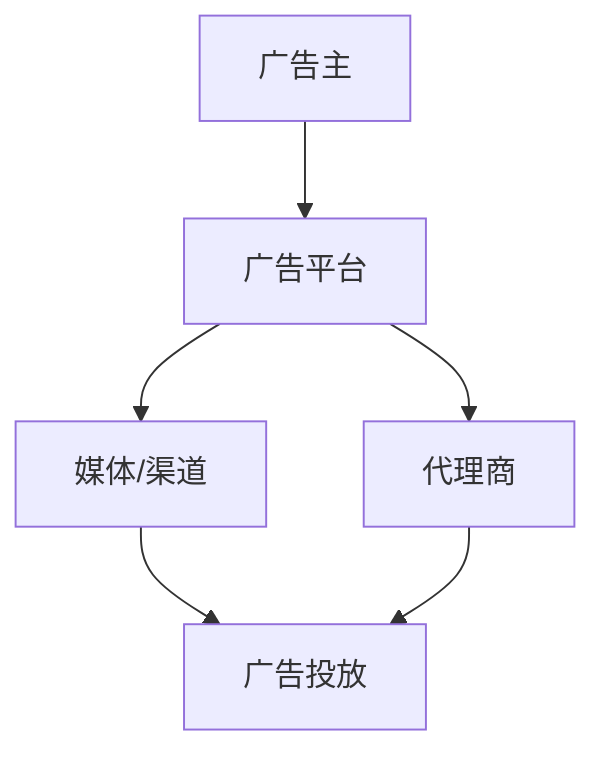

                 


### 文章标题

《程序化广告创业：精准投放的未来》

### 关键词

程序化广告、精准投放、个性化推荐、数据驱动营销、广告效果评估、用户获取与留存、创业实践

### 摘要

本文将探讨程序化广告的兴起与发展，以及如何通过数据驱动营销实现精准投放。我们将从背景介绍、核心概念与联系、核心算法原理讲解、数学模型和公式、项目实战等方面详细分析程序化广告的各个方面，为创业者和从业者提供实用的指导和建议。

### 《程序化广告创业：精准投放的未来》目录大纲

#### 第一部分：程序化广告概述

##### 第1章：程序化广告基础

- **1.1 程序化广告的概念**
  - 程序化广告的定义
  - 程序化广告与传统广告的差异

- **1.2 程序化广告的生态系统**
  - 广告主、广告平台、媒体、代理商等角色
  - 广告投放流程解析

- **1.3 程序化广告的发展历程**
  - 从初期的展示广告到现代的个性化广告
  - 技术创新与市场演变

- **1.4 程序化广告的现状与趋势**
  - 当前市场环境
  - 未来发展方向与挑战

#### 第二部分：精准投放技术

##### 第2章：数据驱动营销

- **2.1 数据驱动的核心概念**
  - 数据收集与清洗
  - 数据分析与建模

- **2.2 用户行为分析**
  - 用户画像构建
  - 用户行为模式识别

- **2.3 个性化推荐系统**
  - 推荐算法原理
  - 系统设计与实现

- **2.4 实时竞价（RTB）**
  - RTB工作原理
  - 报价策略优化

#### 第三部分：广告创意与效果评估

##### 第3章：广告创意设计

- **3.1 创意广告的要素**
  - 文字、图片、视频等广告形式
  - 视觉设计与用户体验

- **3.2 创意策略与市场定位**
  - 市场调研与目标受众分析
  - 创意策略制定与执行

- **3.3 广告创意的测试与优化**
  - A/B测试方法
  - 创意效果评估指标

##### 第4章：广告效果评估

- **4.1 广告效果评估指标**
  - 点击率（CTR）、转化率（CVR）等
  - KPI设定与监控

- **4.2 广告投放优化**
  - 优化策略与方法
  - 实时调整与效果追踪

- **4.3 广告 ROI 计算**
  - ROI模型构建
  - ROI分析与应用

#### 第四部分：程序化广告创业实践

##### 第5章：创业团队组建与运营策略

- **5.1 创业团队的组织结构**
  - 人员配置与管理
  - 团队协作与沟通

- **5.2 运营策略制定**
  - 市场定位与目标客户
  - 营销计划与执行

- **5.3 创业风险与应对策略**
  - 财务风险、市场风险等
  - 应对策略与风险控制

##### 第6章：产品开发与市场推广

- **6.1 产品规划与开发**
  - 产品路线图
  - 技术研发与迭代

- **6.2 市场推广策略**
  - 网络营销、内容营销等
  - 推广渠道选择与优化

- **6.3 用户获取与留存**
  - 用户增长策略
  - 用户满意度提升

##### 第7章：案例分析与实战分享

- **7.1 成功案例分享**
  - 分析成功案例的商业模式、营销策略、效果评估等

- **7.2 失败案例分析**
  - 深入剖析失败案例的原因、教训与改进方向

- **7.3 实战经验总结**
  - 创业过程中的宝贵经验与心得分享

#### 第五部分：附录

##### 附录A：资源与工具推荐

- **A.1 技术工具与平台**
  - 广告平台、数据分析工具等

- **A.2 开源项目与社区**
  - 相关开源项目、技术社区推荐

- **A.3 学习与培训资源**
  - 线上课程、书籍推荐

### Mermaid 流程图示例（以第1章为例）



### 核心算法原理讲解（以用户行为分析为例）

#### 2.2 用户行为分析

用户行为分析是精准投放的基础，它通过收集和分析用户在互联网上的行为数据，构建用户画像，从而实现个性化推荐和精准营销。

##### 伪代码示例

```python
# 用户行为分析伪代码

def analyze_user_behavior(user_data):
    # 数据预处理
    cleaned_data = preprocess_data(user_data)
    
    # 构建用户画像
    user_profile = build_user_profile(cleaned_data)
    
    # 用户行为预测
    predictions = predict_user_behavior(user_profile)
    
    # 行为分析结果输出
    return user_profile, predictions

# 数据预处理
def preprocess_data(data):
    # 数据清洗、格式转换等
    return cleaned_data

# 构建用户画像
def build_user_profile(data):
    # 特征提取、模型训练等
    profile = extract_features(data)
    return profile

# 用户行为预测
def predict_user_behavior(profile):
    # 利用模型进行预测
    predictions = model.predict(profile)
    return predictions
```

##### 代码解读与分析

- **数据预处理**：首先对用户数据进行清洗，如缺失值填充、异常值处理等，以便于后续分析和建模。
- **构建用户画像**：通过特征提取技术，将用户数据转换为用户画像，以便于后续的个性化推荐和精准营销。
- **用户行为预测**：利用构建好的用户画像和预测模型，对用户的行为进行预测，从而实现精准投放。

#### 数学模型和数学公式讲解（以广告效果评估为例）

#### 4.1 广告效果评估指标

广告效果评估通常通过以下几个关键指标来衡量：

1. 点击率（Click-Through Rate, CTR）
2. 转化率（Conversion Rate, CR）
3. ROI（Return on Investment）

##### 数学公式

$$CTR = \frac{点击次数}{展示次数}$$

$$CR = \frac{转化次数}{点击次数}$$

$$ROI = \frac{广告收益}{广告投入}$$

##### 举例说明

假设一个广告投放活动，共展示了10,000次，其中有300次被点击，其中点击后的100次产生了购买行为，广告投入为5,000元，广告收益为10,000元。

- 点击率（CTR）= 300 / 10,000 = 0.03 = 3%
- 转化率（CR）= 100 / 300 = 0.33 = 33%
- ROI = 10,000 / 5,000 = 2.0

### 项目实战

#### 6.3 用户获取与留存

用户获取与留存是广告创业的核心目标。以下是一个简单的用户获取与留存的实战案例。

##### 开发环境搭建

- 使用Python编程语言，结合Pandas、Scikit-learn等库进行数据处理和模型训练。
- 数据存储采用MySQL数据库，用于存储用户行为数据和广告投放数据。

##### 源代码实现

```python
# 用户获取与留存实战案例

import pandas as pd
from sklearn.model_selection import train_test_split
from sklearn.ensemble import RandomForestClassifier
from sklearn.metrics import accuracy_score

# 数据读取与预处理
user_data = pd.read_csv('user_data.csv')
user_data = preprocess_data(user_data)

# 特征工程
X = user_data.drop('is_registered', axis=1)
y = user_data['is_registered']

# 数据分割
X_train, X_test, y_train, y_test = train_test_split(X, y, test_size=0.2, random_state=42)

# 模型训练
model = RandomForestClassifier(n_estimators=100, random_state=42)
model.fit(X_train, y_train)

# 模型评估
predictions = model.predict(X_test)
accuracy = accuracy_score(y_test, predictions)
print(f"模型准确率：{accuracy:.2f}")
```

##### 代码解读与分析

- **数据读取与预处理**：首先从CSV文件中读取用户数据，并进行数据清洗，如缺失值填充、异常值处理等。
- **特征工程**：选择与目标变量（是否注册）相关的特征，构建特征矩阵X，并提取目标变量y。
- **数据分割**：将数据集分割为训练集和测试集，用于模型训练和评估。
- **模型训练**：使用随机森林分类器对训练集数据进行训练。
- **模型评估**：使用测试集数据对模型进行评估，计算准确率。

通过上述实战案例，开发者可以快速搭建一个用户获取与留存的预测模型，并根据实际情况进行调整和优化。

### 最佳实践 tips

1. **数据质量是关键**：确保数据收集、存储和清洗的准确性，高质量的数据是精准投放的基础。
2. **持续优化创意**：根据用户反馈和数据分析，不断优化广告创意，提高用户体验和点击率。
3. **关注长期ROI**：关注广告的长期效果和投资回报，合理分配预算，避免短期收益过度追求。
4. **学习行业动态**：紧跟广告技术和市场发展趋势，了解前沿技术和成功案例，为创业提供方向。
5. **团队合作与沟通**：建立高效的团队协作机制，确保各个环节的顺利推进。

### 小结

程序化广告创业充满了挑战与机遇。通过深入了解程序化广告的基础知识、精准投放技术、广告创意与效果评估，结合实战经验和案例分析，创业者可以更好地把握市场脉搏，实现持续增长。本文为广告创业提供了全面的指导和建议，希望能对您有所启发。

### 注意事项

1. **法律法规遵守**：在广告投放过程中，严格遵守相关法律法规，确保广告内容的合法合规。
2. **用户隐私保护**：在收集和使用用户数据时，重视用户隐私保护，遵循数据保护法规。
3. **数据安全**：确保数据存储和传输的安全性，防止数据泄露和恶意攻击。
4. **持续学习与进步**：广告技术和市场环境不断变化，创业者要保持学习态度，持续进步。

### 拓展阅读

1. 《数据科学实战：数据驱动营销策略》
2. 《广告技术：程序化广告原理与实践》
3. 《用户体验设计：创意广告设计技巧》
4. 《创业指南：互联网创业实战案例分析》

### 附录A：资源与工具推荐

- **A.1 技术工具与平台**
  - 广告平台：Google Ads、Facebook Ads、腾讯广告
  - 数据分析工具：Google Analytics、Tableau、DataRobot
  - 广告创意工具：Canva、Adobe Creative Cloud

- **A.2 开源项目与社区**
  - 相关开源项目：TensorFlow、PyTorch、Scikit-learn
  - 技术社区：Stack Overflow、GitHub、Quora

- **A.3 学习与培训资源**
  - 线上课程：Coursera、Udemy、edX
  - 技术书籍：《Python数据分析实战》、《机器学习实战》
  - 博客与文章：Medium、LinkedIn、知乎

通过以上资源与工具，您可以深入了解程序化广告的各个方面，提升自己的技能和竞争力。祝愿您的广告创业之路顺利！作者：AI天才研究院/AI Genius Institute & 禅与计算机程序设计艺术 /Zen And The Art of Computer Programming

