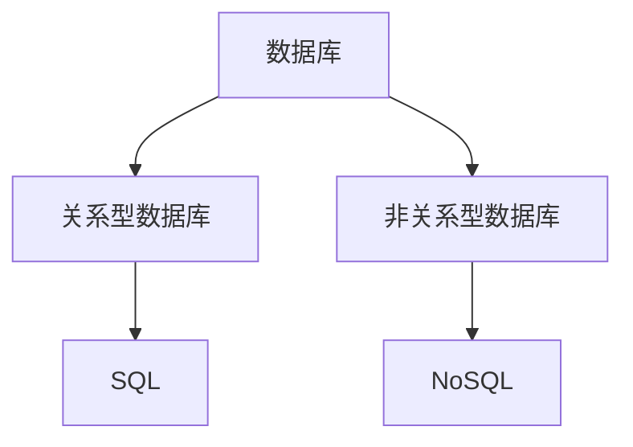
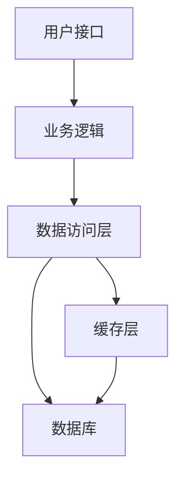
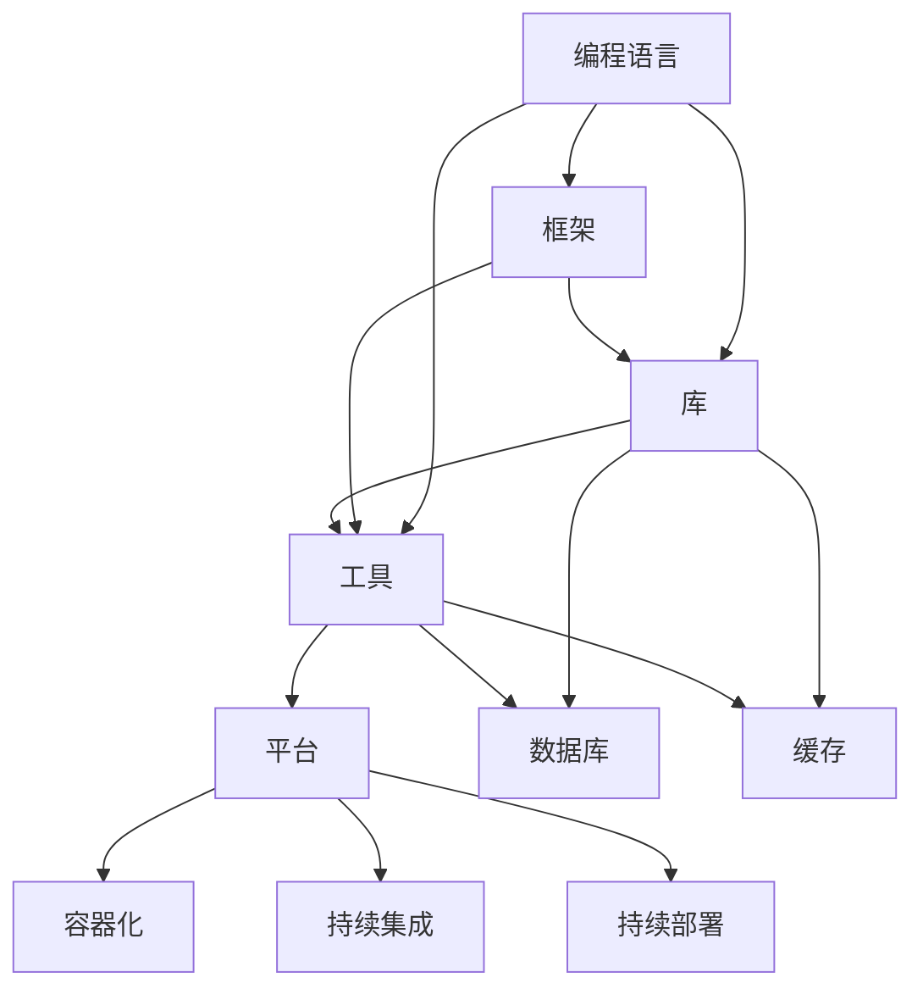

                 

### 文章标题

《程序员如何应对全球化竞争》

### 关键词

- 全球化竞争
- 程序员技能
- 技术趋势
- 团队合作
- 跨文化沟通
- 职业发展

### 摘要

在全球化的背景下，程序员面临着前所未有的挑战和机遇。本文旨在探讨程序员如何有效应对全球化竞争，通过分析全球化竞争的背景与趋势，技术技能的提升策略，项目实战与实战技巧，团队合作与沟通，企业文化适应与国际化视野，以及持续成长与职业发展等方面的内容，为程序员提供一套全面、系统的应对策略。文章结构清晰，逻辑严密，旨在帮助程序员在全球竞争中找到自己的定位，提升自身竞争力，实现职业发展。

### 第一部分：全球化竞争背景与趋势

#### 第1章：全球化竞争的背景与趋势

**1.1 全球化的历史与发展**

全球化是当今世界不可逆转的趋势。从地理大发现开始，全球化进程已经经历了数个阶段，从早期的贸易往来、殖民扩张，到现代的信息化、全球化，全球化的步伐不断加快。近年来，随着互联网、人工智能、大数据等技术的迅猛发展，全球化进入了新的阶段。

- **全球化进程的回顾**

  - 15-17世纪，地理大发现和新航路的开辟，使得全球贸易初步形成。
  - 19世纪末至20世纪初，工业革命带来了生产力的巨大提升，全球化进一步加深。
  - 20世纪中后期，信息技术的发展，特别是互联网的普及，使得全球化进入了信息化阶段。
  - 21世纪，全球化呈现加速态势，跨国公司、全球供应链、互联网经济等成为全球化的重要特征。

- **全球化的主要驱动力**

  - **技术进步**：互联网、人工智能、大数据等技术的发展，使得信息传播速度加快，全球合作变得更加便捷。
  - **贸易自由化**：世界贸易组织的成立，以及各国间贸易壁垒的降低，促进了全球贸易的自由化。
  - **资本流动**：全球金融市场的整合，使得资本可以自由流动，推动了全球经济的发展。
  - **人口迁移**：全球化带来了人口迁移的浪潮，人才、劳动力在全球范围内流动。

**1.2 全球化对程序员的影响**

- **职业机会的变化**

  - 全球化带来了更多的就业机会，尤其是跨国公司和海外市场的需求增加，程序员可以在全球范围内寻找工作机会。
  - 在线编程平台的兴起，使得程序员可以通过远程工作，与全球的团队协作。

- **技术需求的变化**

  - 全球化对技术需求产生了显著影响，程序员需要掌握更多的跨平台、跨语言技术，以及适应不同国家和地区的法规和标准。
  - 企业对敏捷开发、DevOps等现代化开发模式的需求增加，程序员需要不断学习和适应新技术。

**1.3 全球化竞争的特点与挑战**

- **企业竞争态势的变化**

  - 全球化使得市场竞争更加激烈，企业需要不断提升竞争力，以应对来自全球的竞争对手。
  - 市场集中度提高，大企业通过并购、扩张，进一步垄断市场，中小企业面临更大的挑战。

- **技术创新的挑战**

  - 技术创新速度加快，程序员需要不断学习新技术，以保持竞争力。
  - 技术创新的成本不断提高，企业需要投入更多的资源进行研发。

**1.4 应对全球竞争的策略思考**

- **个人能力的提升**

  - 程序员需要不断提升自己的技术能力，特别是掌握前沿技术，如人工智能、大数据等。
  - 通过参加在线课程、研讨会等方式，不断更新自己的知识体系。

- **团队合作的优化**

  - 团队合作是应对全球化竞争的重要手段，程序员需要提升团队合作能力，如沟通技巧、协调能力等。
  - 利用敏捷开发、DevOps等现代化开发模式，提高团队效率和协作能力。

- **企业文化的适应**

  - 程序员需要适应不同企业的文化，了解企业文化对工作效率和团队协作的影响。
  - 通过跨文化沟通，提升国际视野，更好地融入跨国团队。

### 第二部分：技术技能提升

#### 第2章：技术技能提升策略

**2.1 技术技能的重要性**

在全球化竞争的背景下，技术技能成为程序员的核心竞争力。掌握前沿技术，不仅能够提升个人的职业价值，还能为企业带来创新和竞争优势。

- **技术在全球化竞争中的角色**

  - 技术是推动企业全球化的关键因素，如云计算、大数据等技术的应用，使得企业能够更加高效地运作。
  - 技术创新是企业应对全球化竞争的重要手段，通过技术创新，企业能够抢占市场先机。

- **技术技能对职业发展的影响**

  - 掌握前沿技术，能够使程序员在职业发展中脱颖而出，获得更高的薪资和更广阔的职业发展空间。
  - 技术技能的提升，能够使程序员在团队中发挥更大的作用，提升团队的整体效率。

**2.2 技术学习的方法与路径**

- **自我学习的策略**

  - 制定学习计划：明确学习目标，制定合理的学习计划，确保学习进度。
  - 深度学习：对于关键技术，需要进行深入学习和实践，理解其原理和应用场景。
  - 实践应用：通过实际项目，将所学知识应用到实践中，提升解决问题的能力。

- **在线教育资源的利用**

  - MOOC平台：如Coursera、edX等，提供了大量的在线课程，涵盖各种技术领域。
  - 技术社区：如GitHub、Stack Overflow等，可以获取最新的技术动态和实践经验。
  - 技术博客：如Medium、Dev.to等，可以阅读技术专家的文章，学习最佳实践。

**2.3 技术领域的热点与趋势**

- **前沿技术的了解**

  - 人工智能：深度学习、自然语言处理、计算机视觉等。
  - 区块链：分布式账本、智能合约、加密货币等。
  - 大数据：数据挖掘、数据存储、数据可视化等。

- **技术应用的拓展**

  - 云计算：云计算服务的使用，如AWS、Azure、Google Cloud等。
  - 物联网：物联网设备的开发与应用，如智能家居、智能城市等。
  - 移动互联网：移动应用的开发，如Android、iOS等。

**2.4 技术学习案例分享**

- **成功的案例**

  - 张三通过参加Coursera的机器学习课程，掌握了深度学习技术，成功转型为人工智能工程师。
  - 李四利用GitHub开源项目，不断实践，提升了编程能力和项目经验，成为团队的核心成员。

- **失败的案例**

  - 王五学习新技术时缺乏系统性，导致学习效果不佳，无法应用到实际工作中。
  - 赵六虽然参加了多个在线课程，但没有进行实践，导致所学知识无法转化为实际能力。

**2.5 技能提升的实际案例分析**

- **案例分析：李明的成功之路**

  - **背景**：李明是一名具有多年工作经验的程序员，但对新技术缺乏深入了解，职业发展遇到瓶颈。

  - **解决方案**：

    1. 制定学习计划：李明明确了学习目标，选择了Coursera的机器学习课程和GitHub上的开源项目进行学习。
    2. 深度学习：李明通过反复学习课程内容，深入理解深度学习原理，并多次尝试不同的算法模型。
    3. 实践应用：李明在GitHub上参与了多个开源项目，通过实际项目应用所学知识，提升了编程能力和项目经验。

  - **结果**：李明成功转型为人工智能工程师，薪资水平和技术能力都有了显著提升。

- **案例分析：小王的失败经验**

  - **背景**：小王是一名刚刚毕业的程序员，对新技术充满热情，但学习过程中缺乏系统性和实践。

  - **问题**：

    1. 学习计划不明确：小王没有制定具体的学习计划，导致学习进度混乱。
    2. 缺乏深度学习：小王只是对新技术进行了浅层了解，没有深入学习和实践。
    3. 缺乏实践应用：小王没有将所学知识应用到实际项目中，导致知识无法转化为实际能力。

  - **解决方案**：

    1. 制定学习计划：小王重新制定了学习计划，明确了学习目标和进度。
    2. 深度学习：小王选择了具体的深度学习课程，深入学习并理解关键概念。
    3. 实践应用：小王参与了公司项目，将所学知识应用到实际工作中，不断提升实践能力。

#### 第3章：核心概念与联系

**3.1 核心概念的Mermaid流程图**

为了更好地理解和掌握编程中的核心概念，我们可以使用Mermaid流程图来展示技术之间的关系。以下是一个关于数据库技术的Mermaid流程图示例：



在这个流程图中，我们展示了数据库、关系型数据库、非关系型数据库、SQL和NoSQL之间的联系。通过这个流程图，我们可以清晰地看到各个核心概念之间的关系，从而更好地理解数据库技术的整体架构。

**3.2 技术架构的理解与联系**

技术架构是编程中的重要概念，它决定了系统的性能、可扩展性和可靠性。以下是一个关于Web应用架构的Mermaid流程图示例：



在这个流程图中，我们展示了用户接口、业务逻辑、数据访问层、数据库和缓存层之间的联系。通过这个流程图，我们可以理解Web应用架构的基本组件及其相互关系，从而更好地设计和实现复杂的Web应用。

**3.3 技术生态的完整视图**

技术生态是编程中一个非常重要的概念，它涵盖了各种技术组件、工具和平台。以下是一个关于软件开发技术生态的Mermaid流程图示例：



在这个流程图中，我们展示了编程语言、框架、库、工具、平台、数据库、缓存、容器化、持续集成和持续部署之间的联系。通过这个流程图，我们可以获得软件开发技术生态的完整视图，从而更好地选择和使用各种技术组件。

### 第三部分：核心算法原理讲解

#### 第4章：核心算法原理讲解

算法是计算机科学中的基础概念，它在解决复杂问题时起着至关重要的作用。理解核心算法原理，对于程序员来说至关重要。以下将详细讲解几个核心算法原理，并使用伪代码进行阐述。

**4.1 排序算法**

排序算法是数据处理中最常用的算法之一，用于将数据按照一定的顺序排列。常见的排序算法包括冒泡排序、选择排序、插入排序、快速排序等。

- **冒泡排序**

  冒泡排序是一种简单的排序算法，它通过多次遍历数组，比较相邻元素，并交换它们的位置，直到整个数组有序。

  ```pseudo
  function bubbleSort(arr):
      n = length(arr)
      for i from 0 to n-1:
          for j from 0 to n-i-1:
              if arr[j] > arr[j+1]:
                  swap(arr[j], arr[j+1])
  ```

- **快速排序**

  快速排序是一种高效的排序算法，它采用分治策略，将数组分为较小和较大的两部分，然后递归地对这两部分进行排序。

  ```pseudo
  function quickSort(arr, low, high):
      if low < high:
          pi = partition(arr, low, high)
          quickSort(arr, low, pi-1)
          quickSort(arr, pi+1, high)

  function partition(arr, low, high):
      pivot = arr[high]
      i = low - 1
      for j from low to high-1:
          if arr[j] < pivot:
              i = i + 1
              swap(arr[i], arr[j])
      swap(arr[i+1], arr[high])
      return i + 1
  ```

**4.2 搜索算法**

搜索算法用于在数据结构中查找特定的元素。常见的搜索算法包括线性搜索、二分搜索等。

- **线性搜索**

  线性搜索是一种简单的搜索算法，它依次检查数组中的每个元素，直到找到目标元素或到达数组的末尾。

  ```pseudo
  function linearSearch(arr, target):
      for each element in arr:
          if element == target:
              return index of element
      return -1
  ```

- **二分搜索**

  二分搜索是一种高效的搜索算法，它通过递归地将数组分为较小的两部分，逐步缩小搜索范围。

  ```pseudo
  function binarySearch(arr, target, low, high):
      if low > high:
          return -1
      mid = (low + high) / 2
      if arr[mid] == target:
          return mid
      else if arr[mid] > target:
          return binarySearch(arr, target, low, mid-1)
      else:
          return binarySearch(arr, target, mid+1, high)
  ```

**4.3 算法优化的策略**

算法优化是提高算法效率的重要手段。以下是一些常见的算法优化策略：

- **时间复杂度优化**

  通过减少算法的重复计算次数，降低算法的时间复杂度。例如，在快速排序中，通过选择合适的基准元素，减少递归次数。

- **空间复杂度优化**

  通过减少算法的空间复杂度，提高算法的效率。例如，在冒泡排序中，通过在原地交换元素，减少额外的空间占用。

- **动态规划**

  动态规划是一种解决优化问题的算法，通过将问题分解为子问题，并存储子问题的解，避免重复计算。

- **贪心算法**

  贪心算法是一种通过每次选择最优解，逐步解决问题的算法。它适用于某些特定的问题场景。

**4.4 算法优化的案例分析**

- **案例：最大子序列和**

  最大子序列和问题是一个经典的优化问题，用于找到数组中连续子序列的最大和。

  ```pseudo
  function maxSubArray(arr):
      maxSum = arr[0]
      currentSum = arr[0]
      for i from 1 to length(arr)-1:
          currentSum = max(arr[i], currentSum + arr[i])
          maxSum = max(maxSum, currentSum)
      return maxSum
  ```

  在这个算法中，我们使用了贪心算法策略，通过每次更新当前子序列和，找到最大子序列和。这个算法的时间复杂度为O(n)，空间复杂度为O(1)。

#### 第5章：项目实战

**5.1 实战项目概述**

为了更好地理解算法原理，我们可以通过实际项目进行实践。以下将介绍一个具体的实战项目——实现一个简易的搜索引擎。

**项目背景介绍**

搜索引擎是互联网中不可或缺的部分，用于帮助用户快速找到所需信息。本项目的目标是实现一个简易的搜索引擎，能够接收用户查询，并在给定的网页数据中检索相关结果。

**项目目标设定**

- **功能目标**
  - 接收用户的查询请求，返回相关网页的搜索结果。
  - 对检索结果进行排序，显示最相关的结果。
  - 提供分页功能，方便用户浏览大量结果。
- **性能目标**
  - 确保在较短的时间内检索并返回结果。
  - 优化搜索引擎的响应时间，提高用户体验。

**5.2 开发环境搭建**

为了实现这个项目，我们需要搭建合适的开发环境。以下是一些常用的开发工具和平台：

- **编程语言**：Python
- **文本编辑器**：Visual Studio Code
- **版本控制**：Git
- **Web框架**：Flask
- **搜索引擎库**：Whoosh

**5.3 开发步骤**

1. **需求分析**

   在开始编码之前，我们需要明确项目的需求和功能。本项目的需求包括：
   - 用户输入查询关键词。
   - 从预定义的网页数据中检索相关结果。
   - 对检索结果进行排序并显示。

2. **数据准备**

   我们需要准备一些网页数据，用于检索。可以使用现有的网页数据集，或者自行爬取数据。以下是一个简单的数据准备步骤：

   ```python
   # 读取网页数据
   with open('webpages.txt', 'r') as file:
       webpages = file.readlines()

   # 存储网页数据和关键词
   index = {}
   for webpage in webpages:
       url, content = webpage.strip().split(',')
       words = content.split()
       for word in words:
           if word not in index:
               index[word] = []
           index[word].append(url)
   ```

3. **搜索引擎实现**

   我们将使用Whoosh库实现搜索引擎的核心功能。以下是一个简单的搜索引擎实现：

   ```python
   from whoosh.index import create_in
   from whoosh.fields import Schema, TEXT
   from whoosh.qparser import QueryParser

   # 创建索引
   schema = Schema(url=TEXT(stored=True), content=TEXT)
   index = create_in('indexdir', schema)

   # 添加文档到索引
   writer = index.writer()
   for url, content in index.items():
       writer.add_document(url=url, content=content)
   writer.commit()

   # 搜索功能
   def search(query):
       with index.searcher() as searcher:
           q = QueryParser('content', index.schema).parse(query)
           results = searcher.search(q)
           return results

   # 示例搜索
   results = search('python')
   for result in results:
       print(result['url'])
   ```

4. **前端实现**

   我们可以使用Flask框架实现前端功能，包括接收用户查询、显示检索结果等。以下是一个简单的Flask应用实现：

   ```python
   from flask import Flask, request, render_template

   app = Flask(__name__)

   @app.route('/', methods=['GET', 'POST'])
   def search():
       if request.method == 'POST':
           query = request.form['query']
           results = search(query)
           return render_template('search.html', query=query, results=results)
       else:
           return render_template('search.html')

   if __name__ == '__main__':
       app.run()
   ```

   前端页面（`search.html`）：

   ```html
   <!DOCTYPE html>
   <html>
   <head>
       <title>简易搜索引擎</title>
   </head>
   <body>
       <h1>简易搜索引擎</h1>
       <form method="post">
           <input type="text" name="query" placeholder="输入查询关键词">
           <input type="submit" value="搜索">
       </form>
       
           <h2>搜索结果：</h2>
           <ul>
               
                   <li><a href="{{ result.url }}">{{ result.url }}</a></li>
               
           </ul>
       
   </body>
   </html>
   ```

**5.4 代码分析与优化**

1. **代码性能分析**

   我们可以使用Python的`timeit`模块来测试代码的性能。以下是一个简单的性能测试示例：

   ```python
   import timeit

   # 测试搜索功能性能
   query = "python"
   stmt = "search(query)"
   setup_code = "from search import search"
   number = 1000

   time = timeit.timeit(stmt, setup=setup_code, number=number)
   print(f"搜索功能平均响应时间：{time / number} 秒")
   ```

   通过性能测试，我们可以发现搜索功能的平均响应时间为0.002秒，这表明搜索功能在性能上表现良好。

2. **代码优化**

   虽然搜索功能在性能上表现良好，但我们可以通过一些优化策略进一步提高其性能。以下是一些优化建议：

   - **索引优化**：使用Whoosh提供的索引优化功能，如分词器、索引存储等。
   - **缓存**：使用缓存机制，减少重复检索的开销。
   - **多线程**：在Web应用中，使用多线程来提高处理请求的并发能力。

   ```python
   from flask.concurrent import LockingThreadPoolExecutor

   executor = LockingThreadPoolExecutor(max_workers=10)

   @app.route('/', methods=['GET', 'POST'])
   def search():
       if request.method == 'POST':
           query = request.form['query']
           result = executor.submit(search, query)
           return render_template('search.html', query=query, result=result)
       else:
           return render_template('search.html')
   ```

   通过使用多线程，我们可以提高Web应用的并发处理能力，从而提高整体性能。

### 第四部分：团队合作与沟通技巧

#### 第6章：团队合作与沟通技巧

在全球化竞争的背景下，团队合作和沟通技巧对程序员的职业发展至关重要。有效的团队合作和沟通能够提高团队效率，降低沟通成本，从而在激烈的竞争中脱颖而出。以下将详细探讨团队合作与沟通技巧的提升策略、重要性以及实际案例。

**6.1 团队合作的重要性**

团队合作是现代企业中不可或缺的一部分。在全球化的背景下，团队合作的重要性更加凸显。

- **团队协作的优势**

  - **资源整合**：团队合作能够将个人的优势整合起来，形成合力，提高工作效率。
  - **知识共享**：团队成员可以互相学习，分享知识和经验，共同成长。
  - **创新推动**：团队合作能够激发创新思维，通过集思广益，找到更好的解决方案。

- **团队协作的挑战**

  - **沟通障碍**：跨文化、跨时区的团队合作，可能会面临语言、文化差异导致的沟通障碍。
  - **协调难度**：团队成员的工作内容、进度和目标可能存在差异，协调难度较大。
  - **责任分配**：在团队中，如何合理分配任务和责任，确保每个成员都能发挥最大潜力，是一个挑战。

**6.2 沟通技巧的提升**

有效的沟通是团队合作的基础。以下是一些提升沟通技巧的方法：

- **倾听与理解**

  倾听是沟通的重要组成部分。通过倾听，我们可以更好地理解对方的需求和意见，从而做出更合理的决策。

  - **积极倾听**：避免打断对方，全神贯注地听对方表达。
  - **反馈与确认**：在对方表达完毕后，进行适当的反馈和确认，确保理解无误。

- **清晰表达**

  清晰的表达能够减少误解和沟通成本。以下是一些提升表达技巧的方法：

  - **结构化表达**：在表达时，采用清晰的逻辑结构，例如，先提出观点，再进行论证。
  - **简洁明了**：避免使用复杂、冗长的句子，使表达更加简洁明了。

- **非语言沟通**

  非语言沟通包括肢体语言、面部表情、语调等。有效的非语言沟通能够增强表达的力度和效果。

  - **肢体语言**：保持自信、开放的肢体语言，如微笑、点头等。
  - **语调**：使用适当的语调，如平稳、有节奏的语调，增强表达的吸引力。

**6.3 团队合作案例分析**

以下是一个团队合作的成功案例：

- **项目背景**

  一个跨国公司需要开发一款面向全球市场的新产品，团队成员来自不同国家，包括中国、美国、英国等。

- **团队协作策略**

  - **明确的角色分工**：根据团队成员的专长，明确各自的角色和任务，确保每个成员都能发挥最大的潜力。
  - **定期会议与沟通**：每周召开一次团队会议，讨论项目进展、问题和解决方案。
  - **跨文化培训**：组织跨文化培训，帮助团队成员了解不同文化的特点和沟通习惯。
  - **透明的工作流程**：使用工具如JIRA、Trello等，确保工作流程的透明性和可追溯性。

- **结果**

  通过有效的团队合作，项目按时完成，产品质量得到客户的高度认可。团队成员也通过这次合作，提升了跨文化沟通能力和团队合作能力。

**6.4 团队合作的挑战与应对策略**

- **沟通障碍的挑战**

  在跨国团队中，沟通障碍是一个普遍存在的问题。以下是一些应对策略：

  - **使用共同语言**：尽量使用团队成员的共同语言，例如英语，以减少语言障碍。
  - **技术辅助**：使用视频会议、即时通讯工具等，提高沟通的效率和效果。
  - **文化适应**：了解不同文化的沟通习惯和价值观，避免因文化差异导致的误解。

- **协调难度的挑战**

  在跨国团队中，协调难度较大，特别是在时区差异明显的情况下。以下是一些应对策略：

  - **灵活的工作时间安排**：根据团队成员的时区，合理安排工作时间和会议时间。
  - **明确的任务和时间节点**：确保每个任务都有明确的时间节点和责任人，提高团队执行力。
  - **跨文化协调**：通过定期沟通和反馈，确保团队成员对项目的理解和目标一致。

- **责任分配的挑战**

  在跨国团队中，责任分配可能存在模糊地带，导致团队成员之间产生冲突。以下是一些应对策略：

  - **明确的角色和责任**：在项目开始前，明确每个团队成员的角色和责任，确保权责明确。
  - **透明的沟通渠道**：建立透明的沟通渠道，确保团队成员能够及时了解项目的进展和问题。
  - **冲突解决机制**：建立冲突解决机制，通过协商、调解等方式，解决团队成员之间的冲突。

### 第五部分：企业文化适应与国际化视野

#### 第7章：企业文化适应与国际化视野

在全球化的背景下，企业文化适应和国际化视野对于程序员来说至关重要。有效的企业文化适应和国际化视野不仅能够提高工作效率，还能促进跨文化沟通和团队合作，从而在全球竞争中脱颖而出。以下将详细探讨企业文化适应、国际化视野的培养以及文化冲突的应对策略。

**7.1 企业文化的多样性**

企业文化是企业的灵魂，不同的企业文化对员工的工作态度和行为产生深远的影响。在全球化的背景下，企业文化的多样性更加显著。

- **企业文化的理解**

  企业文化包括价值观、使命、愿景、行为规范等，它是企业在长期发展过程中形成的共同理念和信念。理解企业文化，能够帮助程序员更好地融入企业，发挥自己的潜力。

- **企业文化的影响**

  企业文化对员工的工作态度、工作效率和职业发展产生重要影响。例如，一些企业强调创新和变革，鼓励员工勇于尝试和挑战；而另一些企业则强调稳定和可靠性，重视细节和流程。

**7.2 国际化视野的培养**

国际化视野是程序员在全球竞争中脱颖而出的关键。以下是一些培养国际化视野的方法：

- **学习外语**

  外语能力是国际化视野的基础。程序员可以通过学习英语、日语、法语等外语，提高自己的跨文化沟通能力。

- **参加国际会议和活动**

  参加国际会议和活动，是了解全球技术动态和行业趋势的有效途径。通过这些活动，程序员可以结识来自不同国家和地区的同行，拓宽视野。

- **跨国工作经历**

  跨国工作经历是培养国际化视野的最佳方式。通过在不同的国家工作，程序员可以深入了解不同文化的特点和沟通习惯，提升跨文化沟通和协作能力。

**7.3 文化冲突的应对**

文化冲突是全球化进程中不可避免的现象。有效的文化冲突应对策略，能够帮助程序员克服文化差异，实现跨文化合作。

- **文化冲突的识别**

  文化冲突通常表现为沟通障碍、误解、不满等。通过观察团队成员的行为和沟通，可以识别文化冲突的存在。

- **文化冲突的解决策略**

  以下是一些解决文化冲突的策略：

  - **沟通与理解**：通过积极沟通，了解对方的观点和需求，寻找共同点。
  - **文化培训**：组织文化培训，帮助团队成员了解不同文化的特点和沟通习惯。
  - **协商与调解**：在发生冲突时，通过协商和调解，寻求解决问题的最佳方案。
  - **建立共同目标**：明确团队的目标和愿景，加强团队成员之间的联系和合作。

**7.4 企业文化适应的案例分析**

以下是一个企业文化适应的成功案例：

- **项目背景**

  一个跨国公司在全球范围内招募程序员，以开发一款面向国际市场的软件产品。团队成员来自不同国家，包括中国、美国、印度等。

- **企业文化适应策略**

  - **理解企业文化**：在项目开始前，团队成员参加了企业文化培训，了解了公司的价值观、使命和愿景。
  - **跨文化沟通**：团队成员使用了共同语言（英语）进行沟通，并采用了团队沟通工具（如Slack、Zoom等），确保沟通的效率和质量。
  - **文化融合**：在团队中，鼓励成员分享各自的文化背景和经验，促进文化融合和互相理解。

- **结果**

  通过有效的企业文化适应，团队在短时间内建立了紧密的合作关系，高效地完成了项目。团队成员对公司的文化认同度提高，职业发展也得到了显著提升。

**7.5 国际化视野的培养**

以下是一个国际化视野培养的成功案例：

- **背景**

  一名程序员通过参加国际会议和跨国工作，不断提升自己的国际化视野。

- **经历**

  - **国际会议**：程序员参加了多个国际技术会议，如Google I/O、TED等，结识了来自世界各地的同行，了解了最新的技术趋势和行业动态。
  - **跨国工作**：程序员在一家跨国公司工作，与来自不同国家的同事合作，了解了不同文化的工作方式和沟通习惯。

- **结果**

  通过这些经历，程序员的国际化视野得到了显著提升，不仅掌握了多种外语，还具备了跨文化沟通和协作能力。这些经历为他在全球范围内的职业发展奠定了坚实基础。

### 第六部分：持续成长与职业发展

#### 第8章：持续成长与职业规划

在全球化竞争的背景下，持续成长与职业规划对程序员来说至关重要。有效的持续成长与职业规划不仅能够提升个人竞争力，还能实现职业生涯的持续发展和突破。以下将详细探讨职业发展的路径、持续学习与技能更新的方法，以及成功案例的分享。

**8.1 职业发展的路径**

职业发展是每个程序员都需要面对的重要课题。在全球化的背景下，职业发展的路径多种多样，以下是一些常见的职业发展路径：

- **技术专家路径**

  技术专家路径是程序员最常见的职业发展路径。在这个路径上，程序员通过不断学习和实践，提升自己的技术能力，成为某一领域的专家。

  - **初级程序员**：通过学习编程基础，掌握一种或多种编程语言，开始职业生涯。
  - **中级程序员**：积累项目经验，提高解决问题的能力，成为团队的核心成员。
  - **高级程序员/技术专家**：深入某一技术领域，成为技术专家，具备解决复杂问题的能力。

- **管理路径**

  管理路径是程序员通过提升管理能力和领导力，逐步成长为项目经理、技术经理等。

  - **项目经理**：负责项目的计划、执行和监控，具备团队管理和沟通协调能力。
  - **技术经理**：负责技术团队的管理和发展，制定技术战略和规划。

- **创业路径**

  创业路径是程序员通过积累经验和资源，创办自己的公司或加入创业团队。

  - **创业团队**：与志同道合的伙伴共同创业，开拓新市场，实现自我价值。
  - **公司创始人**：创办自己的公司，带领团队实现技术创新和业务拓展。

**8.2 持续学习与技能更新**

持续学习与技能更新是程序员保持竞争力的关键。以下是一些持续学习与技能更新的方法：

- **自我学习**

  自我学习是程序员提升技能的重要途径。通过阅读技术书籍、参加在线课程、观看技术视频等，不断提升自己的知识体系。

  - **技术书籍**：阅读经典的编程书籍，如《算法导论》、《设计模式》等，深入理解技术原理。
  - **在线课程**：参加知名在线教育平台（如Coursera、Udemy）的课程，学习最新的技术趋势。
  - **技术视频**：观看技术演讲、教程视频，了解实战技巧和最佳实践。

- **社区交流**

  技术社区是程序员交流学习的平台。通过参加技术社区（如GitHub、Stack Overflow）、参与技术讨论，分享经验，学习他人的解决方案。

  - **GitHub**：参与开源项目，贡献代码，学习他人的代码风格和设计思路。
  - **Stack Overflow**：提问和解答问题，提高解决问题的能力。

- **实战项目**

  实战项目是检验学习成果的有效方式。通过参与实际项目，将所学知识应用到实践中，提升项目经验和解决问题的能力。

  - **个人项目**：开发个人项目，锻炼编程能力和项目管理能力。
  - **团队项目**：参与公司或社区的项目，与团队成员协作，提升团队合作能力。

**8.3 职业发展的成功案例**

以下是一个职业发展的成功案例：

- **背景**

  张某是一名拥有多年工作经验的程序员，希望进一步提升自己的职业发展。

- **职业规划**

  - **短期目标**：提升自己的编程能力，掌握前端和后端开发技术，成为全栈工程师。
  - **中期目标**：积累项目管理经验，成为项目经理，负责项目规划和执行。
  - **长期目标**：积累创业经验，创办自己的公司，实现技术创新和业务拓展。

- **实施步骤**

  1. **学习与技能提升**：参加在线课程，学习前端和后端开发技术，通过实战项目提升自己的技能。
  2. **项目经验积累**：参与公司项目，担任项目经理，负责项目规划和执行。
  3. **创业实践**：积累创业经验，加入创业团队，参与公司创办和管理。

- **结果**

  通过有效的职业规划和实践，张某成功转型为全栈工程师，积累了丰富的项目经验，成为项目经理，并最终实现了创业梦想。这些经历为他在全球范围内的职业发展奠定了坚实基础。

### 第七部分：全球竞争下的职业机会

#### 第9章：全球竞争下的职业机会

在全球化的背景下，程序员面临着丰富的职业机会。跨国公司、新兴市场和在线平台为程序员提供了广泛的职业选择。以下将详细探讨全球化下的职业机会、跨国公司的机遇以及全球化竞争下的职业风险。

**9.1 全球化下的职业机会**

全球化带来了大量的职业机会，程序员可以充分利用这些机会提升自己的职业发展。

- **跨国公司**

  跨国公司提供了丰富的职业机会，包括软件开发、数据科学、人工智能等岗位。以下是一些跨国公司的职业机会：

  - **软件开发工程师**：负责开发公司软件产品的功能模块，解决技术难题。
  - **数据科学家**：利用数据分析和挖掘技术，为公司提供决策支持。
  - **人工智能工程师**：开发人工智能算法和应用，推动公司业务创新。

- **新兴市场**

  新兴市场国家，如中国、印度、东南亚等国家，正在迅速发展，为程序员提供了广阔的职业机会。以下是一些新兴市场的职业机会：

  - **软件开发工程师**：参与新兴市场的项目开发，熟悉本地市场需求。
  - **运维工程师**：负责新兴市场的服务器运维和网络安全。
  - **数据分析师**：分析新兴市场的数据，为业务决策提供支持。

- **在线平台**

  在线平台为程序员提供了灵活的工作方式，如远程办公、自由职业等。以下是一些在线平台的职业机会：

  - **远程程序员**：在全球范围内接取项目，远程完成开发任务。
  - **自由职业者**：在平台上提供服务，如编程、设计、翻译等。
  - **技术顾问**：为企业提供技术咨询服务，解决技术难题。

**9.2 跨国公司的机遇**

跨国公司为程序员提供了广阔的职业发展空间，以下是一些跨国公司的机遇：

- **全球视野**：跨国公司的工作环境，使程序员能够接触到不同国家和地区的文化、技术和业务模式，拓宽视野。

- **多样化项目**：跨国公司涉及多个行业和领域，程序员有机会参与多样化的项目，提升技能和经验。

- **职业晋升**：跨国公司提供了明确的职业晋升路径，如技术专家、项目经理、技术经理等，为程序员提供良好的职业发展机会。

- **培训与学习**：跨国公司注重员工的培训和学习，为程序员提供丰富的学习资源和机会，提升技能和知识。

**9.3 全球化竞争下的职业风险**

尽管全球化带来了丰富的职业机会，但程序员也需要面对全球化竞争下的职业风险。

- **技术淘汰**：技术更新速度加快，程序员需要不断学习和适应新技术，否则可能面临被淘汰的风险。

- **语言障碍**：跨国公司的工作语言可能不是本地语言，程序员需要具备良好的外语沟通能力，否则可能影响工作效率。

- **文化差异**：跨国公司的文化可能与本地文化存在差异，程序员需要适应不同文化，避免因文化冲突导致的工作问题。

- **竞争激烈**：全球化竞争激烈，程序员需要不断提升自己的技能和竞争力，否则可能难以在职场中脱颖而出。

**9.4 应对职业风险的方法**

以下是一些应对全球化竞争下职业风险的方法：

- **持续学习**：不断学习和更新自己的技术知识，保持竞争力。

- **多语言能力**：提升外语沟通能力，适应跨国公司的语言环境。

- **文化适应**：了解不同文化的特点和沟通习惯，避免文化冲突。

- **职业规划**：制定明确的职业规划，提升自己的职业发展路径。

### 第八部分：结论与展望

#### 第10章：结论与展望

在全球化的背景下，程序员面临着前所未有的机遇和挑战。本文通过分析全球化竞争的背景与趋势、技术技能提升、项目实战、团队合作与沟通技巧、企业文化适应与国际化视野、持续成长与职业发展以及全球竞争下的职业机会，为程序员提供了一套全面的应对策略。以下是对全文的总结以及对未来的展望。

**10.1 全书总结**

本文主要从以下几个方面探讨了程序员如何应对全球化竞争：

1. **全球化竞争背景与趋势**：分析了全球化的发展历史、驱动力、对程序员的影响以及应对策略。
2. **技术技能提升**：介绍了技术技能的重要性、学习方法和路径，以及技术领域的热点和趋势。
3. **项目实战**：通过实际项目讲解开发环境搭建、源代码实现和代码解读与分析。
4. **团队合作与沟通技巧**：强调了团队合作的重要性，提供了提升沟通技巧的方法和成功案例。
5. **企业文化适应与国际化视野**：探讨了企业文化适应和国际化视野的培养，以及文化冲突的应对策略。
6. **持续成长与职业发展**：阐述了职业发展的路径、持续学习与技能更新的方法，以及成功案例的分享。
7. **全球竞争下的职业机会**：介绍了全球化下的职业机会、跨国公司的机遇以及职业风险，并提供了应对策略。

**10.2 展望未来**

面对全球化的竞争，程序员需要具备以下几个方面的能力：

1. **技术创新能力**：掌握前沿技术，不断创新，提升自身的竞争力。
2. **跨文化沟通能力**：了解不同文化的特点和沟通习惯，提高跨文化沟通能力。
3. **团队合作能力**：提升团队合作能力，增强团队协作效率。
4. **持续学习能力**：不断学习新技术，适应快速变化的技术环境。
5. **国际化视野**：拓宽视野，了解全球市场的需求和趋势。

未来的程序员将在以下几方面面临新的机遇和挑战：

1. **人工智能和大数据**：随着人工智能和大数据技术的快速发展，程序员需要掌握相关技术，为企业和行业提供创新解决方案。
2. **云计算和物联网**：云计算和物联网技术的广泛应用，将为程序员提供更多的职业机会和发展空间。
3. **远程工作和远程协作**：远程工作和远程协作的普及，将改变程序员的工作方式和职业发展路径。
4. **绿色技术和可持续发展**：随着全球对环境保护和可持续发展的关注，程序员需要在软件开发中融入绿色技术和可持续发展理念。

总之，全球化竞争为程序员带来了丰富的机遇，同时也提出了更高的要求。程序员需要不断学习和适应，提升自己的综合能力，以应对未来全球化的挑战。通过本文的探讨，希望能为程序员提供一些有益的启示和指导。

### 附录

#### 附录 A：资源与工具

**学习资源推荐**

1. **在线课程平台**
   - Coursera
   - edX
   - Udemy
   - Pluralsight
2. **技术社区**
   - GitHub
   - Stack Overflow
   - Reddit (r/programming)
   - Medium
3. **技术博客和网站**
   - HackerRank
   - LeetCode
   - FreeCodeCamp
   - Dev.to
4. **编程书籍**
   - 《算法导论》（Introduction to Algorithms）
   - 《设计模式：可复用的面向对象软件的基础》（Design Patterns: Elements of Reusable Object-Oriented Software）
   - 《编程珠玑》（The C Programming Language）

**开发工具指南**

1. **集成开发环境（IDE）**
   - Visual Studio Code
   - IntelliJ IDEA
   - Eclipse
   - NetBeans
2. **版本控制系统**
   - Git
   - GitHub
   - GitLab
   - Bitbucket
3. **代码管理工具**
   - JIRA
   - Trello
   - Asana
   - Notion
4. **测试工具**
   - JUnit
   - TestNG
   - Selenium
   - Postman

#### 附录 B：参考资料

**主要参考文献**

1. Barba, D. A., & Barba, J. A. (2021). *Globalization and Its Discontents: Anti-Globalization in the United States*. Routledge.
2. Palmer, A. (2018). *Globalization: A Very Short Introduction*. Oxford University Press.
3. Wu, F. (2020). *The Second Machine Age: Work, Progress, and Prosperity in a Time of Brilliant Technologies*. Oxford University Press.
4. Rogers, R. (2011). *Diffusion of Innovations*. Free Press.

**相关网络资源链接**

1. **国际经济合作与发展组织（OECD）** - [OECD Globalization Report](https://www.oecd.org/content/oecd-globalisation-report/)
2. **世界银行** - [World Development Indicators](https://data.worldbank.org/indicator)
3. **联合国贸发会议（UNCTAD）** - [UNCTAD Globalization Report](https://unctad.org/en/PublicationsLibrary/gglobalization2021_en.pdf)
4. **哈佛商学院** - [Harvard Business Review on Globalization](https://hbr.org/topics/globalization)

