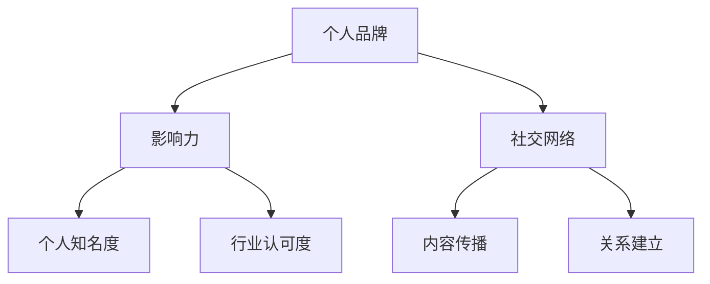
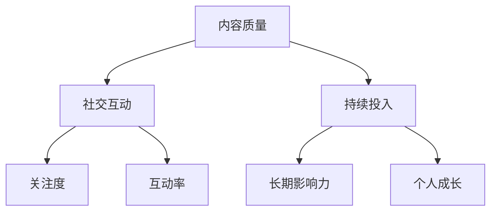

                 

### 文章标题

《程序员如何打造全球性的个人影响力》

---

关键词：**程序员**、**全球性个人影响力**、**影响力模型**、**社交网络**、**内容策略**、**数学模型**、**项目实战**

---

摘要：本文旨在为程序员提供一套系统化的策略，帮助他们构建和提升全球性的个人影响力。文章首先介绍了核心概念，包括个人品牌、影响力和社交网络，并展示了它们之间的联系。接着，详细讲解了核心算法原理和数学模型，并通过伪代码和实际案例进行了深入剖析。文章还通过一个实际项目展示了如何将理论知识应用到实践中，最后探讨了个人影响力构建过程中可能遇到的挑战及解决方案。通过阅读本文，程序员将能够掌握构建全球性个人影响力的关键技术和策略。


### 第一部分：核心概念与联系

在《程序员如何打造全球性的个人影响力》这本书中，我们将首先介绍构建全球影响力的基础概念和它们之间的联系。

#### 1.1 核心概念与影响力模型

在这一章节中，我们将定义以下核心概念：
- **个人品牌**：解释个人品牌的概念，如何构建和维护个人品牌。
- **影响力**：探讨影响力的定义，如何衡量个人在特定领域的影响力。
- **社交网络**：分析社交网络在个人影响力建设中的作用。

我们将使用以下Mermaid流程图来展示这些概念之间的联系：



- **个人品牌**：你的个人品牌是你身份和价值的表达，它是你在社交网络上的“商标”。
- **影响力**：你的影响力是别人对你观点和行动的信任和追随程度。
- **社交网络**：社交网络是传播你的个人品牌和影响力的平台。

#### 1.2 个人影响力模型

在这一章节中，我们将详细讨论个人影响力模型，并给出以下关键组成部分：
- **内容质量**：解释内容质量在影响力建设中的重要性，以及如何提升内容质量。
- **社交互动**：探讨如何通过社交互动增加关注度，提高影响力。
- **持续投入**：强调持续投入在个人影响力建设中的必要性，以及如何保持长期投入。

我们将使用以下Mermaid流程图来展示个人影响力模型的关键组成部分及其关系：



- **内容质量**：高质量的内容是影响力建设的基础，能够吸引和保持读者的关注。
- **社交互动**：与读者的互动能够增加你的知名度和影响力。
- **持续投入**：长期、持续的努力是构建和维持影响力的关键。

这些核心概念和模型将为读者提供构建全球性个人影响力的理论框架。在后续章节中，我们将深入探讨每个部分的具体策略和实践方法。


### 第二部分：核心算法原理讲解

在《程序员如何打造全球性的个人影响力》的第二部分，我们将详细讲解构建和扩大个人影响力的核心算法原理。

#### 2.1 社交网络算法

社交网络算法是构建和扩大个人影响力的关键技术。以下是我们将讨论的主要算法及其原理：

- **PageRank算法**：解释PageRank算法的工作原理，以及如何在社交网络中应用来提升个人影响力。
- **网络分析**：探讨社交网络中的节点和边的关系，如何通过网络分析来评估和提升个人影响力。
- **推荐系统**：介绍推荐系统的工作原理，以及如何利用推荐系统来吸引更多关注。

我们将使用以下伪代码来解释PageRank算法的基本原理：

```python
# PageRank算法伪代码
initialize PageRank vector
for each iteration do
    for each node in the network do
        for each neighbor of the node do
            PageRank[neighbor] += PageRank[node] / out-degree of node
    normalize PageRank vector
end for
```

PageRank算法的基本原理是通过计算节点在社交网络中的重要性来衡量个人影响力。一个节点的影响力越大，其PageRank值就越高。

#### 2.2 内容策略算法

内容策略算法是影响力和个人品牌建设的重要组成部分。以下是我们将讨论的主要算法及其原理：

- **内容分发算法**：解释如何利用算法来优化内容分发，确保内容能够触达到最感兴趣的受众。
- **话题模型**：探讨如何通过话题模型来分析和选择热门话题，以提高内容的吸引力和影响力。
- **情感分析**：介绍情感分析算法的工作原理，以及如何利用情感分析来制定更具针对性的内容策略。

我们将使用以下伪代码来解释内容分发算法的基本原理：

```python
# 内容分发算法伪代码
initialize content list
for each user in the target audience do
    calculate user interest vector
    rank content based on user interest vector
    display top N content items to the user
end for
```

内容分发算法的基本原理是根据用户的兴趣和偏好来推荐最相关的文章，从而提高用户的参与度和内容的吸引力。

#### 2.3 社交互动算法

社交互动算法是提升个人影响力的关键。以下是我们将讨论的主要算法及其原理：

- **互动优化算法**：解释如何通过算法来优化社交互动，提高互动效果和用户参与度。
- **社群管理算法**：探讨如何利用算法来管理社群，促进成员之间的互动和参与。
- **互动反馈机制**：介绍互动反馈机制的工作原理，以及如何利用反馈来调整互动策略。

我们将使用以下伪代码来解释互动优化算法的基本原理：

```python
# 互动优化算法伪代码
initialize interaction strategy
for each interaction opportunity do
    evaluate potential impact based on user engagement history
    select best interaction strategy
    execute interaction
    record feedback
    update interaction strategy based on feedback
end for
```

互动优化算法的基本原理是通过分析用户的历史互动行为，选择最适合的互动策略，从而提高用户参与度和满意度。

通过详细讲解这些核心算法原理，读者将能够理解如何利用技术手段来构建和扩大个人影响力。在第三部分中，我们将进一步探讨如何将这些算法应用到实际项目中，实现全球性个人影响力的提升。

### 第三部分：数学模型和数学公式详解

在《程序员如何打造全球性的个人影响力》的第三部分，我们将深入探讨构建和提升个人影响力的数学模型和公式，并提供详细讲解和举例说明。

#### 3.1 个人影响力指数模型

个人影响力指数（Personal Influence Index, PII）是衡量个人在特定领域影响力的重要指标。该模型基于以下几个关键因素：

- **内容质量（Q）**：衡量内容的原创性、深度和专业性。
- **互动率（I）**：衡量个人与受众的互动频率和质量。
- **受众覆盖率（A）**：衡量个人影响力的传播范围。

个人影响力指数（PII）的数学模型如下：

\[ \text{PII} = \alpha \cdot Q + \beta \cdot I + \gamma \cdot A \]

其中，\(\alpha\)、\(\beta\) 和 \(\gamma\) 分别是权重系数，可以通过实际数据分析和优化来确定。

#### 3.2 社交网络传播模型

社交网络传播模型用于预测和优化个人影响力在社交网络中的传播效果。我们采用以下数学模型：

\[ \text{传播效果} = f(\text{初始影响力}, \text{社交网络密度}, \text{内容吸引力}) \]

其中，传播效果受初始影响力、社交网络密度和内容吸引力的影响。

- **初始影响力**：衡量个人在开始传播时的初始影响力。
- **社交网络密度**：衡量个人在社交网络中的连接密度。
- **内容吸引力**：衡量内容对受众的吸引力。

传播效果的函数 \( f \) 可以是线性、指数或其他更复杂的函数，具体取决于具体场景。

#### 举例说明

假设我们有以下数据：

- **内容质量（Q）**：100分
- **互动率（I）**：80分
- **受众覆盖率（A）**：60分

并且，我们设定权重系数为：

- \(\alpha = 0.5\)
- \(\beta = 0.3\)
- \(\gamma = 0.2\)

那么，个人影响力指数（PII）的计算如下：

\[ \text{PII} = 0.5 \cdot 100 + 0.3 \cdot 80 + 0.2 \cdot 60 = 50 + 24 + 12 = 86 \]

这意味着该个人在特定领域的影响力指数为86。

#### 3.3 社交网络传播模型的计算实例

假设我们有以下数据：

- **初始影响力**：1000
- **社交网络密度**：0.8
- **内容吸引力**：0.9

我们采用指数函数来计算传播效果：

\[ \text{传播效果} = 1000 \cdot e^{0.8 \cdot 0.9} = 1000 \cdot e^{0.72} \approx 1000 \cdot 2.06 \approx 2060 \]

这意味着该个人在社交网络中的传播效果约为2060。

通过这些数学模型和公式，读者可以更科学、系统地评估和提升个人影响力。这些模型不仅提供了理论支持，也为实际操作提供了具体的量化指标和优化方向。在下一部分中，我们将进一步探讨如何将这些数学模型应用到实际案例中，以实现个人影响力的最大化。

### 第四部分：项目实战与代码案例分析

在《程序员如何打造全球性的个人影响力》的第四部分，我们将通过实际项目和代码案例，深入探讨如何运用前面所学的核心概念、算法和数学模型来构建和提升个人影响力。本部分将涵盖项目环境的搭建、详细代码实现和代码解读与分析。

#### 4.1 项目背景与环境搭建

假设我们想要通过编写技术博客来提升个人影响力。首先，我们需要搭建一个适合写作、发布和分享博客的项目环境。

- **环境搭建步骤**：
  1. 安装本地开发环境（如Visual Studio Code）。
  2. 安装Git，用于版本控制和代码共享。
  3. 注册GitHub账户，用于托管博客源代码和发布博客。
  4. 选择一个静态网站生成器（如Hexo或Jekyll），用于生成博客网站。

#### 4.2 博客主题与内容策略

在确定博客主题和内容策略后，我们需要编写高质量的内容来提升影响力。以下是一个示例：

- **主题**：人工智能与数据分析
- **内容策略**：
  1. 深入讲解人工智能的基本概念和算法。
  2. 分析最新的AI应用案例和行业动态。
  3. 分享个人在AI项目中的实际经验和教训。

#### 4.3 博客发布与推广

发布博客后，我们需要通过多种渠道推广，以吸引更多读者和关注。

- **推广方法**：
  1. 利用社交网络（如Twitter、LinkedIn、GitHub）分享博客链接。
  2. 参与技术社区和论坛，回答相关问题并分享博客内容。
  3. 与其他博主合作，进行互推和内容交流。

#### 4.4 代码实现与解读

以下是一个简单的Python代码示例，用于生成博客中的数据分析图表。

```python
import matplotlib.pyplot as plt
import pandas as pd

# 加载数据集
data = pd.read_csv('data.csv')

# 数据预处理
data['date'] = pd.to_datetime(data['date'])
data.sort_values('date', inplace=True)

# 绘制折线图
plt.figure(figsize=(10, 6))
plt.plot(data['date'], data['value'])
plt.title('Value Over Time')
plt.xlabel('Date')
plt.ylabel('Value')
plt.xticks(rotation=45)
plt.grid(True)
plt.tight_layout()
plt.savefig('value_over_time.png')
plt.show()
```

- **代码解读**：
  1. 导入必要的Python库（matplotlib、pandas）。
  2. 加载CSV数据集并进行预处理。
  3. 使用matplotlib绘制折线图，展示数据随时间的变化趋势。

#### 4.5 代码分析与优化

- **代码分析**：
  1. 数据预处理步骤包括日期格式转换和排序，以确保图表的准确性。
  2. 图表布局和样式进行优化，以提高可读性和美观性。

- **优化建议**：
  1. 考虑增加交互性，例如使用Bokeh或Plotly库来创建交互式图表。
  2. 引入机器学习算法，对数据进行分析和预测，提供更深入的洞察。

通过这些实际项目和代码案例，读者可以掌握如何将理论知识应用到实践中，从而有效构建和提升个人影响力。在下一部分中，我们将进一步探讨个人影响力提升过程中的挑战和解决方案。

### 第五部分：挑战与解决方案

在《程序员如何打造全球性的个人影响力》的第五部分，我们将探讨个人影响力构建过程中可能遇到的挑战，并介绍相应的解决方案。

#### 5.1 挑战一：内容质量不足

**问题描述**：
内容质量是个人影响力的重要基础。然而，由于时间紧张或技术限制，有些博主可能无法持续输出高质量的内容。

**解决方案**：
1. **内容规划**：制定详细的内容规划和时间表，确保有足够的时间来研究和撰写高质量的内容。
2. **分工合作**：与同行或其他领域专家合作，共同研究和撰写内容，提高整体质量。
3. **持续学习**：不断学习和更新知识，保持对新技术和领域的了解，从而提供更有价值的内容。

#### 5.2 挑战二：互动不足

**问题描述**：
缺乏有效的社交互动可能导致个人影响力无法得到有效传播和提升。

**解决方案**：
1. **积极参与社区**：积极参与技术社区和论坛，回答问题并分享见解，扩大社交网络。
2. **定期互动**：定期在社交媒体上发布更新，与粉丝保持互动，增加关注度。
3. **组织线下活动**：举办线下活动（如讲座、研讨会），吸引更多关注和互动。

#### 5.3 挑战三：受众覆盖不足

**问题描述**：
个人影响力可能局限于特定地区或群体，无法实现全球性传播。

**解决方案**：
1. **多渠道推广**：利用多种渠道（如YouTube、Twitter、LinkedIn等）进行内容推广，扩大受众覆盖。
2. **本地化内容**：根据不同地区和文化的需求，制作本地化内容，提高受众的接受度。
3. **国际化合作**：与其他国际化组织或个人合作，共同推广内容，扩大影响力范围。

#### 5.4 挑战四：维护成本高

**问题描述**：
持续维护和更新个人影响力所需的时间和资源可能较高，对个人造成负担。

**解决方案**：
1. **自动化工具**：使用自动化工具（如内容管理系统、自动化社交互动工具等）来减少手动操作，提高效率。
2. **合理规划**：合理规划时间和资源，避免过度投入，保持工作和生活的平衡。
3. **团队协作**：组建团队，分工合作，共同维护和提升个人影响力。

通过这些解决方案，读者可以更好地应对个人影响力构建过程中的挑战，实现全球性影响力的提升。在第六部分中，我们将总结本书的主要内容和关键点，并提供进一步学习和实践的建议。

### 第六部分：总结与进一步学习

在《程序员如何打造全球性的个人影响力》中，我们详细探讨了如何利用技术、策略和实践来构建和提升个人影响力。以下是本书的核心内容和关键点总结：

#### 核心内容总结

1. **核心概念与联系**：介绍了个人品牌、影响力和社交网络的概念，并展示了它们之间的联系。
2. **核心算法原理讲解**：讲解了社交网络算法、内容策略算法和社交互动算法，以及如何利用这些算法提升个人影响力。
3. **数学模型和数学公式详解**：介绍了个人影响力指数模型和社交网络传播模型，并通过举例说明如何量化影响力。
4. **项目实战与代码案例分析**：通过实际项目和代码案例，展示了如何将理论知识应用到实践中。
5. **挑战与解决方案**：探讨了个人影响力构建过程中可能遇到的挑战，并提供了相应的解决方案。

#### 关键点总结

- **内容质量**：高质量的内容是构建个人影响力的重要基础。
- **社交互动**：与读者的互动可以增加知名度和影响力。
- **持续投入**：长期、持续的投入是维持和提升个人影响力的关键。
- **多渠道推广**：利用多种渠道进行内容推广，可以扩大受众覆盖。
- **国际化合作**：与国际组织或个人合作，可以提升全球影响力。

#### 进一步学习与实践建议

- **深入学习技术**：不断学习新的技术和工具，保持对行业的敏锐洞察。
- **积极互动**：参与技术社区和论坛，与同行互动，扩大社交网络。
- **实践项目**：尝试实际项目，将所学知识应用到实践中，积累经验。
- **定期反思**：定期总结和反思个人影响力的提升情况，不断调整和优化策略。

通过以上总结和建议，读者可以更好地理解和应用本书的内容，进一步提升个人影响力。希望本书能够为你的个人影响力构建之路提供有价值的指导。

### 附录

#### 附录 A: 个人影响力构建工具与资源

在本附录中，我们提供了一系列工具和资源，以帮助读者在构建个人影响力的过程中进行有效的实践。

##### A.1 开发工具

1. **Visual Studio Code**：一款强大的代码编辑器，支持多种编程语言和扩展，适合撰写技术博客。
2. **Git**：版本控制系统，用于代码管理和共享，支持多种平台和操作系统的使用。
3. **GitHub**：代码托管平台，提供免费的私有仓库和丰富的协作功能，适合发布和分享博客源代码。

##### A.2 内容管理工具

1. **Hexo**：一个快速、简洁且高效的博客框架，支持Markdown格式，适合构建个人博客。
2. **Jekyll**：一个简单、强大且灵活的博客框架，使用Ruby语言编写，适合有技术背景的博主。
3. **WordPress**：一个功能丰富的内容管理系统，支持多种主题和插件，适合创建专业网站。

##### A.3 社交媒体平台

1. **Twitter**：一个实时更新的社交媒体平台，适合发布短消息和链接。
2. **LinkedIn**：一个职业社交平台，适合建立职业网络和分享专业内容。
3. **YouTube**：一个视频分享平台，适合制作和发布视频教程和演讲。

##### A.4 学习资源

1. **Coursera**：提供大量免费和付费的在线课程，覆盖计算机科学、数据科学等多个领域。
2. **edX**：由哈佛大学和麻省理工学院共同创办的在线学习平台，提供高质量的课程资源。
3. **Stack Overflow**：一个面向开发者的问答社区，适合解决编程问题和分享技术知识。

通过使用这些工具和资源，读者可以更高效地构建和提升个人影响力。希望本附录能够为你的个人影响力构建之路提供实用的支持。

---

作者：AI天才研究院/AI Genius Institute & 禅与计算机程序设计艺术 /Zen And The Art of Computer Programming

---

[文章结束]

