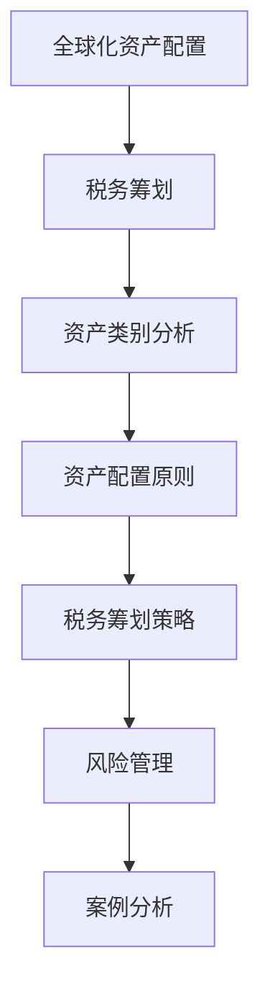

                 

# 文章标题

程序员如何进行全球化资产配置与税务筹划

> 关键词：全球化资产配置、税务筹划、程序员、金融产品、风险管理

摘要：
本文旨在为程序员提供全球化资产配置与税务筹划的实用指南。通过深入分析全球化资产配置的概念、背景、原则及策略，本文探讨了程序员在全球化资产配置中的特殊需求。同时，文章详细介绍了全球税务体系的基本原理、主要国家的税制特点及国际税收协定。在此基础上，本文提出了税务筹划的基本策略与工具，并结合程序员的具体案例，展示了如何通过合理配置金融产品和税务筹划，实现税收利益的最大化。

## 目录大纲

1. **全球化资产配置与税务筹划概述**
    1.1 资产配置的概念与意义
    1.2 全球资产配置的背景与趋势
    1.3 税务筹划的基本原理与策略

2. **全球化资产配置基础**
    2.1 全球市场概述
    2.2 资产类别与特性分析
    2.3 资产配置的原则与方法

3. **全球税务体系概览**
    3.1 国际税收基本原则
    3.2 主要国家的税制特点
    3.3 国际税收协定与避税港

4. **税务筹划策略与工具**
    4.1 税务筹划的基本策略
    4.2 税务筹划的工具与法规
    4.3 企业税务筹划案例分析

5. **程序员资产配置实践**
    5.1 程序员资产配置的特点
    5.2 程序员资产配置策略
    5.3 程序员税务筹划案例分析

6. **全球化资产配置与税务筹划中的风险管理**
    6.1 资产配置中的风险类型
    6.2 风险管理策略与工具
    6.3 案例分析：风险应对与化解

7. **程序员如何进行全球化资产配置与税务筹划**
    7.1 程序员进行资产配置与税务筹划的步骤
    7.2 实战：构建个人资产配置模型
    7.3 实战：进行税务筹划案例分析

8. **附录**
    8.1 资产配置与税务筹划相关资源
    8.2 学术研究资源与文献推荐
    8.3 实用参考书籍推荐

### Mermaid 流程图



### 核心算法原理讲解

#### 2.2 资产配置策略

资产配置策略是全球化资产配置的核心。其基本原理是通过不同资产类别的组合来平衡风险与收益。以下是一个简单的资产配置策略算法伪代码：

```plaintext
算法 Asset_Configuration(目标资产组合，风险偏好，市场数据)：
    初始化资产组合为空
    收集市场数据，包括各资产类别的预期收益率和波动率
    对各资产类别进行权重分配，使得总风险与目标风险偏好匹配
        for 每个资产类别 asset in 目标资产组合：
            计算资产在组合中的权重 weight = (预期收益率 - 平均预期收益率) / 波动率
            更新资产组合，添加 asset 和 weight
    返回资产组合
```

#### 3.1 税务筹划的基本策略

税务筹划的基本策略通常包括节税、税后收益最大化等。以下是一个节税的数学模型：

$$
\text{税负} = P \times (1 - \text{节税比例})
$$

其中，$P$ 为应纳税所得额，$\text{节税比例}$ 为通过合法手段降低的纳税比例。

#### 举例说明

假设一个程序员的应纳税所得额为 100,000 元，通过税务筹划，可以将节税比例提高到 20%。则：

$$
\text{税负} = 100,000 \times (1 - 0.20) = 80,000 \text{元}
$$

这意味着程序员可以通过合法手段减少 20,000 元的税负。

### 项目实战

#### 5.3 程序员税务筹划案例分析

以下是一个程序员如何通过配置金融产品进行税务筹划的实际案例：

**背景**：程序员小李年薪为 80,000 元，计划进行税务筹划以减少税负。

**目标**：通过合理配置金融产品，使税后收益最大化。

**方案**：

1. **购买教育储蓄保险**：每年支付保费 5,000 元，连续支付 5 年，累积金额为 25,000 元。根据保险合同，小李可以在第 6 年开始每年领取 10,000 元至 18 年。

2. **投资股票基金**：每年投资 20,000 元，连续投资 5 年，预期年收益率为 10%。

**计算过程**：

- **教育储蓄保险**：每年节省税款 = 5,000 元 \* 20% = 1,000 元，总计节省税款 5,000 元。
- **股票基金**：每年投资 20,000 元，5 年总投资为 100,000 元，预期 5 年收益为 100,000 元 \* 10% = 10,000 元。

**收益分析**：

- **税后收益**：教育储蓄保险 10,000 元（税前）- 1,000 元（税款）= 9,000 元
- **股票基金**：10,000 元（税前）- 2,000 元（税款，假设股票基金收益需要缴纳 20%的税款）= 8,000 元

**总税后收益**：9,000 元 + 8,000 元 = 17,000 元

通过这种税务筹划方案，小李可以节省约 20,000 元的税款，同时获得 17,000 元的税后收益。这个案例展示了如何通过配置金融产品进行税务筹划，实现税收利益最大化。

### 全球化资产配置与税务筹划概述

#### 1.1 资产配置的概念与意义

资产配置是指投资者根据自身的投资目标、风险偏好和市场状况，对资产进行合理的分配和组合，以达到预期的投资收益和风险控制。在全球化背景下，资产配置的意义尤为重要。首先，全球化带来了更多的投资机会，投资者可以通过跨国投资来分散风险，获取更高的回报。其次，不同国家和地区的税收政策、金融体系和文化背景各有差异，资产配置的合理性和科学性直接影响到投资回报的稳定性和可持续性。

对于程序员来说，资产配置不仅是为了实现财务自由，更是提升生活质量的重要手段。程序员通常拥有较高的收入和较强的学习能力，这使得他们在投资领域具有独特的优势。然而，程序员在资产配置中面临的挑战也是多方面的，包括对金融市场的认知不足、缺乏系统的投资策略、以及对风险的过度担忧等。因此，如何进行全球化资产配置与税务筹划，成为程序员关注的重点。

#### 1.2 全球资产配置的背景与趋势

全球资产配置的背景可以追溯到全球化进程的加速。随着全球化的推进，各国经济联系日益紧密，国际资本流动规模不断扩大。此外，科技的发展也为全球资产配置提供了更多的工具和渠道。例如，互联网和金融科技的兴起，使得投资者可以轻松地跨国购买股票、基金、房地产等资产，从而实现资产全球化配置。

在当前的经济环境下，全球资产配置呈现出以下几个趋势：

1. **多元化投资**：投资者越来越倾向于通过多元化投资来分散风险，避免单一市场的波动对投资组合造成过大的影响。多元化投资不仅包括资产类别之间的分散，还包括地域和行业的分散。

2. **资产类别的扩展**：除了传统的股票、债券和房地产等资产类别外，投资者还可以通过投资私募股权、风险投资、大宗商品、数字货币等来丰富投资组合。

3. **全球化投资机会的增加**：新兴市场的发展，如亚洲、非洲等地区的经济崛起，为投资者提供了新的投资机会。同时，国际税收政策的调整和全球化进程的加速，也为投资者在跨境投资中提供了更多的机会和灵活性。

4. **风险管理的重视**：随着市场波动性的增加，风险管理成为全球资产配置的重要组成部分。投资者不仅关注收益，更关注风险控制，以确保投资组合的长期稳定。

#### 1.3 税务筹划的基本原理与策略

税务筹划是指在遵守税法规定的前提下，通过合法手段减少税负，实现税收利益最大化。税务筹划的基本原理包括以下几个方面：

1. **合法性**：税务筹划必须基于合法手段，任何违反税法的行为都是不被允许的。投资者应充分了解相关税法规定，确保税务筹划的合法性。

2. **节税**：通过合法手段减少税负是税务筹划的核心目标。这可以通过多种方式实现，如选择合适的税制、利用税收优惠政策、优化税务结构等。

3. **收益最大化**：税务筹划不仅关注节税，还应考虑如何通过合理的税务规划，实现投资收益的最大化。这包括优化投资组合、选择适当的投资工具等。

4. **风险管理**：税务筹划中还需要考虑风险因素，确保税务筹划方案的风险可控。例如，投资者应关注政策变动、市场波动等可能影响税务筹划效果的因素。

常见的税务筹划策略包括：

1. **节税策略**：通过合法手段降低应纳税所得额，如税前扣除、税收优惠、税收递延等。

2. **税后收益最大化策略**：通过优化投资组合，提高税后收益。例如，选择税优投资工具、优化税务结构等。

3. **国际税务筹划**：利用国际税收协定、避税港等，实现跨境投资中的税收利益最大化。

4. **税务风险管理**：通过风险评估、风险控制等手段，确保税务筹划方案的风险可控。

### 全球化资产配置基础

#### 2.1 全球市场概述

全球市场包括股票市场、债券市场、房地产市场、商品市场等多个市场。这些市场的特点和运行机制各不相同，但它们在全球化背景下相互关联，共同构成了全球资产配置的基础。

**股票市场**：股票市场是全球最大的资本市场之一，主要由交易所市场、场外市场等构成。股票市场的特点包括高度的流动性和较高的风险。投资者可以通过购买股票来分享公司成长带来的收益。全球股票市场的发展趋势包括市场融合、监管加强、科技应用等。

**债券市场**：债券市场是资本市场的重要组成部分，包括国债、企业债、地方政府债等多种类型的债券。债券市场的特点包括较低的风险和稳定的收益。投资者可以通过购买债券来获取固定收益，债券市场的发展趋势包括多元化、电子化、监管强化等。

**房地产市场**：房地产市场是实体经济的支柱产业，包括住宅市场、商业市场、工业市场等。房地产市场的特点包括高价值和较高的交易成本。投资者可以通过购买房产来获取租金收益和资本增值。全球房地产市场的发展趋势包括城市化、国际化、金融化等。

**商品市场**：商品市场包括能源、金属、农产品等多个市场，是金融市场的重要组成部分。商品市场的特点包括价格波动大、供需关系复杂。投资者可以通过购买商品期货或现货来对冲风险或投机获利。全球商品市场的发展趋势包括全球化、电子化、市场监管加强等。

**全球市场相互关系**：全球市场的相互关系体现在多个方面。首先，全球经济环境的变化会影响到各个市场的表现。例如，经济增长放缓通常会导致股票市场和房地产市场表现不佳。其次，货币政策和贸易政策的变化会直接影响各个市场的流动性和投资机会。最后，新兴市场的崛起和发展也为全球市场带来了新的机遇和挑战。

#### 2.2 资产类别与特性分析

在进行全球化资产配置时，了解不同资产类别的特性和风险收益特征是非常重要的。以下是几种常见的资产类别及其特性分析：

**股票**：股票是公司所有权的一部分，投资者通过购买股票可以获得公司分红和股票价格增值。股票的特点包括：

- **高风险、高收益**：股票市场波动较大，价格受到公司业绩、市场情绪、宏观经济等因素的影响。然而，股票投资也提供了较高的潜在收益。
- **市场流动性**：股票市场具有较高的流动性，投资者可以随时买卖股票。
- **分散投资**：投资者可以通过购买不同行业的股票来分散风险。

**债券**：债券是一种固定收益证券，投资者购买债券后可以获得固定的利息收入和本金回报。债券的特点包括：

- **低风险、稳定收益**：债券通常具有固定的利率和到期日，风险相对较低，收益相对稳定。
- **市场流动性**：债券市场相对股票市场流动性较低，但大部分债券都有较高的流通性。
- **分散投资**：投资者可以通过购买不同期限、不同信用等级的债券来分散风险。

**房地产**：房地产投资包括购买住宅、商业房产和工业房产。房地产的特点包括：

- **高价值、高风险**：房地产具有较高的价值，但市场波动较大，价格可能受到经济环境、供需关系等因素的影响。
- **较低的市场流动性**：房地产交易成本高，交易周期较长，流动性较低。
- **多元化收益**：房地产投资可以通过出租获得租金收入，通过资本增值获得回报。

**商品**：商品包括能源、金属、农产品等，投资者可以通过购买期货或现货进行商品投资。商品的特点包括：

- **价格波动大**：商品价格受到供需关系、季节性因素、地缘政治事件等因素的影响，价格波动较大。
- **高风险、高回报**：商品投资具有较高的风险，但也提供了较高的潜在回报。
- **对冲工具**：商品投资可以作为企业对冲原材料成本波动的一种工具。

**其他资产类别**：除了上述主要资产类别外，投资者还可以考虑投资私募股权、风险投资、数字货币、大宗商品等。这些资产类别的特性包括：

- **私募股权**：高风险、高回报，投资于未上市公司的股权。
- **风险投资**：高风险、高回报，投资于初创企业和高成长企业。
- **数字货币**：价格波动极大，风险较高，但也提供了高回报的可能性。
- **大宗商品**：价格波动受供需关系影响，提供对冲工具。

#### 2.3 资产配置的原则与方法

资产配置的原则是为了确保投资组合的稳定性和收益性。以下是资产配置的主要原则和方法：

**多样化**：多样化是指将资金分散投资于不同的资产类别、行业、地区和投资工具，以分散风险。多样化的原则可以通过以下方法实现：

- **资产类别多样化**：投资于股票、债券、房地产、商品等多种资产类别。
- **行业多样化**：投资于不同行业的股票，以分散行业风险。
- **地区多样化**：投资于不同国家和地区的资产，以分散区域风险。
- **投资工具多样化**：使用股票、债券、基金、衍生品等多种投资工具。

**风险控制**：风险控制是指通过合理配置资产，确保投资组合的总风险在可接受范围内。以下是一些风险控制方法：

- **设定风险偏好**：根据投资者的风险承受能力，设定合适的风险偏好。
- **资产配置调整**：定期对投资组合进行调整，以应对市场变化和风险变化。
- **分散投资**：通过多样化投资来分散个别资产的风险。

**收益最大化**：收益最大化是指通过合理配置资产，实现投资组合的最大化收益。以下是一些收益最大化方法：

- **选择高收益资产**：选择潜在收益较高的资产进行投资，如高收益股票、高收益债券等。
- **优化资产配置**：根据市场状况和投资者风险偏好，不断调整资产配置，以实现收益最大化。
- **利用市场时机**：抓住市场机会，进行适时投资和调整，以获取更高的收益。

**长期投资**：长期投资是指持有投资组合较长时间，以实现资产增值和风险分散。以下是一些长期投资的方法：

- **定期投资**：通过定期投资，实现资金分批投入，降低买入成本。
- **长期持有**：持有优质资产，避免频繁交易，以实现长期增值。
- **长期规划**：制定长期投资规划，包括退休规划、子女教育规划等，以确保投资目标的实现。

**定期评估**：定期评估是指定期对投资组合进行评估和调整，以保持投资组合的合理性。以下是一些定期评估的方法：

- **市场趋势分析**：定期分析市场趋势，以判断资产配置是否需要调整。
- **风险收益评估**：定期评估投资组合的风险收益状况，确保投资组合的风险在可接受范围内。
- **投资绩效评估**：定期评估投资组合的绩效，以判断投资策略的有效性。

通过遵循以上原则和方法，程序员可以有效地进行全球化资产配置，实现风险与收益的平衡，从而实现财务目标。

### 全球税务体系概览

#### 3.1 国际税收基本原则

国际税收基本原则是协调各国税收关系、确保公平税收负担的基本规范。以下是国际税收的基本原则：

**税收管辖权原则**：税收管辖权是指国家对其居民和非居民征税的权利。国际税收基本原则强调，国家应根据居民和非居民的全球收入来源，行使税收管辖权。具体包括：

- **居民税收管辖权**：居民个人或企业在其所在国承担无限税收责任，无论其收入来源地。
- **非居民税收管辖权**：非居民个人或企业在其收入来源地国承担有限税收责任，仅对其来源于该国的收入征税。

**收入来源地原则**：收入来源地原则是指税收应按照收入产生的地点进行征收。以下几种收入通常按照收入来源地征税：

- **经营所得**：企业在其经营活动的所在地获得收入，如销售收入、服务收入等。
- **利息、股息、租金**：这些收入通常按照收入支付地的法律进行征税。
- **特许权使用费**：特许权使用费通常按照支付地或使用地的法律进行征税。

**常设机构原则**：常设机构是指非居民企业在居民国境内设立的固定经营场所，如分支机构、办事处等。常设机构原则规定，非居民企业通过常设机构在居民国境内获得的收入，应在该居民国缴纳税收。

**税收公平原则**：税收公平原则要求税收负担应公平合理，不应过分加重任何一方。具体体现在：

- **横向公平**：具有相同收入水平的纳税人应缴纳相同数额的税收。
- **纵向公平**：收入水平不同的纳税人应缴纳与其收入水平相匹配的税收。

**避免双重征税原则**：双重征税是指两个或两个以上国家就同一笔收入同时征税。为了避免双重征税，国际社会通过签订国际税收协定和采用免税法、扣除法等方式进行协调。

#### 3.2 主要国家的税制特点

不同国家的税制特点对全球化资产配置和税务筹划有着重要影响。以下是主要国家的税制特点：

**美国税制**：美国实行联邦税和州税两级税收制度。联邦税主要包括个人所得税、公司税、社会保险税等。州税主要包括销售税、个人所得税、财产税等。美国的税制特点包括：

- **个人所得税**：采用累进税率，税率从 10% 到 37% 不等。
- **公司税**：企业所得税率为 21%，此外，各州可能征收不同的企业所得税。
- **投资税**：资本利得和股息收入需缴纳个人所得税，部分州对股息收入征收额外税。

**欧洲国家税制**：欧洲各国税制存在一定差异，但普遍实行高税率。以下是一些主要欧洲国家的税制特点：

- **德国**：个人所得税采用累进税率，最高税率约为 45%。公司税率为 15%，此外，还有地方税。
- **法国**：个人所得税采用累进税率，最高税率约为 45%。公司税率为 33.33%，此外，还有社会贡献税。
- **英国**：个人所得税采用累进税率，最高税率约为 45%。公司税率为 19%，此外，还有社会保险税。

**亚洲国家税制**：亚洲各国税制特点各异，但普遍具有较高的个人所得税和公司税税率。以下是一些主要亚洲国家的税制特点：

- **日本**：个人所得税采用累进税率，最高税率约为 50%。公司税率为 20%，此外，还有地方税。
- **中国**：个人所得税采用累进税率，最高税率约为 45%。公司税率为 25%，此外，还有增值税、企业所得税等。
- **印度**：个人所得税采用累进税率，最高税率约为 45%。公司税率为 30%，此外，还有商品和服务税。

**国际税收协定**：国际税收协定是各国之间为了避免双重征税和防止逃税而签订的协议。以下是一些重要的国际税收协定：

- **《避免双重征税协定》**：国际社会广泛签订的协议，旨在协调各国税收关系，避免双重征税。
- **《经济合作与发展组织》（OECD）税务协定范本**：提供了一套统一的国际税收协定规范，被广泛引用和采用。
- **双边税收协定**：各国之间签订的具有法律效力的协议，具体规定各国的税收权益和责任。

#### 3.3 国际税收协定与避税港

国际税收协定和避税港是全球化资产配置和税务筹划中的重要工具。以下是对国际税收协定和避税港的概述：

**国际税收协定**：国际税收协定是各国政府为了协调税收关系、避免双重征税和防止逃税而签订的协议。国际税收协定的主要内容包括：

- **税收管辖权**：明确各国的税收管辖权，避免重复征税。
- **免税法**：规定某些收入免于征税，以减少纳税人的税负。
- **扣除法**：允许纳税人将某些税收抵扣计入应纳税所得额，减少纳税负担。
- **税收待遇**：规定跨国投资的税收待遇，如股息、利息、特许权使用费的税收处理。

国际税收协定有助于确保跨国投资的税收公平和稳定，为投资者提供法律保障。

**避税港**：避税港是指那些实行低税或无税政策的国家或地区，吸引跨国投资者设立公司或存放资产。避税港的特点包括：

- **低税率**：避税港通常提供较低的税率，甚至为零税率，以吸引跨国投资。
- **保密性强**：避税港通常对企业的财务信息保密，保护投资者的隐私。
- **宽松的法规**：避税港的法规相对宽松，企业运营灵活。

常见的避税港包括：

- **加勒比海地区**：如巴哈马、百慕大、开曼群岛等。
- **欧洲**：如瑞士、卢森堡、爱尔兰等。
- **亚洲**：如新加坡、香港、开曼群岛等。

通过合理利用国际税收协定和避税港，投资者可以优化税务结构，降低税负，实现税收利益最大化。

### 税务筹划策略与工具

#### 4.1 税务筹划的基本策略

税务筹划是指在遵守税法规定的前提下，通过合法手段减少税负，实现税收利益最大化。以下是税务筹划的基本策略：

**合法避税**：合法避税是指利用税法中的漏洞、特例或税收优惠政策，减少纳税额。常见的合法避税方法包括：

- **税前扣除**：企业可以在计算应纳税所得额时，扣除合理的费用和损失，从而降低纳税额。
- **税收优惠**：国家针对特定行业或群体提供税收优惠政策，如高新技术企业减免税、小微企业税收优惠等。
- **税收递延**：某些投资工具，如养老金账户、教育储蓄账户等，可以递延纳税，减少纳税负担。
- **资本化**：将某些费用资本化，通过分摊方式减少每年的税负。

**税后收益最大化**：税后收益最大化是指通过优化投资组合，提高税后收益。以下是一些实现税后收益最大化的策略：

- **选择税优投资工具**：如税优养老金账户、税收减免债券等，可以降低税负，提高投资收益。
- **税务结构优化**：通过优化税务结构，如选择合理的投资工具、优化税务规划等，提高税后收益。
- **股息和资本利得的税务处理**：合理安排股息和资本利得的收入时间，以最大化税后收益。

**风险管理**：税务筹划中需要考虑风险因素，确保税务筹划方案的风险可控。以下是一些风险管理策略：

- **风险评估**：对税务筹划方案进行风险评估，确保方案的有效性和可行性。
- **风险分散**：通过多样化投资，分散税务筹划中的风险。
- **风险控制**：制定风险控制措施，如制定应急预案、定期评估风险等。

**跨国税务筹划**：跨国税务筹划是指通过利用国际税收协定、税收优惠政策和避税港等，实现跨境投资的税收利益最大化。以下是一些跨国税务筹划的策略：

- **国际税收协定**：利用国际税收协定，减少跨国投资中的双重征税，降低税负。
- **税收优惠地区**：投资于提供税收优惠政策的地区，如自由贸易区、经济特区等。
- **避税港**：合理利用避税港，实现资产的保密性和税务优化。

通过以上策略，投资者可以有效地进行税务筹划，降低税负，提高投资收益，实现税收利益的最大化。

#### 4.2 税务筹划的工具与法规

税务筹划工具和法规是进行有效税务筹划的重要基础。以下是一些常见的税务筹划工具和法规：

**税务筹划工具**：

1. **税务筹划软件**：税务筹划软件可以帮助投资者进行税务计算、分析和管理。这些软件通常具有功能强大的税务计算器、税务报表生成器、投资组合分析工具等。

2. **财务顾问**：财务顾问可以提供专业的税务筹划建议，帮助投资者制定合理的税务筹划方案。财务顾问通常具有丰富的税务知识和实践经验，能够为投资者提供个性化的税务筹划服务。

3. **税务筹划方案**：税务筹划方案是针对投资者具体情况制定的税务筹划方案，包括资产配置、税务结构优化、风险管理等。投资者可以根据税务筹划方案，合理安排财务规划，实现税收利益的最大化。

**税务筹划法规**：

1. **税法**：税法是税务筹划的基础法规，包括个人所得税法、企业所得税法、税收征收管理法等。税法规定了纳税人的权利和义务，明确了税收征收的具体程序和标准。

2. **税收优惠政策**：税收优惠政策是政府为了鼓励投资和发展特定行业而提供的税收减免或优惠措施。常见的税收优惠政策包括高新技术企业减免税、小微企业税收优惠、区域税收优惠等。

3. **国际税收协定**：国际税收协定是各国之间为了协调税收关系、避免双重征税和防止逃税而签订的协议。国际税收协定规定了跨国投资的税收待遇，包括税收管辖权、收入来源地原则、税收扣除等。

4. **避税港法规**：避税港法规是指避税港国家或地区制定的税收法规，包括税制结构、税率、税收优惠等。避税港法规通常提供较低的税率、保密性强等优势，吸引跨国投资者设立公司或存放资产。

通过了解和运用税务筹划工具和法规，投资者可以更好地进行税务筹划，降低税负，提高投资收益。

#### 4.3 企业税务筹划案例分析

以下是一个企业税务筹划的实际案例，展示了如何通过合理的税务筹划实现税收利益的最大化：

**背景**：某科技公司（以下简称“公司”）是一家主要从事软件开发和信息技术服务的企业。公司年营业收入为 2 亿元，净利润为 5,000 万元。公司计划进行税务筹划，以减少税负，提高税后收益。

**目标**：通过合理的税务筹划，将公司税负降低至合理水平，同时确保公司财务状况和业务的稳定性。

**方案**：

1. **投资国债**：公司决定将一部分净利润投资于国债，以享受国债的税收优惠。国债的年收益率为 3%，且根据税法规定，国债利息收入免税。

2. **员工股权激励**：公司决定实施员工股权激励计划，将一部分净利润用于购买公司股票，分配给核心员工。根据税法规定，员工获得的股权激励收益可以递延纳税，从而减少公司当前税负。

3. **研发费用加计扣除**：公司计划加大研发投入，将研发费用计入成本，并享受研发费用加计扣除政策。根据税法规定，企业研发费用可以按照 175% 的比例进行加计扣除，从而减少应纳税所得额。

**计算过程**：

- **投资国债**：公司决定将 1,000 万元的净利润投资于国债。根据税法规定，国债利息收入免税。因此，公司可以节省 1,000 万元 \* 25% = 250 万元的税款。
- **员工股权激励**：公司决定将 1,000 万元的净利润用于购买公司股票，分配给核心员工。根据税法规定，员工获得的股权激励收益可以递延纳税，从而减少公司当前税负。假设员工在未来五年内陆续行权，每年可以节省 500 万元的税款。
- **研发费用加计扣除**：公司计划投入 2,000 万元的研发费用。根据税法规定，企业研发费用可以按照 175% 的比例进行加计扣除，即 2,000 万元 \* 175% = 3,500 万元。因此，公司可以节省 3,500 万元 \* 25% = 875 万元的税款。

**收益分析**：

- **节省税款**：通过投资国债、员工股权激励和研发费用加计扣除，公司总共可以节省 250 万元 + 500 万元 + 875 万元 = 1,625 万元的税款。
- **税后收益**：公司净利润为 5,000 万元，通过税务筹划后，税后收益为 5,000 万元 - 1,625 万元 = 3,375 万元。

通过这种税务筹划方案，公司可以节省约 1,625 万元的税款，同时实现税后收益的增加。这个案例展示了企业如何通过合理的税务筹划，优化税务结构，实现税收利益的最大化。

### 程序员资产配置实践

#### 5.1 程序员资产配置的特点

程序员在进行资产配置时，具有以下几个特点：

1. **高收入**：程序员通常具有较高的收入水平，这为资产配置提供了充足的资金基础。然而，高收入也意味着更高的税收负担，因此，税务筹划在程序员资产配置中尤为重要。

2. **短期资金需求**：程序员往往需要为未来规划，如购房、购车、子女教育、退休等。因此，他们需要将部分资金用于短期投资，以满足这些需求。

3. **风险承受能力较强**：程序员具有较高的教育背景和技术能力，这使得他们在面对市场波动和投资风险时，通常具有更强的心理承受能力。然而，这也可能导致程序员过度冒险，需要合理控制投资风险。

4. **时间管理能力**：程序员通常具有较高的时间管理能力，这使得他们能够有效地安排投资时间和精力。然而，由于工作繁忙，程序员可能没有足够的时间进行详细的财务分析和投资研究。

5. **技术优势**：程序员在技术领域拥有专业知识，这使得他们能够更好地理解和应用金融科技产品，如在线交易平台、自动化投资工具等。

#### 5.2 程序员资产配置策略

针对程序员的特殊需求，以下是一些资产配置策略：

1. **多元化投资**：通过将资金分散投资于不同资产类别，如股票、债券、房地产、商品等，可以分散风险，降低投资组合的整体波动性。

2. **短期与长期投资相结合**：将部分资金投资于短期高收益产品，如货币市场基金、债券等，以满足短期资金需求。同时，将另一部分资金投资于长期高收益产品，如股票、房地产等，以实现长期的资本增值。

3. **税务优化**：合理利用税务优惠政策，如税收递延账户、税务减免债券等，可以降低税负，提高税后收益。

4. **自动化投资**：利用自动化投资工具，如机器人顾问（Robo-Advisor），可以简化投资过程，降低投资成本，提高投资效率。

5. **风险控制**：根据个人的风险承受能力，合理配置资产，避免过度冒险。同时，定期对投资组合进行风险评估和调整，确保投资组合的风险在可接受范围内。

#### 5.3 程序员税务筹划案例分析

以下是一个程序员如何通过税务筹划实现税收利益最大化的实际案例：

**背景**：程序员张先生年薪为 100 万元，计划进行税务筹划以减少税负。

**目标**：通过合理配置金融产品和税务筹划，实现税收利益最大化。

**方案**：

1. **购买教育储蓄保险**：张先生每年支付保费 5 万元，连续支付 5 年，累积金额为 25 万元。根据保险合同，张先生可以在第 6 年开始每年领取 10 万元至 18 年。

2. **投资股票基金**：张先生每年投资 20 万元，连续投资 5 年，预期年收益率为 10%。

**计算过程**：

- **教育储蓄保险**：每年节省税款 = 5 万元 \* 20% = 1 万元，总计节省税款 5 万元。
- **股票基金**：每年投资 20 万元，5 年总投资为 100 万元，预期 5 年收益为 100 万元 \* 10% = 10 万元。

**收益分析**：

- **税后收益**：教育储蓄保险 10 万元（税前）- 1 万元（税款）= 9 万元
- **股票基金**：10 万元（税前）- 2 万元（税款，假设股票基金收益需要缴纳 20%的税款）= 8 万元

**总税后收益**：9 万元 + 8 万元 = 17 万元

通过这种税务筹划方案，张先生可以节省约 5 万元的税款，同时获得 17 万元的税后收益。这个案例展示了程序员如何通过配置金融产品和税务筹划，实现税收利益最大化。

### 全球化资产配置与税务筹划中的风险管理

#### 6.1 资产配置中的风险类型

在进行全球化资产配置和税务筹划时，投资者需要面对多种风险，这些风险可以分为市场风险、信用风险、流动性风险和操作风险等。

**市场风险**：市场风险是指由于市场波动导致的投资组合价值下降的风险。市场风险包括价格波动风险、利率风险、汇率风险等。例如，股票市场的波动可能导致股票投资价值的下降，而利率变化可能会影响债券投资的收益。

**信用风险**：信用风险是指由于债务方违约或信用评级下降导致的投资损失风险。在资产配置中，投资者可能会面临债券发行人违约、股票发行人信用评级下调等信用风险。

**流动性风险**：流动性风险是指资产不能以合理价格迅速出售的风险。在全球化资产配置中，不同市场和投资工具的流动性可能差异较大，某些市场可能存在流动性不足的问题，导致投资者在需要时难以迅速变现。

**操作风险**：操作风险是指由于管理不当、系统故障、操作失误等原因导致的投资损失风险。例如，不当的投资决策、交易系统的故障、数据泄露等都可能引发操作风险。

#### 6.2 风险管理策略与工具

为了有效管理全球化资产配置和税务筹划中的风险，投资者可以采用以下策略与工具：

**多元化投资**：通过将资金分散投资于不同的资产类别、行业和地区，可以降低单一市场波动对投资组合的影响，从而分散市场风险。

**资产配置调整**：根据市场状况和风险偏好，定期调整投资组合，以保持合理的风险水平。例如，在市场波动较大时，可以适当减少高风险资产的投资比例，增加低风险资产的配置。

**风险控制工具**：投资者可以利用各种金融工具来控制和管理风险，如期权、期货、对冲基金等。这些工具可以在特定情况下对冲市场风险、信用风险和流动性风险。

**风险评估与监控**：建立完善的风险评估和监控体系，定期对投资组合进行风险评估，确保风险在可接受范围内。通过监控市场变化和投资组合表现，及时调整投资策略。

**自动化风险管理**：利用自动化投资工具和算法，实现风险管理的自动化和智能化。例如，使用风险管理软件对投资组合进行实时监控和调整，提高风险管理的效率。

**法律法规遵守**：遵守相关法律法规，确保投资行为合法合规，减少因违规操作带来的法律风险。

#### 6.3 案例分析：风险应对与化解

以下是一个投资者在全球化资产配置过程中遇到的风险应对与化解案例：

**案例背景**：投资者李先生计划进行全球化资产配置，投资组合包括美国股票、欧洲债券和中国房地产。李先生关注市场风险、信用风险和流动性风险。

**风险类型**：

- **市场风险**：由于全球经济环境的变化，李先生担心股票市场波动可能导致投资组合价值下降。
- **信用风险**：李先生担心债券发行人信用评级下降，可能导致债券投资损失。
- **流动性风险**：李先生担心在某些市场出现流动性不足，导致难以迅速变现。

**风险应对与化解**：

1. **市场风险应对**：
   - **分散投资**：李先生将投资分散到不同国家和地区，以降低单一市场波动的影响。
   - **定期调整**：根据市场状况，定期调整投资组合，减少高风险资产的比例。
   - **使用风险管理工具**：购买股票期权作为对冲工具，降低市场波动带来的损失。

2. **信用风险应对**：
   - **选择高信用评级债券**：选择信用评级较高的债券，以降低信用风险。
   - **分散债券投资**：投资于不同发行人的债券，分散信用风险。

3. **流动性风险应对**：
   - **投资高流动性资产**：投资于流动性较高的资产，如货币市场基金、短期债券等，确保在需要时能够迅速变现。
   - **建立应急资金**：设立应急资金储备，以应对可能出现的流动性不足。

通过上述风险应对措施，李先生有效地降低了全球化资产配置中的市场风险、信用风险和流动性风险，确保了投资组合的稳定性和可持续性。

### 程序员如何进行全球化资产配置与税务筹划

#### 7.1 程序员进行资产配置与税务筹划的步骤

程序员在进行全球化资产配置与税务筹划时，可以遵循以下步骤：

1. **确定投资目标和风险偏好**：
   - 程序员需要明确自己的投资目标，如短期收益、长期增值、财富传承等。
   - 根据个人的风险承受能力，确定合适的风险偏好，避免过度冒险或过于保守。

2. **收集市场信息和数据**：
   - 收集全球市场的基本面数据，如经济增长、通货膨胀率、利率水平等。
   - 研究不同资产类别的历史表现和预期收益，为资产配置提供依据。

3. **进行资产配置**：
   - 根据投资目标和风险偏好，合理配置不同资产类别的投资比例。
   - 注意多元化投资，以分散风险，避免过度集中在某一类资产上。

4. **税务筹划**：
   - 了解全球税务体系和各国税制特点，为税务筹划提供基础。
   - 利用税务优惠政策、税收递延工具等，降低税负，提高税后收益。

5. **定期评估和调整**：
   - 定期评估投资组合的表现和风险，确保投资策略与目标保持一致。
   - 根据市场变化和自身需求，及时调整资产配置和税务筹划方案。

#### 7.2 实战：构建个人资产配置模型

以下是一个简单的个人资产配置模型，供程序员参考：

1. **确定投资目标和风险偏好**：
   - 假设程序员的投资目标是长期增值，风险偏好为中等。

2. **收集市场数据和预期收益**：
   - 根据历史数据和市场预测，假设股票的预期年收益率为 8%，债券为 4%，房地产为 6%，现金为 2%。

3. **确定资产配置比例**：
   - 根据投资目标和预期收益，确定股票、债券、房地产和现金的配置比例。例如，股票占 50%，债券占 30%，房地产占 20%，现金占 10%。

4. **构建资产配置模型**：
   - 使用资产配置策略算法（如优化算法）确定最优资产配置比例，确保投资组合的收益和风险达到最优平衡。

5. **实施资产配置**：
   - 根据资产配置模型，将资金分配到不同资产类别，构建投资组合。

6. **定期评估和调整**：
   - 定期评估投资组合的表现和风险，根据市场变化和个人需求，及时调整资产配置比例。

以下是一个简化的资产配置模型算法伪代码：

```plaintext
算法 Personal_Aset_Configuration(投资目标，风险偏好，市场数据)：
    初始化资产配置模型为空
    根据市场数据计算各资产类别的预期收益率
    根据投资目标和风险偏好，确定各资产类别的权重比例
    更新资产配置模型，添加各资产类别和权重
    返回资产配置模型
```

#### 7.3 实战：进行税务筹划案例分析

以下是一个程序员如何进行税务筹划的实际案例：

**案例背景**：程序员王先生年薪为 100 万元，计划进行税务筹划以减少税负。

**目标**：通过合理配置金融产品和税务筹划，实现税收利益最大化。

**方案**：

1. **购买教育储蓄保险**：王先生每年支付保费 5 万元，连续支付 5 年，累积金额为 25 万元。根据保险合同，王先生可以在第 6 年开始每年领取 10 万元至 18 年。

2. **投资股票基金**：王先生每年投资 20 万元，连续投资 5 年，预期年收益率为 10%。

**计算过程**：

- **教育储蓄保险**：每年节省税款 = 5 万元 \* 20% = 1 万元，总计节省税款 5 万元。
- **股票基金**：每年投资 20 万元，5 年总投资为 100 万元，预期 5 年收益为 100 万元 \* 10% = 10 万元。

**收益分析**：

- **税后收益**：教育储蓄保险 10 万元（税前）- 1 万元（税款）= 9 万元
- **股票基金**：10 万元（税前）- 2 万元（税款，假设股票基金收益需要缴纳 20%的税款）= 8 万元

**总税后收益**：9 万元 + 8 万元 = 17 万元

通过这种税务筹划方案，王先生可以节省约 5 万元的税款，同时获得 17 万元的税后收益。这个案例展示了程序员如何通过配置金融产品和税务筹划，实现税收利益最大化。

### 附录

#### 附录A: 资产配置与税务筹划相关资源

**在线工具与平台推荐**：

1. **Morningstar**：提供全面的金融市场数据和投资分析工具。
2. **Yahoo Finance**：提供实时的股票、债券、基金等市场信息。
3. **Robinhood**：提供便捷的在线交易平台和自动化投资工具。

**学术研究资源与文献推荐**：

1. **《国际税收导论》**：李俊岭 著，系统介绍了国际税收的基本原理和实践。
2. **《全球化与金融风险管理》**：李明 著，探讨了全球化背景下的金融风险和资产配置策略。
3. **《现代金融投资学》**：斯蒂芬·罗斯 著，全面介绍了金融投资的理论和实践。

**实用参考书籍推荐**：

1. **《财务自由之路》**：刘彦斌 著，提供了实现财务自由的实用方法和策略。
2. **《股票投资学》**：威廉·奥尼尔 著，详细介绍了股票投资的基本原理和技巧。
3. **《税务筹划与风险管理》**：刘俊海 著，系统介绍了税务筹划的理论和实践。

