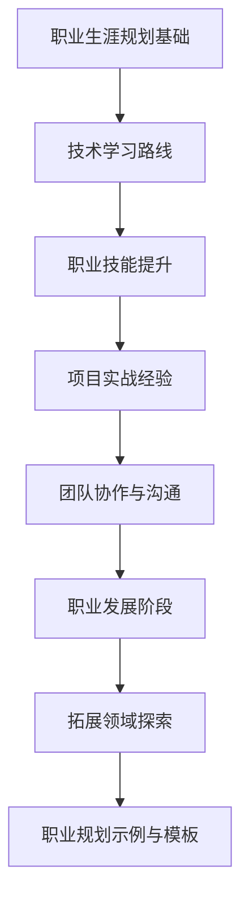

                 

### 《程序员的职业生涯规划：30年路线图》

> 关键词：程序员、职业生涯规划、技术学习、职业技能、项目实战、团队协作、职业进阶、跨领域技能、创业、持续学习

> 摘要：本文旨在为程序员提供一份详细的职业生涯规划指南，涵盖入门阶段、成长阶段和职业发展阶段，帮助程序员在不同阶段明确目标、提升技能、拓展领域，实现职业发展的最大化。通过本文，读者可以了解到职业生涯规划的重要性、技术学习路线、职业技能提升、项目实战经验、团队协作与沟通技巧、职业进阶策略、跨领域技能拓展、创业与职业发展关系，以及持续学习的必要性。

### 《程序员的职业生涯规划：30年路线图》目录大纲

## 第一部分：入门阶段

### 第1章：职业生涯规划基础

#### 1.1.1 职业生涯规划的必要性

#### 1.1.2 程序员的角色与职责

#### 1.1.3 职业生涯规划的重要性

## 第2章：技术学习路线

#### 2.1.1 基础技术学习

#### 2.1.2 技术进阶

#### 2.1.3 技术选型与趋势

## 第二部分：成长阶段

### 第3章：职业技能提升

#### 3.1.1 编码能力提升

#### 3.1.2 代码质量与性能优化

#### 3.1.3 软件工程方法论

### 第4章：项目实战经验

#### 4.1.1 项目需求分析

#### 4.1.2 项目设计思路

#### 4.1.3 项目开发流程

### 第5章：团队协作与沟通

#### 5.1.1 团队合作模式

#### 5.1.2 沟通技巧与艺术

#### 5.1.3 团队管理技巧

## 第三部分：职业发展阶段

### 第6章：职业进阶

#### 6.1.1 晋升途径与策略

#### 6.1.2 职业规划案例分析

#### 6.1.3 职业瓶颈与突破

### 第7章：拓展领域探索

#### 7.1.1 跨领域技能拓展

#### 7.1.2 创业与职业发展

#### 7.1.3 持续学习与职业成长

### 附录

#### 附录A：参考资料与推荐书籍

#### 附录B：职业生涯规划工具与方法

#### 附录C：面试技巧与注意事项

#### 附录D：职业规划示例与模板

### Mermaid 流�程图

## 第1章：职业生涯规划基础

### 1.1.1 职业生涯规划的必要性

#### 什么是职业生涯规划？

职业生涯规划是指个人根据自身兴趣、能力、市场需求等因素，为自己在职业发展过程中设定的目标、路径和策略。它涉及到职业方向的选择、技能的积累、职业发展的策略等多个方面。

#### 职业生涯规划的重要性

1. **明确职业发展方向，避免迷茫：** 没有规划的职业生涯容易导致个人在职业发展过程中迷失方向，无法实现职业目标。
2. **提升自我认知，发挥个人优势：** 职业生涯规划有助于个人更好地了解自己的兴趣、优势和劣势，从而发挥个人优势，提升自我价值。
3. **提高竞争力，实现职业价值最大化：** 通过职业生涯规划，程序员可以系统地提升自己的技能和经验，增强职业竞争力，实现职业价值最大化。

### 1.1.2 程序员的角色与职责

#### 程序员的定义

程序员是从事计算机编程工作的人员，负责设计、开发、测试和维护软件系统。程序员的工作内容多样，包括但不限于以下方面：

- **编码实现：** 根据设计文档和技术规范，使用编程语言实现软件功能。
- **需求分析：** 与产品经理、设计师等沟通，理解需求，进行需求分析。
- **系统测试：** 编写测试用例，执行测试，确保软件质量。
- **技术支持：** 解决软件使用过程中出现的问题，提供技术支持。

#### 程序员的职责

1. **负责软件的需求分析、设计、开发、测试和部署：** 程序员需要根据需求文档和技术规范，完成软件的编码实现，并进行系统测试，确保软件质量。
2. **解决软件系统中出现的问题和故障：** 在软件开发和维护过程中，程序员需要及时发现并解决系统中的问题，保证软件稳定运行。
3. **与团队成员协作，完成项目任务：** 程序员需要与其他团队成员（如产品经理、设计师、测试人员等）紧密协作，确保项目按计划完成。

### 1.1.3 职业生涯规划的重要性

#### 对个人职业发展的影响

1. **提高职业素养，提升自我价值：** 通过职业生涯规划，程序员可以系统地提升自己的专业技能和职业素养，提高自我价值。
2. **获得更多的职业发展机会：** 明确的职业规划有助于程序员在职业发展过程中抓住更多的机会，实现职业晋升。
3. **实现职业目标，满足个人成就感：** 职业生涯规划可以帮助程序员明确职业目标，并通过不断努力实现这些目标，获得成就感和满足感。

#### 对企业的影响

1. **提升企业的技术实力和竞争力：** 职业生涯规划有助于企业培养和留住优秀的程序员，提升企业的技术实力和竞争力。
2. **促进企业内部人才流动和优化：** 职业生涯规划可以推动企业内部人才的合理流动和优化，提高团队整体效率。
3. **增强企业文化建设，提高团队凝聚力：** 通过职业生涯规划，企业可以培养员工的归属感和责任感，增强企业文化建设，提高团队凝聚力。

## 第2章：技术学习路线

### 2.1.1 基础技术学习

#### 数据结构与算法

- **数据结构：** 数据结构是程序设计中不可或缺的一部分。常见的线性数据结构包括数组、链表、栈和队列，非线性数据结构包括树和图。理解这些数据结构及其应用，可以帮助程序员更好地进行数据处理和优化。
- **算法：** 算法是实现特定任务的一系列步骤。常见的算法有排序算法、查找算法和图算法。掌握这些算法可以提升程序员的逻辑思维能力和编程能力。

#### 编程语言

- **选择一种主流编程语言：** Java、Python、C++等都是主流编程语言。选择一种适合自己的编程语言进行深入学习，是基础技术学习的重要一步。
- **编程基础：** 变量、运算符、控制结构（如循环和条件语句）和函数等是编程的基础。掌握这些基础，可以帮助程序员编写出结构清晰、易于维护的代码。

#### 操作系统

- **了解操作系统基本概念：** 进程、线程、内存管理和文件系统等是操作系统的核心概念。了解这些概念有助于程序员更好地理解计算机的工作原理。
- **学习一种操作系统：** Linux和Windows都是常用的操作系统。学习一种操作系统可以帮助程序员掌握系统配置、故障排除和性能优化等技能。

### 2.1.2 技术进阶

#### 数据库

- **数据库基本概念：** 关系型数据库（如MySQL、Oracle）和非关系型数据库（如MongoDB、Redis）是数据存储和管理的重要工具。了解数据库的基本概念和原理，可以帮助程序员更好地进行数据处理和优化。
- **SQL语言：** SQL（结构化查询语言）是数据库管理的基础。掌握SQL语言，可以方便地进行数据库的查询、更新和管理。

#### 前端技术

- **前端技术：** HTML、CSS和JavaScript是前端开发的基础。学习这些技术，可以开发出功能丰富、用户体验良好的Web应用。
- **前端框架：** React、Vue和Angular等前端框架可以帮助程序员提高开发效率和代码质量。掌握这些框架，可以更好地进行前端开发。

#### 后端技术

- **后端技术：** Java Spring、Python Django等后端框架是后端开发的重要工具。学习这些框架，可以更好地进行服务器端开发和Web应用开发。
- **微服务架构：** 微服务架构是一种新兴的后端开发模式。通过将应用程序分解为多个独立的服务，可以提高系统的可扩展性和可维护性。

### 2.1.3 技术选型与趋势

#### 技术选型原则

1. **需求导向：** 根据项目需求选择合适的技术。
2. **性能考虑：** 选择性能稳定、高效的技术。
3. **团队熟悉度：** 选择团队成员熟悉和擅长使用的技术。

#### 技术趋势

1. **云计算和大数据：** 云计算和大数据技术是企业数字化转型的重要方向。掌握这些技术，可以提升程序员的竞争力。
2. **AI与机器学习：** AI和机器学习技术在各领域的应用日益广泛。学习这些技术，可以拓宽程序员的职业领域。
3. **前端框架与工具：** 前端框架和工具不断更新，提高开发效率和体验。掌握这些工具，可以提升前端开发能力。

## 第3章：职业技能提升

### 3.1.1 编码能力提升

#### 编码能力的重要性

- **核心竞争力：** 编码能力是程序员的核心竞争力。提高编码能力可以提高开发效率、降低出错率。
- **职业发展：** 强大的编码能力可以帮助程序员在职业生涯中脱颖而出，获得更多的职业发展机会。

#### 提升编码能力的途径

1. **深入理解编程语言特性：** 深入学习编程语言，掌握其语法、特性、库和框架。
2. **学习设计模式和编程范式：** 设计模式和编程范式是提高代码质量的重要手段。通过学习这些知识，可以编写出结构清晰、易于维护的代码。
3. **代码审查和代码重构：** 代码审查和代码重构是提高编码能力的重要手段。通过这些过程，可以不断优化代码质量。
4. **参与开源项目：** 参与开源项目可以提升实战经验，拓宽技术视野，提高编码能力。

### 3.1.2 代码质量与性能优化

#### 代码质量

- **代码质量是软件项目成功的关键。** 高质量的代码可以降低维护成本、提高用户体验。
- **代码质量标准：** 代码质量包括可读性、可维护性、可扩展性和性能等方面。

#### 代码质量优化方法

1. **编写规范化的代码：** 遵循编码规范，使用统一的命名规则和格式，提高代码可读性。
2. **进行单元测试和集成测试：** 单元测试和集成测试可以确保代码的正确性和稳定性。
3. **代码审查和代码静态分析：** 代码审查和代码静态分析可以发现代码中的潜在问题，提高代码质量。
4. **优化代码结构，提高可读性和可维护性：** 优化代码结构，减少冗余代码，提高代码可维护性。

### 3.1.3 软件工程方法论

#### 软件工程方法论

- **软件工程方法论是指导软件开发过程的理论和方法。** 常见的方法论有瀑布模型、敏捷开发、DevOps等。
- **软件工程方法论的目的是提高软件开发效率、降低成本、确保质量。**

#### 软件工程方法论的应用

1. **按照方法论制定项目计划和任务分配：** 根据方法论的要求，制定项目计划和任务分配，确保项目按计划进行。
2. **迭代开发，快速响应需求变化：** 迭代开发可以快速响应需求变化，提高软件质量。
3. **持续集成和持续交付：** 持续集成和持续交付可以提高开发效率和质量，确保软件系统的稳定性。

## 第4章：项目实战经验

### 4.1.1 项目需求分析

#### 项目需求分析

- **项目需求分析是项目成功的基石。** 需求分析包括功能需求、性能需求、安全需求等。
- **需求分析的方法：** 用户访谈、需求调研、用例分析、需求文档编写和需求评审。

#### 需求分析的方法

1. **用户访谈和需求调研：** 通过与用户进行面对面交流，了解用户的需求和期望。
2. **用例分析和需求文档编写：** 根据用户需求，分析系统功能，编写详细的需求文档。
3. **需求评审和确认：** 对需求文档进行评审，确保需求准确、完整，并与用户进行确认。

### 4.1.2 项目设计思路

#### 项目设计思路

- **项目设计思路是项目实施的重要指导。** 包括系统架构设计、数据库设计、模块划分等。
- **设计方法：** 面向对象设计、设计模式的应用（如MVC、工厂模式等）、安全性和性能优化设计。

#### 项目设计方法

1. **采用面向对象设计方法：** 将系统分解为多个对象，明确对象之间的交互关系。
2. **设计模式的应用：** 使用设计模式（如MVC、工厂模式等）解决常见的设计问题。
3. **安全性和性能优化设计：** 在设计过程中考虑系统的安全性和性能优化，确保系统的稳定性和高效性。

### 4.1.3 项目开发流程

#### 项目开发流程

- **项目开发流程是确保项目按时、按质完成的保障。** 包括需求分析、设计、编码、测试、部署等阶段。
- **开发流程管理：** 制定项目计划和进度跟踪、实施版本控制和代码管理、进行测试和问题跟踪。

#### 项目开发流程管理

1. **制定项目计划和进度跟踪：** 根据项目需求和资源，制定详细的项目计划和进度跟踪表。
2. **实施版本控制和代码管理：** 使用版本控制工具（如Git）进行代码管理，确保代码的版本可追溯和可管理。
3. **进行测试和问题跟踪：** 进行单元测试、集成测试和系统测试，确保软件质量，并对测试中发现的问题进行跟踪和解决。

## 第5章：团队协作与沟通

### 5.1.1 团队合作模式

#### 团队合作模式

- **团队合作模式是提高团队效率和协作效果的重要手段。** 包括瀑布模型、敏捷开发、Scrum等。
- **团队合作模式的应用：** 按照团队角色分工，明确职责和任务；实施迭代开发和频繁沟通；采用工具和平台（如Git、Jira等）进行协作管理。

#### 团队合作模式的应用

1. **按照团队角色分工，明确职责和任务：** 根据项目需求和团队规模，明确各个团队成员的职责和任务，确保项目顺利推进。
2. **实施迭代开发和频繁沟通：** 迭代开发可以快速响应需求变化，提高软件质量；频繁沟通可以确保团队成员之间的信息畅通，提高协作效果。
3. **采用工具和平台进行协作管理：** 使用版本控制工具（如Git）进行代码管理，使用项目管理工具（如Jira）进行任务跟踪和进度管理。

### 5.1.2 沟通技巧与艺术

#### 沟通技巧与艺术

- **沟通技巧是团队合作中不可或缺的一部分。** 包括倾听、表达、提问、反馈等。
- **沟通技巧的应用：** 建立有效的沟通渠道，确保信息畅通；采用非语言沟通技巧，增强沟通效果；处理冲突和解决误解。

#### 沟通技巧的应用

1. **建立有效的沟通渠道，确保信息畅通：** 选择合适的沟通工具（如邮件、IM、电话等），确保信息及时传达。
2. **采用非语言沟通技巧，增强沟通效果：** 非语言沟通（如肢体语言、面部表情等）可以增强沟通效果，提高团队协作效率。
3. **处理冲突和解决误解：** 学会处理团队内部的冲突和误解，保持团队的和谐与稳定。

### 5.1.3 团队管理技巧

#### 团队管理技巧

- **团队管理技巧是团队领导者的必备能力。** 包括激励、引导、决策、协调等。
- **团队管理技巧的应用：** 了解团队成员需求和期望，提高团队凝聚力；制定明确的团队目标和计划；建立良好的团队氛围，促进团队协作。

#### 团队管理技巧的应用

1. **了解团队成员需求和期望，提高团队凝聚力：** 通过沟通和观察，了解团队成员的需求和期望，提供相应的支持和激励。
2. **制定明确的团队目标和计划：** 根据项目需求和团队资源，制定明确的团队目标和计划，确保团队目标的实现。
3. **建立良好的团队氛围，促进团队协作：** 营造积极、开放、和谐的团队氛围，鼓励团队成员之间的沟通与协作。

## 第6章：职业进阶

### 6.1.1 晋升途径与策略

#### 晋升途径与策略

- **晋升途径是程序员实现职业发展的重要途径。** 包括技术晋升、管理晋升等。
- **晋升策略：** 提升个人技术能力，成为技术骨干；参与项目管理，积累管理经验；建立个人品牌，提升职场影响力。

#### 晋升策略

1. **提升个人技术能力，成为技术骨干：** 深入研究技术领域，成为专家；解决复杂问题，展示技术实力。
2. **参与项目管理，积累管理经验：** 参与项目规划、执行、监控和收尾，提升项目管理能力。
3. **建立个人品牌，提升职场影响力：** 通过技术分享、发表论文、参与社区活动等方式，提高个人在职场中的知名度和影响力。

### 6.1.2 职业规划案例分析

#### 职业规划案例分析

- **职业规划案例分析是借鉴他人经验，制定适合自己的职业规划。**
- **案例分析内容：** 成功案例分享（分析成功人士的职业规划经验和启示）；失败案例反思（分析失败原因，避免类似问题）。

#### 案例分析内容

1. **成功案例分享：** 分析成功人士的职业规划经验和启示，了解他们的成长路径和关键节点。
2. **失败案例反思：** 分析失败原因，总结经验教训，避免在职业发展中犯同样的错误。

### 6.1.3 职业瓶颈与突破

#### 职业瓶颈与突破

- **职业瓶颈是程序员职业发展中的障碍。** 包括技能瓶颈、职位瓶颈、职业发展空间有限等。
- **突破职业瓶颈的方法：** 学习新技能，拓宽职业领域；深入研究技术领域，成为专家；转向管理岗位，提升领导能力。

#### 突破职业瓶颈的方法

1. **学习新技能，拓宽职业领域：** 根据市场需求和个人兴趣，学习新技能，提升职业竞争力。
2. **深入研究技术领域，成为专家：** 深入研究技术领域，成为行业专家，提升个人价值。
3. **转向管理岗位，提升领导能力：** 转向管理岗位，提升领导能力和团队管理能力，实现职业晋升。

## 第7章：拓展领域探索

### 7.1.1 跨领域技能拓展

#### 跨领域技能拓展

- **跨领域技能拓展是拓宽职业发展空间的途径。**
- **跨领域技能拓展内容：** 学习金融、市场营销等跨领域知识；掌握项目管理、产品设计等跨领域技能。

#### 跨领域技能拓展内容

1. **学习金融、市场营销等跨领域知识：** 了解企业运营、财务管理、市场营销等知识，提升综合素养。
2. **掌握项目管理、产品设计等跨领域技能：** 学习项目管理知识，提高项目管理和协调能力；学习产品设计，提升用户体验和产品竞争力。

### 7.1.2 创业与职业发展

#### 创业与职业发展

- **创业是程序员实现职业发展的另一种途径。**
- **创业与职业发展的关系：** 创业可以提升个人价值，实现财富自由；创业经验可以丰富职业履历，提高竞争力。

#### 创业与职业发展的关系

1. **创业可以提升个人价值，实现财富自由：** 创业可以发挥个人专长，实现个人价值最大化，同时带来财富自由。
2. **创业经验可以丰富职业履历，提高竞争力：** 创业经验可以提升程序员的综合素质和职业竞争力，为职业发展打下坚实基础。

### 7.1.3 持续学习与职业成长

#### 持续学习与职业成长

- **持续学习是程序员保持竞争力的关键。**
- **持续学习的方法：** 学习新技术，保持技术前瞻性；参加培训课程，提升专业素养；阅读专业书籍，扩展知识面。

#### 持续学习的方法

1. **学习新技术，保持技术前瞻性：** 关注技术发展趋势，及时掌握新技术，保持技术领先优势。
2. **参加培训课程，提升专业素养：** 参加专业培训课程，系统学习新技术和知识，提升专业素养。
3. **阅读专业书籍，扩展知识面：** 阅读专业书籍，深入了解技术原理和应用，扩展知识面，提升综合素质。

### 附录

#### 附录A：参考资料与推荐书籍

- **提供程序员职业生涯规划的参考资料和推荐书籍。**

#### 附录B：职业生涯规划工具与方法

- **介绍职业生涯规划的工具和方法，帮助读者制定适合自己的职业规划。**

#### 附录C：面试技巧与注意事项

- **分享面试技巧和注意事项，提高面试成功率。**

#### 附录D：职业规划示例与模板

- **提供职业规划示例和模板，帮助读者制定职业规划。**

