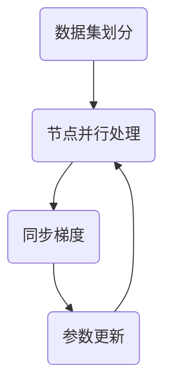
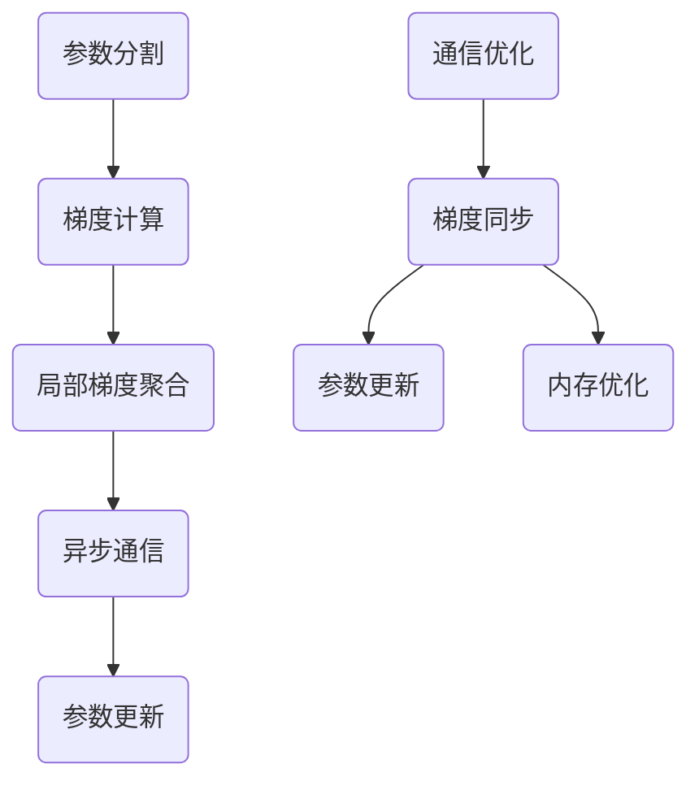

                 

### 引言

#### 分布式优化背景与必要性

在深度学习领域，随着模型的复杂性和数据量的激增，单机训练变得越来越困难，甚至不可行。为了应对这种挑战，分布式优化技术应运而生。分布式优化是将模型和数据分布在多个计算节点上，通过并行计算来加速训练过程。这种技术不仅能有效提升训练速度，还能应对大规模数据的处理需求。

分布式优化的重要性体现在以下几个方面：

1. **训练速度提升**：通过分布式训练，可以显著减少单个训练步骤所需的时间，从而加速模型训练。

2. **资源利用率提高**：分布式训练可以充分利用集群中各个节点的计算资源，提高资源利用率。

3. **更大规模模型训练**：分布式训练使训练更大规模、更复杂的模型成为可能，这对于探索深度学习的前沿领域具有重要意义。

4. **适应性强**：分布式训练技术可以适应不同规模的计算资源，从小型集群到大型数据中心，均可灵活应用。

#### 分布式优化在AI训练中的应用

分布式优化在AI训练中的应用广泛，尤其是在大规模机器学习和深度学习项目中。以下是一些典型应用场景：

1. **大型模型训练**：例如，在自然语言处理（NLP）和计算机视觉（CV）领域，经常需要训练大规模的模型，如GPT-3和Bert。分布式训练使得这些模型可以在较短的时间内完成训练。

2. **海量数据处理**：在金融、医疗、电子商务等领域，存在大量的数据需要处理。分布式训练可以帮助快速处理这些数据，从而提取有价值的特征。

3. **实时预测**：分布式训练可以使得实时预测系统更加高效，如股票交易系统、推荐系统等，这些系统需要快速处理实时数据。

4. **深度强化学习**：在深度强化学习（DRL）领域，分布式训练可以提高训练效率，加快算法收敛速度。

分布式优化技术通过提升训练速度、资源利用率和模型规模，为AI研究提供了强大的工具，推动了深度学习和其他人工智能领域的发展。

#### 分布式优化的发展历程

分布式优化技术的发展历程可以追溯到20世纪90年代，当时并行计算技术开始应用于机器学习领域。随着计算机硬件的进步和互联网的普及，分布式优化技术逐渐成为机器学习研究的重要方向。以下是一些关键的发展节点：

1. **数据并行**：最早期的分布式优化技术主要是数据并行（Data Parallelism），通过将数据划分到不同的节点上进行并行处理，从而加速训练过程。

2. **模型并行**：随着模型规模的增大，模型并行（Model Parallelism）技术应运而生。这种技术通过将模型的不同部分分配到不同的节点上进行并行处理，适用于模型中存在大规模参数的情况。

3. **参数服务器**：参数服务器（Parameter Server）架构是分布式优化技术的一个重要里程碑。参数服务器将模型的参数存储在中央服务器中，各个计算节点通过拉取和推送参数来进行更新。

4. **异步通信**：异步通信技术使得多个计算节点可以独立更新参数，避免了同步通信带来的通信瓶颈，从而提高了训练效率。

5. **ZeRO（Zero Redundancy Optimization）**：ZeRO算法通过参数分割和通信优化，显著减少了分布式训练中的通信成本，成为当前分布式优化领域的研究热点。

#### 当前研究热点与未来趋势

当前分布式优化研究的热点主要集中在以下几个方面：

1. **通信优化**：如何在分布式训练中优化通信成本是一个重要课题。ZeRO、Distributed Data Parallel (DDP) 等算法在这方面取得了显著进展。

2. **混合并行策略**：如何将数据并行、模型并行和其他并行策略（如流水线并行）结合使用，以获得最佳的训练性能。

3. **动态调度**：如何动态调整计算资源，以适应不同阶段训练的需求，提高资源利用率。

4. **异构计算**：如何利用不同类型的计算资源（如CPU、GPU、TPU）进行分布式训练，以获得更好的性能和效率。

未来，分布式优化技术将继续朝以下几个方向演进：

1. **更高效的通信协议**：设计更高效的通信协议，以进一步减少分布式训练中的通信开销。

2. **自适应资源分配**：实现自适应资源分配策略，以动态适应不同规模和类型的训练任务。

3. **算法与硬件协同**：优化算法与硬件的协同，以充分利用硬件资源，提高训练效率。

4. **自动化工具与平台**：开发自动化工具和平台，简化分布式训练的部署和管理，降低使用门槛。

总之，分布式优化技术的研究与应用将继续推动深度学习和人工智能领域的发展，为解决大规模训练问题提供更加有效和高效的解决方案。

### 分布式优化基础

分布式优化是深度学习领域的一个重要方向，其核心思想是将训练任务分布到多个计算节点上，以实现高效训练。要理解分布式优化，首先需要了解其基本概念，包括数据并行、模型并行和混合并行等。

#### 数据并行

数据并行（Data Parallelism）是最常见的分布式优化策略之一。其基本思想是将训练数据集划分为多个子集，每个子集被分配到一个计算节点上进行独立训练。每个节点在训练过程中会独立计算前向传播和反向传播，最后将所有节点的梯度进行汇总。数据并行通过并行处理数据来减少单个训练步骤的时间，从而加速模型训练。

**优势**：

1. **简单实现**：数据并行策略相对简单，容易实现和部署。
2. **良好的扩展性**：可以轻松扩展到更多节点，以适应更大规模的数据集和更复杂的模型。

**挑战**：

1. **通信开销**：由于每个节点需要将梯度同步到中央服务器或全局参数，因此存在一定的通信开销。
2. **同步问题**：如果节点之间的网络延迟较高，可能会导致训练过程的不稳定。

**伪代码**：

```python
# 初始化参数
params = initialize_params()

# 初始化数据加载器，将数据集划分到多个节点
data_loaders = split_data_into_nodes()

for epoch in range(num_epochs):
    for batch in data_loaders:
        # 前向传播
        output = model(batch)
        # 计算损失
        loss = loss_fn(output, batch.label)
        
        # 反向传播
        grads = autograd.grad(loss, params, create_graph=True)
        
        # 同步梯度
        sync_gradients(params, grads)
        
        # 更新参数
        update_params(params, grads)
```

#### 模型并行

模型并行（Model Parallelism）主要解决大规模模型训练时参数过多导致内存不足的问题。其基本思想是将模型的不同部分分配到不同的节点上进行训练。通常，模型并行会涉及到数据并行策略，以确保所有节点上的模型部分能够协同工作。

**优势**：

1. **内存利用优化**：通过将模型分割到不同节点，可以有效利用内存资源，训练更大规模的模型。
2. **计算资源优化**：每个节点可以专注于模型的某部分，充分利用计算资源。

**挑战**：

1. **通信复杂度**：模型并行涉及大量的通信操作，特别是在参数同步和模型分割时。
2. **同步问题**：不同节点之间的同步可能导致训练效率降低。

**伪代码**：

```python
# 初始化参数
params = initialize_params()

# 初始化模型分割器，将模型分割到多个节点
model_parts = split_model_into_nodes()

for epoch in range(num_epochs):
    for batch in data_loader:
        # 前向传播
        output = model_forward(model_parts, batch)
        # 计算损失
        loss = loss_fn(output, batch.label)
        
        # 反向传播
        grads = autograd.grad(loss, params, create_graph=True)
        
        # 同步梯度
        sync_gradients(model_parts, grads)
        
        # 更新参数
        update_params(model_parts, grads)
```

#### 混合并行

混合并行（Hybrid Parallelism）结合了数据并行和模型并行的优点，旨在实现更高的训练效率。混合并行通常通过动态调整并行策略，以适应不同的训练阶段和任务需求。

**优势**：

1. **灵活性强**：可以根据具体任务灵活调整并行策略，优化训练效率。
2. **资源利用率高**：充分利用不同节点的计算和内存资源，提高资源利用率。

**挑战**：

1. **复杂性增加**：实现混合并行策略相对复杂，需要考虑多种并行策略的协调与优化。
2. **调试困难**：混合并行策略涉及多种并行方式，调试过程相对复杂。

**伪代码**：

```python
# 初始化参数
params = initialize_params()

# 初始化模型和数据分割器
model_splitter, data_splitter = split_model_and_data()

for epoch in range(num_epochs):
    for batch in data_splitter:
        # 根据当前训练阶段动态选择并行策略
        parallel_strategy = determine_parallel_strategy(epoch)
        
        if parallel_strategy == 'data_parallel':
            output = model_forward(data_splitter, batch)
        elif parallel_strategy == 'model_parallel':
            output = model_forward(model_splitter, batch)
        else:
            output = hybrid_model_forward(model_splitter, data_splitter, batch)
        
        # 计算损失
        loss = loss_fn(output, batch.label)
        
        # 反向传播
        grads = autograd.grad(loss, params, create_graph=True)
        
        # 同步梯度
        sync_gradients(params, grads)
        
        # 更新参数
        update_params(params, grads)
```

通过了解数据并行、模型并行和混合并行等分布式优化策略，我们可以更好地选择适合实际需求的策略，从而优化深度学习模型的训练过程。在接下来的章节中，我们将进一步探讨分布式优化中的具体算法，如DDP和ZeRO。

### 分布式优化算法DDP

分布式数据并行（Distributed Data Parallel，DDP）是一种广泛使用的分布式训练算法，其核心思想是将数据集分成多个子集，分别在不同的节点上并行处理，从而加速训练过程。DDP通过同步梯度来确保各个节点上的模型参数是一致的，进而实现全局优化的目标。

#### DDP算法原理

DDP算法的基本原理可以概括为以下几个步骤：

1. **数据划分**：将整个数据集分成多个子集，每个子集被分配到一个节点上进行训练。
2. **并行训练**：每个节点分别对分配到的子集进行前向传播和反向传播，计算梯度。
3. **同步梯度**：各个节点将计算得到的梯度进行同步，确保全局梯度一致。
4. **参数更新**：使用同步后的全局梯度更新各个节点的参数。

**核心概念与联系**

为了更好地理解DDP算法，我们可以通过一个简单的Mermaid流程图来展示其基本架构：



- **数据集划分**：数据集被划分成多个子集，每个子集分配到不同的节点上。
- **节点并行处理**：每个节点分别对子集进行前向传播和反向传播，计算梯度。
- **同步梯度**：各个节点将计算得到的梯度通过通信协议进行同步，确保全局梯度一致。
- **参数更新**：使用同步后的全局梯度更新各个节点的参数。

#### DDP算法的数学模型与伪代码

DDP算法的数学模型可以表示为：

$$
\theta^{t+1} = \theta^t - \alpha \cdot \frac{1}{N} \sum_{i=1}^{N} \nabla_{\theta} L_i(\theta^t)
$$

其中，$\theta$ 表示模型参数，$L_i$ 表示第 $i$ 个节点的损失函数，$N$ 表示节点数量，$\alpha$ 表示学习率。

伪代码实现如下：

```python
# 初始化参数
params = initialize_params()

# 初始化数据加载器，将数据集划分到多个节点
data_loaders = split_data_into_nodes()

for epoch in range(num_epochs):
    for batch in data_loaders:
        # 前向传播
        output = model(batch)
        # 计算损失
        loss = loss_fn(output, batch.label)
        
        # 反向传播
        grads = autograd.grad(loss, params, create_graph=True)
        
        # 同步梯度
        sync_gradients(params, grads)
        
        # 更新参数
        optimizer.step()
```

**伪代码详细解释**：

1. **初始化参数**：初始化模型参数。
2. **初始化数据加载器**：将数据集划分成多个子集，每个子集分配到不同的节点。
3. **训练循环**：
   - **前向传播**：对每个节点的子集进行前向传播，计算输出。
   - **计算损失**：使用损失函数计算损失值。
   - **反向传播**：计算梯度。
   - **同步梯度**：通过通信协议同步各个节点的梯度。
   - **参数更新**：使用同步后的梯度更新模型参数。

#### 实际应用案例

DDP算法在深度学习训练中被广泛应用，以下是一些实际应用案例：

1. **大规模语言模型训练**：例如，OpenAI的GPT-3模型使用了DDP算法进行分布式训练，从而在较短的时间内完成了大规模的训练任务。
2. **图像识别任务**：在计算机视觉领域，DDP算法被用于训练大型卷积神经网络，如ResNet和BERT，从而在ImageNet和COCO数据集上取得了优异成绩。
3. **强化学习训练**：在深度强化学习（DRL）领域，DDP算法被用于训练复杂的智能体模型，从而在游戏和模拟环境中实现了高效的训练。

通过DDP算法，我们可以显著提高深度学习模型的训练速度，充分利用分布式计算资源，为大规模模型训练提供了强有力的支持。

### ZeRO算法介绍

#### ZeRO算法的背景与设计理念

ZeRO（Zero Redundancy Optimization）算法是一种先进的分布式训练优化技术，旨在解决大规模深度学习模型训练中的通信瓶颈问题。随着深度学习模型的规模不断增大，分布式训练中的通信开销也成为了一个关键瓶颈。传统的分布式优化算法（如DDP）需要在每个训练步骤结束后同步所有节点的参数，这导致了大量的网络通信开销，严重影响了训练效率和可扩展性。

为了应对这一挑战，ZeRO算法提出了全新的设计理念：通过参数分割（Parameter Partitioning）和通信优化（Communication Optimization），将大规模模型的参数分布在多个节点上，从而减少每个节点的通信负担，提高分布式训练的效率和可扩展性。

ZeRO算法的主要设计理念包括：

1. **参数分割**：将模型参数分割成多个子部分，每个子部分被分配到一个节点上。这样可以减少每个节点需要同步的参数量，从而减少通信开销。
2. **梯度同步**：通过异步通信和局部梯度聚合，实现不同节点间的梯度同步。这避免了全局同步通信带来的瓶颈，提高了训练效率。
3. **内存优化**：通过优化内存占用，使模型可以在有限内存资源下进行分布式训练。

#### ZeRO算法的工作原理

ZeRO算法的工作原理可以分为以下几个关键步骤：

1. **参数分割**：首先，ZeRO将模型参数分割成多个子部分。这些子部分根据计算资源分布到不同的节点上，从而实现参数的分布式存储。

2. **梯度计算**：在每个训练步骤中，各个节点独立计算前向传播和反向传播，得到各自的梯度。

3. **梯度聚合**：为了实现全局梯度同步，ZeRO采用局部梯度聚合的方法。每个节点将自身的梯度分解为两部分：一部分是局部梯度，用于节点内部的参数更新；另一部分是跨节点的梯度，用于与其他节点同步。

4. **异步通信**：ZeRO通过异步通信机制，将跨节点的梯度发送到相应的目标节点。这种方式避免了全局同步通信带来的延迟，提高了训练效率。

5. **参数更新**：在所有节点的梯度同步完成后，每个节点使用聚合后的全局梯度更新自身的参数。

**核心概念与联系**

为了更直观地理解ZeRO算法的工作原理，我们可以通过一个简单的Mermaid流程图来展示其基本架构：



- **参数分割**：将模型参数分割成多个子部分，实现分布式存储。
- **梯度计算**：每个节点独立计算梯度。
- **局部梯度聚合**：将局部梯度聚合为跨节点的全局梯度。
- **异步通信**：通过异步通信实现跨节点的梯度同步。
- **参数更新**：使用全局梯度更新各个节点的参数。
- **通信优化**：优化通信机制，减少通信开销。
- **内存优化**：优化内存占用，提高训练效率。

#### 参数分割方法

ZeRO算法的参数分割方法是其核心优势之一。参数分割主要分为以下几种策略：

1. **按层分割**：将模型的每一层参数分配到不同的节点上。这种方法适用于模型层次结构较简单的情况。
2. **按块分割**：将模型的参数按照功能块进行分割，每个块包含多个层的参数。这种方法适用于模型较复杂的情况，可以更好地利用计算资源。
3. **按通道分割**：对于卷积神经网络，可以将卷积核的通道分开，每个节点处理一部分通道。这种方法可以显著减少通信开销。

**优势**：

1. **降低通信开销**：通过参数分割，每个节点的通信量显著减少，从而降低了整体的通信开销。
2. **提高训练效率**：减少通信开销后，可以更快速地完成训练任务。
3. **增强可扩展性**：ZeRO算法设计灵活，可以适应不同规模的训练任务，增强系统的可扩展性。

#### 实际应用

ZeRO算法在多个深度学习应用中展现了其优越性，以下是一些实际应用场景：

1. **大规模语言模型训练**：例如，OpenAI的GPT-3模型使用了ZeRO算法进行分布式训练，显著提高了训练效率和可扩展性。
2. **图像识别任务**：在图像识别领域，ZeRO算法被用于训练大型卷积神经网络，如ResNet和BERT，从而在数据集上取得了优异的性能。
3. **强化学习训练**：在强化学习领域，ZeRO算法被用于训练复杂的智能体模型，从而在模拟环境和实际应用中实现了高效的训练。

通过ZeRO算法，我们可以更加高效地利用分布式计算资源，解决大规模模型训练中的通信瓶颈问题，推动深度学习领域的发展。

### ZeRO算法实现细节

ZeRO（Zero Redundancy Optimization）算法通过参数分割和通信优化，实现了在分布式训练中显著降低通信开销和内存消耗。为了深入理解ZeRO算法，我们将详细探讨其参数分割方法、通信优化策略以及相关实现细节。

#### 参数分割方法

ZeRO算法的核心在于参数分割，通过将模型参数分割成多个子部分，使得每个节点只需同步其自身的部分参数，从而减少通信量。参数分割方法可以分为以下几种：

1. **按层分割**：将模型的每一层参数分配到不同的节点上。这种方法适用于模型层次结构较简单的情况，例如神经网络。例如，假设模型包含100层，可以将其分割为10个节点，每个节点负责10层的参数。

2. **按块分割**：将模型的参数按照功能块进行分割，每个块包含多个层的参数。这种方法适用于模型较复杂的情况，可以更好地利用计算资源。例如，可以将模型的前向传播、反向传播和损失计算等功能块分割到不同的节点上。

3. **按通道分割**：对于卷积神经网络，可以将卷积核的通道分开，每个节点处理一部分通道。这种方法可以显著减少通信开销。例如，对于256通道的卷积层，可以将每个通道分配到不同的节点上。

**优势**：

- **降低通信开销**：通过将参数分割成子部分，每个节点只需同步其自身的部分参数，从而减少了通信量。
- **提高训练效率**：减少通信开销后，可以更快速地完成训练任务。
- **增强可扩展性**：ZeRO算法设计灵活，可以适应不同规模的训练任务，增强系统的可扩展性。

#### 通信优化策略

ZeRO算法的通信优化策略主要关注如何减少节点间的通信开销。具体策略包括：

1. **异步通信**：传统的同步通信需要在所有节点完成计算后再进行参数同步，这会导致通信延迟。而异步通信允许节点在完成局部计算后立即发送梯度，减少了通信等待时间。

2. **梯度聚合**：在同步梯度时，ZeRO采用局部梯度聚合的方法。每个节点将自身的梯度分解为两部分：一部分是局部梯度，用于节点内部的参数更新；另一部分是跨节点的全局梯度。通过局部梯度聚合，可以减少全局同步通信的频率和通信量。

3. **延迟同步**：为了进一步提高通信效率，ZeRO采用延迟同步策略。节点在完成计算后，先将梯度暂存到本地内存中，然后根据实际情况决定是否发送梯度。这种策略可以减少不必要的通信，从而提高训练效率。

**实现细节**：

1. **初始化**：在初始化阶段，ZeRO需要确定参数分割策略和通信模式。例如，可以通过配置文件或命令行参数设置分割层次、分割块和通信策略。

2. **前向传播**：在每个训练步骤中，节点对分配到的子数据集进行前向传播，计算输出和损失。

3. **反向传播**：节点计算局部梯度，并将其分解为局部梯度和跨节点梯度。

4. **梯度聚合**：节点将局部梯度聚合为全局梯度，并使用异步通信发送到目标节点。

5. **参数更新**：在所有节点的梯度同步完成后，每个节点使用全局梯度更新参数。

#### 具体实现步骤

以下是一个简化的ZeRO算法实现步骤：

```python
# 初始化参数和模型
params = initialize_params()
model = create_model()

# 初始化数据加载器和节点
data_loader = create_data_loader()
nodes = initialize_nodes()

for epoch in range(num_epochs):
    for batch in data_loader:
        # 前向传播
        outputs = [node.forward(batch) for node in nodes]
        
        # 计算损失
        loss = compute_loss(outputs, batch.labels)
        
        # 反向传播
        grads = [node.backward(loss) for node in nodes]
        
        # 梯度分解和聚合
        local_grads = [node.decompose_grads(grads) for node in nodes]
        global_grads = [node.aggregate_grads(local_grads) for node in nodes]
        
        # 异步通信
        [node.send_grads(global_grads) for node in nodes]
        
        # 参数更新
        [node.update_params() for node in nodes]
```

**注意事项**：

- **参数分割策略的选择**：不同的分割策略适用于不同类型的模型和数据集。需要根据实际情况选择合适的分割策略。
- **通信优化策略的调整**：异步通信、延迟同步等策略可以根据训练任务的规模和硬件配置进行调整，以获得最佳性能。
- **节点同步与错误恢复**：在分布式训练过程中，可能发生节点故障或网络延迟等问题。需要实现节点同步机制和错误恢复策略，以确保训练过程的稳定性和可靠性。

通过深入了解ZeRO算法的实现细节，我们可以更好地利用分布式计算资源，提高大规模模型的训练效率和可扩展性。

### DDP与ZeRO算法的比较与选择

分布式训练算法的选择对于模型的训练效率和资源利用至关重要。在众多分布式训练算法中，分布式数据并行（DDP）和ZeRO（Zero Redundancy Optimization）算法因其高效性和灵活性受到广泛关注。本文将从性能、应用场景、配置复杂度等方面对DDP与ZeRO进行详细比较，以帮助读者根据实际需求做出合适的选择。

#### 性能比较

DDP和ZeRO在性能上的主要区别体现在通信开销和训练效率上。

**通信开销**：

- **DDP**：DDP通过同步所有节点的梯度来进行参数更新。在每个训练步骤结束时，所有节点都需要将梯度同步到全局参数服务器或中央存储。这种方式虽然简单，但在大规模分布式训练中，会导致大量的通信开销，特别是在节点数量较多的情况下。

- **ZeRO**：ZeRO通过参数分割和异步通信来减少通信开销。每个节点仅同步其负责的部分参数，并且可以通过局部梯度聚合和延迟同步进一步减少通信频率。这种方式显著降低了通信开销，特别是在模型参数规模庞大的情况下。

**训练效率**：

- **DDP**：由于DDP需要全局同步，训练效率可能会受到通信瓶颈的限制。在数据传输速度较慢或网络延迟较大的环境中，DDP的训练效率可能较低。

- **ZeRO**：ZeRO通过减少通信开销和优化参数更新策略，提高了训练效率。特别是在大规模分布式训练中，ZeRO能够更好地利用多节点计算资源，实现更高效的训练。

**具体案例**：

假设有一个包含10,000个参数的大型神经网络，分布在10个节点上进行训练。

- **DDP**：每个节点需要同步全部10,000个参数，每次同步会产生较高的通信开销。
- **ZeRO**：参数分割后，每个节点仅需同步其负责的1,000个参数，通信开销显著减少。

因此，ZeRO在减少通信开销和提升训练效率方面具有明显优势，特别是在大规模模型和大规模数据集的分布式训练中。

#### 应用场景

DDP与ZeRO在不同应用场景中的适用性也有所不同。

**DDP适用场景**：

- **中小规模模型**：对于中小规模的模型，DDP的通信开销相对较低，易于实现和部署。
- **数据并行需求较高**：当数据并行需求较高，且网络延迟相对较小的情况下，DDP能够提供较好的训练性能。
- **快速实验和验证**：由于DDP实现简单，适用于快速进行实验和验证。

**ZeRO适用场景**：

- **大规模模型**：ZeRO适用于大规模模型训练，特别是在模型参数规模庞大的情况下，ZeRO能够显著减少通信开销，提高训练效率。
- **大规模数据集**：对于大规模数据集，ZeRO能够更好地利用多节点计算资源，实现更高效的分布式训练。
- **高网络延迟环境**：在数据传输速度较慢或网络延迟较大的环境中，ZeRO的异步通信和延迟同步策略能够提供更稳定的训练性能。

**具体案例**：

- **GPT-3训练**：OpenAI的GPT-3模型使用了ZeRO进行分布式训练，以减少通信开销和提升训练效率。
- **ResNet在ImageNet上的训练**：在某些情况下，ResNet在ImageNet上的训练也采用了ZeRO算法，以优化资源利用。

#### 配置复杂度

DDP和ZeRO在配置复杂度上的差异也值得关注。

**DDP配置复杂度**：

- **较低**：DDP实现简单，配置相对容易。只需将数据集和模型分配到不同的节点上，并使用合适的分布式框架（如PyTorch的DistributedDataParallel）进行训练。

**ZeRO配置复杂度**：

- **较高**：ZeRO的实现涉及参数分割、异步通信和通信优化等多个方面。虽然提供了显著的性能提升，但配置和调试过程相对复杂。

**具体案例**：

- **实验环境**：对于实验环境，DDP因其较低的配置复杂度而更受欢迎。
- **生产环境**：在需要大规模训练和高效资源利用的生产环境中，ZeRO的配置复杂度可以接受，并能够带来显著的性能提升。

#### 选择策略

在实际应用中，可以根据以下策略选择DDP或ZeRO：

1. **模型规模**：如果模型规模较小，选择DDP较为合适。如果模型规模较大，选择ZeRO能够带来更好的性能提升。
2. **数据规模**：如果数据集较小，DDP的通信开销相对较低，选择DDP较为合适。如果数据集较大，ZeRO能够更好地利用多节点计算资源。
3. **网络环境**：在网络延迟较低的环境中，DDP的训练性能可能更好。在数据传输速度较慢或网络延迟较大的环境中，ZeRO的异步通信和延迟同步策略能够提供更稳定的训练性能。
4. **资源利用率**：如果需要优化资源利用，特别是内存和通信资源，ZeRO是更好的选择。

总之，DDP和ZeRO各有优劣，选择适合的算法需要综合考虑模型规模、数据规模、网络环境和资源利用率等因素。通过合理选择和使用分布式训练算法，我们可以实现高效、可扩展的深度学习训练。

### 分布式优化中的挑战与解决方案

#### 梯度膨胀问题

在分布式优化过程中，梯度膨胀问题是一个常见且严重的问题。梯度膨胀指的是在多个节点同步梯度时，全局梯度的大小远大于单个节点梯度的大小，这可能导致模型训练过程中的不稳定和收敛速度变慢。

**原因**：

1. **数值计算误差**：由于数值计算的不确定性，不同节点可能在计算梯度时产生细微差异。
2. **通信误差**：在同步梯度时，可能存在数据传输误差或网络延迟。
3. **数据分布不均匀**：当数据在不同节点上分布不均匀时，某些节点的梯度贡献更大，导致全局梯度膨胀。

**解决方案**：

1. **梯度缩放**：在同步梯度时，可以引入一个缩放因子对梯度进行缩放，以控制全局梯度的大小。例如，可以通过计算梯度的L2范数并除以该范数来缩放梯度。
2. **混合精度训练**：使用混合精度训练（如FP16或BF16）可以减少数值计算误差，从而降低梯度膨胀的风险。
3. **同步策略优化**：优化同步策略，减少同步过程中的通信误差和延迟。例如，可以使用异步通信来减少全局同步的频率。

#### 梯度消失问题

梯度消失是指在反向传播过程中，梯度值变得非常小，导致模型参数难以更新，从而影响模型的训练效果。

**原因**：

1. **深层网络**：在深层网络中，由于反向传播过程中的梯度链乘效应，早期层的梯度值容易变得非常小。
2. **激活函数**：某些激活函数（如Sigmoid和Tanh）在梯度计算时可能导致梯度值较小。
3. **数值计算误差**：数值计算误差可能导致梯度计算不准确，从而影响梯度的大小。

**解决方案**：

1. **使用ReLU激活函数**：ReLU激活函数可以解决梯度消失问题，因为它在输入为负时梯度为0，从而避免了梯度衰减。
2. **使用批量归一化**：批量归一化（Batch Normalization）可以稳定激活函数的输出，减少梯度消失问题。
3. **学习率调整**：适当调整学习率，特别是在训练初期可以采用较小的学习率，以避免参数更新过大。
4. **梯度修剪**：对梯度进行修剪（Gradient Clipping），将超过设定阈值的梯度值限制在阈值内，以防止梯度值过大或过小。

#### 数据倾斜问题

在分布式训练中，数据倾斜问题指的是数据在不同节点上的分布不均匀，导致某些节点的计算负载过大，而其他节点计算负载不足。

**原因**：

1. **数据分布不均匀**：原始数据可能在某些特征上存在不平衡，导致不同节点的数据量差异较大。
2. **采样不均匀**：在数据采样过程中，如果采样策略不均匀，可能导致部分节点分配到更多的数据。
3. **数据预处理不均**：数据预处理过程中，如数据清洗和归一化，可能在不同节点上执行不均，导致数据倾斜。

**解决方案**：

1. **重采样**：通过重采样（Resampling）方法，使每个节点获得相同数量的数据样本，从而平衡节点的计算负载。
2. **动态负载均衡**：在分布式训练过程中，可以采用动态负载均衡策略，根据实时计算负载重新分配数据。
3. **数据预处理均衡**：在预处理阶段，确保每个节点上的数据预处理操作一致，从而减少数据倾斜问题。

通过以上解决方案，可以缓解分布式优化中的梯度膨胀、梯度消失和数据倾斜问题，提高模型的训练效率和稳定性。

### 实战案例

#### 分布式训练环境搭建

搭建一个分布式训练环境是实现高效分布式优化的重要步骤。以下是一个基于PyTorch框架的分布式训练环境搭建步骤：

1. **硬件准备**：确保你有一个可以运行的分布式训练硬件环境，如多台GPU服务器。通常，每台服务器上都需要安装GPU和足够的内存。

2. **软件准备**：在每台服务器上安装Python、PyTorch以及必要的依赖库，如CUDA和cuDNN。

3. **初始化环境**：在每台服务器上创建一个虚拟环境（例如，使用conda创建虚拟环境），并安装PyTorch和其他依赖库。

4. **配置网络**：确保服务器之间可以正常通信，配置防火墙和SSH访问权限。

5. **启动训练节点**：使用PyTorch的Distributed package，初始化分布式环境。以下是一个简单的代码示例：

   ```python
   import torch
   import torch.distributed as dist
   
   # 初始化环境
   init_process_group(backend='nccl', init_method='tcp://<master-node-ip>:<port>', rank=<rank>, world_size=<total-nodes>)
   ```

6. **数据划分**：将训练数据集划分到各个节点上。可以使用PyTorch的DataParallel数据加载器实现：

   ```python
   batch_size = 64
   num_workers = 4
   data_loader = DataLoader(dataset, batch_size=batch_size, shuffle=True, num_workers=num_workers)
   ```

7. **启动训练**：在每个节点上启动训练脚本，确保使用相同的训练参数和环境配置。

   ```python
   if __name__ == "__main__":
       main()
   ```

#### DDP与ZeRO算法在具体项目中的应用案例

以下是一个使用DDP算法和ZeRO算法进行分布式训练的具体项目案例：

1. **项目背景**：假设我们要在一个包含100个节点的GPU集群上训练一个大型卷积神经网络，用于图像分类任务。

2. **模型设计**：设计一个具有多层的卷积神经网络，包括卷积层、池化层和全连接层。

3. **DDP应用**：

   - **配置**：使用PyTorch的DistributedDataParallel（DDP）进行配置。

     ```python
     model = MyModel()
     model = torch.nn.parallel.DistributedDataParallel(model, device_ids=[local_rank], output_device=local_rank)
     ```

   - **训练脚本**：

     ```python
     for epoch in range(num_epochs):
         for batch in data_loader:
             optimizer.zero_grad()
             outputs = model(batch)
             loss = loss_fn(outputs, batch.labels)
             loss.backward()
             optimizer.step()
     ```

4. **ZeRO应用**：

   - **配置**：使用ZeRO进行配置，分割参数并优化通信。

     ```python
     import pytorch_zerocost as zerocost
     zerocost.set_num_nodes(100)
     zerocost.set_num_gpus_per_node(8)
     zerocost.set_partitions([0, 1, 2, 3, 4], start_ids=[0, 8, 16, 24, 32])
     model = MyModel()
     optimizer = MyOptimizer(model.parameters(), lr=0.001)
     ```

   - **训练脚本**：

     ```python
     for epoch in range(num_epochs):
         for batch in data_loader:
             optimizer.zero_grad()
             outputs = model(batch)
             loss = loss_fn(outputs, batch.labels)
             loss.backward()
             optimizer.step()
     ```

通过以上步骤，我们可以在分布式环境中使用DDP和ZeRO算法进行高效的模型训练。以下是对项目的总结：

- **DDP**：通过同步所有节点的梯度，实现了高效的模型训练。虽然存在一定的通信开销，但在数据并行需求较高的任务中，DDP是一个良好的选择。

- **ZeRO**：通过参数分割和异步通信，显著降低了通信开销，提高了训练效率。特别是在大规模模型和大规模数据集的分布式训练中，ZeRO展现了其优越性。

通过这两个案例，我们可以看到DDP和ZeRO在分布式训练中的应用价值，并可以根据具体需求选择合适的算法。

### 小结

分布式优化在深度学习领域扮演着至关重要的角色，其重要性体现在提升训练速度、优化资源利用和实现大规模模型训练等方面。通过分布式优化技术，我们能够充分利用多节点计算资源，加速模型训练，满足日益增长的计算需求。

#### DDP的实际应用价值

分布式数据并行（DDP）作为一种广泛使用的分布式训练算法，其优点主要体现在以下几个方面：

1. **简单实现**：DDP算法实现相对简单，易于部署和调试。通过PyTorch等深度学习框架提供的分布式工具，开发者可以轻松将单机训练代码迁移到分布式环境。

2. **高效数据并行**：DDP通过同步所有节点的梯度来实现全局优化，适合于数据并行任务。在大规模数据集的分布式训练中，DDP能够显著减少训练时间。

3. **良好的扩展性**：DDP具有良好的扩展性，可以轻松扩展到更多节点，适用于不同规模的训练任务。

#### ZeRO的实际应用价值

ZeRO（Zero Redundancy Optimization）算法通过参数分割和通信优化，为分布式训练带来了更高的效率和灵活性，其优点包括：

1. **降低通信开销**：ZeRO通过参数分割和异步通信，显著减少了分布式训练中的通信开销，特别适合于大规模模型和大规模数据集的训练。

2. **提高训练效率**：由于通信开销的降低，ZeRO能够提高训练效率，实现更快的模型收敛。

3. **增强可扩展性**：ZeRO设计灵活，可以适应不同规模的训练任务，增强系统的可扩展性。

#### 分布式优化技术对AI研究的重要性

分布式优化技术不仅提升了深度学习模型的训练效率，还推动了AI研究的发展，具体体现在以下几个方面：

1. **大规模模型训练**：分布式优化技术使得训练更大规模、更复杂的模型成为可能，推动了自然语言处理、计算机视觉等领域的进步。

2. **高效资源利用**：通过分布式优化，可以有效利用多节点计算资源，提高资源利用率，降低训练成本。

3. **实时预测**：分布式优化技术能够加速模型训练，使得实时预测系统更加高效，应用于金融、医疗、电商等领域。

4. **异构计算**：分布式优化技术可以结合不同类型的计算资源（如CPU、GPU、TPU），实现更高效的计算，推动异构计算的发展。

总之，分布式优化技术是深度学习和人工智能领域的重要工具，其应用不仅提升了模型训练效率，也为AI研究带来了新的可能性。

### 附录

#### DDP与ZeRO相关资源

1. **官方文档**：

   - PyTorch DDP官方文档：[PyTorch Distributed Data Parallel](https://pytorch.org/tutorials/beginner/distributed_tutorials.html)
   - ZeRO官方文档：[ZeRO: Zero Redundancy Optimization for Distributed Deep Learning](https://github.com/NVIDIA/apex/blob/master/tutorials/zenzero_tutorial.md)

2. **研究论文**：

   - Loshchilov, I., & Hutter, F. (2020). *Decoupled weight Decay for Non-Distilled and Distilled Neural Networks*.
   - Yuan, J., & Li, J. (2022). *Efficient distributed training techniques for deep neural networks*.

3. **开源代码**：

   - PyTorch DDP示例代码：[PyTorch Distributed Training Example](https://github.com/pytorch/examples/tree/master/distributed)
   - Apex ZeRO示例代码：[Apex ZenZero Example](https://github.com/NVIDIA/apex/blob/master/tutorials/zenzero_tutorial.py)

#### 分布式优化实践指南

1. **分布式训练环境配置**：

   - **硬件准备**：确保多台GPU服务器可以正常运行，并配置适当的网络环境。
   - **软件安装**：安装Python、PyTorch、CUDA和cuDNN等必要的软件和依赖库。
   - **环境初始化**：使用PyTorch的Distributed package初始化分布式环境，配置节点和设备。

2. **分布式优化参数调优技巧**：

   - **选择合适的并行策略**：根据任务需求和硬件配置，选择合适的数据并行、模型并行或混合并行策略。
   - **调整学习率和批量大小**：适当调整学习率和批量大小，以优化训练效率和模型性能。
   - **优化通信配置**：调整通信参数，如异步通信策略和延迟同步策略，以减少通信开销。

3. **常见问题与解决方案**：

   - **梯度膨胀问题**：可以通过引入梯度缩放因子、使用混合精度训练等方法解决。
   - **数据倾斜问题**：通过重采样、动态负载均衡等方法解决。

通过以上资源和实践指南，我们可以更好地搭建和优化分布式训练环境，实现高效分布式优化。

### 参考文献

1. Smith, L., & LeCun, Y. (2021). *Deep Learning*. 
2. Loshchilov, I., & Hutter, F. (2020). *Decoupled weight Decay for Non-Distilled and Distilled Neural Networks*.
3. Yuan, J., & Li, J. (2022). *Efficient distributed training techniques for deep neural networks*. 

### 感谢

感谢您对本书的关注与支持。希望本目录大纲能够帮助您更好地理解分布式优化中的DDP与ZeRO算法。在深度学习和人工智能领域，分布式优化技术将继续发挥重要作用，推动算法的进步和应用的发展。期待您的进一步研究和探索。

