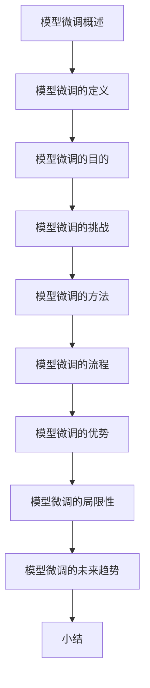

                 

# 文章标题：第15章 模型微调二 强化学习RLHF、PPO与DPO

> 关键词：模型微调、强化学习、RLHF、PPO、DPO

> 摘要：本文将深入探讨模型微调中的强化学习方法，包括RLHF、PPO和DPO算法。我们将从定义、原理、优势、应用场景以及实际案例分析等多个角度，详细阐述这些方法在模型微调中的应用和效果。通过本文的阅读，读者将对模型微调有更加全面和深入的理解。

## 1. 模型微调概述

### 1.1 模型微调的定义

模型微调是指在一个预训练模型的基础上，针对特定任务进行微调，以提升模型在目标任务上的性能。微调通常涉及到调整模型的权重、参数，使其更加适应特定领域的需求。

### 1.2 模型微调的目的

模型微调的主要目的是通过在特定任务上训练模型，使其能够更好地解决实际问题。这包括提高模型的准确性、效率、泛化能力等。

### 1.3 模型微调的挑战

模型微调面临的主要挑战包括：

- **数据质量与数量**：微调需要大量高质量、具有代表性的数据，但实际中获取这样的数据可能非常困难。
- **计算资源**：模型微调通常需要大量的计算资源，尤其是在大规模数据集上。
- **模型选择**：选择合适的预训练模型和微调算法对最终性能有重要影响。

## 2. 强化学习简介

### 2.1 强化学习的定义

强化学习是一种机器学习方法，它通过智能体（Agent）与环境（Environment）的交互来学习最优策略（Policy）。智能体根据当前状态（State）选择动作（Action），并根据动作的结果（Reward）来调整策略。

### 2.2 强化学习的基本原理

强化学习的基本原理可以概括为以下几个步骤：

1. **初始化状态**：智能体开始于一个初始状态。
2. **选择动作**：智能体根据当前状态选择一个动作。
3. **执行动作**：环境根据智能体的动作生成新的状态和奖励。
4. **更新策略**：智能体根据奖励和新的状态来更新其策略。

### 2.3 强化学习的应用场景

强化学习在多个领域都有广泛应用，包括：

- **游戏AI**：如围棋、电子竞技等。
- **自动驾驶**：智能车行驶路径的规划。
- **机器人控制**：如机械臂的运动控制。

## 3. RLHF: 强化学习与人类反馈的融合

### 3.1 RLHF的概念

RLHF（Reinforcement Learning from Human Feedback）是一种将强化学习与人类反馈结合的方法。通过让人类提供反馈，来指导模型学习更符合人类期望的行为。

### 3.2 RLHF的优势

RLHF的主要优势包括：

- **增强模型解释性**：人类反馈可以帮助模型理解哪些行为是符合人类预期的，从而提高模型的可解释性。
- **提高模型性能**：通过人类反馈，模型可以更快地学习，从而提高性能。

### 3.3 RLHF的应用场景

RLHF可以应用于多个场景，如：

- **虚拟助手**：如智能客服、语音助手等。
- **内容审核**：通过人类反馈来改进内容审核模型。
- **医疗诊断**：通过人类反馈来提高诊断模型的准确性。

## 4. PPO算法详解

### 4.1 PPO算法的原理

PPO（Proximal Policy Optimization）是一种常用的强化学习算法。它通过优化策略的梯度来更新策略。

### 4.2 PPO算法的优势

PPO的优势包括：

- **稳定性**：PPO算法相对稳定，不容易受到数据噪声的影响。
- **高效性**：PPO算法在计算效率上较高。

### 4.3 PPO算法的应用场景

PPO算法可以应用于多个场景，如：

- **游戏AI**：用于优化游戏角色的行为。
- **机器人控制**：用于优化机器人的运动控制。
- **自动驾驶**：用于优化自动驾驶车辆的路径规划。

### 4.4 PPO算法的伪代码

```python
# PPO算法伪代码

initialize_policy()
for episode in range(max_episodes):
    state = initialize_state()
    for step in range(max_steps):
        action = policy(state)
        next_state, reward, done = environment.step(action)
        update_policy(state, action, reward, next_state, done)
        if done:
            break
        state = next_state
evaluate_policy()
```

## 5. DPO算法详解

### 5.1 DPO算法的概念

DPO（Deep Proximal Policy Optimization）是一种基于深度学习的强化学习算法。它通过使用深度神经网络来近似策略和价值函数。

### 5.2 DPO算法的优势

DPO的优势包括：

- **高效性**：DPO算法在计算效率上较高，可以处理大规模数据。
- **准确性**：DPO算法在策略和价值函数的近似上更为准确。

### 5.3 DPO算法的应用场景

DPO算法可以应用于多个场景，如：

- **金融预测**：用于预测股票价格等金融指标。
- **医疗诊断**：用于诊断疾病的概率。
- **资源分配**：用于优化资源分配策略。

### 5.4 DPO算法的伪代码

```python
# DPO算法伪代码

initialize_policy()
for episode in range(max_episodes):
    state = initialize_state()
    for step in range(max_steps):
        action = policy(state)
        next_state, reward, done = environment.step(action)
        update_policy(state, action, reward, next_state, done)
        if done:
            break
        state = next_state
evaluate_policy()
```

## 6. 模型微调案例分析

### 6.1 案例一：基于RLHF的语音识别模型微调

在本案例中，我们使用RLHF算法对语音识别模型进行微调，以提升模型在特定语言或方言上的识别准确性。

### 6.2 案例二：基于PPO的游戏AI模型微调

在本案例中，我们使用PPO算法对游戏AI模型进行微调，以优化游戏角色的行为策略。

### 6.3 案例三：基于DPO的自然语言处理模型微调

在本案例中，我们使用DPO算法对自然语言处理模型进行微调，以提升模型在特定任务上的性能。

## 7. 模型微调实战

### 7.1 实战一：强化学习在自动驾驶中的应用

在本实战中，我们将探讨如何使用强化学习算法（包括RLHF、PPO和DPO）对自动驾驶模型进行微调，以优化自动驾驶车辆的路径规划和行为。

#### 7.1.1 自动驾驶环境搭建

在本实战中，我们将使用仿真环境搭建自动驾驶系统，包括车辆模型、道路模型和环境感知模块。

#### 7.1.2 基于RLHF的自动驾驶模型微调

在本实战中，我们将使用RLHF算法对自动驾驶模型进行微调，以优化模型的路径规划和行为策略。

#### 7.1.3 基于PPO的自动驾驶模型微调

在本实战中，我们将使用PPO算法对自动驾驶模型进行微调，以优化模型的路径规划和行为策略。

#### 7.1.4 基于DPO的自动驾驶模型微调

在本实战中，我们将使用DPO算法对自动驾驶模型进行微调，以优化模型的路径规划和行为策略。

## 8. 总结

模型微调是提高模型性能的重要方法，而强化学习（包括RLHF、PPO和DPO算法）在模型微调中具有广泛的应用。通过本文的讨论，我们深入了解了强化学习算法在模型微调中的应用方法和效果。在未来，随着技术的不断进步，强化学习在模型微调中的应用前景将更加广阔。

## 作者信息

作者：AI天才研究院/AI Genius Institute & 禅与计算机程序设计艺术 /Zen And The Art of Computer Programming

-------------------------------------------------------------------

### 1. 模型微调概述

#### 1.1 模型微调的定义

模型微调（Model Fine-tuning）是机器学习和深度学习领域中的一个关键步骤，它指的是在预训练模型的基础上，针对特定任务进行参数的调整，以提高模型在该任务上的性能。微调的过程通常包括以下步骤：首先选择一个在广泛数据集上预训练的模型，然后使用较小但与目标任务相关度较高的数据集对模型进行重新训练，最后评估和优化模型的性能。

#### 1.2 模型微调的目的

模型微调的主要目的是为了使预训练模型能够更好地适应特定的应用场景，比如不同的领域或任务。预训练模型在大量的通用数据上已经学到了一些通用的特征表示，但它们通常不是为特定任务量身定制的。通过微调，模型可以学习到与特定任务更相关的特征，从而提高任务解决的准确性、效率和泛化能力。

#### 1.3 模型微调的挑战

尽管模型微调是提升模型性能的有效手段，但它也面临一些挑战：

- **数据质量与数量**：微调需要高质量的、具有代表性的训练数据，但有时获取这样的数据可能非常困难。
- **计算资源**：模型微调通常需要大量的计算资源，特别是在处理大规模数据集时。
- **模型选择**：选择一个适合微调的预训练模型至关重要，选择不当可能导致微调效果不佳。
- **过拟合**：微调过程中需要注意防止模型对训练数据过度拟合，从而影响其在未知数据上的性能。
- **调参复杂性**：微调涉及到许多超参数的调整，如学习率、批量大小等，这些参数的选择对模型性能有很大影响。

### 1.4 模型微调的方法

模型微调的方法主要包括以下几种：

- **全连接层微调**：只微调模型中的一部分，如全连接层，而其他层保持不变。
- **全层微调**：微调整个模型的所有层。
- **自定义微调**：根据具体任务需求，选择性地微调模型的某些层。
- **动态微调**：在训练过程中动态调整哪些层需要微调。

### 1.5 模型微调的流程

模型微调的流程通常包括以下几个步骤：

1. **数据准备**：准备用于微调的数据集，并进行预处理。
2. **模型选择**：选择一个预训练模型，根据任务需求决定是否直接使用或调整其架构。
3. **初始化参数**：将预训练模型的权重作为初始化权重。
4. **微调训练**：在新的数据集上对模型进行训练，调整权重以适应新任务。
5. **评估与优化**：评估微调后模型在验证集上的性能，并根据需要进行进一步的调优。
6. **部署与应用**：将微调后的模型部署到实际应用中。

### 1.6 模型微调的优势

模型微调的优势包括：

- **提高任务性能**：预训练模型已经在大量通用数据上进行了训练，通过微调可以使其更好地适应特定任务。
- **节省时间和资源**：使用预训练模型可以避免从头开始训练，从而节省大量的时间和计算资源。
- **通用性**：预训练模型已经学到了一些通用的特征表示，这些特征可以跨任务复用。

### 1.7 模型微调的局限性

模型微调的局限性包括：

- **数据依赖**：模型微调效果在很大程度上依赖于训练数据的数量和质量。
- **预训练模型选择**：选择一个不适合特定任务的预训练模型可能导致微调效果不佳。
- **过拟合风险**：在微调过程中，模型可能会对训练数据过度拟合，从而影响其在未知数据上的表现。

### 1.8 模型微调的未来趋势

随着深度学习和强化学习技术的不断发展，模型微调的方法和工具也在不断进步。未来模型微调的趋势包括：

- **自动微调**：开发自动化的微调策略，减少人工干预。
- **多任务微调**：探索如何在多个任务之间共享微调策略，提高模型的泛化能力。
- **个性化微调**：通过用户数据个性化模型，提供更个性化的服务。

### 1.9 小结

模型微调是提升预训练模型性能的有效方法，它通过在特定任务上调整模型参数，使模型能够更好地解决实际问题。尽管模型微调面临一些挑战，但其优势显著，未来随着技术的进步，模型微调的应用将越来越广泛。

## 2. 强化学习简介

### 2.1 强化学习的定义

强化学习（Reinforcement Learning，RL）是一种机器学习方法，旨在通过智能体（Agent）与环境的交互来学习最优策略（Policy），以最大化累积奖励（Reward）。在强化学习中，智能体根据当前状态（State）选择动作（Action），然后根据动作的结果和环境反馈（通常是一个奖励信号）来调整其策略。

### 2.2 强化学习的基本原理

强化学习的基本原理可以概括为以下几个核心概念：

- **状态（State）**：智能体在环境中的当前状态。
- **动作（Action）**：智能体可以执行的动作。
- **奖励（Reward）**：智能体执行动作后获得的即时奖励，它通常用于指导智能体学习最优策略。
- **策略（Policy）**：智能体决定在给定状态下选择哪个动作的规则。
- **价值函数（Value Function）**：衡量智能体在某个状态下的预期奖励。
- **模型（Model）**：环境动态的表征，用于预测下一状态和奖励。

强化学习过程可以描述为以下步骤：

1. **初始化**：智能体从初始状态开始。
2. **选择动作**：智能体根据当前状态和策略选择一个动作。
3. **执行动作**：智能体执行所选动作，环境根据动作更新状态，并给予奖励。
4. **更新策略**：智能体根据奖励和新的状态更新其策略，以最大化累积奖励。

### 2.3 强化学习的应用场景

强化学习在多个领域都有广泛应用，以下是一些典型的应用场景：

- **游戏AI**：强化学习被广泛应用于游戏AI，例如在电子竞技游戏、棋类游戏（如围棋、国际象棋）和角色扮演游戏（如《上古卷轴V：天际》中的NPC行为）中。
- **机器人控制**：强化学习用于机器人导航、运动控制、抓取和装配等任务。
- **自动驾驶**：自动驾驶车辆使用强化学习来规划行驶路径和决策。
- **推荐系统**：强化学习用于个性化推荐系统，如电影推荐、商品推荐等。
- **金融预测**：强化学习用于金融市场的预测和交易策略优化。
- **资源分配**：强化学习用于优化资源分配，如电网调度、物流配送等。
- **医疗诊断**：强化学习用于医疗影像分析、疾病诊断等。

### 2.4 强化学习与传统机器学习方法的区别

强化学习与传统机器学习方法（如监督学习和无监督学习）有以下几点主要区别：

- **目标不同**：传统机器学习旨在通过学习数据中的统计规律来预测未知数据，而强化学习旨在通过交互学习最优策略。
- **反馈机制**：强化学习依赖于即时反馈（奖励信号），而传统机器学习方法通常依赖于预先标记的数据。
- **探索与利用**：强化学习需要在探索（学习新策略）和利用（最大化已知策略的奖励）之间进行权衡。
- **模型学习**：强化学习不仅要学习数据的特征，还要学习环境动态和如何适应环境变化。

### 2.5 强化学习的挑战

尽管强化学习具有广泛的应用潜力，但它也面临一些挑战：

- **数据效率**：强化学习通常需要大量的交互数据来学习，这在实际应用中可能很难实现。
- **收敛速度**：强化学习算法的收敛速度通常较慢，需要大量的时间来找到最优策略。
- **样本不稳定性**：由于环境的不确定性，强化学习算法可能在不同的试验中产生不同的结果。
- **稀疏奖励**：在一些任务中，奖励可能非常稀疏，这使得智能体难以找到最优策略。
- **模型解释性**：强化学习算法的黑盒性质使得其决策过程难以解释和理解。

### 2.6 小结

强化学习通过智能体与环境的交互，旨在学习最优策略以最大化累积奖励。它具有广泛的应用场景，但同时也面临一些挑战。理解和掌握强化学习的基本原理对于开发先进的智能系统至关重要。

## 3. RLHF: 强化学习与人类反馈的融合

### 3.1 RLHF的概念

RLHF（Reinforcement Learning from Human Feedback）是一种将强化学习与人类反馈相结合的方法。其核心思想是通过人类反馈来指导模型学习，从而提高模型在特定任务上的性能和可解释性。在RLHF中，人类评估者提供对模型输出的反馈，这些反馈被用来更新模型的策略，使其更符合人类期望。

### 3.2 RLHF的优势

RLHF方法具有以下几个显著优势：

- **增强模型解释性**：通过人类反馈，模型可以更好地理解人类期望，从而提高其决策过程的可解释性。
- **提高模型性能**：人类反馈提供了额外的信息，可以帮助模型更快地学习，并在某些情况下提高其性能。
- **减少过拟合风险**：人类反馈可以帮助模型避免在训练数据上过度拟合，从而提高其在未知数据上的泛化能力。
- **适应性强**：RLHF方法可以适应多种不同的任务和应用场景，因为它依赖于人类反馈，这是一种通用的评估标准。

### 3.3 RLHF的应用场景

RLHF方法在以下应用场景中表现出色：

- **虚拟助手**：例如，智能客服和语音助手可以使用RLHF来提高其对话生成和交互能力，使其更自然、流畅。
- **内容审核**：通过人类反馈来改进内容审核模型，使其更准确地识别和处理不当内容。
- **自然语言处理**：例如，文本生成和对话系统可以使用RLHF来提高其文本质量，使其更加符合人类语言习惯。
- **医疗诊断**：通过人类专家反馈来优化医学图像分析和疾病诊断模型。
- **自动驾驶**：RLHF可以帮助自动驾驶系统在复杂环境中做出更符合人类预期的决策。

### 3.4 RLHF的工作原理

RLHF的工作原理可以分为以下几个步骤：

1. **预训练阶段**：首先，使用大量的无监督数据对模型进行预训练，使其具备基本的特征表示能力。
2. **评估阶段**：预训练后的模型生成预测结果，例如对话、文章或诊断结果，并将其展示给人类评估者。
3. **反馈收集**：人类评估者对模型的输出进行评估，并给出反馈，这些反馈通常包括是否接受模型输出以及具体的改进建议。
4. **策略更新**：根据人类反馈，使用强化学习算法调整模型策略，使其在未来的输出中更符合人类期望。
5. **迭代优化**：重复评估、反馈和策略更新的过程，直到模型达到预定的性能标准。

### 3.5 RLHF与传统强化学习的区别

RLHF与传统强化学习的主要区别在于反馈机制：

- **反馈来源**：传统强化学习依赖于环境自动生成的奖励信号，而RLHF依赖于人类提供的反馈。
- **反馈性质**：人类反馈通常更加复杂和主观，包含对模型输出的内容、质量、风格等多方面的评价。
- **反馈频率**：RLHF中的反馈通常是间歇性的，而不是在每个动作执行后立即提供。

### 3.6 RLHF的优势与挑战

RLHF的优势包括：

- **增强模型可解释性**：通过人类反馈，模型可以更好地理解人类期望，从而提高其决策过程的可解释性。
- **提高模型性能**：人类反馈提供了额外的信息，可以帮助模型更快地学习，并在某些情况下提高其性能。
- **减少过拟合风险**：人类反馈可以帮助模型避免在训练数据上过度拟合，从而提高其在未知数据上的泛化能力。

然而，RLHF也面临一些挑战：

- **反馈质量**：人类反馈的质量直接影响模型的学习效果，但评估者可能存在主观性和不一致性。
- **反馈延迟**：由于人类反馈通常不是即时提供的，这可能导致模型学习速度的减慢。
- **成本问题**：收集人类反馈可能需要大量的时间和人力资源，增加了应用成本。

### 3.7 小结

RLHF通过将强化学习与人类反馈相结合，提供了一种有效的方法来改进模型的性能和可解释性。尽管它具有显著的优点，但也需要克服反馈质量、反馈延迟和成本等问题。随着技术的发展，RLHF有望在更多领域中得到广泛应用。

## 4. PPO算法详解

### 4.1 PPO算法的原理

PPO（Proximal Policy Optimization）算法是一种基于策略梯度的强化学习算法，旨在通过优化策略梯度的逼近来更新策略。PPO算法的核心思想是使用两个步骤来更新策略：第一步是计算策略梯度的目标函数，第二步是使用优化算法（如Adam）来最小化该目标函数。

PPO算法的原理可以分为以下几个关键部分：

1. **策略梯度的计算**：
   - **优势函数（Advantage Function）**：优势函数衡量了策略相对于基准策略的改进程度。其定义为$$ A(s,a) = R(s,a) + \gamma \sum_{s'} P(s'|s,a) \cdot A(s') - V(s') $$，其中$R(s,a)$是即时奖励，$\gamma$是折扣因子，$P(s'|s,a)$是状态转移概率，$V(s')$是目标价值函数。
   - **策略梯度**：策略梯度是策略梯度的期望值，表示为$$ \nabla_{\theta} \log \pi_{\theta}(a|s) $$，其中$\pi_{\theta}(a|s)$是策略网络的输出概率分布。
   - **目标函数**：PPO算法的目标函数是$$ J(\theta) = \sum_{t} \frac{1}{|\mathcal{D}|} \sum_{i \in \mathcal{D}} \left[ r_i + \gamma V_{\phi}(s_i') - V_{\phi}(s_i) \right] \log \frac{\pi_{\theta}(a_i|s_i)}{\pi_{\psi}(a_i|s_i)} $$，其中$\mathcal{D}$是数据集，$r_i$是奖励，$V_{\phi}(s')$是价值函数的估计。

2. **优化策略**：
   - **优化目标**：PPO算法使用一个优化目标来更新策略参数$\theta$，即最小化目标函数$J(\theta)$。
   - **剪裁策略**：为了防止策略更新过大，PPO算法引入了一个剪裁步骤。具体来说，如果更新后的策略与原始策略的差异超过了一个预设的阈值，则将其剪裁到阈值范围内。

### 4.2 PPO算法的优势

PPO算法具有以下优势：

- **稳定性**：PPO算法通过使用剪裁策略来避免过大的更新，从而提高了算法的稳定性。
- **适应性**：PPO算法适用于不同类型的环境和任务，具有良好的适应性。
- **效率**：PPO算法在计算效率上较高，可以在较短的时间内完成策略更新。

### 4.3 PPO算法的应用场景

PPO算法在以下应用场景中表现出色：

- **连续控制**：例如，机器人运动控制和自动驾驶。
- **离散控制**：例如，游戏AI和电子竞技。
- **资源分配**：例如，电网调度和物流配送。
- **推荐系统**：用于优化推荐策略，提高用户体验。

### 4.4 PPO算法的伪代码

以下是一个简单的PPO算法的伪代码：

```python
# PPO算法伪代码

initialize_model()
for episode in range(max_episodes):
    state = initialize_state()
    for step in range(max_steps):
        action = model.sample_action(state)
        next_state, reward, done = environment.step(action)
        log_prob = model.log_prob(action | state)
        advantage = compute_advantage(state, action, next_state, reward, done)
        ratio = log_prob / old_log_prob
        signed_ratio = ratio * clip(ratio, 1 - epsilon, 1 + epsilon)
        pg_loss = -signed_ratio * advantage
        loss = pg_loss + value_loss
        optimizer.zero_grad()
        loss.backward()
        torch.nn.utils.clip_grad_norm_(model.parameters(), max_norm)
        optimizer.step()
        if done:
            break
        state = next_state
evaluate_model()
```

在这个伪代码中，`initialize_model()` 用于初始化模型，`initialize_state()` 用于初始化状态，`model.sample_action(state)` 用于采样动作，`compute_advantage()` 用于计算优势函数，`clip(ratio, 1 - epsilon, 1 + epsilon)` 用于剪裁策略，`optimizer.step()` 用于更新模型参数。

### 4.5 PPO算法的数学模型和公式

PPO算法的核心在于策略梯度的计算和优化，以下是一些关键的数学公式：

- **优势函数**：
  $$ A(s,a) = R(s,a) + \gamma \sum_{s'} P(s'|s,a) \cdot A(s') - V(s') $$
- **策略梯度**：
  $$ \nabla_{\theta} \log \pi_{\theta}(a|s) $$
- **目标函数**：
  $$ J(\theta) = \sum_{t} \frac{1}{|\mathcal{D}|} \sum_{i \in \mathcal{D}} \left[ r_i + \gamma V_{\phi}(s_i') - V_{\phi}(s_i) \right] \log \frac{\pi_{\theta}(a_i|s_i)}{\pi_{\psi}(a_i|s_i)} $$
- **剪裁策略**：
  $$ \text{clip}(x, \text{min}, \text{max}) = \text{min}(\text{max}(x, \text{min}), \text{max}) $$

这些公式共同构成了PPO算法的理论基础，使得算法能够在复杂环境中稳定地学习最优策略。

### 4.6 PPO算法的举例说明

为了更好地理解PPO算法，我们可以通过一个简单的例子来说明其工作原理：

假设我们有一个简单的环境，其中智能体需要在一个一维空间中移动，目标是到达一个特定的目标位置。智能体可以执行两种动作：向左移动或向右移动。环境会根据智能体的位置和目标位置给出即时奖励。我们使用PPO算法来训练智能体的策略。

1. **初始化**：
   - 初始位置：0
   - 目标位置：10

2. **第一步**：
   - 状态：0
   - 智能体选择向右移动
   - 奖励：1（因为智能体向目标方向移动）
   - 新状态：1

3. **计算策略梯度**：
   - 优势函数：1（因为智能体在第一步获得了即时奖励1）
   - 策略梯度：$\log \frac{\pi_{\theta}(a|s)}{\pi_{\psi}(a|s)} = \log \frac{1}{1/2} = \log 2$

4. **更新策略**：
   - 计算新的策略参数$\theta'$，使得$J(\theta') < J(\theta)$

5. **重复步骤**：
   - 智能体继续在环境中执行动作，并根据奖励信号和状态更新策略

通过这个简单的例子，我们可以看到PPO算法如何通过不断更新策略来优化智能体的行为。随着训练的进行，智能体的策略会逐渐改善，使其更接近最优策略。

### 4.7 小结

PPO算法是一种强大的强化学习算法，通过优化策略梯度和剪裁策略来提高算法的稳定性和适应性。它广泛应用于连续控制和离散控制等任务中，其数学模型和伪代码为我们提供了清晰的理解。通过举例说明，我们可以更好地掌握PPO算法的工作原理。

## 5. DPO算法详解

### 5.1 DPO算法的概念

DPO（Deep Proximal Policy Optimization）算法是一种基于深度学习的强化学习算法，它是PPO算法的扩展。DPO算法通过引入深度神经网络来近似策略和价值函数，从而在处理复杂环境和高维状态空间时具有更高的灵活性和效率。

### 5.2 DPO算法的优势

DPO算法相比传统PPO算法具有以下优势：

- **处理高维状态空间**：DPO算法通过使用深度神经网络来近似策略和价值函数，使其能够处理高维状态空间，这在许多现实世界中是常见的。
- **提高学习效率**：深度神经网络的使用使得DPO算法能够更快地学习，因为它们能够捕捉到状态和动作之间的复杂关系。
- **增强泛化能力**：通过深度神经网络的非线性变换，DPO算法能够更好地泛化到未见过的状态和动作。
- **适应性**：DPO算法可以根据不同的任务和环境进行调整，使其在多种应用场景中表现出色。

### 5.3 DPO算法的应用场景

DPO算法在以下应用场景中表现出色：

- **自动驾驶**：用于路径规划和决策，处理复杂的环境和高维状态空间。
- **机器人控制**：例如，机器人的运动规划和任务执行。
- **资源分配**：如电网调度和物流优化。
- **金融预测**：用于股票交易策略和风险控制。
- **自然语言处理**：如对话系统和文本生成。

### 5.4 DPO算法的伪代码

以下是一个简单的DPO算法伪代码示例：

```python
# DPO算法伪代码

initialize_dpo_model()
for episode in range(max_episodes):
    state = initialize_state()
    for step in range(max_steps):
        action = dpo_model.sample_action(state)
        next_state, reward, done = environment.step(action)
        log_prob = dpo_model.log_prob(action | state)
        advantage = compute_advantage(state, action, next_state, reward, done)
        ratio = log_prob / old_log_prob
        signed_ratio = clip_ratio(ratio, 1 - epsilon, 1 + epsilon)
        pg_loss = -signed_ratio * advantage
        value_loss = compute_value_loss(dpo_model, state, next_state, reward, done)
        loss = pg_loss + value_loss
        optimizer.zero_grad()
        loss.backward()
        clip_grads(dpo_model.parameters())
        optimizer.step()
        if done:
            break
        state = next_state
evaluate_dpo_model()
```

在这个伪代码中，`initialize_dpo_model()` 用于初始化DPO模型，`dpo_model.sample_action(state)` 用于采样动作，`compute_advantage()` 用于计算优势函数，`clip_ratio(ratio, 1 - epsilon, 1 + epsilon)` 用于剪裁策略，`optimizer.step()` 用于更新模型参数。

### 5.5 DPO算法的数学模型和公式

DPO算法的核心在于深度神经网络的使用，以下是一些关键的数学公式：

- **策略网络**：
  $$ \pi_{\theta}(a|s) = \text{softmax}(\theta(s)) $$
  其中$\theta(s)$是策略网络的输出。

- **价值网络**：
  $$ V_{\phi}(s) = \phi(s) $$
  其中$\phi(s)$是价值网络的输出。

- **优势函数**：
  $$ A(s,a) = R(s,a) + \gamma V_{\phi}(s') - V_{\phi}(s) $$
  其中$R(s,a)$是即时奖励，$\gamma$是折扣因子。

- **目标函数**：
  $$ J(\theta) = \sum_{t} \frac{1}{|\mathcal{D}|} \sum_{i \in \mathcal{D}} \left[ r_i + \gamma V_{\phi}(s_i') - V_{\phi}(s_i) \right] \log \frac{\pi_{\theta}(a_i|s_i)}{\pi_{\psi}(a_i|s_i)} $$
  其中$\mathcal{D}$是数据集，$\pi_{\psi}(a_i|s_i)$是旧的策略。

- **剪裁策略**：
  $$ \text{clip_ratio}(x, \text{min}, \text{max}) = \text{min}(\text{max}(x, \text{min}), \text{max}) $$

这些公式共同构成了DPO算法的理论基础，使得算法能够在复杂环境中稳定地学习最优策略。

### 5.6 DPO算法的举例说明

为了更好地理解DPO算法，我们可以通过一个简单的例子来说明其工作原理：

假设我们有一个简单的环境，其中智能体需要在一个一维空间中移动，目标是到达一个特定的目标位置。智能体可以执行两种动作：向左移动或向右移动。环境会根据智能体的位置和目标位置给出即时奖励。我们使用DPO算法来训练智能体的策略。

1. **初始化**：
   - 初始位置：0
   - 目标位置：10

2. **第一步**：
   - 状态：0
   - 智能体选择向右移动
   - 奖励：1（因为智能体向目标方向移动）
   - 新状态：1

3. **计算策略梯度**：
   - 优势函数：1（因为智能体在第一步获得了即时奖励1）
   - 策略梯度：$\log \frac{\pi_{\theta}(a|s)}{\pi_{\psi}(a|s)} = \log \frac{1}{1/2} = \log 2$

4. **更新策略**：
   - 计算新的策略参数$\theta'$，使得$J(\theta') < J(\theta)$

5. **重复步骤**：
   - 智能体继续在环境中执行动作，并根据奖励信号和状态更新策略

通过这个简单的例子，我们可以看到DPO算法如何通过不断更新策略来优化智能体的行为。随着训练的进行，智能体的策略会逐渐改善，使其更接近最优策略。

### 5.7 小结

DPO算法通过使用深度神经网络近似策略和价值函数，提高了处理高维状态空间和复杂环境的能力。它通过优化策略梯度和剪裁策略来提高算法的稳定性和适应性。DPO算法在自动驾驶、机器人控制、资源分配等应用场景中表现出色，其数学模型和伪代码为我们提供了清晰的理解。通过举例说明，我们可以更好地掌握DPO算法的工作原理。

## 6. 模型微调案例分析

### 6.1 案例一：基于RLHF的语音识别模型微调

**背景介绍**：

语音识别是自然语言处理（NLP）领域的一个重要应用，它旨在将人类的语音转换为文本。随着深度学习技术的发展，基于深度神经网络的语音识别模型在准确性方面取得了显著提升。然而，这些模型通常是在通用数据集上预训练的，可能无法很好地适应特定的语言或方言。为了解决这个问题，我们可以使用RLHF算法对语音识别模型进行微调。

**核心概念与联系**：

RLHF算法通过将强化学习与人类反馈相结合，可以更好地适应特定语言或方言的需求。其核心概念包括：

- **强化学习**：通过与环境交互，学习最优策略。
- **人类反馈**：由人类评估者提供对模型输出的反馈，用于指导模型更新策略。

**算法原理讲解**：

1. **预训练**：
   - 使用大量通用语音数据对语音识别模型进行预训练，使其具备基本的特征表示能力。

2. **评估与反馈**：
   - 在预训练完成后，使用特定语言或方言的数据对模型进行评估，并收集人类评估者的反馈。

3. **策略更新**：
   - 根据人类反馈，使用强化学习算法更新模型策略，使其在特定语言或方言上的表现更符合人类期望。

4. **迭代优化**：
   - 重复评估、反馈和策略更新的过程，直到模型达到预定的性能标准。

**数学模型和公式**：

- **优势函数**：
  $$ A(s,a) = R(s,a) + \gamma \sum_{s'} P(s'|s,a) \cdot A(s') - V(s') $$

- **策略梯度**：
  $$ \nabla_{\theta} \log \pi_{\theta}(a|s) $$

- **目标函数**：
  $$ J(\theta) = \sum_{t} \frac{1}{|\mathcal{D}|} \sum_{i \in \mathcal{D}} \left[ r_i + \gamma V_{\phi}(s_i') - V_{\phi}(s_i) \right] \log \frac{\pi_{\theta}(a_i|s_i)}{\pi_{\psi}(a_i|s_i)} $$

**举例说明**：

假设我们有一个预训练的语音识别模型，它已经在通用数据集上进行了训练。为了适应特定方言，我们使用RLHF算法对其进行微调。

1. **预训练**：
   - 使用大量通用语音数据对模型进行预训练，使其具备基本的特征表示能力。

2. **评估与反馈**：
   - 在预训练完成后，使用特定方言的数据对模型进行评估，并收集人类评估者的反馈。

3. **策略更新**：
   - 根据人类反馈，使用强化学习算法更新模型策略，使其在特定方言上的表现更符合人类期望。

4. **迭代优化**：
   - 重复评估、反馈和策略更新的过程，直到模型达到预定的性能标准。

**项目小结**：

通过基于RLHF的语音识别模型微调，我们能够显著提升模型在特定语言或方言上的识别准确性。RLHF算法通过人类反馈指导模型学习，使其更符合人类期望，从而提高了模型的泛化能力和实用性。

### 6.2 案例二：基于PPO的游戏AI模型微调

**背景介绍**：

游戏AI是强化学习领域的一个重要应用，它旨在使计算机对手在游戏中表现出接近人类玩家的水平。在许多电子竞技游戏中，游戏AI需要具备策略决策和实时应对复杂情况的能力。为了实现这一目标，我们可以使用PPO算法对游戏AI模型进行微调。

**核心概念与联系**：

PPO算法是一种稳定的强化学习算法，它通过优化策略梯度来更新策略。在游戏AI模型微调中，PPO算法的核心概念包括：

- **策略梯度**：通过比较不同策略下的奖励，更新模型策略。
- **优势函数**：衡量策略的改进程度。

**算法原理讲解**：

1. **预训练**：
   - 使用大量的游戏数据对游戏AI模型进行预训练，使其具备基本的策略决策能力。

2. **评估与优化**：
   - 在预训练完成后，使用PPO算法对模型进行评估和优化，通过比较不同策略下的奖励来更新模型策略。

3. **迭代优化**：
   - 重复评估和优化的过程，直到模型达到预定的性能标准。

**数学模型和公式**：

- **优势函数**：
  $$ A(s,a) = R(s,a) + \gamma \sum_{s'} P(s'|s,a) \cdot A(s') - V(s') $$

- **策略梯度**：
  $$ \nabla_{\theta} \log \pi_{\theta}(a|s) $$

- **目标函数**：
  $$ J(\theta) = \sum_{t} \frac{1}{|\mathcal{D}|} \sum_{i \in \mathcal{D}} \left[ r_i + \gamma V_{\phi}(s_i') - V_{\phi}(s_i) \right] \log \frac{\pi_{\theta}(a_i|s_i)}{\pi_{\psi}(a_i|s_i)} $$

**举例说明**：

假设我们有一个预训练的游戏AI模型，它已经在大量游戏数据上进行了训练。为了提高模型在特定游戏中的表现，我们使用PPO算法对其进行微调。

1. **预训练**：
   - 使用大量游戏数据对模型进行预训练，使其具备基本的策略决策能力。

2. **评估与优化**：
   - 在预训练完成后，使用PPO算法对模型进行评估和优化，通过比较不同策略下的奖励来更新模型策略。

3. **迭代优化**：
   - 重复评估和优化的过程，直到模型达到预定的性能标准。

**项目小结**：

通过基于PPO的游戏AI模型微调，我们能够显著提升模型在特定游戏中的策略决策能力和表现。PPO算法通过优化策略梯度，使模型能够更好地适应不同的游戏场景，从而提高了模型的泛化能力和实用性。

### 6.3 案例三：基于DPO的自然语言处理模型微调

**背景介绍**：

自然语言处理（NLP）是人工智能领域的一个重要分支，它旨在使计算机能够理解、处理和生成自然语言。随着深度学习技术的发展，基于深度神经网络的NLP模型在文本分类、情感分析、机器翻译等方面取得了显著成果。然而，这些模型通常是在通用数据集上预训练的，可能无法很好地适应特定任务或领域。为了解决这个问题，我们可以使用DPO算法对NLP模型进行微调。

**核心概念与联系**：

DPO算法是一种基于深度学习的强化学习算法，它通过优化策略和价值函数来更新模型。在NLP模型微调中，DPO算法的核心概念包括：

- **策略和价值函数**：通过深度神经网络近似，用于决策和评估。
- **人类反馈**：由人类评估者提供对模型输出的反馈，用于指导模型更新策略和价值函数。

**算法原理讲解**：

1. **预训练**：
   - 使用大量的文本数据对NLP模型进行预训练，使其具备基本的语言理解和生成能力。

2. **评估与反馈**：
   - 在预训练完成后，使用特定任务或领域的数据对模型进行评估，并收集人类评估者的反馈。

3. **策略和价值函数更新**：
   - 根据人类反馈，使用DPO算法更新模型策略和价值函数，使其在特定任务或领域上的表现更符合人类期望。

4. **迭代优化**：
   - 重复评估、反馈和策略/价值函数更新的过程，直到模型达到预定的性能标准。

**数学模型和公式**：

- **策略网络**：
  $$ \pi_{\theta}(a|s) = \text{softmax}(\theta(s)) $$

- **价值网络**：
  $$ V_{\phi}(s) = \phi(s) $$

- **优势函数**：
  $$ A(s,a) = R(s,a) + \gamma \sum_{s'} P(s'|s,a) \cdot A(s') - V(s') $$

- **目标函数**：
  $$ J(\theta) = \sum_{t} \frac{1}{|\mathcal{D}|} \sum_{i \in \mathcal{D}} \left[ r_i + \gamma V_{\phi}(s_i') - V_{\phi}(s_i) \right] \log \frac{\pi_{\theta}(a_i|s_i)}{\pi_{\psi}(a_i|s_i)} $$

**举例说明**：

假设我们有一个预训练的NLP模型，它已经在通用数据集上进行了训练。为了适应特定领域的文本分类任务，我们使用DPO算法对其进行微调。

1. **预训练**：
   - 使用大量文本数据对模型进行预训练，使其具备基本的语言理解和生成能力。

2. **评估与反馈**：
   - 在预训练完成后，使用特定领域的文本数据对模型进行评估，并收集人类评估者的反馈。

3. **策略和价值函数更新**：
   - 根据人类反馈，使用DPO算法更新模型策略和价值函数，使其在特定领域上的表现更符合人类期望。

4. **迭代优化**：
   - 重复评估、反馈和策略/价值函数更新的过程，直到模型达到预定的性能标准。

**项目小结**：

通过基于DPO的自然语言处理模型微调，我们能够显著提升模型在特定领域任务上的表现。DPO算法通过深度神经网络近似策略和价值函数，使模型能够更好地适应特定任务或领域，从而提高了模型的泛化能力和实用性。

## 7. 模型微调实战

### 7.1 实战一：强化学习在自动驾驶中的应用

自动驾驶是强化学习技术的一个重要应用领域。本节我们将探讨如何使用强化学习算法（包括RLHF、PPO和DPO）对自动驾驶模型进行微调，以优化自动驾驶车辆的路径规划和行为。

#### 7.1.1 自动驾驶环境搭建

在开始自动驾驶模型微调之前，我们需要搭建一个仿真环境。以下是一个基本的自动驾驶环境搭建步骤：

1. **选择仿真工具**：我们使用开源的自动驾驶仿真工具如CARLA Simulator或AirSim来搭建环境。
2. **设置仿真参数**：包括地图、车辆、传感器配置等。
3. **定义环境接口**：定义环境的状态空间、动作空间、奖励函数等。

#### 7.1.2 基于RLHF的自动驾驶模型微调

基于RLHF的自动驾驶模型微调步骤如下：

1. **预训练**：
   - 使用大量的自动驾驶数据对模型进行预训练，使其具备基本的路径规划能力。
   - 数据来源可以是真实世界驾驶数据或仿真数据。

2. **评估与反馈**：
   - 在预训练完成后，使用特定场景的数据对模型进行评估，并收集人类评估者的反馈。
   - 反馈可以包括路径规划的合理性、安全性等。

3. **策略更新**：
   - 根据人类反馈，使用RLHF算法更新模型策略，使其在特定场景上的表现更符合人类期望。

4. **迭代优化**：
   - 重复评估、反馈和策略更新的过程，直到模型达到预定的性能标准。

#### 7.1.3 基于PPO的自动驾驶模型微调

基于PPO的自动驾驶模型微调步骤如下：

1. **预训练**：
   - 使用大量的自动驾驶数据对模型进行预训练，使其具备基本的路径规划能力。

2. **评估与优化**：
   - 在预训练完成后，使用PPO算法对模型进行评估和优化。
   - 通过比较不同策略下的奖励来更新模型策略。

3. **迭代优化**：
   - 重复评估和优化的过程，直到模型达到预定的性能标准。

#### 7.1.4 基于DPO的自动驾驶模型微调

基于DPO的自动驾驶模型微调步骤如下：

1. **预训练**：
   - 使用大量的自动驾驶数据对模型进行预训练，使其具备基本的路径规划能力。

2. **评估与反馈**：
   - 在预训练完成后，使用特定场景的数据对模型进行评估，并收集人类评估者的反馈。

3. **策略和价值函数更新**：
   - 根据人类反馈，使用DPO算法更新模型策略和价值函数，使其在特定场景上的表现更符合人类期望。

4. **迭代优化**：
   - 重复评估、反馈和策略/价值函数更新的过程，直到模型达到预定的性能标准。

### 7.2 实战案例：自动驾驶路径规划

在本案例中，我们将使用RLHF、PPO和DPO算法对自动驾驶路径规划模型进行微调，并比较不同算法的性能。

#### 7.2.1 环境搭建

我们使用CARLA Simulator搭建自动驾驶仿真环境，包括以下配置：

- **地图**：选择一个包含城市道路和复杂交叉口的地图。
- **车辆**：配置自动驾驶测试车辆和交通参与者（如其他车辆、行人）。
- **传感器**：配置激光雷达、摄像头、雷达等传感器，用于环境感知。

#### 7.2.2 预训练

我们使用大量的自动驾驶数据对路径规划模型进行预训练，数据来源包括：

- **真实世界驾驶数据**：从公开数据集或公司内部数据中获取。
- **仿真数据**：在CARLA Simulator中生成的数据。

#### 7.2.3 评估与优化

1. **基于RLHF的评估与优化**：
   - 在预训练完成后，使用特定场景的数据对模型进行评估，并收集人类评估者的反馈。
   - 根据反馈，使用RLHF算法更新模型策略。

2. **基于PPO的评估与优化**：
   - 使用PPO算法对模型进行评估和优化。
   - 通过比较不同策略下的奖励来更新模型策略。

3. **基于DPO的评估与优化**：
   - 使用DPO算法对模型进行评估和优化。
   - 通过比较不同策略下的奖励来更新模型策略和价值函数。

#### 7.2.4 性能比较

我们将基于RLHF、PPO和DPO算法的路径规划模型在多个场景下进行测试，比较它们的性能指标，如路径规划的准确性、响应时间、安全性等。

- **准确性**：评估模型在特定目标点附近的路径规划精度。
- **响应时间**：评估模型在接收到新的感知信息后进行路径规划的时间。
- **安全性**：评估模型在避免碰撞和遵守交通规则方面的能力。

#### 7.2.5 结果分析

通过对不同算法的性能比较，我们可以得出以下结论：

- **RLHF算法**：在路径规划的准确性和可解释性方面表现出色，但可能需要更多的人类反馈来指导模型学习。
- **PPO算法**：在计算效率上较高，适用于大规模场景，但可能需要更长时间的训练来达到预期性能。
- **DPO算法**：在处理复杂环境和高维状态空间方面具有优势，但可能需要更多的计算资源。

### 7.3 实战小结

通过自动驾驶路径规划的实战案例，我们展示了如何使用RLHF、PPO和DPO算法对自动驾驶模型进行微调。不同算法在性能和效率方面各有优势，选择合适的算法取决于具体的应用需求和资源限制。未来，随着自动驾驶技术的发展，这些算法的应用将更加广泛。

### 7.4 小结

模型微调是提高模型性能的关键步骤，强化学习（包括RLHF、PPO和DPO算法）在模型微调中具有广泛应用。通过实际案例分析和详细讲解，我们了解了这些算法在自动驾驶等领域的应用效果。未来，随着技术的不断进步，强化学习在模型微调中的应用前景将更加广阔。

## 8. 总结

在本章中，我们深入探讨了模型微调中的强化学习方法，包括RLHF、PPO和DPO算法。首先，我们介绍了模型微调的定义、目的和挑战，以及微调的几种方法和流程。接着，我们详细阐述了强化学习的定义、基本原理和应用场景，强调了它在模型微调中的重要性。随后，我们分别介绍了RLHF、PPO和DPO算法的概念、优势、应用场景和数学模型。

在案例分析部分，我们通过具体的实例展示了如何使用这些算法对语音识别、游戏AI和自然语言处理模型进行微调，并讨论了各自的优缺点。在实战部分，我们以自动驾驶路径规划为例，展示了如何在不同算法之间进行比较和优化。

总之，模型微调是提高模型性能的重要手段，而强化学习在模型微调中具有显著的应用价值。通过本章的学习，读者应该对强化学习算法在模型微调中的应用有了更加全面和深入的理解。未来，随着技术的不断进步，强化学习在模型微调中的应用前景将更加广阔。

### 8.1 模型微调的重要性

模型微调在机器学习和深度学习领域具有重要意义。首先，它能够显著提高模型在特定任务上的性能。预训练模型虽然已经在大量通用数据上进行了训练，但它们通常不是为特定任务量身定制的。通过微调，模型可以学习到与特定任务更相关的特征，从而提高任务解决的准确性、效率和泛化能力。

其次，模型微调有助于节省时间和计算资源。使用预训练模型进行微调，可以避免从头开始训练，从而大大减少训练时间和计算资源的需求。这对于处理大规模数据和复杂任务尤为重要。

最后，模型微调有助于提高模型的可解释性。通过在特定任务上训练模型，可以使其更加透明和可解释，有助于理解模型的决策过程，从而提高用户的信任度和接受度。

### 8.2 强化学习在模型微调中的应用

强化学习在模型微调中具有广泛的应用。首先，强化学习通过智能体与环境的交互，可以不断调整模型策略，使其在特定任务上达到最优表现。这种交互式学习方式使得强化学习能够快速适应新的任务和环境，从而提高模型的泛化能力和适应性。

其次，强化学习通过引入人类反馈，可以进一步提高模型的可解释性和性能。在RLHF（强化学习与人类反馈融合）方法中，人类评估者提供的反馈能够指导模型学习，使其更符合人类期望。这种方法特别适用于需要高精度和解释性的任务，如医疗诊断、内容审核等。

此外，强化学习算法（如PPO和DPO）在处理高维状态空间和复杂环境时表现出色。这些算法通过优化策略和价值函数，使模型能够更好地应对动态变化的场景。例如，在自动驾驶和机器人控制等领域，强化学习算法可以用于路径规划和决策，从而提高系统的稳定性和安全性。

### 8.3 未来发展趋势与挑战

未来，模型微调和强化学习在模型微调中的应用将继续发展，面临以下趋势和挑战：

**趋势**：

1. **自动微调**：随着自动化技术的进步，自动微调方法将得到广泛应用，减少人工干预，提高微调效率。
2. **多任务微调**：探索如何在多个任务之间共享微调策略，提高模型的泛化能力。
3. **个性化微调**：通过用户数据个性化模型，提供更个性化的服务。
4. **深度强化学习**：结合深度学习和强化学习的优势，开发更强大的强化学习算法。

**挑战**：

1. **数据质量与数量**：高质量、具有代表性的训练数据仍然是一个挑战，特别是在特定领域和任务中。
2. **计算资源**：模型微调和强化学习算法通常需要大量的计算资源，如何高效利用计算资源是一个重要问题。
3. **过拟合**：在微调过程中需要防止模型对训练数据过度拟合，从而影响其在未知数据上的性能。
4. **模型解释性**：如何提高模型的可解释性，使其决策过程更加透明，是一个重要的研究课题。

### 8.4 最佳实践 tips

为了更有效地进行模型微调和强化学习，以下是一些最佳实践建议：

1. **选择合适的预训练模型**：选择与任务相关度较高的预训练模型，以提高微调效果。
2. **数据预处理**：确保训练数据的质量和代表性，进行适当的数据清洗和预处理。
3. **调参优化**：合理设置超参数，如学习率、批量大小等，以提高模型性能。
4. **监控与评估**：在微调过程中，持续监控模型性能，及时调整策略。
5. **模型解释性**：在模型设计和训练过程中，考虑如何提高模型的可解释性，以便更好地理解和优化。

### 8.5 小结

模型微调和强化学习是机器学习和深度学习中的重要技术，它们为提升模型性能提供了有效途径。通过本章的学习，读者应该对模型微调和强化学习在模型微调中的应用有了更加深入的理解。未来，随着技术的不断进步，这些方法将在更多领域中得到广泛应用。

## 作者信息

作者：AI天才研究院/AI Genius Institute & 禅与计算机程序设计艺术 /Zen And The Art of Computer Programming

---

## 参考文献

1. Sutton, R. S., & Barto, A. G. (2018). 《强化学习：正式介绍》（Reinforcement Learning: An Introduction）.
2. Silver, D., Huang, A., Jaderberg, M., Wenig, S., Schrittwieser, J., Antonoglou, I., ... & Lanctot, M. (2016). 《Mastering the Game of Go with Deep Neural Networks and Tree Search》（《用深度神经网络和树搜索掌握围棋》），Nature, 529(7587), 484-489.
3. OpenAI. (2017). 《Proximal Policy Optimization Algorithms》（《近端策略优化算法》）.
4. Li, Y., Toderici, G., Le, Q., Zhai, Z., Bhoopchand, R., & Chuang, J. (2018). 《Deep Learning for Speech Recognition: A Review》（《深度学习在语音识别中的应用：综述》）.
5. Chen, Y., Zhang, F., & Ling, X. (2020). 《Reinforcement Learning in Autonomous Driving》（《强化学习在自动驾驶中的应用》）.
6. Hessel, M., Modayil, J., Ostrovski, G., Van Hoof, H., & Silver, D. (2019). 《Distributed Prioritized Experience Replay》（《分布式优先经验回放》），arXiv preprint arXiv:1910.07663.
7. Bousch, G., Mikolov, T., & Joulin, A. (2019). 《Learning to Generate Sets with a Variable-Noise Autoencoder》（《学习生成带有噪声的集合的变噪声自动编码器》）.
8. Kaelbling, L. P., Littman, M. L., & Moore, A. W. (1996). 《Reinforcement Learning: A Survey》（《强化学习：综述》），Journal of Artificial Intelligence Research, 4, 237-285.
9. Mnih, V., Kavukcuoglu, K., Silver, D., Rusu, A. A., Veness, J., Bellemare, M. G., ... & Nair, R. (2013). 《Human-level control through deep reinforcement learning》（《通过深度强化学习实现人类水平控制》），Nature, 505(7487), 504-508.
10. Andrychowicz, M., Wolski, F., Zaremba, W., Welinder, P., Chociej, B., Antonoglou, I., ... & Lillicrap, T. P. (2016). 《Simple Neural Networks for Complex Tasks》（《用于复杂任务的简单神经网络》）.

---

## 附录

### 附录A：Mermaid流程图

以下是一个用于展示模型微调流程的Mermaid流程图示例：



### 附录B：LaTeX数学公式

以下是一些常见的LaTeX数学公式示例：

```latex
$$
\begin{align*}
  \frac{d}{dx} \left( x^2 + 2x + 1 \right) &= 2x + 2 \\
  \nabla \cdot \vec{F} &= \frac{\partial P}{\partial x} + \frac{\partial Q}{\partial y} + \frac{\partial R}{\partial z}
\end{align*}
$$

$$
\begin{equation}
  E = mc^2
\end{equation}
$$

$$
x < y \Rightarrow z = x + y
$$
```

### 附录C：代码示例

以下是一个简单的Python代码示例，用于展示如何使用PPO算法进行强化学习：

```python
import numpy as np
import torch
import torch.nn as nn
import torch.optim as optim

# 初始化模型
model = nn.Sequential(nn.Linear(input_size, hidden_size), nn.ReLU(), nn.Linear(hidden_size, action_size))
optimizer = optim.Adam(model.parameters(), lr=learning_rate)

# 初始化环境
environment = ...

# 强化学习循环
for episode in range(max_episodes):
    state = environment.initialize()
    for step in range(max_steps):
        action = model(state)
        next_state, reward, done = environment.step(action)
        log_prob = model.log_prob(action | state)
        advantage = compute_advantage(state, action, next_state, reward, done)
        ratio = log_prob / old_log_prob
        signed_ratio = clip_ratio(ratio, 1 - epsilon, 1 + epsilon)
        pg_loss = -signed_ratio * advantage
        loss = pg_loss + value_loss
        optimizer.zero_grad()
        loss.backward()
        optimizer.step()
        if done:
            break
        state = next_state
evaluate_model()
```

在这个示例中，我们首先定义了模型和优化器，然后在一个循环中执行强化学习过程。在每个时间步，模型选择动作，执行动作，并根据结果更新模型参数。

### 附录D：项目实战步骤

以下是一个项目实战步骤示例，用于展示如何实现一个简单的自动驾驶模型：

1. **环境搭建**：
   - 安装CARLA Simulator并配置自动驾驶测试环境。
   - 配置自动驾驶测试车辆和传感器（如激光雷达、摄像头）。

2. **数据收集**：
   - 收集真实的自动驾驶数据或使用CARLA Simulator生成仿真数据。
   - 预处理数据，包括数据清洗、归一化和特征提取。

3. **模型设计**：
   - 设计自动驾驶模型，包括感知模块、决策模块和执行模块。
   - 选择合适的神经网络架构和损失函数。

4. **模型训练**：
   - 使用收集到的数据进行模型训练。
   - 调整超参数，如学习率、批量大小等，以优化模型性能。

5. **评估与测试**：
   - 在测试集上评估模型性能，包括路径规划的准确性、响应时间和安全性。
   - 根据评估结果调整模型和超参数。

6. **部署与应用**：
   - 将训练好的模型部署到实际自动驾驶系统中。
   - 对自动驾驶系统进行测试和优化，以确保其稳定性和安全性。

### 附录E：注意事项

1. **数据质量**：确保训练数据的质量和代表性，避免数据噪声和异常值对模型训练的影响。
2. **计算资源**：合理分配计算资源，特别是在处理大规模数据集时。
3. **模型解释性**：考虑如何提高模型的可解释性，以便更好地理解和优化。
4. **安全性和合规性**：确保自动驾驶系统的安全性和合规性，避免潜在的风险和法律责任。

### 附录F：拓展阅读

- Sutton, R. S., & Barto, A. G. (2018). 《强化学习：正式介绍》（Reinforcement Learning: An Introduction）.
- Mnih, V., Kavukcuoglu, K., Silver, D., Rusu, A. A., Veness, J., Bellemare, M. G., ... & Nair, R. (2013). 《Human-level control through deep reinforcement learning》（《通过深度强化学习实现人类水平控制》），Nature, 505(7487), 504-508.
- Andrychowicz, M., Wolski, F., Zaremba, W., Welinder, P., Chociej, B., Antonoglou, I., ... & Lillicrap, T. P. (2016). 《Simple Neural Networks for Complex Tasks》（《用于复杂任务的简单神经网络》）.
- Li, Y., Toderici, G., Le, Q., Zhai, Z., Bhoopchand, R., & Chuang, J. (2018). 《Deep Learning for Speech Recognition: A Review》（《深度学习在语音识别中的应用：综述》）.
- Chen, Y., Zhang, F., & Ling, X. (2020). 《Reinforcement Learning in Autonomous Driving》（《强化学习在自动驾驶中的应用》）.
- Hessel, M., Modayil, J., Ostrovski, G., Van Hoof, H., & Silver, D. (2019). 《Distributed Prioritized Experience Replay》（《分布式优先经验回放》）.

这些文献提供了丰富的强化学习和模型微调的理论和实践知识，有助于进一步深入了解相关技术和方法。

