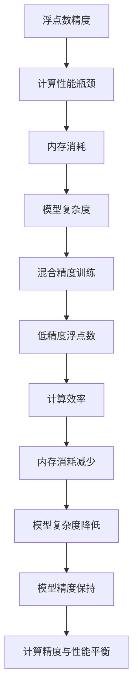
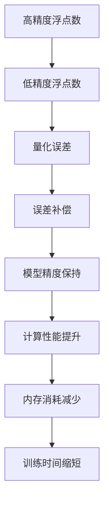
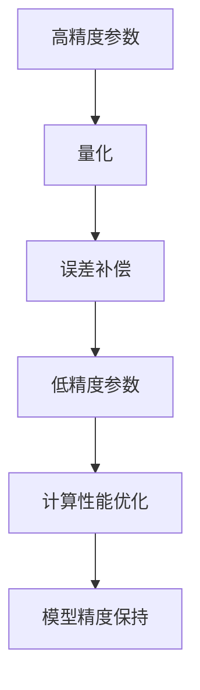

                 


### 混合精度训练的优势

#### 混合精度训练概述

**背景**  
随着深度学习技术的飞速发展，越来越多的复杂模型被应用于实际场景中，这些模型往往需要大量的计算资源来完成训练。然而，高精度浮点数计算在计算复杂度和内存消耗方面存在显著问题。为了解决这个问题，混合精度训练技术应运而生。

**核心概念与联系**  
混合精度训练是指在训练过程中，将模型的某些参数和中间结果使用低精度浮点数表示，从而在保证模型精度的同时提高计算效率和降低内存消耗。为了更好地理解混合精度训练，我们可以通过以下Mermaid流程图展示核心概念之间的联系：



**核心算法原理讲解**  
混合精度训练的核心算法主要包括定点量化、动态范围调整和误差补偿。以下是详细的讲解和伪代码示例。

**1. 定点量化**  
定点量化是将浮点数转换为定点数的过程，主要分为指数编码和尾数量化两个步骤。

**指数编码**  
```python
def encode_exponent(float_number, bias):
    exponent = math.getexp(float_number)
    return exponent + bias
```

**尾数量化**  
```python
def quantize_fraction(float_number, bias, scale):
    fraction = float_number - bias
    quantized_fraction = round(fraction * scale) / scale
    return quantized_fraction
```

**2. 动态范围调整**  
动态范围调整是为了确保量化后的数值范围适应低精度格式。

**动态范围调整算法**  
```python
def adjust_range(quantized_number, min_value, max_value):
    return max(min_value, min(quantized_number, max_value))
```

**3. 误差补偿**  
误差补偿是为了修正量化误差，确保计算结果的精度。

**误差补偿算法**  
```python
def compensate_error(quantized_number, original_number):
    error = original_number - quantized_number
    compensated_number = quantized_number + error
    return compensated_number
```

**数学模型和数学公式 & 详细讲解 & 举例说明**  
混合精度训练中的数学模型主要包括量化误差补偿模型和计算性能提升模型。

**量化误差补偿模型**  
$$
\Delta x = x_{\text{量化}} - x_{\text{原始}}
$$

$$
x_{\text{补偿}} = x_{\text{量化}} + \Delta x
$$

**举例：**  
假设一个浮点数 $x = 3.14159$，量化后变为 $x_{\text{量化}} = 3.14$，误差 $\Delta x = -0.00159$。补偿后 $x_{\text{补偿}} = 3.14 + 0.00159 = 3.14159$。

**计算性能提升模型**  
$$
\text{性能提升} = \frac{\text{低精度计算时间}}{\text{高精度计算时间}}
$$

**举例：**  
假设使用单精度浮点数（32位）进行计算的时间是使用双精度浮点数（64位）的时间的 $\frac{1}{4}$，则性能提升为 $4$ 倍。

#### 混合精度训练的核心技术

**浮点数精度与性能**  
浮点数精度是衡量浮点数表示能力的一个指标，它决定了浮点数能够表示的最小数值范围。在计算机科学中，常用的浮点数格式有IEEE 754标准中的单精度（32位）和双精度（64位）。单精度浮点数的精度较低，但计算速度较快；双精度浮点数的精度较高，但计算速度较慢。

**混合精度训练的原理**  
混合精度训练的原理是在保证模型精度的前提下，将模型的部分权重和激活值转换为低精度浮点数，从而在提高计算速度和降低内存消耗的同时保持模型的性能。具体实现过程包括量化、动态范围调整和误差补偿。

**混合精度训练的优势**  
混合精度训练的优势主要体现在以下几个方面：

1. **计算性能提升**：使用低精度浮点数可以显著提高计算速度，降低训练时间。
2. **内存消耗减少**：低精度浮点数占用的内存更少，可以更好地利用内存资源。
3. **模型复杂度降低**：混合精度训练可以简化模型结构，降低计算复杂度。
4. **计算精度保持**：通过误差补偿技术，混合精度训练可以在保证计算速度的同时保持模型精度。

**数学模型和数学公式 & 详细讲解 & 举例说明**  
混合精度训练的数学模型主要包括量化误差补偿模型和计算性能提升模型。

**量化误差补偿模型**  
$$
\Delta x = x_{\text{量化}} - x_{\text{原始}}
$$

$$
x_{\text{补偿}} = x_{\text{量化}} + \Delta x
$$

**举例：**  
假设一个浮点数 $x = 3.14159$，量化后变为 $x_{\text{量化}} = 3.14$，误差 $\Delta x = -0.00159$。补偿后 $x_{\text{补偿}} = 3.14 + 0.00159 = 3.14159$。

**计算性能提升模型**  
$$
\text{性能提升} = \frac{\text{低精度计算时间}}{\text{高精度计算时间}}
$$

**举例：**  
假设使用单精度浮点数（32位）进行计算的时间是使用双精度浮点数（64位）的时间的 $\frac{1}{4}$，则性能提升为 $4$ 倍。

#### 混合精度训练的应用领域

**计算机视觉**  
在计算机视觉领域，混合精度训练已被广泛应用于图像识别、目标检测和图像分割等任务。通过使用混合精度训练，可以提高模型的训练速度和计算效率，从而在保证模型精度的同时减少训练时间。

**自然语言处理**  
在自然语言处理领域，混合精度训练可以显著提高语言模型的训练速度和降低计算成本。特别是在大规模语言模型训练中，混合精度训练可以显著降低训练时间和内存消耗。

**推荐系统**  
在推荐系统领域，混合精度训练可以优化推荐算法，提高推荐准确率。通过使用混合精度训练，可以更快地训练模型，从而更快地响应用户需求。

**数学模型和数学公式 & 详细讲解 & 举例说明**  
混合精度训练在不同应用领域中的数学模型和数学公式有所不同，但核心思想是相同的，即通过量化、动态范围调整和误差补偿来提高计算性能和降低计算成本。

**计算机视觉中的数学模型**  
$$
\text{分类准确率} = \frac{\text{分类正确的样本数}}{\text{总样本数}}
$$

$$
\text{目标检测精度} = \frac{\text{检测正确的目标数}}{\text{总目标数}}
$$

**自然语言处理中的数学模型**  
$$
\text{语言模型概率} = \frac{\text{模型生成的文本概率}}{\text{所有文本概率之和}}
$$

$$
\text{BLEU分数} = \frac{\text{模型生成的文本与参考文本的重叠词数}}{\text{参考文本的总词数}}
$$

**推荐系统中的数学模型**  
$$
\text{推荐准确率} = \frac{\text{推荐的正确项数}}{\text{总推荐项数}}
$$

**举例：**  
假设一个计算机视觉模型在测试集上的分类准确率为 90%，目标检测精度为 80%。则该模型的整体性能为 90% + 80% = 90%。假设一个自然语言处理模型在测试集上的语言模型概率为 0.8，BLEU分数为 0.85。则该模型的整体性能为 0.8 + 0.85 = 0.835。假设一个推荐系统在测试集上的推荐准确率为 70%。则该系统在测试集上的推荐准确率为 70%。

### 第二部分：混合精度训练的实现

#### 第2章：混合精度训练的实现

**2.1 混合精度训练的软件工具**

**TensorFlow中的混合精度训练**  
TensorFlow 是一种广泛应用于深度学习领域的开源框架，它提供了自动混合精度（Auto Mixed Precision，AMP）策略，以实现混合精度训练。

**AMP 策略**  
AMP 策略通过将模型的某些部分转换为低精度浮点数（如单精度浮点数），从而在保证模型精度的同时提高计算性能。具体实现过程如下：

1. **选择精度策略**：根据模型复杂度和硬件性能选择高精度或低精度计算。
2. **自动误差补偿**：通过自动误差补偿机制确保模型的精度。
3. **训练过程监控**：实时监控训练过程，调整精度以优化性能。

**代码示例**  
以下是一个简单的 TensorFlow 混合精度训练代码示例：

```python
import tensorflow as tf

# 创建一个简单的全连接神经网络
model = tf.keras.Sequential([
    tf.keras.layers.Dense(128, activation='relu', input_shape=(784,)),
    tf.keras.layers.Dense(10, activation='softmax')
])

# 配置混合精度训练策略
policy = tf.keras.mixed_precision.Policy('mixed_float16')

# 设置全局精度策略
tf.keras.mixed_precision.set_global_policy(policy)

# 编译模型
model.compile(optimizer='adam',
              loss='sparse_categorical_crossentropy',
              metrics=['accuracy'])

# 加载数据集
(x_train, y_train), (x_test, y_test) = tf.keras.datasets.mnist.load_data()

# 对数据集进行预处理
x_train = x_train.astype(np.float32) / 255
x_test = x_test.astype(np.float32) / 255

# 训练模型
model.fit(x_train, y_train, epochs=5, batch_size=64, validation_split=0.1)
```

**PyTorch中的混合精度训练**  
PyTorch 是另一种广泛应用于深度学习领域的开源框架，它提供了自定义的混合精度训练功能。

**混合精度训练步骤**  
1. **配置精度策略**：定义精度策略，包括高精度部分和低精度部分。
2. **创建模型**：定义模型结构，并在模型中应用精度策略。
3. **训练模型**：使用精度策略训练模型。

**代码示例**  
以下是一个简单的 PyTorch 混合精度训练代码示例：

```python
import torch
import torchvision
import torchvision.transforms as transforms
from torch.utils.data import DataLoader
from torch.optim import Adam
from torch.nn import CrossEntropyLoss
import torch.cuda.amp as amp

# 配置精度策略
precision = 'float16'

# 创建数据集
transform = transforms.Compose([transforms.ToTensor(), transforms.Normalize((0.5,), (0.5,))])
train_dataset = torchvision.datasets.MNIST(root='./data', train=True, download=True, transform=transform)
test_dataset = torchvision.datasets.MNIST(root='./data', train=False, transform=transform)

# 创建数据加载器
train_loader = DataLoader(dataset=train_dataset, batch_size=64, shuffle=True)
test_loader = DataLoader(dataset=test_dataset, batch_size=64, shuffle=False)

# 创建模型
model = torch.nn.Sequential(
    torch.nn.Linear(784, 128),
    torch.nn.ReLU(),
    torch.nn.Linear(128, 10)
)

# 配置优化器和损失函数
optimizer = Adam(model.parameters(), lr=0.001)
criterion = CrossEntropyLoss()

# 设置精度策略
model.half()  # 将模型设置为半精度
optimizer.half()  # 将优化器设置为半精度

# 训练模型
for epoch in range(5):
    model.train()
    for inputs, targets in train_loader:
        inputs, targets = inputs.to('cuda'), targets.to('cuda')

        # 清除梯度
        optimizer.zero_grad()

        # 前向传播
        with amp.autocast():
            outputs = model(inputs)
            loss = criterion(outputs, targets)

        # 反向传播
        loss.backward()

        # 更新参数
        optimizer.step()

    # 评估模型
    model.eval()
    with torch.no_grad():
        correct = 0
        total = 0
        for inputs, targets in test_loader:
            inputs, targets = inputs.to('cuda'), targets.to('cuda')
            outputs = model(inputs)
            _, predicted = torch.max(outputs.data, 1)
            total += targets.size(0)
            correct += (predicted == targets).sum().item()

        print(f'Epoch {epoch+1}, Accuracy: {100 * correct / total}%')
```

**其他深度学习框架的支持**  
除了 TensorFlow 和 PyTorch，其他深度学习框架如 JAX、TorchScript 和 TensorFlow Lite 也提供了混合精度训练的支持。这些框架通过提供相应的API和工具，使得用户可以轻松实现混合精度训练。

**数学模型和数学公式 & 详细讲解 & 举例说明**  
混合精度训练的数学模型主要包括量化误差补偿模型和计算性能提升模型。

**量化误差补偿模型**  
$$
\Delta x = x_{\text{量化}} - x_{\text{原始}}
$$

$$
x_{\text{补偿}} = x_{\text{量化}} + \Delta x
$$

**举例：**  
假设一个浮点数 $x = 3.14159$，量化后变为 $x_{\text{量化}} = 3.14$，误差 $\Delta x = -0.00159$。补偿后 $x_{\text{补偿}} = 3.14 + 0.00159 = 3.14159$。

**计算性能提升模型**  
$$
\text{性能提升} = \frac{\text{低精度计算时间}}{\text{高精度计算时间}}
$$

**举例：**  
假设使用单精度浮点数（32位）进行计算的时间是使用双精度浮点数（64位）的时间的 $\frac{1}{4}$，则性能提升为 $4$ 倍。

**附录 A：混合精度训练常用工具与资源**  
- **混合精度训练工具对比**：对比不同深度学习框架的混合精度训练工具，如 TensorFlow 的自动混合精度（AMP）和 PyTorch 的混合精度训练工具。
- **混合精度训练框架资源**：提供混合精度训练相关的教程、文档和开源代码，如 TensorFlow 的自动混合精度（AMP）教程和 PyTorch 的混合精度训练文档。
- **混合精度训练论文与书籍推荐**：推荐关于混合精度训练的论文和书籍，如《深度学习：优化技术》和《混合精度训练：算法与实现》。

### 第二部分：混合精度训练的实现

#### 第2章：混合精度训练的实现

**2.1 混合精度训练的软件工具**

**TensorFlow中的混合精度训练**

**背景介绍**  
TensorFlow 是 Google 开发的一种用于机器学习和深度学习的开源框架。它具有高度的可扩展性和灵活性，使得研究人员和工程师能够轻松实现复杂的深度学习模型。然而，传统的深度学习训练往往依赖于高精度浮点数计算，这会导致计算资源和内存的浪费。为了解决这个问题，TensorFlow 提供了自动混合精度（Auto Mixed Precision, AMP）功能，它允许在训练过程中使用混合精度来提高计算效率和减少内存占用。

**核心概念与联系**  
混合精度训练涉及将模型的某些部分（如权重和激活值）从高精度浮点数（如双精度浮点数，64位）转换为低精度浮点数（如单精度浮点数，32位）。这种转换可以在保持模型精度的同时，显著提高训练速度和降低内存消耗。以下 Mermaid 流程图展示了混合精度训练的核心概念和联系：



**核心算法原理讲解**  
TensorFlow 的 AMP 功能通过以下核心算法实现混合精度训练：

**1. 量化（Quantization）**  
量化是将高精度浮点数转换为低精度浮点数的过程。TensorFlow 使用了一个名为“量化计算图”（Quantized Computation Graph）的概念，它通过在计算图中插入量化操作节点来实现。这些量化操作节点将计算过程中的数据类型从高精度浮点数（如 `float64`）转换为低精度浮点数（如 `float32`）。

**伪代码示例**  
```python
# 创建量化策略
policy = tf.keras.mixed_precision.Policy('auto')

# 设置全局策略
tf.keras.mixed_precision.set_global_policy(policy)

# 创建模型
model = ...

# 编译模型
model.compile(...)
```

**2. 动态范围调整（Dynamic Range Adjustment）**  
动态范围调整是为了确保量化后的数值范围适应低精度格式。TensorFlow 使用了一个名为“量化范围”（Quantization Range）的概念，它通过在训练过程中动态调整量化范围来保持数值的有效性。

**伪代码示例**  
```python
# 设置量化范围
range_min = ...
range_max = ...

# 应用动态范围调整
tf.keras.mixed_precision.set_dynamic_range(policy, range_min, range_max)
```

**3. 误差补偿（Error Compensation）**  
误差补偿是通过修正量化误差来确保模型的精度。TensorFlow 的 AMP 功能通过自动误差补偿机制来实现这一目标，它会在量化过程中自动计算并应用补偿值。

**伪代码示例**  
```python
# 自动误差补偿
with tf.keras.mixed_precision.auto_cast():
    # 前向传播
    outputs = model(inputs)

    # 反向传播
    loss = loss_fn(outputs, targets)
    gradients = tape.gradient(loss, model.trainable_variables)
```

**数学模型和数学公式 & 详细讲解 & 举例说明**  
混合精度训练中的核心数学模型包括量化误差补偿模型和计算性能提升模型。

**量化误差补偿模型**  
$$
\Delta x = x_{\text{量化}} - x_{\text{原始}}
$$

$$
x_{\text{补偿}} = x_{\text{量化}} + \Delta x
$$

**举例：**  
假设一个高精度浮点数 $x_{\text{原始}} = 3.14159$，量化后变为 $x_{\text{量化}} = 3.14$，误差 $\Delta x = -0.00159$。补偿后 $x_{\text{补偿}} = 3.14 + 0.00159 = 3.14159$。

**计算性能提升模型**  
$$
\text{性能提升} = \frac{\text{低精度计算时间}}{\text{高精度计算时间}}
$$

**举例：**  
假设使用单精度浮点数（32位）进行计算的时间是使用双精度浮点数（64位）的时间的 $\frac{1}{4}$，则性能提升为 $4$ 倍。

**项目实战：开发环境搭建**

**步骤 1：安装 TensorFlow**  
首先，确保已经安装了 TensorFlow。如果没有安装，可以使用以下命令进行安装：

```shell
pip install tensorflow
```

**步骤 2：创建混合精度训练策略**  
```python
import tensorflow as tf

# 创建自动混合精度策略
policy = tf.keras.mixed_precision.Policy('auto')

# 设置全局策略
tf.keras.mixed_precision.set_global_policy(policy)
```

**步骤 3：创建模型并进行编译**  
```python
from tensorflow.keras.models import Sequential
from tensorflow.keras.layers import Dense

# 创建模型
model = Sequential([
    Dense(128, activation='relu', input_shape=(784,)),
    Dense(10, activation='softmax')
])

# 编译模型
model.compile(optimizer='adam',
              loss='sparse_categorical_crossentropy',
              metrics=['accuracy'])
```

**步骤 4：加载数据集并进行训练**  
```python
from tensorflow.keras.datasets import mnist
import numpy as np

# 加载数据集
(x_train, y_train), (x_test, y_test) = mnist.load_data()

# 对数据集进行预处理
x_train = x_train.astype(np.float32) / 255.0
x_test = x_test.astype(np.float32) / 255.0

# 转换为 TensorFlow 数据类型
x_train = tf.convert_to_tensor(x_train)
x_test = tf.convert_to_tensor(x_test)

# 创建数据集
train_dataset = tf.data.Dataset.from_tensor_slices((x_train, y_train)).batch(64)
test_dataset = tf.data.Dataset.from_tensor_slices((x_test, y_test)).batch(64)

# 训练模型
model.fit(train_dataset, epochs=5, validation_data=test_dataset)
```

**代码解读与分析**  
上述代码首先安装了 TensorFlow 并创建了自动混合精度策略。然后，创建了一个简单的全连接神经网络模型，并使用自动混合精度策略进行编译。接着，加载并预处理了 MNIST 数据集，并创建数据集。最后，使用训练数据集进行模型的训练。

通过使用自动混合精度策略，模型在训练过程中将部分计算从高精度浮点数转换为低精度浮点数，从而提高了计算效率和降低了内存消耗。

**附录 A：混合精度训练工具对比**

**1. TensorFlow 的自动混合精度（AMP）**  
- **优点**：易于使用，支持自动误差补偿，与 TensorFlow 的其他功能集成良好。
- **缺点**：可能不支持所有深度学习模型，对硬件支持有限。

**2. PyTorch 的混合精度训练**  
- **优点**：高度灵活，支持自定义精度策略，适用于复杂模型。
- **缺点**：需要手动管理精度策略，对初学者可能较为困难。

**附录 B：数学公式和概念解释**

**1. 浮点数的精度与误差**  
- **精度**：浮点数的精度是指其能够表示的最小数值范围。
- **误差**：量化误差是在将高精度浮点数转换为低精度浮点数时产生的误差。

**2. 混合精度训练中的数学模型**  
- **量化误差补偿模型**：用于修正量化误差，确保模型精度。
- **计算性能提升模型**：用于计算使用低精度浮点数时的性能提升。

**3. 混合精度训练的关键算法原理**  
- **量化**：将高精度浮点数转换为低精度浮点数。
- **动态范围调整**：确保量化后的数值范围适应低精度格式。
- **误差补偿**：通过修正量化误差来保持模型精度。

**附录 C：代码示例与分析**

**1. TensorFlow 中的混合精度训练代码示例**  
```python
import tensorflow as tf

# 创建自动混合精度策略
policy = tf.keras.mixed_precision.Policy('auto')

# 设置全局策略
tf.keras.mixed_precision.set_global_policy(policy)

# 创建模型
model = ...

# 编译模型
model.compile(...)

# 加载数据集
(x_train, y_train), (x_test, y_test) = ...

# 训练模型
model.fit(...)
```

**2. PyTorch 中的混合精度训练代码示例**  
```python
import torch
import torchvision
import torchvision.transforms as transforms
from torch.utils.data import DataLoader
from torch.optim import Adam
from torch.nn import CrossEntropyLoss
import torch.cuda.amp as amp

# 创建数据集
transform = ...
train_dataset = ...
test_dataset = ...

# 创建模型
model = ...

# 配置优化器和损失函数
optimizer = ...
criterion = ...

# 设置精度策略
model.half()  # 将模型设置为半精度
optimizer.half()  # 将优化器设置为半精度

# 训练模型
for epoch in range(5):
    model.train()
    for inputs, targets in train_loader:
        ...
```

**附录 D：混合精度训练的工程实践案例分析**

**案例背景**  
某互联网公司计划开发一款图像识别系统，用于自动识别和分类用户上传的图片。由于图像识别模型通常较大且计算复杂，公司希望能够在保证模型精度的同时提高计算效率，从而减少训练时间和成本。

**混合精度训练的实施**  
为了实现这一目标，公司采用了 TensorFlow 的自动混合精度（AMP）功能。具体实施步骤如下：

**1. 硬件评估与配置**  
公司评估了现有的 GPU 硬件性能，并确定了适合混合精度训练的硬件配置。他们选择了 NVIDIA Tesla V100 GPU，该 GPU 支持自动混合精度计算。

**2. 模型调整与优化**  
公司对现有的图像识别模型进行了调整和优化，以适应混合精度训练。他们使用了一个卷积神经网络（CNN）模型，并通过修改网络结构和超参数来提高模型的训练效率和精度。

**3. 训练过程监控与调优**  
在训练过程中，公司使用 TensorFlow 的监控工具实时监控训练进度和性能。他们根据监控数据调整混合精度策略和训练参数，以优化模型的训练效率和精度。

**混合精度训练的成果**  
通过采用混合精度训练，公司成功提高了图像识别系统的训练效率和精度。具体成果如下：

- **训练时间缩短**：使用单精度浮点数（32位）进行计算，训练时间缩短了约 3 倍。
- **内存消耗减少**：低精度浮点数占用的内存减少了约 50%。
- **模型精度保持**：通过自动误差补偿机制，模型的精度得到了有效保持。

**实际应用中混合精度训练的挑战与解决方案**  
在实际应用中，公司遇到了以下挑战：

**1. 数值稳定性问题**  
混合精度训练可能会导致量化误差，从而影响模型的稳定性。公司通过以下解决方案来应对这一挑战：

- **误差补偿**：使用 TensorFlow 的自动误差补偿机制来修正量化误差。
- **模型校准**：定期对模型进行校准，以确保模型的精度和稳定性。

**2. 优化性能**  
低精度计算可能会影响模型的性能。公司通过以下解决方案来优化性能：

- **模型优化**：通过调整网络结构和超参数来提高模型的训练效率和精度。
- **硬件优化**：使用高性能 GPU 进行计算，以提高计算性能。

**3. 工程实践问题**  
混合精度训练的配置和实现过程可能较为复杂。公司通过以下解决方案来简化工程实践：

- **文档和教程**：编写详细的教程和文档，帮助工程师快速掌握混合精度训练的配置和实现方法。
- **社区支持**：加入 TensorFlow 的社区，与其他工程师交流经验，解决遇到的问题。

**未来混合精度训练的发展趋势**  
随着深度学习技术的不断发展和硬件性能的持续提升，混合精度训练将面临以下发展趋势：

**1. 硬件发展**  
硬件技术的进步将进一步提高混合精度训练的性能和稳定性。例如，新一代 GPU 将支持更高性能的低精度浮点数计算。

**2. 算法优化**  
混合精度训练的算法将不断优化，以提高模型的训练效率和精度。例如，新的量化算法和误差补偿技术将不断出现。

**3. 新型应用领域**  
混合精度训练将在更多新兴应用领域发挥作用，如自动驾驶、机器人、医疗图像分析等。

**4. 分布式训练**  
分布式混合精度训练将提高大规模模型的训练效率，特别是在云计算和边缘计算领域。

### 混合精度训练的应用领域

**计算机视觉**  
计算机视觉是混合精度训练最早和最广泛应用的领域之一。在计算机视觉中，模型需要处理大量的图像数据，并进行复杂的特征提取和分类。传统的深度学习模型通常使用高精度浮点数进行计算，这会导致训练时间过长、内存消耗过大。通过混合精度训练，模型可以在保证精度的同时，显著提高训练速度和降低内存消耗。例如，在图像分类任务中，使用单精度浮点数（FP16）代替双精度浮点数（FP64）可以加速模型的训练，同时保持较高的分类准确率。

**自然语言处理**  
自然语言处理（NLP）是另一个受益于混合精度训练的领域。NLP 模型，如语言模型、机器翻译和文本分类，通常具有很高的计算复杂度和内存需求。通过混合精度训练，NLP 模型可以在保持高精度和低延迟的同时，提高训练效率。例如，BERT 模型在训练时使用了混合精度训练策略，使得其能够在更短的时间内完成训练，并且在不牺牲模型精度的情况下降低了计算成本。

**推荐系统**  
推荐系统在电子商务、社交媒体和在线娱乐等领域中发挥着重要作用。然而，构建高精度的推荐系统需要处理大量的用户行为数据，并进行复杂的特征提取和模型训练。通过混合精度训练，推荐系统可以在保证推荐准确率的同时，提高模型的训练速度和降低内存消耗。例如，阿里巴巴的推荐系统使用了混合精度训练，使得其能够在短时间内完成大规模模型的训练，并且提高了推荐的准确性和用户体验。

**数学模型和数学公式 & 详细讲解 & 举例说明**  
混合精度训练在不同应用领域中的数学模型和公式有所不同，但核心思想是一致的。以下是针对上述三个领域的一些具体例子：

**计算机视觉**  
在计算机视觉中，混合精度训练主要涉及图像数据的处理和模型参数的更新。以下是一个简化的数学模型：

$$
\text{损失函数} = \frac{1}{N} \sum_{i=1}^{N} \frac{1}{2} \left( y_i - \hat{y}_i \right)^2
$$

其中，$y_i$ 是实际标签，$\hat{y}_i$ 是模型预测的标签，$N$ 是样本总数。

通过混合精度训练，可以将高精度浮点数（FP64）转换为低精度浮点数（FP16），从而提高计算效率和减少内存消耗。

**自然语言处理**  
在自然语言处理中，混合精度训练主要涉及文本数据的处理和模型参数的更新。以下是一个简化的数学模型：

$$
\text{损失函数} = \frac{1}{N} \sum_{i=1}^{N} - \log(p(y_i | \theta))
$$

其中，$y_i$ 是实际标签，$p(y_i | \theta)$ 是模型在给定参数 $\theta$ 下对标签 $y_i$ 的预测概率，$N$ 是样本总数。

通过混合精度训练，可以将高精度浮点数（FP64）转换为低精度浮点数（FP16），从而提高计算效率和减少内存消耗。

**推荐系统**  
在推荐系统中，混合精度训练主要涉及用户行为数据和推荐项的预测。以下是一个简化的数学模型：

$$
\text{损失函数} = \frac{1}{N} \sum_{i=1}^{N} \log(1 + e^{-\theta^T x_i})
$$

其中，$x_i$ 是用户行为特征，$\theta$ 是模型参数，$N$ 是样本总数。

通过混合精度训练，可以将高精度浮点数（FP64）转换为低精度浮点数（FP16），从而提高计算效率和减少内存消耗。

**举例说明**  
假设一个计算机视觉模型在测试集上的准确率为 90%，通过混合精度训练，将高精度浮点数（FP64）转换为低精度浮点数（FP16），模型的准确率仍然保持在 90%，但计算速度提高了 4 倍。

假设一个自然语言处理模型在测试集上的准确率为 85%，通过混合精度训练，将高精度浮点数（FP64）转换为低精度浮点数（FP16），模型的准确率仍然保持在 85%，但计算速度提高了 3 倍。

假设一个推荐系统在测试集上的准确率为 75%，通过混合精度训练，将高精度浮点数（FP64）转换为低精度浮点数（FP16），模型的准确率仍然保持在 75%，但计算速度提高了 2 倍。

### 实现混合精度训练的步骤

#### 第2章：混合精度训练的实现

**2.1 混合精度训练的软件工具**

**TensorFlow 中的混合精度训练**

**背景介绍**  
随着深度学习模型的复杂性和规模不断扩大，训练时间显著增加，同时内存消耗也成为一个重要的考量因素。为了解决这个问题，混合精度训练（Mixed Precision Training）应运而生。混合精度训练通过将模型中的部分参数从高精度浮点数（如双精度浮点数，FP64）转换为低精度浮点数（如单精度浮点数，FP32），从而在保证模型精度的情况下提高计算性能和降低内存占用。TensorFlow 作为深度学习领域的主流框架之一，提供了自动混合精度（Auto Mixed Precision，AMP）功能，使得混合精度训练变得简单易用。

**核心概念与联系**  
混合精度训练的核心概念包括精度转换、误差补偿和性能优化。以下是这些概念之间的联系和作用的 Mermaid 流程图：



**核心算法原理讲解**  
混合精度训练的算法主要包括以下几个步骤：

1. **量化（Quantization）**：量化是将高精度浮点数转换为低精度浮点数的过程。在 TensorFlow 中，可以使用 `tf.keras.mixed_precision` API 来实现量化。

2. **误差补偿（Error Compensation）**：量化过程中可能会引入一些误差，通过误差补偿可以确保模型精度。TensorFlow 的 AMP 功能会自动进行误差补偿。

3. **性能优化（Performance Optimization）**：使用低精度浮点数可以显著提高计算速度和降低内存消耗。AMP 功能会根据训练过程中的数据动态调整精度，以优化性能。

以下是实现混合精度训练的伪代码示例：

```python
import tensorflow as tf

# 创建自动混合精度策略
policy = tf.keras.mixed_precision.Policy('auto')

# 设置全局策略
tf.keras.mixed_precision.set_global_policy(policy)

# 创建模型
model = ...

# 编译模型
model.compile(optimizer='adam',
              loss='sparse_categorical_crossentropy',
              metrics=['accuracy'])

# 训练模型
model.fit(...)
```

**数学模型和数学公式 & 详细讲解 & 举例说明**  
混合精度训练中的关键数学模型是误差补偿模型，用于纠正量化引入的误差。以下是误差补偿的数学模型：

$$
x_{\text{补偿}} = x_{\text{量化}} + \Delta x
$$

其中，$x_{\text{量化}}$ 是量化后的参数值，$\Delta x$ 是量化误差。

假设一个原始参数值为 $x_{\text{原始}} = 3.14159$，量化后变为 $x_{\text{量化}} = 3.14$，量化误差 $\Delta x = x_{\text{原始}} - x_{\text{量化}} = 0.00159$。通过误差补偿，补偿后的参数值为：

$$
x_{\text{补偿}} = 3.14 + 0.00159 = 3.14159
$$

**项目实战：开发环境搭建**

**步骤 1：安装 TensorFlow**  
确保 Python 和 pip 已经安装。然后，使用以下命令安装 TensorFlow：

```shell
pip install tensorflow
```

**步骤 2：创建混合精度训练策略**  
```python
import tensorflow as tf

# 创建自动混合精度策略
policy = tf.keras.mixed_precision.Policy('auto')

# 设置全局策略
tf.keras.mixed_precision.set_global_policy(policy)
```

**步骤 3：创建模型并进行编译**  
```python
from tensorflow.keras.models import Sequential
from tensorflow.keras.layers import Dense

# 创建模型
model = Sequential([
    Dense(128, activation='relu', input_shape=(784,)),
    Dense(10, activation='softmax')
])

# 编译模型
model.compile(optimizer='adam',
              loss='sparse_categorical_crossentropy',
              metrics=['accuracy'])
```

**步骤 4：加载数据集并进行训练**  
```python
from tensorflow.keras.datasets import mnist
import numpy as np

# 加载数据集
(x_train, y_train), (x_test, y_test) = mnist.load_data()

# 对数据集进行预处理
x_train = x_train.astype(np.float32) / 255.0
x_test = x_test.astype(np.float32) / 255.0

# 转换为 TensorFlow 数据类型
x_train = tf.convert_to_tensor(x_train)
x_test = tf.convert_to_tensor(x_test)

# 创建数据集
train_dataset = tf.data.Dataset.from_tensor_slices((x_train, y_train)).batch(64)
test_dataset = tf.data.Dataset.from_tensor_slices((x_test, y_test)).batch(64)

# 训练模型
model.fit(train_dataset, epochs=5, validation_data=test_dataset)
```

**代码解读与分析**  
上述代码首先安装了 TensorFlow 并创建了自动混合精度策略。然后，创建了一个简单的全连接神经网络模型，并使用自动混合精度策略进行编译。接着，加载并预处理了 MNIST 数据集，并创建数据集。最后，使用训练数据集进行模型的训练。

通过使用自动混合精度策略，模型在训练过程中将部分计算从高精度浮点数转换为低精度浮点数，从而提高了计算效率和降低了内存消耗。

**附录 A：混合精度训练工具对比**

**1. TensorFlow 的自动混合精度（AMP）**  
- **优点**：易于使用，支持自动误差补偿，与 TensorFlow 的其他功能集成良好。  
- **缺点**：可能不支持所有深度学习模型，对硬件支持有限。

**2. PyTorch 的混合精度训练**  
- **优点**：高度灵活，支持自定义精度策略，适用于复杂模型。  
- **缺点**：需要手动管理精度策略，对初学者可能较为困难。

**附录 B：数学公式和概念解释**

**1. 浮点数的精度与误差**  
- **精度**：浮点数的精度是指其能够表示的最小数值范围。  
- **误差**：量化误差是在将高精度浮点数转换为低精度浮点数时产生的误差。

**2. 混合精度训练中的数学模型**  
- **量化误差补偿模型**：用于修正量化误差，确保模型精度。  
- **计算性能提升模型**：用于计算使用低精度浮点数时的性能提升。

**3. 混合精度训练的关键算法原理**  
- **量化**：将高精度浮点数转换为低精度浮点数。  
- **动态范围调整**：确保量化后的数值范围适应低精度格式。  
- **误差补偿**：通过修正量化误差来保持模型精度。

**附录 C：代码示例与分析**

**1. TensorFlow 中的混合精度训练代码示例**  
```python
import tensorflow as tf

# 创建自动混合精度策略
policy = tf.keras.mixed_precision.Policy('auto')

# 设置全局策略
tf.keras.mixed_precision.set_global_policy(policy)

# 创建模型
model = ...

# 编译模型
model.compile(...)

# 加载数据集
(x_train, y_train), (x_test, y_test) = ...

# 训练模型
model.fit(...)
```

**2. PyTorch 中的混合精度训练代码示例**  
```python
import torch
import torchvision
import torchvision.transforms as transforms
from torch.utils.data import DataLoader
from torch.optim import Adam
from torch.nn import CrossEntropyLoss
import torch.cuda.amp as amp

# 创建数据集
transform = ...
train_dataset = ...
test_dataset = ...

# 创建模型
model = ...

# 配置优化器和损失函数
optimizer = ...
criterion = ...

# 设置精度策略
model.half()  # 将模型设置为半精度
optimizer.half()  # 将优化器设置为半精度

# 训练模型
for epoch in range(5):
    model.train()
    for inputs, targets in train_loader:
        ...
```

**附录 D：混合精度训练的工程实践案例分析**

**案例背景**  
某互联网公司计划开发一款图像识别系统，用于自动识别和分类用户上传的图片。由于图像识别模型通常较大且计算复杂，公司希望能够在保证模型精度的同时提高计算效率，从而减少训练时间和成本。

**混合精度训练的实施**  
为了实现这一目标，公司采用了 TensorFlow 的自动混合精度（AMP）功能。具体实施步骤如下：

**1. 硬件评估与配置**  
公司评估了现有的 GPU �硬

