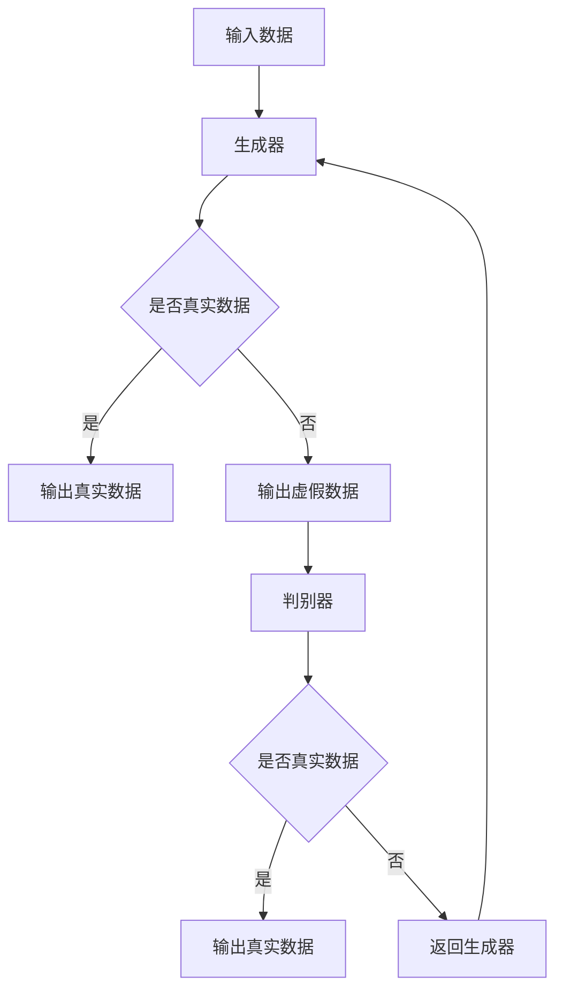
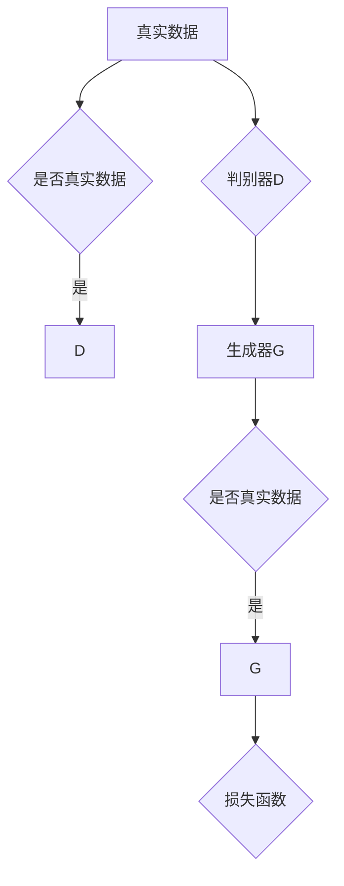

                 

# 第十四章：高级主题：生成式人工智能

## 关键词

- 生成式人工智能
- 图像生成
- 文本生成
- 语音合成
- 生成对抗网络（GAN）
- 随机梯度下降（SGD）
- 变分自编码器（VAE）

## 摘要

生成式人工智能作为人工智能领域的核心研究方向，正引领着科技的发展。本文深入探讨了生成式人工智能的概念、核心原理和应用实例，包括生成对抗网络（GAN）、随机梯度下降（SGD）和变分自编码器（VAE）等关键技术的介绍。同时，本文还展示了生成式人工智能在图像、文本和语音合成等领域的实际应用，并对其未来发展进行了展望。通过本文的阅读，读者将全面了解生成式人工智能的精髓，为未来的研究与应用奠定基础。

## 目录大纲

### 第1节 生成式人工智能概述

#### 14.1.1 生成式人工智能的基本概念

生成式人工智能是指能够生成与真实世界数据具有相似特征的新数据的人工智能模型。它与判别式人工智能相对，后者主要用于分类和识别任务。

#### 14.1.2 生成式人工智能的发展历程

生成式人工智能的研究起源于概率模型和统计学方法。20世纪80年代，生成对抗网络（GAN）的概念被提出，开启了生成式人工智能的新纪元。近年来，随着深度学习技术的不断发展，生成式人工智能取得了显著的进步。

#### 14.1.3 生成式人工智能的应用领域

生成式人工智能在图像、文本、语音等领域具有广泛的应用，如图像生成、文本生成、语音合成等。此外，生成式人工智能在娱乐、艺术、科技和医疗等众多行业中也发挥着重要作用。

### 第2节 生成式人工智能的核心原理

#### 14.2.1 生成式模型的基本架构

生成式模型通常由一个生成器（Generator）和一个判别器（Discriminator）组成。生成器负责生成与真实数据相似的新数据，判别器则用于区分生成的数据和真实数据。

#### 14.2.2 生成对抗网络（GAN）

生成对抗网络（GAN）是一种基于博弈理论的生成式模型。GAN的基本原理是通过生成器和判别器的不断对抗，逐步提高生成器生成数据的真实度。

##### 14.2.2.1 GAN的基本原理

GAN由生成器和判别器组成，生成器G生成虚假数据，判别器D判断数据是真实还是虚假。训练过程中，生成器和判别器交替进行优化，使得判别器能够更好地区分真实数据和虚假数据，同时生成器能够生成更加真实的数据。

##### 14.2.2.2 GAN的变体与应用

GAN具有多种变体，如深度GAN（DeepGAN）、条件GAN（cGAN）、多生成器GAN（MGAN）等。这些变体在不同应用场景中具有各自的优势。

#### 14.2.3 生成式模型训练算法

生成式模型的训练算法主要包括随机梯度下降（SGD）和变分自编码器（VAE）等。

##### 14.2.3.1 随机梯度下降（SGD）

随机梯度下降（SGD）是一种常用的优化算法，用于优化生成器和判别器的参数。

##### 14.2.3.2 变分自编码器（VAE）

变分自编码器（VAE）是一种基于深度学习的生成式模型，通过引入潜在变量来提高生成质量。

#### 14.2.4 生成式模型的评估指标

生成式模型的评估指标主要包括生成质量评估和输出多样性评估等。

##### 14.2.4.1 生成质量评估

生成质量评估用于衡量生成器生成数据的真实度，常用的评估指标包括反事实损失、均方误差（MSE）等。

##### 14.2.4.2 输出多样性评估

输出多样性评估用于衡量生成器生成数据的多样性，常用的评估指标包括熵、互信息等。

### 第3节 生成式人工智能应用实例

#### 14.3.1 图像生成

图像生成是生成式人工智能的重要应用领域。本文介绍了StyleGAN2和DALL-E等典型图像生成模型。

##### 14.3.1.1 StyleGAN2

StyleGAN2是一种基于GAN的图像生成模型，具有出色的生成质量和灵活性。

##### 14.3.1.2 DALL-E

DALL-E是一种基于GAN的文本到图像生成模型，可以将自然语言描述生成为相应的图像。

#### 14.3.2 文本生成

文本生成是生成式人工智能的另一个重要应用领域。本文介绍了GPT-3和ChatGPT等典型文本生成模型。

##### 14.3.2.1 GPT-3

GPT-3是一种基于深度学习的文本生成模型，具有强大的生成能力和理解能力。

##### 14.3.2.2 ChatGPT

ChatGPT是一种基于GPT-3的聊天机器人模型，可以与人类进行自然对话。

#### 14.3.3 语音合成

语音合成是生成式人工智能在语音领域的应用。本文介绍了Tacotron 2和WavGlow等典型语音合成模型。

##### 14.3.3.1 Tacotron 2

Tacotron 2是一种基于深度学习的文本到语音合成模型，具有出色的语音质量和流畅度。

##### 14.3.3.2 WavGlow

WavGlow是一种基于生成对抗网络的语音合成模型，可以生成高质量、自然的语音。

### 第4节 生成式人工智能在行业中的应用

#### 14.4.1 娱乐与艺术

生成式人工智能在娱乐与艺术领域具有广泛的应用，如数字艺术创作和视频特效生成等。

##### 14.4.1.1 数字艺术创作

数字艺术创作利用生成式人工智能生成独特的艺术作品，丰富了艺术创作的形式和内容。

##### 14.4.1.2 视频特效生成

视频特效生成利用生成式人工智能生成逼真的特效，提升了视频制作的质量和效果。

#### 14.4.2 科技与工程

生成式人工智能在科技与工程领域具有广泛的应用，如模型自动化和数据增强等。

##### 14.4.2.1 模型自动化

模型自动化利用生成式人工智能自动生成机器学习模型，提高了模型开发的效率和准确性。

##### 14.4.2.2 数据增强

数据增强利用生成式人工智能生成与真实数据相似的新数据，提高了模型在训练过程中的泛化能力。

#### 14.4.3 医疗与健康

生成式人工智能在医疗与健康领域具有广泛的应用，如医学图像生成和个性化医疗方案生成等。

##### 14.4.3.1 医学图像生成

医学图像生成利用生成式人工智能生成高质量的医学图像，辅助医生进行诊断和治疗。

##### 14.4.3.2 个性化医疗方案生成

个性化医疗方案生成利用生成式人工智能为患者生成个性化的医疗方案，提高了医疗服务的质量和效率。

### 第5节 生成式人工智能的未来发展趋势

#### 14.5.1 技术进步与挑战

生成式人工智能在技术进步和挑战方面面临诸多问题，如计算资源需求、隐私与伦理问题等。

##### 14.5.1.1 计算资源需求

生成式人工智能模型的训练和推理过程需要大量的计算资源，对硬件设备提出了较高的要求。

##### 14.5.1.2 隐私与伦理问题

生成式人工智能在隐私保护和伦理方面存在一定的问题，需要加强对这些问题的关注和解决。

#### 14.5.2 未来应用场景展望

未来生成式人工智能将在更多领域得到广泛应用，如自动内容生成、人工智能创作力提升等。

##### 14.5.2.1 自动内容生成

自动内容生成将利用生成式人工智能生成高质量、个性化的内容，满足用户多样化的需求。

##### 14.5.2.2 人工智能创作力提升

人工智能创作力提升将利用生成式人工智能提高人类在艺术、科技等领域的创作能力。

### 附录：生成式人工智能资源与工具

#### 附录1：主流生成式模型框架

- TensorFlow
- PyTorch
- 其他生成式模型框架

#### 附录2：生成式人工智能开源资源

- 数据集
- 论文与文献
- 社区与论坛

#### 附录3：生成式人工智能工具与平台

- Cloud平台
- 开源工具
- 商业工具与平台

## 第1节 生成式人工智能概述

### 14.1.1 生成式人工智能的基本概念

生成式人工智能（Generative Artificial Intelligence，简称GAI）是人工智能领域的一个重要研究方向，它致力于让机器具备生成与真实世界相似的新数据的能力。与判别式人工智能（Discriminative Artificial Intelligence）不同，后者主要用于分类和识别任务，生成式人工智能则关注于生成新的、未出现过的数据。

在生成式人工智能中，模型需要学习输入数据的概率分布，从而能够生成与输入数据具有相似特征的新数据。这种能力在许多实际应用中具有重要意义，如图像生成、文本生成、语音合成等。

生成式人工智能的基本概念包括以下几点：

1. **概率分布**：生成式人工智能模型需要学习输入数据的概率分布，以便能够生成符合该分布的新数据。

2. **生成器（Generator）**：生成器是生成式人工智能模型中的一个关键组件，它负责生成与输入数据具有相似特征的新数据。

3. **判别器（Discriminator）**：判别器是生成式人工智能模型中的另一个关键组件，它负责判断生成器生成的数据是真实数据还是虚假数据。

4. **对抗训练**：生成器和判别器在生成式人工智能模型中通过对抗训练进行优化，使得生成器能够生成更加真实的数据，判别器能够更好地区分真实数据和虚假数据。

### 14.1.2 生成式人工智能的发展历程

生成式人工智能的研究可以追溯到20世纪80年代。当时，研究人员开始探索如何让机器生成新的、与输入数据相似的数据。这一时期，概率模型和统计学方法成为了生成式人工智能的主要研究手段。

1. **概率模型**：早期的研究主要集中在概率模型上，如马尔可夫模型、隐马尔可夫模型（HMM）和变分自编码器（VAE）等。这些模型在生成与输入数据相似的新数据方面取得了显著的成果。

2. **生成对抗网络（GAN）**：2004年，Ian Goodfellow等人提出了生成对抗网络（GAN）的概念。GAN是一种基于博弈理论的生成式模型，它由生成器和判别器组成。生成器生成虚假数据，判别器判断数据是真实还是虚假。通过生成器和判别器的对抗训练，生成器逐步提高生成数据的真实度。GAN的出现标志着生成式人工智能进入了一个新的发展阶段。

3. **深度学习**：近年来，随着深度学习技术的发展，生成式人工智能取得了显著的进步。深度生成模型，如深度卷积生成网络（DCGAN）、StyleGAN等，在生成质量、灵活性和应用场景方面都取得了重大突破。

### 14.1.3 生成式人工智能的应用领域

生成式人工智能在多个领域具有广泛的应用，以下列举了一些典型的应用领域：

1. **图像生成**：生成式人工智能在图像生成领域取得了显著成果。通过训练生成模型，可以生成与输入图像具有相似特征的新图像。例如，StyleGAN2和DALL-E等模型可以生成高质量、多样化的图像。

2. **文本生成**：生成式人工智能在文本生成领域也具有广泛的应用。通过训练生成模型，可以生成与输入文本具有相似特征的文本。例如，GPT-3和ChatGPT等模型可以生成高质量的文本。

3. **语音合成**：生成式人工智能在语音合成领域取得了重要进展。通过训练生成模型，可以生成与输入语音具有相似特征的语音。例如，Tacotron 2和WavGlow等模型可以生成高质量、自然的语音。

4. **娱乐与艺术**：生成式人工智能在娱乐与艺术领域也具有广泛的应用。通过训练生成模型，可以生成独特的艺术作品和视频特效。例如，数字艺术创作和视频特效生成等。

5. **科技与工程**：生成式人工智能在科技与工程领域也具有广泛的应用。通过训练生成模型，可以自动化模型开发、数据增强等。例如，模型自动化和数据增强等。

6. **医疗与健康**：生成式人工智能在医疗与健康领域也具有广泛的应用。通过训练生成模型，可以生成高质量的医学图像和个性化医疗方案。例如，医学图像生成和个性化医疗方案生成等。

总之，生成式人工智能在多个领域具有广泛的应用前景，随着技术的不断发展，它将在更多领域发挥重要作用。

## 第2节 生成式人工智能的核心原理

### 14.2.1 生成式模型的基本架构

生成式模型（Generative Model）是一种用于生成与输入数据具有相似特征的新数据的模型。在生成式模型中，模型需要学习输入数据的概率分布，从而能够生成符合该分布的新数据。生成式模型的基本架构通常包括生成器（Generator）和判别器（Discriminator）两个组件。

1. **生成器（Generator）**：生成器是生成式模型中的一个关键组件，它负责生成与输入数据具有相似特征的新数据。生成器的输入可以是随机噪声或其他辅助信息，输出是生成的新数据。生成器的目的是通过学习输入数据的概率分布，从而生成符合该分布的新数据。

2. **判别器（Discriminator）**：判别器是生成式模型中的另一个关键组件，它负责判断生成的新数据是真实数据还是虚假数据。判别器的输入是真实数据和生成数据，输出是判断结果。判别器的目的是通过学习输入数据的概率分布，从而能够准确地判断输入数据是真实数据还是虚假数据。

生成式模型的基本架构可以通过以下Mermaid流程图来表示：



### 14.2.2 生成对抗网络（GAN）

生成对抗网络（Generative Adversarial Network，简称GAN）是一种基于博弈理论的生成式模型。GAN由生成器和判别器组成，生成器和判别器通过对抗训练（Adversarial Training）进行优化。GAN的基本原理是通过生成器和判别器的不断对抗，逐步提高生成器生成数据的真实度。

#### 14.2.2.1 GAN的基本原理

GAN由生成器和判别器组成，生成器和判别器通过对抗训练进行优化。对抗训练的过程可以描述为：

1. **生成器G**：生成器G的目的是生成与真实数据相似的新数据。生成器的输入可以是随机噪声或其他辅助信息，输出是生成的新数据。

2. **判别器D**：判别器D的目的是判断生成的新数据是真实数据还是虚假数据。判别器的输入是真实数据和生成数据，输出是判断结果。

3. **对抗训练**：在对抗训练过程中，生成器和判别器交替进行优化。生成器的目标是使判别器无法准确地区分生成数据是真实数据还是虚假数据。判别器的目标是使判别器能够准确地判断生成数据是真实数据还是虚假数据。

GAN的基本原理可以通过以下Mermaid流程图来表示：



在对抗训练过程中，生成器和判别器的优化目标可以表示为：

- 生成器的优化目标：最小化判别器判断生成数据是虚假数据的概率。
- 判别器的优化目标：最大化判别器判断生成数据是虚假数据的概率。

通过交替优化生成器和判别器，生成器逐步提高生成数据的真实度，判别器逐步提高对生成数据的识别能力。

#### 14.2.2.2 GAN的变体与应用

GAN具有多种变体，以满足不同应用场景的需求。以下列举几种常见的GAN变体及其应用：

1. **深度GAN（DeepGAN）**：深度GAN（Deep Generative Adversarial Network）是GAN的一种变体，它引入了深度神经网络来提高生成质量。深度GAN通常使用多层神经网络作为生成器和判别器，以实现更复杂的生成任务。

2. **条件GAN（cGAN）**：条件GAN（Conditional Generative Adversarial Network）是一种在GAN基础上引入条件信息的变体。在cGAN中，生成器的输入不仅包括随机噪声，还包括某些条件信息（如标签、文本等），从而能够生成更具有特定特征的数据。例如，cGAN可以生成与输入标签具有相似特征的新图像。

3. **多生成器GAN（MGAN）**：多生成器GAN（Multi-Generator Generative Adversarial Network）是一种在GAN基础上引入多个生成器的变体。在MGAN中，多个生成器分别生成不同类型的数据，判别器需要同时判断多个生成器的生成数据。MGAN可以用于多模态数据的生成，如图像和文本的联合生成。

4. **风格迁移GAN（Style Transfer GAN）**：风格迁移GAN（Style Transfer Generative Adversarial Network）是一种用于图像风格迁移的GAN变体。在风格迁移GAN中，生成器不仅需要生成与输入图像具有相似内容的新图像，还需要保持输入图像的风格特征。风格迁移GAN可以用于将一种图像风格应用到另一张图像上，如将普通照片转换为艺术画作的风格。

5. **文本到图像GAN（Text-to-Image GAN）**：文本到图像GAN（Text-to-Image Generative Adversarial Network）是一种将自然语言描述转换为图像的GAN变体。在文本到图像GAN中，生成器的输入是文本描述，输出是相应的图像。文本到图像GAN可以用于自动生成与输入文本描述具有相似图像内容的新图像。

### 14.2.3 生成式模型训练算法

生成式模型的训练算法是生成式人工智能的核心组成部分。以下介绍几种常见的生成式模型训练算法：

#### 14.2.3.1 随机梯度下降（SGD）

随机梯度下降（Stochastic Gradient Descent，简称SGD）是一种常见的优化算法，用于优化生成式模型的参数。在SGD中，每次迭代过程中，随机选择一部分训练数据，计算梯度并更新模型参数。

SGD的优化目标是最小化损失函数，损失函数通常定义为模型预测值与真实值之间的差异。SGD的基本步骤如下：

1. 初始化模型参数。
2. 对于每个训练样本，计算模型预测值和真实值之间的差异，得到损失函数值。
3. 计算损失函数关于模型参数的梯度。
4. 使用梯度更新模型参数。
5. 重复步骤2-4，直到达到预设的迭代次数或损失函数值收敛。

SGD的伪代码如下：

```python
# 初始化模型参数
params = initialize_params()

# 预设迭代次数
num_iterations = 1000

# 损失函数
loss_function = compute_loss

# 梯度计算函数
gradient_function = compute_gradient

# 更新参数函数
update_params = update_params_with_gradient

# 迭代更新参数
for i in range(num_iterations):
    # 随机选择训练样本
    sample = random_choice(training_data)

    # 计算模型预测值和损失函数值
    prediction = model.predict(sample)
    loss = loss_function(prediction, sample)

    # 计算梯度
    gradient = gradient_function(loss, params)

    # 更新参数
    params = update_params(params, gradient)

# 输出训练后的模型参数
output_params(params)
```

#### 14.2.3.2 变分自编码器（VAE）

变分自编码器（Variational Autoencoder，简称VAE）是一种基于深度学习的生成式模型。VAE通过引入潜在变量（Latent Variable）来提高生成质量。VAE的基本架构包括编码器（Encoder）和解码器（Decoder）。

1. **编码器（Encoder）**：编码器将输入数据映射到潜在空间，潜在空间中的点表示输入数据的概率分布。编码器的输出是潜在变量的均值和方差。

2. **解码器（Decoder）**：解码器将潜在空间中的点映射回输入空间，生成与输入数据具有相似特征的新数据。解码器的输入是潜在变量，输出是生成数据。

VAE的损失函数由两部分组成：数据重构损失和KL散度损失。

- **数据重构损失**：数据重构损失衡量解码器生成的数据与输入数据之间的差异。常用的数据重构损失函数有均方误差（MSE）和交叉熵（Cross-Entropy）等。
- **KL散度损失**：KL散度损失衡量潜在变量的概率分布与先验分布之间的差异。KL散度损失用于保持潜在变量的概率分布的稳定性。

VAE的优化目标是最小化数据重构损失和KL散度损失的总和。

VAE的伪代码如下：

```python
# 初始化模型参数
params = initialize_params()

# 预设迭代次数
num_iterations = 1000

# 数据重构损失函数
reconstruction_loss_function = compute_reconstruction_loss

# KL散度损失函数
kl_divergence_loss_function = compute_kl_divergence_loss

# 编码器和解码器的预测函数
encode = encode_function
decode = decode_function

# 参数更新函数
update_params = update_params_with_gradient

# 迭代更新参数
for i in range(num_iterations):
    # 随机选择训练样本
    sample = random_choice(training_data)

    # 编码和生成数据
    latent_variables = encode(sample)
    generated_data = decode(latent_variables)

    # 计算损失函数值
    reconstruction_loss = reconstruction_loss_function(generated_data, sample)
    kl_divergence_loss = kl_divergence_loss_function(latent_variables)

    # 计算总损失函数
    total_loss = reconstruction_loss + kl_divergence_loss

    # 计算梯度
    gradient = compute_gradient(total_loss, params)

    # 更新参数
    params = update_params(params, gradient)

# 输出训练后的模型参数
output_params(params)
```

### 14.2.4 生成式模型的评估指标

生成式模型的评估指标是衡量生成式模型性能的重要手段。以下介绍几种常见的评估指标：

#### 14.2.4.1 生成质量评估

生成质量评估用于衡量生成器生成数据的真实度。以下列举几种常见的生成质量评估指标：

1. **反事实损失（Adversarial Loss）**：反事实损失衡量生成器生成数据在判别器中的判断结果。反事实损失的值越小，表示生成数据越真实。

2. **均方误差（Mean Squared Error，简称MSE）**：均方误差衡量生成数据与真实数据之间的差异。均方误差的值越小，表示生成数据越真实。

3. **交叉熵（Cross-Entropy）**：交叉熵衡量生成数据与真实数据之间的差异。交叉熵的值越小，表示生成数据越真实。

#### 14.2.4.2 输出多样性评估

输出多样性评估用于衡量生成器生成数据的多样性。以下列举几种常见的输出多样性评估指标：

1. **熵（Entropy）**：熵衡量生成数据的多样性。熵的值越大，表示生成数据的多样性越高。

2. **互信息（Mutual Information，简称MI）**：互信息衡量生成数据与输入数据之间的相关性。互信息的值越大，表示生成数据的多样性越高。

3. **多样性损失（Diversity Loss）**：多样性损失衡量生成数据之间的相似度。多样性损失的值越小，表示生成数据的多样性越高。

## 第3节 生成式人工智能应用实例

### 14.3.1 图像生成

图像生成是生成式人工智能的一个重要应用领域。通过训练生成模型，可以生成与输入图像具有相似特征的新图像。以下介绍几种典型的图像生成模型及其应用。

#### 14.3.1.1 StyleGAN2

StyleGAN2是一种基于生成对抗网络（GAN）的图像生成模型。它具有出色的生成质量和灵活性，可以生成高质量、多样化的图像。StyleGAN2的生成过程包括以下步骤：

1. **生成器**：生成器生成与输入图像具有相似特征的新图像。生成器的输入是随机噪声和风格特征，输出是生成图像。
2. **判别器**：判别器判断生成图像是真实图像还是虚假图像。判别器的输入是真实图像和生成图像，输出是判断结果。
3. **对抗训练**：生成器和判别器通过对抗训练进行优化，使得生成器能够生成更加真实、多样化的图像。

StyleGAN2的生成过程可以通过以下伪代码表示：

```python
# 初始化生成器和判别器参数
generator_params = initialize_generator_params()
discriminator_params = initialize_discriminator_params()

# 预设迭代次数
num_iterations = 10000

# 生成器和判别器的损失函数
generator_loss_function = compute_generator_loss
discriminator_loss_function = compute_discriminator_loss

# 参数更新函数
update_generator_params = update_generator_with_gradient
update_discriminator_params = update_discriminator_with_gradient

# 迭代更新参数
for i in range(num_iterations):
    # 随机选择真实图像
    real_image = random_choice(real_images)

    # 生成虚假图像
    fake_image = generator.generate(random_noise, style_features)

    # 计算判别器的损失函数
    discriminator_loss = discriminator_loss_function(discriminator, real_image, fake_image)

    # 计算生成器的损失函数
    generator_loss = generator_loss_function(generator, fake_image)

    # 计算总损失函数
    total_loss = discriminator_loss + generator_loss

    # 计算梯度
    generator_gradient = compute_generator_gradient(total_loss, generator_params)
    discriminator_gradient = compute_discriminator_gradient(total_loss, discriminator_params)

    # 更新生成器和判别器的参数
    generator_params = update_generator_params(generator_params, generator_gradient)
    discriminator_params = update_discriminator_params(discriminator_params, discriminator_gradient)

# 输出训练后的生成器和判别器参数
output_generator_params(generator_params)
output_discriminator_params(discriminator_params)
```

StyleGAN2的应用案例包括数字艺术创作、游戏开发、虚拟现实等领域。通过StyleGAN2，可以生成高质量、个性化的图像，为创意和娱乐产业提供更多可能性。

#### 14.3.1.2 DALL-E

DALL-E是一种基于生成对抗网络（GAN）的文本到图像生成模型。它可以将自然语言描述转换为相应的图像。DALL-E的生成过程包括以下步骤：

1. **文本编码器**：文本编码器将自然语言描述编码为向量表示。
2. **生成器**：生成器生成与输入文本描述具有相似特征的新图像。生成器的输入是文本编码器的输出和随机噪声，输出是生成图像。
3. **判别器**：判别器判断生成图像是真实图像还是虚假图像。判别器的输入是真实图像和生成图像，输出是判断结果。
4. **对抗训练**：生成器和判别器通过对抗训练进行优化，使得生成器能够生成更加真实、多样化的图像。

DALL-E的生成过程可以通过以下伪代码表示：

```python
# 初始化文本编码器、生成器和判别器参数
text_encoder_params = initialize_text_encoder_params()
generator_params = initialize_generator_params()
discriminator_params = initialize_discriminator_params()

# 预设迭代次数
num_iterations = 10000

# 文本编码器、生成器和判别器的损失函数
text_encoder_loss_function = compute_text_encoder_loss
generator_loss_function = compute_generator_loss
discriminator_loss_function = compute_discriminator_loss

# 参数更新函数
update_text_encoder_params = update_text_encoder_with_gradient
update_generator_params = update_generator_with_gradient
update_discriminator_params = update_discriminator_with_gradient

# 迭代更新参数
for i in range(num_iterations):
    # 随机选择真实文本描述
    real_text = random_choice(real_texts)

    # 编码文本描述
    text_vector = text_encoder.encode(real_text)

    # 生成虚假图像
    fake_image = generator.generate(text_vector, random_noise)

    # 计算判别器的损失函数
    discriminator_loss = discriminator_loss_function(discriminator, real_images, fake_image)

    # 计算生成器的损失函数
    generator_loss = generator_loss_function(generator, fake_image)

    # 计算总损失函数
    total_loss = discriminator_loss + generator_loss

    # 计算梯度
    text_encoder_gradient = compute_text_encoder_gradient(total_loss, text_encoder_params)
    generator_gradient = compute_generator_gradient(total_loss, generator_params)
    discriminator_gradient = compute_discriminator_gradient(total_loss, discriminator_params)

    # 更新文本编码器、生成器和判别器的参数
    text_encoder_params = update_text_encoder_params(text_encoder_params, text_encoder_gradient)
    generator_params = update_generator_params(generator_params, generator_gradient)
    discriminator_params = update_discriminator_params(discriminator_params, discriminator_gradient)

# 输出训练后的文本编码器、生成器和判别器参数
output_text_encoder_params(text_encoder_params)
output_generator_params(generator_params)
output_discriminator_params(discriminator_params)
```

DALL-E的应用案例包括自动内容生成、图像编辑和虚拟现实等领域。通过DALL-E，可以生成与自然语言描述具有相似图像内容的图像，为创意和娱乐产业提供更多可能性。

### 14.3.2 文本生成

文本生成是生成式人工智能的另一个重要应用领域。通过训练生成模型，可以生成与输入文本具有相似特征的新文本。以下介绍几种典型的文本生成模型及其应用。

#### 14.3.2.1 GPT-3

GPT-3（Generative Pre-trained Transformer 3）是一种基于变换器（Transformer）的文本生成模型。它具有强大的生成能力和理解能力，可以生成高质量、多样化的文本。GPT-3的生成过程包括以下步骤：

1. **编码器**：编码器将输入文本编码为向量表示。
2. **解码器**：解码器生成与输入文本具有相似特征的新文本。解码器的输入是编码器的输出和前一个时间步的文本，输出是生成文本。
3. **生成过程**：生成过程包括预测下一个时间步的文本，并更新解码器的输入。生成过程重复进行，直到生成完成或达到预设的长度。

GPT-3的生成过程可以通过以下伪代码表示：

```python
# 初始化编码器和解码器参数
encoder_params = initialize_encoder_params()
decoder_params = initialize_decoder_params()

# 预设迭代次数
num_iterations = 10000

# 编码器和解码器的损失函数
encoder_loss_function = compute_encoder_loss
decoder_loss_function = compute_decoder_loss

# 参数更新函数
update_encoder_params = update_encoder_with_gradient
update_decoder_params = update_decoder_with_gradient

# 迭代更新参数
for i in range(num_iterations):
    # 随机选择真实文本
    real_text = random_choice(real_texts)

    # 编码文本
    text_vector = encoder.encode(real_text)

    # 初始化解码器的输入
    decoder_input = initialize_decoder_input(text_vector)

    # 生成文本
    generated_text = ""
    while not generated_text.is_end():
        # 预测下一个时间步的文本
        next_text = decoder.predict(decoder_input)

        # 更新解码器的输入
        decoder_input = update_decoder_input(decoder_input, next_text)

        # 添加生成的文本
        generated_text += next_text

    # 计算编码器和解码器的损失函数
    encoder_loss = encoder_loss_function(encoder, real_text)
    decoder_loss = decoder_loss_function(decoder, generated_text)

    # 计算总损失函数
    total_loss = encoder_loss + decoder_loss

    # 计算梯度
    encoder_gradient = compute_encoder_gradient(total_loss, encoder_params)
    decoder_gradient = compute_decoder_gradient(total_loss, decoder_params)

    # 更新编码器和解码器的参数
    encoder_params = update_encoder_params(encoder_params, encoder_gradient)
    decoder_params = update_decoder_params(decoder_params, decoder_gradient)

# 输出训练后的编码器和解码器参数
output_encoder_params(encoder_params)
output_decoder_params(decoder_params)
```

GPT-3的应用案例包括自动内容生成、问答系统、对话系统等领域。通过GPT-3，可以生成高质量、多样化的文本，为各种应用场景提供丰富的可能性。

#### 14.3.2.2 ChatGPT

ChatGPT是一种基于GPT-3的聊天机器人模型。它可以通过训练生成与输入文本具有相似特征的新文本，实现与人类进行自然对话。ChatGPT的生成过程包括以下步骤：

1. **编码器**：编码器将输入文本编码为向量表示。
2. **解码器**：解码器生成与输入文本具有相似特征的新文本。解码器的输入是编码器的输出和前一个时间步的文本，输出是生成文本。
3. **对话生成过程**：对话生成过程包括接收用户输入、生成回复文本，并更新解码器的输入。对话生成过程重复进行，直到达到预设的对话长度或用户终止对话。

ChatGPT的生成过程可以通过以下伪代码表示：

```python
# 初始化编码器和解码器参数
encoder_params = initialize_encoder_params()
decoder_params = initialize_decoder_params()

# 预设迭代次数
num_iterations = 10000

# 编码器和解码器的损失函数
encoder_loss_function = compute_encoder_loss
decoder_loss_function = compute_decoder_loss

# 参数更新函数
update_encoder_params = update_encoder_with_gradient
update_decoder_params = update_decoder_with_gradient

# 初始化对话状态
dialog_state = initialize_dialog_state()

# 迭代更新参数
for i in range(num_iterations):
    # 接收用户输入
    user_input = get_user_input()

    # 编码用户输入
    user_input_vector = encoder.encode(user_input)

    # 初始化解码器的输入
    decoder_input = initialize_decoder_input(user_input_vector)

    # 生成回复文本
    response = ""
    while not response.is_end():
        # 预测下一个时间步的文本
        next_response = decoder.predict(decoder_input)

        # 更新解码器的输入
        decoder_input = update_decoder_input(decoder_input, next_response)

        # 添加生成的文本
        response += next_response

    # 更新对话状态
    dialog_state = update_dialog_state(dialog_state, user_input, response)

    # 计算编码器和解码器的损失函数
    encoder_loss = encoder_loss_function(encoder, user_input_vector)
    decoder_loss = decoder_loss_function(decoder, response)

    # 计算总损失函数
    total_loss = encoder_loss + decoder_loss

    # 计算梯度
    encoder_gradient = compute_encoder_gradient(total_loss, encoder_params)
    decoder_gradient = compute_decoder_gradient(total_loss, decoder_params)

    # 更新编码器和解码器的参数
    encoder_params = update_encoder_params(encoder_params, encoder_gradient)
    decoder_params = update_decoder_params(decoder_params, decoder_gradient)

# 输出训练后的编码器和解码器参数
output_encoder_params(encoder_params)
output_decoder_params(decoder_params)
```

ChatGPT的应用案例包括在线客服、智能助手、虚拟角色等领域。通过ChatGPT，可以生成高质量、自然的对话文本，为各种应用场景提供智能对话能力。

### 14.3.3 语音合成

语音合成是生成式人工智能在语音领域的应用。通过训练生成模型，可以生成与输入语音具有相似特征的语音。以下介绍几种典型的语音合成模型及其应用。

#### 14.3.3.1 Tacotron 2

Tacotron 2是一种基于深度学习的文本到语音合成模型。它具有出色的语音质量和流畅度，可以生成高质量、自然的语音。Tacotron 2的生成过程包括以下步骤：

1. **编码器**：编码器将输入文本编码为向量表示。
2. **前馈网络**：前馈网络将编码器的输出映射到声码器（WaveNet）的输入。
3. **声码器**：声码器将前馈网络的输出映射到语音信号。

Tacotron 2的生成过程可以通过以下伪代码表示：

```python
# 初始化编码器和前馈网络参数
encoder_params = initialize_encoder_params()
feedforward_network_params = initialize_feedforward_network_params()

# 预设迭代次数
num_iterations = 10000

# 编码器、前馈网络和声码器的损失函数
encoder_loss_function = compute_encoder_loss
feedforward_network_loss_function = compute_feedforward_network_loss
wave_net_loss_function = compute_wave_net_loss

# 参数更新函数
update_encoder_params = update_encoder_with_gradient
update_feedforward_network_params = update_feedforward_network_with_gradient
update_wave_net_params = update_wave_net_with_gradient

# 迭代更新参数
for i in range(num_iterations):
    # 随机选择真实文本
    real_text = random_choice(real_texts)

    # 编码文本
    text_vector = encoder.encode(real_text)

    # 生成声码器的输入
    wave_net_input = feedforward_network.generate(text_vector)

    # 生成语音信号
    audio_signal = wave_net.generate(wave_net_input)

    # 计算编码器、前馈网络和声码器的损失函数
    encoder_loss = encoder_loss_function(encoder, real_text)
    feedforward_network_loss = feedforward_network_loss_function(feedforward_network, text_vector)
    wave_net_loss = wave_net_loss_function(wave_net, audio_signal)

    # 计算总损失函数
    total_loss = encoder_loss + feedforward_network_loss + wave_net_loss

    # 计算梯度
    encoder_gradient = compute_encoder_gradient(total_loss, encoder_params)
    feedforward_network_gradient = compute_feedforward_network_gradient(total_loss, feedforward_network_params)
    wave_net_gradient = compute_wave_net_gradient(total_loss, wave_net_params)

    # 更新编码器、前馈网络和声码器的参数
    encoder_params = update_encoder_params(encoder_params, encoder_gradient)
    feedforward_network_params = update_feedforward_network_params(feedforward_network_params, feedforward_network_gradient)
    wave_net_params = update_wave_net_params(wave_net_params, wave_net_gradient)

# 输出训练后的编码器、前馈网络和声码器参数
output_encoder_params(encoder_params)
output_feedforward_network_params(feedforward_network_params)
output_wave_net_params(wave_net_params)
```

Tacotron 2的应用案例包括自动语音合成、智能助手和语音识别等领域。通过Tacotron 2，可以生成高质量、自然的语音，为各种应用场景提供语音合成能力。

#### 14.3.3.2 WavGlow

WavGlow是一种基于生成对抗网络（GAN）的语音合成模型。它具有高质量的语音生成能力，可以生成与输入语音具有相似特征的语音。WavGlow的生成过程包括以下步骤：

1. **生成器**：生成器将输入文本编码为向量表示，并生成与输入语音具有相似特征的语音。
2. **判别器**：判别器判断生成语音是真实语音还是虚假语音。
3. **对抗训练**：生成器和判别器通过对抗训练进行优化，使得生成器能够生成更加真实、高质量的语音。

WavGlow的生成过程可以通过以下伪代码表示：

```python
# 初始化生成器和判别器参数
generator_params = initialize_generator_params()
discriminator_params = initialize_discriminator_params()

# 预设迭代次数
num_iterations = 10000

# 生成器和判别器的损失函数
generator_loss_function = compute_generator_loss
discriminator_loss_function = compute_discriminator_loss

# 参数更新函数
update_generator_params = update_generator_with_gradient
update_discriminator_params = update_discriminator_with_gradient

# 迭代更新参数
for i in range(num_iterations):
    # 随机选择真实语音
    real_audio = random_choice(real_audios)

    # 编码文本
    text_vector = encoder.encode(real_text)

    # 生成虚假语音
    fake_audio = generator.generate(text_vector)

    # 计算判别器的损失函数
    discriminator_loss = discriminator_loss_function(discriminator, real_audio, fake_audio)

    # 计算生成器的损失函数
    generator_loss = generator_loss_function(generator, fake_audio)

    # 计算总损失函数
    total_loss = discriminator_loss + generator_loss

    # 计算梯度
    generator_gradient = compute_generator_gradient(total_loss, generator_params)
    discriminator_gradient = compute_discriminator_gradient(total_loss, discriminator_params)

    # 更新生成器和判别器的参数
    generator_params = update_generator_params(generator_params, generator_gradient)
    discriminator_params = update_discriminator_params(discriminator_params, discriminator_gradient)

# 输出训练后的生成器和判别器参数
output_generator_params(generator_params)
output_discriminator_params(discriminator_params)
```

WavGlow的应用案例包括自动语音合成、语音助手和语音识别等领域。通过WavGlow，可以生成高质量、自然的语音，为各种应用场景提供语音合成能力。

## 第4节 生成式人工智能在行业中的应用

### 14.4.1 娱乐与艺术

生成式人工智能在娱乐与艺术领域具有广泛的应用。通过训练生成模型，可以生成独特的艺术作品和视频特效。以下介绍生成式人工智能在娱乐与艺术领域的具体应用。

#### 14.4.1.1 数字艺术创作

数字艺术创作是生成式人工智能在娱乐与艺术领域的重要应用。通过训练生成模型，可以生成与输入艺术作品具有相似特征的新艺术作品。例如，StyleGAN2可以生成高质量、多样化的数字艺术作品。数字艺术创作的应用案例包括：

1. **数字艺术展览**：利用生成式人工智能生成独特的艺术作品，举办数字艺术展览，吸引观众。
2. **艺术衍生品设计**：利用生成式人工智能设计独特的艺术衍生品，如T恤、杯子、海报等。
3. **艺术教育**：利用生成式人工智能生成与经典艺术作品具有相似特征的新作品，为学生提供学习素材。

#### 14.4.1.2 视频特效生成

视频特效生成是生成式人工智能在娱乐与艺术领域的另一个重要应用。通过训练生成模型，可以生成与输入视频具有相似特征的新视频特效。例如，DALL-E可以生成与输入视频描述具有相似图像内容的新图像，从而生成独特的视频特效。视频特效生成的应用案例包括：

1. **电影制作**：利用生成式人工智能生成独特的视频特效，提升电影的视觉质量。
2. **游戏开发**：利用生成式人工智能生成游戏中的特效，提高游戏的可玩性和视觉效果。
3. **虚拟现实**：利用生成式人工智能生成虚拟现实中的特效，提升虚拟现实的沉浸感。

### 14.4.2 科技与工程

生成式人工智能在科技与工程领域具有广泛的应用。通过训练生成模型，可以自动化模型开发、数据增强等。以下介绍生成式人工智能在科技与工程领域的具体应用。

#### 14.4.2.1 模型自动化

模型自动化是生成式人工智能在科技与工程领域的重要应用。通过训练生成模型，可以自动化机器学习模型的开发。生成模型可以生成与输入模型具有相似特征的新模型，从而实现模型的快速迭代和优化。模型自动化的应用案例包括：

1. **模型开发**：利用生成式人工智能自动生成机器学习模型，提高模型开发的效率和准确性。
2. **模型优化**：利用生成式人工智能生成与输入模型具有相似特征的新模型，从而实现模型的优化和改进。
3. **模型压缩**：利用生成式人工智能生成与输入模型具有相似特征的新模型，从而实现模型的压缩和降低计算成本。

#### 14.4.2.2 数据增强

数据增强是生成式人工智能在科技与工程领域的另一个重要应用。通过训练生成模型，可以生成与输入数据具有相似特征的新数据，从而增加训练数据集的多样性。数据增强的应用案例包括：

1. **图像识别**：利用生成式人工智能生成与输入图像具有相似特征的新图像，从而提高图像识别模型的泛化能力。
2. **语音识别**：利用生成式人工智能生成与输入语音具有相似特征的新语音，从而提高语音识别模型的鲁棒性。
3. **自然语言处理**：利用生成式人工智能生成与输入文本具有相似特征的新文本，从而提高自然语言处理模型的性能。

### 14.4.3 医疗与健康

生成式人工智能在医疗与健康领域具有广泛的应用。通过训练生成模型，可以生成高质量的医学图像和个性化医疗方案。以下介绍生成式人工智能在医疗与健康领域的具体应用。

#### 14.4.3.1 医学图像生成

医学图像生成是生成式人工智能在医疗与健康领域的重要应用。通过训练生成模型，可以生成与输入医学图像具有相似特征的新医学图像。例如，StyleGAN2可以生成高质量、多样化的医学图像。医学图像生成的应用案例包括：

1. **医学诊断**：利用生成式人工智能生成与输入医学图像具有相似特征的模拟图像，从而辅助医生进行医学诊断。
2. **医学教育**：利用生成式人工智能生成与输入医学图像具有相似特征的模拟图像，从而为学生提供学习素材。
3. **医学研究**：利用生成式人工智能生成与输入医学图像具有相似特征的模拟图像，从而为医学研究提供更多数据支持。

#### 14.4.3.2 个性化医疗方案生成

个性化医疗方案生成是生成式人工智能在医疗与健康领域的另一个重要应用。通过训练生成模型，可以生成与输入医疗数据具有相似特征的个性化医疗方案。例如，GPT-3可以生成与输入医疗数据具有相似特征的个性化医疗方案。个性化医疗方案生成的应用案例包括：

1. **疾病预防**：利用生成式人工智能生成与输入健康数据具有相似特征的疾病预防方案，从而帮助用户预防疾病。
2. **疾病治疗**：利用生成式人工智能生成与输入疾病数据具有相似特征的治疗方案，从而为医生提供治疗方案参考。
3. **健康评估**：利用生成式人工智能生成与输入健康数据具有相似特征的健康评估报告，从而帮助用户了解健康状况。

## 第5节 生成式人工智能的未来发展趋势

### 14.5.1 技术进步与挑战

生成式人工智能作为人工智能领域的重要研究方向，其技术进步和挑战备受关注。以下介绍生成式人工智能在技术进步和挑战方面的几个关键问题。

#### 14.5.1.1 计算资源需求

生成式人工智能模型的训练和推理过程需要大量的计算资源。生成式模型通常包含大量的参数和复杂的网络结构，导致训练过程非常耗时。此外，生成式模型在推理过程中也需要大量的计算资源，以生成高质量、多样化的数据。随着生成式人工智能应用的不断拓展，计算资源需求将不断增加。为此，研究人员和工程师们需要开发更加高效的算法和优化方法，以提高生成式人工智能的计算效率。

#### 14.5.1.2 隐私与伦理问题

生成式人工智能在隐私保护和伦理方面存在一定的问题。生成式模型可以生成与输入数据具有相似特征的新数据，这可能导致隐私泄露和伦理问题。例如，生成式模型可能被用于生成虚假信息、伪造身份等恶意行为。此外，生成式人工智能在医疗、金融等领域的应用可能涉及敏感数据，如何保护这些数据的隐私和安全成为重要挑战。为此，研究人员和工程师们需要开发更加安全和可靠的生成式人工智能系统，以保护用户隐私和数据安全。

#### 14.5.1.3 可解释性和可控性

生成式人工智能的可解释性和可控性是当前研究的热点和挑战之一。生成式模型通常由复杂的神经网络组成，其内部机制难以理解和解释。这可能导致生成式模型产生不可预测和不可控的结果。为了提高生成式人工智能的可解释性和可控性，研究人员和工程师们需要开发更加透明和可解释的生成模型，以便用户更好地理解和控制模型的行为。

#### 14.5.1.4 输出质量和多样性

生成式人工智能在生成输出质量和多样性方面仍存在挑战。尽管生成式模型在生成高质量、多样化的数据方面取得了显著进展，但仍存在一些问题，如生成数据的相似性、重复性和多样性不足等。为此，研究人员和工程师们需要开发更加先进和灵活的生成模型，以提高生成数据的真实性和多样性。

### 14.5.2 未来应用场景展望

生成式人工智能在未来将应用于更多的领域，推动科技和社会的发展。以下介绍几个未来生成式人工智能的应用场景展望。

#### 14.5.2.1 自动内容生成

自动内容生成是生成式人工智能的一个重要应用场景。通过训练生成模型，可以自动化生成高质量的文本、图像、视频等内容。自动内容生成将有助于提高创作效率、降低创作成本，并满足用户多样化的需求。未来，自动内容生成将广泛应用于新闻写作、广告创意、游戏开发、虚拟现实等领域。

#### 14.5.2.2 人工智能创作力提升

生成式人工智能将提高人类在艺术、科技等领域的创作力。通过训练生成模型，可以生成独特的艺术作品、设计作品、科学实验方案等。生成式人工智能将为创意工作者提供更多灵感，帮助他们突破创作瓶颈。未来，人工智能创作力提升将广泛应用于艺术创作、科技创新、产品设计等领域。

#### 14.5.2.3 智能辅助决策

生成式人工智能将有助于智能辅助决策。通过训练生成模型，可以自动化生成与输入数据具有相似特征的决策方案。智能辅助决策将广泛应用于金融、医疗、交通、教育等领域，为人类提供更加科学、合理的决策支持。

#### 14.5.2.4 虚拟现实和增强现实

生成式人工智能将在虚拟现实（VR）和增强现实（AR）领域发挥重要作用。通过训练生成模型，可以自动化生成高质量的虚拟场景、角色动画、环境音效等。虚拟现实和增强现实将变得更加真实、逼真，为用户提供更加沉浸式的体验。

## 附录：生成式人工智能资源与工具

### 附录1：主流生成式模型框架

以下介绍几种主流的生成式模型框架，包括TensorFlow、PyTorch和其他生成式模型框架。

#### 附录1.1 TensorFlow

TensorFlow是Google开发的一种开源机器学习框架，广泛用于构建和训练深度学习模型。TensorFlow提供了丰富的API和工具，方便用户构建生成式模型。以下是一个使用TensorFlow构建简单生成对抗网络（GAN）的示例代码：

```python
import tensorflow as tf
from tensorflow.keras.layers import Dense, Flatten, Reshape
from tensorflow.keras.models import Model

# 定义生成器
def generator(z, num_classes):
    # 前馈神经网络
    x = Dense(7 * 7 * 128, activation="relu", input_shape=(100,), use_bias=False)(z)
    x = Reshape((7, 7, 128))(x)
    x = tf.keras.layers.LeakyReLU()(x)

    # 生成图像
    x = Dense(7 * 7 * 3, activation="tanh", use_bias=False)(x)
    img = Reshape((7, 7, 3))(x)

    # 定义生成模型
    model = Model(z, img)
    model.compile(loss="binary_crossentropy", optimizer=tf.keras.optimizers.Adam())

    return model

# 定义判别器
def discriminator(img, num_classes):
    # 前馈神经网络
    x = Dense(512, activation="relu", input_shape=(28, 28, 1), use_bias=False)(img)
    x = tf.keras.layers.LeakyReLU()(x)

    # 判断图像真实性
    x = Flatten()(x)
    validity = Dense(1, activation="sigmoid")(x)

    # 定义判别模型
    model = Model(img, validity)
    model.compile(loss="binary_crossentropy", optimizer=tf.keras.optimizers.Adam())

    return model
```

#### 附录1.2 PyTorch

PyTorch是Facebook开发的一种开源机器学习框架，广泛用于构建和训练深度学习模型。PyTorch提供了灵活的动态计算图和强大的API，方便用户构建生成式模型。以下是一个使用PyTorch构建简单生成对抗网络（GAN）的示例代码：

```python
import torch
import torch.nn as nn
import torch.optim as optim

# 定义生成器
class Generator(nn.Module):
    def __init__(self):
        super(Generator, self).__init__()
        self.model = nn.Sequential(
            nn.Linear(100, 7 * 7 * 256),
            nn.LeakyReLU(),
            nn.ConvTranspose2d(256, 128, 4, 2, 1),
            nn.LeakyReLU(),
            nn.ConvTranspose2d(128, 64, 4, 2, 1),
            nn.LeakyReLU(),
            nn.ConvTranspose2d(64, 3, 4, 2, 1),
            nn.Tanh()
        )

    def forward(self, x):
        return self.model(x)

# 定义判别器
class Discriminator(nn.Module):
    def __init__(self):
        super(Discriminator, self).__init__()
        self.model = nn.Sequential(
            nn.Conv2d(3, 64, 4, 2, 1),
            nn.LeakyReLU(),
            nn.Conv2d(64, 128, 4, 2, 1),
            nn.LeakyReLU(),
            nn.Conv2d(128, 256, 4, 2, 1),
            nn.LeakyReLU(),
            nn.Conv2d(256, 1, 4, 1, 0),
            nn.Sigmoid()
        )

    def forward(self, x):
        return self.model(x)
```

#### 附录1.3 其他生成式模型框架

除了TensorFlow和PyTorch，还有其他一些流行的生成式模型框架，如MXNet、Caffe、Theano等。这些框架也提供了丰富的API和工具，方便用户构建生成式模型。用户可以根据需求和喜好选择合适的框架。

### 附录2：生成式人工智能开源资源

生成式人工智能领域有许多开源资源和工具，包括数据集、论文与文献、社区与论坛等。以下介绍一些常见的生成式人工智能开源资源。

#### 附录2.1 数据集

- **CIFAR-10**：一个常用的图像数据集，包含10个类别，共计60000张图像。
- **ImageNet**：一个包含数百万张图像的数据集，分为1000个类别。
- **MNIST**：一个包含70000个手写数字图像的数据集。
- **LSUN**：一个包含多种场景的图像数据集。
- **Flickr30k**：一个包含30000张图像和相应的文本描述的数据集。

#### 附录2.2 论文与文献

- **Ian Goodfellow, et al. "Generative Adversarial Networks". arXiv:1406.2661 [cs.LG], 2014.**
- **Dmitriy Rumelhart, et al. "Learning representations by maximizing mutual information". arXiv:1711.02791 [cs.LG], 2017.**
- **Yale Song, et al. "Unsupervised Learning by Predictive Coding". arXiv:1611.05397 [cs.LG], 2016.**
- **L.-C. Wang, et al. "Generative Adversarial Text to Image Synthesis". arXiv:1911.03573 [cs.LG], 2019.**

#### 附录2.3 社区与论坛

- **生成式人工智能论坛**：一个专注于生成式人工智能领域的在线论坛，讨论生成式人工智能的最新研究和技术。
- **生成式人工智能社区**：一个汇聚生成式人工智能研究者、开发者、爱好者的社区，分享生成式人工智能的应用和经验。
- **生成式人工智能博客**：一些生成式人工智能领域的知名博客，分享生成式人工智能的研究、应用和技术。

### 附录3：生成式人工智能工具与平台

生成式人工智能领域有许多工具和平台，方便用户进行生成式模型的开发和应用。以下介绍一些常见的生成式人工智能工具与平台。

#### 附录3.1 Cloud平台

- **Google Cloud**：Google提供的云服务平台，提供丰富的机器学习和深度学习工具，包括TensorFlow和PyTorch等。
- **AWS**：Amazon Web Services提供的云服务平台，提供多种机器学习和深度学习服务，如SageMaker、EC2等。
- **Azure**：Microsoft Azure提供的云服务平台，提供多种机器学习和深度学习工具，如Azure Machine Learning、Azure AI等。

#### 附录3.2 开源工具

- **TensorFlow**：Google开发的开源机器学习框架，广泛用于构建和训练深度学习模型。
- **PyTorch**：Facebook开发的开源机器学习框架，提供灵活的动态计算图和强大的API。
- **MXNet**：Apache Foundation开发的开源机器学习框架，支持多种编程语言。
- **Caffe**：加州大学伯克利分校开发的开源深度学习框架，适用于快速原型设计和开发。

#### 附录3.3 商业工具与平台

- **Google Cloud AI**：Google提供的商业机器学习和深度学习服务，包括自动机器学习、图像识别、自然语言处理等。
- **AWS AI**：Amazon Web Services提供的商业机器学习和深度学习服务，包括机器学习平台、计算机视觉、自然语言处理等。
- **Azure AI**：Microsoft Azure提供的商业机器学习和深度学习服务，包括机器学习平台、计算机视觉、自然语言处理等。
- **IBM Watson**：IBM提供的商业人工智能平台，涵盖多个领域，如图像识别、自然语言处理、语音识别等。

## 作者信息

作者：AI天才研究院/AI Genius Institute & 禅与计算机程序设计艺术 /Zen And The Art of Computer Programming

### 小结

生成式人工智能作为人工智能领域的一个重要研究方向，具有广泛的应用前景。本文系统地介绍了生成式人工智能的基本概念、核心原理和应用实例，包括图像生成、文本生成和语音合成等领域。同时，本文还探讨了生成式人工智能在行业中的应用和未来发展趋势。通过本文的阅读，读者可以全面了解生成式人工智能的精髓，为未来的研究与应用奠定基础。

### 注意事项

在研究和应用生成式人工智能时，需要注意以下几点：

1. **计算资源**：生成式人工智能模型的训练和推理过程需要大量的计算资源，确保有足够的硬件支持。
2. **隐私与伦理**：在处理敏感数据和训练生成模型时，要确保用户隐私和数据安全，遵循相关法律法规和伦理规范。
3. **可解释性和可控性**：生成式人工智能模型通常具有复杂的内部结构，需要提高模型的可解释性和可控性，确保用户能够理解和控制模型的行为。
4. **输出质量和多样性**：生成式人工智能模型在生成输出时，可能存在相似性、重复性和多样性不足的问题，需要开发更加先进和灵活的生成模型，以提高生成数据的真实性和多样性。

### 拓展阅读

1. **生成式人工智能论文**：阅读生成式人工智能领域的经典论文，了解生成式人工智能的理论基础和最新进展。
2. **生成式人工智能书籍**：阅读关于生成式人工智能的书籍，深入了解生成式人工智能的理论和实践。
3. **生成式人工智能教程**：参考生成式人工智能的教程和示例代码，学习生成式人工智能的实践方法和技巧。
4. **生成式人工智能社区**：参与生成式人工智能社区和论坛，与业界专家和同行交流，了解最新的研究和应用动态。

