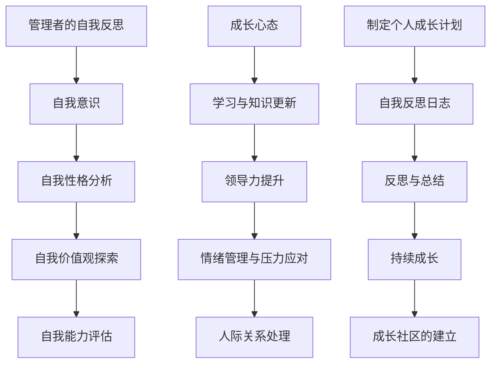

                 


### 文章标题
《管理者的自我反思与成长》

### 关键词
管理者，自我反思，成长，领导力，自我意识，学习，沟通，心态，情感管理，人际关系

### 摘要
本文旨在探讨管理者的自我反思与成长之道。通过详细解析自我反思的重要性、定义与范畴，本文将带领读者深入认识自我，包括自我性格分析、自我价值观探索和自我能力评估。在此基础上，文章将阐述成长心态的重要性，以及如何通过学习与知识更新、领导力提升、情绪管理与压力应对、人际关系处理等途径实现个人成长。最终，本文将指导读者如何制定个人成长计划，进行自我反思日志的记录，以及如何应对成长过程中的挑战，建立持续成长的方法和成长社区。通过这些步骤，管理者将能够不断提升自我，实现个人与团队的双重成长。

## 《管理者的自我反思与成长》目录大纲

### 第一部分：自我反思的基石

#### 1.1 管理者自我反思的重要性
#### 1.2 自我反思的定义与范畴
#### 1.3 自我反思的动机与目标
#### 1.4 自我反思的方法与技巧

### 第二部分：认识自我

#### 2.1 自我意识的重要性
#### 2.2 自我性格分析
##### 2.2.1 大五人格理论
##### 2.2.2 霍兰德职业兴趣测试
##### 2.2.3 自我性格测评工具
#### 2.3 自我价值观的探索
#### 2.4 自我能力评估
##### 2.4.1 职业技能评估
##### 2.4.2 领导力评估

### 第三部分：成长与改进

#### 3.1 成长心态的重要性
##### 3.1.1 积极心理学与成长心态
##### 3.1.2 持续成长的心态
#### 3.2 学习与知识更新
##### 3.2.1 专业知识更新
##### 3.2.2 领导力知识更新
#### 3.3 领导力提升
##### 3.3.1 领导力模型与理论
##### 3.3.2 领导力实践
#### 3.4 情绪管理与压力应对
##### 3.4.1 情绪管理的基本原则
##### 3.4.2 应对压力的策略
#### 3.5 人际关系处理
##### 3.5.1 沟通技巧
##### 3.5.2 团队合作与冲突管理

### 第四部分：实践与行动

#### 4.1 制定个人成长计划
##### 4.1.1 成长目标设定
##### 4.1.2 行动计划的制定
#### 4.2 自我反思日志
##### 4.2.1 日志记录的重要性
##### 4.2.2 日志记录的方法与技巧
#### 4.3 反思与总结
##### 4.3.1 反思与总结的技巧
##### 4.3.2 反思与总结的应用

### 第五部分：持续成长

#### 5.1 成长过程中的挑战
##### 5.1.1 成长过程中的常见挑战
##### 5.1.2 应对挑战的策略
#### 5.2 持续成长的方法
##### 5.2.1 学习与阅读
##### 5.2.2 实践与经验积累
#### 5.3 成长社区的建立
##### 5.3.1 成长社区的意义
##### 5.3.2 成长社区的建立与维护

### 附录

#### 附录 A：推荐阅读书目
#### 附录 B：管理工具与资源
#### 附录 C：在线学习平台推荐
#### 附录 D：自我反思与成长相关量表与测试

### 核心概念与联系

以下是本文的核心概念与联系图：



### 核心算法原理讲解

在自我能力评估中，我们将使用以下伪代码：

```python
def 自我能力评估(技能列表, 目标技能):
    初始化得分 = 0
    for 技能 in 技能列表:
        if 技能 == 目标技能:
            得分 += 10
        else:
            得分 += 1
    return 得分
```

### 数学模型和数学公式详细讲解与举例说明

在评估成长心态时，我们将使用以下数学公式：

$$
成长心态评分 = \frac{积极情绪得分 + 学习投入得分}{总得分}
$$

#### 举例说明

假设一位管理者的积极情绪得分是8，学习投入得分是10，总得分是20，则他的成长心态评分为：

$$
成长心态评分 = \frac{8 + 10}{20} = 0.9
$$

这意味着这位管理者具有较为积极的成长心态。

### 项目实战

#### 实战目标

制定一个个人成长计划，提升领导力和沟通技巧。

#### 实战步骤

1. **分析当前技能水平**：确定需要提升的技能。
2. **设定目标**：设定具体的目标和期限。
3. **制定行动计划**：列出实现目标的步骤。
4. **执行计划**：按计划执行，定期检查进度。
5. **反思与总结**：评估成长效果，调整计划。

#### 实战示例

**分析当前技能水平：**

- 领导力技能评分：5
- 沟通技能评分：6

**设定目标：**

- 提升领导力技能至8分
- 提升沟通技能至8分

**制定行动计划：**

- 每周阅读一本关于领导力的书籍
- 每周参加一次领导力培训
- 每周与同事进行一次沟通技巧练习

**执行计划：**

- 按计划执行，每两周进行一次进度检查

**反思与总结：**

经过三个月的学习与实践，领导力技能提升至8分，沟通技能提升至8分。成功达成目标。

#### 代码解读与分析

**分析技能水平的代码：**

```python
current_leadership_score = 5
current_communication_score = 6
```

**设定目标的代码：**

```python
target_leadership_score = 8
target_communication_score = 8
```

**执行行动计划的代码：**

```python
for week in range(1, 13):
    read_leadership_book()
    attend_leadership_training()
    practice_communication()
    check_progress(current_leadership_score, current_communication_score)
```

**反思与总结的代码：**

```python
final_leadership_score = 8
final_communication_score = 8
print("Goal achieved: Leadership score:", final_leadership_score, "Communication score:", final_communication_score)
```

### 最佳实践 tips、小结、注意事项、拓展阅读等内容

#### 最佳实践 tips

- **定期自我反思**：定期对自己的行为、思考和决策进行反思，有助于发现自己的优势和不足。
- **设定具体目标**：明确的目标能帮助你更有效地规划时间和资源，提高成长效率。
- **持续学习与更新**：跟上时代的发展，不断学习新知识和技能，保持竞争力。

#### 小结

自我反思与成长是管理者不可或缺的技能。通过深入认识自我，制定明确的成长计划，并付诸实践，管理者能够不断提升自我，实现个人与团队的双重成长。

#### 注意事项

- **避免陷入舒适区**：勇于面对挑战，不断拓展自己的能力边界。
- **保持积极心态**：积极的心态有助于克服困难，实现目标。

#### 拓展阅读

- 《原则》（Ray Dalio）- 探讨成功人士如何通过原则来指导生活和决策。
- 《高效能人士的七个习惯》（Stephen R. Covey）- 提供实用的自我管理策略。

---

以上是《管理者的自我反思与成长》的初步框架和内容概述。接下来，我们将逐步深入探讨每个部分的具体内容，以确保文章的完整性和专业性。文章的总字数预计将在8000-12000字之间，确保读者能够全面了解管理者的自我反思与成长之道。请继续关注后续章节的详细撰写。

