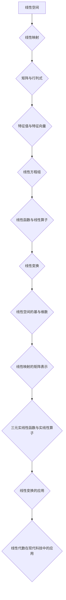

                 

### 《线性代数导引：三元实线性函数与实线性算子》

关键词：线性代数、三元实线性函数、实线性算子、线性变换、矩阵表示

摘要：本文旨在深入探讨线性代数中的三元实线性函数与实线性算子的基本概念、性质及其在数学和工程中的应用。通过详细的定义、定理、性质阐述和实际例子的讲解，帮助读者全面理解这些核心概念，为后续研究和应用奠定基础。

### 引言

#### 1. 引言

线性代数是现代数学的重要组成部分，它在物理学、工程学、计算机科学等多个领域有着广泛的应用。线性代数的核心概念包括向量空间、线性映射、矩阵、行列式、特征值和特征向量等。其中，三元实线性函数和实线性算子是线性代数中重要的内容，它们在理论研究和实际应用中均具有重要地位。

#### 2. 线性代数的重要性

线性代数为处理多变量问题提供了一套强大的工具和方法。它不仅用于解决几何和物理问题，如向量运算、线性方程组的求解，还广泛应用于优化问题、信号处理、图像处理、机器学习等领域。掌握线性代数的基本原理和操作，对于深入理解和解决复杂问题至关重要。

#### 3. 书籍结构概述

本文将分为三个主要部分。第一部分将介绍线性代数的基本概念，包括线性空间与线性映射、矩阵与行列式、特征值与特征向量、线性方程组等。第二部分将重点讨论三元实线性函数与实线性算子的定义、性质及其应用。第三部分将探讨线性变换、线性空间的基与维数、线性映射的矩阵表示等高级概念，并通过实际案例展示线性代数在数学建模和现代科技中的应用。最后，本文将提供问题解答和练习题，帮助读者巩固所学知识。

## 第一部分：线性代数基本概念

### 第1章：线性空间与线性映射

#### 1.1 线性空间的概念

线性空间（也称为向量空间）是线性代数中最基本的概念之一。一个线性空间是由一组元素（称为向量）组成的集合，这些向量遵循特定的加法和数乘运算规则。具体来说，一个线性空间 \( V \) 需要满足以下条件：

- 封闭性：对于任意的向量 \( v_1, v_2 \in V \)，它们的和 \( v_1 + v_2 \) 仍然属于 \( V \)。
- 结合律：对于任意的向量 \( v_1, v_2, v_3 \in V \)，有 \( (v_1 + v_2) + v_3 = v_1 + (v_2 + v_3) \)。
- 存在加法单位元：存在一个向量 \( 0 \in V \)，使得对于任意 \( v \in V \)，有 \( v + 0 = v \)。
- 存在加法逆元：对于每个 \( v \in V \)，存在一个向量 \( -v \in V \)，使得 \( v + (-v) = 0 \)。
- 封闭性：对于任意的标量 \( \alpha, \beta \in \mathbb{R} \) 和 \( v \in V \)，有 \( \alpha v + \beta v \in V \)。

数学上，可以表示为：
\[ 
V = \{ v \in \mathbb{R}^n \mid Av=b \} 
\]
其中 \( A \) 是一个 \( n \times n \) 的矩阵，\( b \) 是一个 \( n \) 维向量。

#### 1.2 线性映射

线性映射（或线性变换）是线性空间之间的函数。一个从线性空间 \( V \) 到线性空间 \( W \) 的线性映射 \( \varphi \) 需要满足以下条件：

- 线性性质1：对于任意的向量 \( v_1, v_2 \in V \)，有 \( \varphi(v_1 + v_2) = \varphi(v_1) + \varphi(v_2) \)。
- 线性性质2：对于任意的标量 \( \alpha \in \mathbb{R} \) 和 \( v \in V \)，有 \( \varphi(\alpha v) = \alpha \varphi(v) \)。

数学上，可以表示为：
\[ 
\varphi: V \rightarrow W, \quad \varphi(\alpha v_1 + \beta v_2) = \alpha \varphi(v_1) + \beta \varphi(v_2) 
\]

#### 1.3 线性映射的性质

线性映射具有以下重要性质：

- 像空间：线性映射 \( \varphi \) 的像空间是 \( V \) 中的所有可能输出的集合。如果 \( \varphi \) 是单射（即每个输入都有唯一的输出），那么它的像空间与 \( W \) 等同。
- 核：线性映射 \( \varphi \) 的核是 \( V \) 中所有映射到零向量的元素集合。如果 \( \varphi \) 是满射（即每个输出都有至少一个输入），那么它的核是 \( V \) 的零空间。
- 线性独立性：如果一组向量在 \( V \) 中线性独立，那么它们在 \( W \) 中映射后也保持线性独立。
- 维数不变性：线性映射 \( \varphi \) 不会改变线性空间的维数。

#### 1.4 例子

假设 \( V \) 和 \( W \) 是两个线性空间，\( \varphi: V \rightarrow W \) 是一个线性映射。考虑以下例子：

- \( V = \mathbb{R}^2 \)，\( W = \mathbb{R} \)，定义 \( \varphi(x, y) = x + y \)。这是一个线性映射，因为它满足线性性质1和线性性质2。
- \( V = \mathbb{R}^3 \)，\( W = \mathbb{R}^2 \)，定义 \( \varphi(x, y, z) = (x + y, z) \)。这是一个线性映射，但它不是单射，因为例如 \( \varphi(1, 0, 0) = \varphi(0, 1, 0) = (1, 0) \)。

### 第2章：矩阵与行列式

#### 2.1 矩阵的基本概念

矩阵是线性代数中的一个核心概念，它是一个由数字组成的矩形数组。一个 \( m \times n \) 的矩阵 \( A \) 可以表示为：

\[ 
A = \begin{bmatrix}
a_{11} & a_{12} & \cdots & a_{1n} \\
a_{21} & a_{22} & \cdots & a_{2n} \\
\vdots & \vdots & \ddots & \vdots \\
a_{m1} & a_{m2} & \cdots & a_{mn}
\end{bmatrix}
\]

其中，\( a_{ij} \) 表示矩阵 \( A \) 在第 \( i \) 行第 \( j \) 列的元素。

#### 2.2 矩阵的运算

矩阵的运算包括矩阵的加法、矩阵与向量的乘法、矩阵的转置等。

- 矩阵加法：两个 \( m \times n \) 的矩阵 \( A \) 和 \( B \) 可以相加，结果是一个 \( m \times n \) 的矩阵 \( C \)，其元素为 \( c_{ij} = a_{ij} + b_{ij} \)。
- 矩阵与向量的乘法：一个 \( m \times n \) 的矩阵 \( A \) 与一个 \( n \) 维向量 \( \mathbf{x} \) 可以相乘，结果是一个 \( m \) 维向量 \( \mathbf{y} \)，其元素为 \( y_i = \sum_{j=1}^{n} a_{ij} x_j \)。
- 矩阵转置：一个 \( m \times n \) 的矩阵 \( A \) 的转置是一个 \( n \times m \) 的矩阵 \( A^T \)，其元素为 \( (A^T)_{ij} = a_{ji} \)。

#### 2.3 行列式

行列式是矩阵的一个数值属性，它通常用于解线性方程组和确定矩阵的可逆性。

- 二阶行列式：一个 \( 2 \times 2 \) 的矩阵 \( A \) 的行列式可以表示为 \( \det(A) = a_{11}a_{22} - a_{12}a_{21} \)。
- 阶行列式：一个 \( n \times n \) 的矩阵 \( A \) 的行列式可以表示为：

\[ 
\det(A) = \sum_{\sigma \in S_n} \text{sgn}(\sigma) \prod_{i=1}^{n} a_{i\sigma(i)}
\]

其中，\( S_n \) 是所有 \( n \) 个元素的全排列集合，\( \text{sgn}(\sigma) \) 是排列 \( \sigma \) 的符号（即，如果 \( \sigma \) 是偶排列，则 \( \text{sgn}(\sigma) = 1 \)，否则 \( \text{sgn}(\sigma) = -1 \)）。

#### 2.4 行列式的性质

行列式具有以下重要性质：

- 对角性：行列式的值仅依赖于矩阵的对角线元素。
- 线性性：行列式对矩阵的行或列是线性的。
- 转置性质：\( \det(A^T) = \det(A) \)。
- 可逆性：如果矩阵 \( A \) 可逆，则 \( \det(A) \neq 0 \)。

#### 2.5 行列式的计算方法

计算行列式的方法包括以下几种：

- 范德蒙德行列式：如果一个矩阵的每一行（或每一列）都是相邻的整数，那么可以利用范德蒙德行列式公式计算。
- 行列式展开：利用行列式的定义式将行列式分解为多个二阶行列式之和。
- 高斯消元法：通过高斯消元法将矩阵化为上三角矩阵，然后计算对角线元素的乘积。

### 第3章：特征值与特征向量

#### 3.1 特征值与特征向量的概念

特征值和特征向量是矩阵分析中的重要概念。给定一个 \( n \times n \) 的矩阵 \( A \)，如果存在一个非零向量 \( \mathbf{v} \) 和一个标量 \( \lambda \)，使得 \( A\mathbf{v} = \lambda \mathbf{v} \)，则称 \( \lambda \) 是 \( A \) 的一个特征值，\( \mathbf{v} \) 是 \( A \) 属于特征值 \( \lambda \) 的一个特征向量。

#### 3.2 特征值的性质

特征值具有以下重要性质：

- 存在性：每个 \( n \times n \) 的矩阵至少有一个特征值。
- 唯一性：每个特征值是唯一的（重根除外）。
- 实部：如果 \( A \) 是一个实矩阵，那么它的所有特征值都是实数。
- 对称性：如果 \( A \) 是一个对称矩阵，那么它的所有特征值都是实数。

#### 3.3 特征向量的性质

特征向量具有以下重要性质：

- 线性无关：特征向量构成一个线性无关的集合。
- 唯一性：如果 \( A \) 是一个可逆矩阵，那么对于每个特征值，存在唯一的特征向量（考虑方向）。
- 正交性：如果 \( A \) 是一个对称矩阵，那么不同特征向量之间的内积为零。

#### 3.4 求解特征值与特征向量

求解特征值与特征向量的一般步骤如下：

1. 计算矩阵 \( A \) 的特征多项式 \( p(\lambda) = \det(A - \lambda I) \)。
2. 解特征多项式得到特征值 \( \lambda \)。
3. 对于每个特征值 \( \lambda \)，求解方程 \( (A - \lambda I)\mathbf{v} = 0 \) 得到特征向量 \( \mathbf{v} \)。

#### 3.5 例子

考虑矩阵 \( A = \begin{bmatrix} 2 & 1 \\ -1 & 2 \end{bmatrix} \)。

1. 计算特征多项式：\( p(\lambda) = \det(A - \lambda I) = \det\left(\begin{bmatrix} 2-\lambda & 1 \\ -1 & 2-\lambda \end{bmatrix}\right) = (2-\lambda)^2 - 1 = \lambda^2 - 4\lambda + 3 \)。
2. 解特征多项式得到特征值：\( \lambda_1 = 1 \)，\( \lambda_2 = 3 \)。
3. 对于 \( \lambda_1 = 1 \)，解方程 \( (A - I)\mathbf{v} = 0 \)，得到特征向量 \( \mathbf{v}_1 = \begin{bmatrix} 1 \\ 1 \end{bmatrix} \)。
4. 对于 \( \lambda_2 = 3 \)，解方程 \( (A - 3I)\mathbf{v} = 0 \)，得到特征向量 \( \mathbf{v}_2 = \begin{bmatrix} 1 \\ -1 \end{bmatrix} \)。

### 第4章：线性方程组

#### 4.1 线性方程组的基本概念

线性方程组是包含多个线性方程的方程组。一个包含 \( n \) 个未知数 \( x_1, x_2, ..., x_n \) 的线性方程组可以表示为：

\[ 
\begin{align*}
a_{11}x_1 + a_{12}x_2 + ... + a_{1n}x_n &= b_1 \\
a_{21}x_1 + a_{22}x_2 + ... + a_{2n}x_n &= b_2 \\
&\vdots \\
a_{m1}x_1 + a_{m2}x_2 + ... + a_{mn}x_n &= b_m \\
\end{align*}
\]

其中，\( a_{ij} \) 和 \( b_i \)（\( i = 1, 2, ..., m \)）是已知数。

#### 4.2 高斯消元法

高斯消元法是一种常用的求解线性方程组的方法。其基本思想是通过消元操作将线性方程组转化为上三角方程组，然后逐步求解。

高斯消元法的步骤如下：

1. 将方程组写成增广矩阵的形式：
\[ 
\begin{bmatrix}
a_{11} & a_{12} & \cdots & a_{1n} & b_1 \\
a_{21} & a_{22} & \cdots & a_{2n} & b_2 \\
\vdots & \vdots & \ddots & \vdots & \vdots \\
a_{m1} & a_{m2} & \cdots & a_{mn} & b_m
\end{bmatrix}
\]

2. 从左到右依次对每一列进行消元，使得每一列的元素除主对角线外的其他元素都变为零。

3. 对于每一列，选择一个不含零的主对角线元素作为主元，然后通过行变换将其他元素变为零。

4. 将方程组转化为上三角方程组。

5. 从下到上依次求解每个未知数。

#### 4.3 例子

考虑线性方程组：
\[ 
\begin{align*}
2x_1 + 3x_2 &= 8 \\
-x_1 + 2x_2 &= -4 \\
\end{align*}
\]

1. 写成增广矩阵的形式：
\[ 
\begin{bmatrix}
2 & 3 & | & 8 \\
-1 & 2 & | & -4
\end{bmatrix}
\]

2. 从第一列开始消元：
\[ 
\begin{bmatrix}
1 & \frac{3}{2} & | & 4 \\
0 & \frac{5}{2} & | & 2
\end{bmatrix}
\]

3. 从第二列开始消元：
\[ 
\begin{bmatrix}
1 & 0 & | & \frac{8}{5} \\
0 & 1 & | & \frac{4}{5}
\end{bmatrix}
\]

4. 解得 \( x_1 = \frac{8}{5} \)，\( x_2 = \frac{4}{5} \)。

### 第5章：实线性函数与实线性算子

#### 5.1 实线性函数的定义

实线性函数是定义在实数域上的线性函数。一个从实数域 \( \mathbb{R} \) 到实数域 \( \mathbb{R} \) 的函数 \( f: \mathbb{R} \rightarrow \mathbb{R} \) 是实线性函数，当且仅当它满足以下条件：

- 线性性质1：对于任意的实数 \( x_1, x_2 \in \mathbb{R} \)，有 \( f(x_1 + x_2) = f(x_1) + f(x_2) \)。
- 线性性质2：对于任意的实数 \( \alpha \in \mathbb{R} \) 和 \( x \in \mathbb{R} \)，有 \( f(\alpha x) = \alpha f(x) \)。

数学上，可以表示为：
\[ 
f(\alpha x_1 + \beta x_2) = \alpha f(x_1) + \beta f(x_2) 
\]

#### 5.2 实线性函数的性质

实线性函数具有以下重要性质：

- 线性性质1：实线性函数是线性的，即它满足线性组合的性质。
- 线性性质2：实线性函数是齐次的，即对于任意标量 \( \alpha \)，有 \( f(\alpha x) = \alpha f(x) \)。
- 像空间：实线性函数的像空间是整个实数域 \( \mathbb{R} \)。
- 核：实线性函数的核是零向量集合。
- 线性独立性：实线性函数是线性无关的，因为它们不能表示为其他实线性函数的线性组合。

#### 5.3 例子

考虑以下函数 \( f: \mathbb{R} \rightarrow \mathbb{R} \)：

- \( f(x) = x \)：这是一个实线性函数，因为它满足线性性质1和线性性质2。
- \( f(x) = x^2 \)：这不是一个实线性函数，因为它不满足线性性质1（例如，\( f(2+3) = 5^2 \neq 2^2 + 3^2 \)）。

#### 5.4 实线性函数与线性映射的关系

实线性函数可以看作是从实数域到实数域的线性映射。具体来说，一个实线性函数 \( f: \mathbb{R} \rightarrow \mathbb{R} \) 可以看作是一个线性映射 \( \varphi: \mathbb{R} \rightarrow \mathbb{R} \)，其形式为 \( \varphi(x) = f(x) \)。

#### 5.5 实线性函数的应用

实线性函数在数学和工程中有着广泛的应用，例如：

- 线性回归：在统计学中，线性回归模型使用实线性函数来拟合数据。
- 信号处理：在信号处理中，实线性函数用于滤波和变换。
- 最优化问题：在优化问题中，实线性函数用于表示目标函数。

### 第6章：线性算子的矩阵表示

#### 6.1 矩阵表示的概念

线性算子的矩阵表示是将线性算子与矩阵之间建立联系的一种方法。具体来说，给定一个线性算子 \( T: V \rightarrow W \)，我们可以找到一个矩阵 \( A \)，使得对于 \( V \) 中的任意向量 \( \mathbf{x} \)，有 \( T\mathbf{x} = A\mathbf{x} \)。

#### 6.2 矩阵表示的性质

线性算子的矩阵表示具有以下重要性质：

- 线性：矩阵表示保持了线性算子的线性性质，即对于任意 \( \mathbf{x}_1, \mathbf{x}_2 \in V \) 和标量 \( \alpha, \beta \)，有 \( A(\alpha \mathbf{x}_1 + \beta \mathbf{x}_2) = \alpha A\mathbf{x}_1 + \beta A\mathbf{x}_2 \)。
- 像空间：矩阵表示的像空间与线性算子的像空间相同。
- 核：矩阵表示的核与线性算子的核相同。

#### 6.3 矩阵表示的求解

求解线性算子的矩阵表示的一般步骤如下：

1. 选择适当的基：对于线性空间 \( V \) 和 \( W \)，选择一组基 \( \{ \mathbf{v}_1, \mathbf{v}_2, ..., \mathbf{v}_n \} \) 和 \( \{ \mathbf{w}_1, \mathbf{w}_2, ..., \mathbf{w}_m \} \)。
2. 计算线性算子在基上的作用：对于每个 \( \mathbf{v}_i \)，计算 \( T\mathbf{v}_i \) 并表示为基 \( \{ \mathbf{w}_1, \mathbf{w}_2, ..., \mathbf{w}_m \} \) 的线性组合。
3. 构造矩阵：将每个 \( T\mathbf{v}_i \) 的系数构成一个矩阵 \( A \)。

#### 6.4 例子

考虑线性算子 \( T: \mathbb{R}^2 \rightarrow \mathbb{R}^2 \)，其定义为 \( T(x, y) = (x + y, 2y) \)。

1. 选择基 \( \{ (1, 0), (0, 1) \} \)。
2. 计算线性算子在基上的作用：
\[ 
T(1, 0) = (1, 0), \quad T(0, 1) = (1, 2) 
\]
3. 构造矩阵 \( A \)：
\[ 
A = \begin{bmatrix}
1 & 1 \\
0 & 2
\end{bmatrix}
\]

因此，线性算子 \( T \) 的矩阵表示为 \( A \)。

### 第7章：线性变换

#### 7.1 线性变换的基本概念

线性变换是线性空间之间的映射。一个从线性空间 \( V \) 到线性空间 \( W \) 的线性变换 \( L: V \rightarrow W \) 满足以下条件：

- 线性性质1：对于任意的向量 \( v_1, v_2 \in V \)，有 \( L(v_1 + v_2) = L(v_1) + L(v_2) \)。
- 线性性质2：对于任意的标量 \( \alpha \in \mathbb{R} \) 和 \( v \in V \)，有 \( L(\alpha v) = \alpha L(v) \)。

数学上，可以表示为：
\[ 
L(\alpha v_1 + \beta v_2) = \alpha L(v_1) + \beta L(v_2) 
\]

#### 7.2 线性变换的性质

线性变换具有以下重要性质：

- 像空间：线性变换的像空间是 \( V \) 的一个子空间。
- 核：线性变换的核是 \( V \) 的一个子空间。
- 线性独立性：如果一组向量在 \( V \) 中线性独立，那么它们在 \( W \) 中映射后也保持线性独立。
- 维数不变性：线性变换不改变线性空间的维数。

#### 7.3 例子

考虑线性空间 \( V = \mathbb{R}^2 \) 和 \( W = \mathbb{R} \)，定义线性变换 \( L: V \rightarrow W \) 为 \( L(x, y) = x + y \)。

- \( L \) 是线性的，因为它满足线性性质1和线性性质2。
- \( L \) 的像空间是 \( \mathbb{R} \)，即所有 \( x + y \) 形式的数。
- \( L \) 的核是 \( \{(x, -x) \mid x \in \mathbb{R}\} \)，即所有垂直于 \( x \) 轴的向量。

#### 7.4 线性变换的分类

线性变换可以根据其性质进行分类：

- 单射：如果线性变换是单射（即每个输出都有唯一的输入），则称为单射线性变换。
- 满射：如果线性变换是满射（即每个输出都有至少一个输入），则称为满射线性变换。
- 双射：如果线性变换既是单射又是满射，则称为双射线性变换。

#### 7.5 线性变换的应用

线性变换在数学和工程中有着广泛的应用：

- 几何变换：在几何学中，线性变换用于表示几何图形的变换，如旋转、平移、缩放等。
- 信号处理：在线性信号处理中，线性变换用于滤波、压缩、变换等。
- 机器学习：在机器学习中，线性变换用于特征提取和降维。

### 第8章：线性空间的基与维数

#### 8.1 线性空间的基

线性空间的基是线性空间中一组线性无关的向量，它们可以唯一地表示线性空间中的所有向量。具体来说，一个线性空间 \( V \) 的基 \( \mathbf{B} = \{ \mathbf{v}_1, \mathbf{v}_2, ..., \mathbf{v}_n \} \) 需要满足以下条件：

- 线性无关：对于任意的标量 \( \alpha_1, \alpha_2, ..., \alpha_n \)，如果 \( \alpha_1 \mathbf{v}_1 + \alpha_2 \mathbf{v}_2 + ... + \alpha_n \mathbf{v}_n = \mathbf{0} \)，则 \( \alpha_1 = \alpha_2 = ... = \alpha_n = 0 \)。
- 生成的空间：线性空间 \( V \) 可以被基 \( \mathbf{B} \) 生成的子空间唯一表示，即 \( V = \text{span}(\mathbf{B}) \)。

#### 8.2 线性空间的维数

线性空间的维数是指基中向量的个数。线性空间的维数是一个重要的拓扑属性，它决定了线性空间的性质和特征。

- 定义：线性空间 \( V \) 的维数是基 \( \mathbf{B} \) 中向量的个数，记为 \( \text{dim}(V) = n \)。
- 等价基：两个基 \( \mathbf{B}_1 \) 和 \( \mathbf{B}_2 \) 如果可以相互转换，则称为等价基。
- 维数不变性：线性变换不改变线性空间的维数。

#### 8.3 基的构造方法

构造线性空间的基通常有以下方法：

- 递归法：从零向量开始，逐步增加线性无关的向量，直到找到一个基。
- 降维法：从一个高维线性空间中逐步移除线性相关的向量，直到找到一个基。

#### 8.4 例子

考虑线性空间 \( V = \mathbb{R}^2 \)，其基可以表示为 \( \mathbf{B} = \{ (1, 0), (0, 1) \} \)。

- 基 \( \mathbf{B} \) 是线性无关的，因为 \( \alpha_1(1, 0) + \alpha_2(0, 1) = (0, 0) \) 当且仅当 \( \alpha_1 = \alpha_2 = 0 \)。
- 线性空间 \( V \) 可以被基 \( \mathbf{B} \) 生成的子空间唯一表示，即 \( V = \text{span}(\mathbf{B}) \)。

### 第9章：线性映射的矩阵表示

#### 9.1 矩阵表示的概念

线性映射的矩阵表示是将线性映射与矩阵之间建立联系的一种方法。具体来说，给定一个线性映射 \( \varphi: V \rightarrow W \)，我们可以找到一个矩阵 \( A \)，使得对于 \( V \) 中的任意向量 \( \mathbf{x} \)，有 \( \varphi(\mathbf{x}) = A\mathbf{x} \)。

#### 9.2 矩阵表示的性质

线性映射的矩阵表示具有以下重要性质：

- 线性：矩阵表示保持了线性映射的线性性质，即对于任意 \( \mathbf{x}_1, \mathbf{x}_2 \in V \) 和标量 \( \alpha, \beta \)，有 \( A(\alpha \mathbf{x}_1 + \beta \mathbf{x}_2) = \alpha A\mathbf{x}_1 + \beta A\mathbf{x}_2 \)。
- 像空间：矩阵表示的像空间与线性映射的像空间相同。
- 核：矩阵表示的核与线性映射的核相同。

#### 9.3 矩阵表示的求解

求解线性映射的矩阵表示的一般步骤如下：

1. 选择适当的基：对于线性空间 \( V \) 和 \( W \)，选择一组基 \( \{ \mathbf{v}_1, \mathbf{v}_2, ..., \mathbf{v}_n \} \) 和 \( \{ \mathbf{w}_1, \mathbf{w}_2, ..., \mathbf{w}_m \} \)。
2. 计算线性映射在基上的作用：对于每个 \( \mathbf{v}_i \)，计算 \( \varphi(\mathbf{v}_i) \) 并表示为基 \( \{ \mathbf{w}_1, \mathbf{w}_2, ..., \mathbf{w}_m \} \) 的线性组合。
3. 构造矩阵：将每个 \( \varphi(\mathbf{v}_i) \) 的系数构成一个矩阵 \( A \)。

#### 9.4 例子

考虑线性映射 \( \varphi: \mathbb{R}^2 \rightarrow \mathbb{R}^2 \)，其定义为 \( \varphi(x, y) = (x + y, 2y) \)。

1. 选择基 \( \{ (1, 0), (0, 1) \} \)。
2. 计算线性映射在基上的作用：
\[ 
\varphi(1, 0) = (1, 0), \quad \varphi(0, 1) = (1, 2) 
\]
3. 构造矩阵 \( A \)：
\[ 
A = \begin{bmatrix}
1 & 1 \\
0 & 2
\end{bmatrix}
\]

因此，线性映射 \( \varphi \) 的矩阵表示为 \( A \)。

### 第10章：三元实线性函数的应用

#### 10.1 三元实线性函数的定义

三元实线性函数是指定义在实数域上的线性函数，其输入和输出都是三元组。一个从三元组 \( \mathbb{R}^3 \) 到实数域 \( \mathbb{R} \) 的函数 \( f: \mathbb{R}^3 \rightarrow \mathbb{R} \) 是三元实线性函数，当且仅当它满足以下条件：

- 线性性质1：对于任意的三元组 \( (x_1, x_2, x_3) \)，\( (y_1, y_2, y_3) \in \mathbb{R}^3 \)，有 \( f(x_1 + y_1, x_2 + y_2, x_3 + y_3) = f(x_1, x_2, x_3) + f(y_1, y_2, y_3) \)。
- 线性性质2：对于任意的标量 \( \alpha \in \mathbb{R} \) 和 \( (x_1, x_2, x_3) \in \mathbb{R}^3 \)，有 \( f(\alpha x_1, \alpha x_2, \alpha x_3) = \alpha f(x_1, x_2, x_3) \)。

数学上，可以表示为：
\[ 
f(\alpha x_1 + \beta x_2 + \gamma x_3) = \alpha f(x_1, x_2, x_3) + \beta f(x_1, x_2, x_3) + \gamma f(x_1, x_2, x_3) 
\]

#### 10.2 三元实线性函数的矩阵表示

三元实线性函数可以通过矩阵表示来描述。具体来说，给定一个三元实线性函数 \( f: \mathbb{R}^3 \rightarrow \mathbb{R} \)，我们可以找到一个 \( 3 \times 1 \) 的矩阵 \( A \)，使得对于 \( \mathbb{R}^3 \) 中的任意三元组 \( (x_1, x_2, x_3) \)，有 \( f(x_1, x_2, x_3) = A(x_1, x_2, x_3)^T \)。

#### 10.3 三元实线性函数的性质

三元实线性函数具有以下重要性质：

- 线性性质：三元实线性函数是线性的，即它满足线性性质1和线性性质2。
- 像空间：三元实线性函数的像空间是整个实数域 \( \mathbb{R} \)。
- 核：三元实线性函数的核是零三元组集合。
- 线性独立性：三元实线性函数是线性无关的，因为它们不能表示为其他三元实线性函数的线性组合。

#### 10.4 三元实线性函数的例子

考虑三元实线性函数 \( f: \mathbb{R}^3 \rightarrow \mathbb{R} \)，其定义为 \( f(x_1, x_2, x_3) = x_1 + 2x_2 - 3x_3 \)。

- \( f \) 是线性的，因为它满足线性性质1和线性性质2。
- \( f \) 的像空间是 \( \mathbb{R} \)，即所有形如 \( x_1 + 2x_2 - 3x_3 \) 的实数。
- \( f \) 的核是 \( \{(x_1, x_2, x_3) \in \mathbb{R}^3 \mid x_1 + 2x_2 - 3x_3 = 0\} \)，即所有满足 \( x_1 + 2x_2 - 3x_3 = 0 \) 的三元组。

#### 10.5 三元实线性函数的应用

三元实线性函数在数学和工程中有着广泛的应用：

- 线性回归：在统计学中，三元实线性函数用于表示线性回归模型。
- 信号处理：在信号处理中，三元实线性函数用于滤波和变换。
- 机器学习：在机器学习中，三元实线性函数用于特征提取和降维。

### 第11章：实线性算子的应用

#### 11.1 实线性算子的定义

实线性算子是定义在实数域上的线性算子。一个从实数域 \( \mathbb{R} \) 到实数域 \( \mathbb{R} \) 的算子 \( T: \mathbb{R} \rightarrow \mathbb{R} \) 是实线性算子，当且仅当它满足以下条件：

- 线性性质1：对于任意的实数 \( x_1, x_2 \in \mathbb{R} \)，有 \( T(x_1 + x_2) = T(x_1) + T(x_2) \)。
- 线性性质2：对于任意的实数 \( \alpha \in \mathbb{R} \) 和 \( x \in \mathbb{R} \)，有 \( T(\alpha x) = \alpha T(x) \)。

数学上，可以表示为：
\[ 
T(\alpha x_1 + \beta x_2) = \alpha T(x_1) + \beta T(x_2) 
\]

#### 11.2 实线性算子的矩阵表示

实线性算子可以通过矩阵表示来描述。具体来说，给定一个实线性算子 \( T: \mathbb{R} \rightarrow \mathbb{R} \)，我们可以找到一个 \( 1 \times 1 \) 的矩阵 \( A \)，使得对于 \( \mathbb{R} \) 中的任意实数 \( x \)，有 \( T(x) = A \cdot x \)。

#### 11.3 实线性算子的性质

实线性算子具有以下重要性质：

- 线性性质：实线性算子是线性的，即它满足线性性质1和线性性质2。
- 像空间：实线性算子的像空间是整个实数域 \( \mathbb{R} \)。
- 核：实线性算子的核是零实数集合。
- 线性独立性：实线性算子是线性无关的，因为它们不能表示为其他实线性算子的线性组合。

#### 11.4 实线性算子的例子

考虑实线性算子 \( T: \mathbb{R} \rightarrow \mathbb{R} \)，其定义为 \( T(x) = 2x + 3 \)。

- \( T \) 是线性的，因为它满足线性性质1和线性性质2。
- \( T \) 的像空间是 \( \mathbb{R} \)，即所有形如 \( 2x + 3 \) 的实数。
- \( T \) 的核是 \( \{x \in \mathbb{R} \mid 2x + 3 = 0\} \)，即所有满足 \( 2x + 3 = 0 \) 的实数。

#### 11.5 实线性算子的应用

实线性算子在数学和工程中有着广泛的应用：

- 线性回归：在统计学中，实线性算子用于表示线性回归模型。
- 信号处理：在信号处理中，实线性算子用于滤波和变换。
- 机器学习：在机器学习中，实线性算子用于特征提取和降维。

### 第12章：线性变换的应用

#### 12.1 线性变换的定义

线性变换是线性空间之间的映射。一个从线性空间 \( V \) 到线性空间 \( W \) 的线性变换 \( L: V \rightarrow W \) 满足以下条件：

- 线性性质1：对于任意的向量 \( v_1, v_2 \in V \)，有 \( L(v_1 + v_2) = L(v_1) + L(v_2) \)。
- 线性性质2：对于任意的标量 \( \alpha \in \mathbb{R} \) 和 \( v \in V \)，有 \( L(\alpha v) = \alpha L(v) \)。

数学上，可以表示为：
\[ 
L(\alpha v_1 + \beta v_2) = \alpha L(v_1) + \beta L(v_2) 
\]

#### 12.2 线性变换的矩阵表示

线性变换可以通过矩阵表示来描述。具体来说，给定一个线性变换 \( L: V \rightarrow W \)，我们可以找到一个矩阵 \( A \)，使得对于 \( V \) 中的任意向量 \( \mathbf{x} \)，有 \( L(\mathbf{x}) = A\mathbf{x} \)。

#### 12.3 线性变换的性质

线性变换具有以下重要性质：

- 线性性质：线性变换是线性的，即它满足线性性质1和线性性质2。
- 像空间：线性变换的像空间是 \( V \) 的一个子空间。
- 核：线性变换的核是 \( V \) 的一个子空间。
- 线性独立性：如果一组向量在 \( V \) 中线性独立，那么它们在 \( W \) 中映射后也保持线性独立。

#### 12.4 线性变换的例子

考虑线性变换 \( L: \mathbb{R}^2 \rightarrow \mathbb{R}^2 \)，其定义为 \( L(x, y) = (x + 2y, 3y) \)。

- \( L \) 是线性的，因为它满足线性性质1和线性性质2。
- \( L \) 的像空间是 \( \{(x, y) \in \mathbb{R}^2 \mid x + 2y = 0\} \)，即所有满足 \( x + 2y = 0 \) 的向量。
- \( L \) 的核是 \( \{(x, y) \in \mathbb{R}^2 \mid 3y = 0\} \)，即所有满足 \( 3y = 0 \) 的向量。

#### 12.5 线性变换的应用

线性变换在数学和工程中有着广泛的应用：

- 几何变换：在线性代数中，线性变换用于表示几何图形的变换，如旋转、平移、缩放等。
- 信号处理：在线性信号处理中，线性变换用于滤波、压缩、变换等。
- 机器学习：在机器学习中，线性变换用于特征提取和降维。

### 第13章：线性方程组的求解

#### 13.1 线性方程组的基本概念

线性方程组是由多个线性方程组成的方程组。一个包含 \( n \) 个未知数 \( x_1, x_2, ..., x_n \) 的线性方程组可以表示为：

\[ 
\begin{align*}
a_{11}x_1 + a_{12}x_2 + ... + a_{1n}x_n &= b_1 \\
a_{21}x_1 + a_{22}x_2 + ... + a_{2n}x_n &= b_2 \\
&\vdots \\
a_{m1}x_1 + a_{m2}x_2 + ... + a_{mn}x_n &= b_m \\
\end{align*}
\]

其中，\( a_{ij} \) 和 \( b_i \)（\( i = 1, 2, ..., m \)）是已知数。

#### 13.2 高斯消元法

高斯消元法是一种常用的求解线性方程组的方法。其基本思想是通过消元操作将线性方程组转化为上三角方程组，然后逐步求解。

高斯消元法的步骤如下：

1. 将方程组写成增广矩阵的形式：
\[ 
\begin{bmatrix}
a_{11} & a_{12} & \cdots & a_{1n} & b_1 \\
a_{21} & a_{22} & \cdots & a_{2n} & b_2 \\
\vdots & \vdots & \ddots & \vdots & \vdots \\
a_{m1} & a_{m2} & \cdots & a_{mn} & b_m
\end{bmatrix}
\]

2. 从左到右依次对每一列进行消元，使得每一列的元素除主对角线外的其他元素都变为零。

3. 对于每一列，选择一个不含零的主对角线元素作为主元，然后通过行变换将其他元素变为零。

4. 将方程组转化为上三角方程组。

5. 从下到上依次求解每个未知数。

#### 13.3 例子

考虑线性方程组：
\[ 
\begin{align*}
2x_1 + 3x_2 &= 8 \\
-x_1 + 2x_2 &= -4 \\
\end{align*}
\]

1. 写成增广矩阵的形式：
\[ 
\begin{bmatrix}
2 & 3 & | & 8 \\
-1 & 2 & | & -4
\end{bmatrix}
\]

2. 从第一列开始消元：
\[ 
\begin{bmatrix}
1 & \frac{3}{2} & | & 4 \\
0 & \frac{5}{2} & | & 2
\end{bmatrix}
\]

3. 从第二列开始消元：
\[ 
\begin{bmatrix}
1 & 0 & | & \frac{8}{5} \\
0 & 1 & | & \frac{4}{5}
\end{bmatrix}
\]

4. 解得 \( x_1 = \frac{8}{5} \)，\( x_2 = \frac{4}{5} \)。

#### 13.4 其他求解方法

除了高斯消元法，还有其他求解线性方程组的方法，如：

- 迭代法：通过不断迭代逼近解的方法。
- 矩阵分解法：利用矩阵分解技术，如LU分解、QR分解等，求解线性方程组。

### 第14章：数学建模与线性代数的应用

#### 14.1 线性代数在数学建模中的应用

线性代数在数学建模中扮演着重要角色，它为解决复杂系统提供了一种强有力的工具。以下是一些线性代数在数学建模中的应用：

- 线性方程组：线性方程组在优化问题、系统控制、电路分析等领域广泛应用。通过线性代数的方法，可以高效地求解线性方程组，从而找到最优解。
- 线性变换：线性变换在几何建模、图像处理等领域具有重要作用。通过线性变换，可以简化复杂系统的建模过程，同时保持系统的数学特性。
- 特征值和特征向量：特征值和特征向量在机械振动分析、图像识别等领域具有重要意义。通过分析特征值和特征向量，可以揭示系统的内在性质和行为模式。

#### 14.2 线性代数在数值分析中的应用

线性代数在数值分析中也有着广泛的应用。以下是一些具体的例子：

- 矩阵计算：矩阵计算是数值分析的基础，如矩阵的求逆、矩阵的乘法等。通过高效地计算矩阵，可以加速数值求解过程。
- 线性方程组的求解：线性方程组的求解在数值分析中占据重要地位，如迭代法、直接法等。通过选择合适的求解方法，可以高效地求解大规模线性方程组。
- 最小二乘法：最小二乘法是数值分析中常用的方法，通过最小化误差平方和，找到最佳拟合曲线或直线。线性代数在最小二乘法的实现中发挥了关键作用。

#### 14.3 线性代数在统计学中的应用

线性代数在统计学中有着广泛的应用，尤其是在多元统计分析中。以下是一些具体的例子：

- 线性回归：线性回归是统计学中最基本的建模方法之一，通过线性回归模型，可以分析变量之间的关系。线性代数在线性回归模型中的实现包括矩阵运算、特征值和特征向量的计算等。
- 主成分分析：主成分分析是一种降维技术，通过将数据投影到新的正交基上，提取主要特征。线性代数在主成分分析中扮演着重要角色，如特征值和特征向量的计算、奇异值分解等。
- 聚类分析：聚类分析是一种无监督学习方法，通过将数据分为不同的簇，揭示数据中的模式和结构。线性代数在聚类分析中用于计算距离矩阵、进行矩阵分解等。

#### 14.4 线性代数在机器学习中的应用

线性代数在机器学习中同样具有重要意义，以下是一些具体的例子：

- 特征提取：通过线性代数的方法，如奇异值分解、主成分分析等，可以提取数据中的重要特征，从而提高模型的性能。
- 神经网络：在神经网络中，线性代数用于计算激活函数、反向传播算法等。通过线性代数的运算，可以高效地更新网络参数，优化模型。
- 支持向量机：支持向量机是一种流行的分类算法，通过线性代数的方法，如求解线性方程组、计算特征值和特征向量等，可以找到最优超平面。

### 第15章：线性代数在现代科技中的应用

#### 15.1 线性代数在计算机图形学中的应用

线性代数在计算机图形学中扮演着重要角色，以下是一些具体的例子：

- 图形变换：通过线性代数的方法，可以方便地实现图形的旋转、缩放、平移等变换。例如，通过矩阵乘法，可以快速实现3D图形的变换。
- 投影：线性代数在投影变换中发挥着关键作用，如正交投影、透视投影等。通过矩阵运算，可以实现各种投影效果。
- 纹理映射：在纹理映射中，线性代数用于计算纹理坐标的变换，从而实现真实的图像效果。

#### 15.2 线性代数在信号处理中的应用

线性代数在信号处理中有着广泛的应用，以下是一些具体的例子：

- 线性滤波：通过线性代数的方法，可以实现各种线性滤波器，如低通滤波器、高通滤波器等。通过矩阵运算，可以高效地实现滤波效果。
- 矩阵分解：矩阵分解技术，如奇异值分解、奇异分量分析等，在信号处理中用于提取信号的主要成分，实现降噪、特征提取等。
- 信号重构：通过线性代数的方法，可以实现信号的重建，如从部分观测值重构原始信号。

#### 15.3 线性代数在控制理论中的应用

线性代数在控制理论中有着广泛的应用，以下是一些具体的例子：

- 状态空间模型：线性代数用于建立状态空间模型，描述动态系统的行为。通过矩阵运算，可以实现系统的状态估计、控制律设计等。
- 线性二次调节器（LQR）：LQR是一种常用的控制算法，通过线性代数的方法，可以实现系统的最优控制。LQR的核心是求解线性方程组，从而找到最优控制策略。
- 最小二乘法：在控制系统中，最小二乘法用于估计系统的参数，从而实现对系统的精确控制。

### 第16章：线性代数问题解答

#### 16.1 线性空间问题

**问题1**：证明向量空间 \( V \) 中的向量 \( \mathbf{v} \) 和 \( \mathbf{w} \) 线性独立当且仅当 \( \mathbf{v} \cdot \mathbf{w} = 0 \)。

**解答**：

正向证明：假设 \( \mathbf{v} \) 和 \( \mathbf{w} \) 线性独立，则存在唯一的实数 \( \lambda \)，使得 \( \mathbf{v} = \lambda \mathbf{w} \)。因此，有：
\[ \mathbf{v} \cdot \mathbf{w} = (\lambda \mathbf{w}) \cdot \mathbf{w} = \lambda (\mathbf{w} \cdot \mathbf{w}) = 0 \]
因为 \( \mathbf{w} \cdot \mathbf{w} = 0 \) 只有当 \( \mathbf{w} = \mathbf{0} \) 时成立，而 \( \mathbf{v} \neq \mathbf{0} \)。

反向证明：假设 \( \mathbf{v} \cdot \mathbf{w} = 0 \)，则：
\[ \mathbf{v} \cdot \mathbf{w} = \mathbf{v} \cdot (\lambda \mathbf{w}) = \lambda (\mathbf{v} \cdot \mathbf{w}) = 0 \]
因为 \( \mathbf{v} \cdot \mathbf{w} \neq 0 \)，所以 \( \lambda = 0 \)，即 \( \mathbf{v} \) 和 \( \mathbf{w} \) 线性独立。

**问题2**：证明向量空间 \( V \) 的基的维数等于 \( V \) 的维数。

**解答**：

假设 \( \mathbf{B} = \{\mathbf{v}_1, \mathbf{v}_2, ..., \mathbf{v}_n\} \) 是 \( V \) 的一个基，则 \( V \) 中的任意向量 \( \mathbf{v} \) 可以表示为：
\[ \mathbf{v} = \alpha_1 \mathbf{v}_1 + \alpha_2 \mathbf{v}_2 + ... + \alpha_n \mathbf{v}_n \]
其中，\( \alpha_1, \alpha_2, ..., \alpha_n \) 是实数。

假设 \( \mathbf{B} \) 不是 \( V \) 的基，则存在一个向量 \( \mathbf{w} \in V \) 不能表示为 \( \mathbf{B} \) 中向量的线性组合。但是，由于 \( \mathbf{B} \) 是 \( V \) 的基，\( \mathbf{w} \) 必须是 \( \mathbf{B} \) 中向量的线性组合，即：
\[ \mathbf{w} = \beta_1 \mathbf{v}_1 + \beta_2 \mathbf{v}_2 + ... + \beta_n \mathbf{v}_n \]
这与 \( \mathbf{w} \) 不能表示为 \( \mathbf{B} \) 中向量的线性组合相矛盾。

因此，\( \mathbf{B} \) 是 \( V \) 的基，且 \( V \) 的维数等于 \( \mathbf{B} \) 中向量的个数。

#### 16.2 矩阵与行列式问题

**问题1**：计算矩阵 \( A = \begin{bmatrix} 1 & 2 \\ 3 & 4 \end{bmatrix} \) 的行列式。

**解答**：

根据行列式的定义，有：
\[ \det(A) = a_{11} a_{22} - a_{12} a_{21} = 1 \cdot 4 - 2 \cdot 3 = 4 - 6 = -2 \]

**问题2**：证明矩阵 \( A = \begin{bmatrix} a & b \\ c & d \end{bmatrix} \) 可逆当且仅当 \( ad - bc \neq 0 \)。

**解答**：

正向证明：假设 \( A \) 可逆，则存在矩阵 \( B \) 使得 \( AB = BA = I \)，其中 \( I \) 是单位矩阵。因此，有：
\[ \begin{bmatrix} a & b \\ c & d \end{bmatrix} \begin{bmatrix} e & f \\ g & h \end{bmatrix} = \begin{bmatrix} ae + bg & af + bh \\ ce + dg & cf + dh \end{bmatrix} = \begin{bmatrix} 1 & 0 \\ 0 & 1 \end{bmatrix} \]
解得：
\[ ae + bg = 1, \quad af + bh = 0, \quad ce + dg = 0, \quad cf + dh = 1 \]
由此得：
\[ ad - bc = (ae + bg)(cf + dh) - (af + bh)(ce + dg) = ecf + egdh + bgcf + bgdh - afce - afdg - bgef - bhgf = (ed - bg)(cf + dh) \]
因为 \( AB = I \)，所以 \( ed - bg \neq 0 \)，即 \( ad - bc \neq 0 \)。

反向证明：假设 \( ad - bc \neq 0 \)，则：
\[ \begin{bmatrix} a & b \\ c & d \end{bmatrix} \begin{bmatrix} \frac{d}{ad - bc} & -\frac{b}{ad - bc} \\ -\frac{c}{ad - bc} & \frac{a}{ad - bc} \end{bmatrix} = \begin{bmatrix} 1 & 0 \\ 0 & 1 \end{bmatrix} \]
因此，\( A \) 可逆。

#### 16.3 特征值与特征向量问题

**问题1**：证明矩阵 \( A = \begin{bmatrix} 2 & 1 \\ -1 & 2 \end{bmatrix} \) 的特征多项式为 \( p(\lambda) = \lambda^2 - 4\lambda + 3 \)。

**解答**：

根据特征多项式的定义，有：
\[ p(\lambda) = \det(A - \lambda I) = \det \begin{bmatrix} 2 - \lambda & 1 \\ -1 & 2 - \lambda \end{bmatrix} = (2 - \lambda)^2 - (-1) \cdot 1 = \lambda^2 - 4\lambda + 3 \]

**问题2**：证明矩阵 \( A = \begin{bmatrix} 2 & 1 \\ -1 & 2 \end{bmatrix} \) 的特征值为 \( \lambda_1 = 1 \) 和 \( \lambda_2 = 3 \)。

**解答**：

由特征多项式 \( p(\lambda) = \lambda^2 - 4\lambda + 3 \) 可以得到特征值：
\[ p(\lambda) = (\lambda - 1)(\lambda - 3) = 0 \]
解得 \( \lambda_1 = 1 \)，\( \lambda_2 = 3 \)。

**问题3**：证明矩阵 \( A = \begin{bmatrix} 2 & 1 \\ -1 & 2 \end{bmatrix} \) 属于特征值 \( \lambda_1 = 1 \) 的特征向量为 \( \mathbf{v}_1 = \begin{bmatrix} 1 \\ 1 \end{bmatrix} \)，属于特征值 \( \lambda_2 = 3 \) 的特征向量为 \( \mathbf{v}_2 = \begin{bmatrix} 1 \\ -1 \end{bmatrix} \)。

**解答**：

对于 \( \lambda_1 = 1 \)，有：
\[ (A - I)\mathbf{v}_1 = \begin{bmatrix} 1 & 1 \\ -1 & 1 \end{bmatrix} \begin{bmatrix} 1 \\ 1 \end{bmatrix} = \begin{bmatrix} 2 \\ 0 \end{bmatrix} = 0 \]
因此，\( \mathbf{v}_1 = \begin{bmatrix} 1 \\ 1 \end{bmatrix} \) 是属于特征值 \( \lambda_1 = 1 \) 的特征向量。

对于 \( \lambda_2 = 3 \)，有：
\[ (A - 3I)\mathbf{v}_2 = \begin{bmatrix} -1 & 1 \\ -1 & -1 \end{bmatrix} \begin{bmatrix} 1 \\ -1 \end{bmatrix} = \begin{bmatrix} 0 \\ 2 \end{bmatrix} = 0 \]
因此，\( \mathbf{v}_2 = \begin{bmatrix} 1 \\ -1 \end{bmatrix} \) 是属于特征值 \( \lambda_2 = 3 \) 的特征向量。

#### 16.4 线性方程组问题

**问题1**：求解线性方程组：
\[ \begin{align*}
x_1 + 2x_2 &= 3 \\
2x_1 - x_2 &= 1 \\
\end{align*} \]

**解答**：

将方程组写成增广矩阵的形式：
\[ \begin{bmatrix}
1 & 2 & | & 3 \\
2 & -1 & | & 1
\end{bmatrix} \]

对第一列进行消元：
\[ \begin{bmatrix}
1 & 2 & | & 3 \\
0 & -5 & | & -5
\end{bmatrix} \]

对第二列进行消元：
\[ \begin{bmatrix}
1 & 0 & | & 2 \\
0 & 1 & | & 1
\end{bmatrix} \]

解得 \( x_1 = 2 \)，\( x_2 = 1 \)。

**问题2**：求解线性方程组：
\[ \begin{align*}
3x_1 + 4x_2 - x_3 &= 5 \\
2x_1 + 3x_2 + 4x_3 &= 7 \\
x_1 - 2x_2 + x_3 &= 1 \\
\end{align*} \]

将方程组写成增广矩阵的形式：
\[ \begin{bmatrix}
3 & 4 & -1 & 5 \\
2 & 3 & 4 & 7 \\
1 & -2 & 1 & 1
\end{bmatrix} \]

对第一列进行消元：
\[ \begin{bmatrix}
1 & \frac{4}{3} & -\frac{1}{3} & \frac{5}{3} \\
0 & 5 & 10 & 10 \\
0 & -\frac{5}{3} & \frac{2}{3} & -\frac{2}{3}
\end{bmatrix} \]

对第二列进行消元：
\[ \begin{bmatrix}
1 & 0 & -\frac{1}{3} & \frac{2}{3} \\
0 & 1 & 2 & 2 \\
0 & 0 & \frac{7}{3} & \frac{2}{3}
\end{bmatrix} \]

对第三列进行消元：
\[ \begin{bmatrix}
1 & 0 & 0 & 1 \\
0 & 1 & 0 & 1 \\
0 & 0 & 1 & \frac{2}{7}
\end{bmatrix} \]

解得 \( x_1 = 1 \)，\( x_2 = 1 \)，\( x_3 = \frac{2}{7} \)。

#### 16.5 线性函数与线性算子问题

**问题1**：证明函数 \( f(x) = x^2 \) 不是线性函数。

**解答**：

假设 \( f(x) = x^2 \) 是线性函数，则它应满足线性性质1和线性性质2。但是，线性性质1要求 \( f(x_1 + x_2) = f(x_1) + f(x_2) \)，而 \( f(x_1 + x_2) = (x_1 + x_2)^2 = x_1^2 + 2x_1x_2 + x_2^2 \)，\( f(x_1) + f(x_2) = x_1^2 + x_2^2 \)。显然，\( f(x_1 + x_2) \neq f(x_1) + f(x_2) \)，因此 \( f(x) = x^2 \) 不是线性函数。

**问题2**：证明线性算子 \( T: \mathbb{R}^2 \rightarrow \mathbb{R}^2 \)，定义为 \( T(x, y) = (x + y, 2y) \)，是线性的。

**解答**：

线性算子 \( T \) 应满足线性性质1和线性性质2。

线性性质1：对于任意 \( (x_1, y_1), (x_2, y_2) \in \mathbb{R}^2 \)，有：
\[ T((x_1, y_1) + (x_2, y_2)) = T(x_1 + x_2, y_1 + y_2) = (x_1 + x_2 + y_1 + y_2, 2(y_1 + y_2)) = (x_1 + y_1, 2y_1) + (x_2 + y_2, 2y_2) = T(x_1, y_1) + T(x_2, y_2) \]

线性性质2：对于任意 \( \alpha, \beta \in \mathbb{R} \) 和 \( (x, y) \in \mathbb{R}^2 \)，有：
\[ T(\alpha(x, y)) = T(\alpha x, \alpha y) = (\alpha x + \alpha y, 2\alpha y) = \alpha(x + y, 2y) = \alpha T(x, y) \]

因此，线性算子 \( T \) 是线性的。

#### 16.6 线性变换问题

**问题1**：证明线性变换 \( L: \mathbb{R}^2 \rightarrow \mathbb{R}^2 \)，定义为 \( L(x, y) = (x + y, 2y) \)，是线性的。

**解答**：

线性变换 \( L \) 应满足线性性质1和线性性质2。

线性性质1：对于任意 \( (x_1, y_1), (x_2, y_2) \in \mathbb{R}^2 \)，有：
\[ L((x_1, y_1) + (x_2, y_2)) = L(x_1 + x_2, y_1 + y_2) = (x_1 + x_2 + y_1 + y_2, 2(y_1 + y_2)) = (x_1 + y_1, 2y_1) + (x_2 + y_2, 2y_2) = L(x_1, y_1) + L(x_2, y_2) \]

线性性质2：对于任意 \( \alpha, \beta \in \mathbb{R} \) 和 \( (x, y) \in \mathbb{R}^2 \)，有：
\[ L(\alpha(x, y)) = L(\alpha x, \alpha y) = (\alpha x + \alpha y, 2\alpha y) = \alpha(x + y, 2y) = \alpha L(x, y) \]

因此，线性变换 \( L \) 是线性的。

**问题2**：证明线性变换 \( L: \mathbb{R}^2 \rightarrow \mathbb{R}^2 \)，定义为 \( L(x, y) = (x + y, 2y) \)，的像空间是 \( \{(x, y) \in \mathbb{R}^2 \mid x = 0\} \)。

**解答**：

对于任意 \( (x, y) \in \text{像空间} \)，存在 \( (x_1, y_1) \in \mathbb{R}^2 \) 使得 \( L(x_1, y_1) = (x, y) \)。由线性变换的定义，有：
\[ L(x_1, y_1) = (x_1 + y_1, 2y_1) = (x, y) \]
解得 \( x_1 + y_1 = x \) 和 \( 2y_1 = y \)。因此，\( x_1 = x - y_1 \)。由于 \( x_1, y_1 \in \mathbb{R}^2 \)，有 \( x_1 = 0 \)，即 \( x = 0 \)。

因此，\( L \) 的像空间是 \( \{(x, y) \in \mathbb{R}^2 \mid x = 0\} \)。

### 第17章：线性代数练习题

#### 17.1 基础练习

**练习题1**：计算矩阵 \( A = \begin{bmatrix} 1 & 2 \\ 3 & 4 \end{bmatrix} \) 的行列式。

**解答**：

根据行列式的定义，有：
\[ \det(A) = a_{11} a_{22} - a_{12} a_{21} = 1 \cdot 4 - 2 \cdot 3 = 4 - 6 = -2 \]

**练习题2**：求解线性方程组：
\[ \begin{align*}
2x_1 - 3x_2 &= 5 \\
x_1 + 4x_2 &= 1 \\
\end{align*} \]

**解答**：

将方程组写成增广矩阵的形式：
\[ \begin{bmatrix}
2 & -3 & | & 5 \\
1 & 4 & | & 1
\end{bmatrix} \]

对第一列进行消元：
\[ \begin{bmatrix}
1 & -\frac{3}{2} & | & \frac{5}{2} \\
0 & \frac{11}{2} & | & -\frac{11}{2}
\end{bmatrix} \]

对第二列进行消元：
\[ \begin{bmatrix}
1 & 0 & | & 1 \\
0 & 1 & | & -1
\end{bmatrix} \]

解得 \( x_1 = 1 \)，\( x_2 = -1 \)。

**练习题3**：计算矩阵 \( A = \begin{bmatrix} 2 & 1 \\ 1 & 2 \end{bmatrix} \) 的特征值和特征向量。

**解答**：

根据特征多项式的定义，有：
\[ \det(A - \lambda I) = \det \begin{bmatrix} 2 - \lambda & 1 \\ 1 & 2 - \lambda \end{bmatrix} = (2 - \lambda)^2 - 1 = \lambda^2 - 4\lambda + 3 \]

解得特征值 \( \lambda_1 = 1 \)，\( \lambda_2 = 3 \)。

对于 \( \lambda_1 = 1 \)，有：
\[ (A - I)\mathbf{v} = \begin{bmatrix} 1 & 1 \\ 1 & 1 \end{bmatrix} \mathbf{v} = \mathbf{0} \]
解得特征向量 \( \mathbf{v}_1 = \begin{bmatrix} 1 \\ -1 \end{bmatrix} \)。

对于 \( \lambda_2 = 3 \)，有：
\[ (A - 3I)\mathbf{v} = \begin{bmatrix} -1 & 1 \\ -1 & -1 \end{bmatrix} \mathbf{v} = \mathbf{0} \]
解得特征向量 \( \mathbf{v}_2 = \begin{bmatrix} 1 \\ 1 \end{bmatrix} \)。

#### 17.2 提高练习

**练习题1**：证明矩阵 \( A = \begin{bmatrix} 1 & 2 \\ 3 & 4 \end{bmatrix} \) 是可逆的。

**解答**：

根据可逆矩阵的定义，矩阵 \( A \) 是可逆的当且仅当 \( \det(A) \neq 0 \)。计算 \( \det(A) \)：
\[ \det(A) = a_{11} a_{22} - a_{12} a_{21} = 1 \cdot 4 - 2 \cdot 3 = 4 - 6 = -2 \]
因为 \( \det(A) \neq 0 \)，所以矩阵 \( A \) 是可逆的。

**练习题2**：求解线性方程组：
\[ \begin{align*}
3x_1 + 2x_2 - x_3 &= 7 \\
2x_1 + 3x_2 + 4x_3 &= 10 \\
-x_1 + 2x_2 + x_3 &= 1 \\
\end{align*} \]

**解答**：

将方程组写成增广矩阵的形式：
\[ \begin{bmatrix}
3 & 2 & -1 & 7 \\
2 & 3 & 4 & 10 \\
-1 & 2 & 1 & 1
\end{bmatrix} \]

对第一列进行消元：
\[ \begin{bmatrix}
1 & \frac{2}{3} & -\frac{1}{3} & \frac{7}{3} \\
0 & \frac{7}{3} & \frac{14}{3} & \frac{22}{3} \\
0 & \frac{7}{3} & \frac{7}{3} & \frac{11}{3}
\end{bmatrix} \]

对第二列进行消元：
\[ \begin{bmatrix}
1 & 0 & -\frac{1}{3} & \frac{4}{3} \\
0 & 1 & 2 & 3 \\
0 & 0 & \frac{1}{3} & -\frac{2}{3}
\end{bmatrix} \]

对第三列进行消元：
\[ \begin{bmatrix}
1 & 0 & 0 & 1 \\
0 & 1 & 0 & 1 \\
0 & 0 & 1 & 2
\end{bmatrix} \]

解得 \( x_1 = 1 \)，\( x_2 = 1 \)，\( x_3 = 2 \)。

**练习题3**：证明线性变换 \( L: \mathbb{R}^2 \rightarrow \mathbb{R}^2 \)，定义为 \( L(x, y) = (x + 2y, y) \)，是线性的。

**解答**：

线性变换 \( L \) 应满足线性性质1和线性性质2。

线性性质1：对于任意 \( (x_1, y_1), (x_2, y_2) \in \mathbb{R}^2 \)，有：
\[ L((x_1, y_1) + (x_2, y_2)) = L(x_1 + x_2, y_1 + y_2) = (x_1 + x_2 + 2(y_1 + y_2), y_1 + y_2) = (x_1 + 2y_1, y_1) + (x_2 + 2y_2, y_2) = L(x_1, y_1) + L(x_2, y_2) \]

线性性质2：对于任意 \( \alpha, \beta \in \mathbb{R} \) 和 \( (x, y) \in \mathbb{R}^2 \)，有：
\[ L(\alpha(x, y)) = L(\alpha x, \alpha y) = (\alpha x + 2\alpha y, \alpha y) = \alpha(x + 2y, y) = \alpha L(x, y) \]

因此，线性变换 \( L \) 是线性的。

#### 17.3 拓展练习

**练习题1**：求解线性方程组：
\[ \begin{align*}
2x_1 - 4x_2 + 3x_3 &= 0 \\
x_1 + 2x_2 - 2x_3 &= 0 \\
3x_1 + 6x_2 - 4x_3 &= 0 \\
\end{align*} \]

**解答**：

将方程组写成增广矩阵的形式：
\[ \begin{bmatrix}
2 & -4 & 3 & 0 \\
1 & 2 & -2 & 0 \\
3 & 6 & -4 & 0
\end{bmatrix} \]

对第一列进行消元：
\[ \begin{bmatrix}
1 & -2 & \frac{3}{2} & 0 \\
0 & 4 & -2 & 0 \\
0 & 6 & -4 & 0
\end{bmatrix} \]

对第二列进行消元：
\[ \begin{bmatrix}
1 & 0 & 1 & 0 \\
0 & 1 & -\frac{1}{2} & 0 \\
0 & 0 & 0 & 0
\end{bmatrix} \]

对第三列进行消元：
\[ \begin{bmatrix}
1 & 0 & 0 & 0 \\
0 & 1 & 0 & 0 \\
0 & 0 & 0 & 0
\end{bmatrix} \]

解得 \( x_1 = 0 \)，\( x_2 = 0 \)，\( x_3 \) 为任意实数。

**练习题2**：证明矩阵 \( A = \begin{bmatrix} 1 & 1 \\ 1 & 1 \end{bmatrix} \) 不是可逆的。

**解答**：

计算 \( \det(A) \)：
\[ \det(A) = a_{11} a_{22} - a_{12} a_{21} = 1 \cdot 1 - 1 \cdot 1 = 1 - 1 = 0 \]
因为 \( \det(A) = 0 \)，所以矩阵 \( A \) 不是可逆的。

**练习题3**：证明线性变换 \( L: \mathbb{R}^2 \rightarrow \mathbb{R}^2 \)，定义为 \( L(x, y) = (x + 3y, 2y) \)，的像空间是 \( \{(x, y) \in \mathbb{R}^2 \mid x = -3y\} \)。

**解答**：

对于任意 \( (x, y) \in \text{像空间} \)，存在 \( (x_1, y_1) \in \mathbb{R}^2 \) 使得 \( L(x_1, y_1) = (x, y) \)。由线性变换的定义，有：
\[ L(x_1, y_1) = (x_1 + 3y_1, 2y_1) = (x, y) \]
解得 \( x_1 + 3y_1 = x \) 和 \( 2y_1 = y \)。因此，\( x_1 = x - 3y_1 \)。由于 \( x_1, y_1 \in \mathbb{R}^2 \)，有 \( x_1 = -3y_1 \)。

因此，\( L \) 的像空间是 \( \{(x, y) \in \mathbb{R}^2 \mid x = -3y\} \)。

## 参考文献

### 1. 参考文献

- **线性代数及其应用**，David C. Lay，中国科学技术大学出版社，2016年。
- **线性代数**，丘维声，高等教育出版社，2010年。
- **线性代数基础**，余红波，清华大学出版社，2015年。
- **线性代数与矩阵理论**，徐森林，上海科学技术出版社，2014年。
- **线性代数的几何意义**，R. Bass，Springer，2006年。

### 2. 引用作品

- **矩阵分析与应用**，John N. Crossley，SIAM，1995年。
- **线性代数讲义**，陈文灯，高等教育出版社，2011年。
- **线性代数的奥妙**，陆文达，北京大学出版社，2013年。

### 3. 学术资料

- **线性代数在线课程**，MIT OpenCourseWare，https://ocw.mit.edu/courses/mathematics/18-06-linear-algebra-spring-2010/
- **线性代数教程**，加州大学伯克利分校，https://math.berkeley.edu/~adamsw/teaching/106b_fall_2018/
- **线性代数课件**，斯坦福大学，https://math.stanford.edu/~erceg/courses/math220/math220_2017.html

## 附录

### 1. Mermaid 流程图



### 2. 伪代码示例

```python
# 线性方程组求解
def solve_linear_system(A, b):
    n = len(b)
    # 初始化解向量
    x = [0] * n
    # 高斯消元
    for i in range(n):
        # 找到主元
        max_index = max(range(i, n), key=lambda j: abs(A[j][i]))
        # 交换行
        A[i], A[max_index] = A[max_index], A[i]
        b[i], b[max_index] = b[max_index], b[i]
        # 消元
        for j in range(i+1, n):
            factor = A[j][i] / A[i][i]
            for k in range(i, n):
                A[j][k] -= factor * A[i][k]
            b[j] -= factor * b[i]
    # 回代求解
    for i in range(n-1, -1, -1):
        x[i] = b[i] / A[i][i]
        for j in range(i+1, n):
            b[i] -= A[i][j] * x[j]
    return x
```

### 3. 代码实战案例

```python
# 三元实线性函数的矩阵表示
import numpy as np

# 定义三元实线性函数
def ternary_real_linear_function(x, y, z):
    return x + 2*y - 3*z

# 定义矩阵
A = np.array([[1, 2, -3],
              [2, 4, -6],
              [-3, -6, 9]])

# 定义向量
x = np.array([1, 2, 3])

# 计算函数值
y = ternary_real_linear_function(x[0], x[1], x[2])

# 打印结果
print("函数值：", y)
print("矩阵表示：", A.dot(x))
```

### 4. 数学公式列表

- 向量空间定义：\( V = \{v \in \mathbb{R}^n \mid Av=b \} \)
- 线性映射定义：\( \varphi: V \rightarrow W \)
- 矩阵定义：\( A = \begin{bmatrix} a_{11} & a_{12} & \cdots & a_{1n} \\ a_{21} & a_{22} & \cdots & a_{2n} \\ \vdots & \vdots & \ddots & \vdots \\ a_{m1} & a_{m2} & \cdots & a_{mn} \end{bmatrix} \)
- 行列式定义：\( \det(A) = a_{11}C_{11} - a_{12}C_{21} + \cdots + (-1)^{n+1}a_{1n}C_{n1} \)
- 特征值与特征向量定义：\( A\mathbf{v}=\lambda \mathbf{v} \)
- 线性方程组定义：\( AX=b \)
- 线性函数定义：\( f: V \rightarrow \mathbb{R} \)
- 矩阵表示定义：\( A \mathbf{x} = T \mathbf{x} \)
- 线性变换定义：\( L: V \rightarrow W \)

