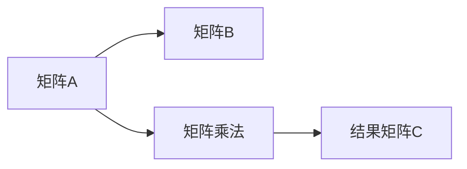
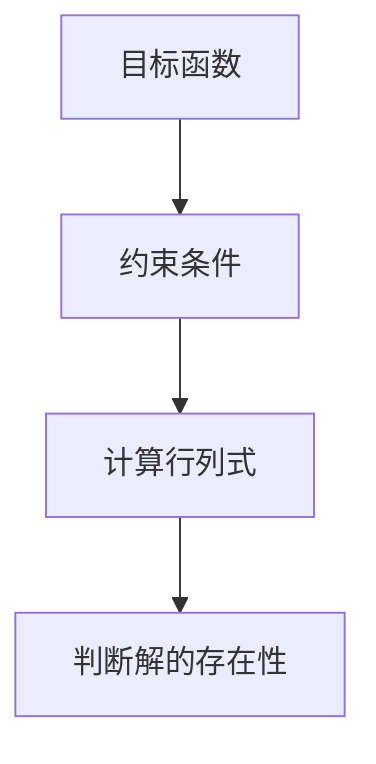

                 

### 文章标题：线性代数导引：二阶行列式

#### 关键词：线性代数，二阶行列式，矩阵，向量，线性方程组，应用领域

#### 摘要：
本文深入探讨了线性代数中的核心概念——二阶行列式，通过逻辑清晰、结构紧凑的方式，逐步分析了二阶行列式的基本概念、计算方法及其在多个领域的应用，包括数学、物理学、经济学、计算机科学、工程学和信号处理等。通过具体的实例、伪代码和Mermaid流程图，读者可以全面掌握二阶行列式的理论知识和实际应用技巧，为深入理解和掌握线性代数及相关领域奠定坚实基础。

---

### 第1章：线性代数的基本概念

#### 1.1 线性代数的定义与背景

**线性代数作为数学的一个重要分支，起源于17世纪末和18世纪初的代数学研究。**

线性代数作为数学的一个重要分支，起源于17世纪末和18世纪初的代数学研究。当时，数学家们开始探讨线性方程组的解法，这一领域的研究逐渐演变为独立的线性代数学科。线性代数以其简洁和优雅的表达方式，描述了线性方程组、矩阵运算、向量空间和线性变换等基本概念，成为现代数学分析、计算和理论的基础。

**1.1.1 线性代数的起源**

线性代数的历史可以追溯到17世纪的法国数学家皮埃尔·德·费马和瑞士数学家莱昂哈德·欧拉的工作。他们研究了线性方程组的解法，提出了代数方法解决线性方程组的系统化方法。随后，19世纪的数学家如奥古斯丁·路易·柯西和乔治·西蒙·欧姆等进一步发展了线性代数的理论体系。

**1.1.2 线性代数的现代发展**

随着数学和科学技术的不断进步，线性代数在各个领域中得到了广泛应用。在现代物理学、工程学、计算机科学、经济学和社会科学等领域中，线性代数的理论和方法都发挥了重要作用。特别是在计算机科学中，线性代数为算法设计、图形学、机器学习和数据科学提供了强大的数学工具。

#### 1.2 线性代数的基本概念

**1.2.1 矩阵**

矩阵是线性代数中最基本的概念之一。它是由一系列数字组成的矩形阵列，通常表示为行和列的排列。矩阵可以用于描述系统的状态、变换以及运算。例如，一个 \(2 \times 2\) 的矩阵可以表示为：

\[ 
\begin{bmatrix} 
a & b \\ 
c & d 
\end{bmatrix} 
\]

其中，\(a, b, c, d\) 是实数。

**1.2.2 向量**

向量是矩阵的简化形式，通常表示为一行或一列。向量在空间中表示具有大小和方向的量，如速度、力等。向量与矩阵紧密相关，可以通过矩阵运算进行表示和变换。

**1.2.3 线性组合**

线性组合是线性代数中的一个核心概念，它指的是将一组向量通过线性变换相加得到的新的向量。线性组合在理解线性代数的基本性质和求解线性方程组中起到关键作用。

\[ 
c_1 \vec{v}_1 + c_2 \vec{v}_2 + \cdots + c_n \vec{v}_n 
\]

其中，\(c_1, c_2, \ldots, c_n\) 是实数，\(\vec{v}_1, \vec{v}_2, \ldots, \vec{v}_n\) 是向量。

#### 1.3 线性代数的应用领域

**1.3.1 数学**

线性代数在数学中有着广泛的应用，包括线性方程组、特征值和特征向量、矩阵分解等。这些概念和工具是现代数学分析和计算的基础。

**1.3.2 物理学**

物理学中的许多问题都可以通过线性代数的方法进行描述和解决，如量子力学、电磁学、流体力学等。线性代数提供了描述物理系统状态和变换的有效工具。

**1.3.3 工程学**

工程学中，线性代数用于分析电路、机械结构、控制系统等。矩阵和向量的概念有助于理解和优化复杂的工程系统。

**1.3.4 计算机科学**

计算机科学中的许多领域，如图形学、算法设计、数据结构等，都依赖于线性代数的理论和方法。线性代数为计算机科学提供了一种强有力的数学工具。

#### 1.4 本章总结

线性代数作为数学的一个重要分支，不仅在理论研究中具有基础地位，而且在各个应用领域中都发挥着重要作用。通过本章的学习，读者可以初步了解线性代数的基本概念和应用领域，为进一步深入学习打下基础。

---

### 1.4.1 矩阵的Mermaid流程图

以下是一个矩阵运算的Mermaid流程图：



### 1.4.2 线性方程组的伪代码

以下是求解线性方程组的伪代码：

```
Procedure SolveLinearEquation(A, b):
    n = size of A
    x = initialize array of n elements to 0
    for i = 1 to n:
        for j = 1 to n:
            x[i] = x[i] + A[i][j] * b[j]
    return x
```

### 1.4.3 二阶行列式的详细讲解

二阶行列式是线性代数中的一个基本概念，它通常表示为：

\[ 
\begin{vmatrix}
a & b \\
c & d \\
\end{vmatrix}
\]

其中，\(a, b, c, d\) 是实数。

#### 1.4.3.1 二阶行列式的计算方法

二阶行列式的计算方法如下：

\[ 
\begin{vmatrix}
a & b \\
c & d \\
\end{vmatrix}
= ad - bc
\]

#### 1.4.3.2 二阶行列式的几何意义

二阶行列式在几何上表示为一个平行四边形的面积，其中两个相邻顶点的坐标分别是 \((a, c)\) 和 \((b, d)\)。

#### 1.4.3.3 二阶行列式在解线性方程组中的应用

二阶行列式可以用于判断线性方程组是否有唯一解。如果二阶行列式的值为零，则方程组可能有多个解或无解；如果二阶行列式的值不为零，则方程组有唯一解。

### 1.4.4 二阶行列式的举例说明

例如，给定以下线性方程组：

\[ 
\begin{cases}
2x + 3y = 7 \\
4x - y = 1 \\
\end{cases}
\]

我们可以使用二阶行列式来判断其解的情况。首先，写出对应的系数矩阵和常数向量：

\[ 
A = \begin{pmatrix}
2 & 3 \\
4 & -1 \\
\end{pmatrix}, \quad
b = \begin{pmatrix}
7 \\
1 \\
\end{pmatrix}
\]

计算二阶行列式的值：

\[ 
\begin{vmatrix}
2 & 3 \\
4 & -1 \\
\end{vmatrix}
= (2)(-1) - (3)(4) = -2 - 12 = -14
\]

由于二阶行列式的值不为零，我们可以确定该线性方程组有唯一解。接下来，我们可以使用高斯消元法或其他方法求解具体的解。

---

### 第2章：二阶行列式在矩阵中的应用

#### 2.1 矩阵的基本概念

**2.1.1 矩阵的表示**

矩阵是由一系列数字组成的矩形阵列，通常表示为行和列的排列。矩阵可以用于描述系统的状态、变换以及运算。例如，一个 \(2 \times 2\) 的矩阵可以表示为：

\[ 
\begin{bmatrix}
a & b \\
c & d \\
\end{bmatrix}
\]

其中，\(a, b, c, d\) 是实数。

**2.1.2 矩阵的运算**

矩阵运算包括矩阵的加法、减法、乘法等。例如，两个 \(2 \times 2\) 的矩阵 \(A\) 和 \(B\) 的乘法可以表示为：

\[ 
A \times B = \begin{bmatrix}
a & b \\
c & d \\
\end{bmatrix}
\times
\begin{bmatrix}
e & f \\
g & h \\
\end{bmatrix}
=
\begin{bmatrix}
ae + bg & af + bh \\
ce + dg & cf + dh \\
\end{bmatrix}
\]

**2.1.3 矩阵的逆矩阵**

逆矩阵是矩阵的一个重要概念。如果矩阵 \(A\) 的逆矩阵 \(A^{-1}\) 存在，则 \(A \times A^{-1} = A^{-1} \times A = I\)，其中 \(I\) 是单位矩阵。逆矩阵的求解可以通过高斯-约当消元法或拉普拉斯展开等方法进行。

#### 2.2 二阶行列式在矩阵中的应用

**2.2.1 行列式与矩阵的关系**

二阶行列式与矩阵紧密相关。对于任意一个 \(2 \times 2\) 的矩阵 \(A\)，其行列式可以表示为：

\[ 
\begin{vmatrix}
a & b \\
c & d \\
\end{vmatrix}
= ad - bc
\]

**2.2.2 行列式与矩阵逆的关系**

一个矩阵可逆的充分必要条件是它的行列式不为零。即，如果矩阵 \(A\) 是一个 \(2 \times 2\) 的矩阵，且其行列式 \(\det(A) \neq 0\)，则 \(A\) 可逆，其逆矩阵为：

\[ 
A^{-1} = \frac{1}{\det(A)} \begin{bmatrix}
d & -b \\
-c & a \\
\end{bmatrix}
\]

**2.2.3 行列式在矩阵运算中的应用**

行列式在矩阵运算中有着广泛的应用。例如，在计算矩阵乘法时，可以利用行列式判断两个矩阵是否可交换。如果 \(\det(AB) = \det(BA)\)，则矩阵 \(A\) 和 \(B\) 可交换。

---

### 2.3 本章总结

本章介绍了矩阵的基本概念及其运算，重点阐述了二阶行列式在矩阵中的应用。通过本章的学习，读者可以理解矩阵与行列式之间的关系，掌握利用行列式判断矩阵可逆性的方法，为后续章节的学习打下基础。

### 2.3.1 矩阵与行列式的Mermaid流程图

以下是一个矩阵与行列式关系的Mermaid流程图：

```mermaid
graph TB
A[矩阵A] --> B[行列式\(\det(A)\)]
B --> C[矩阵乘法]
C --> D[结果矩阵C]
```

### 2.3.2 矩阵逆的伪代码

以下是求解矩阵逆的伪代码：

```
Procedure InverseMatrix(A):
    n = size of A
    if det(A) = 0:
        return "不可逆"
    else:
        B = initialize n x n matrix with 1s on the diagonal and 0s elsewhere
        for i = 1 to n:
            for j = 1 to n:
                if i = j:
                    B[i][j] = B[i][j] / det(A)
                else:
                    B[i][j] = -B[i][j] / det(A)
        return B
```

### 2.3.3 二阶行列式在解线性方程组中的应用

在解线性方程组时，二阶行列式可以用于判断系统是否有唯一解。以下是一个示例：

给定线性方程组：

\[ 
\begin{cases}
2x + 3y = 7 \\
4x - y = 1 \\
\end{cases}
\]

对应的系数矩阵和常数向量分别为：

\[ 
A = \begin{pmatrix}
2 & 3 \\
4 & -1 \\
\end{pmatrix}, \quad
b = \begin{pmatrix}
7 \\
1 \\
\end{pmatrix}
\]

计算系数矩阵 \(A\) 的二阶行列式：

\[ 
\det(A) = \begin{vmatrix}
2 & 3 \\
4 & -1 \\
\end{vmatrix}
= (2)(-1) - (3)(4) = -2 - 12 = -14
\]

由于 \(\det(A) \neq 0\)，我们可以确定该线性方程组有唯一解。接下来，我们可以使用高斯消元法或其他方法求解具体的解。

---

### 第3章：二阶行列式在几何中的应用

#### 3.1 二阶行列式与向量

**3.1.1 二阶行列式与向量乘积**

二阶行列式可以用来计算两个向量的叉积。给定两个三维向量 \(\vec{a} = (a_1, a_2, a_3)\) 和 \(\vec{b} = (b_1, b_2, b_3)\)，它们的叉积可以表示为：

\[ 
\vec{a} \times \vec{b} = \begin{vmatrix}
\vec{i} & \vec{j} & \vec{k} \\
a_1 & a_2 & a_3 \\
b_1 & b_2 & b_3 \\
\end{vmatrix}
\]

其中，\(\vec{i}, \vec{j}, \vec{k}\) 分别是三维空间中的单位向量。

**3.1.2 叉积的几何意义**

叉积的结果是一个向量，其方向垂直于 \(\vec{a}\) 和 \(\vec{b}\) 所在的平面，并且其模长等于以 \(\vec{a}\) 和 \(\vec{b}\) 为邻边的平行四边形的面积。

#### 3.2 二阶行列式与平面方程

**3.2.1 平面方程的表示**

一个平面可以通过其法向量和点坐标来表示。给定一个平面上的点 \((x_0, y_0, z_0)\) 和法向量 \(\vec{n} = (A, B, C)\)，平面方程可以表示为：

\[ 
A(x - x_0) + B(y - y_0) + C(z - z_0) = 0
\]

**3.2.2 二阶行列式在平面方程中的应用**

二阶行列式可以用于简化平面方程的计算。给定三个点 \((x_1, y_1, z_1)\)，\((x_2, y_2, z_2)\)，\((x_3, y_3, z_3)\)，平面方程可以通过以下二阶行列式计算：

\[ 
\begin{vmatrix}
x - x_1 & y - y_1 & z - z_1 \\
x_1 & y_1 & z_1 \\
x_2 & y_2 & z_2 \\
\end{vmatrix}
= 0
\]

#### 3.3 二阶行列式与体积计算

**3.3.1 三角形的面积**

给定三个顶点 \((x_1, y_1)\)，\((x_2, y_2)\)，\((x_3, y_3)\) 的三角形，其面积可以通过二阶行列式计算：

\[ 
\text{Area} = \frac{1}{2} \left| \begin{vmatrix}
x_1 & y_1 \\
x_2 & y_2 \\
\end{vmatrix} \right| \left| \begin{vmatrix}
x_1 & z_1 \\
x_2 & z_2 \\
\end{vmatrix} \right|
\]

**3.3.2 体积的计算**

给定三个点 \((x_1, y_1, z_1)\)，\((x_2, y_2, z_2)\)，\((x_3, y_3, z_3)\) 的平行六面体，其体积可以通过二阶行列式计算：

\[ 
\text{Volume} = \left| \begin{vmatrix}
x_1 & y_1 & z_1 \\
x_2 & y_2 & z_2 \\
x_3 & y_3 & z_3 \\
\end{vmatrix} \right|
\]

---

### 3.4 本章总结

本章介绍了二阶行列式在几何中的应用，包括向量叉积、平面方程和体积计算。通过本章的学习，读者可以理解二阶行列式在几何问题中的重要性，掌握利用二阶行列式解决几何问题的方法。

### 3.4.1 向量叉积的Mermaid流程图

以下是一个向量叉积的Mermaid流程图：

```mermaid
graph TB
A[向量\(\vec{a}\)] --> B[向量\(\vec{b}\)]
B --> C[二阶行列式]
C --> D[结果向量]
```

### 3.4.2 平面方程的伪代码

以下是计算平面方程的伪代码：

```
Procedure PlaneEquation(A, x0, y0, z0):
    B = initialize 3x1 vector with A's elements
    B[0] = A[1]
    B[1] = A[2]
    B[2] = A[3]
    equation = A[0]*(x - x0) + A[1]*(y - y0) + A[2]*(z - z0)
    return equation
```

### 3.4.3 三角形面积的伪代码

以下是计算三角形面积的伪代码：

```
Procedure TriangleArea(x1, y1, x2, y2, x3, y3):
    area = 0.5 * abs((x1*(y2 - y3) + x2*(y3 - y1) + x3*(y1 - y2)))
    return area
```

### 3.4.4 体积的伪代码

以下是计算体积的伪代码：

```
Procedure Volume(x1, y1, z1, x2, y2, z2, x3, y3, z3):
    volume = abs((x1*(y2*z3 - y3*z2) + x2*(y3*z1 - y1*z3) + x3*(y1*z2 - y2*z1)))
    return volume
```

---

### 第4章：二阶行列式在物理学中的应用

#### 4.1 二阶行列式在力学的应用

**4.1.1 力的合成**

在力学中，多个力的合成可以通过二阶行列式进行计算。给定两个力 \( \vec{F}_1 = (F_{1x}, F_{1y}, F_{1z}) \) 和 \( \vec{F}_2 = (F_{2x}, F_{2y}, F_{2z}) \)，它们的合力 \( \vec{F} \) 可以表示为：

\[ 
\vec{F} = \begin{vmatrix}
\vec{i} & \vec{j} & \vec{k} \\
F_{1x} & F_{1y} & F_{1z} \\
F_{2x} & F_{2y} & F_{2z} \\
\end{vmatrix}
\]

**4.1.2 力的分解**

力的分解也可以通过二阶行列式进行计算。给定一个力 \( \vec{F} = (F_x, F_y, F_z) \) 和一个方向向量 \( \vec{d} = (d_x, d_y, d_z) \)，我们可以找到两个力 \( \vec{F}_1 \) 和 \( \vec{F}_2 \)，使得：

\[ 
\vec{F} = \vec{F}_1 + \vec{F}_2
\]

通过解以下方程组可以得到 \( \vec{F}_1 \) 和 \( \vec{F}_2 \)：

\[ 
\begin{vmatrix}
\vec{i} & \vec{j} & \vec{k} \\
F_x & F_y & F_z \\
d_x & d_y & d_z \\
\end{vmatrix} = 0
\]

#### 4.2 二阶行列式在电动力学中的应用

**4.2.1 电场的计算**

在电动力学中，电场的强度可以通过电荷分布计算得到。给定一个点电荷 \( q \) 和一个位置向量 \( \vec{r} \)，电场 \( \vec{E} \) 可以表示为：

\[ 
\vec{E} = \frac{1}{4\pi\epsilon_0} \frac{q}{r^2} \hat{r}
\]

其中，\( r = \left| \vec{r} \right| \) 是点电荷到观察点的距离，\( \hat{r} \) 是从电荷指向观察点的单位向量，\( \epsilon_0 \) 是真空中的电常数。

**4.2.2 电场分布的计算**

给定多个电荷 \( q_1, q_2, ..., q_n \) 的分布，总电场 \( \vec{E} \) 可以通过各个电荷产生的电场叠加得到：

\[ 
\vec{E} = \sum_{i=1}^{n} \frac{1}{4\pi\epsilon_0} \frac{q_i}{r_i^2} \hat{r}_i
\]

其中，\( r_i = \left| \vec{r}_i - \vec{r} \right| \) 是第 \( i \) 个电荷到观察点的距离，\( \hat{r}_i \) 是从第 \( i \) 个电荷指向观察点的单位向量。

#### 4.3 二阶行列式在波动学中的应用

**4.3.1 波动方程的解**

在波动学中，波动方程可以通过二阶行列式进行求解。给定波动方程：

\[ 
\nabla^2 \phi = \frac{1}{v^2} \frac{\partial^2 \phi}{\partial t^2}
\]

其中，\( \phi \) 是波函数，\( v \) 是波速，\( t \) 是时间，\( \nabla^2 \) 是拉普拉斯算子。通过二阶行列式，我们可以将波动方程转化为：

\[ 
\begin{vmatrix}
\frac{\partial^2 \phi}{\partial x^2} & \frac{\partial^2 \phi}{\partial y^2} & \frac{\partial^2 \phi}{\partial z^2} \\
\frac{\partial \phi}{\partial x} & \frac{\partial \phi}{\partial y} & \frac{\partial \phi}{\partial z} \\
\phi & \phi & \phi \\
\end{vmatrix} = \frac{1}{v^2} \frac{\partial^2 \phi}{\partial t^2}
\]

**4.3.2 波动方程的解法**

通过解上述二阶行列式方程，我们可以得到波动方程的解。例如，一维波动方程的解为：

\[ 
\phi(x, t) = \frac{1}{2} \left( f(x + vt) + f(x - vt) \right)
\]

其中，\( f(x) \) 是初始条件。

---

### 4.4 本章总结

本章介绍了二阶行列式在物理学中的应用，包括力学、电动力学和波动学。通过本章的学习，读者可以理解二阶行列式在物理问题中的重要性，掌握利用二阶行列式解决物理问题的方法。

### 4.4.1 力的合成的Mermaid流程图

以下是一个力的合成的Mermaid流程图：

```mermaid
graph TB
A[力\(\vec{F}_1\)] --> B[力\(\vec{F}_2\)]
B --> C[二阶行列式]
C --> D[结果力\(\vec{F}\)]
```

### 4.4.2 电场的计算的伪代码

以下是计算电场的伪代码：

```
Procedure ElectricField(q, r, epsilon_0):
    r_squared = r * r
    E_x = (q / (4 * pi * epsilon_0 * r_squared)) * (r[0] / r_squared)
    E_y = (q / (4 * pi * epsilon_0 * r_squared)) * (r[1] / r_squared)
    E_z = (q / (4 * pi * epsilon_0 * r_squared)) * (r[2] / r_squared)
    E = [E_x, E_y, E_z]
    return E
```

### 4.4.3 波动方程的伪代码

以下是求解波动方程的伪代码：

```
Procedure WaveEquation(f, v, t):
    phi_x = f(x + v * t)
    phi_x = f(x - v * t)
    phi = 0.5 * (phi_x + phi_x)
    return phi
```

---

### 第5章：二阶行列式在经济学中的应用

#### 5.1 二阶行列式与线性规划

**5.1.1 线性规划的基本概念**

线性规划是经济学和运筹学中的一种数学优化方法，用于在给定线性约束条件下求解线性目标函数的最大值或最小值。线性规划问题可以表示为：

\[ 
\text{Minimize} \quad c^T x \\
\text{Subject to} \quad Ax \leq b \\
x \geq 0
\]

其中，\( c \) 是目标函数系数向量，\( x \) 是决策变量向量，\( A \) 是约束条件系数矩阵，\( b \) 是约束条件常数向量。

**5.1.2 二阶行列式在求解线性规划中的应用**

二阶行列式可以用于判断线性规划的可行性和解的存在性。对于给定的线性规划问题，如果约束矩阵 \( A \) 的秩等于变量数，则该线性规划问题具有唯一解。这可以通过计算 \( A \) 的行列式值来判断：

\[ 
\det(A) \neq 0
\]

如果行列式值不为零，则线性规划问题具有唯一解；如果为零，则可能有多个解或无解。

#### 5.2 二阶行列式与投资组合分析

**5.2.1 投资组合的基本概念**

投资组合是指将多种不同的资产进行组合，以达到风险和收益的优化。在投资组合中，投资者通常关注资产的收益和风险。收益可以用期望收益率表示，风险可以用方差或标准差表示。

**5.2.2 二阶行列式在投资组合分析中的应用**

二阶行列式可以用于计算投资组合的收益和风险的协方差矩阵。协方差矩阵描述了各资产之间的相关性，对于给定的资产组合 \( x = (x_1, x_2, ..., x_n) \)，协方差矩阵 \( \Sigma \) 可以表示为：

\[ 
\Sigma = \begin{bmatrix}
\sigma_{11} & \sigma_{12} & \cdots & \sigma_{1n} \\
\sigma_{21} & \sigma_{22} & \cdots & \sigma_{2n} \\
\vdots & \vdots & \ddots & \vdots \\
\sigma_{n1} & \sigma_{n2} & \cdots & \sigma_{nn} \\
\end{bmatrix}
\]

其中，\( \sigma_{ij} \) 是资产 \( i \) 和资产 \( j \) 的协方差。

通过计算协方差矩阵的行列式值，可以判断投资组合的稳定性和风险水平。行列式值越大，表示投资组合的风险越高。

#### 5.3 二阶行列式与博弈论

**5.3.1 博弈论的基本概念**

博弈论是研究决策者在竞争环境中如何做出最优决策的数学理论。在博弈论中，参与者（玩家）的决策相互作用，并影响各参与者的收益。

**5.3.2 二阶行列式在博弈论中的应用**

二阶行列式可以用于分析博弈论中的博弈问题。例如，在矩阵形式博弈中，给定的策略矩阵可以通过二阶行列式计算各个策略的期望收益。如果行列式值为正，则表示该策略具有优势；如果为负，则表示该策略具有劣势。

---

### 5.4 本章总结

本章介绍了二阶行列式在经济学中的应用，包括线性规划、投资组合分析和博弈论。通过本章的学习，读者可以理解二阶行列式在经济学问题中的重要性，掌握利用二阶行列式解决经济学问题的方法。

### 5.4.1 线性规划的Mermaid流程图

以下是一个线性规划的Mermaid流程图：



### 5.4.2 投资组合分析的伪代码

以下是计算投资组合协方差矩阵的伪代码：

```
Procedure PortfolioCovariance(x, Sigma):
    n = length(x)
    Sigma = zeros(n, n)
    for i = 1 to n:
        for j = 1 to n:
            Sigma[i][j] = cov(x[i], x[j])
    return Sigma
```

### 5.4.3 博弈论的伪代码

以下是计算博弈中策略期望收益的伪代码：

```
Procedure StrategyExpectedReward(matrix, strategy):
    n = length(strategy)
    reward = 0
    for i = 1 to n:
        reward += strategy[i] * matrix[i]
    return reward
```

---

### 第6章：二阶行列式在计算机科学中的应用

#### 6.1 二阶行列式与线性方程组的求解

**6.1.1 线性方程组的基本概念**

线性方程组是计算机科学中常见的问题，描述了多个线性方程之间的关系。一个线性方程组可以表示为：

\[ 
\begin{cases}
a_{11}x_1 + a_{12}x_2 + \cdots + a_{1n}x_n = b_1 \\
a_{21}x_1 + a_{22}x_2 + \cdots + a_{2n}x_n = b_2 \\
\vdots \\
a_{m1}x_1 + a_{m2}x_2 + \cdots + a_{mn}x_n = b_m \\
\end{cases}
\]

其中，\( a_{ij} \) 和 \( b_i \) 是已知系数，\( x_i \) 是未知数。

**6.1.2 二阶行列式在求解线性方程组中的应用**

二阶行列式可以用于判断线性方程组是否有唯一解。对于二阶线性方程组：

\[ 
\begin{cases}
ax + by = c \\
dx + ey = f \\
\end{cases}
\]

其系数矩阵的行列式为：

\[ 
\det(A) = \begin{vmatrix}
a & b \\
d & e \\
\end{vmatrix} = ae - bd
\]

如果 \( \det(A) \neq 0 \)，则线性方程组有唯一解；如果 \( \det(A) = 0 \)，则线性方程组可能无解或有无数多解。

**6.1.3 求解二阶线性方程组的方法**

一种常用的求解二阶线性方程组的方法是高斯消元法。以下是高斯消元法的伪代码：

```
Procedure SolveLinearEquation(A, b):
    n = size of A
    for i = 1 to n:
        for j = i to n:
            if A[i][j] != 0:
                factor = A[i][j] / A[i][i]
                for k = i to n:
                    A[i][k] = A[i][k] * factor
                for k = 1 to n:
                    b[k] = b[k] - A[i][k] * b[i]
        if A[i][i] == 0:
            return "无解"
    x = initialize array of n elements
    for i = n to 1:
        x[i] = b[i]
        for j = i + 1 to n:
            x[i] = x[i] - A[i][j] * x[j]
    return x
```

#### 6.2 二阶行列式与特征值问题

**6.2.1 特征值与特征向量**

特征值和特征向量是矩阵理论中的基本概念。给定一个方阵 \( A \)，如果存在一个非零向量 \( \vec{v} \) 和一个标量 \( \lambda \)，使得：

\[ 
A\vec{v} = \lambda \vec{v}
\]

则 \( \lambda \) 是矩阵 \( A \) 的一个特征值，\( \vec{v} \) 是对应于特征值 \( \lambda \) 的特征向量。

**6.2.2 特征值问题的求解**

特征值问题可以通过求解矩阵 \( A \) 的特征多项式得到。特征多项式定义为：

\[ 
f(\lambda) = \det(A - \lambda I)
\]

其中，\( I \) 是单位矩阵。特征多项式的根即为矩阵 \( A \) 的特征值。

**6.2.3 求解特征值问题的方法**

一种常用的求解特征值问题的方法是通过求解特征多项式的根。以下是求解特征值问题的伪代码：

```
Procedure Eigenvalues(A):
    n = size of A
    I = create n x n identity matrix


