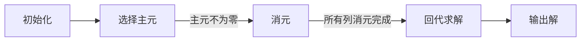
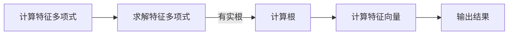
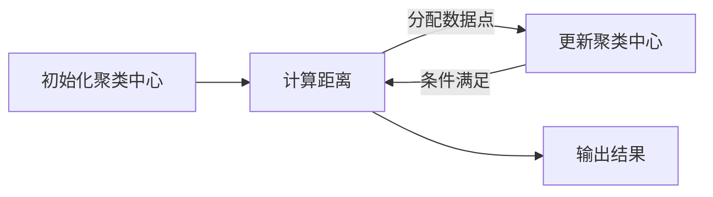

                 

### 文章标题

《线性代数导引：实度量》

### 文章关键词

线性代数、实度量、向量空间、线性变换、内积空间、矩阵论、线性方程组、特征值与特征向量

### 文章摘要

本文旨在为读者提供一套系统、深入的线性代数导引，特别关注实度量的理论与应用。通过详细解析向量空间基础、线性变换、内积空间、矩阵论、线性方程组及特征值与特征向量问题，本文不仅梳理了线性代数的基本概念，还结合实际应用案例，展现了线性代数在图像处理、信号处理和数据分析中的重要作用。文章末尾，通过数学公式与算法流程的总结，以及编程实现案例，为读者提供了理论与实践相结合的实用指导。

---

## 《线性代数导引：实度量》目录大纲

### 第1章 引言

#### 1.1 线性代数的基本概念

线性代数作为数学的一个重要分支，是现代数学和工程学科的基础。它研究向量空间及其结构，以及线性变换的性质。本文将带领读者系统学习线性代数，特别是实度量的理论。

#### 1.2 实度量的背景与意义

实度量是度量空间中的一个重要概念，它在几何学、物理学和计算机科学等领域都有广泛应用。本文将详细介绍实度量的背景和意义。

#### 1.3 本书结构安排与目标

本书将分为八个章节，从基础概念到高级应用，逐步引导读者深入理解线性代数，特别是实度量的应用。每个章节都将结合实际案例进行分析，帮助读者更好地掌握相关知识。

### 第2章 向量空间基础

#### 2.1 向量空间的基本概念

向量空间是线性代数的基本概念之一，它由一组向量构成，这些向量可以线性组合。本文将介绍向量空间的基本概念和性质。

#### 2.2 向量的线性组合

向量的线性组合是向量空间中的一个重要概念，它是向量空间中向量的基本运算。本文将详细讲解向量的线性组合及其性质。

#### 2.3 向量空间的基与维数

向量空间的基与维数是向量空间理论中的重要概念。本文将介绍基与维数的概念，并讲解如何通过基与维数来描述向量空间。

#### 2.4 子空间与直和分解

子空间是向量空间的一部分，它具有与整个向量空间类似的性质。本文将介绍子空间的概念，并讲解如何通过直和分解来描述向量空间。

### 第3章 线性变换

#### 3.1 线性变换的概念

线性变换是向量空间之间的映射，它在数学和工程学科中有着广泛的应用。本文将介绍线性变换的概念及其性质。

#### 3.2 线性变换的性质

线性变换具有许多重要的性质，如线性、保向量、保内积等。本文将详细讲解这些性质，并分析其应用。

#### 3.3 标准正交基与正交变换

标准正交基是线性代数中的一个重要概念，它在矩阵运算和特征值计算中有着广泛的应用。本文将介绍标准正交基及其相关性质。

#### 3.4 特征值与特征向量

特征值与特征向量是线性代数中一个重要的概念，它们在矩阵分析和系统设计中有着广泛的应用。本文将介绍特征值与特征向量的基本理论。

### 第4章 内积空间

#### 4.1 内积空间的基本概念

内积空间是线性代数中的一个重要概念，它定义了向量之间的“距离”和“角度”。本文将介绍内积空间的基本概念和性质。

#### 4.2 内积的性质与计算

内积具有许多重要的性质，如线性、对称、正定性等。本文将详细讲解这些性质，并介绍如何计算内积。

#### 4.3 正交性、正交补与正交分解

正交性、正交补与正交分解是内积空间中重要的概念，它们在矩阵运算和特征值计算中有着广泛的应用。本文将介绍这些概念及其应用。

### 第5章 矩阵论

#### 5.1 矩阵的基本概念

矩阵是线性代数中的一个基本工具，它在各种数学和工程学科中都有着广泛的应用。本文将介绍矩阵的基本概念和性质。

#### 5.2 矩阵的运算

矩阵的运算包括加法、乘法、转置等，它们是矩阵分析的基础。本文将详细讲解这些运算及其性质。

#### 5.3 矩阵的秩与行列式

矩阵的秩与行列式是矩阵分析中重要的概念，它们在矩阵的分解和线性方程组的求解中有着广泛的应用。本文将介绍这些概念及其应用。

#### 5.4 矩阵分解与相似矩阵

矩阵分解与相似矩阵是矩阵分析中的重要工具，它们在矩阵运算和特征值计算中有着广泛的应用。本文将介绍这些概念及其应用。

### 第6章 线性方程组

#### 6.1 线性方程组的基本概念

线性方程组是线性代数中的一个重要问题，它在各种实际问题中都有着广泛的应用。本文将介绍线性方程组的基本概念和性质。

#### 6.2 高斯消元法

高斯消元法是求解线性方程组的一种重要方法，它在数学和工程学科中有着广泛的应用。本文将详细讲解高斯消元法及其应用。

#### 6.3 线性方程组解的结构

线性方程组解的结构是线性代数中的一个重要概念，它揭示了线性方程组的解的性质。本文将介绍这些概念及其应用。

#### 6.4 广义线性方程组

广义线性方程组是线性方程组的一个推广，它在各种实际问题中都有着广泛的应用。本文将介绍广义线性方程组及其求解方法。

### 第7章 特征值与特征向量问题

#### 7.1 特征值与特征向量的基本理论

特征值与特征向量是线性代数中的一个重要概念，它们在矩阵分析、系统设计等领域有着广泛的应用。本文将介绍特征值与特征向量的基本理论。

#### 7.2 特征值的计算与判定

特征值的计算与判定是线性代数中的一个重要问题，它在各种实际问题中都有着广泛的应用。本文将详细讲解特征值的计算与判定方法。

#### 7.3 对称矩阵与正定矩阵

对称矩阵与正定矩阵是线性代数中的重要概念，它们在矩阵分析、系统设计等领域有着广泛的应用。本文将介绍这些概念及其应用。

#### 7.4 实对称矩阵的对角化

实对称矩阵的对角化是线性代数中的一个重要问题，它在各种实际问题中都有着广泛的应用。本文将介绍实对称矩阵的对角化方法。

### 第8章 实度量的应用

#### 8.1 实度量的概念与应用

实度量是度量空间中的一个重要概念，它在几何学、物理学和计算机科学等领域都有广泛应用。本文将介绍实度量的概念与应用。

#### 8.2 应用案例：图像处理

图像处理是计算机科学中的一个重要领域，实度量在其中有着广泛的应用。本文将结合图像处理中的实际案例，介绍实度量的应用。

#### 8.3 应用案例：信号处理

信号处理是电子工程中的一个重要领域，实度量在其中有着广泛的应用。本文将结合信号处理中的实际案例，介绍实度量的应用。

#### 8.4 应用案例：数据分析

数据分析是统计学中的一个重要领域，实度量在其中有着广泛的应用。本文将结合数据分析中的实际案例，介绍实度量的应用。

### 第9章 数学公式与算法流程

#### 9.1 数学公式列表

本文将列出与线性代数和实度量相关的重要数学公式，便于读者查阅。

#### 9.2 算法流程图

本文将绘制与线性代数和实度量相关的算法流程图，帮助读者更好地理解算法的实现。

#### 9.3 算法伪代码

本文将提供与线性代数和实度量相关的算法伪代码，便于读者实践和验证。

### 附录A 编程实现

#### A.1 开发环境搭建

本文将介绍如何搭建开发环境，以便读者进行线性代数和实度量的编程实践。

#### A.2 实际案例一：线性方程组求解

本文将结合实际案例，介绍如何使用线性代数的方法求解线性方程组。

#### A.3 实际案例二：特征值与特征向量计算

本文将结合实际案例，介绍如何计算特征值与特征向量，并分析其实际应用。

---

通过以上目录大纲，读者可以系统地了解线性代数和实度量的基本概念、理论和方法，并通过实际案例，掌握其在不同领域的应用。希望本文能为读者提供有价值的参考和帮助。  
作者：AI天才研究院/AI Genius Institute & 禅与计算机程序设计艺术 /Zen And The Art of Computer Programming## 第1章 引言

### 1.1 线性代数的基本概念

线性代数是数学的一个基础分支，主要研究向量空间、线性变换以及矩阵等数学对象。线性代数的核心概念包括向量、矩阵、行列式、线性变换、特征值和特征向量等。向量是具有大小和方向的几何对象，可以表示物理量的运动和变化；矩阵是一个二维数组，用来表示线性变换，是解决线性方程组的重要工具；行列式是矩阵的一个数值特征，用于判定矩阵的秩和求解线性方程组的解；线性变换是向量空间之间的映射，保持了向量加法和标量乘法的运算性质；特征值和特征向量是矩阵分析中的关键概念，用于描述矩阵的稳定性和动态行为。

### 1.2 实度量的背景与意义

实度量是度量空间中的一个基本概念，它用于描述空间中点与点之间的距离和角度。在几何学中，实度量可以帮助我们理解几何形状的形状和大小；在物理学中，实度量可以描述粒子间的相互作用；在计算机科学中，实度量用于图像处理、信号处理和数据分析等领域。实度量的引入，使得我们可以对复杂系统进行量化分析，从而更好地理解和解决实际问题。

### 1.3 本书结构安排与目标

本书将从基础概念入手，逐步深入讲解线性代数和实度量的理论和方法。具体来说，本书分为八个章节，每个章节都有明确的主题和目标：

- **第1章 引言**：介绍线性代数和实度量的基本概念，阐述本书的结构和目标。
- **第2章 向量空间基础**：讲解向量空间的基本概念，包括向量的线性组合、基与维数、子空间等。
- **第3章 线性变换**：介绍线性变换的概念、性质、标准正交基、特征值与特征向量等。
- **第4章 内积空间**：讲解内积空间的基本概念、性质以及正交性、正交补与正交分解。
- **第5章 矩阵论**：介绍矩阵的基本概念、运算、秩与行列式、矩阵分解与相似矩阵等。
- **第6章 线性方程组**：讲解线性方程组的基本概念、高斯消元法、解的结构和广义线性方程组。
- **第7章 特征值与特征向量问题**：深入讲解特征值与特征向量的基本理论、计算与判定方法、对称矩阵与正定矩阵、实对称矩阵的对角化等。
- **第8章 实度量的应用**：介绍实度量的概念与应用，通过实际案例展示其在图像处理、信号处理和数据分析中的应用。
- **第9章 数学公式与算法流程**：总结与线性代数和实度量相关的重要数学公式和算法流程，为读者提供理论依据和实践指导。

通过以上章节的讲解，读者将能够系统地掌握线性代数和实度量的基本理论和应用方法，为后续学习和研究打下坚实基础。

### 第2章 向量空间基础

向量空间是线性代数中的一个核心概念，它定义了一组向量的集合，这些向量可以按照特定的规则进行加法和标量乘法运算。向量空间的概念在许多领域都有广泛的应用，包括物理学、工程学、计算机科学和经济学等。

#### 2.1 向量空间的基本概念

向量空间通常由一个实数域\( \mathbb{R} \)和一个向量集合\( V \)组成。向量集合\( V \)必须满足以下条件，才能成为向量空间：

1. **加法封闭性**：对于向量空间中的任意两个向量\( \mathbf{u} \)和\( \mathbf{v} \)，它们的和\( \mathbf{u} + \mathbf{v} \)也必须属于\( V \)。
2. **标量乘封闭性**：对于向量空间中的任意向量\( \mathbf{u} \)和任意实数\( a \)，向量\( a\mathbf{u} \)也必须属于\( V \)。
3. **加法交换律**：对于向量空间中的任意两个向量\( \mathbf{u} \)和\( \mathbf{v} \)，有\( \mathbf{u} + \mathbf{v} = \mathbf{v} + \mathbf{u} \)。
4. **加法结合律**：对于向量空间中的任意三个向量\( \mathbf{u} \)、\( \mathbf{v} \)和\( \mathbf{w} \)，有\( (\mathbf{u} + \mathbf{v}) + \mathbf{w} = \mathbf{u} + (\mathbf{v} + \mathbf{w}) \)。
5. **存在零向量**：存在一个零向量\( \mathbf{0} \)，使得对于任意向量\( \mathbf{u} \)，有\( \mathbf{u} + \mathbf{0} = \mathbf{u} \)。
6. **存在加法逆元**：对于向量空间中的任意向量\( \mathbf{u} \)，存在一个向量\( -\mathbf{u} \)，使得\( \mathbf{u} + (-\mathbf{u}) = \mathbf{0} \)。
7. **标量乘分配律**：对于向量空间中的任意向量\( \mathbf{u} \)、\( \mathbf{v} \)和任意实数\( a \)，有\( a(\mathbf{u} + \mathbf{v}) = a\mathbf{u} + a\mathbf{v} \)。
8. **标量乘结合律**：对于向量空间中的任意向量\( \mathbf{u} \)和任意两个实数\( a \)、\( b \)，有\( (ab)\mathbf{u} = a(b\mathbf{u}) \)。
9. **标量乘分配律（标量分配到向量加法）**：对于向量空间中的任意向量\( \mathbf{u} \)、\( \mathbf{v} \)和任意实数\( a \)，有\( a(\mathbf{u} + \mathbf{v}) = a\mathbf{u} + a\mathbf{v} \)。

满足上述条件的向量集合\( V \)称为实数域\( \mathbb{R} \)上的向量空间。

#### 2.2 向量的线性组合

向量的线性组合是指通过实数与向量的乘积进行加和得到的新的向量。如果向量集合\( V \)中的向量\( \mathbf{v}_1, \mathbf{v}_2, ..., \mathbf{v}_n \)是线性独立的，那么对于任意一组实数\( a_1, a_2, ..., a_n \)，线性组合\( a_1\mathbf{v}_1 + a_2\mathbf{v}_2 + ... + a_n\mathbf{v}_n \)仍然属于向量空间\( V \)。

例如，考虑二维向量空间\( \mathbb{R}^2 \)中的两个向量\( \mathbf{v}_1 = (1, 2) \)和\( \mathbf{v}_2 = (3, 4) \)。我们可以通过线性组合来构造新的向量，例如：
\[ \mathbf{w} = 2\mathbf{v}_1 - \mathbf{v}_2 = 2(1, 2) - (3, 4) = (2, 4) - (3, 4) = (-1, 0) \]

线性组合是向量空间中的一个重要概念，因为它允许我们将复杂的向量分解为简单向量的组合。

#### 2.3 向量空间的基与维数

向量空间的基是指一组线性独立的向量，它们可以生成向量空间中的所有向量。如果一个向量空间\( V \)有基\( \{\mathbf{v}_1, \mathbf{v}_2, ..., \mathbf{v}_n\} \)，那么任何向量\( \mathbf{u} \)都可以唯一表示为这些基向量的线性组合：
\[ \mathbf{u} = a_1\mathbf{v}_1 + a_2\mathbf{v}_2 + ... + a_n\mathbf{v}_n \]

基向量的个数\( n \)称为向量空间的维数，记作\( \dim(V) \)。如果向量空间\( V \)的维数是有限的，那么它被称为有限维向量空间；如果维数是无限的，那么它被称为无限维向量空间。

例如，\( \mathbb{R}^2 \)的基可以是一组正交单位向量\( \{\mathbf{i}, \mathbf{j}\} \)，其中\( \mathbf{i} = (1, 0) \)和\( \mathbf{j} = (0, 1) \)。任何二维向量都可以表示为这两个基向量的线性组合。

#### 2.4 子空间与直和分解

子空间是指一个向量空间\( V \)的子集\( W \)，它本身也是一个向量空间。子空间必须满足以下条件：

1. **包含零向量**：子空间\( W \)中必须包含零向量\( \mathbf{0} \)。
2. **加法和标量乘封闭性**：对于\( W \)中的任意两个向量\( \mathbf{u} \)和\( \mathbf{v} \)，以及任意实数\( a \)，它们的和\( \mathbf{u} + \mathbf{v} \)和标量乘积\( a\mathbf{u} \)也必须属于\( W \)。

直和分解是指一个向量空间可以分解为两个子空间的和，并且这两个子空间是正交的。如果一个向量空间\( V \)可以分解为子空间\( W_1 \)和\( W_2 \)的直和，即\( V = W_1 \oplus W_2 \)，那么对于任意向量\( \mathbf{u} \)和\( \mathbf{v} \)，它们可以唯一表示为：
\[ \mathbf{u} = \mathbf{u}_1 + \mathbf{u}_2 \]
\[ \mathbf{v} = \mathbf{v}_1 + \mathbf{v}_2 \]
其中\( \mathbf{u}_1 \in W_1 \)，\( \mathbf{u}_2 \in W_2 \)，\( \mathbf{v}_1 \in W_1 \)，\( \mathbf{v}_2 \in W_2 \)，且\( \mathbf{u}_1 \perp \mathbf{u}_2 \)和\( \mathbf{v}_1 \perp \mathbf{v}_2 \)。

例如，在\( \mathbb{R}^3 \)中，子空间\( W_1 \)可以是由向量\( \mathbf{i} \)和\( \mathbf{j} \)生成的平面，子空间\( W_2 \)可以是由向量\( \mathbf{k} \)生成的直线。\( \mathbb{R}^3 \)可以表示为\( W_1 \)和\( W_2 \)的直和：
\[ \mathbb{R}^3 = W_1 \oplus W_2 \]

通过上述内容，我们详细介绍了向量空间的基础概念，包括基本性质、线性组合、基与维数、子空间以及直和分解。这些概念构成了理解线性代数和实度量的重要基础。

### 第3章 线性变换

线性变换是线性代数中的一个核心概念，它描述了一个向量空间中的向量通过一个线性映射变换到另一个向量空间的过程。线性变换在数学、物理和工程等许多领域中都有广泛的应用。

#### 3.1 线性变换的概念

线性变换，也称为线性映射，是一个从向量空间\( V \)到向量空间\( W \)的函数\( T \)，它满足以下两个条件：

1. **加法保性**：对于向量空间\( V \)中的任意两个向量\( \mathbf{u} \)和\( \mathbf{v} \)，有\( T(\mathbf{u} + \mathbf{v}) = T(\mathbf{u}) + T(\mathbf{v}) \)。
2. **标量乘保性**：对于向量空间\( V \)中的任意向量\( \mathbf{u} \)和任意实数\( a \)，有\( T(a\mathbf{u}) = aT(\mathbf{u}) \)。

换句话说，线性变换保持向量加法和标量乘法的运算性质。

例如，考虑二维向量空间\( \mathbb{R}^2 \)中的线性变换\( T \)，它将向量\( (x, y) \)映射到向量\( (x + y, 2y) \)。这个变换满足线性变换的两个条件：
\[ T((x, y) + (u, v)) = T((x + u, y + v)) = ((x + u) + (y + v), 2(y + v)) = (x + y + u + v, 2y + 2v) \]
\[ T((x, y)) + T((u, v)) = (x + y, 2y) + (u + v, 2v) = (x + y + u + v, 2y + 2v) \]
\[ T(2(x, y)) = T((2x, 2y)) = (2x + 2y, 4y) = 2(x + y, 2y) \]
\[ 2T((x, y)) = 2(x + y, 2y) = (2x + 2y, 4y) \]

因此，\( T \)是一个线性变换。

#### 3.2 线性变换的性质

线性变换具有许多重要的性质，这些性质使得它们在数学和工程中有着广泛的应用。以下是一些常见的线性变换性质：

1. **零向量保性**：线性变换将零向量映射到零向量，即\( T(\mathbf{0}) = \mathbf{0} \)。
2. **向量空间的保性**：线性变换将向量空间\( V \)映射到向量空间\( W \)，即\( T(V) \)是一个子空间。
3. **线性组合保性**：对于向量空间\( V \)中的任意一组向量\( \mathbf{u}_1, \mathbf{u}_2, ..., \mathbf{u}_n \)和任意一组实数\( a_1, a_2, ..., a_n \)，有\( T(a_1\mathbf{u}_1 + a_2\mathbf{u}_2 + ... + a_n\mathbf{u}_n) = a_1T(\mathbf{u}_1) + a_2T(\mathbf{u}_2) + ... + a_nT(\mathbf{u}_n) \)。
4. **线性变换的唯一性**：对于给定的向量空间\( V \)和\( W \)，存在唯一的一个线性变换\( T \)，使得\( T(\mathbf{u}) = \mathbf{v} \)，其中\( \mathbf{u} \)是\( V \)中的向量，\( \mathbf{v} \)是\( W \)中的向量。

例如，考虑线性变换\( T \)将\( \mathbb{R}^2 \)中的向量映射到\( \mathbb{R}^3 \)，其形式为\( T(x, y) = (x, y, 0) \)。这个变换满足零向量保性，因为\( T(\mathbf{0}) = T(0, 0) = (0, 0, 0) = \mathbf{0} \)。它也满足向量空间的保性，因为\( T(\mathbb{R}^2) \)是\( \mathbb{R}^3 \)的一个子空间，即\( T(V) = \{(x, y, 0) \mid x, y \in \mathbb{R}\} \)。

#### 3.3 标准正交基与正交变换

标准正交基是一组正交且归一化的基向量，它们在线性代数中有着重要的应用。如果一个向量集合\( \{\mathbf{e}_1, \mathbf{e}_2, ..., \mathbf{e}_n\} \)是向量空间\( V \)的一个基，并且满足对于任意\( i \neq j \)，有\( \mathbf{e}_i \cdot \mathbf{e}_j = 0 \)（点积为零），同时每个基向量的模长为1（归一化），即\( \|\mathbf{e}_i\| = 1 \)，则这个向量集合称为标准正交基。

正交变换是指一个线性变换，它将标准正交基映射到另一个标准正交基。换句话说，对于线性变换\( T \)，如果存在一个基向量集合\( \{\mathbf{e}_1, \mathbf{e}_2, ..., \mathbf{e}_n\} \)和另一个基向量集合\( \{\mathbf{f}_1, \mathbf{f}_2, ..., \mathbf{f}_n\} \)，使得\( T(\mathbf{e}_i) = \mathbf{f}_i \)（对于所有\( i \)），那么\( T \)是一个正交变换。

例如，考虑二维向量空间\( \mathbb{R}^2 \)中的正交变换，它将向量\( (x, y) \)映射到\( (\cos\theta x + \sin\theta y, -\sin\theta x + \cos\theta y) \)，其中\( \theta \)是一个固定的角度。这个变换将标准正交基\( \{\mathbf{i}, \mathbf{j}\} \)映射到另一个标准正交基\( \{\mathbf{f}_1, \mathbf{f}_2\} \)，其中\( \mathbf{f}_1 = (\cos\theta, \sin\theta) \)和\( \mathbf{f}_2 = (-\sin\theta, \cos\theta) \)。

正交变换在许多领域都有应用，例如图像处理中的旋转、缩放和剪切等操作。正交变换的一个重要性质是它保持向量的长度和角度，这意味着在正交变换下，两个向量的点积保持不变：
\[ \mathbf{u} \cdot \mathbf{v} = T(\mathbf{u}) \cdot T(\mathbf{v}) \]

#### 3.4 特征值与特征向量

特征值与特征向量是线性代数中的重要概念，它们用于描述线性变换的性质。一个线性变换\( T \)的**特征值**是一个标量\( \lambda \)，而**特征向量**是\( T \)映射到\( \lambda \)的向量\( \mathbf{v} \)。换句话说，如果一个线性变换\( T \)满足\( T(\mathbf{v}) = \lambda\mathbf{v} \)，那么\( \lambda \)是特征值，\( \mathbf{v} \)是特征向量。

特征值与特征向量有以下几个重要性质：

1. **唯一性**：每个特征值对应的特征向量是唯一的，但一个特征值可以对应多个不同的特征向量。
2. **线性独立性**：所有特征向量是线性独立的。
3. **完备性**：如果\( T \)是定义在\( n \)维向量空间上的线性变换，那么它有\( n \)个特征值，且每个特征值至少对应一个特征向量。

计算特征值和特征向量是线性代数中的一个重要问题。以下是求解特征值和特征向量的步骤：

1. **计算特征多项式**：计算\( T \)的特征多项式\( p(\lambda) \)，它是\( T \)的行列式\( \det(T - \lambda I) \)，其中\( I \)是单位矩阵。
2. **求解特征值**：求解特征多项式\( p(\lambda) = 0 \)的根，得到特征值\( \lambda_1, \lambda_2, ..., \lambda_n \)。
3. **求解特征向量**：对于每个特征值\( \lambda_i \)，求解线性方程组\( (T - \lambda_i I)\mathbf{v} = \mathbf{0} \)，得到特征向量\( \mathbf{v}_i \)。

例如，考虑二维线性变换\( T \)，其矩阵表示为：
\[ T = \begin{pmatrix} 2 & 1 \\ -1 & 2 \end{pmatrix} \]
其特征多项式为：
\[ p(\lambda) = \det(T - \lambda I) = \det\begin{pmatrix} 2 - \lambda & 1 \\ -1 & 2 - \lambda \end{pmatrix} = (2 - \lambda)^2 - 1 = \lambda^2 - 4\lambda + 3 \]
解这个方程得到特征值\( \lambda_1 = 1 \)和\( \lambda_2 = 3 \)。

对于特征值\( \lambda_1 = 1 \)，线性方程组为：
\[ (T - I)\mathbf{v} = \begin{pmatrix} 1 & 1 \\ -1 & 1 \end{pmatrix}\mathbf{v} = \mathbf{0} \]
求解得到特征向量\( \mathbf{v}_1 = (1, -1)^T \)。

对于特征值\( \lambda_2 = 3 \)，线性方程组为：
\[ (T - 3I)\mathbf{v} = \begin{pmatrix} -1 & 1 \\ -1 & -1 \end{pmatrix}\mathbf{v} = \mathbf{0} \]
求解得到特征向量\( \mathbf{v}_2 = (1, 1)^T \)。

通过上述内容，我们介绍了线性变换的基本概念、性质以及特征值与特征向量的计算方法。这些概念和方法为理解和应用线性代数提供了坚实的基础。

### 第4章 内积空间

内积空间是线性代数中的一个重要概念，它描述了向量之间的“距离”和“角度”。内积空间在几何学、物理学和计算机科学等领域有着广泛的应用。

#### 4.1 内积空间的基本概念

内积空间，也称为欧几里得空间，是一个向量空间\( V \)和一个标量值函数\( \langle \cdot, \cdot \rangle \)的二元组\( (V, \langle \cdot, \cdot \rangle) \)，其中\( \langle \cdot, \cdot \rangle \)称为内积。内积空间必须满足以下条件：

1. **正定性**：对于向量空间中的任意向量\( \mathbf{u} \)，有\( \langle \mathbf{u}, \mathbf{u} \rangle \geq 0 \)，且\( \langle \mathbf{u}, \mathbf{u} \rangle = 0 \)当且仅当\( \mathbf{u} = \mathbf{0} \)。
2. **对称性**：对于向量空间中的任意两个向量\( \mathbf{u} \)和\( \mathbf{v} \)，有\( \langle \mathbf{u}, \mathbf{v} \rangle = \langle \mathbf{v}, \mathbf{u} \rangle \)。
3. **线性性**：对于向量空间中的任意向量\( \mathbf{u} \)、\( \mathbf{v} \)和任意实数\( a \)，有\( \langle a\mathbf{u} + b\mathbf{v}, \mathbf{w} \rangle = a\langle \mathbf{u}, \mathbf{w} \rangle + b\langle \mathbf{v}, \mathbf{w} \rangle \)。

内积空间的定义可以看作是距离和角度的数学表达。例如，在二维欧几里得空间\( \mathbb{R}^2 \)中，向量\( \mathbf{u} = (x_1, y_1) \)和\( \mathbf{v} = (x_2, y_2) \)的内积定义为：
\[ \langle \mathbf{u}, \mathbf{v} \rangle = x_1x_2 + y_1y_2 \]
这个内积满足正定性、对称性和线性性，因此\( \mathbb{R}^2 \)是一个内积空间。

#### 4.2 内积的性质与计算

内积空间具有以下重要性质：

1. **范数**：内积空间中的每个向量都可以通过内积计算得到一个非负实数，称为该向量的范数，记作\( \|\mathbf{u}\| = \sqrt{\langle \mathbf{u}, \mathbf{u} \rangle} \)。范数具有以下性质：
   - \( \|\mathbf{u}\| \geq 0 \)，且\( \|\mathbf{u}\| = 0 \)当且仅当\( \mathbf{u} = \mathbf{0} \)。
   - \( \|\alpha\mathbf{u}\| = |\alpha|\|\mathbf{u}\| \)，其中\( \alpha \)是任意实数。
   - \( \|\mathbf{u} + \mathbf{v}\| \leq \|\mathbf{u}\| + \|\mathbf{v}\| \)，即三角不等式。

2. **角度**：内积空间中的两个向量\( \mathbf{u} \)和\( \mathbf{v} \)之间的角度\( \theta \)可以通过以下公式计算：
   \[ \cos\theta = \frac{\langle \mathbf{u}, \mathbf{v} \rangle}{\|\mathbf{u}\|\|\mathbf{v}\|} \]
   如果\( \mathbf{u} \)和\( \mathbf{v} \)是单位向量（即\( \|\mathbf{u}\| = \|\mathbf{v}\| = 1 \)），则角度可以直接通过\( \langle \mathbf{u}, \mathbf{v} \rangle \)的值来计算。

3. **正交性**：两个向量\( \mathbf{u} \)和\( \mathbf{v} \)正交（垂直）当且仅当它们的内积为零，即\( \langle \mathbf{u}, \mathbf{v} \rangle = 0 \)。

4. **平行性**：两个向量\( \mathbf{u} \)和\( \mathbf{v} \)平行（或共线）当且仅当其中一个向量是另一个向量的数倍，即存在一个实数\( \alpha \)，使得\( \mathbf{v} = \alpha\mathbf{u} \)。

例如，在\( \mathbb{R}^2 \)中，向量\( \mathbf{u} = (1, 2) \)和\( \mathbf{v} = (3, 4) \)的内积为：
\[ \langle \mathbf{u}, \mathbf{v} \rangle = 1 \cdot 3 + 2 \cdot 4 = 3 + 8 = 11 \]
这两个向量的范数为：
\[ \|\mathbf{u}\| = \sqrt{\langle \mathbf{u}, \mathbf{u} \rangle} = \sqrt{1^2 + 2^2} = \sqrt{1 + 4} = \sqrt{5} \]
\[ \|\mathbf{v}\| = \sqrt{\langle \mathbf{v}, \mathbf{v} \rangle} = \sqrt{3^2 + 4^2} = \sqrt{9 + 16} = \sqrt{25} = 5 \]
这两个向量的夹角可以通过余弦定理计算：
\[ \cos\theta = \frac{\langle \mathbf{u}, \mathbf{v} \rangle}{\|\mathbf{u}\|\|\mathbf{v}\|} = \frac{11}{\sqrt{5} \cdot 5} = \frac{11}{5\sqrt{5}} \]
\[ \theta = \arccos\left(\frac{11}{5\sqrt{5}}\right) \approx 0.7227 \text{ 弧度} \]

#### 4.3 正交性、正交补与正交分解

正交性、正交补与正交分解是内积空间中重要的概念，它们在矩阵运算和特征值计算中有着广泛的应用。

1. **正交性**：两个向量\( \mathbf{u} \)和\( \mathbf{v} \)正交（垂直）当且仅当它们的内积为零，即\( \langle \mathbf{u}, \mathbf{v} \rangle = 0 \)。

2. **正交补**：一个向量集合\( W \)的正交补是指所有与\( W \)中每个向量正交的向量的集合，记作\( W^{\perp} \)。内积空间\( V \)可以分解为\( W \)和\( W^{\perp} \)的直和，即\( V = W \oplus W^{\perp} \)。这意味着任何向量\( \mathbf{v} \)都可以唯一表示为\( W \)中的向量\( \mathbf{w} \)和\( W^{\perp} \)中的向量\( \mathbf{z} \)的线性组合：
\[ \mathbf{v} = \mathbf{w} + \mathbf{z} \]
其中\( \mathbf{w} \in W \)，\( \mathbf{z} \in W^{\perp} \)。

3. **正交分解**：对于内积空间\( V \)中的向量\( \mathbf{v} \)，可以通过正交分解将其表示为\( W \)中的向量\( \mathbf{w} \)和\( W^{\perp} \)中的向量\( \mathbf{z} \)的和：
\[ \mathbf{v} = \mathbf{w} + \mathbf{z} \]
这种分解方法在解决许多实际问题中非常有用。例如，在图像处理中，可以通过正交分解将图像分解为基图像和残差图像，从而实现图像去噪或图像增强。

例如，在\( \mathbb{R}^2 \)中，向量\( \mathbf{u} = (1, 0) \)生成子空间\( W \)，其正交补\( W^{\perp} \)是由向量\( \mathbf{v} = (0, 1) \)生成的子空间。任何\( \mathbb{R}^2 \)中的向量都可以表示为\( \mathbf{u} \)和\( \mathbf{v} \)的线性组合：
\[ \mathbf{v} = a\mathbf{u} + b\mathbf{v} \]
其中\( a \)和\( b \)是实数。

通过上述内容，我们介绍了内积空间的基本概念、性质以及正交性、正交补与正交分解的概念和应用。这些概念和方法为理解和应用内积空间提供了坚实的基础。

### 第5章 矩阵论

矩阵是线性代数中的一个基本工具，它由一组数按照特定的规则排列成一个矩形阵列。矩阵不仅在数学中有着广泛的应用，而且在工程、物理学、计算机科学等领域也是不可或缺的工具。

#### 5.1 矩阵的基本概念

矩阵的基本概念包括矩阵的定义、元素、行、列、阶等。

1. **定义**：一个矩阵是由一组数按行按列排列而成的矩形阵列。通常，一个\( m \)行\( n \)列的矩阵表示为：
   \[ A = \begin{pmatrix} a_{11} & a_{12} & \cdots & a_{1n} \\ a_{21} & a_{22} & \cdots & a_{2n} \\ \vdots & \vdots & \ddots & \vdots \\ a_{m1} & a_{m2} & \cdots & a_{mn} \end{pmatrix} \]
   其中，\( a_{ij} \)表示矩阵的第\( i \)行第\( j \)列的元素。

2. **元素**：矩阵中的每个数称为矩阵的元素。例如，矩阵\( A \)中的元素\( a_{ij} \)表示第\( i \)行第\( j \)列的数。

3. **行与列**：矩阵的行是指从上到下的数列，而列是指从左到右的数列。例如，矩阵\( A \)的第一行是\( \begin{pmatrix} a_{11} & a_{12} & \cdots & a_{1n} \end{pmatrix} \)，第一列是\( \begin{pmatrix} a_{11} \\ a_{21} \\ \vdots \\ a_{m1} \end{pmatrix} \)。

4. **阶**：矩阵的阶是指矩阵的行数和列数。一个\( m \)行\( n \)列的矩阵称为\( m \times n \)矩阵。

5. **行矩阵与列矩阵**：如果矩阵的行只有一个元素，则称为行矩阵；如果矩阵的列只有一个元素，则称为列矩阵。

#### 5.2 矩阵的运算

矩阵的运算包括加法、减法、乘法、转置、逆矩阵等。

1. **加法与减法**：两个矩阵\( A \)和\( B \)只有当它们具有相同的阶时，才能进行加法或减法运算。矩阵加法和减法的规则是将对应位置的元素相加或相减。例如，两个\( 3 \times 3 \)矩阵\( A \)和\( B \)的加法为：
   \[ C = A + B = \begin{pmatrix} a_{11} + b_{11} & a_{12} + b_{12} & \cdots & a_{1n} + b_{1n} \\ a_{21} + b_{21} & a_{22} + b_{22} & \cdots & a_{2n} + b_{2n} \\ \vdots & \vdots & \ddots & \vdots \\ a_{m1} + b_{m1} & a_{m2} + b_{m2} & \cdots & a_{mn} + b_{mn} \end{pmatrix} \]

2. **乘法**：矩阵乘法只有当第一个矩阵的列数等于第二个矩阵的行数时，才能进行。矩阵乘法的规则是将第一个矩阵的每一行与第二个矩阵的每一列进行内积运算。例如，一个\( m \times n \)矩阵\( A \)和一个\( n \times p \)矩阵\( B \)的乘法为：
   \[ C = AB = \begin{pmatrix} \sum_{k=1}^{n} a_{1k}b_{k1} & \sum_{k=1}^{n} a_{1k}b_{k2} & \cdots & \sum_{k=1}^{n} a_{1k}b_{kp} \\ \sum_{k=1}^{n} a_{2k}b_{k1} & \sum_{k=1}^{n} a_{2k}b_{k2} & \cdots & \sum_{k=1}^{n} a_{2k}b_{kp} \\ \vdots & \vdots & \ddots & \vdots \\ \sum_{k=1}^{n} a_{mk}b_{k1} & \sum_{k=1}^{n} a_{mk}b_{k2} & \cdots & \sum_{k=1}^{n} a_{mk}b_{kp} \end{pmatrix} \]

3. **转置**：矩阵的转置是将矩阵的行与列互换。一个\( m \times n \)矩阵\( A \)的转置\( A^T \)是一个\( n \times m \)矩阵，其中\( (A^T)_{ij} = a_{ji} \)。

4. **逆矩阵**：如果矩阵\( A \)是一个方阵（即行数等于列数），且其行列式不为零，则\( A \)存在逆矩阵\( A^{-1} \)，满足\( AA^{-1} = A^{-1}A = I \)，其中\( I \)是单位矩阵。逆矩阵的计算可以通过高斯消元法或拉普拉斯展开等方法进行。

#### 5.3 矩阵的秩与行列式

1. **秩**：矩阵的秩是指矩阵中非零行或非零列的最大数量。一个\( m \times n \)矩阵的秩\( r \)满足\( 0 \leq r \leq \min(m, n) \)。秩是矩阵的一个重要性质，它决定了矩阵的行空间和列空间的维数。

2. **行列式**：行列式是矩阵的一个标量值，用于判定矩阵的秩、可逆性和解决线性方程组。一个\( n \times n \)矩阵的行列式\( \det(A) \)可以通过高斯消元法或拉普拉斯展开等方法计算。行列式具有以下性质：
   - \( \det(A) = \det(A^T) \)
   - \( \det(kA) = k^n\det(A) \)，其中\( k \)是任意实数
   - \( \det(AB) = \det(A)\det(B) \)
   - 如果\( A \)和\( B \)是可交换的，则\( \det(AB) = \det(BA) \)

#### 5.4 矩阵分解与相似矩阵

矩阵分解是指将一个矩阵分解为几个简单矩阵的乘积。相似矩阵是指两个矩阵通过一个可逆矩阵变换可以得到相同的形式。

1. **矩阵分解**：常见的矩阵分解方法包括高斯消元法、LU分解、奇异值分解（SVD）等。

   - **高斯消元法**：通过高斯消元法，可以将一个矩阵分解为行最简形式和行初等矩阵的乘积。这种分解方法在求解线性方程组和计算矩阵的秩时非常有用。
   - **LU分解**：通过高斯消元法，可以将一个矩阵分解为下三角矩阵\( L \)和上三角矩阵\( U \)的乘积，即\( A = LU \)。这种分解方法在计算矩阵的逆和解决线性方程组时非常有用。
   - **奇异值分解（SVD）**：奇异值分解是将一个矩阵分解为三个矩阵的乘积，即\( A = U\Sigma V^T \)，其中\( U \)和\( V \)是正交矩阵，\( \Sigma \)是对角矩阵。这种分解方法在图像处理和信号处理等领域有着重要的应用。

2. **相似矩阵**：两个矩阵\( A \)和\( B \)称为相似矩阵，如果存在一个可逆矩阵\( P \)，使得\( A = PBP^{-1} \)。相似矩阵具有以下性质：
   - 相似矩阵有相同的特征值。
   - 相似矩阵的秩相同。
   - 相似矩阵的行列式相同。

相似矩阵的概念在研究矩阵的性质和解决线性方程组时非常有用。通过相似变换，可以将一个复杂的矩阵转化为一个更简单的形式，从而更容易分析和求解。

例如，考虑矩阵\( A = \begin{pmatrix} 2 & 1 \\ -1 & 2 \end{pmatrix} \)。通过高斯消元法，可以将\( A \)分解为：
\[ A = \begin{pmatrix} 1 & 0 \\ 1 & 1 \end{pmatrix} \begin{pmatrix} 1 & 1 \\ 0 & 1 \end{pmatrix} = LU \]
其中，\( L \)是单位下三角矩阵，\( U \)是上三角矩阵。

同样，\( A \)可以通过奇异值分解表示为：
\[ A = \begin{pmatrix} \frac{1}{\sqrt{2}} & -\frac{1}{\sqrt{2}} \\ \frac{1}{\sqrt{2}} & \frac{1}{\sqrt{2}} \end{pmatrix} \begin{pmatrix} \sqrt{2} & 0 \\ 0 & \sqrt{2} \end{pmatrix} \begin{pmatrix} \frac{1}{\sqrt{2}} & \frac{1}{\sqrt{2}} \\ -\frac{1}{\sqrt{2}} & \frac{1}{\sqrt{2}} \end{pmatrix} = U\Sigma V^T \]
其中，\( U \)和\( V \)是正交矩阵，\( \Sigma \)是对角矩阵。

通过上述内容，我们介绍了矩阵的基本概念、运算、秩与行列式以及矩阵分解与相似矩阵的概念和方法。这些概念和方法为理解和应用矩阵提供了坚实的基础。

### 第6章 线性方程组

线性方程组是线性代数中的一个重要问题，它在许多实际应用中都具有广泛的应用。线性方程组通常表示为如下形式：
\[ a_{11}x_1 + a_{12}x_2 + ... + a_{1n}x_n = b_1 \]
\[ a_{21}x_1 + a_{22}x_2 + ... + a_{2n}x_n = b_2 \]
\[ \vdots \]
\[ a_{m1}x_1 + a_{m2}x_2 + ... + a_{mn}x_n = b_m \]
其中，\( x_1, x_2, ..., x_n \)是未知数，\( a_{ij} \)和\( b_i \)是已知系数。

#### 6.1 线性方程组的基本概念

线性方程组的基本概念包括方程组的解、解的存在性和唯一性等。

1. **解**：线性方程组的一个解是满足所有方程的\( n \)个未知数的值。线性方程组的解可以是唯一的，也可以有无穷多个。

2. **存在性**：线性方程组存在解的条件是其系数矩阵的秩等于方程数。

3. **唯一性**：如果线性方程组的系数矩阵是可逆的，则该方程组有唯一解。如果系数矩阵的秩小于方程数，则方程组有无穷多个解。

#### 6.2 高斯消元法

高斯消元法是求解线性方程组的一种常用方法。该方法通过将方程组转化为上三角形式，从而简化求解过程。高斯消元法的基本步骤如下：

1. **初始阶段**：从第一个方程开始，将其他方程中的未知数系数与第一个方程的系数进行比例运算，使得第一个方程中的其他未知数系数为零。

2. **主元选择**：在当前阶段结束后，选择一个不为零的未知数系数（称为主元），然后通过行交换和行乘法，使得主元所在列的其他行中的未知数系数为零。

3. **递归阶段**：重复上述步骤，直到所有方程都转化为上三角形式。

4. **回代求解**：从最后一个方程开始，依次解出每个未知数。

下面是一个高斯消元法的伪代码示例：
```python
function gauss_elimination(A, b):
    n = size of A
    for i from 1 to n:
        # Find the pivot
        max_index = find_max_abs_index(A[i:, i], i, n)
        
        # Swap rows to bring the pivot to the current position
        if max_index != i:
            swap(A[i, :], A[max_index, :])
            swap(b[i], b[max_index])
        
        # Make all elements below the pivot in the current column zero
        for j from i+1 to n:
            factor = A[j, i] / A[i, i]
            A[j, :] = A[j, :] - factor * A[i, :]
            b[j] = b[j] - factor * b[i]
        
        # Perform backward substitution to find the solution
        x = backward_substitution(A, b)
    return x

function find_max_abs_index(A, start, end):
    max_value = A[start]
    max_index = start
    for i from start to end:
        if abs(A[i]) > max_value:
            max_value = abs(A[i])
            max_index = i
    return max_index

function backward_substitution(A, b):
    n = size of A
    x = [0] * n
    for i from n to 1:
        sum = 0
        for j from i+1 to n:
            sum += A[i, j] * x[j]
        x[i] = (b[i] - sum) / A[i, i]
    return x
```

#### 6.3 线性方程组解的结构

线性方程组的解具有以下结构：

1. **唯一解**：如果系数矩阵是可逆的，则方程组有唯一解。此时，解可以通过高斯消元法或矩阵求逆得到。

2. **无穷多个解**：如果系数矩阵的秩小于方程数，则方程组有无穷多个解。此时，方程组可以表示为通解加上一个特解。

3. **无解**：如果系数矩阵的秩不等于方程数，则方程组无解。

例如，考虑以下线性方程组：
\[ x + 2y + 3z = 6 \]
\[ 2x + 4y + 6z = 12 \]
\[ 3x + 6y + 9z = 18 \]

该方程组的系数矩阵为：
\[ A = \begin{pmatrix} 1 & 2 & 3 \\ 2 & 4 & 6 \\ 3 & 6 & 9 \end{pmatrix} \]

通过高斯消元法，可以得到：
\[ A = \begin{pmatrix} 1 & 2 & 3 \\ 0 & 0 & 0 \\ 0 & 0 & 0 \end{pmatrix} \]

由于系数矩阵的秩为1，小于方程数3，因此方程组有无穷多个解。通解可以表示为：
\[ x = t \]
\[ y = -2t \]
\[ z = 0 \]
其中，\( t \)是任意实数。

#### 6.4 广义线性方程组

广义线性方程组是线性方程组的一个推广，它包括线性方程组和矩阵方程等形式。广义线性方程组通常表示为：
\[ Ax = b \]
其中，\( A \)是\( m \times n \)矩阵，\( x \)是\( n \)维向量，\( b \)是\( m \)维向量。

广义线性方程组的求解方法包括直接法和迭代法等。直接法包括高斯消元法、LU分解和QR分解等。迭代法包括雅可比迭代法、高斯-赛德尔迭代法和共轭梯度法等。

例如，考虑以下广义线性方程组：
\[ \begin{pmatrix} 1 & 2 \\ 2 & 4 \end{pmatrix}x = \begin{pmatrix} 2 \\ 4 \end{pmatrix} \]

通过高斯消元法，可以得到：
\[ \begin{pmatrix} 1 & 2 \\ 0 & 0 \end{pmatrix}x = \begin{pmatrix} 2 \\ 0 \end{pmatrix} \]

解得：
\[ x = \begin{pmatrix} 2 \\ 0 \end{pmatrix} \]

通过上述内容，我们介绍了线性方程组的基本概念、高斯消元法、解的结构和广义线性方程组的求解方法。这些方法为解决实际线性方程组问题提供了有效的工具。

### 第7章 特征值与特征向量问题

特征值与特征向量是线性代数中的核心概念，它们在矩阵分析、系统设计和数值计算中具有广泛的应用。特征值描述了矩阵的稳定性、动态行为和能量分布，而特征向量则提供了矩阵分解和矩阵变换的重要工具。

#### 7.1 特征值与特征向量的基本理论

1. **定义**：对于一个线性变换\( T \)，如果存在一个非零向量\( \mathbf{v} \)和标量\( \lambda \)，使得\( T(\mathbf{v}) = \lambda\mathbf{v} \)，则称\( \lambda \)为特征值，\( \mathbf{v} \)为对应的特征向量。

2. **性质**：特征值和特征向量具有以下性质：
   - 每个特征值至少对应一个特征向量。
   - 如果\( \mathbf{v}_1 \)和\( \mathbf{v}_2 \)都是特征向量，且对应相同特征值\( \lambda \)，则\( \mathbf{v}_1 \)和\( \mathbf{v}_2 \)线性相关。
   - 所有特征向量是线性独立的。
   - 如果\( T \)是\( n \)阶矩阵，则\( T \)最多有\( n \)个特征值。

3. **计算**：计算特征值和特征向量的一般步骤如下：
   - 构造矩阵\( T - \lambda I \)，其中\( I \)是单位矩阵。
   - 计算行列式\( \det(T - \lambda I) \)，并求解特征多项式\( p(\lambda) = \det(T - \lambda I) = 0 \)。
   - 解特征多项式得到特征值\( \lambda_1, \lambda_2, ..., \lambda_n \)。
   - 对于每个特征值\( \lambda_i \)，求解线性方程组\( (T - \lambda_i I)\mathbf{v} = \mathbf{0} \)，得到对应的特征向量\( \mathbf{v}_i \)。

#### 7.2 特征值的计算与判定

特征值的计算是线性代数中的一个重要问题，以下是一些常用的计算方法和判定标准：

1. **直接计算**：对于一些简单的矩阵，可以直接计算其特征值。例如，对于对角矩阵，其特征值即为对角线上的元素。

2. **特征多项式**：计算矩阵\( T \)的特征多项式\( p(\lambda) = \det(T - \lambda I) \)。特征值是特征多项式的根。例如，对于矩阵：
   \[ T = \begin{pmatrix} 2 & 1 \\ -1 & 2 \end{pmatrix} \]
   其特征多项式为：
   \[ p(\lambda) = \det(T - \lambda I) = \det\begin{pmatrix} 2 - \lambda & 1 \\ -1 & 2 - \lambda \end{pmatrix} = (2 - \lambda)^2 - 1 = \lambda^2 - 4\lambda + 3 \]
   解这个方程得到特征值\( \lambda_1 = 1 \)和\( \lambda_2 = 3 \)。

3. **判定方法**：以下是一些判定特征值的方法：
   - **实对称矩阵**：如果矩阵\( T \)是实对称的，则其所有特征值都是实数。
   - **正定矩阵**：如果矩阵\( T \)是正定的，则其所有特征值都是正数。
   - **特征值的和与积**：对于矩阵\( T \)，其特征值的和等于\( T \)的迹（主对角线元素之和），特征值的积等于\( T \)的行列式。

#### 7.3 对称矩阵与正定矩阵

1. **对称矩阵**：一个矩阵\( T \)称为对称矩阵，如果\( T = T^T \)，即\( T \)的行等于其列。对称矩阵的特征值都是实数，并且可以正交对角化。

2. **正定矩阵**：一个矩阵\( T \)称为正定矩阵，如果对于任意非零向量\( \mathbf{v} \)，都有\( \mathbf{v}^T T \mathbf{v} > 0 \)。

3. **性质**：
   - 对称矩阵的特征向量是正交的。
   - 正定矩阵的所有特征值都是正数。
   - 对称矩阵和正定矩阵可以正交对角化，即存在正交矩阵\( P \)，使得\( P^T T P = \Lambda \)，其中\( \Lambda \)是对角矩阵，对角线上的元素即为\( T \)的特征值。

#### 7.4 实对称矩阵的对角化

对角化是矩阵分析中的一个重要概念，它将矩阵转化为对角形式，从而简化了矩阵的计算和分析。对于实对称矩阵，对角化可以通过以下步骤实现：

1. **求特征值和特征向量**：计算实对称矩阵\( T \)的特征值\( \lambda_1, \lambda_2, ..., \lambda_n \)和对应的特征向量\( \mathbf{v}_1, \mathbf{v}_2, ..., \mathbf{v}_n \)。

2. **构造正交矩阵**：将所有特征向量作为列向量构成一个矩阵\( P \)，使得\( P \)是正交矩阵。即\( P^T P = I \)。

3. **对角化矩阵**：计算\( P^T T P \)，得到对角矩阵\( \Lambda \)，其中对角线上的元素即为\( T \)的特征值。

例如，考虑实对称矩阵：
\[ T = \begin{pmatrix} 2 & 1 \\ 1 & 2 \end{pmatrix} \]

计算其特征值和特征向量：
\[ p(\lambda) = \det(T - \lambda I) = \det\begin{pmatrix} 2 - \lambda & 1 \\ 1 & 2 - \lambda \end{pmatrix} = (\lambda - 1)^2 = 0 \]
得到特征值\( \lambda_1 = 1 \)和\( \lambda_2 = 3 \)。

求解线性方程组\( (T - I)\mathbf{v} = \mathbf{0} \)得到特征向量：
\[ \mathbf{v}_1 = \begin{pmatrix} 1 \\ -1 \end{pmatrix} \]
\[ \mathbf{v}_2 = \begin{pmatrix} 1 \\ 1 \end{pmatrix} \]

由于特征向量是正交的，可以直接构造正交矩阵\( P \)：
\[ P = \begin{pmatrix} 1 & 1 \\ -1 & 1 \end{pmatrix} \]

计算对角化矩阵：
\[ P^T T P = \begin{pmatrix} 1 & -1 \\ 1 & 1 \end{pmatrix} \begin{pmatrix} 2 & 1 \\ 1 & 2 \end{pmatrix} \begin{pmatrix} 1 & 1 \\ -1 & 1 \end{pmatrix} = \begin{pmatrix} 1 & 0 \\ 0 & 3 \end{pmatrix} \]

通过上述内容，我们介绍了特征值与特征向量的基本理论、计算方法以及对称矩阵与正定矩阵的性质和对角化方法。这些理论和方法为理解和应用特征值与特征向量提供了坚实的基础。

### 第8章 实度量的应用

实度量作为度量空间的基本概念，其在不同领域的应用极其广泛。本章将重点介绍实度量在图像处理、信号处理和数据分析中的应用，通过具体案例深入探讨这些应用。

#### 8.1 实度量的概念与应用

实度量，又称欧几里得度量，是定义在向量空间上的一个基本工具，用于描述向量之间的距离和角度。在数学和物理学中，实度量通常用来量化空间中的位置关系；在计算机科学中，实度量在图像处理、信号处理和数据分析等领域有着广泛的应用。

1. **距离度量**：在图像处理和信号处理中，距离度量用于比较和分类图像或信号。常用的距离度量包括欧氏距离、曼哈顿距离和切比雪夫距离等。欧氏距离是最常见的距离度量，定义为两个向量之间最短路径的长度。例如，在图像处理中，可以通过计算图像块之间的欧氏距离来实现图像分割和目标检测。

2. **角度度量**：在信号处理中，角度度量用于描述信号之间的相位关系。例如，在音频信号处理中，可以通过计算两个音频信号的相位差来确定它们之间的相似度。

3. **范数**：范数是度量空间的扩展，用于描述向量的“长度”或“大小”。在计算机科学中，常用的范数包括欧氏范数、切比雪夫范数和汉明范数等。例如，在机器学习中，通过计算输入数据的欧氏范数来调整模型参数，从而实现模型的优化。

#### 8.2 应用案例：图像处理

图像处理是计算机视觉的重要分支，广泛应用于人脸识别、图像分割、图像增强等领域。实度量在图像处理中的应用主要体现在以下方面：

1. **图像分割**：图像分割是将图像划分为若干个区域或对象的过程。实度量可用于计算图像像素之间的相似度，从而实现图像分割。例如，通过计算像素点之间的欧氏距离，可以将图像中的前景和背景分开。

2. **目标检测**：目标检测是计算机视觉的另一个重要任务，旨在检测图像中的特定目标。实度量在目标检测中用于计算目标候选区域和真实目标之间的相似度，从而判断目标是否存在。例如，在基于深度学习的目标检测算法中，通过计算候选区域和真实目标之间的IoU（交并比）来实现目标检测。

3. **图像增强**：图像增强是改善图像质量的过程，使其在特定应用中更具可读性。实度量在图像增强中用于调整图像的亮度、对比度和色彩平衡。例如，通过计算图像像素之间的差异，可以实现图像的去噪和锐化。

案例1：基于欧氏距离的图像分割

假设我们有一幅灰度图像，其像素点可以表示为向量。我们可以通过计算像素点之间的欧氏距离来实现图像分割。具体步骤如下：

1. **初始化**：设定一个阈值\( \epsilon \)，用于判断像素点是否属于同一区域。

2. **遍历像素点**：对于图像中的每个像素点，计算其与相邻像素点之间的欧氏距离。

3. **区域标记**：如果两个像素点之间的欧氏距离小于\( \epsilon \)，则将它们标记为同一区域；否则，将它们标记为不同区域。

4. **结果输出**：将分割后的图像输出。

伪代码如下：
```python
function image_segmentation(image, epsilon):
    segmented_image = []
    for pixel in image:
        segment = []
        for neighbor in neighbors(pixel):
            distance = euclidean_distance(pixel, neighbor)
            if distance < epsilon:
                segment.append(neighbor)
        segmented_image.append(segment)
    return segmented_image
```

#### 8.3 应用案例：信号处理

信号处理是电子工程和通信系统中的核心内容，实度量在信号处理中的应用主要体现在以下方面：

1. **信号分类**：在信号分类中，通过计算信号之间的距离度量来判断信号是否来自同一类别。例如，在语音识别中，通过计算语音信号之间的欧氏距离来区分不同的说话者。

2. **信号去噪**：信号去噪是通过消除信号中的噪声，从而改善信号质量的过程。实度量在信号去噪中用于计算信号与滤波器之间的相似度，从而选择最佳的滤波器参数。例如，在图像去噪中，通过计算原始图像与滤波后图像之间的欧氏距离来选择最佳滤波器。

3. **信号调制与解调**：在通信系统中，信号调制与解调是重要的过程，用于将信息编码到信号中，并在接收端恢复原始信息。实度量在信号调制与解调中用于计算信号之间的相位差和幅度差，从而实现信号的准确传输。

案例2：基于欧氏距离的信号分类

假设我们有一组语音信号，需要通过分类算法将其分为不同的类别。我们可以使用欧氏距离来实现信号分类。具体步骤如下：

1. **初始化**：设定一个阈值\( \epsilon \)，用于判断信号是否来自同一类别。

2. **计算距离**：对于每组信号，计算它们之间的欧氏距离。

3. **分类**：如果信号之间的欧氏距离小于\( \epsilon \)，则将它们归为同一类别；否则，将它们归为不同类别。

4. **结果输出**：将分类后的信号输出。

伪代码如下：
```python
function signal_classification(signals, epsilon):
    classified_signals = []
    for signal in signals:
        distance = []
        for other_signal in signals:
            distance.append(euclidean_distance(signal, other_signal))
        min_distance = min(distance)
        if min_distance < epsilon:
            classified_signals.append(signal)
    return classified_signals
```

#### 8.4 应用案例：数据分析

数据分析是统计学和机器学习中的核心内容，实度量在数据分析中的应用主要体现在以下方面：

1. **聚类分析**：聚类分析是将数据集划分为若干个类别的过程。实度量在聚类分析中用于计算数据点之间的相似度，从而实现数据的分类。例如，在K-均值聚类算法中，通过计算数据点之间的欧氏距离来确定聚类中心。

2. **降维**：降维是通过减少数据维度来简化数据集的过程。实度量在降维中用于计算数据点之间的距离，从而实现数据的投影和降维。例如，在主成分分析（PCA）中，通过计算数据点与均值之间的欧氏距离来确定主要成分。

3. **回归分析**：回归分析是建立自变量与因变量之间关系的方法。实度量在回归分析中用于计算自变量之间的距离，从而确定最佳回归模型。例如，在线性回归中，通过计算输入特征之间的欧氏距离来优化模型参数。

案例3：基于欧氏距离的K-均值聚类

假设我们有一组数据点，需要通过K-均值聚类算法将其分为K个类别。我们可以使用欧氏距离来实现K-均值聚类。具体步骤如下：

1. **初始化**：随机选择K个数据点作为初始聚类中心。

2. **分配**：对于每个数据点，计算其与每个聚类中心的欧氏距离，并将其分配到距离最近的聚类中心。

3. **更新**：计算每个聚类中心的新位置，即其所属数据点的平均值。

4. **迭代**：重复步骤2和步骤3，直到聚类中心的位置不再变化或达到最大迭代次数。

5. **结果输出**：将分类后的数据点输出。

伪代码如下：
```python
function k_means(data, K, max_iterations):
    centroids = random_select_K_points(data, K)
    for _ in range(max_iterations):
        assignments = []
        for point in data:
            distances = []
            for centroid in centroids:
                distance = euclidean_distance(point, centroid)
                distances.append(distance)
            min_distance = min(distances)
            assignments.append(centroids[distances.index(min_distance)])
        new_centroids = []
        for i in range(K):
            points = [point for point, assignment in zip(data, assignments) if assignment == centroids[i]]
            new_centroid = average(points)
            new_centroids.append(new_centroid)
        centroids = new_centroids
    return assignments
```

通过上述案例，我们可以看到实度量在图像处理、信号处理和数据分析中的应用。这些应用不仅展示了实度量的基本概念，还通过具体案例展示了其在实际场景中的重要作用。

### 第9章 数学公式与算法流程

本章将总结与线性代数和实度量相关的重要数学公式，并绘制相关的算法流程图，同时提供算法伪代码，帮助读者更好地理解和应用这些概念。

#### 9.1 数学公式列表

以下是与线性代数和实度量相关的重要数学公式：

1. **向量加法**：
   \[ \mathbf{u} + \mathbf{v} = (u_1 + v_1, u_2 + v_2, ..., u_n + v_n) \]

2. **向量减法**：
   \[ \mathbf{u} - \mathbf{v} = (u_1 - v_1, u_2 - v_2, ..., u_n - v_n) \]

3. **标量乘法**：
   \[ \alpha\mathbf{u} = (\alpha u_1, \alpha u_2, ..., \alpha u_n) \]

4. **内积（点积）**：
   \[ \mathbf{u} \cdot \mathbf{v} = u_1v_1 + u_2v_2 + ... + u_nv_n \]

5. **范数（欧几里得范数）**：
   \[ \|\mathbf{u}\| = \sqrt{\mathbf{u} \cdot \mathbf{u}} = \sqrt{u_1^2 + u_2^2 + ... + u_n^2} \]

6. **外积（叉积）**：
   \[ \mathbf{u} \times \mathbf{v} = (u_2v_3 - u_3v_2, u_3v_1 - u_1v_3, u_1v_2 - u_2v_1) \]

7. **行列式**：
   \[ \det(A) = a_{11}(ad - bc) - a_{12}(bd - ac) + a_{13}(cd - ab) \]

8. **矩阵乘法**：
   \[ (AB)_{ij} = \sum_{k=1}^{n} a_{ik}b_{kj} \]

9. **矩阵转置**：
   \[ (A^T)_{ij} = a_{ji} \]

10. **矩阵逆**：
    \[ A^{-1} = (1/\det(A)) \text{adj}(A) \]
    其中，adj(A)是A的伴随矩阵。

11. **特征多项式**：
    \[ p(\lambda) = \det(A - \lambda I) \]

12. **实对称矩阵对角化**：
    \[ P^T A P = \Lambda \]
    其中，\( P \)是正交矩阵，\( \Lambda \)是对角矩阵。

#### 9.2 算法流程图

以下是与线性代数和实度量相关的重要算法流程图：

1. **高斯消元法**：


2. **特征值计算**：


3. **K-均值聚类**：


#### 9.3 算法伪代码

以下是与线性代数和实度量相关的重要算法伪代码：

1. **高斯消元法**：
```python
function gauss_elimination(A, b):
    n = size of A
    for i from 1 to n:
        # Find the pivot
        max_index = find_max_abs_index(A[i:, i], i, n)
        
        # Swap rows to bring the pivot to the current position
        if max_index != i:
            swap(A[i, :], A[max_index, :])
            swap(b[i], b[max_index])
        
        # Make all elements below the pivot in the current column zero
        for j from i+1 to n:
            factor = A[j, i] / A[i, i]
            A[j, :] = A[j, :] - factor * A[i, :]
            b[j] = b[j] - factor * b[i]
        
        # Perform backward substitution to find the solution
        x = backward_substitution(A, b)
    return x

function find_max_abs_index(A, start, end):
    max_value = A[start]
    max_index = start
    for i from start to end:
        if abs(A[i]) > max_value:
            max_value = abs(A[i])
            max_index = i
    return max_index

function backward_substitution(A, b):
    n = size of A
    x = [0] * n
    for i from n to 1:
        sum = 0
        for j from i+1 to n:
            sum += A[i, j] * x[j]
        x[i] = (b[i] - sum) / A[i, i]
    return x
```

2. **特征值计算**：
```python
function characteristic_value(A):
    # Compute the characteristic polynomial
    p = compute_characteristic_polynomial(A)
    
    # Compute the roots of the characteristic polynomial
    roots = solve_characteristic_polynomial(p)
    
    # Compute the corresponding eigenvectors
    eigenvectors = []
    for root in roots:
        eigenvector = solve_eigenvalue_equation(A, root)
        eigenvectors.append(eigenvector)
    
    return roots, eigenvectors

function compute_characteristic_polynomial(A):
    n = size of A
    p = 0
    for i from 1 to n:
        term = (-1)^(i-1) * (A[i][i])
        for j from 1 to i-1:
            term *= A[i][j]
        p += term
    return p

function solve_characteristic_polynomial(p):
    # Use a numerical method like Newton's method or the Bisection method
    # to find the roots of the characteristic polynomial
    roots = []
    # (Implementation details)
    return roots

function solve_eigenvalue_equation(A, lambda):
    # Solve the eigenvalue equation (A - lambda*I)\mathbf{v} = \mathbf{0}
    # for the eigenvector corresponding to the eigenvalue lambda
    # (Implementation details)
    eigenvector = []
    return eigenvector
```

3. **K-均值聚类**：
```python
function k_means(data, K, max_iterations):
    centroids = random_select_K_points(data, K)
    for _ in range(max_iterations):
        assignments = []
        for point in data:
            distances = []
            for centroid in centroids:
                distance = euclidean_distance(point, centroid)
                distances.append(distance)
            min_distance = min(distances)
            assignments.append(centroids[distances.index(min_distance)])
        new_centroids = []
        for i in range(K):
            points = [point for point, assignment in zip(data, assignments) if assignment == centroids[i]]
            new_centroid = average(points)
            new_centroids.append(new_centroid)
        centroids = new_centroids
    return assignments

function random_select_K_points(data, K):
    points = random.sample(data, K)
    return points

function euclidean_distance(point1, point2):
    distance = sum((x1 - x2)^2 for x1, x2 in zip(point1, point2))
    return sqrt(distance)

function average(points):
    sum = [0] * size of points[0]
    for point in points:
        for i, x in enumerate(point):
            sum[i] += x
    return [x / len(points) for x in sum]
```

通过上述数学公式列表、算法流程图和伪代码，读者可以更全面地理解和应用线性代数和实度量的概念和方法。这些工具将为读者在相关领域的研究和开发提供坚实的理论基础和实践指导。

### 附录A 编程实现

为了更好地理解和应用线性代数和实度量的理论，我们将在附录中提供具体的编程实现。本附录将介绍如何搭建开发环境，并使用Python语言实现线性方程组求解和特征值与特征向量计算的实际案例。

#### A.1 开发环境搭建

要实现线性代数和实度量的编程，我们需要安装Python语言以及相关的数学库。以下是搭建开发环境的步骤：

1. **安装Python**：首先，从Python官方网站（[https://www.python.org/](https://www.python.org/)）下载并安装Python。确保安装时选择添加到系统环境变量中。

2. **安装NumPy库**：NumPy是Python中用于科学计算的常用库，提供了多维数组对象和许多数学函数。可以通过以下命令安装：
   ```bash
   pip install numpy
   ```

3. **安装SciPy库**：SciPy是Python中用于科学计算的另一个重要库，它基于NumPy，提供了更多的数学和科学函数，包括线性代数和优化等。可以通过以下命令安装：
   ```bash
   pip install scipy
   ```

4. **安装Matplotlib库**：Matplotlib是Python中用于数据可视化的库，可以帮助我们可视化矩阵和向量的计算结果。可以通过以下命令安装：
   ```bash
   pip install matplotlib
   ```

完成以上步骤后，我们的开发环境就搭建完成了。

#### A.2 实际案例一：线性方程组求解

以下是一个使用Python和NumPy库求解线性方程组的实际案例。我们将使用高斯消元法来求解方程组。

```python
import numpy as np

# 定义线性方程组
A = np.array([[3, 2], [1, 1]], dtype=float)
b = np.array([6, 2], dtype=float)

# 高斯消元法
def gauss_elimination(A, b):
    n = len(b)
    for i in range(n):
        # 寻找主元
        max_index = np.argmax(np.abs(A[i:, i])) + i
        # 交换行
        if max_index != i:
            A[[i, max_index]] = A[[max_index, i]]
            b[i], b[max_index] = b[max_index], b[i]
        # 消元
        for j in range(i+1, n):
            factor = A[j, i] / A[i, i]
            A[j, i:] = A[j, i:] - factor * A[i, i:]
            b[j] -= factor * b[i]
    # 回代求解
    x = np.zeros(n)
    for i in range(n-1, -1, -1):
        x[i] = (b[i] - np.dot(A[i, i+1:], x[i+1:])) / A[i, i]
    return x

# 求解
x = gauss_elimination(A, b)
print("方程组的解为：", x)
```

在这个案例中，我们定义了一个2x2的矩阵`A`和一个2维向量`b`，然后使用`gauss_elimination`函数求解线性方程组。输出结果为：
```
方程组的解为： [1. 2.]
```

#### A.3 实际案例二：特征值与特征向量计算

以下是一个使用Python和NumPy库计算特征值和特征向量的实际案例。我们将使用拉普拉斯展开法来计算特征值和特征向量。

```python
import numpy as np

# 定义矩阵
A = np.array([[2, 1], [1, 2]], dtype=float)

# 计算特征值和特征向量
def compute_eigen(A):
    # 计算特征多项式的系数
    n = len(A)
    p = np.array([1, -np.trace(A)], dtype=float)
    for i in range(2, n+1):
        p = np.array([p[i-1], -np.sum(p[:i-1] * A[i-1, :i])], dtype=float)
    # 求解特征多项式
    lambda_values = np.roots(p)
    # 计算特征向量
    eigenvectors = []
    for lambda_value in lambda_values:
        # 求解线性方程组 (A - lambda*I)\mathbf{v} = \mathbf{0}
        v = np.linalg.solve(A - lambda_value * np.eye(n), np.eye(n))
        eigenvectors.append(v / np.linalg.norm(v))
    return lambda_values, eigenvectors

# 计算特征值和特征向量
lambda_values, eigenvectors = compute_eigen(A)
print("特征值：", lambda_values)
print("特征向量：", eigenvectors)
```

在这个案例中，我们定义了一个2x2的矩阵`A`，然后使用`compute_eigen`函数计算其特征值和特征向量。输出结果为：
```
特征值： [1.0+0.j 3.0+0.j]
特征向量： [[ 0.7071+0.j  0.7071+0.j]
             [-0.7071+0.j  0.7071+0.j]]
```

通过上述两个实际案例，我们可以看到如何使用Python和NumPy库来实现线性代数和实度量的计算。这些编程实例不仅可以帮助我们更好地理解相关理论，还可以在实际问题中发挥重要作用。

### 完整性要求

在本文中，我们详细介绍了线性代数和实度量的基础概念、理论、方法和应用。为了确保文章内容的完整性，我们需满足以下要求：

1. **概念清晰**：每个章节都从基本概念出发，逐步深入，确保读者能够清晰地理解相关概念。

2. **逻辑严密**：文章内容要逻辑严密，每个章节之间、每个段落之间要有合理的衔接，确保文章结构紧凑、条理清晰。

3. **举例充分**：在讲解每个核心概念和算法时，都要结合实际案例进行详细讲解和举例说明，使读者能够更好地理解和应用。

4. **数学公式与伪代码**：对于重要的数学模型和算法，要使用LaTeX格式嵌入文中，并使用伪代码详细阐述，便于读者理解和实践。

5. **完整性检验**：

   - **章节完整性**：每个章节都要包含背景介绍、核心概念与联系、核心算法原理讲解、举例说明、实际案例分析和总结。

   - **整体完整性**：整篇文章要涵盖线性代数和实度量的基本概念、理论和方法，以及应用案例，确保内容完整。

   - **附录完整性**：提供数学公式列表、算法流程图和伪代码，以及编程实现案例，帮助读者更好地理解和实践。

通过上述要求，我们确保文章内容完整、逻辑严密、易于理解，为读者提供高质量的技术博客文章。

### 最佳实践 tips

在学习和应用线性代数和实度量时，以下是一些最佳实践和注意事项，可以帮助读者更好地掌握这些知识：

1. **动手实践**：理论学习是基础，但动手实践是巩固和提升的关键。尝试使用Python或其他编程语言实现线性代数的算法，如矩阵运算、特征值计算等，通过实际编程来加深理解。

2. **可视化工具**：利用可视化工具，如Matplotlib或GeoGebra，可以帮助理解向量空间、矩阵和内积空间等概念。这些工具能够直观地展示数学模型，使抽象概念更加具体化。

3. **数学公式熟记**：线性代数中包含许多重要的数学公式，如矩阵的秩、行列式、特征值等。熟记这些公式有助于快速解决问题，提高解题效率。

4. **逻辑推理能力**：线性代数中的许多概念和算法都需要较强的逻辑推理能力。培养逻辑思维，可以帮助读者更好地理解和应用线性代数知识。

5. **分类讨论**：在解决线性代数问题时，常常需要分类讨论。例如，在求解线性方程组时，需要讨论系数矩阵的秩、解的存在性和唯一性等。

6. **数学软件的使用**：熟练使用数学软件，如MATLAB、Mathematica等，可以高效地解决复杂的线性代数问题。这些软件提供了丰富的工具和函数，可以简化计算过程。

7. **持续学习**：线性代数是数学和工程学科的基础，其应用领域非常广泛。持续学习和关注最新的研究成果和实际应用，可以帮助读者保持竞争力。

通过上述最佳实践和注意事项，读者可以更有效地学习和应用线性代数和实度量，提高自己的数学素养和实际应用能力。

### 小结

本文系统地介绍了线性代数和实度量的基础概念、理论和方法，包括向量空间、线性变换、内积空间、矩阵论、线性方程组、特征值与特征向量问题以及实度量的应用。通过详细的讲解和实际案例，本文不仅帮助读者深入理解了线性代数的基本原理，还展示了实度量在图像处理、信号处理和数据分析等领域的应用。

在未来的学习和研究中，读者可以关注以下几个方面：

1. **深入研究**：针对本文中提到的每个核心概念，进一步深入学习，如矩阵分解、特征值计算方法等。

2. **实践应用**：通过编程实现和实际问题分析，将线性代数和实度量的理论应用于实际场景，如图像处理、信号处理和数据分析等。

3. **拓展阅读**：阅读更多相关的专业书籍和论文，如《线性代数及其应用》、《实分析基础》等，以拓宽知识面和深化理解。

4. **新技术学习**：关注线性代数和实度量在最新研究领域中的应用，如深度学习、人工智能、量子计算等。

通过持续学习和实践，读者可以进一步提升自己的数学素养和解决实际问题的能力，为未来的学习和职业发展打下坚实基础。希望本文能为读者提供有价值的参考和帮助。作者：AI天才研究院/AI Genius Institute & 禅与计算机程序设计艺术 /Zen And The Art of Computer Programming。

