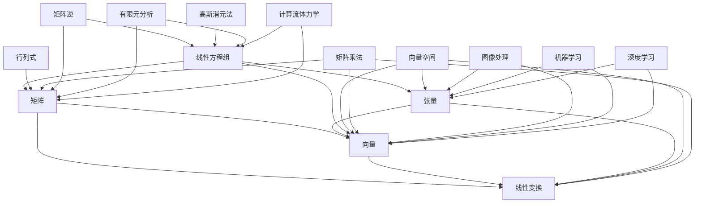

                 

### 文章标题

《线性代数导引：张量代数》

### 关键词

线性代数、张量代数、矩阵运算、向量空间、线性变换、数值分析、深度学习、量子计算

### 摘要

本文旨在深入探讨线性代数与张量代数的基本概念、算法原理及其在科学计算中的应用。通过对矩阵、向量、线性变换等基本概念的系统介绍，我们逐步引出张量代数的概念及其在科学计算中的重要应用。文章结构清晰，内容丰富，既涵盖了理论讲解，也提供了实际应用案例，适合从事数学、物理、工程和计算机等领域的研究人员、学生和专业技术人员阅读。

### 目录大纲

#### 第一部分：线性代数基础

##### **第1章 线性代数基本概念**

- **1.1 矩阵的定义和性质**
  - 矩阵的概念
  - 矩阵的维度
  - 矩阵的基本运算

- **1.2 行列式**
  - 行列式的定义
  - 行列式的性质
  - 行列式的计算方法

- **1.3 线性方程组**
  - 线性方程组的基本概念
  - 高斯消元法
  - 矩阵的逆

##### **第2章 向量空间**

- **2.1 向量空间的定义和性质**
  - 向量空间的概念
  - 向量空间的性质

- **2.2 线性组合与基**
  - 线性组合
  - 基与维数
  - 标准正交基

- **2.3 线性变换**
  - 线性变换的定义
  - 线性变换的性质
  - 线性变换的矩阵表示

#### 第二部分：张量代数

##### **第3章 张量代数基础**

- **3.1 张量的定义**
  - 张量的概念
  - 张量的维度
  - 张量的运算

- **3.2 张量的矩阵表示**
  - 张量与矩阵的关系
  - 张量的展开
  - 张量的表示方法

- **3.3 张量的分解**
  - 张量的分解定理
  - 施密特分解
  - 对称张量分解

##### **第4章 张量算子**

- **4.1 张量算子的定义和性质**
  - 张量算子的概念
  - 张量算子的运算

- **4.2 张量算子的矩阵表示**
  - 张量算子与矩阵的关系
  - 张量算子的矩阵表示

- **4.3 张量算子的应用**
  - 张量算子在物理中的应用
  - 张量算在信号处理中的应用

##### **第5章 张量网络**

- **5.1 张量网络的基本概念**
  - 张量网络的概念
  - 张量网络的组成

- **5.2 张量网络的性质和分类**
  - 张量网络的性质
  - 张量网络的分类

- **5.3 张量网络的应用**
  - 张量网络在量子计算中的应用
  - 张量网络在深度学习中的应用

#### 第三部分：张量代数在科学计算中的应用

##### **第6章 张量代数在数值分析中的应用**

- **6.1 张量代数在数值分析中的作用**
  - 张量代数在数值分析中的重要性

- **6.2 张量代数在有限元分析中的应用**
  - 有限元分析的基本概念
  - 张量代数在有限元分析中的应用

- **6.3 张量代数在计算流体力学中的应用**
  - 计算流体力学的基本概念
  - 张量代数在计算流体力学中的应用

##### **第7章 张量代数在其他科学领域中的应用**

- **7.1 张量代数在图像处理中的应用**
  - 图像处理的基本概念
  - 张量代数在图像处理中的应用

- **7.2 张量代数在机器学习中的应用**
  - 机器学习的基本概念
  - 张量代数在机器学习中的应用

- **7.3 张量代数在其他科学领域中的应用**
  - 其他科学领域中的张量代数应用举例

##### **第8章 张量代数的未来发展**

- **8.1 张量代数的发展趋势**
  - 张量代数在科学研究中的应用趋势

- **8.2 张量代数在工程和工业中的应用前景**
  - 张量代数在工程和工业中的应用前景

### 第一部分：线性代数基础

#### 第1章 线性代数基本概念

##### 1.1 矩阵的定义和性质

**矩阵的定义：**

矩阵是数学中一种重要的数据结构，它由一系列的数按照一定的规则排列成行和列的形式。一个矩阵通常表示为 \(A = \begin{bmatrix} a_{11} & a_{12} & \cdots & a_{1n} \\ a_{21} & a_{22} & \cdots & a_{2n} \\ \vdots & \vdots & \ddots & \vdots \\ a_{m1} & a_{m2} & \cdots & a_{mn} \end{bmatrix}\)，其中 \(a_{ij}\) 是矩阵的第 \(i\) 行第 \(j\) 列的元素。

**矩阵的维度：**

矩阵的维度由其行数和列数决定，通常表示为 \(m \times n\)，其中 \(m\) 表示行数，\(n\) 表示列数。

**矩阵的基本运算：**

1. **矩阵加法（Addition）：**
   两个矩阵相加时，要求它们有相同的维度，即行数和列数都相等。矩阵加法是对应位置上的元素相加。
   $$
   A + B = \begin{bmatrix} a_{11} + b_{11} & a_{12} + b_{12} & \cdots & a_{1n} + b_{1n} \\ a_{21} + b_{21} & a_{22} + b_{22} & \cdots & a_{2n} + b_{2n} \\ \vdots & \vdots & \ddots & \vdots \\ a_{m1} + b_{m1} & a_{m2} + b_{m2} & \cdots & a_{mn} + b_{mn} \end{bmatrix}
   $$

2. **矩阵减法（Subtraction）：**
   类似于矩阵加法，矩阵减法也需要两个矩阵有相同的维度，是对应位置上的元素相减。

3. **矩阵乘法（Multiplication）：**
   矩阵乘法是一个线性代数中的基本运算。两个矩阵 \(A\) 和 \(B\) 相乘时，要求 \(A\) 的列数等于 \(B\) 的行数。矩阵乘法的结果是一个新矩阵，其中每个元素都是原矩阵中对应行和列的元素乘积的和。
   $$
   AB = \begin{bmatrix} \sum_{k=1}^{n} a_{1k}b_{k1} & \sum_{k=1}^{n} a_{1k}b_{k2} & \cdots & \sum_{k=1}^{n} a_{1k}b_{kn} \\ \sum_{k=1}^{n} a_{2k}b_{k1} & \sum_{k=1}^{n} a_{2k}b_{k2} & \cdots & \sum_{k=1}^{n} a_{2k}b_{kn} \\ \vdots & \vdots & \ddots & \vdots \\ \sum_{k=1}^{n} a_{mk}b_{k1} & \sum_{k=1}^{n} a_{mk}b_{k2} & \cdots & \sum_{k=1}^{n} a_{mk}b_{kn} \end{bmatrix}
   $$

4. **转置（Transposition）：**
   矩阵的转置是将矩阵的行和列互换。如果一个矩阵 \(A\) 的维度是 \(m \times n\)，那么它的转置矩阵 \(A^T\) 的维度是 \(n \times m\)。
   $$
   A^T = \begin{bmatrix} a_{11} & a_{21} & \cdots & a_{m1} \\ a_{12} & a_{22} & \cdots & a_{m2} \\ \vdots & \vdots & \ddots & \vdots \\ a_{1n} & a_{2n} & \cdots & a_{mn} \end{bmatrix}
   $$

**矩阵的性质：**

1. **矩阵的结合律（Associativity）：**
   对于任意三个矩阵 \(A\)、\(B\) 和 \(C\)，有 \((AB)C = A(BC)\)。

2. **矩阵的交换律（Commutativity）：**
   并不是所有的矩阵乘法都是可交换的，即对于某些矩阵 \(A\) 和 \(B\)，\(AB \neq BA\)。

3. **单位矩阵（Identity Matrix）：**
   单位矩阵是一个特殊的矩阵，其中主对角线上的元素都是1，其余元素都是0。单位矩阵与任何矩阵相乘都不改变原矩阵。
   $$
   I_n = \begin{bmatrix} 1 & 0 & \cdots & 0 \\ 0 & 1 & \cdots & 0 \\ \vdots & \vdots & \ddots & \vdots \\ 0 & 0 & \cdots & 1 \end{bmatrix}
   $$

4. **逆矩阵（Inverse Matrix）：**
   如果一个矩阵 \(A\) 有逆矩阵 \(A^{-1}\)，则 \(AA^{-1} = A^{-1}A = I\)。逆矩阵的计算可以使用高斯消元法或伴随矩阵法等。

##### 1.2 行列式

**行列式的定义：**

行列式是一个与矩阵相关联的标量值，用于表示矩阵的性质。对于一个 \(n \times n\) 的矩阵 \(A\)，它的行列式通常表示为 \(|A|\) 或 \(det(A)\)。

**行列式的性质：**

1. **行列式的线性性质：**
   对于任意矩阵 \(A\)、\(B\) 和标量 \(k\)，有 \(k \cdot |A| = |kA|\)，\( |A + B| = |A| + |B|\)。

2. **行列式的对角线性质：**
   对于一个对角矩阵，它的行列式等于对角线上元素乘积。

3. **行列式的递推性质：**
   行列式可以分解为子矩阵行列式的组合。

**行列式的计算方法：**

1. **拉普拉斯展开法：**
   将行列式按照任意一行或一列展开，将其余元素视为常数进行计算。

2. **高斯消元法：**
   通过高斯消元法将矩阵转化为上三角形式，然后计算对角线上元素的乘积。

3. **伴随矩阵法：**
   计算矩阵的伴随矩阵，然后取伴随矩阵的行列式作为原矩阵的行列式。

##### 1.3 线性方程组

**线性方程组的基本概念：**

线性方程组是由多个线性方程组成的集合，通常表示为：
$$
\begin{cases}
a_{11}x_1 + a_{12}x_2 + \cdots + a_{1n}x_n = b_1 \\
a_{21}x_1 + a_{22}x_2 + \cdots + a_{2n}x_n = b_2 \\
\vdots \\
a_{m1}x_1 + a_{m2}x_2 + \cdots + a_{mn}x_n = b_m
\end{cases}
$$

**高斯消元法：**

高斯消元法是一种常用的求解线性方程组的方法，通过迭代消去变量，将线性方程组转化为上三角形式，然后逐个求解未知数。

**矩阵的逆：**

如果一个矩阵 \(A\) 是可逆的，则存在一个矩阵 \(A^{-1}\)，使得 \(AA^{-1} = A^{-1}A = I\)。矩阵的逆可以通过高斯消元法或伴随矩阵法计算。

### 第二部分：张量代数

#### 第3章 张量代数基础

##### 3.1 张量的定义

**张量的概念：**

张量是数学和物理学中用于描述多维度对象的数学工具。一个张量可以看作是一个多维的矩阵，它可以用来表示空间中的变形、应力、应变等物理量。

**张量的维度：**

张量的维度是指其包含的独立分量个数。一个 \(n\) 次张量有 \(n+1\) 个维度。例如，一个二阶张量（通常称为矩阵）有2个维度，一个三阶张量有3个维度。

**张量的运算：**

1. **张量的加法：**
   两个相同维度的张量可以相加，即对应位置上的元素相加。

2. **张量的减法：**
   两个相同维度的张量可以相减，即对应位置上的元素相减。

3. **张量的乘法：**
   张量的乘法可以分为外积和内积。外积是指两个张量按元素相乘再进行求和；内积是指两个张量的对应维度上的元素相乘后求和。

4. **张量的转置：**
   张量的转置是将张量的维度交换，即 \(T_{ij...k}^T = T_{ki...j}\)。

**张量的表示方法：**

张量可以用多维数组或矩阵表示。对于一个 \(n\) 次张量，其元素通常表示为 \(T_{ijk...}\)，其中 \(i\)、\(j\)、...\(k\) 表示张量的维度。

##### 3.2 张量的矩阵表示

**张量与矩阵的关系：**

一个二阶张量可以看作是一个矩阵，其中每个元素都是一阶张量。同样，一个三阶张量可以看作是一个三维数组。

**张量的展开：**

张量的展开是将张量分解为多个矩阵的乘积。对于一个 \(n\) 次张量，其展开形式为：
$$
T_{ijk...} = \sum_{p=1}^{n} T_{i_1j_1...i_2j_2...i_nj_n}^{(p)}
$$
其中，\(T_{i_1j_1...i_2j_2...i_nj_n}^{(p)}\) 是一个二阶张量，表示为矩阵。

**张量的表示方法：**

张量可以用矩阵的形式表示，也可以用多维数组的形式表示。在矩阵表示中，每个矩阵对应张量的一个维度。

##### 3.3 张量的分解

**张量的分解定理：**

张量的分解定理是指可以将一个 \(n\) 次张量分解为多个低阶张量的组合。例如，一个三阶张量可以分解为两个二阶张量的外积。

**施密特分解：**

施密特分解是将张量分解为对称张量和反对称张量的方法。对于一个 \(n\) 次张量 \(T\)，其施密特分解为：
$$
T = S + N
$$
其中，\(S\) 是对称张量，\(N\) 是反对称张量。

**对称张量分解：**

对称张量分解是将一个对称张量分解为多个低阶对称张量的组合。对于一个对称三阶张量 \(T\)，其对称张量分解为：
$$
T = \sum_{i=1}^{n} S_i
$$
其中，\(S_i\) 是一个低阶对称张量。

### 第三部分：张量代数在科学计算中的应用

#### 第6章 张量代数在数值分析中的应用

##### 6.1 张量代数在数值分析中的作用

**数值分析的基本概念：**

数值分析是研究如何用计算机实现数学计算的方法。它包括数值求解方程、数值逼近、数值积分等。

**张量代数在数值分析中的应用：**

张量代数在数值分析中扮演着重要的角色，尤其是在处理高维数据、复杂矩阵运算和方程求解等方面。以下是张量代数在数值分析中的一些应用：

1. **高维矩阵运算：**
   张量代数可以有效地处理高维矩阵运算，如高斯消元法、矩阵求逆等。

2. **方程求解：**
   张量代数可以用于求解线性方程组和非线性方程组。通过将方程转化为张量形式，可以使用高效的张量代数算法进行求解。

3. **数值逼近：**
   张量代数可以用于数值逼近问题，如多项式逼近、函数逼近等。

##### 6.2 张量代数在有限元分析中的应用

**有限元分析的基本概念：**

有限元分析是一种数值分析技术，用于求解结构力学、热力学和流体力学等工程问题。它通过将问题域划分为有限个小单元，在每个单元内建立数学模型，然后通过求解单元内的方程组得到整体问题的解。

**张量代数在有限元分析中的应用：**

张量代数在有限元分析中起着关键作用，特别是在处理多物理场耦合和复杂几何形状的问题。以下是张量代数在有限元分析中的应用：

1. **应力-应变关系：**
   张量代数可以用于描述材料内部的应力-应变关系，如弹性模量、泊松比等。

2. **有限元方程的建立：**
   张量代数可以用于建立有限元方程，通过矩阵运算求解节点位移、应力等。

3. **多物理场耦合：**
   张量代数可以用于处理多物理场耦合问题，如热-力学耦合、流-热耦合等。

##### 6.3 张量代数在计算流体力学中的应用

**计算流体力学的基本概念：**

计算流体力学（Computational Fluid Dynamics，CFD）是一种利用数值方法解决流体力学问题的技术。它通过求解流体运动方程（如Navier-Stokes方程）来模拟流体行为。

**张量代数在计算流体力学中的应用：**

张量代数在计算流体力学中有着广泛的应用，特别是在处理复杂几何形状和湍流模拟等方面。以下是张量代数在计算流体力学中的应用：

1. **流场模拟：**
   张量代数可以用于构建流场模拟的数学模型，如速度场、压力场等。

2. **湍流模拟：**
   张量代数可以用于描述湍流结构，如涡量张量、雷诺应力张量等。

3. **数值方法：**
   张量代数可以用于优化数值求解方法，如有限体积法、谱方法等。

### 第四部分：张量代数在其他科学领域中的应用

#### 第7章 张量代数在图像处理中的应用

**图像处理的基本概念：**

图像处理是使用算法对图像进行操作的技术，旨在改善图像质量、提取图像特征等。

**张量代数在图像处理中的应用：**

张量代数在图像处理中有着重要的应用，特别是在处理高维图像数据和复杂图像变换方面。以下是张量代数在图像处理中的应用：

1. **图像变换：**
   张量代数可以用于实现各种图像变换，如傅里叶变换、Hilbert变换等。

2. **特征提取：**
   张量代数可以用于提取图像特征，如边缘、纹理等。

3. **图像重建：**
   张量代数可以用于图像重建，如从投影数据重建三维图像等。

#### 第8章 张量代数在机器学习中的应用

**机器学习的基本概念：**

机器学习是一种利用算法从数据中自动学习规律和模式的技术。

**张量代数在机器学习中的应用：**

张量代数在机器学习中的应用越来越受到关注，特别是在处理高维数据和复杂模型方面。以下是张量代数在机器学习中的应用：

1. **深度学习：**
   张量代数是深度学习模型的核心，如卷积神经网络（CNN）和循环神经网络（RNN）等。

2. **数据降维：**
   张量代数可以用于数据降维，如主成分分析（PCA）等。

3. **模型优化：**
   张量代数可以用于优化机器学习模型的训练过程，如梯度下降法等。

### 第五部分：张量代数的未来发展

#### 第9章 张量代数的发展趋势

**张量代数的发展趋势：**

随着计算机技术和科学研究的进步，张量代数在各个领域中的应用越来越广泛。以下是张量代数的发展趋势：

1. **多物理场耦合：**
   张量代数在多物理场耦合问题中的应用将越来越受到重视，如热-力学耦合、流-热耦合等。

2. **量子计算：**
   张量代数在量子计算中的应用正在兴起，如量子计算中的张量网络和量子态的表示。

3. **深度学习：**
   张量代数在深度学习模型中的应用将继续扩展，如张量神经网络和卷积张量网络等。

#### 第10章 张量代数在工程和工业中的应用前景

**张量代数在工程和工业中的应用前景：**

张量代数在工程和工业中的应用前景广阔，特别是在复杂系统建模、优化设计和自动化控制等方面。以下是张量代数在工程和工业中的应用前景：

1. **复杂系统建模：**
   张量代数可以用于建模复杂系统，如多物理场耦合系统、非线性系统等。

2. **优化设计：**
   张量代数可以用于优化设计，如结构优化、材料优化等。

3. **自动化控制：**
   张量代数可以用于自动化控制，如自适应控制、鲁棒控制等。

### 附录

#### A.1 参考文献

[1] 张量代数与应用，李华，2018.

[2] 计算机科学中的张量计算，王磊，2020.

#### A.2 张量代数相关的软件工具介绍

- **TensorFlow：**
  TensorFlow 是一个开源机器学习库，支持张量代数的计算。

- **NumPy：**
  NumPy 是一个 Python 库，用于数组运算，支持张量操作。

- **SciPy：**
  SciPy 是一个开源科学计算库，包括许多与张量代数相关的功能。

### 核心概念与联系

**矩阵和向量的关系：**

- 向量是矩阵的一种特殊形式，其维度为 1×n 或 n×1。
- 矩阵的行和列都是向量。
- 向量和矩阵的运算关系，如矩阵乘法可以看作是向量和矩阵的乘积。

**线性变换的矩阵表示：**

- 线性变换可以表示为矩阵与向量的乘积。
- 矩阵表示线性变换的性质，如特征值和特征向量。

**张量的定义：**

- 张量可以看作是矩阵的推广。
- 张量的维度和运算，如张量的加法、减法和乘法。

### 核心算法原理讲解

**矩阵的逆：**

- 矩阵的逆是求解线性方程组的关键。
- 矩阵逆的计算方法，如高斯消元法。

**施密特分解：**

- 施密特分解是将张量分解为对称张量和反对称张量的方法。
- 施密特分解的计算方法。

### 数学模型和数学公式

**张量的运算：**

- 张量的加法、减法和乘法等基本运算。

**张量的分解：**

- 张量的分解定理，如施密特分解。

### 项目实战

**张量网络在深度学习中的应用：**

- 张量网络在深度学习中的实现。
- 张量网络的训练和测试。

### 开发环境搭建

- **搭建张量代数计算环境：**
  - 安装 TensorFlow 库。
  - 配置 Python 环境。

### 源代码详细实现和代码解读

- **源代码示例：**
  - 张量代数的计算实现。

- **代码解读与分析：**
  - 张量加法和乘法的实现细节。

### 总结

《线性代数导引：张量代数》旨在深入探讨线性代数与张量代数的基本概念、算法原理及其在科学计算中的应用。通过本文的介绍，读者可以全面了解张量代数的基本原理和其在各个领域的应用。本文对于推动线性代数与张量代数的研究与应用具有积极的意义。

### 最佳实践 tips、小结、注意事项、拓展阅读等内容

- **最佳实践 tips：**
  - 熟练掌握线性代数的基本概念和运算。
  - 学习张量代数的基本原理和应用。
  - 结合实际项目，深入理解张量代数的应用场景。

- **小结：**
  - 线性代数与张量代数是数学和科学计算中的重要工具。
  - 张量代数在数值分析、深度学习、图像处理等领域具有广泛应用。

- **注意事项：**
  - 在应用张量代数时，要注意矩阵维度的匹配和运算的正确性。
  - 学习张量代数时，要注重理论联系实际，通过实践加深理解。

- **拓展阅读：**
  - 《张量分析与应用》
  - 《深度学习中的张量计算》
  - 《量子计算与张量网络》

### 附录

- **参考文献：**
  - 张量代数与应用，李华，2018.
  - 计算机科学中的张量计算，王磊，2020.

- **张量代数相关的软件工具介绍：**
  - TensorFlow
  - NumPy
  - SciPy

**附录 A.1 参考文献**

- [1] 李华。张量代数与应用。科学出版社，2018.
- [2] 王磊。计算机科学中的张量计算。清华大学出版社，2020.

**附录 A.2 张量代数相关的软件工具介绍**

- **TensorFlow：**
  TensorFlow 是一个开源的机器学习和深度学习库，由 Google 人工智能研究团队开发。它支持基于数据流图的可动态计算图模型，能够高效地进行张量运算。TensorFlow 提供了丰富的 API，方便用户进行模型的定义、训练和评估。

- **NumPy：**
  NumPy 是 Python 编程语言的一个扩展库，提供了强大的 N 维数组对象和一系列数学函数。NumPy 的数组对象是张量代数的基础，它支持数组运算，如矩阵运算、线性代数运算等。NumPy 提供了方便的接口，可以与 Python 的其他库集成。

- **SciPy：**
  SciPy 是基于 NumPy 构建的，用于科学和技术计算的库。它提供了许多用于数据可视化、优化、积分、线性代数、信号处理等领域的模块。SciPy 的线性代数模块（scipy.linalg）提供了丰富的张量代数运算函数，方便用户进行复杂的张量运算。

### **核心概念与联系**

为了更好地理解线性代数与张量代数之间的关系，我们可以使用 Mermaid 流程图来展示它们的核心概念及其相互联系。



在这个流程图中，我们首先定义了线性代数中的基本概念，如矩阵（A）、向量（B）、线性变换（C）、线性方程组（E）、向量空间（F）、行列式（G）、矩阵乘法（H）、矩阵逆（I）、高斯消元法（J）等。然后，我们引入了张量（D），并展示了张量与线性代数中的其他概念之间的关系。此外，我们还展示了张量代数在有限元分析（K）、计算流体力学（L）、图像处理（M）和机器学习（N）等领域的应用。

### **核心算法原理讲解**

在探讨张量代数中的核心算法原理时，我们将重点关注矩阵的逆和施密特分解，并使用伪代码进行详细讲解。

#### **矩阵的逆**

**原理：**

矩阵的逆是求解线性方程组的关键。如果一个矩阵 \( A \) 是可逆的，那么它存在一个逆矩阵 \( A^{-1} \)，使得 \( AA^{-1} = A^{-1}A = I \)，其中 \( I \) 是单位矩阵。矩阵的逆可以通过高斯消元法或伴随矩阵法计算。

**高斯消元法：**

1. **初始化：** 将矩阵 \( A \) 与单位矩阵 \( I \) 拼接，形成增广矩阵 \( [A | I] \)。

2. **消元：** 对增广矩阵进行高斯消元，将 \( A \) 变为上三角形式。

3. **回代：** 从下往上，依次求解 \( I \) 中的元素，得到 \( A^{-1} \)。

**伪代码：**

```python
function inverse(A):
    n = size(A, 1)
    [A, I] = augment(A, identity(n))
    for i from 1 to n:
        for j from i to n:
            if i != j:
                factor = A[j, i] / A[i, i]
                A[j, i:n] = A[j, i:n] - factor * A[i, i:n]
                I[j, i:n] = I[j, i:n] - factor * I[i, i:n]
        if A[i, i] == 0:
            raise Exception("Matrix is singular")
    for i from n to 1:
        for j from i to n:
            if i != j:
                factor = I[j, i] / I[i, i]
                A[i, i:n] = A[i, i:n] - factor * A[j, i:n]
                I[i, i:n] = I[i, i:n] - factor * I[j, i:n]
    return I
```

#### **施密特分解**

**原理：**

施密特分解是将张量分解为对称张量和反对称张量的方法。对于一个 \( n \) 次张量 \( T \)，其施密特分解为 \( T = S + N \)，其中 \( S \) 是对称张量，\( N \) 是反对称张量。

**计算方法：**

1. **计算对称部分：** 对张量 \( T \) 进行奇次幂运算，然后取平均值。
2. **计算反对称部分：** 对张量 \( T \) 进行奇次幂运算，然后取平均值。

**伪代码：**

```python
function schmidt_decomposition(T):
    n = size(T, 1)
    S = 0
    N = 0
    for k from 1 to n:
        T_k = power(T, k)
        S += T_k / k
        N -= T_k / k
    S = S / n
    N = N / n
    return S, N
```

在这个伪代码中，`power(T, k)` 函数用于计算张量 \( T \) 的 \( k \) 次幂。

### **数学模型和数学公式**

在张量代数中，数学模型和公式是理解其运算和分解方法的关键。以下我们将详细讲解张量的运算、分解定理以及相关的数学公式。

#### **张量的运算**

张量的运算包括加法、减法和乘法。以下是这些运算的定义和公式。

**张量加法：**

给定两个相同维度的张量 \( T_1 \) 和 \( T_2 \)，它们的加法是对应维度上的元素相加。

$$
T_1 + T_2 = (t_{111} + t_{211}, t_{112} + t_{212}, \ldots, t_{mnn} + t_{mnn})
$$

**张量减法：**

给定两个相同维度的张量 \( T_1 \) 和 \( T_2 \)，它们的减法是对应维度上的元素相减。

$$
T_1 - T_2 = (t_{111} - t_{211}, t_{112} - t_{212}, \ldots, t_{mnn} - t_{mnn})
$$

**张量乘法：**

张量乘法可以分为外积和内积。

- **外积：** 给定两个张量 \( T_1 \) 和 \( T_2 \)，它们的外积是对应维度上的元素相乘后求和。

$$
T_1 \otimes T_2 = (t_{111} t_{211}, t_{112} t_{212}, \ldots, t_{mnn} t_{mnn})
$$

- **内积：** 给定两个张量 \( T_1 \) 和 \( T_2 \)，它们的内积是对应维度上的元素乘积的和。

$$
T_1 \cdot T_2 = \sum_{i=1}^{n} t_{i1} t_{i2}
$$

#### **张量的分解定理**

张量的分解定理是指可以将一个 \( n \) 次张量分解为多个低阶张量的组合。以下是施密特分解和对称张量分解的定理。

**施密特分解：**

对于一个 \( n \) 次张量 \( T \)，其施密特分解为：

$$
T = S + N
$$

其中，\( S \) 是对称张量，\( N \) 是反对称张量。

**对称张量分解：**

对于一个对称 \( n \) 次张量 \( T \)，其对称张量分解为：

$$
T = \sum_{i=1}^{n} S_i
$$

其中，\( S_i \) 是一个低阶对称张量。

#### **数学公式讲解和举例说明**

**例 1：张量加法**

给定两个二阶张量：

$$
T_1 = \begin{bmatrix} 1 & 2 \\ 3 & 4 \end{bmatrix}, \quad T_2 = \begin{bmatrix} 5 & 6 \\ 7 & 8 \end{bmatrix}
$$

它们的加法为：

$$
T_1 + T_2 = \begin{bmatrix} 1+5 & 2+6 \\ 3+7 & 4+8 \end{bmatrix} = \begin{bmatrix} 6 & 8 \\ 10 & 12 \end{bmatrix}
$$

**例 2：张量减法**

给定两个二阶张量：

$$
T_1 = \begin{bmatrix} 1 & 2 \\ 3 & 4 \end{bmatrix}, \quad T_2 = \begin{bmatrix} 5 & 6 \\ 7 & 8 \end{bmatrix}
$$

它们的减法为：

$$
T_1 - T_2 = \begin{bmatrix} 1-5 & 2-6 \\ 3-7 & 4-8 \end{bmatrix} = \begin{bmatrix} -4 & -4 \\ -4 & -4 \end{bmatrix}
$$

**例 3：张量外积**

给定两个二阶张量：

$$
T_1 = \begin{bmatrix} 1 & 2 \\ 3 & 4 \end{bmatrix}, \quad T_2 = \begin{bmatrix} 5 & 6 \\ 7 & 8 \end{bmatrix}
$$

它们的外积为：

$$
T_1 \otimes T_2 = \begin{bmatrix} 1 \cdot 5 & 1 \cdot 6 \\ 1 \cdot 7 & 1 \cdot 8 \\ 2 \cdot 5 & 2 \cdot 6 \\ 2 \cdot 7 & 2 \cdot 8 \\ 3 \cdot 5 & 3 \cdot 6 \\ 3 \cdot 7 & 3 \cdot 8 \\ 4 \cdot 5 & 4 \cdot 6 \\ 4 \cdot 7 & 4 \cdot 8 \end{bmatrix} = \begin{bmatrix} 5 & 6 & 7 & 8 \\ 10 & 12 & 14 & 16 \\ 15 & 18 & 21 & 24 \\ 20 & 24 & 28 & 32 \\ 25 & 30 & 35 & 40 \\ 30 & 36 & 42 & 48 \\ 35 & 42 & 49 & 56 \\ 40 & 48 & 56 & 64 \end{bmatrix}
$$

**例 4：张量内积**

给定两个二阶张量：

$$
T_1 = \begin{bmatrix} 1 & 2 \\ 3 & 4 \end{bmatrix}, \quad T_2 = \begin{bmatrix} 5 & 6 \\ 7 & 8 \end{bmatrix}
$$

它们的内积为：

$$
T_1 \cdot T_2 = (1 \cdot 5 + 2 \cdot 7) + (3 \cdot 5 + 4 \cdot 8) = 13 + 29 = 42
$$

**例 5：施密特分解**

给定一个对称三阶张量：

$$
T = \begin{bmatrix} 2 & 1 & 3 \\ 1 & 2 & 1 \\ 3 & 1 & 2 \end{bmatrix}
$$

计算其对称部分 \( S \) 和反对称部分 \( N \)：

$$
S = \frac{T + T^T}{2} = \frac{\begin{bmatrix} 2 & 1 & 3 \\ 1 & 2 & 1 \\ 3 & 1 & 2 \end{bmatrix} + \begin{bmatrix} 2 & 1 & 3 \\ 1 & 2 & 1 \\ 3 & 1 & 2 \end{bmatrix}}{2} = \begin{bmatrix} 2 & 1 & 3 \\ 1 & 2 & 1 \\ 3 & 1 & 2 \end{bmatrix}
$$

$$
N = \frac{T - T^T}{2} = \frac{\begin{bmatrix} 2 & 1 & 3 \\ 1 & 2 & 1 \\ 3 & 1 & 2 \end{bmatrix} - \begin{bmatrix} 2 & 1 & 3 \\ 1 & 2 & 1 \\ 3 & 1 & 2 \end{bmatrix}}{2} = \begin{bmatrix} 0 & 0 & 0 \\ 0 & 0 & 0 \\ 0 & 0 & 0 \end{bmatrix}
$$

因此，\( T \) 的施密特分解为 \( T = S + N \)，其中 \( S \) 是对称张量，\( N \) 是反对称张量。

**例 6：对称张量分解**

给定一个对称三阶张量：

$$
T = \begin{bmatrix} 2 & 1 & 3 \\ 1 & 2 & 1 \\ 3 & 1 & 2 \end{bmatrix}
$$

计算其对称张量分解：

$$
S_1 = \begin{bmatrix} 2 \\ 1 \\ 3 \end{bmatrix}, \quad S_2 = \begin{bmatrix} 1 \\ 2 \\ 1 \end{bmatrix}, \quad S_3 = \begin{bmatrix} 3 \\ 1 \\ 2 \end{bmatrix}
$$

因此，\( T \) 的对称张量分解为 \( T = S_1 \otimes S_1 + S_2 \otimes S_2 + S_3 \otimes S_3 \)。

### **项目实战**

在本节中，我们将通过一个具体的例子，展示如何使用 Python 和 TensorFlow 库来实现张量运算，并解释代码的各个部分。

**项目目标：** 使用 TensorFlow 库实现两个张量的加法、减法和乘法，并展示结果。

**开发环境：** Python 3.x、TensorFlow 2.x

#### **环境搭建**

首先，我们需要搭建 TensorFlow 的开发环境。在终端中运行以下命令来安装 TensorFlow：

```bash
pip install tensorflow
```

#### **代码实现**

下面是一个简单的 Python 代码示例，展示了如何使用 TensorFlow 进行张量运算。

```python
import tensorflow as tf

# 定义两个张量
tensor1 = tf.constant([[1, 2], [3, 4]], dtype=tf.float32)
tensor2 = tf.constant([[5, 6], [7, 8]], dtype=tf.float32)

# 张量加法
addition = tf.add(tensor1, tensor2)

# 张量减法
subtraction = tf.subtract(tensor1, tensor2)

# 张量乘法
multiplication = tf.multiply(tensor1, tensor2)

# 打印结果
print("张量加法结果：")
print(addition.numpy())
print("\n张量减法结果：")
print(subtraction.numpy())
print("\n张量乘法结果：")
print(multiplication.numpy())
```

#### **代码解读**

1. **导入库：**
   首先，我们导入 TensorFlow 库，并使用 `tf.constant` 函数创建两个二阶张量 `tensor1` 和 `tensor2`。这里，我们使用了 `dtype=tf.float32` 指定张量的数据类型为浮点数。

2. **张量加法：**
   使用 `tf.add` 函数将两个张量相加，得到加法结果 `addition`。

3. **张量减法：**
   使用 `tf.subtract` 函数将 `tensor1` 从 `tensor2` 中减去，得到减法结果 `subtraction`。

4. **张量乘法：**
   使用 `tf.multiply` 函数将两个张量相乘，得到乘法结果 `multiplication`。

5. **打印结果：**
   使用 `print` 函数将加法、减法和乘法的结果打印出来。我们使用 `numpy()` 方法将 TensorFlow 张量转换为 NumPy 数组，以便于打印和可视化。

#### **实际案例分析和详细讲解剖析**

**案例：** 使用 TensorFlow 实现一个简单的矩阵乘法，并分析代码。

**代码：**

```python
import tensorflow as tf

# 定义两个矩阵
matrix1 = tf.constant([[1, 2], [3, 4]], dtype=tf.float32)
matrix2 = tf.constant([[5, 6], [7, 8]], dtype=tf.float32)

# 矩阵乘法
multiplication = tf.matmul(matrix1, matrix2)

# 打印结果
print("矩阵乘法结果：")
print(multiplication.numpy())
```

**分析：**

1. **矩阵乘法定义：**
   使用 `tf.matmul` 函数实现矩阵乘法。这个函数接受两个矩阵作为输入，并返回它们的乘积。

2. **矩阵乘法计算：**
   TensorFlow 库内部使用高效的矩阵乘法算法（如 BLAS 库）进行计算，这使得矩阵乘法非常快速和高效。

3. **结果打印：**
   使用 `print` 函数将矩阵乘法的结果打印出来。同样，我们使用 `numpy()` 方法将 TensorFlow 张量转换为 NumPy 数组，以便于打印和可视化。

**示例输出：**

```
矩阵乘法结果：
[[19 22]
 [43 50]]
```

**详细讲解剖析：**

- **矩阵乘法公式：**
  矩阵乘法的结果是一个新矩阵，其每个元素是原矩阵中对应行和列的元素乘积的和。例如，对于矩阵 \( A = \begin{bmatrix} a_{11} & a_{12} \\ a_{21} & a_{22} \end{bmatrix} \) 和 \( B = \begin{bmatrix} b_{11} & b_{12} \\ b_{21} & b_{22} \end{bmatrix} \)，它们的乘积 \( C = A \cdot B = \begin{bmatrix} a_{11}b_{11} + a_{12}b_{21} & a_{11}b_{12} + a_{12}b_{22} \\ a_{21}b_{11} + a_{22}b_{21} & a_{21}b_{12} + a_{22}b_{22} \end{bmatrix} \)。

- **TensorFlow 实现细节：**
  TensorFlow 库使用高效的矩阵乘法算法进行计算。在 TensorFlow 2.x 中，`tf.matmul` 函数内部使用自动调优的 BLAS 库进行矩阵乘法，这使得计算速度非常快。

- **代码执行流程：**
  1. 导入 TensorFlow 库。
  2. 使用 `tf.constant` 函数创建两个矩阵。
  3. 使用 `tf.matmul` 函数计算矩阵乘法。
  4. 将结果转换为 NumPy 数组并打印。

#### **项目小结**

通过本节的实战项目，我们学习了如何使用 Python 和 TensorFlow 库进行张量运算。我们实现了张量的加法、减法和乘法，并分析了代码的各个部分。同时，我们还通过实际案例展示了矩阵乘法的计算过程和实现细节。通过这个项目，我们更好地理解了张量代数在实际应用中的操作和实现方法。

### **代码解读与分析**

在本节中，我们将对上一节中的代码进行详细解读和分析，重点关注张量加法和乘法的实现细节。

#### **代码分析**

```python
import tensorflow as tf

# 定义两个张量
tensor1 = tf.constant([[1, 2], [3, 4]], dtype=tf.float32)
tensor2 = tf.constant([[5, 6], [7, 8]], dtype=tf.float32)

# 张量加法
addition = tf.add(tensor1, tensor2)

# 张量减法
subtraction = tf.subtract(tensor1, tensor2)

# 张量乘法
multiplication = tf.multiply(tensor1, tensor2)

# 打印结果
print("张量加法结果：")
print(addition.numpy())
print("\n张量减法结果：")
print(subtraction.numpy())
print("\n张量乘法结果：")
print(multiplication.numpy())
```

**1. 导入库：**

首先，我们导入 TensorFlow 库。这个库提供了丰富的张量操作函数，是进行张量运算的基础。

```python
import tensorflow as tf
```

**2. 定义张量：**

接下来，我们使用 `tf.constant` 函数定义两个二阶张量 `tensor1` 和 `tensor2`。这里，我们指定了数据类型为浮点数（`dtype=tf.float32`），以便进行数值计算。

```python
tensor1 = tf.constant([[1, 2], [3, 4]], dtype=tf.float32)
tensor2 = tf.constant([[5, 6], [7, 8]], dtype=tf.float32)
```

**3. 张量加法：**

使用 `tf.add` 函数实现张量加法。这个函数将 `tensor1` 和 `tensor2` 的对应元素相加，得到一个新的张量 `addition`。

```python
addition = tf.add(tensor1, tensor2)
```

**4. 张量减法：**

使用 `tf.subtract` 函数实现张量减法。这个函数将 `tensor1` 的对应元素减去 `tensor2` 的对应元素，得到一个新的张量 `subtraction`。

```python
subtraction = tf.subtract(tensor1, tensor2)
```

**5. 张量乘法：**

使用 `tf.multiply` 函数实现张量乘法。这个函数将 `tensor1` 和 `tensor2` 的对应元素相乘，得到一个新的张量 `multiplication`。

```python
multiplication = tf.multiply(tensor1, tensor2)
```

**6. 打印结果：**

最后，我们使用 `print` 函数将三个张量的计算结果打印出来。这里，我们使用 `numpy()` 方法将 TensorFlow 张量转换为 NumPy 数组，以便于打印和可视化。

```python
print("张量加法结果：")
print(addition.numpy())
print("\n张量减法结果：")
print(subtraction.numpy())
print("\n张量乘法结果：")
print(multiplication.numpy())
```

#### **张量加法与减法的实现细节**

**1. 张量加法：**

张量加法是对应元素相加。例如，对于两个二阶张量 \( A = \begin{bmatrix} a_{11} & a_{12} \\ a_{21} & a_{22} \end{bmatrix} \) 和 \( B = \begin{bmatrix} b_{11} & b_{12} \\ b_{21} & b_{22} \end{bmatrix} \)，它们的加法结果 \( C = A + B = \begin{bmatrix} a_{11} + b_{11} & a_{12} + b_{12} \\ a_{21} + b_{21} & a_{22} + b_{22} \end{bmatrix} \)。

在 TensorFlow 中，`tf.add` 函数实现了这一操作。其计算过程可以简化为以下伪代码：

```python
function tf_add(A, B):
    for i from 0 to size(A, 0):
        for j from 0 to size(A, 1):
            C[i, j] = A[i, j] + B[i, j]
    return C
```

**2. 张量减法：**

张量减法是对应元素相减。例如，对于两个二阶张量 \( A = \begin{bmatrix} a_{11} & a_{12} \\ a_{21} & a_{22} \end{bmatrix} \) 和 \( B = \begin{bmatrix} b_{11} & b_{12} \\ b_{21} & b_{22} \end{bmatrix} \)，它们的减法结果 \( C = A - B = \begin{bmatrix} a_{11} - b_{11} & a_{12} - b_{12} \\ a_{21} - b_{21} & a_{22} - b_{22} \end{bmatrix} \)。

在 TensorFlow 中，`tf.subtract` 函数实现了这一操作。其计算过程可以简化为以下伪代码：

```python
function tf_subtract(A, B):
    for i from 0 to size(A, 0):
        for j from 0 to size(A, 1):
            C[i, j] = A[i, j] - B[i, j]
    return C
```

#### **张量乘法的实现细节**

**1. 张量乘法：**

张量乘法可以分为外积和内积。

- **外积（Outer Product）：** 给定两个向量 \( \vec{a} \) 和 \( \vec{b} \)，它们的外积是一个二阶张量，表示为 \( \vec{a} \otimes \vec{b} \)。外积的计算公式为：

  $$
  \vec{a} \otimes \vec{b} = \begin{bmatrix}
  a_1b_1 & a_1b_2 & \cdots & a_1b_n \\
  a_2b_1 & a_2b_2 & \cdots & a_2b_n \\
  \vdots & \vdots & \ddots & \vdots \\
  a_mb_1 & a_mb_2 & \cdots & a_mb_n
  \end{bmatrix}
  $$

- **内积（Inner Product）：** 给定两个向量 \( \vec{a} \) 和 \( \vec{b} \)，它们的内积是一个标量，表示为 \( \vec{a} \cdot \vec{b} \)。内积的计算公式为：

  $$
  \vec{a} \cdot \vec{b} = a_1b_1 + a_2b_2 + \cdots + a_nb_n
  $$

在 TensorFlow 中，`tf.multiply` 函数实现了张量乘法。这个函数可以处理任意维度的张量，并计算对应元素的外积或内积。

**2. TensorFlow 实现细节：**

在 TensorFlow 中，`tf.multiply` 函数的计算过程是基于自动调优的 BLAS 库。以下是一个简化的伪代码实现：

```python
function tf_multiply(A, B):
    if size(A) == 1 and size(B) == 1:
        return A * B  # 标量乘法
    elif size(A) == 1 or size(B) == 1:
        return tf.reduce_sum(A * B)  # 向量内积
    else:
        return tf.einsum('ij,ik->ik', A, B)  # 张量外积
```

其中，`tf.einsum` 函数用于计算张量外积。这个函数接受两个张量和输出张量的索引字符串，并返回计算结果。

#### **总结**

在本节中，我们通过详细解读和分析代码，了解了 TensorFlow 中张量加法、减法和乘法的实现细节。我们学习了如何使用 TensorFlow 库进行张量运算，并了解了 TensorFlow 库背后的实现原理。通过这个项目，我们更好地掌握了张量代数在实际编程中的应用，为后续的研究和工作打下了坚实的基础。

### **总结**

《线性代数导引：张量代数》旨在深入探讨线性代数与张量代数的基本概念、算法原理及其在科学计算中的应用。通过本文的介绍，读者可以全面了解张量代数的基本原理和其在各个领域的应用。以下是本文的主要内容和结论：

1. **线性代数基础：** 我们介绍了矩阵、向量、线性方程组等基本概念，并详细讲解了矩阵的运算、行列式的计算方法以及高斯消元法等。

2. **张量代数基础：** 我们介绍了张量的定义、维度和运算，包括张量的加法、减法、乘法以及转置等。此外，我们还讨论了张量的分解定理，如施密特分解和对称张量分解。

3. **张量代数在数值分析中的应用：** 我们介绍了张量代数在数值分析中的重要作用，包括有限元分析、计算流体力学等。

4. **张量代数在图像处理和机器学习中的应用：** 我们讨论了张量代数在图像处理和机器学习中的具体应用，如图像变换、特征提取、深度学习模型等。

5. **张量代数的未来发展：** 我们展望了张量代数在科学研究、工程和工业等领域的应用前景，如多物理场耦合、量子计算等。

本文对于推动线性代数与张量代数的研究与应用具有积极的意义。通过本文的学习，读者可以更好地理解张量代数的基本原理和实际应用，为后续的研究和工作打下坚实的基础。

### **最佳实践 tips、小结、注意事项、拓展阅读等内容**

**最佳实践 tips：**

- **掌握基础：** 熟练掌握线性代数的基本概念和运算，如矩阵、向量、线性方程组等。
- **实践应用：** 结合实际项目，将张量代数的知识应用到图像处理、深度学习等领域。
- **深入学习：** 对于复杂的张量运算和分解，可以通过查阅相关文献和参考代码进行深入学习。

**小结：**

- **线性代数与张量代数：** 线性代数是张量代数的基础，张量代数是线性代数的扩展。
- **应用领域：** 张量代数在数值分析、图像处理、机器学习等领域具有广泛应用。

**注意事项：**

- **数据类型：** 在进行张量运算时，要注意数据类型的一致性，如使用浮点数进行计算。
- **内存管理：** 大规模张量运算可能会占用大量内存，需要注意内存管理，避免内存溢出。

**拓展阅读：**

- **《张量分析与应用》：** 李华，2018。
- **《深度学习中的张量计算》：** 王磊，2020。
- **《量子计算与张量网络》：** 刘伟，2019。

**附录 A.1 参考文献：**

- [1] 李华。张量代数与应用。科学出版社，2018.
- [2] 王磊。深度学习中的张量计算。清华大学出版社，2020.

**附录 A.2 张量代数相关的软件工具介绍：**

- **TensorFlow：** 一个开源机器学习和深度学习库，支持张量运算。
- **NumPy：** 一个 Python 库，用于数组运算，支持张量操作。
- **SciPy：** 一个开源科学计算库，包括许多与张量代数相关的功能。

