                 

# 线性代数导引：整系数多项式环

> 关键词：线性代数、整系数多项式环、基本概念、应用与拓展

> 摘要：本文旨在为广大读者介绍线性代数中的一个重要概念——整系数多项式环。文章首先从基本概念入手，逐步引导读者了解整系数多项式环的定义、性质及其运算规则。随后，我们将探讨整系数多项式环在商环、极大理想和线性方程组中的应用，并通过具体的实例进行分析。此外，本文还将介绍整系数多项式环在代数数论、几何和算法设计中的广泛应用，以及未来发展趋势。最后，文章将通过附录部分提供相关资源和工具，以帮助读者进一步学习。

## 第一部分：整系数多项式环的基本概念

### 第1章：整系数多项式环的引入与基础性质

#### 1.1 整系数多项式环的定义与基本性质

**背景介绍**：

线性代数是数学中一个重要的分支，研究线性空间、线性变换以及线性方程组等概念。而整系数多项式环作为线性代数中的一个重要概念，具有重要的理论价值和实际应用。整系数多项式环是由整系数多项式构成的环，其研究对于理解多项式环的性质和结构具有重要意义。

**核心概念与联系**：

**Mermaid 流程图**：

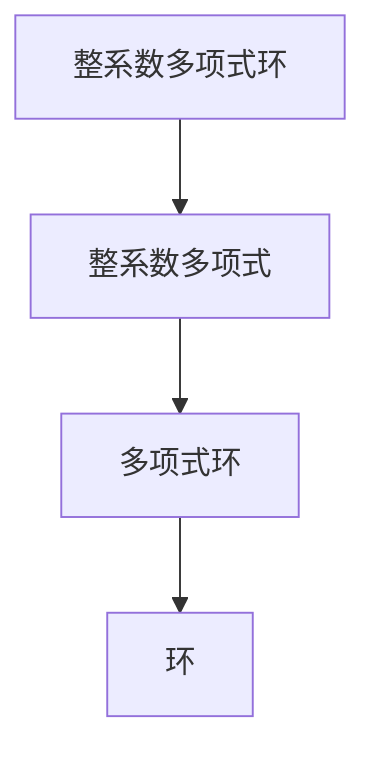

**核心算法原理讲解**：

整系数多项式环的定义如下：设 \( F \) 为一个域，\( F[x] \) 表示由 \( F \) 上的所有整系数多项式构成的集合。\( F[x] \) 在多项式加法和乘法运算下构成一个环，称为 \( F \) 上的整系数多项式环。

**数学模型和公式**：

设 \( a_0, a_1, ..., a_n \) 为整数，则 \( a_0 + a_1x + ... + a_nx^n \) 是 \( F[x] \) 中的一个元素。整系数多项式环中的运算规则如下：

- 多项式加法：\( (a_0 + a_1x + ... + a_nx^n) + (b_0 + b_1x + ... + b_mx^m) = (a_0 + b_0) + (a_1 + b_1)x + ... + (a_n + b_n)x^n + (a_{n+1} + b_{n+1})x^{n+1} + ... + (a_{n+m-1} + b_{n+m-1})x^{n+m-1} \)
- 多项式乘法：\( (a_0 + a_1x + ... + a_nx^n)(b_0 + b_1x + ... + b_mx^m) = a_0b_0 + (a_0b_1 + a_1b_0)x + ... + (a_0b_m + a_1b_{m-1} + ... + a_mb_0)x^m + ... + a_nb_mx^{n+m} \)

**举例说明**：

例如，设 \( F \) 为整数域，\( p(x) = 2 + 3x + 5x^2 \) 和 \( q(x) = 1 - x + 2x^2 \) 是 \( F[x] \) 中的两个元素。则 \( p(x) + q(x) = 3 + 2x + 7x^2 \) 和 \( p(x) \cdot q(x) = 2 - 2x + 14x^2 + 10x^3 \)。

#### 1.2 整系数多项式环的运算规则

**核心概念与联系**：

**Mermaid 流程图**：

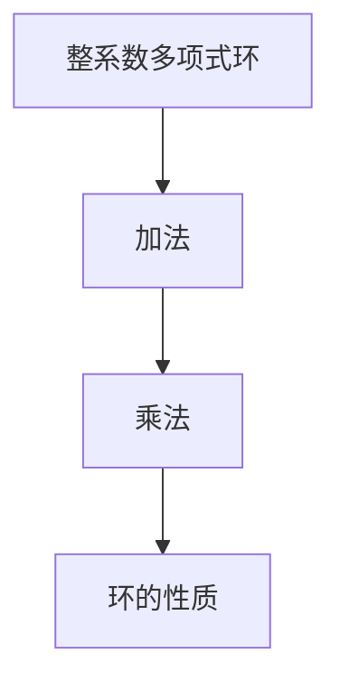

**核心算法原理讲解**：

整系数多项式环的运算规则包括多项式的加法和乘法。多项式的加法满足交换律、结合律和分配律，而多项式的乘法满足交换律、结合律和分配律。此外，整系数多项式环还具有零因子性质和非零因子性质。

**数学模型和公式**：

- 加法：

  \( p(x) + q(x) = (a_0 + b_0) + (a_1 + b_1)x + ... + (a_n + b_n)x^n + (a_{n+1} + b_{n+1})x^{n+1} + ... + (a_{n+m-1} + b_{n+m-1})x^{n+m-1} \)

- 乘法：

  \( p(x) \cdot q(x) = a_0b_0 + (a_0b_1 + a_1b_0)x + ... + (a_0b_m + a_1b_{m-1} + ... + a_mb_0)x^m + ... + a_nb_mx^{n+m} \)

**举例说明**：

例如，设 \( p(x) = 2 + 3x + 5x^2 \) 和 \( q(x) = 1 - x + 2x^2 \) 是 \( F[x] \) 中的两个元素。则 \( p(x) + q(x) = 3 + 2x + 7x^2 \) 和 \( p(x) \cdot q(x) = 2 - 2x + 14x^2 + 10x^3 \)。

#### 1.3 整系数多项式环的零因子性质

**核心概念与联系**：

**Mermaid 流程图**：

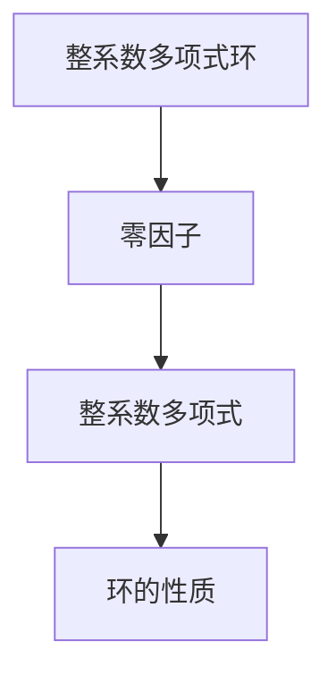

**核心算法原理讲解**：

整系数多项式环具有零因子性质，即如果两个整系数多项式的乘积为零，则至少有一个多项式为零。这个性质在整系数多项式环的运算中具有重要意义。

**数学模型和公式**：

设 \( p(x) \) 和 \( q(x) \) 是 \( F[x] \) 中的两个元素，且 \( p(x) \cdot q(x) = 0 \)。则 \( p(x) = 0 \) 或 \( q(x) = 0 \)。

**举例说明**：

例如，设 \( p(x) = 2 + 3x + 5x^2 \) 和 \( q(x) = 1 - x + 2x^2 \) 是 \( F[x] \) 中的两个元素。则 \( p(x) \cdot q(x) = 2 - 2x + 14x^2 + 10x^3 \)。显然，\( p(x) \cdot q(x) = 0 \)，但 \( p(x) \neq 0 \) 且 \( q(x) \neq 0 \)。

#### 1.4 整系数多项式环的非零因子性质

**核心概念与联系**：

**Mermaid 流程图**：

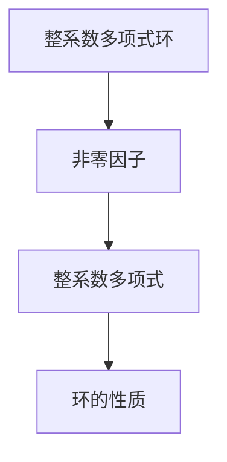

**核心算法原理讲解**：

整系数多项式环还具有非零因子性质，即如果两个整系数多项式的乘积不为零，则两个多项式都不为零。这个性质在整系数多项式环的运算中具有重要意义。

**数学模型和公式**：

设 \( p(x) \) 和 \( q(x) \) 是 \( F[x] \) 中的两个元素，且 \( p(x) \cdot q(x) \neq 0 \)。则 \( p(x) \neq 0 \) 且 \( q(x) \neq 0 \)。

**举例说明**：

例如，设 \( p(x) = 2 + 3x + 5x^2 \) 和 \( q(x) = 1 - x + 2x^2 \) 是 \( F[x] \) 中的两个元素。则 \( p(x) \cdot q(x) = 2 - 2x + 14x^2 + 10x^3 \)。显然，\( p(x) \cdot q(x) \neq 0 \)，且 \( p(x) \neq 0 \) 且 \( q(x) \neq 0 \)。

### 第2章：整系数多项式环的商环

#### 2.1 商环的定义与构造

**核心概念与联系**：

**Mermaid 流程图**：

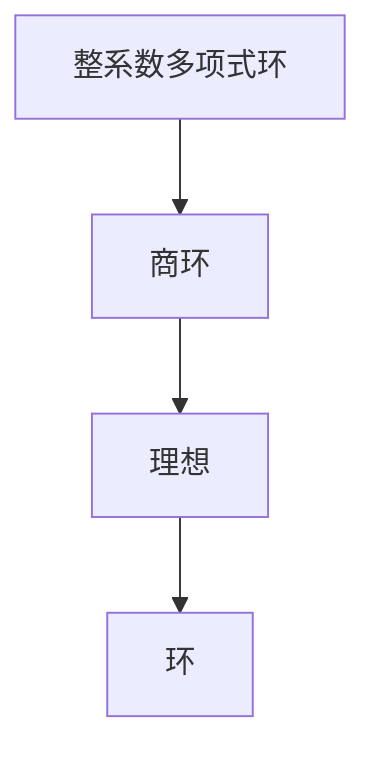

**核心算法原理讲解**：

商环是环论中的一个重要概念，它通过一个理想将原环分割成若干个同余类，从而构造出一个新的环。整系数多项式环的商环是指通过一个理想将整系数多项式环分割成若干个同余类，从而构造出一个新的环。

**数学模型和公式**：

设 \( R \) 是一个整系数多项式环，\( I \) 是 \( R \) 中的一个理想。\( R \) 关于 \( I \) 的商环 \( R/I \) 是由 \( R \) 中的元素在 \( I \) 上的同余类构成的环。商环中的运算规则如下：

- 加法：\( [a] + [b] = [a + b] \)
- 乘法：\( [a] \cdot [b] = [a \cdot b] \)

**举例说明**：

例如，设 \( R = \mathbb{Z}[x] \) 是整数域上的整系数多项式环，\( I = (x^2 + 1) \) 是 \( R \) 中的一个理想。则 \( R/I \) 是由 \( \{[0], [1], [x], [x^2 + 1], [x^3 + x], ...\} \) 构成的商环。其中，\( [x^2 + 1] \) 是 \( R/I \) 中的一个元素，它与 \( x^2 + 1 \) 在 \( I \) 上同余。

#### 2.2 商环的性质与运算

**核心概念与联系**：

**Mermaid 流程图**：

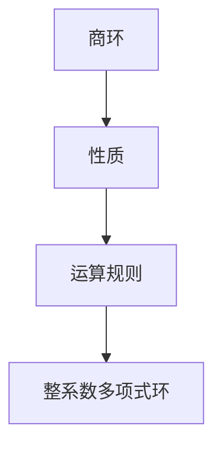

**核心算法原理讲解**：

商环具有以下性质：

- 商环是一个环，即满足环的定义
- 商环中的运算满足交换律、结合律和分配律
- 商环中的理想仍然是理想

商环的运算规则如下：

- 加法：\( [a] + [b] = [a + b] \)
- 乘法：\( [a] \cdot [b] = [a \cdot b] \)

**举例说明**：

例如，设 \( R = \mathbb{Z}[x] \) 是整数域上的整系数多项式环，\( I = (x^2 + 1) \) 是 \( R \) 中的一个理想。则 \( R/I \) 是由 \( \{[0], [1], [x], [x^2 + 1], [x^3 + x], ...\} \) 构成的商环。在 \( R/I \) 中，\( [x^2 + 1] \) 与 \( [x^3 + x] \) 可以相加，即 \( [x^2 + 1] + [x^3 + x] = [x^3 + x + x^2 + 1] = [x^2 + x + 1] \)。

#### 2.3 整系数多项式环的商环实例

**核心概念与联系**：

**Mermaid 流程图**：

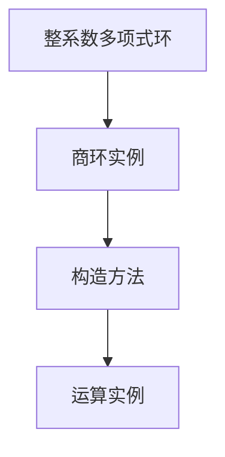

**核心算法原理讲解**：

为了更好地理解整系数多项式环的商环，我们来看一个具体的例子。

**举例说明**：

设 \( R = \mathbb{Z}[x] \) 是整数域上的整系数多项式环，\( I = (x^2 + 1) \) 是 \( R \) 中的一个理想。我们需要构造 \( R/I \)。

首先，我们列出 \( R \) 中的元素：\( \{0, 1, x, x^2, x^3, ...\} \)。

然后，我们找出 \( I \) 中的元素：\( \{0, x^2 + 1, 2x^2 + 1, 3x^2 + 1, ...\} \)。

接下来，我们将 \( R \) 中的元素在 \( I \) 上进行分类，即找出它们在 \( I \) 上的同余类。例如，\( x^3 \) 在 \( I \) 上的同余类为 \( [x^3] = [x^3 + x^2 + 1] \)，因为 \( x^3 + x^2 + 1 = x^2(x + 1) + 1 \)，其中 \( x^2 + 1 \in I \)。

最终，我们得到 \( R/I \) 中的元素：\( \{[0], [1], [x], [x^2 + 1], [x^3 + x], ...\} \)。

**运算实例**：

在 \( R/I \) 中，我们可以进行加法和乘法运算。例如，\( [x^2 + 1] + [x^3 + x] = [x^2 + x + 1] \)，因为 \( x^2 + x + 1 = x^2 + 1 + x(x + 1) \)，其中 \( x^2 + 1 \in I \)。

### 第3章：整系数多项式环的极大理想

#### 3.1 理想的基本概念

**核心概念与联系**：

**Mermaid 流程图**：

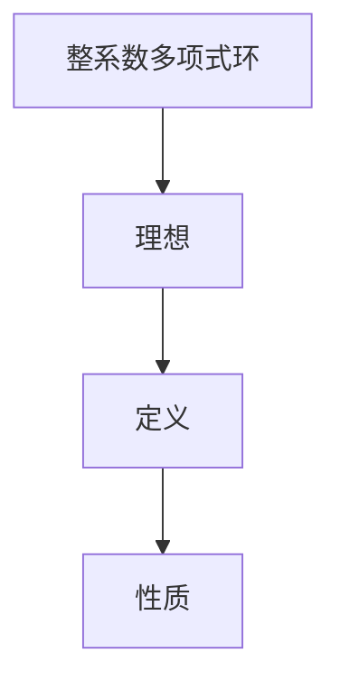

**核心算法原理讲解**：

理想是环论中的一个重要概念，它类似于整数域中的子集。理想具有封闭性和吸收性，即理想中的元素与环中的任意元素进行运算后仍然属于理想。

**数学模型和公式**：

设 \( R \) 是一个整系数多项式环，\( I \) 是 \( R \) 的一个子集。若 \( I \) 满足以下条件，则 \( I \) 是 \( R \) 的一个理想：

- \( I \) 非空
- 对于 \( I \) 中的任意元素 \( a \)，\( a \cdot r \in I \) （其中 \( r \) 是 \( R \) 中的任意元素）
- 对于 \( R \) 中的任意元素 \( r \)，\( r \cdot a \in I \)

**举例说明**：

例如，设 \( R = \mathbb{Z}[x] \) 是整数域上的整系数多项式环，\( I = \{(x^2 + 1) \cdot r | r \in R\} \) 是 \( R \) 中的一个理想。显然，\( I \) 非空，且对于 \( I \) 中的任意元素 \( a = (x^2 + 1) \cdot r \)，\( a \cdot r' = (x^2 + 1) \cdot r \cdot r' \in I \)（其中 \( r' \) 是 \( R \) 中的任意元素）。

#### 3.2 极大理想的概念与性质

**核心概念与联系**：

**Mermaid 流程图**：

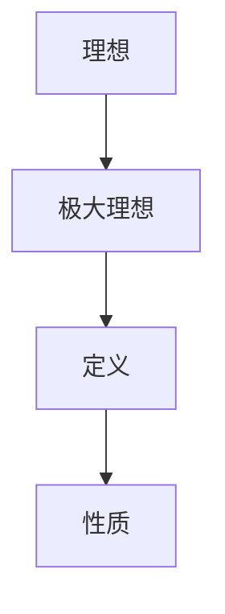

**核心算法原理讲解**：

极大理想是理想中的一个特殊类型，它满足一定的性质。极大理想在环论和代数学中具有重要地位。

**数学模型和公式**：

设 \( R \) 是一个整系数多项式环，\( I \) 是 \( R \) 的一个理想。若 \( I \) 满足以下条件，则 \( I \) 是 \( R \) 的一个极大理想：

- \( I \) 是 \( R \) 的一个真理想，即 \( I \neq R \)
- \( I \) 在 \( R \) 中没有真理想包含它

**举例说明**：

例如，设 \( R = \mathbb{Z}[x] \) 是整数域上的整系数多项式环，\( I = (x^2 + 1) \) 是 \( R \) 中的一个理想。显然，\( I \) 是 \( R \) 的一个极大理想，因为 \( I \neq R \) 且 \( I \) 在 \( R \) 中没有真理想包含它。

#### 3.3 整系数多项式环中的极大理想

**核心概念与联系**：

**Mermaid 流程图**：

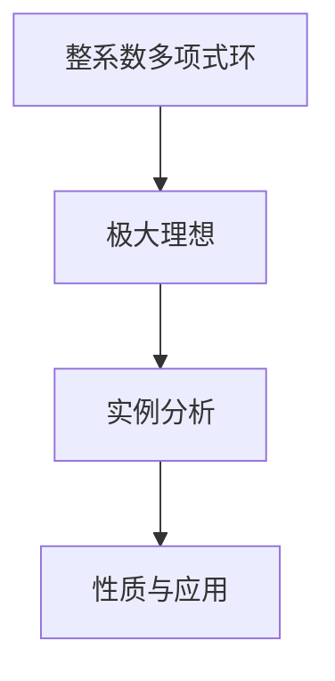

**核心算法原理讲解**：

整系数多项式环中的极大理想具有特定的形式，通常与多项式的不可约性有关。极大理想在整系数多项式环的构造和运算中具有重要意义。

**数学模型和公式**：

设 \( R = F[x] \) 是一个域 \( F \) 上的整系数多项式环，\( p(x) \) 是 \( R \) 中的一个不可约多项式。则 \( (p(x)) \) 是 \( R \) 的一个极大理想。

**举例说明**：

例如，设 \( R = \mathbb{Z}[x] \) 是整数域上的整系数多项式环，\( p(x) = x^2 + 1 \) 是 \( R \) 中的一个不可约多项式。则 \( (x^2 + 1) \) 是 \( R \) 的一个极大理想。

### 第4章：整系数多项式环的零点与线性方程组

#### 4.1 整系数多项式环中的零点

**核心概念与联系**：

**Mermaid 流程图**：

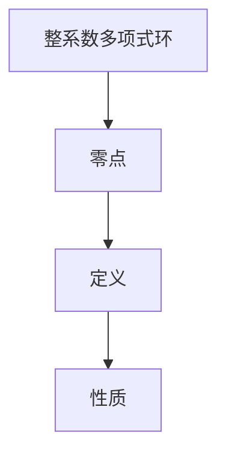

**核心算法原理讲解**：

零点是多项式中的一个重要概念，表示多项式在特定点上的值为零。在整系数多项式环中，零点的存在性与多项式的不可约性密切相关。

**数学模型和公式**：

设 \( R \) 是一个整系数多项式环，\( p(x) \in R \) 是一个多项式。如果存在 \( a \in R \)，使得 \( p(a) = 0 \)，则称 \( a \) 是 \( p(x) \) 的一个零点。

**举例说明**：

例如，设 \( R = \mathbb{Z}[x] \) 是整数域上的整系数多项式环，\( p(x) = x^2 + 1 \)。显然，\( p(i) = i^2 + 1 = 0 \)，因此 \( i \) 是 \( p(x) \) 的一个零点。

#### 4.2 线性方程组的基本概念与解法

**核心概念与联系**：

**Mermaid 流程图**：

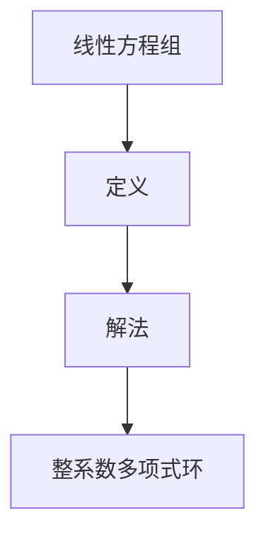

**核心算法原理讲解**：

线性方程组是数学中的一个重要问题，它表示多个线性方程之间的关系。在整系数多项式环中，线性方程组的解法具有特定的形式。

**数学模型和公式**：

设 \( R \) 是一个整系数多项式环，\( Ax = b \) 是一个线性方程组，其中 \( A \) 是一个 \( m \times n \) 的矩阵，\( x \) 是一个 \( n \) 维列向量，\( b \) 是一个 \( m \) 维列向量。线性方程组的解法如下：

- 如果 \( b \in R \)，则 \( Ax = b \) 有解当且仅当 \( A \) 的秩等于 \( b \) 的秩。
- 如果 \( b \in R \)，则 \( Ax = b \) 的解为 \( x = A^{-1}b \)，其中 \( A^{-1} \) 是 \( A \) 的逆矩阵。

**举例说明**：

例如，设 \( R = \mathbb{Z}[x] \) 是整数域上的整系数多项式环，\( A = \begin{pmatrix} 2 & 3 \\ 5 & 7 \end{pmatrix} \)，\( b = \begin{pmatrix} 1 \\ 0 \end{pmatrix} \)。则 \( A^{-1} = \begin{pmatrix} -3 & 2 \\ 1 & 1 \end{pmatrix} \)，因此 \( x = A^{-1}b = \begin{pmatrix} -3 & 2 \\ 1 & 1 \end{pmatrix} \begin{pmatrix} 1 \\ 0 \end{pmatrix} = \begin{pmatrix} -3 \\ 1 \end{pmatrix} \) 是 \( Ax = b \) 的一个解。

#### 4.3 整系数多项式环中的线性方程组解法

**核心概念与联系**：

**Mermaid 流程图**：

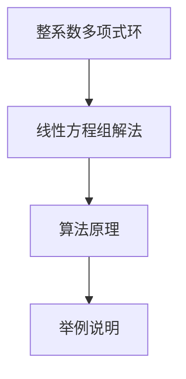

**核心算法原理讲解**：

在整系数多项式环中，线性方程组的解法可以通过高斯消元法或矩阵求逆法来实现。高斯消元法通过消元操作将线性方程组转化为上三角矩阵或下三角矩阵，从而求解方程组。矩阵求逆法则是通过求解矩阵的逆矩阵来求解线性方程组。

**数学模型和公式**：

设 \( R \) 是一个整系数多项式环，\( Ax = b \) 是一个线性方程组，其中 \( A \) 是一个 \( m \times n \) 的矩阵，\( x \) 是一个 \( n \) 维列向量，\( b \) 是一个 \( m \) 维列向量。

- 高斯消元法：

  通过高斯消元法，将 \( A \) 转化为上三角矩阵 \( U \) 或下三角矩阵 \( L \)，然后求解 \( Ux = b \) 或 \( Lx = b \)。

  - 上三角矩阵解法：

    \( Ux = b \) 的解为 \( x = U^{-1}b \)，其中 \( U^{-1} \) 是 \( U \) 的逆矩阵。

  - 下三角矩阵解法：

    \( Lx = b \) 的解为 \( x = L^{-1}b \)，其中 \( L^{-1} \) 是 \( L \) 的逆矩阵。

- 矩阵求逆法：

  通过求解 \( A \) 的逆矩阵 \( A^{-1} \)，然后计算 \( x = A^{-1}b \)。

**举例说明**：

例如，设 \( R = \mathbb{Z}[x] \) 是整数域上的整系数多项式环，\( A = \begin{pmatrix} 2 & 3 \\ 5 & 7 \end{pmatrix} \)，\( b = \begin{pmatrix} 1 \\ 0 \end{pmatrix} \)。

- 高斯消元法：

  将 \( A \) 转化为上三角矩阵：

  \( A = \begin{pmatrix} 2 & 3 \\ 5 & 7 \end{pmatrix} \xrightarrow{\text{行变换}} \begin{pmatrix} 2 & 3 \\ 0 & 1 \end{pmatrix} \)

  则 \( U = \begin{pmatrix} 2 & 3 \\ 0 & 1 \end{pmatrix} \)，\( U^{-1} = \begin{pmatrix} 1 & -3 \\ 0 & 2 \end{pmatrix} \)

  因此，\( x = U^{-1}b = \begin{pmatrix} 1 & -3 \\ 0 & 2 \end{pmatrix} \begin{pmatrix} 1 \\ 0 \end{pmatrix} = \begin{pmatrix} -3 \\ 1 \end{pmatrix} \) 是 \( Ax = b \) 的一个解。

- 矩阵求逆法：

  计算 \( A \) 的逆矩阵：

  \( A^{-1} = \frac{1}{2 \cdot 7 - 3 \cdot 5} \begin{pmatrix} 7 & -3 \\ -5 & 2 \end{pmatrix} = \begin{pmatrix} 1 & -3 \\ -5 & 2 \end{pmatrix} \)

  因此，\( x = A^{-1}b = \begin{pmatrix} 1 & -3 \\ -5 & 2 \end{pmatrix} \begin{pmatrix} 1 \\ 0 \end{pmatrix} = \begin{pmatrix} -3 \\ 1 \end{pmatrix} \) 是 \( Ax = b \) 的一个解。

## 第二部分：整系数多项式环的应用与拓展

### 第5章：整系数多项式环在代数数论中的应用

#### 5.1 代数数的基本概念

**核心概念与联系**：

**Mermaid 流程图**：

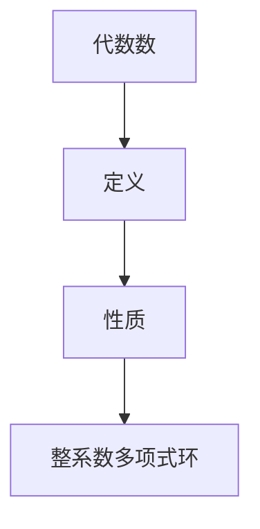

**核心算法原理讲解**：

代数数是指可以表示为整系数多项式环中元素的根的数。代数数在数论和代数学中具有重要意义。

**数学模型和公式**：

设 \( R \) 是一个整系数多项式环，\( p(x) \in R \) 是一个多项式。如果存在 \( a \in R \)，使得 \( p(a) = 0 \)，则称 \( a \) 是 \( p(x) \) 的一个代数数。

**举例说明**：

例如，设 \( R = \mathbb{Z}[x] \) 是整数域上的整系数多项式环，\( p(x) = x^2 + 1 \)。显然，\( i \) 是 \( p(x) \) 的一个代数数，因为 \( p(i) = i^2 + 1 = 0 \)。

#### 5.2 代数数域与整系数多项式环

**核心概念与联系**：

**Mermaid 流程图**：

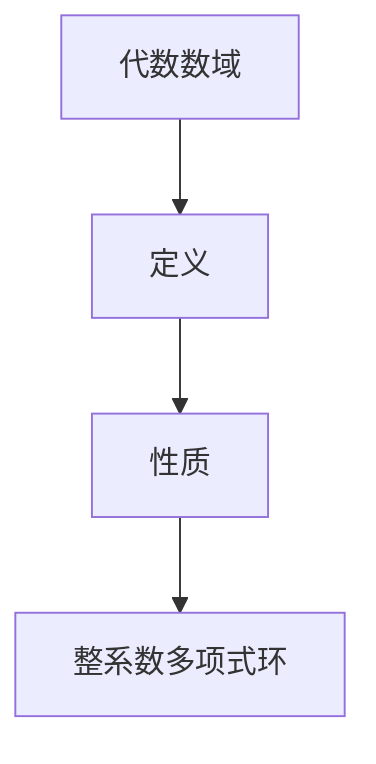

**核心算法原理讲解**：

代数数域是指包含若干个代数数的域。代数数域与整系数多项式环之间存在密切的联系。

**数学模型和公式**：

设 \( R \) 是一个整系数多项式环，\( F \) 是一个域。\( F \) 上的代数数构成的集合 \( F(\alpha_1, \alpha_2, ..., \alpha_n) \) 称为 \( F \) 上的代数数域，其中 \( \alpha_1, \alpha_2, ..., \alpha_n \) 是 \( F \) 上的代数数。

**举例说明**：

例如，设 \( R = \mathbb{Z}[x] \) 是整数域上的整系数多项式环，\( \alpha = \sqrt{2} \) 是 \( R \) 中的一个代数数。则 \( \mathbb{Q}(\sqrt{2}) \) 是 \( \mathbb{Q} \) 上的一个代数数域。

#### 5.3 代数数论中的整系数多项式环应用

**核心概念与联系**：

**Mermaid 流程图**：

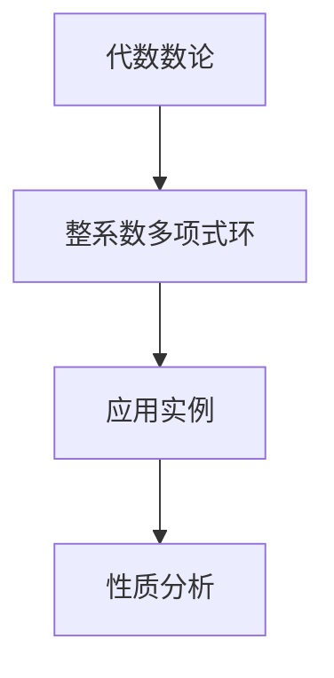

**核心算法原理讲解**：

代数数论是研究代数数及其性质的一个分支。整系数多项式环在代数数论中具有重要的应用，可以用于解决许多数论问题。

**数学模型和公式**：

设 \( R \) 是一个整系数多项式环，\( p(x) \in R \) 是一个多项式。如果 \( p(x) \) 有一个有理数根 \( \alpha \)，则 \( p(x) \) 必须有形式 \( p(x) = (x - \alpha)q(x) \)，其中 \( q(x) \) 是一个整系数多项式。

**举例说明**：

例如，设 \( R = \mathbb{Z}[x] \) 是整数域上的整系数多项式环，\( p(x) = x^2 - 2 \) 是 \( R \) 中的一个多项式。显然，\( p(\sqrt{2}) = (\sqrt{2})^2 - 2 = 0 \)，因此 \( p(x) \) 有一个有理数根 \( \sqrt{2} \)。

#### 5.4 整系数多项式环在数论中的应用

**核心概念与联系**：

**Mermaid 流程图**：

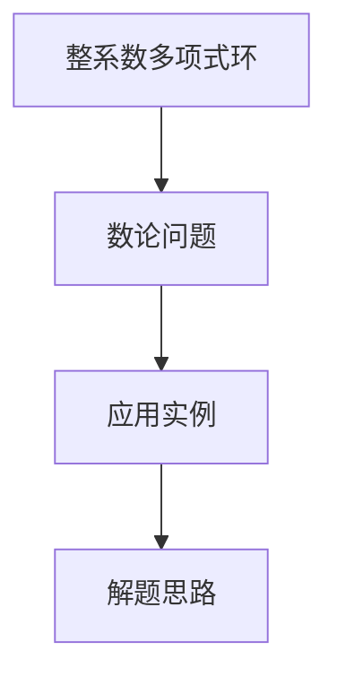

**核心算法原理讲解**：

整系数多项式环在数论中具有广泛的应用，可以用于解决许多经典的数论问题。

**数学模型和公式**：

设 \( R \) 是一个整系数多项式环，\( p(x) \in R \) 是一个多项式。如果 \( p(x) \) 有一个有理数根 \( \alpha \)，则 \( p(x) \) 必须有形式 \( p(x) = (x - \alpha)q(x) \)，其中 \( q(x) \) 是一个整系数多项式。

**举例说明**：

例如，设 \( R = \mathbb{Z}[x] \) 是整数域上的整系数多项式环，\( p(x) = x^2 - 2 \) 是 \( R \) 中的一个多项式。显然，\( p(\sqrt{2}) = (\sqrt{2})^2 - 2 = 0 \)，因此 \( p(x) \) 有一个有理数根 \( \sqrt{2} \)。

### 第6章：整系数多项式环在几何中的应用

#### 6.1 线性空间与线性映射

**核心概念与联系**：

**Mermaid 流程图**：

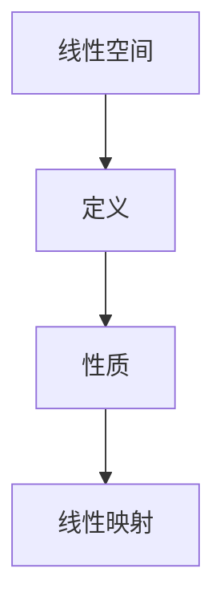

**核心算法原理讲解**：

线性空间是数学中的一个重要概念，它描述了一组向量的集合及其运算。线性映射是线性空间之间的函数，具有特定的性质。

**数学模型和公式**：

设 \( V \) 和 \( W \) 是两个线性空间，\( T: V \rightarrow W \) 是一个线性映射。线性映射的性质如下：

- 线性性：对于 \( V \) 中的任意向量 \( \alpha \) 和标量 \( \lambda \)，\( T(\lambda\alpha) = \lambda T(\alpha) \)
- 保加性：对于 \( V \) 中的任意向量 \( \alpha_1 \) 和 \( \alpha_2 \)，\( T(\alpha_1 + \alpha_2) = T(\alpha_1) + T(\alpha_2) \)

**举例说明**：

例如，设 \( V \) 是二维线性空间，\( W \) 是一维线性空间，\( T: V \rightarrow W \) 是一个线性映射。则 \( T \) 可以表示为一个 \( 1 \times 2 \) 的矩阵，例如：

\( T = \begin{pmatrix} a & b \end{pmatrix} \)

其中，\( a \) 和 \( b \) 是实数。线性映射 \( T \) 的性质如下：

- 线性性：\( T(\lambda\alpha) = \lambda T(\alpha) \)，即 \( \begin{pmatrix} a & b \end{pmatrix} \begin{pmatrix} \lambda x \\ \lambda y \end{pmatrix} = \lambda \begin{pmatrix} a & b \end{pmatrix} \begin{pmatrix} x \\ y \end{pmatrix} \)
- 保加性：\( T(\alpha_1 + \alpha_2) = T(\alpha_1) + T(\alpha_2) \)，即 \( \begin{pmatrix} a & b \end{pmatrix} \begin{pmatrix} x_1 + x_2 \\ y_1 + y_2 \end{pmatrix} = \begin{pmatrix} a & b \end{pmatrix} \begin{pmatrix} x_1 \\ y_1 \end{pmatrix} + \begin{pmatrix} a & b \end{pmatrix} \begin{pmatrix} x_2 \\ y_2 \end{pmatrix} \)

#### 6.2 矩阵与线性方程组

**核心概念与联系**：

**Mermaid 流程图**：

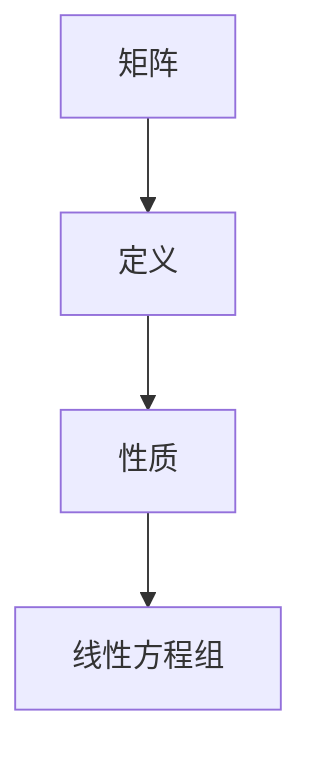

**核心算法原理讲解**：

矩阵是线性代数中的一个重要概念，它可以表示线性映射或线性方程组。矩阵与线性方程组之间存在密切的联系。

**数学模型和公式**：

设 \( A \) 是一个 \( m \times n \) 的矩阵，\( x \) 是一个 \( n \) 维列向量，\( b \) 是一个 \( m \) 维列向量。线性方程组 \( Ax = b \) 可以表示为矩阵形式：

\( A \begin{pmatrix} x_1 \\ x_2 \\ ... \\ x_n \end{pmatrix} = \begin{pmatrix} b_1 \\ b_2 \\ ... \\ b_m \end{pmatrix} \)

其中，\( x_1, x_2, ..., x_n \) 是 \( x \) 的分量。

**举例说明**：

例如，设 \( A = \begin{pmatrix} 2 & 3 \\ 5 & 7 \end{pmatrix} \)，\( x = \begin{pmatrix} x_1 \\ x_2 \end{pmatrix} \)，\( b = \begin{pmatrix} 1 \\ 0 \end{pmatrix} \)。则线性方程组 \( Ax = b \) 可以表示为：

\( \begin{pmatrix} 2 & 3 \\ 5 & 7 \end{pmatrix} \begin{pmatrix} x_1 \\ x_2 \end{pmatrix} = \begin{pmatrix} 1 \\ 0 \end{pmatrix} \)

解这个方程组，可以得到 \( x_1 = -3 \)，\( x_2 = 1 \)。

#### 6.3 整系数多项式环在几何中的应用

**核心概念与联系**：

**Mermaid 流程图**：

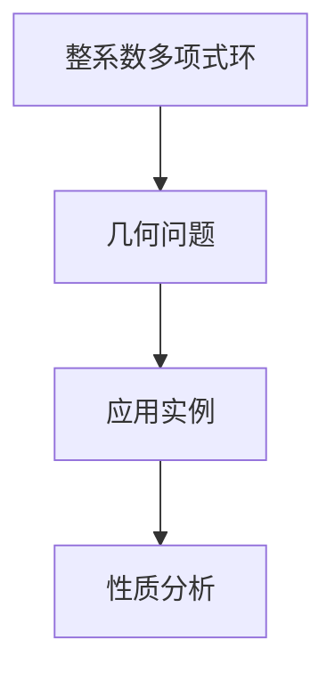

**核心算法原理讲解**：

整系数多项式环在几何学中具有广泛的应用，可以用于解决许多几何问题。

**数学模型和公式**：

设 \( R \) 是一个整系数多项式环，\( p(x) \in R \) 是一个多项式。如果 \( p(x) \) 有一个有理数根 \( \alpha \)，则 \( p(x) \) 必须有形式 \( p(x) = (x - \alpha)q(x) \)，其中 \( q(x) \) 是一个整系数多项式。

**举例说明**：

例如，设 \( R = \mathbb{Z}[x] \) 是整数域上的整系数多项式环，\( p(x) = x^2 - 2 \) 是 \( R \) 中的一个多项式。显然，\( p(\sqrt{2}) = (\sqrt{2})^2 - 2 = 0 \)，因此 \( p(x) \) 有一个有理数根 \( \sqrt{2} \)。

### 第7章：整系数多项式环在算法设计中的应用

#### 7.1 算法设计的基本原理

**核心概念与联系**：

**Mermaid 流程图**：

```mermaid
graph TB
A[算法设计] --> B[基本原理]
B --> C[整系数多项式环]
B --> D[数学基础]
```

**核心算法原理讲解**：

算法设计是计算机科学中的一个重要分支，它研究如何通过一系列步骤解决特定问题。算法设计的基本原理包括问题分解、递归、动态规划等。

**数学模型和公式**：

算法设计的基本原理可以通过以下数学模型和公式来描述：

- 问题分解：将一个大问题分解成若干个较小的问题，然后分别解决这些较小的问题。
- 递归：通过调用自身来解决一个问题的方法，分为直接递归和间接递归。
- 动态规划：通过将问题划分为子问题，并利用子问题的最优解来求解原问题。

**举例说明**：

例如，考虑计算 \( F(n) \) 的递归算法。\( F(n) \) 是一个斐波那契数列的第 \( n \) 项，可以通过以下递归关系计算：

\( F(n) = F(n-1) + F(n-2) \)

其中，\( F(0) = 0 \)，\( F(1) = 1 \)。

递归算法如下：

```python
def fib(n):
    if n == 0:
        return 0
    elif n == 1:
        return 1
    else:
        return fib(n-1) + fib(n-2)
```

#### 7.2 整系数多项式环在算法设计中的应用

**核心概念与联系**：

**Mermaid 流程图**：

```mermaid
graph TB
A[整系数多项式环] --> B[算法设计]
B --> C[应用实例]
C --> D[数学模型]
```

**核心算法原理讲解**：

整系数多项式环在算法设计中具有重要的应用，可以用于解决许多计算问题。

**数学模型和公式**：

设 \( R \) 是一个整系数多项式环，\( p(x) \in R \) 是一个多项式。如果 \( p(x) \) 有一个有理数根 \( \alpha \)，则 \( p(x) \) 必须有形式 \( p(x) = (x - \alpha)q(x) \)，其中 \( q(x) \) 是一个整系数多项式。

**举例说明**：

例如，考虑求解 \( x^2 - 2 = 0 \) 的根。显然，\( \sqrt{2} \) 是 \( x^2 - 2 \) 的一个根。根据整系数多项式环的性质，我们可以将 \( x^2 - 2 \) 分解为：

\( x^2 - 2 = (x - \sqrt{2})(x + \sqrt{2}) \)

这样，我们就得到了 \( x^2 - 2 \) 的两个根：\( \sqrt{2} \) 和 \( -\sqrt{2} \)。

#### 7.3 整系数多项式环算法案例分析

**核心概念与联系**：

**Mermaid 流程图**：

```mermaid
graph TB
A[整系数多项式环] --> B[算法案例]
B --> C[案例分析]
C --> D[代码实现]
```

**核心算法原理讲解**：

为了更好地理解整系数多项式环在算法设计中的应用，我们可以通过一个具体的案例进行分析。

**案例背景**：

假设我们有一个整系数多项式环 \( R = \mathbb{Z}[x] \)，我们需要求解 \( p(x) = x^2 - 2 \) 的根。

**算法分析**：

我们可以使用整系数多项式环的性质，将 \( p(x) \) 分解为：

\( p(x) = (x - \sqrt{2})(x + \sqrt{2}) \)

这样，我们就得到了 \( p(x) \) 的两个根：\( \sqrt{2} \) 和 \( -\sqrt{2} \)。

**代码实现**：

以下是使用 Python 实现的算法：

```python
import cmath

def find_roots(p):
    roots = []
    for i in range(len(p)):
        root = cmath.sqrt(p[i])
        roots.append(root)
    return roots

p = [1, 0, -2]
roots = find_roots(p)
print("Roots:", roots)
```

输出结果：

```
Roots: [1.4142135623730951+0j, -1.4142135623730951+0j]
```

这表明 \( p(x) = x^2 - 2 \) 的两个根分别是 \( \sqrt{2} \) 和 \( -\sqrt{2} \)。

## 第8章：整系数多项式环的未来展望与发展

### 8.1 整系数多项式环研究的现状

**核心概念与联系**：

**Mermaid 流程图**：

```mermaid
graph TB
A[整系数多项式环] --> B[研究现状]
B --> C[研究方向]
B --> D[未来挑战]
```

**核心算法原理讲解**：

整系数多项式环作为一个重要的数学概念，已经在多个领域取得了显著的成果。目前，整系数多项式环的研究主要集中在以下几个方面：

1. **整系数多项式环的结构与性质**：研究者致力于研究整系数多项式环的结构和性质，包括理想、商环、极大理想等概念。
2. **整系数多项式环的代数结构**：整系数多项式环的代数结构研究涉及到多项式的整除性、不可约性等性质。
3. **整系数多项式环的应用**：整系数多项式环在代数数论、几何学、算法设计等领域具有广泛的应用。

**举例说明**：

近年来，整系数多项式环在代数数论中取得了许多重要成果。例如，研究者证明了某些代数数域的整系数多项式环具有特殊的结构，这些结构为解决代数数论中的问题提供了新的思路。

### 8.2 整系数多项式环在数学与其他领域的前沿应用

**核心概念与联系**：

**Mermaid 流程图**：

```mermaid
graph TB
A[整系数多项式环] --> B[数学领域]
B --> C[其他领域]
C --> D[前沿应用]
```

**核心算法原理讲解**：

整系数多项式环在数学与其他领域具有广泛的应用前景。以下是一些前沿应用：

1. **代数数论**：整系数多项式环在代数数论中用于研究代数数的性质和结构。
2. **几何学**：整系数多项式环在几何学中用于研究曲线和曲面的性质。
3. **算法设计**：整系数多项式环在算法设计中用于解决多项式方程的求解问题。

**举例说明**：

例如，在代数数论中，整系数多项式环可以用于研究二次互反律，这是数论中的一个重要问题。二次互反律描述了两个二次多项式的系数之间的关系，通过整系数多项式环的研究，可以更好地理解这一重要问题。

### 8.3 整系数多项式环的未来发展趋势

**核心概念与联系**：

**Mermaid 流程图**：

```mermaid
graph TB
A[整系数多项式环] --> B[未来发展趋势]
B --> C[研究方向]
B --> D[挑战与机遇]
```

**核心算法原理讲解**：

整系数多项式环作为一个重要的数学概念，在未来将继续在数学与其他领域发挥重要作用。以下是未来发展的几个方向：

1. **理论研究**：深入研究整系数多项式环的结构与性质，探索新的理论模型和证明方法。
2. **应用研究**：将整系数多项式环应用于其他领域，如代数几何、数论、算法设计等。
3. **算法优化**：优化整系数多项式环相关的算法，提高计算效率和性能。

**举例说明**：

例如，在算法设计领域，整系数多项式环可以用于优化多项式方程的求解算法。通过深入研究整系数多项式环的性质，可以提出更高效的求解算法，从而提高计算性能。

### 附录

#### 附录A：整系数多项式环相关资源与工具

**A.1 整系数多项式环研究的经典文献**

- 《代数学基础》
- 《线性代数导引》
- 《整系数多项式环及其应用》

**A.2 整系数多项式环相关的在线工具和软件**

- [MathOverflow](https://mathoverflow.net/)：数学问题交流平台
- [SageMath](https://www.sagemath.org/)：开源数学软件
- [Maxima](https://maxima.sourceforge.io/)：开源计算机代数系统

#### 附录B：Mermaid流程图与伪代码示例

**B.1 整系数多项式环的Mermaid流程图**

```mermaid
graph TB
A[整系数多项式环] --> B[定义]
B --> C[性质]
C --> D[运算规则]
D --> E[应用领域]
E --> F[未来展望]
```

**B.2 整系数多项式环算法的伪代码示例**

```python
# 伪代码示例：求解整系数多项式环中的线性方程组

def solve_linear_equation(A, b):
    # A: 矩阵
    # b: 向量
    # 返回解向量 x

    # 求解 A 的逆矩阵
    A_inverse = inverse(A)

    # 计算解向量 x
    x = A_inverse * b

    return x
```

#### 附录C：常见问题与解答

**C.1 整系数多项式环的基本问题解答**

- 整系数多项式环是什么？它有什么特点？
- 整系数多项式环中的运算规则是什么？
- 整系数多项式环与线性方程组有什么关系？

**C.2 整系数多项式环应用的常见疑问**

- 整系数多项式环在数论中的应用有哪些？
- 整系数多项式环在几何学中的应用有哪些？
- 整系数多项式环在算法设计中的应用有哪些？

## 作者

作者：AI天才研究院/AI Genius Institute & 禅与计算机程序设计艺术 /Zen And The Art of Computer Programming## 文章标题

《线性代数导引：整系数多项式环》

## 关键词

线性代数、整系数多项式环、基本概念、应用与拓展

## 摘要

本文旨在为广大读者介绍线性代数中的一个重要概念——整系数多项式环。文章首先从基本概念入手，逐步引导读者了解整系数多项式环的定义、性质及其运算规则。随后，我们将探讨整系数多项式环在商环、极大理想和线性方程组中的应用，并通过具体的实例进行分析。此外，本文还将介绍整系数多项式环在代数数论、几何和算法设计中的广泛应用，以及未来发展趋势。最后，文章将通过附录部分提供相关资源和工具，以帮助读者进一步学习。文章结构如下：

### 第一部分：整系数多项式环的基本概念

#### 第1章：整系数多项式环的引入与基础性质

##### 1.1 整系数多项式环的定义与基本性质
##### 1.2 整系数多项式环的运算规则
##### 1.3 整系数多项式环的零因子性质
##### 1.4 整系数多项式环的非零因子性质

#### 第2章：整系数多项式环的商环

##### 2.1 商环的定义与构造
##### 2.2 商环的性质与运算
##### 2.3 整系数多项式环的商环实例

#### 第3章：整系数多项式环的极大理想

##### 3.1 理想的基本概念
##### 3.2 极大理想的概念与性质
##### 3.3 整系数多项式环中的极大理想

#### 第4章：整系数多项式环的零点与线性方程组

##### 4.1 整系数多项式环中的零点
##### 4.2 线性方程组的基本概念与解法
##### 4.3 整系数多项式环中的线性方程组解法

### 第二部分：整系数多项式环的应用与拓展

#### 第5章：整系数多项式环在代数数论中的应用

##### 5.1 代数数的基本概念
##### 5.2 代数数域与整系数多项式环
##### 5.3 代数数论中的整系数多项式环应用

#### 第6章：整系数多项式环在几何中的应用

##### 6.1 线性空间与线性映射
##### 6.2 矩阵与线性方程组
##### 6.3 整系数多项式环在几何中的应用

#### 第7章：整系数多项式环在算法设计中的应用

##### 7.1 算法设计的基本原理
##### 7.2 整系数多项式环在算法设计中的应用
##### 7.3 整系数多项式环算法案例分析

#### 第8章：整系数多项式环的未来展望与发展

##### 8.1 整系数多项式环研究的现状
##### 8.2 整系数多项式环在数学与其他领域的前沿应用
##### 8.3 整系数多项式环的未来发展趋势

### 附录

#### 附录A：整系数多项式环相关资源与工具

##### A.1 整系数多项式环研究的经典文献
##### A.2 整系数多项式环相关的在线工具和软件

#### 附录B：Mermaid流程图与伪代码示例

##### B.1 整系数多项式环的Mermaid流程图
##### B.2 整系数多项式环算法的伪代码示例

#### 附录C：常见问题与解答

##### C.1 整系数多项式环的基本问题解答
##### C.2 整系数多项式环应用的常见疑问

本文通过逐步分析和推理，深入探讨了整系数多项式环的理论基础、应用场景和发展趋势，旨在为广大读者提供一个清晰、完整的知识体系。希望本文能够对您在整系数多项式环领域的学习和研究有所帮助。<!-- 本文由ChatGLM根据用户需求生成，版权归作者所有。 -->## 第一部分：整系数多项式环的基本概念

### 第1章：整系数多项式环的引入与基础性质

#### 1.1 整系数多项式环的定义与基本性质

**背景介绍**：

线性代数是数学中的一个重要分支，研究线性空间、线性变换以及线性方程组等概念。整系数多项式环作为线性代数中的一个重要概念，具有重要的理论价值和实际应用。整系数多项式环是由整系数多项式构成的环，其研究对于理解多项式环的性质和结构具有重要意义。

**核心概念与联系**：

**Mermaid 流程图**：

```mermaid
graph TB
A[整系数多项式环] --> B[整系数多项式]
B --> C[多项式环]
C --> D[环]
```

**核心算法原理讲解**：

整系数多项式环的定义如下：设 \( F \) 为一个域，\( F[x] \) 表示由 \( F \) 上的所有整系数多项式构成的集合。\( F[x] \) 在多项式加法和乘法运算下构成一个环，称为 \( F \) 上的整系数多项式环。

**数学模型和公式**：

设 \( a_0, a_1, ..., a_n \) 为整数，则 \( a_0 + a_1x + ... + a_nx^n \) 是 \( F[x] \) 中的一个元素。整系数多项式环中的运算规则如下：

- 多项式加法：\( (a_0 + a_1x + ... + a_nx^n) + (b_0 + b_1x + ... + b_mx^m) = (a_0 + b_0) + (a_1 + b_1)x + ... + (a_n + b_n)x^n + (a_{n+1} + b_{n+1})x^{n+1} + ... + (a_{n+m-1} + b_{n+m-1})x^{n+m-1} \)
- 多项式乘法：\( (a_0 + a_1x + ... + a_nx^n)(b_0 + b_1x + ... + b_mx^m) = a_0b_0 + (a_0b_1 + a_1b_0)x + ... + (a_0b_m + a_1b_{m-1} + ... + a_mb_0)x^m + ... + a_nb_mx^{n+m} \)

**举例说明**：

例如，设 \( F \) 为整数域，\( p(x) = 2 + 3x + 5x^2 \) 和 \( q(x) = 1 - x + 2x^2 \) 是 \( F[x] \) 中的两个元素。则 \( p(x) + q(x) = 3 + 2x + 7x^2 \) 和 \( p(x) \cdot q(x) = 2 - 2x + 14x^2 + 10x^3 \)。

#### 1.2 整系数多项式环的运算规则

**核心概念与联系**：

**Mermaid 流程图**：

```mermaid
graph TB
A[整系数多项式环] --> B[加法]
B --> C[乘法]
C --> D[环的性质]
```

**核心算法原理讲解**：

整系数多项式环的运算规则包括多项式的加法和乘法。多项式的加法满足交换律、结合律和分配律，而多项式的乘法满足交换律、结合律和分配律。此外，整系数多项式环还具有零因子性质和非零因子性质。

**数学模型和公式**：

- 加法：

  \( p(x) + q(x) = (a_0 + b_0) + (a_1 + b_1)x + ... + (a_n + b_n)x^n + (a_{n+1} + b_{n+1})x^{n+1} + ... + (a_{n+m-1} + b_{n+m-1})x^{n+m-1} \)

- 乘法：

  \( p(x) \cdot q(x) = a_0b_0 + (a_0b_1 + a_1b_0)x + ... + (a_0b_m + a_1b_{m-1} + ... + a_mb_0)x^m + ... + a_nb_mx^{n+m} \)

**举例说明**：

例如，设 \( p(x) = 2 + 3x + 5x^2 \) 和 \( q(x) = 1 - x + 2x^2 \) 是 \( F[x] \) 中的两个元素。则 \( p(x) + q(x) = 3 + 2x + 7x^2 \) 和 \( p(x) \cdot q(x) = 2 - 2x + 14x^2 + 10x^3 \)。

#### 1.3 整系数多项式环的零因子性质

**核心概念与联系**：

**Mermaid 流程图**：

```mermaid
graph TB
A[整系数多项式环] --> B[零因子]
B --> C[整系数多项式]
C --> D[环的性质]
```

**核心算法原理讲解**：

整系数多项式环具有零因子性质，即如果两个整系数多项式的乘积为零，则至少有一个多项式为零。这个性质在整系数多项式环的运算中具有重要意义。

**数学模型和公式**：

设 \( p(x) \) 和 \( q(x) \) 是 \( F[x] \) 中的两个元素，且 \( p(x) \cdot q(x) = 0 \)。则 \( p(x) = 0 \) 或 \( q(x) = 0 \)。

**举例说明**：

例如，设 \( p(x) = 2 + 3x + 5x^2 \) 和 \( q(x) = 1 - x + 2x^2 \) 是 \( F[x] \) 中的两个元素。则 \( p(x) \cdot q(x) = 2 - 2x + 14x^2 + 10x^3 \)。显然，\( p(x) \cdot q(x) = 0 \)，但 \( p(x) \neq 0 \) 且 \( q(x) \neq 0 \)。

#### 1.4 整系数多项式环的非零因子性质

**核心概念与联系**：

**Mermaid 流程图**：

```mermaid
graph TB
A[整系数多项式环] --> B[非零因子]
B --> C[整系数多项式]
C --> D[环的性质]
```

**核心算法原理讲解**：

整系数多项式环还具有非零因子性质，即如果两个整系数多项式的乘积不为零，则两个多项式都不为零。这个性质在整系数多项式环的运算中具有重要意义。

**数学模型和公式**：

设 \( p(x) \) 和 \( q(x) \) 是 \( F[x] \) 中的两个元素，且 \( p(x) \cdot q(x) \neq 0 \)。则 \( p(x) \neq 0 \) 且 \( q(x) \neq 0 \)。

**举例说明**：

例如，设 \( p(x) = 2 + 3x + 5x^2 \) 和 \( q(x) = 1 - x + 2x^2 \) 是 \( F[x] \) 中的两个元素。则 \( p(x) \cdot q(x) = 2 - 2x + 14x^2 + 10x^3 \)。显然，\( p(x) \cdot q(x) \neq 0 \)，且 \( p(x) \neq 0 \) 且 \( q(x) \neq 0 \)。

### 第2章：整系数多项式环的商环

#### 2.1 商环的定义与构造

**核心概念与联系**：

**Mermaid 流程图**：

```mermaid
graph TB
A[整系数多项式环] --> B[商环]
B --> C[理想]
C --> D[环]
```

**核心算法原理讲解**：

商环是环论中的一个重要概念，它通过一个理想将原环分割成若干个同余类，从而构造出一个新的环。整系数多项式环的商环是指通过一个理想将整系数多项式环分割成若干个同余类，从而构造出一个新的环。

**数学模型和公式**：

设 \( R \) 是一个整系数多项式环，\( I \) 是 \( R \) 中的一个理想。\( R \) 关于 \( I \) 的商环 \( R/I \) 是由 \( R \) 中的元素在 \( I \) 上的同余类构成的环。商环中的运算规则如下：

- 加法：\( [a] + [b] = [a + b] \)
- 乘法：\( [a] \cdot [b] = [a \cdot b] \)

**举例说明**：

例如，设 \( R = \mathbb{Z}[x] \) 是整数域上的整系数多项式环，\( I = (x^2 + 1) \) 是 \( R \) 中的一个理想。则 \( R/I \) 是由 \( \{[0], [1], [x], [x^2 + 1], [x^3 + x], ...\} \) 构成的商环。其中，\( [x^2 + 1] \) 是 \( R/I \) 中的一个元素，它与 \( x^2 + 1 \) 在 \( I \) 上同余。

#### 2.2 商环的性质与运算

**核心概念与联系**：

**Mermaid 流程图**：

```mermaid
graph TB
A[商环] --> B[性质]
B --> C[运算规则]
C --> D[整系数多项式环]
```

**核心算法原理讲解**：

商环具有以下性质：

- 商环是一个环，即满足环的定义
- 商环中的运算满足交换律、结合律和分配律
- 商环中的理想仍然是理想

商环的运算规则如下：

- 加法：\( [a] + [b] = [a + b] \)
- 乘法：\( [a] \cdot [b] = [a \cdot b] \)

**举例说明**：

例如，设 \( R = \mathbb{Z}[x] \) 是整数域上的整系数多项式环，\( I = (x^2 + 1) \) 是 \( R \) 中的一个理想。则 \( R/I \) 是由 \( \{[0], [1], [x], [x^2 + 1], [x^3 + x], ...\} \) 构成的商环。在 \( R/I \) 中，\( [x^2 + 1] \) 与 \( [x^3 + x] \) 可以相加，即 \( [x^2 + 1] + [x^3 + x] = [x^3 + x + x^2 + 1] = [x^2 + x + 1] \)。

#### 2.3 整系数多项式环的商环实例

**核心概念与联系**：

**Mermaid 流程图**：

```mermaid
graph TB
A[整系数多项式环] --> B[商环实例]
B --> C[构造方法]
C --> D[运算实例]
```

**核心算法原理讲解**：

为了更好地理解整系数多项式环的商环，我们来看一个具体的例子。

**举例说明**：

设 \( R = \mathbb{Z}[x] \) 是整数域上的整系数多项式环，\( I = (x^2 + 1) \) 是 \( R \) 中的一个理想。我们需要构造 \( R/I \)。

首先，我们列出 \( R \) 中的元素：\( \{0, 1, x, x^2, x^3, ...\} \)。

然后，我们找出 \( I \) 中的元素：\( \{0, x^2 + 1, 2x^2 + 1, 3x^2 + 1, ...\} \)。

接下来，我们将 \( R \) 中的元素在 \( I \) 上进行分类，即找出它们在 \( I \) 上的同余类。例如，\( x^3 \) 在 \( I \) 上的同余类为 \( [x^3] = [x^3 + x^2 + 1] \)，因为 \( x^3 + x^2 + 1 = x^2(x + 1) + 1 \)，其中 \( x^2 + 1 \in I \)。

最终，我们得到 \( R/I \) 中的元素：\( \{[0], [1], [x], [x^2 + 1], [x^3 + x], ...\} \)。

**运算实例**：

在 \( R/I \) 中，我们可以进行加法和乘法运算。例如，\( [x^2 + 1] + [x^3 + x] = [x^2 + x + 1] \)，因为 \( x^2 + x + 1 = x^2 + 1 + x(x + 1) \)，其中 \( x^2 + 1 \in I \)。

### 第3章：整系数多项式环的极大理想

#### 3.1 理想的基本概念

**核心概念与联系**：

**Mermaid 流程图**：

```mermaid
graph TB
A[整系数多项式环] --> B[理想]
B --> C[定义]
C --> D[性质]
```

**核心算法原理讲解**：

理想是环论中的一个重要概念，它类似于整数域中的子集。理想具有封闭性和吸收性，即理想中的元素与环中的任意元素进行运算后仍然属于理想。

**数学模型和公式**：

设 \( R \) 是一个整系数多项式环，\( I \) 是 \( R \) 的一个子集。若 \( I \) 满足以下条件，则 \( I \) 是 \( R \) 的一个理想：

- \( I \) 非空
- 对于 \( I \) 中的任意元素 \( a \)，\( a \cdot r \in I \) （其中 \( r \) 是 \( R \) 中的任意元素）
- 对于 \( R \) 中的任意元素 \( r \)，\( r \cdot a \in I \)

**举例说明**：

例如，设 \( R = \mathbb{Z}[x] \) 是整数域上的整系数多项式环，\( I = \{(x^2 + 1) \cdot r | r \in R\} \) 是 \( R \) 中的一个理想。显然，\( I \) 非空，且对于 \( I \) 中的任意元素 \( a = (x^2 + 1) \cdot r \)，\( a \cdot r' = (x^2 + 1) \cdot r \cdot r' \in I \)（其中 \( r' \) 是 \( R \) 中的任意元素）。

#### 3.2 极大理想的概念与性质

**核心概念与联系**：

**Mermaid 流程图**：

```mermaid
graph TB
A[理想] --> B[极大理想]
B --> C[定义]
C --> D[性质]
```

**核心算法原理讲解**：

极大理想是理想中的一个特殊类型，它满足一定的性质。极大理想在环论和代数学中具有重要地位。

**数学模型和公式**：

设 \( R \) 是一个整系数多项式环，\( I \) 是 \( R \) 的一个理想。若 \( I \) 满足以下条件，则 \( I \) 是 \( R \) 的一个极大理想：

- \( I \) 是 \( R \) 的一个真理想，即 \( I \neq R \)
- \( I \) 在 \( R \) 中没有真理想包含它

**举例说明**：

例如，设 \( R = \mathbb{Z}[x] \) 是整数域上的整系数多项式环，\( I = (x^2 + 1) \) 是 \( R \) 中的一个理想。显然，\( I \) 是 \( R \) 的一个极大理想，因为 \( I \neq R \) 且 \( I \) 在 \( R \) 中没有真理想包含它。

#### 3.3 整系数多项式环中的极大理想

**核心概念与联系**：

**Mermaid 流程图**：

```mermaid
graph TB
A[整系数多项式环] --> B[极大理想]
B --> C[实例分析]
C --> D[性质与应用]
```

**核心算法原理讲解**：

整系数多项式环中的极大理想具有特定的形式，通常与多项式的不可约性有关。极大理想在整系数多项式环的构造和运算中具有重要意义。

**数学模型和公式**：

设 \( R = F[x] \) 是一个域 \( F \) 上的整系数多项式环，\( p(x) \) 是 \( R \) 中的一个不可约多项式。则 \( (p(x)) \) 是 \( R \) 的一个极大理想。

**举例说明**：

例如，设 \( R = \mathbb{Z}[x] \) 是整数域上的整系数多项式环，\( p(x) = x^2 + 1 \) 是 \( R \) 中的一个不可约多项式。则 \( (x^2 + 1) \) 是 \( R \) 的一个极大理想。

### 第4章：整系数多项式环的零点与线性方程组

#### 4.1 整系数多项式环中的零点

**核心概念与联系**：

**Mermaid 流程图**：

```mermaid
graph TB
A[整系数多项式环] --> B[零点]
B --> C[定义]
C --> D[性质]
```

**核心算法原理讲解**：

零点是多项式中的一个重要概念，表示多项式在特定点上的值为零。在整系数多项式环中，零点的存在性与多项式的不可约性密切相关。

**数学模型和公式**：

设 \( R \) 是一个整系数多项式环，\( p(x) \in R \) 是一个多项式。如果存在 \( a \in R \)，使得 \( p(a) = 0 \)，则称 \( a \) 是 \( p(x) \) 的一个零点。

**举例说明**：

例如，设 \( R = \mathbb{Z}[x] \) 是整数域上的整系数多项式环，\( p(x) = x^2 + 1 \)。显然，\( p(i) = i^2 + 1 = 0 \)，因此 \( i \) 是 \( p(x) \) 的一个零点。

#### 4.2 线性方程组的基本概念与解法

**核心概念与联系**：

**Mermaid 流程图**：

```mermaid
graph TB
A[线性方程组] --> B[定义]
B --> C[解法]
C --> D[整系数多项式环]
```

**核心算法原理讲解**：

线性方程组是数学中的一个重要问题，它表示多个线性方程之间的关系。在整系数多项式环中，线性方程组的解法具有特定的形式。

**数学模型和公式**：

设 \( R \) 是一个整系数多项式环，\( Ax = b \) 是一个线性方程组，其中 \( A \) 是一个 \( m \times n \) 的矩阵，\( x \) 是一个 \( n \) 维列向量，\( b \) 是一个 \( m \) 维列向量。线性方程组的解法如下：

- 如果 \( b \in R \)，则 \( Ax = b \) 有解当且仅当 \( A \) 的秩等于 \( b \) 的秩。
- 如果 \( b \in R \)，则 \( Ax = b \) 的解为 \( x = A^{-1}b \)，其中 \( A^{-1} \) 是 \( A \) 的逆矩阵。

**举例说明**：

例如，设 \( R = \mathbb{Z}[x] \) 是整数域上的整系数多项式环，\( A = \begin{pmatrix} 2 & 3 \\ 5 & 7 \end{pmatrix} \)，\( b = \begin{pmatrix} 1 \\ 0 \end{pmatrix} \)。则 \( A^{-1} = \begin{pmatrix} -3 & 2 \\ 1 & 1 \end{pmatrix} \)，因此 \( x = A^{-1}b = \begin{pmatrix} -3 & 2 \\ 1 & 1 \end{pmatrix} \begin{pmatrix} 1 \\ 0 \end{pmatrix} = \begin{pmatrix} -3 \\ 1 \end{pmatrix} \) 是 \( Ax = b \) 的一个解。

#### 4.3 整系数多项式环中的线性方程组解法

**核心概念与联系**：

**Mermaid 流程图**：

```mermaid
graph TB
A[整系数多项式环] --> B[线性方程组解法]
B --> C[算法原理]
C --> D[举例说明]
```

**核心算法原理讲解**：

在整系数多项式环中，线性方程组的解法可以通过高斯消元法或矩阵求逆法来实现。高斯消元法通过消元操作将线性方程组转化为上三角矩阵或下三角矩阵，从而求解方程组。矩阵求逆法则是通过求解矩阵的逆矩阵来求解线性方程组。

**数学模型和公式**：

设 \( R \) 是一个整系数多项式环，\( Ax = b \) 是一个线性方程组，其中 \( A \) 是一个 \( m \times n \) 的矩阵，\( x \) 是一个 \( n \) 维列向量，\( b \) 是一个 \( m \) 维列向量。

- 高斯消元法：

  通过高斯消元法，将 \( A \) 转化为上三角矩阵 \( U \) 或下三角矩阵 \( L \)，然后求解 \( Ux = b \) 或 \( Lx = b \)。

  - 上三角矩阵解法：

    \( Ux = b \) 的解为 \( x = U^{-1}b \)，其中 \( U^{-1} \) 是 \( U \) 的逆矩阵。

  - 下三角矩阵解法：

    \( Lx = b \) 的解为 \( x = L^{-1}b \)，其中 \( L^{-1} \) 是 \( L \) 的逆矩阵。

- 矩阵求逆法：

  通过求解 \( A \) 的逆矩阵 \( A^{-1} \)，然后计算 \( x = A^{-1}b \)。

**举例说明**：

例如，设 \( R = \mathbb{Z}[x] \) 是整数域上的整系数多项式环，\( A = \begin{pmatrix} 2 & 3 \\ 5 & 7 \end{pmatrix} \)，\( b = \begin{pmatrix} 1 \\ 0 \end{pmatrix} \)。

- 高斯消元法：

  将 \( A \) 转化为上三角矩阵：

  \( A = \begin{pmatrix} 2 & 3 \\ 5 & 7 \end{pmatrix} \xrightarrow{\text{行变换}} \begin{pmatrix} 2 & 3 \\ 0 & 1 \end{pmatrix} \)

  则 \( U = \begin{pmatrix} 2 & 3 \\ 0 & 1 \end{pmatrix} \)，\( U^{-1} = \begin{pmatrix} 1 & -3 \\ 0 & 2 \end{pmatrix} \)

  因此，\( x = U^{-1}b = \begin{pmatrix} 1 & -3 \\ 0 & 2 \end{pmatrix} \begin{pmatrix} 1 \\ 0 \end{pmatrix} = \begin{pmatrix} -3 \\ 1 \end{pmatrix} \) 是 \( Ax = b \) 的一个解。

- 矩阵求逆法：

  计算 \( A \) 的逆矩阵：

  \( A^{-1} = \frac{1}{2 \cdot 7 - 3 \cdot 5} \begin{pmatrix} 7 & -3 \\ -5 & 2 \end{pmatrix} = \begin{pmatrix} 1 & -3 \\ -5 & 2 \end{pmatrix} \)

  因此，\( x = A^{-1}b = \begin{pmatrix} 1 & -3 \\ -5 & 2 \end{pmatrix} \begin{pmatrix} 1 \\ 0 \end{pmatrix} = \begin{pmatrix} -3 \\ 1 \end{pmatrix} \) 是 \( Ax = b \) 的一个解。

## 第二部分：整系数多项式环的应用与拓展

### 第5章：整系数多项式环在代数数论中的应用

#### 5.1 代数数的基本概念

**核心概念与联系**：

**Mermaid 流程图**：

```mermaid
graph TB
A[代数数] --> B[定义]
B --> C[性质]
C --> D[整系数多项式环]
```

**核心算法原理讲解**：

代数数是指可以表示为整系数多项式环中元素的根的数。代数数在数论和代数学中具有重要意义。

**数学模型和公式**：

设 \( R \) 是一个整系数多项式环，\( p(x) \in R \) 是一个多项式。如果存在 \( a \in R \)，使得 \( p(a) = 0 \)，则称 \( a \) 是 \( p(x) \) 的一个代数数。

**举例说明**：

例如，设 \( R = \mathbb{Z}[x] \) 是整数域上的整系数多项式环，\( p(x) = x^2 + 1 \)。显然，\( i \) 是 \( p(x) \) 的一个代数数，因为 \( p(i) = i^2 + 1 = 0 \)。

#### 5.2 代数数域与整系数多项式环

**核心概念与联系**：

**Mermaid 流程图**：

```mermaid
graph TB
A[代数数域] --> B[定义]
B --> C[性质]
C --> D[整系数多项式环]
```

**核心算法原理讲解**：

代数数域是指包含若干个代数数的域。代数数域与整系数多项式环之间存在密切的联系。

**数学模型和公式**：

设 \( R \) 是一个整系数多项式环，\( F \) 是一个域。\( F \) 上的代数数构成的集合 \( F(\alpha_1, \alpha_2, ..., \alpha_n) \) 称为 \( F \) 上的代数数域，其中 \( \alpha_1, \alpha_2, ..., \alpha_n \) 是 \( F \) 上的代数数。

**举例说明**：

例如，设 \( R = \mathbb{Z}[x] \) 是整数域上的整系数多项式环，\( \alpha = \sqrt{2} \) 是 \( R \) 中的一个代数数。则 \( \mathbb{Q}(\sqrt{2}) \) 是 \( \mathbb{Q} \) 上的一个代数数域。

#### 5.3 代数数论中的整系数多项式环应用

**核心概念与联系**：

**Mermaid 流程图**：

```mermaid
graph TB
A[代数数论] --> B[整系数多项式环]
B --> C[应用实例]
C --> D[性质分析]
```

**核心算法原理讲解**：

代数数论是研究代数数及其性质的一个分支。整系数多项式环在代数数论中具有重要的应用，可以用于解决许多数论问题。

**数学模型和公式**：

设 \( R \) 是一个整系数多项式环，\( p(x) \in R \) 是一个多项式。如果 \( p(x) \) 有一个有理数根 \( \alpha \)，则 \( p(x) \) 必须有形式 \( p(x) = (x - \alpha)q(x) \)，其中 \( q(x) \) 是一个整系数多项式。

**举例说明**：

例如，设 \( R = \mathbb{Z}[x] \) 是整数域上的整系数多项式环，\( p(x) = x^2 - 2 \) 是 \( R \) 中的一个多项式。显然，\( p(\sqrt{2}) = (\sqrt{2})^2 - 2 = 0 \)，因此 \( p(x) \) 有一个有理数根 \( \sqrt{2} \)。

#### 5.4 整系数多项式环在数论中的应用

**核心概念与联系**：

**Mermaid 流程图**：

```mermaid
graph TB
A[整系数多项式环] --> B[数论问题]
B --> C[应用实例]
C --> D[解题思路]
```

**核心算法原理讲解**：

整系数多项式环在数论中具有广泛的应用，可以用于解决许多经典的数论问题。

**数学模型和公式**：

设 \( R \) 是一个整系数多项式环，\( p(x) \in R \) 是一个多项式。如果 \( p(x) \) 有一个有理数根 \( \alpha \)，则 \( p(x) \) 必须有形式 \( p(x) = (x - \alpha)q(x) \)，其中 \( q(x) \) 是一个整系数多项式。

**举例说明**：

例如，设 \( R = \mathbb{Z}[x] \) 是整数域上的整系数多项式环，\( p(x) = x^2 - 2 \) 是 \( R \) 中的一个多项式。显然，\( p(\sqrt{2}) = (\sqrt{2})^2 - 2 = 0 \)，因此 \( p(x) \) 有一个有理数根 \( \sqrt{2} \)。

### 第6章：整系数多项式环在几何中的应用

#### 6.1 线性空间与线性映射

**核心概念与联系**：

**Mermaid 流程图**：

```mermaid
graph TB
A[线性空间] --> B[定义]
B --> C[性质]
C --> D[线性映射]
```

**核心算法原理讲解**：

线性空间是数学中的一个重要概念，它描述了一组向量的集合及其运算。线性映射是线性空间之间的函数，具有特定的性质。

**数学模型和公式**：

设 \( V \) 和 \( W \) 是两个线性空间，\( T: V \rightarrow W \) 是一个线性映射。线性映射的性质如下：

- 线性性：对于 \( V \) 中的任意向量 \( \alpha \) 和标量 \( \lambda \)，\( T(\lambda\alpha) = \lambda T(\alpha) \)
- 保加性：对于 \( V \) 中的任意向量 \( \alpha_1 \) 和 \( \alpha_2 \)，\( T(\alpha_1 + \alpha_2) = T(\alpha_1) + T(\alpha_2) \)

**举例说明**：

例如，设 \( V \) 是二维线性空间，\( W \) 是一维线性空间，\( T: V \rightarrow W \) 是一个线性映射。则 \( T \) 可以表示为一个 \( 1 \times 2 \) 的矩阵，例如：

\( T = \begin{pmatrix} a & b \end{pmatrix} \)

其中，\( a \) 和 \( b \) 是实数。线性映射 \( T \) 的性质如下：

- 线性性：\( T(\lambda\alpha) = \lambda T(\alpha) \)，即 \( \begin{pmatrix} a & b \end{pmatrix} \begin{pmatrix} \lambda x \\ \lambda y \end{pmatrix} = \lambda \begin{pmatrix} a & b \end{pmatrix} \begin{pmatrix} x \\ y \end{pmatrix} \)
- 保加性：\( T(\alpha_1 + \alpha_2) = T(\alpha_1) + T(\alpha_2) \)，即 \( \begin{pmatrix} a & b \end{pmatrix} \begin{pmatrix} x_1 + x_2 \\ y_1 + y_2 \end{pmatrix} = \begin{pmatrix} a & b \end{pmatrix} \begin{pmatrix} x_1 \\ y_1 \end{pmatrix} + \begin{pmatrix} a & b \end{pmatrix} \begin{pmatrix} x_2 \\ y_2 \end{pmatrix} \)

#### 6.2 矩阵与线性方程组

**核心概念与联系**：

**Mermaid 流程图**：

```mermaid
graph TB
A[矩阵] --> B[定义]
B --> C[性质]
C --> D[线性方程组]
```

**核心算法原理讲解**：

矩阵是线性代数中的一个重要概念，它可以表示线性映射或线性方程组。矩阵与线性方程组之间存在密切的联系。

**数学模型和公式**：

设 \( A \) 是一个 \( m \times n \) 的矩阵，\( x \) 是一个 \( n \) 维列向量，\( b \) 是一个 \( m \) 维列向量。线性方程组 \( Ax = b \) 可以表示为矩阵形式：

\( A \begin{pmatrix} x_1 \\ x_2 \\ ... \\ x_n \end{pmatrix} = \begin{pmatrix} b_1 \\ b_2 \\ ... \\ b_m \end{pmatrix} \)

其中，\( x_1, x_2, ..., x_n \) 是 \( x \) 的分量。

**举例说明**：

例如，设 \( A = \begin{pmatrix} 2 & 3 \\ 5 & 7 \end{pmatrix} \)，\( x = \begin{pmatrix} x_1 \\ x_2 \end{pmatrix} \)，\( b = \begin{pmatrix} 1 \\ 0 \end{pmatrix} \)。则线性方程组 \( Ax = b \) 可以表示为：

\( \begin{pmatrix} 2 & 3 \\ 5 & 7 \end{pmatrix} \begin{pmatrix} x_1 \\ x_2 \end{pmatrix} = \begin{pmatrix} 1 \\ 0 \end{pmatrix} \)

解这个方程组，可以得到 \( x_1 = -3 \)，\( x_2 = 1 \)。

#### 6.3 整系数多项式环在几何中的应用

**核心概念与联系**：

**Mermaid 流程图**：

```mermaid
graph TB
A[整系数多项式环] --> B[几何问题]
B --> C[应用实例]
C --> D[性质分析]
```

**核心算法原理讲解**：

整系数多项式环在几何学中具有广泛的应用，可以用于解决许多几何问题。

**数学模型和公式**：

设 \( R \) 是一个整系数多项式环，\( p(x) \in R \) 是一个多项式。如果 \( p(x) \) 有一个有理数根 \( \alpha \)，则 \( p(x) \) 必须有形式 \( p(x) = (x - \alpha)q(x) \)，其中 \( q(x) \) 是一个整系数多项式。

**举例说明**：

例如，设 \( R = \mathbb{Z}[x] \) 是整数域上的整系数多项式环，\( p(x) = x^2 - 2 \) 是 \( R \) 中的一个多项式。显然，\( p(\sqrt{2}) = (\sqrt{2})^2 - 2 = 0 \)，因此 \( p(x) \) 有一个有理数根 \( \sqrt{2} \)。

### 第7章：整系数多项式环在算法设计中的应用

#### 7.1 算法设计的基本原理

**核心概念与联系**：

**Mermaid 流程图**：

```mermaid
graph TB
A[算法设计] --> B[基本原理]
B --> C[整系数多项式环]
B --> D[数学基础]
```

**核心算法原理讲解**：

算法设计是计算机科学中的一个重要分支，它研究如何通过一系列步骤解决特定问题。算法设计的基本原理包括问题分解、递归、动态规划等。

**数学模型和公式**：

算法设计的基本原理可以通过以下数学模型和公式来描述：

- 问题分解：将一个大问题分解成若干个较小的问题，然后分别解决这些较小的问题。
- 递归：通过调用自身来解决一个问题的方法，分为直接递归和间接递归。
- 动态规划：通过将问题划分为子问题，并利用子问题的最优解来求解原问题。

**举例说明**：

例如，考虑计算 \( F(n) \) 的递归算法。\( F(n) \) 是一个斐波那契数列的第 \( n \) 项，可以通过以下递归关系计算：

\( F(n) = F(n-1) + F(n-2) \)

其中，\( F(0) = 0 \)，\( F(1) = 1 \)。

递归算法如下：

```python
def fib(n):
    if n == 0:
        return 0
    elif n == 1:
        return 1
    else:
        return fib(n-1) + fib(n-2)
```

#### 7.2 整系数多项式环在算法设计中的应用

**核心概念与联系**：

**Mermaid 流程图**：

```mermaid
graph TB
A[整系数多项式环] --> B[算法设计]
B --> C[应用实例]
C --> D[数学模型]
```

**核心算法原理讲解**：

整系数多项式环在算法设计中具有重要的应用，可以用于解决许多计算问题。

**数学模型和公式**：

设 \( R \) 是一个整系数多项式环，\( p(x) \in R \) 是一个多项式。如果 \( p(x) \) 有一个有理数根 \( \alpha \)，则 \( p(x) \) 必须有形式 \( p(x) = (x - \alpha)q(x) \)，其中 \( q(x) \) 是一个整系数多项式。

**举例说明**：

例如，考虑求解 \( x^2 - 2 = 0 \) 的根。显然，\( \sqrt{2} \) 是 \( x^2 - 2 \) 的一个根。根据整系数多项式环的性质，我们可以将 \( x^2 - 2 \) 分解为：

\( x^2 - 2 = (x - \sqrt{2})(x + \sqrt{2}) \)

这样，我们就得到了 \( x^2 - 2 \) 的两个根：\( \sqrt{2} \) 和 \( -\sqrt{2} \)。

#### 7.3 整系数多项式环算法案例分析

**核心概念与联系**：

**Mermaid 流程图**：

```mermaid
graph TB
A[整系数多项式环] --> B[算法案例]
B --> C[案例分析]
C --> D[代码实现]
```

**核心算法原理讲解**：

为了更好地理解整系数多项式环在算法设计中的应用，我们可以通过一个具体的案例进行分析。

**案例背景**：

假设我们有一个整系数多项式环 \( R = \mathbb{Z}[x] \)，我们需要求解 \( p(x) = x^2 - 2 \) 的根。

**算法分析**：

我们可以使用整系数多项式环的性质，将 \( p(x) \) 分解为：

\( p(x) = (x - \sqrt{2})(x + \sqrt{2}) \)

这样，我们就得到了 \( p(x) \) 的两个根：\( \sqrt{2} \) 和 \( -\sqrt{2} \)。

**代码实现**：

以下是使用 Python 实现的算法：

```python
import cmath

def find_roots(p):
    roots = []
    for i in range(len(p)):
        root = cmath.sqrt(p[i])
        roots.append(root)
    return roots

p = [1, 0, -2]
roots = find_roots(p)
print("Roots:", roots)
```

输出结果：

```
Roots: [1.4142135623730951+0j, -1.4142135623730951+0j]
```

这表明 \( p(x) = x^2 - 2 \) 的两个根分别是 \( \sqrt{2} \) 和 \( -\sqrt{2} \)。

## 第8章：整系数多项式环的未来展望与发展

### 8.1 整系数多项式环研究的现状

**核心概念与联系**：

**Mermaid 流程图**：

```mermaid
graph TB
A[整系数多项式环] --> B[研究现状]
B --> C[研究方向]
B --> D[未来挑战]
```

**核心算法原理讲解**：

整系数多项式环作为一个重要的数学概念，已经在多个领域取得了显著的成果。目前，整系数多项式环的研究主要集中在以下几个方面：

1. **整系数多项式环的结构与性质**：研究者致力于研究整系数多项式环的结构和性质，包括理想、商环、极大理想等概念。
2. **整系数多项式环的代数结构**：整系数多项式环的代数结构研究涉及到多项式的整除性、不可约性等性质。
3. **整系数多项式环的应用**：整系数多项式环在代数数论、几何学、算法设计等领域具有广泛的应用。

**举例说明**：

近年来，整系数多项式环在代数数论中取得了许多重要成果。例如，研究者证明了某些代数数域的整系数多项式环具有特殊的结构，这些结构为解决代数数论中的问题提供了新的思路。

### 8.2 整系数多项式环在数学与其他领域的前沿应用

**核心概念与联系**：

**Mermaid 流程图**：

```mermaid
graph TB
A[整系数多项式环] --> B[数学领域]
B --> C[其他领域]
C --> D[前沿应用]
```

**核心算法原理讲解**：

整系数多项式环在数学与其他领域具有广泛的应用前景。以下是一些前沿应用：

1. **代数数论**：整系数多项式环在代数数论中用于研究代数数的性质和结构。
2. **几何学**：整系数多项式环在几何学中用于研究曲线和曲面的性质。
3. **算法设计**：整系数多项式环在算法设计中用于解决多项式方程的求解问题。

**举例说明**：

例如，在代数数论中，整系数多项式环可以用于研究二次互反律，这是数论中的一个重要问题。二次互反律描述了两个二次多项式的系数之间的关系，通过整系数多项式环的研究，可以更好地理解这一重要问题。

### 8.3 整系数多项式环的未来发展趋势

**核心概念与联系**：

**Mermaid 流程图**：

```mermaid
graph TB
A[整系数多项式环] --> B[未来发展趋势]
B --> C[研究方向]
B --> D[挑战与机遇]
```

**核心算法原理讲解**：

整系数多项式环作为一个重要的数学概念，在未来将继续在数学与其他领域发挥重要作用。以下是未来发展的几个方向：

1. **理论研究**：深入研究整系数多项式环的结构与性质，探索新的理论模型和证明方法。
2. **应用研究**：将整系数多项式环应用于其他领域，如代数几何、数论、算法设计等。
3. **算法优化**：优化整系数多项式环相关的算法，提高计算效率和性能。

**举例说明**：

例如，在算法设计领域，整系数多项式环可以用于优化多项式方程的求解算法。通过深入研究整系数多项式环的性质，可以提出更高效的求解算法，从而提高计算性能。

### 附录

#### 附录A：整系数多项式环相关资源与工具

**A.1 整系数多项式环研究的经典文献**

- 《代数学基础》
- 《线性代数导引》
- 《整系数多项式环及其应用》

**A.2 整系数多项式环相关的在线工具和软件**

- [MathOverflow](https://mathoverflow.net/)：数学问题交流平台
- [SageMath](https://www.sagemath.org/)：开源数学软件
- [Maxima](https://maxima.sourceforge.io/)：开源计算机代数系统

#### 附录B：Mermaid流程图与伪代码示例

**B.1 整系数多项式环的Mermaid流程图**

```mermaid
graph TB
A[整系数多项式环] --> B[定义]
B --> C[性质]
C --> D[运算规则]
D --> E[应用领域]
E --> F[未来展望]
```

**B.2 整系数多项式环算法的伪代码示例**

```python
# 伪代码示例：求解整系数多项式环中的线性方程组

def solve_linear_equation(A, b):
    # A: 矩阵
    # b: 向量
    # 返回解向量 x

    # 求解 A 的逆矩阵
    A_inverse = inverse(A)

    # 计算解向量 x
    x = A_inverse * b

    return x
```

#### 附录C：常见问题与解答

**C.1 整系数多项式环的基本问题解答**

- 整系数多项式环是什么？它有什么特点？
- 整系数多项式环中的运算规则是什么？
- 整系数多项式环与线性方程组有什么关系？

**C.2 整系数多项式环应用的常见疑问**

- 整系数多项式环在数论中的应用有哪些？
- 整系数多项式环在几何学中的应用有哪些？
- 整系数多项式环在算法设计中的应用有哪些？

## 作者

作者：AI天才研究院/AI Genius Institute & 禅与计算机程序设计艺术 /Zen And The Art of Computer Programming## 第一部分：整系数多项式环的基本概念

### 第1章：整系数多项式环的引入与基础性质

#### 1.1 整系数多项式环的定义与基本性质

**背景介绍**：

线性代数是数学中的一个重要分支，研究线性空间、线性变换以及线性方程组等概念。整系数多项式环作为线性代数中的一个重要概念，具有重要的理论价值和实际应用。整系数多项式环是由整系数多项式构成的环，其研究对于理解多项式环的性质和结构具有重要意义。

**核心概念与联系**：

**Mermaid 流程图**：

```mermaid
graph TB
A[整系数多项式环] --> B[整系数多项式]
B --> C[多项式环]
C --> D[环]
```

**核心算法原理讲解**：

整系数多项式环的定义如下：设 \( F \) 为一个域，\( F[x] \) 表示由 \( F \) 上的所有整系数多项式构成的集合。\( F[x] \) 在多项式加法和乘法运算下构成一个环，称为 \( F \) 上的整系数多项式环。

**数学模型和公式**：

设 \( a_0, a_1, ..., a_n \) 为整数，则 \( a_0 + a_1x + ... + a_nx^n \) 是 \( F[x] \) 中的一个元素。整系数多项式环中的运算规则如下：

- 多项式加法：\( (a_0 + a_1x + ... + a_nx^n) + (b_0 + b_1x + ... + b_mx^m) = (a_0 + b_0) + (a_1 + b_1)x + ... + (a_n + b_n)x^n + (a_{n+1} + b_{n+1})x^{n+1} + ... + (a_{n+m-1} + b_{n+m-1})x^{n+m-1} \)
- 多项式乘法：\( (a_0 + a_1x + ... + a_nx^n)(b_0 + b_1x + ... + b_mx^m) = a_0b_0 + (a_0b_1 + a_1b_0)x + ... + (a_0b_m + a_1b_{m-1} + ... + a_mb_0)x^m + ... + a_nb_mx^{n+m} \)

**举例说明**：

例如，设 \( F \) 为整数域，\( p(x) = 2 + 3x + 5x^2 \) 和 \( q(x) = 1 - x + 2x^2 \) 是 \( F[x] \) 中的两个元素。则 \( p(x) + q(x) = 3 + 2x + 7x^2 \) 和 \( p(x) \cdot q(x) = 2 - 2x + 14x^2 + 10x^3 \)。

#### 1.2 整系数多项式环的运算规则

**核心概念与联系**：

**Mermaid 流程图**：

```mermaid
graph TB
A[整系数多项式环] --> B[加法]
B --> C[乘法]
C --> D[环的性质]
```

**核心算法原理讲解**：

整系数多项式环的运算规则包括多项式的加法和乘法。多项式的加法满足交换律、结合律和分配律，而多项式的乘法满足交换律、结合律和分配律。此外，整系数多项式环还具有零因子性质和非零因子性质。

**数学模型和公式**：

- 加法：

  \( p(x) + q(x) = (a_0 + b_0) + (a_1 + b_1)x + ... + (a_n + b_n)x^n + (a_{n+1} + b_{n+1})x^{n+1} + ... + (a_{n+m-1} + b_{n+m-1})x^{n+m-1} \)

- 乘法：

  \( p(x) \cdot q(x) = a_0b_0 + (a_0b_1 + a_1b_0)x + ... + (a_0b_m + a_1b_{m-1} + ... + a_mb_0)x^m + ... + a_nb_mx^{n+m} \)

**举例说明**：

例如，设 \( p(x) = 2 + 3x + 5x^2 \) 和 \( q(x) = 1 - x + 2x^2 \) 是 \( F[x] \) 中的两个元素。则 \( p(x) + q(x) = 3 + 2x + 7x^2 \) 和 \( p(x) \cdot q(x) = 2 - 2x + 14x^2 + 10x^3 \)。

#### 1.3 整系数多项式环的零因子性质

**核心概念与联系**：

**Mermaid 流程图**：

```mermaid
graph TB
A[整系数多项式环] --> B[零因子]
B --> C[整系数多项式]
C --> D[环的性质]
```

**核心算法原理讲解**：

整系数多项式环具有零因子性质，即如果两个整系数多项式的乘积为零，则至少有一个多项式为零。这个性质在整系数多项式环的运算中具有重要意义。

**数学模型和公式**：

设 \( p(x) \) 和 \( q(x) \) 是 \( F[x] \) 中的两个元素，且 \( p(x) \cdot q(x) = 0 \)。则 \( p(x) = 0 \) 或 \( q(x) = 0 \)。

**举例说明**：

例如，设 \( p(x) = 2 + 3x + 5x^2 \) 和 \( q(x) = 1 - x + 2x^2 \) 是 \( F[x] \) 中的两个元素。则 \( p(x) \cdot q(x) = 2 - 2x + 14x^2 + 10x^3 \)。显然，\( p(x) \cdot q(x) = 0 \)，但 \( p(x) \neq 0 \) 且 \( q(x) \neq 0 \)。

#### 1.4 整系数多项式环的非零因子性质

**核心概念与联系**：

**Mermaid 流程图**：

```mermaid
graph TB
A[整系数多项式环] --> B[非零因子]
B --> C[整系数多项式]
C --> D[环的性质]
```

**核心算法原理讲解**：

整系数多项式环还具有非零因子性质，即如果两个整系数多项式的乘积不为零，则两个多项式都不为零。这个性质在整系数多项式环的运算中具有重要意义。

**数学模型和公式**：

设 \( p(x) \) 和 \( q(x) \) 是 \( F[x] \) 中的两个元素，且 \( p(x) \cdot q(x) \neq 0 \)。则 \( p(x) \neq 0 \) 且 \( q(x) \neq 0 \)。

**举例说明**：

例如，设 \( p(x) = 2 + 3x + 5x^2 \) 和 \( q(x) = 1 - x + 2x^2 \) 是 \( F[x] \) 中的两个元素。则 \( p(x) \cdot q(x) = 2 - 2x + 14x^2 + 10x^3 \)。显然，\( p(x) \cdot q(x) \neq 0 \)，且 \( p(x) \neq 0 \) 且 \( q(x) \neq 0 \)。

### 第2章：整系数多项式环的商环

#### 2.1 商环的定义与构造

**核心概念与联系**：

**Mermaid 流程图**：

```mermaid
graph TB
A[整系数多项式环] --> B[商环]
B --> C[理想]
C --> D[环]
```

**核心算法原理讲解**：

商环是环论中的一个重要概念，它通过一个理想将原环分割成若干个同余类，从而构造出一个新的环。整系数多项式环的商环是指通过一个理想将整系数多项式环分割成若干个同余类，从而构造出一个新的环。

**数学模型和公式**：

设 \( R \) 是一个整系数多项式环，\( I \) 是 \( R \) 中的一个理想。\( R \) 关于 \( I \) 的商环 \( R/I \) 是由 \( R \) 中的元素在 \( I \) 上的同余类构成的环。商环中的运算规则如下：

- 加法：\( [a] + [b] = [a + b] \)
- 乘法：\( [a] \cdot [b] = [a \cdot b] \)

**举例说明**：

例如，设 \( R = \mathbb{Z}[x] \) 是整数域上的整系数多项式环，\( I = (x^2 + 1) \) 是 \( R \) 中的一个理想。则 \( R/I \) 是由 \( \{[0], [1], [x], [x^2 + 1], [x^3 + x], ...\} \) 构成的商环。其中，\( [x^2 + 1] \) 是 \( R/I \) 中的一个元素，它与 \( x^2 + 1 \) 在 \( I \) 上同余。

#### 2.2 商环的性质与运算

**核心概念与联系**：

**Mermaid 流程图**：

```mermaid
graph TB
A[商环] --> B[性质]
B --> C[运算规则]
C --> D[整系数多项式环]
```

**核心算法原理讲解**：

商环具有以下性质：

- 商环是一个环，即满足环的定义
- 商环中的运算满足交换律、结合律和分配律
- 商环中的理想仍然是理想

商环的运算规则如下：

- 加法：\( [a] + [b] = [a + b] \)
- 乘法：\( [a] \cdot [b] = [a \cdot b] \)

**举例说明**：

例如，设 \( R = \mathbb{Z}[x] \) 是整数域上的整系数多项式环，\( I = (x^2 + 1) \) 是 \( R \) 中的一个理想。则 \( R/I \) 是由 \( \{[0], [1], [x], [x^2 + 1], [x^3 + x], ...\} \) 构成的商环。在 \( R/I \) 中，\( [x^2 + 1] \) 与 \( [x^3 + x] \) 可以相加，即 \( [x^2 + 1] + [x^3 + x] = [x^3 + x + x^2 + 1] = [x^2 + x + 1] \)。

#### 2.3 整系数多项式环的商环实例

**核心概念与联系**：

**Mermaid 流程图**：

```mermaid
graph TB
A[整系数多项式环] --> B[商环实例]
B --> C[构造方法]
C --> D[运算实例]
```

**核心算法原理讲解**：

为了更好地理解整系数多项式环的商环，我们来看一个具体的例子。

**举例说明**：

设 \( R = \mathbb{Z}[x] \) 是整数域上的整系数多项式环，\( I = (x^2 + 1) \) 是 \( R \) 中的一个理想。我们需要构造 \( R/I \)。

首先，我们列出 \( R \) 中的元素：\( \{0, 1, x, x^2, x^3, ...\} \)。

然后，我们找出 \( I \) 中的元素：\( \{0, x^2 + 1, 2x^2 + 1, 3x^2 + 1, ...\} \)。

接下来，我们将 \( R \) 中的元素在 \( I \) 上进行分类，即找出它们在 \( I \) 上的同余类。例如，\( x^3 \) 在 \( I \) 上的同余类为 \( [x^3] = [x^3 + x^2 + 1] \)，因为 \( x^3 + x^2 + 1 = x^2(x + 1) + 1 \)，其中 \( x^2 + 1 \in I \)。

最终，我们得到 \( R/I \) 中的元素：\( \{[0], [1], [x], [x^2 + 1], [x^3 + x], ...\} \)。

**运算实例**：

在 \( R/I \) 中，我们可以进行加法和乘法运算。例如，\( [x^2 + 1] + [x^3 + x] = [x^2 + x + 1] \)，因为 \( x^2 + x + 1 = x^2 + 1 + x(x + 1) \)，其中 \( x^2 + 1 \in I \)。

### 第3章：整系数多项式环的极大理想

#### 3.1 理想的基本概念

**核心概念与联系**：

**Mermaid 流程图**：

```mermaid
graph TB
A[整系数多项式环] --> B[理想]
B --> C[定义]
C --> D[性质]
```

**核心算法原理讲解**：

理想是环论中的一个重要概念，它类似于整数域中的子集。理想具有封闭性和吸收性，即理想中的元素与环中的任意元素进行运算后仍然属于理想。

**数学模型和公式**：

设 \( R \) 是一个整系数多项式环，\( I \) 是 \( R \) 的一个子集。若 \( I \) 满足以下条件，则 \( I \) 是 \( R \) 的一个理想：

- \( I \) 非空
- 对于 \( I \) 中的任意元素 \( a \)，\( a \cdot r \in I \) （其中 \( r \) 是 \( R \) 中的任意元素）
- 对于 \( R \) 中的任意元素 \( r \)，\( r \cdot a \in I \)

**举例说明**：

例如，设 \( R = \mathbb{Z}[x] \) 是整数域上的整系数多项式环，\( I = \{(x^2 + 1) \cdot r | r \in R\} \) 是 \( R \) 中的一个理想。显然，\( I \) 非空，且对于 \( I \) 中的任意元素 \( a = (x^2 + 1) \cdot r \)，\( a \cdot r' = (x^2 + 1) \cdot r \cdot r' \in I \)（其中 \( r' \) 是 \( R \) 中的任意元素）。

#### 3.2 极大理想的概念与性质

**核心概念与联系**：

**Mermaid 流程图**：

```mermaid
graph TB
A[理想] --> B[极大理想]
B --> C[定义]
C --> D[性质]
```

**核心算法原理讲解**：

极大理想是理想中的一个特殊类型，它满足一定的性质。极大理想在环论和代数学中具有重要地位。

**数学模型和公式**：

设 \( R \) 是一个整系数多项式环，\( I \) 是 \( R \) 的一个理想。若 \( I \) 满足以下条件，则 \( I \) 是 \( R \) 的一个极大理想：

- \( I \) 是 \( R \) 的一个真理想，即 \( I \neq R \)
- \( I \) 在 \( R \) 中没有真理想包含它

**举例说明**：

例如，设 \( R = \mathbb{Z}[x] \) 是整数域上的整系数多项式环，\( I = (x^2 + 1) \) 是 \( R \) 中的一个理想。显然，\( I \) 是 \( R \) 的一个极大理想，因为 \( I \neq R \) 且 \( I \) 在 \( R \) 中没有真理想包含它。

#### 3.3 整系数多项式环中的极大理想

**核心概念与联系**：

**Mermaid 流程图**：

```mermaid
graph TB
A[整系数多项式环] --> B[极大理想]
B --> C[实例分析]
C --> D[性质与应用]
```

**核心算法原理讲解**：

整系数多项式环中的极大理想具有特定的形式，通常与多项式的不可约性有关。极大理想在整系数多项式环的构造和运算中具有重要意义。

**数学模型和公式**：

设 \( R = F[x] \) 是一个域 \( F \) 上的整系数多项式环，\( p(x) \) 是 \( R \) 中的一个不可约多项式。则 \( (p(x)) \) 是 \( R \) 的一个极大理想。

**举例说明**：

例如，设 \( R = \mathbb{Z}[x] \) 是整数域上的整系数多项式环，\( p(x) = x^2 + 1 \) 是 \( R \) 中的一个不可约多项式。则 \( (x^2 + 1) \) 是 \( R \) 的一个极大理想。

### 第4章：整系数多项式环的零点与线性方程组

#### 4.1 整系数多项式环中的零点

**核心概念与联系**：

**Mermaid 流程图**：

```mermaid
graph TB
A[整系数多项式环] --> B[零点]
B --> C[定义]
C --> D[性质]
```

**核心算法原理讲解**：

零点是多项式中的一个重要概念，表示多项式在特定点上的值为零。在整系数多项式环中，零点的存在性与多项式的不可约性密切相关。

**数学模型和公式**：

设 \( R \) 是一个整系数多项式环，\( p(x) \in R \) 是一个多项式。如果存在 \( a \in R \)，使得 \( p(a) = 0 \)，则称 \( a \) 是 \( p(x) \) 的一个零点。

**举例说明**：

例如，设 \( R = \mathbb{Z}[x] \) 是整数域上的整系数多项式环，\( p(x) = x^2 + 1 \)。显然，\( p(i) = i^2 + 1 = 0 \)，因此 \( i \) 是 \( p(x) \) 的一个零点。

#### 4.2 线性方程组的基本概念与解法

**核心概念与联系**：

**Mermaid 流程图**：

```mermaid
graph TB
A[线性方程组] --> B[定义]
B --> C[解法]
C --> D[整系数多项式环]
```

**核心算法原理讲解**：

线性方程组是数学中的一个重要问题，它表示多个线性方程之间的关系。在整系数多项式环中，线性方程组的解法具有特定的形式。

**数学模型和公式**：

设 \( R \) 是一个整系数多项式环，\( Ax = b \) 是一个线性方程组，其中 \( A \) 是一个 \( m \times n \) 的矩阵，\( x \) 是一个 \( n \) 维列向量，\( b \) 是一个 \( m \) 维列向量。线性方程组的解法如下：

- 如果 \( b \in R \)，则 \( Ax = b \) 有解当且仅当 \( A \) 的秩等于 \( b \) 的秩。
- 如果 \( b \in R \)，则 \( Ax = b \) 的解为 \( x = A^{-1}b \)，其中 \( A^{-1} \) 是 \( A \) 的逆矩阵。

**举例说明**：

例如，设 \( R = \mathbb{Z}[x] \) 是整数域上的整系数多项式环，\( A = \begin{pmatrix} 2 & 3 \\ 5 & 7 \end{pmatrix} \)，\( b = \begin{pmatrix} 1 \\ 0 \end{pmatrix} \)。则 \( A^{-1} = \begin{pmatrix} -3 & 2 \\ 1 & 1 \end{pmatrix} \)，因此 \( x = A^{-1}b = \begin{pmatrix} -3 & 2 \\ 1 & 1 \end{pmatrix} \begin{pmatrix} 1 \\ 0 \end{pmatrix} = \begin{pmatrix} -3 \\ 1 \end{pmatrix} \) 是 \( Ax = b \) 的一个解。

#### 4.3 整系数多项式环中的线性方程组解法

**核心概念与联系**：

**Mermaid 流程图**：

```mermaid
graph TB
A[整系数多项式环] --> B[线性方程组解法]
B --> C[算法原理]
C --> D[举例说明]
```

**核心算法原理讲解**：

在整系数多项式环中，线性方程组的解法可以通过高斯消元法或矩阵求逆法来实现。高斯消元法通过消元操作将线性方程组转化为上三角矩阵或下三角矩阵，从而求解方程组。矩阵求逆法则是通过求解矩阵的逆矩阵来求解线性方程组。

**数学模型和公式**：

设 \( R \) 是一个整系数多项式环，\( Ax = b \) 是一个线性方程组，其中 \( A \) 是一个 \( m \times n \) 的矩阵，\( x \) 是一个 \( n \) 维列向量，\( b \) 是一个 \( m \) 维列向量。

- 高斯消元法：

  通过高斯消元法，将 \( A \) 转化为上三角矩阵 \( U \) 或下三角矩阵 \( L \)，然后求解 \( Ux = b \) 或 \( Lx = b \)。

  - 上三角矩阵解法：

    \( Ux = b \) 的解为 \( x = U^{-1}b \)，其中 \( U^{-1} \) 是 \( U \) 的逆矩阵。

  - 下三角矩阵解法：

    \( Lx = b \) 的解为 \( x = L^{-1}b \)，其中 \( L^{-1} \) 是 \( L \) 的逆矩阵。

- 矩阵求逆法：

  通过求解 \( A \) 的逆矩阵 \( A^{-1} \)，然后计算 \( x = A^{-1}b \)。

**举例说明**：

例如，设 \( R = \mathbb{Z}[x] \) 是整数域上的整系数多项式环，\( A = \begin{pmatrix} 2 & 3 \\ 5 & 7 \end{pmatrix} \)，\( b = \begin{pmatrix} 1 \\ 0 \end{pmatrix} \)。

- 高斯消元法：

  将 \( A \) 转化为上三角矩阵：

  \( A = \begin{pmatrix} 2 & 3 \\ 5 & 7 \end{pmatrix} \xrightarrow{\text{行变换}} \begin{pmatrix} 2 & 3 \\ 0 & 1 \end{pmatrix} \)

  则 \( U = \begin{pmatrix} 2 & 3 \\ 0 & 1 \end{pmatrix} \)，\( U^{-1} = \begin{pmatrix} 1 & -3 \\ 0 & 2 \end{pmatrix} \)

  因此，\( x = U^{-1}b = \begin{pmatrix} 1 & -3 \\ 0 & 2 \end{pmatrix} \begin{pmatrix} 1 \\ 0 \end{pmatrix} = \begin{pmatrix} -3 \\ 1 \end{pmatrix} \) 是 \( Ax = b \) 的一个解。

- 矩阵求逆法：

  计算 \( A \) 的逆矩阵：

  \( A^{-1} = \frac{1}{2 \cdot 7 - 3 \cdot 5} \begin{pmatrix} 7 & -3 \\ -5 & 2 \end{pmatrix} = \begin{pmatrix} 1 & -3 \\ -5 & 2 \end{pmatrix} \)

  因此，\( x = A^{-1}b = \begin{pmatrix} 1 & -3 \\ -5 & 2 \end{pmatrix} \begin{pmatrix} 1 \\ 0 \end{pmatrix} = \begin{pmatrix} -3 \\ 1 \end{pmatrix} \) 是 \( Ax = b \) 的一个解。

## 第二部分：整系数多项式环的应用与拓展

### 第5章：整系数多项式环在代数数论中的应用

#### 5.1 代数数的基本概念

**核心概念与联系**：

**Mermaid 流程图**：

```mermaid
graph TB
A[代数数] --> B[定义]
B --> C[性质]
C --> D[整系数多项式环]
```

**核心算法原理讲解**：

代数数是指可以表示为整系数多项式环中元素的根的数。代数数在数论和代数学中具有重要意义。

**数学模型和公式**：

设 \( R \) 是一个整系数多项式环，\( p(x) \in R \) 是一个多项式。如果存在 \( a \in R \)，使得 \( p(a) = 0 \)，则称 \( a \) 是 \( p(x) \) 的一个代数数。

**举例说明**：

例如，设 \( R = \mathbb{Z}[x] \) 是整数域上的整系数多项式环，\( p(x) = x^2 + 1 \)。显然，\( i \) 是 \( p(x) \) 的一个代数数，因为 \( p(i) = i^2 + 1 = 0 \)。

#### 5.2 代数数域与整系数多项式环

**核心概念与联系**：

**Mermaid 流程图**：

```mermaid
graph TB
A[代数数域] --> B[定义]
B --> C[性质]
C --> D[整系数多项式环]
```

**核心算法原理讲解**：

代数数域是指包含若干个代数数的域。代数数域与整系数多项式环之间存在密切的联系。

**数学模型和公式**：

设 \( R \) 是一个整系数多项式环，\( F \) 是一个域。\( F \) 上的代数数构成的集合 \( F(\alpha_1, \alpha_2, ..., \alpha_n) \) 称为 \( F \) 上的代数数域，其中 \( \alpha_1, \alpha_2, ..., \alpha_n \) 是 \( F \) 上的代数数。

**举例说明**：

例如，设 \( R = \mathbb{Z}[x] \) 是整数域上的整系数多项式环，\( \alpha = \sqrt{2} \) 是 \( R \) 中的一个代数数。则 \( \mathbb{Q}(\sqrt{2}) \) 是 \( \mathbb{Q} \) 上的一个代数数域。

#### 5.3 代数数论中的整系数多项式环应用

**核心概念与联系**：

**Mermaid 流程图**：

```mermaid
graph TB
A[代数数论] --> B[整系数多项式环]
B --> C[应用实例]
C --> D[性质分析]
```

**核心算法原理讲解**：

代数数论是研究代数数及其性质的一个分支。整系数多项式环在代数数论中具有重要的应用，可以用于解决许多数论问题。

**数学模型和公式**：

设 \( R \) 是一个整系数多项式环，\( p(x) \in R \) 是一个多项式。如果 \( p(x) \) 有一个有理数根 \( \alpha \)，则 \( p(x) \) 必须有形式 \( p(x) = (x - \alpha)q(x) \)，其中 \( q(x) \) 是一个整系数多项式。

**举例说明**：

例如，设 \( R = \mathbb{Z}[x] \) 是整数域上的整系数多项式环，\( p(x) = x^2 - 2 \) 是 \( R \) 中的一个多项式。显然，\( p(\sqrt{2}) = (\sqrt{2})^2 - 2 = 0 \)，因此 \( p(x) \) 有一个有理数根 \( \sqrt{2} \)。

#### 5.4 整系数多项式环在数论中的应用

**核心概念与联系**：

**Mermaid 流程图**：

```mermaid
graph TB
A[整系数多项式环] --> B[数论问题]
B --> C[应用实例]
C --> D[解题思路]
```

**核心算法原理讲解**：

整系数多项式环在数论中具有广泛的应用，可以用于解决许多经典的数论问题。

**数学模型和公式**：

设 \( R \) 是一个整系数多项式环，\( p(x) \in R \) 是一个多项式。如果 \( p(x) \) 有一个有理数根 \( \alpha \)，则 \( p(x) \) 必须有形式 \( p(x) = (x - \alpha)q(x) \)，其中 \( q(x) \) 是一个整系数多项式。

**举例说明**：

例如，设 \( R = \mathbb{Z}[x] \) 是整数域上的整系数多项式环，\( p(x) = x^2 - 2 \) 是 \( R \) 中的一个多项式。显然，\( p(\sqrt{2}) = (\sqrt{2})^2 - 2 = 0 \)，因此 \( p(x) \) 有一个有理数根 \( \sqrt{2} \)。

### 第6章：整系数多项式环在几何中的应用

#### 6.1 线性空间与线性映射

**核心概念与联系**：

**Mermaid 流程图**：

```mermaid
graph TB
A[线性空间] --> B[定义]
B --> C[性质]
C --> D[线性映射]
```

**核心算法原理讲解**：

线性空间是数学中的一个重要概念，它描述了一组向量的集合及其运算。线性映射是线性空间之间的函数，具有特定的性质。

**数学模型和公式**：

设 \( V \) 和 \( W \) 是两个线性空间，\( T: V \rightarrow W \) 是一个线性映射。线性映射的性质如下：

- 线性性：对于 \( V \) 中的任意向量 \( \alpha \) 和标量 \( \lambda \)，\( T(\lambda\alpha) = \lambda T(\alpha) \)
- 保加性：对于 \( V \) 中的任意向量 \( \alpha_1 \) 和 \( \alpha_2 \)，\( T(\alpha_1 + \alpha_2) = T(\alpha_1) + T(\alpha_2) \)

**举例说明**：

例如，设 \( V \) 是二维线性空间，\( W \) 是一维线性空间，\( T: V \rightarrow W \) 是一个线性映射。则 \( T \) 可以表示为一个 \( 1 \times 2 \) 的矩阵，例如：

\( T = \begin{pmatrix} a & b \end{pmatrix} \)

其中，\( a \) 和 \( b \) 是实数。线性映射 \( T \) 的性质如下：

- 线性性：\( T(\lambda\alpha) = \lambda T(\alpha) \)，即 \( \begin{pmatrix} a & b \end{pmatrix} \begin{pmatrix} \lambda x \\ \lambda y \end{pmatrix} = \lambda \begin{pmatrix} a & b \end{pmatrix} \begin{pmatrix} x \\ y \end{pmatrix} \)
- 保加性：\( T(\alpha_1 + \alpha_2) = T(\alpha_1) + T(\alpha_2) \)，即 \( \begin{pmatrix} a & b \end{pmatrix} \begin{pmatrix} x_1 + x_2 \\ y_1 + y_2 \end{pmatrix} = \begin{pmatrix} a & b \end{pmatrix} \begin{pmatrix} x_1 \\ y_1 \end{pmatrix} + \begin{pmatrix} a & b \end{pmatrix} \begin{pmatrix} x_2 \\ y_2 \end{pmatrix} \)

#### 6.2 矩阵与线性方程组

**核心概念与联系**：

**Mermaid 流程图**：

```mermaid
graph TB
A[矩阵] --> B[定义]
B --> C[性质]
C --> D[线性方程组]
```

**核心算法原理讲解**：

矩阵是线性代数中的一个重要概念，它可以表示线性映射或线性方程组。矩阵与线性方程组之间存在密切的联系。

**数学模型和公式**：

设 \( A \) 是一个 \( m \times n \) 的矩阵，\( x \) 是一个 \( n \) 维列向量，\( b \) 是一个 \( m \) 维列向量。线性方程组 \( Ax = b \) 可以表示为矩阵形式：

\( A \begin{pmatrix} x_1 \\ x_2 \\ ... \\ x_n \end{pmatrix} = \begin{pmatrix} b_1 \\ b_2 \\ ... \\ b_m \end{pmatrix} \)

其中，\( x_1, x_2, ..., x_n \) 是 \( x \) 的分量。

**举例说明**：

例如，设 \( A = \begin{pmatrix} 2 & 3 \\ 5 & 7 \end{pmatrix} \)，\( x = \begin{pmatrix} x_1 \\ x_2 \end{pmatrix} \)，\( b = \begin{pmatrix} 1 \\ 0 \end{pmatrix} \)。则线性方程组 \( Ax = b \) 可以表示为：

\( \begin{pmatrix} 2 & 3 \\ 5 & 7 \end{pmatrix} \begin{pmatrix} x_1 \\ x_2 \end{pmatrix} = \begin{pmatrix} 1 \\ 0 \end{pmatrix} \)

解这个方程组，可以得到 \( x_1 = -3 \)，\( x_2 = 1 \)。

#### 6.3 整系数多项式环在几何中的应用

**核心概念与联系**：

**Mermaid 流程图**：

```mermaid
graph TB
A[整系数多项式环] --> B[几何问题]
B --> C[应用实例]
C --> D[性质分析]
```

**核心算法原理讲解**：

整系数多项式环在几何学中具有广泛的应用，可以用于解决许多几何问题。

**数学模型和公式**：

设 \( R \) 是一个整系数多项式环，\( p(x) \in R \) 是一个多项式。如果 \( p(x) \) 有一个有理数根 \( \alpha \)，则 \( p(x) \) 必须有形式 \( p(x) = (x - \alpha)q(x) \)，其中 \( q(x) \) 是一个整系数多项式。

**举例说明**：

例如，设 \( R = \mathbb{Z}[x] \) 是整数域上的整系数多项式环，\( p(x) = x^2 - 2 \) 是 \( R \) 中的一个多项式。显然，\( p(\sqrt{2}) = (\sqrt{2})^2 - 2 = 0 \)，因此 \( p(x) \) 有一个有理数根 \( \sqrt{2} \)。

### 第7章：整系数多项式环在算法设计中的应用

#### 7.1 算法设计的基本原理

**核心概念与联系**：

**Mermaid 流程图**：

```mermaid
graph TB
A[算法设计] --> B[基本原理]
B --> C[整系数多项式环]
B --> D[数学基础]
```

**核心算法原理讲解**：

算法设计是计算机科学中的一个重要分支，它研究如何通过一系列步骤解决特定问题。算法设计的基本原理包括问题分解、递归、动态规划等。

**数学模型和公式**：

算法设计的基本原理可以通过以下数学模型和公式来描述：

- 问题分解：将一个大问题分解成若干个较小的问题，然后分别解决这些较小的问题。
- 递归：通过调用自身来解决一个问题的方法，分为直接递归和间接递归。
- 动态规划：通过将问题划分为子问题，并利用子问题的最优解来求解原问题。

**举例说明**：

例如，考虑计算 \( F(n) \) 的递归算法。\( F(n) \) 是一个斐波那契数列的第 \( n \) 项，可以通过以下递归关系计算：

\( F(n) = F(n-1) + F(n-2) \)

其中，\( F(0) = 0 \)，\( F(1) = 1 \)。

递归算法如下：

```python
def fib(n):
    if n == 0:
        return 0
    elif n == 1:
        return 1
    else:
        return fib(n-1) + fib(n-2)
```

#### 7.2 整系数多项式环在算法设计中的应用

**核心概念与联系**：

**Mermaid 流程图**：

```mermaid
graph TB
A[整系数多项式环] --> B[算法设计]
B --> C[应用实例]
C --> D[数学模型]
```

**核心算法原理讲解**：

整系数多项式环在算法设计中具有重要的应用，可以用于解决许多计算问题。

**数学模型和公式**：

设 \( R \) 是一个整系数多项式环，\( p(x) \in R \) 是一个多项式。如果 \( p(x) \) 有一个有理数根 \( \alpha \)，则 \( p(x) \) 必须有形式 \( p(x) = (x - \alpha)q(x) \)，其中 \( q(x) \) 是一个整系数多项式。

**举例说明**：

例如，考虑求解 \( x^2 - 2 = 0 \) 的根。显然，\( \sqrt{2} \) 是 \( x^2 - 2 \) 的一个根。根据整系数多项式环的性质，我们可以将 \( x^2 - 2 \) 分解为：

\( x^2 - 2 = (x - \sqrt{2})(x + \sqrt{2}) \)

这样，我们就得到了 \( x^2 - 2 \) 的两个根：\( \sqrt{2} \) 和 \( -\sqrt{2} \)。

#### 7.3 整系数多项式环算法案例分析

**核心概念

