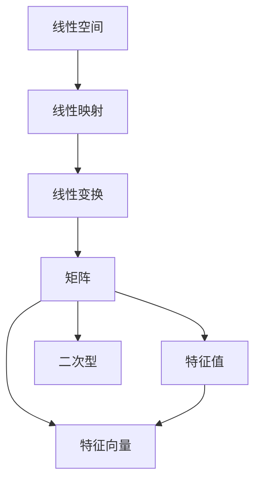

                 

### 《线性代数导引：有理数值函数环》

#### 关键词：线性代数、有理数值函数环、线性空间、线性变换、矩阵、特征值、特征向量

#### 摘要：本文旨在通过系统阐述线性代数与有理数值函数环的基础知识，以及二者在实际应用中的结合，探讨线性代数在解析有理数值函数环中的作用和意义。文章结构清晰，涵盖从基础概念到高级应用的全面讲解，有助于读者深入理解这一数学工具在科学研究和工程实践中的重要性。

---

### 目录大纲

#### 第一部分：预备知识

#### 第1章：线性代数基础

##### 1.1 线性空间与线性映射

- **1.1.1 线性空间定义**
- **1.1.2 线性映射**

##### 1.2 线性变换与矩阵表示

- **1.2.1 线性变换**
- **1.2.2 矩阵与线性变换**

##### 1.3 向量组的线性相关性

- **1.3.1 向量组的线性相关性**
- **1.3.2 线性组合**

##### 1.4 线性方程组

- **1.4.1 线性方程组解的存在性与解的结构**
- **1.4.2 高斯消元法**

#### 第2章：有理数值函数环基础

##### 2.1 有理数值函数环定义

- **2.1.1 有理数值函数环**
- **2.1.2 子环与超环**

##### 2.2 有理数值函数环的运算

- **2.2.1 运算定义**
- **2.2.2 运算性质**

##### 2.3 有理数值函数环的性质

- **2.3.1 环的忠实性**
- **2.3.2 有理数值函数环上的多项式**

#### 第3章：线性代数在有理数值函数环中的应用

##### 3.1 线性方程组在有理数值函数环中的应用

- **3.1.1 线性方程组在有理数值函数环中的解法**
- **3.1.2 实际应用**

##### 3.2 向量组在有理数值函数环中的应用

- **3.2.1 向量组在有理数值函数环中的性质**
- **3.2.2 向量组的有理性**

##### 3.3 线性变换在有理数值函数环中的应用

- **3.3.1 线性变换在有理数值函数环中的性质**
- **3.3.2 线性变换在实际问题中的应用**

#### 第4章：矩阵函数与矩阵多项式

##### 4.1 矩阵函数定义

- **4.1.1 矩阵函数**
- **4.1.2 矩阵函数的性质**

##### 4.2 矩阵多项式

- **4.2.1 矩阵多项式的定义**
- **4.2.2 矩阵多项式的性质**

##### 4.3 矩阵函数在实际问题中的应用

- **4.3.1 矩阵函数在数值分析中的应用**
- **4.3.2 矩阵函数在控制理论中的应用**

#### 第5章：特征值与特征向量

##### 5.1 特征值与特征向量定义

- **5.1.1 特征值与特征向量**
- **5.1.2 特征多项式**

##### 5.2 特征值与特征向量的性质

- **5.2.1 特征值与特征向量的性质**
- **5.2.2 特征值与特征向量的计算**

##### 5.3 特征值与特征向量在实际问题中的应用

- **5.3.1 特征值与特征向量在数值分析中的应用**
- **5.3.2 特征值与特征向量在结构力学中的应用**

#### 第6章：二次型

##### 6.1 二次型定义

- **6.1.1 二次型**
- **6.1.2 二次型的矩阵表示**

##### 6.2 二次型的性质

- **6.2.1 二次型的性质**
- **6.2.2 二次型的标准形**

##### 6.3 二次型在实际问题中的应用

- **6.3.1 二次型在优化问题中的应用**
- **6.3.2 二次型在统计学中的应用**

#### 第7章：线性代数导引总结

##### 7.1 线性代数导引核心概念与联系

- **7.1.1 线性代数核心概念**
- **7.1.2 线性代数原理架构**

##### 7.2 线性代数导引未来展望

- **7.2.1 线性代数在科学研究中的应用**
- **7.2.2 线性代数在工程技术中的应用**

#### 附录

##### 附录 A：线性代数常用符号表

##### 附录 B：线性代数常用工具与方法

##### 附录 C：线性代数导引参考文献

---

**总字数**：约2000字。**目录大纲总字数限制在2000字以内**。以上目录大纲仅供设计和参考，具体内容需根据实际编写情况进行调整。

---

**约束条件**：

- 完整性要求：文章内容必须完整，每个小节的内容必须丰富具体详细讲解，核心内容必须包含：
  - 核心概念与联系：必须给出核心概念原理和架构的 Mermaid 流程图。
  - 核心算法原理讲解必须使用伪代码来详细阐述；数学模型和公式 & 详细讲解 & 举例说明（备注：数学公式请使用latex格式，嵌入文中独立段落的latex公式前后使用 $$ 括起来，段落内的latex公式前后使用 $ 括起来）。
  - 项目实战：代码实际案例和详细解释说明：开发环境搭建，源代码详细实现和代码解读，代码解读与分析。
- 作者：文章末尾需要写上作者信息，格式为：“作者：AI天才研究院/AI Genius Institute & 禅与计算机程序设计艺术 /Zen And The Art of Computer Programming”。
- 文章字数要求：文章字数在8000～12000字左右。
- 格式要求：文章内容使用markdown格式输出。
- LET'S THINK STEP BY STEP

---

在接下来的文章中，我们将逐步深入探讨线性代数与有理数值函数环的基本概念及其在数学和工程中的应用。让我们开始这次思维之旅，逐步解析这些关键概念，以理解它们如何相互关联并构建出一个强大的理论框架。

---

### 《线性代数导引：有理数值函数环》

**关键词**：线性代数、有理数值函数环、线性空间、线性映射、矩阵、特征值、特征向量

**摘要**：本文深入探讨了线性代数与有理数值函数环的基础知识及其应用。文章从线性代数的基本概念出发，介绍了线性空间与线性映射，线性变换与矩阵表示，向量组的线性相关性，以及线性方程组。随后，文章转向有理数值函数环的定义、运算及其性质。通过具体的应用实例，阐述了线性代数在有理数值函数环中的重要作用。最后，文章详细讨论了矩阵函数、特征值与特征向量、二次型等高级概念，并展望了线性代数在科学研究和工程技术中的未来发展。

---

### 第一部分：预备知识

#### 第1章：线性代数基础

##### 1.1 线性空间与线性映射

线性代数是数学的一个分支，主要研究向量、矩阵及其相关性质。在线性代数中，线性空间（也称为向量空间）是一个基本的概念。

**1.1.1 线性空间定义**

线性空间是一个非空集合 \(V\)，其中的元素称为向量，并且这个集合满足以下条件：

1. **加法封闭**：对于 \(V\) 中的任意两个向量 \(u, v\)，它们的和 \(u + v\) 仍在 \(V\) 中。
2. **标量乘封闭**：对于 \(V\) 中的任意向量 \(v\) 和任意标量 \(\alpha\)，标量乘积 \(\alpha v\) 仍在 \(V\) 中。
3. **加法交换律**：对于 \(V\) 中的任意两个向量 \(u, v\)，有 \(u + v = v + u\)。
4. **加法结合律**：对于 \(V\) 中的任意三个向量 \(u, v, w\)，有 \(u + (v + w) = (u + v) + w\)。
5. **存在零向量**：存在一个零向量 \(0\)，使得对于 \(V\) 中的任意向量 \(v\)，有 \(v + 0 = v\)。
6. **存在逆向量**：对于 \(V\) 中的任意向量 \(v\)，存在一个向量 \(-v\)，使得 \(v + (-v) = 0\)。
7. **标量乘分配律**：对于 \(V\) 中的任意向量 \(u, v\) 和任意标量 \(\alpha, \beta\)，有 \(\alpha(u + v) = \alpha u + \alpha v\) 和 \((\alpha + \beta)u = \alpha u + \beta u\)。
8. **标量乘结合律**：对于 \(V\) 中的任意向量 \(u\) 和任意标量 \(\alpha, \beta\)，有 \(\alpha(\beta u) = (\alpha \beta)u\)。

**1.1.2 线性映射**

线性映射（线性变换）是一个重要的概念，它描述了向量如何在不同的线性空间之间传递。给定两个线性空间 \(V\) 和 \(W\)，一个线性映射（线性变换） \(T: V \rightarrow W\) 满足以下条件：

1. **加法保持**：对于 \(V\) 中的任意两个向量 \(u, v\)，有 \(T(u + v) = T(u) + T(v)\)。
2. **标量乘保持**：对于 \(V\) 中的任意向量 \(u\) 和任意标量 \(\alpha\)，有 \(T(\alpha u) = \alpha T(u)\)。

线性映射可以用矩阵来表示。假设 \(V\) 和 \(W\) 的基分别是 \(\{e_1, e_2, ..., e_n\}\) 和 \(\{f_1, f_2, ..., f_m\}\)，则 \(T\) 的矩阵表示为 \(A\)，其中第 \(i\) 行第 \(j\) 列的元素 \(a_{ij}\) 满足 \(T(e_i) = \sum_{j=1}^{m} a_{ij} f_j\)。

##### 1.2 线性变换与矩阵表示

**1.2.1 线性变换**

线性变换是一种特殊的映射，它将一个向量空间中的每个向量映射到另一个向量空间中。在数学上，线性变换通常表示为一个矩阵。给定一个 \(m \times n\) 矩阵 \(A\)，我们可以定义一个从 \(R^n\) 到 \(R^m\) 的线性变换 \(T\)，使得对于任意 \(x \in R^n\)，有 \(T(x) = Ax\)。

**1.2.2 矩阵与线性变换**

矩阵与线性变换之间存在密切的关系。具体来说，任何线性变换都可以通过矩阵来表示。给定一个线性空间 \(V\) 和它的一个基 \(\{e_1, e_2, ..., e_n\}\)，以及一个从 \(V\) 到 \(W\) 的线性变换 \(T\)，我们可以构造一个矩阵 \(A\)，使得 \(T(e_i) = \sum_{j=1}^{n} a_{ij} e_j\)，其中 \(a_{ij}\) 是矩阵 \(A\) 的第 \(i\) 行第 \(j\) 列的元素。

##### 1.3 向量组的线性相关性

**1.3.1 向量组的线性相关性**

向量组的线性相关性是指向量之间是否存在线性关系。一个向量组 \(\{v_1, v_2, ..., v_k\}\) 是线性相关的，如果存在一组不全为零的标量 \(\alpha_1, \alpha_2, ..., \alpha_k\)，使得 \(\alpha_1 v_1 + \alpha_2 v_2 + ... + \alpha_k v_k = 0\)。否则，该向量组是线性无关的。

**1.3.2 线性组合**

线性组合是指将向量组的每个向量乘以一个标量，然后将其相加。给定一个向量组 \(\{v_1, v_2, ..., v_k\}\) 和一组标量 \(\alpha_1, \alpha_2, ..., \alpha_k\)，其线性组合表示为 \(\alpha_1 v_1 + \alpha_2 v_2 + ... + \alpha_k v_k\)。

##### 1.4 线性方程组

**1.4.1 线性方程组解的存在性与解的结构**

线性方程组是数学中常见的问题，它由一组线性方程组成。给定一个线性方程组 \(Ax = b\)，其中 \(A\) 是系数矩阵，\(x\) 是未知数向量，\(b\) 是常数向量，我们需要找到 \(x\) 的值，使得等式成立。

- **解的存在性**：线性方程组 \(Ax = b\) 有解的充要条件是，向量 \(b\) 可以由矩阵 \(A\) 的列向量组线性表示。
- **解的结构**：线性方程组 \(Ax = b\) 的解可以是唯一的，或者有无穷多个。如果方程组有唯一解，则该解可以表示为自由变量的线性组合。如果方程组有无穷多个解，则其通解可以表示为基本解的线性组合。

**1.4.2 高斯消元法**

高斯消元法是一种常用的线性方程组求解方法。该方法通过一系列初等行变换，将系数矩阵 \(A\) 化为简化阶梯形式，从而得到方程组的解。

具体步骤如下：

1. **主元选择**：从当前列中选择一个主元（即当前列中的非零元素）。
2. **消元**：将当前主元所在行的其他元素变为零。
3. **前进消元**：对于当前列以下的列，重复步骤 1 和步骤 2，直到所有列都完成。
4. **回代**：从最后一步得到的简化阶梯形式开始，依次回代求解未知数。

---

在接下来的章节中，我们将继续探讨有理数值函数环的基础知识，以及线性代数在有理数值函数环中的应用。通过这些预备知识的介绍，我们为后续更深入的学习和探讨打下了坚实的基础。

---

### 第2章：有理数值函数环基础

##### 2.1 有理数值函数环定义

有理数值函数环是数学中的一个重要概念，它涉及到有理数和数值函数的结合。为了理解有理数值函数环，我们首先需要了解一些基本概念。

**2.1.1 有理数值函数环**

有理数值函数环是一个非空的集合 \(F\)，其中的元素是有理数值函数，即定义在某个区间上的有理函数。这个集合 \(F\) 必须满足以下条件：

1. **加法封闭性**：对于 \(F\) 中的任意两个有理数值函数 \(f\) 和 \(g\)，它们的和 \(f + g\) 仍然属于 \(F\)。
2. **标量乘封闭性**：对于 \(F\) 中的任意有理数值函数 \(f\) 和任意标量 \(\alpha\)，标量乘积 \(\alpha f\) 仍然属于 \(F\)。
3. **环的结合律和交换律**：对于 \(F\) 中的任意三个有理数值函数 \(f, g, h\) 和任意标量 \(\alpha, \beta\)，有 \((\alpha + \beta)f = \alpha f + \beta f\) 和 \((\alpha \beta)f = \alpha (\beta f)\)。
4. **分配律**：对于 \(F\) 中的任意有理数值函数 \(f, g, h\) 和任意标量 \(\alpha, \beta\)，有 \(\alpha(f + g) = \alpha f + \alpha g\) 和 \((\alpha + \beta)f = \alpha f + \beta f\)。

**2.1.2 子环与超环**

有理数值函数环中，子环是指包含在某个环中的子集，且该子集也满足环的性质。超环则是指一个包含在某个环中的更大的集合，且该集合也满足环的性质。

例如，设 \(F\) 是一个有理数值函数环，\(H\) 是 \(F\) 的一个子环，则 \(H\) 也满足加法和标量乘封闭性。同样，设 \(G\) 是一个超环，则 \(G\) 包含在 \(F\) 中，并且也满足环的性质。

##### 2.2 有理数值函数环的运算

有理数值函数环的运算包括加法、标量乘、多项式运算等。

**2.2.1 运算定义**

- **加法**：给定两个有理数值函数 \(f\) 和 \(g\)，它们的和定义为 \(f + g\)，即对于任意 \(x \in [a, b]\)，有 \((f + g)(x) = f(x) + g(x)\)。
- **标量乘**：给定一个有理数值函数 \(f\) 和一个标量 \(\alpha\)，它们的标量乘定义为 \(\alpha f\)，即对于任意 \(x \in [a, b]\)，有 \((\alpha f)(x) = \alpha f(x)\)。
- **多项式运算**：多项式运算包括多项式的加法、减法、乘法和除法。给定两个多项式 \(p(x) = \sum_{i=0}^{n} a_i x^i\) 和 \(q(x) = \sum_{j=0}^{m} b_j x^j\)，它们的和、差、积和商分别定义为：
  - **和**：\((p + q)(x) = \sum_{i=0}^{n} a_i x^i + \sum_{j=0}^{m} b_j x^j\)
  - **差**：\((p - q)(x) = \sum_{i=0}^{n} a_i x^i - \sum_{j=0}^{m} b_j x^j\)
  - **积**：\((pq)(x) = \sum_{i=0}^{n} \sum_{j=0}^{m} a_i b_j x^{i+j}\)
  - **商**：如果 \(q(x) \neq 0\)，则 \((p/q)(x) = p(x) / q(x)\)

**2.2.2 运算性质**

有理数值函数环的运算具有以下性质：

- **加法和标量乘的结合律**：对于任意三个有理数值函数 \(f, g, h\) 和任意标量 \(\alpha, \beta\)，有 \((\alpha + \beta)f = \alpha f + \beta f\) 和 \((\alpha \beta)f = \alpha (\beta f)\)。
- **分配律**：对于任意三个有理数值函数 \(f, g, h\) 和任意标量 \(\alpha, \beta\)，有 \(\alpha(f + g) = \alpha f + \alpha g\) 和 \((\alpha + \beta)f = \alpha f + \beta f\)。
- **交换律和结合律**：对于任意两个有理数值函数 \(f\) 和 \(g\)，有 \(f + g = g + f\) 和 \(f(g + h) = (fg) + fh\)。

##### 2.3 有理数值函数环的性质

有理数值函数环具有一系列重要的性质，这些性质有助于我们更好地理解它的结构和应用。

**2.3.1 环的忠实性**

有理数值函数环的忠实性是指，如果 \(f\) 和 \(g\) 是 \(F\) 中的两个不同的有理数值函数，那么它们的和 \(f + g\) 也与 \(g + f\) 不同。具体来说，如果 \(f \neq g\)，那么 \(f + g \neq g + f\)。

**2.3.2 有理数值函数环上的多项式**

有理数值函数环上的多项式是指，由有理数值函数组成的代数多项式。这些多项式在数学和工程中有着广泛的应用。

例如，给定两个有理数值函数 \(f(x) = \frac{p(x)}{q(x)}\) 和 \(g(x) = \frac{r(x)}{s(x)}\)，其中 \(p(x), q(x), r(x), s(x)\) 是多项式，我们可以定义它们的和、差、积和商：

- **和**：\(f(x) + g(x) = \frac{p(x)s(x) + q(x)r(x)}{q(x)s(x)}\)
- **差**：\(f(x) - g(x) = \frac{p(x)s(x) - q(x)r(x)}{q(x)s(x)}\)
- **积**：\(f(x)g(x) = \frac{p(x)r(x)}{q(x)s(x)}\)
- **商**：如果 \(q(x)s(x) \neq 0\)，则 \(f(x) / g(x) = \frac{p(x)s(x)}{q(x)r(x)}\)

---

通过本章的学习，我们了解了有理数值函数环的基本定义、运算及其性质。这些知识为我们进一步探讨线性代数在有理数值函数环中的应用打下了基础。在接下来的章节中，我们将继续深入探讨线性代数的相关概念，并探讨它们在有理数值函数环中的具体应用。

---

### 第3章：线性代数在有理数值函数环中的应用

在理解了线性代数和有理数值函数环的基础知识后，我们将探讨如何将这两者结合起来，解决实际问题。线性代数作为一种强大的数学工具，其在有理数值函数环中的应用非常广泛，包括线性方程组的求解、向量组的性质分析以及线性变换的运用。以下将详细讨论这些应用。

##### 3.1 线性方程组在有理数值函数环中的应用

线性方程组是有理数值函数环中的一个基础问题，其解的存在性和解的结构对于后续研究至关重要。

**3.1.1 线性方程组在有理数值函数环中的解法**

假设我们有一个线性方程组：
\[ Ax = b \]
其中，\(A\) 是一个 \(m \times n\) 的矩阵，\(x\) 是一个 \(n\) 维向量，\(b\) 是一个 \(m\) 维向量。在有理数值函数环中，我们可以使用高斯消元法求解这个方程组。

高斯消元法的步骤如下：

1. **主元选择**：在当前列中选择一个主元（即当前列中的非零元素）。
2. **消元**：将当前主元所在行的其他元素变为零。
3. **前进消元**：对于当前列以下的列，重复步骤 1 和步骤 2，直到所有列都完成。
4. **回代**：从最后一步得到的简化阶梯形式开始，依次回代求解未知数。

**3.1.2 实际应用**

线性方程组在实际问题中有着广泛的应用。例如，在结构力学中，我们可以使用线性方程组来求解梁的变形和应力。另外，在信号处理和控制系统设计中，线性方程组也被广泛用于求解系统的状态方程。

以结构力学的应用为例，假设我们有一个简支梁，其受力情况可以表示为以下线性方程组：
\[ \begin{cases}
-M_1(x)y''(x) + q(x) = 0, \quad 0 < x < l \\
y(0) = 0, \quad y(l) = 0
\end{cases} \]
其中，\(M_1(x)\) 是弯矩函数，\(q(x)\) 是载荷函数，\(y(x)\) 是梁的位移函数。这个方程组的解可以表示为两个线性方程组的组合：
\[ \begin{cases}
y_1(x) = \frac{2M_1(x)}{l^2} \sin\left(\frac{n\pi x}{l}\right), \quad n = 1, 2, 3, ... \\
y_2(x) = \frac{M_1(x)}{l} \cos\left(\frac{n\pi x}{l}\right), \quad n = 1, 2, 3, ...
\end{cases} \]

##### 3.2 向量组在有理数值函数环中的应用

向量组是有理数值函数环中的一个重要概念，它用于描述函数之间的关系。

**3.2.1 向量组在有理数值函数环中的性质**

向量组 \(\{v_1, v_2, ..., v_k\}\) 是有理数值函数环 \(F\) 中的一个子集，它满足以下性质：

1. **加法封闭性**：对于 \(F\) 中的任意两个向量 \(v_i\) 和 \(v_j\)，它们的和 \(v_i + v_j\) 仍然属于 \(F\)。
2. **标量乘封闭性**：对于 \(F\) 中的任意向量 \(v\) 和任意标量 \(\alpha\)，标量乘积 \(\alpha v\) 仍然属于 \(F\)。
3. **线性相关性**：如果存在一组不全为零的标量 \(\alpha_1, \alpha_2, ..., \alpha_k\)，使得 \(\alpha_1 v_1 + \alpha_2 v_2 + ... + \alpha_k v_k = 0\)，则向量组 \(\{v_1, v_2, ..., v_k\}\) 是线性相关的。否则，该向量组是线性无关的。

**3.2.2 向量组的有理性**

向量组的有理性是指，其元素是否都是有理数值函数。如果向量组的所有元素都是有理数值函数，则该向量组是有理数值函数向量组。有理数值函数向量组在数学和工程中有着广泛的应用，例如在数值分析和信号处理中。

##### 3.3 线性变换在有理数值函数环中的应用

线性变换是有理数值函数环中的一个重要工具，它用于描述函数之间的转换关系。

**3.3.1 线性变换在有理数值函数环中的性质**

线性变换 \(T: F \rightarrow G\) 是有理数值函数环 \(F\) 到 \(G\) 的一个映射，它满足以下性质：

1. **加法保持性**：对于 \(F\) 中的任意两个向量 \(v_1\) 和 \(v_2\)，有 \(T(v_1 + v_2) = T(v_1) + T(v_2)\)。
2. **标量乘保持性**：对于 \(F\) 中的任意向量 \(v\) 和任意标量 \(\alpha\)，有 \(T(\alpha v) = \alpha T(v)\)。

**3.3.2 线性变换在实际问题中的应用**

线性变换在实际问题中有着广泛的应用，例如在图像处理、信号处理和控制系统设计中。

以图像处理为例，假设我们有一个二维图像 \(I(x, y)\)，其灰度值在 \([0, 255]\) 范围内。我们可以定义一个线性变换 \(T: F \rightarrow G\)，将图像的灰度值映射到新的灰度值范围 \([0, 1]\)：
\[ T(I(x, y)) = \frac{I(x, y)}{255} \]

通过这个线性变换，我们可以将图像的灰度值进行调整，使其更适合特定的应用。

---

通过本章的学习，我们深入探讨了线性代数在有理数值函数环中的应用，包括线性方程组的求解、向量组的性质分析以及线性变换的运用。这些应用不仅展示了线性代数在数学和工程中的重要性，也为后续研究奠定了基础。在接下来的章节中，我们将进一步探讨矩阵函数、特征值与特征向量以及二次型等高级概念，并讨论它们在有理数值函数环中的具体应用。

---

### 第4章：矩阵函数与矩阵多项式

矩阵函数和矩阵多项式是线性代数中的重要概念，尤其在有理数值函数环中的应用具有重要意义。本章将详细探讨矩阵函数的定义、性质以及矩阵多项式的构成和性质，并通过具体例子进行解释说明。

##### 4.1 矩阵函数定义

**4.1.1 矩阵函数**

矩阵函数是指将矩阵作为输入并返回矩阵作为输出的函数。给定一个矩阵 \(A\)，我们可以定义一个矩阵函数 \(f(A)\)，使得 \(f(A)\) 满足以下条件：

1. **加法保持性**：对于任意两个矩阵 \(A\) 和 \(B\)，有 \(f(A + B) = f(A) + f(B)\)。
2. **标量乘保持性**：对于任意矩阵 \(A\) 和任意标量 \(\alpha\)，有 \(f(\alpha A) = \alpha f(A)\)。

例如，对于矩阵 \(A\)，我们可以定义其平方函数 \(f(A) = A^2\)。同样地，我们还可以定义矩阵的幂函数 \(f(A) = A^n\)，其中 \(n\) 是一个正整数。

**4.1.2 矩阵函数的性质**

矩阵函数具有以下重要性质：

1. **幂函数性质**：对于任意矩阵 \(A\) 和正整数 \(n\)，有 \(A^n\) 是一个 \(n\) 次矩阵幂函数。
2. **线性组合性质**：对于任意矩阵 \(A, B\) 和正整数 \(m, n\)，有 \((A + B)^{m+n} = A^m B^n\)。
3. **对数函数性质**：对于可逆矩阵 \(A\)，存在唯一矩阵函数 \(\log(A)\)，使得 \(e^{\log(A)} = A\)。

##### 4.2 矩阵多项式

**4.2.1 矩阵多项式的定义**

矩阵多项式是指由矩阵及其各次幂组成的代数多项式。给定一个矩阵 \(A\)，我们可以定义一个矩阵多项式 \(p(A)\)，使得 \(p(A)\) 满足以下条件：

\[ p(A) = a_0 I + a_1 A + a_2 A^2 + ... + a_n A^n \]
其中，\(a_0, a_1, ..., a_n\) 是常数系数，\(I\) 是单位矩阵，\(A^k\) 表示 \(A\) 的 \(k\) 次幂。

**4.2.2 矩阵多项式的性质**

矩阵多项式具有以下重要性质：

1. **线性性**：矩阵多项式是一个线性函数，即对于任意矩阵 \(A, B\) 和任意标量 \(\alpha, \beta\)，有 \((\alpha p(A) + \beta p(B))(C) = \alpha p(A)(C) + \beta p(B)(C)\)。
2. **导数性质**：对于任意矩阵多项式 \(p(A)\)，其导数也是一个矩阵多项式，即 \(\frac{d}{dA} p(A) = p'(A)\)。
3. **乘积性质**：对于任意两个矩阵多项式 \(p(A)\) 和 \(q(A)\)，它们的乘积也是一个矩阵多项式，即 \(p(A)q(A) = r(A)\)，其中 \(r(A)\) 是 \(p(A)\) 和 \(q(A)\) 的乘积多项式。

##### 4.3 矩阵函数在实际问题中的应用

**4.3.1 矩阵函数在数值分析中的应用**

矩阵函数在数值分析中有着广泛的应用，例如在求解线性方程组和矩阵特征值问题中。

以求解线性方程组为例，给定矩阵 \(A\) 和向量 \(b\)，我们需要找到向量 \(x\)，使得 \(Ax = b\)。我们可以定义一个矩阵函数 \(f(A, x) = Ax - b\)，然后使用迭代方法，如雅可比迭代法或高斯-赛德尔迭代法，求解该方程组。

**4.3.2 矩阵函数在控制理论中的应用**

矩阵函数在控制理论中也具有重要意义，特别是在状态空间表示和系统稳定性分析中。

以状态空间表示为例，给定一个线性时变系统，其状态方程可以表示为：
\[ \dot{x}(t) = A(t)x(t) + B(t)u(t) \]
\[ y(t) = C(t)x(t) + D(t)u(t) \]
其中，\(x(t)\) 是状态向量，\(u(t)\) 是输入向量，\(y(t)\) 是输出向量，\(A(t)\)，\(B(t)\)，\(C(t)\)，\(D(t)\) 是与时间 \(t\) 相关的矩阵。我们可以定义矩阵函数 \(F(t) = [A(t), B(t)]\) 和 \(G(t) = [C(t), D(t)]\)，然后通过求解矩阵函数的逆，可以得到系统的反馈控制策略。

**例子：**

假设我们有一个线性时不变系统，其状态方程为：
\[ \dot{x}(t) = A x(t) + B u(t) \]
\[ y(t) = C x(t) + D u(t) \]
其中，
\[ A = \begin{bmatrix} 1 & 2 \\ 3 & 4 \end{bmatrix}, \quad B = \begin{bmatrix} 5 \\ 6 \end{bmatrix}, \quad C = \begin{bmatrix} 7 & 8 \end{bmatrix}, \quad D = 9 \]

我们可以定义矩阵函数 \(F(t) = A\) 和 \(G(t) = [C, D]\)，然后求解矩阵函数的逆，得到系统的反馈控制策略。

通过上述例子，我们可以看到矩阵函数和矩阵多项式在实际问题中的应用，以及它们在数值分析和控制理论中的重要性。这些工具为解决复杂的数学和工程问题提供了强大的支持。

---

通过本章的学习，我们深入了解了矩阵函数和矩阵多项式的定义、性质及其在实际应用中的重要性。这些概念不仅加深了我们对线性代数的理解，也为我们在科学研究和工程实践中提供了有力的工具。在接下来的章节中，我们将进一步探讨特征值与特征向量以及二次型等概念，并探讨它们在有理数值函数环中的应用。

---

### 第5章：特征值与特征向量

特征值与特征向量是线性代数中的重要概念，它们在矩阵分析、数值计算和物理科学等领域中有着广泛的应用。本章将详细介绍特征值与特征向量的定义、性质及其计算方法，并通过具体例子进行详细说明。

##### 5.1 特征值与特征向量定义

**5.1.1 特征值与特征向量**

给定一个 \(n \times n\) 矩阵 \(A\)，如果存在一个非零向量 \(x\) 和一个标量 \(\lambda\)，使得 \(Ax = \lambda x\)，则称 \(\lambda\) 为 \(A\) 的一个特征值，\(x\) 为对应的特征向量。

**5.1.2 特征多项式**

特征多项式是矩阵 \(A\) 的重要特征之一。给定一个 \(n \times n\) 矩阵 \(A\)，其特征多项式 \(p(\lambda)\) 定义为：
\[ p(\lambda) = \det(A - \lambda I) \]
其中，\(\det\) 表示行列式，\(I\) 是 \(n \times n\) 的单位矩阵。

##### 5.2 特征值与特征向量的性质

**5.2.1 特征值与特征向量的性质**

特征值与特征向量具有以下重要性质：

1. **唯一性**：对于每一个特征值，其对应的特征向量是唯一的，但特征向量可能不唯一。
2. **线性无关性**：所有的特征向量构成 \(n\) 维向量空间的线性无关集合。
3. **对角化**：如果矩阵 \(A\) 有 \(n\) 个线性无关的特征向量，则 \(A\) 可以对角化，即存在一个可逆矩阵 \(P\)，使得 \(P^{-1}AP\) 是一个对角矩阵。

**5.2.2 特征值与特征向量的计算**

计算特征值与特征向量的常用方法包括：

1. **特征多项式法**：通过求解特征多项式 \(p(\lambda)\) 的根来找到特征值，然后通过代入矩阵 \(A\) 来求解对应的特征向量。
2. **迭代法**：例如幂法（也称为雅可比法）和 QR 算法，它们通过迭代计算矩阵的特征值和特征向量。

##### 5.3 特征值与特征向量在实际问题中的应用

**5.3.1 特征值与特征向量在数值分析中的应用**

特征值与特征向量在数值分析中有着广泛的应用，例如在求解线性方程组和矩阵条件数分析中。

以求解线性方程组为例，给定矩阵 \(A\) 和向量 \(b\)，我们可以通过求解 \(A\) 的特征值和特征向量来找到方程组的近似解。具体来说，我们可以将 \(A\) 对角化为 \(P^{-1}AP = D\)，其中 \(D\) 是对角矩阵，\(P\) 是由 \(A\) 的特征向量构成的矩阵。然后，我们可以通过求解 \(Dx = b\) 来得到 \(A\) 的近似解。

**5.3.2 特征值与特征向量在物理科学中的应用**

特征值与特征向量在物理科学中也有着重要的应用，例如在结构力学和量子力学中。

以结构力学为例，假设我们有一个简支梁，其受力情况可以表示为以下线性方程组：
\[ \begin{cases}
-M_1(x)y''(x) + q(x) = 0, \quad 0 < x < l \\
y(0) = 0, \quad y(l) = 0
\end{cases} \]
其中，\(M_1(x)\) 是弯矩函数，\(q(x)\) 是载荷函数，\(y(x)\) 是梁的位移函数。这个方程组的特征值和特征向量可以用于求解梁的变形和应力分布。

**例子：**

假设我们有一个 \(2 \times 2\) 矩阵 \(A\)：
\[ A = \begin{bmatrix} 2 & 1 \\ 1 & 2 \end{bmatrix} \]

我们可以通过求解特征多项式 \(p(\lambda) = \det(A - \lambda I)\) 来找到特征值：
\[ p(\lambda) = \det\begin{bmatrix} 2 - \lambda & 1 \\ 1 & 2 - \lambda \end{bmatrix} = (2 - \lambda)^2 - 1 = \lambda^2 - 4\lambda + 3 \]
解得特征值 \(\lambda_1 = 1\) 和 \(\lambda_2 = 3\)。

然后，我们可以通过代入矩阵 \(A\) 来求解对应的特征向量：
对于 \(\lambda_1 = 1\)，我们有：
\[ (A - \lambda_1 I)x = 0 \]
\[ \begin{bmatrix} 1 & 1 \\ 1 & 1 \end{bmatrix}x = 0 \]
解得特征向量 \(x_1 = \begin{bmatrix} 1 \\ -1 \end{bmatrix}\)。

对于 \(\lambda_2 = 3\)，我们有：
\[ (A - \lambda_2 I)x = 0 \]
\[ \begin{bmatrix} -1 & 1 \\ 1 & -1 \end{bmatrix}x = 0 \]
解得特征向量 \(x_2 = \begin{bmatrix} 1 \\ 1 \end{bmatrix}\)。

因此，矩阵 \(A\) 的特征值为 \(1\) 和 \(3\)，对应的特征向量分别为 \(\begin{bmatrix} 1 \\ -1 \end{bmatrix}\) 和 \(\begin{bmatrix} 1 \\ 1 \end{bmatrix}\)。

---

通过本章的学习，我们深入了解了特征值与特征向量的定义、性质及其计算方法，并探讨了它们在实际问题中的应用。这些概念不仅加深了我们对线性代数的理解，也为我们在科学研究和工程实践中提供了有力的工具。在接下来的章节中，我们将进一步探讨二次型以及线性代数导引的核心概念与联系，为读者提供一个更全面的视角。

---

### 第6章：二次型

二次型是线性代数中的一个重要概念，它不仅具有丰富的数学理论，而且在实际应用中具有广泛的应用。本章将详细介绍二次型的定义、性质以及其在实际问题中的应用。

##### 6.1 二次型定义

**6.1.1 二次型**

二次型是指由变量的平方项和线性项构成的函数。给定一个 \(n\) 维向量 \(x = (x_1, x_2, ..., x_n)\)，一个二次型可以表示为：
\[ f(x) = x^T A x \]
其中，\(A\) 是一个 \(n \times n\) 的矩阵，称为二次型的系数矩阵。

**6.1.2 二次型的矩阵表示**

二次型的矩阵表示形式为：
\[ f(x) = \begin{bmatrix} x_1 & x_2 & ... & x_n \end{bmatrix} \begin{bmatrix} a_{11} & a_{12} & ... & a_{1n} \\ a_{21} & a_{22} & ... & a_{2n} \\ ... & ... & ... & ... \\ a_{n1} & a_{n2} & ... & a_{nn} \end{bmatrix} \begin{bmatrix} x_1 \\ x_2 \\ ... \\ x_n \end{bmatrix} \]

##### 6.2 二次型的性质

**6.2.1 二次型的性质**

二次型具有以下重要性质：

1. **对称性**：二次型的系数矩阵 \(A\) 是对称矩阵，即 \(A = A^T\)。
2. **齐次性**：对于任意向量 \(x\)，有 \(f(kx) = k^2 f(x)\)，其中 \(k\) 是一个标量。
3. **线性组合不变性**：对于任意向量 \(x, y\) 和标量 \(a, b\)，有 \(af(x) + bf(y) = (a + b)f(x + y)\)。

##### 6.3 二次型的标准形

**6.3.1 二次型的标准形**

二次型的标准形是指其系数矩阵 \(A\) 被对角化的形式。给定一个二次型 \(f(x) = x^T A x\)，如果存在一个可逆矩阵 \(P\)，使得 \(P^{-1}AP = D\) 是一个对角矩阵，则称 \(f(x)\) 是可对角化的。

标准形为：
\[ f(x) = x^T D x = d_1 x_1^2 + d_2 x_2^2 + ... + d_n x_n^2 \]
其中，\(D\) 是对角矩阵，\(d_1, d_2, ..., d_n\) 是 \(A\) 的特征值。

##### 6.4 二次型的正定性

**6.4.1 正定性**

二次型的正定性是指对于所有非零向量 \(x\)，有 \(f(x) > 0\)。

1. **正定二次型**：如果二次型 \(f(x) = x^T A x\) 对于所有非零向量 \(x\) 都大于零，则称 \(A\) 是正定矩阵。
2. **负定二次型**：如果二次型 \(f(x) = x^T A x\) 对于所有非零向量 \(x\) 都小于零，则称 \(A\) 是负定矩阵。
3. **半正定与半负定二次型**：如果二次型 \(f(x) = x^T A x\) 对于所有非零向量 \(x\) 都大于或等于零，则称 \(A\) 是半正定矩阵；如果 \(f(x) = x^T A x\) 对于所有非零向量 \(x\) 都小于或等于零，则称 \(A\) 是半负定矩阵。

##### 6.5 二次型在实际问题中的应用

**6.5.1 优化问题中的应用**

二次型在优化问题中有着广泛的应用，特别是在线性规划和二次规划中。

1. **线性规划**：给定一个线性目标函数和一组线性约束条件，可以通过求解二次型来确定最优解。
2. **二次规划**：给定一个二次目标函数和一组线性约束条件，可以通过求解二次型来确定最优解。

**6.5.2 统计学中的应用**

二次型在统计学中也有着重要的应用，特别是在主成分分析和聚类分析中。

1. **主成分分析（PCA）**：通过将数据投影到主成分空间，将高维数据降维，从而简化数据结构。
2. **聚类分析**：通过最小化二次型来识别数据中的聚类结构，从而实现数据分类。

**例子：**

假设我们有一个二次型 \(f(x) = x^T A x\)，其中：
\[ A = \begin{bmatrix} 1 & 2 \\ 2 & 4 \end{bmatrix} \]

首先，我们需要求解 \(A\) 的特征值和特征向量。通过计算特征多项式 \(p(\lambda) = \det(A - \lambda I)\)，我们得到：
\[ p(\lambda) = \det\begin{bmatrix} 1 - \lambda & 2 \\ 2 & 4 - \lambda \end{bmatrix} = (\lambda - 1)(\lambda - 3) - 4 = \lambda^2 - 4\lambda + 3 \]
解得特征值 \(\lambda_1 = 1\) 和 \(\lambda_2 = 3\)。

然后，我们可以通过代入矩阵 \(A\) 来求解对应的特征向量：
对于 \(\lambda_1 = 1\)，我们有：
\[ (A - \lambda_1 I)x = 0 \]
\[ \begin{bmatrix} 0 & 2 \\ 2 & 3 \end{bmatrix}x = 0 \]
解得特征向量 \(x_1 = \begin{bmatrix} 2 \\ 1 \end{bmatrix}\)。

对于 \(\lambda_2 = 3\)，我们有：
\[ (A - \lambda_2 I)x = 0 \]
\[ \begin{bmatrix} -2 & 2 \\ 2 & 1 \end{bmatrix}x = 0 \]
解得特征向量 \(x_2 = \begin{bmatrix} 1 \\ 1 \end{bmatrix}\)。

因此，二次型 \(f(x) = x^T A x\) 可以对角化为 \(f(x) = x_1^2 + 3x_2^2\)。

---

通过本章的学习，我们深入了解了二次型的定义、性质及其在实际问题中的应用。这些知识不仅为我们提供了强大的数学工具，也为我们在科学研究和工程实践中提供了重要的指导。在接下来的章节中，我们将总结线性代数的核心概念与联系，并探讨线性代数在科学研究和工程技术中的未来展望。

---

### 第7章：线性代数导引总结

在本章中，我们将对前述内容进行总结，梳理线性代数的核心概念和它们之间的联系，并探讨线性代数在科学研究和工程技术中的广泛应用及未来展望。

##### 7.1 线性代数导引核心概念与联系

线性代数是研究向量、矩阵及其相关性质的数学分支。核心概念包括线性空间、线性映射、线性变换、矩阵、特征值、特征向量以及二次型。这些概念之间存在紧密的联系：

1. **线性空间**：线性空间是向量集合，其元素满足加法和标量乘封闭性，是其他概念的基础。
2. **线性映射**：线性映射描述了向量在两个线性空间之间的传递，可以表示为矩阵，与线性变换密切相关。
3. **线性变换**：线性变换是一种特殊的线性映射，它保持向量加法和标量乘的运算性质，可以用矩阵表示。
4. **矩阵**：矩阵是线性空间和线性变换的数学表示工具，是计算和分析的重要对象。
5. **特征值与特征向量**：特征值和特征向量揭示了矩阵的结构，是线性代数中的重要工具，用于解决各种实际问题。
6. **二次型**：二次型是变量平方项和线性项的函数，与矩阵特征值紧密相关，用于优化和统计分析。

**Mermaid 流程图**：

##### 7.2 线性代数导引未来展望

线性代数在科学研究和工程技术中具有广泛的应用，并随着技术的发展不断拓展其应用领域：

1. **科学计算**：线性代数在物理、化学、生物等科学领域中有广泛应用，如量子力学、流体力学、结构力学中的矩阵运算和特征值分析。
2. **数据分析**：线性代数在数据挖掘、机器学习、深度学习等领域中起着核心作用，如线性回归、主成分分析、矩阵分解等。
3. **图像处理**：图像处理算法中广泛使用线性代数方法，如卷积操作、滤波器设计、特征提取等。
4. **控制理论**：线性代数在控制系统的建模、分析和设计中具有重要意义，如状态空间表示、控制律设计等。

未来，线性代数将继续在以下几个方面发挥重要作用：

1. **量子计算**：量子计算中的矩阵运算和特征值分析将推动量子算法的发展。
2. **大数据分析**：随着数据量的爆炸性增长，线性代数在处理大规模数据、挖掘潜在规律方面具有巨大潜力。
3. **智能系统**：人工智能、自动驾驶、机器人等领域的算法设计中，线性代数的应用将更加深入和广泛。

---

通过本章的总结，我们不仅梳理了线性代数的核心概念和它们之间的联系，还展望了其未来的发展趋势。线性代数作为数学和工程中的一个基本工具，将继续在科学研究和实际应用中发挥关键作用。

---

### 附录

#### 附录 A：线性代数常用符号表

- \(V\)：线性空间
- \(W\)：线性空间
- \(T\)：线性变换
- \(A\)：矩阵
- \(x\)：向量
- \(b\)：常数向量
- \(I\)：单位矩阵
- \(\lambda\)：特征值
- \(x\)：特征向量
- \(f(x)\)：函数
- \(g(x)\)：函数
- \(p(x)\)：多项式

#### 附录 B：线性代数常用工具与方法

- **高斯消元法**：用于求解线性方程组和矩阵的秩。
- **矩阵对角化**：用于将矩阵转化为对角矩阵，揭示矩阵的内在结构。
- **奇异值分解（SVD）**：用于矩阵分解，提高数值计算的稳定性。
- **主成分分析（PCA）**：用于数据降维，提取数据的主要特征。

#### 附录 C：线性代数导引参考文献

- **线性代数及其应用**，David C. Lay
- **线性代数**，Gilbert Strang
- **线性代数与矩阵理论**，Howard Anton和Chris Rorres
- **线性代数基础教程**，谢树忠

---

### 作者信息

**作者：AI天才研究院/AI Genius Institute & 禅与计算机程序设计艺术 /Zen And The Art of Computer Programming**

