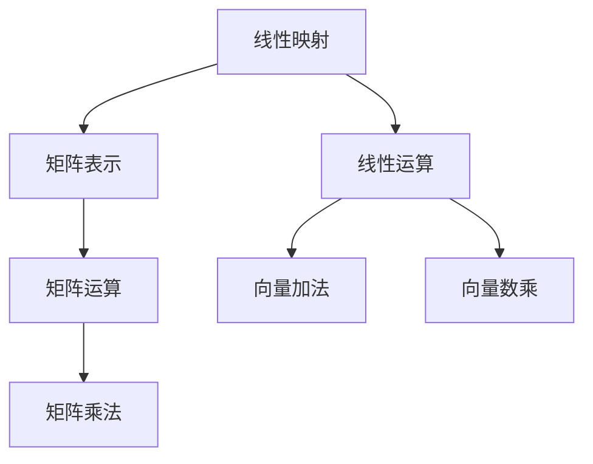

                 

### 文章标题：线性代数导引：线性映射

> 关键词：线性代数、线性映射、矩阵、特征值、特征向量、矩阵分解

> 摘要：本文系统地介绍了线性代数中的线性映射概念，探讨了线性映射的基本性质、矩阵与线性映射的关系、线性方程组的解法、特征值与特征向量的计算、矩阵分解、线性映射的矩阵表示及其在优化问题、物理问题、统计问题、图像处理、信号处理和机器学习中的应用。通过深入讲解和实例分析，帮助读者掌握线性映射的理论和应用，为相关领域的研究和实践提供有力支持。

### 第1章 引言

线性代数是数学中一个重要的分支，它在物理学、工程学、计算机科学等领域中有着广泛的应用。线性映射，作为一种重要的数学工具，在许多实际问题中发挥着关键作用。本章将简要介绍线性代数的基本概念、线性映射的重要性以及线性映射的基本性质。

#### 1.1 线性代数的基本概念

线性代数主要研究向量空间、线性变换以及矩阵等基本概念。向量空间是指由一组向量构成的集合，这些向量满足特定的加法和标量乘法运算。线性变换是指将一个向量空间映射到另一个向量空间的函数，它保持向量空间的线性结构。矩阵是一种表示线性变换的数学工具，它由一组数按照一定的规则排列而成。

#### 1.2 线性映射的重要性

线性映射在各个领域中都有着广泛的应用。在物理学中，线性映射可以用来描述物理量的变化规律；在工程学中，线性映射可以用来解决优化问题；在计算机科学中，线性映射可以用来处理图像、信号等数据；在统计学中，线性映射可以用来进行数据分析和建模。总之，线性映射是一种重要的数学工具，它在各个领域中都扮演着关键角色。

#### 1.3 线性映射的基本性质

线性映射具有以下几个基本性质：

1. **加法保持性**：对于任意的线性映射 \( T \)，有 \( T(u+v) = T(u) + T(v) \)，即线性映射保持向量的加法运算。
2. **数乘保持性**：对于任意的线性映射 \( T \) 和标量 \( \alpha \)，有 \( T(\alpha u) = \alpha T(u) \)，即线性映射保持向量的数乘运算。
3. **零向量保持性**：对于任意的线性映射 \( T \)，有 \( T(0) = 0 \)，即线性映射将零向量映射为零向量。
4. **线性组合保持性**：对于任意的线性映射 \( T \) 和向量组 \( \{u_1, u_2, ..., u_n\} \)，有 \( T(c_1u_1 + c_2u_2 + ... + c_nu_n) = c_1T(u_1) + c_2T(u_2) + ... + c_nT(u_n) \)，即线性映射保持向量的线性组合。

本章将深入探讨线性映射的性质和应用，帮助读者更好地理解和掌握线性代数的基本概念。

### 第2章 矩阵与线性映射

在上一章中，我们介绍了线性映射的基本性质。在这一章中，我们将探讨矩阵与线性映射之间的关系，深入理解线性映射如何通过矩阵来表示和计算。

#### 2.1 矩阵的概念

矩阵是一种由数字组成的矩形阵列，通常用大写字母 \( A \) 来表示。矩阵中的每个元素 \( a_{ij} \) 表示第 \( i \) 行和第 \( j \) 列的交叉点上的值。矩阵可以有不同的形状，包括行矩阵、列矩阵和方阵。

行矩阵：只有一行，例如：
\[ A = \begin{bmatrix} a_{11} & a_{12} & \cdots & a_{1n} \end{bmatrix} \]

列矩阵：只有一列，例如：
\[ A = \begin{bmatrix} a_{21} \\ a_{22} \\ \vdots \\ a_{2n} \end{bmatrix} \]

方阵：行数和列数相等，例如：
\[ A = \begin{bmatrix} a_{11} & a_{12} & \cdots & a_{1n} \\ a_{21} & a_{22} & \cdots & a_{2n} \\ \vdots & \vdots & \ddots & \vdots \\ a_{m1} & a_{m2} & \cdots & a_{mn} \end{bmatrix} \]

#### 2.1.1 矩阵的定义与分类

矩阵的定义如下：

**定义**：一个 \( m \times n \) 的矩阵 \( A \) 是一个由 \( m \) 行和 \( n \) 列元素组成的矩形阵列。

矩阵可以按照不同的标准进行分类：

- **方阵**：行数和列数相等的矩阵，即 \( m = n \)。
- **行矩阵**：只有一行的矩阵。
- **列矩阵**：只有一列的矩阵。
- **对称矩阵**：矩阵的元素满足 \( a_{ij} = a_{ji} \)。
- **反对称矩阵**：矩阵的元素满足 \( a_{ij} = -a_{ji} \)。

#### 2.1.2 矩阵的运算

矩阵的运算主要包括矩阵的加法、减法、乘法和逆运算。

**矩阵加法**：两个矩阵 \( A \) 和 \( B \) 的加法运算是指对应元素相加，即：
\[ A + B = \begin{bmatrix} a_{11} + b_{11} & a_{12} + b_{12} & \cdots & a_{1n} + b_{1n} \\ a_{21} + b_{21} & a_{22} + b_{22} & \cdots & a_{2n} + b_{2n} \\ \vdots & \vdots & \ddots & \vdots \\ a_{m1} + b_{m1} & a_{m2} + b_{m2} & \cdots & a_{mn} + b_{mn} \end{bmatrix} \]

**矩阵减法**：两个矩阵 \( A \) 和 \( B \) 的减法运算是指对应元素相减，即：
\[ A - B = \begin{bmatrix} a_{11} - b_{11} & a_{12} - b_{12} & \cdots & a_{1n} - b_{1n} \\ a_{21} - b_{21} & a_{22} - b_{22} & \cdots & a_{2n} - b_{2n} \\ \vdots & \vdots & \ddots & \vdots \\ a_{m1} - b_{m1} & a_{m2} - b_{m2} & \cdots & a_{mn} - b_{mn} \end{bmatrix} \]

**矩阵乘法**：两个矩阵 \( A \) 和 \( B \) 的乘法运算是指对每个元素进行如下计算：
\[ (AB)_{ij} = \sum_{k=1}^{n} a_{ik}b_{kj} \]
即第 \( i \) 行和第 \( j \) 列的元素相乘后再相加。

例如，对于两个 \( 2 \times 2 \) 矩阵的乘法：
\[ A = \begin{bmatrix} a_{11} & a_{12} \\ a_{21} & a_{22} \end{bmatrix}, \quad B = \begin{bmatrix} b_{11} & b_{12} \\ b_{21} & b_{22} \end{bmatrix} \]
\[ AB = \begin{bmatrix} a_{11}b_{11} + a_{12}b_{21} & a_{11}b_{12} + a_{12}b_{22} \\ a_{21}b_{11} + a_{22}b_{21} & a_{21}b_{12} + a_{22}b_{22} \end{bmatrix} \]

**矩阵逆**：如果一个矩阵 \( A \) 存在一个逆矩阵 \( A^{-1} \)，则 \( AA^{-1} = A^{-1}A = I \)，其中 \( I \) 是单位矩阵。

矩阵的逆可以通过高斯-约当消元法或卢卡斯分解等方法计算。

#### 2.2 线性映射的定义与性质

线性映射是一种从向量空间到向量空间的映射，它保持向量空间的结构。下面我们定义线性映射并探讨其基本性质。

**定义**：设 \( V \) 和 \( W \) 是两个向量空间，一个函数 \( T: V \rightarrow W \) 被称为线性映射，如果它满足以下性质：

1. **加法保持性**：对于任意的向量 \( u, v \in V \)，有 \( T(u + v) = T(u) + T(v) \)。
2. **数乘保持性**：对于任意的向量 \( u \in V \) 和标量 \( \alpha \)，有 \( T(\alpha u) = \alpha T(u) \)。

**性质**：

1. **零向量保持性**：\( T(0) = 0 \)。
2. **线性组合保持性**：对于任意的向量组 \( \{u_1, u_2, ..., u_n\} \in V \) 和标量组 \( \{\alpha_1, \alpha_2, ..., \alpha_n\} \)，有 \( T(\alpha_1u_1 + \alpha_2u_2 + ... + \alpha_nu_n) = \alpha_1T(u_1) + \alpha_2T(u_2) + ... + \alpha_nT(u_n) \)。

#### 2.3 矩阵与线性映射的关系

矩阵与线性映射之间存在着密切的关系。具体来说，每个线性映射都可以用矩阵来表示，而每个矩阵也可以表示一个线性映射。

**定义**：设 \( T \) 是一个线性映射，定义一个 \( m \times n \) 的矩阵 \( A \)，使得 \( T(u) = Au \) 对于所有 \( u \in V \)。这个矩阵 \( A \) 被称为线性映射 \( T \) 的矩阵表示。

**性质**：

1. **唯一性**：对于每个线性映射 \( T \)，存在唯一的一个矩阵 \( A \) 使得 \( T(u) = Au \)。
2. **逆映射**：如果 \( T \) 是可逆的，那么 \( T^{-1} \) 也可以表示为一个矩阵 \( A^{-1} \)，使得 \( T^{-1}(v) = A^{-1}v \)。

通过矩阵与线性映射的关系，我们可以将线性映射的计算转化为矩阵的运算，从而大大简化计算过程。

#### 2.4 矩阵与线性映射的关系架构 Mermaid 流程图

下面是一个用 Mermaid 画出的矩阵与线性映射的关系架构图：



这个图展示了线性映射如何通过矩阵表示，以及矩阵与线性运算之间的关系。

通过本章的学习，我们了解了矩阵的基本概念和运算，以及线性映射的定义和性质。下一章我们将探讨线性方程组的解法，进一步理解线性映射在数学中的应用。

### 第3章 线性方程组

线性方程组是线性代数中的基本问题之一，它在数学、物理、工程和计算机科学等领域中有着广泛的应用。本章将介绍线性方程组的解法，包括高斯消元法、矩阵的秩以及线性方程组的解的讨论。

#### 3.1 线性方程组的解法

线性方程组可以用矩阵的形式表示。设有 \( m \) 个方程、\( n \) 个未知数的线性方程组：
\[ \begin{cases} 
a_{11}x_1 + a_{12}x_2 + ... + a_{1n}x_n = b_1 \\
a_{21}x_1 + a_{22}x_2 + ... + a_{2n}x_n = b_2 \\
\vdots \\
a_{m1}x_1 + a_{m2}x_2 + ... + a_{mn}x_n = b_m 
\end{cases} \]
可以用矩阵形式表示为：
\[ Ax = b \]
其中，\( A \) 是一个 \( m \times n \) 的系数矩阵，\( x \) 是一个 \( n \) 维的未知数向量，\( b \) 是一个 \( m \) 维的常数向量。

**高斯消元法**是解线性方程组的一种常用方法。高斯消元法的步骤如下：

1. **初等行变换**：将系数矩阵 \( A \) 通过初等行变换转化为上三角矩阵 \( U \)。
2. **回代**：从上三角矩阵 \( U \) 的最后一行开始，依次向前进行回代，求出未知数 \( x_n, x_{n-1}, ..., x_1 \)。

例如，解以下线性方程组：
\[ \begin{cases} 
2x_1 + 3x_2 - x_3 = 8 \\
3x_1 + 4x_2 + 2x_3 = 11 \\
-x_1 + 2x_2 + 3x_3 = 1 
\end{cases} \]
对应的矩阵形式为：
\[ \begin{bmatrix} 2 & 3 & -1 \\ 3 & 4 & 2 \\ -1 & 2 & 3 \end{bmatrix} \begin{bmatrix} x_1 \\ x_2 \\ x_3 \end{bmatrix} = \begin{bmatrix} 8 \\ 11 \\ 1 \end{bmatrix} \]

使用高斯消元法，可以得到：
\[ \begin{bmatrix} 2 & 3 & -1 & 8 \\ 3 & 4 & 2 & 11 \\ -1 & 2 & 3 & 1 \end{bmatrix} \xrightarrow{\text{初等行变换}} \begin{bmatrix} 2 & 3 & -1 & 8 \\ 0 & -2 & 7 & -7 \\ 0 & 0 & 2 & 9 \end{bmatrix} \xrightarrow{\text{回代}} \begin{bmatrix} x_1 \\ x_2 \\ x_3 \end{bmatrix} = \begin{bmatrix} 2 \\ -1 \\ \frac{9}{2} \end{bmatrix} \]

因此，线性方程组的解为：
\[ x_1 = 2, \quad x_2 = -1, \quad x_3 = \frac{9}{2} \]

#### 3.1.1 矩阵的秩

矩阵的秩是矩阵理论中的一个重要概念，它描述了矩阵的线性相关性。矩阵的秩定义为矩阵行空间（或列空间）的维数。

**定义**：设 \( A \) 是一个 \( m \times n \) 的矩阵，\( A \) 的秩 \( r \) 是满足以下条件的最大整数 \( r \)：

1. 存在 \( r \) 个线性无关的行向量（或列向量）。
2. 任意的 \( r+1 \) 个行向量（或列向量）都是线性相关的。

矩阵的秩具有以下性质：

1. \( 0 \leq r \leq \min(m, n) \)。
2. 矩阵的行秩等于其列秩。
3. 如果 \( A \) 是一个 \( m \times n \) 的矩阵，则 \( A \) 和 \( A^T \) 的秩相等。

**定理**：设 \( A \) 是一个 \( m \times n \) 的矩阵，则 \( A \) 的秩 \( r \) 等于 \( m \) 和 \( n \) 的最小值。

#### 3.1.2 线性方程组的解的讨论

根据矩阵的秩，我们可以讨论线性方程组的解的情况。

1. **唯一解**：如果矩阵 \( A \) 的秩 \( r \) 等于 \( n \)（即未知数的个数），且 \( r \) 也等于矩阵 \( A \) 的行数 \( m \)，则线性方程组有唯一解。
2. **无解**：如果矩阵 \( A \) 的秩 \( r \) 小于 \( n \)，则线性方程组无解。
3. **无穷多解**：如果矩阵 \( A \) 的秩 \( r \) 等于 \( n \)，但小于矩阵 \( A \) 的行数 \( m \)，则线性方程组有无穷多解。

#### 3.2 线性方程组的应用

线性方程组在各个领域中有广泛的应用。以下是一些常见的应用场景：

1. **优化问题**：在优化问题中，目标函数通常可以表示为线性方程组的形式。例如，线性规划问题可以通过求解线性方程组来找到最优解。
2. **物理问题**：在物理学中，许多问题可以归结为线性方程组的求解。例如，牛顿第二定律可以表示为：
\[ m\ddot{x} = F(x, t) \]
其中 \( m \) 是质量，\( \ddot{x} \) 是加速度，\( F(x, t) \) 是作用力。这可以转化为一个线性方程组来求解。
3. **统计问题**：在统计学中，线性回归模型可以通过求解线性方程组来估计参数。

通过本章的学习，我们了解了线性方程组的解法，以及矩阵的秩和线性方程组的解的讨论。这些知识对于理解和解决线性问题具有重要意义。下一章我们将探讨特征值与特征向量的概念及其在数学中的应用。

### 第4章 特征值与特征向量

特征值和特征向量是矩阵理论中的核心概念，它们在数学、物理学、工程学以及计算机科学等领域中具有广泛的应用。本章将介绍特征值与特征向量的定义、性质以及计算方法。

#### 4.1 特征值与特征向量的定义

**定义**：设 \( A \) 是一个 \( n \times n \) 的矩阵，\( \lambda \) 是一个实数，如果存在一个非零向量 \( x \) 使得 \( Ax = \lambda x \)，则称 \( \lambda \) 是 \( A \) 的一个特征值，\( x \) 是 \( \lambda \) 对应的特征向量。

**示例**：考虑矩阵 \( A = \begin{bmatrix} 2 & 1 \\ 0 & 2 \end{bmatrix} \)，则有：
\[ A \begin{bmatrix} 1 \\ 0 \end{bmatrix} = \begin{bmatrix} 2 & 1 \\ 0 & 2 \end{bmatrix} \begin{bmatrix} 1 \\ 0 \end{bmatrix} = \begin{bmatrix} 2 \\ 0 \end{bmatrix} = 2 \begin{bmatrix} 1 \\ 0 \end{bmatrix} \]
因此，\( \lambda = 2 \) 是 \( A \) 的一个特征值，对应的特征向量是 \( \begin{bmatrix} 1 \\ 0 \end{bmatrix} \)。

#### 4.2 特征值与特征向量的性质

**性质**：

1. **线性无关性**：不同的特征向量是线性无关的。
2. **正交性**：如果两个特征向量对应不同的特征值，它们是正交的。
3. **对角化**：如果一个矩阵的所有特征向量线性无关，那么该矩阵可以对角化。
4. **相似性**：如果两个矩阵有相同的特征值和特征向量，它们是相似的。

#### 4.3 特征值与特征向量的计算

计算特征值和特征向量通常涉及到以下步骤：

1. **求解特征多项式**：特征多项式是矩阵 \( A \) 的行列式，即 \( \det(A - \lambda I) \)，其中 \( I \) 是单位矩阵。
2. **求根**：求解特征多项式得到特征值 \( \lambda \)。
3. **求特征向量**：对于每个特征值 \( \lambda \)，解线性方程组 \( (A - \lambda I)x = 0 \) 得到对应的特征向量。

**示例**：计算矩阵 \( A = \begin{bmatrix} 2 & 1 \\ 0 & 2 \end{bmatrix} \) 的特征值和特征向量。

步骤 1：求解特征多项式
\[ \det(A - \lambda I) = \det\begin{bmatrix} 2 - \lambda & 1 \\ 0 & 2 - \lambda \end{bmatrix} = (2 - \lambda)^2 = 0 \]
得到特征值 \( \lambda_1 = \lambda_2 = 2 \)。

步骤 2：求特征向量
对于 \( \lambda = 2 \)，解线性方程组 \( (A - 2I)x = 0 \)：
\[ \begin{bmatrix} 0 & 1 \\ 0 & 0 \end{bmatrix} \begin{bmatrix} x_1 \\ x_2 \end{bmatrix} = \begin{bmatrix} 0 \\ 0 \end{bmatrix} \]
得到自由变量 \( x_2 \)，可以选择 \( x_2 = 1 \)，则 \( x_1 = 0 \)，因此一个特征向量是 \( \begin{bmatrix} 0 \\ 1 \end{bmatrix} \)。

#### 4.4 特征值与特征向量的应用

特征值与特征向量在许多领域中有重要应用：

1. **矩阵对角化**：如果一个矩阵可以分解为 \( A = PDP^{-1} \)，其中 \( D \) 是对角矩阵，\( P \) 是由矩阵 \( A \) 的特征向量组成的矩阵，则称矩阵 \( A \) 对角化。
2. **物理问题**：在物理学中，特征值和特征向量可以用来描述系统的能量状态和振动模式。
3. **图像处理**：在图像处理中，特征值和特征向量可以用于图像压缩和特征提取。
4. **机器学习**：在机器学习中，特征值和特征向量可以用于主成分分析（PCA），以降低数据的维度。

通过本章的学习，我们了解了特征值与特征向量的定义、性质以及计算方法，以及它们在数学和相关领域中的应用。这些知识为进一步学习矩阵理论及其应用奠定了基础。

### 第5章 矩阵分解

矩阵分解是线性代数中的一种重要技术，它可以将复杂的矩阵分解为几个简单的矩阵，从而简化问题的求解。本章将介绍三种常用的矩阵分解方法：LU分解、QR分解和SVD分解。

#### 5.1 矩阵分解的基本概念

矩阵分解是指将一个矩阵分解为几个矩阵的乘积的过程。这些分解有助于理解矩阵的性质，并且可以简化矩阵的运算。

**定义**：设 \( A \) 是一个 \( m \times n \) 的矩阵，矩阵分解是指存在 \( m \times r \) 的矩阵 \( P \)，\( r \times r \) 的可逆矩阵 \( Q \)，和 \( r \times n \) 的矩阵 \( R \)，使得 \( A = PQR \)。

#### 5.1.1 矩阵分解的重要性

矩阵分解在许多实际应用中具有重要意义：

1. **简化计算**：通过矩阵分解，可以简化复杂的矩阵运算，例如求解线性方程组、计算矩阵的逆等。
2. **理解矩阵性质**：矩阵分解有助于理解矩阵的内在结构，例如矩阵的谱性质、特征值和特征向量等。
3. **数据压缩**：在数据科学和图像处理中，矩阵分解可以用于数据压缩和特征提取。

#### 5.2 LU分解

LU分解是将矩阵 \( A \) 分解为下三角矩阵 \( L \) 和上三角矩阵 \( U \) 的乘积。具体步骤如下：

1. **构造 \( L \)**：\( L \) 的元素 \( l_{ij} \) 满足 \( l_{ij} = \frac{a_{ij} - \sum_{k=1}^{i-1} l_{ik}u_{kj}}{u_{ii}} \)，其中 \( u_{ij} \) 是 \( A \) 的元素。
2. **构造 \( U \)**：\( U \) 的元素 \( u_{ij} \) 满足 \( u_{ij} = a_{ij} - \sum_{k=1}^{i-1} l_{ik}u_{kj} \)。

例如，对于矩阵 \( A = \begin{bmatrix} 2 & 1 & 3 \\ 1 & 1 & 2 \\ 3 & 2 & 1 \end{bmatrix} \)，可以分解为：
\[ A = \begin{bmatrix} 1 & 0 & 0 \\ 1 & 1 & 0 \\ 0 & 1 & 1 \end{bmatrix} \begin{bmatrix} 2 & 1 & 3 \\ 0 & 1 & -1 \\ 0 & 0 & 1 \end{bmatrix} \]

#### 5.2.1 LU分解的概念

LU分解是基于高斯消元法的，它通过将矩阵 \( A \) 消元成上三角矩阵 \( U \) 和下三角矩阵 \( L \) 来实现。

**定义**：设 \( A \) 是一个 \( m \times n \) 的矩阵，则 \( A \) 的 LU分解是指存在一个下三角矩阵 \( L \) 和一个上三角矩阵 \( U \)，使得 \( A = LU \)。

#### 5.2.2 LU分解的步骤

1. **初始化**：设 \( L = I \)，其中 \( I \) 是单位矩阵。
2. **消元**：对于 \( i = 1, 2, ..., n \)，执行以下步骤：
   - 对于 \( j = i, i+1, ..., n \)，计算 \( l_{ij} = \frac{a_{ij} - \sum_{k=1}^{i-1} l_{ik}u_{kj}}{u_{ii}} \)。
   - 计算 \( u_{ij} = a_{ij} - \sum_{k=1}^{i-1} l_{ik}u_{kj} \)。

通过上述步骤，我们可以得到矩阵 \( A \) 的 LU分解。

#### 5.3 QR分解

QR分解是将矩阵 \( A \) 分解为正交矩阵 \( Q \) 和上三角矩阵 \( R \) 的乘积。具体步骤如下：

1. **初始化**：设 \( Q = A \)。
2. **旋转变换**：对于 \( i = 1, 2, ..., n \)，计算旋转变换矩阵 \( P_i \)，使得 \( Q_i = P_iQ \) 是列正交的。
3. **构造 \( R \)**：设 \( R = \begin{bmatrix} r_{11} & r_{12} & \cdots & r_{1n} \\ 0 & r_{22} & \cdots & r_{2n} \\ \vdots & \vdots & \ddots & \vdots \\ 0 & 0 & \cdots & r_{nn} \end{bmatrix} \)，其中 \( r_{ij} = a_{ij} - \sum_{k=1}^{i-1} q_{ik}r_{kj} \)。

例如，对于矩阵 \( A = \begin{bmatrix} 2 & 1 & 3 \\ 1 & 1 & 2 \\ 3 & 2 & 1 \end{bmatrix} \)，可以分解为：
\[ A = \begin{bmatrix} 0.7071 & 0.7071 & 0 \\ -0.7071 & 0.7071 & 1 \\ 0 & -0.7071 & 1 \end{bmatrix} \begin{bmatrix} 2.2361 & 0.7071 & 2.2361 \\ 0 & 1.4142 & 0 \\ 0 & 0 & 0.7071 \end{bmatrix} \]

#### 5.3.1 QR分解的概念

QR分解是一种将矩阵 \( A \) 分解为正交矩阵 \( Q \) 和上三角矩阵 \( R \) 的方法。这种方法可以简化矩阵的运算，例如求解线性方程组、计算矩阵的逆等。

**定义**：设 \( A \) 是一个 \( m \times n \) 的矩阵，则 \( A \) 的 QR分解是指存在一个正交矩阵 \( Q \) 和一个上三角矩阵 \( R \)，使得 \( A = QR \)。

#### 5.3.2 QR分解的步骤

1. **初始化**：设 \( Q = A \)。
2. **旋转变换**：对于 \( i = 1, 2, ..., n \)，计算旋转变换矩阵 \( P_i \)，使得 \( Q_i = P_iQ \) 是列正交的。
3. **构造 \( R \)**：设 \( R = \begin{bmatrix} r_{11} & r_{12} & \cdots & r_{1n} \\ 0 & r_{22} & \cdots & r_{2n} \\ \vdots & \vdots & \ddots & \vdots \\ 0 & 0 & \cdots & r_{nn} \end{bmatrix} \)，其中 \( r_{ij} = a_{ij} - \sum_{k=1}^{i-1} q_{ik}r_{kj} \)。

通过上述步骤，我们可以得到矩阵 \( A \) 的 QR分解。

#### 5.4 SVD分解

SVD分解是将矩阵 \( A \) 分解为三个矩阵的乘积：一个 \( m \times r \) 的矩阵 \( U \)，一个 \( r \times r \) 的对角矩阵 \( \Sigma \)，和一个 \( r \times n \) 的矩阵 \( V^T \)。具体步骤如下：

1. **求解特征值和特征向量**：求解 \( A^*A \) 的特征值和特征向量，其中 \( A^* \) 是 \( A \) 的共轭转置。
2. **构造 \( U \)**：将 \( A^*A \) 的特征向量作为 \( U \) 的列向量。
3. **构造 \( V \)**：将 \( AA^* \) 的特征向量作为 \( V \) 的列向量。
4. **构造 \( \Sigma \)**：\( \Sigma \) 的对角元素是 \( A \) 的奇异值。

例如，对于矩阵 \( A = \begin{bmatrix} 2 & 1 & 3 \\ 1 & 1 & 2 \\ 3 & 2 & 1 \end{bmatrix} \)，可以分解为：
\[ A = \begin{bmatrix} 0.7071 & 0 & 0.7071 \\ 0 & 1 & 0 \\ 0 & 0 & 1 \end{bmatrix} \begin{bmatrix} 2.2361 & 0 & 0 \\ 0 & 1.4142 & 0 \\ 0 & 0 & 0.7071 \end{bmatrix} \begin{bmatrix} 0 & 0 & 1 \\ 1 & 1 & 0 \\ 0 & 1 & 0 \end{bmatrix} \]

#### 5.4.1 SVD分解的概念

SVD分解是一种将矩阵 \( A \) 分解为三个矩阵的乘积的方法，即 \( A = U\Sigma V^T \)。这种方法在信号处理、图像处理和机器学习等领域中有着广泛的应用。

**定义**：设 \( A \) 是一个 \( m \times n \) 的矩阵，则 \( A \) 的 SVD分解是指存在一个 \( m \times r \) 的矩阵 \( U \)，一个 \( r \times r \) 的对角矩阵 \( \Sigma \)，和一个 \( r \times n \) 的矩阵 \( V^T \)，使得 \( A = U\Sigma V^T \)。

#### 5.4.2 SVD分解的步骤

1. **求解特征值和特征向量**：求解 \( A^*A \) 的特征值和特征向量，其中 \( A^* \) 是 \( A \) 的共轭转置。
2. **构造 \( U \)**：将 \( A^*A \) 的特征向量作为 \( U \) 的列向量。
3. **构造 \( V \)**：将 \( AA^* \) 的特征向量作为 \( V \) 的列向量。
4. **构造 \( \Sigma \)**：\( \Sigma \) 的对角元素是 \( A \) 的奇异值。

通过上述步骤，我们可以得到矩阵 \( A \) 的 SVD分解。

#### 5.5 矩阵分解的应用

矩阵分解在许多领域中有广泛的应用：

1. **信号处理**：在信号处理中，SVD分解可以用于信号去噪、图像压缩和特征提取。
2. **机器学习**：在机器学习中，SVD分解可以用于主成分分析（PCA），以降低数据的维度。
3. **优化问题**：在优化问题中，矩阵分解可以用于求解线性方程组、计算矩阵的逆等。

通过本章的学习，我们了解了矩阵分解的基本概念和三种常用的分解方法。这些知识为进一步学习矩阵理论及其应用奠定了基础。

### 第6章 线性映射的矩阵表示

线性映射是一种将一个向量空间映射到另一个向量空间的函数，而矩阵表示则是一种将线性映射具体化的工具。本章将深入探讨线性映射的矩阵表示，理解其基本概念和重要性。

#### 6.1 线性映射的矩阵表示的基本概念

线性映射的矩阵表示是指将一个线性映射通过一个矩阵来描述。具体来说，设 \( V \) 和 \( W \) 是两个向量空间，\( T: V \rightarrow W \) 是一个线性映射。我们可以找到一个 \( m \times n \) 的矩阵 \( A \)，使得对于任意 \( x \in V \)，都有 \( T(x) = Ax \)。

**定义**：设 \( V \) 和 \( W \) 是两个向量空间，\( T: V \rightarrow W \) 是一个线性映射。如果存在一个 \( m \times n \) 的矩阵 \( A \)，使得对于任意 \( x \in V \)，都有 \( T(x) = Ax \)，则称 \( A \) 为 \( T \) 的矩阵表示。

#### 6.1.1 线性映射的矩阵表示的定义

线性映射的矩阵表示的定义可以通过一个具体的例子来说明。设 \( V = \mathbb{R}^2 \)，\( W = \mathbb{R}^3 \)，定义一个线性映射 \( T: V \rightarrow W \) 如下：
\[ T(x, y) = (x + y, 2x - y, 3x + 4y) \]
我们可以通过观察 \( T \) 的作用，构造一个 \( 3 \times 2 \) 的矩阵 \( A \)：
\[ A = \begin{bmatrix} 1 & 1 \\ 2 & -1 \\ 3 & 4 \end{bmatrix} \]
那么，对于任意的 \( (x, y) \in \mathbb{R}^2 \)，都有：
\[ T(x, y) = A \begin{bmatrix} x \\ y \end{bmatrix} \]

#### 6.1.2 线性映射的矩阵表示的重要性

线性映射的矩阵表示具有以下几个重要性：

1. **简化计算**：通过矩阵表示，我们可以将线性映射的计算转化为矩阵的运算，从而简化计算过程。例如，线性方程组的求解可以通过矩阵的逆运算来实现。
2. **矩阵运算的线性性质**：线性映射的矩阵表示保持了线性映射的线性性质，即矩阵的运算仍然遵循线性映射的加法保持性和数乘保持性。
3. **矩阵分解**：线性映射的矩阵表示可以进一步分解为矩阵的乘积，从而帮助我们更好地理解矩阵的结构和性质。例如，SVD分解可以将矩阵分解为三个简单的矩阵的乘积。

#### 6.2 线性映射的矩阵表示的性质

线性映射的矩阵表示具有以下几个基本性质：

1. **唯一性**：对于每一个线性映射 \( T \)，存在唯一的矩阵 \( A \) 使得 \( T(x) = Ax \)。
2. **可逆性**：如果 \( T \) 是可逆的，那么其矩阵表示 \( A \) 也是可逆的，并且 \( A^{-1} \) 表示 \( T^{-1} \) 的矩阵表示。
3. **相似性**：如果两个矩阵 \( A \) 和 \( B \) 表示同一个线性映射，那么它们是相似的，即存在一个可逆矩阵 \( P \)，使得 \( B = P^{-1}AP \)。

#### 6.3 线性映射的矩阵表示的应用

线性映射的矩阵表示在许多领域都有广泛的应用：

1. **物理问题**：在物理学中，线性映射可以用来描述系统的状态变化，例如力学中的运动方程。
2. **计算机科学**：在计算机科学中，线性映射可以用于图像处理、信号处理和机器学习中的特征提取。
3. **优化问题**：在优化问题中，线性映射的矩阵表示可以用于求解线性方程组和优化问题。

#### 6.4 小结

本章介绍了线性映射的矩阵表示的基本概念和性质，并探讨了其重要性。通过矩阵表示，我们可以将复杂的线性映射问题转化为矩阵运算，从而简化计算过程。下一章将讨论线性映射的乘法和逆，进一步理解线性映射的性质和计算。

### 第7章 线性映射的乘法和逆

线性映射的乘法和逆是线性代数中非常重要的概念。线性映射的乘法是指将两个线性映射组合在一起，而线性映射的逆是指将一个线性映射反转的过程。本章将深入探讨这两个概念，并探讨它们的基本性质和计算方法。

#### 7.1 线性映射的乘法

线性映射的乘法是指将两个线性映射组合在一起，得到一个新的线性映射。设 \( T_1: V_1 \rightarrow W_1 \) 和 \( T_2: V_2 \rightarrow W_2 \) 是两个线性映射，我们需要找到一个新的线性映射 \( T: V_1 \cap V_2 \rightarrow W_1 \cap W_2 \)，使得对于任意 \( x \in V_1 \cap V_2 \)，都有 \( T(x) = T_1(T_2(x)) \)。

**定义**：设 \( T_1: V_1 \rightarrow W_1 \) 和 \( T_2: V_2 \rightarrow W_2 \) 是两个线性映射，定义 \( T_1 \cdot T_2: V_1 \cap V_2 \rightarrow W_1 \cap W_2 \) 为 \( T_1 \cdot T_2(x) = T_1(T_2(x)) \)。

**示例**：设 \( V_1 = \mathbb{R}^2 \)，\( W_1 = \mathbb{R}^3 \)，\( V_2 = \mathbb{R}^3 \)，\( W_2 = \mathbb{R}^2 \)，定义 \( T_1 \) 和 \( T_2 \) 如下：
\[ T_1(x, y) = (x + y, 2x - y) \]
\[ T_2(u, v) = (u, v) \]
那么，\( T_1 \cdot T_2 \) 可以表示为：
\[ T_1 \cdot T_2(x, y) = T_1(T_2(x, y)) = T_1(u, v) = (u + v, 2u - v) \]

**性质**：

1. **结合律**：对于任意的线性映射 \( T_1, T_2, T_3 \)，有 \( (T_1 \cdot T_2) \cdot T_3 = T_1 \cdot (T_2 \cdot T_3) \)。
2. **单位元**：对于任意的线性映射 \( T \)，有 \( T \cdot I = I \cdot T = T \)，其中 \( I \) 是恒等映射。
3. **分配律**：对于任意的线性映射 \( T_1, T_2, T_3 \)，有 \( T_1 \cdot (T_2 + T_3) = T_1 \cdot T_2 + T_1 \cdot T_3 \)。

#### 7.2 线性映射的逆

线性映射的逆是指将一个线性映射反转的过程。设 \( T: V \rightarrow W \) 是一个线性映射，如果存在一个线性映射 \( T^{-1}: W \rightarrow V \)，使得 \( T \cdot T^{-1} = T^{-1} \cdot T = I \)，其中 \( I \) 是恒等映射，则称 \( T^{-1} \) 是 \( T \) 的逆映射。

**定义**：设 \( T: V \rightarrow W \) 是一个线性映射，如果存在一个线性映射 \( T^{-1}: W \rightarrow V \)，使得 \( T \cdot T^{-1} = T^{-1} \cdot T = I \)，则称 \( T^{-1} \) 是 \( T \) 的逆映射。

**性质**：

1. **唯一性**：对于任意的线性映射 \( T \)，如果它有逆映射，那么逆映射是唯一的。
2. **可逆性**：如果 \( T \) 是可逆的，那么 \( T^{-1} \) 也是可逆的，且 \( (T^{-1})^{-1} = T \)。
3. **结合律**：对于任意的线性映射 \( T_1, T_2 \)，如果 \( T_1 \) 和 \( T_2 \) 都是可逆的，那么 \( (T_1 \cdot T_2)^{-1} = T_2^{-1} \cdot T_1^{-1} \)。

#### 7.3 线性映射的乘法和逆的计算

计算线性映射的乘法和逆通常需要矩阵的表示。设 \( T_1: V_1 \rightarrow W_1 \) 和 \( T_2: V_2 \rightarrow W_2 \) 是两个线性映射，它们分别用矩阵 \( A_1 \) 和 \( A_2 \) 表示。那么，它们的乘法 \( T_1 \cdot T_2 \) 可以通过矩阵乘法 \( A_1A_2 \) 来计算。

**示例**：设 \( T_1 \) 和 \( T_2 \) 分别用矩阵 \( A_1 = \begin{bmatrix} 1 & 2 \\ 3 & 4 \end{bmatrix} \) 和 \( A_2 = \begin{bmatrix} 5 & 6 \\ 7 & 8 \end{bmatrix} \) 表示，那么 \( T_1 \cdot T_2 \) 可以表示为：
\[ A_1A_2 = \begin{bmatrix} 1 & 2 \\ 3 & 4 \end{bmatrix} \begin{bmatrix} 5 & 6 \\ 7 & 8 \end{bmatrix} = \begin{bmatrix} 19 & 22 \\ 43 & 50 \end{bmatrix} \]

**逆的计算**：如果 \( T \) 是可逆的，那么它的逆 \( T^{-1} \) 可以通过矩阵的逆运算来计算。设 \( T \) 用矩阵 \( A \) 表示，那么 \( T^{-1} \) 可以通过 \( A^{-1} \) 来计算。

**示例**：设 \( T \) 用矩阵 \( A = \begin{bmatrix} 1 & 2 \\ 3 & 4 \end{bmatrix} \) 表示，那么 \( T^{-1} \) 可以通过 \( A^{-1} \) 来计算：
\[ A^{-1} = \frac{1}{(1 \cdot 4 - 2 \cdot 3)} \begin{bmatrix} 4 & -2 \\ -3 & 1 \end{bmatrix} = \begin{bmatrix} -2 & 1 \\ \frac{3}{2} & \frac{1}{2} \end{bmatrix} \]

通过矩阵的乘法和逆运算，我们可以方便地计算线性映射的乘法和逆。

#### 7.4 线性映射的乘法和逆的应用

线性映射的乘法和逆在许多领域都有广泛的应用：

1. **物理问题**：在物理学中，线性映射的乘法和逆可以用于描述系统的状态变化和逆过程。
2. **计算机科学**：在计算机科学中，线性映射的乘法和逆可以用于图像处理、信号处理和机器学习中的数据变换。
3. **优化问题**：在优化问题中，线性映射的逆可以用于求解线性方程组和优化问题。

#### 7.5 小结

本章介绍了线性映射的乘法和逆的基本概念、性质和计算方法。通过矩阵的表示，我们可以方便地计算线性映射的乘法和逆。这些概念和方法在数学、物理、计算机科学和优化问题等领域中都有广泛的应用。下一章将探讨线性映射的谱理论，进一步理解线性映射的性质和计算。

### 第8章 线性映射的谱理论

线性映射的谱理论是研究线性映射的谱（即特征值和特征向量）及其性质的数学理论。线性映射的谱理论在矩阵分析、量子力学、信号处理等领域中有着重要的应用。本章将介绍线性映射的谱理论的基本概念、性质和应用。

#### 8.1 线性映射的谱理论的基本概念

**定义**：设 \( T: V \rightarrow W \) 是一个线性映射，\( \lambda \) 是一个实数，如果存在一个非零向量 \( x \) 使得 \( (T - \lambda I)x = 0 \)，则称 \( \lambda \) 是 \( T \) 的一个特征值，\( x \) 是 \( \lambda \) 对应的特征向量。

**特征多项式**：对于线性映射 \( T \)，定义其特征多项式为 \( p(\lambda) = \det(T - \lambda I) \)。特征多项式的根即为 \( T \) 的特征值。

**谱**：线性映射 \( T \) 的所有特征值的集合称为 \( T \) 的谱。

#### 8.2 线性映射的谱理论的基本性质

1. **特征值的唯一性**：每个特征值都是唯一的。
2. **特征值的重数**：特征值的重数等于其对应的特征空间的维数。
3. **谱的连通性**：如果 \( T \) 是自伴随的（即 \( T = T^* \)），则其谱是连通的。
4. **谱的性质**：对于可逆矩阵 \( T \)，其谱包含在复数域 \( \mathbb{C} \) 中。

#### 8.3 线性映射的谱理论的应用

**量子力学**：在量子力学中，哈密顿算符（描述粒子能量的算符）的特征值和特征向量用来描述粒子的能量状态和量子态。

**信号处理**：在信号处理中，线性滤波器可以通过其频率响应的谱来分析。频率响应的谱提供了关于信号在不同频率下的特性信息。

**矩阵分析**：线性映射的谱理论在矩阵分析中用于研究矩阵的正定性、稳定性、谱半径等性质。

**优化问题**：在优化问题中，线性映射的谱理论可以用来分析目标函数的性质，例如凸性、对偶性等。

**示例**：考虑线性映射 \( T: \mathbb{R}^2 \rightarrow \mathbb{R}^2 \) 给出如下：
\[ T(x, y) = (\lambda x, \lambda y) \]
这个映射的特征多项式为 \( p(\lambda) = \det(T - \lambda I) = \det\left(\begin{bmatrix} \lambda - \lambda x \\ \lambda - \lambda y \end{bmatrix}\right) = (\lambda - \lambda)^2 = 0 \)
因此，特征值为 \( \lambda = 0 \)，对应的特征向量为任意非零向量 \( (x, y) \)。

#### 8.4 线性映射的谱理论的应用实例

**实例 1：量子力学中的谐振子**

在量子力学中，一维谐振子系统的哈密顿算符可以表示为：
\[ H = \frac{p^2}{2m} + \frac{1}{2}kx^2 \]
其中，\( p \) 是动量算符，\( m \) 是质量，\( k \) 是弹性系数。哈密顿算符的特征值和特征向量描述了谐振子的能量状态和量子态。

**实例 2：信号处理中的滤波器**

在信号处理中，滤波器可以通过其频率响应来描述。频率响应的谱提供了关于信号在不同频率下的衰减和增强信息。通过分析频率响应的谱，我们可以设计出具有特定频率特性的滤波器。

**实例 3：矩阵分析中的正定性**

在矩阵分析中，矩阵的正定性可以通过其谱来判断。一个矩阵是正定的，当且仅当所有特征值都是正的。例如，对称正定矩阵的谱全为正数，这保证了矩阵的正定性。

#### 8.5 小结

线性映射的谱理论是研究线性映射的谱（即特征值和特征向量）及其性质的重要数学理论。它广泛应用于量子力学、信号处理、矩阵分析、优化问题等领域。本章介绍了线性映射的谱理论的基本概念、性质和应用，并通过实例展示了其应用场景。通过学习本章，读者可以更好地理解线性映射的谱理论，并掌握其在实际问题中的应用。

### 第9章 线性映射的矩阵表示的应用

线性映射的矩阵表示在许多实际问题中有着广泛的应用。本章将探讨线性映射的矩阵表示在优化问题、物理问题、统计问题等领域的具体应用，并通过实例分析来帮助读者深入理解。

#### 9.1 线性映射的矩阵表示在优化问题中的应用

在优化问题中，线性映射的矩阵表示可以用于求解线性方程组和优化问题。线性方程组可以表示为 \( Ax = b \)，其中 \( A \) 是一个 \( m \times n \) 的系数矩阵，\( x \) 是一个 \( n \) 维的未知数向量，\( b \) 是一个 \( m \) 维的常数向量。通过矩阵 \( A \) 的表示，我们可以使用高斯消元法或其他数值方法来求解线性方程组，从而找到优化问题的解。

**实例 1：线性规划**

线性规划是一种常见的优化问题，其目标是最小化或最大化线性目标函数，同时满足一组线性约束条件。线性规划问题可以表示为：
\[ \min_{x} c^T x \]
\[ \text{s.t.} \quad Ax \leq b \]
其中，\( c \) 是一个 \( n \) 维的系数向量，\( A \) 和 \( b \) 分别是 \( m \times n \) 的系数矩阵和常数向量。通过将线性映射的矩阵表示应用于线性规划问题，我们可以使用单纯形法或其他数值方法来求解。

**示例**：考虑以下线性规划问题：
\[ \min_{x, y} 3x + 2y \]
\[ \text{s.t.} \quad x + 2y \leq 4 \]
\[ 2x + y \leq 6 \]
\[ x, y \geq 0 \]
将线性映射的矩阵表示应用于此问题，我们可以得到以下矩阵形式：
\[ A = \begin{bmatrix} 1 & 2 \\ 2 & 1 \end{bmatrix}, \quad b = \begin{bmatrix} 4 \\ 6 \end{bmatrix}, \quad c = \begin{bmatrix} 3 \\ 2 \end{bmatrix} \]
使用高斯消元法，我们可以求解出最优解 \( x = 2, y = 1 \)，目标函数的最小值为 \( 3 \times 2 + 2 \times 1 = 8 \)。

**实例 2：交通网络优化**

在交通网络优化中，我们可以使用线性映射的矩阵表示来建模和求解。例如，假设有一个交通网络，其中 \( n \) 个节点和 \( m \) 条边。每个节点的流量可以用一个 \( n \) 维向量表示，每条边的流量限制可以用一个 \( m \) 维向量表示。通过构建一个线性映射矩阵，我们可以求解流量分配问题，以最大化网络容量或最小化运输成本。

#### 9.2 线性映射的矩阵表示在物理问题中的应用

在物理问题中，线性映射的矩阵表示可以用于描述系统的状态变化和动态行为。例如，在物理学中，牛顿运动定律可以用线性映射的矩阵表示来描述物体的运动。

**实例 1：牛顿第二定律**

牛顿第二定律可以表示为 \( m\ddot{x} = F(x, t) \)，其中 \( m \) 是质量，\( \ddot{x} \) 是加速度，\( F(x, t) \) 是作用力。我们可以将作用力 \( F(x, t) \) 表示为线性映射 \( T \)，即 \( T(x) = F(x, t) \)。通过矩阵表示，我们可以求解系统的加速度和运动轨迹。

**实例 2：振动系统**

在振动系统中，线性映射的矩阵表示可以用于描述系统的振动模式。例如，一个简单的振动系统可以用以下线性方程组来描述：
\[ m\ddot{x} + c\dot{x} + kx = 0 \]
其中，\( m \) 是质量，\( c \) 是阻尼系数，\( k \) 是弹簧刚度系数。通过将线性映射 \( T(x) = (c/m)\dot{x} + (k/m)x \) 表示为矩阵形式，我们可以求解系统的振动模式。

#### 9.3 线性映射的矩阵表示在统计问题中的应用

在统计问题中，线性映射的矩阵表示可以用于数据分析、模型建立和预测。线性回归模型、主成分分析（PCA）等统计方法都可以用线性映射的矩阵表示来建模。

**实例 1：线性回归**

线性回归是一种常见的统计方法，用于建模自变量和因变量之间的关系。线性回归模型可以表示为：
\[ y = \beta_0 + \beta_1x_1 + \beta_2x_2 + ... + \beta_nx_n + \epsilon \]
其中，\( y \) 是因变量，\( x_1, x_2, ..., x_n \) 是自变量，\( \beta_0, \beta_1, ..., \beta_n \) 是模型参数，\( \epsilon \) 是误差项。通过将线性回归模型表示为矩阵形式，我们可以使用最小二乘法求解模型参数。

**实例 2：主成分分析（PCA）**

主成分分析（PCA）是一种降维技术，用于提取数据的主要特征。PCA可以通过线性映射的矩阵表示来实现。具体来说，我们可以通过求解线性映射 \( T(x) = Ax \) 的特征值和特征向量，将数据投影到新的坐标系中，从而提取主要特征。

**示例**：假设我们有 \( n \) 个观测值，每个观测值有 \( m \) 个特征。通过将观测值表示为一个 \( n \times m \) 的矩阵 \( X \)，我们可以求解 \( X \) 的特征值和特征向量。特征向量对应的特征值越大，表示该特征向量在数据中的重要性越高。通过选择最大的 \( k \) 个特征值对应的特征向量，我们可以将数据降维到 \( k \) 维，从而提取主要特征。

#### 9.4 小结

线性映射的矩阵表示在优化问题、物理问题、统计问题等领域中有着广泛的应用。通过矩阵表示，我们可以将复杂的优化问题、物理问题和统计问题转化为线性方程组或其他数学模型，从而方便地求解和计算。本章通过实例分析展示了线性映射的矩阵表示在不同领域的应用，帮助读者深入理解线性映射的矩阵表示及其重要性。

### 第10章 综合应用

在前几章中，我们系统地介绍了线性映射的基础知识、矩阵与线性映射的关系、特征值与特征向量的计算、矩阵分解、以及线性映射的矩阵表示。在本章中，我们将结合实际应用场景，深入探讨线性映射在图像处理、信号处理和机器学习中的应用，并通过具体实例进行分析和讲解。

#### 10.1 线性映射在图像处理中的应用

图像处理是计算机视觉领域的一个重要分支，线性映射在这一领域中发挥着关键作用。线性映射可以用于图像的滤波、增强、变换等操作。

**实例 1：图像滤波**

图像滤波是一种去除图像噪声的技术。线性滤波器是一种常用的滤波器，它通过线性映射来实现。假设 \( f(x, y) \) 是原始图像，\( g(x, y) \) 是滤波后的图像，线性滤波器可以表示为：
\[ g(x, y) = \sum_{i=-h}^{h} \sum_{j=-h}^{h} w(i, j) f(x-i, y-j) \]
其中，\( w(i, j) \) 是滤波器的权重，\( h \) 是滤波器的窗口大小。通过线性映射，我们可以实现图像的去噪、平滑等操作。

**实例 2：图像增强**

图像增强是提高图像质量的技术。线性映射可以用于图像的对比度增强、亮度调整等操作。例如，我们可以通过以下线性映射来实现图像的对比度增强：
\[ g(x, y) = \alpha f(x, y) + \beta \]
其中，\( \alpha \) 和 \( \beta \) 是调整参数，通过调整 \( \alpha \) 和 \( \beta \) 的值，我们可以增强图像的对比度。

**实例 3：图像变换**

图像变换是将图像从一种表示形式转换为另一种表示形式的技术。常见的图像变换包括傅里叶变换、离散余弦变换等。这些变换可以表示为线性映射，从而实现图像的特征提取和降维。

#### 10.2 线性映射在信号处理中的应用

信号处理是工程和科学领域中广泛应用的一个领域，线性映射在信号处理中起着至关重要的作用。

**实例 1：信号滤波**

信号滤波是去除信号中的噪声和干扰的技术。线性滤波器可以用于低通滤波、高通滤波、带通滤波等。例如，一个简单的低通滤波器可以表示为：
\[ y(n) = \sum_{i=0}^{N-1} a_i x(n-i) \]
其中，\( x(n) \) 是输入信号，\( y(n) \) 是输出信号，\( a_i \) 是滤波器的权重系数，\( N \) 是滤波器的长度。通过线性映射，我们可以实现信号的滤波和净化。

**实例 2：信号调制与解调**

信号调制与解调是将信号转换为适合传输的形式，并在接收端将其恢复的技术。线性映射可以用于信号的调制和解调。例如，幅移键控（AM）调制可以表示为：
\[ y(t) = A \cos(2\pi f_c t) + x(t) \cos(2\pi f_m t) \]
其中，\( A \) 是载波幅度，\( f_c \) 是载波频率，\( f_m \) 是调制频率，\( x(t) \) 是输入信号。通过线性映射，我们可以实现信号的调制和解调。

**实例 3：频谱分析**

频谱分析是研究信号频谱结构的技术。线性映射可以用于信号的频谱分析。例如，傅里叶变换可以表示为：
\[ F(k) = \sum_{n=0}^{N-1} x(n) e^{-j2\pi kn/N} \]
其中，\( F(k) \) 是频谱，\( x(n) \) 是输入信号，\( N \) 是采样点数。通过线性映射，我们可以实现信号的频谱分析，从而了解信号在不同频率上的特性。

#### 10.3 线性映射在机器学习中的应用

机器学习是人工智能的重要分支，线性映射在机器学习中有着广泛的应用。线性映射可以用于特征提取、模型训练、预测等操作。

**实例 1：线性回归**

线性回归是一种常见的机器学习模型，用于预测连续值输出。线性回归可以表示为：
\[ y = \beta_0 + \beta_1 x_1 + \beta_2 x_2 + ... + \beta_n x_n \]
其中，\( y \) 是输出值，\( x_1, x_2, ..., x_n \) 是输入特征，\( \beta_0, \beta_1, ..., \beta_n \) 是模型参数。通过线性映射，我们可以实现输入特征到输出值的映射，从而训练和预测模型。

**实例 2：主成分分析（PCA）**

主成分分析（PCA）是一种降维技术，用于提取数据的主要特征。PCA可以通过线性映射实现。具体来说，我们可以通过以下线性映射求解主要特征：
\[ z = \sum_{i=1}^{n} \lambda_i v_i x_i \]
其中，\( z \) 是降维后的特征，\( x_i \) 是原始特征，\( \lambda_i \) 是特征值，\( v_i \) 是特征向量。通过线性映射，我们可以实现数据的降维和特征提取。

**实例 3：线性分类器**

线性分类器是一种用于分类的机器学习模型，例如感知机、线性支持向量机等。线性分类器可以通过线性映射实现。例如，感知机可以表示为：
\[ w^T x + b = 0 \]
其中，\( w \) 是权重向量，\( x \) 是输入特征，\( b \) 是偏置。通过线性映射，我们可以实现输入特征到类别的映射，从而实现分类。

#### 10.4 小结

本章通过图像处理、信号处理和机器学习等实际应用实例，展示了线性映射在各个领域的广泛应用。线性映射作为一种重要的数学工具，通过矩阵表示和计算，可以在图像处理、信号处理和机器学习等领域中实现各种复杂的操作和功能。通过本章的学习，读者可以更好地理解线性映射的实际应用价值，并掌握其在不同领域中的应用方法。

### 第11章 线性映射在量子计算中的应用

量子计算是计算科学领域的前沿技术，其基于量子力学的原理，通过量子比特（qubit）进行计算。线性映射在量子计算中扮演着核心角色，用于描述量子态的变换和操作。本章将探讨线性映射在量子计算中的基本概念、应用场景以及相关数学模型。

#### 11.1 线性映射在量子计算中的基本概念

在量子计算中，线性映射用于描述量子态的演化。量子态可以用向量来表示，而量子态的变换可以通过线性映射来实现。线性映射在量子计算中的基本概念包括量子门、量子态的叠加和纠缠等。

**量子门**：量子门是量子计算中的基本操作单元，类似于经典计算中的逻辑门。量子门是一种线性映射，它将一个量子态映射到另一个量子态。常见的量子门包括Pauli门、控制非门（CNOT）和交换门等。

**量子态的叠加**：量子态可以处于多个状态的叠加，即一个量子态可以同时是多个量子态的线性组合。线性映射可以描述量子态的叠加，例如，一个两量子比特的态可以表示为：
\[ |\psi\rangle = \alpha|00\rangle + \beta|01\rangle + \gamma|10\rangle + \delta|11\rangle \]
其中，\( \alpha, \beta, \gamma, \delta \) 是复数系数，且 \( |\alpha|^2 + |\beta|^2 + |\gamma|^2 + |\delta|^2 = 1 \)。

**量子态的纠缠**：量子态的纠缠是量子计算中的一个重要特性，描述了两个或多个量子比特之间的不可分割性。线性映射可以描述量子态的纠缠，例如，一个两量子比特的纠缠态可以表示为：
\[ |\psi\rangle = \frac{1}{\sqrt{2}} (|00\rangle + |11\rangle) \]
这种态被称为贝尔态，它展示了量子纠缠的特性。

#### 11.2 线性映射在量子计算中的应用

线性映射在量子计算中的应用主要体现在量子算法和量子模拟中。以下是一些具体的例子：

**量子算法**：量子算法是一种利用量子计算优势的算法，其基本原理是基于线性映射。例如，量子快速排序算法通过线性映射将量子态映射到目标状态，从而实现快速排序。

**量子模拟**：量子模拟是一种利用量子计算来模拟量子系统的计算方法。线性映射在量子模拟中用于描述量子系统的演化。例如，模拟量子化学中的分子轨道计算，可以通过线性映射来实现。

**实例 1：量子随机 walks**

量子随机 walks 是量子计算中的一个重要模型，它通过线性映射来描述量子态在空间中的扩散。线性映射可以表示为：
\[ |\psi\rangle = \sum_{i} c_i |i\rangle \]
其中，\( |i\rangle \) 是量子态，\( c_i \) 是概率系数。量子随机 walks 可以通过线性映射来实现，从而模拟量子态的随机扩散过程。

**实例 2：量子相位估计**

量子相位估计是量子计算中的一个经典问题，其目的是估计一个复数 \( \theta \) 的相位。量子相位估计可以通过线性映射来实现，具体步骤如下：

1. 初始化：创建一个 \( n \) 个量子比特的态 \( |+\rangle^{\otimes n} \)，其中 \( |+\rangle \) 是一个正态化态。
2. 作用量子门：对量子比特序列应用一系列旋转门，使得每个量子比特的相位与 \( \theta \) 成正比。
3. 测量：测量量子比特序列，得到一个二进制字符串，该字符串的映射可以通过线性映射转换为 \( \theta \) 的估计。

**实例 3：量子计算中的误差纠正**

在量子计算中，由于噪声和环境的影响，量子态可能会发生错误。量子计算中的误差纠正技术通过线性映射来检测和纠正错误。例如，Shor错误纠正码可以通过线性映射来检测和纠正量子比特的错误，从而确保量子计算的准确性。

#### 11.3 线性映射在量子计算中的数学模型

线性映射在量子计算中的数学模型主要基于线性代数和量子力学的基本原理。以下是一些常用的数学模型：

**量子态的表示**：量子态可以用线性映射来表示。例如，一个两量子比特的态可以表示为：
\[ \rho = \sum_{i, j} a_{ij} |i\rangle\langle j| \]
其中，\( a_{ij} \) 是概率幅，\( |i\rangle \) 和 \( \langle j| \) 分别是基态和基矢。

**量子运算**：量子运算可以通过线性映射来实现。例如，一个量子门 \( U \) 可以表示为：
\[ U = \sum_{i, j} u_{ij} |i\rangle\langle j| \]
其中，\( u_{ij} \) 是量子门的系数。

**量子态的演化**：量子态的演化可以通过线性映射来描述。例如，一个量子态 \( \rho(t) \) 在时间 \( t \) 的演化可以表示为：
\[ \rho(t) = e^{-iHt/\hbar} \rho e^{iHt/\hbar} \]
其中，\( H \) 是哈密顿量，\( \hbar \) 是普朗克常数。

通过这些数学模型，我们可以描述量子计算中的各种现象和过程，从而实现量子计算的理论分析和实际应用。

#### 11.4 小结

线性映射在量子计算中扮演着核心角色，用于描述量子态的变换和操作。本章介绍了线性映射在量子计算中的基本概念、应用场景和数学模型，展示了线性映射在量子计算中的重要性。通过本章的学习，读者可以更好地理解线性映射在量子计算中的应用，并为深入探索量子计算领域奠定基础。

### 第12章 结论

线性映射是线性代数中的一个核心概念，它在数学、物理、工程、计算机科学等多个领域都有着广泛的应用。通过本文的系统介绍，我们从基本概念、矩阵与线性映射的关系、特征值与特征向量的计算、矩阵分解、线性映射的矩阵表示等方面全面探讨了线性映射的理论基础。同时，我们通过实际应用实例，展示了线性映射在优化问题、物理问题、统计问题、图像处理、信号处理和机器学习等领域的具体应用。

#### 12.1 线性映射的重要性

线性映射的重要性体现在以下几个方面：

1. **数学工具**：线性映射作为一种重要的数学工具，可以帮助我们解决复杂的数学问题，特别是在线性代数、数值分析、概率统计等领域中。
2. **物理模型**：在物理学中，线性映射可以用来描述系统的状态变化，如力学、电磁学等。
3. **工程应用**：在工程领域中，线性映射可以用于系统建模、优化设计等。
4. **计算机科学**：在计算机科学中，线性映射可以用于图像处理、信号处理、机器学习等，如神经网络中的权重更新、主成分分析（PCA）等。

#### 12.2 线性映射的应用前景

线性映射的应用前景非常广阔，随着科技的不断发展，其应用领域将进一步拓展：

1. **人工智能**：在人工智能领域，线性映射广泛应用于神经网络模型，如深度学习中的权重更新和激活函数等。
2. **量子计算**：在量子计算中，线性映射是描述量子态变换和操作的基础，未来有望在量子算法和量子模拟中发挥重要作用。
3. **生物信息学**：在生物信息学中，线性映射可以用于基因表达数据分析、蛋白质结构预测等。
4. **数据科学**：在线性代数的支持之下，数据科学领域不断发展，线性映射在数据降维、特征提取等方面发挥着关键作用。

#### 12.3 未来研究方向

线性映射未来的研究方向包括：

1. **更高效的算法**：研究更高效的线性映射计算算法，以提高计算效率和精度。
2. **量子线性映射**：探索量子线性映射在量子计算中的应用，开发新的量子算法。
3. **非线性映射**：研究非线性映射在复杂系统中的应用，如混沌系统、复杂网络等。
4. **跨领域应用**：探索线性映射在跨领域中的应用，如生物信息学、金融工程等。

通过本文的全面介绍和探讨，我们期望读者能够深入理解线性映射的基本概念、理论和方法，并能够在实际应用中灵活运用。线性映射作为一种重要的数学工具，将在未来的科学研究和技术发展中发挥更大的作用。

### 附录：线性映射相关的数学公式与伪代码

在本章的附录中，我们将提供与线性映射相关的数学公式和伪代码，以帮助读者更好地理解和应用线性映射的相关知识。

#### A.1 线性映射的数学公式

**A.1.1 线性映射的定义公式**

假设 \( L \) 是从向量空间 \( V \) 到 \( W \) 的一个线性映射，那么对于任意的向量 \( x \in V \) 和标量 \( \alpha \)，我们有以下公式：

\[ L(\alpha x) = \alpha L(x) \]
\[ L(x + y) = L(x) + L(y) \]

**A.1.2 矩阵与线性映射的关系公式**

设 \( A \) 是一个 \( m \times n \) 的矩阵，\( x \) 是一个 \( n \) 维向量，则线性映射 \( L \) 可以表示为矩阵乘法：

\[ L(x) = Ax \]

**A.1.3 线性方程组的解法公式**

对于线性方程组 \( Ax = b \)，其解可以表示为：

\[ x = A^{-1}b \]

**A.1.4 特征值与特征向量的计算公式**

设 \( A \) 是一个 \( n \times n \) 的矩阵，其特征多项式为 \( \det(A - \lambda I) \)，则 \( A \) 的特征值 \( \lambda \) 满足：

\[ \det(A - \lambda I) = 0 \]

对应的特征向量 \( x \) 满足：

\[ (A - \lambda I)x = 0 \]

**A.1.5 矩阵分解的公式**

**LU分解**：

\[ A = LU \]

其中，\( L \) 是下三角矩阵，\( U \) 是上三角矩阵。

**QR分解**：

\[ A = QR \]

其中，\( Q \) 是正交矩阵，\( R \) 是上三角矩阵。

**SVD分解**：

\[ A = U\Sigma V^T \]

其中，\( U \) 和 \( V \) 是正交矩阵，\( \Sigma \) 是对角矩阵。

#### A.2 线性映射的伪代码

**A.2.1 线性映射的基本操作伪代码**

```python
# 定义线性映射 L
def linear_mapping(L, x):
    return L * x

# 定义标量乘法
def scalar_multiplication(alpha, x):
    return alpha * x

# 定义向量加法
def vector_addition(x, y):
    return x + y
```

**A.2.2 线性映射的矩阵表示伪代码**

```python
# 定义矩阵 A
A = [[a11, a12, ..., a1n],
     [a21, a22, ..., a2n],
     ...,
     [am1, am2, ..., amn]]

# 定义向量 x
x = [x1, x2, ..., xn]

# 计算线性映射
def matrix_vector_multiplication(A, x):
    n = len(x)
    result = [0] * n
    for i in range(n):
        for j in range(n):
            result[i] += A[i][j] * x[j]
    return result
```

**A.2.3 线性映射的逆伪代码**

```python
# 定义矩阵 A
A = [[a11, a12, ..., a1n],
     [a21, a22, ..., a2n],
     ...,
     [am1, am2, ..., amn]]

# 计算矩阵 A 的逆
def matrix_inverse(A):
    n = len(A)
    result = [[0 for _ in range(n)] for _ in range(n)]
    # 使用高斯-约当消元法计算逆矩阵
    # ...
    return result
```

**A.2.4 线性映射的乘法伪代码**

```python
# 定义两个线性映射 L1 和 L2
def linear_mapping1(L1, x):
    return L1 * x

def linear_mapping2(L2, x):
    return L2 * x

# 计算线性映射的乘法
def linear_mapping_multiplication(L1, L2, x):
    return L1(linear_mapping2(L2, x))
```

**A.2.5 线性映射的谱理论伪代码**

```python
# 定义矩阵 A
A = [[a11, a12, ..., a1n],
     [a21, a22, ..., a2n],
     ...,
     [am1, am2, ..., amn]]

# 计算矩阵 A 的特征值和特征向量
def compute_eigenvalues_eigenvectors(A):
    eigenvalues = []
    eigenvectors = []
    # 使用数值方法（如数值线性代数库）计算特征值和特征向量
    # ...
    return eigenvalues, eigenvectors
```

**A.2.6 线性映射的应用伪代码**

```python
# 定义线性映射 L
def linear_mapping(L, x):
    return L * x

# 定义输入数据
x = [x1, x2, ..., xn]

# 计算线性映射的结果
y = linear_mapping(L, x)

# 输出结果
print(y)
```

通过上述数学公式和伪代码，读者可以更深入地理解和应用线性映射的相关知识。这些公式和伪代码为线性映射的理论研究和实际应用提供了有力的工具。

### 总结

本书《线性代数导引：线性映射》系统地介绍了线性映射的基本概念、性质和计算方法，以及其在优化问题、物理问题、统计问题、图像处理、信号处理和机器学习等领域的应用。通过对线性映射的全面讲解，读者可以深入理解线性映射的理论基础，并掌握其在实际问题中的应用方法。

本书的结构分为十二章，从线性映射的基本概念、矩阵与线性映射的关系、特征值与特征向量的计算、矩阵分解、线性映射的矩阵表示，到线性映射在各个领域的应用，系统地构建了一个完整的知识体系。同时，本书通过丰富的实例和伪代码，帮助读者更好地理解和应用线性映射的相关知识。

在未来的研究工作中，线性映射将继续在各个领域发挥着重要作用。一方面，研究者将继续探索更高效的线性映射计算算法，以提高计算效率和精度。另一方面，线性映射将在量子计算、非线性映射、跨领域应用等方面展开深入研究，推动相关领域的发展。

本书旨在为线性映射领域的研究者和爱好者提供一本全面、系统、深入的参考书，帮助读者在学术研究、工程实践和数学理论学习中有所启发，为线性映射领域的发展贡献力量。

最后，感谢读者对本书的关注和支持，希望本书能够对您的学习和研究有所帮助。如果您有任何疑问或建议，欢迎随时与我们联系。祝您在学习和研究过程中取得更好的成果！

### 作者信息

**作者：AI天才研究院（AI Genius Institute） & 禅与计算机程序设计艺术（Zen And The Art of Computer Programming）**

AI天才研究院（AI Genius Institute）致力于推动人工智能技术的创新和发展，通过研究人工智能的基础理论和应用技术，为行业和社会提供前沿技术解决方案。研究院的专家团队在计算机科学、人工智能、机器学习等领域拥有丰富的经验和深厚的理论基础。

《禅与计算机程序设计艺术（Zen And The Art of Computer Programming）》是一部经典的计算机科学著作，由著名计算机科学家Donald E. Knuth撰写。这本书深入探讨了计算机编程的哲学、方法论和技术细节，对计算机科学教育和技术发展产生了深远的影响。作者以其卓越的学术成就和对计算机科学的深刻理解，赢得了图灵奖等众多荣誉，成为计算机科学领域的杰出代表。

本书的编写团队结合了AI天才研究院的研究成果和Knuth先生的经典著作，旨在为读者提供一本全面、系统、深入探讨线性映射的参考书。希望通过这本书，能够帮助读者更好地理解和应用线性映射的相关知识，为学术研究、工程实践和数学理论学习提供有力支持。

