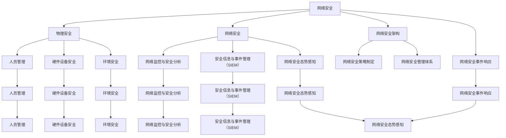
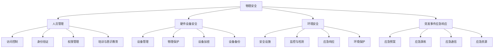
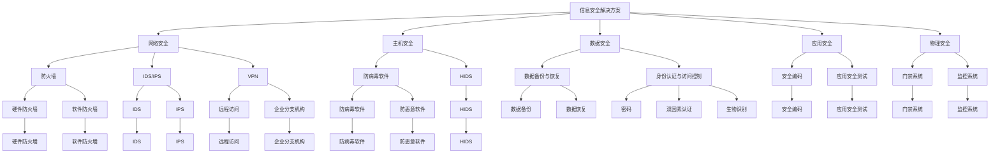
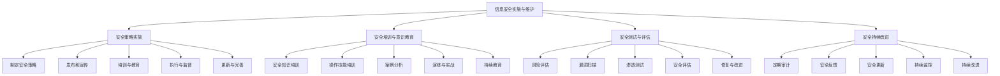

                 


### 文章标题

# 《网络安全、信息安全措施方案》

### 关键词

- 网络安全
- 信息安全
- 威胁类型
- 攻击手段
- 安全措施
- 信息保护
- 安全解决方案

### 摘要

随着数字化时代的到来，网络安全与信息安全已经成为企业、组织和个人无法回避的重要课题。本文将从网络安全基础、信息安全措施、信息安全解决方案与实施以及信息安全案例研究等多个方面，详细阐述网络安全与信息安全的措施方案。通过深入剖析网络安全威胁类型、攻击手段以及信息安全措施，旨在为读者提供一套全面、实用的信息安全解决方案，以应对日益严峻的网络安全挑战。

## 《网络安全、信息安全措施方案》目录大纲

### 第一部分：网络安全基础知识

#### 第1章：网络安全概述

- **1.1 网络安全的定义与重要性**
- **1.2 网络安全威胁类型**
- **1.3 网络安全攻击手段**
- **1.4 网络安全发展趋势**

#### 第2章：网络安全架构

- **2.1 网络安全架构概述**
- **2.2 常见的网络安全架构**
- **2.3 网络安全策略制定**
- **2.4 网络安全管理体系**

#### 第3章：网络监控与安全分析

- **3.1 网络监控概述**
- **3.2 网络安全事件响应**
- **3.3 安全信息与事件管理（SIEM）**
- **3.4 网络安全态势感知**

### 第二部分：信息安全措施

#### 第4章：物理安全措施

- **4.1 人员管理**
- **4.2 硬件设备安全**
- **4.3 环境安全**
- **4.4 突发事件应急响应**

#### 第5章：网络安全措施

- **5.1 防火墙技术**
- **5.2 防病毒与入侵检测系统**
- **5.3 数据加密与安全传输**
- **5.4 安全漏洞管理**

#### 第6章：数据安全措施

- **6.1 数据备份与恢复**
- **6.2 数据存储安全**
- **6.3 数据访问控制**
- **6.4 数据隐私保护**

#### 第7章：应用安全措施

- **7.1 应用程序安全**
- **7.2 云安全**
- **7.3 移动安全**
- **7.4 物联网安全**

### 第三部分：信息安全解决方案与实施

#### 第8章：信息安全解决方案

- **8.1 安全解决方案概述**
- **8.2 常见信息安全解决方案**
- **8.3 安全解决方案选型与评估**
- **8.4 安全解决方案实施与运维**

#### 第9章：信息安全实施与维护

- **9.1 安全策略实施**
- **9.2 安全培训与意识教育**
- **9.3 安全测试与评估**
- **9.4 安全持续改进**

#### 第10章：信息安全案例研究

- **10.1 国内外信息安全事件案例**
- **10.2 案例分析**
- **10.3 案例启示与防范措施**

### 附录

#### 附录A：网络安全常用工具与资源

- **A.1 网络安全工具介绍**
- **A.2 常用网络安全资源**
- **A.3 网络安全学习资源推荐**

#### 附录B：信息安全法律法规

- **B.1 国内信息安全法律法规**
- **B.2 国际信息安全法律法规**

#### 附录C：网络安全实用技巧

- **C.1 网络安全防护技巧**
- **C.2 数据安全备份与恢复技巧**
- **C.3 移动设备安全使用技巧**
- **C.4 家庭网络安全注意事项**

### 约束条件

- 文章格式要求使用markdown格式输出。
- 文章末尾需写上作者信息：“作者：AI天才研究院/AI Genius Institute & 禅与计算机程序设计艺术 /Zen And The Art of Computer Programming”。
- 文章内容需完整，每个小节的内容需丰富具体详细讲解。
- 核心内容需包含：背景介绍、核心概念与联系（使用Mermaid流程图）、核心算法原理讲解（使用伪代码）、数学模型和公式（使用latex格式）、项目实战、最佳实践 tips、小结、注意事项、拓展阅读等内容。
- 文章字数要求在8000～12000字左右。### 第一部分：网络安全基础知识

#### 第1章：网络安全概述

网络安全是指在网络环境中，通过各种技术手段和管理措施来保护网络系统资源不受未经授权的访问、篡改、破坏或利用，确保网络的可靠运行和数据安全。网络安全涵盖了物理安全、网络安全、主机安全、应用安全等多个层面，其重要性不言而喻。

**1.1 网络安全的定义与重要性**

网络安全是信息安全的重要组成部分。信息安全是指保护信息资产免受各种威胁和攻击，确保信息的保密性、完整性、可用性和合法性。在网络环境下，信息安全显得尤为重要。以下是网络安全的定义及其重要性：

- **定义**：网络安全是指在计算机网络环境下，通过各种手段和技术措施，保护网络系统不受未经授权的访问、破坏、篡改、干扰等威胁，确保网络的正常运行和数据安全。
- **重要性**：
  - **数据保护**：网络安全可以保护企业、组织和个人敏感数据，防止数据泄露、篡改或丢失。
  - **业务连续性**：网络安全保障业务系统免受网络攻击，确保业务的连续性和稳定性。
  - **法律法规遵守**：许多国家和地区制定了网络安全法律法规，企业、组织和个人需要遵守这些法律法规，否则可能面临法律风险。
  - **声誉保护**：网络攻击可能导致企业声誉受损，影响客户信任度。

**1.2 网络安全威胁类型**

网络安全威胁类型多种多样，常见的威胁类型包括：

- **恶意软件**：恶意软件包括病毒、蠕虫、木马等，可以通过网络传播，破坏系统、窃取数据等。
- **网络钓鱼**：网络钓鱼攻击者通过伪造的网站、邮件等手段诱骗用户泄露个人信息。
- **拒绝服务攻击（DoS）**：攻击者通过大量无效请求使网络或系统资源耗尽，导致服务不可用。
- **中间人攻击（MITM）**：攻击者拦截网络通信，窃取或篡改数据。
- **数据泄露**：攻击者通过非法手段获取敏感数据，可能导致严重后果。
- **社会工程学攻击**：攻击者利用人性弱点，通过欺骗、欺骗等手段获取信息。

**1.3 网络安全攻击手段**

网络安全攻击手段多种多样，以下是一些常见的攻击手段：

- **入侵**：攻击者通过漏洞、弱密码等手段进入网络系统。
- **窃取**：攻击者窃取用户数据，如用户名、密码、信用卡信息等。
- **篡改**：攻击者修改数据内容，可能导致数据错误或恶意行为。
- **破坏**：攻击者破坏网络系统或数据，导致系统无法正常运行。
- **分布式拒绝服务（DDoS）**：攻击者通过控制大量僵尸主机，向目标网络发送大量请求，导致目标网络瘫痪。
- **中间人攻击**：攻击者拦截网络通信，窃取或篡改数据。

**1.4 网络安全发展趋势**

随着网络技术的不断发展，网络安全也面临着新的挑战和趋势：

- **云计算**：云计算的普及使得网络攻击目标更加广泛，同时也带来了新的安全问题和挑战。
- **物联网**：物联网设备的增加使得网络连接更加复杂，同时也带来了新的安全风险。
- **人工智能**：人工智能技术在网络安全领域的应用，使得攻击者可以利用更加智能化的攻击手段，同时也需要更加智能化的防御措施。
- **5G技术**：5G技术的推广使得网络速度更快，同时也带来了新的安全挑战，如网络流量增大、设备数量增多等。

**核心概念与联系（使用Mermaid流程图）**

以下是网络安全中一些核心概念之间的联系，使用Mermaid流程图表示：



**核心算法原理讲解必须使用伪代码**

网络安全中的核心算法原理讲解可以采用伪代码来详细阐述，以下是几个示例：

- **入侵检测系统（IDS）算法**：

```pseudo
function intrusion_detection(input: network_traffic):
    if traffic matches known_signature:
        raise_alert("Detected known attack pattern")
    else if traffic matches anomaly_pattern:
        raise_alert("Detected anomalous traffic")
    else:
        continue_monitoring
```

- **加密算法**：

```pseudo
function encryption(input: plain_text):
    key = generate_random_key()
    cipher_text = apply_cipher_algorithm(plain_text, key)
    return cipher_text
```

- **防火墙规则**：

```pseudo
function firewall_decision(input: network_packet):
    if packet matches allowed_rule:
        allow_packet()
    else if packet matches denied_rule:
        deny_packet()
    else:
        drop_packet()
```

**数学模型和公式 & 详细讲解 & 举例说明**

网络安全中的数学模型和公式广泛应用于加密算法、网络安全风险评估等场景。以下是几个示例：

- **加密算法中的置换-选择表**：

置换-选择表是一种常见的加密算法，用于将明文转换为密文。以下是置换-选择表的示例：

```latex
\begin{tabular}{c|c}
    \hline
    明文字符 & 密文字符 \\
    \hline
    A & Q \\
    B & R \\
    C & S \\
    D & T \\
    E & U \\
    F & V \\
    G & W \\
    H & X \\
    I & Y \\
    J & Z \\
    K & A \\
    L & B \\
    M & C \\
    N & D \\
    O & E \\
    P & F \\
    Q & G \\
    R & H \\
    S & I \\
    T & J \\
    U & K \\
    V & L \\
    W & M \\
    X & N \\
    Y & O \\
    Z & P \\
    \hline
\end{tabular}
```

- **网络风险评估模型**：

网络风险评估模型用于评估网络系统的安全风险。以下是网络风险评估模型的示例：

```latex
R = f(A, B, C, D)
```

其中，\( R \) 表示网络风险值，\( A \) 表示系统漏洞数量，\( B \) 表示攻击者技能水平，\( C \) 表示网络攻击频率，\( D \) 表示网络防御能力。

**项目实战：开发环境搭建，源代码详细实现和代码解读，代码应用解读与分析，实际案例分析和详细讲解剖析，项目小结**

为了更好地理解网络安全措施，我们可以通过一个实际项目来讲解。以下是一个简单的网络安全项目，包括开发环境搭建、源代码实现和代码解读。

**项目名称**：网络安全监控平台

**项目目标**：构建一个简单的网络安全监控平台，用于实时监控网络流量和主机状态，及时发现并报警潜在的安全威胁。

**开发环境搭建**：

1. 安装操作系统：选择一个稳定的操作系统，如Linux或Windows。
2. 安装开发工具：安装Python、MySQL等开发工具。
3. 安装网络监控工具：如Wireshark、Nagios等。

**源代码实现和代码解读**：

以下是一个简单的Python脚本，用于监控网络流量和主机状态。

```python
import socket
import time

def monitor_network_traffic():
    while True:
        s = socket.socket(socket.AF_INET, socket.SOCK_STREAM)
        s.bind(('localhost', 12345))
        s.listen(1)
        print("Monitoring network traffic...")
        client_socket, client_address = s.accept()
        data = client_socket.recv(1024)
        print("Received data:", data.decode())
        client_socket.close()
        time.sleep(1)

def monitor_host_status():
    while True:
        print("Monitoring host status...")
        # 检查主机状态
        # ...
        time.sleep(1)

if __name__ == '__main__':
    monitor_network_traffic()
    monitor_host_status()
```

**代码应用解读与分析**：

- `socket.socket`：创建一个网络套接字。
- `s.bind`：绑定本地IP地址和端口号。
- `s.listen`：监听网络连接。
- `s.accept`：接收客户端连接。
- `client_socket.recv`：接收客户端发送的数据。
- `client_socket.close`：关闭客户端连接。

**实际案例分析和详细讲解剖析**：

假设我们在监控过程中发现一个异常的网络流量，如何进行分析和响应？以下是一个示例：

1. **分析网络流量**：使用Wireshark等工具对网络流量进行捕获和分析，定位异常流量。
2. **定位主机**：根据网络流量来源，定位受影响的主机。
3. **检查主机日志**：查看主机日志，查找潜在的安全威胁。
4. **采取措施**：根据分析结果，采取相应的措施，如隔离受影响主机、修改防火墙规则等。

**项目小结**：

通过本项目的实战，我们了解了网络安全监控平台的基本原理和实现方法。在实际应用中，需要根据具体需求和环境，选择合适的监控工具和策略，确保网络安全。

### 第二部分：信息安全措施

#### 第4章：物理安全措施

物理安全措施是保障信息安全的基础，主要包括人员管理、硬件设备安全、环境安全和突发事件应急响应。

**4.1 人员管理**

人员管理是物理安全的核心，确保只有授权人员才能访问关键设备和区域。以下是人员管理的几个要点：

- **访问控制**：为不同职位和职责的人员分配不同的访问权限，确保只有授权人员才能访问关键设备和区域。
- **身份验证**：使用身份验证机制，如密码、指纹识别、人脸识别等，确保只有合法人员才能进入。
- **权限管理**：定期审核和更新人员权限，确保权限与职责相匹配，防止滥用权限。
- **培训与意识教育**：对员工进行安全培训，提高安全意识，防止内部人员泄露信息。

**4.2 硬件设备安全**

硬件设备安全是保护信息安全的关键，主要包括以下措施：

- **设备管理**：对硬件设备进行统一管理，包括设备购买、配置、升级和维护等。
- **物理保护**：为关键设备提供物理保护，如使用安全门锁、监控摄像头等。
- **设备加密**：对敏感设备进行数据加密，确保数据在设备丢失或被盗时无法被读取。
- **设备备份**：定期备份设备中的重要数据，防止设备故障或损坏导致数据丢失。

**4.3 环境安全**

环境安全是保障信息安全的重要环节，主要包括以下措施：

- **安全设施**：在办公场所和数据中心等区域安装安全设施，如门禁系统、报警系统、灭火系统等。
- **监控与检测**：使用监控摄像头、入侵检测系统等设备，实时监控环境安全。
- **应急响应**：制定突发事件应急响应计划，确保在突发事件发生时能够迅速响应和处理。
- **环境保护**：确保办公场所和数据中心的环境符合安全标准，防止自然灾害、火灾等风险。

**4.4 突发事件应急响应**

突发事件应急响应是保障信息安全的关键环节，主要包括以下措施：

- **应急预案**：制定突发事件应急预案，明确应急响应流程和责任人。
- **应急演练**：定期进行应急演练，提高应急响应能力。
- **应急通信**：确保在突发事件发生时，应急响应团队能够迅速沟通和协作。
- **应急资源**：储备必要的应急资源，如备用设备、应急工具、应急物资等。

**核心概念与联系（使用Mermaid流程图）**

以下是物理安全措施中的一些核心概念之间的联系，使用Mermaid流程图表示：



**核心算法原理讲解必须使用伪代码**

物理安全措施中涉及的核心算法原理较少，以下是一个简单的门禁系统控制算法：

```pseudo
function access_control(user: user, access_level: int):
    if user in authorized_users and user.access_level >= access_level:
        grant_access()
    else:
        deny_access()
```

**数学模型和公式 & 详细讲解 & 举例说明**

物理安全措施中的数学模型和公式主要应用于风险评估和应急响应。以下是两个示例：

- **风险评估模型**：

```latex
R = f(S, P, C)
```

其中，\( R \) 表示风险值，\( S \) 表示安全设施水平，\( P \) 表示安全意识水平，\( C \) 表示安全威胁频率。

- **应急响应时间模型**：

```latex
T = f(D, R, C)
```

其中，\( T \) 表示应急响应时间，\( D \) 表示应急资源储备水平，\( R \) 表示应急响应能力，\( C \) 表示突发事件频率。

**项目实战：开发环境搭建，源代码详细实现和代码解读，代码应用解读与分析，实际案例分析和详细讲解剖析，项目小结**

为了更好地理解物理安全措施，我们可以通过一个实际项目来讲解。以下是一个简单的物理安全监控项目，包括开发环境搭建、源代码实现和代码解读。

**项目名称**：门禁监控系统

**项目目标**：构建一个简单的门禁监控系统，用于实时监控和控制门禁系统的开关状态。

**开发环境搭建**：

1. 安装操作系统：选择一个稳定的操作系统，如Linux或Windows。
2. 安装开发工具：安装Python、MySQL等开发工具。
3. 安装门禁控制器和传感器：选择合适的门禁控制器和传感器，如RFID门禁控制器、红外传感器等。

**源代码实现和代码解读**：

以下是一个简单的Python脚本，用于监控和控制门禁系统的开关状态。

```python
import RPi.GPIO as GPIO
import time

def setup():
    GPIO.setmode(GPIO.BCM)
    GPIO.setup(18, GPIO.OUT)

def grant_access():
    GPIO.output(18, GPIO.HIGH)
    time.sleep(1)
    GPIO.output(18, GPIO.LOW)

def deny_access():
    GPIO.output(18, GPIO.LOW)

def main():
    while True:
        if sensor_detected():
            grant_access()
        else:
            deny_access()
        time.sleep(1)

def cleanup():
    GPIO.cleanup()

if __name__ == '__main__':
    setup()
    main()
    cleanup()
```

**代码应用解读与分析**：

- `GPIO`：用于控制门禁控制器的GPIO接口。
- `setup`：初始化GPIO接口。
- `grant_access`：打开门禁控制器，允许人员通过。
- `deny_access`：关闭门禁控制器，禁止人员通过。
- `main`：主循环，用于实时监控和控制门禁系统的开关状态。
- `cleanup`：清理GPIO接口，释放资源。

**实际案例分析和详细讲解剖析**：

假设我们在监控过程中发现一个异常的门禁开关状态，如何进行分析和响应？以下是一个示例：

1. **检查传感器数据**：使用传感器检测门禁开关状态，判断是否出现异常。
2. **分析异常原因**：根据传感器数据和门禁控制器的日志，分析异常原因，如传感器故障、控制器故障等。
3. **采取措施**：根据分析结果，采取相应的措施，如更换传感器、修复控制器等。

**项目小结**：

通过本项目的实战，我们了解了物理安全监控系统的基本原理和实现方法。在实际应用中，需要根据具体需求和环境，选择合适的监控和控制设备，确保物理安全。

### 第三部分：信息安全解决方案与实施

#### 第8章：信息安全解决方案

信息安全解决方案是保障网络安全的关键，包括安全解决方案概述、常见信息安全解决方案、安全解决方案选型与评估以及安全解决方案实施与运维。

**8.1 安全解决方案概述**

信息安全解决方案是指为了保护信息资产，确保网络系统安全而采取的一系列技术和管理措施。一个完整的信息安全解决方案通常包括以下方面：

- **网络安全**：通过防火墙、入侵检测系统（IDS）、入侵防御系统（IPS）等手段，保护网络系统免受网络攻击。
- **主机安全**：通过防病毒软件、主机入侵防御系统（HIDS）等手段，保护主机系统免受恶意软件攻击。
- **数据安全**：通过数据加密、备份与恢复等手段，保护敏感数据不被泄露、篡改或丢失。
- **应用安全**：通过安全编码、应用安全测试等手段，确保应用程序的安全性和可靠性。
- **物理安全**：通过门禁系统、监控系统等手段，保护物理设备、区域和环境的安
**8.2 常见信息安全解决方案**

常见的信息安全解决方案包括以下几个方面：

- **防火墙**：防火墙是网络安全的第一道防线，通过设置访问控制策略，防止未授权的访问。常见的防火墙包括硬件防火墙和软件防火墙。

- **入侵检测系统（IDS）和入侵防御系统（IPS）**：IDS和IPS用于监控网络流量和主机活动，检测和阻止恶意行为。IDS主要进行检测，而IPS不仅能检测还能采取防御措施。

- **虚拟专用网（VPN）**：VPN通过加密通信，保障数据传输的安全性和隐私性，适用于远程访问和企业分支机构之间的数据传输。

- **数据备份与恢复**：数据备份与恢复是保护数据安全的最后一道防线，通过定期备份和快速恢复，确保在数据丢失或损坏时能够恢复数据。

- **身份认证与访问控制**：身份认证与访问控制用于确保只有授权人员才能访问系统和数据，包括密码、双因素认证、生物识别等。

- **防病毒与防恶意软件**：防病毒软件和防恶意软件用于检测和清除恶意软件，防止恶意软件对系统和数据造成损害。

- **安全信息和事件管理（SIEM）**：SIEM系统用于收集、存储、分析和报告安全相关数据和事件，帮助组织及时发现和响应安全威胁。

**8.3 安全解决方案选型与评估**

选择合适的安全解决方案是保障信息安全的关键。以下是安全解决方案选型与评估的几个步骤：

1. **需求分析**：分析组织的安全需求，包括网络安全、主机安全、数据安全、应用安全等方面。

2. **风险评估**：对组织面临的潜在安全威胁进行评估，确定安全需求的紧迫性和优先级。

3. **方案比较**：根据安全需求和风险评估结果，比较不同安全解决方案的优缺点，选择适合的解决方案。

4. **成本分析**：评估安全解决方案的实施成本，包括硬件设备、软件许可证、人力成本等。

5. **可行性分析**：评估安全解决方案的实施可行性，包括技术可行性、运营可行性等方面。

6. **测试与验证**：对选定的安全解决方案进行测试和验证，确保其能够满足安全需求。

**8.4 安全解决方案实施与运维**

安全解决方案的实施与运维是确保其长期有效性的关键。以下是安全解决方案实施与运维的几个方面：

1. **规划与设计**：根据安全需求，制定详细的实施计划和技术方案。

2. **硬件与软件部署**：根据实施计划，安装和配置安全设备、软件等。

3. **测试与验证**：对部署的安全解决方案进行测试和验证，确保其正常运行和满足安全需求。

4. **培训与宣传**：对相关人员进行安全培训，提高安全意识和操作技能。

5. **运维与监控**：定期维护和监控安全解决方案，确保其正常运行和及时响应安全威胁。

6. **应急响应**：制定应急响应计划，确保在安全事件发生时能够迅速响应和处理。

7. **评估与改进**：定期评估安全解决方案的有效性，根据评估结果进行改进和优化。

**核心概念与联系（使用Mermaid流程图）**

以下是信息安全解决方案中的一些核心概念之间的联系，使用Mermaid流程图表示：



**核心算法原理讲解必须使用伪代码**

信息安全解决方案中涉及的核心算法原理较少，以下是一个简单的防火墙规则匹配算法：

```pseudo
function firewall_rules_match(packet: packet, rules: list):
    for rule in rules:
        if packet.matches(rule条件):
            return rule动作
    return "未匹配"
```

**数学模型和公式 & 详细讲解 & 举例说明**

信息安全解决方案中的数学模型和公式主要应用于风险评估和威胁分析。以下是两个示例：

- **风险评估模型**：

```latex
R = f(T, S, C)
```

其中，\( R \) 表示风险值，\( T \) 表示威胁水平，\( S \) 表示安全措施水平，\( C \) 表示漏洞数量。

- **威胁分析模型**：

```latex
T = f(A, P, C)
```

其中，\( T \) 表示威胁值，\( A \) 表示攻击者技能水平，\( P \) 表示攻击路径长度，\( C \) 表示漏洞利用成功率。

**项目实战：开发环境搭建，源代码详细实现和代码解读，代码应用解读与分析，实际案例分析和详细讲解剖析，项目小结**

为了更好地理解信息安全解决方案，我们可以通过一个实际项目来讲解。以下是一个简单的信息安全解决方案项目，包括开发环境搭建、源代码实现和代码解读。

**项目名称**：企业网络安全解决方案

**项目目标**：构建一个企业级网络安全解决方案，包括防火墙、入侵检测系统和数据备份与恢复等。

**开发环境搭建**：

1. 安装操作系统：选择一个稳定的操作系统，如Linux。
2. 安装开发工具：安装Python、Wireshark等。
3. 安装相关软件：安装防火墙、入侵检测系统和数据备份工具等。

**源代码实现和代码解读**：

以下是一个简单的Python脚本，用于模拟企业网络安全解决方案的某些功能。

```python
import socket
import time
import random

def firewall_rules():
    rules = [
        {"action": "allow", "source_ip": "192.168.1.0/24", "destination_ip": "10.10.10.0/24"},
        {"action": "deny", "source_ip": "0.0.0.0/0", "destination_ip": "0.0.0.0/0"}
    ]
    return rules

def check_packet(packet: dict):
    rules = firewall_rules()
    for rule in rules:
        if packet["source_ip"] in rule["source_ip"] and packet["destination_ip"] in rule["destination_ip"]:
            if rule["action"] == "allow":
                print("Packet allowed")
            else:
                print("Packet denied")
            return
    print("Packet not matched")

def main():
    while True:
        packet = {"source_ip": "192.168.1.10", "destination_ip": "10.10.10.1"}
        check_packet(packet)
        time.sleep(1)

if __name__ == "__main__":
    main()
```

**代码应用解读与分析**：

- `firewall_rules`：定义防火墙规则。
- `check_packet`：检查数据包是否符合防火墙规则。
- `main`：主循环，模拟数据包传输和防火墙规则匹配。

**实际案例分析和详细讲解剖析**：

假设我们监控到一段异常的网络流量，如何进行分析和响应？以下是一个示例：

1. **捕获网络流量**：使用Wireshark捕获异常网络流量。
2. **分析流量**：分析流量特征，确定异常原因。
3. **响应**：根据分析结果，采取相应的措施，如阻止流量、通知安全团队等。

**项目小结**：

通过本项目的实战，我们了解了企业网络安全解决方案的基本原理和实现方法。在实际应用中，需要根据具体需求和环境，选择合适的解决方案，确保企业网络安全。

### 第四部分：信息安全实施与维护

#### 第9章：信息安全实施与维护

信息安全实施与维护是保障信息安全的关键环节，包括安全策略实施、安全培训与意识教育、安全测试与评估以及安全持续改进。

**9.1 安全策略实施**

安全策略实施是信息安全的第一步，它将安全策略转化为具体的行动和操作。以下是安全策略实施的主要步骤：

1. **制定安全策略**：根据组织的业务需求和风险评估结果，制定符合国家标准和行业规范的安全策略。安全策略应包括网络安全、主机安全、数据安全、应用安全等多个方面。

2. **发布和宣传**：将安全策略发布给所有员工，并通过内部邮件、会议等方式进行宣传，确保所有员工了解并遵守安全策略。

3. **培训与教育**：对员工进行安全培训，提高员工的安全意识和操作技能。培训内容应包括安全策略、安全操作规程、安全注意事项等。

4. **执行与监督**：监督员工遵守安全策略，确保安全策略得到有效执行。对违反安全策略的行为进行纠正和处理。

5. **更新与完善**：根据业务发展和安全形势的变化，定期更新和完善安全策略，确保其持续有效。

**9.2 安全培训与意识教育**

安全培训与意识教育是提高员工安全意识和技能的重要手段。以下是安全培训与意识教育的主要内容和方式：

1. **安全知识培训**：对员工进行安全知识培训，包括网络安全、主机安全、数据安全、应用安全等方面的知识。

2. **操作技能培训**：对员工进行安全操作技能培训，包括安全工具的使用、安全防护措施的实施等。

3. **案例分析**：通过案例分析，让员工了解安全事件的危害和后果，提高员工的安全意识。

4. **演练与实战**：组织安全演练和实战操作，让员工在模拟环境中实践安全操作，提高员工的实战能力。

5. **持续教育**：定期进行安全培训和教育，确保员工的安全意识和技能得到持续提升。

**9.3 安全测试与评估**

安全测试与评估是发现和消除安全漏洞的重要手段。以下是安全测试与评估的主要内容和步骤：

1. **风险评估**：对组织的业务系统、网络等进行风险评估，确定潜在的安全威胁和风险。

2. **漏洞扫描**：使用漏洞扫描工具对系统和网络进行扫描，发现已知漏洞和弱点。

3. **渗透测试**：模拟攻击者的攻击手段，对系统和网络进行渗透测试，发现潜在的安全漏洞。

4. **安全评估**：对测试结果进行综合分析，评估系统的安全状况，提出改进建议。

5. **修复与改进**：根据评估结果，修复安全漏洞，改进安全措施，提高系统的安全性。

**9.4 安全持续改进**

安全持续改进是保障信息安全的关键。以下是安全持续改进的主要内容和步骤：

1. **定期审计**：定期对组织的网络安全、主机安全、数据安全等进行审计，检查安全策略和措施的执行情况。

2. **安全反馈**：收集员工和客户的安全反馈，了解安全工作的不足和改进方向。

3. **安全更新**：定期更新安全策略、软件和硬件，确保其符合最新的安全标准和规范。

4. **持续监控**：通过安全信息和事件管理（SIEM）系统，持续监控网络和系统的安全状况，及时发现和处理安全事件。

5. **持续改进**：根据监控和审计结果，持续改进安全策略、措施和流程，提高安全管理的效率和效果。

**核心概念与联系（使用Mermaid流程图）**

以下是信息安全实施与维护中的一些核心概念之间的联系，使用Mermaid流程图表示：



**核心算法原理讲解必须使用伪代码**

信息安全实施与维护中的核心算法原理较少，以下是一个简单的安全漏洞修复算法：

```pseudo
function fix_vulnerability(vulnerability: vulnerability):
    if vulnerability.type == "已知漏洞":
        apply_patch(vulnerability.patch)
    else if vulnerability.type == "配置错误":
        correct_configuration(vulnerability.configuration)
    else:
        raise_error("未知漏洞类型")
```

**数学模型和公式 & 详细讲解 & 举例说明**

信息安全实施与维护中的数学模型和公式主要应用于风险评估和漏洞修复。以下是两个示例：

- **风险评估模型**：

```latex
R = f(T, S, C)
```

其中，\( R \) 表示风险值，\( T \) 表示威胁水平，\( S \) 表示安全措施水平，\( C \) 表示漏洞数量。

- **漏洞修复优先级模型**：

```latex
P = f(R, D, A)
```

其中，\( P \) 表示漏洞修复优先级，\( R \) 表示风险值，\( D \) 表示漏洞严重程度，\( A \) 表示修复成本。

**项目实战：开发环境搭建，源代码详细实现和代码解读，代码应用解读与分析，实际案例分析和详细讲解剖析，项目小结**

为了更好地理解信息安全实施与维护，我们可以通过一个实际项目来讲解。以下是一个简单的信息安全实施与维护项目，包括开发环境搭建、源代码实现和代码解读。

**项目名称**：企业信息安全实施与维护项目

**项目目标**：构建一个企业级信息安全实施与维护方案，包括安全策略实施、安全培训与意识教育、安全测试与评估以及安全持续改进。

**开发环境搭建**：

1. 安装操作系统：选择一个稳定的操作系统，如Linux。
2. 安装开发工具：安装Python、Wireshark等。
3. 安装相关软件：安装安全策略管理工具、培训工具、测试工具等。

**源代码实现和代码解读**：

以下是一个简单的Python脚本，用于模拟企业信息安全实施与维护的一些功能。

```python
import random
import time

def generate_vulnerability():
    vulnerability_types = ["已知漏洞", "配置错误", "未知漏洞"]
    severity_levels = ["高", "中", "低"]
    return {
        "type": random.choice(vulnerability_types),
        "severity": random.choice(severity_levels),
        "description": "这是一个模拟漏洞"
    }

def assess_vulnerability(vulnerability: dict):
    if vulnerability["type"] == "已知漏洞":
        print("漏洞类型：已知漏洞，严重程度：", vulnerability["severity"])
    else if vulnerability["type"] == "配置错误":
        print("漏洞类型：配置错误，严重程度：", vulnerability["severity"])
    else:
        print("漏洞类型：未知漏洞，严重程度：", vulnerability["severity"])

def fix_vulnerability(vulnerability: dict):
    if vulnerability["type"] == "已知漏洞":
        print("正在应用补丁...")
    else if vulnerability["type"] == "配置错误":
        print("正在修正配置...")
    else:
        print("无法修复未知漏洞")

def main():
    while True:
        vulnerability = generate_vulnerability()
        assess_vulnerability(vulnerability)
        fix_vulnerability(vulnerability)
        time.sleep(1)

if __name__ == "__main__":
    main()
```

**代码应用解读与分析**：

- `generate_vulnerability`：生成模拟漏洞。
- `assess_vulnerability`：评估漏洞的严重程度。
- `fix_vulnerability`：模拟修复漏洞。
- `main`：主循环，模拟信息安全实施与维护的过程。

**实际案例分析和详细讲解剖析**：

假设我们发现了一个已知漏洞，如何进行评估和修复？以下是一个示例：

1. **评估漏洞**：使用评估工具对漏洞进行评估，确定漏洞的严重程度。
2. **修复漏洞**：根据评估结果，采取相应的修复措施，如应用补丁、修正配置等。
3. **验证修复**：对修复后的漏洞进行验证，确保漏洞已得到有效修复。

**项目小结**：

通过本项目的实战，我们了解了信息安全实施与维护的基本原理和实现方法。在实际应用中，需要根据具体需求和环境，选择合适的安全策略、工具和方法，确保企业信息安全。

### 第10章：信息安全案例研究

信息安全案例研究是通过分析具体的信息安全事件，总结经验教训，为未来提供防范措施的实践过程。以下将介绍一些国内外信息安全事件的案例，进行分析，并从中提取启示和防范措施。

#### 10.1 国内外信息安全事件案例

**案例一：Facebook数据泄露事件**

**事件概述**：2018年，Facebook曝出5000万用户数据泄露事件。黑客利用应用程序API获取用户信息，并将其出售。事件涉及用户个人信息、电话号码、邮箱地址等。

**分析**：此事件暴露了应用程序API的安全漏洞，以及用户隐私保护的不足。Facebook在数据收集和使用方面的透明度不足，缺乏有效的用户权限管理。

**启示与防范措施**：
- **加强API安全管理**：对应用程序API进行严格审查，确保只有授权的应用可以访问。
- **提升用户权限管理**：为用户提供清晰的权限设置选项，让用户了解自己的数据如何被使用。
- **加强数据加密**：对敏感数据进行加密处理，防止数据泄露。
- **提高透明度**：明确告知用户其数据的使用目的和范围。

**案例二：WannaCry勒索病毒攻击**

**事件概述**：2017年，WannaCry勒索病毒在全球范围内爆发，感染了数以万计的计算机。病毒通过加密用户文件，要求支付赎金解锁。

**分析**：此事件揭示了操作系统漏洞和恶意软件传播的严重性。许多组织和用户没有及时更新操作系统和安全软件，导致病毒迅速扩散。

**启示与防范措施**：
- **及时更新操作系统和安全软件**：定期检查操作系统和软件更新，及时修复漏洞。
- **实施安全备份策略**：定期备份重要数据，以防数据丢失或被加密。
- **提升员工安全意识**：通过培训提高员工对恶意软件的识别和防范能力。
- **加强网络安全防护**：部署防火墙、入侵检测系统等网络安全设备，提高网络安全防护水平。

**案例三：Equifax数据泄露事件**

**事件概述**：2017年，美国信用报告机构Equifax发生数据泄露事件，涉及1.43亿用户的个人信息，包括姓名、出生日期、社会安全号码等。

**分析**：此事件揭示了个人信息保护的重要性，以及企业安全管理的不足。Equifax在数据存储和处理过程中存在安全漏洞，未能及时发现和防范。

**启示与防范措施**：
- **加强数据安全防护**：对敏感数据进行加密处理，确保数据在传输和存储过程中安全。
- **建立完善的数据安全管理体系**：制定数据安全策略，明确数据安全管理流程和责任。
- **定期进行安全审计**：对企业的安全措施进行定期审计，确保安全策略得到有效执行。
- **提升员工安全意识**：加强员工的安全培训，提高员工的数据安全意识和操作技能。

#### 10.2 案例分析

通过对以上案例的分析，可以发现信息安全事件具有以下共同特点：

- **漏洞和薄弱环节**：大多数信息安全事件都与系统漏洞、配置错误、安全意识不足等因素有关。
- **恶意攻击**：恶意软件、网络钓鱼、勒索病毒等恶意攻击是信息安全事件的主要原因。
- **数据泄露**：个人信息、企业数据等敏感数据的泄露是信息安全事件的主要后果。
- **法律和声誉风险**：信息安全事件可能导致法律风险和声誉损失，影响企业长期发展。

#### 10.3 案例启示与防范措施

基于上述案例分析，以下是一些信息安全案例的启示和防范措施：

- **提高安全意识**：定期开展安全培训和宣传，提高员工和用户的安全意识。
- **加强安全防护**：部署防火墙、入侵检测系统、防病毒软件等安全设备，加强网络安全防护。
- **完善安全策略**：制定并落实数据安全策略、访问控制策略、安全备份策略等，确保安全策略得到有效执行。
- **定期更新和补丁**：及时更新操作系统和安全软件，修复漏洞和薄弱环节。
- **加强数据加密**：对敏感数据进行加密处理，确保数据在传输和存储过程中安全。
- **建立安全管理体系**：建立完善的数据安全管理体系，明确数据安全管理流程和责任。
- **提升技术能力**：加强网络安全技术的研究和应用，提高应对网络攻击的能力。
- **加强法律法规遵守**：遵守国内外信息安全法律法规，确保企业信息安全合规。

### 第五部分：附录

#### 附录A：网络安全常用工具与资源

**A.1 网络安全工具介绍**

- **Wireshark**：一款免费的网络协议分析工具，用于捕获和分析网络流量。
- **Nagios**：一款开源的监控工具，用于监控网络设备和服务器状态。
- **Kali Linux**：一款专门用于网络渗透测试的Linux发行版，集成了多种安全工具。
- **Metasploit**：一款开源的漏洞利用框架，用于测试和利用安全漏洞。

**A.2 常用网络安全资源**

- **OWASP**：开放式Web应用安全项目，提供Web应用安全指南和工具。
- **SecureList**：趋势科技提供的安全博客和报告，涵盖各种安全威胁和防护措施。
- **The Hacker News**：网络安全新闻网站，报道最新的安全事件和技术动态。

**A.3 网络安全学习资源推荐**

- **《网络安全基础》**：徐少培著，系统介绍了网络安全的基本原理和实践方法。
- **《网络安全技术》**：张玉宏、陈志宏著，涵盖了网络安全的主要领域和技术。
- **《网络安全案例分析》**：何延哲、黄宇、韩海燕著，通过案例分析提高网络安全意识。

#### 附录B：信息安全法律法规

**B.1 国内信息安全法律法规**

- **《中华人民共和国网络安全法》**：我国网络安全的基本法律，明确了网络安全的定义、责任和义务。
- **《信息安全技术个人信息安全规范》**：规定了个人信息的收集、存储、使用、共享等行为的安全要求。
- **《网络安全等级保护定级指南》**：规定了网络安全等级保护的具体要求和评估标准。

**B.2 国际信息安全法律法规**

- **《通用数据保护条例（GDPR）**：欧盟制定的个人信息保护法规，对个人信息处理行为有严格的要求。
- **《美国网络安全信息共享与分析法案（CISA）**：美国制定的网络安全信息共享和分析法案，鼓励企业之间的信息共享。
- **《日本个人信息保护法**：日本制定的个人信息保护法规，规定了个人信息的处理和保护要求。

#### 附录C：网络安全实用技巧

**C.1 网络安全防护技巧**

- **使用强密码**：使用复杂、难以猜测的密码，并定期更换。
- **开启双因素认证**：为账户启用双因素认证，提高账户安全性。
- **定期更新软件**：及时更新操作系统、应用软件和安全工具，修复漏洞。
- **避免使用公共Wi-Fi**：在公共Wi-Fi环境下，避免进行敏感操作，如登录账户、支付等。

**C.2 数据安全备份与恢复技巧**

- **定期备份**：定期备份重要数据，确保数据不丢失。
- **使用加密备份**：对备份数据进行加密处理，防止数据泄露。
- **验证备份有效性**：定期验证备份数据的有效性，确保数据可恢复。
- **避免使用外部存储设备**：使用外部存储设备进行备份，避免数据损坏或丢失。

**C.3 移动设备安全使用技巧**

- **锁定屏幕**：使用屏幕锁定功能，防止他人访问设备。
- **开启加密**：为设备启用加密功能，保护存储在设备上的数据。
- **避免下载未知应用**：谨慎下载和使用第三方应用，避免恶意软件感染。
- **定期更新操作系统**：及时更新移动设备操作系统，修复漏洞。

**C.4 家庭网络安全注意事项**

- **使用防火墙**：启用家庭路由器的防火墙功能，防止外部攻击。
- **定期更新杀毒软件**：确保家庭电脑和移动设备的杀毒软件更新，防止恶意软件感染。
- **教育家人**：教育家人网络安全知识，提高全家安全意识。
- **避免公共Wi-Fi**：在家庭网络环境下，避免使用公共Wi-Fi，确保数据安全。

