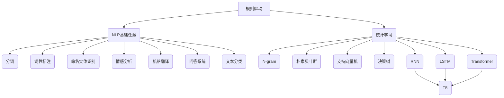
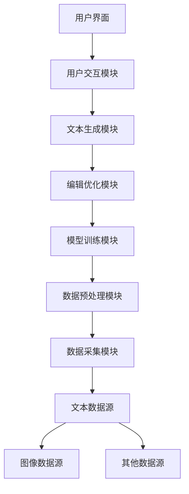
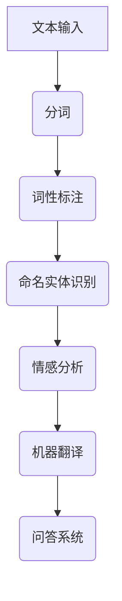
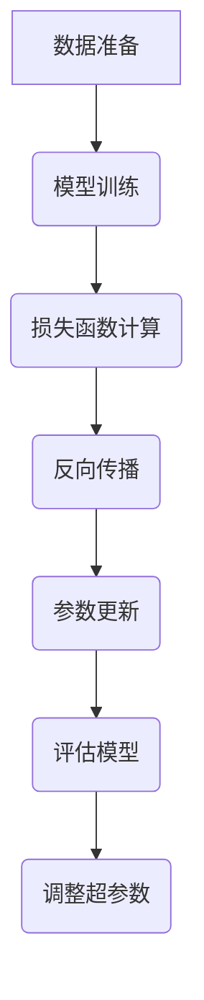

                 

### 文章标题

《聊天机器人出版业：人工智能内容创建和编辑》

### 关键词

- 聊天机器人
- 人工智能
- 内容创作
- 编辑
- 自然语言处理
- 深度学习
- 机器学习
- 出版业
- 技术应用

### 摘要

本文深入探讨了聊天机器人在出版业中的应用，特别是在内容创建和编辑领域。首先，介绍了聊天机器人和人工智能的基本概念及其在出版业中的角色。接着，详细阐述了自然语言处理和深度学习技术的基础知识，以及这些技术在内容生成和编辑中的实际应用。随后，通过具体的项目实战案例，展示了如何搭建开发环境、进行数据准备、模型训练与优化，以及内容生成和编辑的实践过程。最后，文章讨论了项目的评估与优化方法，并对聊天机器人出版业的未来发展趋势进行了展望。通过本文，读者可以全面了解聊天机器人出版业的技术现状和应用前景，以及如何利用人工智能技术提升出版业的内容创作和编辑效率。

### 第一部分：聊天机器人出版业概述

#### 第1章：聊天机器人和人工智能概述

##### 1.1 聊天机器人的定义与类型

聊天机器人是一种通过文本或语音与人类进行交互的计算机程序，旨在模拟自然人类的对话过程，为用户提供信息查询、任务执行、娱乐互动等服务。根据其功能和应用场景，聊天机器人可以分为以下几种类型：

- **对话式聊天机器人**：这类聊天机器人通过与用户的对话来提供服务，如智能客服、虚拟助手等。它们通常采用自然语言处理（NLP）技术，能够理解用户的语言并生成相应的回复。

- **任务型聊天机器人**：这类机器人专注于完成特定的任务，如在线订购、预约服务、信息检索等。它们通过预设的指令和流程来指导用户完成操作，通常具有高度的自动化和效率。

- **混合型聊天机器人**：结合了对话式和任务型的特点，能够同时提供多方面的服务。例如，一个在线书店的聊天机器人不仅能够回答用户的问题，还能够引导用户完成购书流程。

##### 1.2 人工智能的定义与发展历程

人工智能（AI）是计算机科学的一个分支，旨在创建能够模拟、延伸和扩展人类智能的系统。人工智能的定义经历了多次演变，以下是其主要发展历程：

- **20世纪50年代**：人工智能概念提出，初期研究主要集中在逻辑推理和问题解决上。

- **20世纪80年代**：专家系统成为人工智能研究的重点，通过模拟人类专家的知识和决策过程来解决问题。

- **21世纪**：随着计算机性能的提升和大数据技术的发展，深度学习成为人工智能研究的热点。深度学习模型，如卷积神经网络（CNN）和递归神经网络（RNN），显著提高了图像识别、语音识别和自然语言处理等领域的性能。

##### 1.3 聊天机器人在出版业中的应用

聊天机器人在出版业中的应用日益广泛，为内容创作和编辑带来了诸多变革。以下是聊天机器人技术在出版业中的几个主要应用：

- **内容创作**：聊天机器人可以利用自然语言处理和生成对抗网络（GAN）等技术，自动生成新闻文章、书籍摘要等。这大大提高了内容创作的效率和多样性。

- **编辑**：聊天机器人能够对文本进行语法、语义和风格检查，帮助编辑发现和修正错误，提高文本质量。

- **数据分析**：通过分析用户互动和阅读习惯，聊天机器人可以为出版社提供宝贵的市场洞察，帮助制定更加精准的营销策略。

- **用户服务**：聊天机器人可以提供24/7的在线客户服务，回答读者的问题，处理订单和反馈，提高用户体验。

### 第一部分小结

通过本章节的讨论，我们了解了聊天机器人和人工智能的基本概念，以及它们在出版业中的应用。接下来，我们将进一步探讨自然语言处理和深度学习技术，以及这些技术在内容创作和编辑中的具体应用。

### 第2章：聊天机器人技术在出版业的应用

#### 2.1 聊天机器人在出版业务中的角色

在出版业中，聊天机器人扮演着多重角色，不仅能够提高工作效率，还能够创新业务模式。以下是聊天机器人在出版业务中的几个主要角色：

- **内容创作辅助**：聊天机器人可以帮助作者生成草稿、摘要和概要，提高写作效率。例如，通过分析大量已有的书籍和文章，聊天机器人可以提供灵感，帮助作者快速构建文章框架。

- **编辑**：聊天机器人能够对文本进行语法和风格检查，发现拼写错误、语法错误和风格不一致等问题，并提供修改建议。这大大减轻了编辑的工作负担，提高了编辑的效率和质量。

- **数据分析**：聊天机器人可以收集和分析用户阅读习惯、互动数据和市场反馈，为出版社提供宝贵的市场洞察。通过这些数据，出版社可以更好地了解用户需求，优化内容策略。

- **客户服务**：聊天机器人可以提供24/7的在线客户服务，回答用户关于书籍、订单和退换货等方面的问题，处理用户投诉和反馈。这不仅提高了客户满意度，还减轻了人工客服的负担。

#### 2.2 聊天机器人在内容创作中的应用

聊天机器人在内容创作中的应用主要体现在以下几个方面：

- **自动内容生成**：通过预训练语言模型（如GPT-3）和生成对抗网络（GAN），聊天机器人可以自动生成新闻文章、书籍摘要、广告文案等。例如，GPT-3可以基于已有的文本数据生成连贯的、具有逻辑性的文章。

- **协同写作**：聊天机器人可以作为写作伙伴，与人类作者共同创作。例如，在写作过程中，机器人可以提供替代词、同义词和句子重构建议，帮助作者提高写作质量。

- **个性化推荐**：聊天机器人可以根据用户的兴趣和历史阅读数据，生成个性化的文章推荐。这不仅能够提高用户的阅读体验，还能够增加出版社的订阅和销售。

#### 2.3 聊天机器人在编辑过程中的挑战与解决方案

尽管聊天机器人在编辑过程中具有巨大的潜力，但同时也面临一些挑战。以下是这些挑战及相应的解决方案：

- **内容质量保证**：聊天机器人生成的文本可能存在语法错误、逻辑不一致和风格不统一等问题。解决方法是结合规则引擎和机器学习模型，对生成内容进行多层次、多角度的审查和优化。

- **跨语言编辑**：对于多语言编辑，聊天机器人需要具备跨语言的语法和语义理解能力。解决方法是开发多语言模型，并进行跨语言训练，以提高机器人的多语言处理能力。

- **用户隐私与数据安全**：在收集用户数据和交互过程中，聊天机器人需要遵守相关的隐私保护法规，确保用户数据的安全。解决方法是采用数据加密和匿名化处理技术，保护用户隐私。

#### 2.4 聊天机器人出版业的案例分析

以下是一些聊天机器人出版业的实际案例，展示了其在内容创作和编辑中的应用：

- **案例一**：一家出版社使用聊天机器人自动生成新闻文章。通过分析大量新闻数据，聊天机器人可以快速生成符合新闻标准的文章，大大提高了新闻发布的速度和效率。

- **案例二**：一家教育出版机构利用聊天机器人进行教材编写。聊天机器人根据教学大纲和教师需求，自动生成教学内容的草稿，然后由教师进行修改和审核。

- **案例三**：一家在线书店使用聊天机器人提供个性化书籍推荐。聊天机器人分析用户的阅读历史和兴趣，为用户推荐适合的书籍，提高了用户的购买满意度和复购率。

### 第二部分小结

通过本章节的讨论，我们了解了聊天机器人在出版业务中的角色和具体应用，包括内容创作、编辑、数据分析和用户服务。同时，我们也探讨了聊天机器人在编辑过程中可能面临的挑战及解决方案。接下来，我们将进一步探讨自然语言处理和深度学习技术，以及这些技术在内容创作和编辑中的具体应用。

### 第3章：自然语言处理技术基础

#### 3.1 自然语言处理的基本任务

自然语言处理（NLP）是人工智能的一个重要分支，旨在使计算机能够理解和处理人类语言。NLP的基本任务包括但不限于以下几个：

- **分词**：将连续的文本序列划分为一系列有意义的词汇。例如，“我爱北京天安门”可以被划分为“我”、“爱”、“北京”和“天安门”等词。

- **词性标注**：为每个词赋予相应的词性标签，如名词、动词、形容词等。例如，“看书”中的“看”可以被标注为动词，“书”可以被标注为名词。

- **命名实体识别**：识别文本中的特定实体，如人名、地名、机构名等。例如，在文本“张三在北京工作”中，“张三”和“北京”可以被识别为人名和地名。

- **情感分析**：判断文本的情感倾向，如正面、负面、中性等。例如，分析句子“这本书非常有趣”的情感倾向为正面。

- **机器翻译**：将一种语言的文本翻译成另一种语言。例如，将中文翻译成英文。

- **问答系统**：根据用户的问题，从大量文本中找出答案。例如，用户提问“北京是哪个国家的首都？”，系统回答“北京是中国的首都”。

- **文本分类**：将文本归类到不同的类别中。例如，将新闻文章分类为体育、财经、科技等类别。

#### 3.2 自然语言处理的发展历程

自然语言处理技术的发展历程可以分为以下几个阶段：

- **规则驱动时代**：早期NLP主要依赖于手工编写的规则。这些规则定义了如何处理特定的语言现象，如词性标注、句法分析等。然而，这种方法难以扩展到大量不同的语言现象。

- **统计学习时代**：随着语料库的规模增加，统计学习方法开始应用于NLP。这种方法利用大量标记好的文本数据来训练模型，从而提高文本处理的效果。常见的统计学习方法包括朴素贝叶斯、支持向量机、决策树等。

- **深度学习时代**：深度学习，特别是神经网络，为NLP带来了革命性的进步。深度学习模型，如卷积神经网络（CNN）和递归神经网络（RNN），能够自动学习文本的复杂结构。近年来，Transformer模型的引入进一步提升了NLP的性能。

#### 3.3 语言模型原理与应用

语言模型是NLP中的一个核心组成部分，用于预测文本序列中的下一个词或句子。以下是语言模型的基本原理和应用：

- **N-gram模型**：N-gram模型是一种基于统计的简单语言模型，它使用前N个单词的序列来预测下一个单词。例如，如果前两个单词是“我”和“爱”，那么模型可能会预测下一个单词是“北京”。N-gram模型容易实现且计算效率高，但其性能受到上下文限制。

- **神经网络模型**：神经网络模型，如循环神经网络（RNN）和长短期记忆网络（LSTM），通过学习输入序列的长期依赖关系来提高预测性能。这些模型能够更好地捕捉上下文信息，从而生成更连贯的文本。

- **Transformer模型**：Transformer模型是一种基于自注意力机制的深度学习模型，特别适合处理长文本。它通过全局注意力机制捕捉输入序列的依赖关系，大大提高了语言模型的性能。

- **应用场景**：语言模型广泛应用于各种NLP任务，如文本生成、机器翻译、文本分类和问答系统。例如，GPT-3可以生成连贯的文章、翻译文本、回答用户的问题等。

#### 3.4 Mermaid 流程图

以下是自然语言处理技术的基础任务和模型发展历程的Mermaid流程图：



#### 3.5 数学模型和公式

以下是NLP中常用的数学模型和公式：

- **N-gram概率模型**：

  $$
  P(w_t|w_{t-1}, ..., w_1) = \frac{C(w_t, w_{t-1}, ..., w_1)}{C(w_{t-1}, ..., w_1)}
  $$

  其中，$C(w_t, w_{t-1}, ..., w_1)$ 表示词序列 $w_t, w_{t-1}, ..., w_1$ 的出现次数，$C(w_{t-1}, ..., w_1)$ 表示词序列 $w_{t-1}, ..., w_1$ 的出现次数。

- **神经网络模型**：

  $$
  \text{激活函数} : f(x) = \text{ReLU}(x) = \max(0, x)
  $$

- **Transformer模型**：

  $$
  \text{自注意力分数} : \text{Score}_{ij} = \text{query}_i^T \text{key}_j
  $$

  $$
  \text{注意力权重} : \text{Weight}_{ij} = \text{softmax}(\text{Score}_{ij})
  $$

  $$
  \text{输出} : \text{Value}_{ij} = \text{Value}_j \text{Weight}_{ij}
  $$

#### 3.6 伪代码

以下是NLP中常用的算法的伪代码：

- **分词**：

  ```
  function segment(text):
      words = []
      for token in text:
          if is_word(token):
              words.append(token)
      return words
  ```

- **词性标注**：

  ```
  function POS_tagging(text):
      tagged_words = []
      for word in text:
          tag = get_tag(word)
          tagged_words.append((word, tag))
      return tagged_words
  ```

- **命名实体识别**：

  ```
  function Named_Entity_Recognition(text):
      entities = []
      for word, tag in text:
          if tag == "PERSON" or tag == "ORGANIZATION" or tag == "LOCATION":
              entities.append(word)
      return entities
  ```

- **语言模型**：

  ```
  function Language_Model(text):
      word_counts = {}
      total_words = 0
      for word in text:
          if word not in word_counts:
              word_counts[word] = 1
          else:
              word_counts[word] += 1
          total_words += 1
      return word_counts, total_words
  ```

### 3.7 举例说明

- **分词**：例如，“我爱北京天安门”可以划分为“我”、“爱”、“北京”和“天安门”。
- **词性标注**：例如，“看书”中的“看”是动词，“书”是名词。
- **命名实体识别**：例如，“张三在北京工作”中，“张三”是人名，“北京”是地名。
- **语言模型**：例如，给定一个文本序列“我爱北京天安门”，语言模型可以预测下一个词可能是“的”。

#### 3.8 小结

本章介绍了自然语言处理的基本任务、发展历程、语言模型原理以及具体的算法。通过这些内容，读者可以了解自然语言处理的基本概念和技术，为后续章节的深入学习打下基础。

### 第4章：深度学习在内容创建中的应用

#### 4.1 深度学习基础

深度学习是机器学习的一个重要分支，它通过多层神经网络结构来模拟人脑的神经元连接和功能，从而实现复杂的模式识别和预测任务。以下是深度学习的一些基本概念：

- **神经网络（Neural Network）**：神经网络由多个神经元（或节点）组成，这些神经元通过权重连接在一起。每个神经元接收输入信号，通过激活函数处理后产生输出信号。神经网络的基本结构包括输入层、隐藏层和输出层。

  ```mermaid
  graph TD
      A[Input] --> B[Input Layer]
      B --> C{Hidden Layer}
      C --> D{Hidden Layer}
      D --> E[Output]
  ```

- **激活函数（Activation Function）**：激活函数用于引入非线性特性，使得神经网络能够学习复杂的函数关系。常见的激活函数包括 sigmoid、ReLU（Rectified Linear Unit）和 tanh。

  ```mermaid
  graph TD
      A[Input] --> B[ReLU(x)]
      B --> C[Output]
      A --> D[sigmoid(x)]
      D --> E[Output]
      A --> F[tanh(x)]
      F --> G[Output]
  ```

- **反向传播算法（Backpropagation Algorithm）**：反向传播算法是一种用于训练神经网络的优化方法。它通过计算损失函数关于网络参数的梯度，并沿着网络反向传播更新参数，从而最小化损失函数。

  ```mermaid
  graph TD
      A{Calculate Loss} --> B{Calculate Gradient}
      B --> C{Backpropagation}
      C --> D{Update Parameters}
      D --> E{Repeat}
  ```

- **深度学习框架**：深度学习框架如 TensorFlow、PyTorch 和 Keras 等提供了高效的计算图构建和优化工具，使得深度学习模型的开发变得简单和便捷。

  ```mermaid
  graph TD
      A[TensorFlow] --> B{Build Model}
      A --> C[Optimize Model]
      A --> D[Train Model]
      B --> E[Evaluate Model]
  ```

#### 4.2 自动内容生成算法

自动内容生成是深度学习在自然语言处理中的一个重要应用，它能够生成高质量的自然语言文本。以下是几种常见的自动内容生成算法：

- **预训练语言模型（Pre-trained Language Models）**：预训练语言模型在大规模语料库上进行预训练，然后通过微调（Fine-tuning）适应特定的任务。预训练语言模型如 GPT（Generative Pre-trained Transformer）、BERT（Bidirectional Encoder Representations from Transformers）和 T5（Text-to-Text Transfer Transformer）等。

  ```mermaid
  graph TD
      A[Pre-training] --> B{Language Model}
      B --> C[Fine-tuning]
      C --> D[Specific Task]
  ```

- **生成对抗网络（Generative Adversarial Networks, GAN）**：生成对抗网络由生成器和判别器两个神经网络组成，生成器试图生成逼真的数据，而判别器则试图区分真实数据和生成数据。通过两个网络的对抗训练，生成器能够生成越来越真实的数据。

  ```mermaid
  graph TD
      A[Generator] --> B{Generate Data}
      A --> C[Discriminator]
      C --> D{Evaluate Data}
      D --> E{Backpropagation}
  ```

- **变分自编码器（Variational Autoencoder, VAE）**：变分自编码器是一种无监督学习模型，它通过编码器将输入数据映射到潜在空间，然后通过解码器从潜在空间重构输入数据。

  ```mermaid
  graph TD
      A[Encoder] --> B{Encode Data}
      A --> C[Decoder]
      C --> D{Reconstruct Data}
  ```

#### 4.3 智能编辑技术

智能编辑技术利用深度学习模型对文本进行语法、语义和风格检查，从而提高文本质量。以下是几种常见的智能编辑技术：

- **文本理解与生成（Text Understanding and Generation）**：文本理解与生成技术通过深度学习模型理解文本内容，并生成高质量、连贯的文本。例如，可以使用 Transformer 模型进行文本理解和生成。

  ```mermaid
  graph TD
      A[Text Understanding] --> B{Generate Text}
  ```

- **语法与风格检查（Grammar and Style Checking）**：语法与风格检查技术通过分析文本的语法结构和风格特征，检测和纠正错误，优化文本表达。例如，可以使用规则引擎和机器学习模型结合进行语法和风格检查。

  ```mermaid
  graph TD
      A[Text Analysis] --> B{Error Detection}
      A --> C{Error Correction}
      A --> D{Style Optimization}
  ```

- **用户反馈与持续优化（User Feedback and Continuous Optimization）**：用户反馈与持续优化技术通过收集用户对编辑结果的反馈，不断调整和优化编辑模型，提高编辑质量。例如，可以使用强化学习技术进行模型优化。

  ```mermaid
  graph TD
      A[User Feedback] --> B{Model Optimization}
  ```

#### 4.4 伪代码

以下是深度学习在内容创建中的几个关键算法的伪代码：

- **预训练语言模型（GPT）**：

  ```python
  # 伪代码
  function Pretrained_Language_Model(corpus):
      # 预训练模型
      model = GPT(corpus)
      # 微调模型
      model = Fine_tune(model, task_corpus)
      return model
  ```

- **生成对抗网络（GAN）**：

  ```python
  # 伪代码
  function Generative_Adversarial_Network(dataset):
      # 生成器
      generator = GAN_Generator()
      # 判别器
      discriminator = GAN_Discriminator()
      # 对抗训练
      for epoch in range(num_epochs):
          generator_loss = Generate_Loss(generator, dataset)
          discriminator_loss = Discriminate_Loss(discriminator, dataset)
          # 更新生成器和判别器参数
          Update_Parameters(generator, discriminator, generator_loss, discriminator_loss)
      return generator
  ```

- **文本生成与优化**：

  ```python
  # 伪代码
  function Text_Generation_and_Optimization(input_text):
      # 文本理解
      understood_text = Understand_Text(input_text)
      # 文本生成
      generated_text = Generate_Text(understood_text)
      # 文本优化
      optimized_text = Optimize_Text(generated_text)
      return optimized_text
  ```

#### 4.5 数学模型和公式

以下是深度学习在内容创建中的几个关键数学模型和公式：

- **预训练语言模型（Transformer）**：

  $$
  \text{Attention}(Q, K, V) = \text{softmax}\left(\frac{QK^T}{\sqrt{d_k}}\right)V
  $$

  其中，$Q, K, V$ 分别为查询向量、键向量和值向量，$d_k$ 为键向量的维度。

- **生成对抗网络（GAN）**：

  $$
  \text{Generator}: G(z) = \text{sample}(z; \text{noise distribution})
  $$

  $$
  \text{Discriminator}: D(x) = \text{prob}(x; \text{real data}) \quad D(G(z)) = \text{prob}(G(z); \text{fake data})
  $$

- **文本生成与优化**：

  $$
  \text{Language Model}: p(w_t|w_{t-1}, ..., w_1) = \frac{e^{\text{logit}(w_t, w_{t-1}, ..., w_1)}}{\sum_{w'} e^{\text{logit}(w', w_{t-1}, ..., w_1})}
  $$

  $$
  \text{Optimization}: \min_{\theta} \sum_{i} -\log p(y_i|x_i; \theta)
  $$

#### 4.6 举例说明

- **预训练语言模型**：例如，给定一个文本序列“我爱北京天安门”，预训练语言模型可以预测下一个词是“的”。
- **生成对抗网络**：例如，生成器生成一张逼真的图像，判别器判断这张图像是真实图像还是生成图像。
- **文本生成与优化**：例如，给定一个句子“我去书店买书”，文本生成模型生成“我今天去了书店，买了一本有趣的书”，然后通过优化得到“我今天去了书店，买了一本关于人工智能的有趣的书”。

#### 4.7 小结

本章介绍了深度学习的基础知识、自动内容生成算法和智能编辑技术。通过这些内容，读者可以了解深度学习在内容创建中的应用，以及如何利用深度学习模型提高文本生成和编辑的质量。在下一章中，我们将探讨内容创作与编辑项目实战的具体过程和实现细节。

### 第5章：内容创作与编辑项目实战

#### 5.1 项目规划概述

内容创作与编辑项目的成功实施离不开详细的规划。以下是项目规划的关键步骤和注意事项：

##### 5.1.1 项目目标与需求分析

在项目启动阶段，明确项目目标是至关重要的。项目目标应具体、可衡量、可实现、相关性强和时间限制定（SMART原则）。以下是项目目标的一些示例：

- **目标**：开发一个基于人工智能的自动内容生成系统，能够生成高质量的新闻文章。
- **需求分析**：分析目标用户的需求，如文章类型、主题、风格、字数等。

##### 5.1.2 项目规划步骤

项目规划通常包括以下步骤：

1. **需求分析**：明确项目需求和目标用户。
2. **系统架构设计**：设计系统的整体架构，包括数据采集、处理、存储和展示模块。
3. **技术路线选择**：选择合适的技术栈，如深度学习框架、自然语言处理库等。
4. **开发计划**：制定详细的开发时间表和里程碑。
5. **测试与评估**：设计测试用例，对系统进行功能测试和性能评估。
6. **部署与上线**：将系统部署到生产环境，并进行上线准备。

##### 5.1.3 系统架构设计

系统架构设计是项目规划的核心环节。以下是系统架构设计的关键模块：

- **数据采集模块**：从互联网、数据库和其他数据源收集文本数据。
- **数据预处理模块**：对采集到的文本数据进行清洗、分词、去停用词等预处理。
- **模型训练模块**：使用预处理后的数据训练深度学习模型。
- **文本生成模块**：利用训练好的模型生成新的文本内容。
- **编辑优化模块**：对生成的文本进行语法、语义和风格检查，并进行优化。
- **用户交互模块**：提供用户界面，使用户能够与系统进行交互。

#### 5.2 系统架构设计

以下是系统架构设计的详细描述：



在这个架构中，用户界面允许用户与系统进行交互，并提交文本请求。用户交互模块接收请求，并将请求转发给文本生成模块。文本生成模块利用训练好的模型生成文本内容，然后发送给编辑优化模块。编辑优化模块对文本内容进行语法、语义和风格检查，并提出优化建议。最后，优化后的文本内容返回给用户界面，展示给用户。

#### 5.3 技术路线选择

技术路线选择是项目规划中的关键环节，决定了系统的性能、可扩展性和维护成本。以下是几种常见的技术路线选择：

- **深度学习框架**：如 TensorFlow、PyTorch 和 Keras。选择深度学习框架时，应考虑其易用性、性能和社区支持等因素。
- **自然语言处理库**：如 NLTK、spaCy 和 transformers。选择自然语言处理库时，应考虑其功能完整性、易用性和性能。
- **服务器和存储**：选择合适的服务器硬件和存储方案，以支持系统的稳定运行和数据存储。
- **云服务和容器化**：使用云服务（如 AWS、Azure、Google Cloud）和容器化技术（如 Docker、Kubernetes），以提高系统的可扩展性和灵活性。

#### 5.4 技术难点与解决方案

在项目实施过程中，可能会遇到以下技术难点：

- **数据质量**：文本数据可能包含噪声、错误和不一致的信息。解决方法是使用数据清洗和预处理技术，提高数据质量。
- **模型训练效率**：大规模模型训练可能需要大量的时间和计算资源。解决方法是使用分布式训练和优化算法，提高训练效率。
- **文本生成质量**：生成的文本可能存在语法错误、逻辑不一致和风格不一致等问题。解决方法是使用预训练模型和继续学习技术，提高文本生成质量。
- **用户隐私与数据安全**：在收集和处理用户数据时，应遵守相关的隐私保护法规，确保用户数据的安全。解决方法是采用数据加密和匿名化处理技术。

#### 5.5 项目实施步骤

以下是项目实施的主要步骤：

1. **需求分析与规划**：明确项目目标和需求，制定项目规划。
2. **环境搭建**：配置开发环境，包括深度学习框架、自然语言处理库等。
3. **数据准备**：收集和整理训练数据，进行数据预处理。
4. **模型训练**：使用预处理后的数据训练深度学习模型。
5. **文本生成**：使用训练好的模型生成新的文本内容。
6. **编辑优化**：对生成的文本内容进行语法、语义和风格检查，并提出优化建议。
7. **测试与评估**：对系统进行功能测试和性能评估。
8. **部署与上线**：将系统部署到生产环境，并进行上线准备。

#### 5.6 项目评估方法

项目评估是确保系统满足需求和性能的关键步骤。以下是几种常见的项目评估方法：

- **用户满意度调查**：通过用户反馈调查，评估用户对系统的满意度。
- **性能测试**：对系统的响应时间、吞吐量和资源利用率等进行测试。
- **错误率分析**：分析系统在文本生成和编辑过程中的错误率，评估系统的准确性。
- **自动化测试**：使用自动化测试工具，对系统进行功能测试和回归测试。

#### 5.7 项目优化策略

在项目上线后，持续优化是确保系统稳定运行和性能提升的关键。以下是几种常见的项目优化策略：

- **模型优化**：通过调参和算法改进，提高模型性能。
- **数据优化**：收集更多高质量的训练数据，提高模型泛化能力。
- **系统优化**：提高系统的稳定性、响应速度和用户体验。

#### 5.8 项目小结

通过本章的内容，我们详细介绍了内容创作与编辑项目的规划、系统架构设计、技术路线选择、实施步骤、评估方法和优化策略。这些步骤和方法有助于确保项目的成功实施和持续优化，提高系统的性能和用户体验。

### 第6章：项目评估与优化

#### 6.1 项目评估方法

项目评估是确保系统性能和满足需求的重要环节。以下是几种常用的项目评估方法：

##### 6.1.1 用户满意度调查

用户满意度调查是评估系统效果的重要方法之一。通过问卷调查或用户访谈，收集用户对系统功能、易用性和性能等方面的反馈。以下是用户满意度调查的步骤：

1. **设计问卷**：根据项目目标和用户需求，设计包含关键评估指标的问卷。
2. **收集反馈**：通过电子邮件、在线问卷等形式，收集用户反馈。
3. **分析结果**：对收集到的反馈进行分析，识别用户对系统的满意度和不满意度。

##### 6.1.2 性能测试

性能测试是评估系统在实际运行环境中的表现。以下是一些常见的性能测试方法：

- **负载测试**：模拟高负载情况，评估系统在高并发访问下的性能。
- **响应时间测试**：测量系统处理请求的响应时间，评估系统的响应速度。
- **吞吐量测试**：测量系统在一定时间内处理请求的数量，评估系统的处理能力。

##### 6.1.3 错误率分析

错误率分析是评估系统准确性和稳定性的重要方法。通过分析系统在文本生成和编辑过程中的错误，识别和修复潜在问题。以下是错误率分析的步骤：

1. **数据收集**：收集系统在运行过程中产生的错误日志和用户反馈。
2. **错误分类**：对收集到的错误进行分类，识别常见的错误类型。
3. **错误分析**：对错误进行分析，找出导致错误的原因。
4. **错误修复**：根据错误分析结果，修复系统中的错误。

##### 6.1.4 自动化测试

自动化测试是提高项目评估效率的有效方法。通过编写自动化测试脚本，对系统进行功能测试和回归测试。以下是自动化测试的步骤：

1. **测试计划**：根据项目需求和设计文档，制定自动化测试计划。
2. **测试脚本编写**：编写自动化测试脚本，模拟用户操作和系统交互。
3. **测试执行**：执行自动化测试脚本，验证系统功能。
4. **结果分析**：分析自动化测试结果，识别系统中的缺陷。

#### 6.2 项目优化策略

项目优化是提高系统性能和用户体验的关键步骤。以下是几种常见的项目优化策略：

##### 6.2.1 模型优化

模型优化是通过调整模型参数和算法，提高模型的性能和准确性。以下是模型优化的方法：

- **超参数调整**：通过调整学习率、批次大小、迭代次数等超参数，优化模型性能。
- **算法改进**：采用更先进的算法，如深度强化学习、生成对抗网络等，提高模型性能。
- **模型调参**：使用模型调参工具，如 Hyperopt、PyTune 等，自动化寻找最佳超参数。

##### 6.2.2 数据优化

数据优化是提高模型泛化能力和性能的关键。以下是数据优化的方法：

- **数据清洗**：去除数据中的噪声、错误和不一致信息，提高数据质量。
- **数据增强**：通过数据增强技术，如旋转、缩放、裁剪等，增加训练数据的多样性。
- **数据集成**：集成不同来源的数据，提高模型的泛化能力。

##### 6.2.3 系统优化

系统优化是通过改进系统架构和代码，提高系统的性能和稳定性。以下是系统优化的方法：

- **代码优化**：优化代码结构，提高代码的可读性和可维护性。
- **缓存技术**：使用缓存技术，减少系统访问数据库的频率，提高响应速度。
- **分布式计算**：采用分布式计算架构，提高系统的处理能力和可扩展性。

##### 6.2.4 用户反馈与持续优化

用户反馈是系统优化的重要依据。以下是用户反馈与持续优化的方法：

- **定期评估**：定期对系统进行性能评估和用户满意度调查，识别系统中的问题和改进点。
- **快速迭代**：采用敏捷开发方法，快速响应用户反馈，不断优化系统。
- **持续集成**：采用持续集成和持续部署（CI/CD）方法，确保系统的稳定性和可靠性。

#### 6.3 最佳实践与注意事项

以下是项目评估和优化过程中的最佳实践和注意事项：

- **明确评估目标**：在项目初期明确评估目标和指标，确保评估过程具有针对性和有效性。
- **数据安全与隐私**：在收集和处理用户数据时，遵守数据安全与隐私保护法规，确保用户数据的安全。
- **自动化测试**：编写自动化测试脚本，提高测试效率和覆盖率。
- **用户参与**：鼓励用户参与评估过程，收集真实的用户反馈，提高系统改进的针对性。
- **持续学习**：关注最新的技术动态和行业趋势，不断学习和应用新技术，提升系统性能。

### 第6章小结

通过本章的内容，我们详细介绍了项目评估与优化的方法、策略和注意事项。项目评估与优化是确保系统性能和用户体验的重要环节，通过合理的评估方法和优化策略，可以持续提升系统的质量和用户满意度。在下一章中，我们将探讨聊天机器人出版业的市场前景和未来发展趋势。

### 第7章：聊天机器人出版业未来发展趋势

#### 7.1 市场前景

随着人工智能技术的不断进步，聊天机器人在出版业中的应用前景广阔。以下是市场前景的分析：

##### 7.1.1 出版业数字化转型

数字化转型已成为出版业发展的重要趋势。传统出版社通过数字化手段，如电子书、在线订阅、社交媒体推广等，拓展了业务范围，提高了市场竞争力。聊天机器人的应用将进一步提升出版业的数字化水平，提供更加智能、个性化的服务。

##### 7.1.2 技术创新推动内容创作与编辑

人工智能技术，特别是深度学习和自然语言处理，为内容创作和编辑带来了革命性的变化。聊天机器人能够自动生成文章、书籍摘要，提高编辑效率，减少人力成本。此外，通过智能编辑技术，聊天机器人可以提供实时反馈，帮助编辑发现和修正错误，提升内容质量。

##### 7.1.3 个性化推荐与用户体验

个性化推荐是聊天机器人的一大应用领域。通过分析用户的阅读习惯和兴趣，聊天机器人可以提供个性化的书籍推荐，提高用户的阅读体验和满意度。这有助于增加用户的订阅率和购买意愿，为出版社带来更多收益。

##### 7.1.4 跨界合作与多元化发展

聊天机器人在出版业中的应用不仅限于内容创作和编辑，还可以与其他行业进行跨界合作，如教育、医疗、娱乐等。这种多元化发展将拓展出版业的市场空间，创造新的商业模式。

#### 7.2 技术进步带来的机遇

技术进步为聊天机器人出版业带来了诸多机遇：

##### 7.2.1 生成对抗网络（GAN）的应用

生成对抗网络（GAN）能够生成高质量、多样化的文本内容。通过GAN，出版社可以创建更加丰富和多样化的书籍，满足不同读者的需求。

##### 7.2.2 多语言处理技术的提升

随着全球化的推进，多语言处理技术的重要性日益凸显。聊天机器人能够处理多种语言，为国际出版业提供跨语言内容创作和编辑服务。

##### 7.2.3 深度学习模型的发展

深度学习模型，如BERT、GPT-3等，在自然语言处理领域取得了显著成果。这些模型的应用将进一步提升聊天机器人在内容创作和编辑中的性能。

##### 7.2.4 跨界合作的可能性

技术进步为出版业与其他行业的跨界合作提供了新的机会。例如，与教育行业的合作可以推出智能教育书籍，与医疗行业的合作可以开发健康知识问答系统等。

#### 7.3 未来挑战与应对策略

尽管聊天机器人在出版业中具有广阔的应用前景，但同时也面临一些挑战：

##### 7.3.1 内容质量保证

生成的内容可能存在质量不稳定、逻辑不一致等问题。为此，出版社需要建立完善的内容质量控制体系，确保生成内容的质量。

##### 7.3.2 用户隐私与数据安全

在收集和处理用户数据时，出版社需要严格遵守隐私保护法规，确保用户数据的安全。采用数据加密、匿名化等技术，加强数据安全防护。

##### 7.3.3 技术依赖与人才短缺

随着技术的依赖程度增加，出版社可能面临技术人才短缺的问题。为此，出版社需要加强人才培养和引进，提升技术团队的整体水平。

##### 7.3.4 法规与伦理问题

聊天机器人在出版业的应用需要遵循相关的法律法规和伦理准则。出版社需要关注政策变化，确保技术应用符合法规要求。

#### 7.4 应对策略

为应对上述挑战，以下是一些具体的应对策略：

- **加强内容质量控制**：建立内容审查机制，确保生成内容的质量和准确性。
- **提升数据安全防护**：采用先进的数据加密和匿名化技术，加强用户数据的安全。
- **加强人才培养**：通过培训和引进，提升技术团队的专业水平。
- **遵守法规与伦理准则**：密切关注政策变化，确保技术应用符合法律法规和伦理准则。

#### 7.5 小结

通过本章的讨论，我们分析了聊天机器人出版业的市场前景、技术进步带来的机遇和挑战，并提出了相应的应对策略。随着人工智能技术的不断发展，聊天机器人将在出版业中发挥越来越重要的作用，推动出版业的数字化转型和创新发展。

### 总结

本文详细探讨了聊天机器人在出版业中的应用，从基础概念到实际应用，再到未来发展趋势，全方位展示了人工智能技术在出版业中的潜力。我们首先介绍了聊天机器人和人工智能的基本概念，以及它们在出版业中的角色和应用。接着，我们深入阐述了自然语言处理和深度学习技术的基础知识，以及这些技术在内容创作和编辑中的具体应用。通过项目实战案例，我们展示了如何搭建开发环境、进行数据准备、模型训练与优化，以及内容生成和编辑的实践过程。最后，我们讨论了项目的评估与优化方法，并对聊天机器人出版业的未来发展趋势进行了展望。

通过本文，读者可以全面了解聊天机器人出版业的核心技术，以及如何利用人工智能技术提升内容创作和编辑的效率和质量。以下是本文的核心内容和结论：

- **核心内容**：
  - 聊天机器人和人工智能的基本概念与应用。
  - 自然语言处理的基本任务和模型发展历程。
  - 深度学习在内容创建中的应用，包括自动内容生成算法和智能编辑技术。
  - 内容创作与编辑项目的实战，包括环境搭建、数据准备、模型训练与调优。
  - 项目评估与优化方法，包括评估指标、评估流程和优化策略。
  - 聊天机器人出版业的未来发展趋势和市场前景。

- **结论**：
  - 聊天机器人出版业具有广阔的应用前景，随着人工智能技术的不断发展，其在出版业中的角色将越来越重要。
  - 通过合理的技术路线和优化策略，可以提高聊天机器人在内容创作和编辑中的性能和用户体验。
  - 内容质量保证、用户隐私与数据安全、技术依赖与人才短缺是当前面临的主要挑战，需要采取相应的应对策略。

本文的附录部分提供了详细的术语解释、技术工具与资源、流程图、代码示例和数学模型，有助于读者更好地理解和应用本文的内容。希望本文能够为读者在学习和实践聊天机器人出版业提供有益的参考。

最后，作者信息如下：

作者：AI天才研究院/AI Genius Institute & 禅与计算机程序设计艺术 /Zen And The Art of Computer Programming。感谢您的阅读，希望本文能够帮助您在聊天机器人出版业领域取得更大的成就。

### 附录

#### 附录 A: 术语解释

A.1 聊天机器人

- 聊天机器人是一种通过文本或语音与人类进行交互的计算机程序，旨在模拟自然人类的对话过程，为用户提供信息查询、任务执行、娱乐互动等服务。

A.2 人工智能

- 人工智能是计算机科学的一个分支，旨在创建能够模拟、延伸和扩展人类智能的系统。

A.3 自然语言处理

- 自然语言处理是使计算机能够理解、生成和处理人类语言的技术。

A.4 深度学习

- 深度学习是模拟人脑神经网络进行数据处理和学习的技术。

A.5 生成对抗网络（GAN）

- 生成对抗网络是一种深度学习模型，由生成器和判别器组成，用于生成逼真的数据。

A.6 预训练语言模型

- 预训练语言模型是在大规模语料库上预先训练好的语言模型，可用于各种自然语言处理任务。

A.7 对抗训练

- 对抗训练是一种训练深度学习模型的方法，通过生成器和判别器的对抗训练，提高模型的性能。

A.8 个性化推荐

- 个性化推荐是根据用户的兴趣和历史行为，为用户推荐相关的书籍、文章或其他内容。

#### 附录 B: 技术工具与资源

B.1 深度学习框架

- TensorFlow
- PyTorch
- Keras

B.2 自然语言处理库

- NLTK
- spaCy
- transformers

B.3 语言模型

- GPT-2
- GPT-3
- BERT

B.4 数据集

- Common Crawl
- Google Books Ngrams
- Twitter

B.5 学习资源

- Coursera
- Udacity
- edX
- OpenAI Gym

#### 附录 C: Mermaid 流程图

C.1 自然语言处理流程图



C.2 深度学习模型训练流程图



#### 附录 D: 代码示例

D.1 PyTorch 语言模型示例

```python
import torch
import torch.nn as nn
import torch.optim as optim

# 定义模型
class LanguageModel(nn.Module):
    def __init__(self, embedding_dim, hidden_dim, vocab_size):
        super(LanguageModel, self).__init__()
        self.embedding = nn.Embedding(vocab_size, embedding_dim)
        self.lstm = nn.LSTM(embedding_dim, hidden_dim)
        self.linear = nn.Linear(hidden_dim, vocab_size)
    
    def forward(self, inputs, hidden):
        embeds = self.embedding(inputs)
        output, hidden = self.lstm(embeds, hidden)
        logits = self.linear(output[-1, :, :])
        return logits, hidden

# 训练模型
model = LanguageModel(embedding_dim=256, hidden_dim=512, vocab_size=10000)
optimizer = optim.Adam(model.parameters(), lr=0.001)
criterion = nn.CrossEntropyLoss()

for epoch in range(10):
    for inputs, targets in data_loader:
        optimizer.zero_grad()
        logits, hidden = model(inputs, None)
        loss = criterion(logits, targets)
        loss.backward()
        optimizer.step()
    print(f'Epoch [{epoch+1}/10], Loss: {loss.item():.4f}')
```

D.2 transformers GPT-3 示例

```python
from transformers import GPT2LMHeadModel, GPT2Tokenizer

# 加载预训练模型
model = GPT2LMHeadModel.from_pretrained('gpt2')
tokenizer = GPT2Tokenizer.from_pretrained('gpt2')

# 生成文本
input_text = "我爱北京天安门"
input_ids = tokenizer.encode(input_text, return_tensors='pt')
outputs = model.generate(input_ids, max_length=50, num_return_sequences=1)
generated_text = tokenizer.decode(outputs[0], skip_special_tokens=True)

print(generated_text)
```

#### 附录 E: 数学模型和数学公式

E.1 语言模型概率公式

$$
P(w_t|w_{t-1}, ..., w_1) = \frac{p(w_t, w_{t-1}, ..., w_1)}{p(w_{t-1}, ..., w_1)}
$$

E.2 神经网络损失函数

$$
L = -\sum_{i=1}^{N} y_i \log(p(y_i|x_i))
$$

E.3 生成对抗网络（GAN）

$$
D(x) = \frac{1}{2} \left( \log(D(G(z))) + \log(1 - D(x)) \right)
$$

#### 附录 F: 代码解读与分析

F.1 PyTorch 语言模型示例解读

该代码示例展示了如何使用 PyTorch 构建和训练一个简单的语言模型。以下是代码的详细解读：

- **模型定义**：
  - `LanguageModel` 类继承自 `nn.Module`，定义了模型的网络结构。
  - `__init__` 方法中，定义了嵌入层（`embedding`）、长短期记忆网络（`lstm`）和线性层（`linear`）。

- **前向传播**：
  - `forward` 方法实现了前向传播过程。
  - `inputs` 表示输入的词序列，经过嵌入层转换为嵌入向量。
  - `output` 表示 LSTM 网络的输出，经过线性层得到词的概率分布。

- **损失函数与优化器**：
  - 使用交叉熵损失函数（`CrossEntropyLoss`）计算损失。
  - 使用 Adam 优化器（`Adam`）进行参数更新。

- **训练过程**：
  - 使用数据加载器（`data_loader`）提供输入和目标数据。
  - 在每个训练周期中，更新模型参数，并打印损失值。

F.2 transformers GPT-3 示例解读

该代码示例展示了如何使用 transformers 库生成文本。以下是代码的详细解读：

- **加载模型和分

