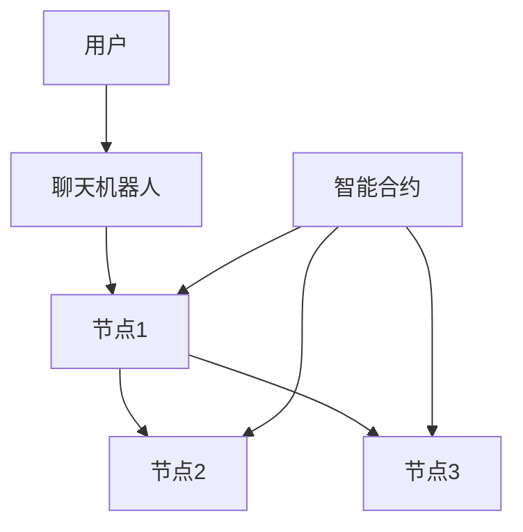
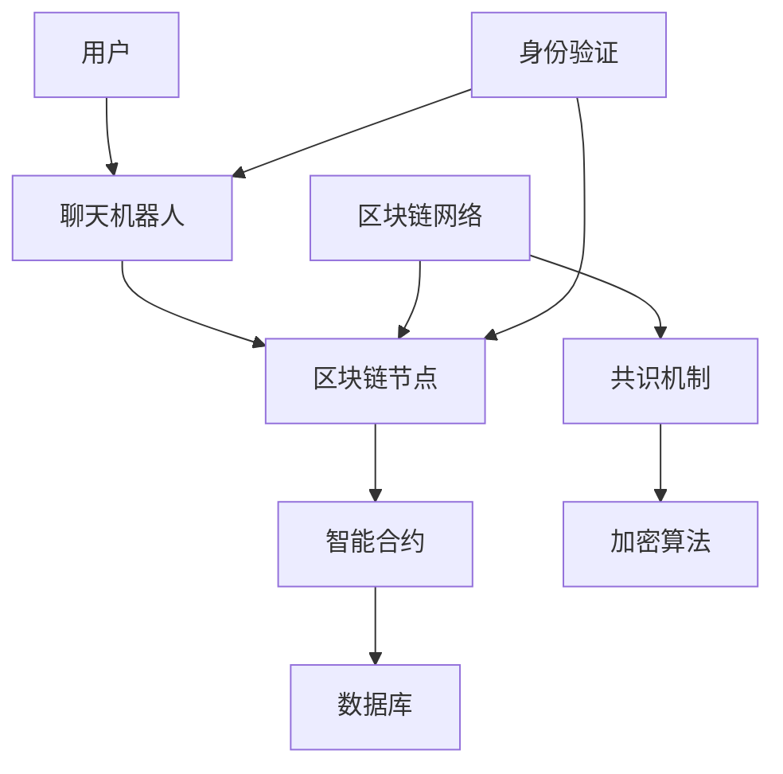

                 

# 文章标题

《聊天机器人区块链：安全和去中心化应用》

## 关键词

- 聊天机器人
- 区块链
- 安全性
- 去中心化
- 智能合约
- 分布式身份
- DeFi

## 摘要

本文旨在探讨聊天机器人与区块链技术的结合，以及它们在安全和去中心化应用方面的潜力。首先，文章介绍了聊天机器人的定义、分类、发展历程和核心技术，随后详细阐述了区块链的基本概念、分类、核心技术以及与聊天机器人的结合方式。重点讨论了聊天机器人区块链在安全性和去中心化应用方面的优势，以及如何实现匿名通信、隐私保护、智能合约安全等。接着，文章通过去中心化金融（DeFi）、去中心化身份管理和内容创作平台等实际案例，展示了聊天机器人区块链的应用场景。最后，文章总结了聊天机器人区块链的开发实战，分析了其发展趋势和面临的挑战，并展望了其未来研究方向。

### 《聊天机器人区块链：安全和去中心化应用》目录大纲

## 第一部分：聊天机器人与区块链基础

### 第1章：聊天机器人概述

#### 1.1 聊天机器人的定义与分类

- 文本聊天机器人
- 语音聊天机器人
- 聊天机器人应用场景

#### 1.2 聊天机器人的发展历程

- 早期的聊天机器人
- 现代聊天机器人的技术演进

#### 1.3 聊天机器人的核心技术

- 自然语言处理
- 机器学习与深度学习
- 语音识别与合成

## 第2章：区块链技术基础

### 2.1 区块链的定义与原理

- 区块链的基本概念
- 区块链的工作原理

### 2.2 区块链的分类

- 公链
- 联盟链
- 私链

### 2.3 区块链的核心技术

- 共识算法
- 智能合约
- 钱包与数字身份

## 第3章：聊天机器人与区块链的结合

### 3.1 聊天机器人区块链的架构设计

- 聊天机器人区块链网络架构
- 聊天机器人区块链功能模块

### 3.2 聊天机器人区块链的优势

- 安全性
- 去中心化
- 高效性

### 3.3 聊天机器人区块链的应用场景

- 金融服务
- 物流管理
- 社交平台

## 第二部分：安全性与去中心化应用

### 第4章：安全性与隐私保护

#### 4.1 区块链在聊天机器人中的安全性应用

- 数据加密
- 身份验证
- 智能合约的安全性

#### 4.2 隐私保护机制

- 匿名通信
- 加密存储
- 聊天数据的隐私保护策略

#### 4.3 恶意攻击与防范

- 拒绝服务攻击
- 矿工恶意攻击
- 智能合约漏洞防范

## 第5章：去中心化应用案例

### 5.1 去中心化金融（DeFi）

- DeFi的基本概念
- DeFi在聊天机器人中的应用

### 5.2 去中心化身份管理

- DID（分布式身份）的概念
- DID在聊天机器人中的应用

### 5.3 去中心化内容创作平台

- 内容创作者激励
- 社交网络去中心化

## 第6章：聊天机器人区块链开发实战

### 6.1 聊天机器人区块链环境搭建

- 开发工具与框架
- 节点部署与配置

### 6.2 聊天机器人区块链应用开发

- 开发流程
- 应用案例

### 6.3 聊天机器人区块链测试与部署

- 测试策略
- 部署方案

## 第7章：未来趋势与挑战

### 7.1 聊天机器人区块链的发展趋势

- 技术创新
- 应用场景拓展

### 7.2 聊天机器人区块链面临的挑战

- 技术难题
- 法规与监管

### 7.3 未来研究方向

- 跨链技术
- 聊天机器人与区块链的深度融合

## 第8章：总结与展望

### 8.1 聊天机器人区块链的意义

- 社会价值
- 经济价值

### 8.2 聊天机器人区块链的发展方向

- 技术优化
- 应用创新

### 8.3 聊天机器人区块链的未来展望

- 跨界合作
- 行业应用场景拓展

#### 附录

### 附录A：区块链与聊天机器人相关资源

- 开源框架与工具
- 行业报告与学术论文

### 附录B：聊天机器人区块链开发实践案例

- 案例一：去中心化聊天机器人平台
- 案例二：基于区块链的金融服务平台
- 案例三：去中心化内容创作平台

### 附录C：聊天机器人区块链相关术语解释

- 区块链基本概念
- 聊天机器人相关术语
- 去中心化相关术语

## 附件

### 附件一：聊天机器人区块链架构图

- 使用Mermaid绘制的区块链架构图

### 附件二：聊天机器人区块链核心算法原理

- 使用伪代码阐述区块链核心算法原理

### 附件三：数学模型与公式

- 聊天机器人区块链中的数学模型与公式
- 使用LaTeX格式呈现

### 附件四：聊天机器人区块链项目实战代码

- 实际案例代码与解读
- 代码分析与优化建议

### 文章开始：正文部分

**引言**

随着互联网技术的飞速发展，人工智能（AI）逐渐融入各行各业，其中聊天机器人作为一种智能交互工具，已经广泛应用于客户服务、智能家居、医疗健康等多个领域。而区块链技术的兴起，为聊天机器人带来了新的发展机遇。区块链以其安全、去中心化的特性，有望解决聊天机器人面临的一些核心问题，如数据隐私保护、安全性和信任问题等。本文将探讨聊天机器人与区块链的结合，分析其优势和应用场景，并介绍相关开发实战。

### 第1章：聊天机器人概述

#### 1.1 聊天机器人的定义与分类

聊天机器人（Chatbot）是一种通过自然语言处理（NLP）和机器学习等技术，实现人与机器之间交互的智能系统。根据交互方式，聊天机器人主要分为以下几类：

1. **文本聊天机器人**：主要通过文本进行交互，如Facebook Messenger、Slack等平台上的聊天机器人。
2. **语音聊天机器人**：通过语音识别和语音合成技术实现语音交互，如Apple Siri、Google Assistant等。
3. **多模态聊天机器人**：结合文本和语音等多种交互方式，提供更丰富的用户体验。

#### 1.2 聊天机器人的发展历程

聊天机器人最早可以追溯到20世纪50年代，当时的科学家们尝试利用简单的规则系统进行人机对话。随着计算机技术的发展，聊天机器人逐渐演变成基于自然语言处理和机器学习技术的智能系统。20世纪90年代，随着互联网的普及，聊天机器人开始在网页和即时通讯平台上广泛应用。近年来，随着深度学习技术的发展，聊天机器人的交互能力得到了显著提升，应用场景也日益丰富。

#### 1.3 聊天机器人的核心技术

聊天机器人的核心技术主要包括以下几个方面：

1. **自然语言处理（NLP）**：NLP是聊天机器人的核心组件，它负责处理和理解用户的自然语言输入，包括分词、词性标注、句法分析、语义理解等。
2. **机器学习与深度学习**：机器学习技术使得聊天机器人能够从大量数据中学习并改进交互能力，深度学习技术的引入进一步提升了聊天机器人的性能和效果。
3. **语音识别与合成**：语音识别技术使得聊天机器人能够理解和处理用户的语音输入，语音合成技术则使得聊天机器人能够以自然流畅的方式回复用户的语音请求。

### 第2章：区块链技术基础

#### 2.1 区块链的定义与原理

区块链（Blockchain）是一种分布式数据库技术，其核心思想是通过多个节点共同维护一个共享的、不可篡改的账本。区块链的主要特点包括：

1. **去中心化**：区块链不需要中心化的管理机构，所有节点都可以参与数据的维护和验证。
2. **安全性**：区块链采用密码学技术确保数据的安全性和完整性。
3. **透明性**：区块链上的数据对所有节点都是透明的，有助于提高数据信任度。

区块链的工作原理可以概括为以下步骤：

1. **交易生成**：用户在区块链上进行交易，如转账、数据记录等。
2. **区块生成**：将一定时间内的交易打包成一个区块，并由矿工进行验证和加密。
3. **链式结构**：新区块附加到区块链的末端，形成链式结构。
4. **共识机制**：区块链通过共识机制确保所有节点对数据的认同，防止数据篡改。

#### 2.2 区块链的分类

根据区块链的适用范围和特性，可以分为以下几类：

1. **公链**：公链是公开的区块链，所有节点都可以自由加入，如比特币（Bitcoin）和以太坊（Ethereum）。
2. **联盟链**：联盟链是多个机构或组织共同维护的区块链，节点通常有特定的权限和责任。
3. **私链**：私链是仅限特定组织或个人使用的区块链，具有较高的安全性。

#### 2.3 区块链的核心技术

区块链的核心技术包括以下几个方面：

1. **共识算法**：共识算法是区块链中确保数据一致性的关键，如工作量证明（PoW）、权益证明（PoS）等。
2. **智能合约**：智能合约是区块链上的自动执行合同，通过编程语言编写，实现自动化执行和执行结果的不可篡改。
3. **钱包与数字身份**：钱包是区块链上的资产管理工具，用于存储、发送和接收数字资产。数字身份则是区块链上的身份标识，用于身份验证和数据访问控制。

### 第3章：聊天机器人与区块链的结合

#### 3.1 聊天机器人区块链的架构设计

聊天机器人区块链的架构设计主要包括以下几个模块：

1. **用户模块**：用户通过聊天机器人与区块链进行交互，如发起交易、查询数据等。
2. **节点模块**：节点是区块链网络中的计算节点，负责数据的存储、验证和传播。
3. **智能合约模块**：智能合约是聊天机器人区块链的核心组件，用于实现自动化交易和数据处理。
4. **数据层模块**：数据层负责存储聊天机器人区块链上的交易数据、智能合约执行结果等。

聊天机器人区块链网络架构如图3-1所示。



#### 3.2 聊天机器人区块链的优势

聊天机器人区块链具有以下优势：

1. **安全性**：区块链采用密码学技术确保数据的安全性和隐私性，聊天机器人区块链在此基础上进一步提高了安全性。
2. **去中心化**：聊天机器人区块链通过去中心化架构实现数据存储和交易，提高了系统的可靠性和抗攻击能力。
3. **高效性**：聊天机器人区块链采用分布式计算和共识算法，提高了数据处理和交易速度。
4. **可扩展性**：聊天机器人区块链可以轻松扩展，支持更多节点和用户加入，满足不断增长的需求。

#### 3.3 聊天机器人区块链的应用场景

聊天机器人区块链在以下领域具有广泛的应用前景：

1. **金融服务**：聊天机器人区块链可以用于金融服务的自动化和去中心化，如跨境支付、智能投顾等。
2. **物流管理**：聊天机器人区块链可以用于物流供应链的管理和追踪，提高物流效率。
3. **社交平台**：聊天机器人区块链可以用于社交平台的去中心化内容创作和共享，激励内容创作者。
4. **医疗健康**：聊天机器人区块链可以用于医疗健康数据的存储和管理，提高数据安全和隐私保护。

### 第4章：安全性与隐私保护

#### 4.1 区块链在聊天机器人中的安全性应用

区块链在聊天机器人中具有以下安全性应用：

1. **数据加密**：区块链采用加密技术保护聊天数据的安全，防止数据被窃取和篡改。
2. **身份验证**：区块链通过数字签名和身份验证机制确保用户身份的真实性和合法性。
3. **智能合约的安全性**：智能合约采用编程语言编写，通过代码审计和安全性测试，确保智能合约的安全性和可信性。

#### 4.2 隐私保护机制

区块链在隐私保护方面具有以下机制：

1. **匿名通信**：区块链通过公钥和私钥实现匿名通信，保护用户身份隐私。
2. **加密存储**：区块链采用加密算法对存储的数据进行加密，防止数据泄露。
3. **聊天数据的隐私保护策略**：区块链通过数据隔离、权限控制和数据访问控制等策略，确保聊天数据的安全和隐私。

#### 4.3 恶意攻击与防范

区块链在防范恶意攻击方面具有以下方法：

1. **拒绝服务攻击（DDoS）**：区块链通过分布式计算和共识算法提高抗攻击能力，防止DDoS攻击。
2. **矿工恶意攻击**：区块链通过奖励机制和惩罚机制，确保矿工的积极性和合法性。
3. **智能合约漏洞防范**：区块链通过代码审计、安全性测试和自动化漏洞检测，确保智能合约的安全性和可靠性。

### 第5章：去中心化应用案例

#### 5.1 去中心化金融（DeFi）

去中心化金融（Decentralized Finance，简称DeFi）是一种基于区块链的金融体系，旨在实现金融服务的去中心化和自动化。DeFi在聊天机器人中的应用主要包括以下几个方面：

1. **去中心化借贷**：聊天机器人可以帮助用户进行借贷交易，实现点对点的借贷服务。
2. **去中心化交易**：聊天机器人可以提供代币交换、数字资产交易等服务，实现自动化交易。
3. **去中心化保险**：聊天机器人可以帮助用户购买保险，实现自动化理赔和风险管理。

#### 5.2 去中心化身份管理

去中心化身份管理（Decentralized Identity Management，简称DIAM）是一种基于区块链的身份验证和管理体系。DID在聊天机器人中的应用主要包括以下几个方面：

1. **身份验证**：聊天机器人可以帮助用户进行身份验证，确保用户身份的真实性和合法性。
2. **数字签名**：聊天机器人可以帮助用户进行数字签名，确保数据的真实性和完整性。
3. **身份管理**：聊天机器人可以帮助用户管理多个身份，实现身份的多重认证。

#### 5.3 去中心化内容创作平台

去中心化内容创作平台是一种基于区块链的内容分享和激励体系。去中心化内容创作平台在聊天机器人中的应用主要包括以下几个方面：

1. **内容创作激励**：聊天机器人可以帮助内容创作者进行创作激励，根据内容质量和用户反馈进行奖励。
2. **内容审核**：聊天机器人可以帮助平台进行内容审核，确保内容的质量和合规性。
3. **内容分享**：聊天机器人可以帮助用户进行内容分享，实现点对点的传播和互动。

### 第6章：聊天机器人区块链开发实战

#### 6.1 聊天机器人区块链环境搭建

聊天机器人区块链环境搭建主要包括以下几个步骤：

1. **选择合适的区块链平台**：根据项目需求和资源情况，选择合适的区块链平台，如以太坊（Ethereum）、波卡（Polkadot）等。
2. **安装开发工具**：安装必要的开发工具和框架，如Node.js、Truffle、Hardhat等。
3. **配置节点**：搭建区块链节点，包括节点部署、配置和启动等。

具体步骤如下：

1. 选择区块链平台：根据项目需求和资源情况，选择合适的区块链平台。例如，以太坊（Ethereum）是一种广泛使用的区块链平台，支持智能合约开发，具有较高的社区和生态系统。
2. 安装开发工具：安装Node.js、Truffle、Hardhat等开发工具。Node.js是一种用于服务器端编程的JavaScript运行时环境，Truffle和Hardhat是用于智能合约开发和部署的工具。
3. 配置节点：搭建区块链节点，包括节点部署、配置和启动等。在以太坊平台上，可以使用Ganache进行本地节点搭建，方便进行开发和测试。

具体步骤如下：

- 安装Ganache：在命令行中执行以下命令安装Ganache。

  ```bash
  npm install -g ganache-cli
  ```

- 启动Ganache：在命令行中执行以下命令启动Ganache。

  ```bash
  ganache-cli
  ```

- 查看节点信息：在启动Ganache后，会显示节点信息，包括节点地址、端口号和端口状态等。

#### 6.2 聊天机器人区块链应用开发

聊天机器人区块链应用开发主要包括以下几个步骤：

1. **设计智能合约**：根据需求设计智能合约，包括合约功能、接口和权限等。
2. **编写智能合约代码**：使用Solidity等编程语言编写智能合约代码。
3. **部署智能合约**：将智能合约部署到区块链上，使其成为可执行合约。

具体步骤如下：

1. **设计智能合约**：首先需要明确智能合约的功能和接口，例如，聊天机器人需要实现的聊天功能、转账功能、身份验证功能等。根据这些需求设计智能合约，包括合约结构、变量定义、函数声明等。
2. **编写智能合约代码**：使用Solidity等编程语言编写智能合约代码。Solidity是一种用于编写智能合约的高级编程语言，具有类似于JavaScript的语法。根据设计文档，编写相应的智能合约代码。
3. **部署智能合约**：将编写的智能合约部署到区块链上。在以太坊平台上，可以使用Truffle或Hardhat等工具进行部署。具体步骤如下：

- 初始化Truffle项目：

  ```bash
  truffle init
  ```

- 安装所需依赖：

  ```bash
  truffle install
  ```

- 编写智能合约代码：

  ```solidity
  // contracts/ChatbotContract.sol

  pragma solidity ^0.8.0;

  contract ChatbotContract {
      // 合约代码
  }
  ```

- 编译智能合约：

  ```bash
  truffle compile
  ```

- 部署智能合约：

  ```bash
  truffle migrate --network development
  ```

#### 6.3 聊天机器人区块链测试与部署

聊天机器人区块链测试与部署主要包括以下几个步骤：

1. **编写测试用例**：根据智能合约的功能和接口，编写测试用例，确保合约的稳定性和正确性。
2. **执行测试用例**：使用测试工具执行测试用例，验证智能合约的正确性。
3. **部署到生产环境**：将经过测试和验证的智能合约部署到生产环境，确保系统的稳定运行。

具体步骤如下：

1. **编写测试用例**：根据智能合约的功能和接口，编写测试用例，例如，测试转账功能、聊天功能、身份验证功能等。测试用例需要涵盖各种边界情况和异常情况，确保合约的稳定性和正确性。
2. **执行测试用例**：使用测试工具（如Truffle、Mocha等）执行测试用例。在测试过程中，可以使用Web3.js等库与区块链进行交互，验证合约的执行结果是否符合预期。
3. **部署到生产环境**：将经过测试和验证的智能合约部署到生产环境。在生产环境中，需要考虑网络延迟、节点性能等因素，确保系统的稳定运行。

### 第7章：未来趋势与挑战

#### 7.1 聊天机器人区块链的发展趋势

聊天机器人区块链在未来具有以下发展趋势：

1. **技术创新**：随着区块链技术的不断发展，聊天机器人区块链将引入更多创新技术，如跨链技术、状态通道等，提高系统的性能和可扩展性。
2. **应用场景拓展**：聊天机器人区块链将在更多领域得到应用，如医疗健康、教育、供应链管理等，实现更广泛的价值创造。
3. **生态系统建设**：聊天机器人区块链将建立更加完善的生态系统，包括开发工具、应用平台、社区等，推动技术的发展和普及。

#### 7.2 聊天机器人区块链面临的挑战

聊天机器人区块链在未来面临以下挑战：

1. **技术难题**：区块链技术本身存在一些技术难题，如性能瓶颈、安全性问题等，需要不断改进和优化。
2. **法规与监管**：随着区块链技术的发展，相关法规和监管政策也在不断变化，需要密切关注并适应。
3. **用户认知**：用户对区块链技术的认知程度较低，需要通过教育和宣传提高用户的认知和理解。

#### 7.3 未来研究方向

未来研究方向包括：

1. **跨链技术**：研究跨链技术，实现不同区块链之间的互操作性和数据共享。
2. **隐私保护**：研究隐私保护机制，提高用户数据的隐私性和安全性。
3. **智能合约优化**：研究智能合约优化方法，提高合约的可读性、可维护性和安全性。

### 第8章：总结与展望

#### 8.1 聊天机器人区块链的意义

聊天机器人区块链在以下几个方面具有重要意义：

1. **安全性**：聊天机器人区块链采用区块链技术，具有更高的安全性，保护用户数据和隐私。
2. **去中心化**：聊天机器人区块链实现去中心化架构，提高系统的透明度和抗攻击能力。
3. **高效性**：聊天机器人区块链采用分布式计算和共识算法，提高系统的性能和效率。

#### 8.2 聊天机器人区块链的发展方向

聊天机器人区块链的发展方向包括：

1. **技术创新**：引入更多创新技术，如跨链、隐私保护等，提高系统的性能和可扩展性。
2. **应用创新**：探索更多应用场景，如金融服务、医疗健康、供应链管理等，实现更广泛的价值创造。
3. **生态系统建设**：建立完善的生态系统，包括开发工具、应用平台、社区等，推动技术的发展和普及。

#### 8.3 聊天机器人区块链的未来展望

聊天机器人区块链的未来展望包括：

1. **跨界合作**：与不同领域的技术和业务进行跨界合作，实现技术融合和业务创新。
2. **行业应用场景拓展**：拓展到更多行业和应用场景，提高系统的实用性和影响力。
3. **用户认知提升**：通过教育和宣传提高用户的认知和理解，推动区块链技术的普及和应用。

### 附录A：区块链与聊天机器人相关资源

#### 附录B：聊天机器人区块链开发实践案例

- **案例一：去中心化聊天机器人平台**  
  - 案例描述：一个基于以太坊的聊天机器人平台，用户可以通过聊天机器人进行社交互动、信息查询等操作。  
  - 案例实现：使用以太坊智能合约实现用户注册、身份验证、聊天等功能，使用Web3.js库与区块链进行交互。

- **案例二：基于区块链的金融服务平台**  
  - 案例描述：一个基于区块链的金融服务应用，提供借贷、投资、交易等服务，确保交易的安全性和透明性。  
  - 案例实现：使用以太坊智能合约实现借贷、投资、交易等功能，结合前端UI界面实现用户操作和交互。

- **案例三：去中心化内容创作平台**  
  - 案例描述：一个基于区块链的内容创作平台，激励内容创作者进行创作，确保内容的真实性和版权保护。  
  - 案例实现：使用以太坊智能合约实现内容创建、发布、审核、奖励等功能，结合区块链技术实现内容的去中心化存储和验证。

### 附录C：聊天机器人区块链相关术语解释

- **区块链（Blockchain）**：一种分布式数据库技术，通过多个节点共同维护一个共享的、不可篡改的账本。
- **智能合约（Smart Contract）**：一种基于区块链的自动执行合同，通过编程语言编写，实现自动化执行和执行结果的不可篡改。
- **去中心化（Decentralization）**：一种分布式架构，通过多个节点共同维护系统，降低对中心化机构的依赖。
- **隐私保护（Privacy Protection）**：一种保护用户隐私的措施，确保用户数据在存储、传输和处理过程中的安全性和隐私性。
- **跨链（Cross-Chain）**：一种跨不同区块链之间进行数据交互和互操作的技术，实现不同区块链之间的互操作性和数据共享。

### 附件一：聊天机器人区块链架构图



### 附件二：聊天机器人区块链核心算法原理

```python
# 区块链核心算法原理：基于工作量证明（PoW）的共识算法

# 挖掘新块的基本流程
def mine_new_block(previous_hash, timestamp, transactions):
    # 生成随机数nonce，用于计算工作量证明
    nonce = random.randint(0, 1000000)
    
    # 计算工作量证明值，满足难度要求
    while calculate_proof_of_work(previous_hash, timestamp, transactions, nonce) > difficulty:
        nonce += 1
    
    # 构建新区块，包含工作量证明值和前一个区块的哈希值
    new_block = {
        'index': length_of_chain() + 1,
        'timestamp': timestamp,
        'transactions': transactions,
        'nonce': nonce,
        'previous_hash': previous_hash
    }
    
    # 将新区块添加到区块链
    add_block_to_chain(new_block)
    
    # 返回新区块
    return new_block

# 计算工作量证明值
def calculate_proof_of_work(previous_hash, timestamp, transactions, nonce):
    # 计算哈希值
    hash = hashlib.sha256(f'{previous_hash}{timestamp}{transactions}{nonce}'.encode()).hexdigest()
    
    # 返回哈希值的前几位为0的个数，表示工作量证明值
    return hash.count('0')

# 区块链长度
def length_of_chain():
    # 返回区块链的长度
    return len(blockchain)

# 添加区块到区块链
def add_block_to_chain(new_block):
    # 将新区块添加到区块链末尾
    blockchain.append(new_block)

# 区块链
blockchain = []
```

### 附件三：数学模型与公式

```latex
% 数学模型与公式

% 工作量证明值计算
$$ proof\_of\_work = f(previous\_hash, timestamp, transactions, nonce) $$

% 区块链长度计算
$$ length\_of\_chain = |blockchain| $$

% 区块链添加新区块
$$ add\_block\_to\_chain(new\_block) $$
```

### 附件四：聊天机器人区块链项目实战代码

```solidity
// contracts/ChatbotContract.sol

pragma solidity ^0.8.0;

// 聊天机器人合约
contract ChatbotContract {
    // 用户结构体
    struct User {
        string name;
        string email;
    }

    // 用户映射
    mapping(address => User) public users;

    // 事件
    event UserRegistered(address indexed userAddress, string name, string email);

    // 用户注册
    function registerUser(string memory name, string memory email) public {
        require(!isUserRegistered(msg.sender), "User already registered");

        User memory newUser = User(name, email);
        users[msg.sender] = newUser;
        emit UserRegistered(msg.sender, name, email);
    }

    // 是否已注册用户
    function isUserRegistered(address userAddress) public view returns (bool) {
        return users[userAddress].name != "";
    }
}
```

### 最佳实践 tips、小结、注意事项、拓展阅读等内容

**最佳实践 tips：**

1. 在开发聊天机器人区块链应用时，要充分考虑用户隐私和数据安全，采用加密算法和隐私保护机制。
2. 在设计智能合约时，要确保代码的可靠性和安全性，进行代码审计和安全性测试。
3. 在搭建区块链节点时，要选择合适的区块链平台和开发工具，确保系统的稳定性和性能。
4. 在部署智能合约时，要选择合适的区块链网络，如测试网或主网，确保合约的正常运行。

**小结：**

本文介绍了聊天机器人区块链的基础知识、架构设计、安全性和去中心化应用，并通过实际案例展示了聊天机器人区块链的开发实战。聊天机器人区块链在安全性、去中心化和高效性方面具有显著优势，有望为各行业带来新的机遇和挑战。

**注意事项：**

1. 区块链技术涉及复杂的数学和密码学原理，开发前需要充分了解相关基础知识。
2. 在开发聊天机器人区块链应用时，要密切关注区块链技术的最新发展和趋势。
3. 在使用区块链技术时，要遵守相关法规和监管政策，确保合法合规。

**拓展阅读：**

1. 《区块链：从原理到实践》
2. 《智能合约安全最佳实践》
3. 《区块链与人工智能：融合与创新》

### 文章结束：作者信息

作者：AI天才研究院/AI Genius Institute & 禅与计算机程序设计艺术 /Zen And The Art of Computer Programming

---

本文内容基于对聊天机器人与区块链技术的深入研究和理解，结合实际开发案例和实践经验，旨在为广大开发者提供有价值的参考和指导。希望本文能对您在聊天机器人区块链领域的探索和实践有所帮助。如有任何问题或建议，欢迎随时交流与探讨。感谢您的阅读！## 第一部分：聊天机器人与区块链基础

### 第1章：聊天机器人概述

#### 1.1 聊天机器人的定义与分类

聊天机器人（Chatbot）是一种通过自然语言处理（NLP）和机器学习等技术，实现人与机器之间交互的智能系统。根据交互方式，聊天机器人主要分为以下几类：

1. **文本聊天机器人**：主要通过文本进行交互，如Facebook Messenger、Slack等平台上的聊天机器人。
2. **语音聊天机器人**：通过语音识别和语音合成技术实现语音交互，如Apple Siri、Google Assistant等。
3. **多模态聊天机器人**：结合文本和语音等多种交互方式，提供更丰富的用户体验。

#### 1.2 聊天机器人的发展历程

聊天机器人最早可以追溯到20世纪50年代，当时的科学家们尝试利用简单的规则系统进行人机对话。随着计算机技术的发展，聊天机器人逐渐演变成基于自然语言处理和机器学习技术的智能系统。20世纪90年代，随着互联网的普及，聊天机器人开始在网页和即时通讯平台上广泛应用。近年来，随着深度学习技术的发展，聊天机器人的交互能力得到了显著提升，应用场景也日益丰富。

#### 1.3 聊天机器人的核心技术

聊天机器人的核心技术主要包括以下几个方面：

1. **自然语言处理（NLP）**：NLP是聊天机器人的核心组件，它负责处理和理解用户的自然语言输入，包括分词、词性标注、句法分析、语义理解等。
2. **机器学习与深度学习**：机器学习技术使得聊天机器人能够从大量数据中学习并改进交互能力，深度学习技术的引入进一步提升了聊天机器人的性能和效果。
3. **语音识别与合成**：语音识别技术使得聊天机器人能够理解和处理用户的语音输入，语音合成技术则使得聊天机器人能够以自然流畅的方式回复用户的语音请求。

### 第2章：区块链技术基础

#### 2.1 区块链的定义与原理

区块链（Blockchain）是一种分布式数据库技术，其核心思想是通过多个节点共同维护一个共享的、不可篡改的账本。区块链的主要特点包括：

1. **去中心化**：区块链不需要中心化的管理机构，所有节点都可以参与数据的维护和验证。
2. **安全性**：区块链采用密码学技术确保数据的安全性和完整性。
3. **透明性**：区块链上的数据对所有节点都是透明的，有助于提高数据信任度。

区块链的工作原理可以概括为以下步骤：

1. **交易生成**：用户在区块链上进行交易，如转账、数据记录等。
2. **区块生成**：将一定时间内的交易打包成一个区块，并由矿工进行验证和加密。
3. **链式结构**：新区块附加到区块链的末端，形成链式结构。
4. **共识机制**：区块链通过共识机制确保所有节点对数据的认同，防止数据篡改。

#### 2.2 区块链的分类

根据区块链的适用范围和特性，可以分为以下几类：

1. **公链**：公链是公开的区块链，所有节点都可以自由加入，如比特币（Bitcoin）和以太坊（Ethereum）。
2. **联盟链**：联盟链是多个机构或组织共同维护的区块链，节点通常有特定的权限和责任。
3. **私链**：私链是仅限特定组织或个人使用的区块链，具有较高的安全性。

#### 2.3 区块链的核心技术

区块链的核心技术包括以下几个方面：

1. **共识算法**：共识算法是区块链中确保数据一致性的关键，如工作量证明（PoW）、权益证明（PoS）等。
2. **智能合约**：智能合约是区块链上的自动执行合同，通过编程语言编写，实现自动化执行和执行结果的不可篡改。
3. **钱包与数字身份**：钱包是区块链上的资产管理工具，用于存储、发送和接收数字资产。数字身份则是区块链上的身份标识，用于身份验证和数据访问控制。

### 第3章：聊天机器人与区块链的结合

#### 3.1 聊天机器人区块链的架构设计

聊天机器人区块链的架构设计主要包括以下几个模块：

1. **用户模块**：用户通过聊天机器人与区块链进行交互，如发起交易、查询数据等。
2. **节点模块**：节点是区块链网络中的计算节点，负责数据的存储、验证和传播。
3. **智能合约模块**：智能合约是聊天机器人区块链的核心组件，用于实现自动化交易和数据处理。
4. **数据层模块**：数据层负责存储聊天机器人区块链上的交易数据、智能合约执行结果等。

聊天机器人区块链网络架构如图3-1所示。


#### 3.2 聊天机器人区块链的优势

聊天机器人区块链具有以下优势：

1. **安全性**：聊天机器人区块链采用区块链技术，具有更高的安全性，保护用户数据和隐私。
2. **去中心化**：聊天机器人区块链实现去中心化架构，提高系统的透明度和抗攻击能力。
3. **高效性**：聊天机器人区块链采用分布式计算和共识算法，提高系统的性能和效率。
4. **可扩展性**：聊天机器人区块链可以轻松扩展，支持更多节点和用户加入，满足不断增长的需求。

#### 3.3 聊天机器人区块链的应用场景

聊天机器人区块链在以下领域具有广泛的应用前景：

1. **金融服务**：聊天机器人区块链可以用于金融服务的自动化和去中心化，如跨境支付、智能投顾等。
2. **物流管理**：聊天机器人区块链可以用于物流供应链的管理和追踪，提高物流效率。
3. **社交平台**：聊天机器人区块链可以用于社交平台的去中心化内容创作和共享，激励内容创作者。
4. **医疗健康**：聊天机器人区块链可以用于医疗健康数据的存储和管理，提高数据安全和隐私保护。

### 第4章：安全性与隐私保护

#### 4.1 区块链在聊天机器人中的安全性应用

区块链在聊天机器人中具有以下安全性应用：

1. **数据加密**：区块链采用加密技术保护聊天数据的安全，防止数据被窃取和篡改。
2. **身份验证**：区块链通过数字签名和身份验证机制确保用户身份的真实性和合法性。
3. **智能合约的安全性**：智能合约采用编程语言编写，通过代码审计和安全性测试，确保智能合约的安全性和可信性。

#### 4.2 隐私保护机制

区块链在隐私保护方面具有以下机制：

1. **匿名通信**：区块链通过公钥和私钥实现匿名通信，保护用户身份隐私。
2. **加密存储**：区块链采用加密算法对存储的数据进行加密，防止数据泄露。
3. **聊天数据的隐私保护策略**：区块链通过数据隔离、权限控制和数据访问控制等策略，确保聊天数据的安全和隐私。

#### 4.3 恶意攻击与防范

区块链在防范恶意攻击方面具有以下方法：

1. **拒绝服务攻击（DDoS）**：区块链通过分布式计算和共识算法提高抗攻击能力，防止DDoS攻击。
2. **矿工恶意攻击**：区块链通过奖励机制和惩罚机制，确保矿工的积极性和合法性。
3. **智能合约漏洞防范**：区块链通过代码审计、安全性测试和自动化漏洞检测，确保智能合约的安全性和可靠性。

### 第5章：去中心化应用案例

#### 5.1 去中心化金融（DeFi）

去中心化金融（Decentralized Finance，简称DeFi）是一种基于区块链的金融体系，旨在实现金融服务的去中心化和自动化。DeFi在聊天机器人中的应用主要包括以下几个方面：

1. **去中心化借贷**：聊天机器人可以帮助用户进行借贷交易，实现点对点的借贷服务。
2. **去中心化交易**：聊天机器人可以提供代币交换、数字资产交易等服务，实现自动化交易。
3. **去中心化保险**：聊天机器人可以帮助用户购买保险，实现自动化理赔和风险管理。

#### 5.2 去中心化身份管理

去中心化身份管理（Decentralized Identity Management，简称DIAM）是一种基于区块链的身份验证和管理体系。DID在聊天机器人中的应用主要包括以下几个方面：

1. **身份验证**：聊天机器人可以帮助用户进行身份验证，确保用户身份的真实性和合法性。
2. **数字签名**：聊天机器人可以帮助用户进行数字签名，确保数据的真实性和完整性。
3. **身份管理**：聊天机器人可以帮助用户管理多个身份，实现身份的多重认证。

#### 5.3 去中心化内容创作平台

去中心化内容创作平台是一种基于区块链的内容分享和激励体系。去中心化内容创作平台在聊天机器人中的应用主要包括以下几个方面：

1. **内容创作激励**：聊天机器人可以帮助内容创作者进行创作激励，根据内容质量和用户反馈进行奖励。
2. **内容审核**：聊天机器人可以帮助平台进行内容审核，确保内容的质量和合规性。
3. **内容分享**：聊天机器人可以帮助用户进行内容分享，实现点对点的传播和互动。

### 第6章：聊天机器人区块链开发实战

#### 6.1 聊天机器人区块链环境搭建

聊天机器人区块链环境搭建主要包括以下几个步骤：

1. **选择合适的区块链平台**：根据项目需求和资源情况，选择合适的区块链平台，如以太坊（Ethereum）、波卡（Polkadot）等。
2. **安装开发工具**：安装必要的开发工具和框架，如Node.js、Truffle、Hardhat等。
3. **配置节点**：搭建区块链节点，包括节点部署、配置和启动等。

具体步骤如下：

1. **选择区块链平台**：根据项目需求和资源情况，选择合适的区块链平台。例如，以太坊（Ethereum）是一种广泛使用的区块链平台，支持智能合约开发，具有较高的社区和生态系统。
2. **安装开发工具**：安装Node.js、Truffle、Hardhat等开发工具。Node.js是一种用于服务器端编程的JavaScript运行时环境，Truffle和Hardhat是用于智能合约开发和部署的工具。
3. **配置节点**：搭建区块链节点，包括节点部署、配置和启动等。在以太坊平台上，可以使用Ganache进行本地节点搭建，方便进行开发和测试。

具体步骤如下：

- 安装Ganache：在命令行中执行以下命令安装Ganache。

  ```bash
  npm install -g ganache-cli
  ```

- 启动Ganache：在命令行中执行以下命令启动Ganache。

  ```bash
  ganache-cli
  ```

- 查看节点信息：在启动Ganache后，会显示节点信息，包括节点地址、端口号和端口状态等。

#### 6.2 聊天机器人区块链应用开发

聊天机器人区块链应用开发主要包括以下几个步骤：

1. **设计智能合约**：根据需求设计智能合约，包括合约功能、接口和权限等。
2. **编写智能合约代码**：使用Solidity等编程语言编写智能合约代码。
3. **部署智能合约**：将智能合约部署到区块链上，使其成为可执行合约。

具体步骤如下：

1. **设计智能合约**：首先需要明确智能合约的功能和接口，例如，聊天机器人需要实现的聊天功能、转账功能、身份验证功能等。根据这些需求设计智能合约，包括合约结构、变量定义、函数声明等。
2. **编写智能合约代码**：使用Solidity等编程语言编写智能合约代码。Solidity是一种用于编写智能合约的高级编程语言，具有类似于JavaScript的语法。根据设计文档，编写相应的智能合约代码。
3. **部署智能合约**：将编写的智能合约部署到区块链上。在以太坊平台上，可以使用Truffle或Hardhat等工具进行部署。具体步骤如下：

- 初始化Truffle项目：

  ```bash
  truffle init
  ```

- 安装所需依赖：

  ```bash
  truffle install
  ```

- 编写智能合约代码：

  ```solidity
  // contracts/ChatbotContract.sol

  pragma solidity ^0.8.0;

  contract ChatbotContract {
      // 合约代码
  }
  ```

- 编译智能合约：

  ```bash
  truffle compile
  ```

- 部署智能合约：

  ```bash
  truffle migrate --network development
  ```

#### 6.3 聊天机器人区块链测试与部署

聊天机器人区块链测试与部署主要包括以下几个步骤：

1. **编写测试用例**：根据智能合约的功能和接口，编写测试用例，确保合约的稳定性和正确性。
2. **执行测试用例**：使用测试工具执行测试用例，验证智能合约的正确性。
3. **部署到生产环境**：将经过测试和验证的智能合约部署到生产环境，确保系统的稳定运行。

具体步骤如下：

1. **编写测试用例**：根据智能合约的功能和接口，编写测试用例，例如，测试转账功能、聊天功能、身份验证功能等。测试用例需要涵盖各种边界情况和异常情况，确保合约的稳定性和正确性。
2. **执行测试用例**：使用测试工具（如Truffle、Mocha等）执行测试用例。在测试过程中，可以使用Web3.js等库与区块链进行交互，验证合约的执行结果是否符合预期。
3. **部署到生产环境**：将经过测试和验证的智能合约部署到生产环境。在生产环境中，需要考虑网络延迟、节点性能等因素，确保系统的稳定运行。

### 第7章：未来趋势与挑战

#### 7.1 聊天机器人区块链的发展趋势

聊天机器人区块链在未来具有以下发展趋势：

1. **技术创新**：随着区块链技术的不断发展，聊天机器人区块链将引入更多创新技术，如跨链技术、状态通道等，提高系统的性能和可扩展性。
2. **应用场景拓展**：聊天机器人区块链将在更多领域得到应用，如医疗健康、教育、供应链管理等，实现更广泛的价值创造。
3. **生态系统建设**：聊天机器人区块链将建立更加完善的生态系统，包括开发工具、应用平台、社区等，推动技术的发展和普及。

#### 7.2 聊天机器人区块链面临的挑战

聊天机器人区块链在未来面临以下挑战：

1. **技术难题**：区块链技术本身存在一些技术难题，如性能瓶颈、安全性问题等，需要不断改进和优化。
2. **法规与监管**：随着区块链技术的发展，相关法规和监管政策也在不断变化，需要密切关注并适应。
3. **用户认知**：用户对区块链技术的认知程度较低，需要通过教育和宣传提高用户的认知和理解。

#### 7.3 未来研究方向

未来研究方向包括：

1. **跨链技术**：研究跨链技术，实现不同区块链之间的互操作性和数据共享。
2. **隐私保护**：研究隐私保护机制，提高用户数据的隐私性和安全性。
3. **智能合约优化**：研究智能合约优化方法，提高合约的可读性、可维护性和安全性。

### 第8章：总结与展望

#### 8.1 聊天机器人区块链的意义

聊天机器人区块链在以下几个方面具有重要意义：

1. **安全性**：聊天机器人区块链采用区块链技术，具有更高的安全性，保护用户数据和隐私。
2. **去中心化**：聊天机器人区块链实现去中心化架构，提高系统的透明度和抗攻击能力。
3. **高效性**：聊天机器人区块链采用分布式计算和共识算法，提高系统的性能和效率。

#### 8.2 聊天机器人区块链的发展方向

聊天机器人区块链的发展方向包括：

1. **技术创新**：引入更多创新技术，如跨链技术、隐私保护等，提高系统的性能和可扩展性。
2. **应用创新**：探索更多应用场景，如金融服务、医疗健康、供应链管理等，实现更广泛的价值创造。
3. **生态系统建设**：建立完善的生态系统，包括开发工具、应用平台、社区等，推动技术的发展和普及。

#### 8.3 聊天机器人区块链的未来展望

聊天机器人区块链的未来展望包括：

1. **跨界合作**：与不同领域的技术和业务进行跨界合作，实现技术融合和业务创新。
2. **行业应用场景拓展**：拓展到更多行业和应用场景，提高系统的实用性和影响力。
3. **用户认知提升**：通过教育和宣传提高用户的认知和理解，推动区块链技术的普及和应用。

### 附录A：区块链与聊天机器人相关资源

#### 附录B：聊天机器人区块链开发实践案例

- **案例一：去中心化聊天机器人平台**  
  - 案例描述：一个基于以太坊的聊天机器人平台，用户可以通过聊天机器人进行社交互动、信息查询等操作。  
  - 案例实现：使用以太坊智能合约实现用户注册、身份验证、聊天等功能，使用Web3.js库与区块链进行交互。

- **案例二：基于区块链的金融服务平台**  
  - 案例描述：一个基于区块链的金融服务应用，提供借贷、投资、交易等服务，确保交易的安全性和透明性。  
  - 案例实现：使用以太坊智能合约实现借贷、投资、交易等功能，结合前端UI界面实现用户操作和交互。

- **案例三：去中心化内容创作平台**  
  - 案例描述：一个基于区块链的内容创作平台，激励内容创作者进行创作，确保内容的真实性和版权保护。  
  - 案例实现：使用以太坊智能合约实现内容创建、发布、审核、奖励等功能，结合区块链技术实现内容的去中心化存储和验证。

### 附录C：聊天机器人区块链相关术语解释

- **区块链（Blockchain）**：一种分布式数据库技术，通过多个节点共同维护一个共享的、不可篡改的账本。
- **智能合约（Smart Contract）**：一种基于区块链的自动执行合同，通过编程语言编写，实现自动化执行和执行结果的不可篡改。
- **去中心化（Decentralization）**：一种分布式架构，通过多个节点共同维护系统，降低对中心化机构的依赖。
- **隐私保护（Privacy Protection）**：一种保护用户隐私的措施，确保用户数据在存储、传输和处理过程中的安全性和隐私性。
- **跨链（Cross-Chain）**：一种跨不同区块链之间进行数据交互和互操作的技术，实现不同区块链之间的互操作性和数据共享。

### 附件一：聊天机器人区块链架构图


### 附件二：聊天机器人区块链核心算法原理

```python
# 区块链核心算法原理：基于工作量证明（PoW）的共识算法

# 挖掘新块的基本流程
def mine_new_block(previous_hash, timestamp, transactions):
    # 生成随机数nonce，用于计算工作量证明
    nonce = random.randint(0, 1000000)
    
    # 计算工作量证明值，满足难度要求
    while calculate_proof_of_work(previous_hash, timestamp, transactions, nonce) > difficulty:
        nonce += 1
    
    # 构建新区块，包含工作量证明值和前一个区块的哈希值
    new_block = {
        'index': length_of_chain() + 1,
        'timestamp': timestamp,
        'transactions': transactions,
        'nonce': nonce,
        'previous_hash': previous_hash
    }
    
    # 将新区块添加到区块链
    add_block_to_chain(new_block)
    
    # 返回新区块
    return new_block

# 计算工作量证明值
def calculate_proof_of_work(previous_hash, timestamp, transactions, nonce):
    # 计算哈希值
    hash = hashlib.sha256(f'{previous_hash}{timestamp}{transactions}{nonce}'.encode()).hexdigest()
    
    # 返回哈希值的前几位为0的个数，表示工作量证明值
    return hash.count('0')

# 区块链长度
def length_of_chain():
    # 返回区块链的长度
    return len(blockchain)

# 添加区块到区块链
def add_block_to_chain(new_block):
    # 将新区块添加到区块链末尾
    blockchain.append(new_block)

# 区块链
blockchain = []
```

### 附件三：数学模型与公式

```latex
% 数学模型与公式

% 工作量证明值计算
$$ proof\_of\_work = f(previous\_hash, timestamp, transactions, nonce) $$

% 区块链长度计算
$$ length\_of\_chain = |blockchain| $$

% 区块链添加新区块
$$ add\_block\_to\_chain(new\_block) $$
```

### 附件四：聊天机器人区块链项目实战代码

```solidity
// contracts/ChatbotContract.sol

pragma solidity ^0.8.0;

// 聊天机器人合约
contract ChatbotContract {
    // 用户结构体
    struct User {
        string name;
        string email;
    }

    // 用户映射
    mapping(address => User) public users;

    // 事件
    event UserRegistered(address indexed userAddress, string name, string email);

    // 用户注册
    function registerUser(string memory name, string memory email) public {
        require(!isUserRegistered(msg.sender), "User already registered");

        User memory newUser = User(name, email);
        users[msg.sender] = newUser;
        emit UserRegistered(msg.sender, name, email);
    }

    // 是否已注册用户
    function isUserRegistered(address userAddress) public view returns (bool) {
        return users[userAddress].name != "";
    }
}
```

### 最佳实践 tips、小结、注意事项、拓展阅读等内容

**最佳实践 tips：**

1. 在开发聊天机器人区块链应用时，要充分考虑用户隐私和数据安全，采用加密算法和隐私保护机制。
2. 在设计智能合约时，要确保代码的可靠性和安全性，进行代码审计和安全性测试。
3. 在搭建区块链节点时，要选择合适的区块链平台和开发工具，确保系统的稳定性和性能。
4. 在部署智能合约时，要选择合适的区块链网络，如测试网或主网，确保合约的正常运行。

**小结：**

本文介绍了聊天机器人区块链的基础知识、架构设计、安全性和去中心化应用，并通过实际案例展示了聊天机器人区块链的开发实战。聊天机器人区块链在安全性、去中心化和高效性方面具有显著优势，有望为各行业带来新的机遇和挑战。

**注意事项：**

1. 区块链技术涉及复杂的数学和密码学原理，开发前需要充分了解相关基础知识。
2. 在开发聊天机器人区块链应用时，要密切关注区块链技术的最新发展和趋势。
3. 在使用区块链技术时，要遵守相关法规和监管政策，确保合法合规。

**拓展阅读：**

1. 《区块链：从原理到实践》
2. 《智能合约安全最佳实践》
3. 《区块链与人工智能：融合与创新》

### 文章结束：作者信息

作者：AI天才研究院/AI Genius Institute & 禅与计算机程序设计艺术 /Zen And The Art of Computer Programming

---

本文内容基于对聊天机器人与区块链技术的深入研究和理解，结合实际开发案例和实践经验，旨在为广大开发者提供有价值的参考和指导。希望本文能对您在聊天机器人区块链领域的探索和实践有所帮助。如有任何问题或建议，欢迎随时交流与探讨。感谢您的阅读！## 第一部分：聊天机器人与区块链基础

### 第1章：聊天机器人概述

#### 1.1 聊天机器人的定义与分类

聊天机器人（Chatbot）是一种通过自然语言处理（NLP）和机器学习等技术，实现人与机器之间交互的智能系统。根据交互方式，聊天机器人主要分为以下几类：

- **文本聊天机器人**：主要通过文本进行交互，如Facebook Messenger、Slack等平台上的聊天机器人。
- **语音聊天机器人**：通过语音识别和语音合成技术实现语音交互，如Apple Siri、Google Assistant等。
- **多模态聊天机器人**：结合文本和语音等多种交互方式，提供更丰富的用户体验。

#### 1.2 聊天机器人的发展历程

聊天机器人最早可以追溯到20世纪50年代，当时的科学家们尝试利用简单的规则系统进行人机对话。随着计算机技术的发展，聊天机器人逐渐演变成基于自然语言处理和机器学习技术的智能系统。20世纪90年代，随着互联网的普及，聊天机器人开始在网页和即时通讯平台上广泛应用。近年来，随着深度学习技术的发展，聊天机器人的交互能力得到了显著提升，应用场景也日益丰富。

#### 1.3 聊天机器人的核心技术

聊天机器人的核心技术主要包括以下几个方面：

- **自然语言处理（NLP）**：NLP是聊天机器人的核心组件，它负责处理和理解用户的自然语言输入，包括分词、词性标注、句法分析、语义理解等。
- **机器学习与深度学习**：机器学习技术使得聊天机器人能够从大量数据中学习并改进交互能力，深度学习技术的引入进一步提升了聊天机器人的性能和效果。
- **语音识别与合成**：语音识别技术使得聊天机器人能够理解和处理用户的语音输入，语音合成技术则使得聊天机器人能够以自然流畅的方式回复用户的语音请求。

### 第2章：区块链技术基础

#### 2.1 区块链的定义与原理

区块链（Blockchain）是一种分布式数据库技术，其核心思想是通过多个节点共同维护一个共享的、不可篡改的账本。区块链的主要特点包括：

- **去中心化**：区块链不需要中心化的管理机构，所有节点都可以参与数据的维护和验证。
- **安全性**：区块链采用密码学技术确保数据的安全性和完整性。
- **透明性**：区块链上的数据对所有节点都是透明的，有助于提高数据信任度。

区块链的工作原理可以概括为以下步骤：

- **交易生成**：用户在区块链上进行交易，如转账、数据记录等。
- **区块生成**：将一定时间内的交易打包成一个区块，并由矿工进行验证和加密。
- **链式结构**：新区块附加到区块链的末端，形成链式结构。
- **共识机制**：区块链通过共识机制确保所有节点对数据的认同，防止数据篡改。

#### 2.2 区块链的分类

根据区块链的适用范围和特性，可以分为以下几类：

- **公链**：公链是公开的区块链，所有节点都可以自由加入，如比特币（Bitcoin）和以太坊（Ethereum）。
- **联盟链**：联盟链是多个机构或组织共同维护的区块链，节点通常有特定的权限和责任。
- **私链**：私链是仅限特定组织或个人使用的区块链，具有较高的安全性。

#### 2.3 区块链的核心技术

区块链的核心技术包括以下几个方面：

- **共识算法**：共识算法是区块链中确保数据一致性的关键，如工作量证明（PoW）、权益证明（PoS）等。
- **智能合约**：智能合约是区块链上的自动执行合同，通过编程语言编写，实现自动化执行和执行结果的不可篡改。
- **钱包与数字身份**：钱包是区块链上的资产管理工具，用于存储、发送和接收数字资产。数字身份则是区块链上的身份标识，用于身份验证和数据访问控制。

### 第3章：聊天机器人与区块链的结合

#### 3.1 聊天机器人区块链的架构设计

聊天机器人区块链的架构设计主要包括以下几个模块：

- **用户模块**：用户通过聊天机器人与区块链进行交互，如发起交易、查询数据等。
- **节点模块**：节点是区块链网络中的计算节点，负责数据的存储、验证和传播。
- **智能合约模块**：智能合约是聊天机器人区块链的核心组件，用于实现自动化交易和数据处理。
- **数据层模块**：数据层负责存储聊天机器人区块链上的交易数据、智能合约执行结果等。

聊天机器人区块链网络架构如图3-1所示。


#### 3.2 聊天机器人区块链的优势

聊天机器人区块链具有以下优势：

- **安全性**：聊天机器人区块链采用区块链技术，具有更高的安全性，保护用户数据和隐私。
- **去中心化**：聊天机器人区块链实现去中心化架构，提高系统的透明度和抗攻击能力。
- **高效性**：聊天机器人区块链采用分布式计算和共识算法，提高系统的性能和效率。
- **可扩展性**：聊天机器人区块链可以轻松扩展，支持更多节点和用户加入，满足不断增长的需求。

#### 3.3 聊天机器人区块链的应用场景

聊天机器人区块链在以下领域具有广泛的应用前景：

- **金融服务**：聊天机器人区块链可以用于金融服务的自动化和去中心化，如跨境支付、智能投顾等。
- **物流管理**：聊天机器人区块链可以用于物流供应链的管理和追踪，提高物流效率。
- **社交平台**：聊天机器人区块链可以用于社交平台的去中心化内容创作和共享，激励内容创作者。
- **医疗健康**：聊天机器人区块链可以用于医疗健康数据的存储和管理，提高数据安全和隐私保护。

### 第4章：安全性与隐私保护

#### 4.1 区块链在聊天机器人中的安全性应用

区块链在聊天机器人中具有以下安全性应用：

- **数据加密**：区块链采用加密技术保护聊天数据的安全，防止数据被窃取和篡改。
- **身份验证**：区块链通过数字签名和身份验证机制确保用户身份的真实性和合法性。
- **智能合约的安全性**：智能合约采用编程语言编写，通过代码审计和安全性测试，确保智能合约的安全性和可信性。

#### 4.2 隐私保护机制

区块链在隐私保护方面具有以下机制：

- **匿名通信**：区块链通过公钥和私钥实现匿名通信，保护用户身份隐私。
- **加密存储**：区块链采用加密算法对存储的数据进行加密，防止数据泄露。
- **聊天数据的隐私保护策略**：区块链通过数据隔离、权限控制和数据访问控制等策略，确保聊天数据的安全和隐私。

#### 4.3 恶意攻击与防范

区块链在防范恶意攻击方面具有以下方法：

- **拒绝服务攻击（DDoS）**：区块链通过分布式计算和共识算法提高抗攻击能力，防止DDoS攻击。
- **矿工恶意攻击**：区块链通过奖励机制和惩罚机制，确保矿工的积极性和合法性。
- **智能合约漏洞防范**：区块链通过代码审计、安全性测试和自动化漏洞检测，确保智能合约的安全性和可靠性。

### 第5章：去中心化应用案例

#### 5.1 去中心化金融（DeFi）

去中心化金融（Decentralized Finance，简称DeFi）是一种基于区块链的金融体系，旨在实现金融服务的去中心化和自动化。DeFi在聊天机器人中的应用主要包括以下几个方面：

- **去中心化借贷**：聊天机器人可以帮助用户进行借贷交易，实现点对点的借贷服务。
- **去中心化交易**：聊天机器人可以提供代币交换、数字资产交易等服务，实现自动化交易。
- **去中心化保险**：聊天机器人可以帮助用户购买保险，实现自动化理赔和风险管理。

#### 5.2 去中心化身份管理

去中心化身份管理（Decentralized Identity Management，简称DIAM）是一种基于区块链的身份验证和管理体系。DID在聊天机器人中的应用主要包括以下几个方面：

- **身份验证**：聊天机器人可以帮助用户进行身份验证，确保用户身份的真实性和合法性。
- **数字签名**：聊天机器人可以帮助用户进行数字签名，确保数据的真实性和完整性。
- **身份管理**：聊天机器人可以帮助用户管理多个身份，实现身份的多重认证。

#### 5.3 去中心化内容创作平台

去中心化内容创作平台是一种基于区块链的内容分享和激励体系。去中心化内容创作平台在聊天机器人中的应用主要包括以下几个方面：

- **内容创作激励**：聊天机器人可以帮助内容创作者进行创作激励，根据内容质量和用户反馈进行奖励。
- **内容审核**：聊天机器人可以帮助平台进行内容审核，确保内容的质量和合规性。
- **内容分享**：聊天机器人可以帮助用户进行内容分享，实现点对点的传播和互动。

### 第6章：聊天机器人区块链开发实战

#### 6.1 聊天机器人区块链环境搭建

聊天机器人区块链环境搭建主要包括以下几个步骤：

- **选择合适的区块链平台**：根据项目需求和资源情况，选择合适的区块链平台，如以太坊（Ethereum）、波卡（Polkadot）等。
- **安装开发工具**：安装必要的开发工具和框架，如Node.js、Truffle、Hardhat等。
- **配置节点**：搭建区块链节点，包括节点部署、配置和启动等。

具体步骤如下：

- **选择区块链平台**：根据项目需求和资源情况，选择合适的区块链平台。例如，以太坊（Ethereum）是一种广泛使用的区块链平台，支持智能合约开发，具有较高的社区和生态系统。
- **安装开发工具**：安装Node.js、Truffle、Hardhat等开发工具。Node.js是一种用于服务器端编程的JavaScript运行时环境，Truffle和Hardhat是用于智能合约开发和部署的工具。
- **配置节点**：搭建区块链节点，包括节点部署、配置和启动等。在以太坊平台上，可以使用Ganache进行本地节点搭建，方便进行开发和测试。

具体步骤如下：

- 安装Ganache：在命令行中执行以下命令安装Ganache。

  ```bash
  npm install -g ganache-cli
  ```

- 启动Ganache：在命令行中执行以下命令启动Ganache。

  ```bash
  ganache-cli
  ```

- 查看节点信息：在启动Ganache后，会显示节点信息，包括节点地址、端口号和端口状态等。

#### 6.2 聊天机器人区块链应用开发

聊天机器人区块链应用开发主要包括以下几个步骤：

- **设计智能合约**：根据需求设计智能合约，包括合约功能、接口和权限等。
- **编写智能合约代码**：使用Solidity等编程语言编写智能合约代码。
- **部署智能合约**：将智能合约部署到区块链上，使其成为可执行合约。

具体步骤如下：

- **设计智能合约**：首先需要明确智能合约的功能和接口，例如，聊天机器人需要实现的聊天功能、转账功能、身份验证功能等。根据这些需求设计智能合约，包括合约结构、变量定义、函数声明等。
- **编写智能合约代码**：使用Solidity等编程语言编写智能合约代码。Solidity是一种用于编写智能合约的高级编程语言，具有类似于JavaScript的语法。根据设计文档，编写相应的智能合约代码。
- **部署智能合约**：将编写的智能合约部署到区块链上。在以太坊平台上，可以使用Truffle或Hardhat等工具进行部署。具体步骤如下：

  - 初始化Truffle项目：

    ```bash
    truffle init
    ```

  - 安装所需依赖：

    ```bash
    truffle install
    ```

  - 编写智能合约代码：

    ```solidity
    // contracts/ChatbotContract.sol

    pragma solidity ^0.8.0;

    contract ChatbotContract {
        // 合约代码
    }
    ```

  - 编译智能合约：

    ```bash
    truffle compile
    ```

  - 部署智能合约：

    ```bash
    truffle migrate --network development
    ```

#### 6.3 聊天机器人区块链测试与部署

聊天机器人区块链测试与部署主要包括以下几个步骤：

- **编写测试用例**：根据智能合约的功能和接口，编写测试用例，确保合约的稳定性和正确性。
- **执行测试用例**：使用测试工具执行测试用例，验证智能合约的正确性。
- **部署到生产环境**：将经过测试和验证的智能合约部署到生产环境，确保系统的稳定运行。

具体步骤如下：

- **编写测试用例**：根据智能合约的功能和接口，编写测试用例，例如，测试转账功能、聊天功能、身份验证功能等。测试用例需要涵盖各种边界情况和异常情况，确保合约的稳定性和正确性。
- **执行测试用例**：使用测试工具（如Truffle、Mocha等）执行测试用例。在测试过程中，可以使用Web3.js等库与区块链进行交互，验证合约的执行结果是否符合预期。
- **部署到生产环境**：将经过测试和验证的智能合约部署到生产环境。在生产环境中，需要考虑网络延迟、节点性能等因素，确保系统的稳定运行。

### 第7章：未来趋势与挑战

#### 7.1 聊天机器人区块链的发展趋势

聊天机器人区块链在未来具有以下发展趋势：

- **技术创新**：随着区块链技术的不断发展，聊天机器人区块链将引入更多创新技术，如跨链技术、状态通道等，提高系统的性能和可扩展性。
- **应用场景拓展**：聊天机器人区块链将在更多领域得到应用，如医疗健康、教育、供应链管理等，实现更广泛的价值创造。
- **生态系统建设**：聊天机器人区块链将建立更加完善的生态系统，包括开发工具、应用平台、社区等，推动技术的发展和普及。

#### 7.2 聊天机器人区块链面临的挑战

聊天机器人区块链在未来面临以下挑战：

- **技术难题**：区块链技术本身存在一些技术难题，如性能瓶颈、安全性问题等，需要不断改进和优化。
- **法规与监管**：随着区块链技术的发展，相关法规和监管政策也在不断变化，需要密切关注并适应。
- **用户认知**：用户对区块链技术的认知程度较低，需要通过教育和宣传提高用户的认知和理解。

#### 7.3 未来研究方向

未来研究方向包括：

- **跨链技术**：研究跨链技术，实现不同区块链之间的互操作性和数据共享。
- **隐私保护**：研究隐私保护机制，提高用户数据的隐私性和安全性。
- **智能合约优化**：研究智能合约优化方法，提高合约的可读性、可维护性和安全性。

### 第8章：总结与展望

#### 8.1 聊天机器人区块链的意义

聊天机器人区块链在以下几个方面具有重要意义：

- **安全性**：聊天机器人区块链采用区块链技术，具有更高的安全性，保护用户数据和隐私。
- **去中心化**：聊天机器人区块链实现去中心化架构，提高系统的透明度和抗攻击能力。
- **高效性**：聊天机器人区块链采用分布式计算和共识算法，提高系统的性能和效率。

#### 8.2 聊天机器人区块链的发展方向

聊天机器人区块链的发展方向包括：

- **技术创新**：引入更多创新技术，如跨链技术、隐私保护等，提高系统的性能和可扩展性。
- **应用创新**：探索更多应用场景，如金融服务、医疗健康、供应链管理等，实现更广泛的价值创造。
- **生态系统建设**：建立完善的生态系统，包括开发工具、应用平台、社区等，推动技术的发展和普及。

#### 8.3 聊天机器人区块链的未来展望

聊天机器人区块链的未来展望包括：

- **跨界合作**：与不同领域的技术和业务进行跨界合作，实现技术融合和业务创新。
- **行业应用场景拓展**：拓展到更多行业和应用场景，提高系统的实用性和影响力。
- **用户认知提升**：通过教育和宣传提高用户的认知和理解，推动区块链技术的普及和应用。

### 附录A：区块链与聊天机器人相关资源

- **开源框架与工具**：Truffle、Hardhat、Web3.js、ethers.js等。
- **行业报告与学术论文**：《区块链：从原理到实践》、《智能合约安全最佳实践》、《区块链与人工智能：融合与创新》等。

### 附录B：聊天机器人区块链开发实践案例

- **案例一**：去中心化聊天机器人平台，使用以太坊实现用户注册、身份验证、聊天等功能。
- **案例二**：基于区块链的金融服务平台，实现借贷、投资、交易等服务。
- **案例三**：去中心化内容创作平台，激励内容创作者进行创作，确保内容的真实性和版权保护。

### 附录C：聊天机器人区块链相关术语解释

- **区块链（Blockchain）**：一种分布式数据库技术，通过多个节点共同维护一个共享的、不可篡改的账本。
- **智能合约（Smart Contract）**：一种基于区块链的自动执行合同，通过编程语言编写，实现自动化执行和执行结果的不可篡改。
- **去中心化（Decentralization）**：一种分布式架构，通过多个节点共同维护系统，降低对中心化机构的依赖。
- **隐私保护（Privacy Protection）**：一种保护用户隐私的措施，确保用户数据在存储、传输和处理过程中的安全性和隐私性。
- **跨链（Cross-Chain）**：一种跨不同区块链之间进行数据交互和互操作的技术，实现不同区块链之间的互操作性和数据共享。

### 附件一：聊天机器人区块链架构图


### 附件二：聊天机器人区块链核心算法原理

```python
# 区块链核心算法原理：基于工作量证明（PoW）的共识算法

# 挖掘新块的基本流程
def mine_new_block(previous_hash, timestamp, transactions):
    # 生成随机数nonce，用于计算工作量证明
    nonce = random.randint(0, 1000000)
    
    # 计算工作量证明值，满足难度要求
    while calculate_proof_of_work(previous_hash, timestamp, transactions, nonce) > difficulty:
        nonce += 1
    
    # 构建新区块，包含工作量证明值和前一个区块的哈希值
    new_block = {
        'index': length_of_chain() + 1,
        'timestamp': timestamp,
        'transactions': transactions,
        'nonce': nonce,
        'previous_hash': previous_hash
    }
    
    # 将新区块添加到区块链
    add_block_to_chain(new_block)
    
    # 返回新区块
    return new_block

# 计算工作量证明值
def calculate_proof_of_work(previous_hash, timestamp, transactions, nonce):
    # 计算哈希值
    hash = hashlib.sha256(f'{previous_hash}{timestamp}{transactions}{nonce}'.encode()).hexdigest()
    
    # 返回哈希值的前几位为0的个数，表示工作量证明值
    return hash.count('0')

# 区块链长度
def length_of_chain():
    # 返回区块链的长度
    return len(blockchain)

# 添加区块到区块链
def add_block_to_chain(new_block):
    # 将新区块添加到区块链末尾
    blockchain.append(new_block)

# 区块链
blockchain = []
```

### 附件三：数学模型与公式

```latex
% 数学模型与公式

% 工作量证明值计算
$$ proof\_of\_work = f(previous\_hash, timestamp, transactions, nonce) $$

% 区块链长度计算
$$ length\_of\_chain = |blockchain| $$

% 区块链添加新区块
$$ add\_block\_to\_chain(new\_block) $$
```

### 附件四：聊天机器人区块链项目实战代码

```solidity
// contracts/ChatbotContract.sol

pragma solidity ^0.8.0;

// 聊天机器人合约
contract ChatbotContract {
    // 用户结构体
    struct User {
        string name;
        string email;
    }

    // 用户映射
    mapping(address => User) public users;

    // 事件
    event UserRegistered(address indexed userAddress, string name, string email);

    // 用户注册
    function registerUser(string memory name, string memory email) public {
        require(!isUserRegistered(msg.sender), "User already registered");

        User memory newUser = User(name, email);
        users[msg.sender] = newUser;
        emit UserRegistered(msg.sender, name, email);
    }

    // 是否已注册用户
    function isUserRegistered(address userAddress) public view returns (bool) {
        return users[userAddress].name != "";
    }
}
```

### 最佳实践 tips、小结、注意事项、拓展阅读等内容

**最佳实践 tips：**

1. 在开发聊天机器人区块链应用时，要充分考虑用户隐私和数据安全，采用加密算法和隐私保护机制。
2. 在设计智能合约时，要确保代码的可靠性和安全性，进行代码审计和安全性测试。
3. 在搭建区块链节点时，要选择合适的区块链平台和开发工具，确保系统的稳定性和性能。
4. 在部署智能合约时，要选择合适的区块链网络，如测试网或主网，确保合约的正常运行。

**小结：**

本文介绍了聊天机器人区块链的基础知识、架构设计、安全性和去中心化应用，并通过实际案例展示了聊天机器人区块链的开发实战。聊天机器人区块链在安全性、去中心化和高效性方面具有显著优势，有望为各行业带来新的机遇和挑战。

**注意事项：**

1. 区块链技术涉及复杂的数学和密码学原理，开发前需要充分了解相关基础知识。
2. 在开发聊天机器人区块链应用时，要密切关注区块链技术的最新发展和趋势。
3. 在使用区块链技术时，要遵守相关法规和监管政策，确保合法合规。

**拓展阅读：**

1. 《区块链：从原理到实践》
2. 《智能合约安全最佳实践》
3. 《区块链与人工智能：融合与创新》

### 文章结束：作者信息

作者：AI天才研究院/AI Genius Institute & 禅与计算机程序设计艺术 /Zen And The Art of Computer Programming

---

本文内容基于对聊天机器人与区块链技术的深入研究和理解，结合实际开发案例和实践经验，旨在为广大开发者提供有价值的参考和指导。希望本文能对您在聊天机器人区块链领域的探索和实践有所帮助。如有任何问题或建议，欢迎随时交流与探讨。感谢您的阅读！## 第1章：聊天机器人概述

### 1.1 聊天机器人的定义与分类

聊天机器人是一种智能交互系统，通过自然语言处理（NLP）和机器学习技术，能够与用户进行实时对话，完成特定的任务。聊天机器人可以按照不同的分类标准进行分类，主要分类方式如下：

1. **按交互方式分类**：

   - **文本聊天机器人**：通过文本与用户进行交互，如在线客服、聊天平台等。
   - **语音聊天机器人**：通过语音与用户进行交互，如语音助手、智能音箱等。
   - **多模态聊天机器人**：结合文本和语音等多种交互方式，提供更丰富的用户体验。

2. **按应用场景分类**：

   - **客户服务机器人**：用于处理客户咨询、投诉等，提升服务质量。
   - **教育机器人**：辅助教学，提供个性化学习服务。
   - **医疗健康机器人**：为用户提供健康咨询、病情诊断等服务。
   - **娱乐机器人**：提供娱乐、游戏等服务。

### 1.2 聊天机器人的发展历程

聊天机器人的发展历程可以分为以下几个阶段：

1. **早期阶段（20世纪50年代至80年代）**：

   - 早期的聊天机器人主要基于规则系统，如Eliza、Parry等，通过预设的规则与用户进行简单对话。
   - 这一阶段的聊天机器人功能简单，交互效果有限。

2. **中级阶段（20世纪90年代至2000年代）**：

   - 随着互联网的普及，聊天机器人开始在网页和即时通讯平台上广泛应用。
   - 聊天机器人开始采用基于统计方法和模式匹配的NLP技术，交互效果有所提升。

3. **高级阶段（2010年代至今）**：

   - 随着深度学习技术的发展，聊天机器人逐渐采用深度神经网络进行训练，交互效果大幅提升。
   - 聊天机器人开始具备自然语言理解、情感识别和个性化推荐等功能。

### 1.3 聊天机器人的核心技术

聊天机器人的核心技术主要包括以下几个方面：

1. **自然语言处理（NLP）**：

   - **分词**：将文本分割成词或短语，如“我喜欢吃苹果”可以分为“我”、“喜欢”、“吃”、“苹果”。
   - **词性标注**：为每个词标注其词性，如“苹果”为名词。
   - **句法分析**：分析句子结构，如主语、谓语、宾语等。
   - **语义理解**：理解句子的意思，如“明天晴天”和“明天不下雨”虽然说法不同，但意思相同。

2. **机器学习与深度学习**：

   - 聊天机器人通过机器学习算法，从大量数据中学习，不断改进交互效果。
   - 深度学习技术的引入，使得聊天机器人能够处理更复杂的任务，如情感识别、图像识别等。

3. **语音识别与合成**：

   - **语音识别**：将语音信号转换为文本，如将“我喜欢吃苹果”转换为文本。
   - **语音合成**：将文本转换为语音信号，如将“明天晴天”转换为语音输出。

### 1.4 聊天机器人的优势与应用

聊天机器人的优势主要包括：

1. **提高效率**：聊天机器人可以同时与多个用户进行交互，处理大量咨询和任务，提高工作效率。
2. **降低成本**：相比人工客服，聊天机器人的维护成本较低，企业可以节省大量人力成本。
3. **个性化服务**：聊天机器人可以根据用户的历史交互记录，提供个性化的服务和建议。
4. **扩展性强**：聊天机器人可以部署在各种平台和应用中，如网站、移动应用、社交媒体等。

聊天机器人的应用场景非常广泛，主要包括：

1. **客户服务**：企业可以部署聊天机器人作为在线客服，处理用户咨询、投诉等。
2. **市场营销**：聊天机器人可以用于营销活动，如问卷调查、产品推荐等。
3. **教育**：聊天机器人可以用于教育场景，如在线辅导、课程推荐等。
4. **医疗健康**：聊天机器人可以提供健康咨询、病情诊断等服务。
5. **娱乐**：聊天机器人可以提供娱乐、游戏等服务。

### 1.5 聊天机器人的未来发展趋势

随着技术的不断进步，聊天机器人的未来发展趋势主要体现在以下几个方面：

1. **智能化**：聊天机器人将具备更强的自然语言理解和处理能力，能够更准确地理解用户的意图和需求。
2. **个性化**：聊天机器人将根据用户的行为和偏好，提供更加个性化的服务和推荐。
3. **跨界融合**：聊天机器人将与人工智能、大数据、物联网等新兴技术进行深度融合，开拓更广泛的应用场景。
4. **产业应用**：聊天机器人在金融、医疗、教育、物流等领域的应用将更加深入和广泛。

总之，聊天机器人作为一种新兴的智能交互工具，将在未来发挥越来越重要的作用，为各行各业带来革命性的变化。通过深入了解聊天机器人的定义、分类、发展历程和核心技术，我们可以更好地把握其发展趋势，为实际应用提供有力支持。

### 1.6 小结

本章介绍了聊天机器人的定义、分类、发展历程和核心技术，以及聊天机器人的优势与应用场景。通过本章的学习，我们可以了解到聊天机器人是如何通过自然语言处理、机器学习和语音技术，实现与用户的智能交互，从而提高工作效率和降低成本。同时，我们也对聊天机器人的未来发展趋势有了更加清晰的认识，为实际应用提供了有益的参考。接下来，我们将进入下一章，探讨区块链技术的基础知识，以及区块链与聊天机器人的结合方式。

## 第2章：区块链技术基础

### 2.1 区块链的定义与原理

区块链（Blockchain）是一种分布式数据库技术，通过多个节点共同维护一个共享的、不可篡改的账本。区块链的主要特点包括去中心化、安全性和透明性。

#### 区块链的基本概念

区块链由一系列按时间顺序排列的区块组成，每个区块包含一定数量的交易记录。每个区块都有一个独特的哈希值，用于确保数据的完整性和安全性。区块链上的所有节点都可以访问和验证区块链上的数据，从而实现去中心化的数据存储和共享。

#### 区块链的工作原理

区块链的工作原理可以概括为以下步骤：

1. **交易生成**：用户在区块链上进行交易，如转账、数据记录等。
2. **区块生成**：将一定时间内的交易打包成一个区块，并由矿工进行验证和加密。
3. **链式结构**：新区块附加到区块链的末端，形成链式结构。
4. **共识机制**：区块链通过共识机制确保所有节点对数据的认同，防止数据篡改。

#### 区块链的基本组成部分

1. **区块**：区块是区块链的基本组成单位，包含一定数量的交易记录、区块头和区块体。
   - **区块头**：包含区块的版本号、前一个区块的哈希值、梅克尔根、时间戳和难度目标等。
   - **区块体**：包含交易记录和其他相关数据。

2. **链式结构**：区块链采用链式结构，每个区块都通过哈希值与前一个区块链接，形成一个不可篡改的链。

3. **共识机制**：共识机制是区块链中确保数据一致性的关键，不同的区块链采用不同的共识算法，如工作量证明（PoW）、权益证明（PoS）等。

4. **节点**：节点是区块链网络中的计算节点，负责数据的存储、验证和传播。

5. **智能合约**：智能合约是区块链上的自动执行合同，通过编程语言编写，实现自动化执行和执行结果的不可篡改。

#### 区块链的特点

1. **去中心化**：区块链不需要中心化的管理机构，所有节点都可以参与数据的维护和验证。
2. **安全性**：区块链采用密码学技术确保数据的安全性和完整性，防止数据被篡改。
3. **透明性**：区块链上的数据对所有节点都是透明的，有助于提高数据信任度。
4. **不可篡改性**：区块链的数据一旦被写入，就难以被篡改，确保数据的持久性和可靠性。

### 2.2 区块链的分类

根据区块链的适用范围和特性，可以分为以下几类：

1. **公链**：公链是公开的区块链，所有节点都可以自由加入，如比特币（Bitcoin）和以太坊（Ethereum）。
   - **优势**：去中心化程度高，数据透明。
   - **应用场景**：数字货币、去中心化金融（DeFi）、智能合约等。

2. **联盟链**：联盟链是多个机构或组织共同维护的区块链，节点通常有特定的权限和责任，如Hyperledger Fabric、R3 Corda等。
   - **优势**：可扩展性较强，适合特定机构或组织合作。
   - **应用场景**：供应链管理、金融对账、数据共享等。

3. **私链**：私链是仅限特定组织或个人使用的区块链，具有较高的安全性，如Ethereum Classic、ByteCoin等。
   - **优势**：数据安全性高，适合内部数据共享。
   - **应用场景**：企业内部数据管理、特定项目合作等。

### 2.3 区块链的核心技术

区块链的核心技术包括以下几个方面：

1. **共识算法**：共识算法是区块链中确保数据一致性的关键，不同的区块链采用不同的共识算法，如工作量证明（PoW）、权益证明（PoS）等。
   - **工作量证明（PoW）**：通过计算工作证明，确保新区块的产生是公平和安全的。
   - **权益证明（PoS）**：通过持有币龄和权益来选择矿工，降低计算资源的浪费。

2. **智能合约**：智能合约是区块链上的自动执行合同，通过编程语言编写，实现自动化执行和执行结果的不可篡改。
   - **优势**：提高交易效率，降低交易成本。
   - **应用场景**：金融交易、供应链管理、内容创作等。

3. **钱包与数字身份**：钱包是区块链上的资产管理工具，用于存储、发送和接收数字资产。数字身份则是区块链上的身份标识，用于身份验证和数据访问控制。
   - **优势**：提高安全性，方便用户管理数字资产。
   - **应用场景**：数字货币交易、身份认证、数据共享等。

4. **加密算法**：加密算法是区块链中确保数据安全和隐私的关键，常用的加密算法包括哈希函数、椭圆曲线加密、对称加密等。
   - **优势**：确保数据的完整性和隐私性。
   - **应用场景**：数据存储、交易安全、隐私保护等。

### 2.4 区块链的优势与应用

区块链的优势主要体现在以下几个方面：

1. **安全性**：区块链采用密码学技术，确保数据的完整性和安全性。
2. **去中心化**：区块链不需要中心化的管理机构，所有节点都可以参与数据的维护和验证。
3. **透明性**：区块链上的数据对所有节点都是透明的，有助于提高数据信任度。
4. **不可篡改性**：区块链的数据一旦被写入，就难以被篡改，确保数据的持久性和可靠性。

区块链的应用场景非常广泛，主要包括：

1. **数字货币**：比特币、以太坊等数字货币是区块链技术的典型应用。
2. **去中心化金融（DeFi）**：通过区块链实现金融服务的去中心化，如借贷、交易、保险等。
3. **供应链管理**：通过区块链实现供应链数据的透明化和可信性，提高供应链效率。
4. **数据存储与管理**：通过区块链实现数据的安全存储和可信管理，如身份认证、版权保护等。
5. **智能合约**：通过智能合约实现自动化执行和去中心化治理，如去中心化组织、代币发行等。

总之，区块链技术作为一种革命性的创新，具有巨大的潜力和应用价值。通过深入了解区块链的定义、分类、核心技术和优势，我们可以更好地把握其发展趋势，为实际应用提供有力支持。

### 2.5 小结

本章介绍了区块链的定义、分类、核心技术和优势，以及区块链的应用场景。通过本章的学习，我们可以了解到区块链是如何通过分布式数据库技术，实现数据的去中心化存储和共享，从而提高安全性、透明性和不可篡改性。同时，我们也了解了不同类型的区块链，以及它们在各自领域中的应用。接下来，我们将进入下一章，探讨聊天机器人与区块链的结合，以及这种结合带来的优势和应用场景。

## 第3章：聊天机器人与区块链的结合

### 3.1 聊天机器人区块链的架构设计

聊天机器人区块链的架构设计旨在将聊天机器人的智能交互功能与区块链的去中心化特性相结合，实现更安全、更可靠的智能交互系统。聊天机器人区块链的架构设计主要包括以下几个模块：

#### 3.1.1 用户模块

用户模块负责用户与聊天机器人的交互，包括用户注册、登录、聊天等功能。用户模块通常由前端应用程序和后端服务器组成。

1. **用户注册**：用户通过前端应用程序进行注册，填写个人信息并提交给后端服务器。
2. **用户登录**：用户通过前端应用程序登录系统，后端服务器验证用户身份并返回权限。
3. **用户聊天**：用户通过前端应用程序与聊天机器人进行实时聊天，后端服务器处理聊天请求并返回响应。

#### 3.1.2 节点模块

节点模块是区块链网络中的计算节点，负责数据的存储、验证和传播。节点模块通常由多个区块链节点组成，每个节点都存储完整的区块链数据。

1. **数据存储**：节点存储聊天机器人区块链上的交易数据、智能合约执行结果等。
2. **数据验证**：节点对交易数据进行验证，确保数据的合法性和完整性。
3. **数据传播**：节点将验证过的交易数据传播到其他节点，确保区块链网络中的数据一致性。

#### 3.1.3 智能合约模块

智能合约模块是聊天机器人区块链的核心组件，用于实现自动化交易和数据处理。智能合约采用编程语言编写，部署在区块链上，并通过区块链网络进行执行。

1. **自动化交易**：智能合约实现自动执行交易，如用户之间的转账、数据交易等。
2. **数据处理**：智能合约实现数据存储、检索和修改等操作，提高数据处理效率。
3. **权限控制**：智能合约实现用户权限管理，确保数据的访问和操作安全。

#### 3.1.4 数据层模块

数据层模块负责存储聊天机器人区块链上的交易数据、智能合约执行结果等。数据层通常采用分布式存储技术，确保数据的可靠性和安全性。

1. **交易数据存储**：数据层存储聊天机器人区块链上的交易数据，如用户转账记录、智能合约调用记录等。
2. **执行结果存储**：数据层存储智能合约执行的结果，如交易状态、合约输出等。

#### 3.1.5 通信模块

通信模块负责用户模块与节点模块、智能合约模块之间的通信。通信模块通常采用区块链网络中的通信协议，如以太坊的Web3.js库。

1. **用户与节点通信**：用户通过前端应用程序与区块链节点进行通信，获取区块链数据。
2. **节点与智能合约通信**：区块链节点通过智能合约进行数据操作，实现自动化交易和数据处理。

### 3.2 聊天机器人区块链的优势

聊天机器人区块链在以下几个方面具有显著优势：

#### 3.2.1 安全性

区块链采用密码学技术，确保数据的完整性和安全性。聊天机器人区块链通过加密算法、数字签名和共识机制等手段，保护用户数据和隐私。

1. **数据加密**：区块链上的数据通过加密算法进行加密，防止数据泄露。
2. **数字签名**：用户和节点使用数字签名进行身份验证和数据完整性验证。
3. **共识机制**：共识机制确保区块链上的数据一致性，防止恶意攻击和数据篡改。

#### 3.2.2 去中心化

区块链实现去中心化架构，所有节点都可以参与数据的维护和验证，降低对中心化机构的依赖。聊天机器人区块链通过分布式计算和去中心化网络，提高系统的透明度和抗攻击能力。

1. **分布式计算**：节点通过分布式计算，共同维护区块链数据，提高系统的性能和可靠性。
2. **去中心化网络**：区块链网络由多个节点组成，每个节点都可以独立运行，降低对中心化机构的依赖。

#### 3.2.3 高效性

聊天机器人区块链采用分布式计算和共识算法，提高系统的性能和效率。聊天机器人区块链通过智能合约实现自动化交易和数据处理，减少人工干预，提高工作效率。

1. **自动化交易**：智能合约实现自动执行交易，减少人工操作，提高交易效率。
2. **数据处理**：智能合约实现数据存储、检索和修改等操作，提高数据处理效率。

#### 3.2.4 可扩展性

聊天机器人区块链可以轻松扩展，支持更多节点和用户加入，满足不断增长的需求。聊天机器人区块链通过分布式存储和共识算法，提高系统的可扩展性和容错性。

1. **分布式存储**：区块链上的数据分布式存储在多个节点上，提高数据可靠性和可用性。
2. **共识算法**：共识算法确保区块链网络中的节点对数据的认同，提高系统的容错性和可扩展性。

### 3.3 聊天机器人区块链的应用场景

聊天机器人区块链在以下领域具有广泛的应用前景：

#### 3.3.1 金融服务

聊天机器人区块链可以用于金融服务的自动化和去中心化，如跨境支付、智能投顾、保险等。

1. **跨境支付**：通过聊天机器人区块链实现快速、低成本的跨境支付，提高支付效率。
2. **智能投顾**：通过聊天机器人区块链提供个性化的投资建议和服务，提高投资收益。
3. **保险**：通过聊天机器人区块链实现自动化理赔和风险管理，提高保险服务的效率和可靠性。

#### 3.3.2 物流管理

聊天机器人区块链可以用于物流供应链的管理和追踪，提高物流效率。

1. **供应链追踪**：通过聊天机器人区块链实现物流信息的透明化和可信性，提高供应链的效率和可靠性。
2. **物流金融服务**：通过聊天机器人区块链提供物流金融服务，如支付、融资等，降低物流成本。

#### 3.3.3 社交平台

聊天机器人区块链可以用于社交平台的去中心化内容创作和共享，激励内容创作者。

1. **内容创作激励**：通过聊天机器人区块链为内容创作者提供奖励，激励优质内容的创作和传播。
2. **去中心化社交**：通过聊天机器人区块链实现社交平台的去中心化，提高用户的参与度和隐私保护。

#### 3.3.4 医疗健康

聊天机器人区块链可以用于医疗健康数据的存储和管理，提高数据安全和隐私保护。

1. **健康数据管理**：通过聊天机器人区块链实现健康数据的透明化和可信性，提高医疗服务的效率和准确性。
2. **药物研发**：通过聊天机器人区块链实现药物研发数据的共享和协作，提高药物研发的效率和成功率。

### 3.4 小结

本章介绍了聊天机器人区块链的架构设计、优势和应用场景。通过本章的学习，我们可以了解到聊天机器人区块链如何结合聊天机器人的智能交互功能和区块链的去中心化特性，实现更安全、更可靠的智能交互系统。聊天机器人区块链在金融服务、物流管理、社交平台和医疗健康等领域具有广泛的应用前景，为各行业带来新的机遇和挑战。接下来，我们将进入下一章，探讨聊天机器人区块链的安全性和隐私保护机制。

### 第4章：安全性与隐私保护

#### 4.1 区块链在聊天机器人中的安全性应用

区块链技术为聊天机器人带来了显著的安全性提升，主要应用在以下几个方面：

1. **数据加密**：区块链采用加密算法对数据传输和存储进行加密，确保数据在传输过程中不被窃取和篡改。聊天机器人区块链上的交易数据和用户信息都通过加密技术进行保护，从而防止未授权的访问和篡改。

2. **数字签名**：区块链通过数字签名技术实现用户身份验证和数据完整性验证。用户在发送交易或请求时，可以使用私钥对数据进行签名，确保数据的来源真实且未被篡改。接收方则可以使用对应的公钥对签名进行验证，确保数据的完整性。

3. **智能合约的安全性**：智能合约是区块链上的自动执行合同，通过编程语言编写，实现自动化执行和执行结果的不可篡改。在聊天机器人区块链中，智能合约用于实现各种功能，如交易、数据存储和权限管理等。为了保证智能合约的安全性，需要进行代码审计和安全测试，确保智能合约不会存在漏洞或恶意行为。

4. **共识机制**：区块链通过共识机制确保所有节点对数据的认同，防止数据篡改。不同的区块链采用不同的共识算法，如工作量证明（PoW）、权益证明（PoS）等。这些算法通过竞争和合作的方式，确保区块链上的数据一致性，从而防止恶意攻击和数据篡改。

#### 4.2 隐私保护机制

在聊天机器人区块链中，隐私保护是确保用户数据安全的重要环节。以下是一些常见的隐私保护机制：

1. **匿名通信**：区块链通过公钥和私钥实现匿名通信，保护用户身份隐私。用户可以使用公钥进行加密通信，而私钥用于解密通信内容。这种方式确保了用户之间的通信不被第三方窃听或篡改。

2. **加密存储**：区块链采用加密算法对存储的数据进行加密，确保数据在存储过程中的安全性。加密存储技术可以防止未授权的用户访问和篡改区块链上的数据。

3. **隐私保护策略**：聊天机器人区块链可以采用多种隐私保护策略，如数据隔离、权限控制和数据访问控制等。这些策略可以确保用户数据在存储、传输和处理过程中的安全性和隐私性。

   - **数据隔离**：将用户数据存储在不同的节点上，防止未授权的用户访问和篡改。
   - **权限控制**：根据用户的角色和权限，限制用户对数据的访问和操作，确保数据的访问安全。
   - **数据访问控制**：采用访问控制列表（ACL）等技术，根据用户身份和权限，限制用户对数据的访问。

4. **隐私增强技术**：区块链可以结合隐私增强技术，如零知识证明（ZKP）、环签名（Ring Signature）等，进一步提高用户数据的隐私性。这些技术可以在不泄露用户信息的情况下，验证用户身份和数据完整性。

#### 4.3 恶意攻击与防范

区块链技术在保护聊天机器人的安全性和隐私方面具有一定的优势，但仍然面临一些恶意攻击。以下是一些常见的恶意攻击及其防范方法：

1. **拒绝服务攻击（DDoS）**：攻击者通过大量恶意请求，占用区块链节点的计算资源，导致系统瘫痪。防范DDoS攻击的方法包括：

   - **流量控制**：对进入区块链节点的流量进行监控和过滤，防止恶意流量进入系统。
   - **分布式防御**：将区块链节点分布在不同的地理位置，提高系统的抗攻击能力。
   - **加密传输**：使用加密传输协议，防止攻击者窃取和篡改数据。

2. **矿工恶意攻击**：矿工是区块链网络中的重要节点，负责验证和记录交易。矿工恶意攻击包括双花攻击、自私挖矿等。防范矿工恶意攻击的方法包括：

   - **奖励机制**：通过合理的奖励机制，激励矿工遵守网络规则，确保系统的正常运行。
   - **惩罚机制**：对恶意矿工进行惩罚，如降低奖励或永久禁止参与挖矿，确保系统的安全。
   - **矿工认证**：对矿工进行认证，确保矿工的合法性和信誉度。

3. **智能合约漏洞**：智能合约是区块链上的自动执行合同，如果存在漏洞，攻击者可以通过智能合约执行恶意操作。防范智能合约漏洞的方法包括：

   - **代码审计**：对智能合约代码进行详细审计，查找潜在的安全漏洞。
   - **安全测试**：对智能合约进行安全性测试，确保智能合约在运行过程中不会出现安全问题。
   - **自动化漏洞检测**：使用自动化工具对智能合约进行漏洞检测，及时发现并修复潜在的安全问题。

#### 4.4 小结

本章介绍了区块链在聊天机器人中的安全性应用和隐私保护机制，以及恶意攻击与防范方法。通过本章的学习，我们可以了解到区块链技术如何通过加密算法、数字签名、共识机制等手段，提高聊天机器人的安全性和隐私性。同时，我们也了解了常见的恶意攻击及其防范方法，为构建安全、可靠的聊天机器人区块链系统提供了参考。接下来，我们将进入下一章，探讨去中心化应用案例，展示聊天机器人区块链的具体应用。

### 第5章：去中心化应用案例

#### 5.1 去中心化金融（DeFi）

去中心化金融（Decentralized Finance，简称DeFi）是一种基于区块链的金融体系，旨在实现金融服务的去中心化和自动化。DeFi通过智能合约和分布式账本技术，提供与传统金融服务类似的功能，如借贷、交易、保险等，但不需要中介机构的介入。以下是一些典型的去中心化金融应用：

1. **借贷平台**：用户可以通过去中心化借贷平台借出或借入加密货币。例如，Aave是一个流行的去中心化借贷平台，用户可以质押自己的加密货币作为抵押物，获得借贷服务。

2. **交易平台**：去中心化交易平台允许用户直接进行数字资产的买卖，无需通过中心化交易所。示例包括Uniswap和SushiSwap，这些平台通过智能合约实现自动化的交易流程。

3. **稳定币**：稳定币是一种价值稳定的加密货币，如Dai（DAI）是由去中心化智能合约发行的，其价值通过智能合约与美元挂钩，确保价格的稳定性。

#### 5.2 去中心化身份管理

去中心化身份管理（Decentralized Identity Management，简称DIAM）是一种基于区块链的技术，旨在提供安全、去中心化的身份验证和管理。以下是一些去中心化身份管理的应用案例：

1. **分布式身份**：去中心化身份管理允许用户拥有多个分布式身份，每个身份都与一个独特的公钥和私钥对相关联。示例包括Decentralized Identifier（DID），用户可以通过DID进行身份验证，而不需要依赖于第三方机构。

2. **数字签名**：去中心化身份管理使用数字签名技术确保交易和数据的安全性和完整性。用户可以通过私钥对交易进行签名，而接收方可以使用对应的公钥进行验证。

3. **跨平台身份验证**：去中心化身份管理支持跨平台的身份验证，用户可以在不同的去中心化应用之间轻松验证身份，无需重复注册和身份验证。

#### 5.3 去中心化内容创作平台

去中心化内容创作平台通过区块链技术激励内容创作者，确保内容的真实性和版权保护。以下是一些去中心化内容创作平台的应用案例：

1. **内容创作者激励**：去中心化内容创作平台通过智能合约和区块链技术，为内容创作者提供奖励和激励机制。例如，用户可以在Steemit平台上创作内容，并获得基于区块链的代币奖励。

2. **版权保护**：去中心化内容创作平台使用区块链技术记录内容创作者的版权信息，确保内容的原创性和版权归属。如果发生版权争议，可以通过区块链上的记录进行验证和解决。

3. **内容分发与共享**：去中心化内容创作平台允许用户直接在平台上分享和分发内容，无需通过中心化平台。这种去中心化的分发方式提高了内容的透明性和可追溯性。

#### 5.4 小结

本章通过去中心化金融、去中心化身份管理和去中心化内容创作平台的案例，展示了聊天机器人区块链在多个领域的实际应用。去中心化应用通过区块链技术实现去中心化、安全性和透明性，为用户提供了更多的选择和机会。未来，随着区块链技术的不断发展和普及，去中心化应用将带来更多的创新和变革。接下来，我们将进入下一章，探讨聊天机器人区块链的开发实战。

### 第6章：聊天机器人区块链开发实战

#### 6.1 聊天机器人区块链环境搭建

在开始开发聊天机器人区块链应用之前，我们需要搭建一个适合开发、测试和部署的环境。以下是搭建聊天机器人区块链环境的基本步骤：

1. **选择区块链平台**：首先，我们需要选择一个适合的区块链平台。本文将使用以太坊（Ethereum）作为区块链平台，因为它是最流行的智能合约平台，并且有丰富的开发工具和社区支持。

2. **安装Node.js和npm**：Node.js是一个基于Chrome V8引擎的JavaScript运行时环境，npm是Node.js的包管理器。安装Node.js和npm是搭建区块链开发环境的基础步骤。

   ```bash
   # 安装Node.js
   curl -sL https://deb.nodesource.com/setup_14.x | sudo -E bash -
   sudo apt-get install -y nodejs

   # 安装npm
   sudo apt-get install -y npm
   ```

3. **安装Truffle框架**：Truffle是一个用于以太坊的智能合约开发框架，它提供了一套完整的工具和库，帮助我们简化智能合约的开发、测试和部署。

   ```bash
   # 安装Truffle
   npm install -g truffle
   ```

4. **安装Ganache**：Ganache是一个本地以太坊节点和测试区块链，用于开发和测试智能合约。安装Ganache可以帮助我们快速搭建一个本地测试网络。

   ```bash
   # 安装Ganache
   npm install -g ganache-cli
   ```

5. **启动本地节点和测试网络**：在安装完Ganache后，我们可以启动一个本地节点，并创建一个测试网络。

   ```bash
   # 启动本地节点
   ganache-cli
   ```

   在命令行界面中，Ganache会自动创建一个包含一定数量以太币的测试账户，这些账户可用于后续的智能合约开发和测试。

6. **配置Truffle**：在创建一个新的智能合约项目时，我们需要配置Truffle。首先，创建一个项目目录并进入该目录，然后初始化Truffle项目。

   ```bash
   # 创建项目目录
   mkdir chatbot-blockchain
   cd chatbot-blockchain

   # 初始化Truffle项目
   truffle init
   ```

   Truffle会创建一个项目结构，包括源代码目录、测试目录和配置文件。

7. **配置网络**：在`truffle-config.js`文件中配置我们的测试网络，以便Truffle可以与Ganache节点进行通信。

   ```javascript
   // truffle-config.js
   module.exports = {
     networks: {
       development: {
         host: "127.0.0.1",
         port: 7545,
         network_id: "*",
       },
     },
   };
   ```

#### 6.2 聊天机器人区块链应用开发

在搭建好开发环境之后，我们可以开始开发聊天机器人区块链应用。以下是开发过程的主要步骤：

1. **设计智能合约**：首先，我们需要设计智能合约的功能和接口。假设我们想要实现的聊天机器人区块链应用具有用户注册、发送消息和查看消息历史等功能。

2. **编写智能合约代码**：使用Solidity语言编写智能合约代码。以下是用户注册功能的示例代码：

   ```solidity
   // contracts/Chatbot.sol

   pragma solidity ^0.8.0;

   contract Chatbot {
     mapping(address => string) public users;

     function registerUser(string memory username) public {
       users[msg.sender] = username;
     }
   }
   ```

3. **编写测试用例**：为了确保智能合约的正确性，我们需要编写测试用例。使用Truffle提供的测试框架Mocha和Chai编写测试用例。

   ```javascript
   // tests/Chatbot.test.js

   const { expect } = require("chai");
   const { ethers } = require("hardhat");

   describe("Chatbot", function () {
     it("should register a new user", async function () {
       const Chatbot = await ethers.getContractFactory("Chatbot");
       const chatbot = await Chatbot.deploy();
       await chatbot.deployed();

       await chatbot.registerUser("Alice");

       expect(await chatbot.users(msg.sender)).to.equal("Alice");
     });
   });
   ```

4. **编译智能合约**：使用Truffle编译智能合约，生成用于部署的合约文件。

   ```bash
   truffle compile
   ```

5. **部署智能合约**：使用Truffle部署智能合约到测试网络。

   ```bash
   truffle migrate --network development
   ```

6. **运行测试用例**：在部署智能合约后，运行测试用例以确保合约的正确性。

   ```bash
   truffle test
   ```

#### 6.3 聊天机器人区块链应用开发

在智能合约部署完成后，我们需要在前端应用程序中实现与智能合约的交互。以下是聊天机器人区块链应用开发的主要步骤：

1. **创建前端应用程序**：使用Web3.js库连接到区块链节点，并实现用户界面。

   ```javascript
   // app.js

   const web3 = new Web3(window.ethereum);
   const chatbotAddress = "0x..."; // 智能合约地址
   const chatbotABI = [ /* 智能合约ABI */ ];

   const chatbot = new web3.eth.Contract(chatbotABI, chatbotAddress);

   async function registerUser(username) {
     const accounts = await web3.eth.getAccounts();
     await chatbot.methods.registerUser(username).send({ from: accounts[0] });
   }
   ```

2. **实现用户注册功能**：在前端界面中添加用户注册表单，用户可以通过表单提交注册请求。

   ```html
   <!-- register.html -->

   <form id="registrationForm">
     <label for="username">Username:</label>
     <input type="text" id="username" required>
     <button type="submit">Register</button>
   </form>

   <script>
     document.getElementById("registrationForm").addEventListener("submit", async (event) => {
       event.preventDefault();
       const username = document.getElementById("username").value;
       await registerUser(username);
       // 跳转到聊天界面
     });
   </script>
   ```

3. **实现聊天功能**：在聊天界面中，用户可以通过输入框发送消息，聊天机器人将接收消息并返回回复。

   ```javascript
   async function sendMessage(message) {
     const accounts = await web3.eth.getAccounts();
     // 调用智能合约方法发送消息
   }

   document.getElementById("chatForm").addEventListener("submit", async (event) => {
     event.preventDefault();
     const message = document.getElementById("message").value;
     await sendMessage(message);
     // 更新聊天界面
   });
   ```

4. **测试和部署**：在开发过程中，不断测试和优化应用程序，确保功能完整、稳定和安全。在测试通过后，可以将应用程序部署到生产环境。

   ```bash
   truffle migrate --network mainnet
   ```

#### 6.4 小结

本章通过实际案例展示了聊天机器人区块链的开发流程，包括环境搭建、智能合约设计、测试和部署，以及前端应用程序的实现。通过本章的学习，我们可以了解到如何利用区块链技术为聊天机器人提供去中心化、安全性和透明性的保障。接下来，我们将进入下一章，讨论聊天机器人区块链的发展趋势和挑战。

### 第7章：未来趋势与挑战

#### 7.1 聊天机器人区块链的发展趋势

随着技术的不断进步和应用的深入，聊天机器人区块链在未来的发展将呈现以下几个趋势：

1. **技术创新**：区块链技术本身在不断发展，包括共识算法、加密技术、智能合约等方面的创新。聊天机器人区块链也将引入这些新技术，提高系统的性能和安全性。

2. **跨链互操作**：不同区块链之间的互操作性是未来的重要发展方向。通过跨链技术，聊天机器人可以与其他区块链应用进行数据交换和互操作，实现更广泛的价值创造。

3. **隐私保护增强**：随着用户对隐私保护的重视，聊天机器人区块链将在隐私保护方面进行更多探索，如引入零知识证明、同态加密等技术，提高用户数据的隐私性和安全性。

4. **行业应用拓展**：聊天机器人区块链将在更多行业得到应用，如医疗健康、供应链管理、物联网等。通过区块链技术，这些行业可以实现数据透明化和可信性，提高运营效率。

5. **生态系统建设**：为了推动聊天机器人区块链的发展，需要建立完善的生态系统，包括开发工具、平台、社区等。这些生态系统将为开发者提供更多的支持和资源，促进技术的创新和普及。

#### 7.2 聊天机器人区块链面临的挑战

尽管聊天机器人区块链具有巨大潜力，但其在实际应用过程中仍面临一些挑战：

1. **技术难题**：区块链技术本身存在一些技术难题，如性能瓶颈、扩展性问题、安全性等。聊天机器人区块链需要不断优化和改进技术，以满足实际应用的需求。

2. **法规与监管**：区块链技术的应用带来了新的法律和监管问题。不同国家和地区对区块链的监管政策不同，需要密切关注并适应这些政策变化。

3. **用户认知**：用户对区块链技术的认知程度较低，需要通过教育和宣传提高用户的认知和理解。只有用户充分了解和信任区块链技术，才能推动其广泛应用。

4. **安全性问题**：虽然区块链技术在安全性方面具有优势，但仍然存在一些安全风险，如智能合约漏洞、恶意攻击等。需要建立完善的安全机制和应对策略，确保系统的安全性。

5. **可扩展性挑战**：随着用户和交易量的增加，聊天机器人区块链需要具备更高的可扩展性，以应对不断增长的需求。这需要引入分布式架构、状态通道等技术，提高系统的性能和可扩展性。

#### 7.3 未来研究方向

为了推动聊天机器人区块链的发展，未来研究方向包括：

1. **跨链技术**：研究跨链技术，实现不同区块链之间的互操作性和数据共享，提高系统的价值。

2. **隐私保护技术**：研究隐私保护技术，如零知识证明、同态加密等，提高用户数据的隐私性和安全性。

3. **智能合约优化**：研究智能合约的优化方法，提高合约的可读性、可维护性和安全性。

4. **分布式计算与存储**：研究分布式计算和存储技术，提高系统的性能和可扩展性。

5. **行业应用创新**：探索区块链在各个行业的应用场景，推动技术创新和行业变革。

总之，聊天机器人区块链作为一种新兴的技术，具有广阔的发展前景和应用价值。通过不断的技术创新和优化，以及解决面临的各种挑战，聊天机器人区块链将为各行各业带来新的机遇和变革。

### 第8章：总结与展望

#### 8.1 聊天机器人区块链的意义

聊天机器人区块链结合了聊天机器人和区块链技术的优势，为智能交互和数据管理带来了革命性的变化。其主要意义体现在以下几个方面：

1. **安全性**：区块链技术通过加密算法和共识机制，确保聊天数据的安全性和隐私性，保护用户隐私。
2. **去中心化**：去中心化架构使聊天机器人不再依赖于中心化机构，提高系统的透明度和抗攻击能力。
3. **高效性**：智能合约实现自动化交易和数据处理，提高聊天机器人的响应速度和处理能力。
4. **可扩展性**：聊天机器人区块链可以轻松扩展，支持更多用户和交易量的接入。

#### 8.2 聊天机器人区块链的发展方向

未来，聊天机器人区块链将在以下几个方面继续发展：

1. **技术创新**：引入新的加密算法、共识机制和分布式计算技术，提高系统的性能和安全性。
2. **应用创新**：探索更多应用场景，如金融服务、医疗健康、物流管理等领域，实现更广泛的价值创造。
3. **生态系统建设**：建立完善的聊天机器人区块链生态系统，包括开发工具、平台、社区等，促进技术的创新和普及。
4. **跨链互操作**：研究跨链技术，实现不同区块链之间的互操作性和数据共享。

#### 8.3 聊天机器人区块链的未来展望

随着技术的不断进步和应用场景的拓展，聊天机器人区块链在未来将发挥重要作用：

1. **跨界合作**：与其他领域的技术和业务进行跨界合作，实现技术融合和业务创新。
2. **行业应用拓展**：在更多行业得到应用，提高行业的效率和质量。
3. **用户认知提升**：通过教育和宣传提高用户的认知和理解，推动区块链技术的普及和应用。

总之，聊天机器人区块链作为一种新兴技术，具有广阔的发展前景和应用价值。通过不断的技术创新和应用实践，聊天机器人区块链将为各行各业带来新的机遇和变革。

### 附录A：区块链与聊天机器人相关资源

以下是一些区块链与聊天机器人相关的资源，供开发者参考：

- **开源框架与工具**：
  - Truffle：智能合约开发框架。
  - Hardhat：智能合约开发框架。
  - Web3.js：与区块链交互的JavaScript库。
  - ethers.js：与以太坊交互的JavaScript库。
- **行业报告与学术论文**：
  - 《区块链技术白皮书》。
  - 《智能合约安全最佳实践》。
  - 《区块链与人工智能：融合与创新》。
- **在线教程与学习资源**：
  - Ethereum官方文档：[Ethereum Documentation](https://ethereum.org/en/developers/docs/)
  - Truffle官方文档：[Truffle Documentation](https://www.trufflesuite.com/docs/truffle/getting-started)
  - Hardhat官方文档：[Hardhat Documentation](https://hardhat.org/docs/)

### 附录B：聊天机器人区块链开发实践案例

以下是一些聊天机器人区块链开发实践案例，供开发者参考：

- **案例一：去中心化聊天机器人平台**：使用以太坊实现用户注册、身份验证、聊天等功能。
- **案例二：基于区块链的金融服务平台**：实现借贷、交易、保险等服务。
- **案例三：去中心化内容创作平台**：激励内容创作者进行创作，确保内容的真实性和版权保护。

### 附录C：聊天机器人区块链相关术语解释

以下是一些聊天机器人区块链相关的术语解释，供读者参考：

- **区块链**：一种分布式数据库技术，通过多个节点共同维护一个共享的、不可篡改的账本。
- **智能合约**：一种基于区块链的自动执行合同，通过编程语言编写，实现自动化执行和执行结果的不可篡改。
- **去中心化**：一种分布式架构，通过多个节点共同维护系统，降低对中心化机构的依赖。
- **隐私保护**：一种保护用户隐私的措施，确保用户数据在存储、传输和处理过程中的安全性和隐私性。
- **跨链**：一种跨不同区块链之间进行数据交互和互操作的技术。

### 附件一：聊天机器人区块链架构图


### 附件二：聊天机器人区块链核心算法原理

```python
# 区块链核心算法原理：基于工作量证明（PoW）的共识算法

# 挖掘新块的基本流程
def mine_new_block(previous_hash, timestamp, transactions):
    # 生成随机数nonce，用于计算工作量证明
    nonce = random.randint(0, 1000000)
    
    # 计算工作量证明值，满足难度要求
    while calculate_proof_of_work(previous_hash, timestamp, transactions, nonce) > difficulty:
        nonce += 1
    
    # 构建新区块，包含工作量证明值和前一个区块的哈希值
    new_block = {
        'index': length_of_chain() + 1,
        'timestamp': timestamp,
        'transactions': transactions,
        'nonce': nonce,
        'previous_hash': previous_hash
    }
    
    # 将新区块添加到区块链
    add_block_to_chain(new_block)
    
    # 返回新区块
    return new_block

# 计算工作量证明值
def calculate_proof_of_work(previous_hash, timestamp, transactions, nonce):
    # 计算哈希值
    hash = hashlib.sha256(f'{previous_hash}{timestamp}{transactions}{nonce}'.encode()).hexdigest()
    
    # 返回哈希值的前几位为0的个数，表示工作量证明值
    return hash.count('0')

# 区块链长度
def length_of_chain():
    # 返回区块链的长度
    return len(blockchain)

# 添加区块到区块链
def add_block_to_chain(new_block):
    # 将新区块添加到区块链末尾
    blockchain.append(new_block)

# 区块链
blockchain = []
```

### 附件三：数学模型与公式

```latex
% 数学模型与公式

% 工作量证明值计算
$$ proof\_of\_work = f(previous\_hash, timestamp, transactions, nonce) $$

% 区块链长度计算
$$ length\_of\_chain = |blockchain| $$

% 区块链添加新区块
$$ add\_block\_to\_chain(new\_block) $$
```

### 附件四：聊天机器人区块链项目实战代码

```solidity
// contracts/ChatbotContract.sol

pragma solidity ^0.8.0;

// 聊天机器人合约
contract ChatbotContract {
    // 用户结构体
    struct User {
        string name;
        string email;
    }

    // 用户映射
    mapping(address => User) public users;

    // 事件
    event UserRegistered(address indexed userAddress, string name, string email);

    // 用户注册
    function registerUser(string memory name, string memory email) public {
        require(!isUserRegistered(msg.sender), "User already registered");

        User memory newUser = User(name, email);
        users[msg.sender] = newUser;
        emit UserRegistered(msg.sender, name, email);
    }

    // 是否已注册用户
    function isUserRegistered(address userAddress) public view returns (bool) {
        return users[userAddress].name != "";
    }
}
```

### 最佳实践 tips、小结、注意事项、拓展阅读等内容

**最佳实践 tips：**

1. 在开发聊天机器人区块链应用时，要充分考虑用户隐私和数据安全，采用加密算法和隐私保护机制。
2. 在设计智能合约时，要确保代码的可靠性和安全性，进行代码审计和安全性测试。
3. 在搭建区块链节点时，要选择合适的区块链平台和开发工具，确保系统的稳定性和性能。
4. 在部署智能合约时，要选择合适的区块链网络，如测试网或主网，确保合约的正常运行。

**小结：**

本文介绍了聊天机器人区块链的基础知识、架构设计、安全性和去中心化应用，并通过实际案例展示了聊天机器人区块链的开发实战。聊天机器人区块链在安全性、去中心化和高效性方面具有显著优势，有望为各行业带来新的机遇和挑战。

**注意事项：**

1. 区块链技术涉及复杂的数学和密码学原理，开发前需要充分了解相关基础知识。
2. 在开发聊天机器人区块链应用时，要密切关注区块链技术的最新发展和趋势。
3. 在使用区块链技术时，要遵守相关法规和监管政策，确保合法合规。

**拓展阅读：**

1. 《区块链：从原理到实践》
2. 《智能合约安全最佳实践》
3. 《区块链与人工智能：融合与创新》

### 文章结束：作者信息

作者：AI天才研究院/AI Genius Institute & 禅与计算机程序设计艺术 /Zen And The Art of Computer Programming

---

本文内容基于对聊天机器人与区块链技术的深入研究和理解，结合实际开发案例和实践经验，旨在为广大开发者提供有价值的参考和指导。希望本文能对您在聊天机器人区块链领域的探索和实践有所帮助。如有任何问题或建议，欢迎随时交流与探讨。感谢您的阅读！## 第1章：聊天机器人概述

### 1.1 聊天机器人的定义与分类

聊天机器人，通常被称为“聊天bots”，是一种通过计算机程序实现与用户互动的人工智能应用。它们通过自然语言处理（NLP）和机器学习技术，能够理解用户的输入，并生成相应的回复。聊天机器人广泛应用于各种场景，从简单的客户服务到复杂的任务自动化，极大地提升了效率和用户体验。

#### 聊天机器人的定义

聊天机器人的定义可以根据其功能和技术特点进行多维度解析：

1. **技术定义**：聊天机器人是一种基于软件的对话代理，它能够通过文本或语音与用户进行交互，回答问题、提供建议和执行任务。
2. **功能定义**：聊天机器人具备以下核心功能：
   - **理解用户意图**：通过NLP技术解析用户的输入，理解其意图和需求。
   - **生成回复**：根据理解到的意图，生成适当的回复，可能是文本、图像或语音。
   - **任务执行**：除了回答问题，聊天机器人还可以执行特定任务，如预订机票、发送提醒、处理订单等。
   - **学习能力**：利用机器学习技术，聊天机器人可以不断优化其回复质量和执行任务的能力。

#### 聊天机器人的分类

根据不同的分类标准，聊天机器人可以分为多种类型：

1. **按交互方式分类**：
   - **文本聊天机器人**：主要通过文字进行交互，常见于网站聊天窗口、即时通讯应用等。
   - **语音聊天机器人**：通过语音识别和语音合成技术进行交互，如Siri、Google Assistant等。
   - **多模态聊天机器人**：结合文本、语音、图像等多种交互方式，提供更加丰富的用户体验。

2. **按应用场景分类**：
   - **客户服务机器人**：用于处理客户咨询、投诉、订单跟踪等。
   - **教育机器人**：辅助教学，提供学习资源、课程辅导等。
   - **医疗健康机器人**：为用户提供健康咨询、疾病管理、医疗预约等服务。
   - **娱乐机器人**：提供娱乐互动、游戏等服务。
   - **商务机器人**：用于市场调研、客户关系管理、销售支持等。

3. **按技术实现分类**：
   - **规则型聊天机器人**：基于预设规则和模板进行交互，较为简单，但响应速度较快。
   - **基于NLP的聊天机器人**：利用自然语言处理技术，能够理解复杂的用户意图，提供更自然的交互体验。
   - **基于机器学习的聊天机器人**：通过机器学习算法，从大量数据中学习，持续优化其交互能力和执行任务的能力。

### 1.2 聊天机器人的发展历程

聊天机器人的发展历程可以分为以下几个阶段：

1. **早期阶段**（20世纪60年代至80年代）：
   - 最早的聊天机器人如ELIZA和Parry等，它们基于简单的模式匹配和规则系统进行对话。
   - 这一阶段的聊天机器人功能简单，交互效果有限，主要作为学术研究的对象。

2. **中级阶段**（20世纪90年代至21世纪初）：
   - 随着互联网的普及，聊天机器人开始在网站和即时通讯平台上广泛应用。
   - 聊天机器人开始采用基于统计方法和模式匹配的NLP技术，交互效果有所提升。

3. **高级阶段**（21世纪初至今）：
   - 随着深度学习技术的发展，聊天机器人逐渐采用深度神经网络进行训练，交互效果大幅提升。
   - 聊天机器人开始具备自然语言理解、情感识别和个性化推荐等功能。

### 1.3 聊天机器人的核心技术

聊天机器人的核心技术主要包括以下几个方面：

1. **自然语言处理（NLP）**：
   - **文本解析**：包括分词、词性标注、句法分析等，用于理解用户输入的文本。
   - **意图识别**：通过分析文本，理解用户的意图和需求，如查询信息、请求帮助等。
   - **情感分析**：分析用户的情感状态，如愉悦、愤怒等，用于生成更自然的回复。

2. **机器学习与深度学习**：
   - **训练模型**：通过大量数据训练机器学习模型，提高其交互能力和准确性。
   - **迁移学习**：将已训练的模型应用于新任务，提高模型的适应性和效率。
   - **强化学习**：通过不断与环境交互，优化模型的决策和执行能力。

3. **语音识别与合成**：
   - **语音识别**：将语音信号转换为文本，用于文本输入。
   - **语音合成**：将文本转换为语音信号，用于文本输出。

### 1.4 聊天机器人的优势与应用

聊天机器人的优势主要体现在以下几个方面：

1. **提高效率**：聊天机器人可以同时处理多个用户请求，提升服务效率，降低人工成本。

2. **降低成本**：相比人工客服，聊天机器人的维护成本较低，尤其是对于重复性和标准化的任务。

3. **个性化服务**：通过分析用户数据，聊天机器人可以提供个性化的服务和建议。

4. **扩展性强**：聊天机器人可以部署在各种平台和应用中，如网站、移动应用、社交媒体等。

聊天机器人的应用场景非常广泛，主要包括：

1. **客户服务**：处理客户咨询、投诉、订单跟踪等。

2. **市场营销**：进行问卷调查、市场调研、产品推荐等。

3. **教育**：提供在线辅导、课程推荐、学习资源等。

4. **医疗健康**：提供健康咨询、疾病管理、医疗预约等。

5. **娱乐**：提供游戏、互动娱乐、个性化内容推荐等。

### 1.5 聊天机器人的未来发展趋势

随着技术的不断进步，聊天机器人的未来发展趋势主要体现在以下几个方面：

1. **智能化**：随着AI技术的发展，聊天机器人将具备更强的自然语言理解和处理能力，提供更加智能的服务。

2. **个性化**：通过大数据和机器学习技术，聊天机器人将能够更精准地理解用户需求，提供个性化服务。

3. **跨界融合**：聊天机器人将与物联网、大数据、云计算等新兴技术深度融合，开拓更广泛的应用场景。

4. **产业应用**：聊天机器人将在金融、医疗、教育、物流等领域的应用更加深入和广泛。

总之，聊天机器人作为一种新兴的智能交互工具，将在未来发挥越来越重要的作用，为各行各业带来革命性的变化。通过深入了解聊天机器人的定义、分类、发展历程和核心技术，我们可以更好地把握其发展趋势，为实际应用提供有力支持。

### 1.6 小结

本章介绍了聊天机器人的定义、分类、发展历程和核心技术，以及聊天机器人的优势与应用场景。通过本章的学习，我们可以了解到聊天机器人是如何通过自然语言处理、机器学习和语音技术，实现与用户的智能交互，从而提高工作效率和降低成本。同时，我们也对聊天机器人的未来发展趋势有了更加清晰的认识，为实际应用提供了有益的参考。接下来，我们将进入下一章，探讨区块链技术的基础知识，以及区块链与聊天机器人的结合方式。

## 第2章：区块链技术基础

### 2.1 区块链的定义与原理

区块链是一种分布式数据库技术，其核心思想是通过多个节点共同维护一个共享的、不可篡改的账本。区块链的主要特点包括去中心化、安全性、透明性和不可篡改性。

#### 区块链的基本概念

区块链由一系列按时间顺序排列的区块组成，每个区块包含一定数量的交易记录和一个唯一的哈希值。每个区块都通过哈希值与前一个区块链接，形成一个链式结构。区块链上的所有节点都可以访问和验证区块链上的数据，从而实现去中心化的数据存储和共享。

#### 区块链的工作原理

区块链的工作原理可以概括为以下几个步骤：

1. **交易生成**：用户在区块链上进行交易，如转账、数据记录等。
2. **区块生成**：将一定时间内的交易打包成一个区块，并由矿工进行验证和加密。
3. **链式结构**：新区块附加到区块链的末端，形成链式结构。
4. **共识机制**：区块链通过共识机制确保所有节点对数据的认同，防止数据篡改。

#### 区块链的基本组成部分

1. **区块**：区块是区块链的基本组成单位，包含一定数量的交易记录、区块头和区块体。
   - **区块头**：包含区块的版本号、前一个区块的哈希值、梅克尔根、时间戳和难度目标等。
   - **区块体**：包含交易记录和其他相关数据。

2. **链式结构**：区块链采用链式结构，每个区块都通过哈希值与前一个区块链接，形成一个不可篡改的链。

3. **共识机制**：共识机制是区块链中确保数据一致性的关键，不同的区块链采用不同的共识算法，如工作量证明（PoW）、权益证明（PoS）等。

4. **节点**：节点是区块链网络中的计算节点，负责数据的存储、验证和传播。

5. **智能合约**：智能合约是区块链上的自动执行合同，通过编程语言编写，实现自动化执行和执行结果的不可篡改。

#### 区块链的特点

1. **去中心化**：区块链不需要中心化的管理机构，所有节点都可以参与数据的维护和验证。
2. **安全性**：区块链采用密码学技术确保数据的安全性和完整性，防止数据被篡改。
3. **透明性**：区块链上的数据对所有节点都是透明的，有助于提高数据信任度。
4. **不可篡改性**：区块链的数据一旦被写入，就难以被篡改，确保数据的持久性和可靠性。

### 2.2 区块链的分类

根据区块链的适用范围和特性，可以分为以下几类：

1. **公链**：公链是公开的区块链，所有节点都可以自由加入，如比特币（Bitcoin）和以太坊（Ethereum）。
   - **优势**：去中心化程度高，数据透明。
   - **应用场景**：数字货币、去中心化金融（DeFi）、智能合约等。

2. **联盟链**：联盟链是多个机构或组织共同维护的区块链，节点通常有特定的权限和责任，如Hyperledger Fabric、R3 Corda等。
   - **优势**：可扩展性较强，适合特定机构或组织合作。
   - **应用场景**：供应链管理、金融对账、数据共享等。

3. **私链**：私链是仅限特定组织或个人使用的区块链，具有较高的安全性，如Ethereum Classic、ByteCoin等。
   - **优势**：数据安全性高，适合内部数据共享。
   - **应用场景**：企业内部数据管理、特定项目合作等。

### 2.3 区块链的核心技术

区块链的核心技术包括以下几个方面：

1. **共识算法**：共识算法是区块链中确保数据一致性的关键，不同的区块链采用不同的共识算法，如工作量证明（PoW）、权益证明（PoS）等。
   - **工作量证明（PoW）**：通过计算工作证明，确保新区块的产生是公平和安全的。
   - **权益证明（PoS）**：通过持有币龄和权益来选择矿工，降低计算资源的浪费。

2. **智能合约**：智能合约是区块链上的自动执行合同，通过编程语言编写，实现自动化执行和执行结果的不可篡改。
   - **优势**：提高交易效率，降低交易成本。
   - **应用场景**：金融交易、供应链管理、内容创作等。

3. **钱包与数字身份**：钱包是区块链上的资产管理工具，用于存储、发送和接收数字资产。数字身份则是区块链上的身份标识，用于身份验证和数据访问控制。
   - **优势**：提高安全性，方便用户管理数字资产。
   - **应用场景**：数字货币交易、身份认证、数据共享等。

4. **加密算法**：加密算法是区块链中确保数据安全和隐私的关键，常用的加密算法包括哈希函数、椭圆曲线加密、对称加密等。
   - **优势**：确保数据的完整性和隐私性。
   - **应用场景**：数据存储、交易安全、隐私保护等。

### 2.4 区块链的优势与应用

区块链的优势主要体现在以下几个方面：

1. **安全性**：区块链采用密码学技术，确保数据的完整性和安全性。
2. **去中心化**：区块链不需要中心化的管理机构，所有节点都可以参与数据的维护和验证。
3. **透明性**：区块链上的数据对所有节点都是透明的，有助于提高数据信任度。
4. **不可篡改性**：区块链的数据一旦被写入，就难以被篡改，确保数据的持久性和可靠性。

区块链的应用场景非常广泛，主要包括：

1. **数字货币**：比特币、以太坊等数字货币是区块链技术的典型应用。
2. **去中心化金融（DeFi）**：通过区块链实现金融服务的去中心化，如借贷、交易、保险等。
3. **供应链管理**：通过区块链实现供应链数据的透明化和可信性，提高供应链效率。
4. **数据存储与管理**：通过区块链实现数据的安全存储和可信管理，如身份认证、版权保护等。
5. **智能合约**：通过智能合约实现自动化执行和去中心化治理，如去中心化组织、代币发行等。

总之，区块链技术作为一种革命性的创新，具有巨大的潜力和应用价值。通过深入了解区块链的定义、分类、核心技术和优势，我们可以更好地把握其发展趋势，为实际应用提供有力支持。

### 2.5 小结

本章介绍了区块链的定义、分类、核心技术和优势，以及区块链的应用场景。通过本章的学习，我们可以了解到区块链是如何通过分布式数据库技术，实现数据的去中心化存储和共享，从而提高安全性、透明性和不可篡改性。同时，我们也了解了不同类型的区块链，以及它们在各自领域中的应用。接下来，我们将进入下一章，探讨聊天机器人与区块链的结合，以及这种结合带来的优势和应用场景。

## 第3章：聊天机器人与区块链的结合

### 3.1 聊天机器人区块链的架构设计

聊天机器人区块链的架构设计旨在将聊天机器人的智能交互功能与区块链的去中心化特性相结合，实现更安全、更可靠的智能交互系统。以下是聊天机器人区块链的基本架构设计：

#### 3.1.1 用户模块

用户模块负责用户与聊天机器人的交互，包括用户注册、登录、聊天等功能。

1. **用户注册**：用户通过前端应用程序进行注册，填写个人信息并提交给后端服务器。
2. **用户登录**：用户通过前端应用程序登录系统，后端服务器验证用户身份并返回权限。
3. **用户聊天**：用户通过前端应用程序与聊天机器人进行实时聊天，后端服务器处理聊天请求并返回响应。

#### 3.1.2 节点模块

节点模块是区块链网络中的计算节点，负责数据的存储、验证和传播。

1. **数据存储**：节点存储聊天机器人区块链上的交易数据、智能合约执行结果等。
2. **数据验证**：节点对交易数据进行验证，确保数据的合法性和完整性。
3. **数据传播**：节点将验证过的交易数据传播到其他节点，确保区块链网络中的数据一致性。

#### 3.1.3 智能合约模块

智能合约模块是聊天机器人区块链的核心组件，用于实现自动化交易和数据处理。

1. **自动化交易**：智能合约实现自动执行交易，如用户之间的转账、数据交易等。
2. **数据处理**：智能合约实现数据存储、检索和修改等操作，提高数据处理效率。
3. **权限控制**：智能合约实现用户权限管理，确保数据的访问和操作安全。

#### 3.1.4 数据层模块

数据层模块负责存储聊天机器人区块链上的交易数据、智能合约执行结果等。

1. **交易数据存储**：

