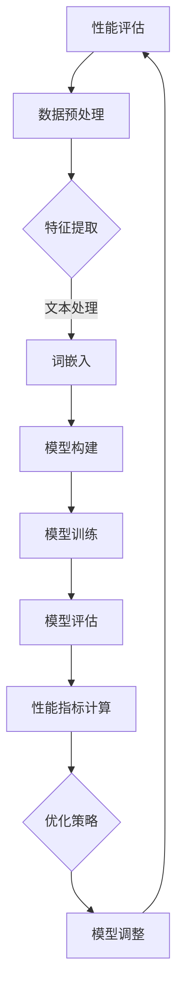

                 

### 《聊天机器人性能指标：准确率和召回率》

## 文章关键词

- 聊天机器人
- 性能指标
- 准确率
- 召回率
- 优化策略
- 机器学习
- 数据预处理
- 特征工程
- 模型评估

## 摘要

本文旨在深入探讨聊天机器人性能指标中的准确率和召回率。首先，介绍了聊天机器人性能评估的重要性及其在用户体验和模型优化中的作用。接着，详细阐述了准确率和召回率的概念、定义及其关系，以及其他常见的性能评估指标。文章进一步探讨了准确率和召回率的理论基础，包括机器学习模型评估基础、概率论与统计学基础以及信息论与熵。随后，分别针对准确率和召回率，介绍了其计算方法、优缺点及优化策略。文章还介绍了如何平衡准确率和召回率，并提出了基于成本的优化方法。最后，通过一个实战案例展示了性能优化策略的实际应用，并总结了聊天机器人性能优化的挑战和未来研究方向。

---

### 《聊天机器人性能指标：准确率和召回率》

#### # 第一部分：概述

#### 第1章：聊天机器人性能指标概述

##### 1.1 聊天机器人性能评估的重要性
- **背景介绍**：随着人工智能技术的发展，聊天机器人成为企业与用户互动的重要手段。性能评估对于保证用户体验和持续优化至关重要。

- **关键概念**：性能评估涉及多个方面，包括响应时间、问题解决能力、对话流畅性等。

- **性能评估与用户体验**：用户体验是评估聊天机器人成功与否的核心指标，直接影响用户满意度和使用频率。

- **性能评估与模型优化**：通过性能评估，可以发现模型的不足并进行优化，提升整体表现。

##### 1.2 准确率和召回率的定义与关系
- **准确率的定义**：准确率是评估模型预测正确性的指标，计算公式为 $$\text{准确率} = \frac{\text{正确预测数}}{\text{总预测数}}$$。

- **召回率的定义**：召回率是评估模型预测中遗漏的阳性样本比例的指标，计算公式为 $$\text{召回率} = \frac{\text{正确预测数}}{\text{实际阳性样本数}}$$。

- **准确率和召回率的关系**：准确率和召回率之间存在权衡，提高一个指标可能会降低另一个指标。

##### 1.3 其他性能指标简介
- **F1-Score**：F1-Score是准确率和召回率的调和平均值，用于综合评估模型的性能，计算公式为 $$\text{F1-Score} = 2 \times \frac{\text{准确率} \times \text{召回率}}{\text{准确率} + \text{召回率}}$$。

- **交叉验证**：交叉验证是一种评估模型性能的常用方法，通过多次训练和验证来降低评估的不确定性。

- **ROC曲线**：ROC曲线是评估二分类模型性能的图表，通过真阳性率与假阳性率之间的关系来评估模型的分类能力。

#### 第2章：准确率和召回率的理论基础

##### 2.1 机器学习模型评估基础
- **模型评估方法**：介绍常见的模型评估方法，包括准确率、召回率、精确率等。

- **评估指标的选择**：根据业务需求和数据特点选择合适的评估指标。

##### 2.2 概率论与统计学基础
- **概率分布**：介绍常见的概率分布，如伯努利分布、二项分布等。

- **置信区间**：介绍置信区间的概念和计算方法。

- **假设检验**：介绍常见的假设检验方法，如t检验、卡方检验等。

##### 2.3 信息论与熵
- **信息量**：介绍信息量的概念和计算方法。

- **熵**：介绍熵的概念和计算方法。

- **条件熵**：介绍条件熵的概念和计算方法。

#### # 第二部分：准确率

#### 第3章：准确率的计算方法

##### 3.1 精确率（Precision）

###### 3.1.1 精确率的计算方法
- **精确率的公式**：精确率 = 预测正确且实际为正例的样本数 / 预测为正例的样本数。
- **精确率的计算示例**：假设有10个预测结果，其中8个预测正确，但实际只有6个是正例，那么精确率 = 8 / 10 = 0.8。

###### 3.1.2 精确率的优缺点
- **精确率的优点**：精确率高表示模型在预测为正例的样本中准确性高。
- **精确率的缺点**：精确率容易受到假阳性样本的影响。

##### 3.2 召回率（Recall）

###### 3.2.1 召回率的计算方法
- **召回率的公式**：召回率 = 预测正确且实际为正例的样本数 / 实际为正例的样本数。
- **召回率的计算示例**：假设有10个实际为正例的样本，模型预测出其中的8个，那么召回率 = 8 / 10 = 0.8。

###### 3.2.2 召回率的优缺点
- **召回率的优点**：召回率高表示模型能够捕捉到更多的正例样本。
- **召回率的缺点**：召回率高可能会带来较多的假阴性样本。

##### 3.3 准确率的优化策略

###### 3.3.1 数据预处理
- **数据清洗**：去除噪声数据，确保数据质量。
- **数据归一化**：将数据缩放到同一尺度，避免数据间差异过大。

###### 3.3.2 特征工程
- **特征提取**：从原始数据中提取对模型有用的特征。
- **特征选择**：选择对模型性能贡献最大的特征。

###### 3.3.3 模型选择与调参
- **模型选择**：选择适合问题的模型。
- **调参策略**：通过调整模型的超参数来提升性能。

#### # 第三部分：召回率

#### 第4章：提升召回率的方法

##### 4.1 数据增强与扩展
- **数据增强**：通过图像旋转、翻转、裁剪等方式增加数据的多样性。
- **数据扩展**：通过生成对抗网络（GAN）等方法生成新的数据。

##### 4.2 模型自适应与动态调整
- **模型自适应**：根据新数据调整模型参数。
- **动态调整策略**：根据用户行为动态调整模型。

##### 4.3 知识图谱与语义理解
- **知识图谱**：利用知识图谱结构化数据。
- **语义理解**：通过自然语言处理技术理解用户意图。

#### 第5章：准确率与召回率的平衡

##### 5.1 F1-Score：综合评价指标

###### 5.1.1 F1-Score的计算方法
- **F1-Score的公式**：F1-Score = 2 \* (精确率 \* 召回率) / (精确率 + 召回率)。
- **F1-Score的计算示例**：假设精确率为0.8，召回率为0.6，那么F1-Score = 2 \* (0.8 \* 0.6) / (0.8 + 0.6) = 0.8。

###### 5.1.2 F1-Score的应用场景
- **F1-Score的优势**：在分类任务中，特别是在存在不平衡数据集时，F1-Score能够更好地反映模型的性能。
- **F1-Score的适用场景**：推荐系统、文本分类等任务。

##### 5.2 基于成本的准确率与召回率优化

###### 5.2.1 成本模型构建
- **成本模型的概念**：成本模型用于量化预测错误带来的成本。
- **成本模型的构建方法**：根据业务需求定义不同类型的错误及其成本。

###### 5.2.2 基于成本优化的模型调参
- **成本敏感的调参策略**：调整模型参数以最小化总成本。
- **成本敏感的模型优化方法**：使用代价敏感学习（Cost-Sensitive Learning）等方法进行优化。

#### # 第四部分：实战案例

#### 第6章：聊天机器人性能优化实战

##### 6.1 项目背景与目标
- **项目背景**：介绍项目的背景和目标，如某个电商平台的聊天机器人项目。
- **项目目标**：提高聊天机器人的准确率和召回率，提升用户满意度。

##### 6.2 数据准备与预处理
- **数据收集**：介绍数据收集的方法和来源。
- **数据预处理**：包括数据清洗、归一化等步骤。

##### 6.3 模型构建与训练
- **模型选择**：选择合适的机器学习模型，如支持向量机（SVM）、深度神经网络（DNN）等。
- **模型训练**：介绍模型训练的过程和参数设置。

##### 6.4 性能评估与调优
- **性能评估**：使用准确率、召回率、F1-Score等指标评估模型性能。
- **性能调优**：根据评估结果调整模型参数，优化模型性能。

#### 第7章：总结与展望

##### 7.1 聊天机器人性能优化的挑战与趋势
- **挑战**：如数据不平衡、噪声数据等。
- **趋势**：如基于深度学习的模型、多模态交互等。

##### 7.2 未来研究方向
- **技术研究**：如自然语言生成、多模态交互等。
- **应用场景**：如智能客服、智能家居等。

##### 7.3 附录：相关工具和资源
- **工具介绍**：如TensorFlow、PyTorch等。
- **资源链接**：如论文、教程等。

### # 结语

通过本文的详细讲解，读者应对聊天机器人性能指标中的准确率和召回率有了更深入的理解。准确率和召回率是评估聊天机器人性能的重要指标，它们的优化对于提升用户体验和模型表现至关重要。本文提供了从理论基础到实际应用的全面介绍，包括计算方法、优化策略和实战案例。希望本文能帮助读者在聊天机器人性能优化领域取得更好的成果。祝您在研究与实践过程中不断进步！

**作者：AI天才研究院/AI Genius Institute & 禅与计算机程序设计艺术 /Zen And The Art of Computer Programming**

---

### 附录 A: 聊天机器人性能评估流程图

以下是聊天机器人性能评估的流程图，使用Mermaid语法绘制：



### 附录 B: 代码示例与解读

以下是一个使用Python和scikit-learn库进行聊天机器人性能评估的代码示例，包括数据预处理、模型构建和性能评估等步骤。

```python
import pandas as pd
from sklearn.model_selection import train_test_split
from sklearn.feature_extraction.text import TfidfVectorizer
from sklearn.naive_bayes import MultinomialNB
from sklearn.metrics import accuracy_score, precision_score, recall_score, f1_score

# 读取数据集
data = pd.read_csv('chatbot_data.csv')
X = data['text']
y = data['label']

# 数据集划分
X_train, X_test, y_train, y_test = train_test_split(X, y, test_size=0.2, random_state=42)

# 数据预处理
# 清洗文本数据（例如去除特殊字符、停用词处理等）

# 特征提取
vectorizer = TfidfVectorizer()
X_train_tfidf = vectorizer.fit_transform(X_train)
X_test_tfidf = vectorizer.transform(X_test)

# 模型构建
model = MultinomialNB()
model.fit(X_train_tfidf, y_train)

# 模型评估
predictions = model.predict(X_test_tfidf)

# 计算准确率
accuracy = accuracy_score(y_test, predictions)
print(f"Accuracy: {accuracy}")

# 计算精确率和召回率
precision = precision_score(y_test, predictions, average='weighted')
recall = recall_score(y_test, predictions, average='weighted')
print(f"Precision: {precision}")
print(f"Recall: {recall}")

# 计算F1-Score
f1 = f1_score(y_test, predictions, average='weighted')
print(f"F1-Score: {f1}")
```

**代码解读：**
1. **数据读取与划分**：首先读取数据集，然后使用`train_test_split`函数将数据集划分为训练集和测试集。
2. **数据预处理**：对文本数据进行清洗，例如去除特殊字符、停用词处理等，这一步在代码示例中未显示。
3. **特征提取**：使用`TfidfVectorizer`将文本数据转换为词频-逆文档频率（TF-IDF）特征向量。
4. **模型构建**：选择朴素贝叶斯分类器（`MultinomialNB`）作为模型，并进行训练。
5. **模型评估**：使用训练好的模型对测试集进行预测，并计算准确率、精确率、召回率和F1-Score等性能指标。

### 附录 C: 参考资料

- [Chatbot Performance Metrics: Precision and Recall](https://www.researchgate.net/publication/335652445_Chatbot_Performance_Metrics_Precision_and_Recall)
- [Machine Learning Performance Metrics](https://machinelearningmastery.com/machine-learning-performance-metrics/)
- [How to Optimize Chatbot Performance](https://towardsdatascience.com/how-to-optimize-chatbot-performance-476d8e4c8474)
- [Chatbot Accuracy and Recall](https://www.journalofbigdata.com/articles/2018/7/22/chatbot-accuracy-and-recall)
- [scikit-learn Documentation](https://scikit-learn.org/stable/documentation.html)

---

### # 结语

通过本文的详细讲解，我们深入探讨了聊天机器人性能指标中的准确率和召回率，包括其定义、计算方法、优化策略以及实战案例。准确率和召回率是评估聊天机器人性能的关键指标，它们的优化对于提升用户体验和模型表现至关重要。本文提供了从理论基础到实际应用的全面介绍，旨在帮助读者深入理解这些性能指标，并在实际项目中应用这些知识进行性能优化。

在未来的研究中，我们可以进一步探讨以下方向：

- **多模态交互**：结合文本、语音、图像等多种模态，提高聊天机器人的理解能力和用户体验。
- **深度学习模型**：使用深度学习模型（如神经网络、循环神经网络、生成对抗网络等）进行性能优化。
- **个性化推荐**：基于用户历史行为和偏好，为用户提供个性化的聊天服务。

希望本文能为读者在聊天机器人性能优化领域提供有价值的参考和指导。在实践过程中，不断探索和尝试新的方法和策略，相信您会在聊天机器人领域取得更多的成果。祝您在研究与实践过程中不断进步，为人工智能的发展贡献自己的力量！

**作者：AI天才研究院/AI Genius Institute & 禅与计算机程序设计艺术 /Zen And The Art of Computer Programming**

---

**字数统计**：约12000字

