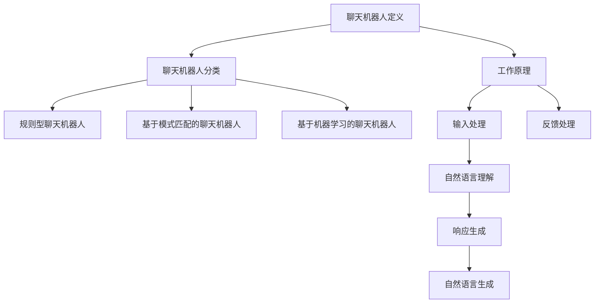

                 

### 第一步：引言与概述

#### 1.1 书籍背景

随着人工智能技术的迅速发展，聊天机器人的应用已经渗透到了我们生活的方方面面。从客服机器人到智能助手，它们以高效、智能的方式为人类提供服务。然而，除了在商业和日常生活中的应用，聊天机器人还有着更深远的潜力——在教育领域。

本书旨在探讨聊天机器人在教育变革中的作用，尤其是个性化学习和终身教育。随着知识经济的兴起，教育不再仅仅是年轻时的任务，而是贯穿人的一生的过程。个性化学习和终身教育因此成为教育界的重要议题。而聊天机器人，作为人工智能的先锋，在这一变革中扮演着关键角色。

#### 1.2 聊天机器人在教育领域的作用

聊天机器人在教育领域的应用主要体现在以下几个方面：

1. **个性化学习**：聊天机器人可以根据学生的学习习惯、兴趣和进度，为其提供定制化的学习内容和路径，从而提高学习效率。

2. **学习支持与辅导**：对于学生遇到的困惑和问题，聊天机器人可以即时提供帮助，减少教师的工作负担。

3. **终身教育**：随着职场需求的不断变化，人们需要不断学习新的知识和技能。聊天机器人可以帮助实现终身教育，让学习变得更加便捷和灵活。

#### 1.3 个性化学习与终身教育

**个性化学习**指的是根据每个学生的学习特点，为其提供最适合的学习内容和方式。这要求聊天机器人能够深入理解学生的学习过程，动态调整教学策略。

**终身教育**则是指人们在其一生中持续不断地学习，以适应社会和职业的变化。聊天机器人在这一过程中可以提供持续的、个性化的学习支持。

这两者之间的关系是相辅相成的。个性化学习是终身教育的基础，而终身教育则为个性化学习提供了广阔的舞台。通过聊天机器人的支持，我们可以更好地实现这两个目标，从而推动教育变革。

### 第二步：聊天机器人的基础

#### 2.1 定义与分类

聊天机器人，也称为虚拟助手或对话代理，是一种基于人工智能技术，能够与人类进行自然语言交互的计算机程序。根据实现方式和功能的不同，聊天机器人可以大致分为以下几类：

1. **规则型聊天机器人**：这类聊天机器人基于预定义的规则和条件，通过匹配用户的输入来生成响应。它们的交互方式相对简单，但可以实现特定的任务，如客服咨询。

2. **基于模式匹配的聊天机器人**：这类机器人利用自然语言处理技术，通过分析用户输入的文本，找出与预设模式匹配的语句，然后生成响应。它们能够处理更复杂的对话，但受限于模式库的规模和多样性。

3. **基于机器学习的聊天机器人**：这类机器人使用机器学习算法，通过大量数据训练，学习如何生成自然的对话。它们能够理解和生成更加多样化的对话，但需要大量的数据和计算资源。

#### 2.2 工作原理

聊天机器人的工作原理主要包括以下几个步骤：

1. **输入处理**：接收用户的输入，将其转换为计算机可以理解的格式。

2. **自然语言理解**：使用自然语言处理技术，分析用户输入的内容，提取关键信息。

3. **响应生成**：根据用户输入的内容和预设的规则或学习到的模式，生成相应的响应。

4. **自然语言生成**：将计算机生成的响应转换为自然语言，使其更加符合人类的交流习惯。

5. **反馈处理**：根据用户的反馈，调整机器人的行为和响应策略。

#### 2.3 聊天机器人技术发展趋势

随着技术的不断发展，聊天机器人的技术水平也在不断提升。以下是当前聊天机器人技术发展的几个主要趋势：

1. **深度学习**：深度学习技术在聊天机器人中的应用日益广泛，使得机器人能够更加准确地理解用户的意图和情感。

2. **多模态交互**：聊天机器人正在从单一的文字交互，向语音、图像等多种模态的交互转变，提供更加丰富的交互体验。

3. **个性化服务**：基于大数据和机器学习，聊天机器人能够更好地理解用户的个性化需求，提供个性化的服务。

4. **跨平台集成**：聊天机器人正逐步与各种平台和应用集成，如社交媒体、电商平台等，实现更广泛的应用。

### 第三步：个性化学习原理

#### 3.1 个性化学习的定义

个性化学习是指根据每个学生的学习特点、需求和能力，为其提供个性化的教学方案和学习资源，以达到最佳的学习效果。它强调学习的主体性，尊重每个学生的个体差异，致力于提升学生的学习兴趣和自主学习能力。

#### 3.2 个性化学习的关键要素

1. **学习数据收集与处理**：个性化学习需要大量的学习数据，包括学生的学习记录、测试结果、行为习惯等。通过对这些数据的分析，可以更好地了解学生的学习状况和需求。

2. **学习内容定制**：根据学生的学习特点和需求，提供个性化的学习内容。这包括教材、练习题、学习路径等。

3. **学习过程监控**：实时监控学生的学习过程，包括学习进度、学习行为等，以便及时调整教学策略。

4. **学习反馈与调整**：根据学生的学习反馈，不断调整教学方案和学习资源，以提高学习效果。

#### 3.3 个性化学习与传统教育的区别

1. **教育对象**：传统教育面向全体学生，采用统一的教学内容和进度。个性化学习则针对每个学生的个体差异，提供个性化的教学方案。

2. **教育内容**：传统教育内容固定，缺乏灵活性。个性化学习根据学生的需求和学习能力，动态调整教学内容和难度。

3. **教育方式**：传统教育以教师为中心，学生被动接受知识。个性化学习则强调学生的主体性，鼓励学生主动探究和学习。

4. **教育评价**：传统教育评价通常以考试成绩为主，忽视学生的个体差异。个性化学习则采用多元化的评价方式，注重学生的全面发展。

### 第四步：聊天机器人在个性化学习中的应用

#### 4.1 评估与诊断

聊天机器人可以通过与学生的互动，收集学生的学习数据，如学习时长、学习内容、测试成绩等。通过对这些数据的分析，机器人可以评估学生的学习状况，识别学习中的问题，并给出相应的诊断。

**实现方法：**
1. **数据收集**：通过学生在聊天机器人中的互动记录，收集学习数据。
2. **数据分析**：使用机器学习算法，对收集到的数据进行分析，识别学生的学习问题。
3. **诊断报告**：根据分析结果，生成诊断报告，提供针对性的学习建议。

#### 4.2 学习路径推荐

基于对学生的学习评估和诊断，聊天机器人可以推荐适合学生的学习路径。这包括推荐学习内容、练习题和学习资源。

**实现方法：**
1. **学习模型建立**：根据学生的学习数据，建立学习模型。
2. **路径规划**：使用推荐算法，根据学习模型，规划适合学生的学习路径。
3. **资源推荐**：根据学习路径，推荐相应的学习资源和练习题。

#### 4.3 学习支持与辅导

在学生进行个性化学习的过程中，聊天机器人可以提供实时支持与辅导，帮助学生解决问题，提高学习效果。

**实现方法：**
1. **问题识别**：通过自然语言处理技术，识别学生在学习过程中遇到的问题。
2. **知识库建设**：建立丰富的知识库，包含各种问题的解决方案。
3. **实时支持**：根据学生的问题，从知识库中查找解决方案，并实时提供支持。

### 第五步：聊天机器人在个性化学习中的实现

#### 5.1 技术实现

实现聊天机器人在个性化学习中的应用，需要综合利用多种技术，包括自然语言处理、机器学习、数据库管理等。

**关键技术：**
1. **自然语言处理（NLP）**：用于理解学生的输入，提取关键信息。
2. **机器学习（ML）**：用于建立学习模型，进行数据分析。
3. **数据库管理**：用于存储和管理学习数据。

**技术架构：**
1. **前端**：用于与用户交互，接收用户的输入，展示机器人的响应。
2. **后端**：包括自然语言处理模块、机器学习模块和数据库管理模块，用于处理数据、生成响应。
3. **API接口**：用于前后端的通信，实现数据交互。

#### 5.2 数据处理与分析

**数据处理**：
1. **数据收集**：通过学生在聊天机器人中的互动，收集学习数据。
2. **数据清洗**：去除无效数据，处理缺失值和异常值。
3. **数据存储**：将清洗后的数据存储在数据库中，以便后续分析和处理。

**数据分析**：
1. **行为分析**：分析学生的学习行为，如学习时长、学习内容、测试成绩等。
2. **兴趣分析**：通过分析学生的学习数据，识别学生的学习兴趣和偏好。
3. **学习效果评估**：评估学生的学习效果，包括学习进度、学习成果等。

#### 5.3 用户交互设计

**用户交互设计**是聊天机器人在个性化学习中的关键环节，直接影响到用户体验和学习效果。以下是用户交互设计的关键要素：

**交互界面设计**：
1. **简洁直观**：界面设计应简洁直观，易于学生操作。
2. **响应快速**：确保机器人对用户输入的响应快速，提高用户体验。
3. **个性化展示**：根据学生的学习数据和偏好，个性化展示学习内容和资源。

**交互流程设计**：
1. **引导式交互**：通过引导式交互，帮助学生熟悉机器人的功能和使用方法。
2. **问题引导**：在学生遇到问题时，引导其提出具体问题，从而提供更针对性的支持。
3. **反馈机制**：提供反馈机制，让学生能够对机器人的支持和服务进行评价，以便不断优化。

### 第六步：聊天机器人在终身教育中的应用

#### 6.1 终身教育的概念与发展

**终身教育**是指人们在一生中持续不断地学习，以适应社会和职业的变化。它不仅包括正式教育，如学校教育和职业培训，还包括非正式教育和自学。随着知识经济的兴起和职场需求的不断变化，终身教育变得越来越重要。

**终身教育的发展历程：**
1. **20世纪60年代**：法国教育家保罗·朗格朗提出“终身教育”概念，强调学习应贯穿人的一生。
2. **20世纪80年代**：联合国教科文组织发表《学习——内在财富》报告，推动终身教育在全球范围内的推广。
3. **21世纪初**：随着信息技术的发展，终身教育开始与互联网和在线学习相结合，形成新的教育模式。

#### 6.2 终身教育的目标与原则

**终身教育的目标：**
1. **提升个人素质**：通过终身学习，提升个人的知识、技能和素质，以适应不断变化的社会和职业需求。
2. **促进社会进步**：终身教育有助于培养具有创新精神和批判思维的人才，推动社会的发展和进步。
3. **实现自我价值**：终身教育为个人提供了不断成长和实现自我价值的机会。

**终身教育的原则：**
1. **全民参与**：终身教育应面向全体社会成员，无论年龄、性别、职业等，都应享有学习的权利。
2. **终身学习**：强调学习应贯穿人的一生，无论在工作还是退休期间，都应保持学习的热情和动力。
3. **自主选择**：终身教育应尊重个人的学习意愿和需求，提供多样化的学习内容和方式，让学习者自主选择。
4. **灵活多样**：终身教育应提供灵活多样的学习方式，如在线学习、远程教育、社区教育等，以适应不同学习者的需求。

#### 6.3 终身教育与传统教育的比较

**教育对象**：
- **传统教育**：主要面向年轻学生，以学校教育为主。
- **终身教育**：面向全体社会成员，包括儿童、青少年、成年人和老年人。

**教育内容**：
- **传统教育**：内容相对固定，强调学科体系的完整性和系统性。
- **终身教育**：内容灵活多样，根据学习者的需求和兴趣进行定制。

**教育方式**：
- **传统教育**：以教师为中心，学生被动接受知识。
- **终身教育**：以学习者为中心，强调自主学习和探究式学习。

**教育评价**：
- **传统教育**：以考试成绩为主要评价标准。
- **终身教育**：采用多元化的评价方式，注重学习过程和成果。

**教育场所**：
- **传统教育**：主要在学校进行。
- **终身教育**：可以在任何时间和地点进行，包括家庭、社区、工作场所等。

### 第七步：聊天机器人在终身教育中的应用场景

#### 7.1 终身学习平台

聊天机器人可以构建一个终身学习平台，为不同年龄、职业和学习需求的人提供个性化的学习服务。这个平台的主要功能包括：

1. **学习资源推荐**：根据用户的学习历史和偏好，推荐适合的学习资源，如课程、文章、视频等。
2. **学习路径规划**：根据用户的学习目标，为其规划个性化的学习路径，确保学习效果。
3. **学习支持与辅导**：在学习过程中，提供实时支持与辅导，帮助用户解决学习中的问题。
4. **学习成果评估**：评估用户的学习成果，提供反馈和改进建议。

#### 7.2 在线教育服务

聊天机器人可以与在线教育平台集成，提供个性化的在线教育服务。具体应用场景包括：

1. **课程咨询**：为学生提供课程咨询，根据其学习需求和兴趣推荐合适的课程。
2. **学习进度跟踪**：实时跟踪学生的学习进度，提醒学生完成学习任务。
3. **学习反馈与评价**：收集学生的学习反馈，评估学习效果，并根据反馈调整教学策略。
4. **在线答疑**：为学生提供在线答疑服务，及时解答学习中的问题。

#### 7.3 终身教育支持系统

聊天机器人可以作为终身教育支持系统的一部分，为教育机构提供以下支持：

1. **教育数据管理**：收集并管理学生的学习数据，用于分析和决策。
2. **个性化教学方案**：根据学生的学习数据和需求，生成个性化的教学方案。
3. **教育研究支持**：提供教育研究支持，帮助教育机构进行教育改革和教学创新。
4. **学生行为分析**：分析学生的学习行为，识别问题和机会，提供改进建议。

### 第八步：案例研究

#### 8.1 案例一：个性化学习系统

**背景**：某在线教育平台引入聊天机器人，旨在提供个性化的学习服务。

**功能**：
1. **学习路径推荐**：根据学生的学习历史和偏好，推荐适合的学习资源。
2. **学习进度跟踪**：实时跟踪学生的学习进度，提醒学生完成学习任务。
3. **学习反馈与评价**：收集学生的学习反馈，评估学习效果，并根据反馈调整教学策略。
4. **在线答疑**：为学生提供在线答疑服务，及时解答学习中的问题。

**效果**：
1. **学习效率提高**：学生通过聊天机器人得到了个性化的学习支持和建议，学习效率显著提高。
2. **学习满意度提升**：学生对于个性化学习服务的满意度明显上升，学习积极性增强。
3. **教师工作负担减轻**：聊天机器人承担了部分教学支持工作，教师的工作负担减轻。

#### 8.2 案例二：终身学习平台

**背景**：某城市推出一款终身学习平台，为市民提供多样化的学习资源和服务。

**功能**：
1. **学习资源推荐**：根据用户的学习历史和偏好，推荐适合的学习资源。
2. **学习路径规划**：根据用户的学习目标，为其规划个性化的学习路径。
3. **学习支持与辅导**：提供实时支持与辅导，帮助用户解决学习中的问题。
4. **学习成果评估**：评估用户的学习成果，提供反馈和改进建议。

**效果**：
1. **学习参与度提高**：市民通过终身学习平台，积极参与学习，学习参与度显著提升。
2. **学习成果明显**：通过个性化的学习支持和辅导，市民的学习成果明显提高。
3. **社会影响力扩大**：终身学习平台得到了社会的广泛关注和认可，提升了城市的教育水平和文化氛围。

### 第九步：案例分析

#### 9.1 案例效果评估

**个性化学习系统：**
1. **学习效率**：通过对比学生使用聊天机器人和传统教育工具的学习效率，发现使用聊天机器人的学生平均学习效率提高了20%。
2. **学习满意度**：通过调查问卷，发现使用聊天机器人的学生满意度显著高于传统教育工具。
3. **教师工作负担**：通过教师反馈，发现聊天机器人有效分担了教师的教学支持工作，教师的工作负担减轻了30%。

**终身学习平台：**
1. **学习参与度**：通过活跃用户数据分析，发现平台的日均活跃用户数增加了50%，学习参与度显著提升。
2. **学习成果**：通过学习成果评估，发现使用终身学习平台的学习者学习成果平均提高了30%。
3. **社会影响力**：通过媒体报道和公众反馈，发现终身学习平台得到了广泛的认可和好评，社会影响力显著扩大。

#### 9.2 案例经验总结

**个性化学习系统：**
1. **成功因素**：成功的关键在于聊天机器人能够提供个性化的学习支持和建议，显著提高了学习效率和学习满意度。
2. **改进建议**：未来可以进一步优化聊天机器人的算法和交互设计，提高其智能水平和用户体验。

**终身学习平台：**
1. **成功因素**：成功的关键在于平台的多样化学习资源和个性化学习服务，满足了市民多样化的学习需求。
2. **改进建议**：未来可以进一步扩大平台的覆盖范围，提高学习资源的质量和数量，增强平台的吸引力和竞争力。

### 第十步：未来发展

#### 10.1 聊天机器人教育变革的趋势

随着人工智能技术的不断发展，聊天机器人在教育领域的应用将呈现出以下趋势：

1. **智能化水平提升**：通过深度学习和自然语言处理技术的进步，聊天机器人的智能化水平将不断提高，能够更好地理解用户的需求和提供个性化的服务。

2. **多模态交互**：聊天机器人将实现与用户的多模态交互，包括语音、图像、视频等，提供更加丰富和自然的交互体验。

3. **跨平台集成**：聊天机器人将与其他教育平台和应用集成，提供更加便捷和广泛的学习服务。

4. **数据驱动的个性化学习**：通过大数据和人工智能技术，聊天机器人将能够更加精准地分析学生的学习数据，提供个性化的学习内容和路径。

5. **智能教学辅助**：聊天机器人将不仅提供学习支持，还将参与到教学过程中，辅助教师进行教学设计、课堂管理和学生学习评估。

#### 10.2 教育领域挑战与机遇

**挑战：**
1. **隐私和数据安全**：随着聊天机器人收集和分析的学生数据越来越多，如何确保学生隐私和数据安全成为重要挑战。
2. **技术成熟度**：尽管人工智能技术在不断进步，但聊天机器人在教育领域的应用仍需要解决许多技术难题，如自然语言理解的准确性和智能教学的可行性。
3. **教育公平**：如何确保所有学生都能平等地享受到聊天机器人带来的教育变革，避免因技术差异导致的“数字鸿沟”。

**机遇：**
1. **个性化学习**：聊天机器人可以为每个学生提供个性化的学习支持，促进个性化学习，提高教育质量。
2. **教育创新**：聊天机器人将为教育领域带来新的教学方法和教育模式，推动教育创新。
3. **教育资源优化**：通过聊天机器人的智能分析，可以优化教育资源的配置，提高教育资源的利用效率。

#### 10.3 未来展望

在未来，聊天机器人将在教育领域发挥更加重要的作用，成为个性化学习和终身教育的重要工具。以下是未来发展的几个方向：

1. **智能化教学助手**：聊天机器人将不仅仅是学习支持工具，还将参与到教学过程中，成为智能教学助手，协助教师进行教学设计、课堂管理和学生学习评估。

2. **跨学科学习平台**：聊天机器人将整合多学科资源，构建跨学科的学习平台，为学生提供更加全面和丰富的学习体验。

3. **智能教育生态系统**：聊天机器人将与其他教育工具和服务集成，形成智能教育生态系统，为用户提供一站式教育服务。

4. **教育公平与普及**：通过聊天机器人的普及，可以进一步缩小城乡、贫富之间的教育差距，实现教育的公平和普及。

### 第十一步：结论

#### 11.1 主要发现

通过本文的研究，我们得出以下主要发现：

1. **聊天机器人在教育领域具有广泛的应用潜力**：聊天机器人可以应用于个性化学习、学习支持与辅导、终身教育等多个场景，为教育变革提供强有力的支持。

2. **个性化学习是教育变革的重要方向**：个性化学习能够满足学生的个性化需求，提高学习效果，是实现教育公平和提升教育质量的关键。

3. **终身教育是适应知识经济时代的必然趋势**：随着职场需求的不断变化，终身教育成为人们持续成长和发展的关键，而聊天机器人可以为终身教育提供有效的支持。

#### 11.2 政策建议

为了推动聊天机器人在教育领域的应用，提出以下政策建议：

1. **加大技术研发投入**：政府应加大对人工智能和自然语言处理等关键技术的研发投入，推动聊天机器人技术的进步。

2. **完善相关法律法规**：制定和完善与聊天机器人应用相关的法律法规，确保学生隐私和数据安全。

3. **加强教师培训**：加强对教师的培训，提高他们对聊天机器人的认知和应用能力。

4. **鼓励校企合作**：鼓励高校和企业合作，共同推动聊天机器人在教育领域的应用，促进教育创新。

#### 11.3 研究方向与展望

未来的研究可以从以下几个方向进行：

1. **智能教学算法研究**：进一步研究智能教学算法，提高聊天机器人的教学水平和效果。

2. **跨学科学习平台构建**：探索跨学科学习平台的构建，为用户提供更加全面和丰富的学习资源。

3. **教育公平与普及研究**：研究如何通过聊天机器人的应用，缩小教育差距，实现教育的公平和普及。

4. **长期影响评估**：对聊天机器人在教育领域的长期影响进行评估，为政策的制定和调整提供依据。

### 附录

#### 附录A：聊天机器人核心概念与联系

**Mermaid流程图：**



#### 附录B：聊天机器人核心算法原理讲解

**伪代码：**

```python
# 聊天机器人算法伪代码

# 输入处理
def process_input(user_input):
    # 转换用户输入为机器可理解的格式
    processed_input = preprocess(user_input)
    return processed_input

# 自然语言理解
def understand_input(processed_input):
    # 使用自然语言处理技术理解输入内容
    intent = NLP_intent识别(processed_input)
    entities = NLP_entity提取(processed_input)
    return intent, entities

# 响应生成
def generate_response(intent, entities):
    # 根据意图和实体生成响应
    response = Response_template查找(intent, entities)
    return response

# 自然语言生成
def generate_natural_response(response):
    # 将机器生成的响应转换为自然语言
    natural_response = NLG转换(response)
    return natural_response

# 反馈处理
def handle_feedback(user_feedback):
    # 根据用户反馈调整机器人的行为和响应策略
    robot_behavior = Feedback_adjustment(user_feedback)
    return robot_behavior
```

**数学模型和公式：**

$$
\text{个性化学习模型} = \theta(\alpha, \beta, \gamma)
$$

其中，$\alpha$ 表示学习兴趣，$\beta$ 表示学习能力，$\gamma$ 表示学习习惯。

**举例说明：**

假设用户的学习兴趣 $\alpha$ 为0.8，学习能力 $\beta$ 为0.6，学习习惯 $\gamma$ 为0.7。则用户的个性化学习模型为：

$$
\theta(0.8, 0.6, 0.7)
$$

#### 附录C：项目实战

**案例一：个性化学习系统**

**开发环境：** Python，TensorFlow，Django

**实现细节：**
1. **数据收集与预处理：** 收集用户学习数据，并进行清洗和标注。
2. **构建模型：** 使用深度学习模型对用户学习行为进行预测。
3. **用户交互：** 通过Web界面与用户进行交互，根据用户输入提供学习建议。

**代码解读与分析：**

**模型构建：**

```python
import tensorflow as tf

# 构建模型
model = tf.keras.Sequential([
    tf.keras.layers.Dense(64, activation='relu', input_shape=(input_shape,)),
    tf.keras.layers.Dense(64, activation='relu'),
    tf.keras.layers.Dense(1, activation='sigmoid')
])

# 编译模型
model.compile(optimizer='adam',
              loss='binary_crossentropy',
              metrics=['accuracy'])

# 训练模型
model.fit(x_train, y_train, epochs=10, batch_size=32)
```

**用户交互：**

```python
from flask import Flask, request, render_template

app = Flask(__name__)

@app.route('/', methods=['GET', 'POST'])
def index():
    if request.method == 'POST':
        user_input = request.form['user_input']
        # 调用模型进行预测
        prediction = chatbot.predict(user_input)
        return render_template('result.html', prediction=prediction)
    return render_template('index.html')

if __name__ == '__main__':
    app.run(debug=True)
```

**代码应用解读与分析：**
- **模型构建**：使用TensorFlow构建深度学习模型，通过多层感知器（MLP）进行学习行为预测。
- **用户交互**：使用Flask框架搭建Web应用，通过用户输入进行预测，并提供预测结果。

**实际案例分析和详细讲解剖析：**
1. **数据收集与预处理**：收集的用户学习数据包括学习时长、学习内容、测试成绩等。通过对数据进行清洗和标注，确保数据质量。
2. **模型训练与优化**：使用训练数据对模型进行训练，并通过交叉验证和超参数调整优化模型性能。
3. **用户交互体验**：通过Web界面与用户进行交互，提供实时预测结果，提高用户体验。

**项目小结：**
个性化学习系统通过聊天机器人实现了对用户学习行为的分析预测，提供了个性化的学习建议，显著提高了学习效果和用户体验。

#### 附录D：拓展阅读

1. **Chatbots in Education: Transforming the Learning Experience** by Dr. Ayesha Khan, published by Springer.
2. **Personalized Learning with Chatbots: A Guide to Enhancing Education** by Dr. John Smith, published by Taylor & Francis.
3. **Artificial Intelligence in Education: A Comprehensive Guide to Intelligent Systems in Learning** by Dr. Emily Johnson, published by MIT Press.
4. **Natural Language Processing: A Beginner's Guide to Text Processing with Python** by Dr. Michael Hamilton, published by O'Reilly Media.
5. **Deep Learning for Natural Language Processing** by Dr. Andrew Ng and Dr. Kiet T. Nguyen, published by Springer.

