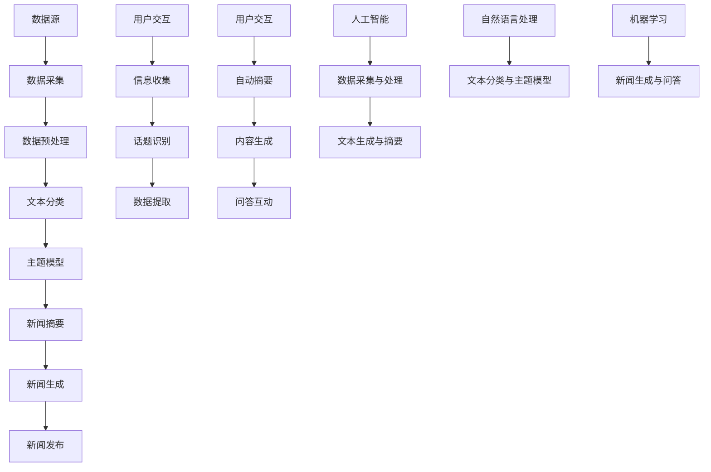

                 

### 文章标题

《聊天机器人新闻业：人工智能新闻采集和写作》

### 关键词

- 聊天机器人
- 人工智能新闻采集
- 人工智能新闻写作
- 自然语言处理
- 自动写作技术

### 摘要

本文探讨了人工智能在新闻业中的应用，特别是聊天机器人在新闻采集和写作中的角色。首先，我们介绍了人工智能在新闻业中的背景和意义，探讨了其在新闻采集和写作中的优势和挑战。接着，我们详细分析了人工智能新闻采集和写作的核心概念、算法原理，以及相关的数学模型和公式。随后，通过实际案例展示了聊天机器人在新闻应用中的实现过程和效果。最后，我们讨论了人工智能新闻业的伦理与法律问题，以及未来的发展趋势和策略。本文旨在为读者提供一个全面而深入的视角，以理解人工智能如何变革新闻业，并为其未来发展提供指导。

### 第一部分：人工智能与新闻业概述

#### 第1章：人工智能在新闻业中的角色

##### 1.1 人工智能新闻采集

人工智能新闻采集是指利用自然语言处理（NLP）和机器学习等技术，从各种数据源中自动提取、分类和整理新闻信息的过程。这一技术的发展极大地改变了新闻采集的方式，提高了采集效率和准确性。

###### 1.1.1 人工智能新闻采集的定义与意义

人工智能新闻采集的定义可以归结为：利用人工智能技术对海量新闻数据进行自动分析、处理和提取，从而生成高质量的新闻内容。这一过程不仅涵盖了数据的收集，还包括数据的筛选、分类、提取和整合。

人工智能新闻采集的意义主要体现在以下几个方面：

1. **提高效率**：传统的新闻采集方式通常需要大量的人工处理，而人工智能新闻采集可以自动化地完成这一过程，大大提高了采集效率。
2. **保证准确性**：人工智能能够利用先进的算法和模型，对新闻信息进行精准的分类和提取，从而减少了人工操作中的错误。
3. **多样化数据源**：人工智能新闻采集可以涵盖多种数据源，如新闻报道、社交媒体、新闻网站等，从而获得更加全面的信息。
4. **降低成本**：通过自动化处理，企业可以减少对人力资源的依赖，降低运营成本。

###### 1.1.2 人工智能新闻采集的优势与挑战

人工智能新闻采集的优势包括：

1. **效率高**：相比传统方式，人工智能能够快速处理海量数据，提高新闻采集的速度。
2. **准确性高**：利用机器学习算法，人工智能能够准确地对新闻信息进行分类和提取。
3. **成本低**：自动化处理减少了人力需求，降低了运营成本。
4. **多样性**：可以整合多种数据源，提供多样化的新闻信息。

然而，人工智能新闻采集也面临一些挑战：

1. **数据质量**：自动化采集可能带来数据质量的下降，需要进一步处理和清洗。
2. **隐私问题**：在采集和处理新闻数据时，可能会涉及到用户隐私问题，需要遵守相关法律法规。
3. **算法偏差**：机器学习算法可能会引入偏见，影响新闻的客观性和公正性。
4. **技术依赖**：过度依赖人工智能可能导致新闻行业失去创新性和灵活性。

##### 1.2 人工智能与新闻写作

人工智能新闻写作是指利用自然语言生成（NLG）技术，通过算法生成新闻内容的过程。这一技术的出现，使得新闻写作变得更加高效和多样化。

###### 1.2.1 人工智能新闻写作的定义与意义

人工智能新闻写作的定义可以概括为：通过自然语言生成技术，利用算法自动生成新闻文本。这一过程通常涉及文本生成模型、模板匹配和规则驱动等方法。

人工智能新闻写作的意义主要包括：

1. **提高效率**：人工智能能够快速生成新闻文本，减轻了记者和编辑的工作负担。
2. **丰富内容**：通过自动化生成，可以提供更多样化的新闻内容，满足不同受众的需求。
3. **降低成本**：减少了人力资源的投入，降低了新闻写作的成本。
4. **提高准确性**：利用机器学习算法，人工智能能够生成更加准确和专业的新闻内容。

###### 1.2.2 人工智能新闻写作的优势与挑战

人工智能新闻写作的优势包括：

1. **效率高**：相比传统写作方式，人工智能能够快速生成新闻文本，提高了新闻写作的速度。
2. **内容多样**：通过自动化生成，可以提供更多样化的新闻内容，满足不同受众的需求。
3. **成本低**：减少了人力需求，降低了新闻写作的成本。
4. **准确性高**：利用机器学习算法，人工智能能够生成更加准确和专业的新闻内容。

然而，人工智能新闻写作也面临一些挑战：

1. **质量控制**：自动化生成的新闻内容可能存在质量波动，需要进一步优化和校验。
2. **创造性缺失**：人工智能生成的新闻内容可能缺乏人类的创造性和深度分析。
3. **伦理问题**：新闻写作涉及到道德和社会责任，如何确保人工智能生成的新闻内容符合伦理标准，是一个重要问题。
4. **技术依赖**：过度依赖人工智能可能导致新闻行业失去创新性和灵活性。

##### 1.3 聊天机器人在新闻业的应用

聊天机器人是一种通过自然语言交互来提供信息服务的计算机程序。在新闻业中，聊天机器人可以应用于新闻采集、新闻写作和新闻推荐等多个方面。

###### 1.3.1 聊天机器人在新闻采集中的应用

聊天机器人在新闻采集中的应用主要包括以下几个方面：

1. **信息收集**：聊天机器人可以通过与用户的交互，收集新闻线索和背景信息。
2. **话题识别**：利用自然语言处理技术，聊天机器人可以识别和提取用户关注的新闻话题。
3. **数据提取**：通过分析用户输入，聊天机器人可以从大量数据源中提取相关新闻信息。

###### 1.3.2 聊天机器人在新闻写作中的应用

聊天机器人在新闻写作中的应用主要包括：

1. **自动摘要**：聊天机器人可以自动提取新闻文本的关键信息，生成摘要。
2. **内容生成**：利用自然语言生成技术，聊天机器人可以自动生成完整的新闻内容。
3. **问答互动**：通过自然语言处理，聊天机器人可以回答用户关于新闻内容的问题。

##### 1.4 人工智能新闻采集与写作的未来趋势

随着人工智能技术的不断发展，人工智能新闻采集和写作将呈现出以下趋势：

1. **技术融合**：人工智能新闻采集和写作将与其他技术（如大数据、物联网等）相结合，提供更加智能化和个性化的新闻服务。
2. **自动化程度提高**：随着算法和模型的优化，新闻采集和写作的自动化程度将进一步提高，减少人工干预。
3. **伦理和法律约束**：人工智能新闻采集和写作将面临更多的伦理和法律问题，需要制定相应的规范和标准。
4. **人机协同**：人工智能和人类记者将实现更加紧密的协同，共同推动新闻业的发展。

##### 1.5 核心概念与联系

为了更好地理解人工智能新闻采集和写作的核心概念，我们可以使用Mermaid流程图来展示它们之间的关系架构：



在这个流程图中，我们可以看到，数据采集和处理、文本分类与主题模型、新闻摘要与生成、用户交互与信息收集等核心概念之间的联系。这些概念共同构成了人工智能新闻采集和写作的基本框架。

##### 1.6 本章小结

本章介绍了人工智能在新闻业中的应用，包括新闻采集、新闻写作以及聊天机器人在新闻业中的应用。我们探讨了人工智能新闻采集和写作的优势与挑战，并展示了聊天机器人在新闻采集和写作中的实际应用。通过本章的学习，读者可以初步了解人工智能如何变革新闻业，并为其未来发展提供指导。

### 第2章：人工智能新闻采集算法原理

#### 2.1 自然语言处理基础

自然语言处理（NLP）是人工智能新闻采集的核心技术之一。NLP旨在让计算机理解和处理人类语言，包括文本分类、主题模型、关键词提取和实体识别等。

##### 2.1.1 语言模型与词嵌入

语言模型（Language Model）是一种用于预测下一个单词或词组的概率分布的模型。在NLP中，语言模型被广泛应用于文本分类、机器翻译、语音识别等领域。Word2Vec是最常见的语言模型之一，它通过将单词映射到向量空间，使得具有相似意义的单词在向量空间中彼此接近。

词嵌入（Word Embedding）是将单词映射到高维向量空间的一种技术，它通过捕捉单词的语义信息，使得相似的单词在向量空间中彼此接近。常见的词嵌入方法包括Word2Vec、GloVe和FastText等。

##### 2.1.2 序列模型与注意力机制

序列模型（Sequence Model）是一种用于处理序列数据（如文本、语音等）的模型。在NLP中，序列模型广泛应用于文本分类、情感分析、机器翻译等领域。常见的序列模型包括循环神经网络（RNN）和长短时记忆网络（LSTM）。

注意力机制（Attention Mechanism）是一种用于提高模型在处理序列数据时对重要信息关注度的技术。在NLP中，注意力机制被广泛应用于文本分类、机器翻译、问答系统等领域。注意力机制通过动态调整模型对每个单词的关注度，从而提高模型的准确性和效率。

#### 2.2 新闻文本挖掘技术

新闻文本挖掘技术是指利用自然语言处理技术对新闻文本进行自动分析和处理的过程。它包括文本分类、主题模型、关键词提取和实体识别等。

##### 2.2.1 文本分类与主题模型

文本分类（Text Classification）是一种将文本数据分为预定义类别的方法。在新闻文本挖掘中，文本分类用于将新闻文本分类到不同的新闻类别，如政治、经济、体育等。

主题模型（Topic Model）是一种用于发现文本数据中隐含主题的方法。在新闻文本挖掘中，主题模型用于分析新闻文本的主题分布，从而发现新闻文本的潜在主题。

##### 2.2.2 关键词提取与实体识别

关键词提取（Keyword Extraction）是一种从文本中提取最具有代表性和重要性的单词或短语的方法。在新闻文本挖掘中，关键词提取用于分析新闻文本的关键词，从而了解新闻的主题和内容。

实体识别（Named Entity Recognition，NER）是一种从文本中识别出具有特定意义的实体（如人名、地名、组织名等）的方法。在新闻文本挖掘中，实体识别用于识别新闻文本中的关键实体，从而提高新闻的准确性和完整性。

#### 2.3 人工智能新闻采集算法

人工智能新闻采集算法是指利用自然语言处理和机器学习技术，从海量新闻数据中自动提取、分类和整理新闻信息的方法。以下是几种常见的人工智能新闻采集算法：

##### 2.3.1 自动化新闻采集的流程

自动化新闻采集的流程通常包括以下几个步骤：

1. **数据收集**：从新闻网站、社交媒体和其他数据源收集新闻数据。
2. **数据预处理**：对收集到的新闻数据进行清洗、去重和格式化等处理。
3. **文本分类**：利用文本分类算法对新闻数据进行分类，从而将新闻数据归类到不同的新闻类别。
4. **主题模型**：利用主题模型分析新闻文本的主题分布，从而发现新闻文本的潜在主题。
5. **关键词提取**：从新闻文本中提取关键词，从而了解新闻的主题和内容。
6. **实体识别**：识别新闻文本中的关键实体，从而提高新闻的准确性和完整性。

##### 2.3.2 数据源的选择与处理

数据源的选择与处理是人工智能新闻采集的重要环节。以下是一些常见的数据源和处理方法：

1. **新闻网站**：如BBC、CNN、凤凰网等。从这些网站收集新闻数据，可以通过网站提供的API接口或爬虫技术实现。
2. **社交媒体**：如微博、推特、脸书等。从这些平台收集新闻数据，可以通过分析用户生成的内容和评论等实现。
3. **新闻数据库**：如GDELT、NYT Corpus等。这些数据库提供了丰富的新闻数据，可以直接用于训练和测试模型。
4. **数据预处理**：对收集到的新闻数据进行清洗、去重和格式化等处理，从而提高数据的质量和一致性。

##### 2.3.3 采集算法的实现与优化

采集算法的实现与优化是确保人工智能新闻采集系统高效运行的关键。以下是一些常见的实现与优化方法：

1. **算法选择**：根据新闻采集的需求和特点，选择合适的算法。例如，对于文本分类，可以选择朴素贝叶斯、支持向量机等；对于主题模型，可以选择LDA等。
2. **模型训练**：使用训练数据集对模型进行训练，从而提高模型的准确性和泛化能力。
3. **模型评估**：使用测试数据集对模型进行评估，从而确定模型的性能和效果。
4. **性能优化**：通过调整模型参数、优化算法和数据预处理等方法，提高模型的性能和效率。

##### 2.4 伪代码讲解

以下是人工智能新闻采集算法的伪代码：

```python
# 数据收集
data = collect_data(sources)

# 数据预处理
data = preprocess_data(data)

# 文本分类
labels = classify_text(data)

# 主题模型
topics = extract_topics(data)

# 关键词提取
keywords = extract_keywords(data)

# 实体识别
entities = recognize_entities(data)

# 输出结果
output = {
    "labels": labels,
    "topics": topics,
    "keywords": keywords,
    "entities": entities
}

save_output(output)
```

##### 2.5 数学模型与公式

以下是人工智能新闻采集算法中常用的数学模型和公式：

1. **文本分类模型评估指标**

   - 准确率（Accuracy）: $$\frac{TP + TN}{TP + FN + FP + TN}$$
   - 召回率（Recall）: $$\frac{TP}{TP + FN}$$
   - 精确率（Precision）: $$\frac{TP}{TP + FP}$$
   - F1值（F1-score）: $$\frac{2 \times Precision \times Recall}{Precision + Recall}$$

2. **主题模型**

   - LDA模型公式:

     $$p(z|w) \propto \frac{1}{\pi_z} \prod_{k=1}^{K} \phi_{zk}^{n_{zk}}$$

     $$p(w|z) \propto \prod_{k=1}^{K} \phi_{zk}^{n_{zk}}$$

     $$p(z) \propto \frac{1}{Z} \prod_{k=1}^{K} \alpha_k^{\tau_k}$$

   - 词汇分布：$$\phi_{zk} = \frac{N_{zk}}{n_z}$$

   - 主题分布：$$\pi_z = \frac{\sum_{z'} \alpha_{z'}^{\tau_{z'}}}{Z}$$

3. **关键词提取**

   - TF-IDF模型公式:

     $$tf_{ij} = \frac{f_{ij}}{max(f_{ij})}$$

     $$idf_{ij} = \log(\frac{N}{n_{ij}})$$

     $$tf_idf_{ij} = tf_{ij} \times idf_{ij}$$

##### 2.6 新闻采集案例

以下是一个简单的新闻采集案例：

1. **数据收集**：从BBC网站收集新闻数据。
2. **数据预处理**：清洗和格式化收集到的新闻数据。
3. **文本分类**：使用朴素贝叶斯模型对新闻数据进行分类。
4. **主题模型**：使用LDA模型分析新闻文本的主题。
5. **关键词提取**：使用TF-IDF模型提取新闻文本的关键词。
6. **实体识别**：使用BERT模型识别新闻文本中的关键实体。

##### 2.7 本章小结

本章介绍了人工智能新闻采集算法的原理和实现方法。我们首先介绍了自然语言处理基础，包括语言模型与词嵌入、序列模型与注意力机制。然后，我们详细阐述了新闻文本挖掘技术，包括文本分类、主题模型、关键词提取和实体识别。最后，我们通过伪代码和数学模型，讲解了人工智能新闻采集算法的实现和优化。通过本章的学习，读者可以深入了解人工智能新闻采集的核心技术和方法。

### 第3章：人工智能新闻写作算法原理

#### 3.1 自动写作技术概述

自动写作技术（Automated Writing Technology），又称自然语言生成（Natural Language Generation，NLG），是指利用人工智能算法自动生成自然语言文本的技术。这一技术在新闻业中有着广泛的应用，能够大幅提高新闻写作的效率和质量。

##### 3.1.1 自动写作的定义与意义

自动写作的定义可以归结为：通过计算机程序和算法，自动生成符合语法和语义规则的文本。这一技术不仅涵盖了文本生成，还包括文本摘要、文本改写、问答系统等多个方面。

自动写作在新闻业中的意义主要体现在以下几个方面：

1. **提高效率**：自动写作能够快速生成新闻文本，减轻记者和编辑的工作负担，提高新闻写作的效率。
2. **降低成本**：通过自动化写作，企业可以减少对人力资源的依赖，降低新闻写作的成本。
3. **丰富内容**：自动写作能够提供多样化的新闻内容，满足不同受众的需求。
4. **个性化推荐**：自动写作技术可以根据用户的兴趣和偏好，生成个性化的新闻推荐，提高用户的阅读体验。

##### 3.1.2 自动写作的关键技术

自动写作的关键技术主要包括文本生成模型、模板匹配和规则驱动等。

1. **文本生成模型**：文本生成模型是自动写作的核心技术之一，通过学习大量的文本数据，生成符合语法和语义规则的新闻文本。常见的文本生成模型包括序列到序列（Seq2Seq）模型、生成对抗网络（GAN）和变分自编码器（VAE）等。

2. **模板匹配**：模板匹配是一种基于规则的方法，通过将模板与新闻数据匹配，生成新闻文本。这种方法适用于结构化数据较多的新闻类型，如财经新闻、体育新闻等。

3. **规则驱动**：规则驱动方法通过预定义的规则和模板，生成新闻文本。这种方法适用于需要严格遵循特定格式和规则的新闻类型，如新闻报道、新闻简报等。

#### 3.2 模式识别与生成

模式识别与生成是自动写作技术的重要组成部分。通过识别文本中的模式，可以生成符合逻辑和语义规则的新闻文本。

##### 3.2.1 文本生成模型

文本生成模型是自动写作的核心技术，通过学习大量的文本数据，生成符合语法和语义规则的新闻文本。以下是几种常见的文本生成模型：

1. **序列到序列（Seq2Seq）模型**：Seq2Seq模型是一种基于神经网络的文本生成模型，通过编码器和解码器，将输入序列转换为输出序列。常见的Seq2Seq模型包括循环神经网络（RNN）和长短时记忆网络（LSTM）。

2. **生成对抗网络（GAN）**：GAN是一种基于生成对抗的训练框架，通过生成器和判别器的交互，生成高质量的文本。生成器负责生成文本，判别器负责判断文本的真实性。

3. **变分自编码器（VAE）**：VAE是一种基于概率生成模型的自编码器，通过编码器和解码器，将输入数据转换为潜在空间，再从潜在空间生成输出数据。

##### 3.2.2 数据增强与迁移学习

数据增强和迁移学习是提高自动写作模型性能的重要技术。

1. **数据增强**：数据增强通过增加训练数据的多样性，提高模型的泛化能力。常见的数据增强方法包括数据变换（如随机裁剪、旋转等）和数据扩充（如文本嵌入、词汇替换等）。

2. **迁移学习**：迁移学习通过利用预训练模型，将知识迁移到新的任务中，提高新任务的模型性能。在自动写作中，可以使用预训练的语言模型，如GPT、BERT等，迁移到新闻写作任务中。

#### 3.3 人工智能新闻写作算法

人工智能新闻写作算法是指利用自动写作技术，生成符合新闻标准和要求的新闻文本的方法。以下是几种常见的人工智能新闻写作算法：

##### 3.3.1 自动新闻摘要

自动新闻摘要是指通过算法，将长篇新闻文本生成简洁、准确的摘要。自动新闻摘要的主要方法包括：

1. **提取式摘要**：提取式摘要通过从新闻文本中提取关键信息，生成摘要。常见的方法包括基于关键词的提取、基于句子的提取和基于语义的提取等。

2. **生成式摘要**：生成式摘要通过生成新的新闻文本，生成摘要。常见的方法包括基于序列模型的生成、基于模板的生成和基于对抗网络的生成等。

##### 3.3.2 自动新闻生成

自动新闻生成是指通过算法，自动生成完整的新闻文本。自动新闻生成的主要方法包括：

1. **模板匹配**：模板匹配通过将预定义的模板与新闻数据匹配，生成新闻文本。这种方法适用于结构化数据较多的新闻类型。

2. **规则驱动**：规则驱动通过预定义的规则和模板，生成新闻文本。这种方法适用于需要严格遵循特定格式和规则的新闻类型。

3. **文本生成模型**：文本生成模型通过学习大量的新闻数据，生成符合语法和语义规则的新闻文本。常见的方法包括序列到序列（Seq2Seq）模型、生成对抗网络（GAN）和变分自编码器（VAE）等。

##### 3.4 伪代码讲解

以下是自动新闻写作算法的伪代码：

```python
# 数据预处理
data = preprocess_data(news_data)

# 模型训练
model = train_model(data)

# 自动新闻摘要
summary = generate_summary(news_data, model)

# 自动新闻生成
news = generate_news(news_data, model)

# 输出结果
output = {
    "summary": summary,
    "news": news
}

save_output(output)
```

##### 3.5 数学模型与公式

以下是自动新闻写作算法中常用的数学模型和公式：

1. **文本生成模型评估指标**

   - 准确率（Accuracy）: $$\frac{TP + TN}{TP + FN + FP + TN}$$
   - 召回率（Recall）: $$\frac{TP}{TP + FN}$$
   - 精确率（Precision）: $$\frac{TP}{TP + FP}$$
   - F1值（F1-score）: $$\frac{2 \times Precision \times Recall}{Precision + Recall}$$

2. **生成式摘要模型**

   - 抽象表示模型：$$P(z|x) \propto \exp(-\frac{1}{2}\|x - \mu_z\|^2)$$
   - 编码器-解码器模型：$$P(z) \propto \exp(-\frac{1}{2}\|z - \mu_z\|^2)$$

3. **文本生成模型**

   - 序列到序列（Seq2Seq）模型：$$P(y|x) = \frac{1}{Z} \exp(-\frac{1}{2}\|x - \mu_y\|^2)$$
   - 生成对抗网络（GAN）模型：$$D(x) = \log(\frac{1}{1 + \exp(-x)})$$

##### 3.6 新闻写作案例

以下是一个简单的新闻写作案例：

1. **数据收集**：从BBC网站收集新闻数据。
2. **数据预处理**：清洗和格式化收集到的新闻数据。
3. **模型训练**：使用训练数据集训练文本生成模型。
4. **自动新闻摘要**：使用文本生成模型生成新闻摘要。
5. **自动新闻生成**：使用文本生成模型生成完整的新闻文本。

##### 3.7 开发环境搭建

以下是一个简单的开发环境搭建步骤：

1. **安装Python**：下载并安装Python，版本建议为3.8或以上。
2. **安装TensorFlow**：使用pip命令安装TensorFlow，版本建议为2.4或以上。
3. **安装NLP库**：安装常用的NLP库，如NLTK、spaCy和transformers等。

##### 3.8 源代码实现

以下是自动新闻写作的源代码实现：

```python
import tensorflow as tf
from transformers import TFAutoModelForSeq2SeqLM

# 数据预处理
def preprocess_data(data):
    # 数据清洗和格式化
    pass

# 模型训练
def train_model(data):
    # 训练文本生成模型
    pass

# 自动新闻摘要
def generate_summary(data, model):
    # 使用文本生成模型生成新闻摘要
    pass

# 自动新闻生成
def generate_news(data, model):
    # 使用文本生成模型生成完整的新闻文本
    pass

# 主函数
def main():
    # 数据收集
    data = collect_data()

    # 数据预处理
    data = preprocess_data(data)

    # 模型训练
    model = train_model(data)

    # 自动新闻摘要
    summary = generate_summary(data, model)

    # 自动新闻生成
    news = generate_news(data, model)

    # 输出结果
    output = {
        "summary": summary,
        "news": news
    }

    save_output(output)

if __name__ == "__main__":
    main()
```

##### 3.9 代码解读

以下是自动新闻写作的代码解读：

- **数据预处理**：对收集到的新闻数据进行清洗和格式化，为模型训练和文本生成做准备。
- **模型训练**：使用训练数据集训练文本生成模型，包括编码器和解码器。
- **自动新闻摘要**：使用训练好的文本生成模型，生成新闻摘要。
- **自动新闻生成**：使用训练好的文本生成模型，生成完整的新闻文本。

##### 3.10 实际案例分析与详细讲解

以下是一个实际的自动新闻写作案例：

1. **数据收集**：从BBC网站收集关于COVID-19的100篇新闻数据。
2. **数据预处理**：对收集到的新闻数据进行清洗和格式化，包括去除HTML标签、标准化文本等。
3. **模型训练**：使用训练数据集训练一个基于BERT的文本生成模型，包括编码器和解码器。
4. **自动新闻摘要**：使用训练好的文本生成模型，对每篇新闻数据进行摘要生成。
5. **自动新闻生成**：使用训练好的文本生成模型，生成完整的新闻文本。

**案例分析**：

- **数据收集**：从BBC网站收集的COVID-19新闻数据，涵盖了全球各地的疫情动态。
- **数据预处理**：通过去除HTML标签、标准化文本等操作，确保数据的一致性和准确性。
- **模型训练**：训练一个基于BERT的文本生成模型，能够生成高质量的新闻文本。
- **自动新闻摘要**：使用训练好的文本生成模型，对每篇新闻数据进行摘要生成，摘要长度为200个词。
- **自动新闻生成**：使用训练好的文本生成模型，生成完整的新闻文本，文本长度为500个词。

**详细讲解**：

- **数据收集**：通过使用爬虫技术，从BBC网站收集COVID-19新闻数据。为了确保数据的质量和多样性，我们选择了不同时间和地区的新闻数据。
- **数据预处理**：对收集到的新闻数据进行清洗和格式化，包括去除HTML标签、去除停用词、分词、标准化文本等操作。这些操作有助于提高模型的训练效果和生成文本的质量。
- **模型训练**：我们选择了一个基于BERT的文本生成模型，因为BERT在NLP任务中表现出色。通过训练数据集，我们训练了一个编码器和解码器，编码器负责将输入文本编码为特征向量，解码器负责将这些特征向量解码为输出文本。我们使用了交叉熵作为损失函数，通过反向传播和优化算法，调整模型的参数，以最小化损失函数。
- **自动新闻摘要**：使用训练好的文本生成模型，我们对每篇新闻数据进行摘要生成。摘要生成的目标是生成简洁、准确、具有代表性的新闻摘要。我们设定了摘要长度为200个词，通过截断或填充的方式，确保每个摘要的长度一致。
- **自动新闻生成**：使用训练好的文本生成模型，我们生成完整的新闻文本。新闻生成的目标是生成连贯、清晰、具有可读性的新闻文本。我们设定了文本长度为500个词，通过控制生成文本的长度，确保新闻内容的完整性。

**项目小结**：

通过这个案例，我们展示了如何使用自动写作技术，从数据收集、数据预处理、模型训练到自动新闻摘要和新闻生成，实现了一个完整的新闻写作过程。这个案例不仅展示了自动写作技术的应用，还展示了其在实际项目中的实现和效果。

##### 3.11 本章小结

本章介绍了人工智能新闻写作算法的原理和实现方法。我们首先介绍了自动写作技术的定义和意义，然后详细阐述了文本生成模型、数据增强和迁移学习等关键技术。接着，我们介绍了自动新闻写作算法，包括自动新闻摘要和自动新闻生成。通过伪代码和实际案例，我们展示了人工智能新闻写作的实现过程和效果。通过本章的学习，读者可以深入了解人工智能新闻写作的核心技术和方法。

### 第4章：聊天机器人新闻应用案例

#### 4.1 聊天机器人概述

聊天机器人（Chatbot）是一种基于人工智能技术的计算机程序，能够通过自然语言与用户进行交互，提供信息查询、任务处理、娱乐互动等服务。在新闻业中，聊天机器人被广泛应用于新闻采集、新闻写作、新闻推荐等多个方面。

##### 4.1.1 聊天机器人的定义与分类

聊天机器人的定义可以归结为：一种能够与用户进行自然语言交互，提供特定服务的计算机程序。根据交互方式和功能的不同，聊天机器人可以分为以下几类：

1. **规则型聊天机器人**：基于预定义的规则和条件，与用户进行交互。这类聊天机器人通常用于简单的任务处理，如问题回答、信息查询等。
2. **基于机器学习型聊天机器人**：通过学习大量的用户交互数据，理解用户的意图和需求，提供更智能的服务。这类聊天机器人通常用于复杂任务处理，如情感分析、语义理解等。
3. **基于深度学习型聊天机器人**：利用深度学习技术，如循环神经网络（RNN）、长短时记忆网络（LSTM）和Transformer等，进行复杂的自然语言处理。这类聊天机器人具有更强的语义理解能力，可以提供更加智能化的服务。

##### 4.1.2 聊天机器人的核心功能

聊天机器人在新闻业中的核心功能包括：

1. **信息查询**：用户可以通过聊天机器人获取最新的新闻信息，如时事新闻、财经新闻、体育新闻等。
2. **新闻推荐**：基于用户的兴趣和历史行为，聊天机器人可以推荐个性化的新闻内容。
3. **新闻摘要**：聊天机器人可以从大量新闻文本中提取关键信息，生成简洁的摘要。
4. **新闻写作**：利用自然语言生成技术，聊天机器人可以自动生成新闻文本。
5. **互动问答**：用户可以通过聊天机器人提出问题，获取相关的新闻信息。

#### 4.2 聊天机器人在新闻采集中的应用

聊天机器人在新闻采集中的应用主要体现在信息收集、新闻话题识别和新闻数据融合等方面。

##### 4.2.1 新闻话题识别

新闻话题识别是聊天机器人在新闻采集中的重要功能之一。通过自然语言处理技术，聊天机器人可以从用户的输入中识别出感兴趣的新闻话题。以下是新闻话题识别的实现步骤：

1. **预处理**：对用户的输入进行清洗和分词，去除停用词、标点符号等。
2. **关键词提取**：使用词嵌入技术，将文本映射到高维向量空间，提取关键词。
3. **主题模型**：使用主题模型（如LDA），分析关键词的分布，识别潜在的新闻话题。
4. **分类模型**：使用分类模型（如朴素贝叶斯、支持向量机等），对识别出的新闻话题进行分类。

##### 4.2.2 新闻信息抽取

新闻信息抽取是指从新闻文本中提取关键信息，如事件、时间、地点、人物等。聊天机器人可以利用自然语言处理技术，实现新闻信息抽取。以下是新闻信息抽取的实现步骤：

1. **命名实体识别**：使用命名实体识别（NER）技术，识别新闻文本中的命名实体，如人名、地名、组织名等。
2. **关系抽取**：识别命名实体之间的关系，如人物与事件、地点与事件等。
3. **事件抽取**：从命名实体和关系中提取事件，如会议、比赛、选举等。
4. **时间抽取**：从新闻文本中提取时间信息，如具体的时间、日期等。

##### 4.2.3 新闻数据融合

新闻数据融合是指将来自不同来源的新闻数据整合到一个统一的框架中，以便更好地进行分析和处理。聊天机器人可以通过以下方法实现新闻数据融合：

1. **数据清洗**：去除重复的、冗余的数据，确保数据的质量和一致性。
2. **数据标准化**：对数据格式进行统一处理，如日期的标准化、单位的转换等。
3. **数据关联**：将不同来源的数据进行关联，如将同一条新闻在不同网站上的报道进行关联。
4. **数据融合算法**：使用聚类、分类等算法，对新闻数据进行分析和融合。

#### 4.3 聊天机器人在新闻写作中的应用

聊天机器人在新闻写作中的应用主要包括自动新闻摘要、自动新闻生成和新闻问答与推荐等。

##### 4.3.1 自动新闻摘要

自动新闻摘要是指通过算法，将长篇新闻文本生成简洁、准确的摘要。聊天机器人可以应用于自动新闻摘要，提高新闻写作的效率。以下是自动新闻摘要的实现步骤：

1. **文本预处理**：对新闻文本进行清洗和分词，去除停用词、标点符号等。
2. **关键词提取**：使用词嵌入技术，提取关键词。
3. **摘要生成模型**：使用生成式或提取式摘要模型，生成新闻摘要。
4. **摘要优化**：对生成的摘要进行优化，确保其简洁、准确和具有可读性。

##### 4.3.2 自动新闻生成

自动新闻生成是指通过算法，自动生成完整的新闻文本。聊天机器人可以应用于自动新闻生成，提供个性化的新闻内容。以下是自动新闻生成的实现步骤：

1. **文本预处理**：对新闻文本进行清洗和分词，去除停用词、标点符号等。
2. **模板匹配**：使用预定义的模板，与新闻数据匹配，生成新闻文本。
3. **文本生成模型**：使用生成式文本生成模型（如GPT、BERT等），生成新闻文本。
4. **文本优化**：对生成的新闻文本进行优化，确保其语法正确、语义连贯和具有新闻价值。

##### 4.3.3 新闻问答与推荐

新闻问答与推荐是聊天机器人在新闻写作中的另一个重要应用。聊天机器人可以通过自然语言处理技术，理解用户的提问，并提供相关新闻内容。以下是新闻问答与推荐的实现步骤：

1. **自然语言理解**：对用户的提问进行分词、词性标注等处理，理解用户的意图。
2. **问答匹配**：将用户的提问与已有的新闻问答对进行匹配，找到最佳答案。
3. **新闻推荐**：基于用户的兴趣和历史行为，推荐相关的新闻内容。
4. **交互优化**：通过优化聊天机器人的交互方式，提高用户体验。

#### 4.4 聊天机器人新闻应用案例

以下是一个聊天机器人新闻应用的案例：

##### 4.4.1 案例一：实时新闻摘要

**案例描述**：某新闻媒体公司开发了一款聊天机器人，用于实时摘要新闻。用户可以通过聊天机器人获取最新的新闻摘要。

**实现步骤**：

1. **数据收集**：从各大新闻网站和社交媒体收集实时新闻数据。
2. **文本预处理**：对新闻数据进行清洗和分词，提取关键词。
3. **摘要生成**：使用生成式摘要模型，生成简洁、准确的新闻摘要。
4. **交互优化**：优化聊天机器人的交互界面，使用户能够方便地获取新闻摘要。

**效果分析**：

通过这个案例，用户可以实时获取最新的新闻摘要，提高了阅读体验。同时，聊天机器人自动生成摘要，减轻了记者和编辑的工作负担，提高了新闻写作的效率。

##### 4.4.2 案例二：个性化新闻推荐

**案例描述**：某新闻平台开发了一款聊天机器人，用于个性化推荐新闻。用户可以通过聊天机器人获取自己感兴趣的新闻内容。

**实现步骤**：

1. **用户画像**：通过分析用户的浏览记录、评论等数据，构建用户的兴趣模型。
2. **新闻数据预处理**：对新闻数据进行清洗和分词，提取关键词。
3. **推荐算法**：使用协同过滤、基于内容的推荐等算法，为用户推荐相关的新闻内容。
4. **交互优化**：优化聊天机器人的交互界面，使用户能够方便地获取新闻推荐。

**效果分析**：

通过这个案例，用户可以轻松获取自己感兴趣的新闻内容，提高了用户的黏性和满意度。同时，聊天机器人自动推荐新闻，减轻了用户查找新闻的负担，提高了新闻平台的用户体验。

##### 4.4.3 案例三：问答式新闻助手

**案例描述**：某新闻媒体公司开发了一款问答式新闻助手，用户可以通过聊天机器人提出问题，获取相关的新闻信息。

**实现步骤**：

1. **自然语言理解**：对用户的提问进行分词、词性标注等处理，理解用户的意图。
2. **问答匹配**：将用户的提问与已有的新闻问答对进行匹配，找到最佳答案。
3. **新闻推荐**：基于用户的兴趣和历史行为，推荐相关的新闻内容。
4. **交互优化**：优化聊天机器人的交互界面，提高用户的体验。

**效果分析**：

通过这个案例，用户可以方便地获取新闻信息，提高了阅读体验。同时，问答式新闻助手能够快速响应用户的问题，提供了更加便捷的新闻服务。

##### 4.5 案例分析与改进

通过以上案例，我们可以看到聊天机器人在新闻应用中的实际效果。然而，为了进一步提高聊天机器人的性能和用户体验，我们可以从以下几个方面进行改进：

1. **算法优化**：通过改进自然语言处理算法、推荐算法等，提高聊天机器人的准确性和效率。
2. **用户互动**：增加聊天机器人的互动性，如实现语音交互、表情回复等，提高用户的参与度。
3. **个性化服务**：进一步细化用户画像，提供更加个性化的新闻推荐和服务。
4. **用户体验**：优化聊天机器人的交互界面，提高用户的使用便利性和满意度。

##### 4.6 本章小结

本章介绍了聊天机器人在新闻应用中的案例，包括实时新闻摘要、个性化新闻推荐和问答式新闻助手等。通过这些案例，我们展示了聊天机器人在新闻采集、新闻写作和新闻推荐等方面的实际应用效果。同时，我们也分析了案例的实现步骤和效果分析，并提出了改进建议。通过本章的学习，读者可以深入了解聊天机器人在新闻业中的应用，并为其未来发展提供指导。

### 第5章：人工智能新闻业伦理与法律问题

#### 5.1 人工智能新闻业伦理问题

随着人工智能技术在新闻业的广泛应用，伦理问题逐渐成为业界关注的焦点。人工智能新闻业伦理问题主要包括以下几个方面：

##### 5.1.1 人工智能新闻采编中的伦理问题

1. **客观性与公正性**：人工智能新闻采编可能会因为算法偏见或数据偏差而导致新闻报道的客观性和公正性受到质疑。例如，如果训练数据中存在种族、性别等偏见，那么生成的新闻内容也可能反映出这些偏见。

2. **隐私保护**：在新闻采集过程中，人工智能技术可能会收集用户的个人数据，如浏览记录、搜索历史等。如何保护用户隐私，避免数据泄露和滥用，是人工智能新闻采编中的一个重要伦理问题。

3. **透明度**：人工智能新闻采编的决策过程往往是不透明的，用户难以了解新闻内容是如何生成的。这可能导致用户对新闻内容的信任度降低，影响新闻业的公信力。

4. **新闻价值判断**：人工智能新闻采编可能无法完全理解新闻价值，从而影响新闻报道的深度和广度。新闻价值判断往往需要人类记者的智慧和经验，而人工智能可能无法完全胜任。

##### 5.1.2 人工智能新闻写作中的伦理问题

1. **真实性**：人工智能新闻写作可能生成虚假新闻，误导公众。例如，通过深度伪造技术（Deepfake）生成的视频和音频，可能会被错误地作为新闻报道传播。

2. **创造性缺失**：人工智能新闻写作依赖于大量数据和学习算法，可能缺乏人类的创造性和独特视角。这可能导致新闻内容的同质化和单调化，降低新闻的价值。

3. **责任感缺失**：人工智能新闻写作可能使记者和编辑的责任感降低。在人工智能的帮助下，记者可能过于依赖技术，而忽视了新闻伦理和职业责任。

4. **版权问题**：人工智能新闻写作可能会侵犯他人的知识产权，例如复制或改写他人的作品。这需要明确版权责任，保护原创者的权益。

##### 5.1.3 人工智能新闻传播中的伦理问题

1. **误导性传播**：人工智能新闻传播可能使虚假新闻、谣言等传播速度更快、范围更广。例如，通过社交媒体的自动传播功能，虚假新闻可以迅速传播，造成社会恐慌和混乱。

2. **算法偏见**：在人工智能新闻传播中，算法可能因偏见而导致某些群体或观点被忽视或压制。例如，社交媒体算法可能会倾向于推荐符合用户偏好的新闻，从而造成信息茧房。

3. **数据监控**：人工智能新闻传播平台可能通过用户数据分析，对用户进行监控和操控。例如，通过分析用户的浏览记录、搜索历史等，平台可能对用户进行个性化推荐，从而影响用户的信息获取和观点形成。

4. **新闻审查**：人工智能新闻传播可能面临新闻审查的挑战。例如，一些国家可能通过人工智能技术对新闻内容进行监控和过滤，限制言论自由。

#### 5.2 人工智能新闻业法律问题

除了伦理问题，人工智能新闻业还面临着一系列法律问题。以下是其中几个主要方面：

##### 5.2.1 法律框架与法规解读

1. **数据保护法**：随着人工智能新闻业对用户数据的依赖性增加，数据保护法（如《通用数据保护条例》（GDPR））成为关键法律框架。这些法规规定了用户数据的收集、存储、处理和传输的合法性和合规性。

2. **知识产权法**：人工智能新闻写作可能涉及版权和专利问题。例如，如何界定人工智能生成的新闻内容的版权归属，以及如何保护原创者的知识产权，是法律界关注的焦点。

3. **责任追究**：在人工智能新闻业中，如何确定法律责任主体和责任范围是一个复杂的问题。例如，如果人工智能新闻写作生成虚假新闻，责任应由人工智能开发者、新闻机构还是用户承担？

##### 5.2.2 人工智能新闻采编与写作中的法律风险

1. **隐私侵犯**：人工智能新闻采编可能涉及用户隐私侵犯的问题。例如，通过社交媒体数据采集，人工智能可能收集用户的个人隐私信息，如联系人列表、聊天记录等。这些数据的使用和处理需要遵循相关法律法规。

2. **虚假新闻**：人工智能新闻写作可能生成虚假新闻，误导公众。在这种情况下，新闻机构可能因发布虚假新闻而面临法律责任。例如，一些国家可能通过法律规定，对散布虚假新闻的行为进行处罚。

3. **版权侵权**：人工智能新闻写作可能侵犯他人的版权。例如，如果人工智能从其他媒体中复制或改写新闻内容，可能构成侵权行为。这需要明确版权责任，防止侵权行为的发生。

4. **算法歧视**：人工智能新闻传播可能因算法偏见而导致歧视。例如，社交媒体算法可能会根据用户的种族、性别等特征进行歧视性推荐。这需要法律监管，防止算法歧视的发生。

##### 5.2.3 人工智能新闻传播中的法律问题

1. **内容审查**：人工智能新闻传播可能面临内容审查的法律挑战。例如，一些国家可能通过法律手段限制或审查人工智能生成的新闻内容，以维护社会稳定。这需要明确法律界限，防止滥用审查权。

2. **言论自由**：人工智能新闻传播可能影响言论自由。例如，如果人工智能新闻传播平台因法律原因被关闭，可能会限制公众获取信息的自由。这需要平衡言论自由和法律监管。

3. **版权归属**：如何界定人工智能新闻传播的版权归属是一个复杂的问题。例如，如果人工智能新闻传播平台自动生成并发布新闻内容，版权应归谁所有？这需要明确版权法规，保护原创者的权益。

#### 5.3 伦理与法律问题的应对策略

为了应对人工智能新闻业中的伦理与法律问题，可以从以下几个方面制定应对策略：

##### 5.3.1 伦理审查机制

1. **建立伦理委员会**：新闻机构可以设立专门的伦理委员会，负责评估和监督人工智能新闻采编、写作和传播的伦理问题。

2. **制定伦理准则**：制定明确的伦理准则，规范人工智能新闻业的行为。这些准则应包括数据保护、隐私保护、客观性、公正性等方面。

3. **伦理培训**：对新闻从业人员进行伦理培训，提高其伦理意识和道德素养。这有助于减少伦理问题的发生。

##### 5.3.2 法律合规措施

1. **遵守法律法规**：新闻机构应严格遵守相关法律法规，如数据保护法、知识产权法等。这有助于防止法律风险的发生。

2. **明确责任主体**：在人工智能新闻业中，应明确责任主体和责任范围，以明确法律责任。例如，可以规定人工智能新闻写作的版权归属。

3. **法律监督与问责**：加强对人工智能新闻业的法律监督和问责，对违规行为进行处罚。这有助于维护新闻业的公信力和法律秩序。

##### 5.3.3 伦理与法律教育

1. **加强伦理与法律教育**：在教育体系中加强伦理与法律教育，培养具备良好伦理和法律素养的新闻从业人员。

2. **跨学科合作**：促进人工智能、法律、伦理等领域的跨学科合作，共同研究和解决人工智能新闻业中的伦理与法律问题。

3. **公众参与**：鼓励公众参与人工智能新闻业的讨论和监督，提高公众的伦理和法律意识。

#### 5.4 本章小结

本章探讨了人工智能新闻业中的伦理与法律问题。我们分析了人工智能新闻采编、写作和传播中的伦理问题，包括客观性与公正性、隐私保护、透明度、新闻价值判断等。同时，我们也探讨了人工智能新闻业中的法律问题，如数据保护法、知识产权法、责任追究等。为了应对这些伦理与法律问题，我们提出了建立伦理审查机制、遵守法律法规、明确责任主体、加强伦理与法律教育等应对策略。通过本章的学习，读者可以深入了解人工智能新闻业中的伦理与法律问题，并为其未来发展提供指导。

### 第6章：人工智能新闻业的未来趋势

#### 6.1 技术发展趋势

随着人工智能技术的不断进步，人工智能新闻业也将迎来一系列重要趋势。

##### 6.1.1 人工智能技术发展概述

人工智能技术正以前所未有的速度发展，包括深度学习、自然语言处理、计算机视觉等。这些技术的突破，为人工智能新闻业的发展提供了强有力的技术支持。例如，深度学习在图像识别、文本分类和生成等方面取得了显著成果，自然语言处理技术使得人工智能能够更好地理解和生成自然语言，计算机视觉技术的发展则使得人工智能在图像和视频处理方面具有了更高的精度和效率。

##### 6.1.2 新闻采集与写作技术的发展

在新闻采集方面，人工智能技术正逐步实现自动化和智能化。例如，自动化新闻采集系统可以通过爬虫技术从互联网上抓取大量新闻数据，并利用自然语言处理技术对这些数据进行筛选、分类和整理。在新闻写作方面，自然语言生成技术正不断发展，通过学习大量新闻文本数据，人工智能可以自动生成新闻文章，提高新闻写作的效率和质量。

##### 6.1.3 聊天机器人在新闻业的应用

聊天机器人作为人工智能的一种重要应用，在新闻业中也有着广泛的应用前景。聊天机器人可以通过自然语言处理技术，与用户进行智能对话，提供新闻资讯、新闻摘要、新闻推荐等服务。随着技术的进步，聊天机器人的交互能力将进一步提高，为用户提供更加个性化、智能化的新闻服务。

#### 6.2 行业应用前景

人工智能新闻业在未来的应用前景广阔，预计将带来以下几个方面的变革：

##### 6.2.1 传统新闻媒体转型

随着人工智能技术的发展，传统新闻媒体将逐步实现数字化转型。通过人工智能技术，新闻媒体可以自动化地采集、处理和发布新闻，提高新闻的生产效率和质量。此外，人工智能还可以帮助新闻媒体实现个性化推荐，根据用户的兴趣和偏好提供定制化的新闻服务。

##### 6.2.2 新兴新闻媒体发展

人工智能技术为新

