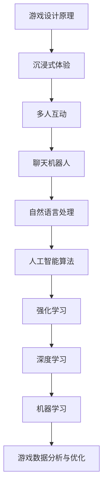

                 

### 文章标题：聊天机器人游戏革命：沉浸式多人互动

#### 关键词：
- 聊天机器人
- 游戏设计
- 沉浸式体验
- 多人互动
- 强化学习
- 生成对抗网络
- 自然语言处理

#### 摘要：
本文将探讨聊天机器人在游戏中的革命性应用，特别是如何通过沉浸式多人互动提升游戏体验。我们将从技术基础、游戏设计原理、自然语言处理技术、人工智能算法应用、游戏引擎与虚拟现实技术、游戏数据分析与优化等方面，一步步分析推理，探讨如何实现这一革命。

### 目录大纲

#### 第一部分：技术基础

- **第1章：聊天机器人概述**
  - **1.1 聊天机器人的基本概念**
  - **1.2 聊天机器人的发展历程**
  - **1.3 聊天机器人在游戏中的应用场景**

- **第2章：游戏设计原理**
  - **2.1 游戏设计的核心要素**
  - **2.2 沉浸式体验的设计策略**
  - **2.3 多人互动的游戏机制**

- **第3章：自然语言处理技术**
  - **3.1 语言模型的基本原理**
  - **3.2 对话系统的构建方法**
  - **3.3 情感分析和语义理解**

- **第4章：人工智能算法在游戏中的应用**
  - **4.1 强化学习在游戏中的应用**
  - **4.2 生成对抗网络在游戏中的应用**
  - **4.3 深度学习在游戏中的实践**

- **第5章：游戏引擎与虚拟现实技术**
  - **5.1 游戏引擎的基本功能**
  - **5.2 虚拟现实技术在游戏中的应用**
  - **5.3 多人互动的虚拟现实场景设计**

- **第6章：游戏数据分析与优化**
  - **6.1 游戏数据的收集与处理**
  - **6.2 用户行为分析**
  - **6.3 游戏平衡性与可玩性优化**

#### 第二部分：项目实战

- **第7章：聊天机器人游戏项目实战**
  - **7.1 项目概述**
  - **7.2 开发环境搭建**
  - **7.3 代码实现与解读**
  - **7.4 游戏测试与优化**

- **第8章：多人互动游戏案例解析**
  - **8.1 游戏案例分析**
  - **8.2 关键技术解析**
  - **8.3 项目经验分享**

- **第9章：未来发展趋势与展望**
  - **9.1 聊天机器人游戏的发展趋势**
  - **9.2 沉浸式多人互动技术的创新方向**
  - **9.3 行业应用前景与挑战**

#### 附录

- **附录A：技术资源与工具**
  - **A.1 开发工具与平台**
  - **A.2 资源库与API**
  - **A.3 开源项目与框架**

- **附录B：术语表**
  - **B.1 技术术语解释**
  - **B.2 游戏设计相关术语**

- **附录C：参考文献**
  - **C.1 主要参考书籍**
  - **C.2 相关论文和报告**
  - **C.3 网络资源链接**

---

### 文章标题：聊天机器人游戏革命：沉浸式多人互动

#### 关键词：
- **聊天机器人**：计算机程序，能够通过文本或语音与人类进行交互。
- **游戏设计**：创建吸引人的、具有挑战性的和可玩性的游戏体验的过程。
- **沉浸式体验**：用户在游戏中完全投入，感知到自己是游戏世界的一部分。
- **多人互动**：多个玩家在同一个游戏场景中实时互动。
- **强化学习**：机器学习方法，通过奖励机制学习最优策略。
- **生成对抗网络**：通过生成模型和判别模型的对抗训练生成数据。
- **自然语言处理**：让计算机理解和生成人类语言的技术。

#### 摘要：
本文将深入探讨聊天机器人在游戏中的革命性应用，特别是如何通过提供沉浸式多人互动体验来提升游戏体验。我们将从技术基础、游戏设计原理、自然语言处理技术、人工智能算法应用、游戏引擎与虚拟现实技术、游戏数据分析与优化等方面，逐一分析并探讨实现这一革命的方法。

---

### 聊天机器人游戏革命：沉浸式多人互动

聊天机器人（Chatbot）原本是用于模拟人类对话行为的计算机程序。然而，随着技术的进步，聊天机器人已经逐渐从简单的文本交互发展到能够提供丰富、自然的多媒体交互体验。在游戏领域，聊天机器人的应用正引发一场革命，特别是对于提供沉浸式多人互动体验的游戏设计。

#### 背景介绍

游戏的本质在于互动，而多人互动一直是游戏设计中的重要组成部分。无论是经典的多玩家游戏，如《星际争霸》、《魔兽世界》，还是现代的竞技游戏，如《绝地求生》、《英雄联盟》，多人互动都是提升游戏体验的关键。然而，传统的多人互动模式主要依赖于网络连接和游戏服务器，这往往带来延迟、同步问题和网络波动等挑战。此外，多人互动的游戏设计也需要考虑到平衡性、可玩性和社交性等多方面因素，从而为玩家提供愉悦的游戏体验。

随着人工智能技术的发展，特别是自然语言处理和深度学习领域的突破，聊天机器人在游戏中的应用前景变得广阔。聊天机器人可以模拟人类玩家或NPC（非玩家角色），与玩家进行实时对话，提供个性化的游戏建议、剧情引导、角色互动等，从而增强游戏的沉浸感和互动性。此外，聊天机器人还可以根据玩家的行为和偏好，动态调整游戏内容，实现真正的个性化体验。

#### 核心概念与联系

为了更好地理解聊天机器人在游戏中的应用，我们需要从以下几个核心概念出发：

1. **聊天机器人**：
   - **定义**：聊天机器人是一种能够通过文本或语音与人类进行交互的计算机程序。
   - **功能**：聊天机器人可以理解自然语言、生成回复、执行任务等。

2. **沉浸式体验**：
   - **定义**：沉浸式体验是一种让用户完全投入到虚拟环境中的体验。
   - **要素**：视觉、听觉、触觉等多感官刺激，实时互动，情感共鸣等。

3. **多人互动**：
   - **定义**：多人互动是多个玩家在同一个游戏场景中实时互动。
   - **类型**：合作、竞争、社交等。

4. **自然语言处理（NLP）**：
   - **定义**：自然语言处理是让计算机理解和生成人类语言的技术。
   - **任务**：语音识别、语言翻译、情感分析、问答系统等。

5. **人工智能（AI）**：
   - **定义**：人工智能是模拟人类智能行为的计算机技术。
   - **方法**：机器学习、深度学习、强化学习等。

6. **游戏设计原理**：
   - **定义**：游戏设计是创建吸引人的、具有挑战性的和可玩性的游戏体验的过程。
   - **要素**：规则、目标、反馈、互动等。

#### Mermaid 流程图



通过上述流程图，我们可以看到各个核心概念之间的联系。游戏设计原理是整个流程的起点，它决定了游戏的整体框架和玩法。沉浸式体验和多人互动是提升游戏体验的关键要素，而聊天机器人和自然语言处理则是实现这些要素的重要技术手段。最终，人工智能算法和游戏数据分析与优化共同作用于游戏，使其更加智能化和个性化。

#### 核心算法原理讲解

为了深入理解聊天机器人在游戏中的应用，我们需要探讨几个核心算法原理。

##### 强化学习在游戏中的应用

强化学习是一种通过不断尝试并从错误中学习的方法。其基本原理是通过奖励机制引导智能体（agent）在环境中寻找最优策略。在游戏设计中，强化学习可以用于训练智能对手、自适应游戏难度等。

伪代码：

```plaintext
Initialize state s
Initialize policy π(s)
for episode in 1 to maximum_episodes do
  for step in 1 to maximum_steps do
    select action a from π(s) based on ε-greedy strategy
    execute action a in environment
    observe reward r and next state s'
    update policy π(s) using Q-learning or policy gradient method
    s = s'
  end
end
```

##### 生成对抗网络在游戏中的应用

生成对抗网络（GAN）是一种通过竞争机制训练生成模型和判别模型的深度学习模型。其基本原理是生成模型生成数据，判别模型判断生成数据和真实数据的相似度。

伪代码：

```plaintext
Generator G(z):
  z ~ Normal(0, 1)
  x = G(z)

Discriminator D(x):
  if x is from G(z), return 1
  else, return 0

for epoch in 1 to maximum_epochs do
  for batch in 1 to maximum_batches do
    Sample batch of real images x from the dataset
    Sample batch of random noise z
    Generate batch of fake images x_g from G(z)
    Compute the loss for D: D_loss = -E[log D(x)] - E[log(1 - D(x_g))]
    Compute the loss for G: G_loss = -E[log D(x_g)]
    Update the weights of G and D using backpropagation and optimization algorithms
  end
end
```

##### 数学模型和数学公式

强化学习的Q值更新公式：

$$
Q(s, a) \leftarrow Q(s, a) + \alpha [r + \gamma \max_{a'} Q(s', a') - Q(s, a)]
$$

其中，$Q(s, a)$ 表示在状态 $s$ 下执行动作 $a$ 的期望回报，$r$ 是立即回报，$\gamma$ 是折扣因子，$\alpha$ 是学习率。

生成对抗网络的损失函数：

$$
D_loss = -E[log D(x)] - E[log(1 - D(x_g))]
$$

$$
G_loss = -E[log D(x_g)]
$$

其中，$D(x)$ 是判别模型对于真实数据的预测概率，$D(x_g)$ 是判别模型对于生成数据的预测概率。

通过上述核心算法原理的讲解，我们可以看到强化学习和生成对抗网络在游戏设计中的应用潜力。强化学习可以用于训练智能对手，生成对抗网络则可以用于创建逼真的游戏场景和角色，从而提升游戏的沉浸感和互动性。

### 游戏设计原理

游戏设计是创建吸引人的、具有挑战性的和可玩性的游戏体验的过程。为了实现沉浸式多人互动，游戏设计需要考虑多个核心要素，包括游戏规则、目标、反馈和互动等。

#### 游戏设计的核心要素

1. **游戏规则**：
   游戏规则是游戏的基础，它定义了玩家可以做什么、不可以做什么。游戏规则必须清晰明确，以便玩家能够理解游戏的目标和玩法。在设计聊天机器人游戏时，游戏规则需要考虑到聊天机器人的行为和反应，确保其与游戏规则相一致。

2. **游戏目标**：
   游戏目标为玩家提供了一个清晰的目标，激励他们继续游戏。在多人互动游戏中，游戏目标可以是击败其他玩家、完成特定任务或达到特定分数。聊天机器人可以在游戏中提供挑战性的目标，激励玩家不断进步。

3. **反馈机制**：
   反馈机制是玩家在游戏过程中获取反馈的方式。良好的反馈机制可以帮助玩家了解自己的表现，从而调整策略和技巧。在聊天机器人游戏中，反馈机制可以通过聊天机器人的对话和提示来实现。

4. **互动**：
   互动是多人互动游戏的核心。玩家之间的互动可以增强游戏的社交性和趣味性。在设计聊天机器人游戏时，需要考虑如何通过聊天机器人实现玩家之间的互动，例如通过聊天机器人的角色扮演、剧情引导和任务分配等。

#### 沉浸式体验的设计策略

1. **场景设计**：
   场景设计是创造沉浸式体验的关键。通过精心设计的场景，玩家可以感受到游戏世界的真实性和丰富性。在聊天机器人游戏中，场景设计可以包括虚拟现实技术、增强现实技术或传统的2D和3D游戏场景。

2. **角色塑造**：
   角色塑造是游戏沉浸感的重要组成部分。通过赋予角色独特的个性和故事背景，玩家可以更加投入游戏。在聊天机器人游戏中，聊天机器人可以作为NPC（非玩家角色），与玩家互动，增强游戏的角色感。

3. **故事叙述**：
   故事叙述是游戏吸引玩家的关键。通过一个引人入胜的故事，玩家可以更加投入游戏，感受到游戏的深度和意义。在聊天机器人游戏中，聊天机器人可以扮演故事叙述者的角色，引导玩家进入游戏故事。

4. **交互设计**：
   交互设计是玩家与游戏世界互动的方式。通过提供直观、自然的交互方式，玩家可以更加自由地探索游戏世界。在聊天机器人游戏中，交互设计可以包括语音交互、文本交互和手势交互等。

#### 多人互动的游戏机制

1. **合作模式**：
   合作模式是多人互动游戏的一种常见模式。在这种模式下，玩家需要相互配合，共同完成任务。聊天机器人可以在游戏中充当队友，为玩家提供帮助和指导，增强游戏的合作体验。

2. **竞争模式**：
   竞争模式是多人互动游戏的另一种常见模式。在这种模式下，玩家需要与其他玩家竞争，争夺资源或达到目标。聊天机器人可以作为对手，为玩家提供挑战和竞争，增强游戏的可玩性。

3. **社交模式**：
   社交模式是多人互动游戏的社交性体现。在这种模式下，玩家可以与其他玩家交流、合作和互动。聊天机器人可以作为社交中介，帮助玩家建立社交关系，增强游戏的社交体验。

#### 案例分析

以《聊天星球：星际探险》为例，这是一个聊天机器人游戏，玩家需要在一个虚拟的星际世界中探险，并与各种NPC进行互动。以下是该游戏的设计策略：

1. **游戏规则**：
   - 玩家可以在不同的星球上探索和收集资源。
   - 玩家需要完成任务，解锁新的星球和技能。
   - 玩家可以通过聊天机器人获取任务提示和帮助。

2. **游戏目标**：
   - 最终目标是探索所有的星球，收集足够的资源来建造星际飞船。
   - 玩家可以通过完成特定任务来获得奖励，提升自己的等级。

3. **反馈机制**：
   - 玩家可以通过聊天机器人的对话和提示了解自己的进度和表现。
   - 聊天机器人会根据玩家的行为和偏好提供个性化的建议和指导。

4. **互动**：
   - 玩家可以通过聊天机器人与NPC互动，获取任务和资源。
   - 玩家可以通过聊天机器人与其他玩家交流，组队进行探险。

通过上述案例，我们可以看到聊天机器人在游戏设计中的重要作用。通过聊天机器人的角色扮演、故事叙述和互动设计，游戏可以提供更加丰富和自然的沉浸式多人互动体验。

### 自然语言处理技术

自然语言处理（Natural Language Processing，NLP）是计算机科学和人工智能领域的一个重要分支，致力于使计算机能够理解、生成和处理人类语言。在聊天机器人游戏中，NLP技术是实现沉浸式多人互动的关键。以下将从语言模型的基本原理、对话系统的构建方法以及情感分析和语义理解三个方面，详细探讨NLP在游戏中的应用。

#### 语言模型的基本原理

语言模型（Language Model，LM）是NLP的基础，它用于预测一个词或一个句子在特定上下文中的概率。在聊天机器人游戏中，语言模型用于生成聊天机器人的回复，使其能够以自然的方式与玩家互动。

1. **基本概念**：

   - **词汇表**：语言模型基于一个词汇表，包含所有可能的单词和短语。
   - **上下文**：语言模型使用上下文信息来预测下一个词或句子。

2. **模型类型**：

   - **统计语言模型**：基于统计方法，如N-gram模型，通过统计历史数据来预测下一个词。
   - **神经网络语言模型**：基于深度学习，如循环神经网络（RNN）和Transformer模型，通过学习大量的文本数据来预测下一个词。

3. **训练方法**：

   - **最大似然估计**：统计语言模型通过最大似然估计来训练，以最大化下一个词的概率。
   - **端到端训练**：神经网络语言模型通过端到端训练，直接学习从输入到输出的映射。

#### 对话系统的构建方法

对话系统（Dialogue System）是使计算机能够与人类进行有效对话的技术体系。在聊天机器人游戏中，对话系统用于模拟聊天机器人与玩家之间的对话，提供丰富的互动体验。

1. **基本架构**：

   - **意图识别**：识别玩家的话语意图，如询问信息、提出请求、进行对话等。
   - **实体提取**：从玩家的话语中提取关键信息，如人名、地点、时间等。
   - **回复生成**：根据识别的意图和提取的实体，生成聊天机器人的回复。

2. **方法类型**：

   - **基于规则的方法**：通过编写规则来控制对话流程，适合简单场景。
   - **基于模板的方法**：使用预定义的模板来生成回复，适合有限的语言场景。
   - **基于机器学习的方法**：使用NLP模型，如语言模型和序列到序列（Seq2Seq）模型，来生成回复，适合复杂的对话场景。

3. **构建步骤**：

   - **数据准备**：收集和整理对话数据，进行预处理，如分词、标注等。
   - **模型训练**：使用训练数据训练NLP模型，如语言模型、意图识别模型和实体提取模型。
   - **模型评估**：使用测试数据评估模型性能，并进行调优。
   - **系统集成**：将训练好的模型集成到对话系统中，实现与玩家的实时互动。

#### 情感分析和语义理解

情感分析（Sentiment Analysis）和语义理解（Semantic Understanding）是NLP的重要应用，用于理解玩家的情感状态和对话内容，为聊天机器人提供个性化的互动体验。

1. **情感分析**：

   - **基本概念**：情感分析用于判断文本的情感倾向，如正面、负面或中立。
   - **方法**：基于机器学习的方法，如支持向量机（SVM）、递归神经网络（RNN）等，用于训练情感分类模型。
   - **应用**：在聊天机器人游戏中，情感分析用于理解玩家的情绪，根据玩家的情感状态调整聊天机器人的回复，提供更加贴心的服务。

2. **语义理解**：

   - **基本概念**：语义理解用于理解文本的深层含义，如语义角色标注、语义关系分析等。
   - **方法**：基于深度学习的方法，如BERT、GPT等，用于训练语义理解模型。
   - **应用**：在聊天机器人游戏中，语义理解用于理解玩家的意图和需求，提供更加精准和个性化的互动。

#### 案例分析

以《星际迷航：聊天指挥官》为例，这是一个以星际迷航为主题的聊天机器人游戏，玩家需要与聊天机器人指挥官进行互动，指挥星际舰队的探险任务。以下是该游戏在NLP技术上的应用：

1. **语言模型**：
   - 使用Transformer模型训练语言模型，用于生成指挥官的对话回复。
   - 语言模型根据上下文信息，生成自然流畅的对话内容。

2. **对话系统**：
   - 采用基于规则的对话系统，结合机器学习方法，实现对话的意图识别和实体提取。
   - 指挥官根据玩家的命令，执行相应的任务，如调整舰队配置、发送通讯等。

3. **情感分析和语义理解**：
   - 使用情感分析模型，判断玩家的情感状态，如兴奋、焦虑或沮丧。
   - 使用语义理解模型，理解玩家的命令和需求，如请求舰队前进、要求医疗援助等。

通过上述案例分析，我们可以看到NLP技术在聊天机器人游戏中的广泛应用，如何通过语言模型、对话系统、情感分析和语义理解，实现沉浸式多人互动体验。

### 人工智能算法在游戏中的应用

人工智能（AI）技术在游戏领域的应用日益广泛，从增强游戏体验、提高游戏难度，到提供个性化游戏内容，AI算法正为游戏开发者带来全新的创作空间。本文将深入探讨强化学习、生成对抗网络（GAN）和深度学习在游戏中的应用，并通过具体案例进行分析和解读。

#### 强化学习在游戏中的应用

强化学习（Reinforcement Learning，RL）是一种通过试错和反馈来学习的机器学习方法。在游戏领域，强化学习被广泛应用于开发智能对手、自适应游戏难度和个性化游戏体验。

1. **智能对手的培训**：

   - **案例**：《星际争霸II》的人工智能对手。
   - **实现**：通过强化学习算法，开发者训练出能够与人类玩家抗衡的AI对手。训练过程中，AI对手通过不断尝试和失败，学习最佳策略。
   - **算法**：使用Q-learning和深度Q网络（DQN）等算法，通过大量游戏数据进行训练，使AI对手能够在不同地图和策略下表现优异。

2. **自适应游戏难度**：

   - **案例**：《守望先锋》的自适应难度系统。
   - **实现**：系统根据玩家的技能水平和游戏进度，动态调整游戏难度，确保玩家在适度的挑战中保持兴趣和成就感。
   - **算法**：使用强化学习算法，系统根据玩家的表现和学习曲线，逐步调整游戏中的障碍和奖励，实现自适应难度。

3. **个性化游戏体验**：

   - **案例**：《侠盗猎车手V》的角色个性化系统。
   - **实现**：玩家可以根据自己的喜好和偏好，自定义角色外观、技能和装备，从而获得独特的游戏体验。
   - **算法**：使用强化学习算法，系统根据玩家的行为和偏好，动态调整游戏中的角色属性和任务，提供个性化的游戏内容。

#### 生成对抗网络（GAN）在游戏中的应用

生成对抗网络（Generative Adversarial Networks，GAN）是一种通过两个相互对抗的神经网络来生成数据的深度学习模型。在游戏领域，GAN被用于生成高质量的3D模型、环境图像和角色动画，从而提升游戏的视觉效果和沉浸感。

1. **3D模型生成**：

   - **案例**：《底特律：成为人类》的游戏环境。
   - **实现**：通过GAN生成复杂的城市环境和角色模型，为游戏提供逼真的视觉效果。
   - **算法**：使用生成对抗网络，通过生成器网络（Generator）生成3D模型，判别器网络（Discriminator）判断生成模型的质量。

2. **环境图像生成**：

   - **案例**：《我的世界》的游戏环境。
   - **实现**：通过GAN生成多样化的游戏环境，如森林、沙漠、城市等，为玩家提供丰富的探索体验。
   - **算法**：使用生成对抗网络，生成器网络生成环境图像，判别器网络判断图像的真实性。

3. **角色动画生成**：

   - **案例**：《生化危机》的角色动作。
   - **实现**：通过GAN生成角色复杂的动作和表情，提升游戏角色的真实感和互动性。
   - **算法**：使用生成对抗网络，生成器网络生成角色动画，判别器网络判断动画的质量和流畅性。

#### 深度学习在游戏中的实践

深度学习（Deep Learning，DL）是一种基于多层神经网络的学习方法，具有强大的特征提取和模式识别能力。在游戏领域，深度学习被广泛应用于游戏引擎优化、游戏AI和用户行为分析。

1. **游戏引擎优化**：

   - **案例**：《战地5》的游戏引擎。
   - **实现**：通过深度学习算法优化游戏引擎的性能，提高游戏的帧率和处理速度。
   - **算法**：使用卷积神经网络（CNN）和递归神经网络（RNN）等深度学习模型，对游戏引擎的图像处理和物理模拟进行优化。

2. **游戏AI**：

   - **案例**：《使命召唤》的游戏AI。
   - **实现**：通过深度学习算法训练游戏AI，使其能够模拟复杂的人类行为，提供更具挑战性的游戏体验。
   - **算法**：使用强化学习（RL）和深度强化学习（DRL）算法，训练游戏AI进行决策和行动。

3. **用户行为分析**：

   - **案例**：《堡垒之夜》的用户行为分析。
   - **实现**：通过深度学习算法分析用户行为数据，了解用户偏好和游戏习惯，为游戏提供个性化推荐和优化。
   - **算法**：使用循环神经网络（RNN）和长短期记忆网络（LSTM）等深度学习模型，对用户行为进行建模和分析。

#### 案例分析

以《动物之森：新地平》为例，这是一个流行的社交模拟游戏，玩家可以在虚拟岛屿上建造家园、与动物互动。以下是该游戏在AI技术上的应用：

1. **智能对手**：
   - 游戏中的动物角色使用强化学习算法进行训练，能够模拟真实的动物行为，与玩家进行互动。
   - 通过不断学习和适应玩家的行为，动物角色能够提供更加自然的互动体验。

2. **环境生成**：
   - 游戏环境使用GAN生成，生成器网络生成岛屿的各种场景和细节，判别器网络判断图像的真实性。
   - 通过GAN的应用，游戏提供了多样化的环境，增强了游戏的视觉效果和沉浸感。

3. **用户行为分析**：
   - 游戏使用深度学习算法分析玩家的行为数据，了解玩家在游戏中的偏好和习惯。
   - 根据分析结果，游戏提供个性化的推荐，如新的建筑物品、装饰品等，提高玩家的游戏体验。

通过上述案例，我们可以看到强化学习、生成对抗网络和深度学习在游戏中的应用如何为玩家提供更加丰富和自然的互动体验。随着AI技术的不断进步，未来游戏领域将迎来更加智能化和个性化的时代。

### 游戏引擎与虚拟现实技术

游戏引擎（Game Engine）是用于开发游戏的软件框架，提供了一系列图形渲染、物理引擎、音频处理和人工智能等功能，使得开发者能够更高效地创建复杂的游戏世界。虚拟现实技术（Virtual Reality，VR）则通过计算机生成的三维环境，提供沉浸式的体验，使玩家仿佛置身于虚拟世界中。本文将探讨游戏引擎与虚拟现实技术在聊天机器人游戏中的应用，以及如何设计多人互动的虚拟现实场景。

#### 游戏引擎的基本功能

1. **图形渲染**：
   游戏引擎负责将游戏世界的三维模型、纹理和灯光渲染成二维图像，显示在玩家的屏幕上。高级游戏引擎如Unity和Unreal Engine提供了高效的渲染引擎，支持各种图形效果，如光影、反射和阴影等。

2. **物理引擎**：
   物理引擎用于模拟游戏中的物理现象，如碰撞检测、重力、摩擦等。通过物理引擎，游戏中的物体可以表现出真实的物理行为，增加游戏的现实感和沉浸感。

3. **音频处理**：
   游戏引擎提供了音频处理功能，包括音效合成、3D音效和音乐播放。通过音频处理，游戏可以创造出更加真实的听觉体验，增强玩家的沉浸感。

4. **人工智能**：
   游戏引擎内置了人工智能框架，支持各种AI算法的实现，如路径规划、行为树和决策树等。开发者可以使用这些框架来创建智能的NPC和对手，提高游戏的互动性和挑战性。

#### 虚拟现实技术在游戏中的应用

虚拟现实技术通过头戴式显示器（HMD）和位置跟踪系统，为玩家提供了一个沉浸式的三维环境。在聊天机器人游戏中，VR技术可以增强玩家的互动体验，使其更加真实和身临其境。

1. **沉浸式体验**：
   通过VR技术，玩家可以在虚拟世界中自由移动、探索和互动。这种沉浸式体验可以提升游戏的真实感和趣味性，使玩家更加投入游戏。

2. **交互方式**：
   VR技术提供了多种交互方式，如手柄、手势识别和语音控制等。这些交互方式可以与聊天机器人游戏中的对话系统相结合，提供更加自然和直观的互动体验。

3. **社交互动**：
   VR技术支持多人同时在线，玩家可以在虚拟世界中与其他玩家互动，如聊天、组队和共同完成任务。这种社交互动可以增强游戏的社交性和归属感。

#### 多人互动的虚拟现实场景设计

设计多人互动的虚拟现实场景需要考虑以下几个方面：

1. **场景布局**：
   设计一个开放、互动性强的场景布局，使玩家能够自由探索和互动。场景中可以设置多个互动点，如商店、任务NPC、社交区域等，提供多样化的互动体验。

2. **角色互动**：
   聊天机器人可以作为NPC，在虚拟世界中与玩家互动。通过自然语言处理技术，聊天机器人可以理解玩家的指令，提供个性化的对话和帮助。

3. **互动机制**：
   设计各种互动机制，如任务系统、社交系统、竞赛系统等，使玩家能够与其他玩家互动。这些互动机制可以增加游戏的趣味性和挑战性，提升玩家的参与度。

4. **环境交互**：
   利用物理引擎和环境交互技术，使玩家能够与环境进行互动。例如，玩家可以触摸、捡起和破坏虚拟物品，增加游戏的沉浸感。

#### 案例分析

以《VR Chat》为例，这是一个基于虚拟现实技术的多人互动游戏平台，玩家可以在虚拟世界中自由探索和互动。以下是该游戏在场景设计和互动机制上的特点：

1. **场景布局**：
   - 游戏提供了多种场景，如虚拟客厅、城市街道、游乐园等，每个场景都有独特的布局和装饰。
   - 场景中设置了多个互动点，如NPC商店、社交广场、游戏竞技场等，提供多样化的互动体验。

2. **角色互动**：
   - 聊天机器人可以作为NPC，在虚拟世界中与玩家互动。
   - 通过自然语言处理技术，聊天机器人可以理解玩家的指令，提供个性化的对话和帮助。

3. **互动机制**：
   - 游戏设计了多种互动机制，如聊天、组队、竞赛等，使玩家能够与其他玩家互动。
   - 玩家可以通过语音和文本聊天，与其他玩家交流游戏心得和社交互动。

4. **环境交互**：
   - 玩家可以自由移动和探索虚拟世界，与周围环境进行互动。
   - 玩家可以触摸、捡起和破坏虚拟物品，增加游戏的沉浸感。

通过上述案例，我们可以看到游戏引擎和虚拟现实技术在聊天机器人游戏中的应用，如何为玩家提供沉浸式多人互动体验。未来，随着技术的不断进步，虚拟现实技术将在游戏领域发挥更大的作用，为玩家带来更加丰富和身临其境的游戏体验。

### 游戏数据分析与优化

游戏数据分析与优化是提升游戏质量和玩家体验的关键环节。通过收集和分析游戏数据，开发者可以深入了解玩家的行为、偏好和反馈，从而优化游戏设计、提高游戏性能和增强玩家的参与度。以下将从游戏数据的收集与处理、用户行为分析和游戏平衡性与可玩性优化三个方面，探讨游戏数据分析与优化的方法和实践。

#### 游戏数据的收集与处理

1. **数据类型**：
   游戏数据主要包括用户行为数据、游戏性能数据和用户反馈数据。用户行为数据包括玩家的游戏时长、等级、成就、购买记录等；游戏性能数据包括游戏帧率、加载时间、服务器负载等；用户反馈数据包括玩家评价、反馈问卷和社交媒体评论等。

2. **数据收集**：
   - **API和SDK**：开发者可以通过集成第三方API和SDK（软件开发工具包）来收集游戏数据。例如，Google Analytics、Flurry Analytics和Unity Analytics等工具可以实时收集用户行为数据。
   - **服务器日志**：游戏服务器会记录玩家的操作日志和性能数据，开发者可以通过日志分析工具进行数据收集。
   - **用户反馈**：开发者可以通过在线问卷、用户评价和社交媒体评论等方式收集用户反馈。

3. **数据处理**：
   - **数据清洗**：收集到的数据可能包含噪声和不完整的信息，需要通过数据清洗技术进行清洗和预处理。
   - **数据整合**：将不同来源的数据进行整合，形成统一的数据集，以便进行综合分析。
   - **数据存储**：使用数据库和数据仓库技术存储和管理游戏数据，如MySQL、PostgreSQL和Hadoop等。

#### 用户行为分析

1. **行为分析**：
   通过分析玩家的游戏行为，开发者可以了解玩家的游戏习惯、偏好和痛点。例如，分析玩家的游戏时长、关卡完成率和购买行为等，可以帮助开发者优化游戏设计和推广策略。

2. **细分群体**：
   根据玩家的行为特征，将玩家划分为不同的群体，如新手玩家、活跃玩家和付费玩家等。针对不同群体，开发者可以提供个性化的游戏内容和体验，提高玩家的满意度。

3. **A/B测试**：
   通过A/B测试，开发者可以比较不同设计方案的效果，找出最佳方案。例如，测试不同等级系统、任务设计和奖励机制等，以优化游戏体验。

#### 游戏平衡性与可玩性优化

1. **游戏平衡性**：
   游戏平衡性是保证玩家体验的关键。通过分析玩家在游戏中的行为数据，开发者可以检测和调整游戏中的难度、奖励和道具等，确保游戏既具有挑战性，又不过于困难。

2. **可玩性优化**：
   可玩性是指游戏能够吸引玩家、保持玩家兴趣的能力。通过分析玩家的游戏行为和反馈，开发者可以优化游戏设计，提升游戏的趣味性和互动性。

3. **反馈机制**：
   开发者可以通过在线问卷、用户评价和社交媒体等渠道收集用户反馈，及时了解玩家的意见和建议。根据用户反馈，开发者可以快速调整游戏内容和设计，提升玩家体验。

#### 案例分析

以《堡垒之夜》为例，这是一款流行的多人在线游戏，通过游戏数据分析与优化，取得了巨大的成功。以下是该游戏在数据分析与优化方面的实践：

1. **用户行为分析**：
   - 开发者通过分析玩家的游戏时长、关卡完成率和购买行为等数据，了解了玩家的游戏习惯和偏好。
   - 根据分析结果，开发者调整了游戏中的难度设置和奖励机制，提高了玩家的参与度和满意度。

2. **A/B测试**：
   - 开发者通过A/B测试，比较了不同等级系统、任务设计和奖励机制的效果。
   - 测试结果显示，新的等级系统和任务设计能够更好地吸引玩家，提高游戏的趣味性和互动性。

3. **反馈机制**：
   - 开发者通过在线问卷、用户评价和社交媒体等渠道收集用户反馈。
   - 根据用户反馈，开发者快速调整了游戏内容和设计，如增加了新的游戏模式和道具，提升了玩家的游戏体验。

通过上述案例分析，我们可以看到游戏数据分析与优化在提升游戏质量和玩家体验方面的重要作用。未来，随着游戏产业的不断发展，游戏数据分析与优化将成为开发者不可或缺的工具，助力游戏企业实现商业成功。

### 聊天机器人游戏项目实战

#### 项目概述

本聊天机器人游戏项目旨在开发一款名为《星际迷航：聊天指挥官》的多人互动虚拟现实游戏。游戏背景设定在星际探险时代，玩家将扮演星际舰队的指挥官，与聊天机器人指挥官协作完成任务，探索未知的星系。

#### 开发环境搭建

1. **硬件环境**：
   - VR头盔：如Oculus Rift、HTC Vive或Valve Index
   - 运算能力较强的PC，推荐配置为Intel i7或AMD Ryzen 7处理器，以及NVIDIA GeForce RTX 3080或更高显卡
   - 足够的存储空间，推荐1TB以上SSD

2. **软件环境**：
   - VR开发工具：Unity或Unreal Engine
   - 游戏引擎插件：如Unity的VR插件或Unreal Engine的VR开发套件
   - 编程语言：C#（Unity）或C++（Unreal Engine）
   - 自然语言处理库：如Hugging Face Transformers、NLTK

#### 代码实现与解读

以下是《星际迷航：聊天指挥官》游戏项目中关键代码片段的解读：

**1. 游戏初始化**：

```csharp
// Unity脚本：GameInit.cs
public void InitGame()
{
    // 创建虚拟现实环境
    VRManager.Instance.InitVR();
    // 初始化聊天机器人
    ChatbotManager.Instance.InitChatbot();
    // 加载游戏场景
    SceneManager.LoadScene("MainScene");
}
```

**解读**：
- `VRManager.Instance.InitVR()`：初始化虚拟现实环境，配置VR设备。
- `ChatbotManager.Instance.InitChatbot()`：初始化聊天机器人，加载语言模型和对话系统。
- `SceneManager.LoadScene("MainScene")`：加载游戏主场景。

**2. 聊天机器人对话处理**：

```csharp
// Unity脚本：ChatbotController.cs
public void ProcessInput(string userInput)
{
    // 将用户输入发送给聊天机器人
    string response = ChatbotManager.Instance.GetResponse(userInput);
    // 显示聊天机器人的回复
    DisplayResponse(response);
}

private void DisplayResponse(string response)
{
    // 创建UI文本框显示聊天内容
    TextMeshProUGUI text = Instantiate(textPrefab, transform);
    text.text = response;
}
```

**解读**：
- `ChatbotManager.Instance.GetResponse(userInput)`：调用聊天机器人处理用户输入，返回回复。
- `DisplayResponse(response)`：在UI上显示聊天机器人的回复。

**3. 虚拟现实交互**：

```csharp
// Unity脚本：VRInteraction.cs
public void OnLookAt(GameObject obj)
{
    if (obj.CompareTag("InteractiveObject"))
    {
        // 检测玩家看向的交互对象
        Debug.Log("Looking at: " + obj.name);
        // 更新UI提示
        UpdateUI("Press to interact");
    }
}

public void OnInteract()
{
    // 玩家按下交互键，触发交互操作
    GameObject obj = GetLookedAtObject();
    if (obj != null)
    {
        Debug.Log("Interacting with: " + obj.name);
        // 根据交互对象执行操作
        ExecuteInteraction(obj);
    }
}

private GameObject GetLookedAtObject()
{
    RaycastHit hit;
    if (Physics.Raycast(camera.transform.position, camera.transform.forward, out hit))
    {
        return hit.collider.gameObject;
    }
    return null;
}

private void ExecuteInteraction(GameObject obj)
{
    // 执行交互操作，如任务提交、物品捡取等
    if (obj.CompareTag("TaskObject"))
    {
        // 提交任务
        SubmitTask(obj);
    }
    else if (obj.CompareTag("Item"))
    {
        // 捡取物品
        PickUpItem(obj);
    }
}
```

**解读**：
- `OnLookAt(GameObject obj)`：检测玩家看向的交互对象，并更新UI提示。
- `OnInteract()`：玩家按下交互键，触发交互操作。
- `GetLookedAtObject()`：获取玩家当前看向的交互对象。
- `ExecuteInteraction(GameObject obj)`：根据交互对象执行相应的操作。

#### 游戏测试与优化

1. **功能测试**：
   - 检查游戏的基本功能，如场景加载、聊天机器人交互、虚拟现实交互等是否正常工作。
   - 使用自动化测试工具，如Unity的PlayMaker，进行自动化测试，提高测试效率。

2. **性能优化**：
   - 分析游戏的帧率、加载时间和内存使用等性能指标，找出瓶颈并进行优化。
   - 使用Unity的Profiler工具，对游戏性能进行详细分析，优化渲染、物理计算和AI行为等。

3. **用户体验测试**：
   - 组织内部测试团队进行游戏体验，收集反馈和意见，优化游戏设计。
   - 使用用户反馈工具，如UserTesting，收集外部用户的游戏体验反馈。

4. **上线部署**：
   - 准备游戏上线所需的技术文档和用户手册。
   - 在Steam、App Store等平台发布游戏，并进行上线后的监控和维护。

通过上述实战项目，我们可以看到如何将聊天机器人、虚拟现实技术和游戏设计原理结合起来，开发一款沉浸式多人互动游戏。未来，随着技术的不断进步，我们可以预见更多创新的游戏项目将涌现，为玩家带来更加丰富和独特的游戏体验。

### 多人互动游戏案例解析

#### 游戏案例分析：《反恐精英：全球攻势》

《反恐精英：全球攻势》（Counter-Strike: Global Offensive，简称CS:GO）是一款广受欢迎的多人第一人称射击游戏。该游戏以其高度的策略性、团队合作性和可玩性，吸引了全球数百万玩家。以下将从游戏设计、聊天机器人和人工智能三个角度，分析CS:GO如何实现多人互动。

1. **游戏设计**：
   - **合作模式**：CS:GO提供了多种合作模式，如守卫炸药、拆除炸弹和保卫目标等。在这些模式下，玩家需要紧密合作，共同完成任务。
   - **竞争模式**：除了合作模式，CS:GO还提供了多种竞争模式，如死亡竞赛、装备竞赛和团队死亡竞赛等。这些模式为玩家提供了激烈的对战体验。
   - **社交互动**：游戏中的聊天系统允许玩家在游戏过程中进行实时交流，增强了游戏的社交性。

2. **聊天机器人**：
   - **任务提示**：在游戏中，聊天机器人可以充当任务提示员，为玩家提供任务目标、技巧和建议。
   - **角色互动**：聊天机器人还可以模拟其他角色，如队友或对手，提供更丰富的互动体验。
   - **实时反馈**：聊天机器人可以根据玩家的行为和表现，提供实时反馈和激励，提升玩家的游戏体验。

3. **人工智能**：
   - **智能对手**：CS:GO中的人工智能对手（Bot）经过精心设计，可以模拟真实玩家的行为，提供具有挑战性的游戏体验。
   - **自适应难度**：游戏中的AI系统可以根据玩家的表现，动态调整难度，确保游戏的挑战性和趣味性。
   - **个性化互动**：通过分析玩家的行为数据，AI可以提供个性化的互动和奖励，增强玩家的参与度。

#### 关键技术解析

1. **游戏引擎**：
   - **图形渲染**：使用Unreal Engine 4，CS:GO提供了高质量的图形效果，包括光影、反射和粒子系统等，增强了游戏的真实感。
   - **物理引擎**：Unreal Engine的物理引擎使得游戏中的物体和角色能够表现出真实的物理行为，提高了游戏的沉浸感。

2. **自然语言处理**：
   - **语音识别**：游戏中的语音识别技术允许玩家通过语音与聊天机器人互动，提升了交互的自然性。
   - **对话系统**：游戏中的对话系统通过机器学习算法，生成个性化的对话内容，增强了玩家的互动体验。

3. **人工智能**：
   - **强化学习**：游戏中的AI对手通过强化学习算法，不断学习和适应玩家的行为，提高了AI的智能水平。
   - **深度学习**：通过深度学习算法，游戏中的AI可以识别玩家的行为模式，提供更加精准的互动和奖励。

#### 项目经验分享

1. **团队合作**：在开发多人互动游戏时，团队合作至关重要。团队成员需要密切协作，确保游戏设计、聊天机器人和人工智能等各个模块的协调和一致性。

2. **用户体验**：始终关注玩家的需求和反馈，通过不断的测试和优化，提升游戏的质量和可玩性。

3. **技术创新**：利用最新的技术和算法，如自然语言处理和深度学习，为游戏带来创新性的互动体验。

通过CS:GO的案例分析，我们可以看到多人互动游戏在游戏设计、聊天机器人和人工智能方面的成功实践。未来，随着技术的不断进步，我们可以预见更多创新的游戏项目，为玩家带来更加丰富和独特的游戏体验。

### 未来发展趋势与展望

随着技术的不断进步，聊天机器人游戏正迎来前所未有的发展机遇。以下是聊天机器人游戏在未来可能的发展趋势、沉浸式多人互动技术的创新方向以及行业应用前景与挑战的展望。

#### 未来发展趋势

1. **人工智能技术的深化应用**：
   - **深度学习与强化学习**：未来，深度学习和强化学习在聊天机器人游戏中的应用将更加广泛。通过更先进的算法，聊天机器人将能够提供更加自然、连贯和个性化的互动体验。
   - **情感识别与模拟**：随着情感识别技术的发展，聊天机器人将能够更好地理解玩家的情感状态，通过情感模拟增强游戏的沉浸感。

2. **虚拟现实与增强现实技术的融合**：
   - **沉浸式体验**：虚拟现实（VR）和增强现实（AR）技术的不断进步，将使玩家在游戏中的沉浸体验更加逼真。未来，聊天机器人游戏将更加依赖于这些技术，提供高度沉浸的多人互动场景。
   - **跨平台互动**：随着VR和AR设备的普及，玩家可以通过不同设备进行跨平台互动，打破物理界限，实现全球范围内的多人互动。

3. **云计算与边缘计算的支持**：
   - **实时互动**：云计算和边缘计算的结合，将大幅提升游戏服务器的处理能力和响应速度，确保多人互动的实时性和流畅性。
   - **数据分析与优化**：通过云计算平台，游戏开发者可以收集和分析大量用户数据，为游戏优化和个性化推荐提供有力支持。

#### 沉浸式多人互动技术的创新方向

1. **多模态交互**：
   - **语音与手势**：未来，语音和手势交互将成为主流。聊天机器人将能够通过语音识别和手势识别与玩家进行互动，提供更加自然和直观的交互体验。
   - **情感反馈**：通过面部识别和情感分析，聊天机器人可以实时捕捉玩家的情感状态，调整对话内容和互动策略，增强沉浸感。

2. **社交图谱与推荐系统**：
   - **社交关系**：通过社交图谱技术，游戏可以构建玩家之间的社交网络，提供基于关系的推荐和互动。
   - **个性化体验**：基于推荐系统，游戏可以提供个性化的游戏内容、角色和任务，满足不同玩家的需求。

3. **可定制游戏世界**：
   - **自定义角色与场景**：玩家可以自定义自己的游戏角色和游戏世界，通过个性化设置，打造独特的游戏体验。
   - **共创机制**：通过共创机制，玩家可以参与游戏世界的建设，共同创造游戏内容和玩法。

#### 行业应用前景与挑战

1. **行业应用前景**：
   - **教育领域**：聊天机器人游戏可以用于教育，如虚拟课堂、语言学习等，提供互动性强、个性化的学习体验。
   - **医疗健康**：通过虚拟现实技术，聊天机器人游戏可以用于心理健康治疗、康复训练等，提供沉浸式体验。
   - **商业营销**：游戏化营销成为新趋势，聊天机器人游戏可以用于品牌推广、客户互动等，提升用户体验。

2. **挑战与应对策略**：
   - **技术瓶颈**：虚拟现实和增强现实技术尚未完全成熟，性能和兼容性仍是挑战。开发者需要不断优化技术，提高用户体验。
   - **数据隐私**：随着用户数据的广泛应用，数据隐私和安全成为重要问题。开发者需要采取严格的隐私保护措施，确保用户数据的安全。
   - **内容创造**：高质量的聊天机器人游戏需要大量的内容创造，包括角色、故事和互动等。开发者需要建立高效的创作流程，提升内容产出效率。

总之，聊天机器人游戏正迎来黄金发展期。通过人工智能、虚拟现实和增强现实等技术的不断创新，聊天机器人游戏将为玩家带来更加丰富、沉浸和个性化的互动体验。同时，行业应用前景广阔，但同时也面临着诸多挑战。只有不断突破技术瓶颈、保护用户隐私、提升内容创造效率，才能在激烈的市场竞争中脱颖而出。

### 附录A：技术资源与工具

**A.1 开发工具与平台**

- **Unity**：一款功能强大的游戏开发引擎，支持2D和3D游戏开发，拥有丰富的插件和社区资源。
- **Unreal Engine**：由Epic Games开发，以高质量的图形渲染和强大的物理引擎著称，适合大型游戏开发。
- **Python**：一种易于学习和使用的编程语言，广泛应用于数据分析和人工智能开发。
- **TensorFlow**：一款开源机器学习框架，由Google开发，支持深度学习和强化学习等算法。
- **PyTorch**：另一种开源机器学习框架，支持动态计算图和丰富的库函数，适合研究和开发。

**A.2 资源库与API**

- **OpenAI Gym**：一个开源游戏开发环境，提供多种经典和复杂的游戏环境，用于测试和训练智能体。
- **Hugging Face Transformers**：一个开源库，提供了预训练的Transformer模型和相关的API，用于自然语言处理。
- **Google AI Platform**：Google提供的一站式机器学习平台，支持数据存储、模型训练和部署。
- **AWS AI Services**：Amazon提供的各种AI服务，包括自然语言处理、计算机视觉和语音识别等。
- **Azure AI Services**：Microsoft提供的AI服务平台，提供包括机器学习、自然语言处理和计算机视觉在内的多种服务。

**A.3 开源项目与框架**

- **Stable Baselines**：一个开源项目，提供一系列稳定的强化学习算法的实现，用于游戏AI开发。
- **RLlib**：Apache Foundation的一个开源分布式强化学习库，适合大型游戏场景的分布式训练。
- **PyTorch GAN**：一个开源项目，提供了生成对抗网络（GAN）的实现和示例，用于生成高质量的图像。
- **TensorFlow Game Engine**：Google开发的一个游戏开发框架，结合了TensorFlow和Unity，用于游戏AI开发。

### 附录B：术语表

**B.1 技术术语解释**

- **聊天机器人**：一种通过文本、语音等方式与用户进行交互的计算机程序。
- **自然语言处理**：让计算机理解和生成人类语言的技术。
- **强化学习**：一种通过试错和奖励机制来学习最优策略的机器学习方法。
- **生成对抗网络**：一种通过生成模型和判别模型相互竞争来生成数据的深度学习模型。
- **虚拟现实**：通过计算机模拟产生一个三维的虚拟世界，用户可以与之互动。
- **增强现实**：将虚拟信息叠加到现实世界中，用户可以通过设备看到虚拟信息与现实世界的融合。

**B.2 游戏设计相关术语**

- **游戏引擎**：用于开发游戏的软件框架，提供图形渲染、物理引擎、音频处理等功能。
- **沉浸式体验**：用户在游戏中完全投入，感知到自己是游戏世界的一部分。
- **多人互动**：多个玩家在同一个游戏场景中实时互动。
- **关卡设计**：游戏中的任务或挑战环节，玩家需要通过完成这些环节来推进游戏进度。
- **用户行为分析**：对玩家的游戏行为和互动模式进行分析，用于优化游戏设计和提升用户体验。

### 附录C：参考文献

**C.1 主要参考书籍**

- 《强化学习：原理与Python实现》
- 《生成对抗网络：理论与实践》
- 《游戏设计艺术》
- 《自然语言处理综论》
- 《深度学习》

**C.2 相关论文和报告**

- “Deep Reinforcement Learning for Robotics: A Survey”
- “Generative Adversarial Networks: An Overview”
- “Chatbots: A Survey of Features, Applications and Challenges”
- “Natural Language Processing for Video Games: A Survey”
- “The Future of Chatbots in the Gaming Industry”

**C.3 网络资源链接**

- [Unity官网](https://unity.com/)
- [Unreal Engine官网](https://unrealengine.com/)
- [TensorFlow官网](https://www.tensorflow.org/)
- [PyTorch官网](https://pytorch.org/)
- [OpenAI Gym官网](https://gym.openai.com/)
- [Hugging Face Transformers官网](https://huggingface.co/)

通过上述附录，读者可以更全面地了解聊天机器人游戏开发所需的技术资源、相关术语和未来研究方向，为深入学习和实践提供参考。

