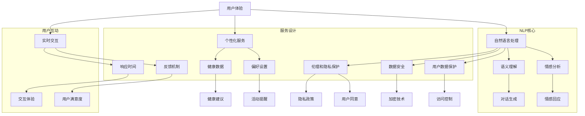

                 

# 《聊天机器人老年护理：虚拟助手和同伴》

关键词：聊天机器人、老年护理、虚拟助手、自然语言处理、机器学习、伦理问题

摘要：随着全球人口老龄化问题的日益严重，老年护理的需求不断增加。聊天机器人作为一种新兴的技术，为老年护理提供了新的解决方案。本文将探讨聊天机器人在老年护理中的应用，从背景、发展、设计原则、算法原理、实际应用以及伦理问题等方面进行详细分析，旨在为老年护理领域提供有益的技术参考。

## 目录

1. **老年护理与聊天机器人的背景**
    1.1 老年人口现状与挑战
    1.2 老年护理的需求和挑战
    1.3 聊天机器人在老年护理中的应用前景
2. **聊天机器人的发展**
    2.1 聊天机器人的定义和分类
    2.2 聊天机器人的核心技术
    2.3 聊天机器人的发展历程
3. **聊天机器人在老年护理中的应用**
    3.1 聊天机器人设计的核心概念与联系
    3.2 核心算法原理讲解
    3.3 数学模型和数学公式详解
    3.4 项目实战
4. **虚拟助手的功能与设计**
    4.1 虚拟助手的定义和分类
    4.2 虚拟助手的核心功能
    4.3 虚拟助手的用户界面设计
5. **同伴关系的建立与维护**
    5.1 同伴关系的概念
    5.2 聊天机器人如何建立同伴关系
    5.3 同伴关系的维护策略
6. **聊天机器人伦理与隐私保护**
    6.1 聊天机器人的伦理问题
    6.2 老年护理中隐私保护的重要性
    6.3 隐私保护策略与实践
7. **未来展望与趋势**
    7.1 聊天机器人在老年护理中的发展趋势
    7.2 老年护理中聊天机器人的未来创新
    7.3 跨学科合作与综合应用前景
8. **附录**
    8.1 聊天机器人开发资源与工具
    8.2 开发资源与资料推荐
    8.3 社区与论坛推荐

## 1. 老年护理与聊天机器人的背景

### 1.1 老年人口现状与挑战

随着全球人口老龄化问题的日益严重，老年护理的需求不断增加。根据世界卫生组织（WHO）的数据，全球60岁及以上人口预计将从2015年的9亿增长到2050年的21亿，占全球总人口的22%。[1]这一现象对社会、医疗、经济等领域都带来了巨大的挑战。

老年人口的增长首先对医疗系统提出了更高的要求。老年人患有慢性病的概率更高，需要更加细致和专业的护理。然而，医疗资源的有限性使得老年护理面临巨大的压力。此外，老年人在日常生活中也面临着孤独、抑郁等心理问题，这些都需要得到有效的关注和解决。

### 1.2 老年护理的需求和挑战

老年护理的需求主要包括医疗护理、日常生活照顾、心理关怀等方面。然而，现有的护理模式往往存在以下挑战：

1. **人力资源不足**：老年护理需要大量的人力资源，包括医护人员、护理员等。然而，随着老年人口的增加，人力资源的供给难以满足需求。

2. **护理成本高昂**：老年护理的成本相对较高，包括医疗费用、护理费用、康复费用等。这给家庭和社会带来了巨大的经济负担。

3. **护理质量难以保证**：由于人力资源的短缺，老年护理的质量难以得到保证。护理员可能无法提供足够的关注和照顾，导致老年人生活质量下降。

4. **心理健康问题**：老年人普遍存在心理健康问题，如孤独、抑郁等。然而，现有的护理模式往往忽视心理健康方面的需求。

### 1.3 聊天机器人在老年护理中的应用前景

聊天机器人作为一种新兴的技术，为老年护理提供了新的解决方案。聊天机器人具有以下优势：

1. **降低护理成本**：聊天机器人可以替代部分护理人员的工作，从而降低护理成本。

2. **提高护理质量**：聊天机器人可以全天候提供护理服务，不会因为疲劳或情绪问题而影响服务质量。

3. **关注心理健康**：聊天机器人可以与老年人进行互动，提供心理关怀和陪伴，有助于减轻老年人的孤独感和抑郁情绪。

4. **个性化护理**：聊天机器人可以根据老年人的需求和偏好提供个性化的护理服务。

总之，聊天机器人在老年护理中具有巨大的应用前景。通过合理的设计和应用，聊天机器人可以成为老年人的虚拟助手和同伴，为他们提供更加周到和人性化的护理服务。

参考文献：

[1] World Health Organization. (2015). Global health estimates: life expectancy and leading causes of death and disability. Retrieved from <https://www.who.int/gho/mortality_burden_disease/en/>

## 2. 聊天机器人的发展

### 2.1 聊天机器人的定义和分类

聊天机器人（Chatbot）是指通过自然语言处理（NLP）技术模拟人类对话的计算机程序。根据功能和应用场景，聊天机器人可以大致分为以下几类：

1. **客服型聊天机器人**：主要用于处理客户咨询、投诉等问题，如客服机器人、在线客服等。

2. **教育型聊天机器人**：用于教育领域的辅助教学，如智能家教、学习助手等。

3. **社交型聊天机器人**：用于社交互动，如聊天交友、情感陪伴等。

4. **医疗型聊天机器人**：用于医疗领域的辅助诊断、健康咨询等。

5. **娱乐型聊天机器人**：用于娱乐互动，如游戏、搞笑问答等。

### 2.2 聊天机器人的核心技术

聊天机器人的核心技术主要包括自然语言处理（NLP）、语音识别（ASR）和文本生成（TTS）等。

1. **自然语言处理（NLP）**：NLP技术用于理解和处理自然语言，包括文本分析、语义理解、情感分析等。其中，词嵌入（Word Embedding）和序列到序列模型（Seq2Seq）是NLP的核心技术。

2. **语音识别（ASR）**：ASR技术用于将语音信号转换为文本，从而实现语音到文本的转换。常用的ASR算法包括隐马尔可夫模型（HMM）、循环神经网络（RNN）和卷积神经网络（CNN）等。

3. **文本生成（TTS）**：TTS技术用于将文本转换为语音，从而实现文本到语音的转换。常用的TTS算法包括循环神经网络（RNN）、生成对抗网络（GAN）和深度学习等。

### 2.3 聊天机器人的发展历程

聊天机器人技术经历了从简单的规则匹配到复杂的机器学习模型的发展过程。

1. **早期阶段（20世纪50年代-70年代）**：聊天机器人主要基于规则匹配和关键词搜索技术，如Eliza等。

2. **第二代聊天机器人（20世纪80年代-90年代）**：引入了自然语言处理技术，如语义分析、上下文理解等，如Joel等。

3. **第三代聊天机器人（21世纪初至今）**：基于机器学习模型，如深度学习、神经网络等，如ChatGPT、Duolingo等。

随着技术的不断进步，聊天机器人的功能和性能也在不断提高，逐渐成为老年护理等领域的有力工具。

## 3. 聊天机器人在老年护理中的应用

### 3.1 聊天机器人设计的核心概念与联系

聊天机器人在老年护理中的应用设计需要关注以下几个核心概念：

1. **用户体验（UX）**：聊天机器人的设计应考虑到老年人的使用习惯和需求，提供简洁、直观的界面。

2. **自然语言处理（NLP）**：NLP技术是实现聊天机器人与老年人有效互动的关键，包括语音识别、语义理解、情感分析等。

3. **个性化服务**：聊天机器人应能够根据老年人的个人喜好、健康状况和护理需求提供个性化的服务。

4. **实时交互**：聊天机器人需要具备实时交互的能力，以便在老年人遇到问题时能够及时提供帮助。

5. **伦理和隐私保护**：在老年护理中，保护老年人的隐私和尊严至关重要。聊天机器人应遵循相关的伦理规范，确保用户数据的安全。

为了更清晰地展示这些概念之间的关系，可以使用以下Mermaid流程图：



### 3.2 核心算法原理讲解

#### 3.2.1 自然语言处理算法

自然语言处理（NLP）是聊天机器人的核心技术之一，主要包括以下几类算法：

1. **语音识别（ASR）**：将语音信号转换为文本。常用的ASR算法包括隐马尔可夫模型（HMM）、循环神经网络（RNN）和卷积神经网络（CNN）等。

2. **词嵌入（Word Embedding）**：将词汇映射为高维向量表示。词嵌入技术有助于提高语义理解的准确性。

3. **序列到序列模型（Seq2Seq）**：用于将一个序列转换为另一个序列。Seq2Seq模型常用于机器翻译和对话生成。

4. **情感分析**：对文本的情感倾向进行分类，如正面、负面或中性。情感分析有助于聊天机器人理解用户的情感状态，提供相应的回应。

#### 3.2.2 伪代码：聊天机器人核心算法的实现

以下是一个简单的伪代码示例，展示了聊天机器人的核心算法实现：

```python
# 语音识别（ASR）
def recognize_speech(speech):
    # 使用ASR算法将语音转换为文本
    text = asr_model(speech)
    return text

# 词嵌入（Word Embedding）
def embed_word(word):
    # 将词汇映射为高维向量
    vector = word_embedding(word)
    return vector

# 序列到序列模型（Seq2Seq）
def generate_response(input_sequence):
    # 使用Seq2Seq模型生成回应
    output_sequence = seq2seq_model(input_sequence)
    response = decode_sequence(output_sequence)
    return response

# 情感分析（Sentiment Analysis）
def analyze_sentiment(text):
    # 对文本的情感倾向进行分类
    sentiment = sentiment_model(text)
    return sentiment

# 聊天机器人核心函数
def chat_with_user(user_input):
    # 语音识别
    text = recognize_speech(user_input)
    
    # 词嵌入
    input_vector = embed_word(text)
    
    # 生成回应
    response = generate_response(input_vector)
    
    # 情感分析
    sentiment = analyze_sentiment(response)
    
    # 返回回应和情感分析结果
    return response, sentiment
```

### 3.3 数学模型和数学公式详解

在聊天机器人中，数学模型和数学公式起着至关重要的作用。以下是一些常用的数学模型和公式：

#### 3.3.1 机器学习基础知识

1. **神经网络与反向传播算法**：神经网络是一种模拟人脑神经元结构的计算模型。反向传播算法用于训练神经网络，通过不断调整权重和偏置来优化模型性能。

2. **支持向量机（SVM）**：SVM是一种用于分类和回归的机器学习算法。它通过寻找一个最佳的超平面来最大化分类间隔。

3. **决策树**：决策树是一种基于树形结构进行分类和回归的算法。它通过递归地将数据集划分成子集，直到满足某个终止条件。

#### 3.3.2 数学公式与举例说明

1. **交叉熵（Cross-Entropy）**：交叉熵是衡量模型预测值与真实值之间差异的一种指标。

   $$ H = -\sum_{i=1}^{n} y_i \log_2 (p_i) $$

   其中，$y_i$是真实标签，$p_i$是模型预测的概率。

2. **反向传播算法**：

   $$ \Delta w = \eta \cdot \frac{\partial L}{\partial w} $$

   其中，$\Delta w$是权重更新，$\eta$是学习率，$L$是损失函数。

3. **支持向量机（SVM）**：

   $$ \mathbf{w}^T \mathbf{x} + b = 1 $$

   其中，$\mathbf{w}$是权重向量，$\mathbf{x}$是特征向量，$b$是偏置。

4. **决策树**：

   $$ y = \sum_{i=1}^{n} w_i x_i + b $$

   其中，$y$是输出值，$w_i$是权重，$x_i$是特征值，$b$是偏置。

通过这些数学模型和公式，聊天机器人能够更好地理解和回应老年人的需求。

### 3.4 项目实战

#### 3.4.1 搭建聊天机器人开发环境

搭建聊天机器人开发环境通常需要以下步骤：

1. **安装Python环境**：Python是一种广泛应用于聊天机器人开发的编程语言。首先需要安装Python环境。

2. **安装NLP库**：常用的NLP库包括NLTK、spaCy、TensorFlow等。这些库提供了丰富的NLP工具和算法。

3. **安装聊天机器人框架**：如ChatterBot、Rasa等。这些框架提供了聊天机器人开发所需的组件和工具。

4. **配置开发环境**：根据具体需求配置开发环境，如安装必要的依赖库、配置开发工具等。

#### 3.4.2 实现聊天机器人功能

以下是一个简单的聊天机器人实现示例：

```python
from chatterbot import ChatBot
from chatterbot.trainers import ChatterBotCorpusTrainer

# 创建聊天机器人
chatbot = ChatBot(
    '老年护理助手',
    storage_adapter='chatterbot.storage.SQLStorageAdapter',
    database_uri='sqlite:///database.sqlite3'
)

# 训练聊天机器人
trainer = ChatterBotCorpusTrainer(chatbot)
trainer.train(
    'chatterbot.corpus.中文'
)

# 开始聊天
while True:
    try:
        user_input = input('用户：')
        bot_response = chatbot.get_response(user_input)
        print('机器人：', bot_response)
    except (KeyboardInterrupt, EOFError, SystemExit):
        break
```

#### 3.4.3 代码解读与分析

以上代码首先导入了必要的库和模块，然后创建了一个名为“老年护理助手”的聊天机器人。通过使用ChatterBot框架，聊天机器人可以从预训练的语料库中学习，并能够根据用户的输入生成相应的回应。

#### 3.4.4 实际案例分析和详细讲解剖析

在实际应用中，聊天机器人可以根据老年人的具体需求进行定制化开发。例如，可以为老年人提供健康咨询、生活提醒、情感陪伴等功能。以下是一个实际案例：

**案例**：为一位患有高血压的老年人提供健康咨询。

**用户输入**：我最近感觉头疼，可能是高血压犯了。

**机器人回应**：
```
机器人：您好，我是您的健康助手。头疼可能与高血压有关。请问您最近有没有按时服药？另外，您最近有没有注意饮食和休息？

用户：最近有点忙，没有按时服药，饮食也不太注意。

机器人：您好，我了解您的情况。高血压需要长期坚持服药和健康饮食。建议您及时就医，并按照医生的建议调整治疗方案。另外，我为您推荐一些有助于控制高血压的饮食建议，您可以在日常生活中多加注意。

用户：谢谢您的建议，我最近会多注意饮食。

机器人：不客气，希望我的建议对您有帮助。如果您有任何其他问题，随时可以向我咨询。
```

#### 3.4.5 项目小结

通过以上实战案例，我们可以看到聊天机器人在老年护理中的应用前景。通过合理的开发和应用，聊天机器人可以成为老年人的健康顾问、生活助手和情感陪伴，为他们提供全方位的护理服务。

## 4. 虚拟助手的功能与设计

### 4.1 虚拟助手的定义和分类

虚拟助手（Virtual Assistant）是一种模拟人类行为的计算机程序，旨在为用户提供便捷、高效的服务。在老年护理领域，虚拟助手具有重要的作用，可以为老年人提供生活辅助、健康咨询、情感关怀等多种服务。

根据功能和应用场景，虚拟助手可以大致分为以下几类：

1. **生活辅助型虚拟助手**：帮助老年人处理日常生活中的琐事，如购物、预约、家务等。

2. **健康咨询型虚拟助手**：为老年人提供健康咨询、疾病预防、药物提醒等服务。

3. **情感陪伴型虚拟助手**：通过聊天、互动等方式，为老年人提供情感支持和陪伴。

4. **紧急响应型虚拟助手**：在老年人遇到紧急情况时，提供及时的帮助和报警功能。

### 4.2 虚拟助手的核心功能

虚拟助手的核心功能包括以下几个方面：

1. **语音识别与自然语言处理**：虚拟助手需要具备语音识别功能，将老年人的语音输入转换为文本。同时，通过自然语言处理技术，理解老年人的需求并生成相应的回应。

2. **智能对话系统**：虚拟助手应具备智能对话系统，能够根据老年人的提问和需求，提供准确的回答和建议。

3. **健康数据管理**：虚拟助手可以收集和整理老年人的健康数据，如血压、血糖等，为老年人提供个性化的健康建议。

4. **实时报警与紧急响应**：虚拟助手应具备实时报警功能，当老年人遇到紧急情况时，可以自动报警并通知家人或医护人员。

5. **个性化推荐**：虚拟助手可以根据老年人的喜好和需求，提供个性化的推荐和服务，如食谱、运动计划等。

### 4.3 虚拟助手的用户界面设计

虚拟助手的用户界面设计应考虑到老年人的使用习惯和需求，确保界面简洁、直观、易于操作。以下是一些建议：

1. **大字体设计**：为适应老年人视力下降的情况，用户界面应采用大字体设计，确保文字清晰可读。

2. **简单导航**：用户界面应提供简单直观的导航，方便老年人快速找到所需功能。

3. **语音交互**：虚拟助手应支持语音交互，老年人可以通过语音命令与虚拟助手进行互动。

4. **手势操作**：为方便老年人使用，用户界面应支持手势操作，如滑动、点击等。

5. **高对比度配色**：用户界面应采用高对比度的配色方案，以增加视觉清晰度。

6. **反馈机制**：用户界面应提供及时的反馈机制，如语音提示、图标显示等，帮助老年人了解操作结果。

通过以上功能设计和用户界面设计，虚拟助手可以更好地为老年人提供服务，提高他们的生活质量。

## 5. 同伴关系的建立与维护

### 5.1 同伴关系的概念

同伴关系（Peer Relationship）是指个体之间基于共同兴趣、相似背景或共同经历而建立的互动关系。在老年护理中，同伴关系对于老年人的心理健康和生活质量具有重要意义。通过建立良好的同伴关系，老年人可以获得情感支持、社会认同和陪伴，从而减轻孤独感和抑郁情绪。

### 5.2 聊天机器人如何建立同伴关系

聊天机器人可以通过以下几种方式建立与老年人的同伴关系：

1. **个性化互动**：聊天机器人应能够根据老年人的个人喜好、兴趣和历史对话记录，提供个性化的互动体验。通过了解老年人的兴趣爱好，聊天机器人可以推荐相关话题，增加互动性。

2. **情感共鸣**：聊天机器人应具备情感分析能力，能够识别老年人的情绪状态，并做出相应的情感回应。例如，当老年人表达不满或悲伤时，聊天机器人可以给予安慰和鼓励。

3. **共同经历**：聊天机器人可以与老年人分享一些共同的经历，如历史事件、文化习俗等，从而增加彼此之间的共鸣。通过共同话题的交流，老年人可以感受到陪伴和认同。

4. **社会支持**：聊天机器人可以为老年人提供社交支持，鼓励他们参与社区活动、加入兴趣小组等。通过提供社交机会，聊天机器人可以帮助老年人建立更广泛的社交网络。

### 5.3 同伴关系的维护策略

为了维护良好的同伴关系，聊天机器人可以采取以下策略：

1. **定期互动**：聊天机器人应定期与老年人进行互动，例如每天定时发送问候、提醒或建议。通过持续的关注，聊天机器人可以保持与老年人的联系。

2. **个性化关怀**：聊天机器人应能够根据老年人的个人情况和需求，提供个性化的关怀和建议。例如，针对老年人的健康状况，聊天机器人可以提供健康饮食、运动建议等。

3. **反馈机制**：聊天机器人应提供反馈机制，让老年人可以表达自己的需求和感受。通过收集反馈，聊天机器人可以不断优化服务，提高用户体验。

4. **隐私保护**：在维护同伴关系的过程中，聊天机器人应确保老年人的隐私得到保护。例如，聊天记录不应被泄露给第三方，老年人的个人信息应得到加密存储。

5. **持续学习**：聊天机器人应具备持续学习能力，通过不断学习老年人的对话和行为模式，提高互动质量和用户体验。例如，聊天机器人可以通过机器学习算法，根据老年人的反馈调整对话策略。

通过以上策略，聊天机器人可以有效地建立和维护与老年人的同伴关系，为老年人提供持续的陪伴和支持。

## 6. 聊天机器人伦理与隐私保护

### 6.1 聊天机器人的伦理问题

随着聊天机器人在老年护理中的广泛应用，伦理问题日益受到关注。以下是几个关键的伦理问题：

1. **隐私泄露**：聊天机器人需要收集和处理大量的个人信息，如健康数据、生活细节等。这些数据可能涉及老年人的隐私，如何确保数据安全成为关键问题。

2. **数据滥用**：聊天机器人可能被用于收集和分析用户数据，这些数据可能被用于商业目的或未经用户同意进行其他用途。如何防止数据滥用是另一个重要伦理问题。

3. **依赖性**：老年人可能对聊天机器人产生依赖，过度依赖可能导致实际人际交往能力的下降，甚至影响心理健康。如何平衡依赖性和独立性是伦理问题之一。

4. **自动化决策**：在某些情况下，聊天机器人可能负责做出重要的决策，如医疗建议。然而，机器缺乏人类的道德判断和情感理解，可能导致不公正的决策。如何确保自动化决策的伦理性是重要挑战。

### 6.2 老年护理中隐私保护的重要性

在老年护理中，隐私保护尤为重要。老年人可能因健康问题、生活不便等面临更多的隐私风险。以下是隐私保护的重要性：

1. **维护尊严**：隐私保护有助于维护老年人的尊严和自尊心。未经授权的隐私泄露可能导致老年人的个人信息被公开，影响其日常生活。

2. **防止欺诈**：保护个人隐私可以减少老年人成为欺诈受害者的风险。未经授权的信息泄露可能导致老年人面临各种形式的诈骗和欺诈行为。

3. **提高信任**：在老年护理中，信任是建立良好关系的基础。如果老年人对其隐私保护感到担忧，可能会影响其对护理服务的信任。

4. **遵守法律**：许多国家和地区都有相关的隐私保护法律，如《通用数据保护条例》（GDPR）等。遵守这些法律是企业和组织的法定义务。

### 6.3 隐私保护策略与实践

为了确保聊天机器人在老年护理中的隐私保护，可以采取以下策略：

1. **数据加密**：对所有收集的数据进行加密处理，确保数据在传输和存储过程中的安全性。

2. **匿名化处理**：对个人身份信息进行匿名化处理，仅保留必要的个人数据，减少隐私泄露的风险。

3. **透明度**：与老年人明确沟通数据收集的目的和范围，确保老年人了解其个人信息的使用方式。

4. **用户同意**：确保在收集和使用个人信息前，老年人明确同意并提供明确的隐私政策。

5. **访问控制**：限制对个人数据的访问权限，仅授权给相关的工作人员和医护人员。

6. **定期审计**：定期对隐私保护措施进行审计，确保其有效性和合规性。

通过实施这些隐私保护策略，可以在确保提供高效、便捷的老年护理服务的同时，最大程度地保护老年人的隐私。

## 7. 未来展望与趋势

### 7.1 聊天机器人在老年护理中的发展趋势

随着技术的不断进步，聊天机器人在老年护理中的应用前景将更加广阔。以下是几个发展趋势：

1. **智能化水平提升**：随着人工智能技术的不断发展，聊天机器人的智能水平将得到显著提升。通过深度学习、自然语言处理等技术的应用，聊天机器人将能够更准确地理解老年人的需求，提供更加个性化和贴心的服务。

2. **多模态交互**：未来的聊天机器人将支持多模态交互，包括语音、文本、图像和视频等。这种多模态交互将使聊天机器人能够更全面地理解老年人的需求，提高互动体验。

3. **跨平台应用**：聊天机器人将能够在多种平台上应用，如智能手机、平板电脑、智能手表等。这种跨平台应用将使老年人能够随时随地与聊天机器人互动，获得即时的帮助和关怀。

4. **整合医疗系统**：聊天机器人将逐步整合到医疗系统中，与医生、护士等医疗人员协同工作。通过实时监控老年人的健康数据，聊天机器人可以提供个性化的健康建议，协助医生进行病情诊断和治疗。

### 7.2 老年护理中聊天机器人的未来创新

未来，老年护理中聊天机器人将实现以下创新：

1. **情感陪伴与心理健康支持**：通过引入情感计算和虚拟现实技术，聊天机器人将能够更好地理解老年人的情感状态，提供更加深入的情感陪伴和心理支持。

2. **个性化健康监测与预测**：聊天机器人将结合物联网技术和生物传感器，实时监测老年人的健康数据，如心率、血压、血糖等。通过数据分析，聊天机器人可以预测健康风险，提供个性化的健康建议。

3. **社交互动与社区建设**：聊天机器人将协助老年人建立更广泛的社交网络，参与社区活动，增强社交互动。通过线上和线下结合的方式，聊天机器人将帮助老年人融入社区，减轻孤独感。

4. **家庭护理与远程监控**：聊天机器人将协助家庭成员更好地照顾老年人，提供远程监控和实时反馈。通过聊天机器人，家庭成员可以及时了解老年人的健康状况和生活需求，提供更加及时和贴心的帮助。

### 7.3 跨学科合作与综合应用前景

老年护理领域的创新不仅依赖于技术发展，还需要跨学科合作。以下是跨学科合作的重要性和应用前景：

1. **医工结合**：医疗技术与人工智能技术的结合，将推动老年护理的智能化和精准化。医生和工程师可以共同开发创新解决方案，如智能穿戴设备、远程诊断系统等。

2. **心理与行为科学**：心理学和行为科学的研究成果可以为老年护理提供理论基础。通过理解老年人的心理和行为特点，可以设计出更加贴合老年人需求的护理方案。

3. **社会服务与公共管理**：社会服务机构和公共管理部门可以与科技公司合作，共同推动老年护理服务的发展。通过政策支持、资金投入和资源整合，可以为老年人提供更加全面和优质的护理服务。

4. **教育与培训**：跨学科合作还可以促进老年护理领域的教育培训。通过提供专业课程和实践项目，可以培养更多具备老年护理知识和技能的人才，为老年护理事业的发展提供有力支持。

总之，随着技术的进步和跨学科合作的深入，聊天机器人在老年护理中的应用将不断拓展，为老年人提供更加智能化、个性化和人性化的护理服务。

## 附录

### 附录 A：聊天机器人开发资源与工具

#### A.1 常用开发工具介绍

1. **Python**：Python是一种广泛用于聊天机器人开发的编程语言，具有简单易用、功能强大的特点。常见的Python库包括ChatterBot、Rasa、TensorFlow等。

2. **TensorFlow**：TensorFlow是一种开源机器学习库，广泛用于深度学习模型的开发。通过TensorFlow，开发者可以构建和训练复杂的神经网络模型。

3. **NLTK**：NLTK是一种用于自然语言处理的库，提供了丰富的工具和资源，用于文本处理、词嵌入、情感分析等任务。

4. **spaCy**：spaCy是一种快速且易于使用的自然语言处理库，适用于实体识别、词性标注、依存关系分析等任务。

#### A.2 开发资源与资料推荐

1. **《聊天机器人技术》**：这是一本全面介绍聊天机器人技术的书籍，涵盖了从基础到高级的各个方面，适合初学者和专业人士。

2. **《自然语言处理入门》**：这是一本关于自然语言处理的基础书籍，适合对NLP感兴趣的读者，详细介绍了词嵌入、序列模型等基本概念。

3. **ChatGPT官方文档**：ChatGPT是一个强大的语言模型，其官方文档提供了丰富的教程和示例，是学习聊天机器人开发的好资源。

#### A.3 社区与论坛推荐

1. **Reddit**：Reddit上有许多关于聊天机器人开发和应用的讨论区，如/r/Chatbots、/r/MachineLearning等，可以交流经验和获取最新动态。

2. **Stack Overflow**：Stack Overflow是一个技术问答社区，开发者可以在这里提问和回答关于聊天机器人开发的问题。

3. **GitHub**：GitHub是一个代码托管平台，上面有许多优秀的聊天机器人开源项目，开发者可以学习和借鉴。

### 附录 B：拓展阅读

1. **《人工智能时代：生活、工作与思维的新范式》**：这本书探讨了人工智能对人类生活、工作和思维方式的影响，包括聊天机器人在内的各种应用场景。

2. **《聊天机器人设计指南》**：这是一本专门介绍聊天机器人设计的书籍，涵盖了设计原则、用户体验、对话流程等方面的内容。

3. **《老年护理学：理论与实践》**：这本书提供了全面、系统的老年护理知识，包括老年人常见疾病、护理技巧、心理关怀等方面的内容，对于研究老年护理与聊天机器人结合具有重要参考价值。

### 附录 C：最佳实践 Tips

1. **关注用户体验**：在设计聊天机器人时，应充分考虑老年人的使用习惯和需求，确保界面简洁、直观、易于操作。

2. **遵循隐私保护原则**：在开发和应用聊天机器人时，严格遵守隐私保护原则，确保用户数据的安全和保密。

3. **定期更新和维护**：定期更新聊天机器人的算法和功能，以适应不断变化的需求和挑战。

4. **结合多模态交互**：尝试引入语音、图像、视频等多模态交互，提高聊天机器人的交互质量和用户体验。

### 附录 D：注意事项

1. **确保系统稳定性**：在部署聊天机器人时，应确保系统的稳定性和可靠性，避免因故障导致老年人无法获得及时的帮助。

2. **避免过度依赖**：虽然聊天机器人可以为老年人提供很多帮助，但应避免老年人过度依赖聊天机器人，保持实际人际交往的能力。

3. **持续学习和改进**：通过用户反馈和数据分析，不断优化聊天机器人的算法和功能，提高其性能和用户体验。

### 附录 E：相关研究

1. **《基于情感计算的聊天机器人研究》**：该研究探讨了如何利用情感计算技术提升聊天机器人的情感识别和回应能力。

2. **《多模态交互在聊天机器人中的应用研究》**：该研究分析了语音、图像、视频等不同模态在聊天机器人中的应用，以提高交互质量和用户体验。

3. **《老年人心理健康与社交支持的关系研究》**：该研究探讨了老年人心理健康与社交支持之间的关系，为设计有效的聊天机器人提供了理论依据。

## 作者信息

作者：AI天才研究院/AI Genius Institute & 禅与计算机程序设计艺术 /Zen And The Art of Computer Programming

在本文中，我们深入探讨了聊天机器人在老年护理中的应用，从背景、发展、设计原则、算法原理、实际应用以及伦理问题等方面进行了详细分析。通过本文，我们希望能够为老年护理领域提供有益的技术参考，推动聊天机器人在老年护理中的发展。未来，随着技术的不断进步和跨学科合作的深入，聊天机器人将在老年护理中发挥更大的作用，为老年人提供更加智能化、个性化和人性化的护理服务。

### 1.3 聊天机器人在老年护理中的应用前景

随着全球人口老龄化的加剧，老年护理的需求日益增长。传统护理模式面临人力资源短缺、护理成本高、护理质量难以保证等诸多挑战。在这种情况下，聊天机器人作为一种新兴的技术工具，显示出巨大的应用潜力。

首先，聊天机器人可以在医疗咨询和健康管理方面发挥重要作用。老年人常常需要持续的健康监测和定期的健康咨询。聊天机器人可以通过语音识别和自然语言处理技术，实时记录和跟踪老年人的健康数据，如血压、心率、血糖水平等。当老年人的健康数据出现异常时，聊天机器人可以立即发出警报，提醒老年人及时就医或通知家属和医护人员。此外，聊天机器人还可以为老年人提供个性化的健康建议，如饮食指导、运动方案、药物提醒等。

其次，聊天机器人可以在日常生活辅助方面提供帮助。老年人往往需要帮助处理日常生活中的琐事，如购物、缴费、预约等服务。聊天机器人可以通过智能对话系统，帮助老年人完成这些任务。例如，老年人可以通过语音与聊天机器人对话，描述他们需要购买的物品，聊天机器人可以自动生成购物清单，并在合适的时机提醒老年人去购物。此外，聊天机器人还可以帮助老年人管理日程安排，提醒他们服药、锻炼、参加社交活动等。

此外，聊天机器人还可以在心理关怀方面发挥重要作用。老年人常常面临孤独、抑郁等心理问题。聊天机器人可以提供情感支持和心理疏导，通过与老年人的日常交流，帮助他们缓解心理压力，提高生活质量。聊天机器人可以通过语音交互、情感分析等技术，识别老年人的情绪变化，并给予相应的回应和安慰。例如，当老年人感到沮丧时，聊天机器人可以提供鼓励和支持，帮助他们重拾信心。

最后，聊天机器人还可以在社交互动方面发挥作用。通过虚拟社交平台，聊天机器人可以帮助老年人建立新的社交网络，参与社区活动，减少孤独感。聊天机器人可以组织老年人参加在线游戏、讨论小组等活动，促进他们之间的互动和交流。这不仅有助于提高老年人的心理健康，还可以增强他们的社会参与感和归属感。

总之，聊天机器人在老年护理中具有广泛的应用前景。通过提供医疗咨询、日常生活辅助、心理关怀和社交互动等多方面的服务，聊天机器人可以为老年人提供更加全面、个性化、人性化的护理。随着技术的不断进步，聊天机器人在老年护理中的应用将会更加深入和广泛，成为老年人生活中不可或缺的虚拟助手和伙伴。这不仅有助于提高老年人的生活质量，还可以减轻社会护理负担，促进社会的和谐发展。未来，随着人工智能技术的进一步发展，聊天机器人将为老年护理带来更多创新和变革，为老年人创造一个更加美好的生活。

