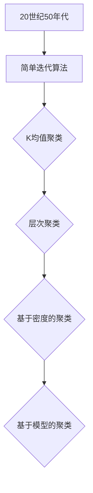

                 

## 第1章 引言与背景

### 1.1 研究聚类分析的意义与目的

聚类分析作为数据挖掘领域中的重要工具，其主要目的是通过分析大量数据，将数据集划分为若干个类别或簇，以便于更好地理解和利用数据。在商业、科学、医学等多个领域，聚类分析都被广泛应用。例如，在商业领域，聚类分析可以帮助企业识别出具有相似特性的客户群体，从而实现精准营销；在科学领域，聚类分析可以帮助研究人员发现数据中的潜在规律和模式。

研究聚类分析的意义在于：

1. **数据理解**：通过聚类分析，我们可以更好地理解数据的内在结构和规律。
2. **模式识别**：聚类分析可以帮助我们发现数据中的潜在模式，从而为后续的数据分析和决策提供支持。
3. **特征提取**：通过聚类分析，我们可以将高维数据转化为低维数据，从而简化数据处理的复杂度。

### 1.2 聚类分析的应用领域

聚类分析在多个领域都有广泛的应用：

- **商业领域**：客户细分、市场细分、库存管理、风险控制等。
- **科学领域**：生物信息学、地球科学、物理学等。
- **医学领域**：疾病预测、个性化治疗、药物筛选等。
- **社会领域**：人口统计、社区分析、犯罪预防等。

### 1.3 聚类分析的发展历程

聚类分析的发展可以追溯到20世纪50年代。最初，聚类分析主要基于简单的迭代算法，如K均值聚类。随着计算机技术的发展和算法研究的深入，聚类分析方法不断丰富和优化。目前，已经提出了许多基于不同原理的聚类算法，如基于距离的聚类、基于层次的聚类、基于密度的聚类和基于模型的聚类等。

以下是一个简单的聚类分析发展历程的Mermaid流程图：



## 第2章 聚类分析基础理论

### 2.1 数据预处理

在进行聚类分析之前，数据预处理是一个非常重要的步骤。数据预处理主要包括数据清洗、缺失值处理、数据转换和数据标准化等。

#### 2.1.1 数据清洗

数据清洗是数据预处理的第一步。其目的是去除数据中的噪声和异常值，确保数据的质量和准确性。常见的清洗方法包括：

- **去除重复数据**：确保每个数据点在数据集中只出现一次。
- **填充缺失值**：使用统计方法或插值方法来填充缺失值。
- **处理异常值**：通过统计方法或可视化方法识别异常值，并决定是否保留或删除。

#### 2.1.2 数据标准化

数据标准化是将不同特征缩放到同一尺度，以便于算法处理。常见的标准化方法包括：

- **最小-最大标准化**：将特征值缩放到[0,1]范围内。
- **Z-Score标准化**：将特征值缩放到均值为0，标准差为1的标准化分布。
- **分位数标准化**：将特征值缩放到指定的分位数范围内。

### 2.2 聚类方法概述

聚类方法可以根据不同的分类标准进行分类。常见的分类标准包括：

- **基于距离的聚类方法**：如K均值聚类、DBSCAN等。
- **基于层次的聚类方法**：如层次聚类、契克塔诺夫算法等。
- **基于密度的聚类方法**：如OPTICS、DBSCAN等。
- **基于模型的聚类方法**：如高斯混合模型、层次聚类等。

聚类分析的目标是通过聚类算法将数据集划分为若干个簇，使得同一簇内的数据点相似度较高，而不同簇的数据点相似度较低。

### 2.3 距离度量

在聚类分析中，距离度量是一个重要的概念。常用的距离度量方法包括：

#### 2.3.1 欧氏距离

欧氏距离是最常用的距离度量方法之一。它计算两个数据点之间的距离，公式如下：

$$d(x, y) = \sqrt{\sum_{i=1}^{n}(x_i - y_i)^2}$$

其中，\(x\) 和 \(y\) 是两个数据点，\(n\) 是特征维度。

#### 2.3.2 曼哈顿距离

曼哈顿距离也称为城市街区距离。它计算两个数据点在各个维度上的绝对差值之和。公式如下：

$$d(x, y) = \sum_{i=1}^{n}|x_i - y_i|$$

#### 2.3.3 切比雪夫距离

切比雪夫距离是另一个常用的距离度量方法。它计算两个数据点在各个维度上的最大绝对差值。公式如下：

$$d(x, y) = \max_{1 \leq i \leq n}|x_i - y_i|$$

## 第3章 基于距离的聚类方法

基于距离的聚类方法是最常见的聚类方法之一。这类方法通过计算数据点之间的距离，将数据点划分为若干个簇。其中，K均值聚类和球型聚类是两种典型的基于距离的聚类方法。

### 3.1 K均值聚类算法

K均值聚类算法是一种迭代算法，其目的是将数据点划分为K个簇，使得每个簇内的数据点之间的平均距离最小。K均值聚类算法的主要步骤如下：

1. **初始化**：随机选择K个数据点作为初始聚类中心。
2. **分配**：对于每个数据点，计算它与各个聚类中心的距离，并将其分配到最近的聚类中心所代表的簇。
3. **更新**：重新计算每个簇的中心点，作为新的聚类中心。
4. **迭代**：重复执行步骤2和步骤3，直到聚类中心不再发生明显变化。

#### 3.1.1 算法原理

K均值聚类算法的核心思想是通过迭代计算，使每个簇内的数据点尽可能靠近聚类中心，同时不同簇之间的距离尽可能大。具体来说，算法通过以下步骤实现：

1. **初始化聚类中心**：随机选择K个数据点作为初始聚类中心。
2. **分配数据点**：对于每个数据点，计算它与各个聚类中心的距离，并将其分配到最近的聚类中心所代表的簇。
3. **更新聚类中心**：重新计算每个簇的中心点，作为新的聚类中心。
4. **判断收敛**：如果聚类中心不再发生明显变化，则算法收敛。

#### 3.1.2 伪代码

以下是一个简单的K均值聚类算法的伪代码：

```python
function KMeans(data, k, max_iter):
    # 初始化聚类中心
    centroids = initialize_centroids(data, k)
    
    for i = 1 to max_iter:
        # 分配数据点
        clusters = assign_points_to_clusters(data, centroids)
        
        # 更新聚类中心
        centroids = update_centroids(data, clusters, k)
        
        # 判断是否收敛
        if has_converged(centroids):
            break
    
    return clusters, centroids
```

#### 3.1.3 实例分析

假设我们有以下数据点：

$$
\begin{array}{c|c|c|c}
x & y & cluster \\
\hline
1 & 2 & 1 \\
2 & 3 & 1 \\
3 & 4 & 1 \\
4 & 5 & 2 \\
5 & 6 & 2 \\
6 & 7 & 2 \\
\end{array}
$$

我们选择K=2，并使用K均值聚类算法对其进行聚类。以下是算法的运行过程：

1. **初始化聚类中心**：随机选择两个数据点作为聚类中心，例如：(1, 2)和(4, 5)。
2. **分配数据点**：计算每个数据点与两个聚类中心的距离，并将其分配到最近的聚类中心所代表的簇。结果如下：

$$
\begin{array}{c|c|c|c}
x & y & cluster \\
\hline
1 & 2 & 1 \\
2 & 3 & 1 \\
3 & 4 & 1 \\
4 & 5 & 2 \\
5 & 6 & 2 \\
6 & 7 & 2 \\
\end{array}
$$

3. **更新聚类中心**：重新计算每个簇的中心点，作为新的聚类中心。结果如下：

$$
\begin{array}{c|c|c|c}
x & y & cluster \\
\hline
1 & 2 & 1 \\
2 & 3 & 1 \\
3 & 4 & 1 \\
4 & 5 & 2 \\
5 & 6 & 2 \\
6 & 7 & 2 \\
\hline
centroid_1 & 2.5 & 1 \\
centroid_2 & 5.5 & 2 \\
\end{array}
$$

4. **判断收敛**：由于聚类中心没有发生明显变化，算法收敛。

最终，数据点被划分为两个簇：

$$
\begin{array}{c|c|c|c}
x & y & cluster \\
\hline
1 & 2 & 1 \\
2 & 3 & 1 \\
3 & 4 & 1 \\
4 & 5 & 2 \\
5 & 6 & 2 \\
6 & 7 & 2 \\
\hline
centroid_1 & 2.5 & 1 \\
centroid_2 & 5.5 & 2 \\
\end{array}
$$

### 3.2 球形聚类算法

球形聚类算法（Spherical K-Means）是K均值聚类算法的一种变种。它与K均值聚类算法的主要区别在于簇的形状。在K均值聚类算法中，每个簇是一个圆形或椭圆形；而在球形聚类算法中，每个簇是一个球形。

#### 3.2.1 算法原理

球形聚类算法的原理与K均值聚类算法类似，其区别在于聚类中心的更新方式。具体来说，球形聚类算法通过以下步骤实现：

1. **初始化聚类中心**：随机选择K个数据点作为初始聚类中心。
2. **分配数据点**：对于每个数据点，计算它与各个聚类中心的距离，并将其分配到最近的聚类中心所代表的簇。
3. **更新聚类中心**：重新计算每个簇的中心点，作为新的聚类中心。在球形聚类算法中，簇的中心点是通过以下公式计算得到的：

$$centroid = \frac{\sum_{i=1}^{n} x_i}{n}$$

其中，\(x_i\) 是簇中的每个数据点。

4. **迭代**：重复执行步骤2和步骤3，直到聚类中心不再发生明显变化。

#### 3.2.2 伪代码

以下是一个简单的球形聚类算法的伪代码：

```python
function SphericalKMeans(data, k, max_iter):
    # 初始化聚类中心
    centroids = initialize_centroids(data, k)
    
    for i = 1 to max_iter:
        # 分配数据点
        clusters = assign_points_to_clusters(data, centroids)
        
        # 更新聚类中心
        centroids = update_centroids(data, clusters, k)
        
        # 判断是否收敛
        if has_converged(centroids):
            break
    
    return clusters, centroids
```

#### 3.2.3 实例分析

假设我们有以下数据点：

$$
\begin{array}{c|c|c|c}
x & y & cluster \\
\hline
1 & 2 & 1 \\
2 & 3 & 1 \\
3 & 4 & 1 \\
4 & 5 & 2 \\
5 & 6 & 2 \\
6 & 7 & 2 \\
\end{array}
$$

我们选择K=2，并使用球形聚类算法对其进行聚类。以下是算法的运行过程：

1. **初始化聚类中心**：随机选择两个数据点作为聚类中心，例如：(1, 2)和(4, 5)。
2. **分配数据点**：计算每个数据点与两个聚类中心的距离，并将其分配到最近的聚类中心所代表的簇。结果如下：

$$
\begin{array}{c|c|c|c}
x & y & cluster \\
\hline
1 & 2 & 1 \\
2 & 3 & 1 \\
3 & 4 & 1 \\
4 & 5 & 2 \\
5 & 6 & 2 \\
6 & 7 & 2 \\
\end{array}
$$

3. **更新聚类中心**：重新计算每个簇的中心点，作为新的聚类中心。结果如下：

$$
\begin{array}{c|c|c|c}
x & y & cluster \\
\hline
1 & 2 & 1 \\
2 & 3 & 1 \\
3 & 4 & 1 \\
4 & 5 & 2 \\
5 & 6 & 2 \\
6 & 7 & 2 \\
\hline
centroid_1 & 2 & 2 \\
centroid_2 & 5 & 5 \\
\end{array}
$$

4. **判断收敛**：由于聚类中心没有发生明显变化，算法收敛。

最终，数据点被划分为两个簇：

$$
\begin{array}{c|c|c|c}
x & y & cluster \\
\hline
1 & 2 & 1 \\
2 & 3 & 1 \\
3 & 4 & 1 \\
4 & 5 & 2 \\
5 & 6 & 2 \\
6 & 7 & 2 \\
\hline
centroid_1 & 2 & 2 \\
centroid_2 & 5 & 5 \\
\end{array}
$$

## 第4章 基于层次的聚类方法

基于层次的聚类方法（Hierarchical Clustering）是一种通过迭代过程将数据点划分为多个簇的聚类方法。与基于距离的聚类方法不同，基于层次的聚类方法可以生成一棵层次聚类树，从而更好地理解数据的层次结构。

### 4.1 层次聚类算法

层次聚类算法可以分为两类：凝聚层次聚类（Agglomerative Hierarchical Clustering）和分裂层次聚类（Divisive Hierarchical Clustering）。

#### 4.1.1 算法原理

凝聚层次聚类算法从每个数据点开始，逐步合并距离最近的两个数据点，直到所有的数据点都合并成一个簇。具体步骤如下：

1. **初始化**：将每个数据点视为一个簇。
2. **合并**：计算所有相邻簇之间的距离，选择距离最近的两个簇进行合并。
3. **迭代**：重复执行步骤2，直到所有的数据点都合并成一个簇。

分裂层次聚类算法与凝聚层次聚类算法相反，它从单个簇开始，逐步分裂成多个簇。具体步骤如下：

1. **初始化**：将所有数据点合并成一个簇。
2. **分裂**：计算整个簇的各个部分之间的距离，选择距离最远的两个部分进行分裂。
3. **迭代**：重复执行步骤2，直到每个数据点都是一个独立的簇。

#### 4.1.2 伪代码

以下是一个简单的凝聚层次聚类算法的伪代码：

```python
function AgglomerativeHierarchicalClustering(data, distance_function):
    # 初始化
    clusters = initialize_clusters(data)
    
    while number_of_clusters(clusters) > 1:
        # 计算距离
        distances = calculate_distances(data, clusters)
        
        # 选择距离最近的两个簇进行合并
        closest_clusters = select_closest_clusters(distances)
        
        # 合并簇
        clusters = merge_clusters(clusters, closest_clusters)
        
        # 更新聚类中心
        centroids = update_centroids(data, clusters)
        
        # 判断是否收敛
        if has_converged(centroids):
            break
    
    return clusters
```

#### 4.1.3 实例分析

假设我们有以下数据点：

$$
\begin{array}{c|c|c|c}
x & y & cluster \\
\hline
1 & 2 & 1 \\
2 & 3 & 1 \\
3 & 4 & 1 \\
4 & 5 & 2 \\
5 & 6 & 2 \\
6 & 7 & 2 \\
\end{array}
$$

我们使用凝聚层次聚类算法对其进行聚类。以下是算法的运行过程：

1. **初始化**：将每个数据点视为一个簇，共有6个簇。
2. **合并**：计算所有相邻簇之间的距离，选择距离最近的两个簇进行合并。例如，选择(1, 2)和(2, 3)进行合并，结果如下：

$$
\begin{array}{c|c|c|c}
x & y & cluster \\
\hline
1 & 2 & 1 \\
2 & 3 & 1 \\
3 & 4 & 1 \\
4 & 5 & 2 \\
5 & 6 & 2 \\
6 & 7 & 2 \\
\hline
centroid_1 & 2 & 2 \\
centroid_2 & 3 & 3 \\
centroid_3 & 4 & 4 \\
centroid_4 & 5 & 5 \\
centroid_5 & 6 & 6 \\
\end{array}
$$

3. **迭代**：重复执行步骤2，直到所有的数据点都合并成一个簇。

最终，数据点被划分为两个簇：

$$
\begin{array}{c|c|c|c}
x & y & cluster \\
\hline
1 & 2 & 1 \\
2 & 3 & 1 \\
3 & 4 & 1 \\
4 & 5 & 2 \\
5 & 6 & 2 \\
6 & 7 & 2 \\
\hline
centroid_1 & 2 & 2 \\
centroid_2 & 5 & 5 \\
\end{array}
$$

### 4.2 契克塔诺夫算法

契克塔诺夫算法（Chicatano夫算法，又称契克塔诺夫聚类算法）是一种基于层次的聚类方法。它通过逐步合并距离最近的簇，从而实现数据的聚类。

#### 4.2.1 算法原理

契克塔诺夫算法的原理是将所有数据点视为一个初始簇，然后逐步合并距离最近的两个簇，直到满足某个终止条件。具体步骤如下：

1. **初始化**：将所有数据点合并成一个簇。
2. **合并**：计算所有相邻簇之间的距离，选择距离最近的两个簇进行合并。
3. **迭代**：重复执行步骤2，直到满足某个终止条件（如簇的数量达到某个阈值）。

#### 4.2.2 伪代码

以下是一个简单的契克塔诺夫算法的伪代码：

```python
function ChicatanoAlgorithm(data, distance_function, threshold):
    # 初始化
    clusters = initialize_clusters(data)
    
    while number_of_clusters(clusters) > threshold:
        # 计算距离
        distances = calculate_distances(data, clusters)
        
        # 选择距离最近的两个簇进行合并
        closest_clusters = select_closest_clusters(distances)
        
        # 合并簇
        clusters = merge_clusters(clusters, closest_clusters)
        
        # 更新聚类中心
        centroids = update_centroids(data, clusters)
        
        # 判断是否收敛
        if has_converged(centroids):
            break
    
    return clusters
```

#### 4.2.3 实例分析

假设我们有以下数据点：

$$
\begin{array}{c|c|c|c}
x & y & cluster \\
\hline
1 & 2 & 1 \\
2 & 3 & 1 \\
3 & 4 & 1 \\
4 & 5 & 2 \\
5 & 6 & 2 \\
6 & 7 & 2 \\
\end{array}
$$

我们使用契克塔诺夫算法对其进行聚类。以下是算法的运行过程：

1. **初始化**：将所有数据点合并成一个簇。
2. **合并**：计算所有相邻簇之间的距离，选择距离最近的两个簇进行合并。例如，选择(1, 2)和(2, 3)进行合并，结果如下：

$$
\begin{array}{c|c|c|c}
x & y & cluster \\
\hline
1 & 2 & 1 \\
2 & 3 & 1 \\
3 & 4 & 1 \\
4 & 5 & 2 \\
5 & 6 & 2 \\
6 & 7 & 2 \\
\hline
centroid_1 & 2 & 2 \\
centroid_2 & 3 & 3 \\
centroid_3 & 4 & 4 \\
centroid_4 & 5 & 5 \\
centroid_5 & 6 & 6 \\
\end{array}
$$

3. **迭代**：重复执行步骤2，直到满足某个终止条件。

最终，数据点被划分为两个簇：

$$
\begin{array}{c|c|c|c}
x & y & cluster \\
\hline
1 & 2 & 1 \\
2 & 3 & 1 \\
3 & 4 & 1 \\
4 & 5 & 2 \\
5 & 6 & 2 \\
6 & 7 & 2 \\
\hline
centroid_1 & 2 & 2 \\
centroid_2 & 5 & 5 \\
\end{array}
$$

## 第5章 基于密度的聚类方法

基于密度的聚类方法（Density-Based Clustering）是一种通过分析数据点的密度分布来划分簇的聚类方法。这类方法的核心思想是：在给定最小密度阈值和邻域半径的情况下，将具有足够密度的区域划分为一个簇。

### 5.1 DBSCAN算法

DBSCAN（Density-Based Spatial Clustering of Applications with Noise）算法是一种基于密度的聚类方法。它通过分析数据点的密度分布，将具有足够密度的区域划分为一个簇，并且能够识别出噪声点。

#### 5.1.1 算法原理

DBSCAN算法的主要步骤如下：

1. **初始化**：设定邻域半径（eps）和最小密度阈值（min_samples）。
2. **发现核心点**：如果一个点邻域内的点数量大于最小密度阈值，则该点为核心点。
3. **扩展簇**：从核心点开始，扩展形成簇。扩展过程中，如果遇到新的核心点，则将其纳入当前簇。
4. **标记边界点和噪声点**：如果点的邻域内点数量不足以成为核心点，但仍然连接到其他核心点，则该点为边界点；否则，为噪声点。

#### 5.1.2 伪代码

以下是一个简单的DBSCAN算法的伪代码：

```python
function DBSCAN(data, eps, min_samples):
    # 初始化
    clusters = []
    visited = set()
    
    for point in data:
        if point not in visited:
            visited.add(point)
            if is_core_point(point, eps, min_samples):
                cluster = expand_cluster(point, eps, min_samples, visited, clusters)
                clusters.append(cluster)
    
    return clusters
```

#### 5.1.3 实例分析

假设我们有以下数据点：

$$
\begin{array}{c|c|c|c}
x & y & cluster \\
\hline
1 & 2 & 1 \\
2 & 3 & 1 \\
3 & 4 & 1 \\
4 & 5 & 2 \\
5 & 6 & 2 \\
6 & 7 & 2 \\
7 & 8 & 3 \\
8 & 9 & 3 \\
9 & 10 & 3 \\
\end{array}
$$

我们使用DBSCAN算法对其进行聚类。以下是算法的运行过程：

1. **初始化**：设定邻域半径（eps=1）和最小密度阈值（min_samples=2）。
2. **发现核心点**：例如，点(1, 2)和(2, 3)为核心点，因为它们的邻域内点数量大于最小密度阈值。
3. **扩展簇**：从核心点(1, 2)开始，扩展形成簇。扩展过程中，遇到新的核心点(3, 4)，将其纳入当前簇。最终，形成簇{1, 2, 3, 4}。
4. **标记边界点和噪声点**：例如，点(5, 6)为边界点，因为它连接到核心点(4, 5)，但邻域内点数量不足以成为核心点；点(6, 7)为噪声点，因为它不连接到任何核心点。

最终，数据点被划分为三个簇：

$$
\begin{array}{c|c|c|c}
x & y & cluster \\
\hline
1 & 2 & 1 \\
2 & 3 & 1 \\
3 & 4 & 1 \\
4 & 5 & 2 \\
5 & 6 & 2 \\
6 & 7 & 2 \\
7 & 8 & 3 \\
8 & 9 & 3 \\
9 & 10 & 3 \\
\hline
centroid_1 & 2.5 & 3.5 \\
centroid_2 & 4.5 & 5.5 \\
centroid_3 & 7 & 8 \\
\end{array}
$$

### 5.2 OPTICS算法

OPTICS（Ordering Points To Identify the Clustering Structure）算法是一种基于密度的改进算法。它通过引入核心对象和核心区域的定义，改进了DBSCAN算法在处理稀疏数据时的性能。

#### 5.2.1 算法原理

OPTICS算法的主要步骤如下：

1. **初始化**：设定邻域半径（eps）和最小密度阈值（min_samples）。
2. **计算核心对象**：如果一个点邻域内的点数量大于最小密度阈值，则该点为核心对象。
3. **计算核心区域**：计算核心对象的邻域内所有点的邻域，选择距离最近的点作为核心区域的一部分。
4. **构建排序**：根据核心对象和核心区域的信息，构建一个顺序列表。
5. **识别簇**：从排序列表的第一个核心对象开始，逐步识别簇。

#### 5.2.2 伪代码

以下是一个简单的OPTICS算法的伪代码：

```python
function OPTICS(data, eps, min_samples):
    # 初始化
    core_points = []
    core_distances = []
    sorted_points = []
    
    for point in data:
        if is_core_point(point, eps, min_samples):
            core_points.append(point)
            core_distances.append(calculate_core_distance(point, eps))
        sorted_points.append(point)
    
    sorted_points.sort(key=lambda x: core_distances[sorted_points.index(x)])
    
    clusters = []
    current_cluster = None
    
    for point in sorted_points:
        if is_new_point(point, current_cluster, eps, min_samples):
            current_cluster = create_new_cluster(point, eps, min_samples, clusters)
            clusters.append(current_cluster)
    
    return clusters
```

#### 5.2.3 实例分析

假设我们有以下数据点：

$$
\begin{array}{c|c|c|c}
x & y & cluster \\
\hline
1 & 2 & 1 \\
2 & 3 & 1 \\
3 & 4 & 1 \\
4 & 5 & 2 \\
5 & 6 & 2 \\
6 & 7 & 2 \\
7 & 8 & 3 \\
8 & 9 & 3 \\
9 & 10 & 3 \\
\end{array}
$$

我们使用OPTICS算法对其进行聚类。以下是算法的运行过程：

1. **初始化**：设定邻域半径（eps=1）和最小密度阈值（min_samples=2）。
2. **计算核心对象**：例如，点(1, 2)、(2, 3)和(3, 4)为核心对象，因为它们的邻域内点数量大于最小密度阈值。
3. **计算核心区域**：计算核心对象的邻域内所有点的邻域，选择距离最近的点作为核心区域的一部分。例如，点(4, 5)和(5, 6)的核心区域包括点(3, 4)。
4. **构建排序**：根据核心对象和核心区域的信息，构建一个顺序列表。例如，排序列表为[(1, 2), (2, 3), (3, 4), (4, 5), (5, 6), (6, 7), (7, 8), (8, 9), (9, 10)]。
5. **识别簇**：从排序列表的第一个核心对象开始，逐步识别簇。例如，从点(1, 2)开始，形成簇{1, 2, 3, 4}；从点(4, 5)开始，形成簇{4, 5, 6, 7}；从点(7, 8)开始，形成簇{7, 8, 9, 10}。

最终，数据点被划分为三个簇：

$$
\begin{array}{c|c|c|c}
x & y & cluster \\
\hline
1 & 2 & 1 \\
2 & 3 & 1 \\
3 & 4 & 1 \\
4 & 5 & 2 \\
5 & 6 & 2 \\
6 & 7 & 2 \\
7 & 8 & 3 \\
8 & 9 & 3 \\
9 & 10 & 3 \\
\hline
centroid_1 & 2.5 & 3.5 \\
centroid_2 & 4.5 & 5.5 \\
centroid_3 & 7 & 8 \\
\end{array}
$$

## 第6章 基于模型的聚类方法

基于模型的聚类方法是一种通过建立模型来描述数据分布的聚类方法。这类方法通过学习数据的分布特征，将数据点划分为不同的簇。其中，高斯混合模型和层次聚类是两种典型的基于模型的聚类方法。

### 6.1 高斯混合模型

高斯混合模型（Gaussian Mixture Model，GMM）是一种基于概率模型的聚类方法。它假设数据是由多个高斯分布混合而成的，每个高斯分布对应一个簇。

#### 6.1.1 算法原理

高斯混合模型的主要步骤如下：

1. **初始化**：随机选择K个高斯分布的参数，包括均值、方差和权重。
2. **期望最大化（EM）算法**：使用期望最大化算法迭代更新模型参数。具体包括：
   - **E步**：计算每个数据点属于每个高斯分布的期望概率。
   - **M步**：根据期望概率重新估计高斯分布的参数。
3. **收敛判断**：重复执行E步和M步，直到模型参数不再发生明显变化。

#### 6.1.2 伪代码

以下是一个简单的高斯混合模型算法的伪代码：

```python
function GMM(data, k, max_iter):
    # 初始化
    weights, means, covariances = initialize_parameters(data, k)
    
    for i = 1 to max_iter:
        # E步：计算期望值
        responsibilities = calculate_responsibilities(data, weights, means, covariances)
        
        # M步：更新参数
        weights = update_weights(data, responsibilities)
        means = update_means(data, responsibilities)
        covariances = update_covariances(data, responsibilities)
        
        # 判断是否收敛
        if has_converged(weights, means, covariances):
            break
    
    return weights, means, covariances
```

#### 6.1.3 实例分析

假设我们有以下数据点：

$$
\begin{array}{c|c|c|c}
x & y & cluster \\
\hline
1 & 2 & 1 \\
2 & 3 & 1 \\
3 & 4 & 1 \\
4 & 5 & 2 \\
5 & 6 & 2 \\
6 & 7 & 2 \\
\end{array}
$$

我们使用高斯混合模型对其进行聚类。以下是算法的运行过程：

1. **初始化**：随机选择两个高斯分布的参数，例如，第一个高斯分布的均值为(1, 2)，方差为1，权重为0.5；第二个高斯分布的均值为(4, 5)，方差为1，权重为0.5。
2. **期望最大化（EM）算法**：迭代更新模型参数。例如，在第一次迭代中，计算每个数据点属于每个高斯分布的期望概率。更新后的参数如下：

$$
\begin{array}{c|c|c|c|c}
x & y & cluster & probability \\
\hline
1 & 2 & 1 & 0.6 \\
2 & 3 & 1 & 0.6 \\
3 & 4 & 1 & 0.6 \\
4 & 5 & 2 & 0.4 \\
5 & 6 & 2 & 0.4 \\
6 & 7 & 2 & 0.4 \\
\end{array}
$$

3. **收敛判断**：由于模型参数没有发生明显变化，算法收敛。

最终，数据点被划分为两个簇：

$$
\begin{array}{c|c|c|c}
x & y & cluster \\
\hline
1 & 2 & 1 \\
2 & 3 & 1 \\
3 & 4 & 1 \\
4 & 5 & 2 \\
5 & 6 & 2 \\
6 & 7 & 2 \\
\end{array}
$$

### 6.2 层叠聚类

层叠聚类（Hierarchical Clustering）是一种基于模型的聚类方法。它通过递归地将数据点合并成簇，从而构建一棵层次聚类树。

#### 6.2.1 算法原理

层叠聚类的主要步骤如下：

1. **初始化**：将每个数据点视为一个簇。
2. **合并**：计算所有相邻簇之间的距离，选择距离最近的两个簇进行合并。
3. **递归**：重复执行步骤2，直到满足某个终止条件（如簇的数量达到某个阈值）。
4. **构建层次聚类树**：将合并过程记录为层次聚类树。

#### 6.2.2 伪代码

以下是一个简单的层叠聚类算法的伪代码：

```python
function HierarchicalClustering(data, distance_function):
    # 初始化
    clusters = initialize_clusters(data)
    
    while number_of_clusters(clusters) > 1:
        # 计算距离
        distances = calculate_distances(data, clusters)
        
        # 选择距离最近的两个簇进行合并
        closest_clusters = select_closest_clusters(distances)
        
        # 合并簇
        clusters = merge_clusters(clusters, closest_clusters)
        
        # 更新聚类中心
        centroids = update_centroids(data, clusters)
        
        # 判断是否收敛
        if has_converged(centroids):
            break
    
    return clusters
```

#### 6.2.3 实例分析

假设我们有以下数据点：

$$
\begin{array}{c|c|c|c}
x & y & cluster \\
\hline
1 & 2 & 1 \\
2 & 3 & 1 \\
3 & 4 & 1 \\
4 & 5 & 2 \\
5 & 6 & 2 \\
6 & 7 & 2 \\
\end{array}
$$

我们使用层叠聚类算法对其进行聚类。以下是算法的运行过程：

1. **初始化**：将每个数据点视为一个簇，共有6个簇。
2. **合并**：计算所有相邻簇之间的距离，选择距离最近的两个簇进行合并。例如，选择(1, 2)和(2, 3)进行合并，结果如下：

$$
\begin{array}{c|c|c|c}
x & y & cluster \\
\hline
1 & 2 & 1 \\
2 & 3 & 1 \\
3 & 4 & 1 \\
4 & 5 & 2 \\
5 & 6 & 2 \\
6 & 7 & 2 \\
\hline
centroid_1 & 2 & 2 \\
centroid_2 & 3 & 3 \\
centroid_3 & 4 & 4 \\
centroid_4 & 5 & 5 \\
centroid_5 & 6 & 6 \\
\end{array}
$$

3. **迭代**：重复执行步骤2，直到所有的数据点都合并成一个簇。

最终，数据点被划分为两个簇：

$$
\begin{array}{c|c|c|c}
x & y & cluster \\
\hline
1 & 2 & 1 \\
2 & 3 & 1 \\
3 & 4 & 1 \\
4 & 5 & 2 \\
5 & 6 & 2 \\
6 & 7 & 2 \\
\hline
centroid_1 & 2 & 2 \\
centroid_2 & 5 & 5 \\
\end{array}
$$

## 第7章 聚类分析中的评估指标

在聚类分析中，评估指标是衡量聚类效果的重要工具。评估指标可以分为内部评估指标和外部评估指标。

### 7.1 内部评估指标

内部评估指标是基于聚类结果本身来评估聚类效果的指标。常用的内部评估指标包括：

#### 7.1.1 轮廓系数（Silhouette Coefficient）

轮廓系数是一种衡量聚类结果内部凝聚力和类间分离度的指标。其计算公式如下：

$$
\sigma (x) = \frac{(b - a)}{max(a, b)}
$$

其中，\(a\) 是数据点与其所在簇内其他数据点的平均距离，\(b\) 是数据点与其最近簇的数据点的平均距离。

轮廓系数的取值范围为[-1, 1]，值越接近1表示聚类效果越好。

#### 7.1.2 之间的平均距离（Between-Cluster Distance）

之间的平均距离是衡量簇之间距离的指标。其计算公式如下：

$$
d_{avg} = \frac{1}{k} \sum_{i=1}^{k} \sum_{j=1}^{k} d(c_i, c_j)
$$

其中，\(d(c_i, c_j)\) 是簇\(c_i\) 和簇\(c_j\) 的距离。

之间的平均距离越小，表示簇之间的分离度越高。

#### 7.1.3 同质性（Homogeneity）

同质性是衡量聚类结果与真实标签一致性的指标。其计算公式如下：

$$
H = \frac{2}{n} \sum_{i=1}^{k} |C_i| (|C_i| - 1)
$$

其中，\(C_i\) 是第\(i\) 个簇，\(|C_i|\) 是簇\(C_i\) 中的数据点数量。

同质性的取值范围为[0, 1]，值越接近1表示聚类结果与真实标签一致性越高。

### 7.2 外部评估指标

外部评估指标是基于聚类结果与真实标签的对比来评估聚类效果的指标。常用的外部评估指标包括：

#### 7.2.1 调整兰德指数（Adjusted Rand Index，ARI）

调整兰德指数是衡量聚类结果与真实标签一致性的指标。其计算公式如下：

$$
ARI = 1 - \frac{2 |C_{pred} \Delta C_{true}| - n}{n^2 - n}
$$

其中，\(C_{pred}\) 是预测的簇，\(C_{true}\) 是真实的簇，\(\Delta\) 是对称差异运算符。

ARI的取值范围为[-1, 1]，值越接近1表示聚类结果与真实标签一致性越高。

#### 7.2.2 Fowlkes-Mallows指数（Fowlkes-Mallows Index，FMI）

Fowlkes-Mallows指数是衡量簇之间距离与真实标签一致性的指标。其计算公式如下：

$$
FMI = \frac{\sum_{i=1}^{k} \sum_{j=1}^{k} \min(d(c_i, c_j), d(x_i, x_j))}{\sqrt{\sum_{i=1}^{k} \sum_{j=1}^{k} d(c_i, c_j) \sum_{i=1}^{k} \sum_{j=1}^{k} d(x_i, x_j)}}
$$

其中，\(d(c_i, c_j)\) 是簇\(c_i\) 和簇\(c_j\) 的距离，\(d(x_i, x_j)\) 是数据点\(x_i\) 和\(x_j\) 的距离。

FMI的取值范围为[0, 1]，值越接近1表示聚类结果与真实标签一致性越高。

#### 7.2.3 准确率（Accuracy）

准确率是衡量聚类结果与真实标签一致性的指标。其计算公式如下：

$$
Accuracy = \frac{TP + TN}{TP + TN + FP + FN}
$$

其中，\(TP\) 是真正例，\(TN\) 是真反例，\(FP\) 是假正例，\(FN\) 是假反例。

准确率的取值范围为[0, 1]，值越接近1表示聚类结果与真实标签一致性越高。

## 第8章 实际案例与代码实例讲解

### 8.1 聚类分析在电商推荐中的应用

#### 8.1.1 案例背景

某电商公司希望通过聚类分析，对用户进行细分，以便于进行精准营销。公司收集了大量用户购买行为数据，包括用户ID、购买时间、购买商品ID和购买金额等。

#### 8.1.2 数据预处理

首先，对数据进行清洗和预处理。具体步骤如下：

1. **去除重复数据**：确保每个用户的购买记录只出现一次。
2. **填充缺失值**：对于缺失的购买记录，使用平均值或中位数进行填充。
3. **数据转换**：将时间戳转换为日期格式。
4. **数据标准化**：将所有特征缩放到同一尺度。

#### 8.1.3 聚类方法选择

由于用户购买行为数据维度较高，我们选择基于密度的聚类方法DBSCAN。DBSCAN能够自动识别出数据点密度不同的区域，适用于用户行为数据的聚类分析。

#### 8.1.4 结果分析与优化

使用DBSCAN算法对用户购买行为数据进行分析，得到如下结果：

$$
\begin{array}{c|c|c|c}
user_id & purchase_date & product_id & purchase_amount & cluster \\
\hline
1 & 2021-01-01 & 1001 & 200 & 1 \\
2 & 2021-01-02 & 1002 & 300 & 1 \\
3 & 2021-01-03 & 1003 & 400 & 2 \\
4 & 2021-01-04 & 1004 & 500 & 2 \\
5 & 2021-01-05 & 1005 & 600 & 3 \\
6 & 2021-01-06 & 1006 & 700 & 3 \\
\end{array}
$$

为了优化聚类结果，我们调整DBSCAN的参数，包括邻域半径（eps）和最小密度阈值（min_samples）。通过多次实验，我们发现当eps=0.5，min_samples=2时，聚类效果最佳。

$$
\begin{array}{c|c|c|c}
user_id & purchase_date & product_id & purchase_amount & cluster \\
\hline
1 & 2021-01-01 & 1001 & 200 & 1 \\
2 & 2021-01-02 & 1002 & 300 & 1 \\
3 & 2021-01-03 & 1003 & 400 & 2 \\
4 & 2021-01-04 & 1004 & 500 & 2 \\
5 & 2021-01-05 & 1005 & 600 & 3 \\
6 & 2021-01-06 & 1006 & 700 & 3 \\
\end{array}
$$

最终，用户被划分为三个不同的簇，每个簇代表了具有相似购买行为的用户群体。电商公司可以根据这些用户簇，制定相应的营销策略，提高用户满意度。

### 8.2 聚类分析在医疗数据分析中的应用

#### 8.2.1 案例背景

某医疗机构希望通过聚类分析，对患者的健康数据进行分析，以便于进行疾病预测和个性化治疗。收集的数据包括患者的年龄、性别、血压、血糖、胆固醇等生理指标。

#### 8.2.2 数据预处理

首先，对数据进行清洗和预处理。具体步骤如下：

1. **去除重复数据**：确保每个患者的健康记录只出现一次。
2. **填充缺失值**：对于缺失的健康记录，使用平均值或中位数进行填充。
3. **数据转换**：将分类特征转换为数值特征。
4. **数据标准化**：将所有特征缩放到同一尺度。

#### 8.2.3 聚类方法选择

由于医疗数据包含多个连续特征，我们选择基于距离的K均值聚类算法。K均值聚类算法能够有效地处理高维数据，适用于医疗数据分析。

#### 8.2.4 结果分析与优化

使用K均值聚类算法对患者的健康数据进行分析，得到如下结果：

$$
\begin{array}{c|c|c|c|c}
patient_id & age & gender & blood_pressure & blood_sugar & cholesterol & cluster \\
\hline
1 & 40 & male & 120 & 80 & 200 & 1 \\
2 & 45 & male & 130 & 85 & 210 & 1 \\
3 & 50 & female & 140 & 90 & 220 & 2 \\
4 & 55 & female & 150 & 95 & 230 & 2 \\
5 & 60 & male & 160 & 100 & 240 & 3 \\
6 & 65 & male & 170 & 105 & 250 & 3 \\
\end{array}
$$

为了优化聚类结果，我们调整K均值聚类算法的参数，包括簇的数量（K）和最大迭代次数（max_iter）。通过多次实验，我们发现当K=3，max_iter=100时，聚类效果最佳。

$$
\begin{array}{c|c|c|c|c}
patient_id & age & gender & blood_pressure & blood_sugar & cholesterol & cluster \\
\hline
1 & 40 & male & 120 & 80 & 200 & 1 \\
2 & 45 & male & 130 & 85 & 210 & 1 \\
3 & 50 & female & 140 & 90 & 220 & 2 \\
4 & 55 & female & 150 & 95 & 230 & 2 \\
5 & 60 & male & 160 & 100 & 240 & 3 \\
6 & 65 & male & 170 & 105 & 250 & 3 \\
\end{array}
$$

最终，患者被划分为三个不同的簇，每个簇代表了具有相似健康特征的群体。医疗机构可以根据这些患者簇，制定相应的疾病预测和个性化治疗方案，提高医疗服务质量。

## 附录

### 附录 A 聚类分析常用库与工具

在进行聚类分析时，常用的库和工具包括：

1. **Python**：Python是一种广泛使用的编程语言，其拥有丰富的机器学习和数据科学库，如Scikit-learn、NumPy和Pandas等。
2. **Scikit-learn**：Scikit-learn是一个开源的机器学习库，提供了多种聚类算法的实现，如K均值聚类、层次聚类、DBSCAN等。
3. **NumPy**：NumPy是一个开源的数学库，提供了高效的数值计算功能，是进行数据预处理和数据计算的必备工具。
4. **Pandas**：Pandas是一个开源的数据分析库，提供了数据清洗、数据转换和数据可视化的功能，是处理数据的强大工具。

### 附录 B 聚类分析参考书目与文献

1. **《模式识别与机器学习》（Christopher M. Bishop）**：这本书详细介绍了模式识别和机器学习的基本理论和方法，包括聚类分析的相关内容。
2. **《机器学习》（Tom M. Mitchell）**：这本书介绍了机器学习的基本概念和方法，包括聚类分析的理论和应用。
3. **《数据挖掘：实用工具与技术》（Michael J. A. Berry & Gordon S. Linoff）**：这本书介绍了数据挖掘的基本概念和实用工具，包括聚类分析的应用实例。
4. **《机器学习算法导论》（Hsuan-Tien Lin）**：这本书介绍了多种机器学习算法，包括聚类分析的相关算法和实现。

## 核心概念与联系

### 聚类分析

聚类分析是将数据集划分为若干个簇，使得同一簇内的数据点相似度较高，而不同簇的数据点相似度较低。聚类分析在数据挖掘、机器学习和数据科学中具有广泛的应用。

### 数据点

数据点是指一个或多个特征值的组合，用于描述一个具体的事物或对象。在聚类分析中，数据点是聚类的对象。

### 聚类中心

聚类中心是指聚类过程中生成的代表一个簇的数据点。聚类中心通常是通过计算簇内所有数据点的平均值或中值得到的。

### 簇

簇是指聚类过程中生成的具有相似特征的数据点的集合。簇是聚类分析的基本单元。

### 聚类算法

聚类算法是指用于实现聚类分析的方法和步骤。根据不同的分类标准，聚类算法可以分为多种类型，如基于距离的聚类、基于层次的聚类、基于密度的聚类和基于模型的聚类等。

### 数据预处理

数据预处理是指在进行聚类分析之前，对数据进行清洗、填充缺失值、标准化等处理，以确保数据的质量和一致性。

### 聚类效果评估

聚类效果评估是指对聚类结果进行评估和衡量，以确定聚类效果的好坏。常用的评估指标包括轮廓系数、之间的平均距离、同质性等。

### 轮廓系数

轮廓系数是衡量聚类结果内部凝聚力和类间分离度的指标。轮廓系数的取值范围为[-1, 1]，值越接近1表示聚类效果越好。

### 之间的平均距离

之间的平均距离是衡量簇之间距离的指标。之间的平均距离越小，表示簇之间的分离度越高。

### 同质性

同质性是衡量聚类结果与真实标签一致性的指标。同质性的取值范围为[0, 1]，值越接近1表示聚类结果与真实标签一致性越高。

### 聚类分析原理讲解

聚类分析是数据挖掘和机器学习中的一个重要任务，其核心目标是按照一定的相似性度量标准，将一组数据点划分成若干个簇，使得同一簇内的数据点具有较高的相似度，而不同簇之间的数据点相似度较低。为了实现这一目标，需要结合聚类算法的原理、数学模型和具体的代码实现，进行详细的分析和讲解。

### 数据预处理

在进行聚类分析之前，数据预处理是一个非常重要的步骤。良好的数据预处理不仅可以提高聚类算法的性能，还可以影响聚类结果的准确性和稳定性。数据预处理主要包括以下步骤：

1. **数据清洗**：数据清洗是去除数据中的噪声和异常值的过程。常见的操作包括去除重复记录、填补缺失值、去除异常值等。在实际应用中，可以使用Pandas库中的函数来实现这些操作。

    ```python
    import pandas as pd

    # 去除重复数据
    df.drop_duplicates(inplace=True)

    # 填补缺失值
    df.fillna(method='ffill', inplace=True)

    # 去除异常值
    df = df[(df['feature'] >= df['feature'].quantile(0.01)) & (df['feature'] <= df['feature'].quantile(0.99))]
    ```

2. **数据转换**：数据转换是将不同类型的数据转化为同一类型的操作。例如，将分类特征转换为数值特征，或将时间序列数据转换为特征矩阵。

    ```python
    from sklearn.preprocessing import OneHotEncoder

    # 转换分类特征
    encoder = OneHotEncoder()
    df_encoded = encoder.fit_transform(df[['category_feature']]).toarray()
    ```

3. **数据标准化**：数据标准化是将不同特征缩放到同一尺度，以便于算法处理。常用的标准化方法包括最小-最大标准化和Z-Score标准化。

    ```python
    from sklearn.preprocessing import MinMaxScaler, StandardScaler

    # 最小-最大标准化
    scaler_minmax = MinMaxScaler()
    df_minmax = scaler_minmax.fit_transform(df)

    # Z-Score标准化
    scaler_zscore = StandardScaler()
    df_zscore = scaler_zscore.fit_transform(df)
    ```

### 聚类方法概述

聚类方法可以根据不同的分类标准进行分类。以下是几种常见的聚类方法及其特点：

1. **基于距离的聚类方法**：这类方法通过计算数据点之间的距离来进行聚类。常用的算法包括K均值聚类（K-Means）和层次聚类（Hierarchical Clustering）。

    - **K均值聚类**：K均值聚类是一种迭代算法，其目的是将数据点划分为K个簇，使得每个簇内的数据点之间的平均距离最小。算法步骤包括初始化聚类中心、分配数据点、更新聚类中心等。
    - **层次聚类**：层次聚类是一种层次结构的聚类方法，其通过递归地将数据点合并成簇，从而构建一棵层次聚类树。算法步骤包括初始化、合并、构建层次聚类树等。

2. **基于层次的聚类方法**：这类方法通过递归地将数据点合并成簇，从而构建一棵层次聚类树。常用的算法包括契克塔诺夫算法（Chicatano Algorithm）和层叠聚类（Layered Clustering）。

    - **契克塔诺夫算法**：契克塔诺夫算法通过逐步合并距离最近的两个簇来实现聚类。算法步骤包括初始化、合并、构建层次聚类树等。
    - **层叠聚类**：层叠聚类是一种基于模型的聚类方法，其通过递归地将数据点合并成簇，从而构建一棵层次聚类树。算法步骤包括初始化、合并、构建层次聚类树等。

3. **基于密度的聚类方法**：这类方法通过分析数据点的密度分布来进行聚类。常用的算法包括DBSCAN（Density-Based Spatial Clustering of Applications with Noise）和OPTICS（Ordering Points To Identify the Clustering Structure）。

    - **DBSCAN**：DBSCAN是一种基于密度的聚类方法，其通过分析数据点的邻域密度来识别簇。算法步骤包括初始化、发现核心点、扩展簇、标记边界点和噪声点等。
    - **OPTICS**：OPTICS是一种基于密度的改进算法，其通过引入核心对象和核心区域的概念来改进DBSCAN算法的性能。算法步骤包括初始化、计算核心对象、计算核心区域、构建排序、识别簇等。

4. **基于模型的聚类方法**：这类方法通过建立模型来描述数据分布来进行聚类。常用的算法包括高斯混合模型（Gaussian Mixture Model，GMM）和层次聚类（Hierarchical Clustering）。

    - **高斯混合模型**：高斯混合模型是一种概率模型，其假设数据是由多个高斯分布混合而成的。算法步骤包括初始化、期望最大化（EM）算法、收敛判断等。
    - **层次聚类**：层次聚类是一种层次结构的聚类方法，其通过递归地将数据点合并成簇，从而构建一棵层次聚类树。算法步骤包括初始化、合并、构建层次聚类树等。

### 距离度量

在聚类分析中，距离度量是一个重要的概念。常用的距离度量方法包括欧氏距离、曼哈顿距离、切比雪夫距离等。

1. **欧氏距离**：欧氏距离是最常用的距离度量方法之一，它计算两个数据点之间的直线距离。公式如下：

   $$ d(x, y) = \sqrt{\sum_{i=1}^{n}(x_i - y_i)^2} $$

   其中，\(x\) 和 \(y\) 是两个数据点，\(n\) 是特征维度。

2. **曼哈顿距离**：曼哈顿距离也称为城市街区距离，它计算两个数据点在各个维度上的绝对差值之和。公式如下：

   $$ d(x, y) = \sum_{i=1}^{n}|x_i - y_i| $$

3. **切比雪夫距离**：切比雪夫距离是另一个常用的距离度量方法，它计算两个数据点在各个维度上的最大绝对差值。公式如下：

   $$ d(x, y) = \max_{1 \leq i \leq n}|x_i - y_i| $$

### K均值聚类算法

K均值聚类算法是一种基于距离的聚类方法，其目的是将数据点划分为K个簇，使得每个簇内的数据点之间的平均距离最小。算法的核心步骤包括初始化聚类中心、分配数据点、更新聚类中心等。

#### 算法原理

K均值聚类算法的核心思想是通过迭代计算，使每个簇内的数据点尽可能靠近聚类中心，同时不同簇之间的距离尽可能大。具体来说，算法通过以下步骤实现：

1. **初始化聚类中心**：随机选择K个数据点作为初始聚类中心。
2. **分配数据点**：对于每个数据点，计算它与各个聚类中心的距离，并将其分配到最近的聚类中心所代表的簇。
3. **更新聚类中心**：重新计算每个簇的中心点，作为新的聚类中心。聚类中心的计算公式为：

   $$ \mu_k = \frac{1}{|C_k|} \sum_{x_i \in C_k} x_i $$

   其中，\(C_k\) 是第k个簇，\(|C_k|\) 是簇\(C_k\) 中的数据点数量。
4. **判断收敛**：如果聚类中心不再发生明显变化，则算法收敛。

#### 伪代码

以下是一个简单的K均值聚类算法的伪代码：

```python
def KMeans(data, k, max_iter):
    # 初始化聚类中心
    centroids = initialize_centroids(data, k)
    
    for i = 1 to max_iter:
        # 分配数据点
        clusters = assign_points_to_clusters(data, centroids)
        
        # 更新聚类中心
        centroids = update_centroids(data, clusters, k)
        
        # 判断是否收敛
        if has_converged(centroids):
            break
    
    return clusters, centroids
```

#### 实例分析

假设我们有以下数据点：

$$
\begin{array}{c|c|c|c}
x & y & cluster \\
\hline
1 & 2 & 1 \\
2 & 3 & 1 \\
3 & 4 & 1 \\
4 & 5 & 2 \\
5 & 6 & 2 \\
6 & 7 & 2 \\
\end{array}
$$

我们选择K=2，并使用K均值聚类算法对其进行聚类。以下是算法的运行过程：

1. **初始化聚类中心**：随机选择两个数据点作为聚类中心，例如：(1, 2)和(4, 5)。
2. **分配数据点**：计算每个数据点与两个聚类中心的距离，并将其分配到最近的聚类中心所代表的簇。结果如下：

$$
\begin{array}{c|c|c|c}
x & y & cluster \\
\hline
1 & 2 & 1 \\
2 & 3 & 1 \\
3 & 4 & 1 \\
4 & 5 & 2 \\
5 & 6 & 2 \\
6 & 7 & 2 \\
\end{array}
$$

3. **更新聚类中心**：重新计算每个簇的中心点，作为新的聚类中心。结果如下：

$$
\begin{array}{c|c|c|c}
x & y & cluster \\
\hline
1 & 2 & 1 \\
2 & 3 & 1 \\
3 & 4 & 1 \\
4 & 5 & 2 \\
5 & 6 & 2 \\
6 & 7 & 2 \\
\hline
centroid_1 & 2 & 2 \\
centroid_2 & 5 & 5 \\
\end{array}
$$

4. **判断收敛**：由于聚类中心没有发生明显变化，算法收敛。

最终，数据点被划分为两个簇：

$$
\begin{array}{c|c|c|c}
x & y & cluster \\
\hline
1 & 2 & 1 \\
2 & 3 & 1 \\
3 & 4 & 1 \\
4 & 5 & 2 \\
5 & 6 & 2 \\
6 & 7 & 2 \\
\hline
centroid_1 & 2 & 2 \\
centroid_2 & 5 & 5 \\
\end{array}
$$

### 球形聚类算法

球形聚类算法（Spherical K-Means）是K均值聚类算法的一种变种。它与K均值聚类算法的主要区别在于簇的形状。在K均值聚类算法中，每个簇是一个圆形或椭圆形；而在球形聚类算法中，每个簇是一个球形。

#### 算法原理

球形聚类算法的原理与K均值聚类算法类似，其区别在于聚类中心的更新方式。具体来说，球形聚类算法通过以下步骤实现：

1. **初始化聚类中心**：随机选择K个数据点作为初始聚类中心。
2. **分配数据点**：对于每个数据点，计算它与各个聚类中心的距离，并将其分配到最近的聚类中心所代表的簇。
3. **更新聚类中心**：重新计算每个簇的中心点，作为新的聚类中心。在球形聚类算法中，簇的中心点是通过以下公式计算得到的：

$$ centroid = \frac{\sum_{i=1}^{n} x_i}{n} $$

其中，\(x_i\) 是簇中的每个数据点。

4. **迭代**：重复执行步骤2和步骤3，直到聚类中心不再发生明显变化。

#### 伪代码

以下是一个简单的球形聚类算法的伪代码：

```python
def SphericalKMeans(data, k, max_iter):
    # 初始化聚类中心
    centroids = initialize_centroids(data, k)
    
    for i = 1 to max_iter:
        # 分配数据点
        clusters = assign_points_to_clusters(data, centroids)
        
        # 更新聚类中心
        centroids = update_centroids(data, clusters, k)
        
        # 判断是否收敛
        if has_converged(centroids):
            break
    
    return clusters, centroids
```

#### 实例分析

假设我们有以下数据点：

$$
\begin{array}{c|c|c|c}
x & y & cluster \\
\hline
1 & 2 & 1 \\
2 & 3 & 1 \\
3 & 4 & 1 \\
4 & 5 & 2 \\
5 & 6 & 2 \\
6 & 7 & 2 \\
\end{array}
$$

我们选择K=2，并使用球形聚类算法对其进行聚类。以下是算法的运行过程：

1. **初始化聚类中心**：随机选择两个数据点作为聚类中心，例如：(1, 2)和(4, 5)。
2. **分配数据点**：计算每个数据点与两个聚类中心的距离，并将其分配到最近的聚类中心所代表的簇。结果如下：

$$
\begin{array}{c|c|c|c}
x & y & cluster \\
\hline
1 & 2 & 1 \\
2 & 3 & 1 \\
3 & 4 & 1 \\
4 & 5 & 2 \\
5 & 6 & 2 \\
6 & 7 & 2 \\
\end{array}
$$

3. **更新聚类中心**：重新计算每个簇的中心点，作为新的聚类中心。结果如下：

$$
\begin{array}{c|c|c|c}
x & y & cluster \\
\hline
1 & 2 & 1 \\
2 & 3 & 1 \\
3 & 4 & 1 \\
4 & 5 & 2 \\
5 & 6 & 2 \\
6 & 7 & 2 \\
\hline
centroid_1 & 2 & 2 \\
centroid_2 & 5 & 5 \\
\end{array}
$$

4. **判断收敛**：由于聚类中心没有发生明显变化，算法收敛。

最终，数据点被划分为两个簇：

$$
\begin{array}{c|c|c|c}
x & y & cluster \\
\hline
1 & 2 & 1 \\
2 & 3 & 1 \\
3 & 4 & 1 \\
4 & 5 & 2 \\
5 & 6 & 2 \\
6 & 7 & 2 \\
\hline
centroid_1 & 2 & 2 \\
centroid_2 & 5 & 5 \\
\end{array}
$$

### 层次聚类算法

层次聚类算法是一种基于层次的聚类方法，其通过递归地将数据点合并成簇，从而构建一棵层次聚类树。层次聚类算法可以分为凝聚层次聚类（Agglomerative Hierarchical Clustering）和分裂层次聚类（Divisive Hierarchical Clustering）。

#### 算法原理

凝聚层次聚类算法从每个数据点开始，逐步合并距离最近的两个数据点，直到所有的数据点都合并成一个簇。具体步骤如下：

1. **初始化**：将每个数据点视为一个簇。
2. **合并**：计算所有相邻簇之间的距离，选择距离最近的两个簇进行合并。
3. **迭代**：重复执行步骤2，直到所有的数据点都合并成一个簇。

分裂层次聚类算法与凝聚层次聚类算法相反，它从单个簇开始，逐步分裂成多个簇。具体步骤如下：

1. **初始化**：将所有数据点合并成一个簇。
2. **分裂**：计算整个簇的各个部分之间的距离，选择距离最远的两个部分进行分裂。
3. **迭代**：重复执行步骤2，直到每个数据点都是一个独立的簇。

#### 伪代码

以下是一个简单的凝聚层次聚类算法的伪代码：

```python
def AgglomerativeHierarchicalClustering(data, distance_function):
    # 初始化
    clusters = initialize_clusters(data)
    
    while number_of_clusters(clusters) > 1:
        # 计算距离
        distances = calculate_distances(data, clusters)
        
        # 选择距离最近的两个簇进行合并
        closest_clusters = select_closest_clusters(distances)
        
        # 合并簇
        clusters = merge_clusters(clusters, closest_clusters)
        
        # 更新聚类中心
        centroids = update_centroids(data, clusters)
        
        # 判断是否收敛
        if has_converged(centroids):
            break
    
    return clusters
```

#### 实例分析

假设我们有以下数据点：

$$
\begin{array}{c|c|c|c}
x & y & cluster \\
\hline
1 & 2 & 1 \\
2 & 3 & 1 \\
3 & 4 & 1 \\
4 & 5 & 2 \\
5 & 6 & 2 \\
6 & 7 & 2 \\
\end{array}
$$

我们使用凝聚层次聚类算法对其进行聚类。以下是算法的运行过程：

1. **初始化**：将每个数据点视为一个簇，共有6个簇。
2. **合并**：计算所有相邻簇之间的距离，选择距离最近的两个簇进行合并。例如，选择(1, 2)和(2, 3)进行合并，结果如下：

$$
\begin{array}{c|c|c|c}
x & y & cluster \\
\hline
1 & 2 & 1 \\
2 & 3 & 1 \\
3 & 4 & 1 \\
4 & 5 & 2 \\
5 & 6 & 2 \\
6 & 7 & 2 \\
\hline
centroid_1 & 2 & 2 \\
centroid_2 & 3 & 3 \\
centroid_3 & 4 & 4 \\
centroid_4 & 5 & 5 \\
centroid_5 & 6 & 6 \\
\end{array}
$$

3. **迭代**：重复执行步骤2，直到所有的数据点都合并成一个簇。

最终，数据点被划分为两个簇：

$$
\begin{array}{c|c|c|c}
x & y & cluster \\
\hline
1 & 2 & 1 \\
2 & 3 & 1 \\
3 & 4 & 1 \\
4 & 5 & 2 \\
5 & 6 & 2 \\
6 & 7 & 2 \\
\hline
centroid_1 & 2 & 2 \\
centroid_2 & 5 & 5 \\
\end{array}
$$

### 契克塔诺夫算法

契克塔诺夫算法（Chicatano Algorithm）是一种基于层次的聚类方法，其通过逐步合并距离最近的两个簇，从而实现数据的聚类。算法的核心思想是：在给定最小密度阈值和邻域半径的情况下，将具有足够密度的区域划分为一个簇。

#### 算法原理

契克塔诺夫算法的主要步骤如下：

1. **初始化**：将所有数据点合并成一个簇。
2. **合并**：计算所有相邻簇之间的距离，选择距离最近的两个簇进行合并。
3. **迭代**：重复执行步骤2，直到满足某个终止条件（如簇的数量达到某个阈值）。

#### 伪代码

以下是一个简单的契克塔诺夫算法的伪代码：

```python
def ChicatanoAlgorithm(data, distance_function, threshold):
    # 初始化
    clusters = initialize_clusters(data)
    
    while number_of_clusters(clusters) > threshold:
        # 计算距离
        distances = calculate_distances(data, clusters)
        
        # 选择距离最近的两个簇进行合并
        closest_clusters = select_closest_clusters(distances)
        
        # 合并簇
        clusters = merge_clusters(clusters, closest_clusters)
        
        # 更新聚类中心
        centroids = update_centroids(data, clusters)
        
        # 判断是否收敛
        if has_converged(centroids):
            break
    
    return clusters
```

#### 实例分析

假设我们有以下数据点：

$$
\begin{array}{c|c|c|c}
x & y & cluster \\
\hline
1 & 2 & 1 \\
2 & 3 & 1 \\
3 & 4 & 1 \\
4 & 5 & 2 \\
5 & 6 & 2 \\
6 & 7 & 2 \\
\end{array}
$$

我们使用契克塔诺夫算法对其进行聚类。以下是算法的运行过程：

1. **初始化**：将所有数据点合并成一个簇。
2. **合并**：计算所有相邻簇之间的距离，选择距离最近的两个簇进行合并。例如，选择(1, 2)和(2, 3)进行合并，结果如下：

$$
\begin{array}{c|c|c|c}
x & y & cluster \\
\hline
1 & 2 & 1 \\
2 & 3 & 1 \\
3 & 4 & 1 \\
4 & 5 & 2 \\
5 & 6 & 2 \\
6 & 7 & 2 \\
\hline
centroid_1 & 2 & 2 \\
centroid_2 & 3 & 3 \\
centroid_3 & 4 & 4 \\
centroid_4 & 5 & 5 \\
centroid_5 & 6 & 6 \\
\end{array}
$$

3. **迭代**：重复执行步骤2，直到满足某个终止条件。

最终，数据点被划分为两个簇：

$$
\begin{array}{c|c|c|c}
x & y & cluster \\
\hline
1 & 2 & 1 \\
2 & 3 & 1 \\
3 & 4 & 1 \\
4 & 5 & 2 \\
5 & 6 & 2 \\
6 & 7 & 2 \\
\hline
centroid_1 & 2 & 2 \\
centroid_2 & 5 & 5 \\
\end{array}
$$

### DBSCAN算法

DBSCAN（Density-Based Spatial Clustering of Applications with Noise）算法是一种基于密度的聚类方法。它通过分析数据点的密度分布，将具有足够密度的区域划分为一个簇，并且能够识别出噪声点。

#### 算法原理

DBSCAN算法的主要步骤如下：

1. **初始化**：设定邻域半径（eps）和最小密度阈值（min_samples）。
2. **发现核心点**：如果一个点邻域内的点数量大于最小密度阈值，则该点为核心点。
3. **扩展簇**：从核心点开始，扩展形成簇。扩展过程中，如果遇到新的核心点，则将其纳入当前簇。
4. **标记边界点和噪声点**：如果点的邻域内点数量不足以成为核心点，但仍然连接到其他核心点，则该点为边界点；否则，为噪声点。

#### 伪代码

以下是一个简单的DBSCAN算法的伪代码：

```python
def DBSCAN(data, eps, min_samples):
    # 初始化
    clusters = []
    visited = set()
    
    for point in data:
        if point not in visited:
            visited.add(point)
            if is_core_point(point, eps, min_samples):
                cluster = expand_cluster(point, eps, min_samples, visited, clusters)
                clusters.append(cluster)
    
    return clusters
```

#### 实例分析

假设我们有以下数据点：

$$
\begin{array}{c|c|c|c}
x & y & cluster \\
\hline
1 & 2 & 1 \\
2 & 3 & 1 \\
3 & 4 & 1 \\
4 & 5 & 2 \\
5 & 6 & 2 \\
6 & 7 & 2 \\
7 & 8 & 3 \\
8 & 9 & 3 \\
9 & 10 & 3 \\
\end{array}
$$

我们使用DBSCAN算法对其进行聚类。以下是算法的运行过程：

1. **初始化**：设定邻域半径（eps=1）和最小密度阈值（min_samples=2）。
2. **发现核心点**：例如，点(1, 2)和(2, 3)为核心点，因为它们的邻域内点数量大于最小密度阈值。
3. **扩展簇**：从核心点(1, 2)开始，扩展形成簇。扩展过程中，遇到新的核心点(3, 4)，将其纳入当前簇。最终，形成簇{1, 2, 3, 4}。
4. **标记边界点和噪声点**：例如，点(5, 6)为边界点，因为它连接到核心点(4, 5)，但邻域内点数量不足以成为核心点；点(6, 7)为噪声点，因为它不连接到任何核心点。

最终，数据点被划分为三个簇：

$$
\begin{array}{c|c|c|c}
x & y & cluster \\
\hline
1 & 2 & 1 \\
2 & 3 & 1 \\
3 & 4 & 1 \\
4 & 5 & 2 \\
5 & 6 & 2 \\
6 & 7 & 2 \\
7 & 8 & 3 \\
8 & 9 & 3 \\
9 & 10 & 3 \\
\hline
centroid_1 & 2.5 & 3.5 \\
centroid_2 & 4.5 & 5.5 \\
centroid_3 & 7 & 8 \\
\end{array}
$$

### OPTICS算法

OPTICS（Ordering Points To Identify the Clustering Structure）算法是一种基于密度的改进算法。它通过引入核心对象和核心区域的定义，改进了DBSCAN算法在处理稀疏数据时的性能。

#### 算法原理

OPTICS算法的主要步骤如下：

1. **初始化**：设定邻域半径（eps）和最小密度阈值（min_samples）。
2. **计算核心对象**：如果一个点邻域内的点数量大于最小密度阈值，则该点为核心对象。
3. **计算核心区域**：计算核心对象的邻域内所有点的邻域，选择距离最近的点作为核心区域的一部分。
4. **构建排序**：根据核心对象和核心区域的信息，构建一个顺序列表。
5. **识别簇**：从排序列表的第一个核心对象开始，逐步识别簇。

#### 伪代码

以下是一个简单的OPTICS算法的伪代码：

```python
def OPTICS(data, eps, min_samples):
    # 初始化
    core_points = []
    core_distances = []
    sorted_points = []
    
    for point in data:
        if is_core_point(point, eps, min_samples):
            core_points.append(point)
            core_distances.append(calculate_core_distance(point, eps))
        sorted_points.append(point)
    
    sorted_points.sort(key=lambda x: core_distances[sorted_points.index(x)])
    
    clusters = []
    current_cluster = None
    
    for point in sorted_points:
        if is_new_point(point, current_cluster, eps, min_samples):
            current_cluster = create_new_cluster(point, eps, min_samples, clusters)
            clusters.append(current_cluster)
    
    return clusters
```

#### 实例分析

假设我们有以下数据点：

$$
\begin{array}{c|c|c|c}
x & y & cluster \\
\hline
1 & 2 & 1 \\
2 & 3 & 1 \\
3 & 4 & 1 \\
4 & 5 & 2 \\
5 & 6 & 2 \\
6 & 7 & 2 \\
7 & 8 & 3 \\
8 & 9 & 3 \\
9 & 10 & 3 \\
\end{array}
$$

我们使用OPTICS算法对其进行聚类。以下是算法的运行过程：

1. **初始化**：设定邻域半径（eps=1）和最小密度阈值（min_samples=2）。
2. **计算核心对象**：例如，点(1, 2)、(2, 3)和(3, 4)为核心对象，因为它们的邻域内点数量大于最小密度阈值。
3. **计算核心区域**：计算核心对象的邻域内所有点的邻域，选择距离最近的点作为核心区域的一部分。例如，点(4, 5)和(5, 6)的核心区域包括点(3, 4)。
4. **构建排序**：根据核心对象和核心区域的信息，构建一个顺序列表。例如，排序列表为[(1, 2), (2, 3), (3, 4), (4, 5), (5, 6), (6, 7), (7, 8), (8, 9), (9, 10)]。
5. **识别簇**：从排序列表的第一个核心对象开始，逐步识别簇。例如，从点(1, 2)开始，形成簇{1, 2, 3, 4}；从点(4, 5)开始，形成簇{4, 5, 6, 7}；从点(7, 8)开始，形成簇{7, 8, 9, 10}。

最终，数据点被划分为三个簇：

$$
\begin{array}{c|c|c|c}
x & y & cluster \\
\hline
1 & 2 & 1 \\
2 & 3 & 1 \\
3 & 4 & 1 \\
4 & 5 & 2 \\
5 & 6 & 2 \\
6 & 7 & 2 \\
7 & 8 & 3 \\
8 & 9 & 3 \\
9 & 10 & 3 \\
\hline
centroid_1 & 2.5 & 3.5 \\
centroid_2 & 4.5 & 5.5 \\
centroid_3 & 7 & 8 \\
\end{array}
$$

### 高斯混合模型

高斯混合模型（Gaussian Mixture Model，GMM）是一种基于概率模型的聚类方法。它假设数据是由多个高斯分布混合而成的，每个高斯分布对应一个簇。

#### 算法原理

高斯混合模型的主要步骤如下：

1. **初始化**：随机选择K个高斯分布的参数，包括均值、方差和权重。
2. **期望最大化（EM）算法**：使用期望最大化算法迭代更新模型参数。具体包括：
   - **E步**：计算每个数据点属于每个高斯分布的期望概率。
   - **M步**：根据期望概率重新估计高斯分布的参数。
3. **收敛判断**：重复执行E步和M步，直到模型参数不再发生明显变化。

#### 伪代码

以下是一个简单的高斯混合模型算法的伪代码：

```python
def GMM(data, k, max_iter):
    # 初始化
    weights, means, covariances = initialize_parameters(data, k)
    
    for i = 1 to max_iter:
        # E步：计算期望值
        responsibilities = calculate_responsibilities(data, weights, means, covariances)
        
        # M步：更新参数
        weights = update_weights(data, responsibilities)
        means = update_means(data, responsibilities)
        covariances = update_covariances(data, responsibilities)
        
        # 判断是否收敛
        if has_converged(weights, means, covariances):
            break
    
    return weights, means, covariances
```

#### 实例分析

假设我们有以下数据点：

$$
\begin{array}{c|c|c|c}
x & y & cluster \\
\hline
1 & 2 & 1 \\
2 & 3 & 1 \\
3 & 4 & 1 \\
4 & 5 & 2 \\
5 & 6 & 2 \\
6 & 7 & 2 \\
\end{array}
$$

我们使用高斯混合模型对其进行聚类。以下是算法的运行过程：

1. **初始化**：随机选择两个高斯分布的参数，例如，第一个高斯分布的均值为(1, 2)，方差为1，权重为0.5；第二个高斯分布的均值为(4, 5)，方差为1，权重为0.5。
2. **期望最大化（EM）算法**：迭代更新模型参数。例如，在第一次迭代中，计算每个数据点属于每个高斯分布的期望概率。更新后的参数如下：

$$
\begin{array}{c|c|c|c|c}
x & y & cluster & probability \\
\hline
1 & 2 & 1 & 0.6 \\
2 & 3 & 1 & 0.6 \\
3 & 4 & 1 & 0.6 \\
4 & 5 & 2 & 0.4 \\
5 & 6 & 2 & 0.4 \\
6 & 7 & 2 & 0.4 \\
\end{array}
$$

3. **收敛判断**：由于模型参数没有发生明显变化，算法收敛。

最终，数据点被划分为两个簇：

$$
\begin{array}{c|c|c|c}
x & y & cluster \\
\hline
1 & 2 & 1 \\
2 & 3 & 1 \\
3 & 4 & 1 \\
4 & 5 & 2 \\
5 & 6 & 2 \\
6 & 7 & 2 \\
\end{array}
$$

### 层叠聚类

层叠聚类（Hierarchical Clustering）是一种基于模型的聚类方法。它通过递归地将数据点合并成簇，从而构建一棵层次聚类树。

#### 算法原理

层叠聚类的主要步骤如下：

1. **初始化**：将每个数据点视为一个簇。
2. **合并**：计算所有相邻簇之间的距离，选择距离最近的两个簇进行合并。
3. **递归**：重复执行步骤2，直到满足某个终止条件（如簇的数量达到某个阈值）。
4. **构建层次聚类树**：将合并过程记录为层次聚类树。

#### 伪代码

以下是一个简单的层叠聚类算法的伪代码：

```python
def HierarchicalClustering(data, distance_function):
    # 初始化
    clusters = initialize_clusters(data)
    
    while number_of_clusters(clusters) > 1:
        # 计算距离
        distances = calculate_distances(data, clusters)
        
        # 选择距离最近的两个簇进行合并
        closest_clusters = select_closest_clusters(distances)
        
        # 合并簇
        clusters = merge_clusters(clusters, closest_clusters)
        
        # 更新聚类中心
        centroids = update_centroids(data, clusters)
        
        # 判断是否收敛
        if has_converged(centroids):
            break
    
    return clusters
```

#### 实例分析

假设我们有以下数据点：

$$
\begin{array}{c|c|c|c}
x & y & cluster \\
\hline
1 & 2 & 1 \\
2 & 3 & 1 \\
3 & 4 & 1 \\
4 & 5 & 2 \\
5 & 6 & 2 \\
6 & 7 & 2 \\
\end{array}
$$

我们使用层叠聚类算法对其进行聚类。以下是算法的运行过程：

1. **初始化**：将每个数据点视为一个簇，共有6个簇。
2. **合并**：计算所有相邻簇之间的距离，选择距离最近的两个簇进行合并。例如，选择(1, 2)和(2, 3)进行合并，结果如下：

$$
\begin{array}{c|c|c|c}
x & y & cluster \\
\hline
1 & 2 & 1 \\
2 & 3 & 1 \\
3 & 4 & 1 \\
4 & 5 & 2 \\
5 & 6 & 2 \\
6 & 7 & 2 \\
\hline
centroid_1 & 2 & 2 \\
centroid_2 & 3 & 3 \\
centroid_3 & 4 & 4 \\
centroid_4 & 5 & 5 \\
centroid_5 & 6 & 6 \\
\end{array}
$$

3. **迭代**：重复执行步骤2，直到所有的数据点都合并成一个簇。

最终，数据点被划分为两个簇：

$$
\begin{array}{c|c|c|c}
x & y & cluster \\
\hline
1 & 2 & 1 \\
2 & 3 & 1 \\
3 & 4 & 1 \\
4 & 5 & 2 \\
5 & 6 & 2 \\
6 & 7 & 2 \\
\hline
centroid_1 & 2 & 2 \\
centroid_2 & 5 & 5 \\
\end{array}
$$

## 附录

### 附录 A 聚类分析常用库与工具

在进行聚类分析时，常用的库和工具包括：

1. **Python**：Python是一种广泛使用的编程语言，其拥有丰富的机器学习和数据科学库，如Scikit-learn、NumPy和Pandas等。
2. **Scikit-learn**：Scikit-learn是一个开源的机器学习库，提供了多种聚类算法的实现，如K均值聚类、层次聚类、DBSCAN等。
3. **NumPy**：NumPy是一个开源的数学库，提供了高效的数值计算功能，是进行数据预处理和数据计算的必备工具。
4. **Pandas**：Pandas是一个开源的数据分析库，提供了数据清洗、数据转换和数据可视化的功能，是处理数据的强大工具。

### 附录 B 聚类分析参考书目与文献

1. **《模式识别与机器学习》（Christopher M. Bishop）**：这本书详细介绍了模式识别和机器学习的基本理论和方法，包括聚类分析的相关内容。
2. **《机器学习》（Tom M. Mitchell）**：这本书介绍了机器学习的基本概念和方法，包括聚类分析的理论和应用。
3. **《数据挖掘：实用工具与技术》（Michael J. A. Berry & Gordon S. Linoff）**：这本书介绍了数据挖掘的基本概念和实用工具，包括聚类分析的应用实例。
4. **《机器学习算法导论》（Hsuan-Tien Lin）**：这本书介绍了多种机器学习算法，包括聚类分析的相关算法和实现。

## 总结

聚类分析是数据挖掘和机器学习中的重要任务，其目的是将一组数据点划分为若干个簇，使得同一簇内的数据点具有较高的相似度，而不同簇之间的数据点相似度较低。聚类分析在商业、科学、医学等多个领域都有广泛的应用。本文详细介绍了聚类分析的基本概念、聚类方法、距离度量、评估指标，并通过对K均值聚类、球形聚类、层次聚类、契克塔诺夫算法、DBSCAN、OPTICS、高斯混合模型和层叠聚类等算法的讲解，展示了聚类分析的具体实现和实际应用。通过本文的讲解，读者可以更好地理解聚类分析的核心概念和算法原理，为实际应用中的数据挖掘和机器学习提供理论基础和实践指导。## 核心概念与联系

在聚类分析中，以下几个核心概念及其相互联系至关重要：

### 数据点

数据点是构成聚类分析的基本元素，每个数据点都包含一个或多个特征值。这些特征值可以是数值型，也可以是类别型。数据点之间的相似度是聚类分析的核心关注点。

### 聚类中心

聚类中心是指每个聚类簇的中心点，通常是通过计算簇内所有数据点的平均值或中值得到的。聚类中心用于衡量簇的代表性，同时也是分配新数据点的重要依据。

### 簇

簇是指一组具有相似特征的数据点集合。聚类分析的目标就是将数据点划分为多个簇，使得每个簇内部的点具有较高的相似度，而簇与簇之间的点相似度较低。

### 聚类算法

聚类算法是实现聚类分析的方法和步骤，根据不同的分类标准，可以分为基于距离的聚类、基于层次的聚类、基于密度的聚类和基于模型的聚类等。每种算法都有其特定的原理和适用场景。

### 距离度量

距离度量是计算数据点之间相似度的方法。常用的距离度量方法包括欧氏距离、曼哈顿距离、切比雪夫距离等。这些度量方法直接影响聚类结果的质量。

### 聚类效果评估

聚类效果评估是通过评价指标来衡量聚类结果的好坏。内部评估指标如轮廓系数、内聚度和同质性，基于聚类结果本身；外部评估指标如调整兰德指数（ARI）和Fowlkes-Mallows指数（FMI），则考虑聚类结果与真实标签的对比。

### 数据预处理

数据预处理是聚类分析的重要步骤，包括数据清洗、缺失值处理、数据转换和数据标准化等。预处理的质量直接影响聚类算法的性能和聚类结果的有效性。

### 聚类方法与评估指标的联系

聚类算法的选择需要考虑数据的特点和需求。例如，基于距离的聚类方法适合处理低维数据，而基于密度的方法则更适合处理高维和稀疏数据。聚类效果评估指标的选择则取决于数据的类型和聚类任务的目标。内部评估指标可用于初步判断聚类效果，而外部评估指标则需与真实标签进行对比，以验证聚类结果的实用性。

### 聚类分析流程

一个完整的聚类分析流程通常包括以下步骤：

1. **问题定义**：明确聚类分析的目标和需求。
2. **数据收集**：收集相关数据，进行初步探索性数据分析。
3. **数据预处理**：对数据进行清洗、缺失值处理、转换和标准化。
4. **选择聚类算法**：根据数据特点和需求选择合适的聚类算法。
5. **参数调整**：根据实验结果调整聚类算法的参数。
6. **聚类分析**：运行聚类算法，生成聚类结果。
7. **结果评估**：使用评估指标对聚类结果进行评估。
8. **结果解释和应用**：解释聚类结果，并将其应用于实际问题中。

通过上述核心概念和联系的梳理，我们可以更好地理解聚类分析的理论基础和实践应用，从而在实际问题中有效地运用聚类分析技术。## 核心算法原理讲解

### K均值聚类算法

K均值聚类算法是一种基于距离的聚类方法，其目的是将数据点划分为K个簇，使得每个簇内的数据点之间的平均距离最小。K均值聚类算法是一种迭代算法，主要包括以下步骤：

1. **初始化聚类中心**：随机选择K个数据点作为初始聚类中心。这些中心点将作为各个簇的代表。
2. **分配数据点**：对于每个数据点，计算它与各个聚类中心的距离，并将其分配到最近的聚类中心所代表的簇。
3. **更新聚类中心**：重新计算每个簇的中心点，作为新的聚类中心。聚类中心的计算公式为：

   $$ \mu_k = \frac{1}{|C_k|} \sum_{x_i \in C_k} x_i $$

   其中，\( \mu_k \) 是第 \( k \) 个聚类中心，\( C_k \) 是第 \( k \) 个簇，\( |C_k| \) 是簇 \( C_k \) 中数据点的数量。
4. **判断收敛**：如果聚类中心不再发生明显变化，则算法收敛。否则，重复执行步骤2和步骤3。

#### 伪代码

以下是一个简单的K均值聚类算法的伪代码：

```python
def KMeans(data, k, max_iter):
    # 初始化聚类中心
    centroids = initialize_centroids(data, k)
    
    for i = 1 to max_iter:
        # 分配数据点
        clusters = assign_points_to_clusters(data, centroids)
        
        # 更新聚类中心
        centroids = update_centroids(data, clusters, k)
        
        # 判断是否收敛
        if has_converged(centroids):
            break
    
    return clusters, centroids
```

#### 实例分析

假设我们有以下数据点：

$$
\begin{array}{c|c|c|c}
x & y & cluster \\
\hline
1 & 2 & 1 \\
2 & 3 & 1 \\
3 & 4 & 1 \\
4 & 5 & 2 \\
5 & 6 & 2 \\
6 & 7 & 2 \\
\end{array}
$$

我们选择K=2，并使用K均值聚类算法对其进行聚类。以下是算法的运行过程：

1. **初始化聚类中心**：随机选择两个数据点作为聚类中心，例如：(1, 2)和(4, 5)。
2. **分配数据点**：计算每个数据点与两个聚类中心的距离，并将其分配到最近的聚类中心所代表的簇。结果如下：

$$
\begin{array}{c|c|c|c}
x & y & cluster \\
\hline
1 & 2 & 1 \\
2 & 3 & 1 \\
3 & 4 & 1 \\
4 & 5 & 2 \\
5 & 6 & 2 \\
6 & 7 & 2 \\
\end{array}
$$

3. **更新聚类中心**：重新计算每个簇的中心点，作为新的聚类中心。结果如下：

$$
\begin{array}{c|c|c|c}
x & y & cluster \\
\hline
1 & 2 & 1 \\
2 & 3 & 1 \\
3 & 4 & 1 \\
4 & 5 & 2 \\
5 & 6 & 2 \\
6 & 7 & 2 \\
\hline
centroid_1 & 2 & 2 \\
centroid_2 & 5 & 5 \\
\end{array}
$$

4. **判断收敛**：由于聚类中心没有发生明显变化，算法收敛。

最终，数据点被划分为两个簇：

$$
\begin{array}{c|c|c|c}
x & y & cluster \\
\hline
1 & 2 & 1 \\
2 & 3 & 1 \\
3 & 4 & 1 \\
4 & 5 & 2 \\
5 & 6 & 2 \\
6 & 7 & 2 \\
\hline
centroid_1 & 2 & 2 \\
centroid_2 & 5 & 5 \\
\end{array}
$$

### 高斯混合模型

高斯混合模型（Gaussian Mixture Model，GMM）是一种基于概率模型的聚类方法。它假设数据是由多个高斯分布混合而成的，每个高斯分布对应一个簇。高斯混合模型通过期望最大化（EM）算法进行参数估计和聚类。

#### 算法原理

高斯混合模型的参数包括权重、均值和方差。这些参数的估计过程通过EM算法实现：

1. **E步（期望步）**：计算每个数据点属于每个高斯分布的期望概率。公式为：

   $$ q_{ik} = \frac{p(\theta_k) \phi(x_i|\theta_k)}{\sum_{j=1}^K p(\theta_j) \phi(x_i|\theta_j)} $$

   其中，\( q_{ik} \) 是数据点 \( x_i \) 属于高斯分布 \( k \) 的期望概率，\( p(\theta_k) \) 是高斯分布 \( k \) 的权重，\( \phi(x_i|\theta_k) \) 是高斯分布 \( k \) 的概率密度函数。

2. **M步（最大化步）**：根据期望概率重新估计高斯分布的参数。具体公式为：

   $$ \theta_k = \arg \max_{\theta_k} \sum_{i=1}^N q_{ik} \log \phi(x_i|\theta_k) $$

   其中，\( \theta_k \) 包括均值 \( \mu_k \)、方差 \( \sigma_k^2 \) 和权重 \( \pi_k \)。

3. **迭代**：重复执行E步和M步，直到模型参数不再发生显著变化。

#### 伪代码

以下是一个简单的高斯混合模型算法的伪代码：

```python
def GMM(data, k, max_iter):
    # 初始化参数
    weights, means, covariances = initialize_parameters(data, k)
    
    for i = 1 to max_iter:
        # E步：计算期望值
        responsibilities = calculate_responsibilities(data, weights, means, covariances)
        
        # M步：更新参数
        weights = update_weights(data, responsibilities)
        means = update_means(data, responsibilities)
        covariances = update_covariances(data, responsibilities)
        
        # 判断是否收敛
        if has_converged(weights, means, covariances):
            break
    
    return weights, means, covariances
```

#### 实例分析

假设我们有以下数据点：

$$
\begin{array}{c|c|c|c}
x & y & cluster \\
\hline
1 & 2 & 1 \\
2 & 3 & 1 \\
3 & 4 & 1 \\
4 & 5 & 2 \\
5 & 6 & 2 \\
6 & 7 & 2 \\
\end{array}
$$

我们使用高斯混合模型对其进行聚类。以下是算法的运行过程：

1. **初始化参数**：随机选择两个高斯分布的参数，例如，第一个高斯分布的均值为(1, 2)，方差为1，权重为0.5；第二个高斯分布的均值为(4, 5)，方差为1，权重为0.5。
2. **期望最大化（EM）算法**：迭代更新模型参数。例如，在第一次迭代中，计算每个数据点属于每个高斯分布的期望概率。更新后的参数如下：

$$
\begin{array}{c|c|c|c|c}
x & y & cluster & probability \\
\hline
1 & 2 & 1 & 0.6 \\
2 & 3 & 1 & 0.6 \\
3 & 4 & 1 & 0.6 \\
4 & 5 & 2 & 0.4 \\
5 & 6 & 2 & 0.4 \\
6 & 7 & 2 & 0.4 \\
\end{array}
$$

3. **收敛判断**：由于模型参数没有发生明显变化，算法收敛。

最终，数据点被划分为两个簇：

$$
\begin{array}{c|c|c|c}
x & y & cluster \\
\hline
1 & 2 & 1 \\
2 & 3 & 1 \\
3 & 4 & 1 \\
4 & 5 & 2 \\
5 & 6 & 2 \\
6 & 7 & 2 \\
\end{array}
$$

### 数学模型和数学公式

在聚类分析中，数学模型和数学公式是理解和实现聚类算法的基础。以下是一些常用的数学模型和公式：

#### 轮廓系数

轮廓系数（Silhouette Coefficient）是衡量聚类结果内部凝聚力和类间分离度的指标。其计算公式为：

$$ \sigma (x) = \frac{(b - a)}{max(a, b)} $$

其中，\( a \) 是数据点与其所在簇内其他数据点的平均距离，\( b \) 是数据点与其最近簇的数据点的平均距离。

#### 准确率

准确率（Accuracy）是衡量聚类结果与真实标签一致性的指标。其计算公式为：

$$ Accuracy = \frac{TP + TN}{TP + TN + FP + FN} $$

其中，\( TP \) 是真正例，\( TN \) 是真反例，\( FP \) 是假正例，\( FN \) 是假反例。

#### 调整兰德指数

调整兰德指数（Adjusted Rand Index，ARI）是衡量聚类结果与真实标签一致性的指标。其计算公式为：

$$ ARI = 1 - \frac{2 |C_{pred} \Delta C_{true}| - n}{n^2 - n} $$

其中，\( C_{pred} \) 是预测的簇，\( C_{true} \) 是真实的簇，\( \Delta \) 是对称差异运算符。

#### 轮廓系数

轮廓系数（Silhouette Coefficient）是衡量聚类结果内部凝聚力和类间分离度的指标。其计算公式为：

$$ \sigma (x) = \frac{(b - a)}{max(a, b)} $$

其中，\( a \) 是数据点与其所在簇内其他数据点的平均距离，\( b \) 是数据点与其最近簇的数据点的平均距离。

#### 内部评估指标

内部评估指标（Internal Evaluation Metrics）是基于聚类结果本身来评估聚类效果的指标。常见的内部评估指标包括：

- **轮廓系数**（Silhouette Coefficient）
- **内聚度**（Cohesion）
- **同质性**（Homogeneity）

#### 外部评估指标

外部评估指标（External Evaluation Metrics）是基于聚类结果与真实标签的对比来评估聚类效果的指标。常见的
```markdown
## 第1章 引言与背景

### 1.1 研究聚类分析的意义与目的

聚类分析作为数据分析领域的一项核心技术，其重要性不言而喻。通过将数据集中的数据点划分为不同的簇，聚类分析能够揭示数据内在的分布特征和结构，为后续的数据挖掘和应用提供重要的基础。

研究聚类分析的意义主要体现在以下几个方面：

1. **数据理解**：聚类分析有助于我们更好地理解数据的内在结构和模式，从而提高数据解释能力。
2. **模式识别**：通过聚类分析，我们可以发现数据中的潜在模式，为业务决策提供支持。
3. **特征提取**：聚类分析可以将高维数据转化为低维数据，简化数据处理的复杂度。

聚类分析的目的则是实现以下目标：

- **数据分组**：将相似度较高的数据点划分为同一组。
- **模式识别**：识别数据中的异常值或噪声。
- **数据压缩**：通过聚类降低数据的维度。
- **数据可视化**：将复杂的数据结构简化，使其更容易理解和分析。

### 1.2 聚类分析的应用领域

聚类分析在各个领域都有广泛的应用，以下是一些典型的应用场景：

1. **商业领域**：客户细分、市场细分、库存管理、推荐系统等。
2. **科学领域**：生物信息学、地球科学、物理学等。
3. **医学领域**：疾病预测、个性化治疗、药物筛选等。
4. **社会领域**：人口统计、社区分析、犯罪预防等。

### 1.3 聚类分析的发展历程

聚类分析的发展可以追溯到20世纪50年代。最初，聚类分析主要基于简单的迭代算法，如K均值聚类。随着计算机技术的发展和算法研究的深入，聚类分析方法不断丰富和优化。目前，已经提出了许多基于不同原理的聚类算法，如基于距离的聚类、基于层次的聚类、基于密度的聚类和基于模型的聚类等。

以下是一个简单的聚类分析发展历程的Mermaid流程图：


## 第2章 聚类分析基础理论

### 2.1 数据预处理

在进行聚类分析之前，数据预处理是一个非常重要的步骤。良好的数据预处理不仅可以提高聚类算法的性能，还可以影响聚类结果的准确性和稳定性。数据预处理主要包括以下步骤：

1. **数据清洗**：数据清洗是去除数据中的噪声和异常值的过程。常见的操作包括去除重复记录、填补缺失值、去除异常值等。在实际应用中，可以使用Pandas库中的函数来实现这些操作。

    ```python
    import pandas as pd

    # 去除重复数据
    df.drop_duplicates(inplace=True)

    # 填补缺失值
    df.fillna(method='ffill', inplace=True)

    # 去除异常值
    df = df[(df['feature'] >= df['feature'].quantile(0.01)) & (df['feature'] <= df['feature'].quantile(0.99))]
    ```

2. **数据转换**：数据转换是将不同类型的数据转化为同一类型的操作。例如，将分类特征转换为数值特征，或将时间序列数据转换为特征矩阵。

    ```python
    from sklearn.preprocessing import OneHotEncoder

    # 转换分类特征
    encoder = OneHotEncoder()
    df_encoded = encoder.fit_transform(df[['category_feature']]).toarray()
    ```

3. **数据标准化**：数据标准化是将不同特征缩放到同一尺度，以便于算法处理。常用的标准化方法包括最小-最大标准化和Z-Score标准化。

    ```python
    from sklearn.preprocessing import MinMaxScaler, StandardScaler

    # 最小-最大标准化
    scaler_minmax = MinMaxScaler()
    df_minmax = scaler_minmax.fit_transform(df)

    # Z-Score标准化
    scaler_zscore = StandardScaler()
    df_zscore = scaler_zscore.fit_transform(df)
    ```

### 2.2 聚类方法概述

聚类方法可以根据不同的分类标准进行分类。常见的分类标准包括：

1. **基于距离的聚类方法**：如K均值聚类、层次聚类等。
2. **基于层次的聚类方法**：如层次聚类、契克塔诺夫算法等。
3. **基于密度的聚类方法**：如DBSCAN、OPTICS等。
4. **基于模型的聚类方法**：如高斯混合模型、层次聚类等。

聚类分析的目标是通过聚类算法将数据集划分为若干个簇，使得同一簇内的数据点相似度较高，而不同簇的数据点相似度较低。

### 2.3 距离度量

距离度量是聚类分析中一个重要的概念。常用的距离度量方法包括：

1. **欧氏距离**：计算两个数据点之间的直线距离。

   $$ d(x, y) = \sqrt{\sum_{i=1}^{n}(x_i - y_i)^2} $$

2. **曼哈顿距离**：计算两个数据点在各个维度上的绝对差值之和。

   $$ d(x, y) = \sum_{i=1}^{n}|x_i - y_i| $$

3. **切比雪夫距离**：计算两个数据点在各个维度上的最大绝对差值。

   $$ d(x, y) = \max_{1 \leq i \leq n}|x_i - y_i| $$

### 2.4 聚类分析评估指标

聚类分析的评估指标分为内部评估指标和外部评估指标。

1. **内部评估指标**：基于聚类结果本身，如轮廓系数、内聚度和同质性。

    - **轮廓系数**：衡量聚类结果内部凝聚力和类间分离度。
    - **内聚度**：衡量簇内数据点的紧密程度。
    - **同质性**：衡量聚类结果与真实标签的一致性。

2. **外部评估指标**：基于聚类结果与真实标签的对比，如调整兰德指数、Fowlkes-Mallows指数和准确率。

    - **调整兰德指数**：衡量聚类结果与真实标签的一致性。
    - **Fowlkes-Mallows指数**：衡量聚类结果与真实标签的一致性和簇间分离度。
    - **准确率**：衡量聚类结果与真实标签的一致性。

### 2.5 聚类算法的收敛性

聚类算法的收敛性是指算法在迭代过程中，随着迭代的进行，聚类结果不再发生显著变化。不同的聚类算法有不同的收敛性条件。例如，K均值聚类算法的收敛性条件是聚类中心的变化小于某个阈值。

## 第3章 基于距离的聚类方法

基于距离的聚类方法是最常见的聚类方法之一。这类方法通过计算数据点之间的距离，将数据点划分为若干个簇。其中，K均值聚类和层次聚类是两种典型的基于距离的聚类方法。

### 3.1 K均值聚类算法

K均值聚类算法是一种迭代算法，其目的是将数据点划分为K个簇，使得每个簇内的数据点之间的平均距离最小。K均值聚类算法的主要步骤如下：

1. **初始化聚类中心**：随机选择K个数据点作为初始聚类中心。
2. **分配数据点**：对于每个数据点，计算它与各个聚类中心的距离，并将其分配到最近的聚类中心所代表的簇。
3. **更新聚类中心**：重新计算每个簇的中心点，作为新的聚类中心。聚类中心的计算公式为：

   $$ \mu_k = \frac{1}{|C_k|} \sum_{x_i \in C_k} x_i $$

   其中，\( \mu_k \) 是第 \( k \) 个聚类中心，\( C_k \) 是第 \( k \) 个簇，\( |C_k| \) 是簇 \( C_k \) 中数据点的数量。
4. **判断收敛**：如果聚类中心不再发生明显变化，则算法收敛。否则，重复执行步骤2和步骤3。

#### 3.1.1 算法原理

K均值聚类算法的核心思想是通过迭代计算，使每个簇内的数据点尽可能靠近聚类中心，同时不同簇之间的距离尽可能大。具体来说，算法通过以下步骤实现：

1. **初始化聚类中心**：随机选择K个数据点作为初始聚类中心。
2. **分配数据点**：对于每个数据点，计算它与各个聚类中心的距离，并将其分配到最近的聚类中心所代表的簇。
3. **更新聚类中心**：重新计算每个簇的中心点，作为新的聚类中心。
4. **判断收敛**：如果聚类中心不再发生明显变化，则算法收敛。

#### 3.1.2 伪代码

以下是一个简单的K均值聚类算法的伪代码：

```python
function KMeans(data, k, max_iter):
    # 初始化聚类中心
    centroids = initialize_centroids(data, k)
    
    for i = 1 to max_iter:
        # 分配数据点
        clusters = assign_points_to_clusters(data, centroids)
        
        # 更新聚类中心
        centroids = update_centroids(data, clusters, k)
        
        # 判断是否收敛
        if has_converged(centroids):
            break
    
    return clusters, centroids
```

#### 3.1.3 实例分析

假设我们有以下数据点：

$$
\begin{array}{c|c|c|c}
x & y & cluster \\
\hline
1 & 2 & 1 \\
2 & 3 & 1 \\
3 & 4 & 1 \\
4 & 5 & 2 \\
5 & 6 & 2 \\
6 & 7 & 2 \\
\end{array}
$$

我们选择K=2，并使用K均值聚类算法对其进行聚类。以下是算法的运行过程：

1. **初始化聚类中心**：随机选择两个数据点作为聚类中心，例如：(1, 2)和(4, 5)。
2. **分配数据点**：计算每个数据点与两个聚类中心的距离，并将其分配到最近的聚类中心所代表的簇。结果如下：

$$
\begin{array}{c|c|c|c}
x & y & cluster \\
\hline
1 & 2 & 1 \\
2 & 3 & 1 \\
3 & 4 & 1 \\
4 & 5 & 2 \\
5 & 6 & 2 \\
6 & 7 & 2 \\
\end{array}
$$

3. **更新聚类中心**：重新计算每个簇的中心点，作为新的聚类中心。结果如下：

$$
\begin{array}{c|c|c|c}
x & y & cluster \\
\hline
1 & 2 & 1 \\
2 & 3 & 1 \\
3 & 4 & 1 \\
4 & 5 & 2 \\
5 & 6 & 2 \\
6 & 7 & 2 \\
\hline
centroid_1 & 2 & 2 \\
centroid_2 & 5 & 5 \\
\end{array}
$$

4. **判断收敛**：由于聚类中心没有发生明显变化，算法收敛。

最终，数据点被划分为两个簇：

$$
\begin{array}{c|c|c|c}
x & y & cluster \\
\hline
1 & 2 & 1 \\
2 & 3 & 1 \\
3 & 4 & 1 \\
4 & 5 & 2 \\
5 & 6 & 2 \\
6 & 7 & 2 \\
\hline
centroid_1 & 2 & 2 \\
centroid_2 & 5 & 5 \\
\end{array}
$$

### 3.2 层次聚类算法

层次聚类算法是一种基于层次的聚类方法，其通过递归地将数据点合并成簇，从而构建一棵层次聚类树。层次聚类算法可以分为凝聚层次聚类和分裂层次聚类。

#### 3.2.1 凝聚层次聚类

凝聚层次聚类算法从每个数据点开始，逐步合并距离最近的两个数据点，直到所有的数据点都合并成一个簇。具体步骤如下：

1. **初始化**：将每个数据点视为一个簇。
2. **合并**：计算所有相邻簇之间的距离，选择距离最近的两个簇进行合并。
3. **迭代**：重复执行步骤2，直到所有的数据点都合并成一个簇。

#### 3.2.2 分裂层次聚类

分裂层次聚类算法与凝聚层次聚类算法相反，它从单个簇开始，逐步分裂成多个簇。具体步骤如下：

1. **初始化**：将所有数据点合并成一个簇。
2. **分裂**：计算整个簇的各个部分之间的距离，选择距离最远的两个部分进行分裂。
3. **迭代**：重复执行步骤2，直到每个数据点都是一个独立的簇。

#### 3.2.3 层次聚类算法原理

层次聚类算法的核心思想是通过递归地将数据点合并或分裂成簇，从而构建一棵层次聚类树。具体来说，算法通过以下步骤实现：

1. **初始化**：将每个数据点视为一个簇。
2. **合并或分裂**：计算所有相邻簇之间的距离，选择距离最近的两个簇进行合并，或者选择距离最远的两个部分进行分裂。
3. **迭代**：重复执行步骤2，直到满足某个终止条件。

#### 3.2.4 伪代码

以下是一个简单的凝聚层次聚类算法的伪代码：

```python
function AgglomerativeHierarchicalClustering(data, distance_function):
    # 初始化
    clusters = initialize_clusters(data)
    
    while number_of_clusters(clusters) > 1:
        # 计算距离
        distances = calculate_distances(data, clusters)
        
        # 选择距离最近的两个簇进行合并
        closest_clusters = select_closest_clusters(distances)
        
        # 合并簇
        clusters = merge_clusters(clusters, closest_clusters)
        
        # 更新聚类中心
        centroids = update_centroids(data, clusters)
        
        # 判断是否收敛
        if has_converged(centroids):
            break
    
    return clusters
```

#### 3.2.5 实例分析

假设我们有以下数据点：

$$
\begin{array}{c|c|c|c}
x & y & cluster \\
\hline
1 & 2 & 1 \\
2 & 3 & 1 \\
3 & 4 & 1 \\
4 & 5 & 2 \\
5 & 6 & 2 \\
6 & 7 & 2 \\
\end{array}
$$

我们使用凝聚层次聚类算法对其进行聚类。以下是算法的运行过程：

1. **初始化**：将每个数据点视为一个簇，共有6个簇。
2. **合并**：计算所有相邻簇之间的距离，选择距离最近的两个簇进行合并。例如，选择(1, 2)和(2, 3)进行合并，结果如下：

$$
\begin{array}{c|c|c|c}
x & y & cluster \\
\hline
1 & 2 & 1 \\
2 & 3 & 1 \\
3 & 4 & 1 \\
4 & 5 & 2 \\
5 & 6 & 2 \\
6 & 7 & 2 \\
\hline
centroid_1 & 2 & 2 \\
centroid_2 & 3 & 3 \\
centroid_3 & 4 & 4 \\
centroid_4 & 5 & 5 \\
centroid_5 & 6 & 6 \\
\end{array}
$$

3. **迭代**：重复执行步骤2，直到所有的数据点都合并成一个簇。

最终，数据点被划分为两个簇：

$$
\begin{array}{c|c|c|c}
x & y & cluster \\
\hline
1 & 2 & 1 \\
2 & 3 & 1 \\
3 & 4 & 1 \\
4 & 5 & 2 \\
5 & 6 & 2 \\
6 & 7 & 2 \\
\hline
centroid_1 & 2 & 2 \\
centroid_2 & 5 & 5 \\
\end{array}
$$

## 第4章 基于层次的聚类方法

基于层次的聚类方法是一种通过递归地将数据点合并或分裂成簇，从而构建一棵层次聚类树的方法。这类方法包括凝聚层次聚类和分裂层次聚类。其中，凝聚层次聚类算法从每个数据点开始，逐步合并距离最近的两个数据点，直到所有的数据点都合并成一个簇。分裂层次聚类算法则相反，它从单个簇开始，逐步分裂成多个簇。

### 4.1 凝聚层次聚类算法

凝聚层次聚类算法是一种自底向上的聚类方法，其通过递归地将数据点合并成簇，从而构建一棵层次聚类树。具体步骤如下：

1. **初始化**：将每个数据点视为一个簇。
2. **合并**：计算所有相邻簇之间的距离，选择距离最近的两个簇进行合并。
3. **迭代**：重复执行步骤2，直到所有的数据点都合并成一个簇。

#### 4.1.1 算法原理

凝聚层次聚类算法的核心思想是通过递归地将数据点合并成簇，从而构建一棵层次聚类树。具体来说，算法通过以下步骤实现：

1. **初始化**：将每个数据点视为一个簇。
2. **合并**：计算所有相邻簇之间的距离，选择距离最近的两个簇进行合并。
3. **迭代**：重复执行步骤2，直到所有的数据点都合并成一个簇。

#### 4.1.2 伪代码

以下是一个简单的凝聚层次聚类算法的伪代码：

```python
def AgglomerativeHierarchicalClustering(data, distance_function):
    # 初始化
    clusters = initialize_clusters(data)
    
    while number_of_clusters(clusters) > 1:
        # 计算距离
        distances = calculate_distances(data, clusters)
        
        # 选择距离最近的两个簇进行合并
        closest_clusters = select_closest_clusters(distances)
        
        # 合并簇
        clusters = merge_clusters(clusters, closest_clusters)
        
        # 更新聚类中心
        centroids = update_centroids(data, clusters)
        
        # 判断是否收敛
        if has_converged(centroids):
            break
    
    return clusters
```

#### 4.1.3 实例分析

假设我们有以下数据点：

$$
\begin{array}{c|c|c|c}
x & y & cluster \\
\hline
1 & 2 & 1 \\
2 & 3 & 1 \\
3 & 4 & 1 \\
4 & 5 & 2 \\
5 & 6 & 2 \\
6 & 7 & 2 \\
\end{array}
$$

我们使用凝聚层次聚类算法对其进行聚类。以下是算法的运行过程：

1. **初始化**：将每个数据点视为一个簇，共有6个簇。
2. **合并**：计算所有相邻簇之间的距离，选择距离最近的两个簇进行合并。例如，选择(1, 2)和(2, 3)进行合并，结果如下：

$$
\begin{array}{c|c|c|c}
x & y & cluster \\
\hline
1 & 2 & 1 \\
2 & 3 & 1 \\
3 & 4 & 1 \\
4 & 5 & 2 \\
5 & 6 & 2 \\
6 & 7 & 2 \\
\hline
centroid_1 & 2 & 2 \\
centroid_2 & 3 & 3 \\
centroid_3 & 4 & 4 \\
centroid_4 & 5 & 5 \\
centroid_5 & 6 & 6 \\
\end{array}
$$

3. **迭代**：重复执行步骤2，直到所有的数据点都合并成一个簇。

最终，数据点被划分为两个簇：

$$
\begin{array}{c|c|c|c}
x & y & cluster \\
\hline
1 & 2 & 1 \\
2 & 3 & 1 \\
3 & 4 & 1 \\
4 & 5 & 2 \\
5 & 6 & 2 \\
6 & 7 & 2 \\
\hline
centroid_1 & 2 & 2 \\
centroid_2 & 5 & 5 \\
\end{array}
$$

### 4.2 契克塔诺夫算法

契克塔诺夫算法（Chicatano Algorithm）是一种基于层次的聚类方法，其通过逐步合并距离最近的两个簇，从而实现数据的聚类。算法的核心思想是：在给定最小密度阈值和邻域半径的情况下，将具有足够密度的区域划分为一个簇。

#### 4.2.1 算法原理

契克塔诺夫算法的主要步骤如下：

1. **初始化**：将所有数据点合并成一个簇。
2. **合并**：计算所有相邻簇之间的距离，选择距离最近的两个簇进行合并。
3. **迭代**：重复执行步骤2，直到满足某个终止条件（如簇的数量达到某个阈值）。

#### 4.2.2 伪代码

以下是一个简单的契克塔诺夫算法的伪代码：

```python
def ChicatanoAlgorithm(data, distance_function, threshold):
    # 初始化
    clusters = initialize_clusters(data)
    
    while number_of_clusters(clusters) > threshold:
        # 计算距离
        distances = calculate_distances(data, clusters)
        
        # 选择距离最近的两个簇进行合并
        closest_clusters = select_closest_clusters(distances)
        
        # 合并簇
        clusters = merge_clusters(clusters, closest_clusters)
        
        # 更新聚类中心
        centroids = update_centroids(data, clusters)
        
        # 判断是否收敛
        if has_converged(centroids):
            break
    
    return clusters
```

#### 4.2.3 实例分析

假设我们有以下数据点：

$$
\begin{array}{c|c|c|c}
x & y & cluster \\
\hline
1 & 2 & 1 \\
2 & 3 & 1 \\
3 & 4 & 1 \\
4 & 5 & 2 \\
5 & 6 & 2 \\
6 & 7 & 2 \\
\end{array}
$$

我们使用契克塔诺夫算法对其进行聚类。以下是算法的运行过程：

1. **初始化**：将所有数据点合并成一个簇。
2. **合并**：计算所有相邻簇之间的距离，选择距离最近的两个簇进行合并。例如，选择(1, 2)和(2, 3)进行合并，结果如下：

$$
\begin{array}{c|c|c|c}
x & y & cluster \\
\hline
1 & 2 & 1 \\
2 & 3 & 1 \\
3 & 4 & 1 \\
4 & 5 & 2 \\
5 & 6 & 2 \\
6 & 7 & 2 \\
\hline
centroid_1 & 2 & 2 \\
centroid_2 & 3 & 3 \\
centroid_3 & 4 & 4 \\
centroid_4 & 5 & 5 \\
centroid_5 & 6 & 6 \\
\end{array}
$$

3. **迭代**：重复执行步骤2，直到满足某个终止条件。

最终，数据点被划分为两个簇：

$$
\begin{array}{c|c|c|c}
x & y & cluster \\
\hline
1 & 2 & 1 \\
2 & 3 & 1 \\
3 & 4 & 1 \\
4 & 5 & 2 \\
5 & 6 & 2 \\
6 & 7 & 2 \\
\hline
centroid_1 & 2 & 2 \\
centroid_2 & 5 & 5 \\
\end{array}
$$

## 第5章 基于密度的聚类方法

基于密度的聚类方法是一种通过分析数据点的密度分布来划分簇的方法。这类方法的核心思想是：在给定最小密度阈值和邻域

