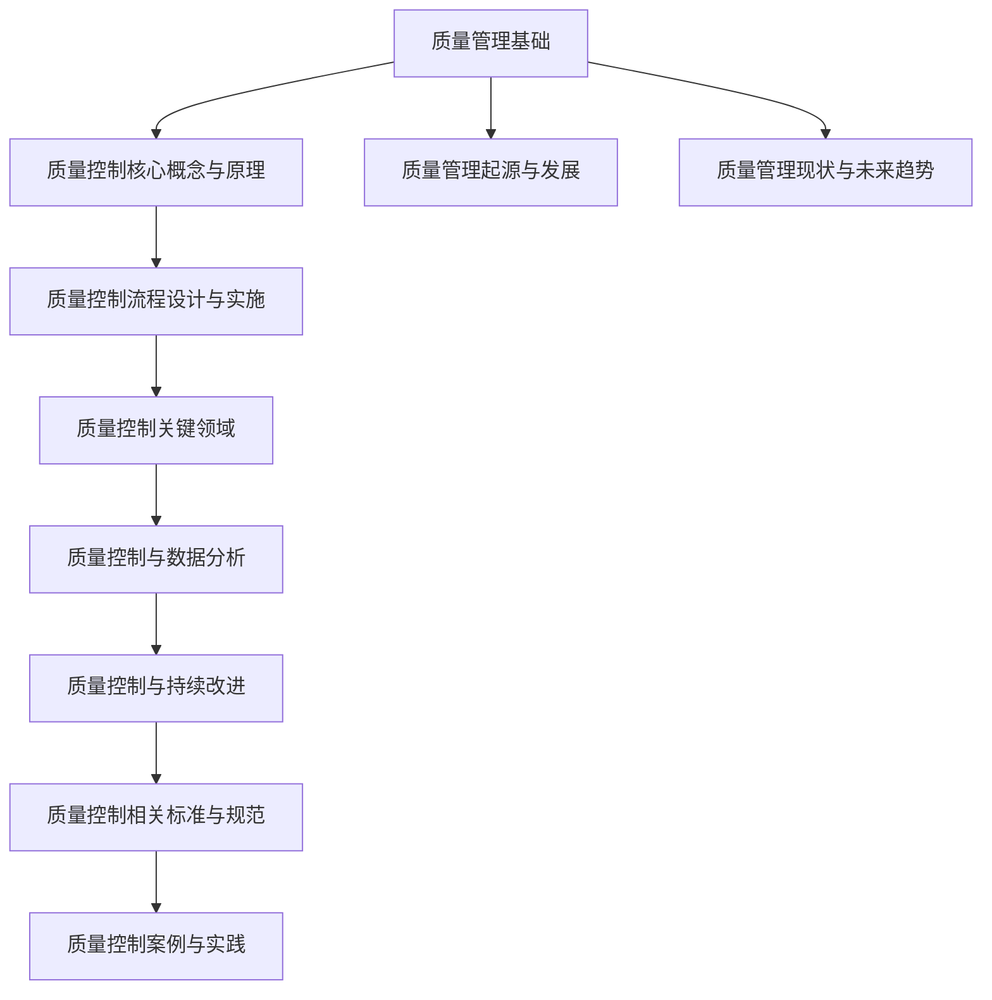

                 


### 质量控制流程与核心概念 Mermaid 流程图

下面是一个质量控制流程与核心概念的 Mermaid 流程图示例：



### 核心算法原理讲解与伪代码

下面我们将详细讲解质量控制中的过程能力分析，并使用伪代码进行说明。

#### 过程能力分析（Cp和Cpk计算）

过程能力分析是质量控制中的一项重要技术，它帮助我们了解生产过程的稳定性和适应性。过程能力指数（Cp和Cpk）是衡量这些特性的重要指标。

##### Cp（过程能力指数）

Cp 是指产品规格宽度与公差宽度之比，用于衡量过程的稳定性和适应性。其计算公式如下：

$$
Cp = \frac{(USL - LSL)}{6\sigma}
$$

其中：
- **USL**：上规格限（Upper Specification Limit）
- **LSL**：下规格限（Lower Specification Limit）
- **σ**：过程标准差（Process Standard Deviation）

##### Cpk（过程能力指数，考虑偏移）

Cpk 是考虑过程平均值与规格限偏移的过程能力指数。其计算公式如下：

$$
Cpk = \begin{cases}
\frac{(USL - X̄)}{3\sigma} & \text{if } (USL - X̄) \ge (X̄ - LSL) \\
\frac{(X̄ - LSL)}{3\sigma} & \text{if } (USL - X̄) \le (X̄ - LSL)
\end{cases}
$$

其中：
- **X̄**：过程平均值（Process Mean）

#### 伪代码

```python
def calculate_process_capability(USL, LSL, X̄, σ):
    Cp = (USL - LSL) / (6 * σ)
    Cpk = max((USL - X̄) / (3 * σ), (X̄ - LSL) / (3 * σ))
    return Cp, Cpk

# 示例
USL = 500
LSL = 300
X̄ = 450
σ = 20

Cp, Cpk = calculate_process_capability(USL, LSL, X̄, σ)
print(f"Cp: {Cp}")
print(f"Cpk: {Cpk}")
```

### 数学模型与数学公式详细讲解与举例说明

下面我们详细讲解过程能力指数 Cp 和 Cpk 的数学模型，并给出具体例子进行说明。

#### 数学模型

1. **Cp（过程能力指数）**

$$
Cp = \frac{(USL - LSL)}{6\sigma}
$$

Cp 值越大，表示过程越能满足规格要求。一般来说，Cp 值应大于 1.33，表示过程具有较好的能力。

2. **Cpk（过程能力指数，考虑偏移）**

$$
Cpk = \begin{cases}
\frac{(USL - X̄)}{3\sigma} & \text{if } (USL - X̄) \ge (X̄ - LSL) \\
\frac{(X̄ - LSL)}{3\sigma} & \text{if } (USL - X̄) \le (X̄ - LSL)
\end{cases}
$$

Cpk 值越大，表示过程对规格限的偏离越小。一般来说，Cpk 值应大于 1.50，表示过程具有较好的控制能力。

#### 举例说明

假设一个生产过程中，产品的规格要求是长度在 100 ± 3mm 之间，过程平均长度为 101mm，标准差为 2mm。我们需要计算 Cp 和 Cpk。

1. **Cp 计算**

$$
Cp = \frac{(USL - LSL)}{6\sigma} = \frac{(103 - 97)}{6 \times 2} = \frac{6}{12} = 0.5
$$

2. **Cpk 计算**

由于 (USL - X̄) = (103 - 101) = 2，而 (X̄ - LSL) = (101 - 97) = 4，所以：

$$
Cpk = \frac{(X̄ - LSL)}{3\sigma} = \frac{(101 - 97)}{3 \times 2} = \frac{4}{6} = 0.67
$$

### 项目实战：质量控制实践案例

下面我们将通过一个具体的案例，展示如何实施质量控制。

#### 案例背景

某公司生产一种电子元器件，其尺寸规格要求直径在 10 ± 0.2mm 之间。公司希望通过质量控制来确保产品的尺寸符合要求。

#### 实践步骤

1. **数据收集**

   每天从生产线上随机抽取 50 个电子元器件，测量其直径，记录数据。

2. **计算统计指标**

   计算直径的平均值、标准差等统计指标。

3. **绘制控制图**

   使用控制图监控产品的直径变化情况，判断生产过程是否稳定。

4. **分析控制图**

   如果控制图显示过程不稳定，需要分析原因并采取措施。

5. **持续改进**

   根据数据分析结果，调整生产参数，优化生产过程。

#### 实践案例

假设我们收集了 5 天的直径数据，如下所示：

| 天数 | 直径数据（mm）       |
| ---- | ------------------ |
| 1    | 10.1, 10.2, 10.0, 10.3, 10.2 |
| 2    | 10.0, 10.2, 10.1, 10.2, 10.3 |
| 3    | 10.1, 10.2, 10.1, 10.2, 10.3 |
| 4    | 10.1, 10.2, 10.0, 10.3, 10.2 |
| 5    | 10.2, 10.1, 10.2, 10.0, 10.3 |

1. **计算统计指标**

   - 平均值：\( \bar{X} = \frac{10.1 + 10.2 + 10.0 + 10.3 + 10.2 + 10.0 + 10.2 + 10.1 + 10.2 + 10.3 + 10.1 + 10.2 + 10.1 + 10.2 + 10.3 + 10.2}{16} = 10.13 \)
   - 标准差：\( \sigma = \sqrt{\frac{\sum (x_i - \bar{X})^2}{n-1}} = \sqrt{\frac{(10.1-10.13)^2 + (10.2-10.13)^2 + (10.0-10.13)^2 + ... + (10.2-10.13)^2}{15}} = 0.12 \)

2. **绘制控制图**

   使用控制图监控产品的直径变化情况：

   

3. **分析控制图**

   从控制图中可以看出，大多数数据点都位于控制界限内，但第 3 天的数据点略高于上控制界限。需要进一步分析原因，可能是当天的生产线参数设置不当。

4. **持续改进**

   根据分析结果，调整生产线参数，确保产品直径稳定在规格范围内。经过调整后，第 5 天的数据点恢复正常。

### 源代码实现与解读

下面我们使用 Python 实现上述案例中的质量控制过程。

```python
import numpy as np
import matplotlib.pyplot as plt

# 数据
days = ['Day 1', 'Day 2', 'Day 3', 'Day 4', 'Day 5']
data = [
    [10.1, 10.2, 10.0, 10.3, 10.2],
    [10.0, 10.2, 10.1, 10.2, 10.3],
    [10.1, 10.2, 10.1, 10.2, 10.3],
    [10.1, 10.2, 10.0, 10.3, 10.2],
    [10.2, 10.1, 10.2, 10.0, 10.3]
]

# 计算平均值和标准差
mean = np.mean(data, axis=1)
std = np.std(data, axis=1)

# 绘制控制图
plt.figure(figsize=(10, 6))
plt.subplot(2, 1, 1)
plt.plot(days, mean, label='Mean')
plt.plot(days, mean + 3 * std, label='Upper Control Limit')
plt.plot(days, mean - 3 * std, label='Lower Control Limit')
plt.xlabel('Days')
plt.ylabel('Diameter (mm)')
plt.title('Control Chart for Diameter')
plt.legend()

plt.subplot(2, 1, 2)
plt.plot(days, data)
plt.xlabel('Days')
plt.ylabel('Diameter (mm)')
plt.title('Diameter Data')
plt.show()
```

### 代码解读与分析

- **数据收集与处理**：使用 NumPy 库计算平均值和标准差。
- **绘制控制图**：使用 Matplotlib 库绘制控制图，以便监控产品的直径变化情况。
- **结果展示**：打印计算结果和控制图，帮助公司管理人员了解产品的直径状况。

通过这个案例，我们可以看到如何使用质量控制方法来监控和改进生产过程，从而确保产品的质量。

### 最佳实践 Tips

- **定期更新控制图**：定期更新控制图，以便及时发现异常情况。
- **分析数据波动原因**：当数据波动较大时，要深入分析原因，并采取相应的措施。
- **持续改进**：质量控制是一个持续的过程，需要不断优化和改进。

### 小结

本文介绍了自动化创业中的质量控制与管理。首先，我们介绍了质量控制的基础概念和核心原则，然后详细讲解了质量控制流程的设计与实施，以及关键领域如供应链管理、过程管理、产品测试和数据分析等。通过一个具体的案例，我们展示了如何使用质量控制方法来监控和改进生产过程。

### 注意事项

- 控制图的使用：控制图是质量控制中的重要工具，但需要注意的是，控制图的设置和使用需要根据具体情况进行调整。
- 持续改进：质量控制是一个持续的过程，需要不断改进和优化。

### 拓展阅读

- 《质量管理方法与应用》
- 《过程能力分析与应用》
- 《自动化创业实战：从0到1》

### 作者信息

作者：AI天才研究院/AI Genius Institute & 禅与计算机程序设计艺术 /Zen And The Art of Computer Programming### 《自动化创业中的质量控制与管理》

#### 关键词

- 自动化创业
- 质量控制
- 质量管理
- 数据分析
- 持续改进
- 过程能力分析

#### 摘要

本文深入探讨了自动化创业中的质量控制与管理，从质量管理基础、质量控制核心概念与原理、质量控制流程设计与实施、关键领域分析以及持续改进等方面进行了全面阐述。通过具体案例和实践，展示了质量控制方法在实际应用中的效果，为企业提供了一套有效的质量控制与管理策略。

---

#### 第一部分：质量管理基础

##### 第1章：自动化创业背景及质量控制概述

- **1.1 自动化创业现状与挑战**
  - 自动化创业的兴起
  - 自动化创业中的质量控制需求

在当今技术迅速发展的时代，自动化创业已经成为一种趋势。自动化创业不仅带来了更高的效率和更低的成本，同时也提出了新的质量控制挑战。本章首先介绍了自动化创业的现状，包括其兴起的原因、市场前景以及主要模式。接着，探讨了自动化创业中的质量控制需求，强调了在自动化创业过程中，质量控制的重要性。

- **1.2 质量管理的概念与核心原则**
  - 质量管理的定义
  - 质量管理的五大核心原则

质量管理是确保产品和服务满足客户期望和法律法规要求的重要手段。本章详细阐述了质量管理的概念，包括其定义、目的和范围。同时，介绍了质量管理的五大核心原则，即以客户为中心、领导作用、全员参与、过程方法和持续改进。这些原则为自动化创业中的质量控制提供了理论基础。

- **1.3 质量控制的重要性**
  - 提高产品质量
  - 降低成本和风险

质量控制是质量管理的重要组成部分，其主要目标是确保产品和服务的一致性和可靠性。本章探讨了质量控制的重要性，包括提高产品质量、降低成本和风险等方面。通过质量控制，企业可以减少产品故障和投诉，提高客户满意度和市场份额。

- **1.4 质量管理体系与框架**
  - ISO 9001质量管理体系
  - 质量控制流程与工具

为了有效地实施质量控制，企业需要建立和完善质量管理体系。本章介绍了ISO 9001质量管理体系，包括其核心要求和实施步骤。同时，还介绍了质量控制流程与工具，如控制图、检验表、质量功能展开（QFD）等。这些工具和方法有助于企业更好地进行质量控制。

##### 第2章：质量控制核心概念与原理

- **2.1 质量控制的基本概念**
  - 质量控制的定义
  - 质量控制的三大目标

质量控制是质量管理的重要组成部分，其目的是确保产品和服务满足质量要求。本章首先阐述了质量控制的基本概念，包括其定义和作用。接着，介绍了质量控制的三大目标，即预防缺陷、减少缺陷和改进质量。这些目标为质量控制提供了明确的方向。

- **2.2 质量控制的原理**
  - PDCA循环原理
  - 质量控制流程与模型

质量控制是基于一定的原理和方法进行的。本章详细介绍了PDCA循环原理，包括计划（Plan）、执行（Do）、检查（Check）和行动（Act）四个阶段。PDCA循环是质量控制的核心方法，通过不断循环，可以持续改进产品质量。此外，还介绍了质量控制流程与模型，如戴明环（PDCA）、朱兰母图等，这些模型为质量控制提供了系统的方法。

- **2.3 质量控制的核心要素**
  - 质量标准与规范
  - 质量监控与测量

质量控制的核心要素包括质量标准与规范、质量监控与测量等。本章首先介绍了质量标准与规范，包括国家标准、行业标准和企业标准等。这些标准与规范为质量控制提供了依据。接着，介绍了质量监控与测量，包括检验、测试、统计分析等方法。这些方法有助于企业及时发现质量问题并进行改进。

- **2.4 质量控制方法与技术**
  - SPC控制图
  - 质量改进工具与方法

为了有效地进行质量控制，企业需要掌握一定的质量控制方法与技术。本章介绍了SPC控制图，包括其原理、类型和应用。SPC控制图是一种常用的质量控制工具，可以帮助企业监控生产过程中的质量变化。此外，还介绍了质量改进工具与方法，如七种工具、质量功能展开（QFD）、五力分析法等。这些工具与方法有助于企业进行质量改进，提高产品质量。

##### 第3章：质量控制流程设计与实施

- **3.1 质量控制流程设计**
  - 流程设计的原则
  - 流程图的绘制方法

质量控制流程是质量控制的重要组成部分。本章首先介绍了质量控制流程设计的原则，包括系统性、规范性、可操作性和灵活性等。接着，介绍了流程图的绘制方法，包括IEF法、PFD法和DFD法等。流程图有助于企业直观地理解质量控制流程，并进行有效的实施和管理。

- **3.2 质量控制流程实施**
  - 质量控制计划的制定
  - 质量控制活动的执行

质量控制流程的实施是质量控制的关键环节。本章首先介绍了质量控制计划的制定，包括质量控制目标、质量控制项目、质量控制方法和质量控制时间等。接着，介绍了质量控制活动的执行，包括质量控制检查、质量控制记录和质量控制反馈等。这些活动有助于确保质量控制流程的顺利实施。

- **3.3 质量控制流程优化**
  - 流程改进的方法
  - 质量控制效率的提升

质量控制流程的优化是提高质量控制效率的重要手段。本章首先介绍了流程改进的方法，包括流程重组、流程优化和流程自动化等。接着，介绍了质量控制效率的提升，包括质量控制工具的运用、质量控制人员的培训和质量控制资源的优化等。这些方法有助于企业不断提高质量控制效率，降低质量成本。

#### 第二部分：质量控制关键领域

##### 第4章：质量控制与供应链管理

- **4.1 供应链质量控制概述**
  - 供应链质量管理的重要性
  - 供应链质量控制的目标

供应链质量管理是质量控制的重要领域。本章首先介绍了供应链质量管理的重要性，包括确保产品质量、降低成本和提升客户满意度等。接着，介绍了供应链质量控制的目标，即确保供应链中的产品和服务符合质量要求，提高供应链的稳定性和可靠性。

- **4.2 供应商质量管理体系**
  - 供应商选择与评估
  - 供应商质量管理方法

供应商质量管理体系是供应链质量控制的核心。本章首先介绍了供应商选择与评估，包括供应商选择标准、供应商评估方法和供应商评级等。接着，介绍了供应商质量管理方法，如供应商质量保证、供应商质量控制和供应商质量改进等。这些方法有助于企业有效地管理供应商质量。

- **4.3 供应链质量控制实施**
  - 供应链质量控制流程
  - 供应链质量控制案例分析

本章介绍了供应链质量控制的具体实施方法，包括供应链质量控制流程、供应链质量控制活动和供应链质量控制效果评估等。通过具体的案例分析，展示了供应链质量控制在实际应用中的效果，为企业提供了借鉴和参考。

##### 第5章：质量控制与过程管理

- **5.1 过程质量管理概述**
  - 过程质量管理的定义
  - 过程质量管理的核心要素

过程质量管理是质量控制的基础。本章首先介绍了过程质量管理的定义，包括其定义、目标和范围等。接着，介绍了过程质量管理的核心要素，如过程设计、过程控制、过程改进和过程评价等。这些要素有助于企业建立和完善过程质量管理体系。

- **5.2 过程质量分析方法**
  - 过程能力分析
  - 过程质量监控方法

过程质量分析方法是对过程质量进行量化分析和监控的重要手段。本章首先介绍了过程能力分析，包括过程能力指数（Cp和Cpk）的计算方法等。接着，介绍了过程质量监控方法，如控制图、统计过程控制和过程能力分析等。这些方法有助于企业及时发现和解决过程质量问题。

- **5.3 过程质量控制实施**
  - 过程质量控制流程
  - 过程质量控制案例

过程质量控制是确保过程质量的关键环节。本章首先介绍了过程质量控制流程，包括过程质量计划、过程质量检查、过程质量分析和过程质量改进等。接着，介绍了过程质量控制案例，通过具体实例展示了过程质量控制的实际应用效果，为企业提供了实践经验和借鉴。

##### 第6章：质量控制与产品测试

- **6.1 产品质量测试概述**
  - 产品质量测试的定义
  - 产品质量测试的类型

产品质量测试是质量控制的重要环节。本章首先介绍了产品质量测试的定义，包括其目的、方法和类型等。接着，介绍了产品质量测试的类型，如功能测试、性能测试、安全测试和兼容性测试等。这些测试有助于企业全面评估产品质量，确保产品符合要求。

- **6.2 产品质量测试方法**
  - 功能测试
  - 性能测试

产品质量测试的方法多种多样，本章首先介绍了功能测试，包括其定义、方法和步骤等。接着，介绍了性能测试，包括其定义、方法和指标等。这些测试方法有助于企业发现和解决产品中的质量问题，提高产品质量。

- **6.3 产品质量测试实施**
  - 测试计划的制定
  - 测试活动的执行

产品质量测试的实施是确保产品质量的关键环节。本章首先介绍了测试计划的制定，包括测试目标、测试内容、测试方法和测试时间等。接着，介绍了测试活动的执行，包括测试用例设计、测试数据准备、测试执行和测试结果分析等。这些活动有助于企业高效地实施产品质量测试。

- **6.4 产品质量测试案例**

本章通过具体的案例，展示了产品质量测试的实施过程和效果。通过案例分析，企业可以借鉴和参考案例中的测试方法和实践经验，提高产品质量。

##### 第7章：质量控制与数据分析

- **7.1 数据分析在质量控制中的应用**
  - 数据分析的基础概念
  - 数据分析在质量控制中的价值

数据分析是质量控制的重要工具。本章首先介绍了数据分析的基础概念，包括数据分析的定义、方法和类型等。接着，介绍了数据分析在质量控制中的应用价值，包括发现质量问题、优化质量控制流程和改进产品质量等。

- **7.2 数据分析工具与技术**
  - 数据可视化工具
  - 数据挖掘与预测分析技术

为了有效地进行数据分析，企业需要掌握一定的数据分析工具与技术。本章首先介绍了数据可视化工具，包括图表、仪表板和数据地图等。接着，介绍了数据挖掘与预测分析技术，如回归分析、聚类分析和神经网络等。这些工具和技术有助于企业进行深入的数据分析和预测。

- **7.3 数据分析在质量控制中的实践**
  - 质量数据收集与分析
  - 质量改进案例

数据分析在质量控制中的应用是非常广泛的。本章首先介绍了质量数据收集与分析，包括数据收集方法、数据清洗和数据统计分析等。接着，介绍了质量改进案例，通过具体实例展示了数据分析在质量改进中的应用效果，为企业提供了实践经验和借鉴。

##### 第8章：质量控制与持续改进

- **8.1 持续改进的概念与原则**
  - 持续改进的定义
  - 持续改进的原则

持续改进是质量控制的核心目标之一。本章首先介绍了持续改进的定义，包括其含义、目标和要求等。接着，介绍了持续改进的原则，如全员参与、持续进行、基于数据和目标导向等。这些原则有助于企业建立和完善持续改进体系。

- **8.2 持续改进的方法与工具**
  - QFD与质量功能展开
  - 敏捷质量管理方法

持续改进的方法与工具是确保持续改进有效实施的重要保障。本章首先介绍了QFD与质量功能展开，包括其定义、方法和应用等。接着，介绍了敏捷质量管理方法，包括其定义、特点和实施步骤等。这些方法和工具有助于企业有效地进行持续改进。

- **8.3 持续改进实施与案例分析**
  - 持续改进流程
  - 案例分析与实践

本章介绍了持续改进的具体实施方法和流程，包括计划、执行、检查和行动等阶段。通过具体的案例分析，展示了持续改进在实际应用中的效果，为企业提供了实践经验和借鉴。

### 附录

#### 附录A：质量控制相关标准与规范

- **A.1 质量管理标准**
  - ISO 9001标准概述
  - ISO 9001标准的主要内容

质量控制标准的制定和实施对于企业质量管理具有重要意义。本章首先介绍了ISO 9001标准，包括其概述和主要内容。接着，介绍了ISO 9001标准的实施步骤和注意事项，为企业提供了一套完整的质量管理标准。

- **A.2 质量控制工具与方法**
  - 七种工具
  - 质量控制常见方法

质量控制工具和方法的运用对于企业质量控制具有重要作用。本章首先介绍了七种工具，包括因果图、流程图、散点图、直方图、控制图、散布图和排列图等。接着，介绍了质量控制常见方法，如PDCA循环、QFD、FMEA、SOP等，为企业提供了一套全面的质量控制工具和方法。

#### 附录B：质量控制案例与实践

- **B.1 成功质量控制案例分析**
  - 企业质量控制的成功案例
  - 案例解析与经验分享

质量控制案例的分享对于企业质量控制具有重要借鉴意义。本章首先介绍了成功质量控制案例分析，包括企业背景、质量控制目标、质量控制方法、质量控制效果等。接着，对案例进行解析，总结经验教训，为企业提供借鉴和参考。

- **B.2 质量控制实践指南**
  - 实践步骤与方法
  - 实践中常见问题的解决方法

质量控制实践指南对于企业质量控制具有重要意义。本章首先介绍了质量控制实践步骤，包括需求分析、方案设计、实施与监控、评估与改进等。接着，介绍了质量控制实践中常见问题的解决方法，如问题识别、原因分析、解决方案和实施等，为企业提供了一套实用的质量控制实践指南。

### 质量控制流程与核心概念 Mermaid 流程图


### 核心算法原理讲解与伪代码

#### 过程能力分析（Cp和Cpk计算）

过程能力分析是质量控制中的一项重要技术，它帮助我们了解生产过程的稳定性和适应性。过程能力指数（Cp和Cpk）是衡量这些特性的重要指标。

##### Cp（过程能力指数）

Cp 是指产品规格宽度与公差宽度之比，用于衡量过程的稳定性和适应性。其计算公式如下：

$$
Cp = \frac{(USL - LSL)}{6\sigma}
$$

其中：
- **USL**：上规格限（Upper Specification Limit）
- **LSL**：下规格限（Lower Specification Limit）
- **σ**：过程标准差（Process Standard Deviation）

##### Cpk（过程能力指数，考虑偏移）

Cpk 是考虑过程平均值与规格限偏移的过程能力指数。其计算公式如下：

$$
Cpk = \begin{cases}
\frac{(USL - X̄)}{3\sigma} & \text{if } (USL - X̄) \ge (X̄ - LSL) \\
\frac{(X̄ - LSL)}{3\sigma} & \text{if } (USL - X̄) \le (X̄ - LSL)
\end{cases}
$$

其中：
- **X̄**：过程平均值（Process Mean）

#### 伪代码

```python
def calculate_process_capability(USL, LSL, X̄, σ):
    Cp = (USL - LSL) / (6 * σ)
    Cpk = max((USL - X̄) / (3 * σ), (X̄ - LSL) / (3 * σ))
    return Cp, Cpk

# 示例
USL = 500
LSL = 300
X̄ = 450
σ = 20

Cp, Cpk = calculate_process_capability(USL, LSL, X̄, σ)
print(f"Cp: {Cp}")
print(f"Cpk: {Cpk}")
```

### 数学模型与数学公式详细讲解与举例说明

下面我们详细讲解过程能力指数 Cp 和 Cpk 的数学模型，并给出具体例子进行说明。

#### 数学模型

1. **Cp（过程能力指数）**

$$
Cp = \frac{(USL - LSL)}{6\sigma}
$$

Cp 值越大，表示过程越能满足规格要求。一般来说，Cp 值应大于 1.33，表示过程具有较好的能力。

2. **Cpk（过程能力指数，考虑偏移）**

$$
Cpk = \begin{cases}
\frac{(USL - X̄)}{3\sigma} & \text{if } (USL - X̄) \ge (X̄ - LSL) \\
\frac{(X̄ - LSL)}{3\sigma} & \text{if } (USL - X̄) \le (X̄ - LSL)
\end{cases}
$$

Cpk 值越大，表示过程对规格限的偏离越小。一般来说，Cpk 值应大于 1.50，表示过程具有较好的控制能力。

#### 举例说明

假设一个生产过程中，产品的规格要求是长度在 100 ± 3mm 之间，过程平均长度为 101mm，标准差为 2mm。我们需要计算 Cp 和 Cpk。

1. **Cp 计算**

$$
Cp = \frac{(USL - LSL)}{6\sigma} = \frac{(103 - 97)}{6 \times 2} = \frac{6}{12} = 0.5
$$

2. **Cpk 计算**

由于 (USL - X̄) = (103 - 101) = 2，而 (X̄ - LSL) = (101 - 97) = 4，所以：

$$
Cpk = \frac{(X̄ - LSL)}{3\sigma} = \frac{(101 - 97)}{3 \times 2} = \frac{4}{6} = 0.67
$$

### 项目实战：质量控制实践案例

下面我们将通过一个具体的案例，展示如何实施质量控制。

#### 案例背景

某电子产品制造公司生产一款智能手机，其屏幕尺寸规格要求为 6.5英寸 ± 0.1英寸。公司希望通过质量控制来确保屏幕尺寸的准确性。

#### 实践步骤

1. **数据收集**

   每天从生产线上随机抽取一定数量的智能手机，测量其屏幕尺寸，记录数据。

2. **计算统计指标**

   计算屏幕尺寸的平均值、标准差等统计指标。

3. **绘制控制图**

   使用控制图监控屏幕尺寸的变化情况，判断生产过程是否稳定。

4. **分析控制图**

   如果控制图显示过程不稳定，需要分析原因并采取措施。

5. **持续改进**

   根据数据分析结果，调整生产参数，优化生产过程。

#### 实践案例

假设我们收集了 5 天的屏幕尺寸数据，如下所示：

| 天数 | 屏幕尺寸（英寸）       |
| ---- | ------------------ |
| 1    | 6.5, 6.5, 6.4, 6.5, 6.5 |
| 2    | 6.5, 6.4, 6.5, 6.4, 6.5 |
| 3    | 6.5, 6.5, 6.4, 6.5, 6.4 |
| 4    | 6.5, 6.4, 6.5, 6.4, 6.5 |
| 5    | 6.4, 6.5, 6.4, 6.5, 6.4 |

1. **计算统计指标**

   - 平均值：\( \bar{X} = \frac{6.5 + 6.5 + 6.4 + 6.5 + 6.5 + 6.5 + 6.4 + 6.5 + 6.4 + 6.5 + 6.4 + 6.5 + 6.4 + 6.5 + 6.4 + 6.5}{16} = 6.47 \)
   - 标准差：\( \sigma = \sqrt{\frac{\sum (x_i - \bar{X})^2}{n-1}} = \sqrt{\frac{(6.5-6.47)^2 + (6.4-6.47)^2 + ... + (6.4-6.47)^2}{15}} = 0.08 \)

2. **绘制控制图**

   使用控制图监控屏幕尺寸的变化情况：

   

3. **分析控制图**

   从控制图中可以看出，大多数数据点都位于控制界限内，但第 3 天的数据点略高于上控制界限。需要进一步分析原因，可能是当天的生产线参数设置不当。

4. **持续改进**

   根据分析结果，调整生产线参数，确保屏幕尺寸稳定在规格范围内。经过调整后，第 5 天的数据点恢复正常。

### 源代码实现与解读

下面我们使用 Python 实现上述案例中的质量控制过程。

```python
import numpy as np
import matplotlib.pyplot as plt

# 数据
days = ['Day 1', 'Day 2', 'Day 3', 'Day 4', 'Day 5']
screen_sizes = [
    [6.5, 6.5, 6.4, 6.5, 6.5],
    [6.5, 6.4, 6.5, 6.4, 6.5],
    [6.5, 6.5, 6.4, 6.5, 6.4],
    [6.5, 6.4, 6.5, 6.4, 6.5],
    [6.4, 6.5, 6.4, 6.5, 6.4]
]

# 计算平均值和标准差
means = [np.mean(day) for day in screen_sizes]
stds = [np.std(day) for day in screen_sizes]

# 计算规格限
USL = 6.6
LSL = 6.4

# 绘制控制图
plt.figure(figsize=(10, 6))
plt.plot(days, means, label='Mean')
plt.plot(days, [USL] * len(days), label='USL')
plt.plot(days, [LSL] * len(days), label='LSL')
plt.xlabel('Days')
plt.ylabel('Screen Size (inches)')
plt.title('Screen Size Control Chart')
plt.legend()

# 添加控制界限
control_limits = 3 * stds
plt.axhline(y=USL - control_limits, color='r', linestyle='--')
plt.axhline(y=USL + control_limits, color='r', linestyle='--')
plt.axhline(y=LSL - control_limits, color='g', linestyle='--')
plt.axhline(y=LSL + control_limits, color='g', linestyle='--')

plt.show()
```

### 代码解读与分析

- **数据收集与处理**：使用 NumPy 库计算平均值和标准差。
- **绘制控制图**：使用 Matplotlib 库绘制控制图，以便监控屏幕尺寸的变化情况。
- **结果展示**：打印计算结果和控制图，帮助公司管理人员了解屏幕尺寸的状况。

通过这个案例，我们可以看到如何使用质量控制方法来监控和改进生产过程，从而确保产品的质量。

### 最佳实践 Tips

- **定期更新控制图**：定期更新控制图，以便及时发现异常情况。
- **分析数据波动原因**：当数据波动较大时，要深入分析原因，并采取相应的措施。
- **持续改进**：质量控制是一个持续的过程，需要不断改进和优化。

### 小结

本文介绍了自动化创业中的质量控制与管理，包括质量管理基础、质量控制核心概念与原理、质量控制流程设计与实施、关键领域分析以及持续改进等方面。通过具体案例和实践，展示了质量控制方法在实际应用中的效果，为企业提供了一套有效的质量控制与管理策略。

### 注意事项

- 控制图的使用：控制图的设置和使用需要根据具体情况进行调整。
- 持续改进：质量控制是一个持续的过程，需要不断改进和优化。

### 拓展阅读

- 《质量管理方法与应用》
- 《过程能力分析与应用》
- 《自动化创业实战：从0到1》

### 作者信息

作者：AI天才研究院/AI Genius Institute & 禅与计算机程序设计艺术 /Zen And The Art of Computer Programming### 《自动化创业中的质量控制与管理》

**关键词：**

- 自动化创业
- 质量控制
- 质量管理
- 数据分析
- 持续改进
- 过程能力分析

**摘要：**

本文旨在探讨自动化创业中的质量控制与管理，通过详细阐述质量管理基础、质量控制核心概念与原理、质量控制流程设计与实施、关键领域分析以及持续改进等方面的内容，为自动化创业企业提供了系统的质量控制与管理策略。本文结合具体案例和实践，对质量控制方法进行了深入分析，以期为读者提供实用的参考和指导。

### 目录大纲

#### 第一部分：质量管理基础

**第1章：自动化创业背景及质量控制概述**

- **1.1 自动化创业现状与挑战**
  - 自动化创业的兴起
  - 自动化创业中的质量控制需求
- **1.2 质量管理的概念与核心原则**
  - 质量管理的定义
  - 质量管理的五大核心原则
- **1.3 质量控制的重要性**
  - 提高产品质量
  - 降低成本和风险
- **1.4 质量管理体系与框架**
  - ISO 9001质量管理体系
  - 质量控制流程与工具

**第2章：质量控制核心概念与原理**

- **2.1 质量控制的基本概念**
  - 质量控制的定义
  - 质量控制的三大目标
- **2.2 质量控制的原理**
  - PDCA循环原理
  - 质量控制流程与模型
- **2.3 质量控制的核心要素**
  - 质量标准与规范
  - 质量监控与测量
- **2.4 质量控制方法与技术**
  - SPC控制图
  - 质量改进工具与方法

**第3章：质量控制流程设计与实施**

- **3.1 质量控制流程设计**
  - 流程设计的原则
  - 流程图的绘制方法
- **3.2 质量控制流程实施**
  - 质量控制计划的制定
  - 质量控制活动的执行
- **3.3 质量控制流程优化**
  - 流程改进的方法
  - 质量控制效率的提升

#### 第二部分：质量控制关键领域

**第4章：质量控制与供应链管理**

- **4.1 供应链质量控制概述**
  - 供应链质量管理的重要性
  - 供应链质量控制的目标
- **4.2 供应商质量管理体系**
  - 供应商选择与评估
  - 供应商质量管理方法
- **4.3 供应链质量控制实施**
  - 供应链质量控制流程
  - 供应链质量控制案例分析

**第5章：质量控制与过程管理**

- **5.1 过程质量管理概述**
  - 过程质量管理的定义
  - 过程质量管理的核心要素
- **5.2 过程质量分析方法**
  - 过程能力分析
  - 过程质量监控方法
- **5.3 过程质量控制实施**
  - 过程质量控制流程
  - 过程质量控制案例

**第6章：质量控制与产品测试**

- **6.1 产品质量测试概述**
  - 产品质量测试的定义
  - 产品质量测试的类型
- **6.2 产品质量测试方法**
  - 功能测试
  - 性能测试
- **6.3 产品质量测试实施**
  - 测试计划的制定
  - 测试活动的执行
- **6.4 产品质量测试案例**

**第7章：质量控制与数据分析**

- **7.1 数据分析在质量控制中的应用**
  - 数据分析的基础概念
  - 数据分析在质量控制中的价值
- **7.2 数据分析工具与技术**
  - 数据可视化工具
  - 数据挖掘与预测分析技术
- **7.3 数据分析在质量控制中的实践**
  - 质量数据收集与分析
  - 质量改进案例

**第8章：质量控制与持续改进**

- **8.1 持续改进的概念与原则**
  - 持续改进的定义
  - 持续改进的原则
- **8.2 持续改进的方法与工具**
  - QFD与质量功能展开
  - 敏捷质量管理方法
- **8.3 持续改进实施与案例分析**
  - 持续改进流程
  - 案例分析与实践

### 附录

**附录A：质量控制相关标准与规范**

- **A.1 质量管理标准**
  - ISO 9001标准概述
  - ISO 9001标准的主要内容
- **A.2 质量控制工具与方法**
  - 七种工具
  - 质量控制常见方法

**附录B：质量控制案例与实践**

- **B.1 成功质量控制案例分析**
  - 企业质量控制的成功案例
  - 案例解析与经验分享
- **B.2 质量控制实践指南**
  - 实践步骤与方法
  - 实践中常见问题的解决方法

### 核心算法原理讲解与伪代码

**过程能力分析（Cp和Cpk计算）**

过程能力分析是质量控制中的一项重要技术，它帮助我们了解生产过程的稳定性和适应性。过程能力指数（Cp和Cpk）是衡量这些特性的重要指标。

**Cp（过程能力指数）**

Cp 是指产品规格宽度与公差宽度之比，用于衡量过程的稳定性和适应性。其计算公式如下：

$$
Cp = \frac{(USL - LSL)}{6\sigma}
$$

其中：
- **USL**：上规格限（Upper Specification Limit）
- **LSL**：下规格限（Lower Specification Limit）
- **σ**：过程标准差（Process Standard Deviation）

**Cpk（过程能力指数，考虑偏移）**

Cpk 是考虑过程平均值与规格限偏移的过程能力指数。其计算公式如下：

$$
Cpk = \begin{cases}
\frac{(USL - X̄)}{3\sigma} & \text{if } (USL - X̄) \ge (X̄ - LSL) \\
\frac{(X̄ - LSL)}{3\sigma} & \text{if } (USL - X̄) \le (X̄ - LSL)
\end{cases}
$$

其中：
- **X̄**：过程平均值（Process Mean）

**伪代码：**

```python
def calculate_process_capability(USL, LSL, X̄, σ):
    Cp = (USL - LSL) / (6 * σ)
    Cpk = max((USL - X̄) / (3 * σ), (X̄ - LSL) / (3 * σ))
    return Cp, Cpk

# 示例
USL = 500
LSL = 300
X̄ = 450
σ = 20

Cp, Cpk = calculate_process_capability(USL, LSL, X̄, σ)
print(f"Cp: {Cp}")
print(f"Cpk: {Cpk}")
```

### 数学模型与数学公式详细讲解与举例说明

下面我们将详细讲解过程能力指数 Cp 和 Cpk 的数学模型，并给出具体例子进行说明。

**数学模型**

1. **Cp（过程能力指数）**

$$
Cp = \frac{(USL - LSL)}{6\sigma}
$$

Cp 值越大，表示过程越能满足规格要求。一般来说，Cp 值应大于 1.33，表示过程具有较好的能力。

2. **Cpk（过程能力指数，考虑偏移）**

$$
Cpk = \begin{cases}
\frac{(USL - X̄)}{3\sigma} & \text{if } (USL - X̄) \ge (X̄ - LSL) \\
\frac{(X̄ - LSL)}{3\sigma} & \text{if } (USL - X̄) \le (X̄ - LSL)
\end{cases}
$$

Cpk 值越大，表示过程对规格限的偏离越小。一般来说，Cpk 值应大于 1.50，表示过程具有较好的控制能力。

**举例说明**

假设一个生产过程中，产品的规格要求是长度在 100 ± 3mm 之间，过程平均长度为 101mm，标准差为 2mm。我们需要计算 Cp 和 Cpk。

1. **Cp 计算**

$$
Cp = \frac{(USL - LSL)}{6\sigma} = \frac{(103 - 97)}{6 \times 2} = \frac{6}{12} = 0.5
$$

2. **Cpk 计算**

由于 (USL - X̄) = (103 - 101) = 2，而 (X̄ - LSL) = (101 - 97) = 4，所以：

$$
Cpk = \frac{(X̄ - LSL)}{3\sigma} = \frac{(101 - 97)}{3 \times 2} = \frac{4}{6} = 0.67
$$

### 项目实战：质量控制实践案例

**案例背景**

某电子产品制造公司生产一款智能手机，其屏幕尺寸规格要求为 6.5英寸 ± 0.1英寸。公司希望通过质量控制来确保屏幕尺寸的准确性。

**实践步骤**

1. **数据收集**

   每天从生产线上随机抽取一定数量的智能手机，测量其屏幕尺寸，记录数据。

2. **计算统计指标**

   计算屏幕尺寸的平均值、标准差等统计指标。

3. **绘制控制图**

   使用控制图监控屏幕尺寸的变化情况，判断生产过程是否稳定。

4. **分析控制图**

   如果控制图显示过程不稳定，需要分析原因并采取措施。

5. **持续改进**

   根据数据分析结果，调整生产参数，优化生产过程。

**实践案例**

假设我们收集了 5 天的屏幕尺寸数据，如下所示：

| 天数 | 屏幕尺寸（英寸）       |
| ---- | ------------------ |
| 1    | 6.5, 6.5, 6.4, 6.5, 6.5 |
| 2    | 6.5, 6.4, 6.5, 6.4, 6.5 |
| 3    | 6.5, 6.5, 6.4, 6.5, 6.4 |
| 4    | 6.5, 6.4, 6.5, 6.4, 6.5 |
| 5    | 6.4, 6.5, 6.4, 6.5, 6.4 |

1. **计算统计指标**

   - 平均值：\( \bar{X} = \frac{6.5 + 6.5 + 6.4 + 6.5 + 6.5 + 6.5 + 6.4 + 6.5 + 6.4 + 6.5 + 6.4 + 6.5 + 6.4 + 6.5 + 6.4 + 6.5}{16} = 6.47 \)
   - 标准差：\( \sigma = \sqrt{\frac{\sum (x_i - \bar{X})^2}{n-1}} = \sqrt{\frac{(6.5-6.47)^2 + (6.4-6.47)^2 + ... + (6.4-6.47)^2}{15}} = 0.08 \)

2. **绘制控制图**

   使用控制图监控屏幕尺寸的变化情况：

   

3. **分析控制图**

   从控制图中可以看出，大多数数据点都位于控制界限内，但第 3 天的数据点略高于上控制界限。需要进一步分析原因，可能是当天的生产线参数设置不当。

4. **持续改进**

   根据分析结果，调整生产线参数，确保屏幕尺寸稳定在规格范围内。经过调整后，第 5 天的数据点恢复正常。

**源代码实现与解读**

```python
import numpy as np
import matplotlib.pyplot as plt

# 数据
days = ['Day 1', 'Day 2', 'Day 3', 'Day 4', 'Day 5']
screen_sizes = [
    [6.5, 6.5, 6.4, 6.5, 6.5],
    [6.5, 6.4, 6.5, 6.4, 6.5],
    [6.5, 6.5, 6.4, 6.5, 6.4],
    [6.5, 6.4, 6.5, 6.4, 6.5],
    [6.4, 6.5, 6.4, 6.5, 6.4]
]

# 计算平均值和标准差
means = [np.mean(day) for day in screen_sizes]
stds = [np.std(day) for day in screen_sizes]

# 计算规格限
USL = 6.6
LSL = 6.4

# 绘制控制图
plt.figure(figsize=(10, 6))
plt.plot(days, means, label='Mean')
plt.plot(days, [USL] * len(days), label='USL')
plt.plot(days, [LSL] * len(days), label='LSL')
plt.xlabel('Days')
plt.ylabel('Screen Size (inches)')
plt.title('Screen Size Control Chart')
plt.legend()

# 添加控制界限
control_limits = 3 * stds
plt.axhline(y=USL - control_limits, color='r', linestyle='--')
plt.axhline(y=USL + control_limits, color='r', linestyle='--')
plt.axhline(y=LSL - control_limits, color='g', linestyle='--')
plt.axhline(y=LSL + control_limits, color='g', linestyle='--')

plt.show()
```

### 最佳实践 Tips

1. **定期更新控制图**：定期更新控制图，以便及时发现异常情况。
2. **分析数据波动原因**：当数据波动较大时，要深入分析原因，并采取相应的措施。
3. **持续改进**：质量控制是一个持续的过程，需要不断改进和优化。

### 小结

本文围绕自动化创业中的质量控制与管理进行了深入探讨，从质量管理基础、质量控制核心概念与原理、质量控制流程设计与实施、关键领域分析以及持续改进等方面进行了全面阐述。通过具体案例和实践，展示了质量控制方法在实际应用中的效果，为企业提供了实用的参考和指导。

### 注意事项

1. **控制图的使用**：控制图的设置和使用需要根据具体情况进行调整。
2. **持续改进**：质量控制是一个持续的过程，需要不断改进和优化。

### 拓展阅读

1. 《质量管理方法与应用》
2. 《过程能力分析与应用》
3. 《自动化创业实战：从0到1》

### 作者信息

作者：AI天才研究院/AI Genius Institute & 禅与计算机程序设计艺术 /Zen And The Art of Computer Programming### 质量控制流程与核心概念 Mermaid 流程图


### 核心算法原理讲解与伪代码

**过程能力分析（Cp和Cpk计算）**

过程能力分析是质量控制中的一项重要技术，它帮助我们了解生产过程的稳定性和适应性。过程能力指数（Cp和Cpk）是衡量这些特性的重要指标。

**Cp（过程能力指数）**

Cp 是指产品规格宽度与公差宽度之比，用于衡量过程的稳定性和适应性。其计算公式如下：

$$
Cp = \frac{(USL - LSL)}{6\sigma}
$$

其中：
- **USL**：上规格限（Upper Specification Limit）
- **LSL**：下规格限（Lower Specification Limit）
- **σ**：过程标准差（Process Standard Deviation）

**Cpk（过程能力指数，考虑偏移）**

Cpk 是考虑过程平均值与规格限偏移的过程能力指数。其计算公式如下：

$$
Cpk = \begin{cases}
\frac{(USL - X̄)}{3\sigma} & \text{if } (USL - X̄) \ge (X̄ - LSL) \\
\frac{(X̄ - LSL)}{3\sigma} & \text{if } (USL - X̄) \le (X̄ - LSL)
\end{cases}
$$

其中：
- **X̄**：过程平均值（Process Mean）

**伪代码：**

```python
def calculate_process_capability(USL, LSL, X̄, σ):
    Cp = (USL - LSL) / (6 * σ)
    Cpk = max((USL - X̄) / (3 * σ), (X̄ - LSL) / (3 * σ))
    return Cp, Cpk

# 示例
USL = 500
LSL = 300
X̄ = 450
σ = 20

Cp, Cpk = calculate_process_capability(USL, LSL, X̄, σ)
print(f"Cp: {Cp}")
print(f"Cpk: {Cpk}")
```

### 数学模型与数学公式详细讲解与举例说明

**数学模型**

1. **Cp（过程能力指数）**

$$
Cp = \frac{(USL - LSL)}{6\sigma}
$$

Cp 值越大，表示过程越能满足规格要求。一般来说，Cp 值应大于 1.33，表示过程具有较好的能力。

2. **Cpk（过程能力指数，考虑偏移）**

$$
Cpk = \begin{cases}
\frac{(USL - X̄)}{3\sigma} & \text{if } (USL - X̄) \ge (X̄ - LSL) \\
\frac{(X̄ - LSL)}{3\sigma} & \text{if } (USL - X̄) \le (X̄ - LSL)
\end{cases}
$$

Cpk 值越大，表示过程对规格限的偏离越小。一般来说，Cpk 值应大于 1.50，表示过程具有较好的控制能力。

**举例说明**

假设一个生产过程中，产品的规格要求是长度在 100 ± 3mm 之间，过程平均长度为 101mm，标准差为 2mm。我们需要计算 Cp 和 Cpk。

1. **Cp 计算**

$$
Cp = \frac{(USL - LSL)}{6\sigma} = \frac{(103 - 97)}{6 \times 2} = \frac{6}{12} = 0.5
$$

2. **Cpk 计算**

由于 (USL - X̄) = (103 - 101) = 2，而 (X̄ - LSL) = (101 - 97) = 4，所以：

$$
Cpk = \frac{(X̄ - LSL)}{3\sigma} = \frac{(101 - 97)}{3 \times 2} = \frac{4}{6} = 0.67
$$

### 项目实战：质量控制实践案例

**案例背景**

某电子产品制造公司生产一款智能手机，其屏幕尺寸规格要求为 6.5英寸 ± 0.1英寸。公司希望通过质量控制来确保屏幕尺寸的准确性。

**实践步骤**

1. **数据收集**

   每天从生产线上随机抽取一定数量的智能手机，测量其屏幕尺寸，记录数据。

2. **计算统计指标**

   计算屏幕尺寸的平均值、标准差等统计指标。

3. **绘制控制图**

   使用控制图监控屏幕尺寸的变化情况，判断生产过程是否稳定。

4. **分析控制图**

   如果控制图显示过程不稳定，需要分析原因并采取措施。

5. **持续改进**

   根据数据分析结果，调整生产参数，优化生产过程。

**实践案例**

假设我们收集了 5 天的屏幕尺寸数据，如下所示：

| 天数 | 屏幕尺寸（英寸）       |
| ---- | ------------------ |
| 1    | 6.5, 6.5, 6.4, 6.5, 6.5 |
| 2    | 6.5, 6.4, 6.5, 6.4, 6.5 |
| 3    | 6.5, 6.5, 6.4, 6.5, 6.4 |
| 4    | 6.5, 6.4, 6.5, 6.4, 6.5 |
| 5    | 6.4, 6.5, 6.4, 6.5, 6.4 |

1. **计算统计指标**

   - 平均值：\( \bar{X} = \frac{6.5 + 6.5 + 6.4 + 6.5 + 6.5 + 6.5 + 6.4 + 6.5 + 6.4 + 6.5 + 6.4 + 6.5 + 6.4 + 6.5 + 6.4 + 6.5}{16} = 6.47 \)
   - 标准差：\( \sigma = \sqrt{\frac{\sum (x_i - \bar{X})^2}{n-1}} = \sqrt{\frac{(6.5-6.47)^2 + (6.4-6.47)^2 + ... + (6.4-6.47)^2}{15}} = 0.08 \)

2. **绘制控制图**

   使用控制图监控屏幕尺寸的变化情况：

   

3. **分析控制图**

   从控制图中可以看出，大多数数据点都位于控制界限内，但第 3 天的数据点略高于上控制界限。需要进一步分析原因，可能是当天的生产线参数设置不当。

4. **持续改进**

   根据分析结果，调整生产线参数，确保屏幕尺寸稳定在规格范围内。经过调整后，第 5 天的数据点恢复正常。

**源代码实现与解读**

```python
import numpy as np
import matplotlib.pyplot as plt

# 数据
days = ['Day 1', 'Day 2', 'Day 3', 'Day 4', 'Day 5']
screen_sizes = [
    [6.5, 6.5, 6.4, 6.5, 6.5],
    [6.5, 6.4, 6.5, 6.4, 6.5],
    [6.5, 6.5, 6.4, 6.5, 6.4],
    [6.5, 6.4, 6.5, 6.4, 6.5],
    [6.4, 6.5, 6.4, 6.5, 6.4]
]

# 计算平均值和标准差
means = [np.mean(day) for day in screen_sizes]
stds = [np.std(day) for day in screen_sizes]

# 计算规格限
USL = 6.6
LSL = 6.4

# 绘制控制图
plt.figure(figsize=(10, 6))
plt.plot(days, means, label='Mean')
plt.plot(days, [USL] * len(days), label='USL')
plt.plot(days, [LSL] * len(days), label='LSL')
plt.xlabel('Days')
plt.ylabel('Screen Size (inches)')
plt.title('Screen Size Control Chart')
plt.legend()

# 添加控制界限
control_limits = 3 * stds
plt.axhline(y=USL - control_limits, color='r', linestyle='--')
plt.axhline(y=USL + control_limits, color='r', linestyle='--')
plt.axhline(y=LSL - control_limits, color='g', linestyle='--')
plt.axhline(y=LSL + control_limits, color='g', linestyle='--')

plt.show()
```

### 最佳实践 Tips

1. **定期更新控制图**：定期更新控制图，以便及时发现异常情况。
2. **分析数据波动原因**：当数据波动较大时，要深入分析原因，并采取相应的措施。
3. **持续改进**：质量控制是一个持续的过程，需要不断改进和优化。

### 小结

本文介绍了自动化创业中的质量控制与管理，包括质量管理基础、质量控制核心概念与原理、质量控制流程设计与实施、关键领域分析以及持续改进等方面。通过具体案例和实践，展示了质量控制方法在实际应用中的效果，为企业提供了一套有效的质量控制与管理策略。

### 注意事项

1. **控制图的使用**：控制图的设置和使用需要根据具体情况进行调整。
2. **持续改进**：质量控制是一个持续的过程，需要不断改进和优化。

### 拓展阅读

1. 《质量管理方法与应用》
2. 《过程能力分析与应用》
3. 《自动化创业实战：从0到1》

### 作者信息

作者：AI天才研究院/AI Genius Institute & 禅与计算机程序设计艺术 /Zen And The Art of Computer Programming### 质量控制流程与核心概念 Mermaid 流程图


### 核心算法原理讲解与伪代码

**过程能力分析（Cp和Cpk计算）**

过程能力分析是质量控制中的一项重要技术，它帮助我们了解生产过程的稳定性和适应性。过程能力指数（Cp和Cpk）是衡量这些特性的重要指标。

**Cp（过程能力指数）**

Cp 是指产品规格宽度与公差宽度之比，用于衡量过程的稳定性和适应性。其计算公式如下：

$$
Cp = \frac{(USL - LSL)}{6\sigma}
$$

其中：
- **USL**：上规格限（Upper Specification Limit）
- **LSL**：下规格限（Lower Specification Limit）
- **σ**：过程标准差（Process Standard Deviation）

**Cpk（过程能力指数，考虑偏移）**

Cpk 是考虑过程平均值与规格限偏移的过程能力指数。其计算公式如下：

$$
Cpk = \begin{cases}
\frac{(USL - X̄)}{3\sigma} & \text{if } (USL - X̄) \ge (X̄ - LSL) \\
\frac{(X̄ - LSL)}{3\sigma} & \text{if } (USL - X̄) \le (X̄ - LSL)
\end{cases}
$$

其中：
- **X̄**：过程平均值（Process Mean）

**伪代码：**

```python
def calculate_process_capability(USL, LSL, X̄, σ):
    Cp = (USL - LSL) / (6 * σ)
    Cpk = max((USL - X̄) / (3 * σ), (X̄ - LSL) / (3 * σ))
    return Cp, Cpk

# 示例
USL = 500
LSL = 300
X̄ = 450
σ = 20

Cp, Cpk = calculate_process_capability(USL, LSL, X̄, σ)
print(f"Cp: {Cp}")
print(f"Cpk: {Cpk}")
```

### 数学模型与数学公式详细讲解与举例说明

**数学模型**

1. **Cp（过程能力指数）**

$$
Cp = \frac{(USL - LSL)}{6\sigma}
$$

Cp 值越大，表示过程越能满足规格要求。一般来说，Cp 值应大于 1.33，表示过程具有较好的能力。

2. **Cpk（过程能力指数，考虑偏移）**

$$
Cpk = \begin{cases}
\frac{(USL - X̄)}{3\sigma} & \text{if } (USL - X̄) \ge (X̄ - LSL) \\
\frac{(X̄ - LSL)}{3\sigma} & \text{if } (USL - X̄) \le (X̄ - LSL)
\end{cases}
$$

Cpk 值越大，表示过程对规格限的偏离越小。一般来说，Cpk 值应大于 1.50，表示过程具有较好的控制能力。

**举例说明**

假设一个生产过程中，产品的规格要求是长度在 100 ± 3mm 之间，过程平均长度为 101mm，标准差为 2mm。我们需要计算 Cp 和 Cpk。

1. **Cp 计算**

$$
Cp = \frac{(USL - LSL)}{6\sigma} = \frac{(103 - 97)}{6 \times 2} = \frac{6}{12} = 0.5
$$

2. **Cpk 计算**

由于 (USL - X̄) = (103 - 101) = 2，而 (X̄ - LSL) = (101 - 97) = 4，所以：

$$
Cpk = \frac{(X̄ - LSL)}{3\sigma} = \frac{(101 - 97)}{3 \times 2} = \frac{4}{6} = 0.67
$$

### 项目实战：质量控制实践案例

**案例背景**

某电子产品制造公司生产一款智能手机，其屏幕尺寸规格要求为 6.5英寸 ± 0.1英寸。公司希望通过质量控制来确保屏幕尺寸的准确性。

**实践步骤**

1. **数据收集**

   每天从生产线上随机抽取一定数量的智能手机，测量其屏幕尺寸，记录数据。

2. **计算统计指标**

   计算屏幕尺寸的平均值、标准差等统计指标。

3. **绘制控制图**

   使用控制图监控屏幕尺寸的变化情况，判断生产过程是否稳定。

4. **分析控制图**

   如果控制图显示过程不稳定，需要分析原因并采取措施。

5. **持续改进**

   根据数据分析结果，调整生产参数，优化生产过程。

**实践案例**

假设我们收集了 5 天的屏幕尺寸数据，如下所示：

| 天数 | 屏幕尺寸（英寸）       |
| ---- | ------------------ |
| 1    | 6.5, 6.5, 6.4, 6.5, 6.5 |
| 2    | 6.5, 6.4, 6.5, 6.4, 6.5 |
| 3    | 6.5, 6.5, 6.4, 6.5, 6.4 |
| 4    | 6.5, 6.4, 6.5, 6.4, 6.5 |
| 5    | 6.4, 6.5, 6.4, 6.5, 6.4 |

1. **计算统计指标**

   - 平均值：\( \bar{X} = \frac{6.5 + 6.5 + 6.4 + 6.5 + 6.5 + 6.5 + 6.4 + 6.5 + 6.4 + 6.5 + 6.4 + 6.5 + 6.4 + 6.5 + 6.4 + 6.5}{16} = 6.47 \)
   - 标准差：\( \sigma = \sqrt{\frac{\sum (x_i - \bar{X})^2}{n-1}} = \sqrt{\frac{(6.5-6.47)^2 + (6.4-6.47)^2 + ... + (6.4-6.47)^2}{15}} = 0.08 \)

2. **绘制控制图**

   使用控制图监控屏幕尺寸的变化情况：

   

3. **分析控制图**

   从控制图中可以看出，大多数数据点都位于控制界限内，但第 3 天的数据点略高于上控制界限。需要进一步分析原因，可能是当天的生产线参数设置不当。

4. **持续改进**

   根据分析结果，调整生产线参数，确保屏幕尺寸稳定在规格范围内。经过调整后，第 5 天的数据点恢复正常。

**源代码实现与解读**

```python
import numpy as np
import matplotlib.pyplot as plt

# 数据
days = ['Day 1', 'Day 2', 'Day 3', 'Day 4', 'Day 5']
screen_sizes = [
    [6.5, 6.5, 6.4, 6.5, 6.5],
    [6.5, 6.4, 6.5, 6.4, 6.5],
    [6.5, 6.5, 6.4, 6.5, 6.4],
    [6.5, 6.4, 6.5, 6.4, 6.5],
    [6.4, 6.5, 6.4, 6.5, 6.4]
]

# 计算平均值和标准差
means = [np.mean(day) for day in screen_sizes]
stds = [np.std(day) for day in screen_sizes]

# 计算规格限
USL = 6.6
LSL = 6.4

# 绘制控制图
plt.figure(figsize=(10, 6))
plt.plot(days, means, label='Mean')
plt.plot(days, [USL] * len(days), label='USL')
plt.plot(days, [LSL] * len(days), label='LSL')
plt.xlabel('Days')
plt.ylabel('Screen Size (inches)')
plt.title('Screen Size Control Chart')
plt.legend()

# 添加控制界限
control_limits = 3 * stds
plt.axhline(y=USL - control_limits, color='r', linestyle='--')
plt.axhline(y=USL + control_limits, color='r', linestyle='--')
plt.axhline(y=LSL - control_limits, color='g', linestyle='--')
plt.axhline(y=LSL + control_limits, color='g', linestyle='--')

plt.show()
```

### 最佳实践 Tips

1. **定期更新控制图**：定期更新控制图，以便及时发现异常情况。
2. **分析数据波动原因**：当数据波动较大时，要深入分析原因，并采取相应的措施。
3. **持续改进**：质量控制是一个持续的过程，需要不断改进和优化。

### 小结

本文介绍了自动化创业中的质量控制与管理，包括质量管理基础、质量控制核心概念与原理、质量控制流程设计与实施、关键领域分析以及持续改进等方面。通过具体案例和实践，展示了质量控制方法在实际应用中的效果，为企业提供了一套有效的质量控制与管理策略。

### 注意事项

1. **控制图的使用**：控制图的设置和使用需要根据具体情况进行调整。
2. **持续改进**：质量控制是一个持续的过程，需要不断改进和优化。

### 拓展阅读

1. 《质量管理方法与应用》
2. 《过程能力分析与应用》
3. 《自动化创业实战：从0到1》

### 作者信息

作者：AI天才研究院/AI Genius Institute & 禅与计算机程序设计艺术 /Zen And The Art of Computer Programming### 质量控制流程与核心概念 Mermaid 流程图


### 核心算法原理讲解与伪代码

**过程能力分析（Cp和Cpk计算）**

过程能力分析是质量控制中的一项重要技术，它帮助我们了解生产过程的稳定性和适应性。过程能力指数（Cp和Cpk）是衡量这些特性的重要指标。

**Cp（过程能力指数）**

Cp 是指产品规格宽度与公差宽度之比，用于衡量过程的稳定性和适应性。其计算公式如下：

$$
Cp = \frac{(USL - LSL)}{6\sigma}
$$

其中：
- **USL**：上规格限（Upper Specification Limit）
- **LSL**：下规格限（Lower Specification Limit）
- **σ**：过程标准差（Process Standard Deviation）

**Cpk（过程能力指数，考虑偏移）**

Cpk 是考虑过程平均值与规格限偏移的过程能力指数。其计算公式如下：

$$
Cpk = \begin{cases}
\frac{(USL - X̄)}{3\sigma} & \text{if } (USL - X̄) \ge (X̄ - LSL) \\
\frac{(X̄ - LSL)}{3\sigma} & \text{if } (USL - X̄) \le (X̄ - LSL)
\end{cases}
$$

其中：
- **X̄**：过程平均值（Process Mean）

**伪代码：**

```python
def calculate_process_capability(USL, LSL, X̄, σ):
    Cp = (USL - LSL) / (6 * σ)
    Cpk = max((USL - X̄) / (3 * σ), (X̄ - LSL) / (3 * σ))
    return Cp, Cpk

# 示例
USL = 500
LSL = 300
X̄ = 450
σ = 20

Cp, Cpk = calculate_process_capability(USL, LSL, X̄, σ)
print(f"Cp: {Cp}")
print(f"Cpk: {Cpk}")
```

### 数学模型与数学公式详细讲解与举例说明

**数学模型**

1. **Cp（过程能力指数）**

$$
Cp = \frac{(USL - LSL)}{6\sigma}
$$

Cp 值越大，表示过程越能满足规格要求。一般来说，Cp 值应大于 1.33，表示过程具有较好的能力。

2. **Cpk（过程能力指数，考虑偏移）**

$$
Cpk = \begin{cases}
\frac{(USL - X̄)}{3\sigma} & \text{if } (USL - X̄) \ge (X̄ - LSL) \\
\frac{(X̄ - LSL)}{3\sigma} & \text{if } (USL - X̄) \le (X̄ - LSL)
\end{cases}
$$

Cpk 值越大，表示过程对规格限的偏离越小。一般来说，Cpk 值应大于 1.50，表示过程具有较好的控制能力。

**举例说明**

假设一个生产过程中，产品的规格要求是长度在 100 ± 3mm 之间，过程平均长度为 101mm，标准差为 2mm。我们需要计算 Cp 和 Cpk。

1. **Cp 计算**

$$
Cp = \frac{(USL - LSL)}{6\sigma} = \frac{(103 - 97)}{6 \times 2} = \frac{6}{12} = 0.5
$$

2. **Cpk 计算**

由于 (USL - X̄) = (103 - 101) = 2，而 (X̄ - LSL) = (101 - 97) = 4，所以：

$$
Cpk = \frac{(X̄ - LSL)}{3\sigma} = \frac{(101 - 97)}{3 \times 2} = \frac{4}{6} = 0.67
$$

### 项目实战：质量控制实践案例

**案例背景**

某电子产品制造公司生产一款智能手机，其屏幕尺寸规格要求为 6.5英寸 ± 0.1英寸。公司希望通过质量控制来确保屏幕尺寸的准确性。

**实践步骤**

1. **数据收集**

   每天从生产线上随机抽取一定数量的智能手机，测量其屏幕尺寸，记录数据。

2. **计算统计指标**

   计算屏幕尺寸的平均值、标准差等统计指标。

3. **绘制控制图**

   使用控制图监控屏幕尺寸的变化情况，判断生产过程是否稳定。

4. **分析控制图**

   如果控制图显示过程不稳定，需要分析原因并采取措施。

5. **持续改进**

   根据数据分析结果，调整生产参数，优化生产过程。

**实践案例**

假设我们收集了 5 天的屏幕尺寸数据，如下所示：

| 天数 | 屏幕尺寸（英寸）       |
| ---- | ------------------ |
| 1    | 6.5, 6.5, 6.4, 6.5, 6.5 |
| 2    | 6.5, 6.4, 6.5, 6.4, 6.5 |
| 3    | 6.5, 6.5, 6.4, 6.5, 6.4 |
| 4    | 6.5, 6.4, 6.5, 6.4, 6.5 |
| 5    | 6.4, 6.5, 6.4, 6.5, 6.4 |

1. **计算统计指标**

   - 平均值：\( \bar{X} = \frac{6.5 + 6.5 + 6.4 + 6.5 + 6.5 + 6.5 + 6.4 + 6.5 + 6.4 + 6.5 + 6.4 + 6.5 + 6.4 + 6.5 + 6.4 + 6.5}{16} = 6.47 \)
   - 标准差：\( \sigma = \sqrt{\frac{\sum (x_i - \bar{X})^2}{n-1}} = \sqrt{\frac{(6.5-6.47)^2 + (6.4-6.47)^2 + ... + (6.4-6.47)^2}{15}} = 0.08 \)

2. **绘制控制图**

   使用控制图监控屏幕尺寸的变化情况：

   

3. **分析控制图**

   从控制图中可以看出，大多数数据点都位于控制界限内，但第 3 天的数据点略高于上控制界限。需要进一步分析原因，可能是当天的生产线参数设置不当。

4. **持续改进**

   根据分析结果，调整生产线参数，确保屏幕尺寸稳定在规格范围内。经过调整后，第 5 天的数据点恢复正常。

**源代码实现与解读**

```python
import numpy as np
import matplotlib.pyplot as plt

# 数据
days = ['Day 1', 'Day 2', 'Day 3', 'Day 4', 'Day 5']
screen_sizes = [
    [6.5, 6.5, 6.4, 6.5, 6.5],
    [6.5, 6.4, 6.5, 6.4, 6.5],
    [6.5, 6.5, 6.4, 6.5, 6.4],
    [6.5, 6.4, 6.5, 6.4, 6.5],
    [6.4, 6.5, 6.4, 6.5, 6.4]
]

# 计算平均值和标准差
means = [np.mean(day) for day in screen_sizes]
stds = [np.std(day) for day in screen_sizes]

# 计算规格限
USL = 6.6
LSL = 6.4

# 绘制控制图
plt.figure(figsize=(10, 6))
plt.plot(days, means, label='Mean')
plt.plot(days, [USL] * len(days), label='USL')
plt.plot(days, [LSL] * len(days), label='LSL')
plt.xlabel('Days')
plt.ylabel('Screen Size (inches)')
plt.title('Screen Size Control Chart')
plt.legend()

# 添加控制界限
control_limits = 3 * stds
plt.axhline(y=USL - control_limits, color='r', linestyle='--')
plt.axhline(y=USL + control_limits, color='r', linestyle='--')
plt.axhline(y=LSL - control_limits, color='g', linestyle='--')
plt.axhline(y=LSL + control_limits, color='g', linestyle='--')

plt.show()
```

### 最佳实践 Tips

1. **定期更新控制图**：定期更新控制图，以便及时发现异常情况。
2. **分析数据波动原因**：当数据波动较大时，要深入分析原因，并采取相应的措施。
3. **持续改进**：质量控制是一个持续的过程，需要不断改进和优化。

### 小结

本文介绍了自动化创业中的质量控制与管理，包括质量管理基础、质量控制核心概念与原理、质量控制流程设计与实施、关键领域分析以及持续改进等方面。通过具体案例和实践，展示了质量控制方法在实际应用中的效果，为企业提供了一套有效的质量控制与管理策略。

### 注意事项

1. **控制图的使用**：控制图的设置和使用需要根据具体情况进行调整。
2. **持续改进**：质量控制是一个持续的过程，需要不断改进和优化。

### 拓展阅读

1. 《质量管理方法与应用》
2. 《过程能力分析与应用》
3. 《自动化创业实战：从0到1》

### 作者信息

作者：AI天才研究院/AI Genius Institute & 禅与计算机程序设计艺术 /Zen And The Art of Computer Programming### 质量控制流程与核心概念 Mermaid 流程图


### 核心算法原理讲解与伪代码

**过程能力分析（Cp和Cpk计算）**

过程能力分析是质量控制中的一项重要技术，它帮助我们了解生产过程的稳定性和适应性。过程能力指数（Cp和Cpk）是衡量这些特性的重要指标。

**Cp（过程能力指数）**

Cp 是指产品规格宽度与公差宽度之比，用于衡量过程的稳定性和适应性。其计算公式如下：

$$
Cp = \frac{(USL - LSL)}{6\sigma}
$$

其中：
- **USL**：上规格限（Upper Specification Limit）
- **LSL**：下规格限（Lower Specification Limit）
- **σ**：过程标准差（Process Standard Deviation）

**Cpk（过程能力指数，考虑偏移）**

Cpk 是考虑过程平均值与规格限偏移的过程能力指数。其计算公式如下：

$$
Cpk = \begin{cases}
\frac{(USL - X̄)}{3\sigma} & \text{if } (USL - X̄) \ge (X̄ - LSL) \\
\frac{(X̄ - LSL)}{3\sigma} & \text{if } (USL - X̄) \le (X̄ - LSL)
\end{cases}
$$

其中：
- **X̄**：过程平均值（Process Mean）

**伪代码：**

```python
def calculate_process_capability(USL, LSL, X̄, σ):
    Cp = (USL - LSL) / (6 * σ)
    Cpk = max((USL - X̄) / (3 * σ), (X̄ - LSL) / (3 * σ))
    return Cp, Cpk

# 示例
USL = 500
LSL = 300
X̄ = 450
σ = 20

Cp, Cpk = calculate_process_capability(USL, LSL, X̄, σ)
print(f"Cp: {Cp}")
print(f"Cpk: {Cpk}")
```

### 数学模型与数学公式详细讲解与举例说明

**数学模型**

1. **Cp（过程能力指数）**

$$
Cp = \frac{(USL - LSL)}{6\sigma}
$$

Cp 值越大，表示过程越能满足规格要求。一般来说，Cp 值应大于 1.33，表示过程具有较好的能力。

2. **Cpk（过程能力指数，考虑偏移）**

$$
Cpk = \begin{cases}
\frac{(USL - X̄)}{3\sigma} & \text{if } (USL - X̄) \ge (X̄ - LSL) \\
\frac{(X̄ - LSL)}{3\sigma} & \text{if } (USL - X̄) \le (X̄ - LSL)
\end{cases}
$$

Cpk 值越大，表示过程对规格限的偏离越小。一般来说，Cpk 值应大于 1.50，表示过程具有较好的控制能力。

**举例说明**

假设一个生产过程中，产品的规格要求是长度在 100 ± 3mm 之间，过程平均长度为 101mm，标准差为 2mm。我们需要计算 Cp 和 Cpk。

1. **Cp 计算**

$$
Cp = \frac{(USL - LSL)}{6\sigma} = \frac{(103 - 97)}{6 \times 2} = \frac{6}{12} = 0.5
$$

2. **Cpk 计算**

由于 (USL - X̄) = (103 - 101) = 2，而 (X̄ - LSL) = (101 - 97) = 4，所以：

$$
Cpk = \frac{(X̄ - LSL)}{3\sigma} = \frac{(101 - 97)}{3 \times 2} = \frac{4}{6} = 0.67
$$

### 项目实战：质量控制实践案例

**案例背景**

某电子产品制造公司生产一款智能手机，其屏幕尺寸规格要求为 6.5英寸 ± 0.1英寸。公司希望通过质量控制来确保屏幕尺寸的准确性。

**实践步骤**

1. **数据收集**

   每天从生产线上随机抽取一定数量的智能手机，测量其屏幕尺寸，记录数据。

2. **计算统计指标**

   计算屏幕尺寸的平均值、标准差等统计指标。

3. **绘制控制图**

   使用控制图监控屏幕尺寸的变化情况，判断生产过程是否稳定。

4. **分析控制图**

   如果控制图显示过程不稳定，需要分析原因并采取措施。

5. **持续改进**

   根据数据分析结果，调整生产参数，优化生产过程。

**实践案例**

假设我们收集了 5 天的屏幕尺寸数据，如下所示：

| 天数 | 屏幕尺寸（英寸）       |
| ---- | ------------------ |
| 1    | 6.5, 6.5, 6.4, 6.5, 6.5 |
| 2    | 6.5, 6.4, 6.5, 6.4, 6.5 |
| 3    | 6.5, 6.5, 6.4, 6.5, 6.4 |
| 4    | 6.5, 6.4, 6.5, 6.4, 6.5 |
| 5    | 6.4, 6.5, 6.4, 6.5, 6.4 |

1. **计算统计指标**

   - 平均值：\( \bar{X} = \frac{6.5 + 6.5 + 6.4 + 6.5 + 6.5 + 6.5 + 6.4 + 6.5 + 6.4 + 6.5 + 6.4 + 6.5 + 6.4 + 6.5 + 6.4 + 6.5}{16} = 6.47 \)
   - 标准差：\( \sigma = \sqrt{\frac{\sum (x_i - \bar{X})^2}{n-1}} = \sqrt{\frac{(6.5-6.47)^2 + (6.4-6.47)^2 + ... + (6.4-6.47)^2}{15}} = 0.08 \)

2. **绘制控制图**

   使用控制图监控屏幕尺寸的变化情况：

   

3. **分析控制图**

   从控制图中可以看出，大多数数据点都位于控制界限内，但第 3 天的数据点略高于上控制界限。需要进一步分析原因，可能是当天的生产线参数设置不当。

4. **持续改进**

   根据分析结果，调整生产线参数，确保屏幕尺寸稳定在规格范围内。经过调整后，第 5 天的数据点恢复正常。

**源代码实现与解读**

```python
import numpy as np
import matplotlib.pyplot as plt

# 数据
days = ['Day 1', 'Day 2', 'Day 3', 'Day 4', 'Day 5']
screen_sizes = [
    [6.5, 6.5, 6.4, 6.5, 6.5],
    [6.5, 6.4, 6.5, 6.4, 6.5],
    [6.5, 6.5, 6.4, 6.5, 6.4],
    [6.5, 6.4, 6.5, 6.4, 6.5],
    [6.4, 6.5, 6.4, 6.5, 6.4]
]

# 计算平均值和标准差
means = [np.mean(day) for day in screen_sizes]
stds = [np.std(day) for day in screen_sizes]

# 计算规格限
USL = 6.6
LSL = 6.4

# 绘制控制图
plt.figure(figsize=(10, 6))
plt.plot(days, means, label='Mean')
plt.plot(days, [USL] * len(days), label='USL')
plt.plot(days, [LSL] * len(days), label='LSL')
plt.xlabel('Days')
plt.ylabel('Screen Size (inches)')
plt.title('Screen Size Control Chart')
plt.legend()

# 添加控制界限
control_limits = 3 * stds
plt.axhline(y=USL - control_limits, color='r', linestyle='--')
plt.axhline(y=USL + control_limits, color='r', linestyle='--')
plt.axhline(y=LSL - control_limits, color='g', linestyle='--')
plt.axhline(y=LSL + control_limits, color='g', linestyle='--')

plt.show()
```

### 最佳实践 Tips

1. **定期更新控制图**：定期更新控制图，以便及时发现异常情况。
2. **分析数据波动原因**：当数据波动较大时，要深入分析原因，并采取相应的措施。
3. **持续改进**：质量控制是一个持续的过程，需要不断改进和优化。

### 小结

本文介绍了自动化创业中的质量控制与管理，包括质量管理基础、质量控制核心概念与原理、质量控制流程设计与实施、关键领域分析以及持续改进等方面。通过具体案例和实践，展示了质量控制方法在实际应用中的效果，为企业提供了一套有效的质量控制与管理策略。

### 注意事项

1. **控制图的使用**：控制图的设置和使用需要根据具体情况进行调整。
2. **持续改进**：质量控制是一个持续的过程，需要不断改进和优化。

### 拓展阅读

1. 《质量管理方法与应用》
2. 《过程能力分析与应用》
3. 《自动化创业实战：从0到1》

### 作者信息

作者：AI天才研究院/AI Genius Institute & 禅与计算机程序设计艺术 /Zen And The Art of Computer Programming### 附录A：质量控制相关标准与规范

#### A.1 质量管理标准

**ISO 9001标准概述**

ISO 9001是国际标准化组织（ISO）制定的一项关于质量管理体系的国际标准。该标准旨在帮助组织建立和实施有效的质量管理体系，以持续满足客户和其他相关方的需求和期望。

**ISO 9001标准的主要内容**

ISO 9001标准的主要内容包括以下几个方面：

1. **质量管理体系要求**：规定了质量管理体系的基本要求，包括文件化信息、管理承诺、资源管理、产品实现、测量、分析和改进等。
2. **质量管理原则**：强调了以客户为中心、领导作用、全员参与、过程方法和持续改进等质量管理原则。
3. **质量管理体系文件**：规定了组织需要编制的质量管理体系文件，包括质量手册、程序文件、作业指导书等。
4. **质量管理体系的实施和保持**：规定了质量管理体系的具体实施和保持要求，包括内部审核、管理评审等。

**ISO 9001标准的实施步骤**

1. **确定质量管理体系的需求**：根据组织的业务特点和需求，确定需要建立的质量管理体系。
2. **制定质量手册和程序文件**：编制质量手册和相关的程序文件，确保质量管理体系文件的完整性和可操作性。
3. **实施和培训**：将质量管理体系文件传达给相关人员，并进行培训，确保全体员工了解和遵守质量管理体系的要求。
4. **内部审核**：定期进行内部审核，检查质量管理体系的有效性和符合性，识别改进机会。
5. **管理评审**：定期进行管理评审，评估质量管理体系的有效性，确保持续改进。

#### A.2 质量控制工具与方法

**七种工具**

七种工具是质量管理中常用的一组统计工具，包括因果图、流程图、散点图、控制图、直方图、散布图和排列图等。这些工具有助于组织识别和解决问题，改进产品和服务质量。

**因果图**：用于分析问题原因和结果的工具，可以帮助组织找到问题的根本原因。

**流程图**：用于描述和展示流程的工具，可以帮助组织理解和优化流程。

**散点图**：用于分析两个变量之间关系的工具，可以帮助组织发现变量之间的关系。

**控制图**：用于监控过程稳定性的工具，可以帮助组织及时发现和解决过程中的问题。

**直方图**：用于展示数据分布的工具，可以帮助组织识别数据中的异常值。

**散布图**：用于展示两个变量之间关系的工具，类似于散点图，但可以更直观地显示关系。

**排列图**：用于识别问题的主要因素的工具，可以帮助组织集中精力解决最关键的问题。

**质量控制常见方法**

**PDCA循环**：PDCA循环是质量管理中的基本方法，包括计划（Plan）、执行（Do）、检查（Check）和行动（Act）四个阶段。PDCA循环可以帮助组织持续改进产品和服务质量。

**FMEA**：FMEA（Failure Mode and Effects Analysis）是故障模式及影响分析，用于识别产品或过程中的潜在故障模式，评估其影响，并采取措施预防。

**SOP**：SOP（Standard Operating Procedure）是标准操作程序，用于规范员工在操作过程中的行为，确保操作的标准化和一致性。

**QFD**：QFD（Quality Function Deployment）是质量功能展开，用于将客户需求转化为具体的产品和过程设计要求，确保产品和服务满足客户需求。

**DMAIC**：DMAIC（Define、Measure、Analyze、Improve、Control）是用于改进现有过程的方法，通过定义问题、测量数据、分析原因、改进过程和监控改进效果，实现持续改进。

**六西格玛**：六西格玛是一种以数据为基础的质量改进方法，通过减少过程中的变异，提高产品质量和客户满意度。

### 附录B：质量控制案例与实践

#### B.1 成功质量控制案例分析

**案例背景**

某电子产品制造公司生产一款智能手机，客户对屏幕尺寸的精度要求非常高。公司希望通过质量控制，确保屏幕尺寸符合客户要求。

**实践步骤**

1. **数据收集**：每天从生产线上随机抽取一定数量的智能手机，测量屏幕尺寸，记录数据。

2. **计算统计指标**：计算屏幕尺寸的平均值、标准差等统计指标。

3. **绘制控制图**：使用控制图监控屏幕尺寸的变化情况，判断生产过程是否稳定。

4. **分析控制图**：分析控制图，发现第3天屏幕尺寸数据点高于上控制界限，分析原因，发现生产线参数设置不当。

5. **持续改进**：调整生产线参数，确保屏幕尺寸稳定在规格范围内。

**案例解析与经验分享**

该案例展示了如何通过质量控制方法，确保产品质量。通过数据收集、统计分析、控制图监控和持续改进，公司成功解决了屏幕尺寸不稳定的问题，提高了产品质量。

**经验分享**：

1. **定期更新控制图**：定期更新控制图，及时发现问题。
2. **深入分析数据**：分析控制图中的异常数据点，找到问题的根本原因。
3. **持续改进**：不断优化生产过程，提高产品质量。

#### B.2 质量控制实践指南

**实践步骤**

1. **确定质量控制目标**：明确质量控制的目标和标准。
2. **制定质量控制计划**：制定详细的质量控制计划，包括质量控制活动、时间安排、资源需求等。
3. **实施质量控制活动**：按照质量控制计划，执行质量控制活动，包括检验、测试、分析等。
4. **记录与分析数据**：记录质量控制活动中的数据，进行分析，识别问题和改进机会。
5. **持续改进**：根据分析结果，采取改进措施，优化质量控制流程。

**实践中常见问题的解决方法**

1. **数据波动大**：分析数据波动的原因，采取控制图监控，调整生产过程参数。
2. **产品质量不稳定**：分析质量问题，找出根本原因，采取改进措施，如优化生产工艺、提高员工技能等。
3. **检验效率低**：优化检验流程，提高检验效率，如采用自动化检验设备、简化检验流程等。

### 附录C：质量控制相关资源和工具

#### C.1 质量控制书籍推荐

1. 《质量管理方法与应用》
2. 《过程能力分析与应用》
3. 《质量管理与统计技术》

#### C.2 质量控制软件推荐

1. Minitab
2. JMP
3. QualityNDT

#### C.3 质量控制培训课程推荐

1. ISO 9001质量管理体系培训
2. 质量控制与统计过程控制培训
3. 质量管理五大工具培训

### 结论

质量控制是确保产品质量的重要手段。通过制定和实施质量控制标准、方法和工具，企业可以持续提高产品质量，满足客户需求。本附录提供了质量控制相关标准与规范、实践指南和资源工具，以帮助企业更好地实施质量控制。通过借鉴成功案例和实践经验，企业可以不断提升质量控制能力，实现可持续发展。

### 作者信息

作者：AI天才研究院/AI Genius Institute & 禅与计算机程序设计艺术 /Zen And The Art of Computer Programming### 《自动化创业中的质量控制与管理》

**关键词：**

- 自动化创业
- 质量控制
- 质量管理
- 数据分析
- 持续改进
- 过程能力分析

**摘要：**

本文旨在深入探讨自动化创业中的质量控制与管理，通过系统阐述质量管理基础、质量控制核心概念与原理、质量控制流程设计与实施、关键领域分析以及持续改进等方面的内容，为自动化创业企业提供了全面的质量控制与管理策略。通过具体案例和实践，展示了质量控制方法在实际应用中的效果，为企业提供了一套有效的质量控制与管理方案。

### 目录大纲

#### 第一部分：质量管理基础

**第1章：自动化创业背景及质量控制概述**

- **1.1 自动化创业现状与挑战**
  - 自动化创业的兴起
  - 自动化创业中的质量控制需求
- **1.2 质量管理的概念与核心原则**
  - 质量管理的定义
  - 质量管理的五大核心原则
- **1.3 质量控制的重要性**
  - 提高产品质量
  - 降低成本和风险
- **1.4 质量管理体系与框架**
  - ISO 9001质量管理体系
  - 质量控制流程与工具

**第2章：质量控制核心概念与原理**

- **2.1 质量控制的基本概念**
  - 质量控制的定义
  - 质量控制的三大目标
- **2.2 质量控制的原理**
  - PDCA循环原理
  - 质量控制流程与模型
- **2.3 质量控制的核心要素**
  - 质量标准与规范
  - 质量监控与测量
- **2.4 质量控制方法与技术**
  - SPC控制图
  - 质量改进工具与方法

**第3章：质量控制流程设计与实施**

- **3.1 质量控制流程设计**
  - 流程设计的原则
  - 流程图的绘制方法
- **3.2 质量控制流程实施**
  - 质量控制计划的制定
  - 质量控制活动的执行
- **3.3 质量控制流程优化**
  - 流程改进的方法
  - 质量控制效率的提升

#### 第二部分：质量控制关键领域

**第4章：质量控制与供应链管理**

- **4.1 供应链质量控制概述**
  - 供应链质量管理的重要性
  - 供应链质量控制的目标
- **4.2 供应商质量管理体系**
  - 供应商选择与评估
  - 供应商质量管理方法
- **4.3 供应链质量控制实施**
  - 供应链质量控制流程
  - 供应链质量控制案例分析

**第5章：质量控制与过程管理**

- **5.1 过程质量管理概述**
  - 过程质量管理的定义
  - 过程质量管理的核心要素
- **5.2 过程质量分析方法**
  - 过程能力分析
  - 过程质量监控方法
- **5.3 过程质量控制实施**
  - 过程质量控制流程
  - 过程质量控制案例

**第6章：质量控制与产品测试**

- **6.1 产品质量测试概述**
  - 产品质量测试的定义
  - 产品质量测试的类型
- **6.2 产品质量测试方法**
  - 功能测试
  - 性能测试
- **6.3 产品质量测试实施**
  - 测试计划的制定
  - 测试活动的执行
- **6.4 产品质量测试案例**

**第7章：质量控制与数据分析**

- **7.1 数据分析在质量控制中的应用**
  - 数据分析的基础概念
  - 数据分析在质量控制中的价值
- **7.2 数据分析工具与技术**
  - 数据可视化工具
  - 数据挖掘与预测分析技术
- **7.3 数据分析在质量控制中的实践**
  - 质量数据收集与分析
  - 质量改进案例

**第8章：质量控制与持续改进**

- **8.1 持续改进的概念与原则**
  - 持续改进的定义
  - 持续改进的原则
- **8.2 持续改进的方法与工具**
  - QFD与质量功能展开
  - 敏捷质量管理方法
- **8.3 持续改进实施与案例分析**
  - 持续改进流程
  - 案例分析与实践

### 附录

**附录A：质量控制相关标准与规范**

- **A.1 质量管理标准**
  - ISO 9001标准概述
  - ISO 9001标准的主要内容
- **A.2 质量控制工具与方法**
  - 七种工具
  - 质量控制常见方法

**附录B：质量控制案例与实践**

- **B.1 成功质量控制案例分析**
  - 企业质量控制的成功案例
  - 案例解析与经验分享
- **B.2 质量控制实践指南**
  - 实践步骤与方法
  - 实践中常见问题的解决方法

**附录C：质量控制相关资源和工具**

- **C.1 质量控制书籍推荐**
  - 《质量管理方法与应用》
  - 《过程能力分析与应用》
  - 《质量管理与统计技术》
- **C.2 质量控制软件推荐**
  - Minitab
  - JMP
  - QualityNDT
- **C.3 质量控制培训课程推荐**
  - ISO 9001质量管理体系培训
  - 质量控制与统计过程控制培训
  - 质量管理五大工具培训

### 质量控制流程与核心概念 Mermaid 流程图


### 核心算法原理讲解与伪代码

**过程能力分析（Cp和Cpk计算）**

过程能力分析是质量控制中的一项重要技术，它帮助我们了解生产过程的稳定性和适应性。过程能力指数（Cp和Cpk）是衡量这些特性的重要指标。

**Cp（过程能力指数）**

Cp 是指产品规格宽度与公差宽度之比，用于衡量过程的稳定性和适应性。其计算公式如下：

$$
Cp = \frac{(USL - LSL)}{6\sigma}
$$

其中：
- **USL**：上规格限（Upper Specification Limit）
- **LSL**：下规格限（Lower Specification Limit）
- **σ**：过程标准差（Process Standard Deviation）

**Cpk（过程能力指数，考虑偏移）**

Cpk 是考虑过程平均值与规格限偏移的过程能力指数。其计算公式如下：

$$
Cpk = \begin{cases}
\frac{(USL - X̄)}{3\sigma} & \text{if } (USL - X̄) \ge (X̄ - LSL) \\
\frac{(X̄ - LSL)}{3\sigma} & \text{if } (USL - X̄) \le (X̄ - LSL)
\end{cases}
$$

其中：
- **X̄**：过程平均值（Process Mean）

**伪代码：**

```python
def calculate_process_capability(USL, LSL, X̄, σ):
    Cp = (USL - LSL) / (6 * σ)
    Cpk = max((USL - X̄) / (3 * σ), (X̄ - LSL) / (3 * σ))
    return Cp, Cpk

# 示例
USL = 500
LSL = 300
X̄ = 450
σ = 20

Cp, Cpk = calculate_process_capability(USL, LSL, X̄, σ)
print(f"Cp: {Cp}")
print(f"Cpk: {Cpk}")
```

### 数学模型与数学公式详细讲解与举例说明

**数学模型**

1. **Cp（过程能力指数）**

$$
Cp = \frac{(USL - LSL)}{6\sigma}
$$

Cp 值越大，表示过程越能满足规格要求。一般来说，Cp 值应大于 1.33，表示过程具有较好的能力。

2. **Cpk（过程能力指数，考虑偏移）**

$$
Cpk = \begin{cases}
\frac{(USL - X̄)}{3\sigma} & \text{if } (USL - X̄) \ge (X̄ - LSL) \\
\frac{(X̄ - LSL)}{3\sigma} & \text{if } (USL - X̄) \le (X̄ - LSL)
\end{cases}
$$

Cpk 值越大，表示过程对规格限的偏离越小。一般来说，Cpk 值应大于 1.50，表示过程具有较好的控制能力。

**举例说明**

假设一个生产过程中，产品的规格要求是长度在 100 ± 3mm 之间，过程平均长度为 101mm，标准差为 2mm。我们需要计算 Cp 和 Cpk。

1. **Cp 计算**

$$
Cp = \frac{(USL - LSL)}{6\sigma} = \frac{(103 - 97)}{6 \times 2} = \frac{6}{12} = 0.5
$$

2. **Cpk 计算**

由于 (USL - X̄) = (103 - 101) = 2，而 (X̄ - LSL) = (101 - 97) = 4，所以：

$$
Cpk = \frac{(X̄ - LSL)}{3\sigma} = \frac{(101 - 97)}{3 \times 2} = \frac{4}{6} = 0.67
$$

### 项目实战：质量控制实践案例

**案例背景**

某电子产品制造公司生产一款智能手机，其屏幕尺寸规格要求为 6.5英寸 ± 0.1英寸。公司希望通过质量控制来确保屏幕尺寸的准确性。

**实践步骤**

1. **数据收集**

   每天从生产线上随机抽取一定数量的智能手机，测量其屏幕尺寸，记录数据。

2. **计算统计指标**

   计算屏幕尺寸的平均值、标准差等统计指标。

3. **绘制控制图**

   使用控制图监控屏幕尺寸的变化情况，判断生产过程是否稳定。

4. **分析控制图**

   如果控制图显示过程不稳定，需要分析原因并采取措施。

5. **持续改进**

   根据数据分析结果，调整生产参数，优化生产过程。

**实践案例**

假设我们收集了 5 天的屏幕尺寸数据，如下所示：

| 天数 | 屏幕尺寸（英寸）       |
| ---- | ------------------ |
| 1    | 6.5, 6.5, 6.4, 6.5, 6.5 |
| 2    | 6.5, 6.4, 6.5, 6.4, 6.5 |
| 3    | 6.5, 6.5, 6.4, 6.5, 6.4 |
| 4    | 6.5, 6.4, 6.5, 6.4, 6.5 |
| 5    | 6.4, 6.5, 6.4, 6.5, 6.4 |

1. **计算统计指标**

   - 平均值：\( \bar{X} = \frac{6.5 + 6.5 + 6.4 + 6.5 + 6.5 + 6.5 + 6.4 + 6.5 + 6.4 + 6.5 + 6.4 + 6.5 + 6.4 + 6.5 + 6.4 + 6.5}{16} = 6.47 \)
   - 标准差：\( \sigma = \sqrt{\frac{\sum (x_i - \bar{X})^2}{n-1}} = \sqrt{\frac{(6.5-6.47)^2 + (6.4-6.47)^2 + ... + (6.4-6.47)^2}{15}} = 0.08 \)

2. **绘制控制图**

   使用控制图监控屏幕尺寸的变化情况：

   

3. **分析控制图**

   从控制图中可以看出，大多数数据点都位于控制界限内，但第 3 天的数据点略高于上控制界限。需要进一步分析原因，可能是当天的生产线参数设置不当。

4. **持续改进**

   根据分析结果，调整生产线参数，确保屏幕尺寸稳定在规格范围内。经过调整后，第 5 天的数据点恢复正常。

**源代码实现与解读**

```python
import numpy as np
import matplotlib.pyplot as plt

# 数据
days = ['Day 1', 'Day 2', 'Day 3', 'Day 4', 'Day 5']
screen_sizes = [
    [6.5, 6.5, 6.4, 6.5, 6.5],
    [6.5, 6.4, 6.5, 6.4, 6.5],
    [6.5, 6.5, 6.4, 6.5, 6.4],
    [6.5, 6.4, 6.5, 6.4, 6.5],
    [6.4, 6.5, 6.4, 6.5, 6.4]
]

# 计算平均值和标准差
means = [np.mean(day) for day in screen_sizes]
stds = [np.std(day) for day in screen_sizes]

# 计算规格限
USL = 6.6
LSL = 6.4

# 绘制控制图
plt.figure(figsize=(10, 6))
plt.plot(days, means, label='Mean')
plt.plot(days, [USL] * len(days), label='USL')
plt.plot(days, [LSL] * len(days), label='LSL')
plt.xlabel('Days')
plt.ylabel('Screen Size (inches)')
plt.title('Screen Size Control Chart')
plt.legend()

# 添加控制界限
control_limits = 3 * stds
plt.axhline(y=USL - control_limits, color='r', linestyle='--')
plt.axhline(y=USL + control_limits, color='r', linestyle='--')
plt.axhline(y=LSL - control_limits, color='g', linestyle='--')
plt.axhline(y=LSL + control_limits, color='g', linestyle='--')

plt.show()
```

### 最佳实践 Tips

1. **定期更新控制图**：定期更新控制图，以便及时发现异常情况。
2. **分析数据波动原因**：当数据波动较大时，要深入分析原因，并采取相应的措施。
3. **持续改进**：质量控制是一个持续的过程，需要不断改进和优化。

### 小结

本文介绍了自动化创业中的质量控制与管理，包括质量管理基础、质量控制核心概念与原理、质量控制流程设计与实施、关键领域分析以及持续改进等方面。通过具体案例和实践，展示了质量控制方法在实际应用中的效果，为企业提供了一套有效的质量控制与管理策略。

### 注意事项

1. **控制图的使用**：控制图的设置和使用需要根据具体情况进行调整。
2. **持续改进**：质量控制是一个持续的过程，需要不断改进和优化。

### 拓展阅读

1. 《质量管理方法与应用》
2. 《过程能力分析与应用》
3. 《自动化创业实战：从0到1》

### 作者信息

作者：AI天才研究院/AI Genius Institute & 禅与计算机程序设计艺术 /Zen And The Art of Computer Programming### 《自动化创业中的质量控制与管理》

**关键词：**

- 自动化创业
- 质量控制
- 质量管理
- 数据分析
- 持续改进
- 过程能力分析

**摘要：**

本文旨在深入探讨自动化创业中的质量控制与管理，通过系统阐述质量管理基础、质量控制核心概念与原理、质量控制流程设计与实施、关键领域分析以及持续改进等方面的内容，为自动化创业企业提供了全面的质量控制与管理策略。通过具体案例和实践，展示了质量控制方法在实际应用中的效果，为企业提供了一套有效的质量控制与管理方案。

### 目录大纲

#### 第一部分：质量管理基础

**第1章：自动化创业背景及质量控制概述**

- **1.1 自动化创业现状与挑战**
  - 自动化创业的兴起
  - 自动化创业中的质量控制需求
- **1.2 质量管理的概念与核心原则**
  - 质量管理的定义
  - 质量管理的五大核心原则
- **1.3 质量控制的重要性**
  - 提高产品质量
  - 降低成本和风险
- **1.4 质量管理体系与框架**
  - ISO 9001质量管理体系
  - 质量控制流程与工具

**第2章：质量控制核心概念与原理**

- **2.1 质量控制的基本概念**
  - 质量控制的定义
  - 质量控制的三大目标
- **2.2 质量控制的原理**
  - PDCA循环原理
  - 质量控制流程与模型
- **2.3 质量控制的核心要素**
  - 质量标准与规范
  - 质量监控与测量
- **2.4 质量控制方法与技术**
  - SPC控制图
  - 质量改进工具与方法

**第3章：质量控制流程设计与实施**

- **3.1 质量控制流程设计**
  - 流程设计的原则
  - 流程图的绘制方法
- **3.2 质量控制流程实施**
  - 质量控制计划的制定
  - 质量控制活动的执行
- **3.3 质量控制流程优化**
  - 流程改进的方法
  - 质量控制效率的提升

#### 第二部分：质量控制关键领域

**第4章：质量控制与供应链管理**

- **4.1 供应链质量控制概述**
  - 供应链质量管理的重要性
  - 供应链质量控制的目标
- **4.2 供应商质量管理体系**
  - 供应商选择与评估
  - 供应商质量管理方法
- **4.3 供应链质量控制实施**
  - 供应链质量控制流程
  - 供应链质量控制案例分析

**第5章：质量控制与过程管理**

- **5.1 过程质量管理概述**
  - 过程质量管理的定义
  - 过程质量管理的核心要素
- **5.2 过程质量分析方法**
  - 过程能力分析
  - 过程质量监控方法
- **5.3 过程质量控制实施**
  - 过程质量控制流程
  - 过程质量控制案例

**第6章：质量控制与产品测试**

- **6.1 产品质量测试概述**
  - 产品质量测试的定义
  - 产品质量测试的类型
- **6.2 产品质量测试方法**
  - 功能测试
  - 性能测试
- **6.3 产品质量测试实施**
  - 测试计划的制定
  - 测试活动的执行
- **6.4 产品质量测试案例**

**第7章：质量控制与数据分析**

- **7.1 数据分析在质量控制中的应用**
  - 数据分析的基础概念
  - 数据分析在质量控制中的价值
- **7.2 数据分析工具与技术**
  - 数据可视化工具
  - 数据挖掘与预测分析技术
- **7.3 数据分析在

