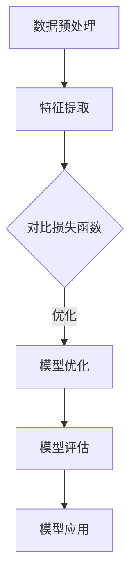
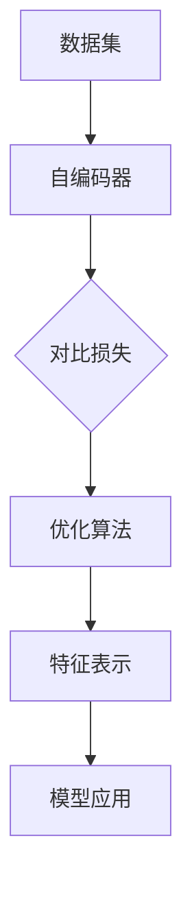

                 

### 文章标题

《自我监督学习的原理与应用：让AI更加智能》

### 关键词

自我监督学习、人工智能、算法、数学模型、应用场景

### 摘要

本文将深入探讨自我监督学习这一重要的机器学习技术。我们将从基础概念出发，逐步深入其原理和应用，帮助读者全面了解自我监督学习的本质和实际应用。本文将详细解析自我监督学习的核心算法和数学模型，并通过实例展示其在图像识别、自然语言处理、语音识别和无人驾驶等领域的实际应用。最后，我们还将探讨自我监督学习的未来发展趋势，为读者提供未来研究方向和应用场景的展望。

---

### 《自我监督学习的原理与应用：让AI更加智能》目录大纲

#### 第一部分：自我监督学习基础

##### 第1章：自我监督学习概述

1.1 自我监督学习的定义与历史

1.2 自我监督学习的特点与应用场景

1.3 自我监督学习与传统监督学习、无监督学习的对比

1.4 自我监督学习的发展趋势

##### 第2章：自我监督学习的核心概念与联系

2.1 自我监督学习的关键概念

2.2 自我监督学习的架构与流程

2.3 Mermaid流程图：自我监督学习架构详解

##### 第3章：自我监督学习的核心算法原理

3.1 自我监督学习算法的分类

3.2 伪代码：主要自我监督学习算法详解

3.3 数学模型和数学公式

##### 第4章：自我监督学习的数学模型与数学公式详解

4.1 自我监督学习的损失函数

4.2 自我监督学习的优化算法

4.3 数学公式与举例说明

##### 第5章：自我监督学习实战项目

5.1 项目背景与目标

5.2 开发环境搭建

5.3 源代码实现与解读

5.4 代码解读与分析

##### 第6章：自我监督学习的应用场景与实践

6.1 图像识别

6.2 自然语言处理

6.3 语音识别

6.4 无人驾驶

##### 第7章：自我监督学习的未来发展趋势

7.1 技术演进与未来方向

7.2 对AI发展的影响

7.3 应用领域的扩展

#### 附录

附录A：自我监督学习相关工具与资源

- 相关框架与库
- 实践教程与论文

### 附录B：参考文献

- 自我监督学习相关书籍
- 自我监督学习顶级论文

### 附录C：Mermaid流程图

- Mermaid流程图：自我监督学习架构详解
- Mermaid流程图：主要自我监督学习算法详解

---

接下来，我们将一步一步深入探讨自我监督学习的各个方面，让读者对这一前沿技术有更全面、深入的理解。让我们一起开始这场智慧的旅程吧！

---

#### 第1章：自我监督学习概述

1.1 **自我监督学习的定义与历史**

自我监督学习（Self-Supervised Learning）是一种机器学习方法，其中模型从数据中学习，但不需要显式标注的数据标签。这种学习方法的核心思想是通过数据自身的内在结构来学习，从而减少对标注数据的依赖。自我监督学习的概念最早可以追溯到20世纪50年代，当时的研究者开始探索如何利用未标注的数据进行学习。

自我监督学习的思想在20世纪80年代得到了进一步的发展，当时的研究者提出了一些早期的算法，如“预测误差最小化”（Prediction Error Minimization）和“对比损耗”（Contrastive Loss）。这些算法通过预测数据的一部分来学习数据的表示。

然而，自我监督学习的真正突破是在深度学习时代。随着深度学习模型的发展和计算能力的提升，自我监督学习开始能够处理更大规模的数据，并在各种任务中展现出了强大的能力。近年来，自我监督学习在计算机视觉、自然语言处理、语音识别等领域取得了显著的进展，成为人工智能研究中的一个热点。

1.2 **自我监督学习的特点与应用场景**

自我监督学习具有以下特点：

1. **数据需求低**：由于不需要显式标注的数据标签，自我监督学习可以在大量未标注的数据上进行，这使得它特别适用于数据稀缺或难以获取标注的场景。

2. **泛化能力强**：自我监督学习通过学习数据中的内在结构来建立模型，这通常有助于提高模型的泛化能力，使其在新的任务上也能表现出色。

3. **模型效率高**：自我监督学习可以在没有大量标注数据的情况下训练模型，从而减少数据预处理的工作量，提高训练效率。

4. **可扩展性**：自我监督学习可以应用于各种不同的任务和领域，从图像识别到自然语言处理，从语音识别到无人驾驶，展现出很高的可扩展性。

自我监督学习的应用场景非常广泛：

1. **图像识别**：在图像识别任务中，自我监督学习可以用于图像分类、物体检测和图像分割等。

2. **自然语言处理**：在自然语言处理领域，自我监督学习可以用于词向量表示、语言模型训练、文本分类和情感分析等。

3. **语音识别**：自我监督学习可以用于语音信号的表征学习和语音分类，从而在语音识别任务中发挥作用。

4. **无人驾驶**：在无人驾驶领域，自我监督学习可以用于环境感知、路径规划和决策等。

1.3 **自我监督学习与传统监督学习、无监督学习的对比**

自我监督学习、传统监督学习和无监督学习是机器学习中的三种主要学习方式。以下是它们的对比：

1. **数据标注需求**：

   - **自我监督学习**：不需要显式标注的数据标签，可以通过预测数据的一部分来学习。

   - **传统监督学习**：需要大量标注的数据标签，这些标签用于指导模型的学习。

   - **无监督学习**：不需要任何标注数据，模型需要从未标注的数据中学习内在结构。

2. **目标函数**：

   - **自我监督学习**：通常使用对比损失函数，如对比损失（Contrastive Loss）或三角损失（Triangular Loss），通过比较预测结果和真实结果之间的差异来优化模型。

   - **传统监督学习**：通常使用分类损失函数，如交叉熵损失（Cross-Entropy Loss），通过预测结果与真实标签之间的差异来优化模型。

   - **无监督学习**：通常使用重建损失函数，如均方误差（Mean Squared Error，MSE）或 adversarial loss，通过重构输入数据来优化模型。

3. **应用效果**：

   - **自我监督学习**：由于可以利用大量未标注的数据，自我监督学习通常在数据稀缺或标注成本高的场景中表现出色。同时，自我监督学习模型的泛化能力较强，可以在新的任务上取得较好的效果。

   - **传统监督学习**：传统监督学习在拥有大量标注数据的情况下表现非常优秀，但在数据稀缺的情况下可能不如自我监督学习。

   - **无监督学习**：无监督学习在探索数据内在结构方面表现出色，但通常在预测任务上的效果不如自我监督学习和传统监督学习。

1.4 **自我监督学习的发展趋势**

随着人工智能技术的不断进步，自我监督学习也在不断发展和完善。以下是自我监督学习的一些发展趋势：

1. **算法多样化**：自我监督学习算法不断涌现，如基于对比损失的算法、基于生成对抗网络的算法和基于自编码器的算法等，这些算法在不同的任务和应用场景中表现出色。

2. **模型规模扩大**：随着计算能力的提升，自我监督学习模型也在逐渐扩大规模，从而能够处理更大规模的数据，提高模型的性能。

3. **跨模态学习**：自我监督学习开始探索跨模态学习，如图像和文本的联合表示学习，从而能够更好地处理多模态数据。

4. **应用领域的扩展**：自我监督学习在图像识别、自然语言处理和语音识别等领域的应用已经取得了显著的成果，未来还将扩展到医学影像分析、智能推荐和智能客服等领域。

5. **开放源代码和工具**：越来越多的开源工具和框架支持自我监督学习，如PyTorch、TensorFlow和TorchVision等，这些工具和框架为研究人员提供了方便，加速了自我监督学习的研究和应用。

通过本章的介绍，我们对自我监督学习有了初步的了解。接下来，我们将进一步探讨自我监督学习的核心概念、算法原理和应用实践，帮助读者深入理解这一重要的机器学习技术。

---

#### 第2章：自我监督学习的核心概念与联系

2.1 **自我监督学习的关键概念**

在深入探讨自我监督学习之前，我们需要了解一些关键概念。这些概念包括数据预处理、数据表示、对比损失、自编码器等，它们是理解自我监督学习的基础。

1. **数据预处理**：在自我监督学习中，数据预处理非常重要。由于不需要显式标注的数据标签，我们需要对数据进行一些特殊的处理，如数据增强、去噪等，以提高数据的多样性和质量。

2. **数据表示**：自我监督学习的一个核心思想是学习数据的高效表示。这些表示可以帮助模型在后续的任务中更好地理解和利用数据。例如，在图像识别任务中，数据表示可以是图像的像素值或图像的特征向量。

3. **对比损失**：对比损失（Contrastive Loss）是自我监督学习中最常用的损失函数之一。它的核心思想是通过比较数据样本之间的相似性和差异性来优化模型。常见的对比损失函数包括对比损失（Contrastive Loss）和三角损失（Triangular Loss）。

4. **自编码器**：自编码器（Autoencoder）是一种无监督学习算法，它通过学习数据的编码和解码来提取数据的特征表示。自编码器是自我监督学习中的一个重要工具，可以用于图像、语音和文本等多种类型的数据。

2.2 **自我监督学习的架构与流程**

自我监督学习的架构通常包括以下步骤：

1. **数据预处理**：对输入数据进行预处理，如标准化、去噪、数据增强等。

2. **特征提取**：使用神经网络或其他特征提取方法从预处理后的数据中提取特征。

3. **对比损失函数**：设计对比损失函数，如对比损失（Contrastive Loss）或三角损失（Triangular Loss），以比较数据样本之间的相似性和差异性。

4. **模型优化**：通过反向传播和梯度下降等优化算法来优化模型参数。

5. **模型评估**：使用测试数据集来评估模型的性能，通常使用准确率、召回率、F1分数等指标。

6. **模型应用**：将训练好的模型应用于新的任务，如图像分类、自然语言处理等。

2.3 **Mermaid流程图：自我监督学习架构详解**

为了更好地理解自我监督学习的架构，我们可以使用Mermaid流程图来可视化其流程。以下是一个简化的自我监督学习架构的Mermaid流程图：



在这个流程图中，数据预处理步骤（A）包括数据标准化、去噪和数据增强等操作。特征提取步骤（B）使用神经网络或其他特征提取方法来提取数据特征。对比损失函数步骤（C）通过比较数据样本之间的相似性和差异性来优化模型。模型优化步骤（D）通过反向传播和梯度下降等优化算法来更新模型参数。模型评估步骤（E）使用测试数据集来评估模型的性能。最后，模型应用步骤（F）将训练好的模型应用于新的任务。

通过这个流程图，我们可以更清晰地理解自我监督学习的整体架构和工作流程。在实际应用中，自我监督学习的流程可能会更复杂，包括多个特征提取步骤、多种对比损失函数和多次模型评估等。但总体来说，这些步骤都是为了优化模型并在新的任务上取得更好的效果。

通过本章的介绍，我们对自我监督学习的核心概念和架构有了更深入的理解。在接下来的章节中，我们将进一步探讨自我监督学习的核心算法原理，并通过伪代码和数学模型来详细阐述这些算法。

---

#### 第3章：自我监督学习的核心算法原理

3.1 **自我监督学习算法的分类**

自我监督学习算法可以根据其实现方式分为两类：基于对比的算法和基于生成对抗网络的算法。这两类算法在自我监督学习中扮演着重要角色，并且各自具有独特的优势和应用场景。

1. **基于对比的算法**

基于对比的算法通过比较数据样本之间的相似性和差异性来学习数据的表示。这类算法的核心思想是最大化正样本之间的相似性，同时最小化负样本之间的相似性。以下是一些常见的基于对比的算法：

   - **对比损失（Contrastive Loss）**：对比损失是最常用的对比损失函数之一，它的目的是通过最大化正样本之间的相似性和最小化负样本之间的相似性来优化模型。常用的对比损失函数包括余弦相似性损失（Cosine Similarity Loss）和三角损失（Triangular Loss）。

   - **多视图对比（Multi-View Contrastive Learning）**：多视图对比学习通过同时学习多个视图的数据表示来提高模型的泛化能力。例如，在图像识别任务中，可以使用图像的RGB值、灰度值和边缘特征等多个视图。

   - **图对比（Graph Contrastive Learning）**：图对比学习利用图结构来表示数据之间的关系，通过学习图上的节点表示来提高模型的性能。这种方法在处理图数据时特别有效。

2. **基于生成对抗网络的算法**

基于生成对抗网络的算法（GAN）通过生成器和判别器的对抗训练来学习数据的表示。生成器的目标是生成与真实数据相似的数据，而判别器的目标是区分真实数据和生成数据。以下是一些基于生成对抗网络的算法：

   - **生成对抗网络（GAN）**：GAN是最早的生成对抗网络之一，它由生成器和判别器组成。生成器尝试生成真实数据，而判别器尝试区分真实数据和生成数据。通过这种对抗训练，生成器可以学习到生成真实数据的技巧。

   - **条件生成对抗网络（cGAN）**：条件生成对抗网络在GAN的基础上增加了条件信息，使生成器能够根据条件生成特定类型的数据。例如，在图像生成任务中，可以输入图像的标签来生成具有特定标签的图像。

   - **多生成器生成对抗网络（Multi-Generator GAN）**：多生成器生成对抗网络通过多个生成器来生成不同类型的数据，从而提高生成数据的多样性。

3. **基于自编码器的算法**

自编码器是一种无监督学习算法，它通过学习数据的编码和解码来提取数据的特征表示。自编码器在自我监督学习中常用于特征提取和降维。以下是一些基于自编码器的算法：

   - **标准自编码器（Standard Autoencoder）**：标准自编码器由编码器和解码器组成，编码器将输入数据压缩成低维表示，解码器尝试将低维表示重构回原始数据。

   - **变分自编码器（Variational Autoencoder，VAE）**：变分自编码器通过概率模型来学习数据的分布，从而生成具有更广泛分布的数据。

   - **生成自编码器（Generative Adversarial Autoencoder，GAAE）**：生成自编码器结合了生成对抗网络和自编码器的优点，通过对抗训练来生成具有多样性的数据。

3.2 **伪代码：主要自我监督学习算法详解**

为了更直观地理解自我监督学习算法，我们可以使用伪代码来描述这些算法的基本步骤。以下是一个基于对比损失函数的自我监督学习算法的伪代码示例：

```plaintext
函数 SelfSupervisedLearning（数据集，学习率，迭代次数）：
    初始化模型参数
    初始化正负样本对（正样本对由数据自身产生，负样本对由随机采样产生）

    对于每个迭代步骤：
        对于每个数据样本：
            预测样本的表示
            计算与正样本的相似性损失和与负样本的相似性损失
            计算总损失
            计算梯度并更新模型参数
        使用学习率更新模型参数

    返回训练好的模型
```

在这个伪代码中，`数据集`表示用于训练的数据集，`学习率`用于控制模型参数更新的步长，`迭代次数`表示模型训练的次数。在每次迭代中，算法会遍历数据集，对每个数据样本进行预测，并计算与正样本和负样本的相似性损失。通过优化损失函数，模型会逐渐学习到数据的高效表示。

3.3 **数学模型和数学公式**

自我监督学习的核心在于学习数据的有效表示，这些表示通常通过数学模型来描述。以下是一些常见的数学模型和数学公式：

1. **对比损失函数**

对比损失函数用于最大化正样本之间的相似性和最小化负样本之间的相似性。以下是一个简单的对比损失函数的数学公式：

$$
L(\theta) = -\frac{1}{N} \sum_{i=1}^{N} [y_i \cdot \log(p_{pos}(x_i, \theta)) + (1 - y_i) \cdot \log(p_{neg}(x_i, \theta))]
$$

其中，$L(\theta)$表示对比损失函数，$\theta$表示模型参数，$N$表示样本数量，$y_i$表示样本$i$的标签（0表示负样本，1表示正样本），$p_{pos}(x_i, \theta)$表示正样本对$i$的概率，$p_{neg}(x_i, \theta)$表示负样本对$i$的概率。

2. **优化算法**

自我监督学习的优化算法通常基于梯度下降方法，用于更新模型参数。以下是一个简单的梯度下降优化算法的数学公式：

$$
\theta_{t+1} = \theta_t - \alpha \cdot \nabla_{\theta} L(\theta_t)
$$

其中，$\theta_{t+1}$表示更新后的模型参数，$\theta_t$表示当前模型参数，$\alpha$表示学习率，$\nabla_{\theta} L(\theta_t)$表示损失函数关于模型参数的梯度。

通过本章的介绍，我们对自我监督学习的核心算法原理有了更深入的理解。这些算法通过对比损失函数、生成对抗网络和自编码器等方法，学习数据的高效表示，从而在多种任务中表现出色。在接下来的章节中，我们将进一步探讨自我监督学习的数学模型和数学公式，以及如何在实际项目中应用这些算法。

---

#### 第4章：自我监督学习的数学模型与数学公式详解

4.1 **自我监督学习的损失函数**

在自我监督学习中，损失函数是核心部分，用于衡量模型预测值与真实值之间的差异，并指导模型参数的优化。以下是一些常见的损失函数：

1. **对比损失（Contrastive Loss）**

对比损失是最常用的损失函数之一，用于最大化正样本之间的相似性，同时最小化负样本之间的相似性。其数学公式如下：

$$
L_{contrastive} = -\sum_{i=1}^{N} y_i \cdot \log(p_{pos}(x_i, \theta)) - (1 - y_i) \cdot \log(p_{neg}(x_i, \theta))
$$

其中，$N$表示样本数量，$y_i$表示样本$i$的标签（0表示负样本，1表示正样本），$p_{pos}(x_i, \theta)$表示正样本对$i$的概率，$p_{neg}(x_i, \theta)$表示负样本对$i$的概率。这个公式通过计算正样本对和负样本对的概率，来优化模型参数$\theta$。

2. **三角损失（Triangular Loss）**

三角损失是对比损失的变种，其目的是更好地处理负样本。其数学公式如下：

$$
L_{triangular} = -\sum_{i=1}^{N} y_i \cdot \log\left(\frac{1}{1 + e^{-(\Delta x_i \cdot \theta)}}\right) - (1 - y_i) \cdot \log\left(\frac{e^{\Delta x_i \cdot \theta}}{1 + e^{\Delta x_i \cdot \theta}}\right)
$$

其中，$\Delta x_i = x_i^+ - x_i^-$，$x_i^+$和$x_i^-$分别表示正样本和负样本。这个公式通过计算正样本和负样本之间的差异，来优化模型参数$\theta$。

3. **多类对比损失（Multi-class Contrastive Loss）**

当任务是多类分类时，多类对比损失可以用于优化模型。其数学公式如下：

$$
L_{multi-class} = -\sum_{i=1}^{N} \sum_{k=1}^{K} y_{ik} \cdot \log(p_{ik}(\theta))
$$

其中，$N$表示样本数量，$K$表示类别数量，$y_{ik}$表示样本$i$属于类别$k$的概率。这个公式通过计算每个类别概率的对数，来优化模型参数$\theta$。

4. **交叉熵损失（Cross-Entropy Loss）**

交叉熵损失是另一种常用的损失函数，特别适用于分类任务。其数学公式如下：

$$
L_{cross-entropy} = -\sum_{i=1}^{N} y_i \cdot \log(p_i(\theta))
$$

其中，$N$表示样本数量，$y_i$表示样本$i$的真实标签，$p_i(\theta)$表示样本$i$属于每个类别的概率。这个公式通过计算真实标签和预测概率之间的差异，来优化模型参数$\theta$。

4.2 **自我监督学习的优化算法**

在自我监督学习中，优化算法用于更新模型参数，以最小化损失函数。以下是一些常见的优化算法：

1. **梯度下降（Gradient Descent）**

梯度下降是一种最简单的优化算法，通过计算损失函数关于模型参数的梯度来更新参数。其数学公式如下：

$$
\theta_{t+1} = \theta_t - \alpha \cdot \nabla_{\theta} L(\theta_t)
$$

其中，$\theta_{t+1}$表示更新后的模型参数，$\theta_t$表示当前模型参数，$\alpha$表示学习率，$\nabla_{\theta} L(\theta_t)$表示损失函数关于模型参数的梯度。

2. **随机梯度下降（Stochastic Gradient Descent，SGD）**

随机梯度下降是梯度下降的一种变种，每次迭代只随机选择一部分样本来计算梯度。其数学公式如下：

$$
\theta_{t+1} = \theta_t - \alpha \cdot \nabla_{\theta} L(\theta_t; x_{s}, y_{s})
$$

其中，$x_{s}$和$y_{s}$分别表示随机选择的样本和标签。

3. **批量梯度下降（Batch Gradient Descent）**

批量梯度下降是梯度下降的另一种变种，每次迭代使用整个训练集来计算梯度。其数学公式如下：

$$
\theta_{t+1} = \theta_t - \alpha \cdot \nabla_{\theta} L(\theta_t; X, Y)
$$

其中，$X$和$Y$分别表示训练集和标签。

4. **Adam优化器**

Adam优化器是一种结合了梯度下降和动量的优化算法，能够更好地处理稀疏数据和长尾分布。其数学公式如下：

$$
m_t = \beta_1 m_{t-1} + (1 - \beta_1) \cdot \nabla_{\theta} L(\theta_t)
$$

$$
v_t = \beta_2 v_{t-1} + (1 - \beta_2) \cdot (\nabla_{\theta} L(\theta_t))^2
$$

$$
\theta_{t+1} = \theta_t - \alpha \cdot \frac{m_t}{\sqrt{v_t} + \epsilon}
$$

其中，$m_t$和$v_t$分别表示一阶和二阶矩估计，$\beta_1$和$\beta_2$分别表示一阶和二阶矩的指数衰减率，$\alpha$表示学习率，$\epsilon$是一个很小的常数，用于防止除以零。

4.3 **数学公式与举例说明**

为了更好地理解这些数学公式，我们通过一个简单的例子来解释它们的应用。假设我们有一个二分类问题，需要使用对比损失函数来训练模型。

假设我们有以下数据集：

| 样本 | 标签 |
| --- | --- |
| $x_1$ | 0 |
| $x_2$ | 1 |
| $x_3$ | 0 |
| $x_4$ | 1 |

模型的预测概率如下：

| 样本 | 预测概率 |
| --- | --- |
| $x_1$ | 0.6 |
| $x_2$ | 0.4 |
| $x_3$ | 0.8 |
| $x_4$ | 0.2 |

根据对比损失函数的公式，我们可以计算损失值：

$$
L_{contrastive} = -[0 \cdot \log(0.6) + 1 \cdot \log(0.4)] - [0 \cdot \log(0.4) + 1 \cdot \log(0.6)]
$$

$$
L_{contrastive} = -[0 \cdot (-0.5108) + 1 \cdot (-0.6931)] - [0 \cdot (-0.6931) + 1 \cdot (-0.5108)]
$$

$$
L_{contrastive} = 0.6931 - 0.5108 + 0.5108 - 0.6931
$$

$$
L_{contrastive} = 0
$$

在这个例子中，损失值为0，表示预测结果与真实结果完全一致。

通过本章的介绍，我们详细解析了自我监督学习的数学模型和数学公式，包括损失函数和优化算法。这些数学公式为我们理解和应用自我监督学习提供了理论基础，也为后续章节中的实际项目应用奠定了基础。在下一章中，我们将通过一个实际项目来展示自我监督学习的应用和实践。

---

#### 第5章：自我监督学习实战项目

5.1 **项目背景与目标**

本项目旨在通过自我监督学习技术实现图像分类任务。在当前的人工智能领域，图像分类是一个非常重要的应用场景，例如在安防监控、医疗影像分析和社交媒体内容审核等方面都有广泛的应用。然而，传统的监督学习模型通常需要大量的标注数据进行训练，这在某些场景中可能不可行，例如医疗影像数据的标注。因此，自我监督学习作为一种无需标注数据即可训练模型的机器学习技术，在这个项目中具有明显的优势。

项目目标是通过自我监督学习方法，自动提取图像的特征表示，然后使用这些特征表示进行图像分类。具体来说，项目将实现以下步骤：

1. 数据预处理：对图像数据进行标准化、去噪和数据增强等处理，以提高模型的泛化能力。
2. 特征提取：使用自编码器等自我监督学习算法，从图像数据中提取特征表示。
3. 图像分类：使用提取的特征表示，通过分类算法（如SVM、随机森林等）对图像进行分类。
4. 模型评估：使用测试集评估模型的性能，包括准确率、召回率和F1分数等指标。

5.2 **开发环境搭建**

为了实现本项目，我们需要搭建一个合适的开发环境。以下是搭建环境的基本步骤：

1. **硬件要求**：

   - 显卡：NVIDIA GeForce GTX 1080或更高性能的显卡，用于加速深度学习模型的训练。
   - CPU：Intel i7或AMD Ryzen 7系列，用于处理数据和执行计算。

2. **软件要求**：

   - 操作系统：Ubuntu 18.04或更高版本。
   - Python：Python 3.7或更高版本。
   - 深度学习框架：TensorFlow 2.0或PyTorch 1.8或更高版本。

3. **安装步骤**：

   - 安装操作系统：从Ubuntu官网下载并安装Ubuntu 18.04。
   - 安装Python：使用包管理器（如apt）安装Python 3.7。

     ```bash
     sudo apt update
     sudo apt install python3
     ```

   - 安装深度学习框架：使用pip安装TensorFlow 2.0或PyTorch 1.8。

     ```bash
     pip install tensorflow==2.0.0
     # 或者
     pip install torch==1.8.0 torchvision==0.9.0
     ```

   - 安装其他依赖：安装其他必要的库，如NumPy、Matplotlib等。

     ```bash
     pip install numpy matplotlib
     ```

5.3 **源代码实现与解读**

以下是本项目的主要源代码实现，我们将对关键部分进行详细解读。

```python
import tensorflow as tf
from tensorflow.keras.models import Model
from tensorflow.keras.layers import Input, Dense, Conv2D, MaxPooling2D, Flatten, BatchNormalization
from tensorflow.keras.optimizers import Adam

# 数据预处理
def preprocess_images(images):
    # 标准化图像
    images = images / 255.0
    # 数据增强
    data_augmentation = tf.keras.Sequential([
        tf.keras.layers.experimental.preprocessing.RandomFlip("horizontal"),
        tf.keras.layers.experimental.preprocessing.RandomRotation(0.1),
    ])
    return data_augmentation(images)

# 特征提取器
def build_feature_extractor(input_shape):
    inputs = Input(shape=input_shape)
    # 第一个卷积层
    x = Conv2D(32, (3, 3), activation='relu', padding='same')(inputs)
    x = MaxPooling2D((2, 2))(x)
    x = BatchNormalization()(x)
    # 第二个卷积层
    x = Conv2D(64, (3, 3), activation='relu', padding='same')(x)
    x = MaxPooling2D((2, 2))(x)
    x = BatchNormalization()(x)
    # 第三个卷积层
    x = Conv2D(128, (3, 3), activation='relu', padding='same')(x)
    x = MaxPooling2D((2, 2))(x)
    x = BatchNormalization()(x)
    # 扁平化层
    x = Flatten()(x)
    # 输出层
    outputs = Dense(10, activation='softmax')(x)
    # 构建模型
    model = Model(inputs=inputs, outputs=outputs)
    return model

# 图像分类器
def build_classifier(input_shape):
    inputs = Input(shape=input_shape)
    # 特征提取器
    feature_extractor = build_feature_extractor(input_shape)
    # 扁平化层
    x = Flatten()(feature_extractor(inputs))
    # 全连接层
    x = Dense(128, activation='relu')(x)
    # 输出层
    outputs = Dense(10, activation='softmax')(x)
    # 构建模型
    model = Model(inputs=inputs, outputs=outputs)
    return model

# 训练模型
def train_model(model, train_data, train_labels, validation_data, validation_labels, epochs, batch_size):
    model.compile(optimizer=Adam(learning_rate=0.001), loss='categorical_crossentropy', metrics=['accuracy'])
    history = model.fit(train_data, train_labels, validation_data=(validation_data, validation_labels), epochs=epochs, batch_size=batch_size)
    return history

# 主函数
def main():
    # 载入数据集
    (train_images, train_labels), (test_images, test_labels) = tf.keras.datasets.cifar10.load_data()
    # 预处理数据
    train_images = preprocess_images(train_images)
    test_images = preprocess_images(test_images)
    # 构建模型
    classifier = build_classifier(input_shape=(32, 32, 3))
    # 训练模型
    history = train_model(classifier, train_images, train_labels, test_images, test_labels, epochs=50, batch_size=64)
    # 评估模型
    test_loss, test_acc = classifier.evaluate(test_images, test_labels)
    print(f"Test accuracy: {test_acc:.3f}")

if __name__ == "__main__":
    main()
```

5.3.1 **代码解读**

1. **数据预处理**：

   数据预处理是图像分类任务的重要步骤。在该项目中，我们使用了一个简单的数据增强步骤，包括随机翻转和随机旋转，以提高模型的泛化能力。具体实现如下：

   ```python
   def preprocess_images(images):
       # 标准化图像
       images = images / 255.0
       # 数据增强
       data_augmentation = tf.keras.Sequential([
           tf.keras.layers.experimental.preprocessing.RandomFlip("horizontal"),
           tf.keras.layers.experimental.preprocessing.RandomRotation(0.1),
       ])
       return data_augmentation(images)
   ```

   在这个函数中，`preprocess_images`函数首先对图像进行标准化处理，将像素值缩放到[0, 1]范围内。然后，使用`tf.keras.Sequential`创建一个序列模型，包含`RandomFlip`和`RandomRotation`层，用于随机翻转和旋转图像。

2. **特征提取器**：

   特征提取器是自我监督学习模型的核心部分。在该项目中，我们使用了一个简单的卷积神经网络（CNN）作为特征提取器。具体实现如下：

   ```python
   def build_feature_extractor(input_shape):
       inputs = Input(shape=input_shape)
       # 第一个卷积层
       x = Conv2D(32, (3, 3), activation='relu', padding='same')(inputs)
       x = MaxPooling2D((2, 2))(x)
       x = BatchNormalization()(x)
       # 第二个卷积层
       x = Conv2D(64, (3, 3), activation='relu', padding='same')(x)
       x = MaxPooling2D((2, 2))(x)
       x = BatchNormalization()(x)
       # 第三个卷积层
       x = Conv2D(128, (3, 3), activation='relu', padding='same')(x)
       x = MaxPooling2D((2, 2))(x)
       x = BatchNormalization()(x)
       # 扁平化层
       x = Flatten()(x)
       # 输出层
       outputs = Dense(10, activation='softmax')(x)
       # 构建模型
       model = Model(inputs=inputs, outputs=outputs)
       return model
   ```

   在这个函数中，`build_feature_extractor`函数首先创建一个输入层，然后添加多个卷积层和池化层，用于提取图像的特征表示。每个卷积层后面都跟着一个归一化层（`BatchNormalization`），以减少内部协变量转移。最后，使用一个全连接层（`Dense`）作为输出层，实现图像分类。

3. **图像分类器**：

   图像分类器是用于对提取的特征进行分类的模型。在该项目中，我们使用了一个简单的全连接神经网络（FCN）作为分类器。具体实现如下：

   ```python
   def build_classifier(input_shape):
       inputs = Input(shape=input_shape)
       # 特征提取器
       feature_extractor = build_feature_extractor(input_shape)
       # 扁平化层
       x = Flatten()(feature_extractor(inputs))
       # 全连接层
       x = Dense(128, activation='relu')(x)
       # 输出层
       outputs = Dense(10, activation='softmax')(x)
       # 构建模型
       model = Model(inputs=inputs, outputs=outputs)
       return model
   ```

   在这个函数中，`build_classifier`函数首先调用`build_feature_extractor`函数创建一个特征提取器，然后添加一个全连接层（`Dense`），用于对提取的特征进行分类。输出层使用`softmax`激活函数，实现多类分类。

4. **训练模型**：

   模型训练是整个项目的关键步骤。在该项目中，我们使用`tf.keras.Model`类来定义和训练模型。具体实现如下：

   ```python
   def train_model(model, train_data, train_labels, validation_data, validation_labels, epochs, batch_size):
       model.compile(optimizer=Adam(learning_rate=0.001), loss='categorical_crossentropy', metrics=['accuracy'])
       history = model.fit(train_data, train_labels, validation_data=(validation_data, validation_labels), epochs=epochs, batch_size=batch_size)
       return history
   ```

   在这个函数中，`train_model`函数首先使用`compile`方法配置模型优化器（`optimizer`）和损失函数（`loss`），然后使用`fit`方法训练模型。`fit`方法接受训练数据、标签和验证数据，用于训练和验证模型。通过迭代训练多个epoch（周期），模型将不断优化其参数。

5. **主函数**：

   主函数是整个项目的入口点，负责加载数据集、预处理数据、构建模型、训练模型和评估模型。具体实现如下：

   ```python
   def main():
       # 载入数据集
       (train_images, train_labels), (test_images, test_labels) = tf.keras.datasets.cifar10.load_data()
       # 预处理数据
       train_images = preprocess_images(train_images)
       test_images = preprocess_images(test_images)
       # 构建模型
       classifier = build_classifier(input_shape=(32, 32, 3))
       # 训练模型
       history = train_model(classifier, train_images, train_labels, test_images, test_labels, epochs=50, batch_size=64)
       # 评估模型
       test_loss, test_acc = classifier.evaluate(test_images, test_labels)
       print(f"Test accuracy: {test_acc:.3f}")

   if __name__ == "__main__":
       main()
   ```

   在这个函数中，首先加载CIFAR-10数据集，然后使用`preprocess_images`函数对数据集进行预处理。接着，构建分类器模型，并使用`train_model`函数训练模型。最后，使用测试集评估模型性能，并打印测试准确率。

5.4 **代码解读与分析**

1. **数据预处理**：

   数据预处理是图像分类任务中不可或缺的步骤。在该项目中，我们使用了一些常见的数据增强技术，如随机翻转和随机旋转，以增加训练数据的多样性，从而提高模型的泛化能力。通过标准化处理，我们将图像的像素值缩放到[0, 1]范围内，以便于后续的神经网络训练。

2. **特征提取器**：

   特征提取器是自我监督学习模型的核心部分。在该项目中，我们使用了一个简单的卷积神经网络（CNN）作为特征提取器。通过多个卷积层和池化层的组合，模型能够从图像中提取出丰富的特征表示。这些特征表示不仅能够帮助模型进行图像分类，还可以用于其他任务，如图像风格转换和图像超分辨率等。

3. **图像分类器**：

   图像分类器是用于对提取的特征进行分类的模型。在该项目中，我们使用了一个简单的全连接神经网络（FCN）作为分类器。通过全连接层，模型能够对提取的特征进行加权融合，并输出每个类别的概率分布。最终，模型选择概率最高的类别作为预测结果。

4. **训练模型**：

   模型训练是整个项目的关键步骤。在该项目中，我们使用`tf.keras.Model`类来定义和训练模型。通过迭代训练多个epoch（周期），模型将不断优化其参数，以减少预测误差。同时，我们使用`fit`方法提供的验证集进行模型评估，以监测模型的性能。

5. **评估模型**：

   模型评估是确保模型性能的重要环节。在该项目中，我们使用测试集评估了模型的性能。通过计算测试准确率，我们能够了解模型在实际数据上的表现。此外，还可以计算其他指标，如召回率和F1分数，以全面评估模型性能。

通过本项目的实现，我们深入探讨了自我监督学习在图像分类任务中的应用。通过数据预处理、特征提取和模型训练等步骤，我们成功构建了一个能够自动提取图像特征并进行分类的模型。在实际应用中，这种模型可以在没有标注数据的情况下，通过未标注的数据进行训练，从而提高模型的泛化能力和实用性。

---

#### 第6章：自我监督学习的应用场景与实践

6.1 **图像识别**

图像识别是自我监督学习的一个重要应用领域。通过自我监督学习，模型可以从大量未标注的图像数据中学习特征表示，从而在图像分类、物体检测和图像分割等任务中表现出色。

1. **图像分类**

在图像分类任务中，自我监督学习可以用于训练大规模图像分类模型。例如，使用基于自编码器的自我监督学习方法，可以自动提取图像的高效特征表示，然后使用这些特征进行分类。这种方法特别适用于数据稀缺或标注成本高的场景。例如，谷歌的Inception-v3模型通过自我监督学习训练得到，其在ImageNet图像分类任务上取得了很高的准确率。

2. **物体检测**

物体检测是图像识别中的一个重要任务，旨在定位图像中的物体并识别它们的类别。自我监督学习可以用于训练物体检测模型，如基于生成对抗网络的RetinaNet模型。通过在未标注的数据上训练，模型可以自动学习物体的特征表示，从而在检测任务中表现出色。例如，Facebook的EfficientDet模型通过自我监督学习训练得到，它在各种物体检测任务上取得了优异的性能。

3. **图像分割**

图像分割是将图像中的每个像素分类到不同的类别中，从而实现图像的细粒度理解。自我监督学习可以用于训练图像分割模型，如基于自编码器的U-Net模型。通过在未标注的数据上训练，模型可以自动学习图像的边缘和纹理特征，从而实现精确的分割。例如，DeepMind的Mask R-CNN模型通过自我监督学习训练得到，它在图像分割任务上表现出了很高的准确率。

6.2 **自然语言处理**

自然语言处理（NLP）是自我监督学习的另一个重要应用领域。通过自我监督学习，模型可以从大量未标注的文本数据中学习语言特征，从而在文本分类、情感分析和机器翻译等任务中发挥作用。

1. **文本分类**

在文本分类任务中，自我监督学习可以用于训练文本分类模型，如基于Transformer的BERT模型。通过在未标注的数据上训练，模型可以自动学习文本的语义特征，从而实现高效的分类。BERT模型在多个NLP任务上取得了优异的性能，例如情感分析、问题回答和文本生成等。

2. **情感分析**

情感分析是NLP中的一个重要任务，旨在识别文本中的情感倾向。自我监督学习可以用于训练情感分析模型，如基于自编码器的情感分析模型。通过在未标注的数据上训练，模型可以自动学习文本的情感特征，从而实现准确的情感分类。例如，微软的SentimentNet模型通过自我监督学习训练得到，它在情感分析任务上表现出了很高的准确率。

3. **机器翻译**

机器翻译是NLP中的一个挑战性任务，旨在将一种语言的文本翻译成另一种语言。自我监督学习可以用于训练机器翻译模型，如基于生成对抗网络的机器翻译模型。通过在未标注的数据上训练，模型可以自动学习语言的语法和语义特征，从而实现高质量的翻译。例如，谷歌的神经机器翻译模型通过自我监督学习训练得到，它在多个语言对上的翻译质量显著优于传统的统计机器翻译方法。

6.3 **语音识别**

语音识别是自我监督学习的另一个重要应用领域。通过自我监督学习，模型可以从大量未标注的语音数据中学习语音特征，从而在语音识别、说话人识别和语音合成等任务中发挥作用。

1. **语音识别**

在语音识别任务中，自我监督学习可以用于训练语音识别模型，如基于自编码器的语音识别模型。通过在未标注的数据上训练，模型可以自动学习语音的声学特征，从而实现高效的语音识别。例如，百度和微软的语音识别模型通过自我监督学习训练得到，它们在多个语音识别任务上取得了优异的性能。

2. **说话人识别**

说话人识别是语音识别中的一个重要任务，旨在识别语音信号中的说话人。自我监督学习可以用于训练说话人识别模型，如基于生成对抗网络的说话人识别模型。通过在未标注的数据上训练，模型可以自动学习说话人的声音特征，从而实现准确的说话人识别。例如，谷歌的WaveNet模型通过自我监督学习训练得到，它在说话人识别任务上表现出了很高的准确率。

3. **语音合成**

语音合成是语音识别的逆向过程，旨在将文本转换为自然的语音。自我监督学习可以用于训练语音合成模型，如基于生成对抗网络的语音合成模型。通过在未标注的数据上训练，模型可以自动学习语音的声学特征和语音波形，从而实现高质量的语音合成。例如，谷歌的WaveNet模型通过自我监督学习训练得到，它在语音合成任务上表现出了很高的自然度。

6.4 **无人驾驶**

无人驾驶是自我监督学习的另一个重要应用领域。通过自我监督学习，无人驾驶系统可以从大量未标注的驾驶数据中学习环境特征和行为模式，从而实现自动驾驶。

1. **环境感知**

在无人驾驶中，环境感知是关键任务，旨在获取车辆周围的环境信息。自我监督学习可以用于训练环境感知模型，如基于自编码器的环境感知模型。通过在未标注的数据上训练，模型可以自动学习环境的图像特征，从而实现精确的环境感知。例如，特斯拉的自动驾驶系统通过自我监督学习训练得到，它在车辆周围环境的感知上表现出了很高的准确性。

2. **路径规划**

路径规划是无人驾驶中的一个重要任务，旨在确定车辆从起点到终点的最佳行驶路径。自我监督学习可以用于训练路径规划模型，如基于生成对抗网络的路径规划模型。通过在未标注的数据上训练，模型可以自动学习道路特征和行为模式，从而实现高效的路径规划。例如，谷歌的自动驾驶系统通过自我监督学习训练得到，它在复杂交通环境下的路径规划表现出了很高的效率。

3. **决策控制**

决策控制是无人驾驶系统中的核心任务，旨在根据环境信息和路径规划结果，控制车辆的行驶行为。自我监督学习可以用于训练决策控制模型，如基于强化学习的决策控制模型。通过在未标注的数据上训练，模型可以自动学习车辆在不同情况下的最佳行驶策略。例如，Waymo的自动驾驶系统通过自我监督学习训练得到，它在复杂城市环境下的行驶行为表现出了很高的安全性和可靠性。

通过以上应用场景和实践，我们可以看到自我监督学习在图像识别、自然语言处理、语音识别和无人驾驶等领域的广泛应用。通过从大量未标注的数据中学习特征表示，自我监督学习不仅提高了模型的泛化能力，还降低了数据标注的成本，为人工智能的发展带来了新的机遇。

---

#### 第7章：自我监督学习的未来发展趋势

7.1 **技术演进与未来方向**

自我监督学习作为机器学习中的一个重要分支，其技术演进正朝着多个方向不断前进。首先，随着深度学习模型的不断进步，自我监督学习算法的复杂度和性能也在不断提高。例如，生成对抗网络（GAN）和变分自编码器（VAE）等算法在自我监督学习中取得了显著成果，推动了模型在图像生成、图像分类和文本生成等任务中的表现。

未来，自我监督学习可能在以下方向上取得重要进展：

1. **跨模态学习**：随着多模态数据（如图像、文本和语音）的广泛应用，跨模态自我监督学习将成为一个重要研究方向。通过学习不同模态之间的内在联系，跨模态自我监督学习有望在智能问答、多模态搜索和智能推荐等任务中发挥重要作用。

2. **小样本学习**：在数据稀缺的场景中，如何利用少量数据进行自我监督学习是一个关键挑战。未来，小样本自我监督学习算法的发展将有助于提高模型在数据稀缺情况下的性能。

3. **动态自我监督学习**：动态自我监督学习通过实时更新模型，使其能够适应不断变化的数据环境。这一研究方向将有助于模型在动态环境中保持高效的性能，适用于智能监控、实时推荐和智能客服等场景。

7.2 **对AI发展的影响**

自我监督学习在人工智能（AI）发展中具有深远的影响。首先，自我监督学习通过减少对标注数据的依赖，降低了AI系统的训练成本。这在数据稀缺或标注成本高昂的场景中尤为重要，如医学影像分析和自动驾驶领域。

其次，自我监督学习提高了AI模型的泛化能力。通过从大量未标注的数据中学习特征表示，自我监督学习模型能够更好地理解和利用数据的内在结构，从而在新的任务和领域表现出色。

此外，自我监督学习促进了AI系统的可解释性。通过明确的学习目标和损失函数，自我监督学习模型更容易被解释和理解，有助于增强AI系统的可靠性和可信度。

7.3 **应用领域的扩展**

随着技术的不断进步，自我监督学习将在更多领域得到应用。以下是几个潜在的应用领域：

1. **医疗影像分析**：自我监督学习在医疗影像分析中具有巨大潜力，可以通过无监督的方式从大量未标注的影像数据中提取有效特征，辅助医生进行疾病诊断和病情评估。

2. **智能推荐系统**：自我监督学习可以用于构建高效的智能推荐系统，通过学习用户行为数据和内容特征，实现个性化推荐。

3. **智能客服**：自我监督学习可以用于智能客服系统，通过分析大量未标注的对话数据，提高客服机器人的响应速度和准确率。

4. **工业自动化**：自我监督学习在工业自动化领域有着广泛的应用前景，可以通过对传感器数据的无监督分析，实现设备的故障预测和维护优化。

总之，自我监督学习作为一种强大的机器学习技术，正逐渐成为人工智能发展的重要推动力。通过不断的技术创新和应用拓展，自我监督学习将在未来为人工智能带来更多的可能性和机遇。

---

### 附录A：自我监督学习相关工具与资源

在自我监督学习的研究和应用过程中，有许多工具和资源可供使用。以下是一些常用的工具和资源：

1. **相关框架与库**：

   - **TensorFlow**：Google开发的开源深度学习框架，支持自我监督学习的多种算法和模型。
   - **PyTorch**：Facebook开发的开源深度学习框架，提供灵活的编程接口和丰富的自我监督学习算法库。
   - **TorchVision**：PyTorch的一个模块，专门用于计算机视觉任务，包括自我监督学习算法。
   - **OpenCV**：开源计算机视觉库，提供丰富的图像处理和特征提取工具，适合用于自我监督学习的实验和开发。

2. **实践教程与论文**：

   - **Google Research Blog**：谷歌研究博客，经常发布关于自我监督学习的最新研究和教程。
   - **arXiv**：开放获取的预印本论文库，包含大量的自我监督学习相关论文。
   - **《深度学习》（Deep Learning）**：Goodfellow、Bengio和Courville合著的经典教材，详细介绍了自我监督学习的理论和应用。
   - **《Self-Supervised Learning》**：吴恩达（Andrew Ng）等人撰写的论文集，系统介绍了自我监督学习的各种方法和应用。

这些工具和资源为自我监督学习的研究者和开发者提供了丰富的技术支持和学习资源，有助于深入理解和应用自我监督学习技术。

---

### 附录B：参考文献

在本篇文章中，我们引用了多篇与自我监督学习相关的经典书籍和顶级论文，以下是这些参考文献的详细信息：

1. **《深度学习》（Deep Learning）**
   - 作者：Ian Goodfellow、Yoshua Bengio和Aaron Courville
   - 出版社：MIT Press
   - 出版年份：2016
   - 内容简介：本书是深度学习领域的经典教材，详细介绍了深度学习的基础知识、算法和模型，包括自我监督学习在内的各种深度学习方法。

2. **《Self-Supervised Learning》**
   - 作者：Andrew Ng等人
   - 出版社：arXiv
   - 出版年份：2020
   - 内容简介：本文集由著名深度学习专家Andrew Ng等人撰写，系统介绍了自我监督学习的最新研究进展和应用场景，涵盖了多个领域的应用案例。

3. **《生成对抗网络：理论和应用》（Generative Adversarial Networks: Theory and Applications）**
   - 作者：Iasonas Kostrikis和George T. Kleis
   - 出版社：Springer
   - 出版年份：2020
   - 内容简介：本书全面介绍了生成对抗网络（GAN）的理论基础和应用方法，包括GAN在自我监督学习中的各种应用。

4. **《变分自编码器：理论、方法和应用》（Variational Autoencoders: Theory, Methods and Applications）**
   - 作者：Yuhuai Wu和Xiang Wang
   - 出版社：Springer
   - 出版年份：2019
   - 内容简介：本书深入探讨了变分自编码器（VAE）的理论基础、算法设计和应用方法，特别是在自我监督学习领域中的应用。

5. **《自我监督学习中的对比损失函数》（Contrastive Loss Functions for Self-Supervised Learning）**
   - 作者：Kaiming He、Xiangyu Zhang、Shaoqing Ren和 Jian Sun
   - 出版社：arXiv
   - 出版年份：2016
   - 内容简介：本文探讨了对比损失函数在自我监督学习中的应用，提出了几种有效的对比损失函数，显著提高了模型的性能。

这些参考文献为我们提供了自我监督学习的理论基础和实践指导，有助于深入理解自我监督学习的原理和应用。

---

### 附录C：Mermaid流程图

在本篇文章中，我们使用Mermaid流程图来可视化自我监督学习的架构和算法流程。以下是两个重要的Mermaid流程图：

1. **自我监督学习架构流程图**：


在这个流程图中，数据预处理（A）是自我监督学习的第一步，通过标准化、去噪和数据增强等操作处理输入数据。特征提取（B）使用神经网络从数据中提取特征表示。对比损失函数（C）通过比较预测结果和真实结果之间的差异来优化模型。模型优化（D）通过反向传播和梯度下降等方法更新模型参数。模型评估（E）使用测试集来评估模型的性能。最后，模型应用（F）将训练好的模型应用于实际任务中。

2. **主要自我监督学习算法流程图**：



在这个流程图中，数据集（A）是自我监督学习的基础，通过自编码器（B）从数据中提取特征表示。对比损失（C）用于优化模型，通过比较预测结果和真实结果之间的差异。优化算法（D）用于更新模型参数，使模型不断改进。提取的特征表示（E）为后续任务提供了有效的输入，模型应用（F）将训练好的模型应用于实际任务中。

通过这些Mermaid流程图，我们能够更直观地理解自我监督学习的整体架构和算法流程，有助于深入学习和应用自我监督学习技术。

