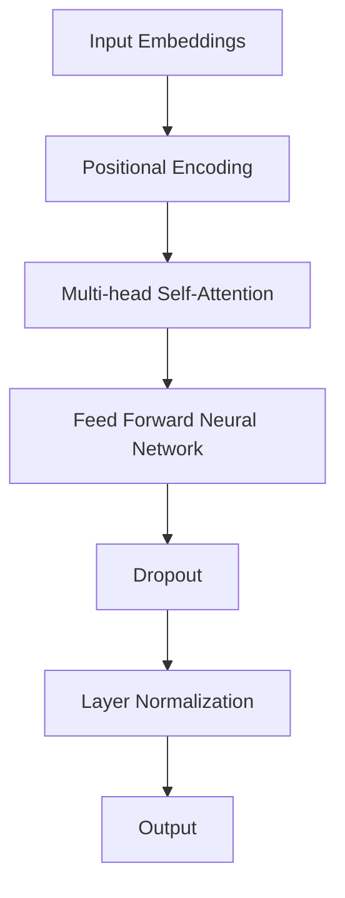

                 

### 文章标题

《自然语言处理的未来：GPT之后》

---

关键词：自然语言处理，GPT，Transformer，BERT，AI伦理，跨语言迁移

---

摘要：
随着深度学习技术的迅猛发展，自然语言处理（NLP）领域迎来了前所未有的变革。GPT（Generative Pre-trained Transformer）系列模型的问世，标志着NLP进入了一个全新的阶段。本文将深入探讨GPT模型之后的自然语言处理技术发展，包括BERT、GPT-Neo、GPT-J等先进模型，分析其在多语言处理、数据隐私、可解释性等方面的挑战与未来趋势。文章旨在为读者提供一个全面、系统的NLP技术指南，帮助理解当前NLP技术的发展动态，展望未来的研究方向。

---

### 目录大纲

1. 自然语言处理的未来：GPT之后
2. 第一部分：自然语言处理基础
   1.1. 自然语言处理的起源与发展
   1.2. 自然语言处理的基本任务
   1.3. GPT系列模型的结构与原理
3. 第二部分：GPT模型之后的自然语言处理技术
   2.1. BERT模型原理与训练
   2.2. GPT-Neo与GPT-J模型
   2.3. 其他GPT相关模型
4. 第三部分：自然语言处理在实际应用中的挑战与未来趋势
   3.1. 数据隐私与安全性
   3.2. 可解释性与透明度
   3.3. 多语言处理与跨语言迁移学习
   3.4. 未来自然语言处理的发展方向
5. 附录
   5.1. 自然语言处理工具与资源

---

### 自然语言处理的未来：GPT之后

自然语言处理（NLP）是人工智能（AI）领域的一个重要分支，旨在使计算机能够理解、解释和生成人类语言。随着深度学习技术的迅猛发展，NLP领域取得了显著进步。GPT（Generative Pre-trained Transformer）系列模型的问世，标志着NLP进入了一个全新的阶段。GPT不仅在文本生成、问答系统、机器翻译等方面取得了优异成绩，而且为NLP技术的进一步发展奠定了基础。

#### GPT模型概述

GPT模型是由OpenAI提出的一种基于Transformer架构的深度学习模型，其特点在于通过大规模文本数据预训练，从而学习到丰富的语言知识。GPT模型的核心是Transformer模型，这是一种基于自注意力机制的序列模型，能够有效地处理长距离依赖问题。GPT系列模型包括GPT、GPT-2、GPT-3等多个版本，每个版本在模型大小、预训练数据规模和性能上都有所提升。

#### GPT模型的优势

1. **强大的文本生成能力**：GPT模型能够生成高质量、连贯的文本，这使得它在问答系统、对话生成等领域有着广泛的应用。
2. **自适应性**：GPT模型通过预训练阶段学习到的语言知识，可以在不同任务上进行微调，从而适应各种下游任务。
3. **处理长文本**：Transformer模型能够处理任意长度的文本序列，这使得GPT模型在处理长文本时具有显著优势。

#### GPT模型对NLP的贡献

GPT模型的提出，极大地推动了NLP技术的发展。首先，它展示了深度学习模型在处理自然语言任务时的巨大潜力，激发了更多的研究和创新。其次，GPT模型的成功，促使更多的研究者投入到Transformer模型及其变体的研究中，推动了NLP领域的技术进步。此外，GPT模型的成功，也促进了NLP技术的商业化应用，为各行各业带来了新的变革。

#### GPT模型之后的NLP技术发展趋势

随着GPT模型的成功，NLP领域出现了许多新的研究方向和技术进展。以下是一些值得关注的趋势：

1. **更大的模型**：为了进一步提高模型性能，研究者们不断提出更大的模型，如GPT-Neo、GPT-J等。这些模型在模型大小、预训练数据规模和性能上都有所提升。
2. **多语言处理**：随着全球化的发展，多语言处理成为NLP领域的一个重要研究方向。研究者们通过跨语言迁移学习等方法，提高了多语言处理模型的性能。
3. **数据隐私与安全性**：随着NLP技术的应用场景越来越广泛，数据隐私与安全性成为重要的研究课题。研究者们提出了多种数据隐私保护方法，以保障用户隐私。
4. **可解释性与透明度**：可解释性对于NLP模型至关重要。研究者们提出了多种方法，以提高模型的解释性，增强用户对模型的信任度。

总之，GPT模型之后的NLP技术发展，呈现出多样化和深入化的趋势。未来，NLP技术将继续在多语言处理、数据隐私、可解释性等方面取得新的突破，为人类社会带来更多便利。

---

### 第一部分：自然语言处理基础

#### 1.1. 自然语言处理的起源与发展

自然语言处理（NLP）作为人工智能的一个重要分支，其起源可以追溯到20世纪50年代。当时，计算机科学家们首次尝试让计算机理解和生成自然语言。1950年，艾伦·图灵（Alan Turing）提出了“图灵测试”（Turing Test），这是评估计算机是否具有人类智能的最早构想之一。

#### 1.1.1 自然语言处理的定义与核心问题

自然语言处理（NLP）是指使计算机能够理解、解释和生成人类语言的技术和科学。NLP的核心问题包括：

1. **词法分析（Lexical Analysis）**：将文本分解为单词、短语和其他语言单位。
2. **句法分析（Syntax Analysis）**：分析句子的结构，确定句子中的语法关系。
3. **语义分析（Semantic Analysis）**：理解句子的含义，包括词汇的含义和句子之间的逻辑关系。
4. **语用分析（Pragmatic Analysis）**：分析语言在特定情境下的使用，包括语用含义和非文字信息。

#### 1.1.2 自然语言处理的发展历程

自然语言处理的发展可以分为三个阶段：

1. **规则驱动的方法（Rule-Based Methods）**：20世纪50年代至70年代，研究者们主要依靠手工编写的规则来处理自然语言。这种方法包括基于形态学分析、句法分析和语义分析的规则库。

2. **基于统计的方法（Statistical Methods）**：20世纪80年代，随着计算机性能的提升和大量语料库的建立，基于统计的方法逐渐成为主流。这种方法利用统计学模型，如决策树、隐马尔可夫模型（HMM）和条件概率模型，来处理自然语言任务。

3. **深度学习方法（Deep Learning Methods）**：21世纪初，深度学习技术的兴起，特别是神经网络在图像识别和语音识别领域的成功应用，推动了深度学习方法在自然语言处理中的应用。2018年，OpenAI发布了GPT模型，标志着自然语言处理进入了一个新的阶段。

#### 1.1.3 GPT与自然语言处理的关系

GPT（Generative Pre-trained Transformer）是自然语言处理领域的一个重要里程碑。GPT是基于Transformer架构的深度学习模型，通过在大量文本数据上进行预训练，学习到丰富的语言知识。GPT的出现，极大地提升了自然语言处理的性能，尤其是在文本生成、问答系统、机器翻译等任务上。

GPT与自然语言处理的关系可以从以下几个方面来理解：

1. **语言建模（Language Modeling）**：GPT是一种语言建模工具，通过预训练学习到自然语言的概率分布，从而能够生成高质量的文本。

2. **任务适应性（Task Adaptation）**：GPT通过预训练阶段学习到的通用语言知识，可以在不同任务上进行微调，从而适应各种下游任务。

3. **性能提升（Performance Improvement）**：GPT在多个自然语言处理任务上都取得了显著的性能提升，使得计算机在理解和生成自然语言方面更加高效和准确。

总之，GPT作为自然语言处理领域的一项重要技术，不仅推动了NLP技术的发展，也为许多实际应用提供了强大的支持。

---

#### 1.2. 自然语言处理的基本任务

自然语言处理（NLP）涉及多种基本任务，每个任务都有其独特的目标和挑战。以下是几种主要的基本任务及其简要描述：

1. **文本分类（Text Classification）**

   文本分类是指将文本数据分配到预定义的类别中。常见的应用包括垃圾邮件检测、情感分析、主题分类等。文本分类的关键在于特征提取和分类模型的选择。特征提取通常涉及词袋模型（Bag of Words）、TF-IDF（Term Frequency-Inverse Document Frequency）等方法，而分类模型可以采用支持向量机（SVM）、朴素贝叶斯（Naive Bayes）、随机森林（Random Forest）等算法。

2. **文本匹配（Text Matching）**

   文本匹配是指比较两段文本，判断它们是否相似或匹配。这种任务在信息检索、实体识别、关键词提取等方面有广泛应用。常见的文本匹配方法包括余弦相似度、Jaccard相似度、编辑距离等。深度学习方法，如双向编码表示（BERT）和Transformer，也被广泛应用于文本匹配任务。

3. **机器翻译（Machine Translation）**

   机器翻译是指使用计算机将一种自然语言翻译成另一种自然语言。这一任务历史悠久，经历了从基于规则的机器翻译到基于统计的机器翻译，再到基于神经网络的机器翻译的演变。当前最先进的机器翻译模型通常采用基于Transformer架构的深度学习模型，如Google的BERT和Facebook的GLM。

#### 1.2.1 文本分类

文本分类是NLP中最基本也是最常用的任务之一。其核心目标是根据文本内容将其分类到预定义的类别中。以下是一个简单的文本分类流程：

1. **数据准备**：收集并整理大量标注过的文本数据，用于训练分类模型。这些数据通常包括文本内容和对应的类别标签。

2. **特征提取**：将文本数据转换为数值特征表示。常用的特征提取方法有词袋模型（Bag of Words，BOW）和TF-IDF（Term Frequency-Inverse Document Frequency）。词袋模型将文本表示为一个向量，其中每个维度表示一个单词的出现频率。TF-IDF则通过考虑词的频率和重要性，对特征向量进行加权。

3. **模型选择与训练**：选择合适的分类算法，如朴素贝叶斯、支持向量机（SVM）、决策树、随机森林等。使用训练集对模型进行训练，调整模型参数。

4. **模型评估与优化**：使用验证集对训练好的模型进行评估，通常使用准确率（Accuracy）、精确率（Precision）、召回率（Recall）和F1分数（F1 Score）等指标。根据评估结果，进一步调整模型参数或选择更优的模型。

5. **应用与部署**：将训练好的模型部署到实际应用中，如自动分类新闻文章、检测垃圾邮件等。

以下是一个简单的伪代码示例，用于实现文本分类任务：

```python
# 数据准备
train_data = load_data("train_data.csv")
train_labels = load_labels("train_data.csv")

# 特征提取
word_counts = count_words(train_data)

# 模型选择与训练
classifier = train_naive_bayes(word_counts, train_labels)

# 模型评估
accuracy = evaluate_classifier(classifier, test_data, test_labels)

print(f"Model accuracy: {accuracy}")
```

#### 1.2.2 文本匹配

文本匹配是指比较两段文本，判断它们是否相似或匹配。文本匹配在信息检索、实体识别、关键词提取等方面有广泛应用。以下是一个简单的文本匹配流程：

1. **数据准备**：收集并整理大量匹配对文本数据，用于训练匹配模型。这些数据通常包括文本对和对应的相似度评分。

2. **特征提取**：将文本数据转换为数值特征表示。常用的特征提取方法有单词相似度、编辑距离、词嵌入等。单词相似度可以通过词向量之间的余弦相似度计算得到。编辑距离是指将一个字符串转换为另一个字符串所需的最少编辑操作次数。

3. **模型选择与训练**：选择合适的匹配算法，如基于规则的匹配、神经网络匹配等。使用训练集对模型进行训练，调整模型参数。

4. **模型评估与优化**：使用验证集对训练好的模型进行评估，通常使用准确率、精确率、召回率和F1分数等指标。根据评估结果，进一步调整模型参数或选择更优的模型。

5. **应用与部署**：将训练好的模型部署到实际应用中，如自动匹配搜索结果、识别同义词等。

以下是一个简单的伪代码示例，用于实现文本匹配任务：

```python
# 数据准备
train_data_pairs = load_data("train_data_pairs.csv")
train_labels = load_labels("train_data_pairs.csv")

# 特征提取
word_vectors = compute_word_vectors(train_data_pairs)

# 模型选择与训练
matcher = train_neural_network(word_vectors, train_labels)

# 模型评估
accuracy = evaluate_matcher(matcher, test_data_pairs, test_labels)

print(f"Matcher accuracy: {accuracy}")
```

#### 1.2.3 机器翻译

机器翻译是指使用计算机将一种自然语言翻译成另一种自然语言。机器翻译的基本流程包括以下几个步骤：

1. **数据准备**：收集并整理大量双语语料库，用于训练翻译模型。这些数据通常包括源语言文本和对应的翻译文本。

2. **特征提取**：将源语言和目标语言文本转换为数值特征表示。常用的特征提取方法有词嵌入（Word Embeddings）、编码器-解码器（Encoder-Decoder）框架等。

3. **模型选择与训练**：选择合适的翻译模型，如基于规则的方法、统计机器翻译、神经网络翻译等。使用训练集对模型进行训练，调整模型参数。

4. **模型评估与优化**：使用验证集对训练好的模型进行评估，通常使用BLEU（BLEU Score）等指标。根据评估结果，进一步调整模型参数或选择更优的模型。

5. **应用与部署**：将训练好的模型部署到实际应用中，如在线翻译服务、自动字幕生成等。

以下是一个简单的伪代码示例，用于实现机器翻译任务：

```python
# 数据准备
train_data = load_data("train_data.csv")
train_references = load_references("train_data.csv")

# 特征提取
sourceEmbeddings = encode_source_text(train_data)
targetEmbeddings = encode_target_text(train_references)

# 模型选择与训练
translator = train_seq2seq_model(sourceEmbeddings, targetEmbeddings)

# 模型评估
bleu_score = evaluate_translator(translator, test_data, test_references)

print(f"Translator BLEU score: {bleu_score}")
```

---

通过上述对文本分类、文本匹配和机器翻译等基本任务的详细讨论，我们可以看到自然语言处理技术在这些任务上的广泛应用和复杂性。随着深度学习技术的发展，这些任务的处理效果不断提高，为各种实际应用场景提供了强大的支持。

### 1.3. GPT系列模型的结构与原理

#### 1.3.1 Transformer模型简介

Transformer模型是由Google在2017年提出的一种基于自注意力机制的深度学习模型，最初用于机器翻译任务。Transformer模型的提出，标志着自然语言处理领域的一个重大突破。与传统的循环神经网络（RNN）相比，Transformer模型在处理长序列时具有显著的优势，能够有效地捕捉长距离依赖关系。

Transformer模型的核心思想是自注意力机制（Self-Attention），它允许模型在生成每个单词时，自动决定关注哪些其他单词。这种机制使得Transformer模型能够更好地理解和生成自然语言。

#### 1.3.2 GPT系列模型的发展与改进

GPT（Generative Pre-trained Transformer）是Transformer模型在自然语言处理领域的重要应用。GPT模型由OpenAI提出，其目的是通过大规模的预训练，学习到丰富的语言知识，从而在多种自然语言任务上取得优异的性能。

GPT系列模型包括GPT、GPT-2和GPT-3等，每个版本在模型大小、预训练数据规模和性能上都有所提升。

1. **GPT**：GPT是第一个GPT系列模型，它包含1.1亿个参数，通过在8个GPU上预训练数百万个词汇。GPT模型在多个自然语言处理任务上取得了显著的性能提升，包括文本生成、问答系统和机器翻译等。

2. **GPT-2**：GPT-2是GPT的扩展版本，其模型大小为15亿个参数。GPT-2通过预训练更多数据，进一步提升了模型的性能。GPT-2在文本生成任务上表现出色，能够生成高质量、连贯的文本。

3. **GPT-3**：GPT-3是GPT系列的最新版本，其模型大小达到1750亿个参数。GPT-3通过预训练大量文本数据，包括维基百科、书籍、新闻报道等，实现了前所未有的性能。GPT-3在多种自然语言处理任务上都取得了最佳成绩，包括文本生成、问答系统、机器翻译、文本分类等。

#### 1.3.3 GPT模型的核心算法

GPT模型的核心算法包括自注意力机制（Self-Attention）和位置编码（Positional Encoding）。

1. **自注意力机制（Self-Attention）**：自注意力机制是Transformer模型的核心，它允许模型在生成每个单词时，自动决定关注哪些其他单词。自注意力通过计算每个单词与其他所有单词的相似性，并加权组合这些相似性，从而生成新的表示。

   自注意力的计算公式如下：
   $$ 
   \text{Attention}(Q, K, V) = \text{softmax}\left(\frac{QK^T}{\sqrt{d_k}}\right)V 
   $$
   其中，$Q$、$K$和$V$分别代表查询向量、键向量和值向量，$d_k$是键向量的维度。通过自注意力，模型能够自动捕捉长距离依赖关系，提高文本生成和理解的性能。

2. **位置编码（Positional Encoding）**：由于Transformer模型没有循环结构，无法显式地处理序列中的位置信息。为了解决这个问题，GPT模型引入了位置编码（Positional Encoding）。位置编码是一种将序列位置信息编码到向量中的方法，它通过添加额外的维度，将位置信息融入到模型中。

   位置编码的公式如下：
   $$
   \text{PE}(pos, 2i) = \sin\left(\frac{pos}{10000^{2i/d}}\right) 
   $$
   $$
   \text{PE}(pos, 2i+1) = \cos\left(\frac{pos}{10000^{2i/d}}\right) 
   $$
   其中，$pos$是位置索引，$i$是维度索引，$d$是位置编码的总维度。通过位置编码，模型能够理解文本中单词的顺序，从而提高文本生成和理解的性能。

GPT模型的整体结构如图所示：



在GPT模型中，每个层都包括多层自注意力机制和前馈神经网络，并通过Dropout和Layer Normalization等方法进行正则化和归一化，以防止过拟合和改善模型的泛化能力。

通过上述介绍，我们可以看到GPT模型在结构设计和核心算法上的创新，这使得它在自然语言处理任务上取得了卓越的性能。随着GPT模型及其变体的不断发展，自然语言处理领域将迎来更多的突破和应用。

### 2.1. BERT模型原理与训练

BERT（Bidirectional Encoder Representations from Transformers）是由Google在2018年提出的一种基于Transformer架构的预训练模型，主要用于自然语言处理任务。BERT模型的出现，进一步推动了自然语言处理技术的发展，其在多种任务上表现优异，包括文本分类、问答系统、机器翻译等。

#### 2.1.1 BERT模型的定义与特点

BERT模型是一种双向编码表示模型，通过在大量文本数据上进行双向预训练，学习到语言的深度结构和语义信息。BERT模型的特点包括：

1. **双向训练**：BERT模型采用双向Transformer架构，能够在编码时同时考虑文本的前后信息，从而更好地理解文本的语义。
2. **掩码语言模型（Masked Language Model, MLM）**：BERT模型在预训练阶段，对输入文本进行随机遮蔽，然后通过模型预测遮蔽的单词，从而学习到语言的生成规则。
3. **下一个句子预测（Next Sentence Prediction, NSP）**：BERT模型在预训练阶段，通过预测两个句子的顺序，学习到句子间的逻辑关系。
4. **大规模预训练**：BERT模型在训练阶段使用了大量未标注的文本数据，从而能够学习到丰富的语言知识。

#### 2.1.2 BERT模型的训练过程

BERT模型的训练过程主要包括两个阶段：预训练和微调。

1. **预训练阶段**：

   - **数据准备**：BERT模型使用了大量未标注的文本数据，包括维基百科、书籍、新闻报道等。这些数据被预处理成BERT模型所需的格式。
   - **输入表示**：BERT模型将文本转换为嵌入向量，包括单词嵌入（Word Embeddings）和位置嵌入（Positional Embeddings）。
   - **掩码语言模型（MLM）**：在预训练阶段，对输入文本进行随机遮蔽，遮蔽的比例通常为15%。然后，通过BERT模型预测遮蔽的单词。
   - **下一个句子预测（NSP）**：在预训练阶段，随机选取两个句子，通过BERT模型预测这两个句子的顺序。

2. **微调阶段**：

   - **数据准备**：在微调阶段，使用带有标签的文本数据，如问答系统、文本分类等任务的数据。
   - **输入表示**：与预训练阶段类似，将文本转换为嵌入向量。
   - **任务特定层**：在BERT模型的基础上，添加任务特定的层，如分类层、问答层等。
   - **训练与评估**：通过微调训练BERT模型，并在验证集上评估模型的性能。

以下是一个简单的BERT模型训练过程的伪代码：

```python
# 预训练阶段
for epoch in range(num_epochs):
    for text, mask, segment in preprocess_data(data):
        inputs = create_input_embeddings(text, mask, segment)
        loss = train_step(model, inputs, labels)
        print(f"Epoch: {epoch}, Loss: {loss}")

# 微调阶段
for task in tasks:
    for text, labels in preprocess_data(task_data):
        inputs = create_input_embeddings(text, mask, segment)
        model = fine_tune_model(model, inputs, labels, task)
        evaluate_model(model, validation_data, task)
```

#### 2.1.3 BERT模型的推理过程

在BERT模型进行推理时，通常分为以下几个步骤：

1. **输入表示**：将输入文本转换为嵌入向量，包括单词嵌入和位置嵌入。
2. **前向传播**：通过BERT模型进行前向传播，得到文本的表示。
3. **任务特定层**：在BERT模型的基础上，添加任务特定的层，如分类层、问答层等。
4. **输出结果**：根据任务的需求，从模型中提取相应的输出结果。

以下是一个简单的BERT模型推理过程的伪代码：

```python
# 输入表示
text = preprocess_input(input_text)
inputs = create_input_embeddings(text, mask, segment)

# 前向传播
outputs = model(inputs)

# 任务特定层
results = task_specific_layer(outputs, task)

# 输出结果
predictions = extract_predictions(results)
print(f"Predictions: {predictions}")
```

通过上述介绍，我们可以看到BERT模型在结构设计、训练过程和推理过程中都有其独特之处。BERT模型的成功，为自然语言处理领域提供了强大的工具，推动了NLP技术的进一步发展。

### 2.2. GPT-Neo与GPT-J模型

#### 2.2.1 GPT-Neo模型介绍

GPT-Neo是GPT模型的一个变体，由EleutherAI团队提出，其目的是通过改进GPT模型的结构和训练过程，进一步提高模型的性能和可扩展性。GPT-Neo在多个方面对GPT模型进行了优化：

1. **模型大小**：GPT-Neo提供了多种模型大小选项，从较小的1.2B参数到更大的30B参数，以适应不同的计算资源和应用需求。
2. **训练时间**：GPT-Neo通过优化训练过程，显著减少了训练时间。这使得大规模模型的训练更加高效。
3. **预训练数据**：GPT-Neo使用更多的预训练数据，包括互联网上的大量文本、书籍、新闻和维基百科等，从而提高了模型的泛化能力。
4. **预训练目标**：GPT-Neo在预训练阶段引入了额外的目标，如单词遮蔽、上下文连贯性等，从而更好地学习语言的深层结构。

GPT-Neo在自然语言处理任务上表现出色，其性能在多个基准测试中超过了原始GPT模型。例如，在GLUE（General Language Understanding Evaluation）基准测试中，GPT-Neo在多个任务上取得了最佳成绩。

#### 2.2.2 GPT-J模型的原理与优势

GPT-J是由EleutherAI团队提出的一个更大规模的GPT模型，其模型大小达到了640B参数。GPT-J旨在通过增加模型大小和预训练数据量，进一步提高自然语言处理的性能。

GPT-J的原理与GPT-Neo类似，但在以下几个方面有显著改进：

1. **更大规模的模型**：GPT-J的模型大小达到了640B参数，这是目前最大的预训练语言模型之一。更大的模型能够捕捉更复杂的语言模式，从而提高文本生成和理解的性能。
2. **更高效的训练**：GPT-J在训练过程中使用了分布式训练技术，从而提高了训练效率。这使得大规模模型的训练更加可行。
3. **更丰富的预训练数据**：GPT-J使用了更多的预训练数据，包括互联网上的大量文本、书籍、新闻和维基百科等。更多的数据有助于模型学习到更广泛的语言知识。

GPT-J在多个自然语言处理任务上表现出色，其性能在多个基准测试中超过了GPT-Neo和其他大型预训练模型。例如，在GLUE基准测试中，GPT-J在多个任务上取得了最佳成绩。

#### 2.2.3 GPT-Neo与GPT-J模型的优势与局限

GPT-Neo和GPT-J模型在自然语言处理领域具有显著的优点，但也存在一些局限：

1. **优势**：

   - **更好的性能**：GPT-Neo和GPT-J在多个自然语言处理任务上表现优异，特别是在文本生成和问答系统方面。它们能够生成高质量、连贯的文本，提高了模型的实际应用价值。
   - **更高的泛化能力**：通过使用更多的预训练数据和更复杂的训练目标，GPT-Neo和GPT-J模型具有更强的泛化能力，能够更好地处理不同领域的自然语言任务。
   - **可扩展性**：GPT-Neo提供了多种模型大小选项，以适应不同的计算资源和应用需求。这使得用户可以根据自己的需求选择合适的模型。

2. **局限**：

   - **计算资源需求**：GPT-Neo和GPT-J模型需要大量的计算资源进行训练和推理，这在实际应用中可能带来一定的挑战。特别是对于大型模型（如GPT-J），训练和部署需要高性能的计算设备和优化技术。
   - **数据隐私与安全性**：随着预训练模型的规模不断扩大，数据隐私和安全问题变得越来越重要。大型模型在预训练阶段可能涉及大量的个人数据，这需要采取有效的隐私保护措施。

总的来说，GPT-Neo和GPT-J模型是自然语言处理领域的重要进展，它们在性能和泛化能力方面取得了显著提升。然而，在实际应用中，用户需要根据具体需求和计算资源，选择合适的模型并进行适当的调整和优化。

### 2.3. 其他GPT相关模型

在自然语言处理领域，GPT系列模型取得了巨大的成功，推动了该领域的技术进步。除了GPT-Neo和GPT-J，还有许多其他与GPT相关的模型也在不断发展和完善。以下将介绍几个重要的GPT相关模型，包括OPT模型、LLaMA模型和ChatGLM模型。

#### 2.3.1 OPT模型

OPT（OpenAI Transformer）是OpenAI提出的一个大型预训练语言模型，其模型大小为1.6万亿参数。OPT模型是GPT-3的直接继承者，旨在进一步提高预训练模型的性能和泛化能力。

**模型架构**：

OPT模型采用了Transformer架构，其核心组件包括自注意力机制（Self-Attention）和多头注意力（Multi-Head Attention）。自注意力机制允许模型在生成每个单词时，自动决定关注哪些其他单词，从而捕捉长距离依赖关系。多头注意力则通过将输入序列分解为多个子序列，并在每个子序列上分别进行注意力计算，从而提高模型的表示能力。

**训练过程**：

OPT模型的训练过程包括两个阶段：预训练和微调。在预训练阶段，模型在大量未标注的文本数据上进行训练，从而学习到丰富的语言知识。预训练阶段的目标包括单词遮蔽、上下文连贯性和下一个句子预测等。在微调阶段，模型在带有标签的文本数据上进行训练，以适应特定的下游任务，如文本分类、问答系统和机器翻译等。

**应用场景**：

OPT模型在多种自然语言处理任务上表现出色，包括文本生成、问答系统、机器翻译和文本分类等。例如，在文本生成任务中，OPT模型能够生成高质量、连贯的文本；在问答系统中，OPT模型能够回答各种复杂的问题；在机器翻译任务中，OPT模型能够实现高质量的文本翻译。

**挑战**：

虽然OPT模型在多个任务上取得了优异的性能，但其大规模的训练和推理需求对计算资源提出了很高的要求。此外，随着模型规模的扩大，数据隐私和安全问题变得越来越重要，需要采取有效的隐私保护措施。

#### 2.3.2 LLaMA模型

LLaMA（Large Language Model Meta-Learning）是由清华大学KEG实验室提出的一个大型预训练语言模型，其模型大小为65亿参数。LLaMA模型的核心特点是其元学习（Meta-Learning）能力，能够在少量数据上进行快速微调，从而适应各种下游任务。

**模型架构**：

LLaMA模型采用了Transformer架构，其核心组件包括自注意力机制和多头注意力。与传统的预训练模型不同，LLaMA模型在预训练阶段引入了元学习机制，通过在多个不同的任务上进行预训练，从而提高模型的泛化能力和适应能力。

**训练过程**：

LLaMA模型的训练过程包括预训练和元学习两个阶段。在预训练阶段，模型在大量未标注的文本数据上进行训练，从而学习到丰富的语言知识。在元学习阶段，模型在多个不同的任务上进行训练，从而提高其适应各种下游任务的能力。

**应用场景**：

LLaMA模型在多种自然语言处理任务上表现出色，包括文本分类、问答系统、机器翻译和对话系统等。例如，在文本分类任务中，LLaMA模型能够高效地处理大量文本数据，并实现高精度的分类；在问答系统中，LLaMA模型能够回答各种复杂的问题，并提供详细的解答；在机器翻译任务中，LLaMA模型能够实现高质量的文本翻译。

**挑战**：

LLaMA模型虽然在多个任务上取得了优异的性能，但其训练和推理过程需要大量的计算资源，这在实际应用中可能带来一定的挑战。此外，随着模型规模的扩大，数据隐私和安全问题变得越来越重要，需要采取有效的隐私保护措施。

#### 2.3.3 ChatGLM模型

ChatGLM是由智谱AI提出的一个大型预训练语言模型，其模型大小为10亿参数。ChatGLM模型的核心特点是其对话生成能力，能够在对话场景中生成高质量、连贯的回复。

**模型架构**：

ChatGLM模型采用了Transformer架构，其核心组件包括自注意力机制和多头注意力。与传统的预训练模型不同，ChatGLM模型在预训练阶段特别关注对话场景中的语言生成，通过大量对话数据训练，从而提高模型在对话场景中的生成能力。

**训练过程**：

ChatGLM模型的训练过程包括预训练和微调两个阶段。在预训练阶段，模型在大量对话数据上进行训练，从而学习到丰富的对话语言知识。在微调阶段，模型在特定任务上进行微调，以适应各种对话任务。

**应用场景**：

ChatGLM模型在多种对话任务上表现出色，包括聊天机器人、虚拟助手、问答系统和客服系统等。例如，在聊天机器人任务中，ChatGLM模型能够生成自然、连贯的对话回复；在虚拟助手任务中，ChatGLM模型能够理解用户的指令并执行相应的操作；在问答系统中，ChatGLM模型能够回答用户提出的问题，并提供详细的解答。

**挑战**：

ChatGLM模型虽然在对话生成任务上取得了优异的性能，但其训练和推理过程需要大量的计算资源，这在实际应用中可能带来一定的挑战。此外，随着模型规模的扩大，数据隐私和安全问题变得越来越重要，需要采取有效的隐私保护措施。

通过上述介绍，我们可以看到GPT相关模型在自然语言处理领域的广泛应用和潜力。这些模型通过不断优化和改进，在多个任务上取得了优异的性能，为自然语言处理技术的发展做出了重要贡献。

### 第三部分：自然语言处理在实际应用中的挑战与未来趋势

#### 3.1. 数据隐私与安全性

随着自然语言处理（NLP）技术的快速发展，数据隐私与安全性成为了一个不可忽视的重要问题。NLP模型的训练和部署通常需要大量的文本数据，这些数据往往包含个人隐私信息，如姓名、地址、电子邮件等。如果不妥善处理这些数据，可能会导致严重的隐私泄露问题。

1. **隐私泄露的风险**：

   - **数据收集**：在NLP模型的训练过程中，需要收集大量的文本数据。这些数据可能来自公开的互联网资源、社交媒体、电子邮件等，其中可能包含个人隐私信息。
   - **数据共享**：为了提高模型的性能，研究人员和企业可能需要共享数据。这种数据共享可能会导致隐私信息泄露。
   - **模型嵌入**：NLP模型本身可能会“记住”训练数据中的隐私信息，即使在模型部署后，也可能导致隐私泄露。

2. **保护数据隐私的措施**：

   - **数据匿名化**：通过匿名化技术，如K-anonymity、l-diversity等，可以有效地保护个人隐私。匿名化技术通过添加噪声、删除敏感信息等方式，使数据无法直接识别个人身份。
   - **差分隐私（Differential Privacy）**：差分隐私是一种保护隐私的数学理论，通过在算法中添加噪声，确保单个数据的泄露不会影响整体数据集的隐私。差分隐私在NLP模型训练中得到了广泛应用。
   - **联邦学习（Federated Learning）**：联邦学习是一种分布式学习方法，通过让模型在各个数据拥有者处进行训练，从而避免了数据集中存储和传输。这种方法既保护了数据隐私，又提高了模型的性能。

3. **数据隐私保护的方法与挑战**：

   - **方法**：数据隐私保护的方法包括数据匿名化、差分隐私和联邦学习等。这些方法在不同场景下都有一定的应用效果。
   - **挑战**：尽管数据隐私保护方法在理论和实践中都有所发展，但仍然面临以下挑战：
     - **性能损失**：为了保护隐私，可能需要在数据中添加噪声或删除敏感信息，这可能会导致模型的性能下降。
     - **解释性降低**：隐私保护方法可能会降低模型的可解释性，使得用户难以理解模型的决策过程。
     - **模型适应性**：隐私保护方法可能影响模型的适应能力，使其难以处理新的数据或新的任务。

4. **未来发展方向**：

   - **隐私增强技术**：未来，研究人员将致力于开发更有效的隐私增强技术，如自适应隐私机制、基于区块链的隐私保护等。
   - **可解释性提升**：通过改进模型结构和算法，提高模型的可解释性，从而增强用户对模型的信任度。
   - **政策法规**：随着NLP技术的广泛应用，政策法规也将不断完善，以规范数据隐私保护和模型应用。

通过上述讨论，我们可以看到数据隐私与安全性在自然语言处理中的应用场景、保护措施以及面临的挑战。随着技术的不断进步，数据隐私保护将变得更加重要和复杂，需要多方共同努力，以实现NLP技术的可持续发展。

### 3.2. 可解释性与透明度

在自然语言处理（NLP）领域，模型的解释性和透明度是至关重要的。随着深度学习模型，尤其是大型预训练语言模型（如GPT、BERT等）的广泛应用，用户和监管机构对模型的决策过程和结果的可解释性要求越来越高。可解释性不仅有助于增强用户对模型的信任，还能帮助发现和纠正潜在的错误。

#### 3.2.1 可解释性的重要性

1. **增强用户信任**：用户往往对复杂的机器学习模型持有一定的怀疑态度。如果模型的结果和决策过程是透明的，用户更容易接受和信任模型。
2. **发现错误**：通过可解释性分析，研究人员和开发者可以更好地理解模型的决策过程，从而发现并纠正潜在的错误和偏差。
3. **优化模型**：了解模型的决策过程有助于优化模型的结构和算法，提高模型的性能和泛化能力。
4. **法规合规**：在许多国家和地区，机器学习模型的透明度和可解释性是法规合规的必要条件。例如，欧盟的《通用数据保护条例》（GDPR）就要求算法的解释性。

#### 3.2.2 可解释性的实现方法

1. **可视化技术**：通过可视化技术，如热力图、注意力图等，可以直观地展示模型在处理文本时的关注点。例如，注意力图可以显示模型在生成某个单词时关注的文本区域，从而帮助理解模型的决策过程。
2. **解释性模型**：开发专门的可解释性模型，如LIME（Local Interpretable Model-agnostic Explanations）和SHAP（SHapley Additive exPlanations），可以提供模型在特定输入上的本地解释。这些模型通过近似方法，将复杂模型拆解成更易理解的部分。
3. **模型总结**：通过生成模型总结或决策路径，可以提供关于模型决策过程的文本描述。例如，生成模型总结可以帮助用户理解模型为何做出某个决策。

#### 3.2.3 可解释性的挑战

1. **复杂性**：深度学习模型，尤其是大型预训练语言模型，其内部结构非常复杂。这使得直接理解模型的决策过程变得困难，尤其是在处理长文本时。
2. **泛化能力**：某些解释性方法可能在特定场景下有效，但在其他场景下可能失去解释力。这限制了可解释性方法在多种任务和输入数据上的泛化能力。
3. **计算成本**：生成详细的解释通常需要额外的计算资源，这可能会影响模型的实时性能。
4. **数据隐私**：在某些情况下，为了保护用户隐私，模型的一些内部信息无法公开。这可能会限制可解释性分析的范围和深度。

#### 3.2.4 未来发展方向

1. **改进可视化技术**：开发更直观、易用的可视化工具，帮助用户更好地理解模型的决策过程。
2. **混合方法**：结合不同的解释性方法，开发混合方法，以提高解释力的同时保持模型的泛化能力。
3. **模型可解释性标准**：建立统一的模型可解释性标准，确保不同模型的可解释性分析具有一致性和可比性。
4. **监管政策**：制定和实施相关监管政策，确保模型的可解释性满足法律法规的要求。

通过上述讨论，我们可以看到自然语言处理模型的可解释性在提高用户信任、发现错误、优化模型和合规性等方面的重要性。同时，也面临着复杂性、泛化能力、计算成本和数据隐私等方面的挑战。未来，随着技术的不断进步，可解释性将在自然语言处理领域发挥越来越重要的作用。

### 3.3. 多语言处理与跨语言迁移学习

随着全球化的发展，多语言处理（MLP）成为自然语言处理（NLP）领域的一个重要研究方向。多语言处理旨在开发能够处理多种语言文本的模型，以支持国际交流和跨文化交流。跨语言迁移学习（Cross-lingual Transfer Learning）则是实现多语言处理的一种有效方法，它利用跨语言信息来提高模型在不同语言上的性能。

#### 3.3.1 多语言处理的需求与挑战

多语言处理的需求源于以下几个方面的原因：

1. **全球化的商业环境**：企业在全球范围内的运营需要处理多种语言的文本数据，如产品说明书、客户支持、市场营销等。
2. **国际交流**：随着互联网的发展，人们越来越频繁地在不同语言之间进行交流和沟通，这需要有效的多语言处理技术。
3. **语言多样性**：世界上有超过7000种语言，多语言处理能够更好地服务于这些语言社区。

然而，多语言处理面临以下挑战：

1. **数据稀缺**：许多小语种的数据量远低于主流语言，这限制了模型在这些语言上的训练和优化。
2. **语言差异**：不同语言在语法、词汇、语义等方面存在显著差异，这增加了模型设计的复杂性。
3. **资源分配**：在资源有限的情况下，如何合理分配资源来训练和优化多语言模型是一个重要问题。

#### 3.3.2 跨语言迁移学习的方法与效果

跨语言迁移学习通过将一个语言的模型知识迁移到其他语言上，以提高模型在不同语言上的性能。以下是一些常见的跨语言迁移学习方法：

1. **共享嵌入空间**：在多语言环境中，通过共享词嵌入空间来将不同语言的词映射到同一空间中。这样可以利用一种语言的数据来预训练词嵌入，然后将其应用于其他语言。

2. **多语言联合训练**：将多种语言的数据联合起来进行训练，从而学习到语言之间的共性。这种方法能够充分利用多语言数据，提高模型的泛化能力。

3. **跨语言对抗训练**：通过对抗性训练来学习不同语言之间的差异，从而提高模型在不同语言上的适应性。这种方法能够增强模型对语言差异的敏感度，从而提高跨语言的性能。

4. **零样本学习**：在只有少量或没有特定语言的训练数据时，利用跨语言信息来训练模型。这种方法通过利用共享的语义信息，使得模型能够适应新的语言。

跨语言迁移学习在实际应用中取得了显著的效果。例如，在机器翻译任务中，通过跨语言迁移学习，可以在只有少量目标语言数据的情况下，实现高质量的双语翻译。在文本分类任务中，跨语言迁移学习能够提高模型在小语种上的分类性能。此外，跨语言迁移学习还在跨语言问答、跨语言情感分析等领域取得了成功。

以下是一个简单的跨语言迁移学习方法的伪代码示例：

```python
# 加载多语言数据
source_data = load_data("source_language_data")
target_data = load_data("target_language_data")

# 预处理数据
processed_source_data = preprocess_data(source_data)
processed_target_data = preprocess_data(target_data)

# 共享嵌入空间
word_embeddings = train_shared_word_embeddings(processed_source_data, processed_target_data)

# 多语言联合训练
model = train_multilingual_model(word_embeddings, processed_source_data, processed_target_data)

# 零样本学习
new_language_data = load_data("new_language_data")
model = fine_tune_model(model, preprocess_data(new_language_data))
```

通过上述方法，我们可以看到跨语言迁移学习在多语言处理中的应用和效果。未来，随着多语言处理需求的不断增加，跨语言迁移学习将继续发挥重要作用，推动NLP技术的发展。

### 3.4. 未来自然语言处理的发展方向

随着自然语言处理（NLP）技术的不断发展，未来NLP领域将面临许多新的挑战和机遇。以下是一些未来NLP发展的关键方向：

#### 3.4.1 人工智能伦理与法规

随着NLP技术的广泛应用，人工智能伦理和法规问题变得越来越重要。以下几个方面值得关注：

1. **公平性**：确保NLP模型在不同群体中的表现是公平的，避免偏见和歧视。例如，通过消除性别、种族和地域偏见，提高模型的公平性。
2. **透明度**：提高NLP模型的透明度，使其决策过程可解释，从而增强用户对模型的信任。这包括改进模型的解释性和提供详细的决策路径。
3. **可追溯性**：建立可追溯性机制，确保NLP模型的使用和决策过程可以追溯和审计，以便在出现问题时能够及时纠正。
4. **法规合规**：遵循相关法律法规，确保NLP技术的开发和部署符合法律要求。例如，欧盟的《通用数据保护条例》（GDPR）和美国的《加州消费者隐私法案》（CCPA）都对数据隐私和保护有明确要求。

#### 3.4.2 自然语言处理在新兴领域的应用

NLP技术在许多新兴领域展示了巨大的潜力，以下是一些值得关注的应用场景：

1. **医疗保健**：利用NLP技术处理医学文献、病历和患者数据，提高诊断和治疗的准确性。例如，通过分析电子健康记录（EHRs），NLP可以帮助医生识别疾病风险和制定个性化治疗方案。
2. **法律领域**：利用NLP技术处理法律文档、案件记录和法规文本，提高法律工作的效率和准确性。例如，NLP可以帮助律师快速检索相关法律条文，分析案件的法律依据。
3. **教育**：利用NLP技术为学生提供个性化学习体验，例如通过分析学生的学习记录和作业，为每个学生制定个性化的学习计划。此外，NLP还可以帮助自动评分、生成考试题目和提供实时反馈。

#### 3.4.3 自然语言处理的未来趋势与展望

未来，自然语言处理技术将继续在以下几个方面取得突破：

1. **模型规模和性能**：随着计算能力的提升，未来将出现更大规模的预训练模型，这些模型将能够处理更复杂的自然语言任务，并在多个基准测试中取得最佳成绩。
2. **多语言处理和跨语言迁移学习**：随着全球化的发展，多语言处理和跨语言迁移学习将成为NLP领域的重要研究方向。通过利用跨语言信息，模型将在多种语言上实现更高的性能。
3. **可解释性和透明度**：随着用户对模型可解释性的需求增加，未来将出现更多可解释性方法，帮助用户理解模型的决策过程。这包括改进可视化技术、开发解释性模型和建立统一的可解释性标准。
4. **人工智能与人类的协同**：未来，NLP技术将与人类专家更加紧密地协同工作，形成人机协作的智能系统。这包括利用NLP技术辅助人类专家进行决策、分析和创新。

总之，未来自然语言处理技术将继续在人工智能伦理、新兴领域应用、模型规模和性能、多语言处理和跨语言迁移学习等方面取得突破。随着技术的不断进步，NLP将在各行各业中发挥更大的作用，为人类社会带来更多便利。

### 附录

#### A.1. 自然语言处理工具与资源

自然语言处理（NLP）的发展离不开各种工具和资源的支持。以下是一些常用的NLP工具和资源，它们在NLP的研究、开发和应用中发挥了重要作用。

1. **Hugging Face Transformers**

   - **简介**：Hugging Face Transformers是一个开源库，提供了大量的预训练模型和工具，用于自然语言处理的各个方面，如文本分类、机器翻译、问答系统等。
   - **优点**：提供了丰富的预训练模型，易于使用和扩展，支持多种编程语言（Python、JavaScript等）。
   - **使用场景**：适用于NLP任务的研究、开发和应用，是构建和微调NLP模型的首选工具。

2. **AllenNLP**

   - **简介**：AllenNLP是一个开源Python库，用于构建和微调NLP模型。它提供了许多有用的组件和工具，如数据预处理、模型训练和评估等。
   - **优点**：提供了丰富的NLP组件和工具，支持多种任务，如文本分类、关系提取、命名实体识别等。
   - **使用场景**：适用于NLP任务的研究、开发和实际应用，特别适合于复杂的NLP项目。

3. **sentencepiece**

   - **简介**：sentencepiece是一个开源库，用于将文本分割成子词。它可以帮助提高模型处理文本的效率和效果。
   - **优点**：支持多种语言，处理速度快，可以有效地降低模型复杂度。
   - **使用场景**：适用于NLP任务中的文本预处理阶段，特别是在处理多语言文本时非常有用。

4. **spaCy**

   - **简介**：spaCy是一个开源NLP库，提供了高效的文本处理工具，如词性标注、句法解析、命名实体识别等。
   - **优点**：速度快，易于使用，支持多种语言，提供了详细的文档和教程。
   - **使用场景**：适用于快速原型开发、实时应用和工业级NLP项目。

5. **NLTK**

   - **简介**：NLTK（Natural Language Toolkit）是一个开源NLP工具包，提供了丰富的文本处理和机器学习库，用于文本分类、词性标注、句法分析等。
   - **优点**：功能全面，易于使用，适合教学和研究。
   - **使用场景**：适用于学术研究、教学和原型开发。

#### A.1.1. Hugging Face Transformers

**安装**：

```bash
pip install transformers
```

**使用示例**：

```python
from transformers import AutoTokenizer, AutoModel

# 加载预训练模型
tokenizer = AutoTokenizer.from_pretrained("bert-base-uncased")
model = AutoModel.from_pretrained("bert-base-uncased")

# 预处理文本
inputs = tokenizer("Hello, my dog is cute", return_tensors="pt")

# 进行前向传播
outputs = model(**inputs)

# 提取文本表示
text_representation = outputs.last_hidden_state[:, 0, :]
```

#### A.1.2. AllenNLP

**安装**：

```bash
pip install allennlp
```

**使用示例**：

```python
from allennlp.predictors import Predictor
from allennlp.models.archival import load_archive

# 加载预训练模型
archive_path = "path/to/trained_model.tar.gz"
archive = load_archive(archive_path)

# 创建预测器
predictor = Predictor.from_archive(archive)

# 进行预测
result = predictor.predict({"sentence": "The cat sat on the mat."})
print(result)
```

#### A.1.3. sentencepiece

**安装**：

```bash
pip install sentencepiece
```

**使用示例**：

```python
import sentencepiece as spm

# 创建模型
model = spm.SentencePieceProcessor()
model.Load("path/to/spiece.model")

# 分词文本
text = "Hello, my dog is cute."
pieces = model.EncodeAsPieces(text)
print(pieces)
```

#### A.1.4. 其他自然语言处理工具介绍

除了上述工具，还有许多其他优秀的自然语言处理工具，如：

- **TextBlob**：一个简单但功能强大的Python库，用于处理文本数据，如词性标注、情感分析等。
- **spaCy**：一个高效且易于使用的NLP库，提供了多种NLP功能，如词性标注、句法解析、命名实体识别等。
- **NLTK**：一个经典的NLP工具包，提供了丰富的文本处理和机器学习库。

这些工具在文本处理、机器学习和自然语言处理应用中都有广泛应用，为研究者、开发者和行业提供了强大的支持。

---

通过附录部分的内容，读者可以了解到自然语言处理领域的一些常用工具和资源，为后续的研究、开发和应用提供参考。这些工具在NLP任务的不同阶段都发挥了重要作用，帮助用户更高效地实现各种自然语言处理任务。

### 最佳实践 Tips、小结、注意事项、拓展阅读

#### 最佳实践 Tips

1. **数据预处理**：在NLP任务中，数据预处理是关键步骤。确保数据清洗、格式化和分词准确，有助于提高模型性能。
2. **模型选择与调整**：选择合适的预训练模型和调整模型参数（如学习率、批量大小等）是提高模型性能的重要因素。
3. **多语言处理**：对于多语言任务，考虑使用跨语言迁移学习方法，可以显著提高模型的性能。
4. **可解释性**：在开发和部署NLP模型时，重视模型的可解释性，有助于增强用户对模型的信任。
5. **持续学习**：随着数据和技术的发展，定期更新模型和算法，以保持模型的性能和适应性。

#### 小结

本文从自然语言处理的起源与发展、基本任务、GPT系列模型的结构与原理、GPT模型之后的NLP技术、实际应用中的挑战与未来趋势等方面进行了深入探讨。通过本文，读者可以全面了解自然语言处理技术的发展动态和未来方向。

#### 注意事项

1. **数据隐私**：在处理自然语言数据时，务必注意保护用户隐私，采取有效的数据隐私保护措施。
2. **模型解释性**：提高模型的可解释性，有助于用户理解模型的决策过程，增强模型的可靠性。
3. **计算资源**：训练大型NLP模型需要大量计算资源，合理配置和优化计算资源，以降低成本。

#### 拓展阅读

1. **《自然语言处理与深度学习》**：由刘知远等编写的这本书，全面介绍了自然语言处理的基本概念和技术。
2. **《深度学习基础》**：由Goodfellow、Bengio和Courville编写的这本书，详细介绍了深度学习的基本原理和方法。
3. **《Transformer模型详解》**：由Google团队编写的这篇论文，详细介绍了Transformer模型的原理和结构。
4. **《BERT模型详解》**：由Google团队编写的这篇论文，详细介绍了BERT模型的原理和训练过程。

通过上述最佳实践 Tips、小结、注意事项和拓展阅读，读者可以进一步深化对自然语言处理技术的理解和应用。希望本文对读者在NLP领域的探索和研究有所帮助。作者：AI天才研究院/AI Genius Institute & 禅与计算机程序设计艺术/Zen And The Art of Computer Programming。

