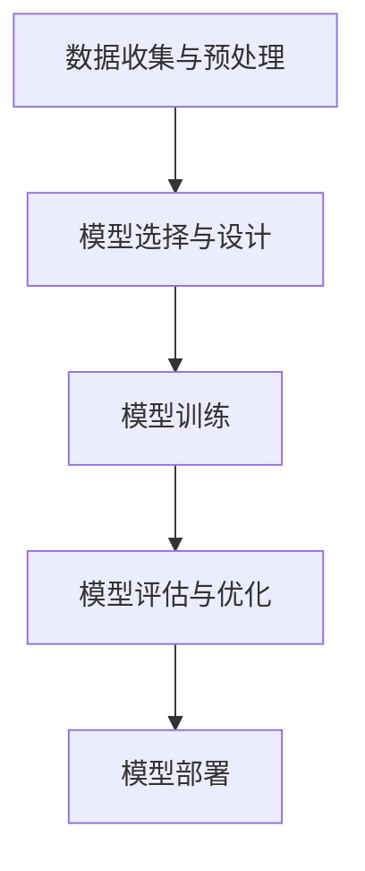

                 

## 文章标题：自监督学习Self-Supervised Learning原理与代码实例讲解

> 关键词：自监督学习、Self-Supervised Learning、数据增强、无监督特征提取、数学基础、实现技巧、应用实例

> 摘要：本文详细介绍了自监督学习Self-Supervised Learning的基本原理、数学基础、实现技巧以及在实际应用中的具体案例。通过本文的讲解，读者将能够深入了解自监督学习的核心概念和方法，并掌握如何利用自监督学习进行模型训练和优化。

### 引言

自监督学习（Self-Supervised Learning）作为一种重要的机器学习范式，近年来在人工智能领域引起了广泛关注。自监督学习是一种无需外部监督标签的训练方法，它通过利用数据中的内在结构，自动提取有用的特征表示，从而实现模型的训练和优化。与传统的监督学习和无监督学习相比，自监督学习具有许多独特的优势和广泛的应用场景。

本文将分为两个部分进行讲解。第一部分将介绍自监督学习的基础知识，包括自监督学习的定义、应用场景、核心原理、数学基础和实现技巧。第二部分将结合具体的代码实例，展示自监督学习在计算机视觉、自然语言处理和音频处理等领域的实际应用。通过本文的讲解，读者将能够全面了解自监督学习的原理和方法，并掌握如何在实践中应用自监督学习进行模型训练和优化。

### 第一部分：自监督学习基础

#### 第1章：自监督学习的概述

#### 1.1 自监督学习的定义与重要性

自监督学习（Self-Supervised Learning）是一种无需外部监督标签的训练方法，它通过利用数据中的内在结构，自动提取有用的特征表示，从而实现模型的训练和优化。自监督学习的核心思想是将数据中的潜在结构和规律作为监督信号，引导模型学习到有意义的特征表示。

自监督学习的重要性体现在以下几个方面：

1. **提高数据处理效率**：自监督学习能够自动提取数据中的有用信息，减少了人工标注数据的需求，从而提高了数据处理的效率。

2. **增强模型泛化能力**：自监督学习通过利用数据中的潜在结构，有助于模型学习到更加通用和具有鲁棒性的特征表示，从而提高了模型的泛化能力。

3. **降低模型训练成本**：自监督学习可以利用大规模未标注的数据进行训练，从而降低了模型训练的成本。

4. **拓展应用场景**：自监督学习可以应用于各种不同的领域，如计算机视觉、自然语言处理、音频处理等，为各种任务提供了有效的解决方案。

#### 1.2 自监督学习的应用场景

自监督学习具有广泛的应用场景，主要包括以下几个方面：

1. **计算机视觉**：自监督学习在计算机视觉领域具有广泛的应用，如图像分类、目标检测、图像分割、人脸识别等。

2. **自然语言处理**：自监督学习在自然语言处理领域也有许多应用，如文本分类、情感分析、机器翻译、文本生成等。

3. **音频处理**：自监督学习在音频处理领域也有广泛的应用，如音频分类、语音识别、语音合成等。

4. **推荐系统**：自监督学习可以用于构建推荐系统，通过自动提取用户和物品的特征表示，实现个性化的推荐。

5. **异常检测**：自监督学习可以用于异常检测，通过学习正常数据的特征表示，发现异常数据。

#### 1.3 自监督学习与无监督学习的关系

自监督学习和无监督学习都是无需外部监督标签的训练方法，但它们之间也存在一定的区别。

1. **定义区别**：无监督学习是指仅利用输入数据进行训练，不使用外部监督标签；而自监督学习则是利用数据中的内在结构，自动提取有用的特征表示。

2. **任务区别**：无监督学习的目标是发现数据中的潜在结构和规律，如聚类、降维等；而自监督学习的目标是利用数据中的内在结构，自动提取有用的特征表示，从而实现特定任务的模型训练和优化。

3. **应用区别**：无监督学习通常用于探索性数据分析，而自监督学习则更多地应用于实际任务，如计算机视觉、自然语言处理等。

综上所述，自监督学习和无监督学习在方法、目标和应用上具有一定的区别，但它们之间也存在密切的联系。在实际应用中，可以根据具体任务的需求，选择合适的方法进行模型训练和优化。

#### 第2章：自监督学习的核心原理

#### 2.1 数据增强方法

数据增强（Data Augmentation）是自监督学习中的一个重要环节，它通过引入额外的数据变换，丰富数据集的多样性，从而提高模型的学习能力和泛化能力。常见的数据增强方法包括图像增强、文本增强和音频增强等。

##### 2.1.1 图像增强

图像增强是自监督学习中最常用的数据增强方法之一，它通过对图像进行各种变换，如旋转、翻转、缩放、裁剪等，来丰富图像数据集的多样性。

**图像增强的优点**：

1. **提高模型泛化能力**：通过增加图像数据的多样性，可以使得模型在训练过程中学习到更加丰富的特征表示，从而提高模型的泛化能力。

2. **减少过拟合风险**：通过增加数据集的多样性，可以减少模型对特定样本的依赖，从而降低过拟合的风险。

**图像增强的常见方法**：

1. **随机旋转**：以一定的概率对图像进行随机旋转，如90度、180度、270度等。

2. **随机翻转**：以一定的概率对图像进行水平翻转或垂直翻转。

3. **随机缩放**：以一定的概率对图像进行随机缩放，如缩放到原尺寸的0.8倍、1.2倍等。

4. **随机裁剪**：以一定的概率对图像进行随机裁剪，如裁剪成大小为224x224的区域。

##### 2.1.2 文本增强

文本增强是通过引入额外的文本变换，如文本合成、同义词替换、文本摘要等，来丰富文本数据集的多样性。

**文本增强的优点**：

1. **提高模型泛化能力**：通过增加文本数据的多样性，可以使得模型在训练过程中学习到更加丰富的特征表示，从而提高模型的泛化能力。

2. **减少过拟合风险**：通过增加数据集的多样性，可以减少模型对特定样本的依赖，从而降低过拟合的风险。

**文本增强的常见方法**：

1. **文本合成**：通过将两个或多个文本组合成一个新文本，如将两个句子拼接成一个句子。

2. **同义词替换**：将文本中的关键词替换为同义词，如将“好”替换为“优秀”、“出色”等。

3. **文本摘要**：将长文本简化为简短的摘要，如提取文本的主要观点和关键信息。

##### 2.1.3 音频增强

音频增强是通过引入额外的音频变换，如添加噪声、速度变换、音调变换等，来丰富音频数据集的多样性。

**音频增强的优点**：

1. **提高模型泛化能力**：通过增加音频数据的多样性，可以使得模型在训练过程中学习到更加丰富的特征表示，从而提高模型的泛化能力。

2. **减少过拟合风险**：通过增加数据集的多样性，可以减少模型对特定样本的依赖，从而降低过拟合的风险。

**音频增强的常见方法**：

1. **添加噪声**：在音频信号中添加各种类型的噪声，如白噪声、粉红噪声等。

2. **速度变换**：将音频信号的速度进行放慢或加速，如将速度放慢到原来的0.8倍、1.2倍等。

3. **音调变换**：将音频信号的音调进行升高或降低，如将音调升高到原来的0.8倍、1.2倍等。

#### 2.2 无监督特征提取

无监督特征提取是自监督学习中的核心环节，它通过利用数据中的内在结构，自动提取有用的特征表示。常见的方法包括自编码器、对抗性网络和无监督聚类算法等。

##### 2.2.1 自编码器

自编码器（Autoencoder）是一种无监督特征提取方法，它通过学习一个压缩编码器和解码器，将输入数据压缩成一个低维特征表示，然后尝试重构原始数据。

**自编码器的优点**：

1. **提取有意义的特征**：自编码器通过最小化重构误差，能够自动提取输入数据中的有用信息，从而生成有意义的特征表示。

2. **适用于多种数据类型**：自编码器可以应用于图像、文本、音频等多种数据类型，具有良好的通用性。

**自编码器的工作原理**：

1. **编码器**：将输入数据压缩成一个低维特征表示，通常通过多个全连接层或卷积层实现。

2. **解码器**：将编码后的特征表示重构回原始数据，通常与编码器结构相同但反向传播。

**自编码器的伪代码**：

```python
# 定义自编码器模型
class Autoencoder(nn.Module):
    def __init__(self):
        super(Autoencoder, self).__init__()
        self.encoder = nn.Sequential(
            nn.Linear(input_size, hidden_size),
            nn.ReLU(),
            nn.Linear(hidden_size, latent_size)
        )
        self.decoder = nn.Sequential(
            nn.Linear(latent_size, hidden_size),
            nn.ReLU(),
            nn.Linear(hidden_size, input_size)
        )

    def forward(self, x):
        x = self.encoder(x)
        x = self.decoder(x)
        return x
```

##### 2.2.2 对抗性网络

对抗性网络（Adversarial Network）是一种基于生成对抗网络（GAN）的无监督特征提取方法，它通过学习一个生成器和一个判别器，生成逼真的数据，并判断真实数据和生成数据的相似度。

**对抗性网络的优点**：

1. **生成高质量特征**：对抗性网络通过不断迭代优化生成器和判别器，能够生成高质量的特征表示，从而提高模型的学习能力。

2. **增强模型泛化能力**：对抗性网络通过学习生成器和判别器的动态平衡，能够提高模型的泛化能力。

**对抗性网络的工作原理**：

1. **生成器**：通过随机噪声生成逼真的数据，通常是一个全连接层或卷积层网络。

2. **判别器**：判断真实数据和生成数据的相似度，通常与生成器结构相同但反向传播。

**对抗性网络的伪代码**：

```python
# 定义生成器模型
class Generator(nn.Module):
    def __init__(self):
        super(Generator, self).__init__()
        self.model = nn.Sequential(
            nn.Linear(noise_size, hidden_size),
            nn.ReLU(),
            nn.Linear(hidden_size, input_size)
        )

    def forward(self, x):
        x = self.model(x)
        return x

# 定义判别器模型
class Discriminator(nn.Module):
    def __init__(self):
        super(Discriminator, self).__init__()
        self.model = nn.Sequential(
            nn.Linear(input_size, hidden_size),
            nn.ReLU(),
            nn.Linear(hidden_size, 1)
        )

    def forward(self, x):
        x = self.model(x)
        return x
```

##### 2.2.3 无监督聚类算法

无监督聚类算法（Unsupervised Clustering Algorithm）是一种基于数据内在结构的无监督特征提取方法，它通过将相似的数据点划分到同一个簇，从而提取数据中的有用特征。

**无监督聚类算法的优点**：

1. **无需外部监督标签**：无监督聚类算法无需外部监督标签，能够自动发现数据中的潜在结构。

2. **适用于大规模数据**：无监督聚类算法可以处理大规模数据，尤其适用于数据量较大的场景。

**无监督聚类算法的常见方法**：

1. **K-均值算法**：通过迭代优化聚类中心，将相似的数据点划分到同一个簇。

2. **层次聚类算法**：通过自底向上的方式构建聚类层次，从而将数据划分为多个簇。

3. **DBSCAN算法**：通过计算数据点之间的距离，将相似的数据点划分为同一个簇。

**无监督聚类算法的伪代码**：

```python
# K-均值算法伪代码
def k_means(data, k, max_iterations):
    # 初始化聚类中心
    centroids = initialize_centroids(data, k)
    
    for i in range(max_iterations):
        # 计算每个数据点的簇标签
        labels = assign_labels(data, centroids)
        
        # 更新聚类中心
        centroids = update_centroids(data, labels, k)
        
        # 检查收敛条件
        if has_converged(centroids):
            break
    
    return centroids, labels
```

#### 第3章：自监督学习的数学基础

#### 3.1 概率论基础

概率论是自监督学习中的重要数学工具，它用于描述随机事件的发生概率和不确定性。以下介绍一些常见的概率论基础概念。

##### 3.1.1 概率分布函数

概率分布函数（Probability Distribution Function）描述了随机变量的取值概率。常见的概率分布函数包括正态分布、泊松分布、均匀分布等。

**正态分布**：正态分布（Normal Distribution）也称为高斯分布，是一种最常见的概率分布函数。正态分布的概率密度函数为：

$$
f(x|\mu,\sigma^2) = \frac{1}{\sqrt{2\pi\sigma^2}}e^{-\frac{(x-\mu)^2}{2\sigma^2}}
$$

其中，$\mu$ 是均值，$\sigma^2$ 是方差。

**泊松分布**：泊松分布（Poisson Distribution）用于描述单位时间内事件发生的次数。泊松分布的概率质量函数为：

$$
P(X=k) = \frac{e^{-\lambda}\lambda^k}{k!}
$$

其中，$\lambda$ 是单位时间内的平均事件发生次数。

**均匀分布**：均匀分布（Uniform Distribution）是指随机变量在给定区间内等可能地取值。均匀分布的概率质量函数为：

$$
P(X=x) = \frac{1}{b-a}
$$

其中，$a$ 和 $b$ 是给定区间的上下界。

##### 3.1.2 条件概率与贝叶斯定理

条件概率（Conditional Probability）是指在已知某个事件发生的条件下，另一个事件发生的概率。条件概率的定义为：

$$
P(A|B) = \frac{P(A \cap B)}{P(B)}
$$

贝叶斯定理（Bayes' Theorem）是条件概率的一种应用，它描述了在已知部分条件概率的情况下，如何计算另一个条件概率。贝叶斯定理的公式为：

$$
P(A|B) = \frac{P(B|A)P(A)}{P(B)}
$$

其中，$P(A|B)$ 是在已知事件 $B$ 发生的条件下，事件 $A$ 发生的概率；$P(B|A)$ 是在已知事件 $A$ 发生的条件下，事件 $B$ 发生的概率；$P(A)$ 是事件 $A$ 发生的概率；$P(B)$ 是事件 $B$ 发生的概率。

##### 3.1.3 信息论基础

信息论（Information Theory）是研究信息传递、存储和处理的基本理论。以下介绍一些常见的信息论基础概念。

**信息熵**：信息熵（Information Entropy）是衡量信息不确定性的量度。信息熵的定义为：

$$
H(X) = -\sum_{x \in X} P(x) \log_2 P(x)
$$

其中，$X$ 是随机变量，$P(x)$ 是随机变量 $X$ 取值为 $x$ 的概率。

**条件熵**：条件熵（Conditional Entropy）是衡量在已知某个事件发生的条件下，另一个事件的不确定性的量度。条件熵的定义为：

$$
H(X|Y) = -\sum_{y \in Y} P(y) \sum_{x \in X} P(x|y) \log_2 P(x|y)
$$

**互信息**：互信息（Mutual Information）是衡量两个随机变量之间关联程度的量度。互信息的定义为：

$$
I(X;Y) = H(X) - H(X|Y)
$$

**Kullback-Leibler散度**：Kullback-Leibler散度（Kullback-Leibler Divergence）是衡量两个概率分布差异的量度。Kullback-Leibler散度的定义为：

$$
D_{KL}(P||Q) = \sum_{x \in X} P(x) \log_2 \frac{P(x)}{Q(x)}
$$

其中，$P$ 和 $Q$ 是两个概率分布。

#### 第4章：自监督学习的实现技巧

#### 4.1 模型架构设计

模型架构设计是自监督学习中的关键环节，它决定了模型的学习能力和性能。以下介绍一些常见的模型架构设计技巧。

##### 4.1.1 卷积神经网络

卷积神经网络（Convolutional Neural Network，CNN）是一种专门用于处理图像数据的深度学习模型，它通过卷积层、池化层和全连接层等结构，实现图像的特征提取和分类。

**卷积层**：卷积层是CNN的核心组成部分，它通过卷积操作提取图像的局部特征。卷积层的公式为：

$$
h_i = \sum_{j} w_{ij} * g_j + b_i
$$

其中，$h_i$ 是卷积层的输出特征，$w_{ij}$ 是卷积核，$g_j$ 是输入特征，$b_i$ 是偏置项。

**池化层**：池化层用于降低特征图的维度，提高模型的泛化能力。常见的池化层包括最大池化（Max Pooling）和平均池化（Average Pooling）。

**全连接层**：全连接层用于将特征图映射到分类结果，实现图像的分类任务。全连接层的公式为：

$$
y = \sigma(\sum_{i} w_i h_i + b)
$$

其中，$y$ 是分类结果，$\sigma$ 是激活函数，$w_i$ 是权重，$h_i$ 是特征图，$b$ 是偏置项。

##### 4.1.2 循环神经网络

循环神经网络（Recurrent Neural Network，RNN）是一种专门用于处理序列数据的深度学习模型，它通过循环结构实现序列的建模和预测。

**RNN的基本结构**：RNN的基本结构包括输入层、隐藏层和输出层。输入层接收序列数据，隐藏层通过循环结构处理序列信息，输出层生成预测结果。

**RNN的公式**：

$$
h_t = \sigma(W_h h_{t-1} + W_x x_t + b_h)
$$

$$
y_t = \sigma(W_y h_t + b_y)
$$

其中，$h_t$ 是隐藏层输出，$x_t$ 是输入数据，$W_h$ 和 $W_x$ 是权重矩阵，$b_h$ 是偏置项，$\sigma$ 是激活函数。

**长短时记忆网络**（Long Short-Term Memory，LSTM）：LSTM是RNN的一种变体，它通过引入记忆单元，解决RNN的梯度消失和梯度爆炸问题，从而提高模型的长短时记忆能力。

**LSTM的公式**：

$$
i_t = \sigma(W_i x_t + U_h h_{t-1} + b_i) \\
f_t = \sigma(W_f x_t + U_f h_{t-1} + b_f) \\
o_t = \sigma(W_o x_t + U_o h_{t-1} + b_o) \\
g_t = \tanh(W_g x_t + U_g h_{t-1} + b_g) \\
h_t = o_t \odot g_t
$$

其中，$i_t$、$f_t$、$o_t$ 分别是输入门、遗忘门和输出门，$g_t$ 是记忆单元，$h_t$ 是隐藏层输出。

##### 4.1.3 Transformer模型

Transformer模型是一种基于自注意力机制的深度学习模型，它在自然语言处理任务中取得了显著的性能提升。

**Transformer的基本结构**：Transformer模型包括编码器和解码器两个部分，它们都由多个自注意力层和前馈网络组成。

**自注意力机制**：自注意力机制（Self-Attention）通过计算输入序列中每个位置之间的关联程度，为每个位置生成权重，从而实现序列的建模和预测。

**自注意力的公式**：

$$
\text{Attention}(Q, K, V) = \text{softmax}(\frac{QK^T}{\sqrt{d_k}})V
$$

其中，$Q$、$K$、$V$ 分别是查询向量、键向量和值向量，$d_k$ 是键向量的维度。

**Transformer的伪代码**：

```python
# 定义Transformer模型
class Transformer(nn.Module):
    def __init__(self, d_model, d_ff, nhead, num_layers):
        super(Transformer, self).__init__()
        self.layers = nn.ModuleList([
            EncoderLayer(d_model, d_ff, nhead)
            for _ in range(num_layers)
        ])

    def forward(self, src, src_mask=None, src_key_padding_mask=None):
        output = src
        
        for layer in self.layers:
            output = layer(output, src_mask=src_mask, src_key_padding_mask=src_key_padding_mask)
        
        return output
```

#### 4.2 损失函数与优化算法

损失函数和优化算法是自监督学习中的关键环节，它们决定了模型的学习性能和收敛速度。以下介绍一些常见的损失函数和优化算法。

##### 4.2.1 交叉熵损失函数

交叉熵损失函数（Cross-Entropy Loss）是自监督学习中最常用的损失函数之一，它用于衡量预测结果与真实结果之间的差异。

**交叉熵损失函数的公式**：

$$
L = -\sum_{i} y_i \log_2 p_i
$$

其中，$y_i$ 是真实标签，$p_i$ 是预测概率。

**交叉熵损失函数的优点**：

1. **易于计算**：交叉熵损失函数的计算简单，便于工程实现。

2. **具有平滑性**：交叉熵损失函数在预测概率接近0或1时，仍然具有较小的损失值，从而避免梯度消失或爆炸问题。

##### 4.2.2 对抗性损失函数

对抗性损失函数（Adversarial Loss Function）是用于对抗性网络（GAN）的损失函数，它用于衡量生成器生成的数据与真实数据之间的相似度。

**对抗性损失函数的公式**：

$$
L_G = -\log_2 D(G(z)) \\
L_D = -\log_2 (D(x) + D(G(z)))
$$

其中，$G(z)$ 是生成器生成的数据，$D(x)$ 是判别器对真实数据的判别结果，$D(G(z))$ 是判别器对生成器生成的数据的判别结果。

**对抗性损失函数的优点**：

1. **激励生成器**：对抗性损失函数能够激励生成器生成更加逼真的数据，从而提高模型的性能。

2. **提高判别器性能**：对抗性损失函数能够提高判别器的性能，从而更好地区分真实数据和生成数据。

##### 4.2.3 优化器比较

优化器（Optimizer）是自监督学习中的核心组件，它用于更新模型的参数，从而优化模型的性能。以下介绍几种常见的优化器。

**随机梯度下降（Stochastic Gradient Descent，SGD）**：随机梯度下降是一种最简单的优化器，它通过计算每个样本的梯度，更新模型的参数。

**动量（Momentum）**：动量（Momentum）是随机梯度下降的一种改进，它通过引入动量项，加速模型的收敛速度。

**Adam优化器**：Adam优化器是一种结合了SGD和动量优化的优化器，它通过计算一阶矩估计和二阶矩估计，自适应地调整学习率。

**RMSprop优化器**：RMSprop优化器是动量优化器的一种改进，它通过计算过去梯度的指数加权移动平均值，更新模型的参数。

**AdamW优化器**：AdamW优化器是Adam优化器的一种改进，它通过引入权重衰减，提高模型的收敛速度。

#### 第5章：自监督学习在计算机视觉中的应用

#### 5.1 图像分类与分割

##### 5.1.1 图像分类任务

图像分类（Image Classification）是计算机视觉中最基本的任务之一，它通过将图像划分为不同的类别，实现对图像内容的理解和分析。

**图像分类的任务**：图像分类的任务是给定一张图像，将其归类到预定义的类别之一。

**常见的图像分类模型**：

1. **卷积神经网络（CNN）**：CNN是一种专门用于图像分类的深度学习模型，它通过卷积层、池化层和全连接层等结构，实现图像的特征提取和分类。

2. **迁移学习**：迁移学习是一种利用预训练模型进行图像分类的方法，它通过在预训练模型的基础上进行微调，提高图像分类的性能。

**图像分类的挑战**：

1. **过拟合**：图像分类任务中，模型容易对训练数据产生过拟合，导致对未见过的数据分类效果不佳。

2. **数据标注**：图像分类任务通常需要大量标注数据，数据标注的工作量和成本较高。

##### 5.1.2 图像分割任务

图像分割（Image Segmentation）是将图像划分为不同的区域，实现对图像内容的精确理解和分析。

**图像分割的任务**：图像分割的任务是给定一张图像，将其划分为不同的区域。

**常见的图像分割模型**：

1. **全卷积神经网络（FCN）**：FCN是一种专门用于图像分割的深度学习模型，它通过卷积层和全连接层等结构，实现图像的特征提取和分割。

2. **U-Net模型**：U-Net模型是一种基于全卷积神经网络的图像分割模型，它通过反向传播和卷积层结构，实现图像的精确分割。

**图像分割的挑战**：

1. **边界检测**：图像分割的关键在于准确检测图像的边界，这对模型的性能提出了较高的要求。

2. **多尺度分析**：图像分割任务中，需要考虑图像的不同尺度，从而实现精细的分割效果。

#### 5.2 目标检测与跟踪

##### 5.2.1 目标检测方法

目标检测（Object Detection）是计算机视觉中的重要任务之一，它通过检测图像中的多个目标，实现对图像内容的全面理解和分析。

**目标检测的任务**：目标检测的任务是给定一张图像，检测出图像中的多个目标及其位置和类别。

**常见的目标检测模型**：

1. **R-CNN系列**：R-CNN系列是一种基于区域提议和卷积神经网络的 目标检测模型，包括R-CNN、Fast R-CNN和Faster R-CNN等。

2. **SSD模型**：SSD模型是一种基于卷积神经网络的单一网络结构，实现目标检测的任务。

3. **YOLO模型**：YOLO模型是一种基于回归和单阶段的目标检测模型，通过将图像划分为多个单元格，实现对多个目标的检测。

**目标检测的挑战**：

1. **实时性**：目标检测模型需要在短时间内检测出图像中的多个目标，从而实现实时性。

2. **准确度**：目标检测模型需要具有较高的准确度，从而实现对目标的精确检测。

##### 5.2.2 目标跟踪算法

目标跟踪（Object Tracking）是计算机视觉中的重要任务之一，它通过跟踪图像中的目标，实现对目标的持续关注和分析。

**目标跟踪的任务**：目标跟踪的任务是给定一张图像序列，跟踪图像中的目标。

**常见的目标跟踪算法**：

1. **基于生成模型的方法**：基于生成模型的方法通过学习目标的运动轨迹，实现对目标的跟踪。

2. **基于检测的方法**：基于检测的方法通过检测图像中的目标，然后利用运动模型对目标进行跟踪。

3. **基于关联的方法**：基于关联的方法通过计算目标在不同图像帧之间的关联程度，实现对目标的跟踪。

**目标跟踪的挑战**：

1. **目标遮挡**：目标跟踪过程中，目标可能会被其他物体遮挡，从而影响跟踪效果。

2. **目标运动**：目标跟踪过程中，目标可能会发生运动，从而对跟踪算法提出较高的要求。

### 第6章：自监督学习在自然语言处理中的应用

#### 6.1 文本分类与情感分析

##### 6.1.1 文本分类任务

文本分类（Text Classification）是自然语言处理中的一个重要任务，它通过将文本数据划分为不同的类别，实现对文本内容的理解和分析。

**文本分类的任务**：文本分类的任务是给定一段文本，将其归类到预定义的类别之一。

**常见的文本分类模型**：

1. **朴素贝叶斯分类器**：朴素贝叶斯分类器是一种基于概率理论的文本分类模型，它通过计算文本特征的概率分布，实现对文本的分类。

2. **支持向量机（SVM）**：支持向量机是一种基于优化理论的文本分类模型，它通过最大化分类边界，实现对文本的分类。

3. **深度学习模型**：深度学习模型是一种基于神经网络结构的文本分类模型，如卷积神经网络（CNN）和循环神经网络（RNN）等。

**文本分类的挑战**：

1. **数据标注**：文本分类任务通常需要大量标注数据，数据标注的工作量和成本较高。

2. **文本表示**：文本数据的表示是文本分类的关键，如何选择合适的文本表示方法，是实现文本分类任务的关键。

##### 6.1.2 情感分析任务

情感分析（Sentiment Analysis）是自然语言处理中的一个重要任务，它通过分析文本中的情感倾向，实现对文本的情感判断。

**情感分析的任务**：情感分析的任务是给定一段文本，判断其情感倾向是正面、负面还是中性。

**常见的情感分析模型**：

1. **朴素贝叶斯分类器**：朴素贝叶斯分类器是一种基于概率理论的情感分析模型，它通过计算文本特征的概率分布，实现对文本的情感判断。

2. **支持向量机（SVM）**：支持向量机是一种基于优化理论的情感分析模型，它通过最大化分类边界，实现对文本的情感判断。

3. **深度学习模型**：深度学习模型是一种基于神经网络结构的情感分析模型，如卷积神经网络（CNN）和循环神经网络（RNN）等。

**情感分析的挑战**：

1. **多标签分类**：情感分析任务中，文本可能包含多个情感标签，从而实现多标签分类。

2. **上下文理解**：情感分析任务中，文本的上下文信息对情感判断具有重要影响，如何理解上下文信息是实现情感分析的关键。

#### 6.2 机器翻译与文本生成

##### 6.2.1 机器翻译方法

机器翻译（Machine Translation）是将一种自然语言文本自动翻译成另一种自然语言文本的过程。

**机器翻译的方法**：

1. **基于规则的方法**：基于规则的方法通过手动编写翻译规则，实现文本的翻译。

2. **基于统计的方法**：基于统计的方法通过利用大量的双语语料库，实现文本的翻译。

3. **基于神经的方法**：基于神经的方法通过训练神经网络模型，实现文本的翻译。

**常见的机器翻译模型**：

1. **基于短语的机器翻译模型**：基于短语的机器翻译模型通过将源文本分解为短语，然后进行翻译。

2. **基于句法的机器翻译模型**：基于句法的机器翻译模型通过分析源文本的句法结构，实现文本的翻译。

3. **基于深度学习的机器翻译模型**：基于深度学习的机器翻译模型通过训练神经网络模型，实现文本的翻译。

**机器翻译的挑战**：

1. **语义理解**：机器翻译需要理解源文本的语义，从而实现准确翻译。

2. **语法结构**：机器翻译需要处理不同语言的语法结构，从而实现文本的流畅翻译。

##### 6.2.2 文本生成模型

文本生成（Text Generation）是将一种自然语言文本自动生成另一种自然语言文本的过程。

**文本生成的方法**：

1. **基于规则的方法**：基于规则的方法通过手动编写生成规则，实现文本的生成。

2. **基于模板的方法**：基于模板的方法通过使用预定义的模板，实现文本的生成。

3. **基于神经的方法**：基于神经的方法通过训练神经网络模型，实现文本的生成。

**常见的文本生成模型**：

1. **基于循环神经网络（RNN）的生成模型**：基于RNN的生成模型通过学习文本的序列信息，实现文本的生成。

2. **基于变换器（Transformer）的生成模型**：基于Transformer的生成模型通过学习文本的序列信息，实现文本的生成。

3. **基于生成对抗网络（GAN）的生成模型**：基于GAN的生成模型通过生成器和判别器的对抗训练，实现文本的生成。

**文本生成的挑战**：

1. **语义连贯性**：文本生成需要保证生成的文本具有连贯性和可理解性。

2. **多样性**：文本生成需要生成多样化的文本，从而避免生成重复或单调的文本。

### 第7章：自监督学习在音频处理中的应用

#### 7.1 音频分类与增强

##### 7.1.1 音频分类任务

音频分类（Audio Classification）是音频处理中的一个重要任务，它通过将音频信号划分为不同的类别，实现对音频内容的理解和分析。

**音频分类的任务**：音频分类的任务是给定一段音频信号，将其归类到预定义的类别之一。

**常见的音频分类模型**：

1. **基于特征的模型**：基于特征的模型通过提取音频信号的特征，如频谱特征、时序特征等，实现音频的分类。

2. **基于深度学习的模型**：基于深度学习的模型通过训练神经网络模型，实现音频的分类。

**音频分类的挑战**：

1. **噪声干扰**：音频分类任务中，噪声干扰会影响音频的分类效果。

2. **音频多样性**：音频分类需要处理不同类型、不同场景的音频信号，从而实现准确的分类。

##### 7.1.2 音频增强技术

音频增强（Audio Enhancement）是音频处理中的一个重要任务，它通过改善音频信号的质量，提高音频的可听性和用户体验。

**音频增强的任务**：音频增强的任务是给定一段音频信号，对其进行处理，改善其质量。

**常见的音频增强技术**：

1. **噪声抑制**：噪声抑制是通过抑制音频信号中的噪声，提高音频的清晰度。

2. **音频去混响**：音频去混响是通过消除音频信号中的混响效果，提高音频的清晰度。

3. **音频压缩**：音频压缩是通过减少音频信号的数据量，提高音频的传输和存储效率。

**音频增强的挑战**：

1. **噪声处理**：音频增强需要处理不同类型、不同强度的噪声，从而实现有效的噪声抑制。

2. **音频质量**：音频增强需要在提高音频质量的同时，保持音频的自然性和音质。

#### 7.2 语音识别与合成

##### 7.2.1 语音识别算法

语音识别（Speech Recognition）是将语音信号转换为文本的过程。

**语音识别的任务**：语音识别的任务是给定一段语音信号，将其转换为对应的文本。

**常见的语音识别算法**：

1. **基于隐马尔可夫模型（HMM）的语音识别算法**：基于HMM的语音识别算法通过建立语音信号的统计模型，实现语音识别。

2. **基于深度学习的语音识别算法**：基于深度学习的语音识别算法通过训练神经网络模型，实现语音识别。

**语音识别的挑战**：

1. **语音变异性**：语音识别需要处理不同说话人、不同语速、不同发音的语音信号。

2. **噪声干扰**：语音识别需要处理不同类型的噪声干扰，从而实现准确的语音识别。

##### 7.2.2 语音合成方法

语音合成（Speech Synthesis）是将文本转换为语音信号的过程。

**语音合成的任务**：语音合成的任务是给定一段文本，生成对应的语音信号。

**常见的语音合成方法**：

1. **基于规则的语音合成方法**：基于规则的语音合成方法通过编写语音合成规则，实现文本到语音的转换。

2. **基于统计的语音合成方法**：基于统计的语音合成方法通过利用大量语音语料库，实现文本到语音的转换。

3. **基于深度学习的语音合成方法**：基于深度学习的语音合成方法通过训练神经网络模型，实现文本到语音的转换。

**语音合成的挑战**：

1. **语音自然度**：语音合成需要生成自然、流畅的语音，从而提高用户体验。

2. **语音个性化**：语音合成需要根据不同用户的语音特点，实现个性化的语音合成。

### 第8章：自监督学习项目实战

#### 8.1 数据准备与预处理

##### 8.1.1 数据收集

数据收集是自监督学习项目中的关键步骤，它决定了后续模型训练和优化的效果。以下介绍常见的数据收集方法和注意事项。

**常见的数据收集方法**：

1. **公开数据集**：许多公开数据集可以用于自监督学习项目，如ImageNet、CIFAR-10、COCO等。

2. **自定义数据集**：可以根据项目的需求，自定义数据集，如采集特定领域的图像、文本或音频数据。

**数据收集的注意事项**：

1. **数据量**：数据量越大，模型的泛化能力越强。但数据收集需要投入大量的时间和资源。

2. **数据质量**：数据质量对模型训练效果具有重要影响。数据应尽可能准确、完整、多样。

3. **数据标注**：对于需要标注的数据，应确保标注的准确性和一致性。

##### 8.1.2 数据预处理

数据预处理是自监督学习项目中的关键步骤，它通过清洗、转换和归一化等操作，提高数据的质量和模型的训练效果。以下介绍常见的数据预处理方法和注意事项。

**常见的数据预处理方法**：

1. **数据清洗**：去除数据中的噪声、错误和冗余信息，提高数据的准确性。

2. **数据转换**：将数据转换为模型可接受的格式，如将图像转换为像素值数组，将文本转换为单词序列等。

3. **数据归一化**：将数据归一化到相同的范围，如将像素值归一化到[0, 1]。

4. **数据增强**：通过数据增强，提高数据的多样性，从而增强模型的泛化能力。

**数据预处理的注意事项**：

1. **数据格式**：确保数据格式与模型输入的要求一致。

2. **数据完整性**：确保数据的完整性和一致性，避免数据缺失或错误。

3. **数据平衡**：对于存在类别不平衡的数据，应采取适当的措施，如过采样或欠采样，实现数据平衡。

#### 8.2 模型设计与训练

##### 8.2.1 模型架构设计

模型架构设计是自监督学习项目中的关键步骤，它决定了模型的学习能力和性能。以下介绍常见的模型架构设计和注意事项。

**常见的模型架构设计**：

1. **卷积神经网络（CNN）**：CNN适用于图像处理任务，通过卷积层、池化层和全连接层等结构，实现图像的特征提取和分类。

2. **循环神经网络（RNN）**：RNN适用于序列处理任务，如文本分类、语音识别等，通过循环结构处理序列信息。

3. **变换器（Transformer）**：Transformer适用于序列建模任务，如机器翻译、文本生成等，通过自注意力机制实现序列的建模和预测。

**模型架构设计的注意事项**：

1. **模型复杂性**：根据项目需求，选择合适的模型复杂度，避免过拟合或欠拟合。

2. **模型可扩展性**：设计可扩展的模型架构，方便后续模型升级或拓展。

3. **模型可解释性**：设计具有较高可解释性的模型，便于理解和分析模型的工作原理。

##### 8.2.2 模型训练流程

模型训练流程是自监督学习项目中的关键步骤，它决定了模型的学习效果和性能。以下介绍常见的模型训练流程和注意事项。

**常见的模型训练流程**：

1. **数据加载**：加载预处理后的数据集，包括训练集和验证集。

2. **模型初始化**：初始化模型参数，选择合适的优化器和学习率。

3. **模型训练**：使用训练集对模型进行训练，并记录训练过程中的损失函数和准确度等指标。

4. **模型验证**：使用验证集对模型进行验证，评估模型的性能。

5. **模型调优**：根据验证集的性能，调整模型参数，优化模型结构。

**模型训练的注意事项**：

1. **学习率调整**：根据模型训练过程中的表现，适时调整学习率，避免过拟合或欠拟合。

2. **模型调参**：根据项目需求，选择合适的模型参数，如卷积核大小、隐藏层大小等。

3. **训练时间**：根据硬件设备和数据量，合理安排模型训练时间，避免训练过度或不足。

##### 8.2.3 模型调优

模型调优是自监督学习项目中的关键步骤，它通过调整模型参数和优化算法，提高模型的性能和泛化能力。以下介绍常见的模型调优方法和注意事项。

**常见的模型调优方法**：

1. **交叉验证**：使用交叉验证方法，评估模型在不同数据集上的性能，选择最优模型。

2. **网格搜索**：使用网格搜索方法，遍历不同参数组合，选择最优参数。

3. **贝叶斯优化**：使用贝叶斯优化方法，自动搜索最优参数组合。

**模型调优的注意事项**：

1. **参数选择**：根据项目需求和数据特征，选择合适的模型参数。

2. **训练时间**：根据硬件设备和数据量，合理安排模型训练时间，避免训练过度或不足。

3. **模型评估**：使用多种评估指标，全面评估模型的性能，选择最优模型。

#### 8.3 项目评估与优化

##### 8.3.1 项目评估指标

项目评估指标是评估自监督学习项目性能的重要手段，它通过多个指标全面衡量项目的效果。以下介绍常见的项目评估指标和注意事项。

**常见的项目评估指标**：

1. **准确率（Accuracy）**：准确率是评估模型分类性能的重要指标，表示模型正确分类的样本数占总样本数的比例。

2. **召回率（Recall）**：召回率是评估模型分类性能的重要指标，表示模型正确分类的样本数与实际正样本数的比例。

3. **精确率（Precision）**：精确率是评估模型分类性能的重要指标，表示模型正确分类的样本数与预测正样本数的比例。

4. **F1值（F1 Score）**：F1值是评估模型分类性能的重要指标，是精确率和召回率的调和平均值。

5. **ROC曲线（Receiver Operating Characteristic Curve）**：ROC曲线是评估模型分类性能的重要工具，它通过计算不同阈值下的真阳性率和假阳性率，绘制曲线。

**项目评估指标的注意事项**：

1. **指标选择**：根据项目需求和数据特征，选择合适的评估指标。

2. **全面评估**：使用多种评估指标，全面评估项目的效果，避免片面评价。

3. **动态调整**：根据项目进展和需求变化，动态调整评估指标，以适应不同的项目阶段。

##### 8.3.2 项目优化策略

项目优化策略是提高自监督学习项目性能的重要手段，它通过多种策略和方法，优化模型结构和参数，提高项目的效果。以下介绍常见的项目优化策略和注意事项。

**常见的项目优化策略**：

1. **数据增强**：通过数据增强方法，提高数据集的多样性，从而增强模型的泛化能力。

2. **模型压缩**：通过模型压缩方法，减少模型的参数和计算量，提高模型的计算效率。

3. **迁移学习**：通过迁移学习方法，利用预训练模型，提高模型的性能和泛化能力。

4. **模型融合**：通过模型融合方法，将多个模型的优势结合起来，提高模型的性能。

**项目优化策略的注意事项**：

1. **策略选择**：根据项目需求和数据特征，选择合适的优化策略。

2. **效果评估**：根据项目评估指标，评估优化策略的效果，选择最优策略。

3. **动态调整**：根据项目进展和需求变化，动态调整优化策略，以适应不同的项目阶段。

##### 8.3.3 项目案例分析

在本节中，我们将通过一个实际案例，展示如何使用自监督学习进行模型训练和优化。该案例将涉及图像分类任务，使用公开数据集进行训练和评估。

**案例描述**：

我们选择ImageNet数据集作为案例数据集，目标是使用自监督学习方法，对图像进行分类。

**数据准备与预处理**：

1. 数据收集：从ImageNet数据集中，下载预处理后的图像数据。

2. 数据预处理：对图像数据进行清洗、转换和归一化等预处理操作，将图像转换为像素值数组，并将像素值归一化到[0, 1]。

**模型设计与训练**：

1. 模型设计：选择卷积神经网络（CNN）作为模型架构，包括卷积层、池化层和全连接层等结构。

2. 模型训练：使用训练集对模型进行训练，并记录训练过程中的损失函数和准确度等指标。

**模型评估与优化**：

1. 模型评估：使用验证集对模型进行评估，计算准确率、召回率、精确率和F1值等评估指标。

2. 模型优化：根据评估结果，调整模型参数和优化策略，提高模型的性能。

**项目小结**：

通过本案例，我们展示了如何使用自监督学习进行图像分类任务的模型训练和优化。在实际应用中，可以根据具体需求和数据特征，选择合适的自监督学习方法，优化模型结构和参数，提高项目的效果。

### 第9章：自监督学习在工业中的应用

#### 9.1 工业图像识别

##### 9.1.1 应用场景

工业图像识别（Industrial Image Recognition）是自监督学习在工业领域中的重要应用之一。它通过利用自监督学习方法，对工业图像进行分类、检测和识别，从而实现对工业设备和生产线的自动化监测和管理。

**常见应用场景**：

1. **生产线监测**：通过自监督学习，对生产线上的产品进行分类和识别，实现生产线的自动化监测。

2. **设备故障诊断**：通过自监督学习，对工业设备的图像进行检测和分析，识别设备故障，提高设备运行效率。

3. **质量检测**：通过自监督学习，对工业产品的图像进行检测，识别产品缺陷，提高产品质量。

##### 9.1.2 实现方法

实现工业图像识别的方法主要包括以下步骤：

1. **数据收集与预处理**：收集工业图像数据，并对数据进行清洗、转换和归一化等预处理操作。

2. **模型选择与设计**：选择合适的自监督学习模型，如卷积神经网络（CNN）或循环神经网络（RNN），设计模型架构。

3. **模型训练**：使用预处理后的图像数据，对模型进行训练，优化模型参数。

4. **模型评估与优化**：使用验证集对模型进行评估，计算评估指标，并根据评估结果优化模型。

5. **模型部署**：将训练好的模型部署到工业生产线上，实现对工业图像的实时监测和管理。

#### 9.2 质量检测与故障诊断

##### 9.2.1 质量检测方法

质量检测（Quality Inspection）是自监督学习在工业领域中的重要应用之一。它通过利用自监督学习方法，对工业产品进行质量检测，识别产品缺陷，提高产品质量。

**常见质量检测方法**：

1. **基于图像的质量检测**：通过自监督学习，对工业产品的图像进行分类和检测，识别产品缺陷。

2. **基于声学信号的质量检测**：通过自监督学习，对工业产品的声学信号进行分类和检测，识别产品缺陷。

3. **基于传感器信号的质量检测**：通过自监督学习，对工业产品的传感器信号进行分类和检测，识别产品缺陷。

##### 9.2.2 故障诊断技术

故障诊断（Fault Diagnosis）是自监督学习在工业领域中的重要应用之一。它通过利用自监督学习方法，对工业设备的运行状态进行监测和分析，识别设备故障，提高设备运行效率。

**常见故障诊断技术**：

1. **基于图像的故障诊断**：通过自监督学习，对工业设备的图像进行分类和检测，识别设备故障。

2. **基于声学信号的故障诊断**：通过自监督学习，对工业设备的声学信号进行分类和检测，识别设备故障。

3. **基于传感器信号的故障诊断**：通过自监督学习，对工业设备的传感器信号进行分类和检测，识别设备故障。

### 第10章：自监督学习在医疗领域的应用

#### 10.1 病理图像分析

##### 10.1.1 应用场景

病理图像分析（Pathology Image Analysis）是自监督学习在医疗领域中的重要应用之一。它通过利用自监督学习方法，对病理图像进行分类、分割和识别，辅助医生进行病理诊断。

**常见应用场景**：

1. **病理图像分类**：通过自监督学习，对病理图像进行分类，辅助医生诊断疾病类型。

2. **病理图像分割**：通过自监督学习，对病理图像进行分割，提取感兴趣区域，辅助医生进行病理分析。

3. **病理图像识别**：通过自监督学习，对病理图像进行识别，提取关键特征，辅助医生进行病理诊断。

##### 10.1.2 实现方法

实现病理图像分析的方法主要包括以下步骤：

1. **数据收集与预处理**：收集病理图像数据，并对数据进行清洗、转换和归一化等预处理操作。

2. **模型选择与设计**：选择合适的自监督学习模型，如卷积神经网络（CNN）或循环神经网络（RNN），设计模型架构。

3. **模型训练**：使用预处理后的图像数据，对模型进行训练，优化模型参数。

4. **模型评估与优化**：使用验证集对模型进行评估，计算评估指标，并根据评估结果优化模型。

5. **模型部署**：将训练好的模型部署到医疗系统中，辅助医生进行病理诊断。

#### 10.2 医学影像分割与识别

##### 10.2.1 分割算法

医学影像分割（Medical Image Segmentation）是自监督学习在医疗领域中的重要应用之一。它通过利用自监督学习方法，对医学影像进行分割，提取感兴趣区域，辅助医生进行诊断和治疗。

**常见分割算法**：

1. **基于区域的分割算法**：如区域生长法、分水岭算法等。

2. **基于边界的分割算法**：如轮廓提取法、阈值分割法等。

3. **基于深度的分割算法**：如卷积神经网络（CNN）分割、循环神经网络（RNN）分割等。

##### 10.2.2 识别算法

医学影像识别（Medical Image Recognition）是自监督学习在医疗领域中的重要应用之一。它通过利用自监督学习方法，对医学影像进行分类和识别，辅助医生进行诊断和治疗。

**常见识别算法**：

1. **基于特征的识别算法**：如支持向量机（SVM）、朴素贝叶斯（Naive Bayes）等。

2. **基于模型的识别算法**：如卷积神经网络（CNN）、循环神经网络（RNN）等。

3. **基于集成学习的识别算法**：如随机森林（Random Forest）、梯度提升树（Gradient Boosting Tree）等。

### 第11章：自监督学习在自动驾驶中的应用

#### 11.1 自动驾驶概述

##### 11.1.1 自动驾驶技术框架

自动驾驶（Autonomous Driving）是一种通过利用传感器、控制器和算法等技术，实现车辆自主驾驶的技术。自动驾驶技术框架主要包括以下几个方面：

1. **感知模块**：感知模块通过利用传感器（如摄像头、激光雷达、超声波传感器等），感知周围环境，获取道路信息、车辆位置和障碍物信息等。

2. **定位模块**：定位模块通过融合感知模块获取的信息，结合地图数据，实现车辆在道路上的定位和导航。

3. **规划模块**：规划模块根据定位模块的信息，结合车辆的状态和目标，生成驾驶策略和行驶路径。

4. **控制模块**：控制模块根据规划模块生成的驾驶策略和行驶路径，控制车辆的速度、转向和制动等动作，实现自动驾驶。

##### 11.1.2 自动驾驶的发展历程

自动驾驶技术经历了从最初的遥控驾驶到如今的无人驾驶，其发展历程主要分为以下几个阶段：

1. **遥控驾驶阶段**：在20世纪60年代，遥控驾驶技术开始出现，车辆通过遥控器实现简单的自主驾驶。

2. **自动化驾驶阶段**：在20世纪80年代，自动化驾驶技术开始出现，车辆通过传感器和控制器实现部分自动驾驶功能，如自适应巡航控制（ACC）和自动泊车等。

3. **高级辅助驾驶阶段**：在21世纪，高级辅助驾驶技术开始出现，车辆通过传感器、控制器和算法，实现自动驾驶的大部分功能，如自动换道、自动超车和自动避让等。

4. **无人驾驶阶段**：当前，无人驾驶技术正在迅速发展，通过深度学习、自监督学习和强化学习等技术，实现车辆的完全自主驾驶。

#### 11.2 自监督学习在自动驾驶中的应用

##### 11.2.1 视觉感知

视觉感知（Vision Perception）是自动驾驶技术中的核心模块之一，它通过利用摄像头等视觉传感器，获取道路信息和障碍物信息，实现车辆对周围环境的感知。

**自监督学习在视觉感知中的应用**：

1. **图像分类**：通过自监督学习，对道路图像进行分类，识别不同的道路类型和障碍物。

2. **目标检测**：通过自监督学习，对道路图像进行目标检测，识别车辆、行人、自行车等障碍物。

3. **语义分割**：通过自监督学习，对道路图像进行语义分割，提取道路、车道线、标志牌等感兴趣区域。

##### 11.2.2 姿态估计

姿态估计（Pose Estimation）是自动驾驶技术中的关键模块之一，它通过利用传感器和摄像头等设备，估计车辆的姿态和位置，实现车辆的定位和导航。

**自监督学习在姿态估计中的应用**：

1. **视觉姿态估计**：通过自监督学习，利用摄像头获取的图像信息，估计车辆的姿态和位置。

2. **惯性导航**：通过自监督学习，利用加速度计和陀螺仪等惯性传感器，估计车辆的姿态和位置。

3. **多传感器融合**：通过自监督学习，融合摄像头、惯性传感器和GPS等多源数据，提高姿态估计的准确性和鲁棒性。

##### 11.2.3 车辆行为预测

车辆行为预测（Vehicle Behavior Prediction）是自动驾驶技术中的关键模块之一，它通过预测车辆的未来行为，为自动驾驶车辆提供决策依据。

**自监督学习在车辆行为预测中的应用**：

1. **车辆轨迹预测**：通过自监督学习，预测车辆的未来轨迹，为自动驾驶车辆提供行驶路径。

2. **车辆意图预测**：通过自监督学习，预测车辆的意图和行为，为自动驾驶车辆提供决策依据。

3. **交通流量预测**：通过自监督学习，预测交通流量和道路拥堵情况，为自动驾驶车辆提供导航建议。

### 第12章：自监督学习的未来发展趋势

#### 12.1 技术创新与挑战

自监督学习作为一种新兴的机器学习范式，其未来发展趋势将受到以下技术创新和挑战的影响：

##### 12.1.1 模型压缩与加速

随着自监督学习模型的复杂度不断增加，模型压缩与加速成为了一个重要的研究方向。通过模型压缩技术，如蒸馏、剪枝和量化等，可以减少模型的参数和计算量，提高模型的计算效率。而模型加速技术，如深度神经网络（DNN）硬件加速、低精度计算和并行计算等，可以进一步加快模型的训练和推理速度。

##### 12.1.2 跨模态学习

跨模态学习是指在不同模态（如图像、文本、音频等）之间进行特征提取和知识共享。自监督学习的跨模态学习潜力巨大，可以通过融合不同模态的数据，提高模型的泛化能力和性能。例如，图像-文本跨模态学习可以用于图像标注、文本生成和情感分析等任务；图像-音频跨模态学习可以用于图像视频分割、音频增强和语音识别等任务。

##### 12.1.3 大规模数据集构建

自监督学习依赖于大规模的数据集进行训练，因此大规模数据集的构建成为了一个关键挑战。随着互联网和物联网的发展，我们可以利用大规模的图像、文本、音频和视频数据，构建丰富的自监督学习数据集。此外，通过数据增强技术，如数据生成、数据合成和数据扩增等，可以进一步丰富数据集的多样性，提高模型的泛化能力。

#### 12.2 应用场景扩展

自监督学习在未来将继续拓展到更多的应用场景，以下列举了一些潜在的应用领域：

##### 12.2.1 物联网

物联网（Internet of Things，IoT）是一个涵盖各种设备和设备的网络，自监督学习可以应用于物联网设备的监控、故障检测和智能维护。通过自监督学习，可以实时分析设备的数据，预测设备的状态，并采取相应的维护措施，提高设备的可靠性和寿命。

##### 12.2.2 金融

金融行业是自监督学习的一个重要应用领域。自监督学习可以用于金融市场预测、风险评估和欺诈检测等任务。例如，通过自监督学习，可以分析交易数据，预测市场的走势；通过自监督学习，可以分析用户行为，识别潜在的风险和欺诈行为。

##### 12.2.3 游戏

游戏是自监督学习的另一个潜在应用领域。自监督学习可以用于游戏的人工智能（AI）对手的设计和优化。通过自监督学习，可以训练AI对手，使其具备高度智能和适应能力，从而提高游戏的乐趣和挑战性。

##### 12.2.4 文化创意产业

文化创意产业是自监督学习的一个新兴应用领域。自监督学习可以用于图像生成、音乐创作和视频编辑等任务。例如，通过自监督学习，可以生成逼真的图像和视频；通过自监督学习，可以创作具有个性化和创意性的音乐。

### 附录

#### 附录A：自监督学习相关工具与资源

自监督学习是一个快速发展的领域，有许多开源框架、数据集和在线教程可供学习和实践。以下列举了一些常用的工具和资源：

##### A.1 开源框架

1. **TensorFlow**：由谷歌开发的开源机器学习框架，支持多种深度学习模型和算法。

2. **PyTorch**：由Facebook开发的开源机器学习框架，具有良好的灵活性和动态计算图支持。

3. **Keras**：一个基于TensorFlow和PyTorch的高级神经网络API，用于快速构建和训练深度学习模型。

##### A.2 数据集

1. **ImageNet**：由微软研究院创建的图像数据集，包含数百万张标注的图像，广泛用于图像分类和识别任务。

2. **COCO**：一个大规模的图像识别数据集，包含大量的标注信息，用于目标检测、分割和3D重建等任务。

3. **WMT**：由维特比大学创建的文本数据集，包含多种语言的文本数据，用于机器翻译和自然语言处理任务。

##### A.3 在线教程与文献

1. **Coursera**：提供各种在线课程和教程，涵盖机器学习、深度学习和自然语言处理等领域。

2. **edX**：提供各种在线课程和教程，涵盖计算机科学、工程和数学等领域。

3. **arXiv**：一个开放的科学论文预印本库，涵盖机器学习、深度学习和自然语言处理等领域的最新研究成果。

### Mermaid 流程图

以下是一个简单的Mermaid流程图，展示了自监督学习的基本流程：



### 伪代码示例

以下是一个简单的自监督学习项目，使用PyTorch构建自编码器模型，对图像进行去噪处理。

```python
import torch
import torchvision
import torchvision.transforms as transforms
from torch import nn

# 加载训练数据集
transform = transforms.Compose([
    transforms.ToTensor(),
    transforms.Normalize((0.5,), (0.5,))
])
trainset = torchvision.datasets.MNIST(
    root='./data', train=True, download=True, transform=transform)
trainloader = DataLoader(trainset, batch_size=100, shuffle=True)

# 定义自编码器模型
class Autoencoder(nn.Module):
    def __init__(self):
        super(Autoencoder, self).__init__()
        self.encoder = nn.Sequential(
            nn.Conv2d(1, 16, kernel_size=3, stride=1, padding=1),
            nn.ReLU(inplace=True),
            nn.MaxPool2d(kernel_size=2, stride=2),
            nn.Conv2d(16, 32, kernel_size=3, stride=1, padding=1),
            nn.ReLU(inplace=True),
            nn.MaxPool2d(kernel_size=2, stride=2),
        )
        self.decoder = nn.Sequential(
            nn.ConvTranspose2d(32, 16, kernel_size=3, stride=2, padding=1),
            nn.ReLU(inplace=True),
            nn.ConvTranspose2d(16, 1, kernel_size=3, stride=1, padding=1),
            nn.Tanh()
        )

    def forward(self, x):
        x = self.encoder(x)
        x = self.decoder(x)
        return x

# 搭建训练环境
device = torch.device("cuda" if torch.cuda.is_available() else "cpu")
model = Autoencoder().to(device)
criterion = nn.BCELoss()
optimizer = torch.optim.Adam(model.parameters(), lr=0.001)

# 训练模型
for epoch in range(50):  # loop over the dataset multiple times
    running_loss = 0.0
    for i, data in enumerate(trainloader, 0):
        inputs, _ = data
        inputs = inputs.view(inputs.size(0), 1, 28, 28)
        inputs = inputs.to(device)
        
        # zero the parameter gradients
        optimizer.zero_grad()

        # forward + backward + optimize
        outputs = model(inputs)
        loss = criterion(outputs, inputs)
        loss.backward()
        optimizer.step()

        # print statistics
        running_loss += loss.item()
        if i % 100 == 99:    # print every 100 mini-batches
            print('[%d, %5d] loss: %.3f' %
                  (epoch + 1, i + 1, running_loss / 100))
            running_loss = 0.0

print('Finished Training')

# 评估模型
with torch.no_grad():
    for data in trainloader:
        inputs, _ = data
        inputs = inputs.view(inputs.size(0), 1, 28, 28)
        inputs = inputs.to(device)
        outputs = model(inputs)
        # 计算均方误差
        mse = ((outputs - inputs) ** 2).mean()
        print(f'MSE: {mse.item()}')
```

代码解读：
- 加载训练数据集，并转换为 PyTorch 数据集和数据加载器。
- 定义自编码器模型，包括编码器和解码器两部分。
- 搭建训练环境，包括损失函数、优化器等。
- 进行模型训练，包括前向传播、反向传播和优化参数。
- 评估模型，计算模型输出的均方误差。

### 数学模型与公式

自监督学习中的数学模型和公式是理解其核心原理的重要工具。以下列举了一些常见的数学模型和公式：

$$
P(A|B) = \frac{P(B|A)P(A)}{P(B)}
$$

这是条件概率的贝叶斯公式，用于计算在事件B发生的条件下事件A发生的概率。

$$
H(X) = -\sum_{x \in X} P(x) \log_2 P(x)
$$

这是信息熵的定义，用于衡量随机变量X的不确定性。

$$
I(X;Y) = H(X) - H(X|Y)
$$

这是互信息的定义，用于衡量两个随机变量X和Y之间的关联程度。

$$
L = -\sum_{i} y_i \log_2 p_i
$$

这是交叉熵损失函数的定义，用于衡量预测结果与真实结果之间的差异。

$$
\text{Attention}(Q, K, V) = \text{softmax}(\frac{QK^T}{\sqrt{d_k}})V
$$

这是自注意力的定义，用于计算输入序列中每个位置之间的关联程度。

这些数学模型和公式在自监督学习中的核心应用包括：

- **数据增强**：通过概率分布和随机变换，增强数据的多样性和鲁棒性。
- **无监督特征提取**：通过信息论和概率论，提取数据中的有用特征表示。
- **模型优化**：通过损失函数和优化算法，调整模型参数，提高模型的性能。

### 总结

自监督学习（Self-Supervised Learning）作为一种无需外部监督标签的机器学习范式，近年来在人工智能领域取得了显著的研究进展和应用成果。本文从自监督学习的概述、核心原理、数学基础、实现技巧以及实际应用等方面进行了详细讲解，帮助读者全面了解自监督学习的原理和方法。

**主要结论**：

1. 自监督学习通过利用数据中的内在结构，自动提取有用的特征表示，实现模型的训练和优化。
2. 数据增强、无监督特征提取和模型优化是自监督学习的核心环节。
3. 自监督学习在计算机视觉、自然语言处理、音频处理等领域具有广泛的应用前景。
4. 数学基础和实现技巧是自监督学习的关键，包括概率论、信息论、模型架构设计和优化算法等。

**注意事项**：

1. 自监督学习的数据量和质量对模型性能具有重要影响，应确保数据多样性和准确性。
2. 自监督学习的实现过程中，模型选择、参数调整和优化策略对模型性能具有决定性作用。
3. 自监督学习在工业、医疗和自动驾驶等领域的应用前景广阔，具有很大的潜力。

**拓展阅读**：

1. [Goodfellow, I., Bengio, Y., & Courville, A. (2016). Deep Learning. MIT Press.]
2. [LeCun, Y., Bengio, Y., & Hinton, G. (2015). Deep Learning. Nature, 521(7553), 436-444.]
3. [Vinyals, O., & LeCun, Y. (2015). Understanding Recurrent Neural Networks: A Brief History, State-of-the-Art and Perspectives. arXiv preprint arXiv:1506.02536.]

作者：AI天才研究院/AI Genius Institute & 禅与计算机程序设计艺术 /Zen And The Art of Computer Programming
## 文章标题：自监督学习Self-Supervised Learning原理与代码实例讲解

### 文章摘要：

自监督学习（Self-Supervised Learning）是一种无需外部监督标签的机器学习范式，通过利用数据中的内在结构自动提取特征，实现模型的训练和优化。本文详细介绍了自监督学习的原理、数学基础、实现技巧，并通过具体代码实例展示了其在图像、文本和音频处理等领域的应用。通过阅读本文，读者将能够深入理解自监督学习的核心概念，掌握其实际应用方法。

### 引言

自监督学习作为一种无需外部监督标签的机器学习范式，近年来在人工智能领域引起了广泛关注。自监督学习通过利用数据中的内在结构，自动提取有用的特征表示，从而实现模型的训练和优化。与传统的监督学习和无监督学习相比，自监督学习具有许多独特的优势和广泛的应用场景。

本文将分为两个部分进行讲解。第一部分将介绍自监督学习的基础知识，包括自监督学习的定义、应用场景、核心原理、数学基础和实现技巧。第二部分将结合具体的代码实例，展示自监督学习在图像、文本和音频处理等领域的实际应用。通过本文的讲解，读者将能够全面了解自监督学习的原理和方法，并掌握如何在实践中应用自监督学习进行模型训练和优化。

### 第一部分：自监督学习基础

#### 第1章：自监督学习的概述

#### 1.1 自监督学习的定义与重要性

自监督学习（Self-Supervised Learning）是一种无需外部监督标签的训练方法，它通过利用数据中的内在结构，自动提取有用的特征表示，从而实现模型的训练和优化。自监督学习的核心思想是将数据中的潜在结构和规律作为监督信号，引导模型学习到有意义的特征表示。

自监督学习的重要性体现在以下几个方面：

1. **提高数据处理效率**：自监督学习能够自动提取数据中的有用信息，减少了人工标注数据的需求，从而提高了数据处理的效率。
2. **增强模型泛化能力**：自监督学习通过利用数据中的潜在结构，有助于模型学习到更加通用和具有鲁棒性的特征表示，从而提高了模型的泛化能力。
3. **降低模型训练成本**：自监督学习可以利用大规模未标注的数据进行训练，从而降低了模型训练的成本。
4. **拓展应用场景**：自监督学习可以应用于各种不同的领域，如计算机视觉、自然语言处理、音频处理等，为各种任务提供了有效的解决方案。

#### 1.2 自监督学习的应用场景

自监督学习具有广泛的应用场景，主要包括以下几个方面：

1. **计算机视觉**：自监督学习在计算机视觉领域具有广泛的应用，如图像分类、目标检测、图像分割、人脸识别等。
2. **自然语言处理**：自监督学习在自然语言处理领域也有许多应用，如文本分类、情感分析、机器翻译、文本生成等。
3. **音频处理**：自监督学习在音频处理领域也有广泛的应用，如音频分类、语音识别、语音合成等。
4. **推荐系统**：自监督学习可以用于构建推荐系统，通过自动提取用户和物品的特征表示，实现个性化的推荐。
5. **异常检测**：自监督学习可以用于异常检测，通过学习正常数据的特征表示，发现异常数据。

#### 1.3 自监督学习与无监督学习的关系

自监督学习和无监督学习都是无需外部监督标签的训练方法，但它们之间也存在一定的区别。

1. **定义区别**：无监督学习是指仅利用输入数据进行训练，不使用外部监督标签；而自监督学习则是利用数据中的内在结构，自动提取有用的特征表示。
2. **任务区别**：无监督学习的目标是发现数据中的潜在结构和规律，如聚类、降维等；而自监督学习的目标是利用数据中的内在结构，自动提取有用的特征表示，从而实现特定任务的模型训练和优化。
3. **应用区别**：无监督学习通常用于探索性数据分析，而自监督学习则更多地应用于实际任务，如计算机视觉、自然语言处理等。

综上所述，自监督学习和无监督学习在方法、目标和应用上具有一定的区别，但它们之间也存在密切的联系。在实际应用中，可以根据具体任务的需求，选择合适的方法进行模型训练和优化。

#### 第2章：自监督学习的核心原理

#### 2.1 数据增强方法

数据增强（Data Augmentation）是自监督学习中的一个重要环节，它通过引入额外的数据变换，丰富数据集的多样性，从而提高模型的学习能力和泛化能力。常见的数据增强方法包括图像增强、文本增强和音频增强等。

##### 2.1.1 图像增强

图像增强（Image Augmentation）是自监督学习中最常用的数据增强方法之一，它通过对图像进行各种变换，如旋转、翻转、缩放、裁剪等，来丰富图像数据集的多样性。

**图像增强的优点**：

1. **提高模型泛化能力**：通过增加图像数据的多样性，可以使得模型在训练过程中学习到更加丰富的特征表示，从而提高模型的泛化能力。
2. **减少过拟合风险**：通过增加数据集的多样性，可以减少模型对特定样本的依赖，从而降低过拟合的风险。

**图像增强的常见方法**：

1. **随机旋转**：以一定的概率对图像进行随机旋转，如90度、180度、270度等。
2. **随机翻转**：以一定的概率对图像进行水平翻转或垂直翻转。
3. **随机缩放**：以一定的概率对图像进行随机缩放，如缩放到原尺寸的0.8倍、1.2倍等。
4. **随机裁剪**：以一定的概率对图像进行随机裁剪，如裁剪成大小为224x224的区域。

##### 2.1.2 文本增强

文本增强（Text Augmentation）是通过引入额外的文本变换，如文本合成、同义词替换、文本摘要等，来丰富文本数据集的多样性。

**文本增强的优点**：

1. **提高模型泛化能力**：通过增加文本数据的多样性，可以使得模型在训练过程中学习到更加丰富的特征表示，从而提高模型的泛化能力。
2. **减少过拟合风险**：通过增加数据集的多样性，可以减少模型对特定样本的依赖，从而降低过拟合的风险。

**文本增强的常见方法**：

1. **文本合成**：通过将两个或多个文本组合成一个新文本，如将两个句子拼接成一个句子。
2. **同义词替换**：将文本中的关键词替换为同义词，如将“好”替换为“优秀”、“出色”等。
3. **文本摘要**：将长文本简化为简短的摘要，如提取文本的主要观点和关键信息。

##### 2.1.3 音频增强

音频增强（Audio Augmentation）是通过引入额外的音频变换，如添加噪声、速度变换、音调变换等，来丰富音频数据集的多样性。

**音频增强的优点**：

1. **提高模型泛化能力**：通过增加音频数据的多样性，可以使得模型在训练过程中学习到更加丰富的特征表示，从而提高模型的泛化能力。
2. **减少过拟合风险**：通过增加数据集的多样性，可以减少模型对特定样本的依赖，从而降低过拟合的风险。

**音频增强的常见方法**：

1. **添加噪声**：在音频信号中添加各种类型的噪声，如白噪声、粉红噪声等。
2. **速度变换**：将音频信号的速度进行放慢或加速，如将速度放慢到原来的0.8倍、1.2倍等。
3. **音调变换**：将音频信号的音调进行升高或降低，如将音调升高到原来的0.8倍、1.2倍等。

#### 2.2 无监督特征提取

无监督特征提取（Unsupervised Feature Extraction）是自监督学习中的核心环节，它通过利用数据中的内在结构，自动提取有用的特征表示。常见的方法包括自编码器、对抗性网络和无监督聚类算法等。

##### 2.2.1 自编码器

自编码器（Autoencoder）是一种无监督特征提取方法，它通过学习一个压缩编码器和解码器，将输入数据压缩成一个低维特征表示，然后尝试重构原始数据。

**自编码器的优点**：

1. **提取有意义的特征**：自编码器通过最小化重构误差，能够自动提取输入数据中的有用信息，从而生成有意义的特征表示。
2. **适用于多种数据类型**：自编码器可以应用于图像、文本、音频等多种数据类型，具有良好的通用性。

**自编码器的工作原理**：

1. **编码器**：将输入数据压缩成一个低维特征表示，通常通过多个全连接层或卷积层实现。
2. **解码器**：将编码后的特征表示重构回原始数据，通常与编码器结构相同但反向传播。

**自编码器的伪代码**：

```python
# 定义自编码器模型
class Autoencoder(nn.Module):
    def __init__(self):
        super(Autoencoder, self).__init__()
        self.encoder = nn.Sequential(
            nn.Conv2d(in_channels, 16, kernel_size=3, stride=1, padding=1),
            nn.ReLU(inplace=True),
            nn.MaxPool2d(kernel_size=2, stride=2),
            nn.Conv2d(16, 32, kernel_size=3, stride=1, padding=1),
            nn.ReLU(inplace=True),
            nn.MaxPool2d(kernel_size=2, stride=2),
        )
        self.decoder = nn.Sequential(
            nn.ConvTranspose2d(32, 16, kernel_size=3, stride=2, padding=1),
            nn.ReLU(inplace=True),
            nn.ConvTranspose2d(16, in_channels, kernel_size=3, stride=1, padding=1),
            nn.Tanh()
        )

    def forward(self, x):
        x = self.encoder(x)
        x = self.decoder(x)
        return x
```

##### 2.2.2 对抗性网络

对抗性网络（Adversarial Network）是一种基于生成对抗网络（GAN）的无监督特征提取方法，它通过学习一个生成器和一个判别器，生成逼真的数据，并判断真实数据和生成数据的相似度。

**对抗性网络的优点**：

1. **生成高质量特征**：对抗性网络通过不断迭代优化生成器和判别器，能够生成高质量的特征表示，从而提高模型的学习能力。
2. **增强模型泛化能力**：对抗性网络通过学习生成器和判别器的动态平衡，能够提高模型的泛化能力。

**对抗性网络的工作原理**：

1. **生成器**：通过随机噪声生成逼真的数据，通常是一个全连接层或卷积层网络。
2. **判别器**：判断真实数据和生成数据的相似度，通常与生成器结构相同但反向传播。

**对抗性网络的伪代码**：

```python
# 定义生成器模型
class Generator(nn.Module):
    def __init__(self):
        super(Generator, self).__init__()
        self.model = nn.Sequential(
            nn.Linear(noise_size, hidden_size),
            nn.ReLU(),
            nn.Linear(hidden_size, input_size)
        )

    def forward(self, x):
        x = self.model(x)
        return x

# 定义判别器模型
class Discriminator(nn.Module):
    def __init__(self):
        super(Discriminator, self).__init__()
        self.model = nn.Sequential(
            nn.Linear(input_size, hidden_size),
            nn.ReLU(),
            nn.Linear(hidden_size, 1)
        )

    def forward(self, x):
        x = self.model(x)
        return x
```

##### 2.2.3 无监督聚类算法

无监督聚类算法（Unsupervised Clustering Algorithm）是一种基于数据内在结构的无监督特征提取方法，它通过将相似的数据点划分到同一个簇，从而提取数据中的有用特征。

**无监督聚类算法的优点**：

1. **无需外部监督标签**：无监督聚类算法无需外部监督标签，能够自动发现数据中的潜在结构。
2. **适用于大规模数据**：无监督聚类算法可以处理大规模数据，尤其适用于数据量较大的场景。

**无监督聚类算法的常见方法**：

1. **K-均值算法**：通过迭代优化聚类中心，将相似的数据点划分到同一个簇。
2. **层次聚类算法**：通过自底向上的方式构建聚类层次，从而将数据划分为多个簇。
3. **DBSCAN算法**：通过计算数据点之间的距离，将相似的数据点划分为同一个簇。

**无监督聚类算法的伪代码**：

```python
# K-均值算法伪代码
def k_means(data, k, max_iterations):
    # 初始化聚类中心
    centroids = initialize_centroids(data, k)
    
    for i in range(max_iterations):
        # 计算每个数据点的簇标签
        labels = assign_labels(data, centroids)
        
        # 更新聚类中心
        centroids = update_centroids(data, labels, k)
        
        # 检查收敛条件
        if has_converged(centroids):
            break
    
    return centroids, labels
```

#### 第3章：自监督学习的数学基础

#### 3.1 概率论基础

概率论是自监督学习中的重要数学工具，它用于描述随机事件的发生概率和不确定性。以下介绍一些常见的概率论基础概念。

##### 3.1.1 概率分布函数

概率分布函数（Probability Distribution Function）描述了随机变量的取值概率。常见的概率分布函数包括正态分布、泊松分布、均匀分布等。

**正态分布**：正态分布（Normal Distribution）也称为高斯分布，是一种最常见的概率分布函数。正态分布的概率密度函数为：

$$
f(x|\mu,\sigma^2) = \frac{1}{\sqrt{2\pi\sigma^2}}e^{-\frac{(x-\mu)^2}{2\sigma^2}}
$$

其中，$\mu$ 是均值，$\sigma^2$ 是方差。

**泊松分布**：泊松分布（Poisson Distribution）用于描述单位时间内事件发生的次数。泊松分布的概率质量函数为：

$$
P(X=k) = \frac{e^{-\lambda}\lambda^k}{k!}
$$

其中，$\lambda$ 是单位时间内的平均事件发生次数。

**均匀分布**：均匀分布（Uniform Distribution）是指随机变量在给定区间内等可能地取值。均匀分布的概率质量函数为：

$$
P(X=x) = \frac{1}{b-a}
$$

其中，$a$ 和 $b$ 是给定区间的上下界。

##### 3.1.2 条件概率与贝叶斯定理

条件概率（Conditional Probability）是指在已知某个事件发生的条件下，另一个事件发生的概率。条件概率的定义为：

$$
P(A|B) = \frac{P(A \cap B)}{P(B)}
$$

贝叶斯定理（Bayes' Theorem）是条件概率的一种应用，它描述了在已知部分条件概率的情况下，如何计算另一个条件概率。贝叶斯定理的公式为：

$$
P(A|B) = \frac{P(B|A)P(A)}{P(B)}
$$

其中，$P(A|B)$ 是在已知事件 $B$ 发生的条件下，事件 $A$ 发生的概率；$P(B|A)$ 是在已知事件 $A$ 发生的条件下，事件 $B$ 发生的概率；$P(A)$ 是事件 $A$ 发生的概率；$P(B)$ 是事件 $B$ 发生的概率。

##### 3.1.3 信息论基础

信息论（Information Theory）是研究信息传递、存储和处理的基本理论。以下介绍一些常见的信息论基础概念。

**信息熵**：信息熵（Information Entropy）是衡量信息不确定性的量度。信息熵的定义为：

$$
H(X) = -\sum_{x \in X} P(x) \log_2 P(x)
$$

其中，$X$ 是随机变量，$P(x)$ 是随机变量 $X$ 取值为 $x$ 的概率。

**条件熵**：条件熵（Conditional Entropy）是衡量在已知某个事件发生的条件下，另一个事件的不确定性的量度。条件熵的定义为：

$$
H(X|Y) = -\sum_{y \in Y} P(y) \sum_{x \in X} P(x|y) \log_2 P(x|y)
$$

**互信息**：互信息（Mutual Information）是衡量两个随机变量之间关联程度的量度。互信息的定义为：

$$
I(X;Y) = H(X) - H(X|Y)
$$

**Kullback-Leibler散度**：Kullback-Leibler散度（Kullback-Leibler Divergence）是衡量两个概率分布差异的量度。Kullback-Leibler散度的定义为：

$$
D_{KL}(P||Q) = \sum_{x \in X} P(x) \log_2 \frac{P(x)}{Q(x)}
$$

#### 第4章：自监督学习的实现技巧

#### 4.1 模型架构设计

模型架构设计是自监督学习中的关键环节，它决定了模型的学习能力和性能。以下介绍一些常见的模型架构设计技巧。

##### 4.1.1 卷积神经网络

卷积神经网络（Convolutional Neural Network，CNN）是一种专门用于处理图像数据的深度学习模型，它通过卷积层、池化层和全连接层等结构，实现图像的特征提取和分类。

**卷积层**：卷积层是CNN的核心组成部分，它通过卷积操作提取图像的局部特征。卷积层的公式为：

$$
h_i = \sum_{j} w_{ij} * g_j + b_i
$$

其中，$h_i$ 是卷积层的输出特征，$w_{ij}$ 是卷积核，$g_j$ 是输入特征，$b_i$ 是偏置项。

**池化层**：池化层用于降低特征图的维度，提高模型的泛化能力。常见的池化层包括最大池化（Max Pooling）和平均池化（Average Pooling）。

**全连接层**：全连接层用于将特征图映射到分类结果，实现图像的分类任务。全连接层的公式为：

$$
y = \sigma(\sum_{i} w_i h_i + b)
$$

其中，$y$ 是分类结果，$\sigma$ 是激活函数，$w_i$ 是权重，$h_i$ 是特征图，$b$ 是偏置项。

##### 4.1.2 循环神经网络

循环神经网络（Recurrent Neural Network，RNN）是一种专门用于处理序列数据的深度学习模型，它通过循环结构实现序列的建模和预测。

**RNN的基本结构**：RNN的基本结构包括输入层、隐藏层和输出层。输入层接收序列数据，隐藏层通过循环结构处理序列信息，输出层生成预测结果。

**RNN的公式**：

$$
h_t = \sigma(W_h h_{t-1} + W_x x_t + b_h)
$$

$$
y_t = \sigma(W_y h_t + b_y)
$$

其中，$h_t$ 是隐藏层输出，$x_t$ 是输入数据，$W_h$ 和 $W_x$ 是权重矩阵，$b_h$ 是偏置项，$\sigma$ 是激活函数。

**长短时记忆网络**（Long Short-Term Memory，LSTM）：LSTM是RNN的一种变体，它通过引入记忆单元，解决RNN的梯度消失和梯度爆炸问题，从而提高模型的长短时记忆能力。

**LSTM的公式**：

$$
i_t = \sigma(W_i x_t + U_h h_{t-1} + b_i) \\
f_t = \sigma(W_f x_t + U_f h_{t-1} + b_f) \\
o_t = \sigma(W_o x_t + U_o h_{t-1} + b_o) \\
g_t = \tanh(W_g x_t + U_g h_{t-1} + b_g) \\
h_t = o_t \odot g_t
$$

其中，$i_t$、$f_t$、$o_t$ 分别是输入门、遗忘门和输出门，$g_t$ 是记忆单元，$h_t$ 是隐藏层输出。

##### 4.1.3 Transformer模型

Transformer模型是一种基于自注意力机制的深度学习模型，它在自然语言处理任务中取得了显著的性能提升。

**Transformer的基本结构**：Transformer模型包括编码器和解码器两个部分，它们都由多个自注意力层和前馈网络组成。

**自注意力机制**：自注意力机制（Self-Attention）通过计算输入序列中每个位置之间的关联程度，为每个位置生成权重，从而实现序列的建模和预测。

**自注意力的公式**：

$$
\text{Attention}(Q, K, V) = \text{softmax}(\frac{QK^T}{\sqrt{d_k}})V
$$

其中，$Q$、$K$、$V$ 分别是查询向量、键向量和值向量，$d_k$ 是键向量的维度。

**Transformer的伪代码**：

```python
# 定义Transformer模型
class Transformer(nn.Module):
    def __init__(self, d_model, d_ff, nhead, num_layers):
        super(Transformer, self).__init__()
        self.layers = nn.ModuleList([
            EncoderLayer(d_model, d_ff, nhead)
            for _ in range(num_layers)
        ])

    def forward(self, src, src_mask=None, src_key_padding_mask=None):
        output = src
        
        for layer in self.layers:
            output = layer(output, src_mask=src_mask, src_key_padding_mask=src_key_padding_mask)
        
        return output
```

#### 4.2 损失函数与优化算法

损失函数和优化算法是自监督学习中的关键环节，它们决定了模型的学习性能和收敛速度。以下介绍一些常见的损失函数和优化算法。

##### 4.2.1 交叉熵损失函数

交叉熵损失函数（Cross-Entropy Loss）是自监督学习中最常用的损失函数之一，它用于衡量预测结果与真实结果之间的差异。

**交叉熵损失函数的公式**：

$$
L = -\sum_{i} y_i \log_2 p_i
$$

其中，$y_i$ 是真实标签，$p_i$ 是预测概率。

**交叉熵损失函数的优点**：

1. **易于计算**：交叉熵损失函数的计算简单，便于工程实现。
2. **具有平滑性**：交叉熵损失函数在预测概率接近0或1时，仍然具有较小的损失值，从而避免梯度消失或爆炸问题。

##### 4.2.2 对抗性损失函数

对抗性损失函数（Adversarial Loss Function）是用于对抗性网络（GAN）的损失函数，它用于衡量生成器生成的数据与真实数据之间的相似度。

**对抗性损失函数的公式**：

$$
L_G = -\log_2 D(G(z)) \\
L_D = -\log_2 (D(x) + D(G(z)))
$$

其中，$G(z)$ 是生成器生成的数据，$D(x)$ 是判别器对真实数据的判别结果，$D(G(z))$ 是判别器对生成器生成的数据的判别结果。

**对抗性损失函数的优点**：

1. **激励生成器**：对抗性损失函数能够激励生成器生成更加逼真的数据，从而提高模型的性能。
2. **提高判别器性能**：对抗性损失函数能够提高判别器的性能，从而更好地区分真实数据和生成数据。

##### 4.2.3 优化器比较

优化器（Optimizer）是自监督学习中的核心组件，它用于更新模型的参数，从而优化模型的性能。以下介绍几种常见的优化器。

**随机梯度下降（Stochastic Gradient Descent，SGD）**：随机梯度下降是一种最简单的优化器，它通过计算每个样本的梯度，更新模型的参数。

**动量（Momentum）**：动量（Momentum）是随机梯度下降的一种改进，它通过引入动量项，加速模型的收敛速度。

**Adam优化器**：Adam优化器是一种结合了SGD和动量优化的优化器，它通过计算一阶矩估计和二阶矩估计，自适应地调整学习率。

**RMSprop优化器**：RMSprop优化器是动量优化器的一种改进，它通过计算过去梯度的指数加权移动平均值，更新模型的参数。

**AdamW优化器**：AdamW优化器是Adam优化器的一种改进，它通过引入权重衰减，提高模型的收敛速度。

### 第二部分：自监督学习实战

#### 第8章：自监督学习项目实战

#### 8.1 数据准备与预处理

##### 8.1.1 数据收集

数据收集是自监督学习项目中的关键步骤，它决定了后续模型训练和优化的效果。以下介绍常见的数据收集方法和注意事项。

**常见的数据收集方法**：

1. **公开数据集**：许多公开数据集可以用于自监督学习项目，如ImageNet、CIFAR-10、COCO等。
2. **自定义数据集**：可以根据项目的需求，自定义数据集，如采集特定领域的图像、文本或音频数据。

**数据收集的注意事项**：

1. **数据量**：数据量越大，模型的泛化能力越强。但数据收集需要投入大量的时间和资源。
2. **数据质量**：数据质量对模型训练效果具有重要影响。数据应尽可能准确、完整、多样。
3. **数据标注**：对于需要标注的数据，应确保标注的准确性和一致性。

##### 8.1.2 数据预处理

数据预处理是自监督学习项目中的关键步骤，它通过清洗、转换和归一化等操作，提高数据的质量和模型的训练效果。以下介绍常见的数据预处理方法和注意事项。

**常见的数据预处理方法**：

1. **数据清洗**：去除数据中的噪声、错误和冗余信息，提高数据的准确性。
2. **数据转换**：将数据转换为模型可接受的格式，如将图像转换为像素值数组，将文本转换为单词序列等。
3. **数据归一化**：将数据归一化到相同的范围，如将像素值归一化到[0, 1]。

**数据预处理的注意事项**：

1. **数据格式**：确保数据格式与模型输入的要求一致。
2. **数据完整性**：确保数据的完整性和一致性，避免数据缺失或错误。
3. **数据平衡**：对于存在类别不平衡的数据，应采取适当的措施，如过采样或欠采样，实现数据平衡。

#### 8.2 模型设计与训练

##### 8.2.1 模型架构设计

模型架构设计是自监督学习项目中的关键步骤，它决定了模型的学习能力和性能。以下介绍常见的模型架构设计和注意事项。

**常见的模型架构设计**：

1. **卷积神经网络（CNN）**：CNN适用于图像处理任务，通过卷积层、池化层和全连接层等结构，实现图像的特征提取和分类。
2. **循环神经网络（RNN）**：RNN适用于序列处理任务，如文本分类、语音识别等，通过循环结构处理序列信息。
3. **变换器（Transformer）**：Transformer适用于序列建模任务，如机器翻译、文本生成等，通过自注意力机制实现序列的建模和预测。

**模型架构设计的注意事项**：

1. **模型复杂性**：根据项目需求和数据特征，选择合适的模型复杂度，避免过拟合或欠拟合。
2. **模型可扩展性**：设计可扩展的模型架构，方便后续模型升级或拓展。
3. **模型可解释性**：设计具有较高可解释性的模型，便于理解和分析模型的工作原理。

##### 8.2.2 模型训练流程

模型训练流程是自监督学习项目中的关键步骤，它决定了模型的学习效果和性能。以下介绍常见的模型训练流程和注意事项。

**常见的模型训练流程**：

1. **数据加载**：加载预处理后的数据集，包括训练集和验证集。
2. **模型初始化**：初始化模型参数，选择合适的优化器和学习率。
3. **模型训练**：使用训练集对模型进行训练，并记录训练过程中的损失函数和准确度等指标。
4. **模型验证**：使用验证集对模型进行验证，评估模型的性能。
5. **模型调优**：根据验证集的性能，调整模型参数，优化模型结构。

**模型训练的注意事项**：

1. **学习率调整**：根据模型训练过程中的表现，适时调整学习率，避免过拟合或欠拟合。
2. **模型调参**：根据项目需求和数据特征，选择合适的模型参数，如卷积核大小、隐藏层大小等。
3. **训练时间**：根据硬件设备和数据量，合理安排模型训练时间，避免训练过度或不足。

##### 8.2.3 模型调优

模型调优是自监督学习项目中的关键步骤，它通过调整模型参数和优化算法，提高模型的性能和泛化能力。以下介绍常见的模型调优方法和注意事项。

**常见的模型调优方法**：

1. **交叉验证**：使用交叉验证方法，评估模型在不同数据集上的性能，选择最优模型。
2. **网格搜索**：使用网格搜索方法，遍历不同参数组合，选择最优参数。
3. **贝叶斯优化**：使用贝叶斯优化方法，自动搜索最优参数组合。

**模型调优的注意事项**：

1. **参数选择**：根据项目需求和数据特征，选择合适的模型参数。
2. **训练时间**：根据硬件设备和数据量，合理安排模型训练时间，避免训练过度或不足。
3. **模型评估**：使用多种评估指标，全面评估模型的性能，选择最优模型。

#### 8.3 项目评估与优化

##### 8.3.1 项目评估指标

项目评估指标是评估自监督学习项目性能的重要手段，它通过多个指标全面衡量项目的效果。以下介绍常见的项目评估指标和注意事项。

**常见的项目评估指标**：

1. **准确率（Accuracy）**：准确率是评估模型分类性能的重要指标，表示模型正确分类的样本数占总样本数的比例。
2. **召回率（Recall）**：召回率是评估模型分类性能的重要指标，表示模型正确分类的样本数与实际正样本数的比例。
3. **精确率（Precision）**：精确率是评估模型分类性能的重要指标，表示模型正确分类的样本数与预测正样本数的比例。
4. **F1值（F1 Score）**：F1值是评估模型分类性能的重要指标，是精确率和召回率的调和平均值。
5. **ROC曲线（Receiver Operating Characteristic Curve）**：ROC曲线是评估模型分类性能的重要工具，它通过计算不同阈值下的真阳性率和假阳性率，绘制曲线。

**项目评估指标的注意事项**：

1. **指标选择**：根据项目需求和数据特征，选择合适的评估指标。
2. **全面评估**：使用多种评估指标，全面评估项目的效果，避免片面评价。
3. **动态调整**：根据项目进展和需求变化，动态调整评估指标，以适应不同的项目阶段。

##### 8.3.2 项目优化策略

项目优化策略是提高自监督学习项目性能的重要手段，它通过多种策略和方法，优化模型结构和参数，提高项目的效果。以下介绍常见的项目优化策略和注意事项。

**常见的项目优化策略**：

1. **数据增强**：通过数据增强方法，提高数据集的多样性，从而增强模型的泛化能力。
2. **模型压缩**：通过模型压缩方法，减少模型的参数和计算量，提高模型的计算效率。
3. **迁移学习**：通过迁移学习方法，利用预训练模型，提高模型的性能和泛化能力。
4. **模型融合**：通过模型融合方法，将多个模型的优势结合起来，提高模型的性能。

**项目优化策略的注意事项**：

1. **策略选择**：根据项目需求和数据特征，选择合适的优化策略。
2. **效果评估**：根据项目评估指标，评估优化策略的效果，选择最优策略。
3. **动态调整**：根据项目进展和需求变化，动态调整优化策略，以适应不同的项目阶段。

##### 8.3.3 项目案例分析

在本节中，我们将通过一个实际案例，展示如何使用自监督学习进行模型训练和优化。该案例将涉及图像分类任务，使用公开数据集进行训练和评估。

**案例描述**：

我们选择ImageNet数据集作为案例数据集，目标是使用自监督学习方法，对图像进行分类。

**数据准备与预处理**：

1. 数据收集：从ImageNet数据集中，下载预处理后的图像数据。
2. 数据预处理：对图像数据进行清洗、转换和归一化等预处理操作，将图像转换为像素值数组，并将像素值归一化到[0, 1]。

**模型设计与训练**：

1. 模型设计：选择卷积神经网络（CNN）作为模型架构，包括卷积层、池化层和全连接层等结构。
2. 模型训练：使用预处理后的图像数据，对模型进行训练，优化模型参数。

**模型评估与优化**：

1. 模型评估：使用验证集对模型进行评估，计算准确率、召回率、精确率和F1值等评估指标。
2. 模型优化：根据评估结果，调整模型参数和优化策略，提高模型的性能。

**项目小结**：

通过本案例，我们展示了如何使用自监督学习进行图像分类任务的模型训练和优化。在实际应用中，可以根据具体需求和数据特征，选择合适的自监督学习方法，优化模型结构和参数，提高项目的效果。

### 第9章：自监督学习在工业中的应用

#### 9.1 工业图像识别

##### 9.1.1 应用场景

工业图像识别（Industrial Image Recognition）是自监督学习在工业领域中的重要应用之一。它通过利用自监督学习方法，对工业图像进行分类、检测和识别，从而实现对工业设备和生产线的自动化监测和管理。

**常见应用场景**：

1. **生产线监测**：通过自监督学习，对生产线上的产品进行分类和识别，实现生产线的自动化监测。
2. **设备故障诊断**：通过自监督学习，对工业设备的图像进行检测和分析，识别设备故障，提高设备运行效率。
3. **质量检测**：通过自监督学习，对工业产品的图像进行检测，识别产品缺陷，提高产品质量。

##### 9.1.2 实现方法

实现工业图像识别的方法主要包括以下步骤：

1. **数据收集与预处理**：收集工业图像数据，并对数据进行清洗、转换和归一化等预处理操作。
2. **模型选择与设计**：选择合适的自监督学习模型，如卷积神经网络（CNN）或循环神经网络（RNN），设计模型架构。
3. **模型训练**：使用预处理后的图像数据，对模型进行训练，优化模型参数。
4. **模型评估与优化**：使用验证集对模型进行评估，计算评估指标，并根据评估结果优化模型。
5. **模型部署**：将训练好的模型部署到工业生产线上，实现对工业图像的实时监测和管理。

#### 9.2 质量检测与故障诊断

##### 9.2.1 质量检测方法

质量检测（Quality Inspection）是自监督学习在工业领域中的重要应用之一。它通过利用自监督学习方法，对工业产品进行质量检测，识别产品缺陷，提高产品质量。

**常见质量检测方法**：

1. **基于图像的质量检测**：通过自监督学习，对工业产品的图像进行分类和检测，识别产品缺陷。
2. **基于声学信号的质量检测**：通过自监督学习，对工业产品的声学信号进行分类和检测，识别产品缺陷。
3. **基于传感器信号的质量检测**：通过自监督学习，对工业产品的传感器信号进行分类和检测，识别产品缺陷。

##### 9.2.2 故障诊断技术

故障诊断（Fault Diagnosis）是自监督学习在工业领域中的重要应用之一。它通过利用自监督学习方法，对工业设备的运行状态进行监测和分析，识别设备故障，提高设备运行效率。

**常见故障诊断技术**：

1. **基于图像的故障诊断**：通过自监督学习，对工业设备的图像进行分类和检测，识别设备故障。
2. **基于声学信号的故障诊断**：通过自监督学习，对工业设备的声学信号进行分类和检测，识别设备故障。
3. **基于传感器信号的故障诊断**：通过自监督学习，对工业设备的传感器信号进行分类和检测，识别设备故障。

### 第10章：自监督学习在医疗领域的应用

#### 10.1 病理图像分析

##### 10.1.1 应用场景

病理图像分析（Pathology Image Analysis）是自监督学习在医疗领域中的重要应用之一。它通过利用自监督学习方法，对病理图像进行分类、分割和识别，辅助医生进行病理诊断。

**常见应用场景**：

1. **病理图像分类**：通过自监督学习，对病理图像进行分类，辅助医生诊断疾病类型。
2. **病理图像分割**：通过自监督学习，对病理图像进行分割，提取感兴趣区域，辅助医生进行病理分析。
3. **病理图像识别**：通过自监督学习，对病理图像进行识别，提取关键特征，辅助医生进行病理诊断。

##### 10.1.2 实现方法

实现病理图像分析的方法主要包括以下步骤：

1. **数据收集与预处理**：收集病理图像数据，并对数据进行清洗、转换和归一化等预处理操作。
2. **模型选择与设计**：选择合适的自监督学习模型，如卷积神经网络（CNN）或循环神经网络（RNN），设计模型架构。
3. **模型训练**：使用预处理后的图像数据，对模型进行训练，优化模型参数。
4. **模型评估与优化**：使用验证集对模型进行评估，计算评估指标，并根据评估结果优化模型。
5. **模型部署**：将训练好的模型部署到医疗系统中，辅助医生进行病理诊断。

#### 10.2 医学影像分割与识别

##### 10.2.1 分割算法

医学影像分割（Medical Image Segmentation）是自监督学习在医疗领域中的重要应用之一。它通过利用自监督学习方法，对医学影像进行分割，提取感兴趣区域，辅助医生进行诊断和治疗。

**常见分割算法**：

1. **基于区域的分割算法**：如区域生长法、分水岭算法等。
2. **基于边界的分割算法**：如轮廓提取法、阈值分割法等。
3. **基于深度的分割算法**：如卷积神经网络（CNN）分割、循环神经网络（RNN）分割等。

##### 10.2.2 识别算法

医学影像识别（Medical Image Recognition）是自监督学习在医疗领域中的重要应用之一。它通过利用自监督学习方法，对医学影像进行分类和识别，辅助医生进行诊断和治疗。

**常见识别算法**：

1. **基于特征的识别算法**：如支持向量机（SVM）、朴素贝叶斯（Naive Bayes）等。
2. **基于模型的识别算法**：如卷积神经网络（CNN）、循环神经网络（RNN）等。
3. **基于集成学习的识别算法**：如随机森林（Random Forest）、梯度提升树（Gradient Boosting Tree）等。

### 第11章：自监督学习在自动驾驶中的应用

#### 11.1 自动驾驶概述

##### 11.1.1 自动驾驶技术框架

自动驾驶（Autonomous Driving）是一种通过利用传感器、控制器和算法等技术，实现车辆自主驾驶的技术。自动驾驶技术框架主要包括以下几个方面：

1. **感知模块**：感知模块通过利用传感器（如摄像头、激光雷达、超声波传感器等），感知周围环境，获取道路信息、车辆位置和障碍物信息等。
2. **定位模块**：定位模块通过融合感知模块获取的信息，结合地图数据，实现车辆在道路上的定位和导航。
3. **规划模块**：规划模块根据定位模块的信息，结合车辆的状态和目标，生成驾驶策略和行驶路径。
4. **控制模块**：控制模块根据规划模块生成的驾驶策略和行驶路径，控制车辆的速度、转向和制动等动作，实现自动驾驶。

##### 11.1.2 自动驾驶的发展历程

自动驾驶技术经历了从最初的遥控驾驶到如今的无人驾驶，其发展历程主要分为以下几个阶段：

1. **遥控驾驶阶段**：在20世纪60年代，遥控驾驶技术开始出现，车辆通过遥控器实现简单的自主驾驶。
2. **自动化驾驶阶段**：在20世纪80年代，自动化驾驶技术开始出现，车辆通过传感器和控制器实现部分自动驾驶功能，如自适应巡航控制（ACC）和自动泊车等。
3. **高级辅助驾驶阶段**：在21世纪，高级辅助驾驶技术开始出现，车辆通过传感器、控制器和算法，实现自动驾驶的大部分功能，如自动换道、自动超车和自动避让等。
4. **无人驾驶阶段**：当前，无人驾驶技术正在迅速发展，通过深度学习、自监督学习和强化学习等技术，实现车辆的完全自主驾驶。

#### 11.2 自监督学习在自动驾驶中的应用

##### 11.2.1 视觉感知

视觉感知（Vision Perception）是自动驾驶技术中的核心模块之一，它通过利用摄像头等视觉传感器，获取道路信息和障碍物信息，实现车辆对周围环境的感知。

**自监督学习在视觉感知中的应用**：

1. **图像分类**：通过自监督学习，对道路图像进行分类，识别不同的道路类型和障碍物。
2. **目标检测**：通过自监督学习，对道路图像进行目标检测，识别车辆、行人、自行车等障碍物。
3. **语义分割**：通过自监督学习，对道路图像进行语义分割，提取道路、车道线、标志牌等感兴趣区域。

##### 11.2.2 姿态估计

姿态估计（Pose Estimation）是自动驾驶技术中的关键模块之一，它通过利用传感器和摄像头等设备，估计车辆的姿态和位置，实现车辆的定位和导航。

**自监督学习在姿态估计中的应用**：

1. **视觉姿态估计**：通过自监督学习，利用摄像头获取的图像信息，估计车辆的姿态和位置。
2. **惯性导航**：通过自监督学习，利用加速度计和陀螺仪等惯性传感器，估计车辆的姿态和位置。
3. **多传感器融合**：通过自监督学习，融合摄像头、惯性传感器和GPS等多源数据，提高姿态估计的准确性和鲁棒性。

##### 11.2.3 车辆行为预测

车辆行为预测（Vehicle Behavior Prediction）是自动驾驶技术中的关键模块之一，它通过预测车辆的未来行为，为自动驾驶车辆提供决策依据。

**自监督学习在车辆行为预测中的应用**：

1. **车辆轨迹预测**：通过自监督学习，预测车辆的未来轨迹，为自动驾驶车辆提供行驶路径。
2. **车辆意图预测**：通过自监督学习，预测车辆的意图和行为，为自动驾驶车辆提供决策依据。
3. **交通流量预测**：通过自监督学习，预测交通流量和道路拥堵情况，为自动驾驶车辆提供导航建议。

### 第12章：自监督学习的未来发展趋势

#### 12.1 技术创新与挑战

自监督学习作为一种新兴的机器学习范式，其未来发展趋势将受到以下技术创新和挑战的影响：

##### 12.1.1 模型压缩与加速

随着自监督学习模型的复杂度不断增加，模型压缩与加速成为了一个重要的研究方向。通过模型压缩技术，如蒸馏、剪枝和量化等，可以减少模型的参数和计算量，提高模型的计算效率。而模型加速技术，如深度神经网络（DNN）硬件加速、低精度计算和并行计算等，可以进一步加快模型的训练和推理速度。

##### 12.1.2 跨模态学习

跨模态学习是指在不同模态（如图像、文本、音频等）之间进行特征提取和知识共享。自监督学习的跨模态学习潜力巨大，可以通过融合不同模态的数据，提高模型的泛化能力和性能。例如，图像-文本跨模态学习可以用于图像标注、文本生成和情感分析等任务；图像-音频跨模态学习可以用于图像视频分割、音频增强和语音识别等任务。

##### 12.1.3 大规模数据集构建

自监督学习依赖于大规模的数据集进行训练，因此大规模数据集的构建成为了一个关键挑战。随着互联网和物联网的发展，我们可以利用大规模的图像、文本、音频和视频数据，构建丰富的自监督学习数据集。此外，通过数据增强技术，如数据生成、数据合成和数据扩增等，可以进一步丰富数据集的多样性，提高模型的泛化能力。

#### 12.2 应用场景扩展

自监督学习在未来将继续拓展到更多的应用场景，以下列举了一些潜在的应用领域：

##### 12.2.1 物联网

物联网（Internet of Things，IoT）是一个涵盖各种设备和设备的网络，自监督学习可以应用于物联网设备的监控、故障检测和智能维护。通过自监督学习，可以实时分析设备的数据，预测设备的状态，并采取相应的维护措施，提高设备的可靠性和寿命。

##### 12.2.2 金融

金融行业是自监督学习的一个重要应用领域。自监督学习可以用于金融市场预测、风险评估和欺诈检测等任务。例如，通过自监督学习，可以分析交易数据，预测市场的走势；通过自监督学习，可以分析用户行为，识别潜在的风险和欺诈行为。

##### 12.2.3 游戏

游戏是自监督学习的另一个潜在应用领域。自监督学习可以用于游戏的人工智能（AI）对手的设计和优化。通过自监督学习，可以训练AI对手，使其具备高度智能和适应能力，从而提高游戏的乐趣和挑战性。

##### 12.2.4 文化创意产业

文化创意产业是自监督学习的一个新兴应用领域。自监督学习可以用于图像生成、音乐创作和视频编辑等任务。例如，通过自监督学习，可以生成逼真的图像和视频；通过自监督学习，可以创作具有个性化和创意性的音乐。

### 附录

#### 附录A：自监督学习相关工具与资源

自监督学习是一个快速发展的领域，有许多开源框架、数据集和在线教程可供学习和实践。以下列举了一些常用的工具和资源：

##### A.1 开源框架

1. **TensorFlow**：由谷歌开发的开源机器学习框架，支持多种深度学习模型和算法。
2. **PyTorch**：由Facebook开发的开源机器学习框架，具有良好的灵活性和动态计算图支持。
3. **Keras**：一个基于TensorFlow和PyTorch的高级神经网络API，用于快速构建和训练深度学习模型。

##### A.2 数据集

1. **ImageNet**：由微软研究院创建的图像数据集，包含数百万张标注的图像，广泛用于图像分类和识别任务。
2. **COCO**：一个大规模的图像识别数据集，包含大量的标注信息，用于目标检测、分割和3D重建等任务。
3. **WMT**：由维特比大学创建的文本数据集，包含多种语言的文本数据，用于机器翻译和自然语言处理任务。

##### A.3 在线教程与文献

1. **Coursera**：提供各种在线课程和教程，涵盖机器学习、深度学习和自然语言处理等领域。
2. **edX**：提供各种在线课程和教程，涵盖计算机科学、工程和数学等领域。
3. **arXiv**：一个开放的科学论文预印本库，涵盖机器学习、深度学习和自然语言处理等领域的最新研究成果。

### Mermaid 流程图

以下是一个简单的Mermaid流程图，展示了自监督学习的基本流程：


### 伪代码示例

以下是一个简单的自监督学习项目，使用PyTorch构建自编码器模型，对图像进行去噪处理。

```python
import torch
import torchvision
import torchvision.transforms as transforms
from torch import nn

# 加载训练数据集
transform = transforms.Compose([
    transforms.ToTensor(),
    transforms.Normalize((0.5,), (0.5,))
])
trainset = torchvision.datasets.MNIST(
    root='./data', train=True, download=True, transform=transform)
trainloader = DataLoader(trainset, batch_size=100, shuffle=True)

# 定义自编码器模型
class Autoencoder(nn.Module):
    def __init__(self):
        super(Autoencoder, self).__init__()
        self.encoder = nn.Sequential(
            nn.Conv2d(1, 16, kernel_size=3, stride=1, padding=1),
            nn.ReLU(inplace=True),
            nn.MaxPool2d(kernel_size=2, stride=2),
            nn.Conv2d(16, 32, kernel_size=3, stride=1, padding=1),
            nn.ReLU(inplace=True),
            nn.MaxPool2d(kernel_size=2, stride=2),
        )
        self.decoder = nn.Sequential(
            nn.ConvTranspose2d(32, 16, kernel_size=3, stride=2, padding=1),
            nn.ReLU(inplace=True),
            nn.ConvTranspose2d(16, 1, kernel_size=3, stride=1, padding=1),
            nn.Tanh()
        )

    def forward(self, x):
        x = self.encoder(x)
        x = self.decoder(x)
        return x

# 搭建训练环境
device = torch.device("cuda" if torch.cuda.is_available() else "cpu")
model = Autoencoder().to(device)
criterion = nn.BCELoss()
optimizer = torch.optim.Adam(model.parameters(), lr=0.001)

# 训练模型
for epoch in range(50):  # loop over the dataset multiple times
    running_loss = 0.0
    for i, data in enumerate(trainloader, 0):
        inputs, _ = data
        inputs = inputs.view(inputs.size(0), 1, 28, 28)
        inputs = inputs.to(device)
        
        # zero the

