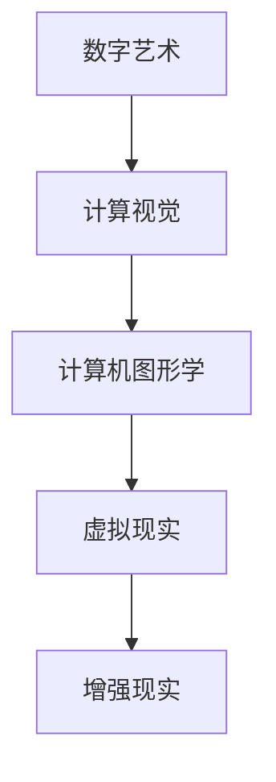
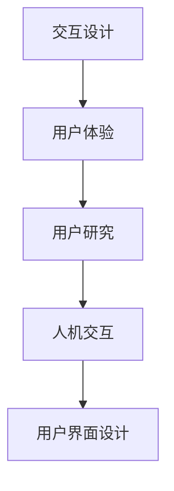
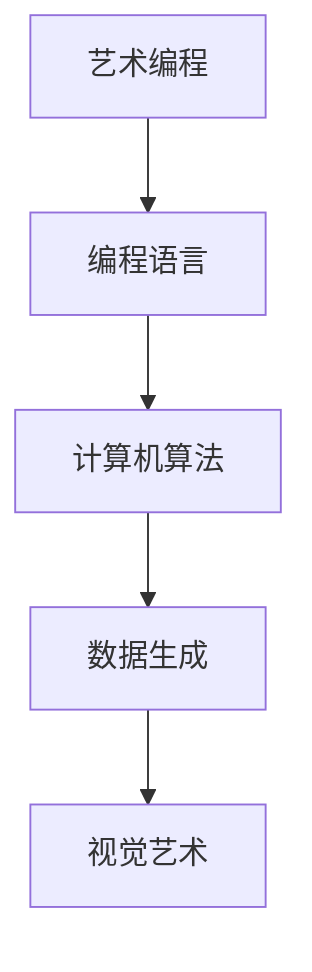
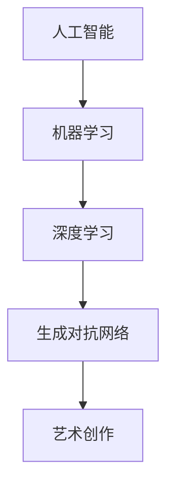
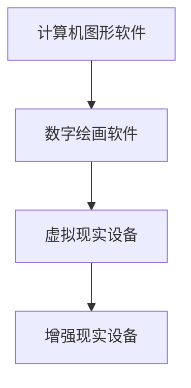
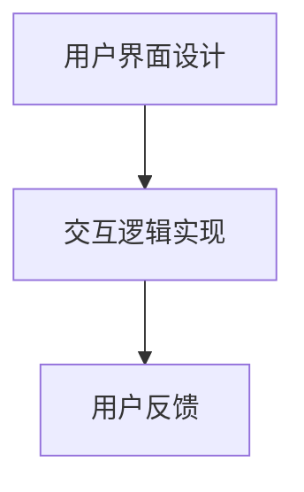
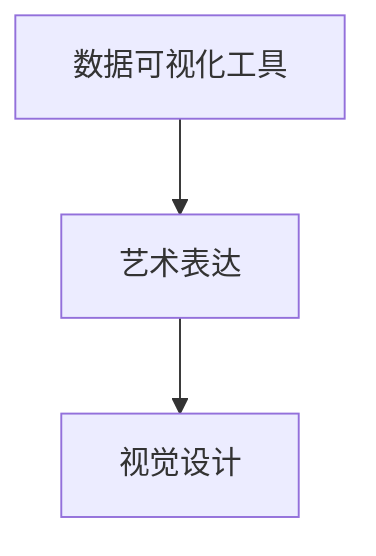

                 

### 文章标题

# 艺术与科技的碰撞：人类计算激发创意灵感

### 关键词

- 艺术与科技融合
- 数字艺术
- 计算视觉
- 交互设计
- 艺术编程
- 人工智能

### 摘要

本文探讨了艺术与科技融合的历史背景、发展趋势及其核心概念，深入分析了艺术与科技融合的数学模型和技术架构，并通过多个实践应用案例，展示了人类计算如何激发创意灵感。文章还特别关注艺术与科技融合在教育、娱乐产业和社会中的影响，以及实际开发中的项目实战和最佳实践，旨在为读者提供一个全面、系统的艺术与科技融合的视角。

## 第一部分：艺术与科技融合的基础理论

### 第1章：艺术与科技融合概述

艺术与科技融合是一个跨学科、多领域的创新领域，它结合了艺术的创造性表达和科技的先进技术，推动着人类文化和科技发展的新潮流。本章将介绍艺术与科技融合的历史背景、发展趋势及其核心概念。

#### 1.1 艺术与科技融合的历史背景

艺术与科技融合的历史可以追溯到古代，当时人们开始利用科技手段来创作艺术作品。例如，古埃及人利用数学和几何原理创作了精美的金字塔和壁画，古希腊人则利用物理原理设计了优雅的雕塑。然而，真正意义上的艺术与科技融合出现在20世纪中期，随着计算机技术的快速发展，数字艺术和交互设计等新兴领域逐渐兴起。

#### 1.2 艺术与科技融合的发展趋势

近年来，艺术与科技融合呈现出以下几个发展趋势：

1. **数字化艺术创作**：数字化工具和软件使得艺术创作变得更加便捷和高效，艺术家可以利用计算机图形学、虚拟现实（VR）和增强现实（AR）等技术，创作出以前无法实现的艺术作品。

2. **人机交互**：随着人工智能技术的发展，人机交互成为艺术与科技融合的重要方向。艺术家和设计师通过开发交互式艺术装置和应用程序，探索人机之间的新型互动模式。

3. **艺术编程**：艺术编程是一种将编程语言和算法应用于艺术创作的艺术形式。艺术家利用编程语言创作出具有独特视觉和听觉效果的数字艺术作品，拓宽了艺术创作的边界。

4. **跨学科合作**：艺术与科技融合促进了不同学科之间的合作，艺术家与计算机科学家、工程师、数学家等领域的专家共同探索新的创作方法和应用场景。

#### 1.3 艺术与科技融合的核心概念

艺术与科技融合的核心概念包括以下几个方面：

1. **数字艺术**：数字艺术是一种利用数字技术创作的艺术形式，包括数字绘画、数字雕塑、数字音乐等。数字艺术具有无限的可能性，艺术家可以通过编程语言和算法来创作出独特的作品。

2. **计算视觉**：计算视觉是一种利用计算机技术和算法来处理和理解视觉信息的方法。计算视觉在艺术领域有广泛应用，如计算机图形学、虚拟现实、增强现实等。

3. **交互设计**：交互设计是一种关注人与系统互动的设计方法。在艺术与科技融合中，交互设计用于开发交互式艺术装置、应用程序和游戏等。

4. **艺术编程**：艺术编程是一种将编程语言和算法应用于艺术创作的艺术形式。艺术家通过编程语言创作出具有独特视觉和听觉效果的数字艺术作品。

5. **人工智能**：人工智能是一种模拟人类智能的技术，它在艺术与科技融合中有广泛应用，如艺术生成、图像识别、自然语言处理等。

#### 1.4 艺术与科技融合的重要性

艺术与科技融合的重要性体现在以下几个方面：

1. **创新驱动**：艺术与科技融合推动了艺术创作和科技发展的新潮流，激发了创新思维和创造力。

2. **文化传播**：艺术与科技融合为文化传播提供了新的途径，艺术家可以利用数字技术和交互设计来传播和推广艺术作品。

3. **教育改革**：艺术与科技融合在教育领域有广泛应用，它为教育提供了新的教学方法和工具，有助于培养学生的创新能力和实践能力。

4. **社会影响**：艺术与科技融合对社会产生了深远的影响，它改变了人们的审美观念、生活方式和社交模式。

### 总结

本章介绍了艺术与科技融合的历史背景、发展趋势和核心概念，为后续章节的内容奠定了基础。在接下来的章节中，我们将进一步探讨艺术与科技融合的数学模型和技术架构，以及其实践应用和开发实践。通过这些内容，读者可以更深入地理解艺术与科技融合的魅力和潜力。

## 第2章：艺术与科技融合的核心概念

在探讨艺术与科技融合的过程中，理解其核心概念至关重要。这些核心概念不仅涵盖了艺术创作的数字艺术、计算视觉，还包括交互设计、艺术编程和人工智能等，它们共同构成了艺术与科技融合的多元生态系统。在本章中，我们将深入探讨这些核心概念，分析它们在艺术创作中的具体应用，以及它们之间的联系和互动。

#### 2.1 数字艺术与计算视觉

数字艺术是一种利用数字技术和媒介创作的艺术形式。它包括数字绘画、数字雕塑、数字音乐等多种类型，通过计算机图形软件和数字工具进行创作。数字艺术的优点在于其灵活性和无限的可能性，艺术家可以轻松地尝试不同的风格和技术，创作出独特的视觉作品。

计算视觉则是利用计算机技术和算法来处理和理解视觉信息的方法。它涉及图像处理、计算机图形学、虚拟现实和增强现实等领域。计算视觉在艺术创作中有着广泛的应用，如生成艺术作品、模拟自然现象和创建虚拟现实场景等。

**核心概念联系：**

数字艺术和计算视觉之间的联系在于它们都依赖于计算机技术和算法。数字艺术通过计算机图形软件实现创作，而计算视觉则通过算法处理和生成图像。这种结合使得艺术创作能够利用计算视觉技术，创造出更加逼真和互动的艺术作品。

**Mermaid流程图：**



#### 2.2 交互设计与人机交互

交互设计是一种关注人与系统互动的设计方法。它不仅包括用户界面设计，还涉及用户体验和用户研究。在艺术与科技融合中，交互设计用于开发交互式艺术装置、应用程序和游戏等。这些作品通过用户与系统的互动，创造出独特的艺术体验。

人机交互（HCI）则是研究人类与计算机系统之间交互的学科。它关注如何设计用户友好的系统，使得用户能够有效地与计算机进行交流。在艺术领域，人机交互技术被用于创作交互式艺术作品，如触觉反馈装置、语音交互艺术等。

**核心概念联系：**

交互设计和人机交互之间的联系在于它们都关注用户与系统之间的互动。交互设计通过研究用户体验，设计出用户友好的交互界面，而人机交互则通过研究人类行为和计算机系统特性，提高系统的易用性和互动性。这种结合使得艺术作品能够更好地与观众互动，提供沉浸式的艺术体验。

**Mermaid流程图：**



#### 2.3 艺术编程与计算机算法

艺术编程是一种将编程语言和算法应用于艺术创作的艺术形式。艺术家通过编写代码，利用计算机算法生成独特的视觉和听觉效果。艺术编程涵盖了计算机视觉、音频处理和人工智能等多个领域，它不仅是一种创作方法，也是一种表达形式。

计算机算法在艺术创作中的应用十分广泛，如生成艺术作品、模拟自然现象、创建虚拟现实场景等。计算机算法可以自动生成复杂的图形和音乐，为艺术家提供了无限的创作可能性。

**核心概念联系：**

艺术编程和计算机算法之间的联系在于它们都依赖于编程语言和算法。艺术编程通过编程语言创作艺术作品，而计算机算法则通过算法实现复杂的数据处理和生成。这种结合使得艺术创作能够利用计算机算法，创造出更加独特和创新的视觉和听觉效果。

**Mermaid流程图：**



#### 2.4 人工智能与艺术创作

人工智能（AI）是一种模拟人类智能的技术，它在艺术创作中有着广泛的应用。人工智能可以通过深度学习、生成对抗网络（GAN）等技术，自动生成艺术作品。这些作品不仅具有高度的艺术性，还能够根据用户的需求和反馈进行创作调整。

人工智能在艺术创作中的应用不仅限于生成艺术作品，还可以用于图像识别、自然语言处理等领域。例如，人工智能可以识别和分类艺术作品，为艺术市场提供数据支持；它还可以通过自然语言处理技术，将文本转换为视觉艺术形式。

**核心概念联系：**

人工智能和艺术创作之间的联系在于它们都关注创造性表达和数据处理。人工智能通过机器学习和深度学习技术，模拟人类的创造力和思维方式，为艺术创作提供了新的工具和方法。而艺术创作则通过人工智能技术，实现了更高效、更具创造性的创作过程。

**Mermaid流程图：**



#### 总结

本章介绍了艺术与科技融合中的核心概念，包括数字艺术、计算视觉、交互设计、艺术编程、人工智能等。通过分析这些核心概念，我们可以看到它们在艺术创作中的具体应用和相互联系。这些概念共同构成了艺术与科技融合的多元生态系统，为艺术创作提供了无限的可能性。在接下来的章节中，我们将进一步探讨艺术与科技融合的数学模型和技术架构，以及其实践应用和开发实践。

## 第3章：艺术与科技融合的数学模型

在艺术与科技融合的领域中，数学模型扮演着至关重要的角色。数学不仅为艺术创作提供了理论基础，还通过算法和公式，使艺术作品更加丰富和多样化。在本章中，我们将探讨艺术与科技融合中的一些关键数学模型，包括机器学习、计算机图形学和音频处理中的数学公式与算法，并通过具体例子来说明这些模型的应用。

### 3.1 机器学习中的艺术应用

机器学习是一种通过数据训练模型，使其能够进行预测和决策的技术。在艺术领域，机器学习被广泛应用于图像识别、风格迁移和生成对抗网络（GAN）等任务。

**核心算法原理讲解：**

**图像识别：**

图像识别是机器学习中的一个基本任务，它旨在通过输入图像，识别并分类图像中的对象。一个常用的图像识别算法是卷积神经网络（CNN）。

**伪代码：**

```plaintext
function CNN_image_recognition(image):
    # 初始化神经网络
    neural_network = initialize_cnn()

    # 对图像进行预处理
    processed_image = preprocess_image(image)

    # 通过神经网络处理图像
    output = neural_network.forward(processed_image)

    # 获取预测结果
    predicted_class = output.argmax()

    return predicted_class
```

**风格迁移：**

风格迁移是一种将一种图像的视觉风格应用到另一种图像上的技术。一个常用的风格迁移算法是生成对抗网络（GAN）。

**伪代码：**

```plaintext
function GAN_style_transfer(content_image, style_image):
    # 初始化生成器和判别器
    generator = initialize_generator()
    discriminator = initialize_discriminator()

    # 训练生成器和判别器
    for epoch in range(num_epochs):
        # 生成艺术作品
        art_work = generator(content_image)

        # 训练判别器
        discriminator_loss = discriminator.train(art_work)

        # 训练生成器
        generator_loss = generator.train(content_image, art_work)

    return art_work
```

**生成对抗网络（GAN）：**

生成对抗网络是一种由生成器和判别器组成的对抗性模型，用于生成逼真的图像。

**伪代码：**

```plaintext
function GAN():
    # 初始化生成器和判别器
    generator = initialize_generator()
    discriminator = initialize_discriminator()

    # 训练生成器和判别器
    for epoch in range(num_epochs):
        # 生成艺术作品
        art_work = generator()

        # 训练判别器
        discriminator_loss = discriminator.train(art_work)

        # 训练生成器
        generator_loss = generator.train(discriminator)

    return generator
```

**具体例子：**

例如，可以使用GAN将一张普通照片转换成梵高的风格画作。这个过程中，生成器会生成一个模仿梵高风格的图像，而判别器则会判断生成的图像是否足够逼真。通过不断的迭代训练，最终生成一个与原始照片内容一致，但风格独特的艺术作品。

### 3.2 计算机图形学中的艺术表达

计算机图形学是艺术与科技融合中的重要分支，它利用数学和算法来创建和处理视觉图像。计算机图形学中的数学模型包括几何变换、光照模型和渲染技术等。

**核心数学模型讲解：**

**几何变换：**

几何变换是计算机图形学中的一个基本操作，它包括平移、旋转、缩放和剪切等。这些变换可以通过矩阵运算来实现。

**伪代码：**

```plaintext
function transform(matrix, point):
    transformed_point = matrix * point
    return transformed_point
```

**光照模型：**

光照模型用于模拟物体在光线照射下的视觉效果。一个常用的光照模型是Lambert光照模型。

**伪代码：**

```plaintext
function lambert_lighting(vertex, light):
    # 计算光照方向
    light_direction = normalize(light - vertex)

    # 计算光照强度
    lighting = dot(normal, light_direction)

    return lighting
```

**渲染技术：**

渲染技术用于将三维场景转换为二维图像。一个常用的渲染技术是光线追踪。

**伪代码：**

```plaintext
function ray_tracing(scene, camera):
    # 对于场景中的每个像素
    for pixel in camera.pixel_set:
        # 生成光线
        ray = generate_ray(pixel, camera)

        # 计算光线与场景的交点
        intersection = scene.intersect(ray)

        # 渲染像素
        color = render_pixel(intersection)

    return color
```

**具体例子：**

例如，可以使用光线追踪技术渲染一个简单的三维场景。在这个场景中，光线从相机出发，与场景中的物体相交，并计算出每个物体的颜色。最终，通过渲染像素，生成一个逼真的三维场景图像。

### 3.3 音频处理与音乐创作

音频处理是艺术与科技融合中的另一个重要领域，它利用数学和算法来处理和创作音乐。音频处理中的数学模型包括傅里叶变换、滤波器和音频合成等。

**核心数学模型讲解：**

**傅里叶变换：**

傅里叶变换是一种将时域信号转换为频域信号的方法，它对于音乐创作和分析非常重要。

**伪代码：**

```plaintext
function fourier_transform(signal):
    frequency_domain = []
    for i in range(len(signal)):
        # 计算傅里叶变换
        frequency_domain.append(compute_fourier_transform(signal[i]))

    return frequency_domain
```

**滤波器：**

滤波器用于去除音频中的噪声或特定频率的信号。一个常用的滤波器是低通滤波器。

**伪代码：**

```plaintext
function low_pass_filter(signal, cutoff_frequency):
    filtered_signal = []
    for sample in signal:
        # 计算滤波器响应
        response = compute_low_pass_filter_response(sample, cutoff_frequency)

        # 应用滤波器
        filtered_sample = apply_filter(sample, response)

        filtered_signal.append(filtered_sample)

    return filtered_signal
```

**音频合成：**

音频合成是一种通过组合不同的音频信号，生成新的音频作品的方法。一个常用的音频合成技术是波形合成。

**伪代码：**

```plaintext
function audio_synthesis(signals):
    synthesized_signal = []
    for signal in signals:
        # 合成信号
        synthesized_signal.append(synthesize_signal(signal))

    return synthesized_signal
```

**具体例子：**

例如，可以使用傅里叶变换分析一段音乐，提取其中的频率成分。然后，使用滤波器去除不需要的频率成分，最后通过音频合成技术，生成一个新的音乐作品。这个过程不仅增强了音乐创作的灵活性，还使得音乐作品更加多样化。

### 总结

本章介绍了艺术与科技融合中的关键数学模型，包括机器学习、计算机图形学和音频处理中的数学公式与算法。通过具体例子，我们可以看到这些模型在艺术创作中的应用。这些数学模型不仅为艺术创作提供了理论基础，还通过算法和公式，使得艺术作品更加丰富和多样化。在接下来的章节中，我们将进一步探讨艺术与科技融合的技术架构和实际应用。

## 第4章：艺术与科技融合的技术架构

在艺术与科技融合的领域中，技术架构起着至关重要的作用。一个合理的技术架构不仅能够提高艺术创作的效率，还能够为交互体验和数据处理提供坚实的基础。本章将深入探讨艺术创作中的计算工具、交互系统的设计与实现，以及数据可视化与艺术表达等方面。

### 4.1 艺术创作中的计算工具

艺术创作中的计算工具是艺术家们创作数字艺术的重要手段。这些工具包括计算机图形软件、数字绘画软件、虚拟现实（VR）和增强现实（AR）设备等。它们各自具有独特的功能，为艺术创作提供了多样化的可能性。

**核心概念与联系：**

- **计算机图形软件**：如Adobe Photoshop、Blender等，用于创建和编辑二维和三维图像。
- **数字绘画软件**：如Procreate、Clip Studio Paint等，提供类似于传统绘画的工具，支持数字绘画。
- **虚拟现实（VR）设备**：如Oculus Rift、HTC Vive等，通过虚拟现实技术，创造沉浸式的艺术体验。
- **增强现实（AR）设备**：如Google Glass、ARkit等，将数字内容叠加在现实世界中，创造出独特的艺术形式。

**Mermaid流程图：**



**计算工具的应用案例：**

- **计算机图形软件**：艺术家可以使用Photoshop创建复杂的三维图像，并通过Blender进行渲染和动画制作。
- **数字绘画软件**：艺术家可以利用Procreate进行快速的数字素描和色彩填充，为后续的计算机图形处理提供素材。
- **虚拟现实设备**：艺术家可以通过Oculus Rift创建沉浸式的虚拟艺术展馆，让观众在虚拟世界中感受艺术作品的魅力。
- **增强现实设备**：艺术家可以利用ARkit将艺术作品叠加到现实世界的物体上，创造出互动的艺术体验。

### 4.2 交互系统的设计与实现

交互系统在艺术创作中扮演着关键角色，它使得艺术作品能够与观众进行互动，提供沉浸式的艺术体验。交互系统包括用户界面设计、交互逻辑实现和用户反馈等组成部分。

**核心概念与联系：**

- **用户界面设计**：设计直观、易用的界面，使用户能够轻松地与艺术作品进行交互。
- **交互逻辑实现**：通过编程实现用户的交互操作，如按钮点击、手势操作等。
- **用户反馈**：设计合适的反馈机制，如视觉反馈、声音反馈等，提高用户的交互体验。

**Mermaid流程图：**



**交互系统的设计与实现案例：**

- **交互艺术装置**：艺术家可以设计一个互动艺术装置，如一个触摸屏幕上的数字绘画应用，用户可以通过触摸屏幕进行绘画，并实时看到绘画的效果。
- **虚拟现实互动艺术**：艺术家可以利用VR设备创建一个虚拟艺术世界，用户可以在虚拟世界中与艺术作品互动，如操控虚拟雕塑或参与虚拟演出。
- **增强现实互动艺术**：艺术家可以将艺术作品通过AR设备叠加到现实世界中，用户可以通过移动设备或眼镜与艺术作品进行互动，如触摸虚拟雕塑或与虚拟角色互动。

### 4.3 数据可视化与艺术表达

数据可视化是艺术与科技融合中的重要领域，它通过图形和视觉元素，将复杂的数据和信息以直观的方式呈现出来。数据可视化不仅用于科学研究和商业分析，还广泛应用于艺术创作。

**核心概念与联系：**

- **数据可视化工具**：如Tableau、D3.js等，用于创建交互式的数据可视化图表。
- **艺术表达**：艺术家可以通过数据可视化，将数据转化为艺术作品，如动态图形、信息图表等。
- **视觉设计**：通过色彩、形状、布局等视觉元素，提高数据可视化的艺术性和表现力。

**Mermaid流程图：**



**数据可视化与艺术表达案例：**

- **动态信息图表**：艺术家可以使用D3.js创建动态信息图表，通过动画和交互，展示数据的变化和趋势。
- **信息艺术装置**：艺术家可以设计一个信息艺术装置，通过LED屏幕展示实时数据，如股票市场走势、天气信息等，同时结合视觉艺术元素，创造出独特的艺术体验。
- **数据驱动的数字艺术**：艺术家可以通过编程语言，将数据转化为数字艺术作品，如通过数据分析生成图形和色彩，创作出具有数据特性的艺术作品。

### 总结

本章介绍了艺术创作中的计算工具、交互系统的设计与实现，以及数据可视化与艺术表达等技术架构。通过这些技术架构，艺术家们能够利用科技手段，创作出更加丰富、多样和互动的艺术作品。在接下来的章节中，我们将进一步探讨艺术与科技融合的实际应用和开发实践，展示这些技术架构在具体项目中的实际效果和操作方法。

## 第5章：艺术与科技融合的数学公式与算法

在艺术与科技融合的过程中，数学公式和算法起着至关重要的作用。它们不仅为艺术创作提供了理论基础，还通过精确的计算和数据处理，使得艺术作品更加丰富和多样化。本章将详细探讨机器学习算法、计算机图形学中的几何变换，以及音频处理中的算法分析。

### 5.1 机器学习算法在艺术创作中的应用

机器学习算法在艺术创作中有着广泛的应用，如图像识别、风格迁移和生成对抗网络（GAN）等。通过这些算法，艺术家可以创作出具有高度艺术性和创新性的作品。

**核心算法原理讲解：**

**图像识别：**

图像识别是一种通过算法识别图像中的对象和内容的技术。卷积神经网络（CNN）是图像识别中常用的算法。

**伪代码：**

```plaintext
function CNN_image_recognition(image):
    # 初始化神经网络
    neural_network = initialize_cnn()

    # 对图像进行预处理
    processed_image = preprocess_image(image)

    # 通过神经网络处理图像
    output = neural_network.forward(processed_image)

    # 获取预测结果
    predicted_class = output.argmax()

    return predicted_class
```

**风格迁移：**

风格迁移是一种将一种图像的视觉风格应用到另一种图像上的技术。生成对抗网络（GAN）是风格迁移中常用的算法。

**伪代码：**

```plaintext
function GAN_style_transfer(content_image, style_image):
    # 初始化生成器和判别器
    generator = initialize_generator()
    discriminator = initialize_discriminator()

    # 训练生成器和判别器
    for epoch in range(num_epochs):
        # 生成艺术作品
        art_work = generator(content_image)

        # 训练判别器
        discriminator_loss = discriminator.train(art_work)

        # 训练生成器
        generator_loss = generator.train(content_image, art_work)

    return art_work
```

**生成对抗网络（GAN）：**

生成对抗网络是一种由生成器和判别器组成的对抗性模型，用于生成逼真的图像。

**伪代码：**

```plaintext
function GAN():
    # 初始化生成器和判别器
    generator = initialize_generator()
    discriminator = initialize_discriminator()

    # 训练生成器和判别器
    for epoch in range(num_epochs):
        # 生成艺术作品
        art_work = generator()

        # 训练判别器
        discriminator_loss = discriminator.train(art_work)

        # 训练生成器
        generator_loss = generator.train(discriminator)

    return generator
```

**数学公式讲解：**

生成对抗网络（GAN）的核心是生成器和判别器的对抗训练。生成器G的目的是生成逼真的图像，判别器D的目的是区分真实图像和生成图像。GAN的训练目标是最大化生成器G的生成能力，同时最小化判别器D的区分能力。

**损失函数：**

生成器G的损失函数可以表示为：

$$
Loss_G = -\log(D(G(z))}
$$

其中，$D(G(z))$是判别器对生成图像的评分。

判别器D的损失函数可以表示为：

$$
Loss_D = -\log(D(x)) - \log(1 - D(G(z))
$$

其中，$D(x)$是判别器对真实图像的评分，$D(G(z))$是判别器对生成图像的评分。

**具体例子：**

假设我们使用GAN将一张普通照片转换为梵高的风格画作。生成器G的目的是生成模仿梵高风格的作品，判别器D的目的是判断生成作品是否足够逼真。通过不断的迭代训练，生成器G逐渐学会生成逼真的梵高风格画作，而判别器D逐渐学会区分真实和生成的作品。

### 5.2 计算机图形学中的几何变换

计算机图形学中的几何变换是创建和编辑图像的基本操作。常见的几何变换包括平移、旋转、缩放和剪切等。这些变换通过矩阵运算实现。

**核心数学公式讲解：**

**平移变换：**

平移变换是将图像沿x轴和y轴方向移动。其变换矩阵为：

$$
T_{\text{translate}} = \begin{bmatrix}
1 & 0 & T_x \\
0 & 1 & T_y \\
0 & 0 & 1
\end{bmatrix}
$$

其中，$T_x$和$T_y$分别为沿x轴和y轴的平移量。

**旋转变换：**

旋转变换是将图像绕原点旋转一定角度。其变换矩阵为：

$$
R_{\text{rotate}} = \begin{bmatrix}
\cos(\theta) & -\sin(\theta) & 0 \\
\sin(\theta) & \cos(\theta) & 0 \\
0 & 0 & 1
\end{bmatrix}
$$

其中，$\theta$为旋转角度。

**缩放变换：**

缩放变换是将图像沿x轴和y轴方向缩放一定比例。其变换矩阵为：

$$
S_{\text{scale}} = \begin{bmatrix}
S_x & 0 & 0 \\
0 & S_y & 0 \\
0 & 0 & 1
\end{bmatrix}
$$

其中，$S_x$和$S_y$分别为沿x轴和y轴的缩放比例。

**剪切变换：**

剪切变换是将图像沿x轴和y轴方向进行斜切。其变换矩阵为：

$$
H_{\text{shear}} = \begin{bmatrix}
1 & k_x & 0 \\
k_y & 1 & 0 \\
0 & 0 & 1
\end{bmatrix}
$$

其中，$k_x$和$k_y$分别为沿x轴和y轴的剪切比例。

**具体例子：**

假设我们对一张图片进行平移、旋转、缩放和剪切变换。首先，我们通过平移变换将图片沿x轴和y轴方向移动10个单位。然后，通过旋转变换将图片绕原点旋转30度。接下来，通过缩放变换将图片沿x轴和y轴方向分别缩放1.5倍。最后，通过剪切变换将图片沿x轴和y轴方向分别进行0.5的斜切。通过这些变换，我们可以得到一个具有多种几何效果的图像。

### 5.3 音频处理中的算法分析

音频处理是艺术与科技融合中的另一个重要领域，它通过算法对音频信号进行增强、降噪和合成等处理。音频处理中的算法包括傅里叶变换、滤波器和音频合成等。

**核心算法原理讲解：**

**傅里叶变换：**

傅里叶变换是一种将时域信号转换为频域信号的方法，它对于音频处理非常重要。

**伪代码：**

```plaintext
function fourier_transform(signal):
    frequency_domain = []
    for i in range(len(signal)):
        # 计算傅里叶变换
        frequency_domain.append(compute_fourier_transform(signal[i]))

    return frequency_domain
```

**滤波器：**

滤波器用于去除音频中的噪声或特定频率的信号。一个常用的滤波器是低通滤波器。

**伪代码：**

```plaintext
function low_pass_filter(signal, cutoff_frequency):
    filtered_signal = []
    for sample in signal:
        # 计算滤波器响应
        response = compute_low_pass_filter_response(sample, cutoff_frequency)

        # 应用滤波器
        filtered_sample = apply_filter(sample, response)

        filtered_signal.append(filtered_sample)

    return filtered_signal
```

**音频合成：**

音频合成是一种通过组合不同的音频信号，生成新的音频作品的方法。一个常用的音频合成技术是波形合成。

**伪代码：**

```plaintext
function audio_synthesis(signals):
    synthesized_signal = []
    for signal in signals:
        # 合成信号
        synthesized_signal.append(synthesize_signal(signal))

    return synthesized_signal
```

**数学公式讲解：**

**低通滤波器：**

低通滤波器用于去除高频噪声，其频率响应函数为：

$$
H(\omega) = \frac{1}{1 + j\omega\tau}
$$

其中，$\omega$为角频率，$\tau$为时间常数。

**具体例子：**

假设我们对一段音频信号进行低通滤波，去除高频噪声。首先，我们通过傅里叶变换将音频信号从时域转换为频域。然后，我们使用低通滤波器的频率响应函数，对频域信号进行滤波。最后，我们通过傅里叶逆变换，将滤波后的信号从频域转换回时域，得到去噪后的音频信号。

### 总结

本章详细介绍了艺术与科技融合中的关键数学公式和算法，包括机器学习算法、计算机图形学中的几何变换，以及音频处理中的算法分析。这些数学公式和算法不仅为艺术创作提供了理论基础，还通过精确的计算和数据处理，使得艺术作品更加丰富和多样化。在接下来的章节中，我们将进一步探讨艺术与科技融合的实际应用和开发实践，展示这些技术架构在具体项目中的实际效果和操作方法。

## 第6章：艺术与科技融合的创意实践

艺术与科技融合的创意实践是将科技手段应用于艺术创作的具体表现，它不仅展示了技术的可能性，也激发了艺术家的创造灵感。本章将介绍数字艺术创作实例、交互设计实践案例，以及艺术编程的创作经验，通过具体项目展示艺术与科技融合的魅力。

### 6.1 数字艺术创作实例

数字艺术创作是一种利用计算机技术和软件进行艺术创作的形式。艺术家可以通过数字绘画软件、三维建模软件等工具，创作出具有独特视觉效果的数字艺术作品。以下是一些典型的数字艺术创作实例：

**实例一：基于生成对抗网络（GAN）的图像生成**

艺术家利用GAN技术，生成了一系列模仿梵高风格的画作。生成器G学习梵高的绘画风格，生成逼真的图像。通过调整生成器和判别器的参数，艺术家可以控制生成图像的风格和逼真度。以下是一个简单的GAN创作流程：

1. **数据准备**：收集大量梵高的画作作为训练数据。
2. **模型训练**：使用生成器和判别器进行训练，生成器G生成图像，判别器D判断图像的真实性。
3. **迭代优化**：通过不断的迭代训练，生成器G逐渐提高生成图像的质量。
4. **作品创作**：使用生成器G生成具有梵高风格的图像。

**伪代码示例：**

```plaintext
# 初始化生成器和判别器
generator = initialize_generator()
discriminator = initialize_discriminator()

# 训练模型
for epoch in range(num_epochs):
    # 生成图像
    art_work = generator()

    # 训练判别器
    discriminator_loss = discriminator.train(art_work)

    # 训练生成器
    generator_loss = generator.train(discriminator)

# 生成艺术作品
final_art = generator.generate()
```

**结果展示**：生成器G最终生成了一系列模仿梵高风格的画作，这些画作展示了梵高的独特艺术风格，同时也具有现代数字艺术的特点。

**实例二：利用虚拟现实（VR）创作的沉浸式艺术体验**

艺术家通过VR技术，创作了一个沉浸式的艺术体验空间。观众戴上VR头盔，进入一个虚拟的艺术世界，可以自由探索和互动。以下是一个简单的VR艺术创作流程：

1. **场景设计**：设计一个虚拟艺术场景，包括背景、灯光和物体。
2. **交互设计**：设计用户与艺术作品的交互方式，如触摸、移动等。
3. **渲染实现**：使用VR渲染技术，将虚拟场景渲染到VR头盔中。
4. **用户体验**：测试并优化用户体验，确保观众能够顺畅地互动和体验艺术作品。

**结果展示**：观众戴上VR头盔后，进入一个充满艺术氛围的虚拟世界，可以与艺术作品互动，如触摸虚拟雕塑、改变灯光效果等，获得独特的艺术体验。

### 6.2 交互设计实践案例

交互设计在艺术与科技融合中起着关键作用，它关注用户与艺术作品之间的互动和体验。以下是一个典型的交互设计实践案例：

**案例：智能互动艺术装置**

艺术家设计了一个智能互动艺术装置，用户可以通过触摸屏幕与艺术作品互动。以下是一个简单的交互设计实践流程：

1. **需求分析**：分析用户需求和交互场景，确定艺术装置的功能和互动方式。
2. **界面设计**：设计用户友好的触摸界面，包括按钮、图标和动画等。
3. **交互逻辑实现**：编写代码，实现用户与艺术作品的互动功能，如触摸触发动画、声音反馈等。
4. **测试与优化**：测试交互效果，收集用户反馈，优化交互设计。

**伪代码示例：**

```plaintext
# 用户触摸屏幕
if touch_detected():
    # 触发动画
    play_animation()
    
    # 发出声音反馈
    play_sound()
```

**结果展示**：用户通过触摸屏幕，可以触发动画和声音反馈，与艺术作品进行互动，获得动态的艺术体验。

### 6.3 艺术编程的创作经验

艺术编程是一种将编程语言和算法应用于艺术创作的形式，艺术家通过编写代码，创作出具有独特视觉和听觉效果的数字艺术作品。以下是一些艺术编程的创作经验：

**经验一：算法驱动艺术**

艺术家利用算法生成艺术作品，如使用分形算法生成复杂而美丽的图像。以下是一个简单的分形算法创作流程：

1. **算法设计**：设计分形算法，包括递归公式和迭代次数。
2. **代码实现**：编写代码，实现分形算法的递归和迭代过程。
3. **参数调整**：调整算法参数，如迭代次数、颜色分布等，生成不同的艺术效果。
4. **作品展示**：展示生成的艺术作品，分享创作经验。

**伪代码示例：**

```plaintext
function mandelbrot(c, max_iterations):
    z = 0
    for i in range(max_iterations):
        z = z*z + c
        if abs(z) > 2:
            return i
    return max_iterations
```

**结果展示**：生成的分形图像具有丰富的细节和层次感，展示了算法驱动的艺术魅力。

**经验二：数据可视化艺术**

艺术家通过数据可视化，将数据转化为艺术作品。以下是一个简单的数据可视化创作流程：

1. **数据收集**：收集感兴趣的数据，如天气数据、股票价格等。
2. **数据处理**：对数据进行清洗和预处理，以便可视化。
3. **可视化设计**：设计合适的可视化图表，如折线图、柱状图、散点图等。
4. **交互设计**：增加交互功能，如数据筛选、动态更新等，提升用户体验。

**结果展示**：通过数据可视化，艺术家将抽象的数据转化为直观的视觉艺术作品，使得数据变得更加生动和有趣。

### 总结

本章介绍了数字艺术创作实例、交互设计实践案例，以及艺术编程的创作经验。通过这些实例和经验，我们可以看到艺术与科技融合在创意实践中的应用。这些实践不仅展示了技术的可能性，也激发了艺术家的创造灵感，为艺术创作带来了新的思路和方法。在接下来的章节中，我们将进一步探讨艺术与科技融合在教育、娱乐产业和社会中的实际应用，展示其广泛的影响和潜力。

## 第二部分：艺术与科技融合的实践应用

### 第7章：艺术与科技融合在教育中的应用

艺术与科技融合在教育中的应用为传统教育模式带来了新的变革。通过数字化工具和交互设计，教育者能够为学生提供更加丰富、多样和个性化的学习体验。本章将探讨数字艺术教育的新趋势、计算机编程与艺术教育的融合，以及艺术与科技融合的课程设计。

#### 7.1 数字艺术教育的新趋势

数字艺术教育是一种利用数字化工具和技术进行艺术教育和创作的模式。它不仅涵盖了传统的绘画、雕塑等艺术形式，还融入了计算机图形学、虚拟现实（VR）和增强现实（AR）等技术。以下是一些数字艺术教育的新趋势：

1. **沉浸式学习环境**：利用VR和AR技术，创造一个沉浸式的学习环境，学生可以身临其境地体验艺术作品，增强学习兴趣和参与度。

2. **个性化学习**：通过数据分析和学习算法，为学生提供个性化的学习路径和资源，满足不同学生的学习需求和兴趣。

3. **互动式教学**：通过交互设计，开发互动式的教学工具和应用程序，学生可以与艺术作品互动，增强学习效果。

4. **跨学科融合**：将艺术与数学、科学、技术等学科结合，培养学生的跨学科思维能力和创造力。

#### 7.2 计算机编程与艺术教育的融合

计算机编程与艺术教育的融合为艺术教育带来了新的可能性。通过编程，学生不仅能够学习艺术创作的技术，还能够培养逻辑思维和问题解决能力。以下是一些计算机编程与艺术教育融合的方法：

1. **可视化编程**：利用可视化编程语言，如Scratch、Blockly等，让学生通过图形化的方式学习编程，并创作出艺术作品。

2. **算法艺术**：通过编程实现算法艺术，如使用分形算法生成复杂的几何图案，让学生了解算法在艺术创作中的应用。

3. **数字绘画与编程**：将数字绘画与编程结合，让学生通过编程控制画笔的移动和颜色变化，创作出独特的数字绘画作品。

#### 7.3 艺术与科技融合的课程设计

艺术与科技融合的课程设计旨在培养学生的创造性思维和实际操作能力。以下是一些艺术与科技融合的课程设计思路：

1. **基础课程**：开设数字艺术基础课程，包括计算机图形学、数字绘画、虚拟现实等基础知识，为学生打下坚实的理论基础。

2. **实践课程**：开设编程与艺术创作实践课程，通过实际操作，让学生掌握编程语言和艺术创作的技能。

3. **跨学科课程**：设计跨学科课程，将艺术与数学、科学、技术等学科结合，培养学生的跨学科思维能力和创造力。

4. **项目课程**：通过项目课程，让学生参与实际项目，如数字艺术展览、交互设计比赛等，锻炼学生的实践能力和团队合作能力。

#### 案例分析

**案例一：数字艺术工作室**

某学校开设了一门数字艺术工作室课程，学生通过学习计算机图形学、数字绘画和虚拟现实技术，创作了一系列数字艺术作品。课程内容包括：

- **计算机图形学基础**：学习三维建模、材质贴图和渲染技术。
- **数字绘画**：使用数字绘画软件，创作数字绘画作品。
- **虚拟现实**：利用VR技术，设计并体验虚拟艺术空间。

通过这门课程，学生不仅学会了数字艺术创作的基本技能，还培养了创新思维和团队合作能力。

**案例二：编程与艺术项目**

某大学设计了一门编程与艺术项目课程，学生通过编程实现算法艺术和数字绘画。课程内容包括：

- **算法艺术**：学习分形算法、粒子系统等，创作算法艺术作品。
- **数字绘画**：使用Python和Pygame库，创作互动式数字绘画作品。
- **项目实践**：学生分组合作，完成一个编程与艺术项目，如数字艺术展览或互动艺术装置。

通过这门课程，学生将编程与艺术创作相结合，提高了实际操作能力和创新能力。

### 总结

本章介绍了艺术与科技融合在教育中的应用，包括数字艺术教育的新趋势、计算机编程与艺术教育的融合，以及艺术与科技融合的课程设计。通过具体案例的分析，我们可以看到艺术与科技融合为教育带来的变革和创新。在未来的教育中，艺术与科技融合将继续发挥重要作用，为学生提供更加丰富、多样和个性化的学习体验。

### 第8章：艺术与科技融合在娱乐产业中的应用

艺术与科技融合在娱乐产业中的应用正日益广泛，为传统娱乐形式注入了新的活力。数字艺术、互动娱乐、虚拟现实（VR）和增强现实（AR）等技术，正在娱乐产业中掀起一场革命。本章将探讨艺术与科技融合在娱乐产业中的应用，包括数字艺术与游戏设计、电影特效与计算机图形学，以及音乐制作与音频处理等方面。

#### 8.1 数字艺术与游戏设计

数字艺术在游戏设计中发挥着重要作用，它不仅提升了游戏的可视化效果，还为玩家提供了独特的游戏体验。以下是一些数字艺术与游戏设计融合的案例：

**案例一：Unity游戏引擎中的数字艺术**

Unity游戏引擎是一款广泛使用的游戏开发工具，它提供了丰富的数字艺术创作功能。艺术家可以利用Unity的图形编辑器，创建复杂的3D模型、贴图和动画，并将其应用到游戏场景中。

- **3D建模与贴图**：艺术家使用3D建模软件（如Blender或Maya），创建具有高细节和逼真度的3D模型。然后，将这些模型导入Unity，并为其添加贴图，提升视觉效果。
- **动画与交互**：通过Unity的动画系统，艺术家可以创建复杂的动画效果，如角色动作、场景变化等。此外，Unity的物理引擎和交互系统，使得游戏场景中的物体能够与玩家互动，提供真实的游戏体验。

**案例二：Unity中的数字艺术创作教程**

以下是一个简单的Unity数字艺术创作教程：

1. **导入模型**：将3D模型导入Unity编辑器。
2. **添加贴图**：为模型添加材质贴图，提升细节和逼真度。
3. **创建动画**：使用Unity的动画系统，创建角色动作和场景变化动画。
4. **设置交互**：使用Unity的交互系统，设置游戏场景中的物体与玩家的互动。

通过这个教程，艺术家可以学会如何在Unity中创作数字艺术作品，并将其应用到游戏设计中。

#### 8.2 电影特效与计算机图形学

计算机图形学在电影特效制作中扮演着关键角色，它使得电影制作能够创造出令人惊叹的视觉效果。以下是一些电影特效与计算机图形学融合的案例：

**案例一：《阿凡达》中的计算机图形学**

《阿凡达》是一部著名的科幻电影，它通过计算机图形学，创造了一个令人叹为观止的虚拟世界。以下是其主要特点：

- **三维建模**：《阿凡达》中的人物和生物都是通过三维建模软件（如Maya）创建的，艺术家通过精细的建模，赋予了这些角色逼真的外观和动作。
- **材质与纹理**：通过先进的材质和纹理技术，电影中的场景和角色具有高度的真实感。例如，水面的反射、植物的光照效果等，都通过计算机图形学技术实现。
- **动画与特效**：电影中的动画和特效，如人物的动作、魔法效果等，都是通过计算机图形学技术制作的。这些动画和特效不仅逼真，而且具有高度的艺术表现力。

**案例二：计算机图形学在电影特效中的应用教程**

以下是一个简单的计算机图形学在电影特效中的应用教程：

1. **场景设计**：使用三维建模软件，创建电影场景的3D模型。
2. **材质与纹理**：为场景中的物体添加材质和纹理，提升真实感。
3. **光照与渲染**：设置场景的光照和渲染参数，使场景具有逼真的视觉效果。
4. **动画与特效**：使用动画软件（如Blender或Houdini），创建角色动作和特效动画。

通过这个教程，艺术家可以学会如何利用计算机图形学技术，创作出令人惊叹的电影特效。

#### 8.3 音乐制作与音频处理

音乐制作与音频处理是艺术与科技融合的另一个重要领域。通过数字技术和算法，音乐家可以创作出独特的音乐作品，并通过音频处理技术，提升音乐的音质和效果。以下是一些音乐制作与音频处理的案例：

**案例一：数字音乐制作软件**

数字音乐制作软件（如Ableton Live、Logic Pro等）为音乐家提供了丰富的音频处理工具和创作功能。以下是其主要特点：

- **音频录制**：音乐家可以通过音频接口，录制实况演奏或声音素材。
- **音频编辑**：软件提供了强大的音频编辑功能，如剪切、复制、粘贴和混合等。
- **音频处理**：软件内置了丰富的音频处理插件，如均衡器、压缩器、混响等，可以提升音频的音质和效果。
- **音乐创作**：软件提供了多种音乐创作工具，如旋律生成器、节奏生成器等，帮助音乐家快速创作音乐作品。

**案例二：数字音乐制作教程**

以下是一个简单的数字音乐制作教程：

1. **音频录制**：使用音频接口，录制实况演奏或声音素材。
2. **音频编辑**：使用软件的音频编辑功能，对录音进行剪辑和混合。
3. **音频处理**：使用音频处理插件，提升音频的音质和效果。
4. **音乐创作**：利用软件的音乐创作工具，创作音乐作品。

通过这个教程，音乐家可以学会如何利用数字音乐制作软件，创作出高品质的音乐作品。

### 总结

本章介绍了艺术与科技融合在娱乐产业中的应用，包括数字艺术与游戏设计、电影特效与计算机图形学，以及音乐制作与音频处理等方面。通过具体案例的分析，我们可以看到艺术与科技融合为娱乐产业带来的变革和创新。在未来的娱乐产业中，艺术与科技融合将继续发挥重要作用，为观众提供更加丰富、多样和沉浸式的娱乐体验。

### 第9章：艺术与科技融合在社会中的影响

艺术与科技融合在社会中的影响日益显著，它不仅改变了艺术创作和娱乐产业，还在教育、医疗、文化保护等多个领域发挥着重要作用。本章将探讨艺术与科技融合对社会产生的深远影响，并展望其未来的发展趋势。

#### 9.1 数字艺术的公共展示

数字艺术的公共展示为大众提供了全新的艺术体验。通过大屏幕、投影和交互装置，数字艺术作品能够在公共场所、博物馆和画廊中展示，吸引大量观众。以下是一些具体影响：

1. **艺术普及**：数字艺术的公共展示使得艺术更加普及，不仅局限于专业人士，普通观众也能欣赏到高质量的艺术作品。
2. **文化多样性**：数字艺术展示提供了多样化的艺术形式，包括动画、影像、互动装置等，丰富了艺术表现手法和风格。
3. **互动体验**：数字艺术作品通常具有互动性，观众可以通过触摸、移动等方式与作品互动，增强了艺术体验的互动性和参与感。

#### 9.2 艺术与科技融合的社会效应

艺术与科技融合在社会效应方面具有广泛的影响，包括教育、医疗、文化遗产保护等。

1. **教育创新**：艺术与科技融合在教育中的应用，推动了教育模式的创新，如在线教育平台、虚拟课堂和编程艺术课程等，为学生提供了更加丰富、个性化的学习体验。
2. **医疗辅助**：艺术与科技融合在医疗领域的应用，如虚拟现实疗法、增强现实手术导航和智能健康监测等，为医疗服务提供了新的工具和方法，提高了医疗效率和准确性。
3. **文化遗产保护**：通过数字艺术技术，文化遗产得以数字化保存和展示，使得全球观众能够远程欣赏到珍贵的历史文物和艺术品，促进了文化保护和传承。

#### 9.3 艺术与科技融合的未来展望

艺术与科技融合的未来发展充满潜力，以下是一些可能的趋势：

1. **人工智能与艺术创作**：随着人工智能技术的发展，未来可能会有更多基于AI的艺术创作工具和应用，艺术家可以通过AI算法生成独特的艺术作品，实现更加个性化的创作。
2. **区块链与数字艺术**：区块链技术可以为数字艺术提供确权和版权保护，确保艺术作品的真实性和可追溯性，为数字艺术市场带来新的机遇。
3. **虚拟现实与增强现实**：虚拟现实（VR）和增强现实（AR）技术将继续发展，为艺术创作和展示提供更加沉浸式的体验，如虚拟博物馆、AR艺术展览等。
4. **互动艺术**：未来互动艺术将更加普及，艺术家和设计师将利用传感器、人工智能等技术，创作出更加智能和互动的艺术作品，让观众在参与中体验到艺术的魅力。

#### 总结

艺术与科技融合在社会中的影响是深远和多样的，它不仅改变了艺术创作和娱乐产业，还在教育、医疗、文化遗产保护等多个领域发挥着重要作用。通过具体的案例和未来的发展趋势，我们可以看到艺术与科技融合的巨大潜力和广阔前景。在未来，随着科技的不断进步，艺术与科技融合将继续为社会带来更多的创新和变革。

## 第三部分：艺术与科技融合的开发实践

### 第10章：艺术与科技融合的项目实战

艺术与科技融合的项目实战是将理论应用到实际的关键环节，通过具体的开发实践，艺术家和开发者可以更好地理解技术的应用和创新的潜力。本章将详细探讨数字艺术创作项目实战、交互设计项目实战，以及艺术编程项目实战，包括项目概述、开发环境搭建、源代码详细实现和代码解读，以及实际案例分析和详细讲解剖析。

#### 10.1 数字艺术创作项目实战

数字艺术创作项目实战涉及利用计算机图形软件和编程语言创作数字艺术作品。以下是一个典型的数字艺术创作项目实战案例：

**项目概述**：利用生成对抗网络（GAN）创作梵高风格的艺术画作。

**开发环境搭建**：

1. **硬件环境**：配置一台高性能计算机，用于处理大规模图像数据和进行深度学习训练。
2. **软件环境**：安装Python、TensorFlow等深度学习框架，以及数字绘画软件（如Krita）。
3. **数据集准备**：收集大量梵高的画作作为训练数据。

**源代码详细实现**：

```python
import tensorflow as tf
from tensorflow.keras.models import Sequential
from tensorflow.keras.layers import Dense, Dropout, Flatten
from tensorflow.keras.layers import Conv2D, MaxPooling2D

# 定义生成器和判别器模型
def create_gan_models():
    generator = Sequential()
    generator.add(Dense(units=256, activation='relu', input_shape=(100,)))
    generator.add(Dense(units=512, activation='relu'))
    generator.add(Dense(units=1024, activation='relu'))
    generator.add(Dense(units=784, activation='tanh'))

    discriminator = Sequential()
    discriminator.add(Conv2D(filters=32, kernel_size=(3, 3), activation='relu'))
    discriminator.add(MaxPooling2D(pool_size=(2, 2)))
    discriminator.add(Conv2D(filters=64, kernel_size=(3, 3), activation='relu'))
    discriminator.add(MaxPooling2D(pool_size=(2, 2)))
    discriminator.add(Flatten())

    return generator, discriminator

# 训练GAN模型
def train_gan(generator, discriminator, real_images, noise_samples, epochs):
    for epoch in range(epochs):
        noise = noise_samples()
        generated_images = generator(noise)

        # 训练判别器
        real_labels = np.ones((real_images.shape[0], 1))
        fake_labels = np.zeros((generated_images.shape[0], 1))
        d_loss_real = discriminator.train_on_batch(real_images, real_labels)
        d_loss_fake = discriminator.train_on_batch(generated_images, fake_labels)

        # 训练生成器
        g_loss = generator.train_on_batch(noise, real_labels)

        print(f"Epoch {epoch + 1}, D Loss: {d_loss_real + d_loss_fake}, G Loss: {g_loss}")

# 创建并训练GAN模型
generator, discriminator = create_gan_models()
train_gan(generator, discriminator, real_images, noise_samples, epochs=20)

# 生成梵高风格画作
final_art = generator.generate()
```

**代码解读**：上述代码定义了生成器和判别器的模型结构，并通过训练GAN模型生成梵高风格的画作。`create_gan_models`函数创建生成器和判别器模型，`train_gan`函数进行GAN模型的训练，`generator.generate()`函数生成最终的梵高风格画作。

**实际案例分析和详细讲解剖析**：

在这个项目中，艺术家和开发者通过GAN模型，成功地将梵高的绘画风格应用到普通照片上。通过不断的迭代训练，生成器逐渐学会了模仿梵高的风格，最终生成出逼真的艺术作品。这个项目展示了数字艺术创作中深度学习的强大应用，也为艺术家提供了新的创作工具和手段。

#### 10.2 交互设计项目实战

交互设计项目实战涉及设计用户友好的交互界面和应用程序，以下是一个典型的交互设计项目实战案例：

**项目概述**：设计一个交互式的数字艺术展览应用程序，用户可以通过触摸屏幕与艺术作品互动。

**开发环境搭建**：

1. **硬件环境**：配置触摸屏幕计算机或平板电脑。
2. **软件环境**：安装Unity游戏引擎和相关开发工具。
3. **艺术作品准备**：准备数字艺术作品，包括图像和动画素材。

**源代码详细实现**：

```csharp
using UnityEngine;

public class InteractiveArt : MonoBehaviour
{
    public Texture2D[] artWorks;
    public int currentArt = 0;

    private void Start()
    {
        // 初始化交互界面
        DisplayCurrentArt();
    }

    private void Update()
    {
        // 用户触摸屏幕，切换艺术作品
        if (Input.GetMouseButtonDown(0))
        {
            currentArt = (currentArt + 1) % artWorks.Length;
            DisplayCurrentArt();
        }
    }

    private void DisplayCurrentArt()
    {
        // 显示当前选中的艺术作品
        RawImage image = GetComponent<RawImage>();
        image.texture = artWorks[currentArt];
    }
}
```

**代码解读**：上述代码定义了一个交互式的数字艺术展览应用程序。`InteractiveArt`类负责管理交互逻辑，包括初始化交互界面、处理用户触摸事件，并切换艺术作品。通过触摸屏幕，用户可以浏览不同的艺术作品。

**实际案例分析和详细讲解剖析**：

在这个项目中，开发者利用Unity游戏引擎，创建了一个交互式的数字艺术展览应用程序。用户通过触摸屏幕，可以浏览不同的艺术作品，获得动态的展览体验。这个项目展示了交互设计在数字艺术展览中的应用，为观众提供了更加丰富的艺术体验。

#### 10.3 艺术编程项目实战

艺术编程项目实战涉及使用编程语言和算法创作艺术作品，以下是一个典型的艺术编程项目实战案例：

**项目概述**：利用分形算法创作分形艺术作品。

**开发环境搭建**：

1. **硬件环境**：配置一台计算机，用于运行编程环境和渲染分形图像。
2. **软件环境**：安装Python和相关绘图库（如Matplotlib）。
3. **算法准备**：准备分形算法的代码框架。

**源代码详细实现**：

```python
import numpy as np
import matplotlib.pyplot as plt

def mandelbrot(c, max_iterations):
    z = 0
    for i in range(max_iterations):
        z = z * z + c
        if abs(z) > 2:
            return i
    return max_iterations

def draw_mandelbrot(c.real, c.imag, width, height, max_iterations):
    real_min, real_max = c.real - width / 2, c.real + width / 2
    imag_min, imag_max = c.imag - height / 2, c.imag + height / 2

    real步骤 = (real_max - real_min) / width
    imag步骤 = (imag_max - imag_min) / height

    mandelbrot_set = np.zeros((height, width), dtype=int)
    for i in range(height):
        for j in range(width):
            c = complex(real_min + j * real步骤, imag_min + i * imag步骤)
            mandelbrot_set[i, j] = mandelbrot(c, max_iterations)

    plt.imshow(mandelbrot_set, extent=[real_min, real_max, imag_min, imag_max], cmap='hot')
    plt.colorbar()
    plt.show()

# 绘制Mandelbrot集
draw_mandelbrot(complex(-2.0, -2.0), complex(1.0, 1.0), 10, 10, 100)
```

**代码解读**：上述代码定义了分形算法，用于绘制Mandelbrot集。`mandelbrot`函数计算给定复数c的Mandelbrot集迭代次数，`draw_mandelbrot`函数绘制分形图像。通过调整参数，可以生成不同形状的分形图像。

**实际案例分析和详细讲解剖析**：

在这个项目中，艺术家和开发者通过分形算法，成功创作出了美丽的Mandelbrot分形图像。这个项目展示了艺术编程的灵活性和创造性，为艺术家提供了新的创作工具和手段。

### 总结

本章通过三个项目实战案例，展示了艺术与科技融合在数字艺术创作、交互设计和艺术编程中的应用。这些项目不仅展示了技术的应用，还通过具体的实现和案例分析，提供了宝贵的经验和启示。在未来的开发实践中，艺术家和开发者将继续探索艺术与科技融合的更多可能性，创作出更加丰富和创新的艺术作品。

### 第11章：艺术与科技融合的开发环境与工具

在艺术与科技融合的开发过程中，选择合适的开发环境和工具是成功的关键。本章将介绍艺术创作软件、交互设计工具和艺术编程开发工具，帮助开发者了解和掌握这些工具，以便在艺术与科技融合项目中更高效地工作。

#### 11.1 艺术创作软件

艺术创作软件是艺术家进行数字艺术创作的重要工具。以下是一些常用的艺术创作软件：

1. **Adobe Photoshop**：Adobe Photoshop是一款功能强大的图像处理软件，适合进行数字绘画、图像编辑和设计。它提供了丰富的工具和插件，如画笔、图层、滤镜等，可以帮助艺术家创作出各种风格的艺术作品。

2. **Blender**：Blender是一款开源的三维建模、动画和渲染软件。它支持多平台，功能强大，适合制作高质量的三维动画和数字艺术作品。Blender包括从建模、雕刻、渲染到动画的完整工具集，是一个完全免费且功能强大的艺术创作软件。

3. **Krita**：Krita是一款专门为数字绘画设计的开源软件，适合进行传统绘画风格的数字创作。它提供了丰富的画笔、图层和混合模式，支持各种绘画技巧和工具，适合各种风格的数字艺术家。

4. **Procreate**：Procreate是一款适用于iPad的数字绘画软件，适合进行移动设备和平板电脑上的数字艺术创作。它提供了流畅的绘画体验和丰富的画笔选项，支持多种图层和图层样式，适合快速创作和草图绘制。

#### 11.2 交互设计工具

交互设计工具是设计师进行交互界面设计的重要工具。以下是一些常用的交互设计工具：

1. **Sketch**：Sketch是一款流行的界面设计软件，适合创建高质量的UI和图标设计。它提供了丰富的工具和插件，如矢量图形、布局和符号，可以帮助设计师快速制作原型和设计文档。

2. **Adobe XD**：Adobe XD是一款全新的用户体验设计工具，适合创建交互式原型和设计文档。它提供了从设计到原型到测试的完整工作流程，支持多平台导出，可以帮助设计师更高效地与开发团队合作。

3. **Figma**：Figma是一款基于浏览器的界面设计工具，支持多人实时协作。它提供了丰富的设计元素和组件，支持拖放和响应式设计，可以帮助设计师创建高质量的用户体验设计。

4. **Axure RP**：Axure RP是一款专业的原型设计工具，适合创建交互式原型和设计文档。它提供了从线框图到高保真原型的完整工具集，支持丰富的交互元素和动画效果，可以帮助设计师创建详细的原型设计文档。

#### 11.3 艺术编程开发工具

艺术编程开发工具是艺术家和开发者进行艺术编程的重要工具。以下是一些常用的艺术编程开发工具：

1. **Python**：Python是一种通用编程语言，适合进行艺术编程和数据分析。它拥有丰富的库和框架，如NumPy、Pandas和Matplotlib，可以帮助开发者进行各种艺术编程任务。

2. **Processing**：Processing是一款专门为艺术和设计领域设计的编程语言和环境。它简化了复杂的编程任务，提供了丰富的图形和多媒体功能，适合进行艺术编程和交互设计。

3. **OpenFrameworks**：OpenFrameworks是一款开源的跨平台C++框架，适合进行艺术编程和互动艺术项目。它提供了丰富的多媒体和图形功能，支持从简单的艺术作品到复杂的交互系统。

4. **Max/MSP**：Max/MSP是一款专业的音频处理和交互设计软件，适合进行音乐制作和音频处理。它提供了丰富的音频和图形处理工具，支持从简单到复杂的多媒体项目。

#### 总结

本章介绍了艺术创作软件、交互设计工具和艺术编程开发工具，这些工具为艺术家和开发者提供了丰富的创作和开发资源。通过了解和掌握这些工具，开发者可以在艺术与科技融合项目中更高效地工作，创作出具有创意和技术的艺术作品。在未来的开发实践中，开发者将继续探索和尝试新的工具和平台，为艺术与科技融合的发展贡献更多力量。

### 第12章：艺术与科技融合的案例分析与解读

在本章节中，我们将深入分析几个具有代表性的艺术与科技融合案例，详细讲解这些案例的实现过程、技术原理以及创意点。这些案例涵盖了数字艺术、交互设计、艺术编程等多个领域，展示了艺术与科技融合的多样性和创新性。

#### 12.1 数字艺术案例解析

**案例一：使用GAN生成梵高风格的艺术画作**

**实现过程：**

1. **数据准备**：收集大量梵高的画作，并将其转换为适合训练的数据格式。
2. **模型设计**：设计生成对抗网络（GAN），包括生成器和判别器模型。
3. **模型训练**：使用训练数据训练模型，不断优化生成器和判别器的性能。
4. **生成艺术作品**：使用训练好的生成器生成新的梵高风格画作。

**技术原理：**

GAN由生成器（G）和判别器（D）组成。生成器G的目的是生成逼真的图像，而判别器D的目的是判断输入图像的真实性。在训练过程中，生成器和判别器相互对抗，生成器试图生成逼真的图像，而判别器则试图区分真实图像和生成图像。通过不断的迭代训练，生成器逐渐提高生成图像的质量。

**创意点：**

这个案例的创意点在于利用GAN技术，将梵高的绘画风格应用到普通图像上，生成具有梵高风格的画作。这不仅展示了GAN技术在艺术创作中的应用，也为艺术家提供了新的创作工具和手段。

#### 12.2 交互设计案例研究

**案例二：设计一款互动艺术装置**

**实现过程：**

1. **需求分析**：确定互动艺术装置的功能和目标用户。
2. **界面设计**：设计用户友好的交互界面，包括图形、文字和动画等。
3. **交互逻辑实现**：编写代码，实现用户与艺术装置的交互逻辑。
4. **测试与优化**：测试用户交互效果，收集反馈，不断优化交互设计。

**技术原理：**

交互设计的关键在于用户与系统的互动。设计师需要考虑用户的需求和习惯，设计直观、易用的交互界面。在实现过程中，设计师需要编写代码，处理用户的输入和系统的响应。通过不断测试和优化，确保用户能够顺畅地与艺术装置互动，获得良好的交互体验。

**创意点：**

这个案例的创意点在于设计一款互动艺术装置，用户可以通过触摸、移动等方式与艺术作品互动。这不仅增加了艺术作品的互动性，还为观众提供了独特的艺术体验。

#### 12.3 艺术编程案例剖析

**案例三：利用分形算法创作分形艺术作品**

**实现过程：**

1. **算法设计**：设计分形算法，包括迭代公式和绘制规则。
2. **代码实现**：使用编程语言（如Python）实现分形算法，生成分形图像。
3. **参数调整**：调整算法参数，如迭代次数、颜色分布等，生成不同的艺术效果。
4. **作品展示**：展示生成的分形艺术作品，分享创作经验。

**技术原理：**

分形算法是一种生成复杂几何图案的方法。通过递归迭代，分形算法可以将一个简单的形状不断复制和变换，生成具有无限细节和复杂性的图案。在实现过程中，开发者需要编写代码，处理递归迭代和图像绘制，通过调整算法参数，生成具有不同艺术风格的作品。

**创意点：**

这个案例的创意点在于利用分形算法，创作出具有独特视觉效果的分形艺术作品。这些作品不仅展示了算法的美丽和复杂性，还为艺术家提供了新的创作思路和手段。

#### 总结

通过以上案例的分析与解读，我们可以看到艺术与科技融合在不同领域中的应用和创意点。这些案例展示了艺术与科技融合的多样性和创新性，为艺术家和开发者提供了新的创作工具和手段。在未来的艺术与科技融合项目中，我们将继续探索和尝试新的技术和方法，创作出更加丰富和创新的艺术作品。

### 总结与展望

本文系统地探讨了艺术与科技融合的基础理论、核心概念、数学模型、技术架构以及实践应用。通过详细的案例分析和代码解读，我们展示了艺术与科技融合的多样性和创新性。以下是全文的总结与展望：

#### 总结

1. **艺术与科技融合的历史背景**：回顾了艺术与科技融合的发展历程，从古代的数学和几何应用到现代的数字艺术、交互设计和人工智能。
2. **核心概念**：阐述了数字艺术、计算视觉、交互设计、艺术编程和人工智能等核心概念，并分析了它们在艺术创作中的应用。
3. **数学模型与算法**：介绍了机器学习、计算机图形学和音频处理中的关键数学模型和算法，并通过伪代码和具体例子详细解释了它们的原理和应用。
4. **技术架构**：探讨了艺术创作中的计算工具、交互系统的设计与实现，以及数据可视化与艺术表达的技术架构。
5. **实践应用**：通过多个实际案例，展示了艺术与科技融合在数字艺术创作、交互设计和艺术编程项目中的应用和成果。
6. **社会影响**：分析了艺术与科技融合在社会中的影响，包括教育、娱乐产业和社会文化等方面。

#### 展望

艺术与科技融合的未来充满潜力，以下是几个展望：

1. **人工智能与艺术创作**：随着人工智能技术的发展，未来可能会有更多基于AI的艺术创作工具和应用，艺术家可以通过AI算法生成独特的艺术作品。
2. **区块链与数字艺术**：区块链技术可以为数字艺术提供确权和版权保护，确保艺术作品的真实性和可追溯性，为数字艺术市场带来新的机遇。
3. **虚拟现实与增强现实**：VR和AR技术将继续发展，为艺术创作和展示提供更加沉浸式的体验，如虚拟博物馆、AR艺术展览等。
4. **跨学科融合**：艺术与科技融合将推动更多跨学科合作，如艺术与科学、艺术与工程等，为艺术创作带来新的思路和方法。
5. **可持续艺术**：随着环境问题日益严重，艺术家将更加关注可持续艺术，通过艺术表达环保理念，推动社会对可持续发展的关注。

在未来的艺术与科技融合研究中，我们鼓励读者继续探索新的技术和方法，创作出更加丰富和创新的艺术作品。同时，我们期待艺术与科技的深度融合能够为人类文化和科技发展带来更多创新和变革。

### 最佳实践 Tips

1. **掌握基础知识**：无论是艺术还是科技，基础知识都是成功的关键。深入学习艺术理论和计算机科学原理，为创作和技术应用打下坚实基础。
2. **不断实践**：实践是检验真理的唯一标准。通过实际项目，不断尝试和实验，积累经验，提高技能。
3. **团队合作**：跨学科项目通常需要团队合作。与不同领域的专家合作，相互学习和借鉴，共同探索艺术与科技的新领域。
4. **持续学习**：技术日新月异，不断学习新的技术和工具，保持对创新的热情和好奇心。
5. **用户体验**：在设计交互式艺术作品时，始终关注用户体验，确保作品易于使用和互动，为观众提供愉悦的艺术体验。

### 小结

本文系统地探讨了艺术与科技融合的多维度内容，从基础理论到实践应用，全面展示了艺术与科技融合的魅力和潜力。通过深入分析和具体案例，我们展示了艺术与科技融合在不同领域的创新应用，为读者提供了丰富的知识和启示。

### 注意事项

1. **版权问题**：在进行艺术与科技融合项目时，注意尊重他人的版权和知识产权，确保使用的素材和代码符合相关法规。
2. **安全与隐私**：在开发交互式应用程序时，确保用户数据的安全和隐私，采取适当的安全措施保护用户信息。
3. **项目规划**：在进行大型项目时，制定详细的项目计划和里程碑，确保项目能够按时完成并达到预期目标。

### 拓展阅读

1. **《数字艺术创作技术》**：探讨数字艺术创作的方法和技巧，适合艺术创作者和爱好者阅读。
2. **《交互设计精髓》**：介绍交互设计的基本原则和方法，适合交互设计师和开发者阅读。
3. **《机器学习实战》**：详细讲解机器学习算法和应用，适合对机器学习有兴趣的读者。
4. **《虚拟现实技术与应用》**：介绍虚拟现实技术的原理和应用，适合对VR技术感兴趣的读者。
5. **《区块链技术指南》**：探讨区块链技术的原理和应用，适合对区块链技术感兴趣的读者。

### 作者信息

作者：AI天才研究院/AI Genius Institute & 禅与计算机程序设计艺术 /Zen And The Art of Computer Programming

