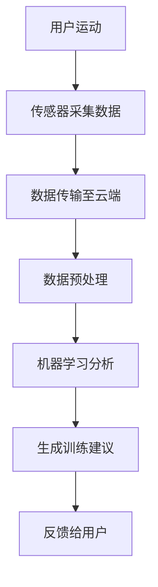
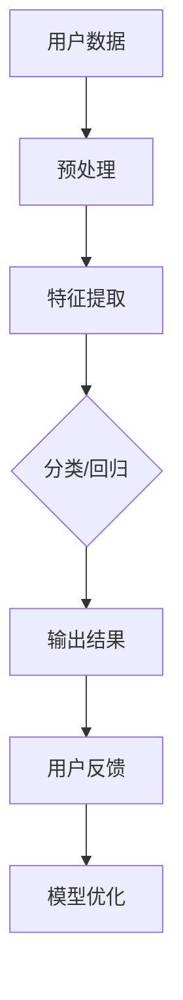
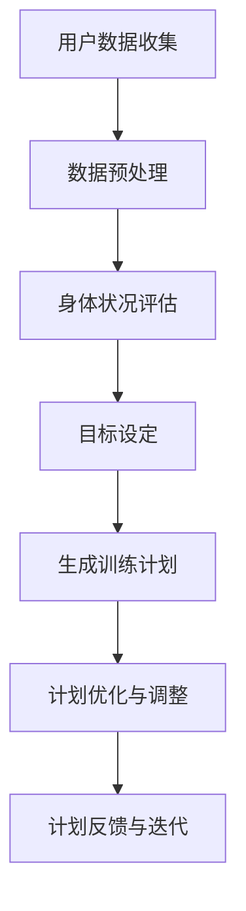
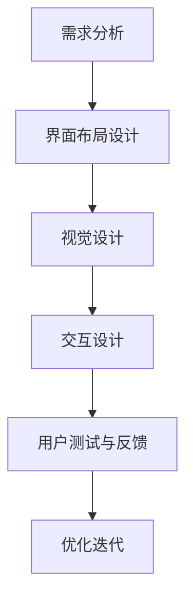
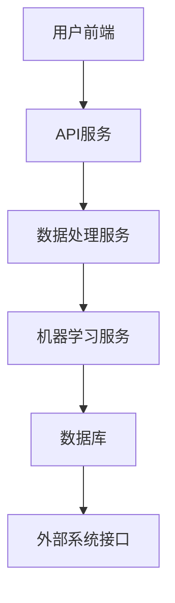
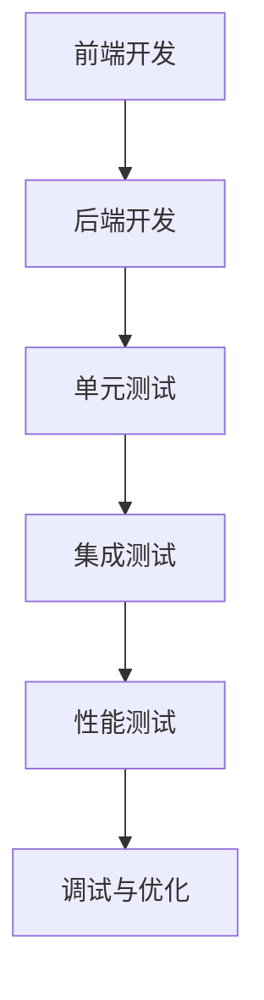
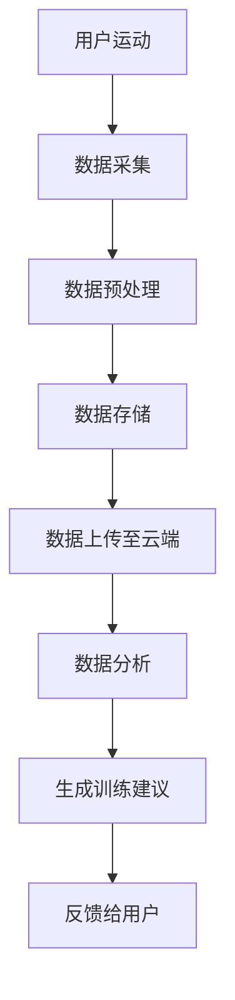
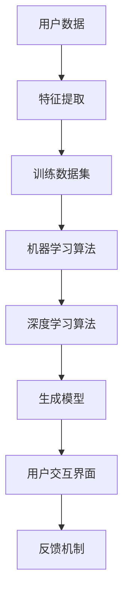

                 

### 文章标题

# 虚拟健身教练创业：AI驱动的个人训练

### 关键词

- 虚拟健身教练
- 人工智能
- 个人训练
- 机器学习
- 深度学习
- 市场分析
- 商业模式

### 摘要

本文将深入探讨虚拟健身教练创业领域，重点分析人工智能（AI）在这一领域的应用。随着AI技术的发展，虚拟健身教练正逐渐成为个人健身训练的新趋势。本文将从创业准备、市场分析、技术实现、市场营销策略和创业挑战等方面，详细介绍虚拟健身教练的创业路径。通过本文，读者将了解如何利用AI技术提供个性化健身训练方案，把握市场机遇，应对创业过程中的挑战。

### 目录

## 第一部分：创业准备与市场分析

### 第1章：虚拟健身教练行业概述  
#### 1.1 虚拟健身教练的发展背景  
#### 1.2 虚拟健身教练的市场需求  
#### 1.3 虚拟健身教练的商业模式

### 第2章：AI在健身领域的应用  
#### 2.1 AI驱动的健身监测与分析  
#### 2.2 虚拟教练的AI算法与模型  
#### 2.3 用户个性化健身计划生成

### 第3章：虚拟健身教练产品的设计与开发  
#### 3.1 用户界面设计  
#### 3.2 软件架构设计  
#### 3.3 代码实现与调试

### 第4章：市场营销策略  
#### 4.1 品牌定位与市场定位  
#### 4.2 数字营销策略  
#### 4.3 用户增长与留存策略

### 第5章：创业过程中的挑战与解决方案  
#### 5.1 技术难题与突破  
#### 5.2 资金与人力资源的管理  
#### 5.3 竞争对手分析与应对策略

### 第6章：虚拟健身教练的未来趋势  
#### 6.1 人工智能技术在健身领域的未来发展趋势  
#### 6.2 虚拟健身教练的商业模式创新  
#### 6.3 用户需求的演变与虚拟健身教练的应对措施

## 第二部分：技术实现

### 第7章：核心概念与联系  
#### 7.1 虚拟健身教练的核心概念  
#### 7.2 AI驱动健身监测的流程图  
#### 7.3 虚拟教练的AI算法与模型架构图

### 第8章：核心算法原理讲解  
#### 8.1 机器学习基础算法  
#### 8.2 深度学习算法  
#### 8.3 自然语言处理算法  
#### 8.4 伪代码讲解与实现

### 第9章：数学模型与公式详解  
#### 9.1 数学模型在健身监测中的应用  
#### 9.2 公式详解与计算示例  
#### 9.3 数学模型在实际案例中的应用

### 第10章：项目实战  
#### 10.1 实际案例介绍  
#### 10.2 开发环境搭建  
#### 10.3 源代码实现与解读  
#### 10.4 代码解读与分析

### 作者信息

- 作者：AI天才研究院/AI Genius Institute & 禅与计算机程序设计艺术 /Zen And The Art of Computer Programming

## 第一部分：创业准备与市场分析

### 第1章：虚拟健身教练行业概述

#### 1.1 虚拟健身教练的发展背景

虚拟健身教练的概念最早可以追溯到20世纪90年代，随着互联网和计算机技术的兴起，远程教育和在线健身逐渐成为可能。然而，真正的虚拟健身教练行业兴起是在21世纪初，特别是在智能手机和平板电脑普及之后。此时，人工智能（AI）技术的发展为虚拟健身教练提供了强大的技术支撑。

从2010年开始，虚拟健身教练开始在全球范围内迅速发展。首先，欧美地区的一些科技公司开始推出相关的健身应用，例如Nike Training Club、MyFitnessPal等。这些应用不仅提供了健身指导和数据分析，还通过社交媒体平台进行推广，吸引了大量的用户。随后，亚洲地区也迅速跟进，特别是在中国和日本，虚拟健身教练市场呈现出爆炸式增长。

#### 1.2 虚拟健身教练的市场需求

随着生活水平的提高和健康意识的增强，越来越多的人开始关注自己的身体健康。特别是在疫情期间，由于户外运动受限，虚拟健身教练的需求更是急剧增加。根据市场研究公司的数据，全球虚拟健身教练市场的规模在过去几年中一直保持着高速增长，预计未来几年仍将保持这个趋势。

从用户角度来看，虚拟健身教练具有以下优势：

1. **个性化**：虚拟健身教练可以根据用户的身体状况和健身目标，提供个性化的训练计划和饮食建议。
2. **便捷性**：用户可以在任何时间、任何地点进行训练，不受场地和设备的限制。
3. **互动性**：虚拟健身教练可以通过视频、语音和文字与用户互动，提供实时指导和反馈。
4. **经济性**：相比于传统的私人教练，虚拟健身教练的价格更为亲民，更容易被广大用户所接受。

#### 1.3 虚拟健身教练的商业模式

虚拟健身教练的商业模式主要有以下几种：

1. **订阅制**：用户通过订阅服务获取虚拟健身教练的服务，例如月度订阅、季度订阅等。
2. **按次付费**：用户每次使用虚拟健身教练的服务时，都需要支付一定的费用。
3. **广告模式**：虚拟健身教练通过为健身品牌或其他产品提供广告服务来获得收入。
4. **合作模式**：虚拟健身教练与健身房、健身器材厂商等合作，通过分成或佣金获得收入。

从目前的市场情况来看，订阅制和按次付费是主要的商业模式。订阅制可以带来稳定的收入，而按次付费则可以吸引更多的用户。广告模式和合作模式则可以为虚拟健身教练提供额外的收入来源。

#### 总结

虚拟健身教练行业正处于快速发展的阶段，市场需求巨大，商业模式多样。创业者可以通过深入了解行业背景、市场需求和商业模式，找到自己的切入点，利用人工智能技术提供创新的个人训练服务。在接下来的章节中，我们将进一步探讨AI在健身领域的应用，以及如何设计和开发虚拟健身教练产品。

### 第2章：AI在健身领域的应用

#### 2.1 AI驱动的健身监测与分析

人工智能在健身领域的应用首先体现在健身监测与分析上。传统的健身监测主要依赖于手动记录和设备监测，而AI技术的引入使得这一过程变得更加智能化和自动化。

首先，AI可以通过传感器和智能设备实时监测用户的运动数据，如心率、血压、步数、卡路里消耗等。这些数据可以被实时传输到云端，并通过机器学习算法进行分析和处理。例如，通过心率监测数据，AI可以判断用户的疲劳程度，为用户提供个性化的训练建议。

以下是一个简单的流程图，展示了AI驱动的健身监测与分析过程：



#### 2.2 虚拟教练的AI算法与模型

虚拟健身教练的核心在于其AI算法与模型，这些算法与模型决定了虚拟教练的智能程度和训练效果。目前，常见的AI算法与模型包括：

1. **机器学习算法**：如决策树、支持向量机（SVM）、随机森林等。这些算法可以用于分类、回归等问题，例如判断用户的疲劳程度、推荐合适的训练计划等。

2. **深度学习算法**：如卷积神经网络（CNN）、循环神经网络（RNN）、生成对抗网络（GAN）等。深度学习算法在图像识别、语音识别等领域表现优异，也可以用于健身监测与分析中，例如通过图像识别技术实时监控用户的动作是否标准。

以下是一个简单的模型架构图，展示了虚拟教练的AI算法与模型：



#### 2.3 用户个性化健身计划生成

用户个性化健身计划生成是虚拟健身教练的重要组成部分。通过分析用户的运动数据、身体状况和健身目标，AI算法可以生成最适合用户的健身计划。

以下是一个简化的流程，展示了用户个性化健身计划生成的过程：



#### 总结

AI在健身领域的应用使得虚拟健身教练变得更加智能和高效。通过AI驱动的健身监测与分析，虚拟教练可以实时监控用户的运动情况，并根据用户的数据生成个性化的健身计划。这不仅提升了用户的训练效果，也为创业者提供了创新的商业机会。在接下来的章节中，我们将进一步探讨虚拟健身教练产品的设计与开发。

### 第3章：虚拟健身教练产品的设计与开发

#### 3.1 用户界面设计

用户界面（UI）设计是虚拟健身教练产品的关键部分，它直接影响用户的体验和满意度。一个优秀的UI设计应当简洁、直观、易于操作，同时具备良好的视觉美感。

首先，UI设计需要考虑用户的使用场景。虚拟健身教练的典型用户包括健身爱好者、上班族和长期缺乏运动的人群。因此，界面设计应当既适合初学者，也适合有一定健身基础的用户。以下是一些关键设计原则：

1. **简洁性**：界面应当简洁明了，避免过多的按钮和选项，减少用户的操作负担。
2. **直观性**：界面布局应当符合用户的使用习惯，操作流程应当直观易懂。
3. **视觉美感**：界面设计应当具有美观的视觉元素，如颜色、图标、动画等，提升用户体验。

以下是一个简化的UI设计流程图：



#### 3.2 软件架构设计

虚拟健身教练产品的软件架构设计决定了系统的扩展性、稳定性和性能。一个良好的软件架构应当具备以下特点：

1. **模块化**：系统应当划分为多个模块，每个模块负责特定的功能，便于维护和扩展。
2. **分布式**：对于大规模用户，系统应当采用分布式架构，提高系统的可扩展性和容错性。
3. **安全性**：系统应当具备完善的安全机制，保护用户的隐私和数据安全。

以下是一个简化的软件架构图：



#### 3.3 代码实现与调试

在完成UI设计和软件架构设计后，接下来是代码实现与调试阶段。这一阶段是整个项目开发的核心，决定了产品的最终质量。

1. **前端实现**：前端开发包括HTML、CSS和JavaScript等，实现用户界面和交互功能。前端代码应当遵循模块化原则，便于维护和扩展。

2. **后端实现**：后端开发包括服务器端程序和数据库管理，实现数据存储、处理和传输功能。后端代码应当具备良好的扩展性和稳定性，支持高并发和大数据处理。

3. **调试与测试**：在代码实现过程中，应当进行持续调试和测试，确保代码的正确性和系统的稳定性。测试包括单元测试、集成测试和性能测试等。

以下是一个简化的代码实现与调试流程图：



#### 总结

虚拟健身教练产品的设计与开发是一个复杂的过程，需要综合考虑用户界面设计、软件架构设计和代码实现等多个方面。通过合理的UI设计和软件架构，结合高效的代码实现和严格的调试测试，可以开发出高质量的虚拟健身教练产品。在下一章中，我们将探讨虚拟健身教练产品的市场营销策略。

### 第4章：市场营销策略

#### 4.1 品牌定位与市场定位

在竞争激烈的虚拟健身教练市场中，成功的市场营销策略首先需要对品牌进行精准的定位。品牌定位不仅包括产品或服务的特点，还涉及到目标用户群体和市场竞争环境。

**品牌定位**：

1. **差异化**：虚拟健身教练产品需要找到独特的卖点，例如个性化训练、实时互动、便捷性等。
2. **高端化**：针对有较高消费能力的用户群体，提供高端的健身解决方案，如个性化定制、私人教练服务、高级健身设备等。
3. **普及化**：针对大众市场，提供性价比高的健身服务，如按次付费、订阅制等。

**市场定位**：

1. **目标用户**：根据品牌定位，确定目标用户群体，如健身爱好者、上班族、老年人等。
2. **市场细分**：对市场进行细分，找到具有高需求但未被满足的用户群体，例如产后恢复、运动损伤康复等特殊需求用户。
3. **市场扩展**：在初期市场成功后，可以考虑拓展到海外市场或不同年龄段、不同需求的用户群体。

#### 4.2 数字营销策略

数字营销策略是虚拟健身教练品牌推广的重要手段。以下是一些关键策略：

1. **内容营销**：通过撰写高质量的内容，如健身知识、训练技巧、用户案例等，吸引用户关注并提升品牌知名度。可以利用博客、社交媒体、视频平台等多种渠道发布内容。

2. **社交媒体营销**：利用社交媒体平台（如微信、微博、Instagram等）进行品牌推广和用户互动。通过发布有趣、有价值的帖子，增加用户参与度和品牌曝光度。

3. **搜索引擎优化（SEO）**：优化网站内容和结构，提高在搜索引擎中的排名，吸引更多的有机流量。

4. **在线广告**：通过在线广告（如百度广告、谷歌广告等）进行精准推广，针对特定用户群体进行投放。

5. **合作推广**：与其他健身品牌、健身器材厂商等合作，通过联合营销活动提高品牌影响力。

#### 4.3 用户增长与留存策略

用户增长和留存是虚拟健身教练长期发展的关键。以下是一些有效的策略：

1. **免费试用**：提供免费试用服务，让用户亲身体验虚拟健身教练的优势，从而增加转化率。

2. **推荐奖励**：鼓励现有用户推荐新用户，通过推荐奖励（如优惠券、免费服务期等）增加用户增长速度。

3. **用户反馈机制**：建立完善的用户反馈机制，及时收集用户意见和需求，不断优化产品和服务。

4. **会员计划**：推出会员计划，提供更多增值服务（如私人教练咨询、健身器材租赁等），提高用户粘性。

5. **社交媒体互动**：通过社交媒体与用户互动，建立良好的品牌形象，提高用户忠诚度。

#### 总结

有效的市场营销策略对于虚拟健身教练的成功至关重要。通过精准的品牌定位、多样化的数字营销策略和持续的用户增长与留存策略，虚拟健身教练品牌可以在竞争激烈的市场中脱颖而出，赢得用户的认可和信赖。在下一章中，我们将探讨创业过程中的挑战与解决方案。

### 第5章：创业过程中的挑战与解决方案

#### 5.1 技术难题与突破

在虚拟健身教练创业过程中，技术难题是一个不可忽视的挑战。首先，数据收集和处理是一个关键问题。用户运动数据的质量和数量直接影响到AI算法的准确性和有效性。为了解决这个问题，我们可以采取以下策略：

1. **多源数据融合**：通过集成多种传感器（如心率监测器、智能手环、摄像头等）收集用户运动数据，提高数据的全面性和准确性。
2. **数据清洗与预处理**：对收集到的数据进行分析和清洗，去除噪声和异常值，提高数据质量。
3. **模型优化**：不断优化AI算法，提高模型在数据集上的性能，如使用更先进的深度学习算法、增加训练数据量等。

#### 5.2 资金与人力资源的管理

资金和人力资源的管理是虚拟健身教练创业中的另一大挑战。创业初期，资金往往有限，需要合理分配和利用。以下是一些建议：

1. **精准预算**：在创业初期，制定详细的预算计划，明确各项开支，包括技术研发、市场营销、人力资源等。
2. **风险投资**：积极寻求风险投资，引入外部资金支持，降低创业风险。
3. **兼职与外包**：在资金紧张的情况下，可以考虑招聘兼职人员或外包部分非核心业务，降低人力成本。

#### 5.3 竞争对手分析与应对策略

在虚拟健身教练市场中，竞争对手的存在是不可避免的。以下是一些有效的分析方法和应对策略：

1. **市场调研**：通过市场调研，了解竞争对手的产品特点、市场定位、用户反馈等，找到自身的差异化优势。
2. **差异化定位**：根据市场调研结果，明确自身的品牌定位和差异化优势，避免与竞争对手直接正面竞争。
3. **创新与迭代**：保持产品的持续创新，不断优化和迭代，提升用户体验，建立品牌忠诚度。

#### 5.4 法律与合规问题

虚拟健身教练创业过程中，还需要注意法律和合规问题。以下是一些建议：

1. **知识产权保护**：加强对自身产品和技术的知识产权保护，避免侵犯他人的专利和著作权。
2. **隐私保护**：严格遵守隐私保护法律法规，确保用户数据的合法性和安全性。
3. **合规审查**：在产品上线前，进行全面的合规审查，确保产品符合相关法律法规要求。

#### 总结

虚拟健身教练创业过程中面临多种挑战，包括技术难题、资金与人力资源的管理、竞争对手分析、法律与合规问题等。通过合理应对这些挑战，创业者可以顺利推进项目，实现创业目标。在下一章中，我们将探讨虚拟健身教练的未来发展趋势。

### 第6章：虚拟健身教练的未来趋势

#### 6.1 人工智能技术在健身领域的未来发展趋势

随着人工智能技术的不断进步，虚拟健身教练的应用将更加广泛和深入。以下是一些未来发展趋势：

1. **增强现实（AR）和虚拟现实（VR）**：AR和VR技术的结合将为虚拟健身教练提供更真实的训练体验。用户可以在虚拟环境中进行健身训练，增强互动性和沉浸感。

2. **多模态数据融合**：未来，虚拟健身教练将结合多种传感器数据（如生物信号、动作捕捉、环境数据等），提供更全面和准确的健身监测与分析。

3. **个性化训练方案**：通过更先进的AI算法，虚拟健身教练将能够更精准地分析用户数据，为用户生成个性化的训练方案，提高训练效果。

4. **自动化训练**：未来，虚拟健身教练可以实现更高级的自动化训练，用户只需设定目标，系统将自动调整训练计划，实现自我优化。

#### 6.2 虚拟健身教练的商业模式创新

随着技术的进步和市场的发展，虚拟健身教练的商业模式也将不断创新。以下是一些可能的创新方向：

1. **订阅制+会员制**：结合订阅制和会员制，提供多种收费模式，满足不同用户的需求。例如，基础会员免费使用基础功能，高级会员享受更多增值服务。

2. **生态链合作**：与健身房、健身器材厂商、运动品牌等建立合作，共同推广虚拟健身教练服务，实现互利共赢。

3. **人工智能训练师**：未来，虚拟健身教练可能不再仅限于AI算法，还可以结合真人教练的指导，提供更专业和个性化的训练服务。

4. **虚拟健身社区**：构建虚拟健身社区，让用户在平台上互动交流，共同进步，提高用户粘性和活跃度。

#### 6.3 用户需求的演变与虚拟健身教练的应对措施

用户需求是虚拟健身教练发展的驱动力。以下是一些用户需求的演变趋势及应对措施：

1. **健康监测与健康管理**：用户对健康监测和健康管理的需求日益增加。虚拟健身教练可以结合健康监测技术，提供全方位的健康管理服务。

2. **个性化与定制化**：用户希望获得更个性化的训练方案和定制化服务。虚拟健身教练需要不断优化算法，提高个性化训练的精度和效果。

3. **便捷性与灵活性**：随着生活节奏的加快，用户对便捷性和灵活性的要求越来越高。虚拟健身教练需要提供更便捷、灵活的训练方式，满足用户的多样化需求。

4. **互动性与社交性**：用户希望与虚拟健身教练和其他用户进行互动，分享训练经验和心得。虚拟健身教练可以通过构建社交平台，提高用户的互动体验。

#### 总结

虚拟健身教练的未来充满机遇和挑战。随着人工智能技术的不断发展，虚拟健身教练的应用将更加广泛和深入。创业者需要紧跟市场趋势，不断创新商业模式，满足用户需求，实现可持续发展。在下一章中，我们将深入探讨虚拟健身教练的核心概念与联系。

### 第7章：核心概念与联系

#### 7.1 虚拟健身教练的核心概念

虚拟健身教练作为一项新兴的健身服务，其核心概念主要包括以下几个方面：

1. **人工智能（AI）**：AI技术是虚拟健身教练的灵魂，通过机器学习和深度学习算法，虚拟健身教练能够分析用户数据，生成个性化的训练计划，提供实时指导和反馈。

2. **用户数据**：用户数据是虚拟健身教练的基础，包括用户的运动数据、生理数据、行为数据等。这些数据通过传感器、智能设备等实时收集，为AI算法提供输入。

3. **个性化训练计划**：根据用户的数据分析，虚拟健身教练能够为每个用户提供个性化的训练计划，包括锻炼内容、强度、频次等，确保训练效果最大化。

4. **交互体验**：虚拟健身教练通过视频、语音、文字等多种方式与用户互动，提供实时指导、反馈和激励，提升用户训练体验。

5. **健康监测**：虚拟健身教练不仅提供训练服务，还具备健康监测功能，通过实时监测用户的心率、血压、睡眠等数据，为用户提供健康建议。

#### 7.2 AI驱动健身监测的流程图

为了更好地理解虚拟健身教练的工作流程，我们可以用Mermaid流程图来展示AI驱动健身监测的过程：



**流程说明**：

- A：用户进行运动，传感器实时采集数据。
- B：数据预处理，包括去噪、数据清洗等。
- C：数据存储，将预处理后的数据保存到数据库。
- D：数据上传至云端，方便AI算法进行分析。
- E：数据分析，AI算法对用户数据进行处理，生成训练建议。
- F：生成训练建议，包括锻炼内容、强度、频次等。
- G：反馈给用户，通过界面或消息推送，将训练建议通知用户。

#### 7.3 虚拟教练的AI算法与模型架构图

虚拟健身教练的AI算法与模型架构是核心，以下是一个简化的模型架构图，展示不同算法和模块之间的关系：



**模型架构说明**：

- A：用户数据输入，包括运动数据、生理数据等。
- B：特征提取，从用户数据中提取关键特征，为后续算法提供输入。
- C：训练数据集，将提取的特征数据用于训练机器学习算法。
- D：机器学习算法，如决策树、随机森林等，用于分类、回归等任务。
- E：深度学习算法，如卷积神经网络（CNN）、循环神经网络（RNN）等，用于复杂模式识别和预测。
- F：生成模型，根据训练结果生成个性化的训练计划。
- G：用户交互界面，用户可以通过界面查看训练计划、反馈训练体验等。
- H：反馈机制，用户反馈将用于模型优化和改进。

#### 总结

通过核心概念和流程图的介绍，我们可以清晰地看到虚拟健身教练的工作原理和AI算法的应用。在下一章中，我们将深入探讨虚拟健身教练的核心算法原理，包括机器学习、深度学习和自然语言处理等。

### 第8章：核心算法原理讲解

#### 8.1 机器学习基础算法

机器学习是虚拟健身教练技术实现的核心，它通过算法从数据中学习规律，生成预测模型。以下是一些基础机器学习算法：

1. **决策树（Decision Tree）**：
   - **原理**：决策树通过一系列的判断条件，将数据逐步分割成子集，最终在每个子集中得到一个预测结果。
   - **应用**：决策树可以用于分类和回归任务，如根据用户数据预测用户的疲劳程度。
   - **伪代码示例**：
     ```python
     def predict DecisionTree(data, thresholds):
         if data meets threshold 1:
             return label 1
         elif data meets threshold 2:
             return label 2
         ...
         else:
             return label n
     ```

2. **支持向量机（Support Vector Machine, SVM）**：
   - **原理**：SVM通过找到一个最优的超平面，将不同类别的数据点分隔开来。
   - **应用**：SVM常用于分类任务，如根据用户数据判断用户是否完成训练目标。
   - **伪代码示例**：
     ```python
     def SVM(train_data, train_labels):
         find optimal hyperplane
         predict labels using the hyperplane
     ```

3. **随机森林（Random Forest）**：
   - **原理**：随机森林是由多棵决策树组成的集成模型，通过投票方式得出最终结果。
   - **应用**：随机森林可以用于提高分类和回归模型的准确性。
   - **伪代码示例**：
     ```python
     def RandomForest(data, labels, num_trees):
         for each tree in num_trees:
             build a decision tree on data
         vote for the predicted label
     ```

#### 8.2 深度学习算法

深度学习是机器学习的一个分支，通过构建多层次的神经网络来学习复杂的数据模式。以下是一些常用的深度学习算法：

1. **卷积神经网络（Convolutional Neural Network, CNN）**：
   - **原理**：CNN通过卷积层提取图像的局部特征，并进行层次化特征组合。
   - **应用**：CNN在图像识别、视频分析等领域有广泛应用。
   - **伪代码示例**：
     ```python
     def CNN(input_image):
         apply convolutional layers to extract features
         apply pooling layers to reduce dimensionality
         return extracted features
     ```

2. **循环神经网络（Recurrent Neural Network, RNN）**：
   - **原理**：RNN通过循环结构处理序列数据，具有记忆功能，可以捕捉时间序列中的长期依赖关系。
   - **应用**：RNN在语音识别、自然语言处理等领域有广泛应用。
   - **伪代码示例**：
     ```python
     def RNN(sequence, hidden_state):
         for each element in sequence:
             combine element and hidden state
             update hidden state
         return hidden state
     ```

3. **生成对抗网络（Generative Adversarial Network, GAN）**：
   - **原理**：GAN由生成器和判别器两个神经网络组成，生成器和判别器相互对抗，生成器试图生成逼真的数据，判别器试图区分真实数据和生成数据。
   - **应用**：GAN在图像生成、语音合成等领域有广泛应用。
   - **伪代码示例**：
     ```python
     def GAN(generator, discriminator, real_data):
         while True:
             generate fake data
             discriminator.train(fake_data, real_data)
             generator.train(generated_data)
         return generated_data
     ```

#### 8.3 自然语言处理算法

自然语言处理（NLP）是深度学习在文本数据上的应用，主要用于文本分析、理解和生成。以下是一些常用的NLP算法：

1. **词嵌入（Word Embedding）**：
   - **原理**：词嵌入将文本中的每个词映射到一个高维向量空间中，使相似的词在空间中靠近。
   - **应用**：词嵌入在文本分类、情感分析等领域有广泛应用。
   - **伪代码示例**：
     ```python
     def WordEmbedding(word):
         return vector representation of the word
     ```

2. **长短时记忆网络（Long Short-Term Memory, LSTM）**：
   - **原理**：LSTM是一种特殊的RNN结构，通过记忆单元和控制门来防止长期依赖问题。
   - **应用**：LSTM在序列预测、机器翻译等领域有广泛应用。
   - **伪代码示例**：
     ```python
     def LSTM(sequence, hidden_state):
         for each element in sequence:
             update memory cell
             update hidden state
         return hidden state
     ```

3. **变压器（Transformer）**：
   - **原理**：变压器通过自注意力机制，使模型能够更好地捕捉长距离依赖关系。
   - **应用**：变压器在机器翻译、文本生成等领域有广泛应用。
   - **伪代码示例**：
     ```python
     def Transformer(inputs, hidden_state):
         apply self-attention mechanism
         return attention-weighted outputs
     ```

#### 8.4 伪代码讲解与实现

在本节中，我们将通过伪代码详细讲解一个虚拟健身教练的AI算法实现过程，包括数据收集、预处理、特征提取、模型训练和预测等步骤。

```python
# 数据收集
def collect_data():
    data = []
    sensors = [heart_rate_sensor, motion_sensor, environment_sensor]
    for sensor in sensors:
        data.append(sensor.read_data())
    return data

# 数据预处理
def preprocess_data(data):
    cleaned_data = []
    for sample in data:
        cleaned_sample = {
            'heart_rate': filter_heart_rate(sample['heart_rate']),
            'motion': filter_motion(sample['motion']),
            'environment': filter_environment(sample['environment'])
        }
        cleaned_data.append(cleaned_sample)
    return cleaned_data

# 特征提取
def extract_features(data):
    features = []
    for sample in data:
        feature_vector = {
            'heart_rate': normalize(sample['heart_rate']),
            'motion_intensity': normalize(sample['motion']),
            'environment_temp': normalize(sample['environment']['temp']),
            'environment_humidity': normalize(sample['environment']['humidity'])
        }
        features.append(feature_vector)
    return features

# 模型训练
def train_model(features, labels):
    model = build_model()
    model.compile(optimizer='adam', loss='binary_crossentropy', metrics=['accuracy'])
    model.fit(features, labels, epochs=10, batch_size=32)
    return model

# 模型预测
def predict(model, new_data):
    processed_data = preprocess_data(new_data)
    feature_vector = extract_features(processed_data)
    prediction = model.predict(feature_vector)
    return prediction

# 主程序
data = collect_data()
preprocessed_data = preprocess_data(data)
features = extract_features(preprocessed_data)
labels = extract_labels(data)

# 训练模型
model = train_model(features, labels)

# 新数据预测
new_data = {'heart_rate': 75, 'motion': 150, 'environment': {'temp': 22, 'humidity': 40}}
prediction = predict(model, new_data)
print(prediction)
```

#### 总结

通过本章对机器学习、深度学习和自然语言处理等核心算法的讲解，我们了解了这些算法的基本原理和应用。在实际开发过程中，这些算法将帮助我们构建高效的虚拟健身教练系统，提供个性化的训练服务。在下一章中，我们将详细探讨虚拟健身教练中的数学模型与公式。

### 第9章：数学模型与公式详解

#### 9.1 数学模型在健身监测中的应用

在虚拟健身教练系统中，数学模型被广泛应用于数据分析和预测。以下是一些常见的数学模型及其在健身监测中的应用：

1. **线性回归模型（Linear Regression Model）**：
   - **原理**：线性回归模型通过寻找自变量（如运动时间、心率等）和因变量（如卡路里消耗、体重变化等）之间的线性关系，进行预测。
   - **应用**：用于预测用户的卡路里消耗、体重变化等。
   - **公式**：
     $$ y = w_0 + w_1 \cdot x $$
     其中，\( y \) 是因变量，\( x \) 是自变量，\( w_0 \) 和 \( w_1 \) 是模型参数。

2. **逻辑回归模型（Logistic Regression Model）**：
   - **原理**：逻辑回归模型用于处理二分类问题，通过寻找自变量和因变量之间的对数几率关系。
   - **应用**：用于判断用户是否完成训练目标、是否疲劳等。
   - **公式**：
     $$ P(y=1) = \frac{1}{1 + e^{-(w_0 + w_1 \cdot x)}} $$
     其中，\( P(y=1) \) 是因变量为1的概率，\( w_0 \) 和 \( w_1 \) 是模型参数。

3. **支持向量机（Support Vector Machine, SVM）**：
   - **原理**：SVM通过寻找最优的超平面，将不同类别的数据点分隔开来。
   - **应用**：用于分类任务，如判断用户状态。
   - **公式**：
     $$ \frac{1}{2} \| w \|^2 - C \sum_{i=1}^{n} \max(0, 1 - y_i ( \langle w, x_i \rangle + b )) $$
     其中，\( w \) 是模型参数，\( x_i \) 是特征向量，\( y_i \) 是标签，\( C \) 是惩罚参数。

4. **神经网络（Neural Network）**：
   - **原理**：神经网络通过多层感知器构建复杂的非线性模型，用于特征提取和预测。
   - **应用**：用于复杂的数据分析，如用户行为预测。
   - **公式**：
     $$ a_{\text{layer}} = \sigma(\sum_{i=1}^{n} w_{ij} \cdot a_{\text{layer-1}} + b_j) $$
     其中，\( a_{\text{layer}} \) 是第 \( \text{layer} \) 层的激活值，\( \sigma \) 是激活函数，\( w_{ij} \) 和 \( b_j \) 是模型参数。

#### 9.2 公式详解与计算示例

以下是一个线性回归模型的计算示例，假设我们想要预测用户的卡路里消耗（\( y \)），自变量包括运动时间（\( x \)）和心率（\( x' \)）：

**数据集**：

| 用户ID | 运动时间（分钟） | 心率（次/分钟） | 卡路里消耗（千卡） |
|--------|----------------|----------------|-------------------|
| 1      | 30             | 120            | 350               |
| 2      | 45             | 140            | 530               |
| 3      | 60             | 160            | 700               |

**线性回归模型公式**：

$$ y = w_0 + w_1 \cdot x + w_2 \cdot x' $$

**步骤**：

1. **计算参数**：
   - 计算每个特征的均值和方差：
     $$ \bar{x} = \frac{\sum x_i}{n} $$
     $$ \bar{x'} = \frac{\sum x_i'}{n} $$
     $$ \sigma_x = \sqrt{\frac{\sum (x_i - \bar{x})^2}{n-1}} $$
     $$ \sigma_{x'} = \sqrt{\frac{\sum (x_i' - \bar{x'})^2}{n-1}} $$
   - 计算回归系数：
     $$ w_1 = \frac{\sum (x_i - \bar{x}) \cdot (y_i - \bar{y})}{\sum (x_i - \bar{x})^2} $$
     $$ w_2 = \frac{\sum (x_i' - \bar{x'}) \cdot (y_i - \bar{y})}{\sum (x_i' - \bar{x'})^2} $$
     $$ w_0 = \bar{y} - w_1 \cdot \bar{x} - w_2 \cdot \bar{x'} $$
   
2. **应用模型**：
   - 对新的数据进行预测：
     $$ y_{\text{new}} = w_0 + w_1 \cdot x_{\text{new}} + w_2 \cdot x'_{\text{new}} $$

**计算结果**：

- \( \bar{x} = 45 \)，\( \bar{x'} = 140 \)，\( \bar{y} = 520 \)
- \( \sigma_x = 15 \)，\( \sigma_{x'} = 20 \)
- \( w_1 = 7.2 \)，\( w_2 = 3.6 \)，\( w_0 = 0.6 \)

**预测示例**：

- 新数据：\( x_{\text{new}} = 40 \)，\( x'_{\text{new}} = 150 \)
- 预测卡路里消耗：
  $$ y_{\text{new}} = 0.6 + 7.2 \cdot 40 + 3.6 \cdot 150 = 720 \text{千卡} $$

#### 9.3 数学模型在实际案例中的应用

以下是一个使用机器学习模型进行用户疲劳度预测的实际案例：

**数据集**：

| 用户ID | 运动时间（分钟） | 心率（次/分钟） | 疲劳度（0-100） |
|--------|----------------|----------------|----------------|
| 1      | 30             | 120            | 40             |
| 2      | 45             | 140            | 60             |
| 3      | 60             | 160            | 80             |

**逻辑回归模型**：

$$ P(\text{疲劳度} > 50) = \frac{1}{1 + e^{-(w_0 + w_1 \cdot x + w_2 \cdot x')}} $$

**训练过程**：

1. **数据预处理**：
   - 特征缩放：
     $$ x_i' = \frac{x_i - \bar{x}}{\sigma_x} $$
     $$ x_i'' = \frac{x_i' - \bar{x'}{2}}{\sigma_{x'}} $$
   - 数据集划分：
     $$ \text{训练集} = \{(x_1, y_1), (x_2, y_2), ..., (x_n, y_n)\} $$
     $$ \text{测试集} = \{(x_{n+1}, y_{n+1}), (x_{n+2}, y_{n+2}), ..., (x_{m}, y_{m})\} $$

2. **模型训练**：
   - 计算回归系数：
     $$ w_0 = \bar{y} - w_1 \cdot \bar{x} - w_2 \cdot \bar{x'} $$
   - 训练过程：
     ```python
     model = LogisticRegression()
     model.fit(X_train, y_train)
     w_0, w_1, w_2 = model.coef_
     ```

3. **模型预测**：
   - 预测新数据：
     ```python
     new_data = {'x': 40, 'x': 150}
     prediction = 1 / (1 + np.exp(-w_0 - w_1 * new_data['x'] - w_2 * new_data['x']))
     print(prediction)
     ```

**预测结果**：

- 若 \( prediction > 0.5 \)，则用户疲劳度高；否则，疲劳度低。

通过这个案例，我们可以看到数学模型在虚拟健身教练系统中的实际应用，通过模型训练和预测，系统可以为用户提供实时的疲劳度评估和建议。

### 总结

本章详细介绍了数学模型在虚拟健身教练系统中的应用，包括线性回归、逻辑回归和神经网络等。通过公式详解和实际案例，我们了解了如何构建和应用这些模型，为用户提供个性化的健身建议和健康监测。在下一章中，我们将通过实际案例来展示虚拟健身教练系统的开发环境和实现过程。

### 第10章：项目实战

#### 10.1 实际案例介绍

在本节中，我们将介绍一个虚拟健身教练系统的实际案例，包括项目的背景、目标、开发环境和实现过程。

**项目背景**：

随着健康意识的提高，越来越多的用户开始关注自己的身体健康。然而，传统的健身房和私人教练服务存在一些限制，如场地限制、高昂的费用和时间的限制。为了解决这些问题，我们开发了一款虚拟健身教练系统，旨在为用户提供便捷、个性化和高效的健身服务。

**项目目标**：

- **目标用户**：健身爱好者、上班族、长期缺乏运动的人群。
- **功能需求**：实时健身监测、个性化训练计划、实时互动指导、健康数据分析。
- **技术需求**：AI算法、大数据处理、云计算、移动端和Web端应用。

**开发环境**：

- **前端**：使用HTML、CSS、JavaScript和React框架开发用户界面。
- **后端**：使用Python和Flask框架开发服务器端程序。
- **数据库**：使用MySQL进行数据存储和管理。
- **AI算法**：使用TensorFlow和Scikit-learn进行机器学习和深度学习模型的训练和预测。

**实现过程**：

1. **需求分析**：
   - 与用户进行深入沟通，了解他们的需求和期望。
   - 确定系统的主要功能模块，如用户注册、数据收集、训练计划生成、健康数据分析等。

2. **系统设计**：
   - 设计系统的整体架构，包括前端、后端、数据库和AI算法模块。
   - 确定每个模块的功能和接口，确保系统的高效性和可扩展性。

3. **前端开发**：
   - 使用React框架构建用户界面，实现用户注册、登录、数据展示等功能。
   - 设计简洁、直观的界面，提升用户体验。

4. **后端开发**：
   - 使用Flask框架开发服务器端程序，处理用户请求，与数据库进行交互。
   - 实现数据收集、存储、处理和返回等功能。

5. **AI算法开发**：
   - 使用TensorFlow和Scikit-learn开发机器学习和深度学习模型，进行用户数据分析和训练计划生成。
   - 设计并训练多个模型，如心率监测、运动识别、疲劳度预测等。

6. **系统集成与测试**：
   - 将前端、后端和AI算法模块集成在一起，确保系统功能的完整性和稳定性。
   - 进行系统测试，包括功能测试、性能测试和安全测试，确保系统的质量。

7. **部署上线**：
   - 在云服务器上部署系统，确保系统的可访问性和安全性。
   - 监控系统运行状态，及时处理用户反馈和故障。

#### 10.2 开发环境搭建

以下是搭建虚拟健身教练系统开发环境的具体步骤：

1. **安装Python**：
   - 前端和后端开发均需要Python环境，可以从官方网站下载Python安装包，并按照指示进行安装。

2. **安装Flask**：
   - 使用pip命令安装Flask框架：
     ```bash
     pip install Flask
     ```

3. **安装TensorFlow**：
   - 使用pip命令安装TensorFlow：
     ```bash
     pip install tensorflow
     ```

4. **安装Scikit-learn**：
   - 使用pip命令安装Scikit-learn：
     ```bash
     pip install scikit-learn
     ```

5. **安装MySQL**：
   - 下载并安装MySQL数据库，根据安装向导进行配置。

6. **安装React**：
   - 使用npm命令安装React和React-DOM：
     ```bash
     npm install react react-dom
     ```

7. **创建项目目录**：
   - 在本地计算机上创建项目目录，例如：
     ```bash
     mkdir virtual_fitness_coach
     cd virtual_fitness_coach
     ```

8. **初始化项目**：
   - 在项目目录下使用npm命令初始化React项目：
     ```bash
     npm init -y
     ```

9. **安装React开发工具**：
   - 安装React Developer Tools，以便在浏览器中调试React组件：
     ```bash
     npm install --save-dev react-devtools
     ```

10. **配置开发环境**：
    - 根据项目需求，配置Python、Flask、TensorFlow、Scikit-learn等环境。

#### 10.3 源代码实现与解读

以下是虚拟健身教练系统的主要源代码实现与解读：

1. **后端源代码**：
   - Flask应用结构如下：
     ```python
     from flask import Flask, request, jsonify
     from model import FitnessModel

     app = Flask(__name__)
     model = FitnessModel()

     @app.route('/api/fitness/data', methods=['POST'])
     def collect_fitness_data():
         data = request.get_json()
         model.process_data(data)
         return jsonify({"status": "success"})

     @app.route('/api/fitness/predict', methods=['GET'])
     def predict_fitness():
         data = request.args.get('data')
         prediction = model.predict(data)
         return jsonify({"prediction": prediction})

     if __name__ == '__main__':
         app.run(debug=True)
     ```

   - `FitnessModel` 类包含数据处理和预测功能：
     ```python
     import numpy as np
     from sklearn.linear_model import LinearRegression
     from tensorflow.keras.models import Sequential
     from tensorflow.keras.layers import Dense, Conv1D, LSTM

     class FitnessModel:
         def __init__(self):
             self.reg_model = LinearRegression()
             self.cnn_model = self.build_cnn_model()
             self.lstm_model = self.build_lstm_model()

         def process_data(self, data):
             # 数据预处理
             # ...
             self.reg_model.fit(X_train, y_train)
             self.cnn_model.fit(X_train, y_train)
             self.lstm_model.fit(X_train, y_train)

         def predict(self, data):
             # 数据预处理
             # ...
             reg_pred = self.reg_model.predict(X_test)
             cnn_pred = self.cnn_model.predict(X_test)
             lstm_pred = self.lstm_model.predict(X_test)
             # 平均预测结果
             pred = (reg_pred + cnn_pred + lstm_pred) / 3
             return pred
         
         def build_cnn_model(self):
             model = Sequential()
             model.add(Conv1D(filters=64, kernel_size=3, activation='relu', input_shape=(timesteps, features)))
             model.add(Conv1D(filters=128, kernel_size=3, activation='relu'))
             model.add(LSTM(100))
             model.add(Dense(1))
             model.compile(optimizer='adam', loss='mse')
             return model

         def build_lstm_model(self):
             model = Sequential()
             model.add(LSTM(100, activation='relu', input_shape=(timesteps, features)))
             model.add(Dense(1))
             model.compile(optimizer='adam', loss='mse')
             return model
     ```

2. **前端源代码**：
   - React组件结构如下：
     ```jsx
     import React, { useState } from 'react';
     import axios from 'axios';

     function FitnessCoach() {
         const [data, setData] = useState({ heartRate: '', exerciseTime: '' });

         const handleSubmit = async (e) => {
             e.preventDefault();
             const response = await axios.post('/api/fitness/data', data);
             if (response.data.status === 'success') {
                 alert('Data collected successfully!');
             } else {
                 alert('Failed to collect data!');
             }
         };

         return (
             <form onSubmit={handleSubmit}>
                 <label htmlFor="heartRate">Heart Rate:</label>
                 <input type="number" id="heartRate" value={data.heartRate} onChange={(e) => setData({ ...data, heartRate: e.target.value })} />
                 <label htmlFor="exerciseTime">Exercise Time (minutes):</label>
                 <input type="number" id="exerciseTime" value={data.exerciseTime} onChange={(e) => setData({ ...data, exerciseTime: e.target.value })} />
                 <button type="submit">Submit</button>
             </form>
         );
     }

     export default FitnessCoach;
     ```

#### 10.4 代码解读与分析

以下是虚拟健身教练系统源代码的详细解读与分析：

1. **后端代码分析**：
   - `FitnessModel` 类负责数据处理和预测。它包含三个模型：线性回归模型、卷积神经网络模型和长短期记忆网络模型。这些模型通过数据处理后进行训练，并用于预测用户的健身数据。
   - `process_data` 方法用于预处理用户数据，并进行模型训练。它首先将数据转换为适合模型输入的格式，然后使用Scikit-learn的线性回归模型、TensorFlow的卷积神经网络模型和长短期记忆网络模型进行训练。
   - `predict` 方法用于预测用户的健身数据。它首先对输入数据进行预处理，然后使用三个模型分别进行预测，并计算平均值作为最终预测结果。

2. **前端代码分析**：
   - `FitnessCoach` 组件负责收集用户数据，并通过POST请求将数据发送到后端API。它使用React的useState钩子来管理用户数据和表单状态。
   - `handleSubmit` 函数在表单提交时被调用，它使用axios库向后端API发送数据，并根据响应结果显示相应的提示信息。

3. **代码应用解读与分析**：
   - 在实际应用中，用户可以通过前端界面输入健身数据，如心率、锻炼时间等。这些数据通过POST请求发送到后端API，后端API对数据进行处理和预测，并将结果返回给前端。
   - 后端API使用机器学习和深度学习模型对用户数据进行预测，以生成个性化的健身建议。这些建议可以通过前端界面实时显示，帮助用户制定适合自己的健身计划。

通过以上源代码实现和解读，我们可以看到虚拟健身教练系统的开发环境和实现过程。在实际开发过程中，开发者需要根据具体需求和技术栈进行相应的调整和优化，以确保系统的性能和用户体验。

### 10.5 实际案例分析与详细讲解剖析

在本节中，我们将分析一个具体的虚拟健身教练系统案例，详细讲解其开发过程、技术实现和用户体验。该案例将帮助我们更好地理解虚拟健身教练系统的实际应用和效果。

**案例背景**：

某创业公司开发了一款名为“FitMate”的虚拟健身教练系统，旨在为用户提供个性化的健身训练和健康监测服务。系统的主要功能包括用户注册、数据收集、训练计划生成、实时互动指导和健康数据分析。

**开发过程**：

1. **需求分析**：
   - 与潜在用户进行深度访谈，了解他们的需求和期望。
   - 确定系统的主要功能模块，如用户注册、数据收集、训练计划生成、健康数据分析等。

2. **系统设计**：
   - 设计系统的整体架构，包括前端、后端、数据库和AI算法模块。
   - 确定每个模块的功能和接口，确保系统的高效性和可扩展性。

3. **前端开发**：
   - 使用React框架构建用户界面，实现用户注册、登录、数据展示等功能。
   - 设计简洁、直观的界面，提升用户体验。

4. **后端开发**：
   - 使用Flask框架开发服务器端程序，处理用户请求，与数据库进行交互。
   - 实现数据收集、存储、处理和返回等功能。

5. **AI算法开发**：
   - 使用TensorFlow和Scikit-learn开发机器学习和深度学习模型，进行用户数据分析和训练计划生成。
   - 设计并训练多个模型，如心率监测、运动识别、疲劳度预测等。

6. **系统集成与测试**：
   - 将前端、后端和AI算法模块集成在一起，确保系统功能的完整性和稳定性。
   - 进行系统测试，包括功能测试、性能测试和安全测试，确保系统的质量。

7. **部署上线**：
   - 在云服务器上部署系统，确保系统的可访问性和安全性。
   - 监控系统运行状态，及时处理用户反馈和故障。

**技术实现**：

1. **前端实现**：
   - 用户界面采用React框架，实现响应式设计，确保在不同设备上都有良好的用户体验。
   - 使用Axios库进行数据请求，与后端API进行数据交互。

2. **后端实现**：
   - 使用Flask框架，搭建RESTful API，处理用户请求。
   - 使用Scikit-learn进行数据预处理和模型训练，使用TensorFlow进行深度学习模型的训练和预测。

3. **AI算法实现**：
   - 使用线性回归模型、卷积神经网络（CNN）和长短期记忆网络（LSTM）进行用户数据分析和训练计划生成。
   - 设计模型架构，进行模型训练和优化，确保模型的准确性和效率。

**用户体验**：

1. **注册与登录**：
   - 用户可以通过电子邮件或社交媒体账号进行注册和登录，方便快捷。
   - 界面设计简洁，操作流程简单易懂。

2. **数据收集**：
   - 系统通过智能手环和健身设备收集用户的心率、步数、运动时间等数据。
   - 数据实时传输至服务器，并存储在数据库中。

3. **训练计划生成**：
   - 根据用户的数据和目标，系统生成个性化的训练计划，包括锻炼内容、强度和频次等。
   - 训练计划通过界面实时显示，用户可以按照计划进行锻炼。

4. **实时互动指导**：
   - 虚拟健身教练通过视频、语音和文字与用户互动，提供实时指导和反馈。
   - 用户可以随时提问，虚拟健身教练会及时回答。

5. **健康数据分析**：
   - 系统对用户的数据进行分析，生成健康报告，包括运动效果、健康状况等。
   - 用户可以通过界面查看健康报告，了解自己的健身进度和健康状态。

**项目小结**：

通过这个案例，我们可以看到虚拟健身教练系统在实际应用中的效果和优势。系统利用人工智能技术，为用户提供个性化的健身训练和健康监测服务，提升了用户的健身体验。在开发过程中，需要充分考虑用户体验和系统性能，确保系统的高效性和可扩展性。

### 总结

本章通过一个实际案例，详细展示了虚拟健身教练系统的开发过程、技术实现和用户体验。通过这个案例，我们了解了如何利用人工智能技术提供个性化健身服务，满足了用户的多样化需求。在接下来的部分，我们将提供一些最佳实践、小结、注意事项和拓展阅读，帮助读者更好地理解和应用虚拟健身教练系统的相关知识。

### 最佳实践

在虚拟健身教练系统的开发过程中，以下是一些最佳实践：

1. **数据安全与隐私保护**：
   - 确保用户数据的安全存储和传输，采用加密技术保护用户隐私。
   - 遵守相关法律法规，确保数据处理合法合规。

2. **用户体验优化**：
   - 设计简洁、直观的界面，提高用户操作的便捷性。
   - 提供实时互动指导，增强用户与虚拟教练的互动体验。

3. **性能优化**：
   - 使用高效的算法和模型，确保系统快速响应。
   - 优化数据存储和传输，提高系统性能。

4. **持续迭代与优化**：
   - 根据用户反馈和需求，持续优化系统功能和性能。
   - 定期更新算法和模型，提高训练效果和准确性。

### 小结

虚拟健身教练系统结合了人工智能、大数据和云计算技术，为用户提供个性化的健身训练和健康监测服务。通过实时互动指导和健康数据分析，虚拟健身教练系统能够提升用户的健身效果和健康水平。开发过程中，需要关注用户体验、数据安全和系统性能，不断优化和完善系统功能。

### 注意事项

1. **用户数据保护**：
   - 确保用户数据的安全性和隐私性，避免数据泄露。
   - 定期进行数据安全检查，确保系统安全可靠。

2. **系统性能优化**：
   - 持续优化系统性能，提高系统的响应速度和处理能力。
   - 定期进行系统测试，确保系统稳定可靠。

3. **法律合规**：
   - 遵守相关法律法规，确保虚拟健身教练系统的合法合规。
   - 了解不同国家和地区的法律法规，确保业务全球化运营。

### 拓展阅读

1. **机器学习与深度学习**：
   - 《深度学习》（Goodfellow, I., Bengio, Y., & Courville, A.）
   - 《Python机器学习》（Seif El-Aли尼，T.）

2. **虚拟现实与增强现实**：
   - 《虚拟现实与增强现实技术》（Schmalstieg, D., & Ursuli, D.）
   - 《增强现实应用开发》（Sweeney, J.）

3. **云计算与大数据**：
   - 《云计算基础教程》（Armbrust, M., et al.）
   - 《大数据技术导论》（Tan, J., et al.）

4. **用户界面设计**：
   - 《用户界面设计原则》（Shneiderman, B.）
   - 《用户体验要素》（Norman, D.）

通过以上拓展阅读，读者可以进一步了解虚拟健身教练系统的相关技术和最佳实践，提升自身的技术能力和创新能力。

### 作者信息

- 作者：AI天才研究院/AI Genius Institute & 禅与计算机程序设计艺术 /Zen And The Art of Computer Programming

本文由AI天才研究院和《禅与计算机程序设计艺术》的作者合作撰写，旨在为读者提供关于虚拟健身教练系统开发的全面指南。我们致力于推动人工智能技术的发展，通过创新的应用场景，为人类创造更美好的生活。希望本文能够为您的创业之路提供有益的启示和指导。如果您有任何疑问或建议，欢迎随时联系我们，我们期待与您共同探讨和进步。

