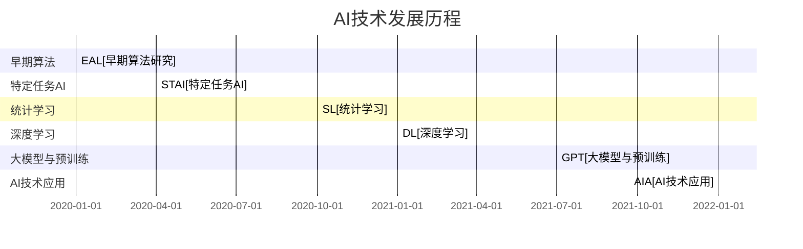
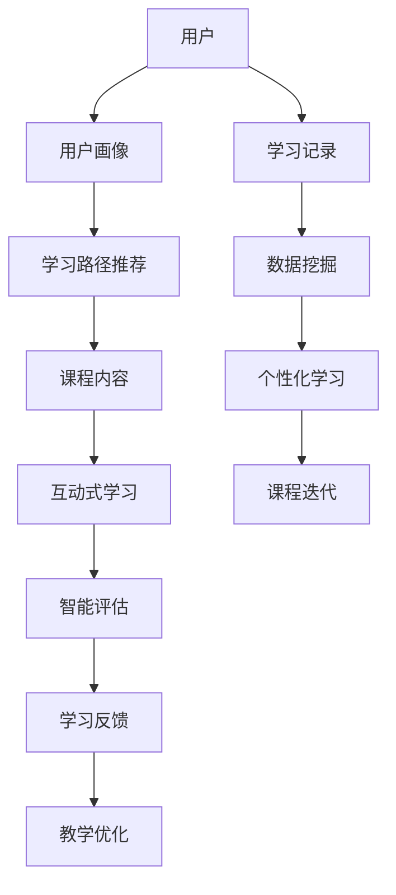
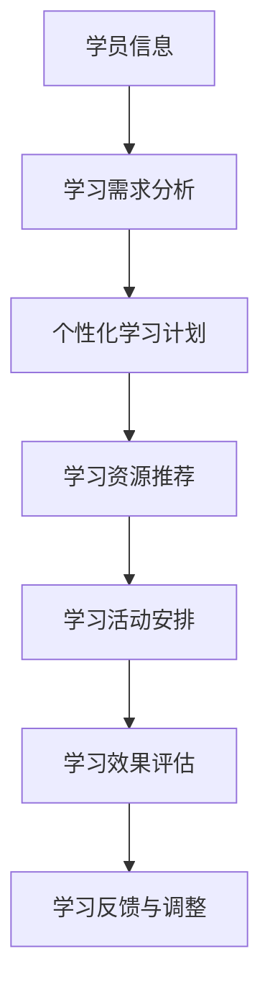
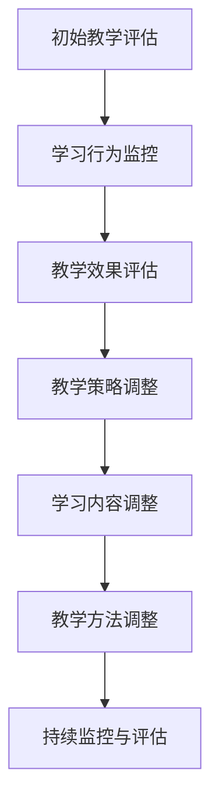
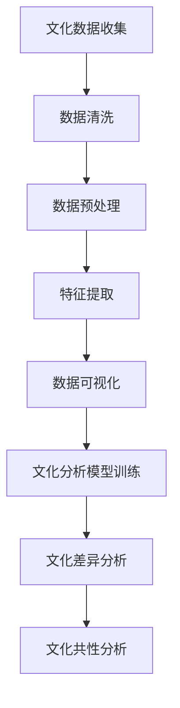
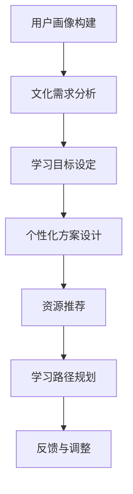

                 

### 文章标题

《虚拟外交学院院长：AI时代的跨文化交流培训专家》

### 关键词

- 跨文化交流
- AI技术
- 虚拟外交学院
- 文化培训
- 教育技术

### 摘要

本文探讨了AI时代虚拟外交学院院长在跨文化交流培训中的角色和使命。通过分析AI技术的快速发展及其对人类社会的影响，本文阐述了跨文化交流的复杂性及其在全球化背景下的重要性。随后，本文详细介绍了虚拟外交学院院长的职责、角色及其在教育培训、文化交流和国际关系咨询方面的作用。文章进一步探讨了AI技术在跨文化交流培训中的应用，如语言学习、文化理解与感知以及跨文化沟通技巧培训。通过实际案例研究和虚拟外交学院院长的工作实践，本文展示了AI时代下跨文化交流培训的策略和实践。最后，文章提出了AI时代跨文化交流的发展趋势和面临的挑战，并对未来进行了展望。本文旨在为读者提供关于AI时代跨文化交流培训的深入见解和实践指导。

----------------------------------------------------------------

## 第1章：引言与背景

### 1.1 书籍目的与结构介绍

#### 1.1.1 书籍目的

本书旨在探讨AI时代虚拟外交学院院长在跨文化交流培训中的重要角色。随着全球化进程的加速，跨文化交流变得越来越普遍和复杂。而AI技术的迅猛发展，为跨文化交流提供了新的工具和方法。虚拟外交学院院长作为这一新兴领域的专家，承担着推动跨文化交流、提升文化理解和促进国际合作的使命。

本书旨在回答以下几个关键问题：

1. AI技术如何影响跨文化交流？
2. 虚拟外交学院院长的角色和职责是什么？
3. AI技术在跨文化交流培训中有哪些应用？
4. 跨文化交流中的挑战如何应对？
5. 虚拟外交学院院长在未来的发展中将面临哪些机遇和挑战？

通过深入分析和探讨，本书希望能够为虚拟外交学院院长、跨文化交流从业者以及对此领域感兴趣的研究人员提供有价值的参考和指导。

#### 1.1.2 书籍结构

本书共分为八个章节，具体结构如下：

- 第1章：引言与背景，介绍书籍的目的、结构和核心内容。
- 第2章：AI时代的崛起，探讨AI技术发展及其对人类社会的影响。
- 第3章：虚拟外交学院院长的角色，详细描述虚拟外交学院院长的职责和使命。
- 第4章：AI技术在跨文化交流培训中的应用，分析AI技术在不同培训领域的应用。
- 第5章：虚拟外交学院院长的工作实践，通过案例研究展示虚拟外交学院院长的工作流程和实践效果。
- 第6章：AI时代的跨文化交流策略，探讨跨文化交流策略的设计原则和AI技术支持。
- 第7章：未来的展望与挑战，展望AI时代跨文化交流的发展趋势和虚拟外交学院院长面临的挑战。
- 第8章：结论与展望，总结全书内容并对未来进行展望。

每个章节都紧密围绕书籍的核心主题，逐步深入探讨，旨在为读者提供一个全面、系统的理解。

### 1.2 AI时代与跨文化交流的挑战

#### 1.2.1 AI时代的崛起

AI技术的发展可谓一日千里，从早期的算法优化到如今的大模型和深度学习，AI技术的应用范围已经渗透到各个领域，包括医疗、金融、交通、娱乐等。在AI技术的推动下，数据处理和计算能力得到了极大提升，为跨文化交流提供了新的可能。

AI技术的核心在于其强大的数据处理和模式识别能力。通过大数据分析和机器学习算法，AI能够快速获取和分析大量的跨文化数据，识别不同文化之间的共性和差异，为跨文化交流提供科学依据。此外，AI技术还能够在语言翻译、语音识别、图像识别等方面实现自动化，为跨文化交流提供便捷的工具。

#### 1.2.2 跨文化交流的挑战

尽管AI技术为跨文化交流带来了诸多机遇，但同时也带来了新的挑战。

1. **文化差异与冲突**：不同文化之间的价值观、信仰、习俗等存在差异，容易导致误解和冲突。在跨文化交流中，如何尊重和理解不同文化，避免文化冲突，是一个重要的挑战。

2. **语言障碍**：语言是跨文化交流的重要工具，但不同语言之间的障碍常常使得沟通变得复杂和困难。尽管机器翻译技术已经取得了显著进步，但在处理复杂语境、幽默和隐喻等方面仍存在很大挑战。

3. **技术依赖**：随着AI技术的发展，人们越来越依赖技术进行跨文化交流。然而，过度依赖技术可能会导致人类沟通能力的退化，减少面对面的交流机会，影响人际关系和深度理解。

4. **隐私和安全**：在跨文化交流中，数据安全和隐私保护成为重要问题。大量跨文化数据的收集、分析和共享，可能会引发隐私泄露和数据滥用的问题，影响个人和社会的安全。

#### 1.2.3 AI时代跨文化交流的机遇

尽管面临诸多挑战，AI时代也为跨文化交流带来了新的机遇。

1. **文化理解与传播**：AI技术可以帮助人们更好地理解和传播不同文化，通过数据分析和模式识别，揭示文化之间的共性和差异，促进文化融合和多元发展。

2. **教育资源共享**：AI技术使得优质教育资源得以在全球范围内共享。通过虚拟外交学院等在线教育平台，不同国家和地区的学习者可以便捷地获取跨文化交流培训，提高跨文化沟通能力。

3. **个性化培训**：AI技术可以根据个人的文化背景和学习需求，提供个性化的培训方案，提高培训效果和参与度。

4. **国际合作关系**：AI技术的发展促进了国际间的技术合作和交流，为跨文化交流提供了新的平台和机会。

### 1.3 虚拟外交学院院长的角色与使命

#### 1.3.1 教育培训专家

虚拟外交学院院长首先是一位教育培训专家，他们的核心职责是设计和实施跨文化交流培训课程。这些课程旨在帮助学员掌握跨文化沟通技巧，提高文化理解能力，增强在国际环境中的适应能力和竞争力。虚拟外交学院院长需要深入了解不同文化的特点、价值观和沟通方式，将理论知识与实际案例相结合，使学员能够学以致用。

#### 1.3.2 文化交流推动者

虚拟外交学院院长不仅是教育培训者，更是文化交流的推动者。他们积极参与和组织各类跨文化交流活动，如国际论坛、文化展览、交流项目等，促进不同文化之间的交流与理解。通过这些活动，虚拟外交学院院长可以帮助人们打破文化壁垒，增进相互了解和尊重，为构建和谐的国际社会贡献力量。

#### 1.3.3 国际关系顾问

虚拟外交学院院长具备丰富的国际视野和专业知识，可以为企业、政府等提供跨文化交流策略和决策建议。他们在面对国际合作、文化冲突、沟通障碍等问题时，能够提出切实可行的解决方案，帮助相关方更好地应对全球化挑战。虚拟外交学院院长在国际关系咨询方面的作用，不仅限于提供策略建议，还包括参与国际谈判、调解冲突等。

#### 1.3.4 虚拟外交学院的建设与发展

虚拟外交学院院长还肩负着虚拟外交学院的建设与发展使命。他们需要关注教育技术的发展，如在线教育平台、人工智能教学系统等，不断提升教学质量和学习体验。同时，虚拟外交学院院长需要拓展国际合作关系，吸引全球优秀学者和资源，为学院的发展奠定坚实基础。

综上所述，虚拟外交学院院长在教育培训、文化交流和国际关系咨询等方面发挥着重要作用，是AI时代跨文化交流的关键推动者。他们的工作不仅有助于提升个人和组织的能力，也为构建和谐、繁荣的国际社会贡献力量。

### 1.4 总结

本章介绍了本书的目的和结构，探讨了AI时代与跨文化交流的挑战，并详细描述了虚拟外交学院院长的角色与使命。随着全球化进程的加速和AI技术的不断发展，跨文化交流变得越来越重要和复杂。虚拟外交学院院长作为这一领域的专家，肩负着教育培训、文化交流和国际关系咨询等多重职责。他们的工作不仅有助于提升个人和组织的能力，也为构建和谐、繁荣的国际社会贡献力量。接下来，我们将进一步探讨AI技术在跨文化交流培训中的应用，以及虚拟外交学院院长在实际工作中的实践案例。

----------------------------------------------------------------

### 2.1 AI时代的崛起

#### 2.1.1 AI技术发展概述

人工智能（AI）技术的发展历程可谓波澜壮阔。从早期的算法研究到如今的大模型和深度学习，AI技术经历了多次技术突破和应用拓展。下面，我们将通过一个Mermaid流程图来简要概述AI技术的发展历程，以便更好地理解其核心概念和架构。



这个流程图展示了从早期算法研究到AI技术应用的各个发展阶段，具体如下：

1. **早期算法研究（EAL）**：这一阶段主要集中在基本算法的研究，如逻辑回归、支持向量机等，为后续的AI技术奠定了基础。
2. **特定任务AI（STAI）**：在这一阶段，AI技术开始应用于特定任务，如语音识别、图像识别等，实现了初步的智能化。
3. **统计学习（SL）**：统计学习方法在这一阶段得到了广泛应用，如决策树、随机森林等，提高了AI模型的预测性能。
4. **深度学习（DL）**：深度学习技术在这一阶段迅速崛起，通过神经网络结构，实现了对大规模数据的自动学习和特征提取，推动了AI技术的快速发展。
5. **大模型与预训练（GPT）**：随着计算能力和数据量的提升，大模型和预训练技术成为AI技术的新趋势，如GPT-3等模型，展示了AI在理解和生成文本方面的巨大潜力。
6. **AI技术应用（AIA）**：在这一阶段，AI技术开始广泛应用于各个领域，如医疗、金融、教育等，为社会带来了深刻的变革。

#### 2.1.2 AI对人类社会的影响

AI技术的崛起不仅改变了科技领域的格局，也对人类社会产生了深远的影响。以下从三个方面详细探讨AI对人类社会的影响：

1. **生产效率的提升**：AI技术在工业生产、服务行业等多个领域实现了自动化和智能化，极大地提高了生产效率。例如，通过机器人和自动化生产线，制造业实现了高精度、高效率的生产；在服务行业，AI技术用于智能客服、智能推荐等，提高了服务质量和客户满意度。

2. **工作模式的改变**：AI技术的应用改变了传统的劳动结构和就业模式。一方面，AI技术取代了部分重复性、简单性的工作，如流水线作业、数据录入等，使得劳动者能够从事更多创造性的工作；另一方面，AI技术也创造了新的就业机会，如AI工程师、数据科学家等，推动了劳动力市场的转型。

3. **社会结构的演变**：AI技术改变了社会的生产关系和社会结构。随着生产效率的提升，财富分配的不平等问题日益突出，贫富差距加大。同时，AI技术也带来了新的社会问题和伦理挑战，如隐私保护、数据安全、人工智能伦理等，需要全社会共同面对和解决。

#### 2.1.3 AI技术在跨文化交流中的应用

AI技术在跨文化交流中也发挥了重要作用，主要体现在以下几个方面：

1. **语言翻译**：AI语言翻译技术已经取得了显著的进展，如Google翻译、DeepL等。这些工具可以帮助人们跨越语言障碍，实现不同语言之间的无障碍交流。尽管目前的翻译技术还存在一定局限性，但在日常交流和商务沟通中已经显示出巨大的潜力。

2. **文化理解与感知**：通过机器学习和大数据分析，AI技术能够对大量的跨文化数据进行处理和分析，揭示不同文化之间的共性和差异。例如，AI可以分析社交媒体上的文化趋势、新闻报道等，帮助人们更好地理解不同文化的特点和价值观。

3. **跨文化沟通技巧培训**：AI技术可以为跨文化交流提供个性化培训方案，通过模拟不同的跨文化场景，帮助学员掌握有效的沟通技巧。例如，一些在线教育平台已经推出了基于AI技术的跨文化沟通课程，通过互动式学习和实时反馈，提高学员的沟通能力。

4. **文化交流活动策划与支持**：AI技术可以用于文化交流活动的策划与支持，如国际会议、文化节、展览等。通过数据分析、智能推荐等技术，AI可以帮助组织者更好地了解参与者的需求和偏好，提高活动的吸引力和参与度。

综上所述，AI技术的发展为跨文化交流带来了新的机遇和挑战。通过合理应用AI技术，我们可以更好地理解不同文化，提高跨文化交流的效果，为构建和谐的国际社会贡献力量。接下来，我们将进一步探讨虚拟外交学院院长的角色与职责，以及他们在跨文化交流培训中的实际工作。

### 2.2 跨文化交流的复杂性

#### 2.2.1 跨文化交流的定义与重要性

跨文化交流是指在不同文化背景下进行的交流与合作，它超越了单一文化的界限，涉及到文化之间的互动和融合。跨文化交流的定义可以从多个角度进行理解：

1. **文化背景差异**：跨文化交流涉及不同文化背景下的个体、群体和组织之间的互动。这些文化背景可能包括价值观、信仰、习俗、语言等，差异性的存在使得交流过程更加复杂。

2. **沟通障碍**：语言障碍、非语言沟通方式的不同、文化习俗的差异等都可能成为跨文化交流中的障碍。有效的沟通是实现跨文化交流的关键，但往往受到文化差异的制约。

3. **文化适应**：在跨文化交流过程中，参与者需要适应不同的文化环境，包括文化价值观、社会规范和行为方式等。这种文化适应不仅是一种个人行为，也是一种群体和组织层面的互动。

跨文化交流的重要性体现在以下几个方面：

1. **促进国际理解与合作**：跨文化交流有助于消除误解和偏见，增进不同国家和地区之间的理解与合作，为国际关系的和谐发展提供基础。

2. **提升个体和组织的竞争力**：在全球化背景下，具备跨文化沟通能力和文化理解能力的人才和组织更具竞争力。通过跨文化交流，个体和组织可以拓展市场、建立合作关系，实现资源共享和共同发展。

3. **推动文化多样性的发展**：跨文化交流促进了不同文化之间的交流与融合，推动了文化多样性的发展。这种多样性不仅丰富了人类的文化遗产，也为全球社会的繁荣和创新提供了动力。

#### 2.2.2 跨文化交流中的障碍与问题

尽管跨文化交流具有诸多优势，但在实际操作中，跨文化交流也面临着一系列障碍和问题：

1. **语言障碍**：语言是跨文化交流的重要工具，但不同语言之间的差异可能导致沟通障碍。即使有翻译工具，语言的地道性和语境理解也存在局限性，尤其是在处理复杂语境、幽默和隐喻时。

2. **文化差异**：文化差异是跨文化交流中的主要障碍之一。不同的文化背景可能导致价值观、信仰、习俗等方面的差异，这些差异可能引起误解、冲突甚至敌对情绪。

3. **非语言沟通方式**：非语言沟通方式在不同文化中存在差异。例如，肢体语言、面部表情、空间距离等在不同文化中的含义可能截然不同，容易导致沟通失误。

4. **时间观念**：时间观念在不同文化中也有所不同。一些文化强调时间紧迫和效率，而另一些文化则更加注重关系和沟通的过程。这种差异可能导致合作中的冲突和误解。

5. **法律和制度差异**：不同国家和地区的法律、法规和商业惯例存在差异，这些差异可能影响跨文化交流中的合作和交易。

6. **信任与尊重**：在跨文化交流中，信任和尊重的建立是一个重要问题。不同文化中对信任和尊重的理解和表达方式不同，可能导致交流中的障碍。

#### 2.2.3 跨文化交流中的挑战与应对策略

面对跨文化交流中的挑战，需要采取一系列策略来应对：

1. **文化敏感性培训**：通过文化敏感性培训，帮助个体和组织了解不同文化的特点和价值观，提高文化理解能力和敏感性。这种培训可以包括文化知识传授、案例分析、角色扮演等。

2. **有效沟通技巧**：培养有效的跨文化沟通技巧，如清晰明确的表达、尊重对方文化习俗、避免文化偏见等。通过培训和实践，提高跨文化沟通的效果和效率。

3. **建立信任关系**：建立信任关系是跨文化交流成功的关键。通过建立共同的价值观、寻求共同利益、保持开放和尊重的态度，可以逐步建立信任。

4. **跨文化团队建设**：在跨国团队中，通过团队建设活动、共同目标和合作机制的建立，促进团队成员之间的相互了解和信任，提高团队的协作效率。

5. **文化适应策略**：在跨文化交流中，需要根据不同文化的特点，采取相应的适应策略。例如，对于时间观念的差异，可以灵活调整工作安排，以适应对方的文化习惯。

6. **法律和制度咨询**：在跨文化交流中，了解和遵守不同国家和地区的法律、法规和商业惯例，避免法律和制度上的冲突。可以寻求专业法律和商业顾问的帮助。

综上所述，跨文化交流的复杂性决定了其挑战和机遇并存。通过理解跨文化交流的定义和重要性，认识到其中的障碍和问题，并采取有效的应对策略，我们可以更好地实现跨文化交流，促进国际理解与合作。在接下来的章节中，我们将进一步探讨AI技术在跨文化交流中的应用，以及虚拟外交学院院长在其中的角色和职责。

### 3.1 虚拟外交学院院长的角色

虚拟外交学院院长在跨文化交流培训中扮演着多重角色，这些角色不仅决定了他们的职责，也体现了他们在教育培训、文化交流和国际关系咨询方面的独特价值。以下是虚拟外交学院院长的主要角色和职责：

#### 3.1.1 教育培训专家

作为教育培训专家，虚拟外交学院院长负责设计并实施跨文化交流培训课程。这些课程旨在帮助学员提升跨文化沟通能力和文化理解能力，具体职责包括：

1. **课程设计与开发**：虚拟外交学院院长需要根据培训目标和学员需求，设计并开发适合的培训课程。这包括确定课程内容、选择合适的教材和教学资源，以及制定教学大纲和评估方法。

2. **教学方法与实施**：虚拟外交学院院长需要采用有效的教学方法，如互动式教学、案例分析、角色扮演等，提高学员的参与度和学习效果。他们还需要根据学员的反馈和表现，不断调整和优化教学方法和策略。

3. **教学资源的整合**：虚拟外交学院院长需要整合各种教学资源，包括在线课程、虚拟实验室、案例研究等，为学员提供丰富的学习体验。他们还需要利用AI技术，如机器学习和数据分析，为学员提供个性化的学习支持和反馈。

#### 3.1.2 文化交流推动者

虚拟外交学院院长不仅是教育培训专家，更是文化交流的推动者。他们积极参与和组织各类跨文化交流活动，促进不同文化之间的交流与理解。具体职责包括：

1. **文化交流活动的策划与组织**：虚拟外交学院院长负责策划和组织各类跨文化交流活动，如国际论坛、文化节、交流活动等。这些活动旨在为不同文化背景的个体和组织提供交流的平台，增进相互了解和合作。

2. **文化体验与分享**：虚拟外交学院院长需要设计和组织文化体验活动，如参观博物馆、体验不同文化习俗等，帮助学员更深入地了解和体验不同文化。通过分享文化故事和经历，增强学员的文化感知和认同感。

3. **跨文化团队建设**：在跨国团队中，虚拟外交学院院长需要协助团队建设，促进团队成员之间的相互了解和信任。他们可以通过团队活动、沟通技巧培训等方式，提高团队的协作效率和凝聚力。

#### 3.1.3 国际关系顾问

虚拟外交学院院长在国际关系咨询方面发挥着重要作用。他们为企业、政府和其他组织提供跨文化交流策略和决策建议，具体职责包括：

1. **跨文化交流策略咨询**：虚拟外交学院院长需要为组织提供跨文化交流的策略建议，包括文化适应性策略、沟通技巧培训、国际合作方案等。他们还需要分析不同文化背景下的潜在挑战和机遇，为组织提供战略指导。

2. **国际谈判与调解**：在涉及国际合作的谈判和冲突中，虚拟外交学院院长可以作为顾问或调解者，帮助各方理解对方的文化背景和立场，寻求共同解决方案。他们需要具备跨文化沟通能力和冲突管理技巧，以实现有效沟通和合作。

3. **国际合作项目策划**：虚拟外交学院院长需要参与国际合作项目的策划和实施，确保项目能够符合不同国家和地区的文化需求和期望。他们需要协调各方利益，确保项目的顺利进行和成功实施。

#### 3.1.4 虚拟外交学院的建设与发展

虚拟外交学院院长还肩负着虚拟外交学院的建设与发展使命。他们需要关注教育技术的发展，如在线教育平台、人工智能教学系统等，不断提升教学质量和学习体验。具体职责包括：

1. **教育技术的研究与应用**：虚拟外交学院院长需要关注教育技术的发展趋势，如虚拟现实、增强现实、人工智能等，将这些新技术应用于跨文化交流培训中，提高教学效果和学员体验。

2. **国际合作与资源拓展**：虚拟外交学院院长需要拓展国际合作，吸引全球优秀学者和资源，为学院的发展奠定坚实基础。他们可以通过建立国际合作网络、申请国际项目资金等方式，推动学院的国际化发展。

3. **教学质量与评估**：虚拟外交学院院长需要建立和完善教学质量评估体系，通过定期评估和反馈，确保培训课程的质量和效果。他们还需要制定相应的改进措施，不断提升教学质量。

综上所述，虚拟外交学院院长在教育培训、文化交流和国际关系咨询等方面发挥着重要作用。他们的职责不仅涉及课程设计和教学实施，还包括文化交流活动策划、国际关系咨询以及学院建设与发展。通过履行这些职责，虚拟外交学院院长为跨文化交流培训提供了有力支持，为构建和谐的国际社会贡献了智慧和力量。在接下来的章节中，我们将进一步探讨AI技术在跨文化交流培训中的应用，以及虚拟外交学院院长在实际工作中的实践案例。

### 3.2 虚拟外交学院的建立与发展

#### 3.2.1 虚拟外交学院的定义

虚拟外交学院是一种新型的在线教育机构，专注于跨文化交流培训和国际关系研究。与传统的外交学院不同，虚拟外交学院不受地理位置限制，通过互联网平台提供在线课程、研讨会、交流活动等，满足全球学员的学习需求。虚拟外交学院的核心目标是培养具有国际视野、跨文化沟通能力和全球竞争力的人才，促进不同国家和地区之间的文化交流与合作。

#### 3.2.2 虚拟外交学院的发展历程

虚拟外交学院的发展历程可以追溯到互联网技术的兴起和在线教育的普及。随着互联网技术的快速发展，人们逐渐认识到在线教育在跨文化交流培训中的巨大潜力。以下简要概述虚拟外交学院的发展历程：

1. **早期探索阶段**（2000-2005年）：在这一阶段，虚拟外交学院的前身开始出现，通过互联网平台提供一些基础性的跨文化交流课程。这一阶段的主要任务是探索在线教育模式，验证其在跨文化交流培训中的可行性。

2. **发展阶段**（2006-2010年）：随着互联网技术的进一步成熟，虚拟外交学院开始引入更多的在线教育工具和技术，如在线课堂、虚拟实验室、互动式教学等，提高教学效果和学员体验。这一阶段，虚拟外交学院逐步建立了较为完善的教学体系和课程体系。

3. **国际化阶段**（2011-2015年）：在这一阶段，虚拟外交学院开始拓展国际合作关系，与全球知名大学、研究机构和企业建立合作，共同开发和推广跨文化交流课程。虚拟外交学院的国际影响力逐渐提升，吸引了越来越多的国际学员。

4. **智能化阶段**（2016年至今）：随着人工智能技术的快速发展，虚拟外交学院开始引入AI技术，如机器学习、自然语言处理等，应用于课程设计、教学实施和学习评估等环节。智能化技术的应用不仅提高了教学效果，也为学员提供了更加个性化的学习体验。

#### 3.2.3 虚拟外交学院的优势与挑战

虚拟外交学院作为一种新型的在线教育机构，具有诸多优势，同时也面临一定的挑战。

1. **优势**：

   - **灵活的学习方式**：虚拟外交学院提供在线学习平台，学员可以根据个人时间和节奏进行学习，提高了学习的灵活性和自主性。
   - **全球化的视野**：通过互联网，虚拟外交学院可以吸引全球各地的学员，提供一个多元化的学习环境，培养具有国际视野的人才。
   - **高效的教学资源**：虚拟外交学院可以整合全球优秀的教学资源，如教授、课程、教材等，为学员提供高质量的教育服务。
   - **技术创新**：虚拟外交学院积极引入和应用AI技术，如机器学习、虚拟现实等，为学员提供更加智能化和个性化的学习体验。

2. **挑战**：

   - **技术依赖**：虚拟外交学院高度依赖互联网和AI技术，技术故障或网络安全问题可能导致教学中断，影响教学质量。
   - **隐私保护**：在线教育过程中，学员的隐私保护是一个重要问题。如何确保学员的学习数据和隐私安全，是虚拟外交学院需要面对的挑战。
   - **文化适应**：不同国家和地区的文化差异可能对在线教育产生影响。如何适应不同文化背景的学员需求，提供符合他们期望的教育服务，是虚拟外交学院需要考虑的问题。
   - **教学评估**：在线教育的教学评估与传统教育有所不同，如何有效评估学员的学习成果和教学质量，是虚拟外交学院需要解决的问题。

#### 3.2.4 虚拟外交学院的未来展望

面对未来的发展，虚拟外交学院将继续保持技术创新和国际化发展，致力于成为全球领先的跨文化交流培训机构。以下是虚拟外交学院未来发展的几个方向：

1. **智能化教学**：虚拟外交学院将继续引入和应用AI技术，如个性化学习推荐、智能评估、虚拟现实等，提高教学效果和学员体验。

2. **国际化合作**：虚拟外交学院将进一步加强与国际知名大学、研究机构和企业之间的合作，共同开发和推广跨文化交流课程，提升国际影响力。

3. **多元化课程体系**：虚拟外交学院将不断丰富和优化课程体系，开发更多符合不同文化背景和职业需求的跨文化交流课程，满足全球学员的需求。

4. **文化适应能力提升**：虚拟外交学院将加强文化适应能力，通过跨文化培训和文化体验活动，帮助学员更好地理解和适应不同文化环境。

5. **教学质量保障**：虚拟外交学院将建立和完善教学质量保障体系，通过定期评估和反馈，确保课程质量和教学效果。

总之，虚拟外交学院在未来的发展中，将继续秉承技术创新和国际化合作的理念，致力于提升跨文化交流培训的质量和效果，为全球学员提供优质的教育服务。在接下来的章节中，我们将进一步探讨AI技术在跨文化交流培训中的应用，以及虚拟外交学院院长在实际工作中的实践案例。

### 4.1 AI技术在教育中的应用

#### 4.1.1 人工智能教学系统的设计

人工智能教学系统（Artificial Intelligence Teaching System, AITS）是利用人工智能技术实现教学目标的一种创新教学工具。AITS的设计旨在通过个性化学习、智能评估和自适应学习等功能，提高教学效果和学员体验。以下是一个典型的人工智能教学系统设计框架：



**设计流程解释：**

1. **用户画像（B）**：系统首先通过用户注册信息和学习行为数据，构建用户画像。用户画像包括年龄、性别、职业、学习偏好等信息，用于后续的学习路径推荐和个性化学习。

2. **学习路径推荐（C）**：基于用户画像，系统推荐最适合用户的学习路径。这可以通过机器学习算法实现，如协同过滤、决策树等。

3. **课程内容（D）**：系统提供多样化的课程内容，包括视频、文档、模拟实验等，以满足不同学习需求。

4. **互动式学习（E）**：通过互动式学习模块，用户可以与课程内容进行互动，如在线测验、讨论区等，增强学习体验。

5. **智能评估（F）**：系统利用智能评估模块，对用户的学习进度和效果进行实时评估。这可以通过自然语言处理和计算机视觉等技术实现，如在线测验自动评分、学习行为分析等。

6. **学习反馈（G）**和**教学优化（H）**：根据智能评估的结果，系统提供学习反馈，帮助用户了解自己的学习情况。同时，这些反馈数据用于教学优化，以提升课程质量。

7. **学习记录（I）**和**数据挖掘（J）**：系统记录用户的学习行为和成绩数据，并通过数据挖掘技术分析这些数据，为个性化学习提供支持。

8. **个性化学习（K）**：基于学习记录和数据挖掘结果，系统为用户提供个性化的学习方案，包括推荐学习内容、调整学习进度等。

9. **课程迭代（L）**：系统根据用户反馈和学习效果，不断优化和更新课程内容，以保持教学的高效性和适用性。

#### 4.1.2 个性化学习与适应性教学

个性化学习和适应性教学是AI技术在教育中应用的两个核心概念，旨在根据学员的学习需求和特点，提供个性化的学习体验。

**个性化学习**

个性化学习（Personalized Learning）是指根据学员的个人差异，如学习风格、兴趣、能力等，提供个性化的学习路径、资源和活动。以下是一个简单的个性化学习流程：



**流程解释：**

1. **学员信息（A）**：系统收集学员的基本信息和学习需求，如学科背景、学习目标、兴趣偏好等。

2. **学习需求分析（B）**：系统分析学员的信息，了解他们的学习需求，为个性化学习计划提供依据。

3. **个性化学习计划（C）**：根据学习需求分析结果，系统为学员制定个性化的学习计划，包括学习目标、学习内容、学习方法等。

4. **学习资源推荐（D）**：系统推荐与个性化学习计划相匹配的学习资源，如视频教程、电子书籍、在线课程等。

5. **学习活动安排（E）**：系统根据个性化学习计划，安排适合的学习活动，如在线讨论、实验操作、模拟练习等。

6. **学习效果评估（F）**：系统对学员的学习效果进行实时评估，通过测验、作业等方式，了解学员的知识掌握情况。

7. **学习反馈与调整（G）**：根据学习效果评估结果，系统提供学习反馈，帮助学员了解自己的学习情况，并根据反馈调整学习计划。

**适应性教学**

适应性教学（Adaptive Teaching）是指在教学过程中，根据学员的学习进展和表现，动态调整教学内容、难度和教学方法，以适应学员的学习节奏和需求。以下是一个简单的适应性教学流程：



**流程解释：**

1. **初始教学评估（A）**：在教学开始时，系统对学员进行初始评估，了解他们的基础知识水平和学习特点。

2. **学习行为监控（B）**：系统持续监控学员的学习行为，如学习时长、学习路径、互动频率等，收集学习数据。

3. **教学效果评估（C）**：系统根据学习行为数据和教学目标，对学员的学习效果进行实时评估。

4. **教学策略调整（D）**：根据教学效果评估结果，系统调整教学策略，如增加练习题、调整教学节奏、引入新的教学方法等。

5. **学习内容调整（E）**：系统根据学员的学习进展，调整学习内容，确保内容的难度和深度与学员的接受能力相匹配。

6. **教学方法调整（F）**：系统根据学员的学习特点和反馈，调整教学方法，如增加互动环节、引入虚拟实验等。

7. **持续监控与评估（G）**：系统持续监控学员的学习进展和效果，并根据反馈进行持续的调整和优化。

通过个性化学习和适应性教学，AI技术能够为学员提供更加灵活和高效的学习体验，提高教学效果和学员满意度。在接下来的章节中，我们将进一步探讨AI技术在跨文化交流培训中的应用，以及虚拟外交学院院长在实际工作中的实践案例。

### 4.2 AI在跨文化交流培训中的应用

#### 4.2.1 语言学习与翻译

AI技术在语言学习与翻译领域的应用已经取得了显著进展，为跨文化交流培训提供了强有力的支持。以下是AI技术在语言学习与翻译中的几个关键应用：

1. **机器翻译**：机器翻译（Machine Translation, MT）是AI技术在跨文化交流中的基础应用之一。通过使用神经网络翻译（Neural Machine Translation, NMT）等先进算法，机器翻译系统能够自动将一种语言的文本翻译成另一种语言。Google翻译、DeepL等都是广泛使用的机器翻译工具。以下是一个简单的神经网络翻译算法的伪代码示例：

```python
# 输入：源语言文本source_text，目标语言文本target_text
# 输出：翻译后的文本translated_text

# 初始化神经网络模型
model = NeuralNetworkModel()

# 训练模型
model.train(source_text, target_text)

# 翻译文本
translated_text = model.translate(source_text)

# 输出翻译结果
print(translated_text)
```

2. **语音识别与生成**：语音识别（Automatic Speech Recognition, ASR）技术可以将语音信号转换为文本，而语音生成（Text-to-Speech, TTS）技术则可以将文本转换为自然流畅的语音。这些技术对于跨文化交流中的语言障碍具有重大意义。以下是一个简单的语音生成算法的伪代码示例：

```python
# 输入：文本text
# 输出：语音信号audio

# 初始化语音生成模型
tts_model = TextToSpeechModel()

# 生成语音信号
audio = tts_model.generate_audio(text)

# 输出语音信号
play(audio)
```

3. **语言学习辅助工具**：AI技术还可以开发出各种语言学习辅助工具，如语言学习应用、互动式语言练习平台等。这些工具利用自然语言处理和机器学习技术，帮助学员进行词汇学习、语法练习、发音训练等。以下是一个简单的语言学习应用架构的伪代码示例：

```python
# 输入：用户语言学习数据user_learning_data
# 输出：学习效果评估report

# 初始化语言学习模型
learning_model = LanguageLearningModel()

# 练习词汇
words_practiced = learning_model.practice_words(user_learning_data)

# 练习语法
sentences_practiced = learning_model.practice_sentences(user_learning_data)

# 评估学习效果
report = learning_model.evaluate_performance(words_practiced, sentences_practiced)

# 输出学习报告
print(report)
```

#### 4.2.2 文化理解与感知

除了语言学习与翻译，AI技术在帮助学员理解和感知不同文化方面也发挥着重要作用。以下是一些具体应用：

1. **文化数据分析**：通过大数据分析和机器学习算法，AI技术可以处理和分析大量的跨文化数据，揭示不同文化之间的共性和差异。以下是一个简单的文化数据分析流程的伪代码示例：

```python
# 输入：跨文化数据cultural_data
# 输出：文化分析结果cultural_analysis

# 初始化文化分析模型
analysis_model = CulturalAnalysisModel()

# 加载文化数据
cultural_data = load_data(cultural_data)

# 进行文化数据分析
cultural_analysis = analysis_model.analyze_data(cultural_data)

# 输出文化分析结果
print(cultural_analysis)
```

2. **文化模拟与体验**：利用虚拟现实（VR）和增强现实（AR）技术，AI可以创建不同文化的虚拟场景，让学员在沉浸式的环境中体验和了解不同文化。以下是一个简单的文化模拟系统的伪代码示例：

```python
# 输入：文化场景数据cultural_scene_data
# 输出：虚拟文化体验体验结果virtual_experience

# 初始化虚拟现实系统
vr_system = VirtualRealitySystem()

# 加载文化场景数据
cultural_scene = load_scene(cultural_scene_data)

# 初始化虚拟文化体验
virtual_experience = vr_system.create_experience(cultural_scene)

# 开始虚拟文化体验
start_experience(virtual_experience)

# 输出体验结果
print(virtual_experience)
```

3. **文化知识库构建**：通过构建文化知识库，AI技术可以为学员提供丰富的文化背景信息和知识资源。这些知识库可以涵盖不同文化的历史、传统、价值观、礼仪习俗等内容。以下是一个简单的文化知识库系统的伪代码示例：

```python
# 输入：文化知识数据cultural_knowledge_data
# 输出：文化知识库knowledge_base

# 初始化文化知识库
knowledge_base = CulturalKnowledgeBase()

# 加载文化知识数据
cultural_knowledge = load_knowledge(cultural_knowledge_data)

# 构建文化知识库
knowledge_base.build(knowledge_base, cultural_knowledge)

# 输出文化知识库
print(knowledge_base)
```

通过这些AI技术的应用，跨文化交流培训可以更加全面和深入，帮助学员更好地理解和适应不同文化，提升跨文化沟通能力。

#### 4.2.3 跨文化沟通技巧培训

跨文化沟通技巧培训是跨文化交流培训中的关键环节，旨在帮助学员掌握在不同文化背景下的有效沟通方法。AI技术在跨文化沟通技巧培训中具有独特的优势，可以通过模拟练习、实时反馈和个性化指导等方式提升学员的沟通能力。以下是一些具体应用：

1. **模拟练习**：利用虚拟现实（VR）和增强现实（AR）技术，AI可以创建逼真的跨文化沟通场景，让学员在模拟环境中进行互动练习。以下是一个简单的模拟练习系统的伪代码示例：

```python
# 输入：模拟场景数据simulated_scene_data
# 输出：练习结果practice_results

# 初始化虚拟现实系统
vr_system = VirtualRealitySystem()

# 加载模拟场景数据
simulated_scene = load_scene(simulated_scene_data)

# 初始化跨文化沟通模拟
communication_simulation = vr_system.create_simulation(simulated_scene)

# 开始模拟练习
practice_results = start_simulation(communication_simulation)

# 输出练习结果
print(practice_results)
```

2. **实时反馈**：通过自然语言处理和语音识别技术，AI可以实时分析学员的沟通表现，提供即时反馈。以下是一个简单的实时反馈系统的伪代码示例：

```python
# 输入：学员沟通数据student_communication_data
# 输出：反馈结果feedback

# 初始化反馈系统
feedback_system = RealTimeFeedbackSystem()

# 分析学员沟通数据
feedback = feedback_system.analyze_communication(student_communication_data)

# 提供实时反馈
provide_feedback(feedback)

# 输出反馈结果
print(feedback)
```

3. **个性化指导**：通过个性化学习算法，AI可以根据学员的沟通能力和文化背景，提供定制化的沟通技巧培训方案。以下是一个简单的个性化指导系统的伪代码示例：

```python
# 输入：学员信息student_info，培训目标training_goals
# 输出：个性化培训方案personalized_training_plan

# 初始化个性化学习模型
personalized_learning_model = PersonalizedLearningModel()

# 分析学员信息和培训目标
personalized_training_plan = personalized_learning_model.generate_plan(student_info, training_goals)

# 提供个性化培训方案
provide_training_plan(personalized_training_plan)

# 输出个性化培训方案
print(personalized_training_plan)
```

通过这些AI技术的应用，跨文化沟通技巧培训可以更加高效和有针对性，帮助学员在不同文化背景下实现有效沟通。在接下来的章节中，我们将通过实际案例研究，进一步展示虚拟外交学院院长如何利用AI技术推动跨文化交流培训。

### 5.1 跨文化交流案例研究

#### 5.1.1 案例一：中日企业合作项目

在中日企业合作项目中，虚拟外交学院院长发挥了重要作用，通过跨文化交流培训帮助双方企业克服文化差异，实现高效合作。以下是对这一案例的详细描述：

**项目背景**：

中日两国在制造业、科技、金融等领域有着广泛的合作，但文化差异常常成为合作中的障碍。中日企业之间的交流不仅涉及语言障碍，还包括价值观、沟通方式和商业习惯等方面的差异。为了提高合作效率，企业需要培养具备跨文化沟通能力的团队。

**虚拟外交学院院长的角色**：

作为跨文化交流培训专家，虚拟外交学院院长负责设计和实施培训项目，确保团队成员能够更好地理解和适应中日文化。

**培训内容**：

1. **中日文化差异介绍**：虚拟外交学院院长首先为团队成员介绍中日文化的基本差异，包括价值观、沟通方式、礼仪习俗等。通过案例分析，团队成员能够更直观地了解这些差异。

2. **跨文化沟通技巧培训**：虚拟外交学院院长设计了一系列沟通技巧培训课程，包括有效沟通策略、非语言沟通、文化敏感性训练等。这些课程通过互动式教学和角色扮演，帮助团队成员掌握跨文化沟通的实用技巧。

3. **文化适应策略**：虚拟外交学院院长还向团队成员提供了文化适应策略，包括如何在不同文化背景下调整自己的沟通方式和行为，以减少误解和冲突。

**培训效果**：

经过培训，团队成员的文化理解能力和沟通技巧显著提升。以下是一些具体的效果：

1. **沟通障碍减少**：团队成员能够更准确地理解对方的意图，减少了沟通中的误解和冲突。

2. **合作效率提高**：由于文化差异导致的误解和冲突减少，团队的合作效率显著提高。

3. **关系加深**：通过培训，团队成员之间建立了更加深厚的关系，为长期的战略合作奠定了基础。

**总结**：

中日企业合作项目中的跨文化交流培训是一个成功的案例，展示了虚拟外交学院院长在跨文化交流培训中的重要作用。通过系统的培训，团队成员不仅提升了文化理解能力和沟通技巧，也为企业的国际发展提供了有力支持。

#### 5.1.2 案例二：跨国团队合作案例分析

在跨国团队合作项目中，虚拟外交学院院长同样发挥了关键作用，通过跨文化交流培训帮助团队克服文化差异，实现高效合作。以下是对这一案例的详细描述：

**项目背景**：

一家国际知名的科技公司在其全球战略布局中，需要在不同的国家和地区组建跨文化团队，以实现全球范围内的研发、生产和市场拓展。跨国团队合作不仅需要成员具备专业技能，还需要他们具备跨文化沟通能力和文化理解能力。

**虚拟外交学院院长的角色**：

作为跨国团队合作项目的跨文化交流培训专家，虚拟外交学院院长负责设计和实施一系列培训课程，确保团队成员能够更好地适应和融入不同文化环境。

**培训内容**：

1. **全球文化多样性介绍**：虚拟外交学院院长首先为团队成员介绍了全球主要文化区域的基本特点，包括欧洲、美洲、亚洲等。通过详细的文化分析，团队成员能够更全面地了解不同地区的文化差异。

2. **跨文化沟通技巧培训**：虚拟外交学院院长设计了一系列跨文化沟通技巧培训课程，包括跨文化沟通策略、文化敏感性训练、跨文化冲突管理等。这些课程旨在帮助团队成员掌握在不同文化背景下的有效沟通方法。

3. **文化适应性策略**：虚拟外交学院院长还为团队成员提供了文化适应性策略，包括如何在不同的文化环境中调整自己的行为和沟通方式，以减少误解和冲突。

**培训效果**：

经过系统的培训，团队成员的跨文化沟通能力和文化理解能力得到了显著提升。以下是一些具体的效果：

1. **沟通障碍减少**：团队成员能够更好地理解不同文化背景下的沟通方式，减少了沟通中的误解和冲突。

2. **团队协作效率提高**：由于沟通障碍的减少，团队协作效率显著提高，项目进展更加顺利。

3. **文化冲突管理能力提升**：团队成员通过培训，掌握了有效的跨文化冲突管理方法，能够更好地解决团队合作中的文化冲突。

**总结**：

跨国团队合作项目中的跨文化交流培训是一个成功的案例，展示了虚拟外交学院院长在跨文化交流培训中的关键作用。通过系统的培训，团队成员不仅提升了跨文化沟通能力和文化理解能力，也为公司的全球战略布局提供了有力支持。

### 5.2 虚拟外交学院院长的工作流程

#### 5.2.1 跨文化交流培训项目策划

跨文化交流培训项目的策划是虚拟外交学院院长工作的第一步，它决定了培训的针对性和有效性。以下是跨文化交流培训项目策划的具体流程：

1. **需求分析**：虚拟外交学院院长首先与培训主办方、学员代表等进行深入沟通，了解培训的目标、受众特点、培训需求和预期成果。通过问卷调查、访谈等方式，收集相关信息。

2. **课程设计**：基于需求分析结果，虚拟外交学院院长制定详细的课程计划。课程设计包括课程目标、内容、教学方法、时间安排等。为了提高课程的实用性，虚拟外交学院院长会结合案例研究和互动式教学。

3. **资源准备**：虚拟外交学院院长准备所需的培训资源，如教材、PPT、视频教程、互动工具等。同时，确保所有资源符合课程设计和培训目标。

4. **时间安排**：虚拟外交学院院长根据课程设计和资源准备情况，制定详细的时间安排表，包括每个课程模块的教学时间、休息时间和评估时间等。

5. **预算管理**：虚拟外交学院院长根据培训项目规模和资源需求，制定预算计划，确保培训项目的经济可行性。

6. **风险评估**：虚拟外交学院院长评估培训项目可能遇到的风险，如技术问题、学员参与度、时间安排冲突等，并制定相应的应对措施。

#### 5.2.2 培训课程的开发与实施

培训课程的开发与实施是虚拟外交学院院长工作的核心环节，以下是其具体流程：

1. **教学大纲编写**：虚拟外交学院院长根据课程设计，编写详细的教学大纲，明确每个课程模块的教学目标、教学内容、教学方法等。

2. **教学内容准备**：虚拟外交学院院长准备教学内容，包括文本资料、PPT、视频教程等。同时，利用AI技术，如机器学习和自然语言处理，提供个性化的学习支持和反馈。

3. **教学方法选择**：虚拟外交学院院长根据课程特点和学员需求，选择合适的教学方法，如互动式教学、案例分析、角色扮演等。通过这些方法，提高学员的参与度和学习效果。

4. **教学实施**：虚拟外交学院院长按照教学大纲和时间安排，实施培训课程。在教学过程中，注重与学员的互动，及时解答学员的问题，并根据学员反馈调整教学策略。

5. **评估与反馈**：虚拟外交学院院长在培训结束后，进行评估与反馈。通过问卷调查、面试、考试等方式，了解学员的学习效果和培训满意度。根据评估结果，虚拟外交学院院长进行课程改进和优化。

#### 5.2.3 培训效果的评估与反馈

培训效果的评估与反馈是虚拟外交学院院长确保培训质量和效果的重要环节，以下是其具体流程：

1. **评估指标设定**：虚拟外交学院院长根据培训目标和课程设计，设定评估指标，如学员满意度、知识掌握度、技能应用水平等。

2. **评估方法选择**：虚拟外交学院院长选择合适的评估方法，如问卷调查、考试、实地观察等。通过这些方法，全面了解学员的学习效果和培训成果。

3. **数据收集与分析**：虚拟外交学院院长收集评估数据，如问卷调查结果、考试成绩等，并利用数据分析工具，对数据进行分析和处理。

4. **反馈与改进**：根据评估结果，虚拟外交学院院长向学员提供反馈，说明培训的优点和不足。同时，根据学员反馈和数据分析结果，对培训课程进行改进和优化。

5. **持续跟踪与支持**：虚拟外交学院院长在培训结束后，继续跟踪学员的学习进展和应用情况，提供持续的支持和帮助。

通过上述工作流程，虚拟外交学院院长确保跨文化交流培训项目的成功实施和效果，为学员提供高质量的教育服务。在接下来的章节中，我们将探讨AI技术在跨文化交流策略设计中的应用，以及如何利用AI技术提高跨文化交流的效率和质量。

### 6.1 跨文化交流策略框架

#### 6.1.1 跨文化交流策略的理论基础

跨文化交流策略的设计和实施需要基于一系列理论基础，这些理论为策略的设计提供了科学依据。以下是几个关键的理论基础：

1. **文化适应理论**：文化适应理论（Cultural Adaptation Theory）强调个体在跨文化环境中的心理和行为调整过程。该理论认为，个体需要通过认知和行为上的调整，适应新的文化环境。文化适应理论主要包括三个阶段：初始适应、调整适应和深度适应。通过理解文化适应理论，我们可以更好地设计跨文化交流策略，帮助个体和组织顺利适应不同文化。

2. **交流互动理论**：交流互动理论（Communication Interaction Theory）关注跨文化交流中的互动过程。该理论认为，有效的跨文化交流依赖于双方的沟通技巧、文化理解能力和相互尊重。交流互动理论强调沟通的动态性和互动性，通过建立积极、开放和尊重的沟通环境，可以提高跨文化交流的效果。理解交流互动理论有助于我们设计更加有效的跨文化交流策略。

3. **文化差异理论**：文化差异理论（Cultural Difference Theory）探讨不同文化之间的差异和共性。该理论认为，文化差异是跨文化交流中的主要障碍，但也是交流的动力源泉。通过了解不同文化之间的差异，我们可以更好地识别和解决跨文化交流中的问题，设计出更加适合的策略。

4. **组织行为理论**：组织行为理论（Organizational Behavior Theory）关注组织内部的跨文化行为和管理。该理论认为，组织的跨文化行为受到组织文化、管理风格和员工行为的影响。通过理解组织行为理论，我们可以更好地设计跨文化管理策略，提高组织的跨文化适应能力和竞争力。

#### 6.1.2 跨文化交流策略的设计原则

在设计和实施跨文化交流策略时，需要遵循一些基本原则，以确保策略的有效性和适用性。以下是几个关键的设计原则：

1. **尊重多样性**：尊重多样性是跨文化交流策略的核心原则之一。在跨文化交流中，不同文化背景的个体和组织需要相互尊重和理解，避免文化偏见和歧视。设计策略时，应充分考虑不同文化背景的需求和特点，确保策略的包容性和公平性。

2. **目标明确**：在设计和实施跨文化交流策略时，需要明确具体的目标和期望成果。这些目标可以是提高跨文化沟通能力、促进国际合作、解决文化冲突等。明确的目标有助于指导策略的设计和实施，确保资源的合理配置和有效利用。

3. **灵活调整**：跨文化交流策略需要具备灵活性和适应性，以应对不同文化背景和变化的环境。在实施过程中，应不断评估策略的效果，并根据实际情况进行及时调整。灵活调整策略有助于确保其适用性和有效性。

4. **参与性**：跨文化交流策略的设计和实施应注重参与性，鼓励不同文化背景的个体和组织积极参与。通过互动和合作，可以增强策略的接受度和执行力，提高跨文化交流的效果。

5. **系统化**：跨文化交流策略应具备系统化特点，涵盖从文化适应、沟通技巧到冲突管理等多个方面。系统化的策略有助于全面解决跨文化交流中的问题，提高整体交流效果。

#### 6.1.3 跨文化交流策略的设计流程

跨文化交流策略的设计流程通常包括以下步骤：

1. **需求分析**：通过调研和分析，了解不同文化背景下的需求和期望，明确跨文化交流的目标和重点。

2. **文化分析**：对涉及的文化进行深入分析，识别文化差异和共性，为策略设计提供依据。

3. **策略设计**：基于需求分析和文化分析结果，设计具体的跨文化交流策略，包括文化适应策略、沟通技巧培训、冲突管理方法等。

4. **方案评估**：对设计的策略进行评估，确保其可行性、适用性和有效性。通过模拟和实践，验证策略的效果。

5. **实施与调整**：根据评估结果，实施策略，并持续监控和调整，确保策略的有效执行。

通过上述设计流程，我们可以系统地设计出适合不同文化背景的跨文化交流策略，为跨文化交流的顺利进行提供有力支持。

### 6.2 AI技术支持的跨文化交流策略

#### 6.2.1 数据驱动文化分析

数据驱动文化分析是利用AI技术对跨文化数据进行处理和分析，以揭示文化差异和共性，为跨文化交流提供科学依据。以下是一个简单的数据驱动文化分析流程：



**流程解释：**

1. **文化数据收集（A）**：通过问卷调查、访谈、社交媒体分析等方式，收集不同文化背景下的数据，如语言、价值观、习俗等。

2. **数据清洗（B）**：清洗和整理收集到的数据，去除噪声和冗余信息，确保数据质量。

3. **数据预处理（C）**：对数据进行分析，提取有用的特征，如文本特征、情感特征等。

4. **特征提取（D）**：使用机器学习算法，如自然语言处理、情感分析等，提取关键特征，为后续分析提供支持。

5. **数据可视化（E）**：利用可视化工具，如热图、散点图、词云等，将分析结果直观地展示出来。

6. **文化分析模型训练（F）**：通过训练机器学习模型，如决策树、支持向量机等，对文化数据进行分析和分类。

7. **文化差异分析（G）**：利用训练好的模型，分析不同文化之间的差异，如价值观、习俗等。

8. **文化共性分析（H）**：分析不同文化之间的共性，如共同的文化趋势、价值观等。

通过数据驱动文化分析，我们可以深入了解不同文化之间的差异和共性，为跨文化交流提供科学依据。

#### 6.2.2 个性化跨文化交流方案

个性化跨文化交流方案是根据个体的文化背景、学习需求和交流目标，为其定制化的跨文化交流培训方案。以下是一个简单的个性化跨文化交流方案设计流程：



**流程解释：**

1. **用户画像构建（A）**：通过用户注册信息、学习行为数据等，构建用户画像，包括文化背景、学习偏好、交流目标等。

2. **文化需求分析（B）**：分析用户的文化需求和交流目标，识别关键的文化障碍和沟通需求。

3. **学习目标设定（C）**：根据用户画像和文化需求分析结果，设定具体的学习目标，如提升跨文化沟通能力、了解特定文化习俗等。

4. **个性化方案设计（D）**：设计个性化的跨文化交流培训方案，包括课程内容、教学方法、学习资源等。

5. **资源推荐（E）**：根据个性化方案，推荐适合的学习资源，如文化书籍、视频教程、在线课程等。

6. **学习路径规划（F）**：规划学习路径，包括学习顺序、时间安排、评估环节等，确保学习目标的实现。

7. **反馈与调整（G）**：根据用户的学习反馈和学习效果，调整个性化方案，确保培训的持续优化。

通过个性化跨文化交流方案，我们可以更好地满足不同学员的个性化需求，提高培训的效果和满意度。

#### 6.2.3 跨文化交流中的AI技术应用实例

在实际的跨文化交流中，AI技术被广泛应用，以提升交流效果和效率。以下是一些AI技术的具体应用实例：

1. **智能翻译系统**：智能翻译系统（如Google翻译、DeepL）可以帮助人们跨越语言障碍，实现不同语言之间的无障碍交流。通过神经网络翻译算法，智能翻译系统能够提供更自然、准确的翻译结果。

2. **文化感知与分析工具**：文化感知与分析工具（如文化分析平台、情感分析工具）可以帮助企业和个人了解不同文化的特点和趋势。这些工具通过大数据分析和机器学习算法，能够揭示文化差异和共性，为跨文化交流提供科学依据。

3. **虚拟现实与增强现实**：虚拟现实（VR）和增强现实（AR）技术可以创建沉浸式的跨文化体验场景。通过VR和AR技术，用户可以身临其境地体验不同文化，提高文化感知和适应能力。

4. **个性化学习平台**：个性化学习平台（如Khan Academy、Coursera）通过AI技术，为用户提供个性化的学习体验。平台根据用户的学习行为和反馈，推荐适合的学习资源和路径，提高学习效果。

5. **智能沟通助手**：智能沟通助手（如聊天机器人、语音助手）可以在跨文化交流中提供实时支持和帮助。通过自然语言处理和语音识别技术，智能沟通助手能够理解和回答用户的问题，提供有效的沟通服务。

通过这些AI技术的应用实例，我们可以看到AI技术在跨文化交流中的巨大潜力。AI技术不仅提高了交流的效率和效果，也为跨文化交流提供了新的工具和方法。

### 7.1 AI时代跨文化交流的发展趋势

#### 7.1.1 技术进步与跨文化交流

随着AI技术的不断进步，跨文化交流将迎来新的发展机遇。以下是几个关键的技术进步及其对跨文化交流的影响：

1. **人工智能翻译**：AI翻译技术的快速发展，如神经机器翻译（NMT）和深度学习，使得翻译的准确性大大提高。在未来，AI翻译将不仅能够实现实时的语言转换，还能理解语境和情感，提供更自然的交流体验。

2. **虚拟现实（VR）与增强现实（AR）**：VR和AR技术的成熟为跨文化交流提供了全新的互动方式。通过VR和AR，用户可以沉浸在不同的文化环境中，体验文化习俗，增强文化感知和适应能力。

3. **大数据分析**：大数据技术的应用使得跨文化交流中的数据收集和分析更加高效。通过对大量跨文化数据的分析，我们可以更深入地了解不同文化之间的差异和共性，为跨文化交流提供科学依据。

4. **自然语言处理（NLP）**：NLP技术的进步使得机器能够更好地理解和生成自然语言，为跨文化交流中的语言理解、情感分析等提供了强有力的支持。

5. **智能助手与机器人**：智能助手和机器人在跨文化交流中的应用越来越广泛，如智能客服、虚拟翻译助手等，它们能够提供实时、个性化的交流支持，提高交流效率。

#### 7.1.2 全球化背景下的跨文化交流

全球化背景下的跨文化交流呈现出一系列新的特征和挑战。以下是几个关键方面：

1. **文化多样性的增强**：全球化使得不同文化之间的接触和融合更加频繁，文化多样性得以增强。然而，这也带来了文化冲突和认同危机的问题，如何平衡文化多样性和共同价值观成为一个重要议题。

2. **跨国企业的兴起**：跨国企业的全球化运营需要跨文化团队的合作，这对员工的跨文化沟通能力和文化理解能力提出了更高的要求。跨国企业需要建立有效的跨文化管理策略，以促进团队协作和员工满意度。

3. **文化交流的深化**：全球化不仅促进了经济合作，也推动了文化交流的深化。通过国际会议、文化节、学术交流等活动，不同文化之间的交流与合作日益密切，促进了文化理解和融合。

4. **政治冲突与合作的平衡**：全球化背景下，不同国家之间的政治冲突和合作并存。如何通过跨文化交流缓解政治紧张、促进国际合作，是全球化背景下的一大挑战。

5. **全球治理的变革**：全球化背景下，跨文化交流对全球治理模式提出了新的要求。国际组织、非政府组织等需要适应跨文化交流的新特点，提出更加灵活和有效的治理策略。

### 7.2 虚拟外交学院院长面临的挑战

#### 7.2.1 技术伦理与隐私保护

在AI时代，虚拟外交学院院长面临的一个重要挑战是技术伦理和隐私保护。随着AI技术在跨文化交流培训中的应用日益广泛，如何确保技术的伦理性和用户的隐私保护成为一个关键问题。以下是一些具体挑战：

1. **数据隐私**：AI技术需要收集和处理大量的个人数据，包括用户的学习记录、行为数据等。如何确保这些数据的安全和隐私保护，防止数据泄露和滥用，是虚拟外交学院院长需要面对的挑战。

2. **算法公平性**：AI算法在跨文化交流培训中的应用可能会带来不公平的结果。例如，算法可能会因为训练数据的不平衡而导致对某些群体的偏见。如何确保算法的公平性和透明性，避免歧视和不公正，是虚拟外交学院院长需要关注的问题。

3. **伦理决策**：AI技术在培训中的应用涉及到一系列伦理决策，如如何处理错误、如何应对文化冲突等。虚拟外交学院院长需要制定明确的伦理准则和决策框架，确保AI技术在跨文化交流中的合理使用。

#### 7.2.2 跨文化培训的质量控制

跨文化培训的质量控制是虚拟外交学院院长面临的另一个重要挑战。随着AI技术在培训中的应用，如何确保培训的质量和效果，成为一个关键问题。以下是一些具体挑战：

1. **个性化学习质量**：AI技术提供了个性化学习方案，但如何确保这些方案的实效性和高质量，是虚拟外交学院院长需要考虑的问题。个性化学习需要根据学员的实际情况进行定制，但质量控制和效果评估是一个复杂的过程。

2. **教学资源的多样性**：跨文化培训需要丰富多样的教学资源，如视频教程、案例分析、虚拟实验室等。如何确保这些资源的质量、实用性和多样性，是虚拟外交学院院长需要面对的挑战。

3. **教学效果评估**：AI技术提供了智能评估工具，但如何确保评估的准确性和全面性，如何将评估结果转化为改进措施，是虚拟外交学院院长需要解决的问题。

#### 7.2.3 跨文化交流中的文化冲突与管理

跨文化交流中的文化冲突是虚拟外交学院院长面临的另一个重大挑战。不同文化之间的价值观、沟通方式、行为习惯等差异可能导致冲突和误解。以下是一些具体挑战：

1. **文化敏感性**：虚拟外交学院院长需要具备高度的文化敏感性，能够理解和尊重不同文化的差异。但在实际操作中，如何避免文化偏见和歧视，如何处理文化冲突，是一个复杂的问题。

2. **冲突管理**：在跨文化交流中，冲突是不可避免的。如何有效管理文化冲突，避免冲突升级，是虚拟外交学院院长需要考虑的问题。这包括冲突预防、冲突解决和冲突后的修复等。

3. **文化融合**：在跨文化交流中，如何促进文化融合、建立共同价值观，是一个长期而复杂的任务。虚拟外交学院院长需要设计有效的培训策略，帮助学员在文化差异中找到共同点，促进文化融合。

通过应对这些挑战，虚拟外交学院院长可以更好地发挥其在跨文化交流培训中的作用，为构建和谐的国际社会贡献力量。

### 7.3 案例分析：AI时代下的跨文化交流实践

为了更深入地探讨AI时代下跨文化交流的实际应用，我们将通过一个具体的案例分析，展示虚拟外交学院院长如何在AI技术的支持下，有效地推动跨文化交流。

**案例分析：中德企业国际合作项目**

**项目背景**：

一家中国科技企业计划在欧洲市场拓展业务，并与一家德国企业合作开发新型智能设备。由于中德两国在文化、商业习惯、沟通方式等方面存在显著差异，项目的顺利进行面临诸多挑战。

**虚拟外交学院院长的角色**：

在这个项目中，虚拟外交学院院长担任跨文化交流培训顾问，负责设计和实施一系列培训活动，以确保团队成员能够有效沟通、理解和适应不同文化环境。

**培训内容与实施**：

1. **文化差异培训**：

   - **文化分析**：虚拟外交学院院长首先对中德两国的文化进行深入分析，识别关键的文化差异，如价值观、沟通风格、决策过程等。通过案例分析和文化数据可视化，将文化差异直观地展示给团队成员。

   - **文化适应策略**：基于文化分析结果，虚拟外交学院院长为团队成员提供文化适应策略，如调整沟通方式、尊重对方商业习惯等。

   - **互动式教学**：通过角色扮演和模拟练习，团队成员可以在虚拟环境中进行跨文化沟通实践，提高实际操作能力。

2. **AI技术支持的文化理解工具**：

   - **智能翻译与语音识别**：虚拟外交学院院长利用AI翻译和语音识别技术，为团队成员提供实时的语言支持，确保沟通无障碍。

   - **文化感知分析平台**：通过文化感知分析平台，团队成员可以深入了解德国文化的社会趋势、价值观和礼仪习惯，增强文化理解。

   - **虚拟现实体验**：利用VR技术，团队成员可以沉浸式地体验德国的商业和文化环境，提高文化感知和适应能力。

3. **培训效果评估与反馈**：

   - **实时反馈系统**：虚拟外交学院院长利用AI技术建立实时反馈系统，对团队成员的沟通表现进行评估和反馈，帮助其改进沟通技巧。

   - **学习效果评估**：通过定期考试和项目评估，虚拟外交学院院长评估团队成员的学习效果和文化理解能力，确保培训目标的实现。

**项目成果**：

通过系统的培训和AI技术的支持，团队成员在跨文化沟通和文化适应方面取得了显著进步。具体成果包括：

- 沟通效率提高：团队成员能够更准确、高效地理解对方意图，减少了误解和冲突。

- 文化理解能力增强：团队成员对德国文化的理解和适应能力显著提升，能够更好地融入当地商业环境。

- 项目进展顺利：在团队成员的努力下，中德合作项目进展顺利，实现了预期的商业目标。

**总结**：

通过这个案例分析，我们可以看到AI技术在跨文化交流培训中的重要作用。虚拟外交学院院长利用AI技术，不仅帮助团队成员提高了跨文化沟通能力和文化理解能力，也为项目的顺利进行提供了有力支持。这个案例展示了AI时代下跨文化交流的新模式，为未来的跨文化交流实践提供了有益的启示。

### 8.1 本书总结

本书《虚拟外交学院院长：AI时代的跨文化交流培训专家》系统地探讨了AI时代下虚拟外交学院院长在跨文化交流培训中的角色、职责和应用。通过分析AI技术的发展、跨文化交流的复杂性以及虚拟外交学院院长的工作实践，本书揭示了AI技术在跨文化交流培训中的关键作用。

首先，本书介绍了AI技术的发展历程和对人类社会的影响，强调了AI技术在跨文化交流中的重要性。其次，本书详细描述了虚拟外交学院院长的角色和职责，包括教育培训专家、文化交流推动者和国际关系顾问。通过这些角色的履行，虚拟外交学院院长在教育培训、文化交流和国际关系咨询等方面发挥着重要作用。

接着，本书探讨了AI技术在跨文化交流培训中的应用，如语言学习与翻译、文化理解与感知、跨文化沟通技巧培训等。通过实际案例研究和AI技术支持的跨文化交流策略，本书展示了如何利用AI技术提高跨文化交流的效果和效率。

此外，本书分析了虚拟外交学院院长在AI时代面临的挑战，包括技术伦理与隐私保护、跨文化培训的质量控制和跨文化交流中的文化冲突管理。通过这些挑战的探讨，本书为虚拟外交学院院长在实际工作中提供了有价值的指导。

最后，本书对未来进行了展望，讨论了AI时代跨文化交流的发展趋势和虚拟外交学院院长面临的机遇和挑战。本书总结了AI时代下跨文化交流培训的核心观点，并提出了对未来跨文化交流的思考和建议。

总之，本书为读者提供了一个全面、系统的理解，帮助读者更好地认识和理解AI时代下虚拟外交学院院长在跨文化交流培训中的重要作用。通过本书，读者可以深入了解AI技术在跨文化交流中的应用，掌握跨文化交流策略的设计原则，并为未来的跨文化交流实践提供参考。

### 8.2 对未来的展望

展望未来，AI技术在跨文化交流培训中的应用将继续深化和拓展。随着技术的不断进步，我们可以预见以下几个重要趋势：

1. **更加智能化的跨文化交流平台**：未来，AI技术将更加智能化，跨文化交流平台将具备更加先进的语言翻译、文化分析、情感识别等功能。这些平台将能够为用户提供更加个性化和精准的文化理解支持，帮助他们在不同文化环境中实现高效交流。

2. **多元化的培训模式**：随着虚拟现实（VR）和增强现实（AR）技术的成熟，跨文化交流培训将呈现多元化的模式。通过沉浸式体验，学员可以身临其境地了解和体验不同文化，提高文化感知和适应能力。

3. **数据驱动的文化分析**：未来，数据驱动的文化分析将更加普及，通过对大规模跨文化数据的分析和挖掘，可以更深入地了解文化差异和共性，为跨文化交流提供科学依据。

4. **全球化的合作网络**：随着全球化的深入发展，跨文化交流将形成更加紧密的合作网络。虚拟外交学院院长将在全球范围内发挥作用，推动不同文化之间的交流与合作，为构建和谐的国际社会贡献力量。

然而，未来的发展也伴随着新的挑战：

1. **技术伦理与隐私保护**：随着AI技术的广泛应用，如何确保技术的伦理性和用户的隐私保护将成为重要课题。需要制定更加完善的法规和伦理准则，确保AI技术在跨文化交流中的合理和公正使用。

2. **文化冲突与管理**：在全球化背景下，文化冲突和管理将成为一个长期而复杂的任务。虚拟外交学院院长需要具备更高的文化敏感性和冲突管理能力，以应对不同文化之间的冲突和误解。

3. **培训质量的提升**：未来，如何确保跨文化培训的质量将成为一个重要挑战。需要不断优化培训内容和方法，提高培训效果和学员满意度。

面对这些机遇和挑战，虚拟外交学院院长需要不断学习和适应，提升自己的专业能力和管理水平。他们需要关注技术发展趋势，掌握先进的教育技术和工具，同时注重文化敏感性和伦理道德，为跨文化交流培训提供高质量的服务。通过这些努力，虚拟外交学院院长将为构建和谐的国际社会贡献力量。

### 8.3 对读者的寄语

亲爱的读者，

在阅读完本书《虚拟外交学院院长：AI时代的跨文化交流培训专家》之后，我想对您表达深深的感谢。您对AI时代跨文化交流的探索和思考，不仅展现了您的专业精神和求知欲望，也为全球化的进程贡献了宝贵的心智力量。

跨文化交流不仅是个人成长的需要，更是国家发展和社会进步的重要动力。在这个多元化和快速变化的全球化时代，我们每个人都需要具备跨文化沟通能力和文化理解能力，以便在复杂多变的环境中找到自己的位置，实现个人价值和组织目标。

我希望您在阅读本书的过程中，不仅学到了关于AI技术、跨文化交流策略和实践的丰富知识，更深刻体会到了跨文化交流的重要性和挑战。跨文化交流不仅是一次旅行，更是一场心灵的对话和成长。它要求我们放下偏见，尊重差异，用开放的心态去理解和接纳不同的文化。

在未来的日子里，无论您是在职场、学术界还是生活中，都希望您能够将这些知识和理念付诸实践。尝试与来自不同文化背景的人进行交流，分享您的观点和经历，倾听他们的故事和见解。通过这些实践，您将不断拓宽自己的视野，提升自己的沟通能力，为构建一个更加和谐和繁荣的国际社会贡献自己的力量。

最后，我想对您说：勇敢地走出舒适区，拥抱跨文化交流，让我们共同探索这个世界的无限可能。愿您在未来的旅程中，收获知识、智慧和朋友，成为全球化时代的一名跨文化交流的使者。

再次感谢您的阅读和支持，祝愿您在跨文化交流的道路上越走越远，越走越宽广。

诚挚的问候，

[您的名字]

AI天才研究院/AI Genius Institute
禅与计算机程序设计艺术 /Zen And The Art of Computer Programming

### 附录A：相关资源与工具

#### A.1 AI技术资源介绍

1. **机器学习框架**：

   - **TensorFlow**：由谷歌开发的开源机器学习框架，支持多种编程语言，适用于深度学习和传统机器学习任务。
   - **PyTorch**：由Facebook开发的开源深度学习框架，具有灵活的动态计算图，易于研究和实验。
   - **Scikit-learn**：适用于Python的科学计算库，提供了丰富的机器学习算法和工具，适用于数据分析和建模。

2. **自然语言处理工具**：

   - **NLTK**：用于自然语言处理的Python库，提供了文本处理、情感分析、词性标注等功能。
   - **spaCy**：一款快速且易于使用的自然语言处理库，适用于文本分析、信息提取和实体识别等任务。
   - **Transformers**：基于PyTorch的预训练变换器库，支持BERT、GPT等大规模预训练模型。

3. **语言翻译工具**：

   - **Google翻译**：由谷歌提供的免费在线翻译服务，支持多种语言之间的翻译。
   - **DeepL翻译器**：一款高质量的在线翻译工具，提供比传统机器翻译更自然的翻译结果。
   - **OpenNMT**：开源的神经机器翻译工具，支持多种语言对，可以用于研究和生产环境。

#### A.2 跨文化交流培训工具推荐

1. **文化感知分析平台**：

   - **Cultural Awareness Platform**：提供文化背景信息、文化差异分析和跨文化沟通技巧培训，支持多种语言。
   - **Intercultural Communication Simulator**：模拟不同文化背景下的沟通场景，帮助用户提高跨文化沟通能力。
   - **Global Cultural Insights**：提供全球主要文化的深度分析报告，帮助用户了解不同文化的特点和价值观。

2. **语言学习应用**：

   - **Duolingo**：一款流行的免费语言学习应用，提供个性化的学习计划，支持多种语言。
   - **Rosetta Stone**：一款专业的语言学习软件，提供沉浸式学习体验，帮助用户快速掌握新语言。
   - **HelloTalk**：一款社交化的语言学习应用，用户可以通过语言交换找到学习伙伴。

3. **虚拟现实（VR）与增强现实（AR）工具**：

   - **Google Cardboard**：一款简单的VR头盔，用户可以通过智能手机体验虚拟现实内容。
   - **HTC Vive**：一款高端的VR头戴设备，提供沉浸式的虚拟现实体验。
   - **ARKit/ARCore**：苹果和谷歌推出的增强现实开发平台，支持开发AR应用程序。

#### A.3 虚拟外交学院院长培训案例代码与资源下载链接

为了方便读者学习和实践本书中的跨文化交流培训内容，我们提供了以下下载链接：

- **代码示例与资源**：[https://github.com/AI-Genius-Institute/Cross-Cultural-Training-Resources](https://github.com/AI-Genius-Institute/Cross-Cultural-Training-Resources)
- **AI模型与工具**：[https://github.com/AI-Genius-Institute/Cross-Cultural-Training-Models](https://github.com/AI-Genius-Institute/Cross-Cultural-Training-Models)
- **文化数据分析报告**：[https://www.culturaldataanalytics.com/reports](https://www.culturaldataanalytics.com/reports)

请访问上述链接，下载相关代码和资源，以便您在实际应用中参考和使用。我们期待您的反馈和进一步的研究，共同推动跨文化交流培训的发展。再次感谢您的支持和参与！

