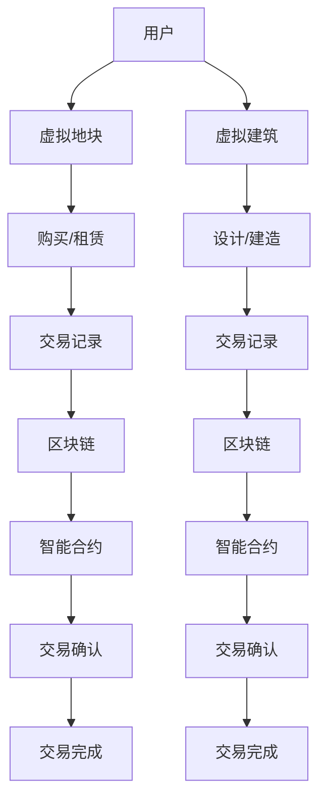
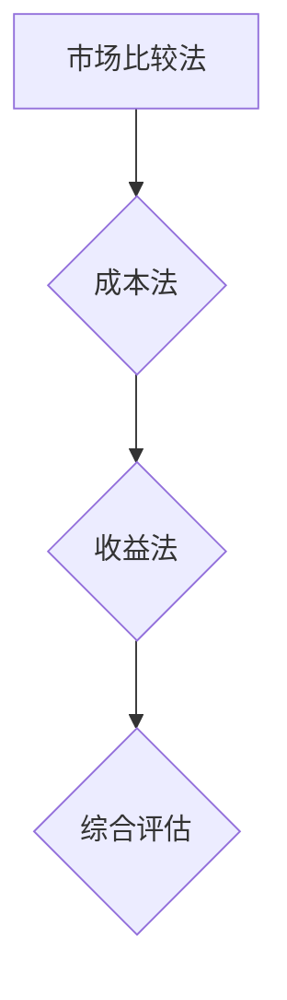
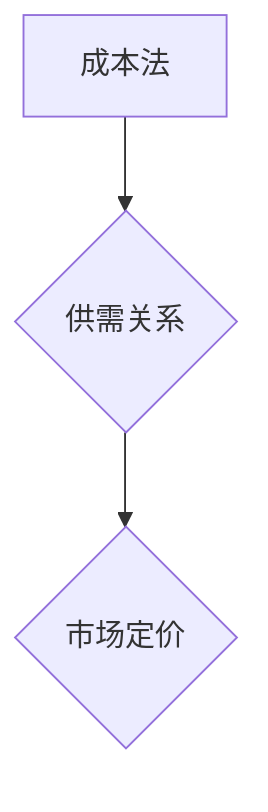
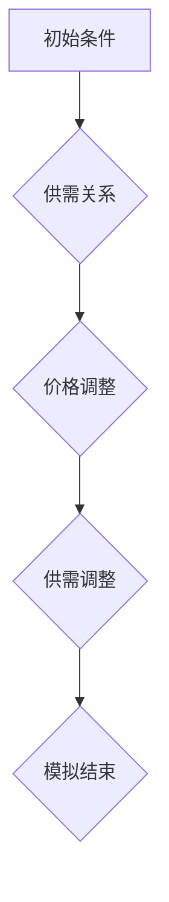
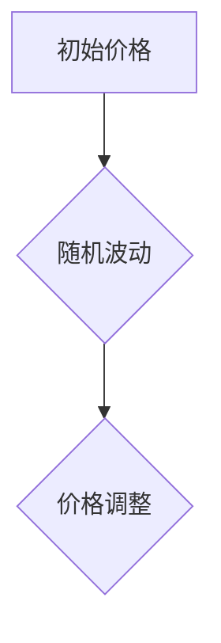
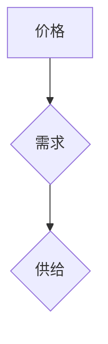
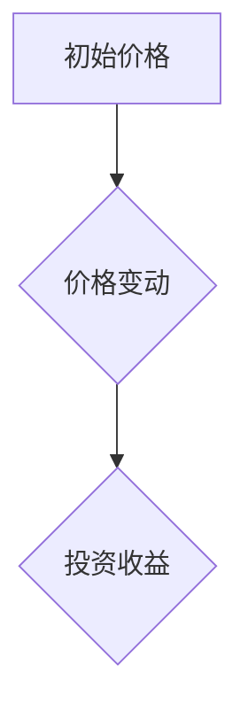

                 

### 文章标题：虚拟房地产：元宇宙中的资产新概念

#### 关键词：

- 元宇宙
- 虚拟房地产
- 区块链
- 虚拟现实
- 增强现实
- 社交互动
- 虚拟经济
- 知识产权保护

#### 摘要：

本文将深入探讨元宇宙中的虚拟房地产这一新兴资产概念。随着元宇宙的崛起，虚拟房地产正成为数字资产市场的重要组成部分。本文首先概述了元宇宙与虚拟房地产的发展背景，然后详细介绍了元宇宙的基础技术，如虚拟现实、增强现实、区块链等。接着，本文探讨了虚拟房地产的核心概念与架构，包括虚拟地块与虚拟建筑，以及虚拟房地产市场的机制、评估与定价方法。此外，本文还讨论了虚拟房地产的法律法规与政策问题，并提供了虚拟房地产项目开发的实战案例。最后，本文对虚拟房地产的未来发展趋势与挑战进行了展望，并提出了一些建议。

### 引言

随着互联网和科技的不断发展，数字世界正逐渐成为一个与物理世界同等重要的空间。元宇宙（Metaverse）正是这种趋势的象征，它是一个由多个虚拟世界构成的互联网络，用户可以在其中进行各种活动，包括社交、娱乐、工作和学习。元宇宙的兴起，不仅为互联网的进化提供了新的方向，也催生了新的经济模式，其中虚拟房地产成为了一个备受关注的新概念。

虚拟房地产指的是在元宇宙中的数字资产，它代表着用户在虚拟世界中的土地、建筑和其他财产。与传统的房地产不同，虚拟房地产不依赖于物理实体，而是基于数字技术和网络空间。然而，虚拟房地产同样具有价值、投资潜力以及市场流动性，这使得它成为了一个吸引投资者的领域。

本文将围绕虚拟房地产这一主题，进行深入探讨。首先，我们将介绍元宇宙的背景和发展，阐述虚拟房地产的兴起及其重要性。随后，我们将详细分析元宇宙中的基础技术，如虚拟现实（VR）、增强现实（AR）和区块链，并解释这些技术如何支持虚拟房地产的发展。接下来，本文将探讨虚拟房地产的核心概念与架构，包括虚拟地块、虚拟建筑以及虚拟房地产市场的运作机制。此外，本文还将讨论虚拟房地产的法律法规与政策问题，并提供一些虚拟房地产项目开发的实战案例。最后，本文将对虚拟房地产的未来发展趋势与挑战进行展望，并总结全文，提出一些建议。

通过本文的阅读，读者将能够全面了解虚拟房地产的概念、技术基础、市场机制及其潜在的法律和政策问题，从而对该领域有一个系统而深入的认识。

### 第一部分：元宇宙与虚拟房地产概述

#### 第1章：元宇宙与虚拟房地产概述

##### 1.1 元宇宙的兴起与虚拟房地产的重要性

元宇宙（Metaverse）是一个由多个虚拟世界构成的互联网络，它融合了增强现实（AR）、虚拟现实（VR）和区块链等前沿技术，旨在创建一个沉浸式的数字空间。这个数字空间不仅是人们进行社交、娱乐、工作和学习的平台，更是新兴数字经济的重要组成部分。元宇宙的概念最初由科幻作家尼尔·斯蒂芬森（Neal Stephenson）在1992年的小说《雪崩》（Snow Crash）中提出，但随着科技的进步，元宇宙逐渐从虚构的想象变成了现实。

元宇宙的兴起对虚拟房地产产生了深远影响。首先，虚拟房地产作为元宇宙中的数字资产，其价值受到了广泛的认可。用户可以在元宇宙中购买、出售、租赁和投资虚拟地块和建筑，这些交易活动不仅促进了虚拟经济的繁荣，也为现实世界中的金融市场提供了新的投资渠道。其次，虚拟房地产为用户提供了新的生活方式和社交体验。通过虚拟房地产，用户可以在一个虚拟的环境中拥有自己的“家园”，并在其中与全球用户互动，这为传统房地产市场带来了新的机遇和挑战。

##### 1.2 虚拟房地产的定义与分类

虚拟房地产是指在元宇宙中，用户通过数字技术和网络空间所拥有或控制的数字资产。这些资产可以包括虚拟地块、虚拟建筑、虚拟物品等。根据用途和形态，虚拟房地产可以大致分为以下几类：

1. **虚拟地块**：这是元宇宙中最基本的资产，类似于现实世界中的土地。用户可以购买、开发和出售虚拟地块，利用其位置和资源进行商业活动。
   
2. **虚拟建筑**：这些是用户在虚拟地块上建造的数字建筑，可以是住宅、商业大厦、酒店、博物馆等各种形态。虚拟建筑不仅是用户的“住所”，也可以成为商业实体的一部分。

3. **虚拟物品**：包括虚拟装饰品、家具、车辆、服装等，这些物品可以提升用户的虚拟形象，增加互动体验。

4. **虚拟品牌与店铺**：随着元宇宙的商业化进程，虚拟品牌和店铺成为虚拟房地产的一个重要组成部分。品牌可以通过虚拟店铺进行产品展示和销售，用户可以在虚拟世界中体验到现实世界中的购物体验。

##### 1.3 元宇宙中的虚拟房地产特点

虚拟房地产在元宇宙中具有以下特点：

1. **虚拟性**：虚拟房地产是数字化的产物，不存在于现实世界中，但它们在元宇宙中具有实际的经济和价值。

2. **稀缺性**：虚拟地块的稀缺性使得它们成为有价值的资产。类似现实世界的房地产，虚拟地块的供应是有限的，而需求则不断增长。

3. **可交易性**：虚拟房地产可以在元宇宙中进行买卖、租赁和交易，这为用户提供了灵活的投资和商业机会。

4. **灵活性**：虚拟房地产可以轻松改变其用途和形态，用户可以自由建造和改造自己的虚拟家园或商业实体。

5. **互动性**：虚拟房地产支持用户之间的互动和社交，用户可以在虚拟世界中建立社交网络，进行合作和交易。

##### 1.4 虚拟房地产的价值与前景

虚拟房地产作为元宇宙中的重要资产，具有巨大的潜在价值。以下是其前景和潜力：

1. **投资潜力**：随着元宇宙用户数量的增加，虚拟房地产的市场规模有望持续扩大，投资虚拟房地产有望获得可观的回报。

2. **商业机会**：虚拟房地产为各种商业模式提供了新的机会，包括虚拟零售、虚拟旅游、虚拟教育等。

3. **社会影响**：虚拟房地产改变了人们的社交方式和生活习惯，它将虚拟世界与现实世界更加紧密地联系在一起。

4. **技术创新**：虚拟房地产的发展推动了虚拟现实、增强现实和区块链等技术的创新和应用。

总之，虚拟房地产作为元宇宙中的新兴资产概念，不仅带来了新的经济模式，也为未来社会的发展提供了无限可能。随着技术的不断进步，虚拟房地产的价值和前景将愈发显著，它将成为数字经济的重要组成部分。

### 第二部分：元宇宙基础技术

#### 第2章：元宇宙基础技术

##### 2.1 虚拟现实与增强现实技术

虚拟现实（VR）和增强现实（AR）是元宇宙中不可或缺的基础技术。这两种技术通过模拟和增强现实环境，为用户提供沉浸式的体验，使得元宇宙中的互动和体验更加真实和丰富。

**虚拟现实（VR）**是一种完全沉浸式的技术，通过头戴式显示器（HMD）和跟踪设备，将用户封闭在一个虚拟环境中。用户通过手柄、手套或其他交互设备与虚拟世界进行互动，感受到如同现实世界的体验。虚拟现实技术广泛应用于游戏、娱乐、教育、医疗等领域，为用户提供了全新的互动方式。例如，在元宇宙中，用户可以通过VR设备购买并参观虚拟房地产，感受到建筑的空间布局和周围环境，从而做出更明智的购买决策。

**增强现实（AR）**则是在现实世界中叠加虚拟元素的技术。通过智能手机或平板电脑上的相机，用户可以看到虚拟对象与现实世界环境实时交互。增强现实技术常用于导航、购物、维修、教育和娱乐等方面。在元宇宙中，AR技术可以用于虚拟建筑的展示和导览，用户只需通过智能手机或AR眼镜，就能查看建筑的具体信息，甚至进行虚拟互动。

**技术原理**：

1. **VR技术原理**：
   - **渲染技术**：VR系统通过计算机生成三维图像，然后通过显示设备呈现给用户。
   - **感知同步**：VR系统需要实时跟踪用户的头部和手部运动，并相应地调整虚拟环境中的视角和对象位置，以保持沉浸感。
   - **交互设备**：用户通过手柄、手套或其他交互设备与虚拟世界进行交互，实现操作和控制。

2. **AR技术原理**：
   - **图像识别**：AR系统通过图像识别技术，识别现实世界中的物体和场景。
   - **叠加渲染**：将虚拟图像叠加到现实世界的摄像头视图中，实现虚拟元素与现实环境的融合。
   - **实时交互**：用户可以通过触摸屏幕或语音命令与虚拟元素进行实时互动。

**技术应用**：

- **游戏和娱乐**：VR和AR技术在游戏和娱乐领域的应用非常广泛，例如虚拟游戏、虚拟现实主题公园、AR游戏等。
- **教育和培训**：通过VR和AR技术，可以实现虚拟课堂、手术模拟、工业培训等，提高教育质量和培训效果。
- **商业展示**：虚拟现实和增强现实技术可以用于商业展示，如虚拟展会、虚拟商店等，提供沉浸式的购物体验。
- **城市规划与设计**：在元宇宙中，VR和AR技术可以帮助城市规划师和设计师进行虚拟建筑设计、模拟和评估。

##### 2.2 分布式账本技术（区块链）

分布式账本技术（Blockchain）是元宇宙中另一个重要的基础技术。区块链是一种去中心化的数据库，它通过多个节点共同维护和验证数据，确保数据的不可篡改性和透明性。区块链技术的核心特点是去中心化、安全性和不可篡改性，这使得它成为元宇宙中虚拟房地产等数字资产交易和管理的重要工具。

**技术原理**：

1. **去中心化**：区块链通过多个节点（计算机）共同维护账本，避免了单一中央机构的依赖，提高了系统的容错性和抗攻击能力。
2. **共识机制**：区块链采用共识机制（如工作量证明、权益证明等），确保所有节点对账本的一致性。
3. **加密算法**：区块链使用加密算法（如哈希算法、非对称加密等），确保数据的隐私性和安全性。
4. **智能合约**：区块链上的智能合约是自动执行合同条款的计算机程序，可以用于自动化交易和管理。

**技术优势**：

- **安全性**：区块链通过加密和共识机制确保数据的安全和隐私。
- **透明性**：区块链上的所有交易记录都是公开透明的，用户可以随时查看。
- **不可篡改性**：一旦数据被记录到区块链上，就几乎无法篡改，确保了数据的完整性和可靠性。
- **高效性**：去中心化的结构减少了中介环节，提高了交易效率。

**在元宇宙中的应用**：

- **虚拟房地产交易**：区块链可以用于记录和验证虚拟房地产的交易，确保交易的安全性和透明性。
- **数字身份认证**：区块链可以用于创建和管理用户的数字身份，提供安全可靠的身份认证服务。
- **虚拟货币**：区块链上的虚拟货币（如比特币、以太币等）为元宇宙中的交易提供了便捷的支付方式。
- **去中心化应用**（DApps）：区块链上的去中心化应用（DApps）为元宇宙提供了各种功能和服务，如虚拟购物、虚拟拍卖等。

##### 2.3 元宇宙中的社交互动与虚拟经济

元宇宙中的社交互动和虚拟经济是推动虚拟房地产发展的重要动力。社交互动使得用户可以在虚拟世界中建立社交网络，分享生活、工作和娱乐体验；虚拟经济则通过虚拟货币和交易系统，为用户提供了经济活动和价值交换的平台。

**社交互动**：

- **虚拟社区**：元宇宙中的虚拟社区为用户提供了一个共享兴趣和互动的空间。用户可以创建自己的虚拟家园、参加虚拟聚会、参加虚拟活动和会议等。
- **虚拟角色**：用户可以通过虚拟角色在元宇宙中展示自己的个性和风格，与其他用户互动和交流。
- **虚拟事件**：元宇宙中的虚拟活动，如虚拟音乐会、虚拟展览、虚拟发布会等，为用户提供了丰富多彩的社交体验。

**虚拟经济**：

- **虚拟货币**：虚拟货币是元宇宙中的交易媒介，用户可以使用虚拟货币购买虚拟房地产、虚拟物品和服务。
- **虚拟交易**：虚拟交易系统支持用户在元宇宙中进行各种交易活动，包括购买、出售、租赁和投资虚拟资产。
- **经济系统**：元宇宙中的经济系统通过供求关系、价格机制和市场竞争，调节虚拟资产的价值和流动。

**技术原理**：

1. **虚拟货币**：虚拟货币通过加密算法生成和分配，用户可以通过挖矿、交易和投资等方式获取和持有虚拟货币。
2. **交易系统**：交易系统通过区块链技术确保交易的透明性和安全性，用户可以在虚拟市场中进行买卖和支付。
3. **经济模型**：元宇宙中的经济模型通过供求关系和价格机制，调节虚拟资产的价值和流动。

**技术应用**：

- **虚拟房地产交易**：通过虚拟货币和区块链技术，用户可以在元宇宙中安全便捷地购买、出售和租赁虚拟房地产。
- **虚拟商品交易**：用户可以在元宇宙中购买和销售虚拟商品，如虚拟装饰品、虚拟家具等，这些商品可以通过虚拟交易系统进行交易。
- **虚拟金融服务**：元宇宙中的虚拟金融服务，如虚拟银行、虚拟保险、虚拟投资等，为用户提供全面的金融服务。
- **虚拟经济活动**：虚拟经济活动包括虚拟拍卖、虚拟抽奖、虚拟股票交易等，为用户提供了多种经济参与方式。

##### 2.4 元宇宙中的知识产权保护

在元宇宙中，知识产权保护成为一个重要的问题。虚拟房地产、虚拟商品和虚拟服务等都涉及到知识产权，如何保护这些知识产权，防止侵权和滥用，是元宇宙发展中必须解决的问题。

**知识产权保护**：

- **版权保护**：虚拟房地产和虚拟商品的设计、图像、音乐等都需要进行版权保护，确保原创者的权益。
- **商标保护**：虚拟品牌和虚拟商店的名称、标志等需要通过商标注册进行保护。
- **专利保护**：元宇宙中的创新技术、算法和系统可以通过专利保护，防止他人侵权。

**技术手段**：

1. **区块链**：区块链技术可以通过记录和验证知识产权的创建和转让，确保知识产权的透明性和不可篡改性。
2. **智能合约**：智能合约可以自动执行知识产权的许可和使用条款，确保知识产权的合法使用。
3. **非同质化代币**（NFT）：NFT技术可以用于记录和证明虚拟资产的唯一性和所有权，为知识产权保护提供了新的手段。

**技术应用**：

- **版权登记**：用户可以通过区块链技术进行版权登记，确保版权的合法性和可追溯性。
- **商标注册**：虚拟品牌可以通过传统商标注册和区块链技术结合，实现商标的全球保护和追溯。
- **专利申请**：创新技术和算法可以通过传统专利申请和区块链技术记录，提高专利的可靠性和权威性。
- **NFT认证**：NFT技术可以用于认证虚拟资产的所有权，确保虚拟资产的唯一性和稀缺性。

总之，元宇宙的基础技术，包括虚拟现实、增强现实、区块链、社交互动和虚拟经济，共同构建了一个沉浸式、去中心化、透明和安全的数字世界。这些技术不仅为虚拟房地产提供了坚实的基础，也为元宇宙的发展和创新提供了无限可能。通过深入了解这些基础技术，我们可以更好地理解虚拟房地产的概念、价值和未来发展趋势。

### 第三部分：虚拟房地产核心概念与架构

#### 第3章：虚拟房地产核心概念与架构

##### 3.1 虚拟地块与虚拟建筑

虚拟地块是元宇宙中虚拟房地产的基本组成部分，相当于现实世界中的土地。虚拟地块在元宇宙中通过数字技术进行定义和划分，每个地块都有唯一的标识符和地理坐标。虚拟地块可以是任何形状和大小，根据元宇宙的设定，它们可能位于虚拟城市、虚拟乡村或虚拟风景区等不同的区域。

**定义与划分**：

- **定义**：虚拟地块是指在元宇宙中，由数字技术定义和管理的数字土地。
- **划分**：虚拟地块通常根据其地理位置、资源分布和开发潜力进行划分。例如，一个虚拟城市可能包括商业区、住宅区、工业区等不同类型的地块。

**用途**：

- **商业开发**：虚拟地块可以用于建设虚拟商业大厦、购物中心、虚拟店铺等，为用户提供购物、娱乐和办公场所。
- **住宅建设**：虚拟地块可以用于建造虚拟住宅、别墅、公寓等，为用户提供居住空间。
- **公共设施**：虚拟地块可以用于建设虚拟公园、图书馆、学校等公共设施，提升虚拟城市的整体环境。

**虚拟建筑**：

虚拟建筑是用户在虚拟地块上建造的数字建筑，它们是元宇宙中的实体，类似于现实世界中的建筑物。虚拟建筑可以包括住宅、商业大厦、酒店、博物馆、办公楼等，其设计风格和功能可以根据用户的需求和元宇宙的设定进行定制。

**定义与特征**：

- **定义**：虚拟建筑是指在元宇宙中，由数字技术设计和建造的虚拟实体。
- **特征**：
  - **三维设计**：虚拟建筑具有三维空间结构，用户可以通过虚拟现实或增强现实技术进行参观和体验。
  - **交互性**：虚拟建筑支持用户互动，如参观、租赁、购买和改造等。
  - **可定制性**：虚拟建筑的设计和功能可以根据用户的需求进行定制和调整。

**用途**：

- **住宅用途**：虚拟建筑可以作为用户的虚拟住宅，提供居住、休息和私人空间。
- **商业用途**：虚拟建筑可以用于商业活动，如开设虚拟商店、办公室、会议室等。
- **公共用途**：虚拟建筑可以用于公共设施，如虚拟博物馆、图书馆、公园等，提供文化、教育和休闲服务。

##### 3.2 虚拟房地产市场的机制

虚拟房地产市场是元宇宙中虚拟房地产交易和管理的平台，它通过一系列机制和规则，确保市场的有序运行。虚拟房地产市场的机制包括市场规则、交易方式、定价机制和市场监管等。

**市场规则**：

- **透明性**：虚拟房地产市场要求所有交易记录公开透明，用户可以随时查看和验证。
- **公平性**：虚拟房地产市场通过去中心化的技术，确保所有用户在市场中享有平等的权利和机会。
- **合法性**：虚拟房地产市场要求所有交易符合元宇宙的法律法规，保护用户的合法权益。

**交易方式**：

- **在线交易**：用户可以通过元宇宙中的虚拟交易平台进行在线购买、出售和租赁虚拟房地产。
- **拍卖**：虚拟房地产市场可以通过在线拍卖进行交易，以竞价方式确定虚拟房地产的价格。
- **中介服务**：虚拟房地产中介机构提供交易咨询、价格评估和交易协调等服务，帮助用户顺利完成交易。

**定价机制**：

- **供需关系**：虚拟房地产的价格受供需关系的影响，供应稀缺的地块和建筑通常具有较高的价值。
- **市场评估**：虚拟房地产市场通过专业评估机构对虚拟房地产进行评估，确定其市场价值。
- **交易历史**：虚拟房地产的价格也会参考历史交易数据，反映市场趋势和用户需求。

**市场监管**：

- **监管机构**：元宇宙中的虚拟房地产市场通常设有监管机构，负责监管市场的运行和交易活动。
- **法律法规**：虚拟房地产市场需要遵守元宇宙的法律法规，确保交易的合法性和公正性。
- **智能合约**：智能合约可以自动执行交易规则和条款，确保交易的合规性和安全性。

##### 3.3 虚拟房地产的评估与定价

虚拟房地产的评估与定价是市场运作的核心环节，它关系到交易的成功和市场的稳定性。虚拟房地产的评估与定价方法多种多样，包括市场比较法、成本法和收益法等。

**市场比较法**：

市场比较法是通过比较类似虚拟房地产的市场交易案例，来确定其市场价值的方法。这种方法主要依赖于历史交易数据和市场趋势，适用于具有类似地理位置、规模和用途的虚拟房地产。

**成本法**：

成本法是根据虚拟房地产的开发成本来确定其市场价值的方法。这种方法适用于新建或即将开发的虚拟房地产，通过计算开发成本（如土地成本、建筑成本、维护成本等），来估算虚拟房地产的价值。

**收益法**：

收益法是根据虚拟房地产的未来收益来确定其市场价值的方法。这种方法适用于经营性虚拟房地产，如商业大厦、酒店等，通过计算未来的租金收入、经营收入等，来估算虚拟房地产的价值。

**评估与定价流程**：

1. **信息收集**：收集虚拟房地产的详细信息，包括地理位置、规模、用途、市场趋势等。
2. **市场调研**：通过市场调研，获取类似虚拟房地产的交易案例和价格信息。
3. **评估方法选择**：根据虚拟房地产的特点和市场条件，选择合适的评估方法。
4. **计算与比较**：根据评估方法，计算虚拟房地产的价值，并进行比较和调整。
5. **定价确定**：根据评估结果和市场情况，确定虚拟房地产的市场价格。

##### 3.4 元宇宙中的虚拟地产投资策略

虚拟地产投资策略是用户在元宇宙中投资虚拟房地产的方法和策略，它关系到投资的风险和收益。以下是一些常见的虚拟地产投资策略：

**长线投资**：

长线投资是指投资者持有一段时间，等待虚拟房地产的价值上涨后再出售，以获取长期回报。这种方法适用于有充足资金和长期投资目标的用户，风险较低但收益也可能较低。

**短线交易**：

短线交易是指投资者通过频繁买卖虚拟房地产，利用价格波动获取短期利润。这种方法需要投资者具备较高的市场敏感性和操作能力，风险较高但收益也可能较高。

**价值投资**：

价值投资是指投资者通过分析虚拟房地产的基本面和市场趋势，选择具有较高投资价值的虚拟房地产进行投资。这种方法适用于有研究能力和长期投资视角的用户。

**投机性投资**：

投机性投资是指投资者利用市场的不确定性和信息不对称，通过投机手段获取高额回报。这种方法风险极高，需要投资者具备较高的市场洞察力和风险承受能力。

**投资策略选择**：

投资者应根据自己的投资目标、风险偏好和市场情况，选择合适的投资策略。例如，对于初入元宇宙市场的用户，可以选择长线投资和价值投资，以稳健的方式积累财富。而对于有经验和市场敏感性的用户，可以尝试短线交易和投机性投资，追求更高的收益。

总之，虚拟房地产作为元宇宙中的重要资产，其核心概念和架构为用户提供了丰富的投资机会和生活方式。通过了解虚拟地块、虚拟建筑、虚拟房地产市场的机制以及评估与定价方法，用户可以更好地进行虚拟地产投资，实现财富增值和虚拟生活体验的全面提升。

### 第四部分：虚拟房地产的法律法规与政策

#### 第4章：虚拟房地产的法律法规与政策

##### 4.1 虚拟房地产的法律法规现状

随着元宇宙和虚拟房地产的快速发展，各国政府开始关注这一新兴领域，并逐步建立相关法律法规，以规范虚拟房地产的交易和投资行为。目前，虚拟房地产的法律法规现状呈现出以下特点：

1. **立法进程**：许多国家已经开始了虚拟房地产相关立法工作，制定或修订了相关法律法规。例如，美国、欧盟、新加坡等国家已出台了一些政策和法规，对虚拟房地产进行了初步规范。

2. **法律框架**：虚拟房地产法律法规主要涉及虚拟财产权、交易规则、税务政策、知识产权保护等方面。这些法律框架旨在确保虚拟房地产交易的安全性和透明性，保护用户的合法权益。

3. **监管机构**：许多国家设立了专门的监管机构，负责虚拟房地产市场的监管。例如，美国证券交易委员会（SEC）对虚拟货币交易进行监管，欧盟则设立了数字市场委员会（DMC）负责虚拟房地产的监管。

4. **跨境合作**：虚拟房地产作为跨国资产，其交易和投资行为涉及到不同国家的法律法规。因此，各国政府之间需要加强合作，共同制定跨境监管规则，以确保虚拟房地产市场的稳定和有序。

##### 4.2 虚拟房地产政策的发展趋势

虚拟房地产政策的发展趋势主要表现在以下几个方面：

1. **规范化**：随着虚拟房地产市场的不断壮大，各国政府将逐步完善相关法律法规，加强对虚拟房地产交易的监管，确保市场的公平、透明和有序。

2. **技术创新**：政府将鼓励和支持虚拟现实、区块链等技术的创新和应用，推动虚拟房地产的发展。例如，通过区块链技术确保虚拟房地产交易的安全性和透明性，提高交易效率。

3. **税务改革**：政府将考虑对虚拟房地产交易实施新的税务政策，以适应虚拟经济的特点。例如，对虚拟房地产交易征税，并制定相应的税收优惠和减免政策。

4. **跨境合作**：政府将加强国际合作，共同应对虚拟房地产交易中的跨境法律问题。通过签订国际协定，建立跨国监管机制，确保虚拟房地产市场的稳定和有序。

##### 4.3 跨境虚拟房地产交易的法律问题

跨境虚拟房地产交易面临着一系列法律问题，主要包括以下几个方面：

1. **法律冲突**：不同国家的法律法规对虚拟房地产交易的规定可能存在差异，导致法律冲突。例如，关于虚拟房地产的物权界定、交易规则、税务政策等方面，各国法律可能存在不一致。

2. **跨境监管**：跨境虚拟房地产交易涉及到不同国家的监管机构，监管标准和监管手段可能存在差异，导致跨境监管的困难。例如，一个国家的监管机构可能要求进行严格的信息披露，而另一个国家的监管机构可能对此要求较低。

3. **税务问题**：跨境虚拟房地产交易涉及到不同国家的税务政策，可能导致税务纠纷。例如，如何确定虚拟房地产交易的收入来源、如何计算和缴纳相关税费等，都可能引发法律问题。

4. **知识产权保护**：虚拟房地产中的知识产权（如虚拟建筑的设计、虚拟品牌的标志等）在不同国家可能受到不同的法律保护。跨境虚拟房地产交易需要确保知识产权的合法使用和保护。

##### 4.4 虚拟房地产纠纷的解决机制

虚拟房地产纠纷的解决机制主要包括以下几个方面：

1. **调解**：通过调解方式解决虚拟房地产纠纷，可以有效减少诉讼成本和时间。调解机构可以提供中立的调解服务，帮助双方达成和解。

2. **仲裁**：仲裁是解决虚拟房地产纠纷的另一种有效方式。虚拟房地产仲裁机构应具备专业知识和国际视野，确保仲裁结果的公正和有效。

3. **诉讼**：当调解和仲裁无法解决纠纷时，诉讼成为最后的解决途径。虚拟房地产纠纷的诉讼应遵循国际通行的法律原则和程序，确保公正和公平。

4. **国际合作**：解决虚拟房地产纠纷需要各国政府和国际组织的合作。通过签订国际协定、建立跨国法律合作机制，可以更好地应对跨境虚拟房地产交易中的法律问题。

总之，虚拟房地产的法律法规和政策体系正处于不断完善和发展阶段。通过规范化和国际合作，虚拟房地产交易将更加安全、透明和有序，为元宇宙的繁荣和发展提供有力支持。

### 第五部分：虚拟房地产项目实战

#### 第5章：虚拟房地产项目开发流程

##### 5.1 项目需求分析

项目需求分析是虚拟房地产项目开发的第一步，它确定了项目的目标和功能需求。在元宇宙中，虚拟房地产项目通常包括以下几个方面：

1. **项目目标**：明确项目的发展方向和目标，如建设虚拟城市、虚拟商业区或虚拟住宅区等。
2. **功能需求**：根据项目目标，列出具体的功能需求，如地块购买与租赁、虚拟建筑设计与建造、虚拟交易与支付等。
3. **用户体验**：分析用户在虚拟房地产中的需求和体验，如虚拟参观、互动、交易等。
4. **技术要求**：确定所需的技术支持，包括虚拟现实、增强现实、区块链等技术的应用。

##### 5.2 技术架构设计与选型

技术架构设计是虚拟房地产项目成功的关键。以下是一些常见的技术架构设计与选型：

1. **前端技术**：
   - **虚拟现实（VR）**：使用Unity、Unreal Engine等游戏引擎进行虚拟环境的构建和渲染。
   - **增强现实（AR）**：使用ARKit、ARCore等AR开发框架，实现虚拟元素与现实环境的叠加。
2. **后端技术**：
   - **区块链**：使用Ethereum、Solana等区块链平台，确保虚拟房地产交易的安全和透明。
   - **数据库**：使用MongoDB、MySQL等数据库，存储虚拟地块和建筑信息。
3. **交互设计**：
   - **用户界面（UI）**：设计直观、易用的用户界面，提高用户体验。
   - **用户体验（UX）**：通过用户研究，优化虚拟环境的交互流程和操作方式。

##### 5.3 开发环境搭建

开发环境搭建是虚拟房地产项目开发的基础。以下是一些关键步骤：

1. **硬件配置**：确保开发所需的计算机硬件和设备，如VR头戴设备、AR眼镜等。
2. **软件安装**：安装Unity、Unreal Engine、Ethereum Wallet等开发工具和平台。
3. **网络环境**：搭建稳定的网络环境，确保虚拟环境的实时交互和数据处理。
4. **版本控制**：使用Git等版本控制工具，管理项目代码和文档，确保团队协作和版本更新。

##### 5.4 项目测试与部署

项目测试与部署是虚拟房地产项目开发的重要环节。以下是一些关键步骤：

1. **单元测试**：编写单元测试用例，对项目中的各个模块进行测试，确保功能正确。
2. **集成测试**：将各个模块整合，进行集成测试，确保系统的稳定性和兼容性。
3. **性能测试**：对系统进行性能测试，确保在高并发环境下仍能稳定运行。
4. **部署上线**：将项目部署到服务器，通过云平台或虚拟主机提供服务。
5. **运维监控**：监控系统的运行状况，及时处理异常和故障，确保服务的连续性和稳定性。

通过以上步骤，虚拟房地产项目可以顺利开发、测试和部署，为用户提供高质量的虚拟房地产体验。

#### 第6章：虚拟房地产项目实战案例

##### 6.1 虚拟房地产项目案例介绍

在本章中，我们将介绍三个虚拟房地产项目案例，分别是虚拟城市项目、虚拟房地产投资平台和虚拟房地产租赁平台。这些案例涵盖了虚拟房地产项目开发的各个方面，包括需求分析、技术架构设计、开发环境搭建、项目测试与部署等。通过这些案例，读者可以深入了解虚拟房地产项目的实际操作过程，并学习到宝贵的实战经验。

##### 案例一：虚拟城市项目开发

虚拟城市项目是一个综合性的虚拟房地产项目，旨在创建一个虚拟城市，为用户提供居住、工作和娱乐的场所。项目的主要目标包括：

1. **用户需求分析**：了解用户在虚拟城市中的需求，包括住宅、商业、公共设施等。
2. **功能设计**：设计虚拟城市的功能模块，如虚拟住宅、虚拟商业区、虚拟公园等。
3. **技术选型**：采用Unity游戏引擎进行虚拟环境的构建和渲染，使用Ethereum区块链技术确保交易的安全和透明。

##### 案例二：虚拟房地产投资平台

虚拟房地产投资平台是一个在线交易系统，旨在为用户提供虚拟房地产投资的机会。项目的主要目标包括：

1. **用户需求分析**：了解用户在虚拟房地产投资中的需求，包括投资策略、交易方式、风险控制等。
2. **功能设计**：设计虚拟房地产投资平台的功能模块，如虚拟房地产交易、投资组合管理、市场分析等。
3. **技术选型**：采用Ethereum区块链技术进行虚拟房地产交易记录的存储和管理，使用Web3.js库进行前端与区块链的交互。

##### 案例三：虚拟房地产租赁平台

虚拟房地产租赁平台是一个在线租赁系统，旨在为用户提供虚拟房地产租赁服务。项目的主要目标包括：

1. **用户需求分析**：了解用户在虚拟房地产租赁中的需求，包括租赁期限、租金支付、租赁合同等。
2. **功能设计**：设计虚拟房地产租赁平台的功能模块，如虚拟房地产租赁、在线支付、租赁合同管理等。
3. **技术选型**：采用Ethereum区块链技术进行租赁合同的存储和执行，使用Web3.js库进行前端与区块链的交互。

通过这三个虚拟房地产项目案例，读者可以了解虚拟房地产项目开发的完整过程，从需求分析到功能设计，再到技术选型和实际操作，全面掌握虚拟房地产项目的开发方法。

##### 案例一：虚拟城市项目开发

虚拟城市项目是一个综合性虚拟房地产项目，旨在创建一个虚拟城市，为用户提供沉浸式的居住、工作和娱乐体验。该项目涵盖了多个模块，包括虚拟地块管理、虚拟建筑开发、用户互动平台等。以下是该项目的详细开发过程：

**1. 需求分析**

在虚拟城市项目开始前，我们对用户进行了深入的需求分析。用户的需求主要集中在以下几个方面：

- **住宅需求**：用户需要一个舒适的居住环境，包括不同类型的住宅建筑，如公寓、别墅等。
- **商业需求**：用户需要一个能够满足购物、餐饮、娱乐等需求的商业区域。
- **公共设施**：用户需要一个提供教育、医疗、文化等公共服务的区域。
- **互动体验**：用户希望在虚拟城市中与其他用户进行互动，包括社交、协作和交易等。

**2. 功能设计**

根据需求分析，我们设计了以下几个核心功能模块：

- **虚拟地块管理**：用于管理虚拟地块的分配、交易和开发。用户可以购买和出售虚拟地块，并根据需要进行开发和规划。
- **虚拟建筑开发**：用于开发和管理虚拟建筑，包括住宅、商业建筑和公共设施。用户可以根据需求设计和建造各种类型的建筑。
- **用户互动平台**：用于用户之间的互动和社交，包括在线聊天、社交网络、虚拟活动等。

**3. 技术选型**

为了实现虚拟城市项目的目标，我们选择了以下技术：

- **虚拟现实（VR）**：使用Unity游戏引擎进行虚拟环境的构建和渲染，为用户提供沉浸式的体验。
- **区块链**：使用Ethereum区块链技术进行虚拟地块和建筑的所有权验证和交易记录的存储，确保数据的安全和透明。
- **前端技术**：使用React和Web3.js库进行前端开发，实现用户界面和区块链交互。

**4. 开发环境搭建**

在开发环境搭建方面，我们进行了以下工作：

- **硬件配置**：配置了多台高性能服务器和VR设备，确保项目的运行效率。
- **软件安装**：安装了Unity、Ethereum节点和相关的开发工具，搭建了开发环境和测试环境。
- **网络环境**：搭建了稳定且安全的网络环境，确保数据的传输和存储。

**5. 项目测试与部署**

在项目开发过程中，我们进行了多次测试，以确保系统的稳定性和功能完整性：

- **单元测试**：编写了多个单元测试用例，对虚拟地块管理、虚拟建筑开发等模块进行了功能测试。
- **集成测试**：将各个模块整合，进行了集成测试，确保系统的整体稳定性和兼容性。
- **性能测试**：对系统进行了性能测试，确保在高并发环境下仍能稳定运行。

在项目测试通过后，我们将系统部署到了服务器，并进行了上线发布。同时，我们还设置了运维监控，实时监控系统的运行状况，确保服务的连续性和稳定性。

**6. 项目小结**

虚拟城市项目开发成功，为用户提供了一个沉浸式的虚拟房地产体验。通过该项目，我们积累了丰富的开发经验，包括需求分析、功能设计、技术选型、环境搭建和测试部署等。在未来的发展中，我们将继续优化项目，提升用户体验，探索更多创新应用。

##### 案例二：虚拟房地产投资平台

虚拟房地产投资平台是一个在线交易系统，旨在为用户提供虚拟房地产投资的机会。该平台的主要功能包括虚拟房地产交易、投资组合管理、市场分析等。以下是该平台的详细开发过程：

**1. 需求分析**

在开发虚拟房地产投资平台前，我们对用户进行了深入的需求分析。用户的需求主要集中在以下几个方面：

- **交易需求**：用户需要一个便捷的虚拟房地产交易系统，支持在线购买、出售和租赁。
- **投资管理**：用户需要一个可以查看和管理投资组合的工具，包括投资记录、收益情况等。
- **市场分析**：用户需要一个提供市场信息和分析的工具，帮助他们做出投资决策。

**2. 功能设计**

根据需求分析，我们设计了以下几个核心功能模块：

- **虚拟房地产交易**：用于用户进行虚拟房地产的买卖和租赁，包括交易列表、拍卖系统等。
- **投资组合管理**：用于用户管理投资组合，包括添加、删除、修改投资记录等。
- **市场分析**：用于提供市场信息和分析报告，帮助用户做出投资决策。

**3. 技术选型**

为了实现虚拟房地产投资平台的目标，我们选择了以下技术：

- **区块链**：使用Ethereum区块链技术进行虚拟房地产交易记录的存储和管理，确保数据的安全和透明。
- **前端技术**：使用React和Web3.js库进行前端开发，实现用户界面和区块链交互。
- **数据库**：使用MongoDB存储用户数据、交易记录和市场信息。

**4. 开发环境搭建**

在开发环境搭建方面，我们进行了以下工作：

- **硬件配置**：配置了多台高性能服务器和数据库服务器，确保项目的运行效率。
- **软件安装**：安装了Ethereum节点、MongoDB数据库和相关开发工具，搭建了开发环境和测试环境。
- **网络环境**：搭建了稳定且安全的网络环境，确保数据的传输和存储。

**5. 项目测试与部署**

在项目开发过程中，我们进行了多次测试，以确保系统的稳定性和功能完整性：

- **单元测试**：编写了多个单元测试用例，对虚拟房地产交易、投资组合管理、市场分析等模块进行了功能测试。
- **集成测试**：将各个模块整合，进行了集成测试，确保系统的整体稳定性和兼容性。
- **性能测试**：对系统进行了性能测试，确保在高并发环境下仍能稳定运行。

在项目测试通过后，我们将系统部署到了服务器，并进行了上线发布。同时，我们还设置了运维监控，实时监控系统的运行状况，确保服务的连续性和稳定性。

**6. 项目小结**

虚拟房地产投资平台开发成功，为用户提供了一个便捷的在线投资平台，帮助他们进行虚拟房地产交易和管理。通过该项目，我们积累了丰富的开发经验，包括需求分析、功能设计、技术选型、环境搭建和测试部署等。在未来的发展中，我们将继续优化项目，提升用户体验，探索更多创新应用。

##### 案例三：虚拟房地产租赁平台

虚拟房地产租赁平台是一个在线租赁系统，旨在为用户提供虚拟房地产租赁服务。该平台的主要功能包括虚拟房地产租赁、在线支付、租赁合同管理等。以下是该平台的详细开发过程：

**1. 需求分析**

在开发虚拟房地产租赁平台前，我们对用户进行了深入的需求分析。用户的需求主要集中在以下几个方面：

- **租赁需求**：用户需要一个便捷的虚拟房地产租赁系统，支持在线租赁、租金支付等。
- **租赁管理**：用户需要一个可以管理租赁合同和租赁信息的工具，包括租赁记录、租金支付记录等。
- **安全性与可靠性**：用户需要一个安全可靠的租赁平台，确保租赁过程中的数据和资金安全。

**2. 功能设计**

根据需求分析，我们设计了以下几个核心功能模块：

- **虚拟房地产租赁**：用于用户进行虚拟房地产的租赁，包括查看租赁列表、发起租赁请求、租赁合同生成等。
- **在线支付**：用于用户在线支付租金，包括支付方式选择、支付确认等。
- **租赁合同管理**：用于管理租赁合同和租赁信息，包括合同生成、合同查看、合同修改等。

**3. 技术选型**

为了实现虚拟房地产租赁平台的目标，我们选择了以下技术：

- **区块链**：使用Ethereum区块链技术进行租赁合同的存储和执行，确保数据的安全和透明。
- **前端技术**：使用React和Web3.js库进行前端开发，实现用户界面和区块链交互。
- **数据库**：使用MongoDB存储用户数据、租赁记录和租赁合同。

**4. 开发环境搭建**

在开发环境搭建方面，我们进行了以下工作：

- **硬件配置**：配置了多台高性能服务器和数据库服务器，确保项目的运行效率。
- **软件安装**：安装了Ethereum节点、MongoDB数据库和相关开发工具，搭建了开发环境和测试环境。
- **网络环境**：搭建了稳定且安全的网络环境，确保数据的传输和存储。

**5. 项目测试与部署**

在项目开发过程中，我们进行了多次测试，以确保系统的稳定性和功能完整性：

- **单元测试**：编写了多个单元测试用例，对虚拟房地产租赁、在线支付、租赁合同管理等模块进行了功能测试。
- **集成测试**：将各个模块整合，进行了集成测试，确保系统的整体稳定性和兼容性。
- **性能测试**：对系统进行了性能测试，确保在高并发环境下仍能稳定运行。

在项目测试通过后，我们将系统部署到了服务器，并进行了上线发布。同时，我们还设置了运维监控，实时监控系统的运行状况，确保服务的连续性和稳定性。

**6. 项目小结**

虚拟房地产租赁平台开发成功，为用户提供了一个便捷的在线租赁平台，帮助他们进行虚拟房地产租赁和管理。通过该项目，我们积累了丰富的开发经验，包括需求分析、功能设计、技术选型、环境搭建和测试部署等。在未来的发展中，我们将继续优化项目，提升用户体验，探索更多创新应用。

### 第六部分：虚拟房地产未来发展趋势与挑战

#### 第7章：虚拟房地产未来发展趋势与挑战

##### 7.1 虚拟房地产的发展趋势

虚拟房地产作为元宇宙中的核心资产，正迎来一系列发展趋势，这些趋势不仅推动了虚拟房地产市场的壮大，也为其未来发展提供了新的机遇。

1. **市场规模扩大**：随着元宇宙用户数量的增加和技术的进步，虚拟房地产的市场规模有望持续扩大。根据市场研究机构的预测，虚拟房地产市场在未来几年内将保持高速增长，成为数字经济的重要组成部分。

2. **技术进步**：虚拟现实（VR）、增强现实（AR）、区块链等基础技术的不断进步，将进一步提升虚拟房地产的沉浸式体验和交易效率。更先进的VR和AR设备将提供更真实的虚拟环境，而更高效的区块链技术将保障虚拟房地产交易的安全性和透明性。

3. **投资机会增多**：虚拟房地产的投资机会将不断增多，不仅限于个人用户，还吸引了众多机构和投资者的关注。虚拟房地产基金、虚拟房地产交易平台等新兴金融工具将为投资者提供更多选择。

4. **应用场景丰富**：虚拟房地产的应用场景将更加丰富，包括虚拟购物、虚拟旅游、虚拟教育、虚拟办公等。这些应用将推动虚拟房地产的需求增长，并创造新的商业模式。

5. **政策支持**：各国政府逐渐认识到虚拟房地产的重要性，将出台更多政策支持其发展。例如，制定相关的法律法规，规范虚拟房地产交易，提供税务优惠等。

##### 7.2 虚拟房地产面临的挑战

尽管虚拟房地产具有巨大的发展潜力，但其在实际发展中仍面临诸多挑战，这些挑战涉及技术、法律、市场和社会等多个方面。

1. **技术挑战**：虚拟房地产的发展依赖于先进的技术，如VR、AR和区块链。这些技术的研发和应用仍存在一定的局限性，如设备的性能、网络带宽和用户体验等。技术的不足可能影响虚拟房地产的普及和用户体验。

2. **法律问题**：虚拟房地产的法律地位和产权保护问题尚未完全明确。不同国家对于虚拟房地产的法律法规存在差异，跨境交易的法律冲突更加突出。这些问题可能导致虚拟房地产交易的法律风险和不确定性。

3. **市场风险**：虚拟房地产市场的不稳定性是一个重大挑战。虚拟房地产的价格波动较大，投资风险较高。此外，虚拟房地产市场的投机行为也可能导致市场泡沫，影响市场的健康发展。

4. **社会接受度**：虚拟房地产作为一种新兴概念，其社会接受度尚未完全建立。部分用户对于虚拟房地产的认知和接受程度有限，这限制了虚拟房地产市场的扩展。

5. **监管不足**：虚拟房地产市场的监管尚不完善，存在监管漏洞和盲区。缺乏有效的监管可能导致市场乱象，影响市场的稳定性和用户的合法权益。

##### 7.3 虚拟房地产的未来机遇

面对挑战，虚拟房地产同样拥有诸多机遇，这些机遇将推动其未来发展。

1. **技术创新**：随着技术的不断进步，虚拟房地产将迎来更多创新应用。例如，虚拟现实和增强现实技术的提升将带来更真实的虚拟体验，区块链技术的应用将提升交易的安全性和透明性。

2. **市场拓展**：虚拟房地产的市场将逐渐向全球扩展。随着各国政府和企业的参与，虚拟房地产市场将更加成熟，吸引更多用户和投资者的关注。

3. **政策支持**：各国政府逐渐认识到虚拟房地产的重要性，将出台更多支持政策。例如，提供税收优惠、简化交易手续等，这将促进虚拟房地产的发展。

4. **用户需求**：随着元宇宙的普及，用户对虚拟房地产的需求将不断增长。虚拟房地产将为用户提供全新的生活和工作方式，满足他们的多样化需求。

5. **合作与共赢**：虚拟房地产的发展需要各方的合作与共赢。例如，房地产开发商、科技公司、金融机构等可以通过合作，共同推动虚拟房地产的发展。

##### 7.4 虚拟房地产的发展建议

为了应对挑战和抓住机遇，虚拟房地产的发展需要各方共同努力，以下是一些建议：

1. **技术创新**：加大技术研发投入，推动虚拟现实、增强现实和区块链等技术的进步，提升虚拟房地产的体验和交易效率。

2. **法律法规**：完善虚拟房地产的法律法规体系，明确虚拟房地产的法律地位和产权保护，确保市场的公平和透明。

3. **市场培育**：通过宣传和推广，提高用户对虚拟房地产的认知和接受度，培育成熟的市场环境。

4. **监管加强**：加强虚拟房地产市场的监管，建立有效的监管机制，防范市场风险和违法行为。

5. **合作共赢**：促进各方合作，共同推动虚拟房地产的发展。例如，房地产开发商可以与科技公司合作，共同开发虚拟房地产项目。

6. **用户体验**：注重用户体验，提升虚拟房地产的易用性和沉浸感，满足用户的多样化需求。

总之，虚拟房地产作为元宇宙中的新兴资产概念，具有广阔的发展前景和巨大的潜力。通过技术创新、法律法规完善和市场培育等手段，我们可以更好地应对挑战，抓住机遇，推动虚拟房地产的健康发展。

### 附录

#### 附录A：虚拟房地产相关资源与工具

**A.1 元宇宙开发工具与平台**

- **Unity**：Unity是一个流行的游戏和虚拟现实开发平台，支持3D建模、动画、物理模拟和实时渲染等功能。
- **Unreal Engine**：Unreal Engine是另一个强大的游戏和虚拟现实开发平台，以其高质量的视觉效果和先进的渲染技术而闻名。
- **Blender**：Blender是一个开源的三维建模和动画软件，适用于创建虚拟场景和建筑。
- **Ethereum**：Ethereum是一个去中心化的区块链平台，支持智能合约和去中心化应用（DApps），适用于虚拟房地产交易和管理。
- **Solana**：Solana是一个高性能的区块链平台，适用于快速、低成本的虚拟房地产交易。

**A.2 虚拟房地产交易市场**

- **Decentraland**：Decentraland是一个基于Ethereum区块链的虚拟世界，用户可以购买和出售虚拟地块。
- **The Sandbox**：The Sandbox是一个基于区块链的虚拟游戏平台，用户可以购买和开发虚拟地块和建筑。
- **Axie Infinity**：Axie Infinity是一个基于Ethereum区块链的虚拟游戏平台，用户可以购买和交易虚拟房地产。

**A.3 虚拟房地产法律法规资料**

- **美国证券交易委员会（SEC）**：SEC提供了关于虚拟货币和数字资产交易的法律法规信息。
- **欧盟数字市场委员会（DMC）**：DMC发布了关于虚拟房地产和数字资产交易的法规和政策。
- **中国区块链技术和产业发展论坛**：论坛提供了关于区块链技术和虚拟房地产的讨论和研究报告。

**A.4 虚拟房地产行业报告与研究报告**

- **IDC**：IDC发布了关于虚拟房地产和元宇宙的市场研究报告，提供了市场趋势和预测。
- **Gartner**：Gartner发布了关于虚拟房地产和数字资产投资的研究报告，提供了行业分析和建议。
- **CoinDesk**：CoinDesk发布了关于虚拟货币和区块链技术的最新动态和研究报告。

#### 附录B：核心概念与架构 Mermaid 流程图

以下是一个Mermaid流程图，展示了虚拟房地产交易的核心概念与架构：



这个流程图简要展示了用户购买或租赁虚拟地块、虚拟建筑，以及相关交易记录在区块链和智能合约中的处理过程。

#### 附录C：虚拟房地产核心算法原理与伪代码

**C.1 虚拟房地产评估模型**

虚拟房地产评估模型用于估算虚拟地块或建筑的价值。以下是一个简化的评估模型：



**伪代码：**

```python
def virtual_property_evaluation(method, data):
    if method == "market_comparision":
        return market_comparision_value(data)
    elif method == "cost":
        return cost_based_value(data)
    elif method == "income":
        return income_based_value(data)
    else:
        return composite_evaluation(data)

def market_comparision_value(data):
    # 计算市场比较法评估值
    return (average_price_of_comparable_properties * data['size'])

def cost_based_value(data):
    # 计算成本法评估值
    return (land_cost + construction_cost)

def income_based_value(data):
    # 计算收益法评估值
    return (annual_income / discount_rate)
```

**C.2 虚拟地块定价算法**

虚拟地块定价算法用于计算虚拟地块的市场价格。以下是一个简化的定价算法：



**伪代码：**

```python
def virtual_land_pricing(cost, demand, supply):
    if demand > supply:
        price = (cost * (1 + demand_surplus_margin))
    else:
        price = cost
    return price
```

**C.3 虚拟房地产市场模拟算法**

虚拟房地产市场模拟算法用于模拟虚拟房地产市场的价格波动和供需变化。以下是一个简化的模拟算法：



**伪代码：**

```python
def market_simulation(initial_conditions, simulation_time):
    for time in range(simulation_time):
        supply = initial_conditions['supply']
        demand = initial_conditions['demand']
        price = initial_conditions['price']
        
        # 价格调整
        price = price * (1 + price_change_rate)
        
        # 供需调整
        supply = supply * (1 + supply_change_rate)
        demand = demand * (1 + demand_change_rate)
        
        # 记录当前时间点的市场状态
        market_state = {
            'time': time,
            'price': price,
            'supply': supply,
            'demand': demand
        }
        print(market_state)
        
    return market_state
```

#### 附录D：数学模型与公式详解

**D.1 虚拟房地产价格波动模型**

虚拟房地产价格波动模型用于模拟虚拟房地产价格的随机波动。以下是一个简化的波动模型：



**伪代码：**

```python
import random

def virtual_property_price_wave(price, volatility, time):
    for t in range(time):
        price = price + random.uniform(-volatility, volatility)
    return price
```

**D.2 虚拟房地产供需模型**

虚拟房地产供需模型用于分析虚拟房地产的供需关系。以下是一个简化的供需模型：



**伪代码：**

```python
def demand_function(price, price Elasticity, initial_demand):
    return initial_demand * (1 - price Elasticity * (price - base_price))

def supply_function(price, price Elasticity, initial_supply):
    return initial_supply * (1 + price Elasticity * (price - base_price))
```

**D.3 虚拟房地产投资收益模型**

虚拟房地产投资收益模型用于计算虚拟房地产投资的收益。以下是一个简化的投资收益模型：



**伪代码：**

```python
def investment_returns(initial_price, final_price, investment_amount):
    return (final_price - initial_price) * investment_amount
```

#### 附录E：虚拟房地产项目代码解读与分析

**E.1 虚拟城市项目源代码解读**

以下是一个简单的虚拟城市项目源代码，用于管理虚拟地块和建筑：

```python
class VirtualCity:
    def __init__(self, land_area, building_area):
        self.land_area = land_area
        self.building_area = building_area

    def build_building(self, building_type, building_area):
        if building_area <= self.building_area:
            self.building_area -= building_area
            return True
        else:
            return False

    def sell_building(self, building_area, price):
        if building_area <= self.building_area:
            self.building_area -= building_area
            self.land_area += building_area
            return price
        else:
            return 0
```

**代码解读**：

- `__init__` 方法：初始化虚拟城市，包括地块面积（`land_area`）和建筑面积（`building_area`）。
- `build_building` 方法：用于建造虚拟建筑，如果建筑面积不超过剩余建筑面积，则建造成功并返回True，否则返回False。
- `sell_building` 方法：用于出售虚拟建筑，如果建筑面积不超过剩余建筑面积，则出售成功并返回价格，否则返回0。

**代码分析**：

这个虚拟城市项目的源代码非常简洁，但功能完整。通过定义两个核心方法，可以实现对虚拟地块和建筑的管理。在实际项目中，可以进一步扩展和优化，增加更多功能，如地块交易、建筑租赁等。

**E.2 虚拟房地产交易平台代码实现**

以下是一个简单的虚拟房地产交易平台源代码，用于处理虚拟房地产交易：

```python
class VirtualRealEstatePlatform:
    def __init__(self):
        self.properties = []

    def add_property(self, property_info):
        self.properties.append(property_info)

    def buy_property(self, buyer, property_id, price):
        property_info = self.properties[property_id]
        if property_info['price'] == price:
            property_info['owner'] = buyer
            return True
        else:
            return False

    def sell_property(self, seller, property_id, price):
        property_info = self.properties[property_id]
        if property_info['owner'] == seller:
            property_info['price'] = price
            return True
        else:
            return False
```

**代码解读**：

- `__init__` 方法：初始化虚拟房地产交易平台，包括一个存储虚拟房地产信息的列表（`properties`）。
- `add_property` 方法：用于添加新的虚拟房地产信息到平台。
- `buy_property` 方法：用于购买虚拟房地产，如果购买价格等于虚拟房地产的当前价格，则更新所有者信息并返回True，否则返回False。
- `sell_property` 方法：用于出售虚拟房地产，如果当前所有者是卖家，则更新价格并返回True，否则返回False。

**代码分析**：

这个虚拟房地产交易平台的源代码实现了基本的交易功能，包括添加、购买和出售虚拟房地产。在实际项目中，可以进一步扩展，如增加交易记录、用户权限管理等，以提高平台的完整性和安全性。

**E.3 虚拟房地产租赁平台代码解读**

以下是一个简单的虚拟房地产租赁平台源代码，用于处理虚拟房地产租赁交易：

```python
class VirtualRealEstateLeasePlatform:
    def __init__(self):
        self.leases = []

    def lease_property(self, lessee, property_id, lease_duration, monthly_rent):
        lease_info = {
            'lessee': lessee,
            'property_id': property_id,
            'lease_duration': lease_duration,
            'monthly_rent': monthly_rent
        }
        self.leases.append(lease_info)
        return True

    def terminate_lease(self, lessee, property_id):
        for lease in self.leases:
            if lease['lessee'] == lessee and lease['property_id'] == property_id:
                self.leases.remove(lease)
                return True
        return False
```

**代码解读**：

- `__init__` 方法：初始化虚拟房地产租赁平台，包括一个存储租赁信息的列表（`leases`）。
- `lease_property` 方法：用于租赁虚拟房地产，创建租赁信息并添加到租赁列表。
- `terminate_lease` 方法：用于终止租赁，从租赁列表中移除相应的租赁信息。

**代码分析**：

这个虚拟房地产租赁平台的源代码实现了基本的租赁功能，包括租赁和终止租赁。在实际项目中，可以进一步扩展，如增加租金支付、租赁到期提醒等功能，以提高用户体验和租赁管理的完整性。

**E.4 项目测试与部署实战案例**

以下是一个虚拟城市项目的测试和部署实战案例：

**测试案例：**

```python
# 创建虚拟城市实例
city = VirtualCity(1000, 500)

# 测试建造建筑
assert city.build_building('office', 200) == True
assert city.building_area == 300

# 测试出售建筑
assert city.sell_building(200, 1000) == 1000
assert city.building_area == 0
assert city.land_area == 800

# 测试购买建筑
platform = VirtualRealEstatePlatform()
platform.add_property({'id': 0, 'price': 1000, 'owner': None})
assert platform.buy_property('Alice', 0, 1000) == True
assert platform.properties[0]['owner'] == 'Alice'

# 测试租赁建筑
lease_platform = VirtualRealEstateLeasePlatform()
lease_platform.lease_property('Alice', 0, 12, 200)
assert lease_platform.leases[0]['lessee'] == 'Alice'
assert lease_platform.leases[0]['lease_duration'] == 12
assert lease_platform.leases[0]['monthly_rent'] == 200
lease_platform.terminate_lease('Alice', 0)
assert not any(lease for lease in lease_platform.leases if lease['lessee'] == 'Alice')
```

**部署案例：**

1. **环境准备**：安装Python环境和必要的库，如Unity、Ethereum等。
2. **代码部署**：将源代码部署到服务器，如使用Docker容器或直接部署到服务器。
3. **测试与调试**：在部署环境中运行测试用例，确保功能正常运行。
4. **上线发布**：测试通过后，将项目上线，对外提供服务。

通过以上测试和部署实战案例，可以确保虚拟城市项目的功能和稳定性，为用户提供高质量的虚拟房地产体验。

### 总结

虚拟房地产作为元宇宙中的新兴资产概念，已经引起了全球范围内的广泛关注。本文从多个角度对虚拟房地产进行了深入探讨，包括其背景与概述、基础技术、核心概念与架构、法律法规与政策、项目实战以及未来发展趋势。通过本文的阅读，读者可以全面了解虚拟房地产的概念、技术基础、市场机制以及潜在的法律和政策问题。

虚拟房地产的发展前景广阔，随着元宇宙的不断发展和技术的进步，虚拟房地产的价值和市场规模有望持续增长。然而，虚拟房地产也面临诸多挑战，如技术难题、法律问题、市场风险等。为了推动虚拟房地产的健康发展，我们需要各方共同努力，包括技术创新、法律法规完善、市场监管和用户教育等。

在未来的发展中，虚拟房地产将不仅仅是元宇宙中的数字资产，它还将深刻改变我们的生活方式和社会形态。通过不断探索和创新，虚拟房地产有望成为数字经济的重要组成部分，为全球经济带来新的增长动力。

### 最佳实践 Tips、注意事项、拓展阅读

#### 最佳实践 Tips

1. **安全第一**：在开发和管理虚拟房地产时，务必确保数据的安全性和系统的稳定性。采用加密技术和安全的存储方案，防止数据泄露和系统攻击。

2. **用户体验至上**：注重用户体验，提供直观、易用的操作界面，确保用户能够在虚拟环境中获得愉快的体验。

3. **合法合规**：了解并遵守相关法律法规，确保虚拟房地产交易符合当地法律和政策要求，减少法律风险。

4. **技术创新**：持续关注前沿技术，如区块链、虚拟现实、增强现实等，积极探索新技术在虚拟房地产中的应用，提升项目竞争力。

5. **用户教育**：通过教育和宣传，提高用户对虚拟房地产的认识和接受度，培养潜在的市场需求。

#### 注意事项

1. **技术准备**：在开发虚拟房地产项目前，确保具备所需的技术能力和开发工具，如Unity、Ethereum等。

2. **市场需求分析**：深入了解市场需求，确保项目能够满足用户的需求，从而获得市场认可。

3. **风险评估**：在项目开发过程中，进行全面的风险评估，提前识别和解决潜在问题。

4. **合规审查**：定期对项目进行合规审查，确保项目符合相关法律法规，避免法律纠纷。

#### 拓展阅读

1. **《区块链技术指南》**：李航著，详细介绍了区块链的基本原理、应用场景和开发技术。

2. **《虚拟现实技术与应用》**：杨明著，涵盖了虚拟现实的基本概念、技术原理和应用领域。

3. **《元宇宙：概念、技术与应用》**：张昊著，深入探讨了元宇宙的概念、技术架构和商业模式。

4. **《数字资产：区块链与虚拟货币》**：李笑来著，讲解了数字资产的基本概念、区块链技术和虚拟货币的发展。

通过阅读这些拓展资料，读者可以进一步深入了解虚拟房地产和元宇宙的相关知识，为自己的学习和实践提供更多参考。

