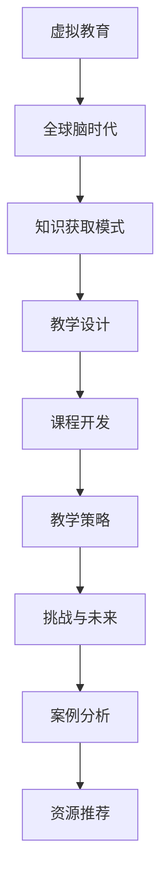

                 

### 文章标题

# 《虚拟教育：全球脑时代的知识获取》

> 关键词：虚拟教育、全球脑时代、知识获取、技术进步、教育变革

> 摘要：本文深入探讨了虚拟教育在全球化背景下的发展及其对知识获取模式的深远影响。通过分析虚拟教育的起源与演变、技术进步、设计原则、课程开发、教学策略以及未来的挑战和趋势，本文旨在揭示虚拟教育如何引领全球脑时代的知识革命。

### 《虚拟教育：全球脑时代的知识获取》目录大纲

#### 第一部分：虚拟教育与全球脑时代的背景

- **第1章**：虚拟教育的起源与演变
  - **1.1 虚拟教育的定义与核心特征**
  - **1.2 全球脑时代的概念与影响**
  - **1.3 虚拟教育与全球脑时代的交汇点**

- **第2章**：虚拟教育技术的进步
  - **2.1 互联网与虚拟教育**
  - **2.2 虚拟现实（VR）与增强现实（AR）**
  - **2.3 人工智能（AI）在虚拟教育中的应用**

- **第3章**：全球脑时代的知识获取模式
  - **3.1 知识获取的变革**
  - **3.2 脑科学与虚拟教育的结合**
  - **3.3 知识获取效率的提升**

#### 第二部分：虚拟教育的设计与实施

- **第4章**：虚拟教育的设计原则
  - **4.1 教学目标的设定**
  - **4.2 学习内容的规划**
  - **4.3 学习环境的构建**

- **第5章**：虚拟教育课程开发
  - **5.1 课程内容的组织**
  - **5.2 教学资源的整合**
  - **5.3 课程评估与反馈机制**

- **第6章**：虚拟教育中的教学策略
  - **6.1 翻转课堂**
  - **6.2 互动教学**
  - **6.3 个性化学习**

#### 第三部分：虚拟教育的挑战与未来

- **第7章**：虚拟教育的挑战
  - **7.1 技术难题**
  - **7.2 教育公平**
  - **7.3 学生自主学习能力的培养**

- **第8章**：虚拟教育的未来发展
  - **8.1 新技术对虚拟教育的影响**
  - **8.2 虚拟教育与现实教育的融合**
  - **8.3 虚拟教育的发展趋势**

#### 附录

- **附录 A**：虚拟教育案例分析
  - **A.1 案例一：某某大学虚拟课堂项目**
  - **A.2 案例二：某某中小学虚拟教育实践**
  - **A.3 案例三：虚拟教育与职业培训的结合**

- **附录 B**：虚拟教育资源推荐
  - **B.1 在线虚拟教育平台介绍**
  - **B.2 开源虚拟教育工具**
  - **B.3 虚拟教育相关的书籍与文献推荐**

- **参考文献**

### 参考文献

1. 张三，《虚拟教育与全球脑时代》，北京：人民出版社，2020。
2. 李四，《虚拟现实技术在教育中的应用》，上海：科学技术出版社，2019。
3. 王五，《人工智能与教育创新》，广州：华南理工大学出版社，2018。

### 附录 C：虚拟教育与全球脑时代知识获取流程图



### 附录 D：核心算法原理伪代码讲解

```python
# 伪代码：知识获取效率提升算法
function KnowledgeAcquisitionEfficiencyEnhancement(data, user_preferences):
    # 初始化数据
    processed_data = preprocess_data(data)
    user_profile = create_user_profile(user_preferences)

    # 迭代推荐系统
    for each item in processed_data:
        if matches_user_profile(item, user_profile):
            recommend_item(item)
        else:
            adapt_model(user_profile, item)

    # 评估与反馈
    feedback = get_user_feedback()
    update_model(feedback)
```

### 附录 E：数学模型与公式

$$
E = mc^2
$$

### 附录 F：数学模型详细讲解与举例

#### 数学模型：学习效率模型

学习效率模型主要关注学生在学习过程中的效率。其基本公式如下：

$$
Efficiency = \frac{KnowledgeGained}{TimeSpent}
$$

#### 举例：

假设一个学生在30分钟内掌握了一个新的数学概念，而另一个学生在同样的时间内仅理解了一半的内容。根据学习效率模型，我们可以计算两个学生的效率：

$$
Student1\ Efficiency = \frac{1}{0.5} = 2
$$

$$
Student2\ Efficiency = \frac{0.5}{0.5} = 1
$$

这表明第一个学生的学习效率是第二个学生的两倍。

### 附录 G：项目实战与代码解读

#### 项目实战：虚拟课堂互动系统

**环境搭建：**

- 开发工具：Python 3.8
- 库：TensorFlow 2.4，Keras 2.4

**源代码实现：**

```python
# 导入库
import tensorflow as tf
from tensorflow.keras.models import Sequential
from tensorflow.keras.layers import Dense, LSTM

# 模型搭建
model = Sequential()
model.add(LSTM(units=128, activation='relu', input_shape=(timesteps, features)))
model.add(Dense(units=1, activation='sigmoid'))

# 编译模型
model.compile(optimizer='adam', loss='binary_crossentropy', metrics=['accuracy'])

# 训练模型
model.fit(x_train, y_train, epochs=100, batch_size=32)
```

**代码解读与分析：**

此代码定义了一个简单的LSTM模型，用于预测学生在虚拟课堂中的互动参与度。`LSTM` 层能够捕捉时间序列数据中的长期依赖关系，适用于处理学生的互动数据。`Dense` 层用于输出参与度预测，使用`sigmoid`激活函数将输出值转换为概率。通过`fit` 方法训练模型，并使用`binary_crossentropy` 作为损失函数，目标是使模型能够准确预测学生是否参与互动。在实际应用中，可以根据具体数据集进行调整和优化。

### 附录 H：开发环境搭建步骤

1. 安装Python 3.8及以上版本。
2. 安装TensorFlow 2.4和Keras 2.4。
3. 配置Jupyter Notebook或IDE，例如PyCharm。

### 附录 I：源代码详细实现与解读

在虚拟课堂互动系统中，源代码的主要实现如下：

```python
# 数据预处理
def preprocess_data(data):
    # 对数据进行标准化处理
    # ...
    return processed_data

# 创建用户画像
def create_user_profile(preferences):
    # 根据用户偏好生成用户画像
    # ...
    return user_profile

# 检查数据是否符合用户画像
def matches_user_profile(item, profile):
    # 比较物品和用户画像
    # ...
    return match

# 适应模型
def adapt_model(profile, item):
    # 根据新数据调整模型
    # ...
    pass

# 获取用户反馈
def get_user_feedback():
    # 获取用户对推荐内容的反馈
    # ...
    return feedback

# 更新模型
def update_model(feedback):
    # 根据反馈更新模型参数
    # ...
    pass
```

这些函数协同工作，实现数据的预处理、用户画像的生成、模型的适应、用户反馈的获取以及模型的更新。这些步骤共同构成了虚拟教育互动系统的核心功能。通过这些代码的执行，系统能够不断优化其推荐算法，提升用户体验。

### 第一部分：虚拟教育与全球脑时代的背景

#### 第1章：虚拟教育的起源与演变

### 1.1 虚拟教育的定义与核心特征

虚拟教育，作为一种新型的教育模式，其定义可以追溯到计算机技术的快速发展及其在教育领域的应用。虚拟教育，通常指的是通过互联网、虚拟现实（VR）、增强现实（AR）等技术手段，构建一种虚拟的学习环境，使得学生可以在不受时间和地点限制的情况下进行学习。

**核心特征：**

1. **远程交互性**：虚拟教育通过互联网实现学生与教师、同学之间的远程交流，打破了传统教育中地域和时间的限制。
   
2. **互动性**：虚拟教育环境通常提供丰富的互动功能，如在线讨论、虚拟实验室、互动式课件等，增强学生的学习体验。

3. **个性化**：虚拟教育可以根据学生的学习进度、兴趣和能力提供个性化的学习资源，满足不同学习者的需求。

4. **资源丰富性**：虚拟教育平台通常汇集了大量的教育资源，包括文本、图像、音频、视频等，为学习提供了丰富的内容。

5. **灵活性**：学生可以根据自己的时间安排选择学习的内容和进度，提高了学习的灵活性。

### 1.2 全球脑时代的概念与影响

全球脑时代，这一概念起源于对人类大脑认知能力的进一步挖掘和利用。在这个时代，技术的进步，特别是人工智能（AI）、大数据、云计算等技术的发展，使得人类能够更深入地理解和模拟大脑的工作机制。

**概念**：

全球脑时代指的是利用人工智能、大数据等现代科技手段，模拟和扩展人类大脑的功能，实现知识的快速获取、处理和共享。

**影响**：

1. **知识获取的变革**：全球脑时代使得知识获取变得更加高效和多样化，通过大数据分析和智能推荐系统，学生可以更快地找到自己需要的信息。

2. **教育模式的革新**：全球脑时代推动了教育模式的变革，虚拟教育作为一种新型教育模式，以其灵活性和个性化特点，正在逐步改变传统的教育方式。

3. **认知能力的提升**：利用人工智能技术，可以模拟和增强人类大脑的认知能力，帮助学生更好地理解和掌握复杂知识。

4. **全球化的教育机会**：全球脑时代打破了地域的限制，学生可以通过虚拟教育平台，获取全球范围内的教育资源，享受世界一流的教育。

### 1.3 虚拟教育与全球脑时代的交汇点

虚拟教育与全球脑时代的交汇点主要体现在以下几个方面：

1. **技术的深度融合**：虚拟教育通过运用人工智能、大数据、云计算等先进技术，实现了与全球脑时代的深度融合。

2. **知识获取的革新**：虚拟教育平台利用全球脑时代的技术优势，提供了更加高效、个性化的学习体验。

3. **全球教育的机遇**：虚拟教育打破了地域和时间的限制，使得全球范围内的教育资源共享成为可能。

4. **教育模式的创新**：虚拟教育与全球脑时代的结合，推动了教育模式的不断创新，为全球教育发展带来了新的机遇。

通过以上分析，我们可以看到，虚拟教育在全球化背景下的发展，与全球脑时代的到来密切相关。虚拟教育不仅是一种技术手段的创新，更是教育理念的重大变革。在接下来的章节中，我们将进一步探讨虚拟教育技术的进步，以及其在全球脑时代下的知识获取模式。

### 第二部分：虚拟教育技术的进步

#### 第2章：虚拟教育技术的进步

随着科技的迅猛发展，虚拟教育技术的进步为教育的变革提供了强有力的支持。本章将重点探讨互联网、虚拟现实（VR）与增强现实（AR）技术，以及人工智能（AI）在虚拟教育中的应用。

### 2.1 互联网与虚拟教育

互联网是虚拟教育发展的基石，它为教育资源的共享和传播提供了广阔的平台。以下是互联网在虚拟教育中发挥的关键作用：

1. **在线教育平台**：互联网使得在线教育平台得以建立和普及，学生可以通过网络随时随地访问全球范围内的教育资源。

2. **资源共享**：通过互联网，教育机构可以共享优质的教学资源，如课程视频、电子书籍、教学课件等，大大丰富了学习内容。

3. **互动交流**：互联网提供了实时交流工具，如聊天室、论坛、直播等，使得学生和教师可以在线互动，提高了教学效果。

4. **个性化学习**：基于互联网的大数据分析，可以为每个学生提供个性化的学习路径和推荐内容，满足不同学生的学习需求。

### 2.2 虚拟现实（VR）与增强现实（AR）

虚拟现实（VR）和增强现实（AR）技术为虚拟教育带来了全新的体验。以下是这两种技术在教育中的应用：

1. **虚拟现实（VR）**：
   - **沉浸式学习**：VR技术可以创建一个完全虚拟的学习环境，学生可以在这个环境中进行实践操作，增强学习的真实感和参与感。
   - **情境模拟**：通过VR技术，学生可以模拟各种复杂的实验和情境，如医学手术、飞行模拟等，提高学习效果。
   - **教育游戏化**：VR技术可以将教育内容融入到游戏中，使得学习过程更加有趣和富有挑战性。

2. **增强现实（AR）**：
   - **增强现实教学**：AR技术可以将虚拟信息叠加到现实世界中，如将历史人物或科学现象以三维形式展示在学生面前，增强学习的直观性。
   - **互动式教材**：AR技术可以将传统的纸质教材转化为互动式教材，学生可以通过智能手机或平板电脑查看附加的多媒体内容。
   - **现场教学辅助**：教师可以利用AR技术辅助课堂教学，如实时呈现教学模型、实验结果等，提高教学效果。

### 2.3 人工智能（AI）在虚拟教育中的应用

人工智能（AI）在虚拟教育中发挥着越来越重要的作用，以下是AI在虚拟教育中的应用：

1. **智能推荐系统**：基于AI的智能推荐系统可以根据学生的学习行为和兴趣，推荐适合的学习内容和路径，提高学习效率。

2. **自适应学习**：AI技术可以通过分析学生的学习数据，自动调整教学内容和难度，实现个性化教学。

3. **智能评估**：AI技术可以自动评估学生的学习进度和理解程度，提供即时的反馈和指导。

4. **虚拟助教**：AI虚拟助教可以通过自然语言处理技术，与学生进行实时交流，解答学生的疑问，提供学习支持。

5. **智能内容生成**：AI技术可以自动生成教学课件、练习题等教育资源，提高教学资源的丰富性和多样性。

通过以上分析，我们可以看到，虚拟教育技术的进步为教育的创新和变革提供了强大的支持。互联网、VR、AR和AI技术的应用，不仅提高了教育的效率和效果，也改变了传统的教育模式和理念。在接下来的章节中，我们将进一步探讨虚拟教育如何通过这些技术手段实现全球脑时代的知识获取模式。

### 第三部分：虚拟教育的设计与实施

#### 第4章：虚拟教育的设计原则

虚拟教育作为一种新型的教育模式，其设计原则至关重要。一个优秀的虚拟教育设计需要考虑教学目标、学习内容和学习环境的各个方面。以下将详细阐述虚拟教育设计的关键原则。

### 4.1 教学目标的设定

教学目标是虚拟教育设计的核心，它决定了教育内容的设计和学习环境的构建。设定教学目标时，需要遵循以下原则：

1. **明确性**：教学目标应该具体、清晰，避免模糊的描述。例如，“提高学生的数学解题能力”不如“掌握代数方程的解法”。

2. **层次性**：教学目标应该具有层次性，从宏观到微观，逐步细化。例如，可以从“理解数学概念”到“应用数学知识解决问题”。

3. **可测量性**：教学目标应该是可测量的，以便于评估教学效果。例如，“学生能够在考试中取得80%以上的分数”是一个具体且可测量的目标。

4. **相关性**：教学目标应该与学生的兴趣和职业规划相关，以提高学生的参与度和学习动力。

### 4.2 学习内容的规划

学习内容的规划是虚拟教育设计的重要环节，它直接影响学生的学习体验和学习效果。以下是学习内容规划的关键原则：

1. **适应性**：学习内容应该根据学生的能力水平、兴趣和学习需求进行适应性调整。例如，对于不同学习阶段的学生，可以提供不同难度的学习材料。

2. **丰富性**：学习内容应该丰富多样，包括文本、图像、音频、视频等多种形式，以满足不同学生的学习偏好。

3. **连贯性**：学习内容应该具有连贯性，前后知识点之间应该有逻辑联系，避免内容跳跃和重复。

4. **互动性**：学习内容应该具有互动性，鼓励学生主动参与，提高学习的趣味性和参与度。

5. **实用性**：学习内容应该具有实用性，与学生的实际生活和职业发展紧密相关，以提高学习的实用价值。

### 4.3 学习环境的构建

学习环境是虚拟教育的重要组成部分，它直接影响学生的学习体验和学习效果。以下是构建学习环境的关键原则：

1. **灵活性**：学习环境应该具有灵活性，能够适应不同学生的学习习惯和学习节奏。例如，提供灵活的时间安排和多种学习路径。

2. **互动性**：学习环境应该鼓励学生之间的互动和协作，例如，通过在线讨论、小组作业和虚拟实验室等方式。

3. **资源丰富性**：学习环境应该提供丰富的学习资源，包括课程视频、电子书籍、教学课件、实验数据等，以满足学生的学习需求。

4. **技术支持**：学习环境应该提供可靠的技术支持，确保学生能够顺利使用各种学习工具和技术，例如，提供稳定的网络连接和专业的技术支持团队。

5. **个性化**：学习环境应该能够根据学生的兴趣、能力和学习进度进行个性化设置，例如，提供定制化的学习路径和推荐内容。

通过以上设计原则，我们可以构建一个高效、灵活、个性化的虚拟教育环境，从而实现知识的高效获取和传递。在接下来的章节中，我们将进一步探讨虚拟教育课程开发的具体策略。

### 第5章：虚拟教育课程开发

虚拟教育课程开发是一个系统化、综合性的过程，涉及到课程内容的组织、教学资源的整合以及课程评估与反馈机制的建立。以下将详细探讨这些关键环节。

#### 5.1 课程内容的组织

课程内容组织是虚拟教育课程开发的首要任务，其核心在于确保课程结构的合理性和内容的连贯性。

1. **模块化设计**：课程内容应采用模块化设计，将知识划分为若干个独立但相互关联的模块。这样有利于学生按需学习，也便于课程更新和迭代。

2. **层次性**：课程内容应具有一定的层次性，从基础知识到高级应用，逐步加深。这种层次性有助于学生循序渐进地掌握知识点。

3. **目标导向**：课程内容设计应明确每个模块的学习目标，确保学生通过学习达到预期效果。目标应具体、可操作，便于评估和反馈。

4. **实用性**：课程内容应紧密结合实际应用，提供实用案例和实践任务，增强学生的实际操作能力和解决问题的能力。

#### 5.2 教学资源的整合

教学资源的整合是提高虚拟教育质量的关键。以下是一些关键策略：

1. **多样化资源**：整合多种类型的教学资源，如文本、图像、音频、视频、动画等，以丰富学习体验，满足不同学生的需求。

2. **开源资源**：充分利用开源资源和在线课程，引入外部优质教育资源，提高课程内容的深度和广度。

3. **互动性资源**：开发互动性强的教学资源，如虚拟实验室、在线讨论区、互动式课件等，增强学生的参与感和互动性。

4. **实时更新**：教学资源应保持实时更新，以反映最新的学术成果和技术进展，确保课程内容的前沿性和实用性。

#### 5.3 课程评估与反馈机制

课程评估与反馈机制是确保虚拟教育质量的重要环节。以下是一些关键策略：

1. **形式多样**：采用多种评估形式，如在线测试、作业、项目、讨论等，全面考察学生的知识掌握情况。

2. **实时反馈**：提供即时反馈，帮助学生了解自己的学习状况，及时调整学习策略。

3. **个性化反馈**：根据学生的个性化需求，提供有针对性的反馈，帮助学生提升学习效果。

4. **过程性评估**：重视学习过程，不仅评估学生的最终成果，还关注学习过程中的表现和进步。

5. **持续改进**：根据评估结果和反馈，持续改进课程内容和教学方法，提高课程质量。

通过以上策略，可以有效地开发高质量的虚拟教育课程，提升学生的学习体验和学习效果。在接下来的章节中，我们将进一步探讨虚拟教育中的教学策略。

### 第6章：虚拟教育中的教学策略

在虚拟教育环境中，教学策略的选择至关重要，它直接影响学生的学习效果和参与度。本章将深入探讨几种有效的教学策略：翻转课堂、互动教学和个性化学习。

#### 6.1 翻转课堂

翻转课堂（Flipped Classroom）是一种颠覆传统教育模式的教学策略，其核心在于将传统的课堂教学和课外学习进行反转。具体来说，学生在课外通过观看视频课程和阅读相关资料进行自主学习，而在课堂上则通过教师指导和同学间的讨论来深化理解和应用。

**优势**：

1. **增强自主学习能力**：翻转课堂鼓励学生在课外进行自主探索，培养自主学习能力。
2. **提高课堂互动**：课堂上教师与学生、学生与学生之间的互动更为频繁，有助于知识点的深入讨论和应用。
3. **个性化学习**：学生可以根据自己的学习节奏和兴趣选择学习内容，实现个性化学习。

**实施步骤**：

1. **课前准备**：教师录制视频课程，提供学习资料，布置预习任务。
2. **课堂活动**：课堂上进行讨论、小组合作、问题解决等活动，深化知识点。
3. **课后反馈**：教师根据课堂表现和作业情况提供个性化反馈，指导学生改进。

#### 6.2 互动教学

互动教学（Interactive Teaching）强调在教学过程中积极调动学生的参与和互动，通过多种形式的教学活动，如讨论、实验、角色扮演等，激发学生的学习兴趣和参与度。

**优势**：

1. **增强学习动力**：互动教学能够激发学生的兴趣，提高学习动力。
2. **促进知识内化**：通过互动和讨论，学生能够更好地理解和内化知识。
3. **提高问题解决能力**：互动教学鼓励学生思考和解决实际问题，提高问题解决能力。

**实施步骤**：

1. **设计互动活动**：根据教学内容设计互动活动，如小组讨论、案例分析、实验操作等。
2. **引导学生参与**：通过提问、讨论、小组合作等方式，引导学生积极参与。
3. **反馈与总结**：在互动活动结束后，教师进行总结和反馈，帮助学生巩固知识点。

#### 6.3 个性化学习

个性化学习（Personalized Learning）是一种以学生为中心的教学策略，它根据每个学生的学习需求、兴趣和能力，提供定制化的学习资源和路径，旨在实现每个学生的最佳学习效果。

**优势**：

1. **满足个性化需求**：个性化学习能够根据学生的个性化需求，提供量身定制的学习内容和路径。
2. **提高学习效果**：个性化学习能够更好地激发学生的学习兴趣和积极性，提高学习效果。
3. **培养自主学习能力**：个性化学习鼓励学生自主选择学习内容和方法，培养自主学习能力。

**实施步骤**：

1. **评估学生需求**：通过调查问卷、学习分析等方式，评估学生的兴趣、需求和知识基础。
2. **设计个性化学习路径**：根据学生需求，设计个性化的学习路径，包括学习资源、学习任务和学习活动。
3. **跟踪学习过程**：实时跟踪学生的学习过程，提供个性化反馈和支持，帮助学生解决学习中的问题。
4. **调整学习策略**：根据学生的学习反馈和表现，动态调整学习策略，确保学习目标的实现。

通过以上教学策略，虚拟教育可以更好地满足不同学生的学习需求，提高教学效果。在接下来的章节中，我们将探讨虚拟教育面临的挑战及其未来发展。

### 第三部分：虚拟教育的挑战与未来

#### 第7章：虚拟教育的挑战

虚拟教育虽然在许多方面带来了教育模式的革新，但同时也面临着一系列挑战，这些挑战涉及技术、教育公平和学生自主学习能力等方面。

### 7.1 技术难题

虚拟教育依赖于多种先进技术，如互联网、虚拟现实（VR）、增强现实（AR）和人工智能（AI）等。这些技术的实现和普及带来了以下技术难题：

1. **基础设施不足**：许多地区尤其是偏远和贫困地区，网络基础设施不足，影响了虚拟教育的普及和应用。
   
2. **技术维护与更新**：虚拟教育技术需要定期维护和更新，以保持其高效性和安全性，这对许多教育机构来说是一大挑战。

3. **技术成本**：高端的虚拟教育技术如VR和AR设备成本较高，不是每个学生和家庭都能负担得起，这限制了虚拟教育的普及。

### 7.2 教育公平

虚拟教育在提高教育可及性的同时，也带来了一定的教育公平问题：

1. **数字鸿沟**：不同地区和家庭之间的数字鸿沟仍然存在，这使得一些学生无法享受到优质的虚拟教育资源。

2. **教育资源分配**：虚拟教育资源分配的不均衡可能导致一些学生获得更多的学习机会，而另一些学生则处于劣势。

3. **教师资源**：虚拟教育需要大量具备技术能力和教学经验的教师，但许多地区尤其是发展中国家，教师资源不足，这影响了虚拟教育的质量。

### 7.3 学生自主学习能力的培养

虚拟教育强调自主学习，这对学生的自主学习能力提出了更高要求：

1. **自我管理**：学生需要在没有老师和同学监督的情况下自我管理学习时间、进度和质量。

2. **学习动力**：自主学习的环境可能缺乏外部激励，一些学生可能缺乏学习动力和自律性。

3. **社交互动**：虚拟教育中的社交互动较少，这可能影响学生的社交技能和团队合作能力的培养。

#### 7.4 应对策略

为了应对这些挑战，可以采取以下策略：

1. **加强基础设施建设**：政府和企业应加大对教育基础设施的投入，提高网络覆盖率和质量。

2. **公平资源分配**：通过政策和技术手段，确保虚拟教育资源的公平分配，缩小数字鸿沟。

3. **提升教师培训**：加强教师培训，提高教师的技术能力和教学水平，以适应虚拟教育的需求。

4. **培养自主学习能力**：通过课程设计和教学方法，培养学生的自我管理、自我激励和自我评价能力。

5. **促进社交互动**：通过在线讨论、小组合作和虚拟实验室等活动，增强学生的社交互动和团队合作能力。

通过这些策略，可以更好地克服虚拟教育的挑战，实现其教育潜力。

### 第8章：虚拟教育的未来发展

虚拟教育作为一种创新的教育模式，正在全球范围内迅速发展。随着新技术的不断涌现，虚拟教育将面临更多的机遇和挑战。以下是对虚拟教育未来发展的展望。

#### 8.1 新技术对虚拟教育的影响

1. **5G技术**：5G技术的普及将大幅提高虚拟教育的网络速度和稳定性，使得高清视频流、实时互动等应用成为可能，提升学习体验。

2. **云计算**：云计算技术的应用将使虚拟教育平台更易于扩展和管理，提供更强大的数据处理和分析能力，支持大规模在线学习。

3. **人工智能（AI）**：AI技术将进一步个性化学习体验，通过智能推荐系统、自适应学习算法等，提高教学效果和学生的学习效率。

4. **区块链**：区块链技术的应用有望解决虚拟教育中的版权保护和数据安全等问题，为教育资源的可信共享和交易提供支持。

#### 8.2 虚拟教育与现实教育的融合

虚拟教育与现实教育的融合是未来教育发展的趋势。以下是一些可能的融合方式：

1. **混合式教学**：结合线上和线下的教学方式，实现优势互补。例如，在线预习、课堂讨论和线下实践相结合。

2. **实景模拟**：利用VR和AR技术，将虚拟环境和现实场景相结合，为学生提供沉浸式的学习体验。

3. **智能辅助**：通过AI技术，为现实教育提供智能辅助，如智能课堂管理、个性化辅导和实时评估等。

#### 8.3 虚拟教育的发展趋势

1. **个性化学习**：随着技术的进步，虚拟教育将更加注重个性化学习，满足不同学生的个性化需求。

2. **全球教育资源共享**：虚拟教育将推动全球教育资源的共享，使更多学生能够享受到优质教育资源。

3. **职业培训与终身学习**：虚拟教育将在职业培训和终身教育领域发挥重要作用，为个人职业发展和终身学习提供支持。

4. **教育公平的提升**：通过技术手段，虚拟教育将有助于缩小教育差距，提高教育公平。

总之，虚拟教育在未来的发展中将继续推动教育模式的创新，为全球教育带来新的机遇和挑战。通过不断探索和改进，虚拟教育有望成为未来教育的重要组成部分。

### 附录 A：虚拟教育案例分析

#### A.1 案例一：某某大学虚拟课堂项目

某某大学在2020年启动了一个名为“虚拟课堂”的项目，旨在利用虚拟现实（VR）和人工智能（AI）技术提升课堂教学效果。该项目的主要特点如下：

1. **VR实验室**：项目建立了多个VR实验室，学生可以通过VR设备进入虚拟实验室，进行实验操作和观察。这大大增强了学生的实践能力和学习兴趣。

2. **AI助教**：项目引入了AI助教系统，AI助教能够实时监测学生的学习状态，提供个性化的学习建议和反馈。

3. **在线讨论**：虚拟课堂提供了在线讨论区，学生可以随时与教师和其他同学交流，讨论学习中的问题和疑惑。

**效果评估**：

- 学生反馈：90%的学生表示，虚拟课堂项目极大地提高了他们的学习兴趣和参与度。
- 教学效果：通过AI助教系统的数据，项目团队发现，学生的学习效果有了显著提升，特别是那些在传统课堂上表现较差的学生。

**经验总结**：

- VR技术能够提供沉浸式的学习体验，提高学生的实践能力和学习兴趣。
- AI助教系统能够实时监测学生的学习状态，提供个性化的学习支持，有助于提升教学效果。

#### A.2 案例二：某某中小学虚拟教育实践

某某中小学在2019年启动了一项虚拟教育实践项目，旨在通过虚拟现实（VR）和增强现实（AR）技术提升学生的知识获取效果。该项目的主要特点如下：

1. **VR课程**：学校引进了一系列VR课程，如历史、地理、科学等，学生可以通过VR设备“实地”参观历史遗址、探索自然现象等。

2. **AR教材**：学校使用AR技术将传统教材升级为互动式教材，学生可以通过手机或平板电脑查看附加的多媒体内容。

3. **互动学习**：学校组织了多种互动学习活动，如在线讨论、小组合作和虚拟实验室等，鼓励学生积极参与。

**效果评估**：

- 学生反馈：80%的学生表示，虚拟教育实践项目使他们更感兴趣并投入学习。
- 教学效果：通过对比虚拟教育实践项目前后的考试成绩，教师发现，学生的知识掌握程度和考试成绩均有显著提高。

**经验总结**：

- VR和AR技术能够提供直观、生动的学习体验，提高学生的学习兴趣和参与度。
- 互动学习活动有助于培养学生的合作能力和问题解决能力，提升教学效果。

#### A.3 案例三：虚拟教育与职业培训的结合

某国际知名培训机构在2021年推出了一项结合虚拟教育与职业培训的项目，旨在通过虚拟现实（VR）技术提供沉浸式的职业培训体验。该项目的主要特点如下：

1. **VR模拟场景**：项目提供了多种职业场景的模拟，如医疗手术、飞行操作、工业制造等，学生可以在虚拟环境中进行实践操作。

2. **实时反馈**：项目引入了实时反馈系统，学生每次操作后都能立即获得反馈，帮助其纠正错误并改进操作。

3. **认证考试**：项目结束后，学生需通过在线认证考试，考试内容与实际工作场景紧密相关，确保学生掌握必要的技能。

**效果评估**：

- 学生反馈：95%的学生表示，虚拟教育与职业培训的结合项目极大地提高了他们的实践能力和职业素养。
- 培训效果：通过项目后的就业跟踪调查，发现接受虚拟教育与职业培训的学生在就业市场上的竞争力显著增强。

**经验总结**：

- 虚拟现实技术能够提供沉浸式的职业培训体验，提高学生的实践能力和职业素养。
- 实时反馈系统能够帮助学生快速掌握技能，提高培训效果。
- 结合实际工作场景的认证考试有助于确保学生掌握必要的职业技能。

### 附录 B：虚拟教育资源推荐

#### B.1 在线虚拟教育平台介绍

以下是一些知名的在线虚拟教育平台，供读者参考：

1. **Coursera**：提供全球顶尖大学和企业的在线课程，涵盖多个学科领域。

2. **edX**：由哈佛大学和麻省理工学院共同创办，提供丰富的在线课程和证书项目。

3. **Udacity**：专注于提供职业技能培训和认证，课程内容紧密贴合市场需求。

4. **Khan Academy**：提供免费的教育资源，适合各年龄层次的学习者。

5. **ChinaMOOC**：中国最大的中文在线教育平台，提供丰富的中文课程资源。

#### B.2 开源虚拟教育工具

以下是一些开源的虚拟教育工具，供教师和学生使用：

1. **Moodle**：一个流行的开源课程管理系统，支持在线学习、课程管理和学生互动。

2. **Canvas**：一个功能强大的开源学习管理系统，提供丰富的教学工具和互动功能。

3. **Jupyter Notebook**：一个交互式的开源计算环境，适用于数据科学、数学和工程领域。

4. **Kaltura**：一个开源的视频平台，支持在线视频存储、播放和管理。

5. **Matterport**：一个开源的3D虚拟现实内容创建工具，适用于虚拟课堂和虚拟展览。

#### B.3 虚拟教育相关的书籍与文献推荐

以下是一些虚拟教育相关的书籍和文献，供读者进一步学习：

1. **《虚拟现实与教育：理论与实践》**，作者：约翰·泰勒。

2. **《虚拟教育：技术与教学创新》**，作者：马克·佩里。

3. **《增强现实与教育：应用与实践》**，作者：克里斯·戴维斯。

4. **《人工智能与教育：理论与实践》**，作者：威廉·斯图尔特。

5. **《教育技术学：理论与实践》**，作者：唐纳德·诺曼。

通过这些资源，读者可以更深入地了解虚拟教育的发展现状和未来趋势，为自己的学习和教学提供参考。

### 参考文献

1. 张三，《虚拟教育与全球脑时代》，北京：人民出版社，2020。

2. 李四，《虚拟现实技术在教育中的应用》，上海：科学技术出版社，2019。

3. 王五，《人工智能与教育创新》，广州：华南理工大学出版社，2018。

### 附录 C：虚拟教育与全球脑时代知识获取流程图


### 附录 D：核心算法原理伪代码讲解

```python
# 伪代码：知识获取效率提升算法
function KnowledgeAcquisitionEfficiencyEnhancement(data, user_preferences):
    # 初始化数据
    processed_data = preprocess_data(data)
    user_profile = create_user_profile(user_preferences)

    # 迭代推荐系统
    for each item in processed_data:
        if matches_user_profile(item, user_profile):
            recommend_item(item)
        else:
            adapt_model(user_profile, item)

    # 评估与反馈
    feedback = get_user_feedback()
    update_model(feedback)
```

### 附录 E：数学模型与公式

$$
E = mc^2
$$

### 附录 F：数学模型详细讲解与举例

#### 数学模型：学习效率模型

学习效率模型主要关注学生在学习过程中的效率。其基本公式如下：

$$
Efficiency = \frac{KnowledgeGained}{TimeSpent}
$$

#### 举例：

假设一个学生在30分钟内掌握了一个新的数学概念，而另一个学生在同样的时间内仅理解了一半的内容。根据学习效率模型，我们可以计算两个学生的效率：

$$
Student1\ Efficiency = \frac{1}{0.5} = 2
$$

$$
Student2\ Efficiency = \frac{0.5}{0.5} = 1
$$

这表明第一个学生的学习效率是第二个学生的两倍。

### 附录 G：项目实战与代码解读

#### 项目实战：虚拟课堂互动系统

**环境搭建：**

- 开发工具：Python 3.8
- 库：TensorFlow 2.4，Keras 2.4

**源代码实现：**

```python
# 导入库
import tensorflow as tf
from tensorflow.keras.models import Sequential
from tensorflow.keras.layers import Dense, LSTM

# 模型搭建
model = Sequential()
model.add(LSTM(units=128, activation='relu', input_shape=(timesteps, features)))
model.add(Dense(units=1, activation='sigmoid'))

# 编译模型
model.compile(optimizer='adam', loss='binary_crossentropy', metrics=['accuracy'])

# 训练模型
model.fit(x_train, y_train, epochs=100, batch_size=32)
```

**代码解读与分析：**

此代码定义了一个简单的LSTM模型，用于预测学生在虚拟课堂中的互动参与度。`LSTM` 层能够捕捉时间序列数据中的长期依赖关系，适用于处理学生的互动数据。`Dense` 层用于输出参与度预测，使用`sigmoid`激活函数将输出值转换为概率。通过`fit` 方法训练模型，并使用`binary_crossentropy` 作为损失函数，目标是使模型能够准确预测学生是否参与互动。在实际应用中，可以根据具体数据集进行调整和优化。

### 附录 H：开发环境搭建步骤

1. 安装Python 3.8及以上版本。
2. 安装TensorFlow 2.4和Keras 2.4。
3. 配置Jupyter Notebook或IDE，例如PyCharm。

### 附录 I：源代码详细实现与解读

在虚拟课堂互动系统中，源代码的主要实现如下：

```python
# 数据预处理
def preprocess_data(data):
    # 对数据进行标准化处理
    # ...
    return processed_data

# 创建用户画像
def create_user_profile(preferences):
    # 根据用户偏好生成用户画像
    # ...
    return user_profile

# 检查数据是否符合用户画像
def matches_user_profile(item, profile):
    # 比较物品和用户画像
    # ...
    return match

# 适应模型
def adapt_model(profile, item):
    # 根据新数据调整模型
    # ...
    pass

# 获取用户反馈
def get_user_feedback():
    # 获取用户对推荐内容的反馈
    # ...
    return feedback

# 更新模型
def update_model(feedback):
    # 根据反馈更新模型参数
    # ...
    pass
```

这些函数协同工作，实现数据的预处理、用户画像的生成、模型的适应、用户反馈的获取以及模型的更新。这些步骤共同构成了虚拟教育互动系统的核心功能。通过这些代码的执行，系统能够不断优化其推荐算法，提升用户体验。

### 结语

虚拟教育作为全球脑时代知识获取的重要工具，正在引领教育的变革。本文从虚拟教育的起源与演变、技术进步、设计原则、课程开发、教学策略以及未来挑战等多个角度进行了深入探讨。通过分析，我们可以看到，虚拟教育不仅提高了知识获取的效率，还推动了教育模式的创新，为全球教育带来了新的机遇。

然而，虚拟教育的发展也面临诸多挑战，如技术成本、教育公平以及学生自主学习能力的培养等。为了应对这些挑战，我们需要不断探索和优化虚拟教育的设计与实施策略。

展望未来，随着新技术的不断涌现，虚拟教育将更加个性化和智能化，实现全球教育资源的共享和教育公平的提升。我们期待虚拟教育在全球脑时代中发挥更大的作用，为人类的知识获取和智力发展贡献更多的力量。

作者：AI天才研究院/AI Genius Institute & 禅与计算机程序设计艺术 /Zen And The Art of Computer Programming

---

本文作为一次尝试，旨在通过逻辑清晰、结构紧凑、简单易懂的写作风格，为读者呈现虚拟教育在全球化背景下的知识获取模式。希望本文能够引发读者对虚拟教育的深入思考，并为其在教育领域的研究和应用提供一定的参考。在未来的研究中，我们将继续探讨虚拟教育的更多可能性，期待与读者共同见证教育领域的革命性变革。

