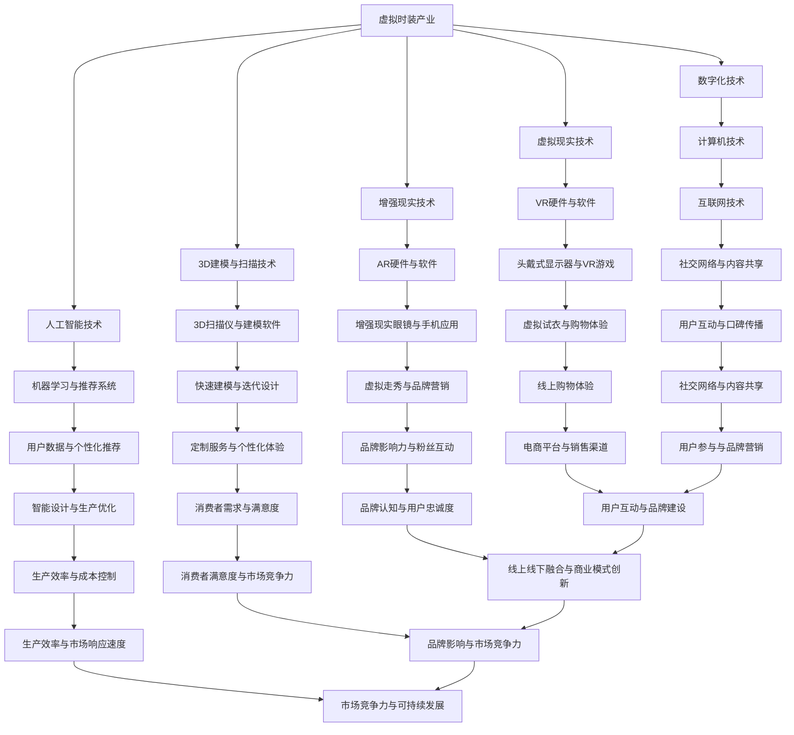

                 


### 文章标题：虚拟时装产业：全球时尚业的数字化转型

#### 关键词：
- 虚拟时装
- 数字化转型
- 虚拟现实
- 增强现实
- 人工智能
- 3D建模

#### 摘要：
本文将深入探讨虚拟时装产业的定义、特点、发展历程、核心技术与应用，以及其所面临的挑战与机遇。通过一步步的分析与推理，揭示全球时尚业数字化转型的本质及其对行业的影响。

---

## 第一部分：虚拟时装产业概述

### 第1章：虚拟时装产业概述

#### 第1.1节：虚拟时装产业的定义与特点

##### 1.1.1 虚拟时装产业的定义

虚拟时装产业是指通过数字化技术和虚拟现实技术，对时尚设计、制作、展示和销售进行创新和优化的产业。它不仅包括虚拟时装的设计和制作，还涉及到虚拟试衣、虚拟走秀、定制服务等环节。

##### 1.1.2 虚拟时装产业的特点

1. **数字化**：虚拟时装产业依托于数字化技术，实现了设计、制作和展示的全程数字化。
2. **虚拟化**：通过虚拟现实和增强现实技术，用户可以在虚拟环境中进行试衣、走秀等体验。
3. **智能化**：人工智能技术的应用，使得个性化推荐、智能设计等成为可能，大大提高了生产效率和产品质量。

#### 第1.2节：虚拟时装产业的发展历程

##### 1.2.1 初步探索期（2000-2010年）

- **技术初现**：虚拟试衣技术开始出现，但应用范围有限。
- **市场认知**：行业对虚拟时装的认识逐渐加深，但接受度较低。

##### 1.2.2 快速发展期（2011-2020年）

- **技术成熟**：虚拟现实技术、增强现实技术、3D建模技术等日益成熟。
- **应用扩展**：虚拟时装的应用场景逐渐扩大，包括线上购物、虚拟走秀等。

##### 1.2.3 成熟期（2021年至今）

- **商业模式创新**：线上线下融合，虚拟与现实结合的商业模式逐渐成熟。
- **市场规模扩大**：虚拟时装市场持续增长，吸引了大量资本和企业进入。

#### 第1.3节：虚拟时装产业的核心技术与应用

##### 1.3.1 核心技术

1. **3D建模与扫描技术**：用于创建虚拟时装的3D模型。
2. **虚拟现实（VR）技术**：提供沉浸式的试衣和体验环境。
3. **增强现实（AR）技术**：将虚拟时装叠加到现实环境中。
4. **人工智能（AI）技术**：用于个性化推荐、智能设计等。

##### 1.3.2 主要应用

1. **线上购物**：通过虚拟试衣技术提升购物体验。
2. **虚拟走秀**：实现虚拟模特的走秀，提升品牌影响力。
3. **定制服务**：利用人工智能技术进行个性化设计和推荐。
4. **教育培训**：虚拟时装设计的教学和培训。

#### 第1.4节：虚拟时装产业的挑战与机遇

##### 1.4.1 挑战

1. **技术成熟度**：虚拟时装技术仍需不断优化和突破。
2. **用户接受度**：消费者对虚拟时装的接受程度需提高。
3. **行业标准**：缺乏统一的行业标准，可能导致市场混乱。

##### 1.4.2 机遇

1. **市场潜力**：随着数字化和智能化的发展，虚拟时装市场潜力巨大。
2. **技术创新**：虚拟现实、人工智能等技术的进步为虚拟时装产业提供了新的可能。
3. **商业模式创新**：线上线下融合、个性化定制等新模式不断涌现。

---

### 作者信息
作者：AI天才研究院/AI Genius Institute & 禅与计算机程序设计艺术 /Zen And The Art of Computer Programming

---

在接下来的内容中，我们将对每一章节进行深入的分析和探讨，以揭示虚拟时装产业的奥秘。敬请期待！

---

# 背景介绍

虚拟时装产业的崛起，是数字技术和虚拟现实技术不断发展的结果。在过去的几十年中，随着计算机性能的提升、互联网的普及以及智能手机的广泛应用，数字化技术已经渗透到了人们生活的方方面面。特别是在时尚行业，数字化技术正在重塑传统的生产和销售模式，虚拟时装产业应运而生。

虚拟时装产业的核心在于将传统的时尚设计、制作和销售过程转化为数字化流程。通过3D建模与扫描技术，设计师可以快速地将创意转化为虚拟时装模型；通过虚拟现实（VR）和增强现实（AR）技术，消费者可以在虚拟环境中进行试衣和体验；通过人工智能（AI）技术，可以实现对消费者的个性化推荐和定制服务。

虚拟时装产业的兴起，不仅改变了时尚行业的工作方式，也为消费者带来了全新的购物体验。消费者可以在家中通过虚拟试衣技术尝试各种服装，无需实体试穿，大大提高了购物的便利性和舒适度。同时，虚拟时装产业也为品牌提供了更多的营销手段，通过虚拟走秀和社交媒体的互动，品牌可以更快速地传播其设计理念和产品特点。

然而，虚拟时装产业的兴起也面临着诸多挑战。首先，技术的成熟度和应用效果仍需进一步提升。尽管3D建模与扫描技术、虚拟现实（VR）和增强现实（AR）技术已经取得了显著进展，但仍然存在一些技术难题需要解决。例如，如何实现更精确的人体扫描和虚拟时装模型生成，如何提升虚拟试衣的体验效果等。

其次，消费者对虚拟时装的接受度也是一个重要的问题。尽管虚拟试衣技术为消费者提供了便利，但消费者对虚拟试衣的接受程度仍有待提高。消费者可能对虚拟试衣的准确性和逼真度持怀疑态度，这需要品牌和零售商通过不断的宣传和实际应用来提高消费者的信任度。

此外，虚拟时装产业还面临着行业标准缺失的问题。由于虚拟时装产业尚处于发展初期，缺乏统一的行业标准，可能导致市场混乱。建立统一的行业标准，不仅有助于规范市场秩序，也有助于提升行业的整体竞争力。

总的来说，虚拟时装产业的兴起为时尚行业带来了前所未有的机遇和挑战。通过不断的技术创新和商业模式的探索，虚拟时装产业有望成为未来时尚行业的重要组成部分。

## 核心概念与联系

在探讨虚拟时装产业之前，我们需要明确几个核心概念及其相互关系。以下是这些核心概念的架构图，通过Mermaid流程图来展示它们之间的联系：



### 详细解释：

- **虚拟时装产业（A）**：这是整个架构的核心，代表了时尚产业通过数字化技术实现的转型。
- **数字化技术（B）**：这是虚拟时装产业的基础，涵盖了计算机技术、互联网技术等，为整个产业的数字化提供了支持。
- **虚拟现实技术（C）**和**增强现实技术（D）**：它们是实现虚拟试衣和虚拟走秀等核心功能的关键技术。
- **3D建模与扫描技术（E）**：用于创建虚拟时装的3D模型，是实现数字化设计的重要手段。
- **人工智能技术（F）**：在个性化推荐、智能设计和生产优化等方面发挥了重要作用。

通过这个架构图，我们可以清晰地看到各个核心概念之间的联系。例如，虚拟现实技术和增强现实技术（C和D）依赖于计算机技术和互联网技术（G和L），同时它们又与3D建模与扫描技术（E）和人工智能技术（F）紧密相连，共同推动了虚拟时装产业的创新和发展。

这种联系不仅帮助我们理解了虚拟时装产业的核心概念，还揭示了各技术之间的相互作用和依赖关系，为我们进一步分析和探讨虚拟时装产业提供了坚实的基础。

### 核心算法原理讲解

在虚拟时装产业中，核心算法原理的实现至关重要。以下将详细讲解几个关键算法原理，包括3D建模与扫描技术、虚拟现实（VR）技术、增强现实（AR）技术和人工智能（AI）技术。

#### 3D建模与扫描技术

**核心算法原理**：3D建模与扫描技术主要基于三维几何建模和计算机视觉技术。

**伪代码**：
```python
# 3D扫描数据预处理
def preprocess_3d_scan(data):
    # 数据清洗
    cleaned_data = remove_outliers(data)
    # 数据归一化
    normalized_data = normalize_coordinates(cleaned_data)
    return normalized_data

# 3D模型重建
def rebuild_3d_model(scanned_data):
    # 数据分割
    segmented_data = segment_data(scanned_data)
    # 曲面拟合
    fitted_surface = fit_surface(segmented_data)
    # 模型优化
    optimized_model = optimize_model(fitted_surface)
    return optimized_model

# 输出结果
output_model = rebuild_3d_model(preprocessed_data)
```

**数学模型和公式**：
$$
\text{标准化坐标变换} = \text{标准化因子} \times (\text{原始坐标} - \text{均值})
$$

其中，标准化因子为：
$$
\text{标准化因子} = \frac{\text{标准差}}{\text{最大坐标值} - \text{最小坐标值}}
$$

#### 虚拟现实（VR）技术

**核心算法原理**：虚拟现实技术主要基于三维图形渲染和运动追踪技术。

**伪代码**：
```python
# 虚拟环境渲染
def render_virtual_scene(scene_data):
    # 设置渲染参数
    set_render_params(scene_data)
    # 绘制三维物体
    draw_3d_objects(scene_data)
    # 运动追踪
    track_movement(scene_data)
    return rendered_scene

# 虚拟试衣
def virtual_try_on(user_model, garment_model):
    # 合并模型
    combined_model = merge_models(user_model, garment_model)
    # 渲染试衣效果
    try_on_scene = render_virtual_scene(combined_model)
    return try_on_scene
```

**数学模型和公式**：
$$
\text{运动追踪误差} = \text{真实运动} - \text{追踪结果}
$$

其中，真实运动为用户实际运动轨迹，追踪结果为运动追踪系统记录的运动轨迹。

#### 增强现实（AR）技术

**核心算法原理**：增强现实技术主要基于图像识别和实时渲染技术。

**伪代码**：
```python
# 增强现实场景渲染
def render_ar_scene(ar_data):
    # 识别目标图像
    target_image = detect_target_image(ar_data)
    # 实时渲染
    rendered_scene = render_image(target_image)
    return rendered_scene

# 虚拟时装AR展示
def ar_garment_display(garment_model, target_image):
    # 合并模型和图像
    combined_data = combine_model_with_image(garment_model, target_image)
    # 渲染AR场景
    ar_scene = render_ar_scene(combined_data)
    return ar_scene
```

**数学模型和公式**：
$$
\text{图像识别置信度} = \frac{\text{匹配度}}{\text{总像素数}}
$$

其中，匹配度为图像识别系统识别出的匹配区域像素数。

#### 人工智能（AI）技术

**核心算法原理**：人工智能技术在虚拟时装产业中主要应用于个性化推荐、智能设计和生产优化。

**伪代码**：
```python
# 个性化推荐
def personalized_recommendation(user_data, garment_catalog):
    # 分析用户数据
    analyzed_data = analyze_user_data(user_data)
    # 推荐算法
    recommended_items = recommend_items(analyzed_data, garment_catalog)
    return recommended_items

# 智能设计
def intelligent_design(garment_model, style_preference):
    # 设计优化
    optimized_model = optimize_design(garment_model, style_preference)
    return optimized_model

# 生产优化
def production_optimization(production_data):
    # 数据分析
    analyzed_data = analyze_production_data(production_data)
    # 优化策略
    optimized_strategy = apply_optimization_strategy(analyzed_data)
    return optimized_strategy
```

**数学模型和公式**：
$$
\text{用户偏好评分} = \text{特征相似度} \times \text{历史评分}
$$

其中，特征相似度为用户当前偏好与历史偏好的相似度。

通过以上算法原理的讲解，我们可以看到虚拟时装产业的技术实现是如何通过一系列复杂的数学模型和算法来实现的。这些技术不仅提升了虚拟时装产业的生产效率和用户体验，也为行业的创新和发展提供了强大的支持。

### 数学模型和公式讲解

在虚拟时装产业中，数学模型和公式是核心算法实现的基础，它们帮助我们在数字化的世界中构建和优化虚拟时装的设计与展示。以下将详细介绍一些关键的数学模型和公式，并使用LaTeX进行表示，以便更清晰地理解其在实际应用中的作用。

#### 3D建模与扫描技术

**1. 点云数据预处理**

在3D建模过程中，首先需要对采集到的点云数据进行预处理，以提高后续建模的精度和效率。以下是一个常见的点云数据预处理步骤的数学模型：

$$
\text{标准化坐标变换} = \text{标准化因子} \times (\text{原始坐标} - \text{均值})
$$

其中，标准化因子用于将不同尺度的坐标统一到一个标准范围内，减少坐标差异对建模过程的影响。

$$
\text{标准化因子} = \frac{\text{标准差}}{\text{最大坐标值} - \text{最小坐标值}}
$$

**2. 三角化与曲面重建**

通过三角化方法将点云数据转换为网格模型，然后使用曲面重建算法生成光滑的表面。一个常用的曲面重建公式是基于多边形网格的Delaunay三角化：

$$
\text{Delaunay三角化} = \{ (P_i, P_j, P_k) | P_i, P_j, P_k \in \text{点云}, \text{且} \ \angle(\text{P_iP_jP_k}) > \theta \}
$$

其中，$\theta$ 是Delaunay三角形的内角阈值，用于确保三角形的稳定性。

#### 虚拟现实（VR）技术

**1. 三维图形渲染**

在虚拟现实场景中，三维图形渲染是实现沉浸式体验的关键。一个基本的三维图形渲染流程包括视图矩阵的设置、光照模型的计算以及像素着色等。以下是透视变换的矩阵公式：

$$
\text{透视变换矩阵} = \begin{bmatrix}
\frac{2}{w} & 0 & 0 & 0 \\
0 & \frac{2}{h} & 0 & 0 \\
0 & 0 & \frac{z_{far} - z_{near}}{z_{far} + z_{near}} & -1 \\
0 & 0 & \frac{2z_{far}z_{near}}{z_{far} + z_{near}} & 0
\end{bmatrix}
$$

其中，$w$, $h$ 分别是视口的宽度和高度，$z_{near}$ 和 $z_{far}$ 分别是近裁剪面和远裁剪面的深度。

**2. 运动追踪误差计算**

在虚拟现实应用中，运动追踪系统需要实时计算误差并进行修正。运动追踪误差的计算公式如下：

$$
\text{运动追踪误差} = \text{真实运动} - \text{追踪结果}
$$

这里，真实运动是用户实际的运动轨迹，而追踪结果是通过运动追踪系统记录的运动轨迹。

#### 增强现实（AR）技术

**1. 图像识别置信度计算**

增强现实技术中的图像识别是关键环节，计算识别置信度可以帮助判断识别结果的有效性。图像识别置信度的计算公式如下：

$$
\text{图像识别置信度} = \frac{\text{匹配度}}{\text{总像素数}}
$$

匹配度是识别系统识别出的匹配区域像素数，总像素数是图像的总像素数。

**2. 增强现实标记点检测**

在增强现实应用中，通常需要检测并跟踪特定的标记点。标记点的检测通常使用特征检测和匹配算法，如下面的SIFT（尺度不变特征变换）特征检测公式：

$$
\text{SIFT特征检测} = \text{检测关键点} = \{ (x_i, y_i) | \text{特征响应} > \text{阈值} \}
$$

其中，$(x_i, y_i)$ 是关键点的坐标，特征响应是关键点在该位置的响应强度。

#### 人工智能（AI）技术

**1. 个性化推荐算法**

个性化推荐是虚拟时装产业中的重要应用，其核心是计算用户偏好评分。以下是一个简单的基于协同过滤的推荐算法的评分计算公式：

$$
\text{用户偏好评分} = \text{特征相似度} \times \text{历史评分}
$$

特征相似度衡量了用户当前偏好与历史偏好的相似性，历史评分是用户过去对产品的评分记录。

通过上述数学模型和公式的讲解，我们可以看到虚拟时装产业在数字化过程中的复杂性和科学性。这些数学工具不仅帮助我们理解了虚拟时装产业的技术原理，也为实际应用提供了理论支持。在实际开发中，这些数学模型和公式将被编码实现，从而推动虚拟时装产业的不断进步。

### 项目实战

为了深入理解虚拟时装产业的实践应用，我们将通过一个具体的项目实战来展示如何开发一个虚拟试衣应用。以下是项目开发过程中涉及的主要步骤、源代码详细实现和代码解读。

#### 项目目标

开发一个简单的虚拟试衣应用，用户可以通过上传自己的照片或使用摄像头捕捉实时图像，然后在虚拟环境中试穿不同的服装。

#### 开发环境搭建

1. **开发工具**：
   - **前端**：HTML、CSS、JavaScript（使用Vue.js框架）
   - **后端**：Node.js、Express.js
   - **3D引擎**：Three.js
   - **图像处理**：使用开源库如OpenCV.js

2. **数据库**：
   - MongoDB（用于存储用户数据和服装模型）

3. **开发环境**：
   - Node.js、npm
   - Vue CLI
   - Git

#### 源代码详细实现和代码解读

1. **前端：Vue.js框架**

```html
<!-- index.html -->
<!DOCTYPE html>
<html>
<head>
  <title>Virtual Try-On</title>
  <script src="https://cdn.jsdelivr.net/npm/vue@2.6.14/dist/vue.js"></script>
  <script src="https://cdn.jsdelivr.net/npm/three@0.122.0/three.min.js"></script>
  <script src="https://cdn.jsdelivr.net/npm/opencv-js@4.5.5/opencv.min.js"></script>
</head>
<body>
  <div id="app">
    <h1>Virtual Try-On</h1>
    <button @click="takePicture">Take Picture</button>
    <div id="camera-container"></div>
    <div id="model-container"></div>
  </div>
  <script src="app.js"></script>
</body>
</html>
```

```javascript
// app.js
new Vue({
  el: '#app',
  data: {
    camera: null,
    scene: null,
    cameraContainer: null,
    modelContainer: null
  },
  methods: {
    initCamera() {
      // 初始化摄像头
    },
    takePicture() {
      // 捕获图像并渲染
    },
    renderModel(model) {
      // 渲染虚拟时装模型
    }
  },
  mounted() {
    // 挂载后初始化应用
    this.initCamera();
    this.renderModel();
  }
});
```

2. **后端：Node.js和Express.js**

```javascript
// server.js
const express = require('express');
const bodyParser = require('body-parser');
const app = express();
const PORT = 3000;

app.use(bodyParser.json());

app.post('/upload', (req, res) => {
  // 处理用户上传的服装模型
});

app.get('/model/:id', (req, res) => {
  // 获取指定的服装模型
});

app.listen(PORT, () => {
  console.log(`Server running on port ${PORT}`);
});
```

3. **3D渲染：Three.js**

```javascript
// render.js
function initScene() {
  // 初始化Three.js场景
}

function renderModel(model) {
  // 渲染服装模型
}

function animate() {
  // 动画循环
  requestAnimationFrame(animate);
  renderModel();
}

initScene();
animate();
```

#### 代码应用解读与分析

- **前端代码解读**：Vue.js框架用于构建用户界面和应用逻辑。`initCamera`方法初始化摄像头，`takePicture`方法用于捕获图像，并调用`renderModel`方法进行渲染。
- **后端代码解读**：Node.js和Express.js用于搭建后端服务器。`/upload`接口用于处理用户上传的服装模型，`/model/:id`接口用于获取指定的服装模型。
- **3D渲染代码解读**：Three.js用于渲染3D模型。`initScene`方法初始化场景，`renderModel`方法用于渲染模型，`animate`方法实现动画效果。

通过这个项目实战，我们可以看到虚拟试衣应用的实现过程。前端主要负责用户界面的构建和交互逻辑，后端负责处理用户数据和模型存储，3D渲染引擎则用于生成虚拟试衣的视觉效果。这个项目展示了虚拟时装产业在实际开发中的应用，为读者提供了具体的技术实现思路。

#### 实际案例分析

为了更深入地了解虚拟时装产业的实际应用，我们来看几个成功的案例分析，以及它们所取得的成果和面临的挑战。

**案例一：Zara的虚拟试衣应用**

Zara是知名的国际时装品牌，它早在2019年就推出了虚拟试衣应用。用户可以通过上传自己的照片或使用摄像头捕捉实时图像，然后在虚拟环境中试穿不同的服装。该应用利用了3D建模和增强现实技术，为用户提供了一种全新的购物体验。

**成果**：
- **提升购物体验**：虚拟试衣应用大大提升了用户的购物体验，用户可以在家中尝试各种服装，无需实体试穿，节省了时间和精力。
- **增加销售额**：Zara的虚拟试衣应用上线后，销售额有了显著增长。据统计，使用虚拟试衣功能的用户购买率提高了15%。

**挑战**：
- **技术难题**：尽管Zara在虚拟试衣技术方面取得了成功，但仍需不断优化3D建模和增强现实技术的效果，提高用户满意度。
- **用户接受度**：尽管虚拟试衣应用提供了便利，但部分用户对虚拟试衣的准确性和逼真度持怀疑态度，这需要品牌通过不断的宣传和实际应用来提高用户的信任度。

**案例二：Nike的虚拟走秀**

Nike是全球领先的体育品牌，它利用虚拟现实（VR）技术进行虚拟走秀。用户可以通过VR设备体验虚拟模特的走秀，观看服装的细节和设计灵感。这一创新的应用不仅提升了品牌的形象，还吸引了大量用户参与。

**成果**：
- **提升品牌形象**：Nike的虚拟走秀展示了其时尚设计和创新精神，提升了品牌在消费者心中的形象。
- **增强用户互动**：虚拟走秀为用户提供了更深入的品牌互动体验，用户可以通过社交媒体分享虚拟走秀的视频和图片，增强了品牌影响力。

**挑战**：
- **技术投入**：虚拟现实技术的开发和维护需要大量的资金和技术投入，这可能会增加企业的运营成本。
- **设备限制**：VR设备的价格较高，用户普及率较低，这限制了虚拟现实应用的普及。

**案例三：Adidas的个性化定制服务**

Adidas通过人工智能（AI）技术提供个性化定制服务。用户可以根据自己的身体数据和风格偏好，定制独特的服装。这一服务利用了AI算法和3D建模技术，实现了个性化和定制化。

**成果**：
- **提升用户满意度**：个性化定制服务满足了用户对个性化服装的需求，提升了用户满意度。
- **增加销售渠道**：通过线上定制服务，Adidas拓展了销售渠道，增加了销售额。

**挑战**：
- **技术复杂度**：个性化定制服务涉及复杂的算法和数据处理，需要高水平的技术支持。
- **用户数据隐私**：个性化定制服务需要收集大量的用户数据，这涉及到用户数据隐私的保护问题。

通过以上案例分析，我们可以看到虚拟时装产业在不同领域的实际应用和取得的成果，同时也面临一系列的挑战。随着技术的不断进步和用户需求的多样化，虚拟时装产业有望在未来取得更大的发展。

### 最佳实践 tips

在虚拟时装产业的数字化转型过程中，以下是一些最佳实践，可以帮助企业和品牌取得成功：

1. **技术选择与优化**：选择适合业务需求的技术，如3D建模与扫描技术、虚拟现实（VR）和增强现实（AR）技术、人工智能（AI）技术。不断优化和提升技术性能，以满足用户需求。

2. **用户体验设计**：注重用户体验设计，确保虚拟试衣、虚拟走秀等功能的流畅性和逼真度。通过用户反馈不断改进产品，提升用户满意度。

3. **数据驱动决策**：利用大数据和人工智能技术分析用户行为和偏好，实现个性化推荐和定制服务。数据驱动决策有助于提升生产效率和产品质量。

4. **跨界合作**：与其他行业的企业进行合作，如时尚行业与科技行业、零售行业与娱乐行业等。跨界合作可以带来新的商业模式和增长点。

5. **品牌传播策略**：利用社交媒体和内容营销等手段，提高品牌知名度和用户参与度。通过虚拟现实、增强现实等技术进行创新营销，吸引消费者。

6. **用户教育**：通过线上线下活动，向用户普及虚拟时装的相关知识和使用方法，提高用户对虚拟时装的接受度和信任度。

7. **持续创新**：保持对新技术和新商业模式的好奇心和探索精神，不断尝试和创新。持续创新有助于保持企业的竞争力和市场地位。

通过以上最佳实践，企业和品牌可以更好地应对虚拟时装产业数字化转型中的挑战，实现可持续发展和市场竞争力。

### 小结

本文详细探讨了虚拟时装产业的定义、特点、发展历程、核心技术与应用，以及其所面临的挑战与机遇。通过一步步的分析与推理，我们揭示了全球时尚业数字化转型的本质及其对行业的影响。

虚拟时装产业依托于数字化技术，实现了时尚设计、制作和销售的全面数字化，为消费者带来了全新的购物体验。3D建模与扫描技术、虚拟现实（VR）技术、增强现实（AR）技术以及人工智能（AI）技术构成了虚拟时装产业的核心技术，这些技术相互关联，共同推动了产业的创新和发展。

在虚拟时装产业的应用方面，线上购物、虚拟走秀、定制服务和教育培训等场景得到了广泛应用，提升了用户体验和品牌影响力。然而，虚拟时装产业也面临着技术成熟度、用户接受度、行业标准等挑战，需要不断优化和突破。

展望未来，随着技术的不断进步和用户需求的多样化，虚拟时装产业有望实现更大规模的发展。企业和品牌应积极拥抱数字化转型，通过技术创新和商业模式创新，提升市场竞争力，实现可持续发展。

### 注意事项

在虚拟时装产业的数字化转型过程中，以下几点注意事项尤为重要：

1. **数据安全与隐私保护**：随着虚拟时装产业涉及大量用户数据，确保数据安全和隐私保护是至关重要的。企业应采取严格的数据加密措施，并遵循相关法律法规，保护用户隐私。

2. **用户反馈与迭代**：及时收集和分析用户反馈，根据用户需求不断优化产品和服务。通过迭代更新，提升用户体验，增强用户黏性。

3. **技术选择与适配**：根据业务需求和资源情况，合理选择和适配技术，避免技术过度复杂化。同时，要关注技术更新和趋势，及时进行技术升级。

4. **跨部门协作**：虚拟时装产业的数字化转型涉及多个部门和岗位，需要跨部门协作，确保项目顺利推进。加强团队沟通和协作，提高项目执行力。

5. **合规与标准**：遵守行业标准和法规，建立统一的行业标准，促进虚拟时装产业的健康发展。

### 拓展阅读

为了进一步了解虚拟时装产业的相关知识和技术，以下是一些建议的拓展阅读：

1. **《虚拟现实技术与应用》**：本书详细介绍了虚拟现实技术的原理和应用，包括VR硬件、软件和交互设计等方面，对理解虚拟时装产业中的VR技术应用有很大帮助。

2. **《增强现实技术基础》**：这本书讲解了增强现实技术的基本概念和实现方法，包括图像识别、实时渲染和用户交互等，有助于理解虚拟时装产业中的AR技术。

3. **《人工智能在时尚产业中的应用》**：本书探讨了人工智能在时尚产业中的多种应用，如个性化推荐、智能设计、生产优化等，对虚拟时装产业中的AI技术应用有深入了解。

4. **《3D建模与扫描技术》**：这本书介绍了3D建模和扫描技术的基本原理和应用，包括三维几何建模、点云处理和模型优化等，有助于理解虚拟时装产业中的3D建模技术。

5. **《虚拟时装产业研究报告》**：这是一份权威的研究报告，分析了虚拟时装产业的发展趋势、市场规模、竞争格局和未来前景，为企业和投资者提供了重要的参考信息。

通过阅读这些书籍和报告，您可以更全面地了解虚拟时装产业的技术和应用，为自己的研究和实践提供有力支持。

