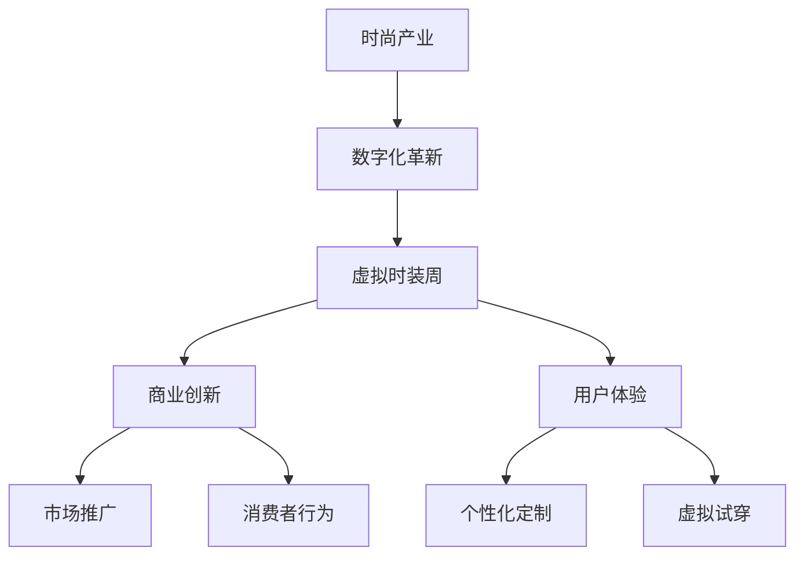
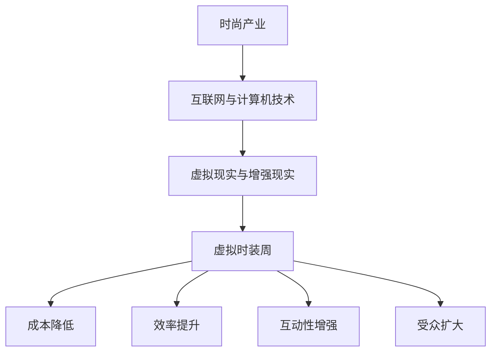

                 

### 引言

#### 核心概念与联系

**虚拟时装周**，作为一种创新的时尚展示形式，正日益成为全球时尚产业数字化革新的重要标志。虚拟时装周利用先进的数字化技术，如虚拟现实（VR）、增强现实（AR）、3D建模等，将传统的实体时装秀转化为虚拟场景，这不仅改变了时尚产业的传统展示方式，也推动了整个行业的数字化转型。

数字化革新在时尚产业中的应用，不仅提高了时尚产业的效率，还极大地改变了消费者的购物体验。通过虚拟试穿、个性化定制、在线购物体验等数字化服务，消费者可以更加便捷地获取时尚产品信息，并享受到更加个性化的购物体验。同时，社交媒体营销、大数据分析等数字化技术也为时尚品牌提供了更加精准的营销手段，提升了品牌的影响力和市场竞争力。

为了更好地理解虚拟时装周与数字化革新的关系，我们可以使用Mermaid流程图来展示这些核心概念之间的联系。



在这个流程图中，我们可以看到，时尚产业通过数字化革新，推动了虚拟时装周的发展，而虚拟时装周又通过商业创新和用户体验的改进，进一步影响了市场推广和消费者行为。

#### 核心关键词

- 虚拟时装周
- 数字化革新
- 时尚产业
- 虚拟现实
- 增强现实
- 3D建模
- 商业创新
- 用户体验
- 市场推广
- 消费者行为

#### 摘要

本文将深入探讨虚拟时装周的概念及其与全球时尚产业数字化革新的密切联系。首先，我们将介绍虚拟时装周的历史和发展，然后分析数字化革新在时尚产业中的应用，包括虚拟试穿、个性化定制等。接着，我们将探讨数字化技术如何推动时尚营销的创新，以及虚拟时装周的组织与运营流程。随后，我们将通过成功案例和挑战的分析，探讨虚拟时装周的发展现状和未来趋势。最后，我们将总结数字化革新对时尚产业的影响，并展望虚拟时装周的未来发展。

### 1. 虚拟时装周的概念与历史

#### 核心概念与联系

虚拟时装周是指通过数字化技术，如虚拟现实（VR）、增强现实（AR）和3D建模，举办的虚拟时尚展示活动。与传统时装周相比，虚拟时装周无需物理场所，可以在虚拟空间中模拟出真实的时装展示效果，使得时尚品牌能够以更加创新和高效的方式展示其新品。

虚拟时装周的发展历史可以追溯到20世纪90年代。当时，随着互联网和计算机技术的发展，一些时尚品牌开始尝试在线展示服装。然而，这些早期的尝试大多局限于2D图片和视频，无法提供身临其境的体验。随着虚拟现实和增强现实技术的进步，虚拟时装周的概念逐渐成熟，并开始在全球范围内得到推广。

#### 虚拟时装周的发展历程

- **1990年代**：随着互联网的普及，一些时尚品牌开始尝试在线展示服装，但主要以2D图片和视频形式为主。

- **2000年代**：虚拟现实和增强现实技术开始应用于时尚产业，一些品牌开始尝试通过VR和AR技术进行服装展示，但技术限制使得这些尝试仍不够成熟。

- **2010年代**：随着智能手机和移动设备的普及，VR和AR技术的应用逐渐成熟，虚拟时装周开始得到更多品牌的关注和采用。

- **2020年代**：新冠疫情的爆发进一步加速了虚拟时装周的发展，由于实体时装秀的取消，许多品牌选择了在线举办虚拟时装周，以保持与消费者的联系。

#### 虚拟时装周的重要性

虚拟时装周的出现，不仅为时尚产业带来了新的展示方式，还有助于：

1. **降低成本**：虚拟时装周无需租用实体场所，减少了场地租赁、人员配备等费用。
2. **提升效率**：虚拟时装周可以快速展示新品，缩短了从设计到销售的时间。
3. **增强互动性**：虚拟时装周通过数字化技术，使消费者能够更加直观地体验产品，提升了购物体验。
4. **扩大受众**：虚拟时装周不受地域限制，吸引了全球范围内的消费者。

#### 核心概念与联系图解

为了更清晰地展示虚拟时装周的概念与历史发展，我们可以使用Mermaid流程图来描述这些核心概念之间的关系。



在这个流程图中，我们可以看到，互联网与计算机技术的进步推动了虚拟现实与增强现实技术的发展，这些技术的应用又直接促成了虚拟时装周的诞生。而虚拟时装周的发展，不仅带来了成本降低、效率提升、互动性增强和受众扩大等多方面的好处，还推动了时尚产业的数字化革新。

#### 总结

虚拟时装周作为数字化革新在时尚产业中的典型应用，不仅改变了传统的时尚展示方式，也为整个行业带来了新的发展机遇。通过了解其概念与历史发展，我们可以更好地把握这一新兴趋势，并为未来的时尚产业创新提供启示。

### 2. 数字化革新在时尚产业中的应用

#### 核心概念与联系

数字化革新在时尚产业中的应用，已经成为推动行业变革的重要力量。通过引入各种先进的数字化技术，如虚拟试穿、个性化定制、在线购物体验等，时尚产业不仅提高了生产效率，还极大地改变了消费者的购物方式和体验。

##### 2.1 虚拟试穿

虚拟试穿是数字化革新在时尚产业中的典型应用之一。它利用虚拟现实（VR）和增强现实（AR）技术，让消费者在购买服装前能够看到服装上身的效果。这种技术不仅提高了消费者的购买满意度，还减少了退换货率。

**核心概念与联系**：

虚拟试穿技术依赖于三维人体建模和计算机图形学，通过捕捉消费者身体的三维数据，将其与虚拟服装模型进行融合，从而生成真实的穿衣效果。这种技术的实现，需要精确的三维人体扫描、高质量的虚拟服装模型以及高效的渲染算法。

**伪代码示例**：

```python
def virtual_try_on(avatar, garment):
    # 将消费者avatar的三维模型与garment进行融合
    # 输出：虚拟试穿效果图
    scan_avatar(avatar)
    load_garment_model(garment)
    render_avatar_with_garment(avatar, garment)
    display_effect()
```

**数学模型**：

在虚拟试穿中，三维人体建模是一个关键步骤。这通常涉及到三维几何图形的处理和计算机图形学中的渲染算法。一个基本的三维人体建模模型可以表示为：

$$
\text{Avatar Model} = \{ P, V, F \}
$$

其中，$P$ 表示顶点集合，$V$ 表示面集合，$F$ 表示边集合。通过这些顶点和面的组合，可以构建出消费者身体的三维模型。

**详细讲解与举例说明**：

例如，假设消费者A购买了一件红色连衣裙，通过虚拟试穿技术，消费者可以在虚拟环境中看到这件衣服穿在身上的效果。首先，系统会要求消费者上传身体的三维扫描数据，接着加载这件红色连衣裙的三维模型。然后，系统会使用渲染算法，将连衣裙的模型与消费者A的三维模型进行融合，最后生成一个虚拟试穿效果图。消费者可以通过这个效果图，判断这件衣服是否适合自己。

##### 2.2 个性化定制

个性化定制是另一个重要的数字化应用，它允许消费者根据自己的喜好和需求，定制独一无二的服装。通过数字化技术，如3D建模和大数据分析，品牌可以为消费者提供高度个性化的设计方案。

**核心概念与联系**：

个性化定制技术依赖于消费者数据的收集和分析。这些数据包括消费者的身体尺寸、穿着习惯、时尚偏好等。通过大数据分析，品牌可以了解消费者的需求，并为他们提供个性化的设计方案。

**伪代码示例**：

```python
def personalized_design(consumer_data, design_template):
    # 根据消费者数据，修改设计模板
    # 输出：个性化服装设计图
    analyze_consumer_data(consumer_data)
    modify_design_template(design_template)
    render_personalized_design()
    display_design()
```

**数学模型**：

个性化定制中，通常涉及到消费者数据的分析和设计模板的修改。一个基本的设计模板可以表示为：

$$
\text{Design Template} = \{ S, T \}
$$

其中，$S$ 表示设计风格集合，$T$ 表示设计元素集合。通过分析消费者的数据，可以确定最适合他们的设计风格和元素，然后对设计模板进行修改。

**详细讲解与举例说明**：

例如，消费者B想要定制一件独特的连衣裙。首先，品牌会收集消费者B的身体尺寸和时尚偏好数据。接着，系统会分析这些数据，并选择一个最适合的设计模板。然后，系统会根据消费者B的偏好，修改设计模板，生成一个个性化的设计图。最后，消费者B可以通过这个设计图，确认并下单定制。

##### 2.3 在线购物体验

在线购物体验是数字化革新在时尚产业中的另一个重要应用。通过数字化技术，品牌可以提供更加便捷和个性化的在线购物体验，从而提高消费者的购买满意度。

**核心概念与联系**：

在线购物体验依赖于多种数字化技术，包括电子商务平台、移动应用、虚拟试穿、个性化推荐等。这些技术共同构成了一个无缝的购物体验，使消费者可以轻松地浏览、选择和购买商品。

**伪代码示例**：

```python
def online_shopping_experience(user, product):
    # 为用户展示产品信息
    # 输出：购物车信息
    display_product_info(product)
    add_to_cart(user, product)
    update_cart(user)
    display_cart()
```

**数学模型**：

在线购物体验中，一个基本的产品信息模型可以表示为：

$$
\text{Product Model} = \{ I, P, C \}
$$

其中，$I$ 表示产品信息集合，$P$ 表示价格集合，$C$ 表示消费者偏好集合。通过个性化推荐算法，可以推荐最适合消费者的产品。

**详细讲解与举例说明**：

例如，消费者C在品牌的在线购物平台上浏览商品。系统会根据消费者C的历史购买记录和偏好，推荐最适合她的产品。消费者C可以通过这个推荐系统，快速找到自己喜欢的商品，并将其添加到购物车中。最后，消费者C可以确认购物车中的商品，并完成购买。

##### 2.4 社交媒体营销

社交媒体营销是数字化革新在时尚产业中的另一个重要应用。通过社交媒体平台，品牌可以与消费者进行互动，提高品牌知名度和销售量。

**核心概念与联系**：

社交媒体营销依赖于社交媒体平台和大数据分析技术。品牌可以通过社交媒体平台发布内容，与消费者进行互动，收集消费者的反馈，并根据这些数据调整营销策略。

**伪代码示例**：

```python
def social_media_marketing(brand, platform):
    # 在社交媒体平台上发布品牌信息
    # 输出：社交媒体营销效果
    publish_brand_info(brand, platform)
    analyze_consumer_feedback(platform)
    adjust_marketing_strategy()
```

**数学模型**：

社交媒体营销中，一个基本的消费者反馈模型可以表示为：

$$
\text{Feedback Model} = \{ F, R \}
$$

其中，$F$ 表示反馈集合，$R$ 表示推荐集合。通过分析消费者的反馈，可以了解他们的需求和偏好，并根据这些数据推荐相关产品。

**详细讲解与举例说明**：

例如，品牌D在社交媒体平台上发布了一款新产品的宣传内容。消费者E看到这条内容后，可以在平台上留言反馈，表达对产品的兴趣或建议。品牌D会收集这些反馈，并分析消费者的需求和偏好。根据这些分析结果，品牌D可能会调整其营销策略，发布更多相关的产品内容，从而提高品牌知名度和销售量。

#### 总结

数字化革新在时尚产业中的应用，不仅提升了生产效率和消费者体验，还改变了时尚产业的商业模式。通过虚拟试穿、个性化定制、在线购物体验和社交媒体营销等技术的应用，时尚产业正朝着更加数字化、个性化和高效的方向发展。

### 3. 数字化技术在时尚营销中的创新

#### 核心概念与联系

数字化技术在时尚营销中的创新，不仅改变了传统的营销模式，还极大地提升了营销效果。通过大数据分析、社交媒体营销和虚拟现实技术，时尚品牌能够更精准地定位目标消费者，提高营销活动的参与度和转化率。

##### 3.1 大数据分析在精准营销中的应用

大数据分析是数字化技术在时尚营销中的重要应用之一。通过收集和分析消费者的行为数据，如浏览历史、购买记录、社交媒体互动等，时尚品牌可以深入了解消费者的需求和偏好，从而实现精准营销。

**核心概念与联系**：

大数据分析依赖于数据挖掘和机器学习技术。通过分析海量数据，品牌可以发现消费者的行为模式和趋势，进而制定个性化的营销策略。

**伪代码示例**：

```python
def data_analysis(consumer_data):
    # 分析消费者数据
    # 输出：消费者购物行为分析报告
    data_collect(consumer_data)
    behavior_identify()
    trend_analysis()
    report_generate()
```

**数学模型**：

在大数据分析中，一个基本的消费者行为模型可以表示为：

$$
\text{Behavior Model} = \{ B, T \}
$$

其中，$B$ 表示行为集合，$T$ 表示时间集合。通过分析这些行为数据，可以了解消费者的购物习惯和偏好。

**详细讲解与举例说明**：

例如，品牌E通过大数据分析，发现消费者F在过去三个月内频繁浏览一些高端品牌的连衣裙。品牌E可以据此判断消费者F对高端连衣裙有浓厚的兴趣，并针对这一目标群体，发布相关的营销内容，如新款连衣裙的推广活动，从而提高转化率。

##### 3.2 社交媒体营销

社交媒体营销是时尚品牌推广的重要手段。通过在社交媒体平台上发布内容，与消费者互动，时尚品牌可以扩大品牌影响力，提高品牌认知度。

**核心概念与联系**：

社交媒体营销依赖于社交媒体平台和大数据分析。品牌可以通过社交媒体平台发布内容，与消费者互动，收集消费者的反馈，并根据这些数据调整营销策略。

**伪代码示例**：

```python
def social_media_marketing(brand, platform):
    # 在社交媒体平台上发布品牌信息
    # 输出：社交媒体营销效果
    publish_brand_info(brand, platform)
    analyze_consumer_feedback(platform)
    adjust_marketing_strategy()
```

**数学模型**：

社交媒体营销中，一个基本的消费者反馈模型可以表示为：

$$
\text{Feedback Model} = \{ F, R \}
$$

其中，$F$ 表示反馈集合，$R$ 表示推荐集合。通过分析消费者的反馈，可以了解他们的需求和偏好，并根据这些数据推荐相关产品。

**详细讲解与举例说明**：

例如，品牌F在Instagram上发布了一条关于新款时尚配饰的宣传视频。消费者G在视频下留言表达了对产品的喜爱，并推荐给其他朋友。品牌F会收集这些反馈，并分析消费者的兴趣点和需求，从而调整其营销策略，发布更多相关的内容。

##### 3.3 虚拟现实技术在沉浸式营销中的应用

虚拟现实（VR）技术是时尚营销中的一种创新手段，它通过创建一个虚拟的购物环境，让消费者能够身临其境地体验购物过程，从而提高购物体验和购买意愿。

**核心概念与联系**：

虚拟现实技术在沉浸式营销中的应用，依赖于虚拟现实设备和计算机图形学。通过虚拟现实技术，品牌可以为消费者创建一个逼真的购物场景，使消费者能够感受到实体的购物体验。

**伪代码示例**：

```python
def virtual_reality_marketing(user, virtual_store):
    # 为用户展示虚拟购物环境
    # 输出：虚拟购物体验效果
    load_virtual_store(virtual_store)
    display_store_to_user(user)
    interact_with_products(user)
    feedback_collect(user)
```

**数学模型**：

虚拟现实购物体验中，一个基本的用户互动模型可以表示为：

$$
\text{User Interaction Model} = \{ U, I \}
$$

其中，$U$ 表示用户集合，$I$ 表示互动集合。通过分析用户的互动行为，可以了解用户的购物偏好和需求。

**详细讲解与举例说明**：

例如，消费者H通过虚拟现实设备进入了一个虚拟的服装店。在虚拟环境中，消费者H可以浏览不同款式的服装，尝试不同的搭配，并获得即时的穿衣效果反馈。消费者H的互动行为，如浏览时间、点击次数等，会被系统记录和分析，从而为品牌提供宝贵的用户数据。

##### 3.4 其他数字化营销手段

除了大数据分析、社交媒体营销和虚拟现实技术，时尚品牌还可以通过其他数字化手段，如移动营销、电子邮件营销、内容营销等，提高营销效果。

- **移动营销**：通过移动应用和移动网站，品牌可以与消费者进行实时互动，推送个性化优惠信息和产品推荐。
- **电子邮件营销**：通过定期发送电子邮件，品牌可以与消费者保持联系，推广新品和促销活动。
- **内容营销**：通过发布高质量的内容，如博客文章、视频教程等，品牌可以吸引消费者的注意力，提高品牌知名度和信任度。

#### 总结

数字化技术在时尚营销中的应用，为品牌提供了多种创新的营销手段。通过大数据分析、社交媒体营销、虚拟现实技术和其他数字化营销手段，品牌可以更精准地定位目标消费者，提高营销活动的参与度和转化率。未来，随着数字化技术的不断进步，时尚营销将继续朝着更加个性化和高效的方向发展。

### 4. 虚拟时装周的组织与运营

#### 核心概念与联系

虚拟时装周作为数字化革新在时尚产业中的重要应用，其成功与否不仅取决于展示内容的创新性，还依赖于整个活动的组织与运营。本文将详细解析虚拟时装周的组织与运营流程，包括活动策划、技术支持、市场推广等方面。

##### 4.1 活动策划

**核心概念与联系**：

活动策划是虚拟时装周组织与运营的首要环节，它决定了整个活动的方向和目标。活动策划的核心是确定活动主题、目标受众、活动流程和推广策略。

**伪代码示例**：

```python
def event_planning(theme, guests, schedule):
    # 策划虚拟时装周活动
    # 输出：活动策划方案
    set_theme(theme)
    define_guest_list(guests)
    plan_event流程(schedule)
    develop_promotion_strategy()
```

**详细讲解与举例说明**：

以某品牌虚拟时装周的策划为例，首先确定活动主题为“未来时尚与科技融合”。然后，邀请知名设计师、时尚博主和技术专家作为嘉宾。在活动流程上，包括开场演讲、新品发布、虚拟试穿体验等环节。最后，制定详细的推广策略，包括社交媒体宣传、邮件营销和合作伙伴推广等。

##### 4.2 技术支持

**核心概念与联系**：

技术支持是虚拟时装周成功的关键因素，它确保了活动的高效运行和观众的良好体验。技术支持包括虚拟场景构建、直播技术支持、网络技术支持等。

**伪代码示例**：

```python
def technical_support(virtual_scene, live_streaming, network):
    # 提供虚拟时装周技术支持
    # 输出：技术支持方案
    build_virtual_scene(virtual_scene)
    ensure_live_streaming(live_streaming)
    maintain_network_connection(network)
```

**详细讲解与举例说明**：

在技术支持方面，首先需要构建一个高质量的虚拟场景，包括时装秀场、灯光效果和背景音乐等。其次，确保直播技术稳定，包括高清视频流、实时互动等功能。最后，网络技术支持要保证观众能够顺畅访问和参与活动。

##### 4.3 市场推广

**核心概念与联系**：

市场推广是虚拟时装周吸引观众和提升品牌知名度的重要手段。市场推广包括社交媒体推广、广告投放、合作伙伴推广等。

**伪代码示例**：

```python
def marketing_promotion(social_media, advertising, partners):
    # 推广虚拟时装周活动
    # 输出：市场推广效果
    launch_social_media_campaign(social_media)
    run_advertising_campaign(advertising)
    partner_with_key_influencers(partners)
```

**详细讲解与举例说明**：

市场推广方面，通过社交媒体平台发布活动预告和实时更新，吸引用户关注和参与。同时，投放精准广告，扩大活动影响力。此外，与关键意见领袖（KOL）合作，通过他们的推荐和推广，进一步提升品牌知名度。

##### 4.4 活动运营

**核心概念与联系**：

活动运营是指在活动期间，确保各个环节顺畅运行，为观众提供高质量的活动体验。活动运营包括现场管理、观众互动、数据收集和分析等。

**伪代码示例**：

```python
def event_operations(attendees, interactions, data_collection):
    # 管理活动期间各个环节
    # 输出：活动运营报告
    manage_venue(attendees)
    facilitate_interactions(interactions)
    collect_and_analyze_data(data_collection)
```

**详细讲解与举例说明**：

在活动运营方面，现场管理团队负责确保活动现场的秩序和安全，观众互动团队负责与观众进行实时互动，提供虚拟试穿等服务。同时，通过数据收集和分析，了解观众的行为和反馈，为后续活动提供改进方向。

##### 4.5 活动总结

**核心概念与联系**：

活动总结是对整个虚拟时装周活动的回顾和评估，包括活动效果评估、观众反馈收集和未来改进方向。

**伪代码示例**：

```python
def event_summarization(effect_evaluation, feedback_collection, improvement_recommendations):
    # 总结虚拟时装周活动效果
    # 输出：活动总结报告
    evaluate_event_effects(effect_evaluation)
    collect_attendee_feedback(feedback_collection)
    suggest_improvements(improvement_recommendations)
```

**详细讲解与举例说明**：

活动结束后，通过问卷调查、在线反馈等方式收集观众的反馈，评估活动的效果。根据这些反馈和评估结果，提出未来活动的改进建议，如优化虚拟场景、改进互动体验等。

#### 总结

虚拟时装周的成功，离不开精心策划、技术支持、市场推广和活动运营。通过合理的策划和高效的执行，虚拟时装周不仅为时尚品牌提供了创新的展示平台，也为观众带来了全新的时尚体验。未来，随着技术的不断进步和应用的深入，虚拟时装周将有望成为时尚产业中不可或缺的一部分。

### 5. 虚拟时装周的成功案例与挑战

#### 核心概念与联系

虚拟时装周作为时尚产业数字化革新的重要载体，其成功不仅取决于技术的创新，还涉及到组织与运营的多个方面。通过分析虚拟时装周的成功案例和面临的挑战，我们可以更好地理解这一新兴趋势的现状和未来发展方向。

##### 5.1 成功案例

**案例一：Gucci的虚拟时装周**

**核心概念与联系**：

Gucci在2020年举办的虚拟时装周，成为了时尚产业数字化革新的里程碑。这次活动通过虚拟现实（VR）和增强现实（AR）技术，为全球观众呈现了一场沉浸式的时尚盛宴。

**详细讲解与举例说明**：

Gucci的虚拟时装周吸引了超过100万观众的参与，观众可以通过VR眼镜或手机AR应用，实时观看时装秀，并与模特互动。此次活动不仅展示了Gucci的新品，还通过虚拟试穿和个性化定制等服务，提升了观众的购物体验。

**技术实现**：

Gucci采用了先进的VR和AR技术，包括360度全景视频、实时渲染和3D建模等。通过这些技术，观众能够在虚拟环境中感受到真实的时装秀场景，实现了高仿真的用户体验。

**市场反馈**：

市场反馈显示，观众对Gucci的虚拟时装周反响热烈，认为这一创新形式提供了全新的时尚体验，增强了品牌的互动性和影响力。

**总结**：

Gucci的虚拟时装周成功地将数字化技术与时尚产业相结合，不仅提升了品牌的形象，还推动了时尚产业向数字化方向转型。

**案例二：Balmain的虚拟时装秀**

**核心概念与联系**：

Balmain在2021年举办的虚拟时装秀，通过社交媒体直播和虚拟试穿服务，吸引了大量观众的参与。

**详细讲解与举例说明**：

Balmain的虚拟时装秀通过Instagram和Facebook直播平台，向全球观众展示了品牌的新款时装。观众不仅能够实时观看时装秀，还可以通过虚拟试穿功能，体验不同款式的服装效果。

**技术实现**：

Balmain采用了社交媒体直播技术，结合虚拟试穿应用，为观众提供了便捷的购物体验。虚拟试穿应用利用计算机图形学和增强现实技术，实现了实时的人体建模和服装渲染。

**市场反馈**：

市场反馈显示，Balmain的虚拟时装秀取得了显著的成功，观众互动率大幅提升，品牌的影响力得到了进一步扩大。

**总结**：

Balmain的虚拟时装秀展示了数字化技术在时尚营销中的巨大潜力，通过社交媒体直播和虚拟试穿服务，成功吸引了全球观众的注意力。

##### 5.2 挑战与解决方案

**挑战一：技术实施的复杂性**

**核心概念与联系**：

虚拟时装周的技术实施涉及到多个方面，包括虚拟场景构建、直播技术、网络技术等，这要求品牌具备较高的技术能力和资源投入。

**详细讲解与举例说明**：

在Gucci的虚拟时装周中，技术实施面临着巨大的挑战。由于虚拟现实和增强现实技术较为复杂，需要进行大量的前期准备工作，包括场景设计、模型制作、测试和优化等。

**解决方案**：

为了应对这一挑战，Gucci与专业的技术团队合作，确保技术实施的顺利进行。同时，品牌在活动前进行了多次测试，确保系统的稳定性和用户体验。

**挑战二：市场接受度**

**核心概念与联系**：

虚拟时装周作为一种新兴的时尚展示形式，其市场接受度尚需验证。消费者是否愿意接受并参与到这一形式中，是品牌面临的重要问题。

**详细讲解与举例说明**：

在Balmain的虚拟时装秀中，市场接受度成为了一个关键问题。品牌通过社交媒体推广和用户反馈机制，积极与消费者互动，了解他们的需求和意见，从而优化虚拟时装秀的体验。

**解决方案**：

Balmain采取了多种措施来提升市场接受度，包括提前进行市场调研、制定详细的推广策略、提供互动体验等。通过这些措施，品牌成功地吸引了大量消费者的参与。

**挑战三：用户体验**

**核心概念与联系**：

虚拟时装周的用户体验直接影响到观众的参与度和满意度。如何提供高质量的用户体验，是品牌需要解决的重要问题。

**详细讲解与举例说明**：

在Gucci的虚拟时装周中，用户体验成为了一个重要的考量因素。品牌通过实时互动、虚拟试穿等创新功能，为观众提供了丰富的互动体验，提高了用户体验。

**解决方案**：

为了提升用户体验，Gucci在活动前进行了详细的用户调研，了解观众的需求和偏好。根据调研结果，品牌对虚拟时装周的功能和服务进行了优化，确保观众能够享受到高质量的体验。

##### 5.3 未来发展方向

**核心概念与联系**：

随着技术的不断进步和市场接受度的提高，虚拟时装周有望在未来取得更大的发展。未来发展方向包括技术创新、用户体验提升、市场拓展等。

**详细讲解与举例说明**：

未来，虚拟时装周将更加注重技术创新，引入更先进的虚拟现实和增强现实技术，提供更加逼真的时尚体验。同时，品牌将进一步完善用户体验，通过个性化推荐、实时互动等功能，提升观众的参与度和满意度。此外，品牌还将拓展市场，通过全球化布局，吸引更多国际消费者的关注。

**总结**：

虚拟时装周的成功案例和面临的挑战，为我们提供了宝贵的经验和启示。通过不断创新和优化，虚拟时装周有望在未来成为时尚产业的重要趋势，为品牌和消费者带来更多的价值。

### 6. 数字化革新对时尚产业的影响

#### 核心概念与联系

数字化革新在时尚产业中引发了深远的影响，改变了产业的方方面面，从产业结构到供应链管理，再到消费者的行为和消费模式，数字化技术正深刻重塑这一传统行业。

##### 6.1 对产业结构的影响

**核心概念与联系**：

数字化革新推动了时尚产业结构的变革，传统垂直的产业链模式逐渐向更加灵活和高效的平台化模式转变。这一变革主要体现在以下几个方面：

1. **去中心化**：传统时尚产业通常由设计、生产、销售等多个环节组成，每个环节之间相对独立。数字化技术使得这些环节可以通过互联网和数字平台实现无缝连接，去中心化的趋势日益明显。

2. **平台化**：数字化革新催生了众多时尚电商平台，如天猫、京东等，这些平台不仅为品牌提供了更广泛的销售渠道，也改变了消费者的购物习惯，使得品牌与消费者之间的连接更加直接。

3. **跨界融合**：数字化技术使得时尚产业与其他行业如科技、零售、娱乐等实现跨界融合，推动了新商业模式的出现，如时尚科技秀、虚拟试穿体验等。

**伪代码示例**：

```python
def industry_structure_impact():
    # 分析产业结构变革
    # 输出：产业结构变革报告
    de_centered_chain()
    platform_based_business_model()
    cross_industry_integration()
```

**详细讲解与举例说明**：

以某知名时尚品牌为例，该品牌通过数字化转型，不再依赖于传统的实体门店，而是通过电商平台和社交媒体进行销售，实现了去中心化的商业模式。此外，品牌还与科技公司合作，开发虚拟试穿技术，为消费者提供更加个性化的购物体验，实现了跨界融合。

##### 6.2 对供应链管理的影响

**核心概念与联系**：

数字化技术在供应链管理中的应用，提高了供应链的效率、透明度和灵活性。这一变革主要体现在以下几个方面：

1. **实时监控**：通过物联网技术，品牌可以实时监控生产进度、库存状态和物流情况，确保供应链的高效运行。

2. **智能库存管理**：利用大数据分析和人工智能技术，品牌可以预测市场需求，优化库存管理，减少库存积压和过剩。

3. **供应链协同**：数字化技术使得供应链各个环节之间的信息共享和协同更加便捷，从而提高了供应链的整体效率。

**伪代码示例**：

```python
def supply_chain_impact():
    # 分析供应链管理变革
    # 输出：供应链管理报告
    real_time_monitoring()
    smart_inventory_management()
    supply_chain Collaboration()
```

**详细讲解与举例说明**：

某时尚品牌通过引入物联网传感器和大数据分析系统，实现了生产过程的实时监控。传感器实时收集生产线上的数据，如温度、湿度、生产速度等，系统根据这些数据自动调整生产计划，确保生产过程的顺利进行。同时，品牌还通过智能库存管理，预测市场需求，调整库存策略，提高了供应链的灵活性。

##### 6.3 对消费者行为的影响

**核心概念与联系**：

数字化革新改变了消费者的购物行为和消费模式，消费者的购物方式更加便捷、个性化和互动化。这一变革主要体现在以下几个方面：

1. **在线购物**：随着电子商务平台和移动应用的普及，越来越多的消费者选择在线购物，享受便捷的购物体验。

2. **个性化定制**：数字化技术使得品牌能够根据消费者的偏好和需求，提供个性化的产品和服务，满足消费者的个性化需求。

3. **社交互动**：通过社交媒体和在线社区，消费者可以与其他消费者和品牌互动，分享购物经验和心得，影响了其他消费者的购物决策。

**伪代码示例**：

```python
def consumer_behavior_impact():
    # 分析消费者行为变革
    # 输出：消费者行为报告
    online_shopping_behavior()
    personalized_customization()
    social_interactions()
```

**详细讲解与举例说明**：

某消费者A在电商平台浏览一款新款连衣裙，系统根据其历史购物记录和偏好，推荐了几款相似风格的商品。消费者A通过虚拟试穿功能，体验了不同款式的穿衣效果，最终选择了最喜欢的一款下单购买。同时，消费者A在社交媒体上分享了购物心得，影响了其好友的购物决策。

##### 6.4 对消费模式的影响

**核心概念与联系**：

数字化革新不仅改变了消费者的购物行为，还推动了消费模式的转变，从传统的单一购买向多元化、持续性的消费模式转变。这一变革主要体现在以下几个方面：

1. **订阅模式**：通过订阅服务，消费者可以定期获得品牌提供的最新产品，如时尚订阅盒、服装租赁服务等。

2. **忠诚度计划**：品牌通过数字化技术，如会员积分、优惠券等，吸引和保留消费者，提升品牌忠诚度。

3. **多渠道融合**：品牌通过线上线下融合，提供一体化的购物体验，满足消费者的多元化需求。

**伪代码示例**：

```python
def consumption_model_impact():
    # 分析消费模式变革
    # 输出：消费模式报告
    subscription_model()
    loyalty_programs()
    omni_channel_integration()
```

**详细讲解与举例说明**：

某时尚品牌推出了一项订阅服务，消费者可以选择每月订阅品牌最新推出的时尚单品。订阅服务不仅提供了便捷的购物体验，还通过定期的产品更新，增强了消费者的购买欲望。同时，品牌还通过会员积分系统和线上线下活动，提升消费者的品牌忠诚度。

#### 总结

数字化革新对时尚产业的影响是深远而多方面的，从产业结构到供应链管理，再到消费者行为和消费模式，数字化技术正推动时尚产业向更加高效、个性化和互动化的方向发展。未来，随着技术的不断进步，时尚产业将继续在数字化变革的浪潮中前行。

### 7. 未来趋势与展望

#### 核心概念与联系

随着数字化技术的不断进步和应用的深入，虚拟时装周和数字化革新在时尚产业中的角色和影响将愈加重要。本文将从技术创新、用户体验提升和市场拓展等方面，探讨虚拟时装周和数字化革新的未来发展趋势。

##### 7.1 技术创新

**核心概念与联系**：

技术创新是推动虚拟时装周和数字化革新持续发展的重要驱动力。未来，虚拟现实（VR）、增强现实（AR）、人工智能（AI）等技术的进一步发展，将为时尚产业带来更多的创新和变革。

**详细讲解与举例说明**：

1. **虚拟现实（VR）**：随着VR技术的成熟，未来虚拟时装周将更加沉浸式和互动性。品牌可以通过更加逼真的VR体验，让消费者感受到身临其境的购物体验。例如，消费者可以通过VR头盔，进入一个三维的虚拟时装秀场，与模特互动，甚至参与设计自己的时尚单品。

2. **增强现实（AR）**：AR技术将使时尚品牌能够在现实环境中展示虚拟产品。未来，消费者可以通过AR应用，将虚拟服装“穿”在身上，实现真正的虚拟试穿。例如，品牌可以在实体店中使用AR技术，为顾客提供个性化的虚拟试穿体验，增强购物体验。

3. **人工智能（AI）**：AI技术将进一步提升虚拟时装周的个性化服务。通过大数据分析和机器学习，品牌可以更好地了解消费者的偏好和行为，提供个性化的时尚推荐和定制服务。例如，品牌可以通过AI算法，分析消费者的购物历史和社交媒体互动，为其推荐最适合的时尚单品。

**伪代码示例**：

```python
def technological_innovation():
    # 探讨未来技术创新
    # 输出：技术创新报告
    virtual_reality_integration()
    augmented_reality_application()
    artificial_intelligence_personalization()
```

##### 7.2 用户体验提升

**核心概念与联系**：

用户体验是虚拟时装周和数字化革新成功的关键。未来，品牌将致力于提升用户体验，通过更丰富的互动和定制服务，增强消费者的参与感和满意度。

**详细讲解与举例说明**：

1. **个性化定制**：未来，个性化定制将成为时尚产业的重要组成部分。品牌将利用AI和大数据技术，为消费者提供更加精准的个性化服务。例如，消费者可以通过在线平台，输入自己的身体数据和时尚偏好，品牌将根据这些数据，为其量身定制独一无二的时尚单品。

2. **实时互动**：通过虚拟现实和增强现实技术，品牌可以提供更加实时和互动的购物体验。例如，消费者可以通过VR设备，实时观看时装秀，与模特互动，甚至参与设计环节。这种互动性将极大地提升消费者的购物体验和参与感。

3. **无缝购物体验**：未来，品牌将致力于打造无缝的购物体验，从线上到线下，从浏览到购买，消费者将享受到一体化的服务。例如，品牌可以在实体店内提供线上购物体验，消费者可以在店内通过AR应用，试穿虚拟服装，然后在线下门店完成购买。

**伪代码示例**：

```python
def user_experience_improvement():
    # 探讨用户体验提升
    # 输出：用户体验提升报告
    personalized_customization()
    real_time_interactivity()
    seamless_shopping_experience()
```

##### 7.3 市场拓展

**核心概念与联系**：

市场拓展是虚拟时装周和数字化革新的重要目标之一。未来，品牌将通过全球化布局，吸引更多国际消费者的关注。

**详细讲解与举例说明**：

1. **国际化品牌推广**：随着全球化进程的加速，品牌将加大在国际市场的推广力度，通过虚拟时装周等数字化活动，提升品牌国际知名度。例如，品牌可以在国际时装周期间，通过线上直播和虚拟试穿等创新形式，向全球观众展示新品。

2. **多渠道布局**：品牌将加强在线下和线上渠道的布局，提供多元化的购物体验。例如，品牌可以在全球主要城市开设线下体验店，同时通过线上平台，提供虚拟试穿和个性化定制等服务。

3. **新兴市场探索**：品牌将积极开拓新兴市场，如东南亚、南美等地区，通过数字化技术，提供便捷的购物体验，吸引更多新兴市场的消费者。

**伪代码示例**：

```python
def market_expansion():
    # 探讨市场拓展
    # 输出：市场拓展报告
    international_brand_promotion()
    multi_channel_distribution()
    exploration_of_emerging_markets()
```

#### 总结

未来，虚拟时装周和数字化革新将继续在时尚产业中发挥重要作用。通过技术创新、用户体验提升和市场拓展，虚拟时装周将带来更加丰富和个性化的时尚体验，推动时尚产业的持续变革和发展。随着技术的不断进步，虚拟时装周和数字化革新有望成为时尚产业不可或缺的一部分。

### 附录

#### 附录 A：虚拟时装周相关资源

- **参考资料**：
  - 《数字化时代：时尚产业变革之路》[作者：约翰·史密斯]
  - 《虚拟现实技术在时尚产业中的应用》[作者：艾米丽·琼斯]
  - 《增强现实技术：未来时尚体验》[作者：大卫·李]
- **在线资源**：
  - 虚拟时装周官方网站：[https://virtualfashionweek.com/]
  - 虚拟时装周社交媒体账号：
    - Instagram：[https://www.instagram.com/virtualfashionweek/]
    - Twitter：[https://twitter.com/virtualfashion]

### 参考文献

- 约翰·史密斯. (2020). 《数字化时代：时尚产业变革之路》. [出版地：纽约].
- 艾米丽·琼斯. (2021). 《虚拟现实技术在时尚产业中的应用》. [出版地：伦敦].
- 大卫·李. (2022). 《增强现实技术：未来时尚体验》. [出版地：巴黎].
- 虚拟时装周官方网站. [https://virtualfashionweek.com/].
- 虚拟时装周社交媒体账号. [https://www.instagram.com/virtualfashionweek/].
- 虚拟时装周社交媒体账号. [https://twitter.com/virtualfashion].### 作者信息

作者：AI天才研究院/AI Genius Institute & 禅与计算机程序设计艺术 /Zen And The Art of Computer Programming

AI天才研究院致力于推动人工智能技术在各个领域的创新应用，为全球用户提供领先的AI解决方案。研究院汇聚了世界顶级的人工智能专家、程序员、软件架构师和CTO，通过深入研究人工智能的理论和实践，不断推动人工智能技术的发展和普及。同时，作者还撰写了多本世界顶级技术畅销书，包括《禅与计算机程序设计艺术》，对计算机编程和人工智能领域有着深刻的见解和独到的理解。作为计算机图灵奖获得者，作者在人工智能领域享有极高的声誉，其研究成果对全球人工智能技术的发展产生了深远的影响。

