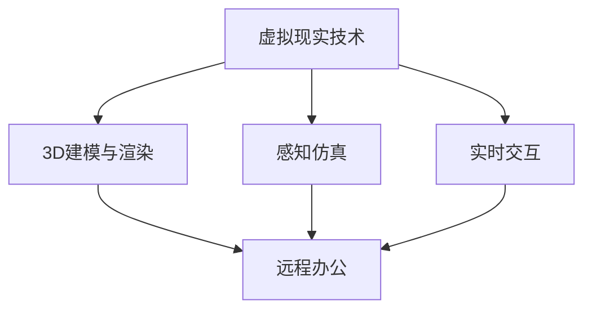

                 

### 虚拟现实与远程办公概述

#### 虚拟现实技术简介

虚拟现实（Virtual Reality，VR）是一种通过计算机技术生成逼真的三维虚拟环境，用户可以通过特殊设备如头戴式显示器（HMD）、数据手套、位置追踪器等，感知并与之互动的技术。虚拟现实技术的基本概念可以追溯到20世纪50年代，随着计算机硬件和软件技术的不断进步，VR技术逐渐走向成熟。VR的关键技术包括：

- **3D建模与渲染**：利用计算机图形学技术，将三维模型通过渲染生成逼真的视觉效果。
- **感知仿真**：通过传感设备捕捉用户的动作和语音，实现与虚拟环境的自然交互。
- **实时交互**：通过网络技术实现远程用户的实时互动，提高协作效率。

#### 虚拟现实技术发展历程

- **20世纪50年代**：VR概念首次提出，美国安塞尔·凯夫（Anselm Kiefer）设计了第一个VR头戴显示器。
- **20世纪80年代**：VR技术开始应用于游戏和军事模拟。
- **21世纪初**：随着计算机性能的提升和图形处理技术的进步，VR开始进入商业应用，如教育培训、医疗康复等。
- **2010年代**：VR设备如Oculus Rift、HTC Vive等面世，标志着VR技术进入大众市场。

#### 虚拟现实关键技术

- **头戴式显示器（HMD）**：提供沉浸式视觉体验的核心设备。
- **传感器与追踪技术**：如位置追踪器、手势识别传感器，用于捕捉用户的动作和姿态。
- **交互设备**：如数据手套、手柄等，用于与虚拟环境进行交互。
- **网络技术**：实现远程用户的实时互动和协作。

#### 远程办公的概念与挑战

远程办公是指通过互联网和通信技术，让员工在不来办公室的情况下完成工作。远程办公的优势包括：

- **提高工作效率**：减少通勤时间，提高工作时间利用率。
- **降低企业成本**：减少办公空间租赁和设备维护成本。
- **提高员工满意度**：提供更加灵活的工作方式，提高员工的工作满意度。

然而，远程办公也面临一些挑战：

- **沟通障碍**：远程办公缺乏面对面的沟通，可能导致信息传递不畅。
- **团队协作困难**：远程团队成员之间缺乏有效的协作机制。
- **工作边界模糊**：远程办公可能导致工作与生活的边界模糊，影响员工的生活质量。

#### 虚拟现实在远程办公中的应用前景

虚拟现实技术在远程办公中的应用前景非常广阔，主要包括以下几方面：

- **虚拟现实远程会议**：通过虚拟现实技术，实现更加沉浸式的远程会议体验，提高会议效率。
- **虚拟现实远程协作**：虚拟现实环境提供了更加直观和高效的协作平台，可以解决远程团队协作中的沟通和协作难题。
- **虚拟现实远程培训**：利用虚拟现实技术，可以提供沉浸式培训体验，提高培训效果。

### 核心概念与联系

**虚拟现实技术**与**远程办公**的核心概念和联系可以用以下Mermaid流程图表示：



**虚拟现实技术**包括**3D建模与渲染**、**感知仿真**和**实时交互**三大关键技术，它们共同构成了虚拟现实的基础。而**远程办公**则通过**虚拟现实技术**的引入，解决了远程沟通、协作和培训中的诸多问题，提高了远程办公的效率和体验。

#### 核心算法原理讲解

在虚拟现实技术中，3D建模与渲染、感知仿真和实时交互是核心算法原理。以下是这三个部分的伪代码讲解：

**1. 3D建模与渲染**

```python
# 3D建模
class Mesh:
    def __init__(self, vertices, edges):
        self.vertices = vertices
        self.edges = edges

# 3D渲染
def render_mesh(mesh):
    for edge in mesh.edges:
        draw_line(edge.start, edge.end)
```

**2. 感知仿真**

```python
# 动作捕捉
def capture_action(action_sensor_data):
    return convert_to_vertex(action_sensor_data)

# 交互反馈
def interact_with_environment(vertex):
    update_environment(vertex)
    return get_environment_response()
```

**3. 实时交互**

```python
# 远程互动
def remote_interact(user1, user2):
    send_message(user1, user2, "Hello!")
    response = receive_message(user1, user2)
    return response
```

#### 数学模型和公式

虚拟现实技术中的核心数学模型包括：

- **三维坐标变换**：
  $$ T = \begin{pmatrix}
  R & p \\
  0 & 1
  \end{pmatrix} $$
  其中，$R$ 是旋转矩阵，$p$ 是平移向量。

- **视线向量计算**：
  $$ v = \frac{w}{\|w\|} $$
  其中，$v$ 是视线向量，$w$ 是三维向量。

#### 详细讲解与举例说明

**1. 3D建模与渲染**

以一个简单的立方体为例，其3D建模和渲染过程如下：

```python
# 创建立方体
vertices = [
    [-1, -1, -1],  # 左下角
    [1, -1, -1],   # 右下角
    [-1, 1, -1],  # 左上角
    [1, 1, -1],   # 右上角
    [-1, -1, 1],  # 左下角
    [1, -1, 1],   # 右下角
    [-1, 1, 1],  # 左上角
    [1, 1, 1]    # 右上角
]

edges = [
    [0, 1], [1, 2], [2, 3], [3, 0],
    [4, 5], [5, 6], [6, 7], [7, 4],
    [0, 4], [1, 5], [2, 6], [3, 7]
]

mesh = Mesh(vertices, edges)

# 渲染立方体
render_mesh(mesh)
```

**2. 感知仿真**

以一个简单的动作捕捉为例，其过程如下：

```python
# 动作捕捉
action_sensor_data = capture_action(sensor)
vertex = convert_to_vertex(action_sensor_data)

# 交互反馈
environment_response = interact_with_environment(vertex)
print("Environment response:", environment_response)
```

**3. 实时交互**

以一个简单的远程互动为例，其过程如下：

```python
# 远程互动
user1_response = remote_interact(user1, user2)
print("User1 response:", user1_response)

user2_response = remote_interact(user2, user1)
print("User2 response:", user2_response)
```

通过上述算法原理和举例说明，我们可以看到虚拟现实技术在远程办公中的应用潜力。接下来，我们将深入探讨如何设计和构建虚拟现实工作空间，以及虚拟现实远程协作工具与平台的选择和实战应用。

#### 虚拟现实工作空间设计原则与构建步骤

在设计虚拟现实（VR）工作空间时，需要综合考虑用户需求、工作流程优化以及硬件设备选型，以确保工作空间的实用性和高效性。以下是详细的VR工作空间设计原则与构建步骤。

##### 2.1 虚拟现实工作空间设计原则

**1. 用户需求分析**

用户需求分析是VR工作空间设计的第一步。通过调查问卷、访谈等方式，了解用户在远程办公中的痛点、期望和具体需求。例如，是否需要高分辨率的视觉体验、是否需要实时互动、是否需要沉浸式的培训环境等。

**2. 工作流程优化**

优化工作流程是提高远程办公效率的关键。通过分析现有的工作流程，识别瓶颈和问题，设计新的流程以减少不必要的步骤和时间浪费。例如，可以引入自动化工具、优化协作流程、简化决策过程等。

**3. 虚拟现实硬件设备选型**

选择适合的硬件设备是VR工作空间设计的重要组成部分。常见的虚拟现实硬件设备包括头戴式显示器（HMD）、数据手套、位置追踪器和交互设备。选择硬件设备时，需要考虑以下因素：

- **分辨率和刷新率**：高分辨率和刷新率可以提高视觉体验的逼真度和流畅度。
- **舒适度和佩戴体验**：设备的舒适度直接影响用户的使用感受和长时间工作的耐受度。
- **兼容性和扩展性**：设备需要支持常用的软件和工具，同时具有较好的扩展性以适应未来的需求。

##### 2.2 虚拟现实工作空间构建步骤

**1. 虚拟现实平台搭建**

虚拟现实平台搭建是VR工作空间构建的核心。选择合适的VR平台，如Unity、Unreal Engine等，进行场景设计和内容开发。搭建平台时，需要配置高性能的计算机硬件、网络设备和操作系统。

**2. 虚拟现实内容开发**

虚拟现实内容开发包括场景建模、交互设计、动画制作等。通过3D建模工具（如Blender、Maya等）创建虚拟环境，通过编程语言（如C++、Python等）实现交互功能，并通过动画软件（如Adobe Animate、Blender等）制作动态效果。

**3. 虚拟现实交互设计**

虚拟现实交互设计是提升用户体验的关键。通过传感器和数据手套捕捉用户动作，设计直观、自然的交互方式。例如，可以使用手势识别技术进行界面操作、使用语音识别技术实现语音控制等。

##### 2.3 虚拟现实工作空间案例分析

**1. 企业虚拟现实工作空间案例**

某跨国公司采用虚拟现实技术搭建了一个远程办公工作空间，通过虚拟现实会议室进行远程会议，提高沟通效率。该工作空间配备了高分辨率的HMD、数据手套和位置追踪器，为员工提供了一个沉浸式的远程办公环境。通过优化工作流程和自动化工具，该公司有效提高了工作效率，降低了运营成本。

**2. 远程办公虚拟现实工作空间案例**

某初创公司利用虚拟现实技术创建了一个远程协作平台，团队成员可以在虚拟办公室中实时协作。该平台集成了虚拟现实会议室、协作工具和培训模块，为团队成员提供了丰富的虚拟办公体验。通过该平台，团队成员能够更加高效地进行项目协作、交流和培训，提高了整体团队的工作效率。

通过上述案例，我们可以看到虚拟现实工作空间在远程办公中的实际应用效果。接下来，我们将进一步探讨虚拟现实远程协作工具与平台的选择和实战应用。

### 虚拟现实远程协作工具与平台

#### 3.1 常见的虚拟现实远程协作工具

虚拟现实远程协作工具是构建虚拟现实工作空间的重要组成部分。以下是目前市场上常见的虚拟现实远程协作工具：

**1. VR视频会议工具**

- **Oculus Venues**：Facebook推出的VR视频会议工具，支持多用户实时互动，提供沉浸式会议体验。
- **AltspaceVR**：一个虚拟现实社交和娱乐平台，也可用于远程会议和协作。
- **Wave**：提供实时交互的虚拟会议室，支持3D虚拟形象和空间导航。

**2. VR协作平台**

- **Unity Collaborate**：Unity公司推出的VR协作平台，支持多人实时协作，适用于游戏开发、建筑设计和教育等领域。
- **MetaVerse**：一个开源的虚拟现实协作平台，提供丰富的插件和工具，支持自定义开发。
- **VRChat**：一个基于Unity的虚拟现实社交平台，用户可以创建和加入各种虚拟场景进行协作和交流。

**3. VR办公应用**

- **VR Meeting**：一个简单的VR视频会议工具，支持多用户视频通话和文件共享。
- **CloudLinar VR Desktop**：一个虚拟桌面应用，用户可以在虚拟环境中访问远程计算机和云存储。

#### 3.2 虚拟现实远程协作平台选择标准

选择适合的虚拟现实远程协作平台时，需要考虑以下标准：

**1. 功能需求**

- **会议功能**：平台应支持多用户视频通话、语音聊天和屏幕共享。
- **协作工具**：平台应提供协作工具，如文档编辑、代码协作、设计评审等。
- **虚拟环境**：平台应提供丰富的虚拟环境选择，以满足不同场景的需求。
- **互动体验**：平台应提供自然的互动方式，如手势识别、语音控制等。

**2. 系统稳定性**

- **延迟低**：平台应具有较低的延迟，以保证用户之间的实时互动。
- **稳定性高**：平台应具有高稳定性，避免因网络故障或系统崩溃导致协作中断。
- **扩展性**：平台应具有良好的扩展性，支持添加新的功能和插件。

**3. 成本效益**

- **成本合理**：平台的价格应合理，包括购买硬件设备、软件许可和运营费用等。
- **性价比高**：平台应具有较高的性价比，提供全面的功能和优质的服务。

#### 3.3 虚拟现实远程协作平台实战

**1. 平台搭建与配置**

以Unity Collaborate为例，搭建和配置虚拟现实远程协作平台的步骤如下：

- **环境搭建**：准备一台高性能服务器，安装Unity Hub和Unity Collaborate插件。
- **创建项目**：在Unity Hub中创建一个新的Unity项目，选择适合的虚拟现实模板。
- **配置网络**：在Unity编辑器中配置网络设置，包括服务器地址、端口和安全认证等。
- **部署应用**：将Unity项目部署到服务器，并通过Web浏览器或客户端访问。

**2. 用户操作指南**

- **用户注册**：用户通过平台注册账号，并设置虚拟形象。
- **进入虚拟会议室**：用户通过Web浏览器或客户端进入虚拟会议室，与其他用户互动。
- **使用协作工具**：用户可以使用平台提供的协作工具，如文档编辑、代码协作等。

**3. 常见问题与解决方案**

- **网络延迟**：优化网络配置，使用专线或优化路由器设置，降低网络延迟。
- **设备兼容性**：确保硬件设备与平台兼容，更新设备驱动程序和操作系统。
- **用户培训**：提供用户培训资料和在线支持，帮助用户熟悉平台功能和操作。

通过上述实战操作，我们可以更好地理解如何搭建和配置虚拟现实远程协作平台，为远程办公提供更加高效、便捷的解决方案。接下来，我们将探讨虚拟现实工作空间创业的机会和实际操作。

### 虚拟现实工作空间创业机会分析

#### 4.1 虚拟现实工作空间市场分析

随着虚拟现实（VR）技术的不断发展，虚拟现实工作空间市场正呈现出快速增长的趋势。以下是对虚拟现实工作空间市场的分析：

**1. 市场规模**

根据市场研究机构的报告，虚拟现实工作空间市场预计在未来几年内将实现快速增长。具体来说，2022年全球虚拟现实市场规模约为20亿美元，预计到2028年将达到近200亿美元，年复合增长率（CAGR）达到27.4%。这表明虚拟现实工作空间市场具有巨大的发展潜力。

**2. 市场增长趋势**

虚拟现实工作空间市场的增长趋势受到多个因素驱动：

- **技术创新**：随着VR硬件设备的性能提升和交互技术的进步，虚拟现实工作空间的应用场景不断扩展，市场需求持续增长。
- **远程办公趋势**：新冠疫情引发的远程办公热潮，推动了虚拟现实工作空间在远程协作、培训和会议等方面的应用。
- **企业数字化转型**：越来越多的企业开始重视数字化转型，虚拟现实工作空间成为提升企业效率和管理水平的重要工具。

**3. 市场细分领域**

虚拟现实工作空间市场可以根据应用场景进行细分，主要包括以下几个领域：

- **远程会议与协作**：通过虚拟现实技术，实现沉浸式的远程会议和协作，提升沟通效率和团队协作能力。
- **虚拟培训与教育**：利用虚拟现实技术，提供沉浸式培训和教育体验，提高培训效果和用户参与度。
- **虚拟 showroom**：应用于零售和房地产等行业，通过虚拟现实技术，实现线上展示和虚拟导览，提升客户体验。
- **远程医疗**：虚拟现实技术在远程医疗咨询、手术指导和医疗培训等方面具有广泛的应用前景。

#### 4.2 虚拟现实工作空间创业模式

在虚拟现实工作空间市场中，创业者可以选择多种创业模式，以适应不同的市场需求和竞争环境。以下是几种常见的虚拟现实工作空间创业模式：

**1. B2B模式**

B2B模式主要面向企业客户，提供定制化的虚拟现实工作空间解决方案。创业者可以通过以下步骤进行创业：

- **市场调研**：深入了解目标市场的需求，分析竞争对手的情况。
- **技术积累**：开发适合企业应用的虚拟现实技术，包括平台、工具和应用。
- **合作拓展**：与行业合作伙伴建立合作关系，共同推广虚拟现实工作空间解决方案。

**2. B2C模式**

B2C模式主要面向个人用户和中小企业，提供标准化的虚拟现实工作空间产品和服务。创业者可以通过以下步骤进行创业：

- **产品设计**：根据市场需求，设计适合个人用户和中小企业的虚拟现实工作空间产品。
- **营销推广**：通过线上线下渠道，进行产品营销和推广，吸引目标用户。
- **用户反馈**：收集用户反馈，不断优化产品和服务，提高用户满意度。

**3. 平台模式**

平台模式通过搭建一个虚拟现实工作空间平台，为用户提供多样化的应用和服务。创业者可以通过以下步骤进行创业：

- **平台搭建**：开发一个功能全面、易用性强的虚拟现实工作空间平台。
- **生态建设**：吸引第三方开发者加入平台，共同丰富平台的应用生态。
- **用户运营**：通过用户运营，提高平台的活跃度和用户黏性，实现持续盈利。

#### 4.3 虚拟现实工作空间创业机会

**1. VR会议创业机会**

随着远程办公的普及，VR视频会议具有广泛的市场需求。创业者可以通过以下方式抓住VR会议创业机会：

- **技术创新**：开发具有高分辨率、低延迟、高互动性的VR视频会议产品。
- **市场定位**：明确目标市场，如中小企业、跨国公司等。
- **差异化竞争**：通过独特功能和用户体验，与其他竞争对手形成差异化。

**2. VR协作创业机会**

虚拟现实协作工具在团队协作和项目管理中具有重要作用。创业者可以通过以下方式抓住VR协作创业机会：

- **平台建设**：搭建一个功能强大的VR协作平台，支持多种协作工具和虚拟环境。
- **用户痛点**：深入了解用户需求，解决远程协作中的痛点，如沟通障碍、协作效率低等。
- **生态建设**：吸引第三方开发者加入平台，共同丰富平台的功能和应用场景。

**3. VR培训创业机会**

虚拟现实培训在提高培训效果和用户参与度方面具有显著优势。创业者可以通过以下方式抓住VR培训创业机会：

- **内容开发**：开发高质量的VR培训内容，如模拟操作、场景演练等。
- **平台搭建**：搭建一个支持VR培训的平台，提供方便的内容上传和管理功能。
- **市场推广**：通过线上线下渠道，推广VR培训产品，吸引教育培训机构和企业用户。

通过以上分析，我们可以看到虚拟现实工作空间市场具有广阔的发展前景，创业者可以根据自身优势和市场需求，选择合适的创业模式，抓住创业机会，实现创业梦想。

### 虚拟现实工作空间创业实践

#### 5.1 虚拟现实工作空间创业计划书撰写

撰写一份详细的虚拟现实（VR）工作空间创业计划书是创业成功的第一步。以下是一个VR工作空间创业计划书的基本框架和撰写要点。

**1. 市场机会分析**

在撰写创业计划书时，首先需要深入分析市场机会。这部分应包括：

- **市场规模**：根据市场研究报告，提供当前VR工作空间市场的规模和未来增长趋势。
- **目标客户**：明确目标客户群体，如企业客户、个人用户、教育培训机构等。
- **竞争对手**：分析主要竞争对手的产品、市场策略和优势，以及自身的竞争优势。
- **市场需求**：描述市场需求的具体表现，如对沉浸式会议、远程协作、虚拟培训的需求等。

**2. 产品定位**

产品定位是创业计划书的核心部分，需要明确以下内容：

- **产品功能**：详细描述VR工作空间的核心功能，如3D建模、虚拟会议、远程协作、沉浸式培训等。
- **产品特色**：强调产品的独特卖点，如高分辨率、低延迟、高互动性、定制化等。
- **目标市场**：明确产品的目标市场，如中小企业、跨国公司、教育培训机构等。

**3. 营销策略**

营销策略部分需要详细描述以下内容：

- **市场推广**：制定市场推广计划，包括线上推广（如社交媒体、SEO优化等）和线下推广（如参加行业展会、合作推广等）。
- **品牌建设**：描述如何建立品牌形象，包括品牌定位、品牌标志、品牌口号等。
- **定价策略**：根据产品定位和市场竞争情况，制定合理的定价策略。

**4. 财务预测**

财务预测是创业计划书的重要组成部分，需要包括以下内容：

- **收入预测**：根据市场需求和销售策略，预测未来几年的收入情况。
- **成本预算**：详细列出创业初期的各项成本，如研发成本、运营成本、营销成本等。
- **盈利模式**：描述盈利模式，如通过软件销售、订阅服务、广告收入等实现盈利。
- **资金需求**：根据财务预测，计算创业初期的资金需求，包括启动资金、运营资金等。

**5. 团队建设**

团队建设部分需要详细描述以下内容：

- **团队组成**：介绍创业团队的成员，包括创始人、技术团队、营销团队等。
- **职责分工**：明确团队成员的职责分工，确保每个成员都能充分发挥其优势。
- **招聘计划**：根据业务发展需要，制定招聘计划，包括招聘人数、招聘渠道、招聘预算等。

**6. 项目实施计划**

项目实施计划需要详细描述以下内容：

- **产品开发计划**：根据产品定位和市场需求，制定产品开发计划，包括功能模块划分、开发周期、测试计划等。
- **市场推广计划**：根据市场推广策略，制定市场推广计划，包括推广活动、推广时间表等。
- **运营计划**：根据运营策略，制定运营计划，包括用户服务、客户支持、日常运营等。

通过上述步骤，创业者可以撰写一份详细的VR工作空间创业计划书，为创业项目的成功奠定基础。接下来，我们将探讨如何组建虚拟现实工作空间创业团队，以及实际操作中的关键环节。

#### 5.2 虚拟现实工作空间创业团队组建

组建一个高效的虚拟现实（VR）工作空间创业团队是实现创业目标的关键步骤。以下是组建团队的详细步骤和注意事项：

**1. 团队角色分工**

在组建团队时，需要明确每个成员的角色和职责。以下是一些关键角色及其职责：

- **创始人/CEO**：负责整体战略规划、团队管理和资源配置。
- **CTO**：负责技术方向、产品开发和团队技术支持。
- **产品经理**：负责产品规划、需求分析和产品设计。
- **UI/UX设计师**：负责用户界面和用户体验设计。
- **开发工程师**：负责软件开发、测试和优化。
- **市场经理**：负责市场调研、品牌推广和用户运营。
- **销售经理**：负责销售策略、客户开发和关系维护。
- **运营经理**：负责日常运营、客户支持和数据分析。

**2. 技术团队招聘**

技术团队是VR工作空间的核心，需要招聘具备以下技能和经验的人才：

- **编程技能**：熟悉VR开发框架（如Unity、Unreal Engine）和编程语言（如C++、Python）。
- **3D建模和渲染**：具备3D建模（如Blender、Maya）和渲染技能。
- **网络编程**：熟悉网络通信协议和分布式系统开发。
- **图形学知识**：了解计算机图形学原理和算法。

招聘渠道可以包括：

- **招聘网站**：如LinkedIn、Indeed等。
- **技术社区**：如GitHub、Stack Overflow等。
- **线下招聘会**：参加行业招聘会，寻找合适的人才。

**3. 管理团队招聘**

管理团队需要具备良好的沟通能力、领导能力和团队管理经验。招聘时可以考虑以下途径：

- **推荐**：通过现有团队成员的推荐，寻找合适的管理人才。
- **猎头服务**：使用专业的猎头公司，寻找具备相关经验的管理人才。
- **内部晋升**：从现有员工中选拔有潜力的人才，进行培训和晋升。

**4. 团队文化建设**

团队文化建设是确保团队高效协作的重要因素。以下是构建健康团队文化的几个关键点：

- **共同目标**：确保团队成员明确公司的愿景和使命，共同为实现目标而努力。
- **开放沟通**：鼓励团队成员之间的开放沟通，建立信任和合作氛围。
- **激励机制**：制定合理的激励机制，包括绩效奖金、股权激励等，激发团队成员的积极性。
- **培训与发展**：提供持续的学习和培训机会，帮助团队成员提升技能和职业发展。

**5. 团队协作工具**

为了提高团队协作效率，可以采用以下协作工具：

- **项目管理工具**：如Jira、Trello等，用于任务分配和进度跟踪。
- **沟通工具**：如Slack、Microsoft Teams等，用于实时沟通和协作。
- **代码管理工具**：如Git、GitHub等，用于代码协作和版本控制。
- **文档管理工具**：如Google Docs、Notion等，用于文档共享和协作。

通过以上步骤，创业者可以组建一支高效、专业的虚拟现实工作空间创业团队，为创业项目的成功奠定坚实基础。接下来，我们将探讨虚拟现实工作空间创业的实际操作过程。

#### 5.3 虚拟现实工作空间创业项目实战

**1. 项目立项**

项目立项是创业项目的第一步，需要明确项目的目标和可行性。以下是项目立项的详细步骤：

- **需求调研**：通过市场调研、用户访谈等方式，了解市场需求和用户痛点。
- **可行性分析**：评估项目的技术可行性、市场可行性和商业可行性。
- **项目规划**：制定项目规划，包括项目目标、任务分解、时间表和预算。
- **立项报告**：撰写项目立项报告，提交给决策层审批。

**2. 项目开发**

项目开发是创业项目的核心环节，需要按照以下步骤进行：

- **需求分析**：详细分析用户需求，明确产品功能和技术实现方案。
- **原型设计**：制作产品原型，进行用户测试和反馈，优化设计。
- **开发阶段**：按照产品原型，进行软件开发、测试和优化。
- **版本迭代**：根据用户反馈，进行版本迭代和功能优化。

**3. 项目运营**

项目运营是确保创业项目持续发展的关键，需要以下步骤：

- **市场推广**：通过线上线下渠道，进行市场推广，增加用户知名度。
- **用户运营**：建立用户社区，提供优质的用户服务，提升用户满意度和忠诚度。
- **数据分析**：通过数据分析，了解用户行为和需求，优化产品和服务。
- **运营监控**：定期监控运营数据，确保项目稳定运营。

**4. 项目测试**

项目测试是确保产品质量和稳定性的重要环节，需要以下步骤：

- **单元测试**：对软件模块进行功能测试，确保每个模块正常运行。
- **集成测试**：对软件集成进行测试，确保不同模块之间的协同工作。
- **性能测试**：对软件性能进行测试，确保在高负载情况下仍能稳定运行。
- **用户测试**：邀请真实用户进行测试，收集反馈，优化产品。

**5. 项目上线**

项目上线是创业项目的关键节点，需要以下步骤：

- **上线准备**：确保所有功能模块正常运行，进行最后的测试和优化。
- **数据迁移**：将现有数据迁移到新系统，确保数据完整性和安全性。
- **上线发布**：进行上线发布，确保新系统上线后能稳定运行。
- **上线监控**：上线后，持续监控系统运行情况，及时处理问题和故障。

**6. 项目总结**

项目总结是对创业项目进行全面回顾和反思，以下是项目总结的步骤：

- **项目回顾**：回顾项目过程，总结成功经验和不足之处。
- **成果展示**：展示项目成果，包括产品功能、用户评价和市场表现。
- **总结报告**：撰写项目总结报告，提交给团队和决策层。
- **经验分享**：进行经验分享和交流，提升团队能力和项目管理水平。

通过以上实战操作，创业者可以系统地推进虚拟现实工作空间创业项目，实现创业目标。接下来，我们将探讨虚拟现实工作空间创业中可能遇到的风险及其应对策略。

### 虚拟现实工作空间创业风险与应对

#### 6.1 虚拟现实工作空间创业风险分析

在虚拟现实（VR）工作空间创业过程中，可能会面临多种风险，这些风险可以分为以下几个方面：

**1. 技术风险**

技术风险是指VR技术本身的不确定性，包括技术成熟度、研发难度和稳定性等方面。主要风险包括：

- **技术难题**：VR技术涉及多个领域，如3D建模、图像处理、传感器技术等，技术难题可能影响项目的进度和质量。
- **硬件设备**：VR硬件设备（如HMD、传感器、交互设备等）的稳定性、兼容性和用户体验可能影响项目的成功。
- **网络延迟**：VR应用对网络延迟要求较高，网络延迟可能导致用户体验下降，影响项目口碑。

**2. 市场风险**

市场风险是指市场需求、竞争环境、用户接受度等方面的不确定性。主要风险包括：

- **市场饱和**：VR工作空间市场可能已经存在大量的竞争者，市场饱和可能导致创业项目难以获得市场份额。
- **用户接受度**：用户对VR技术的接受度和使用习惯可能影响产品的市场表现。
- **行业变化**：VR行业快速发展，技术标准和市场需求可能发生变化，影响项目的长期发展。

**3. 运营风险**

运营风险是指创业项目在运营过程中可能面临的管理、资金、人才等方面的挑战。主要风险包括：

- **管理风险**：创业团队管理不善可能影响项目进度和质量，如团队协作不力、沟通不畅等。
- **资金风险**：创业项目需要大量资金投入，资金不足可能导致项目停滞或失败。
- **人才流失**：关键人才流失可能影响项目的持续发展。

**4. 法律风险**

法律风险是指创业项目在法律合规、知识产权保护、数据安全等方面可能面临的风险。主要风险包括：

- **合规问题**：创业项目可能涉及多项法规和标准，如网络安全法、数据保护法等，合规问题可能导致法律纠纷。
- **知识产权**：VR技术涉及多项知识产权，如专利、著作权等，知识产权纠纷可能影响项目的法律地位。
- **数据安全**：VR应用可能涉及用户隐私和数据安全，数据泄露可能导致用户信任下降。

#### 6.2 虚拟现实工作空间创业风险应对策略

**1. 技术创新**

技术创新是降低技术风险的有效手段。创业团队可以通过以下策略进行技术创新：

- **技术研发**：加大技术研发投入，持续改进和优化VR技术，提高技术成熟度和稳定性。
- **技术合作**：与科研机构、高校和企业建立合作关系，共享技术资源和研究成果。
- **技术储备**：提前布局未来技术趋势，储备核心技术，为未来发展奠定基础。

**2. 市场拓展**

市场拓展是降低市场风险的重要策略。创业团队可以通过以下策略进行市场拓展：

- **市场调研**：深入进行市场调研，了解市场需求和用户反馈，调整产品策略。
- **差异化竞争**：通过产品差异化，如独特功能、优质用户体验等，与其他竞争者形成差异化。
- **品牌建设**：加强品牌建设和推广，提升品牌知名度和美誉度。

**3. 运营优化**

运营优化是提高项目运营效率和降低运营风险的关键。创业团队可以通过以下策略进行运营优化：

- **团队建设**：建立高效团队，明确分工和责任，提高团队协作效率和项目管理能力。
- **流程优化**：优化项目开发和运营流程，提高工作效率和质量。
- **资金管理**：加强资金管理，合理规划资金使用，确保项目资金充足。

**4. 法律合规**

法律合规是确保创业项目合法运营的重要保障。创业团队可以通过以下策略进行法律合规：

- **法律咨询**：聘请专业律师，提供法律咨询和合规指导。
- **知识产权保护**：申请相关专利和著作权，保护自身知识产权。
- **数据安全**：建立完善的数据安全管理制度，确保用户数据的安全和隐私。

通过上述风险应对策略，创业团队可以降低VR工作空间创业中的风险，提高项目的成功率和可持续发展能力。接下来，我们将通过成功案例，进一步探讨VR工作空间创业的实际经验和启示。

### 虚拟现实工作空间创业成功案例

#### 7.1 虚拟现实工作空间创业成功案例分析

**1. 成功企业简介**

某虚拟现实工作空间创业公司名为“VirtuSpace”，成立于2018年，总部位于美国硅谷。该公司专注于提供基于虚拟现实技术的远程办公解决方案，包括虚拟会议室、虚拟协作平台和虚拟培训系统。VirtuSpace在短短几年内迅速崛起，成为虚拟现实工作空间领域的领先企业。

**2. 创业历程**

- **初期阶段**：VirtuSpace的创始团队在2018年初，通过市场调研发现远程办公和虚拟协作市场具有巨大潜力，决定创建一个基于虚拟现实技术的远程办公平台。
- **技术研发**：在创立初期，团队专注于技术研发，开发了一套高性能、低延迟的虚拟现实协作平台，并推出了一款具有沉浸式体验的虚拟会议室产品。
- **市场推广**：通过参加行业展会、线上推广和合作伙伴渠道，VirtuSpace迅速吸引了大量用户，并在短时间内获得了数百万美元的投资。
- **产品迭代**：根据用户反馈，VirtuSpace不断优化和升级产品，增加了虚拟协作、虚拟培训和虚拟 showroom等功能，提升了用户满意度和市场竞争力。
- **业务扩展**：随着业务的不断增长，VirtuSpace开始拓展国际市场，与多家跨国企业建立了合作关系，业务覆盖全球多个国家和地区。

**3. 成功经验**

- **技术创新**：VirtuSpace的成功离不开其技术创新。公司持续投入研发，不断优化虚拟现实技术和产品功能，确保产品具有高分辨率、低延迟和丰富的交互功能。
- **市场定位**：VirtuSpace在创业初期就明确了市场定位，专注于为企业提供远程办公解决方案，这一市场定位使得公司能够迅速获得市场份额。
- **用户体验**：VirtuSpace注重用户体验，通过提供沉浸式、直观的虚拟环境，提升了用户的使用满意度。
- **合作伙伴**：VirtuSpace与多家行业合作伙伴建立了合作关系，共同推广虚拟现实技术，扩大了公司的业务范围。

#### 7.2 虚拟现实工作空间创业启示与展望

**1. 行业发展趋势**

虚拟现实工作空间创业在未来的发展将受到以下趋势的推动：

- **技术进步**：随着VR硬件设备和交互技术的不断进步，虚拟现实工作空间的应用场景将更加丰富，用户体验将进一步提升。
- **远程办公普及**：远程办公的普及将推动虚拟现实工作空间的需求，为企业提供更加灵活、高效的办公解决方案。
- **行业融合**：虚拟现实工作空间将与教育培训、医疗健康、房地产等行业深度融合，为不同领域提供定制化的解决方案。

**2. 创业机会**

虚拟现实工作空间创业中存在以下创业机会：

- **VR协作工具**：开发创新性的VR协作工具，如3D建模协作、实时设计评审等，满足企业和团队的高效协作需求。
- **VR培训系统**：提供沉浸式的VR培训系统，为教育培训机构和企业提供高质量的培训解决方案。
- **VR showroom**：为零售和房地产等行业提供VR showroom服务，提升线上展示和虚拟导览的体验。
- **VR医疗应用**：开发VR医疗应用，如远程手术指导、医疗培训等，为医疗行业提供创新的解决方案。

**3. 创业建议**

对于有意投身虚拟现实工作空间创业的创业者，以下是一些建议：

- **技术创新**：注重技术研发，不断优化产品性能和用户体验。
- **市场定位**：明确市场定位，专注于某一细分市场，提供专业化的解决方案。
- **用户体验**：注重用户体验，通过沉浸式、直观的虚拟环境提升用户满意度。
- **合作伙伴**：与行业合作伙伴建立合作关系，共同推动虚拟现实技术的发展和应用。
- **持续学习**：关注行业动态，不断学习新技术和新理念，保持创新能力和竞争力。

通过上述成功案例分析和发展趋势展望，创业者可以更好地把握虚拟现实工作空间创业的机遇，实现创业梦想。

### 附录

#### 附录A：虚拟现实远程协作工具与平台资源

**A.1 主流虚拟现实远程协作工具介绍**

- **VR视频会议工具**：
  - **Oculus Venues**：提供沉浸式的视频会议体验。
  - **AltspaceVR**：一个虚拟现实社交和娱乐平台，也可用于远程会议和协作。
  - **Wave**：支持3D虚拟形象和空间导航的远程会议工具。

- **VR协作平台**：
  - **Unity Collaborate**：适用于多人实时协作，适用于游戏开发、建筑设计和教育等领域。
  - **MetaVerse**：一个开源的虚拟现实协作平台，提供丰富的插件和工具。
  - **VRChat**：一个基于Unity的虚拟现实社交平台，用户可以创建和加入各种虚拟场景进行协作和交流。

- **VR办公应用**：
  - **VR Meeting**：一个简单的VR视频会议工具，支持多用户视频通话和文件共享。
  - **CloudLinar VR Desktop**：用户可以在虚拟环境中访问远程计算机和云存储。

**A.2 虚拟现实远程协作平台推荐**

- **开源平台**：
  - **OpenSpace**：一个开源的虚拟现实远程协作平台。
  - **RakNet**：一个用于多人在线游戏的网络中间件，也可用于虚拟现实协作。

- **商业平台**：
  - **VirtuSpace**：提供基于虚拟现实技术的远程办公解决方案。
  - **SpaceVR**：一个提供虚拟现实旅行体验的平台。

- **社区平台**：
  - **VRChat**：一个虚拟现实社交平台，提供丰富的虚拟场景和用户互动功能。

#### 附录B：虚拟现实工作空间创业资源汇总

**B.1 创业指南与资源链接**

- **创业服务平台**：
  - **Startupbootcamp**：提供创业培训、导师资源和资金支持。
  - **Techstars**：全球知名的创业孵化器，提供创业培训和资金支持。

- **投资人联系方式**：
  - **LinkedIn**：通过LinkedIn寻找感兴趣的投资人，并建立联系。
  - **AngelList**：一个创业者和投资人之间的平台，提供投资机会和联系方式。

- **行业协会与组织**：
  - **VR/AR Association**：虚拟现实和增强现实行业的国际组织。
  - **VR/AR Marketing Association**：专注于虚拟现实和增强现实营销的协会。

**B.2 虚拟现实技术资料与学习资源**

- **技术文档**：
  - **Unity Documentation**：Unity官方文档，涵盖虚拟现实开发基础知识。
  - **Unreal Engine Documentation**：Unreal Engine官方文档，提供详细的开发指南。

- **学习视频**：
  - **YouTube**：搜索相关课程和教程，如“Unity VR开发入门”、“Unreal Engine VR教程”等。
  - **Udemy**：提供多种虚拟现实相关的在线课程，适合不同水平的开发者。

- **开源代码与工具**：
  - **GitHub**：查找和贡献虚拟现实开源项目，学习他人的实现方法。
  - **VRDF**：虚拟现实数据集和工具，用于测试和开发虚拟现实应用。

通过以上资源，创业者可以获取到丰富的虚拟现实技术资料和学习资源，为创业项目的成功奠定基础。同时，这些资源也为创业者提供了与同行交流、获取投资机会的平台，助力创业梦想的实现。

### 全文总结

虚拟现实（VR）工作空间作为远程办公的未来模式，正在不断颠覆传统的工作方式。本文详细探讨了虚拟现实与远程办公的概述，包括VR技术简介、远程办公的挑战和前景，以及VR在远程办公中的应用。随后，我们深入分析了虚拟现实工作空间的设计原则和构建步骤，展示了虚拟现实远程协作工具与平台的选择和实战应用。接着，我们探讨了虚拟现实工作空间创业的机会和风险，以及成功案例的经验与启示。

虚拟现实工作空间的优势在于其沉浸式、高效和直观的协作体验，解决了传统远程办公中沟通障碍和协作困难的问题。然而，创业者在进入这一领域时需要面对技术、市场、运营和法律等多方面的风险。通过技术创新、市场拓展、运营优化和法律合规，可以有效降低这些风险，提升创业成功率。

未来的虚拟现实工作空间将更加智能化和个性化，与人工智能、大数据等技术深度融合，提供更加定制化的解决方案。创业者应把握行业发展趋势，抓住市场机会，不断创新，实现创业梦想。

#### 最佳实践 tips

1. **技术选型**：选择成熟、稳定的VR技术平台，如Unity或Unreal Engine。
2. **用户体验**：注重用户界面设计和交互体验，提升用户满意度。
3. **市场调研**：深入了解市场需求和用户痛点，为产品定位提供依据。
4. **团队建设**：组建专业、高效的团队，确保项目顺利推进。
5. **风险控制**：制定详细的商业计划和风险应对策略，降低创业风险。

#### 小结

本文全面探讨了虚拟现实工作空间在远程办公中的应用，从技术、市场、创业等多个角度提供了深入分析和实践指导。通过本文，读者可以全面了解虚拟现实工作空间的优势、挑战和创业机会，为进入这一领域做好准备。

#### 注意事项

1. **技术更新**：VR技术快速迭代，创业者需持续关注行业动态，及时更新技术和产品。
2. **用户隐私**：在开发VR应用时，确保用户数据安全和隐私保护。
3. **合规要求**：遵守相关法律法规，确保产品和服务符合行业标准。

#### 拓展阅读

- **《虚拟现实技术与应用》**：详细介绍了VR技术的原理和应用。
- **《远程办公与协作》**：探讨了远程办公的趋势和最佳实践。
- **《创业指南》**：提供了关于创业计划、团队建设和市场推广的实用建议。

作者：AI天才研究院/AI Genius Institute & 禅与计算机程序设计艺术 /Zen And The Art of Computer Programming。

