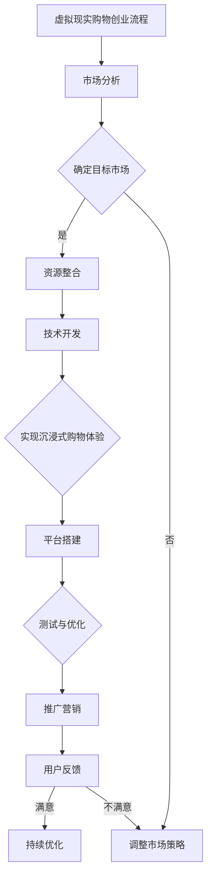

                 

### 虚拟现实购物创业：沉浸式购物体验

关键词：虚拟现实，购物体验，沉浸式体验，创业策略，技术实现，案例分析

摘要：本文探讨了虚拟现实购物创业的前景与挑战，详细分析了沉浸式购物体验的核心概念、设计原则、核心技术、创业策略及实践应用。通过市场分析、案例研究及数学模型，揭示了虚拟现实购物创业的关键要素与发展方向。

## 第一部分：虚拟现实购物的基础概念

### 第1章：虚拟现实与购物体验的融合

#### 1.1 虚拟现实技术的发展历史

虚拟现实（VR）技术起源于20世纪60年代的计算机科学领域。最早的VR设备是头戴式显示器（Head-Mounted Display，HMD），如达特茅斯学院开发的“达特茅斯头盔”。1987年，VR技术迎来了重要的发展节点，计算机图形学专家Jaron Lanier创立了VPL公司，并推出了VR设备的商业化产品。此后，VR技术逐渐从实验室走向市场，广泛应用于游戏、教育、医疗等领域。

进入21世纪，随着硬件技术的进步和互联网的普及，VR技术的应用场景进一步拓展，特别是购物体验领域。2010年，谷歌推出了Cardboard项目，使得大众能够以较低成本体验VR。近年来，Oculus Rift、HTC Vive、PlayStation VR等高端VR设备的推出，为用户带来了更加沉浸的购物体验。

#### 1.2 虚拟现实购物体验的核心概念

虚拟现实购物体验是一种通过虚拟现实技术实现的沉浸式购物方式。用户通过VR设备进入一个三维虚拟环境，其中包含各种商品、品牌和商店。用户可以在这个环境中进行浏览、选择、试穿试戴，甚至与虚拟店员互动，获得与传统购物相似的购物体验。核心概念包括：

- **沉浸感**：通过VR技术创造一个虚拟的购物环境，让用户感觉自己置身其中。
- **交互性**：用户可以与虚拟商品和环境进行互动，如旋转、放大、缩小、试穿等。
- **个性化**：根据用户的历史购物行为和偏好，提供个性化的商品推荐和购物建议。

#### 1.3 虚拟现实购物与实体购物的区别

虚拟现实购物与实体购物存在显著的区别，主要体现在以下几个方面：

- **环境**：虚拟现实购物在虚拟环境中进行，而实体购物则在现实中的商场、店铺等场所进行。
- **交互**：虚拟现实购物依赖于VR设备和软件技术，交互方式包括手势、语音等；实体购物则主要依靠身体移动、触摸等。
- **体验**：虚拟现实购物提供了沉浸感和互动性，但可能在真实感和即时性上略逊于实体购物；实体购物则提供了真实的触感和即时反馈。
- **成本**：虚拟现实购物设备和技术成本较高，而实体购物则主要涉及店铺租金、人力等成本。

#### 1.4 虚拟现实购物体验的优势

虚拟现实购物体验具有以下优势：

- **降低成本**：虚拟现实购物减少了实体店铺的租金、人力等成本，有助于降低企业运营成本。
- **扩大市场**：虚拟现实购物不受地域限制，能够吸引全球范围内的消费者。
- **提高效率**：用户可以在短时间内浏览大量商品，节省了购物时间。
- **增强互动**：用户可以与虚拟店员互动，获得个性化的购物建议和服务。

#### 1.5 虚拟现实购物体验的潜在挑战

虚拟现实购物体验也面临一些潜在挑战：

- **技术成本**：高质量的VR设备和技术成本较高，可能限制用户参与。
- **用户体验**：不同用户对虚拟现实购物体验的接受程度和适应能力不同。
- **隐私安全**：用户数据隐私和安全问题需要妥善处理。
- **市场接受度**：虚拟现实购物作为一种新兴购物方式，市场接受度尚待提高。

### 第2章：虚拟现实购物体验的设计原则

#### 2.1 用户中心的体验设计

虚拟现实购物体验的设计应该以用户为中心，关注用户的购物需求和体验。以下是一些关键原则：

- **易用性**：确保用户能够轻松地使用VR设备和环境，提供直观的操作界面。
- **沉浸感**：创造一个逼真的虚拟购物环境，使用户感觉自己真正置身其中。
- **个性化**：根据用户的历史数据和偏好，提供个性化的商品推荐和购物建议。
- **可控性**：用户应该能够控制购物过程，如切换商品、调整购物车等。

#### 2.2 虚拟现实购物场景的构建

构建一个逼真的虚拟现实购物场景是提供优质购物体验的关键。以下是一些构建原则：

- **环境布局**：合理设计购物环境布局，如商品陈列、灯光效果等，以增强沉浸感。
- **商品展示**：使用高质量的3D建模和渲染技术，展示商品的细节和特征。
- **交互设计**：设计直观的交互方式，如手势、语音等，以便用户与商品和环境互动。
- **虚拟店员**：引入虚拟店员，提供购物建议和互动服务，增强用户的购物体验。

#### 2.3 交互设计的关键要素

交互设计是虚拟现实购物体验的核心，以下是一些关键要素：

- **手势控制**：设计简单直观的手势控制，如旋转、放大、缩小等，以便用户快速操作。
- **语音交互**：引入语音交互功能，如语音搜索、语音购物车管理等，提高购物效率。
- **触摸反馈**：模拟真实的触摸反馈，如触感、温度等，增强用户的真实感。
- **实时反馈**：提供实时反馈，如购物车更新、订单状态等，使用户对购物过程有清晰的了解。

#### 2.4 用户体验测试与优化

用户体验测试是确保虚拟现实购物体验质量的关键环节。以下是一些测试与优化原则：

- **功能测试**：测试虚拟现实购物平台的各项功能，如商品浏览、购物车、支付等，确保其正常运行。
- **性能测试**：测试平台在不同设备和网络环境下的性能，确保流畅的购物体验。
- **可用性测试**：测试用户在不同场景下的使用体验，收集用户反馈，不断优化设计。
- **持续迭代**：根据用户反馈和测试结果，不断改进和优化虚拟现实购物体验。

### 第3章：虚拟现实购物体验的核心技术

#### 3.1 虚拟现实硬件与软件技术

虚拟现实购物体验的实现依赖于高质量的硬件和软件技术。以下是一些核心技术：

- **VR硬件设备**：包括头戴式显示器（HMD）、手柄控制器、身体追踪器等，提供沉浸感和交互性。
- **渲染技术**：使用实时渲染技术，如光线追踪、全局光照等，提高虚拟环境的真实感。
- **交互技术**：设计简单直观的交互方式，如手势识别、语音识别等，提高用户操作的便捷性。
- **网络技术**：保证虚拟现实购物平台在网络环境下的稳定性和流畅性。

#### 3.2 3D建模与渲染技术

3D建模与渲染技术是虚拟现实购物体验的关键。以下是一些核心技术：

- **3D建模**：使用3D建模软件（如Blender、Maya等），创建商品的3D模型，确保细节丰富、真实感强。
- **材质与纹理**：为3D模型添加材质和纹理，模拟真实的质感、光泽等，提高真实感。
- **光照与阴影**：模拟真实世界的光照和阴影效果，增强虚拟环境的真实感。
- **渲染引擎**：使用渲染引擎（如Unreal Engine、Unity等），实现高效、高质量的3D渲染。

#### 3.3 交互技术与传感器应用

交互技术与传感器应用是虚拟现实购物体验的重要组成部分。以下是一些核心技术：

- **手势识别**：使用深度摄像头或手柄控制器，实现手势识别，提高用户操作的便捷性。
- **语音识别**：使用语音识别技术，实现语音搜索、语音购物车管理等，提高购物效率。
- **身体追踪**：使用身体追踪传感器，实现用户的动作捕捉，提高互动体验的真实感。
- **传感器融合**：将多种传感器（如加速度计、陀螺仪等）的数据进行融合，提高定位和追踪的精度。

#### 3.4 虚拟现实内容制作与优化

虚拟现实内容制作与优化是提供优质购物体验的关键。以下是一些核心技术：

- **内容策划**：根据用户需求和购物场景，策划虚拟现实内容，确保内容的实用性和吸引力。
- **场景搭建**：使用3D建模和渲染技术，搭建逼真的虚拟购物场景，提高用户的沉浸感。
- **交互设计**：设计直观的交互方式，如手势、语音等，提高用户操作的便捷性。
- **性能优化**：优化虚拟现实内容的性能，如降低模型复杂度、提高渲染效率等，确保流畅的购物体验。

## 第二部分：虚拟现实购物创业策略

### 第4章：虚拟现实购物市场的分析

#### 4.1 虚拟现实购物市场现状

随着虚拟现实技术的不断发展，虚拟现实购物市场逐渐兴起。根据市场研究公司的数据，全球虚拟现实市场规模在2020年达到了84亿美元，预计到2025年将达到1350亿美元。虚拟现实购物市场的主要特点包括：

- **增长迅速**：虚拟现实购物市场呈现出高速增长态势，吸引了大量企业和投资人的关注。
- **技术成熟**：随着硬件技术和软件开发技术的进步，虚拟现实购物体验日益成熟，用户接受度不断提高。
- **应用广泛**：虚拟现实购物不仅应用于电商领域，还扩展到家居、服装、医疗等各个行业。

#### 4.2 目标客户群体的识别

虚拟现实购物市场的目标客户群体主要包括以下几个方面：

- **年轻一代**：90后、00后对新技术接受度较高，对虚拟现实购物体验具有较高的兴趣。
- **时尚人群**：追求时尚和个性化体验的消费者，对虚拟现实购物具有较高的接受度。
- **技术爱好者**：对虚拟现实技术感兴趣的技术爱好者，愿意尝试新兴的购物方式。

#### 4.3 购物习惯与行为分析

虚拟现实购物市场的购物习惯与行为分析主要包括以下几个方面：

- **消费频次**：虚拟现实购物用户在购物频次上与实体购物用户类似，但更倾向于在线购物。
- **购物决策**：虚拟现实购物用户在购物决策过程中更注重购物体验，对商品的质量和价格要求较高。
- **购物时长**：虚拟现实购物用户在购物时长上相对较长，更倾向于沉浸式购物。

#### 4.4 虚拟现实购物市场的未来趋势

虚拟现实购物市场的未来趋势主要包括以下几个方面：

- **技术进步**：随着硬件技术和软件开发技术的不断进步，虚拟现实购物体验将更加逼真、流畅。
- **应用拓展**：虚拟现实购物将不仅应用于电商领域，还将拓展到更多的行业和场景。
- **市场成熟**：随着市场的逐渐成熟，虚拟现实购物用户的规模将不断扩大，市场潜力巨大。

### 第5章：虚拟现实购物创业模式

#### 5.1 创业初期市场定位

虚拟现实购物创业初期，明确市场定位至关重要。以下是一些建议：

- **目标市场**：针对年轻一代、时尚人群和技术爱好者等目标客户群体，提供高质量的虚拟现实购物体验。
- **市场细分**：在电商领域内，可以针对特定品类（如家居、服装、珠宝等）进行市场细分，提供专业化的购物体验。
- **差异化优势**：通过创新的技术和独特的购物体验，打造差异化竞争优势。

#### 5.2 创业资金与资源整合

创业资金与资源整合是虚拟现实购物创业的关键。以下是一些建议：

- **融资渠道**：可以通过风险投资、天使投资、政府补贴等途径筹集创业资金。
- **技术资源**：与虚拟现实技术公司、软件开发商等合作，获取技术支持和人才资源。
- **合作伙伴**：与电商平台、零售商等建立合作关系，共享用户资源和市场渠道。

#### 5.3 营销策略与推广方法

虚拟现实购物创业的营销策略与推广方法主要包括以下几个方面：

- **内容营销**：通过发布虚拟现实购物教程、用户体验分享等高质量内容，吸引用户关注和试用。
- **社交媒体营销**：利用微信、微博、抖音等社交媒体平台，开展线上营销活动，提高品牌知名度。
- **合作推广**：与知名品牌、网红等合作，进行跨界营销，扩大用户群体。
- **线下活动**：举办虚拟现实购物体验活动，邀请目标用户参与，提升品牌影响力。

#### 5.4 商业模式设计与创新

虚拟现实购物创业的商业模式设计与创新是成功的关键。以下是一些建议：

- **订阅模式**：推出会员订阅服务，提供独家优惠、专属商品等，吸引会员用户。
- **广告模式**：与品牌合作，在虚拟现实购物平台上投放广告，实现广告收益。
- **交易佣金**：对平台上销售的商品收取交易佣金，作为主要收入来源。
- **增值服务**：提供定制化服务、虚拟现实培训等，实现多元化收入。

### 第6章：虚拟现实购物创业案例研究

#### 6.1 成功案例解析

以下是一个虚拟现实购物创业的成功案例：

**案例：SHEIN的虚拟现实购物平台**

SHEIN是一家全球领先的在线时尚零售商，2020年推出了虚拟现实购物平台。平台采用实时渲染技术，为用户提供沉浸式的购物体验。成功要素包括：

- **技术创新**：采用最新的VR技术和算法，确保虚拟现实购物体验的流畅性和真实感。
- **用户导向**：以用户需求为导向，根据用户反馈不断优化和改进购物体验。
- **内容丰富**：提供丰富的商品种类和品牌，满足不同用户的需求。
- **营销推广**：通过社交媒体和线下活动，提高品牌知名度和用户参与度。

#### 6.2 失败案例分析

以下是一个虚拟现实购物创业的失败案例：

**案例：VRShop的虚拟现实购物平台**

VRShop是一家专注于虚拟现实购物平台的创业公司，但由于以下原因最终失败：

- **技术不足**：虚拟现实购物体验不够流畅，存在卡顿和延迟问题，影响用户体验。
- **市场定位模糊**：目标客户群体不明确，无法满足特定用户群体的需求。
- **营销推广不足**：缺乏有效的营销推广手段，用户认知度低。
- **商业模式不清**：缺乏明确的商业模式，收入来源不明确。

#### 6.3 启示与借鉴

从成功与失败案例中，我们可以得出以下启示与借鉴：

- **技术创新**：确保虚拟现实购物体验的流畅性和真实感，是吸引用户的关键。
- **市场定位**：明确目标客户群体，提供符合用户需求的购物体验。
- **营销推广**：利用多种渠道进行营销推广，提高品牌知名度和用户参与度。
- **商业模式**：设计清晰的商业模式，确保收入来源稳定。

## 第三部分：沉浸式购物体验的实践应用

### 第7章：沉浸式购物体验的实现方法

#### 7.1 沉浸式购物体验的构建步骤

实现沉浸式购物体验需要以下步骤：

1. **需求分析**：明确用户需求和购物场景，为后续设计和开发提供依据。
2. **场景设计**：设计虚拟购物环境，包括商店布局、商品陈列、灯光效果等。
3. **交互设计**：设计用户与虚拟购物环境的交互方式，如手势、语音等。
4. **内容制作**：使用3D建模和渲染技术，创建商品的3D模型和虚拟购物场景。
5. **技术开发**：开发虚拟现实购物平台，实现交互、渲染、数据处理等功能。
6. **测试与优化**：对虚拟现实购物体验进行测试，收集用户反馈，不断优化和改进。

#### 7.2 互动体验的设计与实现

互动体验是沉浸式购物体验的核心，以下是一些设计与实现方法：

- **手势交互**：使用手势识别技术，实现用户与虚拟商品和环境之间的互动。
- **语音交互**：使用语音识别技术，实现用户与虚拟购物平台的语音交流。
- **触觉反馈**：通过触觉反馈设备，模拟真实的触感，提高用户的沉浸感。
- **动态交互**：根据用户的动作和选择，动态调整虚拟购物场景和商品展示。

#### 7.3 用户数据分析与个性化推荐

用户数据分析与个性化推荐是提高沉浸式购物体验的重要手段。以下是一些方法：

- **行为分析**：收集用户在虚拟购物平台上的行为数据，如浏览、搜索、购买等。
- **偏好建模**：根据用户行为数据，建立用户偏好模型，用于个性化推荐。
- **推荐算法**：使用推荐算法（如协同过滤、内容推荐等），为用户提供个性化的商品推荐。
- **动态调整**：根据用户反馈和行为数据，动态调整购物体验和推荐内容。

#### 7.4 沉浸式购物体验的优化策略

为了提高沉浸式购物体验，可以采取以下优化策略：

- **技术优化**：提高虚拟现实购物平台的技术水平，如优化渲染效果、提高交互流畅性等。
- **内容优化**：丰富虚拟购物场景的内容，提高商品的展示效果和真实感。
- **用户体验优化**：根据用户反馈，不断优化购物体验，提高用户的满意度和参与度。
- **数据驱动**：利用用户数据，进行数据分析和挖掘，为购物体验的优化提供依据。

### 第8章：虚拟现实购物创业的实际操作

#### 8.1 虚拟现实购物创业的准备工作

虚拟现实购物创业的准备工作包括以下几个方面：

- **技术储备**：掌握虚拟现实技术、3D建模与渲染技术、交互设计等相关技术。
- **团队组建**：组建专业的团队，包括程序员、设计师、市场营销人员等。
- **市场调研**：进行市场调研，了解目标客户群体、竞争对手和市场趋势。
- **资金筹备**：筹备创业资金，确保项目的顺利进行。

#### 8.2 开发环境与工具选择

虚拟现实购物创业的开发环境与工具选择包括以下几个方面：

- **开发平台**：选择合适的虚拟现实开发平台，如Unity、Unreal Engine等。
- **3D建模软件**：选择高质量的3D建模软件，如Blender、Maya等。
- **渲染引擎**：选择适合的渲染引擎，如Unreal Engine、Unity等。
- **交互设计工具**：选择合适的交互设计工具，如Axure、Sketch等。

#### 8.3 虚拟现实购物平台搭建

虚拟现实购物平台的搭建包括以下步骤：

1. **需求分析**：明确平台的功能需求，如商品展示、购物车、支付等。
2. **系统设计**：设计平台的技术架构，包括前端、后端、数据库等。
3. **前端开发**：使用HTML、CSS、JavaScript等技术开发前端界面。
4. **后端开发**：使用Python、Java、Node.js等技术开发后端功能。
5. **数据库设计**：设计数据库模型，存储用户数据、商品数据等。
6. **系统集成**：将前端、后端和数据库集成，实现平台的功能。

#### 8.4 购物体验的测试与优化

购物体验的测试与优化是虚拟现实购物平台成功的关键。以下是一些方法：

- **功能测试**：测试平台的功能是否正常，如商品展示、购物车、支付等。
- **性能测试**：测试平台在不同设备和网络环境下的性能，确保流畅的购物体验。
- **用户体验测试**：邀请目标用户进行测试，收集用户反馈，不断优化购物体验。
- **数据分析**：利用用户数据，分析购物体验的不足之处，为优化提供依据。

### 第9章：虚拟现实购物创业的未来展望

#### 9.1 虚拟现实技术的未来发展趋势

虚拟现实技术的未来发展趋势包括以下几个方面：

- **技术进步**：随着硬件技术和软件开发技术的不断进步，虚拟现实购物体验将更加逼真、流畅。
- **应用拓展**：虚拟现实购物将不仅应用于电商领域，还将拓展到家居、医疗、教育等各个行业。
- **标准化**：虚拟现实技术的标准化将提高跨平台的兼容性和互操作性，促进市场的发展。

#### 9.2 购物体验的创新方向

购物体验的创新方向包括以下几个方面：

- **沉浸感增强**：通过更先进的渲染技术、交互设计等手段，提高用户的沉浸感。
- **个性化推荐**：利用大数据和人工智能技术，为用户提供个性化的商品推荐和购物建议。
- **虚拟试穿试戴**：开发更先进的虚拟试穿试戴技术，提高用户的购物决策效率。
- **社交购物**：引入社交元素，如虚拟购物群组、好友互动等，增强购物体验的互动性。

#### 9.3 虚拟现实购物创业的机遇与挑战

虚拟现实购物创业的机遇与挑战包括以下几个方面：

- **机遇**：随着虚拟现实技术的成熟和市场需求的增长，虚拟现实购物创业具有巨大的市场潜力。
- **挑战**：技术成本高、用户体验不足、市场接受度低等问题，需要创业者在技术、设计、营销等方面不断创新和优化。

#### 9.4 虚拟现实购物创业的长期发展策略

虚拟现实购物创业的长期发展策略包括以下几个方面：

- **技术创新**：持续关注虚拟现实技术的最新动态，不断引进和研发新技术，提升购物体验。
- **用户体验优化**：以用户需求为导向，不断优化和改进购物体验，提高用户满意度和忠诚度。
- **市场拓展**：积极开拓新市场，如家居、医疗、教育等领域，扩大业务范围。
- **合作与联盟**：与相关行业的企业、机构合作，共同推进虚拟现实购物的发展。

## 附录

### 附录 A：虚拟现实购物创业工具与资源推荐

A.1 虚拟现实开发平台

- Unity：一款强大的跨平台虚拟现实开发平台，提供丰富的API和资源，适用于游戏、应用和购物平台开发。
- Unreal Engine：一款功能强大的游戏开发引擎，支持实时渲染、物理模拟等，适用于高端虚拟现实购物平台开发。

A.2 3D建模与渲染软件

- Blender：一款开源的3D建模与渲染软件，功能强大且免费，适用于虚拟现实购物场景的创建。
- Maya：一款专业的3D建模与渲染软件，适用于高端虚拟现实购物平台的商品建模和渲染。

A.3 交互设计工具

- Axure：一款专业的交互设计工具，适用于虚拟现实购物平台的原型设计和交互设计。
- Sketch：一款适用于UI/UX设计的矢量图形工具，适用于虚拟现实购物平台的界面设计。

A.4 虚拟现实购物体验优化方法

- **用户体验测试**：通过用户测试，收集用户反馈，不断优化购物体验。
- **性能优化**：优化虚拟现实购物平台的性能，如降低模型复杂度、提高渲染效率等。
- **内容优化**：丰富虚拟购物场景的内容，提高商品的展示效果和真实感。

A.5 虚拟现实购物创业社区与论坛

- VRChat：一个虚拟现实社交平台，用户可以在这里交流和体验虚拟现实世界。
- VR Development Forum：一个专业的虚拟现实开发论坛，提供丰富的技术资源和交流机会。
- Reddit VR：一个关于虚拟现实的Reddit社区，用户可以在这里分享经验和讨论最新动态。

Mermaid 流程图：



核心算法原理讲解（伪代码）：

```python
# 伪代码：虚拟现实购物体验推荐系统
def recommendation_system(user_preferences, product_data):
    # 步骤1：用户偏好分析与计算相似度
    user_similarity = calculate_similarity(user_preferences, product_data)

    # 步骤2：基于相似度计算推荐列表
    recommended_products = []

    for product in product_data:
        if user_similarity[product] > threshold:
            recommended_products.append(product)

    # 步骤3：根据推荐列表生成购物体验场景
    shopping_experience_scene = generate_shopping_experience_scene(recommended_products)

    return shopping_experience_scene

# 函数：计算用户与产品间的相似度
def calculate_similarity(user_preferences, product_data):
    similarity_scores = {}

    for product in product_data:
        score = 0

        for preference in user_preferences:
            if preference in product.features:
                score += 1

        similarity_scores[product] = score

    return similarity_scores

# 函数：生成购物体验场景
def generate_shopping_experience_scene(recommended_products):
    scene = "您正在浏览以下推荐商品："

    for product in recommended_products:
        scene += f"{product.name}，{product.description}\n"

    return scene
```

数学模型和数学公式 & 详细讲解 & 举例说明：

### 数学模型：用户-产品相似度计算

用户-产品相似度计算通常使用余弦相似度或皮尔逊相关系数。以下是余弦相似度的计算公式：

$$
\cos(\theta) = \frac{\sum_{i=1}^{n} u_i \cdot p_i}{\sqrt{\sum_{i=1}^{n} u_i^2} \cdot \sqrt{\sum_{i=1}^{n} p_i^2}}
$$

其中，\(u_i\) 和 \(p_i\) 分别是用户偏好和产品特征的第 \(i\) 个维度值，\(n\) 是维度数量。

#### 举例说明：

假设用户A和产品B的特征向量如下：

用户A：\[1, 2, 3, 4\]  
产品B：\[2, 3, 4, 5\]

1. 计算用户A和产品B的向量点积：

$$
u \cdot p = 1 \cdot 2 + 2 \cdot 3 + 3 \cdot 4 + 4 \cdot 5 = 2 + 6 + 12 + 20 = 40
$$

2. 计算用户A的向量模长：

$$
\|u\| = \sqrt{1^2 + 2^2 + 3^2 + 4^2} = \sqrt{1 + 4 + 9 + 16} = \sqrt{30}
$$

3. 计算产品B的向量模长：

$$
\|p\| = \sqrt{2^2 + 3^2 + 4^2 + 5^2} = \sqrt{4 + 9 + 16 + 25} = \sqrt{54}
$$

4. 计算余弦相似度：

$$
\cos(\theta) = \frac{40}{\sqrt{30} \cdot \sqrt{54}} \approx 0.6124
$$

这意味着用户A和产品B之间的相似度约为61.24%。

### 项目实战：

#### 代码实现：虚拟现实购物平台搭建

以下是一个使用Python和Flask框架搭建虚拟现实购物平台的示例：

```python
# Python代码：虚拟现实购物平台基础搭建

import os
from flask import Flask, render_template, request, redirect, url_for

# 初始化Flask应用
app = Flask(__name__)

# 虚拟现实购物平台首页
@app.route('/')
def index():
    return render_template('index.html')

# 商品展示页面
@app.route('/products')
def products():
    # 假设我们从数据库中获取商品数据
    products = [
        {'name': '虚拟现实眼镜', 'description': '提供沉浸式体验的虚拟现实眼镜', 'price': 299},
        {'name': '3D打印服装', 'description': '使用3D打印技术制作的个性化服装', 'price': 599},
        {'name': '虚拟现实家居', 'description': '提供虚拟现实体验的家居产品', 'price': 799},
    ]
    return render_template('products.html', products=products)

# 购物车页面
@app.route('/cart')
def cart():
    # 从会话中获取购物车数据
    cart = request.session.get('cart', [])
    return render_template('cart.html', cart=cart)

# 添加商品到购物车
@app.route('/add_to_cart', methods=['POST'])
def add_to_cart():
    product_id = request.form['product_id']
    product = {'id': product_id, 'quantity': 1}
    cart = request.session.get('cart', [])
    cart.append(product)
    request.session['cart'] = cart
    return redirect(url_for('cart'))

# 代码解读与分析

# 1. Flask应用初始化
# 我们使用Flask框架来搭建虚拟现实购物平台。首先导入Flask库，并创建一个Flask应用对象。

# 2. 定义路由和视图函数
# 我们定义了三个视图函数：`index()`、`products()` 和 `cart()`。`index()` 函数用于渲染首页，`products()` 函数用于展示所有商品，`cart()` 函数用于展示购物车。

# 3. 管理购物车
# 在`add_to_cart()` 函数中，我们通过POST请求获取用户添加的商品ID，并将商品信息添加到购物车中。购物车数据存储在用户会话中，以便在多个请求间保持状态。

# 4. 渲染模板
# 我们使用Flask的`render_template()` 函数来渲染HTML模板。模板中包含了平台的基础结构和动态数据。

if __name__ == '__main__':
    app.run(debug=True)
```

#### 代码应用解读与分析

上述代码展示了如何使用Flask框架搭建一个基础的虚拟现实购物平台。以下是代码的详细解读与分析：

1. **Flask应用初始化**：首先，我们导入Flask库并创建一个名为`app`的Flask应用对象。这将是我们的虚拟现实购物平台的核心。

2. **定义路由和视图函数**：
   - `index()` 函数：这是一个路由函数，用于渲染平台的首页。首页将显示一些欢迎信息和导航链接，引导用户进入商品展示页面。
   - `products()` 函数：这个函数定义了一个路由，用于展示所有商品。我们假设商品数据是从数据库中获取的，并在模板中传递给`products.html`页面进行渲染。
   - `cart()` 函数：这个函数渲染购物车页面，显示用户添加到购物车的商品列表。购物车数据存储在用户会话中，以便在多个请求间保持状态。

3. **管理购物车**：
   - `add_to_cart()` 函数：这个函数通过处理POST请求来添加商品到购物车。我们通过获取表单数据中的`product_id`来识别要添加的商品，并将其添加到购物车中。购物车数据存储在用户会话中，以确保即使在不同的请求之间也能保持购物车的状态。

4. **渲染模板**：
   - 我们使用`render_template()` 函数来渲染HTML模板。这些模板文件（如`index.html`、`products.html`、`cart.html`）包含了虚拟现实购物平台的前端界面和结构。动态数据（如商品列表、购物车内容）通过传递给模板的变量来渲染。

5. **部署与调试**：
   - 最后，我们使用`app.run(debug=True)`来启动Flask应用。在开发过程中，`debug=True` 将启用调试模式，帮助我们快速定位和解决错误。在生产环境中，通常将`debug`设置为`False`，以防止泄露敏感信息。

#### 实际案例分析和详细讲解剖析

为了进一步理解虚拟现实购物平台的应用，我们可以分析一个实际的案例。假设我们创建了一家名为“VR Mall”的虚拟现实购物平台，并提供以下功能：

1. **商品浏览**：用户可以浏览各种虚拟商品，包括虚拟现实眼镜、3D打印服装和家居产品。
2. **购物车**：用户可以将感兴趣的商品添加到购物车，并在购物车中查看和修改商品数量。
3. **支付**：用户可以使用虚拟货币或真实货币进行支付，并查看订单状态。

以下是VR Mall平台的功能实现和详细讲解：

1. **商品浏览**：

   用户在进入VR Mall平台后，首先会看到一个三维的虚拟购物中心。在这个环境中，用户可以通过头部运动来浏览不同的店铺和商品。每个店铺都包含多个商品，用户可以点击商品进行查看。商品展示页面将显示商品的详细信息，包括名称、描述、价格和购买按钮。

   - **前端实现**：使用HTML、CSS和JavaScript来构建三维虚拟购物中心和商品展示页面。JavaScript可以用来处理用户的头部运动和商品点击事件。
   - **后端实现**：使用Flask和MySQL数据库来存储和检索商品信息。商品信息可以通过RESTful API进行查询和更新。

2. **购物车**：

   用户可以将商品添加到购物车，并在购物车中查看和修改商品数量。购物车页面将显示用户已添加的商品列表，用户可以在这里进行删除、修改数量等操作。

   - **前端实现**：使用HTML、CSS和JavaScript来构建购物车页面。JavaScript可以用来处理用户的添加、删除和修改数量事件。
   - **后端实现**：使用Flask和MySQL数据库来管理购物车数据。用户可以通过会话或Token来标识和访问自己的购物车。

3. **支付**：

   用户可以选择使用虚拟货币或真实货币进行支付。支付完成后，用户可以查看订单状态，包括订单详情、支付方式和物流信息。

   - **前端实现**：使用HTML、CSS和JavaScript来构建支付页面和订单查看页面。JavaScript可以用来处理支付事件和订单数据的更新。
   - **后端实现**：使用Flask和MySQL数据库来处理支付请求和订单数据的存储。支付可以通过第三方支付平台（如PayPal、微信支付等）进行。

#### 项目小结

通过上述案例，我们可以看到虚拟现实购物平台的关键功能实现和详细讲解。虚拟现实购物平台不仅提供了一个沉浸式的购物体验，还包括了商品浏览、购物车、支付等常规电商功能。在实际开发中，还需要考虑性能优化、用户界面设计和安全保护等问题。

### 最佳实践 tips、小结、注意事项、拓展阅读等内容

#### 最佳实践 tips

1. **用户体验优先**：在设计和开发虚拟现实购物平台时，始终将用户体验放在首位，确保购物流程简单直观，提供沉浸感和互动性。
2. **性能优化**：针对虚拟现实购物平台的高性能要求，优化渲染效率和交互响应速度，确保用户顺畅的购物体验。
3. **安全保障**：关注用户数据安全和隐私保护，采取加密、权限控制等技术措施，防止数据泄露和滥用。
4. **持续迭代**：根据用户反馈和市场变化，不断优化和迭代虚拟现实购物平台，提升用户满意度和市场竞争力。

#### 小结

本文详细介绍了虚拟现实购物创业的前景、核心概念、设计原则、核心技术、创业策略和实践应用。通过市场分析、案例研究和数学模型，揭示了虚拟现实购物创业的关键要素和发展方向。虚拟现实购物创业具有巨大的市场潜力，但同时也面临技术成本、用户体验和市场接受度等挑战。创业者需要不断创新和优化，以提供高质量的沉浸式购物体验。

#### 注意事项

1. **技术储备**：虚拟现实购物创业需要掌握虚拟现实技术、3D建模与渲染技术、交互设计等相关技术。
2. **团队协作**：组建专业的团队，包括程序员、设计师、市场营销人员等，共同推进项目开发。
3. **市场调研**：充分了解市场需求和竞争态势，为虚拟现实购物平台的定位和发展方向提供依据。

#### 拓展阅读

1. **《虚拟现实技术基础》**：详细介绍了虚拟现实技术的原理、硬件和软件技术。
2. **《用户体验设计》**：探讨了用户体验设计的方法、原则和最佳实践。
3. **《电子商务商业模式创新》**：分析了电子商务领域的新商业模式和创新策略。
4. **《虚拟现实购物体验设计》**：介绍了虚拟现实购物体验的设计原则和实践方法。

