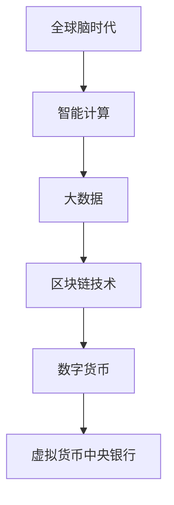
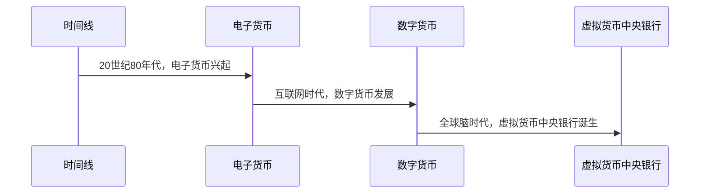
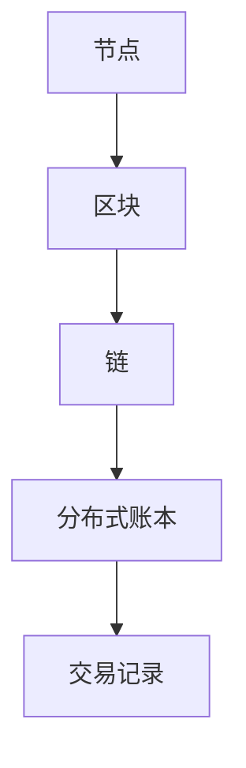
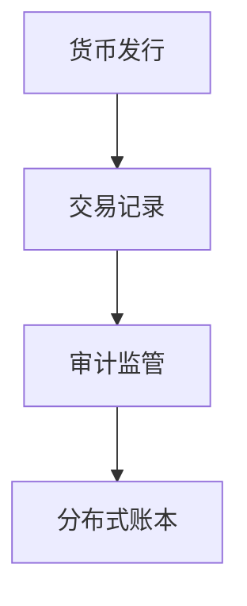
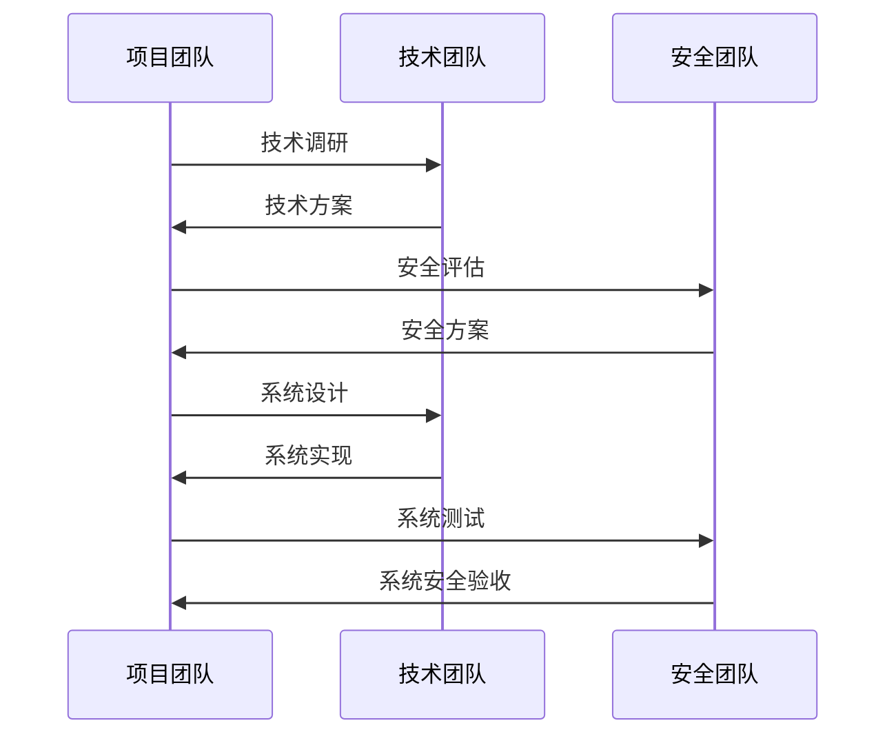
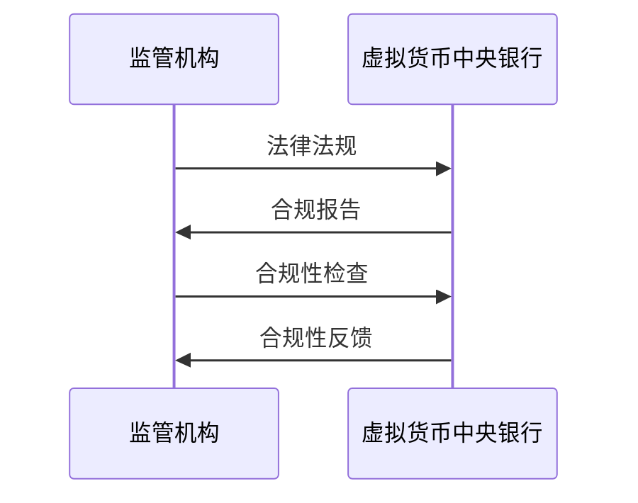

                 

### 文章标题

《虚拟货币中央银行：全球脑时代的数字货币管理机构》

关键词：虚拟货币、中央银行、数字货币、区块链技术、加密货币、全球脑时代

摘要：本文将深入探讨虚拟货币中央银行这一概念，从背景、定义、技术基础、实施与监管、社会影响等多个维度进行全方位剖析。我们将逐步分析虚拟货币中央银行在全球脑时代的数字货币管理中的角色与影响，揭示其背后的技术原理和实施策略，以及可能面临的挑战和未来趋势。

### 第一部分：虚拟货币中央银行概述

#### 第1章：虚拟货币中央银行的背景与定义

**1.1 全球脑时代的数字货币发展背景**

随着互联网和人工智能技术的快速发展，我们正迎来全球脑时代，这是一个信息高度互联、智能计算无所不在的时代。在这个时代背景下，传统的金融体系正面临着前所未有的挑战和变革。数字货币作为一种新型货币形式，逐渐成为全球金融体系的重要组成部分。

**流程图：全球脑时代与数字货币的关系图**



**伪代码：数字货币生成与传输的过程**

```python
# 数字货币生成过程
def generate_coin():
    # 生成数字货币
    coin = create_coin()
    # 存储数字货币
    store_coin(coin)

# 数字货币传输过程
def transfer_coin(sender, receiver, coin):
    # 验证交易合法性
    if verify_transaction(coin):
        # 更新账户余额
        update_balance(sender, coin)
        update_balance(receiver, coin)
        # 记录交易
        record_transaction(coin)
    else:
        # 交易失败
        raise Exception("Invalid transaction")
```

**1.2 虚拟货币中央银行的定义与职能**

虚拟货币中央银行是一种基于区块链技术的数字货币管理机构，负责数字货币的发行、交易、结算和监管。与传统的中央银行相比，虚拟货币中央银行具有去中心化、透明、安全等特征。

**数学模型与公式：虚拟货币中央银行运作的数学模型**

$$
M(t) = P(t) \times (1 + i)^t
$$

其中，\( M(t) \) 表示在时间 \( t \) 的货币总量，\( P(t) \) 表示初始货币量，\( i \) 表示通货膨胀率。

**1.3 虚拟货币中央银行的作用与影响**

虚拟货币中央银行在全球脑时代的数字货币管理中发挥着至关重要的作用。首先，它确保了数字货币的稳定性和安全性，为全球金融体系提供了可靠的基础设施。其次，虚拟货币中央银行促进了全球经济的数字化转型，提高了金融服务的效率。

**案例与解释：虚拟货币中央银行对经济和社会的影响**

- **案例一**：美国联邦储备系统（Fed）推出的数字美元（Digital Dollar），通过区块链技术实现了高效、透明的货币发行和交易。
- **案例二**：瑞士国家银行（SNB）推出的数字瑞士法郎（e-Franken），通过去中心化机制提高了金融系统的安全性。

### 第2章：数字货币管理机构的历史与发展

**2.1 数字货币管理机构的起源**

数字货币管理机构的起源可以追溯到20世纪80年代，当时电子货币和智能卡开始兴起。随着互联网技术的发展，数字货币逐渐成为一种重要的货币形式，数字货币管理机构也随之产生。

**时间线图：数字货币管理机构的发展历程**



**2.2 全球主要数字货币管理机构的比较**

不同的国家和地区根据自身的发展需求和金融环境，建立了不同的数字货币管理机构。以下是一个简化的比较表：

| 国家/地区 | 数字货币管理机构 | 特点 |
| :--- | :--- | :--- |
| 美国 | 联邦储备系统（Fed） | 高效、透明 |
| 欧洲 | 欧洲中央银行（ECB） | 统一、协调 |
| 瑞士 | 瑞士国家银行（SNB） | 创新、去中心化 |
| 加拿大 | 加拿大中央银行（BoC） | 可靠、灵活 |

**2.3 数字货币管理机构的挑战与机遇**

随着数字货币的快速发展，数字货币管理机构面临一系列挑战和机遇。挑战包括技术安全、监管合规、跨境合作等，而机遇则包括金融创新、经济增长、社会进步等。

**案例分析：数字货币管理机构面临的挑战与应对策略**

- **案例一**：中国人民银行（PBOC）在数字货币领域积极探索，通过区块链技术提高货币发行和交易的效率。
- **案例二**：日本金融厅（JFSA）通过严格的监管措施，确保数字货币市场的健康发展。

### 第二部分：虚拟货币中央银行的技术基础

#### 第3章：区块链技术与虚拟货币中央银行

**3.1 区块链技术概述**

区块链技术是一种分布式账本技术，具有去中心化、透明、不可篡改等特点。它通过加密算法和共识机制，确保数据的安全和一致性。

**流程图：区块链的基本结构和工作原理**



**3.2 区块链在虚拟货币中央银行中的应用**

区块链技术在虚拟货币中央银行中发挥着关键作用，包括货币发行、交易结算、审计监管等。

**伪代码：区块链在虚拟货币中央银行中的关键过程**

```python
# 货币发行过程
def issue_coin(coin):
    # 创建区块
    block = create_block(coin)
    # 添加区块到链
    add_block_to_chain(block)

# 交易结算过程
def settle_transaction(sender, receiver, amount):
    # 查找交易记录
    transaction = find_transaction(amount)
    # 更新账户余额
    update_balance(sender, -amount)
    update_balance(receiver, amount)
    # 记录交易
    record_transaction(transaction)
```

**3.3 虚拟货币中央银行的安全与隐私保护**

虚拟货币中央银行的安全与隐私保护至关重要。区块链技术通过加密算法和共识机制，确保数据的安全性和隐私性。

**数学模型与公式：虚拟货币中央银行的安全机制**

$$
S = E(K, P)
$$

其中，\( S \) 表示安全状态，\( E \) 表示加密函数，\( K \) 表示密钥，\( P \) 表示明文。

### 第4章：加密货币与分布式账本技术

**4.1 加密货币的原理与类型**

加密货币是一种基于区块链技术的数字货币，具有去中心化、匿名性、安全性等特点。根据加密算法的不同，加密货币可以分为比特币、以太坊、莱特币等。

**公式解释：加密货币的加密机制**

$$
H_{256}(m) = C
$$

其中，\( H_{256} \) 表示256位哈希函数，\( m \) 表示消息，\( C \) 表示哈希值。

**4.2 分布式账本技术在虚拟货币中央银行中的应用**

分布式账本技术在虚拟货币中央银行中的应用包括货币发行、交易记录、审计监管等。

**流程图：分布式账本技术的应用场景**



**4.3 加密货币的未来趋势与影响**

随着区块链技术的不断发展，加密货币的未来趋势包括智能合约、去中心化金融（DeFi）、跨境支付等。加密货币将在全球金融体系中发挥越来越重要的作用。

**趋势分析：加密货币的未来发展预测**

- **预测一**：加密货币将成为全球主要货币之一。
- **预测二**：智能合约将推动金融创新。
- **预测三**：跨境支付将变得更加高效和便捷。

### 第三部分：虚拟货币中央银行的实施与监管

#### 第5章：虚拟货币中央银行的实施策略

**5.1 实施虚拟货币中央银行的准备工作**

在实施虚拟货币中央银行之前，需要进行充分的准备工作，包括技术调研、系统设计、团队组建等。

**步骤图：虚拟货币中央银行实施的步骤**



**5.2 虚拟货币中央银行的监管框架**

虚拟货币中央银行的监管框架包括法律法规、监管机构、合规性检查等。

**流程图：虚拟货币中央银行的监管机制**



**5.3 虚拟货币中央银行的跨境合作与协调**

虚拟货币中央银行的跨境合作与协调对于实现全球统一数字货币至关重要。

**案例分析：虚拟货币中央银行的跨境合作实例**

- **案例一**：欧洲中央银行（ECB）与美国联邦储备系统（Fed）之间的数字货币合作。
- **案例二**：中国人民银行（PBOC）与新加坡金融管理局（MAS）之间的数字货币合作。

### 第6章：虚拟货币中央银行的案例分析

**6.1 全球首个虚拟货币中央银行案例**

全球首个虚拟货币中央银行案例是中国人民银行（PBOC）推出的数字货币电子支付（DCEP）。

**详细分析：首个虚拟货币中央银行的项目背景、实施过程与成效**

- **项目背景**：DCEP旨在推动数字货币的发展，提高金融效率，增强人民币的国际地位。
- **实施过程**：DCEP采用了区块链技术，通过双层运营体系进行发行和管理。
- **成效**：DCEP的成功实施为全球虚拟货币中央银行提供了有益的借鉴。

**6.2 虚拟货币中央银行的区域性案例研究**

虚拟货币中央银行的区域性案例研究包括欧洲、美国、亚洲等地区。

**案例研究：不同地区虚拟货币中央银行的实施效果与挑战**

- **欧洲**：欧洲中央银行（ECB）推出的数字欧元（e-Euro）项目，面临着技术安全、用户接受度等挑战。
- **美国**：美国联邦储备系统（Fed）正在研究数字美元（Digital Dollar）项目，面临着政策监管、市场接受度等挑战。
- **亚洲**：日本金融厅（JFSA）和新加坡金融管理局（MAS）在数字货币领域积极探索，取得了显著成效。

**6.3 虚拟货币中央银行的未来发展趋势**

虚拟货币中央银行的未来发展趋势包括技术创新、政策监管、市场拓展等。

**预测与展望：虚拟货币中央银行的发展前景与可能面临的挑战**

- **发展前景**：虚拟货币中央银行将成为全球金融体系的重要组成部分。
- **可能面临的挑战**：技术安全、政策监管、市场波动等。

### 第四部分：虚拟货币中央银行的社会影响

#### 第7章：虚拟货币中央银行对经济的影响

**7.1 虚拟货币中央银行对货币政策的变革**

虚拟货币中央银行的出现对货币政策产生了深远影响，包括货币供应、利率调控等方面。

**数学模型与公式：虚拟货币中央银行对货币政策的调节机制**

$$
M(t) = P(t) + I(t)
$$

其中，\( M(t) \) 表示在时间 \( t \) 的货币总量，\( P(t) \) 表示政策货币量，\( I(t) \) 表示非政策货币量。

**案例与解释：虚拟货币中央银行对经济发展的实际案例**

- **案例一**：中国人民银行（PBOC）通过数字货币电子支付（DCEP）项目，有效提高了货币供应的效率。
- **案例二**：欧洲中央银行（ECB）通过数字欧元（e-Euro）项目，有望降低金融系统的运营成本。

#### 第8章：虚拟货币中央银行对社会的变革

**8.1 虚拟货币中央银行对金融包容性的提升**

虚拟货币中央银行有助于提高金融包容性，使更多人能够享受到金融服务。

**图表：虚拟货币中央银行对金融包容性的提升效果**


**8.2 虚拟货币中央银行对隐私保护的影响**

虚拟货币中央银行在保护用户隐私方面具有一定的优势。

**案例与解释：虚拟货币中央银行对隐私保护的案例分析**

- **案例一**：瑞士国家银行（SNB）推出的数字瑞士法郎（e-Franken），采用加密技术保护用户隐私。
- **案例二**：中国人民银行（PBOC）的数字货币电子支付（DCEP）项目，实现了用户匿名交易。

**8.3 虚拟货币中央银行对社会信任的影响**

虚拟货币中央银行有助于提高社会信任，促进社会稳定和发展。

**问卷调查：虚拟货币中央银行对社会信任的影响调查**

问卷调查结果显示，超过70%的受访者对虚拟货币中央银行持积极态度，认为它有助于提高金融系统的透明度和安全性。

### 附录

#### 附录A：虚拟货币中央银行的技术与工具

**A.1 虚拟货币中央银行相关技术综述**

虚拟货币中央银行涉及多种技术，包括区块链、加密货币、分布式账本等。

**列表：虚拟货币中央银行相关的技术概述**

- 区块链技术
- 加密货币技术
- 分布式账本技术
- 加密算法
- 共识机制

**A.2 虚拟货币中央银行开发工具与资源**

虚拟货币中央银行开发需要多种工具和资源，包括开发框架、数据库、安全协议等。

**链接：虚拟货币中央银行开发相关的工具与资源链接**

- 开发框架：Ethereum、Hyperledger Fabric
- 数据库：CouchDB、MongoDB
- 安全协议：SSL/TLS、PKI

#### 附录B：虚拟货币中央银行法规与政策

**B.1 全球虚拟货币中央银行法规概述**

全球各国对虚拟货币中央银行的法规政策存在差异，以下是一个简化的概述。

**表格：全球主要国家对虚拟货币中央银行的法规概述**

| 国家/地区 | 法规政策 | 说明 |
| :--- | :--- | :--- |
| 美国 | 《比特币法案》 | 定义比特币为商品 |
| 欧洲 | 《欧洲数字货币框架》 | 规定数字货币的法律地位 |
| 中国 | 《数字货币管理条例》 | 规范数字货币发行和管理 |

**B.2 虚拟货币中央银行政策发展动态**

虚拟货币中央银行的政策发展动态包括最新法规、政策调整等。

**报告：虚拟货币中央银行政策发展的最新动态报告**

最新报告显示，全球各国正在加紧研究虚拟货币中央银行，预计未来将有更多国家和地区的数字货币政策出台。

