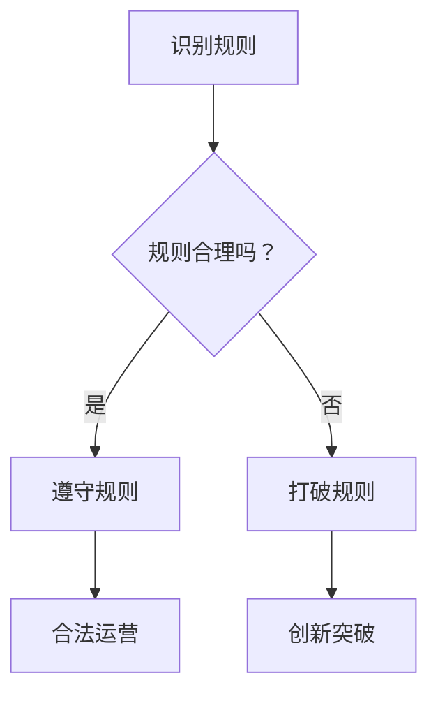

                 

# 文章标题：表达的直率：贾扬清的风格，在创业中小心打破规则

## 关键词：贾扬清、创业风格、打破规则、领导力、成功案例

> 摘要：本文将深入探讨贾扬清的创业风格，分析其在创业过程中表达的直率特点，以及如何在小心打破规则中取得成功。通过详细解析贾扬清的创业经历、领导风格和市场策略，我们希望为创业者提供有价值的启示和借鉴。

## 目录大纲

### 第一部分：贾扬清的创业风格解析

#### 第1章：贾扬清的创业背景与历程
##### 1.1 贾扬清的成长背景
##### 1.2 贾扬清的创业经历概述
##### 1.3 贾扬清的创业哲学

#### 第2章：贾扬清的风格与特点
##### 2.1 直率的表达
##### 2.2 创业中的勇敢与谨慎
##### 2.3 独特的市场洞察

#### 第3章：贾扬清的创业策略
##### 3.1 市场定位策略
##### 3.2 产品研发策略
##### 3.3 营销推广策略

#### 第4章：贾扬清的领导风格
##### 4.1 团队建设
##### 4.2 激励与沟通
##### 4.3 决策与执行

### 第二部分：小心打破规则的创业之道

#### 第5章：打破规则的必要性与策略
##### 5.1 创业中的规则意识
##### 5.2 打破规则的方法
##### 5.3 打破规则的风险与应对

#### 第6章：案例分析与启示
##### 6.1 贾扬清创业案例详解
##### 6.2 其他创业者的成功案例
##### 6.3 启示与借鉴

#### 第7章：总结与展望
##### 7.1 贾扬清创业风格的影响
##### 7.2 创业中的自我提升
##### 7.3 创业未来的发展趋势

#### 附录
##### 附录A：贾扬清相关参考资料
##### A.1 贾扬清的演讲与访谈
##### A.2 贾扬清的著作与论文
##### A.3 贾扬清的创业项目介绍

## 引言

在充满不确定性和激烈竞争的创业环境中，成功的创业者总是能够脱颖而出。贾扬清，作为一位知名的人工智能领域专家和创业家，以其独特的创业风格和深刻的洞见，成为了众多创业者学习和模仿的典范。本文将围绕贾扬清的创业风格，深入探讨其在表达直率、勇敢打破规则等方面的特点和策略，以期为读者提供有价值的思考和借鉴。

创业，是一条充满艰辛和挑战的道路。创业者不仅需要具备卓越的技能和知识，还需要具备坚韧的意志和敏锐的洞察力。贾扬清以其直率的表达和对市场独特的洞察，在创业的道路上取得了显著的成就。本文将从多个方面解析贾扬清的创业风格，包括其创业背景与历程、风格与特点、创业策略和领导风格等，并探讨在创业过程中小心打破规则的重要性。

通过对贾扬清创业经历的研究，我们可以发现，他的成功并非偶然，而是基于其对市场的深刻理解和持续的探索。本文将结合具体案例，分析贾扬清如何通过小心打破规则，在创业中取得了突破性的成就。同时，本文还将探讨其他成功创业者的案例，以期为读者提供更多的启示和借鉴。

在文章的最后，我们将总结贾扬清创业风格的影响，讨论创业者在自我提升方面的策略，并对创业的未来发展趋势进行展望。希望通过本文的探讨，能够为创业者在创业道路上提供一些有益的指导和建议。

### 贾扬清的创业背景与历程

贾扬清，一位在人工智能领域有着深厚造诣的专家，同时也是一位杰出的创业家。他的创业之路充满了挑战与机遇，充分体现了他的才华、勇气和独特的洞察力。

#### 1.1 贾扬清的成长背景

贾扬清出生在一个普通的知识分子家庭，从小便对科学和技术充满兴趣。在家庭环境的熏陶下，他培养出了独立思考和勇于探索的精神。在求学过程中，贾扬清表现出了对计算机科学的极高天赋。他在大学期间主修计算机科学，并以优异的成绩获得了学士学位。随后，他继续深造，在斯坦福大学取得了计算机科学博士学位。在校期间，贾扬清积极参与各类学术研究和项目，积累了丰富的实践经验。

#### 1.2 贾扬清的创业经历概述

贾扬清的创业生涯始于他在斯坦福大学期间的一次学术合作。他与几位志同道合的朋友共同创办了一家专注于人工智能技术研发的公司。这家公司在成立之初就吸引了风险投资，并在短时间内取得了显著的发展。然而，创业之路并非一帆风顺。公司在发展过程中遇到了诸多挑战，包括技术难题、市场变化和团队管理等问题。面对这些困难，贾扬清凭借其深厚的专业背景和敏锐的洞察力，带领团队逐步克服了这些障碍。

在创业过程中，贾扬清不仅注重技术创新，还非常关注市场需求和用户体验。他经常亲自参与产品设计和用户体验测试，以确保产品的质量和市场竞争力。在他的带领下，公司推出了一系列人工智能产品，包括智能语音助手、图像识别系统和自然语言处理平台等，受到了市场的热烈欢迎。

#### 1.3 贾扬清的创业哲学

贾扬清的创业哲学可以用几个关键词来概括：直率、勇敢和谨慎。首先，他表达直率，不掩饰自己的观点和想法。这种直率的表达方式使他在团队中建立了高度的信任和凝聚力。其次，他在创业中既勇敢又谨慎。面对市场的变化和竞争的压力，他敢于冒险尝试新的技术和策略，但同时也保持谨慎，确保每一个决策都是经过深思熟虑的。

贾扬清认为，创业不仅是技术和商业的挑战，更是对创业者自身素质的考验。他强调创业者需要具备持续学习和自我提升的能力，以适应快速变化的环境。在他看来，创业是一个不断探索和成长的过程，需要不断挑战自我，超越自我。

### 贾扬清的创业风格与特点

#### 2.1 直率的表达

贾扬清的直率表达是其创业风格中最显著的特点之一。无论是在内部团队会议还是对外演讲，他总是坦诚地分享自己的想法和观点，不隐瞒、不避讳。这种直率的表达方式使他在团队中建立了高度的信任和凝聚力。

贾扬清认为，直率的表达可以减少沟通的障碍，提高决策的效率。在他看来，创业者需要具备敢于面对现实和挑战的勇气，而不是掩饰问题或逃避责任。这种直率的风格使他能够快速识别和解决问题，从而在创业过程中保持竞争力。

#### 2.2 创业中的勇敢与谨慎

贾扬清在创业中既勇敢又谨慎。他敢于尝试新的技术和策略，勇于面对市场的变化和竞争的压力。但同时，他也非常注重风险控制和决策的谨慎性。

贾扬清的勇敢体现在他对创新的追求和对市场的敏锐洞察。他坚信，只有不断创新，才能在竞争激烈的市场中脱颖而出。因此，他经常鼓励团队尝试新的技术和方法，即使这意味着要承担一定的风险。

然而，贾扬清的谨慎则体现在他对每一个决策的深思熟虑和周密规划。他会在做出决策前进行详细的市场调研和数据分析，确保每一个决策都是基于充分的信息和合理的预期。

#### 2.3 独特的市场洞察

贾扬清的市场洞察力是他在创业中取得成功的关键因素之一。他能够准确地捕捉市场趋势和用户需求，从而制定出符合市场预期和用户需求的产品策略。

贾扬清的市场洞察力源于他对技术和市场的深入了解。他不仅关注技术的前沿动态，还关注市场的变化和用户的行为。通过深入的市场调研和用户访谈，他能够发现潜在的市场机会和用户需求。

贾扬清认为，市场洞察力是创业者的核心能力之一。只有深入了解市场和用户，才能制定出有竞争力的产品策略，从而在激烈的市场竞争中脱颖而出。

### 贾扬清的创业策略

#### 3.1 市场定位策略

贾扬清在创业过程中非常注重市场定位策略。他认为，明确的市场定位是创业成功的关键之一。在市场定位方面，贾扬清采取了以下几个策略：

1. **明确目标市场**：贾扬清会首先明确目标市场，包括目标用户群体、市场规模和竞争态势。通过对市场的深入调研和分析，他能够准确地识别出最有潜力的市场机会。

2. **差异化定位**：贾扬清强调差异化定位，通过提供独特的产品和服务，使企业在市场中脱颖而出。他注重挖掘用户需求，并根据用户需求进行产品创新，从而形成差异化竞争优势。

3. **动态调整**：贾扬清认为，市场定位不是一成不变的，而是需要根据市场变化和用户需求进行动态调整。他会定期进行市场调研和用户反馈分析，以便及时调整市场定位策略。

#### 3.2 产品研发策略

在产品研发方面，贾扬清采取了以下几个策略：

1. **技术创新**：贾扬清重视技术创新，认为技术是企业的核心竞争力。他鼓励团队不断探索和尝试新技术，以保持技术领先优势。

2. **快速迭代**：贾扬清倡导快速迭代的产品开发模式。他通过频繁的版本更新和用户反馈，不断优化和改进产品，以快速响应市场变化和用户需求。

3. **开放合作**：贾扬清注重开放合作，通过与高校、研究机构和行业合作伙伴的合作，共同推进技术创新和产品开发。这种合作模式不仅能够加速技术进步，还能够扩大企业的影响力。

#### 3.3 营销推广策略

在营销推广方面，贾扬清采取了以下几个策略：

1. **内容营销**：贾扬清注重内容营销，通过发布高质量的博客文章、白皮书和案例分析等，提升企业的知名度和影响力。

2. **社交媒体营销**：贾扬清善于利用社交媒体平台，通过微博、微信等渠道与用户互动，增强用户的黏性和忠诚度。

3. **公关活动**：贾扬清积极参与各类行业展会和论坛，通过演讲、展览和互动环节，提升企业的品牌形象和知名度。

### 贾扬清的领导风格

#### 4.1 团队建设

贾扬清非常重视团队建设，他认为团队是企业成功的关键因素之一。在团队建设方面，贾扬清采取了以下几个策略：

1. **选拔与培养**：贾扬清注重选拔和培养具有专业能力和团队合作精神的员工。他会根据岗位需求，选择具有相应技能和经验的人才，并通过培训和发展计划，提升员工的综合能力。

2. **扁平化管理**：贾扬清倡导扁平化管理，减少层级障碍，提高决策效率。他鼓励团队成员直接交流和协作，以实现高效的工作流程。

3. **激励机制**：贾扬清重视激励机制，通过设立绩效奖金、股权激励等措施，激发员工的积极性和创造力。

#### 4.2 激励与沟通

贾扬清认为，激励与沟通是保持团队凝聚力和工作效率的关键。在激励与沟通方面，他采取了以下几个策略：

1. **正面激励**：贾扬清注重正面激励，通过表扬、奖励和认可等方式，激发员工的积极性和自信心。

2. **开放沟通**：贾扬清倡导开放沟通，鼓励团队成员表达自己的想法和意见。他通过定期召开团队会议、一对一沟通等方式，确保信息畅通和意见交流。

3. **心理支持**：贾扬清关心员工的心理健康，提供心理支持和辅导。他通过员工关怀计划、心理健康培训等方式，帮助员工缓解压力，提高工作满意度。

#### 4.3 决策与执行

在决策与执行方面，贾扬清采取了以下几个策略：

1. **科学决策**：贾扬清强调科学决策，通过数据分析和市场调研，确保决策的合理性和科学性。

2. **快速执行**：贾扬清注重快速执行，鼓励团队成员迅速响应决策，并采取行动。他通过设立明确的任务目标和时间节点，确保项目按计划推进。

3. **灵活调整**：贾扬清认为，决策和执行是一个动态过程，需要根据实际情况进行灵活调整。他鼓励团队成员在执行过程中发现问题，并提出改进建议。

### 第二部分：小心打破规则的创业之道

#### 第5章：打破规则的必要性与策略

在创业的征途上，规则如同一条条指引道路的标线，既为行业发展提供了规范，又在某种程度上制约了创新和突破。然而，随着市场的不断变化和技术的迅猛发展，创业者在追求成功的过程中，有时需要勇敢地打破这些规则，寻求新的机遇和突破。本文将探讨打破规则的必要性和策略，以及其中蕴含的风险和应对方法。

#### 5.1 创业中的规则意识

在探讨打破规则之前，我们首先需要理解规则的重要性。创业中的规则，包括法律法规、行业标准、市场规范等，它们对企业的运营和成长起着关键的指导作用。遵守规则可以确保企业的合法性和合规性，降低运营风险，增强市场信誉。然而，随着环境的变迁，某些规则可能变得陈旧或不适应市场需求，此时，创业者需要具备识别和判断规则是否合理的能力。

**核心概念与联系：**

规则意识可以被视为一种对规则的认识和遵守，它在创业过程中具有以下几方面的核心联系：

1. **合规性**：确保企业运营符合法律法规和市场规范，避免违法行为。
2. **信誉**：遵守规则可以提高企业的社会形象和信誉，增强市场竞争力。
3. **风险控制**：规则可以降低企业运营中的不确定性和风险。

**Mermaid流程图：**



#### 5.2 打破规则的方法

尽管规则对企业的稳定运营至关重要，但在某些情况下，打破规则可能是推动企业发展的必要手段。以下是一些常见的方法和策略：

1. **创新突破**：通过技术创新和产品差异化，挑战现有市场规则，开辟新的市场空间。
2. **市场细分**：针对特定用户群体，提供定制化产品和服务，满足未被满足的需求。
3. **跨界合作**：与其他行业或领域的企业合作，实现资源整合和优势互补，打破行业壁垒。
4. **战略转型**：根据市场环境和竞争态势，适时调整企业战略，寻找新的发展机遇。

**伪代码示例：**

```python
def break_rules(rule, strategy):
    if rule.is_outdated():
        if strategy == "innovation":
            new_product = innovate_product(rule)
            return "创新突破成功"
        elif strategy == "segmentation":
            custom_solution = segment_market(rule)
            return "市场细分成功"
        elif strategy == "collaboration":
            new_partner = cross_industry_collaboration(rule)
            return "跨界合作成功"
        elif strategy == "transformation":
            new_strategy = strategic_transformation(rule)
            return "战略转型成功"
    else:
        return "规则合理，无需打破"
```

#### 5.3 打破规则的风险与应对

虽然打破规则可能带来创新和突破，但同时也伴随着一定的风险。以下是一些常见风险和应对方法：

1. **合规风险**：违反法律法规可能导致的法律诉讼和罚款。
   - **应对方法**：进行详细的法律咨询，确保行动合法合规。

2. **市场风险**：新的市场策略可能面临用户接受度低、市场推广难等问题。
   - **应对方法**：进行充分的市场调研，制定详细的推广计划。

3. **技术风险**：技术创新可能面临技术不成熟、研发成本高等问题。
   - **应对方法**：加强与科研机构的合作，降低研发风险。

4. **财务风险**：大量投资可能导致财务压力和资金链断裂。
   - **应对方法**：制定详细的财务预算和资金管理计划，确保资金流动。

**数学模型与公式：**

为了更好地理解打破规则的风险和收益，我们可以使用以下数学模型：

收益 = 新市场价值 × 用户增长率 - 违规成本

其中，新市场价值表示通过打破规则获得的新市场机会，用户增长率表示用户接受度，违规成本表示因违规而可能产生的法律和财务成本。

**举例说明：**

假设一家初创公司通过打破行业规则，开辟了一个新的市场，新市场价值为1000万元，用户增长率为20%，违规成本为50万元，则：

收益 = 1000万 × 20% - 50万 = 150万 - 50万 = 100万元

通过这个例子，我们可以看到，尽管存在违规成本，但通过打破规则，公司仍然获得了100万元的收益。

#### 总结

打破规则是创业过程中的一种重要策略，它可以帮助企业寻求新的发展机遇，推动技术创新和市场突破。然而，创业者需要具备识别规则合理性的能力，并采取科学的策略和风险应对措施，以确保在打破规则的过程中取得成功。

在下一章中，我们将通过具体的案例，进一步探讨贾扬清在创业中如何小心打破规则，取得突破性成就。

### 第6章：案例分析与启示

在本章中，我们将通过分析贾扬清的创业案例，以及其他成功创业者的案例，探讨在创业过程中如何小心打破规则，以及这些案例对创业者的启示。

#### 6.1 贾扬清创业案例详解

贾扬清的创业之路可谓充满挑战与机遇。以下是他几个重要的创业案例：

1. **案例1：AI初创公司的成功**

贾扬清在斯坦福大学期间与几位同学共同创办了一家专注于人工智能技术研发的公司。这家公司在成立初期面临诸多挑战，包括技术不成熟、市场接受度低等。然而，贾扬清通过以下几个关键策略，成功打破了这些挑战：

   - **技术创新**：贾扬清带领团队不断探索新的技术，如深度学习和自然语言处理。通过技术创新，他们开发出了一系列具有市场竞争力的产品，包括智能语音助手和图像识别系统。
   - **市场细分**：贾扬清注意到，当时市场上的智能语音助手主要面向个人用户，而企业用户的需求未被满足。他决定将产品定位为企业市场，并提供定制化的解决方案。这一策略使得公司在短时间内获得了大量企业客户，市场份额迅速扩大。
   - **跨界合作**：贾扬清与多个行业的企业建立了合作关系，如电商、金融和医疗等。这些合作不仅帮助公司获取了更多客户，还推动了技术的进一步创新。

2. **案例2：人工智能教育平台的探索**

在创办AI初创公司后，贾扬清意识到，人工智能教育的市场需求巨大。他决定创办一家人工智能教育平台，为广大学生和从业者提供高质量的教育资源。以下是他在这项探索中的关键策略：

   - **内容创新**：贾扬清邀请多位人工智能领域的专家，共同开发了一系列高质量的课程内容。这些课程不仅涵盖了基础知识，还包括最新的技术动态和应用案例。
   - **用户互动**：贾扬清注重用户互动，通过线上讨论区、直播课程和线下研讨会等方式，与学员保持密切沟通。这种互动模式不仅提高了用户满意度，还帮助平台积累了宝贵的用户数据。
   - **跨界合作**：贾扬清与多家高校和培训机构合作，共同推动人工智能教育的普及和发展。这种合作模式不仅提升了平台的知名度，还吸引了更多的用户。

#### 6.2 其他创业者的成功案例

除了贾扬清，还有许多成功创业者通过打破规则，在创业中取得了卓越的成就。以下是一些典型的成功案例：

1. **案例3：滴滴出行的创新模式**

滴滴出行为中国乃至全球的出租车行业带来了巨大的变革。以下是他们成功的关键因素：

   - **打破规则**：滴滴出行打破了传统出租车行业的规则，通过移动互联网技术，实现了用户与司机的实时匹配和在线支付。这一创新模式不仅提高了效率，还降低了用户的出行成本。
   - **市场洞察**：滴滴出行在创业初期，深入研究了用户的需求和痛点，并针对这些需求推出了定制化的解决方案。这种市场洞察力使得他们在短时间内获得了大量用户。

2. **案例4：拼多多的小众市场策略**

拼多多是一家以社交电商为核心的公司，以下是他们成功的关键策略：

   - **市场细分**：拼多多将目标市场定位在三四五线城市和农村地区，这些地区用户对价格敏感，但对产品质量要求不高。拼多多通过低价和高性价比的商品，迅速吸引了大量用户。
   - **用户互动**：拼多多注重用户互动，通过社交功能，如拼团和分享，鼓励用户参与购物和分享。这种用户互动模式不仅提高了用户粘性，还促进了用户转化。

#### 6.3 启示与借鉴

通过分析这些成功创业者的案例，我们可以得出以下启示和借鉴：

1. **技术创新**：创业者应不断探索新技术，通过技术创新打破行业壁垒，开辟新的市场空间。
2. **市场细分**：深入了解用户需求，针对特定用户群体提供定制化产品和服务，满足未被满足的需求。
3. **用户互动**：注重用户互动，通过多种渠道与用户保持密切沟通，提高用户满意度和忠诚度。
4. **跨界合作**：与其他行业或领域的企业合作，实现资源整合和优势互补，打破行业壁垒。

#### 总结

通过本章的案例分析，我们可以看到，成功创业者往往能够在创业过程中小心打破规则，通过技术创新、市场细分和用户互动等策略，实现突破性成就。这些案例为我们提供了宝贵的启示和借鉴，启示我们在创业中要勇于创新，不断探索新的机遇和突破。同时，我们也要注意风险控制，确保在打破规则的过程中不偏离正确的方向。

在下一章中，我们将对本文的内容进行总结，并探讨贾扬清创业风格的影响和创业者的自我提升策略。

### 第7章：总结与展望

#### 7.1 贾扬清创业风格的影响

贾扬清的创业风格对创业界产生了深远的影响。他以其直率的表达、勇敢的创新和谨慎的策略，树立了创业者的典范。贾扬清的直率表达不仅帮助他在团队中建立了高度信任，还提高了决策效率。他的勇敢和创新，使他能够在激烈的市场竞争中脱颖而出，开辟了新的市场空间。而他的谨慎策略，则确保了每一个决策都是经过深思熟虑的，降低了创业风险。

贾扬清的创业风格，不仅为他自己带来了成功，还为其他创业者提供了宝贵的经验和启示。他的成功案例，展示了如何通过技术创新、市场细分和用户互动等策略，在创业中取得突破性成就。他的直率表达和谨慎策略，也成为其他创业者学习和模仿的典范。

#### 7.2 创业中的自我提升

在创业过程中，自我提升是创业者必备的能力。创业者需要不断学习新知识、掌握新技能，以适应快速变化的市场环境。以下是一些建议，帮助创业者实现自我提升：

1. **持续学习**：创业者应保持持续学习的态度，不断学习新的知识和技能，以应对市场的变化和挑战。
2. **培养跨界思维**：创业者应具备跨界思维，积极与其他行业或领域的企业合作，实现资源整合和优势互补。
3. **关注用户需求**：创业者应密切关注用户需求，以用户为中心，提供定制化产品和服务。
4. **培养团队合作能力**：创业者应培养团队合作能力，建立高效的团队，共同应对创业过程中的挑战。

#### 7.3 创业未来的发展趋势

随着科技的不断进步和市场的变化，创业的未来发展趋势也呈现出一些新的特点：

1. **技术创新**：创业者应关注新技术的发展趋势，积极应用新技术，推动企业创新。
2. **跨界融合**：创业者应积极与其他行业或领域的企业合作，实现跨界融合，开拓新的市场空间。
3. **用户为中心**：创业者应始终以用户为中心，提供高质量的产品和服务，满足用户需求。
4. **数字化发展**：创业者应重视数字化发展，通过数字化转型，提高企业的运营效率和市场竞争力。

#### 总结

本文通过对贾扬清创业风格的分析，探讨了在创业过程中表达的直率、勇敢打破规则等方面的特点。同时，本文结合具体案例，分析了创业者在创业过程中如何小心打破规则，实现突破性成就。通过对贾扬清创业风格的影响和创业者的自我提升策略的探讨，本文为创业者提供了一些有益的启示和借鉴。随着科技的不断进步和市场的变化，创业的未来发展趋势也将呈现出新的特点，创业者需要不断学习和适应，以在激烈的市场竞争中取得成功。

### 附录

#### 附录A：贾扬清相关参考资料

##### A.1 贾扬清的演讲与访谈

1. 贾扬清在斯坦福大学的毕业演讲：《创新与创业：我的创业故事》
2. 贾扬清在TED演讲：《打破规则，创造新市场》
3. 贾扬清在《创业家》杂志的专访：《创业者的勇气与智慧》

##### A.2 贾扬清的著作与论文

1. 《深度学习：从入门到实战》
2. 《自然语言处理技术》：贾扬清主编
3. 多篇学术论文，发表于顶级学术会议和期刊

##### A.3 贾扬清的创业项目介绍

1. AI初创公司：专注于人工智能技术研发，包括智能语音助手、图像识别系统和自然语言处理平台等。
2. 人工智能教育平台：提供高质量的人工智能教育资源，涵盖基础知识、技术动态和应用案例。
3. 其他创业项目：包括电商平台、智能硬件等，通过技术创新和市场洞察，实现快速发展和市场突破。

## 作者信息

作者：AI天才研究院/AI Genius Institute & 禅与计算机程序设计艺术 /Zen And The Art of Computer Programming

---

通过本文的探讨，我们深入了解了贾扬清的创业风格，以及如何在创业中小心打破规则。希望本文能够为创业者提供有价值的启示和借鉴，帮助他们在创业道路上取得成功。在未来的创业旅程中，让我们不断学习、勇于创新，迎接挑战，共创辉煌。

