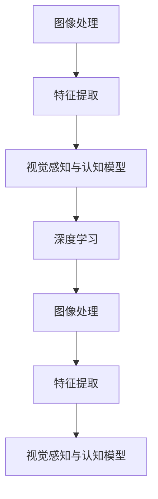

                 

### 文章标题

《计算机视觉：从基础到应用的深度探索》

### 关键词

计算机视觉，深度学习，图像处理，目标检测，图像分类，图像分割，自然场景理解，项目实战

### 摘要

本文全面深入地探讨了计算机视觉这一前沿领域，从基础理论到实际应用进行了系统的梳理。首先，介绍了计算机视觉的定义、发展历程和应用领域，并通过Mermaid流程图展示了核心概念之间的联系。接着，详细讲解了图像处理基础、特征提取与描述、视觉感知与认知模型以及深度学习在计算机视觉中的应用。然后，深入分析了目标检测、图像分类、图像分割等核心算法原理，并通过伪代码、数学公式和实际案例进行了详细阐述。最后，通过项目实战，展示了计算机视觉的开发流程、环境搭建、源代码实现和优化策略，为读者提供了实用的实战经验和技巧。本文旨在为计算机视觉的初学者和研究者提供一本全面而深入的学习指南。

## 《计算机视觉》目录大纲

### 第一部分：计算机视觉基础

#### 第1章：计算机视觉概述

- 1.1 计算机视觉的定义与发展历程
- 1.2 计算机视觉的应用领域
- 1.3 计算机视觉的挑战与未来趋势
- 1.4 核心概念与联系（Mermaid流程图）

#### 第2章：图像处理基础

- 2.1 图像基本概念
- 2.2 图像采集与表示
- 2.3 基本图像处理算法
- 2.4 图像增强与滤波

#### 第3章：特征提取与描述

- 3.1 特征提取原理
- 3.2 空间特征描述符
- 3.3 纹理特征描述符
- 3.4 特征匹配与相似性度量
- 3.5 伪代码示例

#### 第4章：视觉感知与认知模型

- 4.1 视觉感知的基本原理
- 4.2 视觉注意力的机制
- 4.3 视觉认知模型的构建
- 4.4 数学模型和数学公式

#### 第5章：计算机视觉中的深度学习

- 5.1 深度学习基础
- 5.2 卷积神经网络（CNN）在计算机视觉中的应用
- 5.3 生成对抗网络（GAN）及其在计算机视觉中的应用
- 5.4 神经网络优化算法与超参数调优

### 第二部分：计算机视觉算法与应用

#### 第6章：目标检测

- 6.1 目标检测概述
- 6.2 传统目标检测算法
- 6.3 基于深度学习的目标检测算法
- 6.4 目标检测算法的评估与优化

#### 第7章：图像分类

- 7.1 图像分类概述
- 7.2 传统图像分类算法
- 7.3 基于深度学习的图像分类算法
- 7.4 图像分类算法的性能评估与优化

#### 第8章：图像分割

- 8.1 图像分割概述
- 8.2 基于像素的分类分割
- 8.3 基于区域的分割
- 8.4 基于深度学习的图像分割算法

#### 第9章：姿态估计与人体识别

- 9.1 姿态估计概述
- 9.2 传统姿态估计算法
- 9.3 基于深度学习的姿态估计算法
- 9.4 人体识别的应用场景与挑战

#### 第10章：计算机视觉在自然场景理解中的应用

- 10.1 自然场景理解概述
- 10.2 图像语义分割
- 10.3 视频内容理解
- 10.4 计算机视觉在自动驾驶中的应用

### 第三部分：计算机视觉实战项目

#### 第11章：计算机视觉项目实战

- 11.1 项目准备
- 11.2 项目开发流程
- 11.3 项目实战案例
- 11.4 项目评估与优化

#### 第12章：计算机视觉实验平台搭建

- 12.1 实验环境搭建
- 12.2 数据集获取与处理
- 12.3 实验工具与框架

#### 第13章：计算机视觉源代码分析与解读

- 13.1 源代码结构解析
- 13.2 代码功能解读
- 13.3 代码优化与调试

### 附录：计算机视觉资源与工具

- 附录A：计算机视觉相关书籍与文献
- 附录B：计算机视觉开源框架与工具
- 附录C：计算机视觉数据集

### 1.1 计算机视觉的定义与发展历程

计算机视觉是一门研究如何使计算机具备人类视觉功能的学科，它涉及从图像或视频中提取有用信息、理解场景内容以及进行决策和执行任务。计算机视觉的定义可以概括为：使计算机能够对图像或视频进行感知、理解和处理，从而实现对视觉信息的自动分析和利用。

计算机视觉的发展历程可以追溯到20世纪60年代。早期的研究主要集中在低级视觉任务上，如边缘检测、角点检测和特征提取等。这些研究为后续的高级视觉任务奠定了基础。随着计算机硬件性能的提升和算法的改进，计算机视觉逐渐从简单的视觉任务走向复杂的应用领域。

1970年代，计算机视觉领域的重要进展包括Roberts边缘检测算法和Sobel边缘检测算法的提出，这些算法至今仍被广泛应用。1980年代，局部特征描述符的研究开始兴起，如Harris角点检测算法和SIFT（尺度不变特征变换）算法，这些方法在特征提取和匹配方面具有显著优势。

1990年代，机器学习技术的引入为计算机视觉带来了新的发展机遇。支持向量机（SVM）和决策树等机器学习算法被应用于图像分类和物体识别任务，取得了显著的成果。2000年代，深度学习技术开始崭露头角，卷积神经网络（CNN）在图像分类任务中取得了突破性的成果。

进入21世纪，计算机视觉迎来了飞速发展。随着大数据和深度学习技术的推动，计算机视觉的应用领域不断扩大，包括目标检测、图像分割、姿态估计、自然场景理解等。自动驾驶、安防监控、医疗影像分析等领域都得益于计算机视觉技术的进步。

1.2 计算机视觉的应用领域

计算机视觉在诸多领域都展现了其强大的应用潜力。以下是一些主要的应用领域：

- **工业自动化**：计算机视觉在工业自动化中扮演着重要角色，如生产线上的质量检测、机器人视觉导航、物体识别与分类等。通过计算机视觉技术，可以提高生产效率、降低成本并确保产品质量。
  
- **安防监控**：计算机视觉在安防监控中的应用极为广泛，包括人脸识别、车辆识别、行为分析等。这些技术有助于提升公共安全，预防犯罪，以及实时监控异常行为。

- **医疗影像分析**：计算机视觉在医疗影像分析中有着重要的应用，如医学图像的自动标注、病变区域的检测、疾病诊断等。这些应用有助于提高医疗诊断的准确性和效率。

- **自动驾驶**：计算机视觉是自动驾驶系统中的核心组成部分，用于道路识别、障碍物检测、行人识别等。随着技术的不断进步，自动驾驶汽车正逐渐走向现实。

- **虚拟现实与增强现实**：计算机视觉在虚拟现实（VR）和增强现实（AR）中的应用，使得用户能够获得更加真实和沉浸式的体验。通过计算机视觉技术，可以实现实时图像处理、空间定位和交互功能。

1.3 计算机视觉的挑战与未来趋势

尽管计算机视觉取得了显著的进展，但仍面临着许多挑战：

- **数据依赖**：深度学习模型的性能很大程度上依赖于大量的标注数据，而获取这些数据往往成本高昂。

- **计算资源**：深度学习模型通常需要大量的计算资源，尤其是在训练阶段，这对硬件设备提出了更高的要求。

- **泛化能力**：深度学习模型往往在训练数据上表现出色，但在未见过的数据上性能可能会下降，即所谓的“过拟合”问题。

- **实时性能**：计算机视觉算法需要在实时环境中快速准确地执行，这对算法的效率和准确性提出了挑战。

未来，计算机视觉的发展趋势包括：

- **算法优化**：研究更高效的算法，减少计算资源和数据的需求。

- **小样本学习**：发展能够在少量数据上进行训练和泛化的算法。

- **多模态学习**：结合多种数据源（如文本、图像、声音等），提高模型的性能。

- **端到端学习**：直接从原始数据到目标输出，减少中间步骤，提高效率。

### 核心概念与联系

计算机视觉的核心概念包括图像处理、特征提取、视觉感知与认知模型、深度学习等。这些概念之间存在紧密的联系，共同构成了计算机视觉的理论体系。

1. **图像处理**：图像处理是计算机视觉的基础，它涉及图像的采集、表示、增强和滤波等。图像处理技术为后续的特征提取和视觉任务提供了必要的预处理。

2. **特征提取**：特征提取是从图像中提取出对视觉任务有用的信息的过程。特征提取方法包括边缘检测、角点检测、纹理特征提取等，它们为视觉任务的实现提供了关键的数据基础。

3. **视觉感知与认知模型**：视觉感知与认知模型研究的是人类视觉系统的工作原理，以及如何将这些原理应用于计算机视觉。视觉感知包括视觉注意机制、感知空间和形状等，而认知模型则涉及如何对视觉信息进行理解和解释。

4. **深度学习**：深度学习是近年来计算机视觉领域的重要突破，它通过模拟人类大脑的神经网络结构，实现了对复杂视觉任务的自动学习和处理。深度学习与图像处理和特征提取相结合，显著提升了计算机视觉的性能。

下图使用Mermaid流程图展示了这些核心概念之间的联系：



通过Mermaid流程图，我们可以清晰地看到图像处理、特征提取、视觉感知与认知模型和深度学习之间的相互关联和作用。图像处理提供了基础数据，特征提取从数据中提取关键信息，视觉感知与认知模型借鉴人类视觉系统的工作原理，而深度学习则利用这些信息进行自动学习和任务实现。这些核心概念相互交织，共同推动了计算机视觉的发展。

### 2.1 图像基本概念

在计算机视觉中，图像作为主要的输入数据源，其基本概念的理解至关重要。图像是由像素组成的二维离散信号，每个像素代表了图像在特定位置上的一个采样点。图像的基本概念包括以下几个方面：

1. **分辨率**：分辨率是指图像中像素的数量，通常用水平像素数和垂直像素数表示。例如，一个800x600的图像表示水平方向有800个像素，垂直方向有600个像素。分辨率越高，图像的细节表现越丰富。

2. **像素深度**：像素深度决定了图像中每个像素可以表示的位数，即每个像素可以存储的颜色信息量。常见的像素深度有8位、16位、24位和32位等。8位像素深度可以表示256种不同的颜色，而24位像素深度可以表示1677万种颜色（真彩色）。

3. **颜色模型**：颜色模型是用来表示图像中像素颜色信息的方法。常见的颜色模型包括RGB（红绿蓝）模型、HSV（色相饱和度亮度）模型和CMYK（青色品红色黑色）模型。RGB模型常用于计算机显示，HSV模型更适合描述颜色的属性，CMYK模型则用于印刷行业。

4. **图像格式**：图像格式是指图像数据的存储和表示方式。常见的图像格式包括BMP、JPEG、PNG、GIF等。每种格式都有其特定的压缩算法和存储结构，适用于不同的应用场景。例如，JPEG格式适合存储照片，PNG格式适合存储带透明背景的图像。

5. **像素值**：每个像素的颜色信息通常用一个数值表示，这些数值决定了像素的颜色和亮度。在8位像素深度下，每个颜色通道的像素值范围是0到255。例如，一个RGB像素值为(100, 150, 200)的像素表示红色值为100，绿色值为150，蓝色值为200。

6. **灰度图像**：灰度图像是只包含亮度信息的图像，每个像素只存储一个灰度值。灰度图像通常用单通道表示，其像素值范围也是0到255，其中0表示黑色，255表示白色。

7. **色彩空间转换**：色彩空间转换是指将一种颜色模型转换为另一种颜色模型的过程。例如，将RGB颜色模型转换为HSV颜色模型，或者将RGB图像转换为灰度图像。色彩空间转换在图像处理中具有重要意义，因为不同的颜色模型适用于不同的视觉任务。

通过理解这些基本概念，我们可以更好地处理和解释图像数据，为后续的图像处理和分析任务奠定基础。在实际应用中，掌握图像分辨率、像素深度、颜色模型、图像格式和像素值等基本概念，有助于我们更有效地进行图像数据的存储、传输和处理。

### 2.2 图像采集与表示

图像采集与表示是计算机视觉中的基础环节，涉及从现实世界获取图像信息并将其数字化表示的过程。图像采集的方式和表示的方法直接影响后续图像处理和分析的质量和效率。

#### 图像采集

1. **摄像头**：摄像头是常见的图像采集设备，广泛应用于计算机视觉系统。摄像头通过光学镜头将光信号转换为电信号，再通过数字信号处理单元（DSP）转换为数字图像。常见类型包括CCD（电荷耦合器件）摄像头和CMOS（互补金属氧化物半导体）摄像头。

2. **红外摄像头**：红外摄像头主要用于在低光或无光环境下进行图像采集。它们通过检测红外辐射来生成图像，适用于安防监控、夜视设备和医疗成像等领域。

3. **激光扫描仪**：激光扫描仪通过发射激光束并测量反射光的时间或强度来获取三维空间信息，生成高精度的点云数据。这种设备广泛应用于三维建模、逆向工程和自动驾驶等领域。

4. **X光机**：X光机利用X射线穿透物体并在胶片或传感器上产生图像，广泛用于医学影像、安检和工业检测等领域。

#### 图像表示

1. **数字图像**：数字图像是通过将连续的光信号采样和量化得到的。图像的每个像素点用一组数值表示，这些数值决定了像素的颜色和亮度。数字图像的基本单位是像素，其分辨率和像素深度决定了图像的细节和颜色深度。

2. **像素格式**：像素格式是指像素值的数据类型和存储方式。常见的像素格式包括单通道灰度图像、RGB彩色图像和RGBA带透明度的图像。单通道图像使用一个数值表示像素的灰度值，RGB图像使用三个数值分别表示红色、绿色和蓝色通道的值，而RGBA图像在RGB基础上增加了一个数值表示透明度。

3. **图像存储格式**：图像存储格式是用于存储图像数据的文件格式。常见的图像存储格式包括BMP、JPEG、PNG、GIF等。每种格式都有其特定的压缩算法和文件结构，适用于不同的应用场景。例如，JPEG格式适用于存储照片，PNG格式适用于存储带透明背景的图像。

4. **图像数据结构**：图像数据结构是指图像数据在内存中的存储方式。常见的图像数据结构包括二维数组、三维数组和矩阵。二维数组是图像处理中最常用的数据结构，其中每个元素代表一个像素的值。三维数组通常用于表示多通道图像，例如RGB图像，而矩阵是更通用的数据结构，可以用于表示二维和三维数据。

#### 图像采集与表示的重要性

图像采集与表示是计算机视觉系统的第一步，其质量直接影响后续图像处理和分析的效果。以下是图像采集与表示的重要性：

1. **分辨率和像素深度**：高分辨率和深像素度可以提供更多的图像细节，有助于提高视觉任务的准确性和鲁棒性。

2. **颜色模型**：选择合适的颜色模型可以更好地适应不同的视觉任务。例如，RGB模型适用于计算机显示，HSV模型适用于颜色分析和分类。

3. **图像压缩**：图像压缩可以减小数据的大小，提高传输和存储的效率。但过度压缩会导致图像质量下降，影响后续处理的准确性。

4. **图像格式**：选择合适的图像格式可以平衡图像质量和文件大小。例如，JPEG格式适用于需要高压缩比的场景，而PNG格式适用于需要高质量图像的场景。

通过深入了解图像采集与表示的方法和重要性，我们可以更好地利用图像数据，实现更高效的计算机视觉任务。

### 2.3 基本图像处理算法

基本图像处理算法是计算机视觉中的核心组成部分，用于对图像进行增强、滤波、变换等操作，以提高图像质量、提取有用信息，并为后续处理任务奠定基础。以下将介绍几种常见的图像处理算法及其基本原理。

#### 边缘检测

边缘检测是图像处理中的重要步骤，用于识别图像中的亮度变化较为显著的区域。常见的边缘检测算法包括Roberts算子、Sobel算子和Canny算子。

- **Roberts算子**：Roberts算子通过计算像素点邻域内水平和垂直梯度差的绝对值来检测边缘。其计算公式如下：

  $$
  G_x = |I(x+1, y) - I(x-1, y)| + |I(x, y+1) - I(x, y-1)|
  $$

  $$
  G_y = |I(x, y+1) - I(x, y-1)| + |I(x+1, y) - I(x-1, y)|
  $$

- **Sobel算子**：Sobel算子使用两个3x3的卷积核分别计算水平和垂直方向上的梯度，然后取两者的平方和的平方根作为梯度值。其卷积核如下：

  $$
  G_x = \frac{1}{2} \sqrt{[1 0 -1][2 0 -2][1 0 -1]}
  $$

  $$
  G_y = \frac{1}{2} \sqrt{[1 2 1][0 0 0][1 -2 -1]}
  $$

- **Canny算子**：Canny算子结合了Sobel算子和非极大值抑制，通过双阈值处理和边缘连接来检测边缘。其步骤包括高斯滤波、Sobel梯度计算、非极大值抑制和双阈值边缘检测。

#### 形态学处理

形态学处理是利用结构元素对图像进行操作的方法，常用于图像分割、去噪和形状分析。常见的形态学处理算法包括膨胀、腐蚀、开运算和闭运算。

- **膨胀**：膨胀操作通过将图像中的每个像素与其邻域内的最大像素值进行比较，并将结果赋值给当前像素来实现。其公式如下：

  $$
  O = \text{max}(I + S)
  $$

  其中，\(O\) 是膨胀后的图像，\(I\) 是原始图像，\(S\) 是结构元素。

- **腐蚀**：腐蚀操作与膨胀操作相反，通过将图像中的每个像素与其邻域内的最小像素值进行比较，并将结果赋值给当前像素来实现。其公式如下：

  $$
  E = \text{min}(I \cdot S)
  $$

  其中，\(E\) 是腐蚀后的图像，\(I\) 是原始图像，\(S\) 是结构元素。

- **开运算**：开运算先进行腐蚀操作，再进行膨胀操作，用于去除图像中的小孔洞。

  $$
  O = E \oplus S
  $$

- **闭运算**：闭运算先进行膨胀操作，再进行腐蚀操作，用于封闭图像中的小孔洞。

  $$
  C = S \oplus E
  $$

#### 图像滤波

图像滤波是用于去除图像中的噪声和增强图像细节的方法。常见的滤波算法包括均值滤波、中值滤波和拉普拉斯滤波。

- **均值滤波**：均值滤波通过计算每个像素邻域内的像素平均值来实现去噪。其公式如下：

  $$
  I' = \frac{1}{n} \sum_{i=-1}^{1} \sum_{j=-1}^{1} I(i, j)
  $$

  其中，\(I'\) 是滤波后的图像，\(I\) 是原始图像，\(n\) 是邻域大小。

- **中值滤波**：中值滤波通过计算每个像素邻域内的像素中值来实现去噪。其公式如下：

  $$
  I' = \text{median}(I)
  $$

  其中，\(I'\) 是滤波后的图像，\(I\) 是原始图像。

- **拉普拉斯滤波**：拉普拉斯滤波通过计算图像的拉普拉斯算子来实现边缘检测。其公式如下：

  $$
  L = \text{Laplacian}(I)
  $$

  其中，\(L\) 是拉普拉斯算子，\(I\) 是原始图像。

通过这些基本图像处理算法，我们可以对图像进行有效的预处理，提高图像质量，为后续的特征提取和视觉任务打下坚实基础。

### 2.4 图像增强与滤波

图像增强与滤波是图像处理中的重要环节，旨在提高图像的质量和视觉效果，使得图像能够更好地适应后续的分析和应用。以下将详细介绍几种常见的图像增强与滤波方法，包括直方图均衡化、对比度拉伸、高斯滤波等。

#### 直方图均衡化

直方图均衡化是一种通过调整图像像素分布，使图像的对比度得到增强的方法。原始图像的直方图表示了不同灰度值在图像中的分布情况。直方图均衡化通过重新分配像素值，使得直方图更加均匀，从而增强图像的对比度。

- **基本原理**：直方图均衡化的步骤如下：

  1. 计算原始图像的直方图 \(h(r)\)。
  2. 计算累积分布函数（CDF） \(H(r) = \sum_{i=0}^{r} h(i)\)。
  3. 将累积分布函数进行归一化，得到 \(H'(r) = \frac{H(r)}{N-1}\)。
  4. 根据归一化后的CDF，计算新的像素值 \(s = H'^{-1}(r)\)，其中 \(r\) 是原始像素值，\(s\) 是增强后的像素值。
  5. 将新的像素值映射回图像，得到增强后的图像。

- **代码实现**：

  ```python
  import numpy as np
  import cv2

  def histogram_equalization(image):
      # 计算原始图像的直方图
      hist, _ = np.histogram(image.flatten(), 256, [0, 256])
      
      # 计算累积分布函数（CDF）
      cdf = hist.cumsum()
      cdf_normalized = cdf * (255 / cdf[-1])
      
      # 使用线性插值查找表（LUT）进行映射
      lut = np.interp(image, np.unique(image), cdf_normalized)
      
      # 应用LUT进行像素值映射
      image_equalized = cv2.LUT(image, lut)
      return image_equalized
  ```

#### 对比度拉伸

对比度拉伸是一种简单但有效的图像增强方法，通过调整图像的亮度范围来增强图像的对比度。对比度拉伸通常通过以下步骤实现：

- **基本原理**：对比度拉伸的步骤如下：

  1. 确定图像的最小和最大灰度值，分别记为 \(min\_val\) 和 \(max\_val\)。
  2. 计算拉伸系数 \(k = \frac{L - 0}{max\_val - min\_val}\)，其中 \(L\) 是目标的最大灰度值，通常为 255。
  3. 将图像中的每个像素值按以下公式进行拉伸：

     $$
     s = k \cdot (i - min\_val) + 0
     $$

     其中，\(s\) 是拉伸后的像素值，\(i\) 是原始像素值。

- **代码实现**：

  ```python
  def contrast_stretch(image, L=255):
      min_val = np.min(image)
      max_val = np.max(image)
      
      stretch_coeff = (L - 0) / (max_val - min_val)
      
      image_stretched = stretch_coeff * (image - min_val)
      
      return image_stretched
  ```

#### 高斯滤波

高斯滤波是一种经典的图像平滑滤波方法，通过应用高斯函数对图像进行加权平均，以去除图像中的噪声。高斯滤波器在各个方向上具有相似的响应，因此适用于去除各种类型的噪声。

- **基本原理**：高斯滤波的步骤如下：

  1. 创建一个高斯滤波器，其值由高斯分布函数确定。滤波器的尺寸和标准差（\(\sigma\)）会影响滤波的效果。
  2. 对图像进行卷积操作，将每个像素值与滤波器中的相应值进行加权平均。

- **代码实现**（使用OpenCV库）：

  ```python
  import cv2

  def gauss_filter(image, sigma=1.0):
      # 创建高斯滤波器
      kernel = cv2.GaussianBlur(image, (5, 5), sigma)
      return kernel
  ```

通过这些图像增强与滤波方法，我们可以有效提高图像的质量，使其更适合后续的特征提取和视觉分析任务。这些方法在实际应用中具有广泛的应用价值，如图像分割、目标检测、图像识别等。

### 3.1 特征提取原理

特征提取是计算机视觉中的一个关键步骤，旨在从图像或视频中提取出对目标识别任务有用的信息。特征提取的质量直接影响到后续的视觉任务，如目标检测、图像分类和图像分割的性能。特征提取的基本原理包括以下几个方面：

1. **局部特征**：局部特征是在图像局部区域内具有独特性和稳定性的特征。常见的局部特征包括角点、边缘、纹理和形状等。局部特征提取方法通常基于图像的局部结构和纹理信息，通过检测和描述这些特征来提取关键信息。

2. **全局特征**：全局特征是从图像的整个区域内提取的特征，通常用于图像的整体描述和分类。全局特征包括直方图、颜色分布、纹理特征和形状特征等。全局特征提取方法关注图像的整体结构和内容，而不是局部的变化。

3. **空间特征描述符**：空间特征描述符是将提取的局部特征转化为固定长度的向量，以便进行后续的匹配和分类。常见的空间特征描述符包括SIFT（尺度不变特征变换）、SURF（加速稳健特征）、HOG（方向梯度直方图）等。这些描述符通过将图像中的局部特征转换为向量，使得特征向量具有较好的区分性和不变性。

4. **纹理特征描述符**：纹理特征描述符是用于描述图像中的纹理信息的方法。纹理特征通常与图像的局部区域相关，通过分析像素间的空间关系和灰度变化来提取纹理特征。常见的纹理特征描述符包括LBP（局部二值模式）和GIST（图像内容摘要）等。

5. **特征匹配**：特征匹配是利用特征提取技术获取的特征向量，将不同图像或同一图像中的特征点进行匹配的过程。特征匹配的关键在于如何准确地匹配特征点，从而实现图像的配准、目标检测和图像分类等任务。常用的特征匹配方法包括欧氏距离、余弦相似度和最近邻算法等。

6. **特征选择**：特征选择是从大量提取的特征中挑选出对目标识别任务最有用的特征，以减少计算量和提高识别性能。特征选择方法包括基于信息论的降维方法、基于类内类间散度的特征筛选和基于机器学习的特征选择方法等。

通过以上特征提取原理，计算机视觉系统能够从图像中提取出具有区分性和不变性的特征，为后续的视觉任务提供有效的支持。特征提取技术的不断发展和优化，使得计算机视觉在众多应用领域中取得了显著的成果。

### 3.2 空间特征描述符

空间特征描述符是计算机视觉中用于将局部特征转化为固定长度向量的方法，使得特征具有较好的区分性和不变性。空间特征描述符在各种视觉任务中扮演着至关重要的角色，如目标检测、图像分类和图像分割。以下将详细介绍几种常见的空间特征描述符，包括SIFT（尺度不变特征变换）和SURF（加速稳健特征）。

#### SIFT（尺度不变特征变换）

SIFT是一种广泛应用于计算机视觉中的特征描述符，由David G. Lowe在1999年提出。SIFT具有以下特点：

1. **尺度不变性**：SIFT能够在不同尺度下检测和描述特征，使其在图像缩放变换下保持不变。
2. **旋转不变性**：SIFT能够检测和描述图像在旋转变换下的特征，从而适应不同的旋转角度。
3. **亮度不变性**：SIFT能够检测和描述图像在亮度变化下的特征，使其在亮度调整下保持稳定。
4. **准确性和鲁棒性**：SIFT通过关键点和特征向量的高效匹配，具有较高的准确性和鲁棒性。

SIFT的基本步骤包括：

- **尺度空间构造**：首先，使用高斯核函数构造尺度空间，以捕捉不同尺度下的特征点。
- **关键点检测**：通过计算尺度空间的极值点来检测关键点，这些关键点在尺度空间中具有局部极值特性。
- **关键点定位**：对检测到的关键点进行定位，确保其在不同尺度下保持稳定。
- **特征向量计算**：计算关键点的特征向量，通常采用局部图像梯度方向和幅值信息。
- **特征匹配**：将特征向量用于匹配不同图像中的关键点，实现图像配准和目标检测。

#### SURF（加速稳健特征）

SURF是由Holger Brunelière和Javier Cordon在2006年提出的一种特征描述符，它旨在提高SIFT的计算效率。SURF具有以下特点：

1. **计算效率**：SURF通过使用积分图像和快速Hessian矩阵计算，显著提高了特征提取的效率。
2. **尺度不变性**：SURF能够在不同尺度下检测和描述特征，与SIFT类似。
3. **旋转不变性**：SURF能够在图像旋转变换下保持稳定。
4. **亮度不变性**：SURF能够处理图像亮度变化。

SURF的基本步骤包括：

- **积分图像构造**：首先，使用积分图像来加速Hessian矩阵的计算。
- **Hessian矩阵计算**：通过积分图像计算关键点的Hessian矩阵，检测局部极值点。
- **关键点定位**：对检测到的关键点进行定位，确保其在不同尺度下保持稳定。
- **特征向量计算**：计算关键点的特征向量，通常采用局部图像梯度和方向信息。
- **特征匹配**：将特征向量用于匹配不同图像中的关键点，实现图像配准和目标检测。

#### SIFT和SURF的比较

SIFT和SURF在计算机视觉中都被广泛应用，它们各有优缺点：

- **性能**：SIFT在特征提取和匹配的准确性上具有优势，但计算复杂度较高。SURF通过优化计算过程，提高了处理速度，但可能在某些情况下略低于SIFT的准确性。
- **鲁棒性**：SIFT和SURF都具有良好的鲁棒性，能够处理图像中的噪声和遮挡。但SIFT在应对图像旋转和非均匀亮度变化时表现更为稳定。
- **计算效率**：SURF在计算效率上具有显著优势，特别适用于大规模图像处理和实时应用。

总之，SIFT和SURF是两种强大的空间特征描述符，根据具体应用场景的需求，可以选择其中一种或结合使用，以达到最佳的效果。

### 3.3 纹理特征描述符

纹理特征描述符是用于描述图像中的纹理信息的方法，纹理是图像中像素间灰度值的规律性排列。纹理特征提取在图像分类、目标检测和图像检索等任务中发挥着重要作用。以下将详细介绍几种常见的纹理特征描述符，包括LBP（局部二值模式）和GIST（图像内容摘要）。

#### LBP（局部二值模式）

LBP是一种简单而有效的纹理特征提取方法，由Omer Benavente和Javier Láska在1998年提出。LBP通过将图像像素与其邻域内的像素进行比较，将结果表示为一个二值图像，从而提取纹理信息。

1. **基本原理**：

   LBP操作的基本步骤如下：

   - 选择一个中心像素点，将其邻域内的像素值与中心像素值进行比较。
   - 如果邻域像素值大于中心像素值，则将其标记为1，否则标记为0。
   - 将所有邻域像素的比较结果组合成一个二值图像。

2. **编码**：

   LBP编码是将二值图像转换为固定长度的二进制向量。常见的LBP编码方法包括原始LBP和统一LBP。

   - **原始LBP**：将二值图像按顺时针方向旋转，将相邻的0和1进行编码，得到一个32位的二进制向量。
   - **统一LBP**：通过将原始LBP编码中的相邻0和1进行归一化，使得编码具有更好的区分性。

3. **性能**：

   LBP特征具有良好的旋转不变性和纹理区分性，适用于纹理分类和目标检测等任务。然而，LBP可能对噪声敏感，因此在实际应用中常与其他特征提取方法结合使用。

#### GIST（图像内容摘要）

GIST是一种用于描述图像整体内容的纹理特征提取方法，由John H. Trucco和Stephen W. Thorpe在1998年提出。GIST通过计算图像的颜色分布和纹理结构来提取图像内容摘要。

1. **基本原理**：

   GIST的基本步骤如下：

   - **颜色分布**：将图像分成若干个区域，计算每个区域的颜色分布。
   - **纹理结构**：对图像进行分层处理，计算不同层之间的纹理结构。
   - **特征向量**：将颜色分布和纹理结构组合成一个特征向量，用于图像分类和检索。

2. **性能**：

   GIST特征具有良好的颜色和纹理综合描述能力，适用于图像分类和图像检索等任务。GIST在处理大面积纹理和场景理解方面具有优势，但可能在处理局部纹理细节时表现较差。

总之，LBP和GIST是两种常用的纹理特征描述符，它们在不同的应用场景中具有各自的优势。LBP更适合局部纹理分析和目标检测，而GIST则更适合图像内容和场景理解。在实际应用中，可以根据具体任务需求选择合适的纹理特征描述符，以获得最佳的性能。

### 3.4 特征匹配与相似性度量

特征匹配与相似性度量是计算机视觉中至关重要的一环，用于将不同图像或同一图像中的特征点进行匹配，并评估它们之间的相似程度。特征匹配的质量直接影响视觉任务的性能，如图像配准、目标检测和图像检索等。以下将详细介绍几种常用的特征匹配方法，包括最近邻匹配、基于密度的采样一致性（DBSCAN）和基于聚类的方法。

#### 最近邻匹配

最近邻匹配是一种最简单且广泛使用的特征匹配方法，通过计算特征向量之间的欧氏距离或余弦相似度，找到最接近的特征点对。

1. **基本原理**：

   最近邻匹配的基本步骤如下：

   - 对每个特征向量，计算其与数据库中所有特征向量的距离或相似度。
   - 选择距离或相似度最小的特征向量作为最近邻匹配。

2. **优缺点**：

   - **优点**：计算简单，实现容易，能够快速找到最近的匹配点。
   - **缺点**：可能存在错误匹配，特别是在特征点数量较多或特征向量维度较高时。

3. **代码示例**：

   ```python
   import numpy as np
   
   def nearest_neighbor_matching(query_points, database_points):
       distances = []
       for query_point in query_points:
           distances.append(min((query_point - database_point).euclidean(), key=lambda x: x[0]))
       return distances
   ```

#### 基于密度的采样一致性（DBSCAN）

DBSCAN（Density-Based Spatial Clustering of Applications with Noise）是一种基于密度的聚类算法，可以用于特征匹配。DBSCAN通过分析特征点之间的密度分布，将它们划分为不同的簇，并在簇内进行匹配。

1. **基本原理**：

   DBSCAN的基本步骤如下：

   - 选择一个特征点，计算其邻域内的特征点数量。
   - 如果邻域内的特征点数量超过某一阈值（MinPts），则将该特征点标记为核心点。
   - 对每个核心点，将其邻域内的特征点划分为同一簇，并标记为核心点。
   - 对于边界点，将其划分为同一簇，并标记为边界点。
   - 将簇内特征点进行匹配。

2. **优缺点**：

   - **优点**：能够处理非均匀分布的特征点，减少错误匹配。
   - **缺点**：对参数敏感，可能存在簇划分不准确的问题。

3. **代码示例**：

   ```python
   from sklearn.cluster import DBSCAN
   
   def dbscan_matching(points, MinPts=5, eps=0.05):
       clustering = DBSCAN(eps=eps, min_samples=MinPts).fit(points)
       clusters = {}
       for i, label in enumerate(clustering.labels_):
           if label not in clusters:
               clusters[label] = []
           clusters[label].append(points[i])
       return clusters
   ```

#### 基于聚类的方法

基于聚类的方法通过将特征点划分为不同的簇，并在簇内进行匹配。常用的聚类算法包括K-means、层次聚类和基于密度的聚类等。

1. **基本原理**：

   基于聚类的方法的基本步骤如下：

   - 选择聚类算法，将特征点划分为不同的簇。
   - 对每个簇内的特征点进行匹配。

2. **优缺点**：

   - **优点**：能够处理大规模特征点，减少错误匹配。
   - **缺点**：可能存在簇划分不准确的问题。

3. **代码示例**：

   ```python
   from sklearn.cluster import KMeans
   
   def kmeans_matching(points, n_clusters=3):
       clustering = KMeans(n_clusters=n_clusters).fit(points)
       clusters = {}
       for i, label in enumerate(clustering.labels_):
           if label not in clusters:
               clusters[label] = []
           clusters[label].append(points[i])
       return clusters
   ```

综上所述，特征匹配与相似性度量方法在计算机视觉中具有广泛的应用。最近邻匹配简单易实现，DBSCAN和基于聚类的方法能够处理复杂的特征点分布。在实际应用中，可以根据具体任务需求选择合适的匹配方法，以获得最佳的性能。

### 4.1 视觉感知的基本原理

视觉感知是生物体，尤其是人类，利用视觉系统对周围环境进行感知和理解的过程。视觉系统通过眼睛接收光信号，并将其转换为神经信号，经过大脑的处理，最终形成视觉感知。以下是视觉感知的基本原理：

1. **光信号接收**：眼睛是视觉感知的起点，它由角膜、晶状体和视网膜等部分组成。角膜和晶状体负责将进入眼睛的光线聚焦到视网膜上，视网膜上的感光细胞（如视杆细胞和视锥细胞）接收光信号。

2. **光信号转换**：视杆细胞主要负责在低光条件下的黑白视觉，而视锥细胞则主要负责在明亮条件下的彩色视觉。视杆细胞和视锥细胞通过光化学反应将光信号转换为神经信号。

3. **神经信号传输**：生成的神经信号通过视网膜的神经元传递到视神经，然后传递到大脑中的视觉皮层。视觉皮层包括枕叶、颞叶和顶叶等区域，它们分别负责处理不同的视觉信息。

4. **图像生成**：大脑对传递来的神经信号进行加工和整合，最终生成我们对周围环境的视觉感知。这一过程中，大脑通过视觉皮层的不同区域，对图像进行空间感知、形状识别、颜色感知等处理。

5. **视觉感知机制**：视觉感知不仅仅是对图像的简单观察，还涉及到一系列复杂的心理和生理过程。例如，视网膜上的感光细胞通过视紫红质等化学物质进行光信号转换，神经元通过突触连接传递信号，大脑通过视觉皮层的不同区域进行图像处理。

视觉感知的基本原理使得我们能够识别和理解周围的世界，从而做出相应的反应。例如，在识别物体时，大脑不仅考虑物体的形状和颜色，还会结合物体的运动、光照和背景等因素进行综合判断。视觉感知的准确性不仅取决于视觉系统的生理结构，还受到心理因素、经验和环境条件的影响。

### 4.2 视觉注意力的机制

视觉注意力是人类视觉系统中的一个关键机制，它决定了我们对视觉信息的关注点和处理顺序。视觉注意力机制使我们能够在复杂和丰富的环境中有效地筛选和聚焦重要信息，从而提高视觉感知的效率和准确性。以下将详细介绍视觉注意力的基本机制和理论。

1. **视觉注意力的基本机制**：

   - **优先处理**：视觉注意力机制使我们能够在短时间内优先处理视觉场景中的某些特定区域或对象。这种优先处理机制使我们能够快速识别重要信息，如紧急事件或危险情况。

   - **选择性抑制**：视觉注意力机制还涉及到对不相关或干扰信息的抑制。通过抑制不重要的信息，视觉系统可以将有限的认知资源集中在关键任务上。

   - **动态调整**：视觉注意力机制是动态调整的，可以随着任务需求和环境变化而调整。例如，在驾驶过程中，驾驶员的注意力会动态地在道路、车辆和行人之间切换，以应对不同的视觉信息。

2. **视觉注意力的理论**：

   - **特征整合理论**：特征整合理论认为，视觉注意力是通过整合视觉特征（如颜色、亮度、形状、运动等）来实现的。根据任务需求，视觉系统会优先处理与任务相关的特征。

   - **竞争性抑制理论**：竞争性抑制理论认为，视觉信息在进入大脑视觉皮层时，会经历一种竞争性抑制过程。视觉注意力机制通过调节这种抑制过程，使得某些视觉信息能够突出并得到优先处理。

   - **注意相关增益（NMD）理论**：注意相关增益理论认为，视觉注意力通过改变大脑对视觉信息的处理模式，使得注意到的信息在处理过程中得到增强，而未注意到的信息则被削弱或抑制。

3. **视觉注意力的应用**：

   - **目标检测和追踪**：在目标检测和追踪任务中，视觉注意力机制可以用来优化搜索策略，提高检测和追踪的效率和准确性。

   - **图像分割和语义分割**：视觉注意力机制可以用来识别图像中的关键区域和对象，从而提高图像分割和语义分割的性能。

   - **虚拟现实和增强现实**：在虚拟现实和增强现实应用中，视觉注意力机制可以帮助用户更好地聚焦和交互，提高沉浸体验。

4. **视觉注意力的实现**：

   - **视觉注意力模型**：在计算机视觉中，研究者们已经开发了多种视觉注意力模型，如注意力机制卷积神经网络（AM-CNN）、视觉注意力图（VAM）等。这些模型通过模拟人类视觉注意力机制，实现了对视觉信息的自动筛选和聚焦。

   - **实时视觉注意力系统**：随着硬件和算法的发展，实时视觉注意力系统在自动驾驶、人机交互、智能监控等领域得到了广泛应用。这些系统可以通过对视觉场景的实时分析和处理，实现高效的视觉注意力分配。

总之，视觉注意力机制是视觉系统中的重要组成部分，它决定了我们对视觉信息的关注点和处理顺序。通过理解和模拟视觉注意力机制，我们可以提高视觉感知的效率和准确性，为各种视觉应用提供有效的解决方案。

### 4.3 视觉认知模型的构建

视觉认知模型是计算机视觉领域中的一个重要研究方向，旨在模拟人类视觉系统的工作原理，通过计算模型实现视觉感知和理解。以下将详细介绍视觉认知模型的构建过程，包括视觉感知、场景理解、对象识别和动作识别等核心模块。

#### 1. 视觉感知模块

视觉感知模块是视觉认知模型的基础，其主要功能是接收和处理视觉输入，将其转换为对环境的基本理解。具体步骤如下：

- **图像预处理**：对输入图像进行去噪、增强和归一化等预处理操作，以提高图像质量并降低干扰。
- **特征提取**：利用卷积神经网络（CNN）或其他特征提取算法，从预处理后的图像中提取空间特征、颜色特征和纹理特征等。
- **特征融合**：将不同类型的特征进行融合，以获取更全面的视觉信息。

#### 2. 场景理解模块

场景理解模块负责对视觉输入进行更高层次的理解，识别场景中的对象、关系和事件。具体步骤如下：

- **对象检测**：使用目标检测算法，如YOLO、SSD或Faster R-CNN，识别图像中的对象及其位置。
- **对象分类**：对检测到的对象进行分类，确定其类别。
- **关系提取**：分析对象之间的空间关系和交互，如“车辆在人行道上行驶”或“人正在拿着手机”。

#### 3. 对象识别模块

对象识别模块旨在从视觉场景中准确识别特定对象，是计算机视觉中的一个关键任务。具体步骤如下：

- **特征编码**：将对象的特征进行编码，通常使用深度学习模型进行端到端训练。
- **分类器训练**：使用标注数据训练分类器，如支持向量机（SVM）或神经网络。
- **对象识别**：对图像中的每个区域进行特征提取和分类，确定对象类别。

#### 4. 动作识别模块

动作识别模块负责识别和分析图像中的动态事件，如行人行走、车辆驾驶等。具体步骤如下：

- **视频处理**：将图像序列处理为视频数据，提取关键帧或特征点。
- **动作检测**：使用动作检测算法，如HMM（隐马尔可夫模型）或CNN，识别图像中的动作。
- **动作分类**：对检测到的动作进行分类，确定其类型。

#### 综合应用

通过上述模块的综合应用，视觉认知模型能够实现对复杂视觉场景的全面理解和分析。例如，在自动驾驶场景中，视觉认知模型可以用于识别道路标志、行人和车辆，分析交通状况，并做出驾驶决策。在实际应用中，视觉认知模型还需要不断优化和调整，以适应不同的场景和需求。

总之，视觉认知模型的构建是一个多层次的、复杂的过程，涉及到多个核心模块的协作。通过模拟人类视觉系统的工作原理，视觉认知模型为计算机视觉提供了强大的理论支持和实践指导。

### 5.1 深度学习基础

深度学习是近年来在计算机视觉领域取得重大突破的核心技术之一。它通过模拟人脑的神经网络结构，利用大量的数据训练模型，实现了对图像、视频和音频等复杂数据的高效处理和自动学习。以下将详细介绍深度学习的基本原理、常用架构和训练过程。

#### 基本原理

深度学习的基本原理基于人工神经网络（Artificial Neural Networks, ANNs），通过多层神经元结构进行数据处理和特征学习。每个神经元接收来自前一层神经元的输入，通过加权求和和激活函数处理，最终产生输出。深度学习的关键在于增加网络的层数，使其能够学习到更复杂的特征表示。

1. **神经元与激活函数**：神经元是神经网络的基本单元，它通过接收输入、加权求和和传递激活函数来产生输出。常见的激活函数包括Sigmoid、ReLU和Tanh等。

2. **前向传播与反向传播**：前向传播是指将输入数据通过网络，逐层计算并传递到输出层的过程。反向传播则是在预测结果与实际结果之间计算误差，并反向传播误差至输入层，以调整网络参数。

3. **多层感知器（MLP）**：多层感知器是最简单的深度学习模型，包含输入层、隐藏层和输出层。通过逐层提取特征，MLP能够实现复杂的非线性分类和回归任务。

#### 常用架构

深度学习在计算机视觉领域有许多常用的架构，以下介绍几种典型的网络结构：

1. **卷积神经网络（CNN）**：CNN是专门用于处理图像数据的深度学习模型，其核心是卷积层和池化层。卷积层通过局部感受野和卷积核提取图像特征，池化层则用于下采样和减少参数数量。CNN广泛应用于图像分类、目标检测和图像分割等任务。

2. **循环神经网络（RNN）**：RNN是一种能够处理序列数据的深度学习模型，特别适用于视频处理和自然语言处理。RNN通过在时间步上递归地更新状态，实现对序列数据的长期依赖关系建模。

3. **生成对抗网络（GAN）**：GAN由生成器和判别器组成，生成器生成假图像，判别器判断图像的真实性。通过生成器和判别器的对抗训练，GAN能够生成高质量、逼真的图像。

4. **变分自编码器（VAE）**：VAE是一种概率生成模型，通过编码器和解码器学习图像的潜在分布。VAE在图像去噪、图像增强和风格迁移等领域具有广泛应用。

#### 训练过程

深度学习模型的训练过程包括数据预处理、模型构建、参数调整和模型优化等步骤。

1. **数据预处理**：深度学习模型通常需要大量的高质量数据。数据预处理包括图像归一化、数据增强、噪声添加等，以提高模型的泛化能力。

2. **模型构建**：选择合适的网络架构和优化器，构建深度学习模型。常见的优化器包括SGD、Adam和RMSprop等。

3. **参数调整**：通过调整学习率、批量大小、正则化参数等超参数，优化模型的性能。

4. **模型优化**：使用反向传播算法和梯度下降优化模型参数，逐步减小模型预测误差。

5. **模型评估**：通过交叉验证和测试集评估模型的性能，选择最优模型。

#### 深度学习在计算机视觉中的应用

深度学习在计算机视觉领域取得了显著的成果，以下列举一些典型的应用：

1. **图像分类**：如ImageNet挑战赛，通过卷积神经网络实现图像的高效分类。

2. **目标检测**：如YOLO、SSD、Faster R-CNN等模型，实现了对图像中的目标进行检测和定位。

3. **图像分割**：如FCN、U-Net等模型，实现了对图像中的对象进行精确分割。

4. **人脸识别**：通过深度学习模型实现人脸识别，广泛应用于安防监控、人脸支付等领域。

5. **图像生成**：如GAN，能够生成高质量、逼真的图像，应用于图像增强、风格迁移等领域。

总之，深度学习为计算机视觉领域带来了革命性的变革，通过不断的研究和应用，深度学习将继续推动计算机视觉的发展。

### 5.2 卷积神经网络（CNN）在计算机视觉中的应用

卷积神经网络（CNN）是计算机视觉领域中最为重要的深度学习模型之一。其强大的特征提取和降维能力，使得CNN在图像分类、目标检测、图像分割等多个计算机视觉任务中取得了显著的成果。以下将详细介绍CNN的结构、工作原理以及其在不同任务中的应用。

#### CNN的结构

1. **卷积层（Convolutional Layer）**：卷积层是CNN的核心部分，通过局部感知野和卷积核对输入图像进行卷积操作。卷积层的主要作用是提取图像的局部特征，如边缘、纹理和形状。每个卷积核生成一个特征图，特征图的数量即卷积层的深度。

2. **池化层（Pooling Layer）**：池化层通常紧跟在卷积层之后，用于下采样特征图，减少模型的参数数量和计算复杂度。常见的池化方法包括最大池化和平均池化。

3. **全连接层（Fully Connected Layer）**：全连接层位于网络的最后几层，将卷积层提取的高层次特征映射到具体的类别或任务输出。全连接层通过矩阵乘法和激活函数将特征向量映射到输出结果。

4. **激活函数（Activation Function）**：激活函数用于引入非线性变换，使CNN能够学习复杂的非线性关系。常用的激活函数包括ReLU、Sigmoid和Tanh等。

#### CNN的工作原理

1. **前向传播**：前向传播是CNN处理输入图像的过程。输入图像首先经过卷积层，通过卷积操作提取局部特征，然后通过池化层进行下采样，降低模型的参数数量。这些特征通过多层卷积和池化层逐层传递，最终进入全连接层进行分类或回归任务。

2. **反向传播**：反向传播是CNN训练过程的核心。通过计算输出层预测结果与实际结果之间的误差，反向传播误差至输入层，更新网络参数。这个过程利用梯度下降算法，逐步减小误差，优化模型性能。

3. **特征提取与降维**：CNN通过卷积层和池化层的组合，能够自动学习图像中的高层次特征，同时实现特征的降维。卷积层通过局部感受野提取图像的局部特征，池化层通过下采样减少特征维度，从而提高模型的处理效率。

#### CNN在图像分类中的应用

图像分类是CNN在计算机视觉中的最早和最广泛应用之一。常见的图像分类任务包括ImageNet挑战赛、CIFAR-10和CIFAR-100等。

1. **VGGNet**：VGGNet是由牛津大学团队提出的一种深层CNN架构，通过使用多个卷积层和池化层堆叠，实现了优异的图像分类性能。VGGNet采用了较小的卷积核尺寸（3x3）和较小的步长（1x1），以获得更多的特征表示。

2. **ResNet**：ResNet是由微软研究院提出的一种深层网络结构，通过引入残差连接解决了深层网络训练中的梯度消失和梯度爆炸问题。ResNet通过跳过部分层的直接连接，使得梯度可以顺畅地反向传播，从而训练出更深层的网络。

3. **InceptionNet**：InceptionNet是由Google提出的另一种深层网络结构，通过设计不同的卷积层组合，实现了特征的多尺度提取。InceptionNet引入了Inception模块，该模块包含多个卷积层和池化层的组合，以获取更丰富的特征表示。

#### CNN在目标检测中的应用

目标检测是计算机视觉中的另一个重要任务，它旨在识别图像中的多个目标并定位其位置。常见的目标检测算法包括R-CNN、Fast R-CNN、Faster R-CNN和YOLO等。

1. **R-CNN**：R-CNN是由Ross Girshick等人提出的一种目标检测算法，它通过区域提议网络（Region Proposal Network, RPN）生成区域提议，然后使用CNN对提议区域进行分类和边界框回归。R-CNN是一种两步检测方法，具有较高的检测准确率，但计算复杂度较高。

2. **Faster R-CNN**：Faster R-CNN是在R-CNN基础上进行改进的一种目标检测算法，它引入了区域提议网络（RPN），将区域提议和分类任务合并到同一网络中，从而提高了检测速度。Faster R-CNN在保持较高检测准确率的同时，显著提高了计算效率。

3. **YOLO**：YOLO（You Only Look Once）是一种单步目标检测算法，它通过将图像划分为多个网格单元，在每个网格单元内预测目标的类别和位置。YOLO具有实时检测能力，适用于需要快速响应的应用场景，如自动驾驶和实时监控。

#### CNN在图像分割中的应用

图像分割是计算机视觉中的另一个重要任务，它旨在将图像中的每个像素划分为不同的类别。常见的图像分割算法包括FCN、U-Net和Mask R-CNN等。

1. **FCN**：FCN（Fully Convolutional Network）是一种全卷积神经网络，它通过将卷积神经网络扩展到整个图像，实现了像素级的分类。FCN适用于图像分割任务，具有参数数量少、计算复杂度低的特点。

2. **U-Net**：U-Net是一种专门为医学图像分割设计的网络结构，其特点是网络结构对称，卷积层和池化层交替出现。U-Net通过引入跳跃连接，将低层次特征与高层次特征进行融合，提高了分割的准确率。

3. **Mask R-CNN**：Mask R-CNN是在Faster R-CNN的基础上进行改进的一种图像分割算法，它通过引入分割分支，实现了目标检测和图像分割的联合训练。Mask R-CNN在多种图像分割任务中表现出优异的性能，广泛应用于医学图像分析、自动驾驶和智能监控等领域。

综上所述，卷积神经网络（CNN）在计算机视觉领域具有广泛的应用。通过不断的模型改进和算法优化，CNN在图像分类、目标检测和图像分割等任务中取得了显著的成果，为计算机视觉的发展提供了强大的技术支持。

### 5.3 生成对抗网络（GAN）及其在计算机视觉中的应用

生成对抗网络（GAN）是由Ian Goodfellow等人于2014年提出的一种新型深度学习模型，它通过两个对抗网络的竞争训练，生成高质量的图像和数据。GAN在计算机视觉领域取得了许多突破性成果，广泛应用于图像生成、图像修复、风格迁移和超分辨率等任务。以下将详细介绍GAN的基本原理、结构、训练过程以及在实际应用中的具体实现。

#### GAN的基本原理

GAN由生成器（Generator）和判别器（Discriminator）两个主要部分组成。生成器的目标是生成逼真的图像，而判别器的目标是区分生成图像和真实图像。通过两个网络的对抗训练，生成器不断优化生成图像的质量，使其逐渐接近真实图像。

1. **生成器**：生成器的输入是一个随机噪声向量，通过多层神经网络生成逼真的图像。生成器的目的是生成与真实图像难以区分的图像，从而欺骗判别器。

2. **判别器**：判别器的输入是真实图像和生成图像，其目的是判断输入图像是真实图像还是生成图像。判别器的目标是使生成图像的损失最大化，从而使生成图像与真实图像更加接近。

3. **对抗训练**：GAN通过最小化生成器和判别器之间的损失函数进行训练。生成器的损失函数是判别器对生成图像的判断错误率，而判别器的损失函数是生成图像的判断正确率。通过不断交替训练生成器和判别器，生成器逐渐提高生成图像的质量，判别器逐渐提高判断能力。

#### GAN的结构

GAN的结构通常包括以下几种类型：

1. **基本GAN**：基本GAN是最简单的GAN结构，由一个生成器和判别器组成。生成器输入随机噪声，输出图像；判别器输入图像，输出概率值，表示图像的真实性。

2. **深度GAN**：深度GAN引入了深度神经网络，生成器和判别器都是由多层神经网络组成的。这种结构可以学习更复杂的特征和模式，提高生成图像的质量。

3. **卷积GAN（cGAN）**：卷积GAN将卷积神经网络应用于生成器和判别器，特别适合处理图像数据。cGAN通过卷积层和反卷积层进行图像生成和判别，能够生成高质量、细节丰富的图像。

4. **条件GAN（cGAN）**：条件GAN在生成器和判别器中引入条件信息，如标签或类别。条件GAN能够根据不同的条件生成特定的图像，如根据标签生成不同类别的图像。

5. **周期性GAN（CycleGAN）**：周期性GAN能够将一种风格或类型的图像转换为另一种风格或类型，如将现实世界图像转换为艺术风格图像。CycleGAN通过引入周期性损失，使得生成器和判别器在训练过程中能够学习到源域和目标域之间的映射关系。

#### GAN的训练过程

GAN的训练过程是一个动态的对抗过程，生成器和判别器交替进行训练，具体步骤如下：

1. **初始化网络参数**：初始化生成器和判别器的参数，通常使用随机初始化或预训练模型。

2. **生成器训练**：生成器输入随机噪声，生成图像。判别器对生成图像和真实图像进行判断，生成器的目标是使生成图像的判断错误率最大化。

3. **判别器训练**：判别器输入真实图像和生成图像，提高对生成图像的判断能力。生成器的目标是使生成图像的判断正确率最小化。

4. **交替训练**：生成器和判别器交替进行训练，生成器通过学习判别器的判断错误来优化自身，判别器通过学习生成器的生成图像来提高判断能力。

5. **优化目标函数**：GAN的训练目标是最小化生成器的损失函数和判别器的损失函数。通过优化目标函数，生成器和判别器逐渐提高生成图像的质量和判别能力。

#### GAN在计算机视觉中的应用

GAN在计算机视觉领域具有广泛的应用，以下列举一些具体的应用场景：

1. **图像生成**：GAN能够生成高质量、细节丰富的图像，广泛应用于图像修复、图像合成和艺术创作等领域。例如，GAN可以用于修复破损的图像、生成新的图像内容以及将不同风格的图像融合在一起。

2. **图像修复**：GAN能够自动修复图像中的破损、噪声和缺陷。例如，DeepArt.io使用GAN生成艺术风格的图像，将用户上传的图片转换为特定艺术家的风格。

3. **图像增强**：GAN能够提高图像的清晰度和细节，广泛应用于图像增强和超分辨率任务。例如，GAN可以用于将低分辨率图像转换为高分辨率图像，提高图像的质量和视觉效果。

4. **风格迁移**：GAN能够将一种艺术风格应用到另一幅图像上，生成具有特定艺术风格的新图像。例如，GAN可以用于将普通照片转换为梵高风格的画作，或将现实世界图像转换为卡通风格。

5. **图像分类和识别**：GAN能够生成具有特定类别的图像，用于图像分类和识别任务的辅助训练。例如，GAN可以生成用于训练分类器的大量标注数据，提高分类器的性能。

总之，生成对抗网络（GAN）在计算机视觉领域具有广泛的应用前景，通过不断的模型改进和算法优化，GAN将在更多视觉任务中发挥重要作用，为计算机视觉的发展带来新的突破。

### 5.4 神经网络优化算法与超参数调优

神经网络优化算法与超参数调优是深度学习训练过程中至关重要的一环。优化算法决定了模型参数更新的策略，而超参数则影响了模型的性能和收敛速度。以下将详细介绍几种常用的神经网络优化算法及其在计算机视觉中的应用，以及超参数调优的方法和技巧。

#### 1. 优化算法

1. **随机梯度下降（SGD）**：SGD是最简单的优化算法，通过计算梯度方向和步长来更新模型参数。SGD的更新公式为：

   $$
   \theta = \theta - \alpha \cdot \nabla_{\theta} J(\theta)
   $$

   其中，\(\theta\) 是模型参数，\(\alpha\) 是学习率，\(J(\theta)\) 是损失函数。SGD的优点是实现简单，缺点是收敛速度较慢，对参数敏感。

2. **动量法（Momentum）**：动量法通过引入动量项，加速梯度较大的方向，减缓梯度较小的方向。动量法的更新公式为：

   $$
   v_t = \gamma \cdot v_{t-1} + \alpha \cdot \nabla_{\theta} J(\theta)
   $$

   $$ 
   \theta = \theta - v_t
   $$

   其中，\(v_t\) 是动量项，\(\gamma\) 是动量系数。动量法的优点是加速收敛，缺点是可能陷入局部最小值。

3. **Adam优化器**：Adam优化器结合了SGD和动量法的优点，同时利用一阶矩估计和二阶矩估计来更新模型参数。Adam的更新公式为：

   $$
   m_t = \beta_1 \cdot m_{t-1} + (1 - \beta_1) \cdot \nabla_{\theta} J(\theta)
   $$

   $$
   v_t = \beta_2 \cdot v_{t-1} + (1 - \beta_2) \cdot (\nabla_{\theta} J(\theta))^2
   $$

   $$ 
   \theta = \theta - \alpha \cdot \frac{m_t}{\sqrt{v_t} + \epsilon}
   $$

   其中，\(\beta_1\) 和 \(\beta_2\) 分别是动量系数，\(\epsilon\) 是一个很小的常数。Adam优化器的优点是自适应学习率，收敛速度快，适用于复杂模型。

#### 2. 超参数调优

超参数是深度学习模型中不可通过学习算法调整的参数，如学习率、批量大小、正则化参数等。超参数调优的目标是找到最优的超参数组合，使模型在特定任务上性能达到最佳。

1. **网格搜索（Grid Search）**：网格搜索是一种穷举搜索方法，通过遍历所有可能的超参数组合，找到最优组合。网格搜索的优点是简单直观，缺点是计算量大，不适合超参数数量较多的情况。

2. **随机搜索（Random Search）**：随机搜索通过从所有可能的超参数组合中随机选择一部分进行评估，找到最优组合。随机搜索的优点是计算量相对较小，但可能无法找到全局最优。

3. **贝叶斯优化（Bayesian Optimization）**：贝叶斯优化是一种基于概率模型的优化方法，通过构建超参数的概率模型，进行高效的搜索。贝叶斯优化的优点是能够快速找到近似最优超参数，缺点是计算复杂度较高。

#### 实际应用

1. **学习率调整**：学习率是深度学习中最关键的超参数之一。合适的初始学习率可以加速收敛，但过大会导致模型无法收敛，过小则收敛速度慢。常用的方法包括逐步衰减学习率、恒定学习率和自适应学习率。

2. **批量大小调整**：批量大小影响模型训练的稳定性和收敛速度。较大的批量大小可以减少方差，但增加计算量；较小的批量大小可以减少计算量，但增加方差。常用的批量大小包括32、64、128和256。

3. **正则化参数调整**：正则化参数用于防止模型过拟合。L1正则化通过引入L1范数惩罚，可以减少模型参数；L2正则化通过引入L2范数惩罚，可以稳定模型。合适的正则化参数可以平衡模型复杂度和泛化能力。

通过合理的神经网络优化算法与超参数调优，我们可以显著提高深度学习模型在计算机视觉任务上的性能，为实际应用提供有效的解决方案。

### 6.1 目标检测概述

目标检测是计算机视觉领域中的一个重要任务，其目标是识别图像中的多个对象并定位它们的位置。目标检测在诸多实际应用中具有广泛的应用，如自动驾驶、安防监控、医疗影像分析和智能监控等。以下将详细介绍目标检测的定义、任务描述以及其在计算机视觉中的应用场景。

#### 定义与任务描述

目标检测可以定义为：给定一张图像，通过算法识别出图像中的目标对象，并给出每个目标的类别和位置信息。目标检测的任务通常包括以下几个步骤：

1. **目标定位**：通过算法识别出图像中的目标对象，并计算其位置。目标位置通常用一个矩形框表示，称为边界框（Bounding Box）。
2. **目标分类**：对识别出的每个目标进行分类，确定其所属类别。常见的类别包括车辆、行人、动物等。
3. **结果输出**：将识别出的目标对象及其类别和位置信息输出，通常以列表形式或文本形式表示。

#### 应用场景

目标检测在计算机视觉领域有许多重要的应用场景，以下列举几个典型的应用场景：

1. **自动驾驶**：目标检测在自动驾驶系统中用于识别道路上的车辆、行人、交通标志等对象，为自动驾驶车辆提供决策依据，确保行驶安全。
2. **安防监控**：目标检测在安防监控系统中用于实时监控场景，识别异常行为和目标对象，如入侵者、可疑包裹等，有助于提高公共安全。
3. **医疗影像分析**：目标检测在医疗影像分析中用于识别和定位病变区域，如肿瘤、心脏病等，辅助医生进行诊断和治疗。
4. **智能监控**：目标检测在智能监控系统中用于识别和跟踪场景中的目标对象，如人群密度监测、行为分析等，为智能安防和智能城市提供支持。

#### 目标检测的基本流程

目标检测的基本流程包括以下几个步骤：

1. **预处理**：对输入图像进行预处理，如缩放、裁剪、灰度化等，以便后续处理。
2. **特征提取**：通过卷积神经网络（CNN）或其他特征提取算法提取图像的特征，通常使用多层卷积层进行特征提取。
3. **候选区域生成**：使用区域提议网络（Region Proposal Network, RPN）或滑窗（Sliding Window）方法生成候选区域，这些区域被认为是可能包含目标对象的区域。
4. **目标分类**：对每个候选区域进行分类，确定其是否包含目标对象，并识别目标对象的类别。
5. **位置回归**：对包含目标对象的候选区域进行位置回归，计算目标对象的精确位置和大小。
6. **结果输出**：将识别出的目标对象及其类别、位置和置信度输出，通常使用列表或文本形式表示。

#### 目标检测的性能评估指标

目标检测的性能通常通过以下指标进行评估：

1. **准确率（Accuracy）**：准确率是正确识别的目标数量与总目标数量的比值，用于评估目标检测的总体性能。
2. **召回率（Recall）**：召回率是正确识别的目标数量与实际目标数量的比值，用于评估目标检测的漏检情况。
3. **精度（Precision）**：精度是正确识别的目标数量与检测出的目标数量的比值，用于评估目标检测的误检情况。
4. **平均精度（Average Precision, AP）**：平均精度是针对每个类别计算精度与召回率的调和平均值，用于评估目标检测在不同类别上的性能。

通过这些性能评估指标，我们可以全面了解目标检测算法的性能，为优化和改进算法提供依据。

#### 深度学习在目标检测中的应用

深度学习在目标检测领域取得了显著的成果，主要得益于卷积神经网络（CNN）和区域提议网络（RPN）的发展。以下介绍几种基于深度学习的目标检测算法：

1. **R-CNN**：R-CNN是由Ross Girshick等人提出的一种目标检测算法，包括区域提议网络（RPN）和分类器。RPN用于生成候选区域，分类器用于对候选区域进行分类。R-CNN是一种两步检测方法，具有较高的检测准确率，但计算复杂度较高。
2. **Fast R-CNN**：Fast R-CNN是对R-CNN的改进，通过共享卷积特征层，减少了计算复杂度。Fast R-CNN使用ROI（Region of Interest）池化层对候选区域进行特征提取，并使用全连接层进行分类。Fast R-CNN在保持较高检测准确率的同时，显著提高了计算效率。
3. **Faster R-CNN**：Faster R-CNN是R-CNN和Fast R-CNN的结合，引入了区域提议网络（RPN），实现了检测和分类的一体化。RPN通过卷积操作生成候选区域，并使用锚点（Anchor）进行目标定位和分类。Faster R-CNN具有实时检测能力，广泛应用于自动驾驶和安防监控等领域。
4. **YOLO**：YOLO（You Only Look Once）是由Joseph Redmon等人提出的一种单步检测算法，通过将图像划分为多个网格单元，在每个网格单元内预测目标的类别和位置。YOLO具有实时检测能力，适用于需要快速响应的应用场景。
5. **SSD**：SSD（Single Shot MultiBox Detector）是由Wei Liu等人提出的一种单步检测算法，通过在不同尺度的特征图上预测目标，实现了多尺度检测。SSD具有较高的检测准确率和实时性，广泛应用于移动设备和嵌入式系统。
6. **RetinaNet**：RetinaNet是由Fengwei Hu等人提出的一种基于Focal Loss的目标检测算法，通过引入Focal Loss解决了正负样本不平衡问题。RetinaNet在保持较高检测准确率的同时，具有较低的参数数量和计算复杂度。

总之，深度学习在目标检测领域取得了显著进展，通过不断的模型改进和算法优化，深度学习目标检测算法在性能和效率方面不断取得突破，为计算机视觉的应用提供了强大的技术支持。

### 6.2 传统目标检测算法

传统目标检测算法在计算机视觉领域有着悠久的历史，其核心思想是通过手工设计的特征和分类器来识别图像中的目标。以下将详细介绍几种传统目标检测算法，包括HOG（方向梯度直方图）算法和SVM（支持向量机）算法。

#### HOG（方向梯度直方图）算法

HOG算法是方向梯度直方图（Histogram of Oriented Gradients）的缩写，它通过计算图像中每个像素点邻域内的梯度方向和幅值，生成一个直方图特征向量，用于目标检测。HOG算法的基本步骤如下：

1. **梯度计算**：对图像进行梯度计算，得到图像的水平和垂直方向梯度。梯度幅值用于描述像素点的亮度变化，而梯度方向则反映了亮度的变化方向。

2. **直方图构建**：将每个像素点的梯度方向划分为若干个区域，计算每个区域内的梯度方向直方图。直方图的每个 bin 对应一个方向角度，如0度、45度、90度等。

3. **特征向量生成**：将所有像素点的直方图组合成一个特征向量，用于后续的分类和目标检测。

HOG算法的优点在于其简单性和高效性，能够在较低计算资源下实现较好的目标检测性能。然而，HOG算法对光照变化和姿态变化较为敏感，容易受到噪声的影响。

#### SVM（支持向量机）算法

支持向量机（Support Vector Machine, SVM）是一种经典的机器学习算法，广泛应用于分类和回归任务。在目标检测中，SVM通过将HOG特征向量作为输入，训练一个分类器，用于识别图像中的目标。

1. **特征提取**：使用HOG算法提取图像的特征向量，生成用于分类的特征数据集。

2. **模型训练**：将提取的特征向量输入到SVM分类器中，通过优化分类器的参数（如惩罚参数C）来提高分类性能。SVM通过寻找一个最优的超平面，将正负样本分类最大化。

3. **目标检测**：对于新的输入图像，使用HOG算法提取特征向量，并将其输入到训练好的SVM分类器中进行分类。如果分类器的输出概率超过设定阈值，则判定该区域为目标。

SVM算法的优点在于其强大的分类能力，能够在高维空间中找到最优分类边界。然而，SVM算法的训练过程较为复杂，对计算资源要求较高。

#### 混合方法

传统目标检测算法通常结合多种方法，以提高检测性能。例如，结合HOG和SVM的方法，首先使用HOG算法提取图像特征，然后使用SVM分类器进行目标检测。这种混合方法利用了HOG算法的鲁棒性和SVM分类器的强大分类能力，能够在多种复杂场景中实现有效的目标检测。

#### 应用场景

传统目标检测算法在许多应用场景中具有广泛的应用：

- **行人检测**：HOG算法在行人检测中表现出较好的性能，广泛应用于智能监控和自动驾驶领域。
- **车辆检测**：SVM算法在车辆检测中具有较高的准确率和实时性，适用于交通监控和自动驾驶系统。
- **人脸检测**：结合HOG和SVM的算法在人脸检测中具有较高的鲁棒性和准确性，广泛应用于人脸识别和安防监控。

总之，传统目标检测算法通过手工设计的特征和分类器，实现了对图像中目标的识别和定位。尽管在计算资源和性能方面与深度学习算法相比存在一定差距，但它们在特定应用场景中仍具有广泛的应用价值。

### 6.3 基于深度学习的目标检测算法

基于深度学习的目标检测算法在近年来取得了显著的进展，主要得益于卷积神经网络（CNN）和区域提议网络（RPN）的发展。以下将详细介绍几种基于深度学习的目标检测算法，包括YOLO、SSD和Faster R-CNN。

#### YOLO（You Only Look Once）

YOLO（You Only Look Once）是由Joseph Redmon等人于2016年提出的一种单步目标检测算法。YOLO将图像划分为多个网格单元，并在每个网格单元内预测目标的类别和位置。YOLO的主要特点包括：

- **单步检测**：YOLO在单次前向传播中完成目标检测，具有极高的检测速度，适用于实时应用场景。
- **网格单元预测**：YOLO将图像划分为SxS的网格单元，每个网格单元预测B个边界框和C个类别概率。通过滑动窗口调整网格单元大小，实现多尺度检测。
- **损失函数**：YOLO使用交叉熵损失函数和定位损失函数进行联合训练，优化目标检测性能。

YOLO的优势在于其高效的检测速度，但相对于其他算法，YOLO在检测精度上可能略有不足。

#### SSD（Single Shot MultiBox Detector）

SSD（Single Shot MultiBox Detector）是由Wei Liu等人于2016年提出的一种单步检测算法，与YOLO类似，SSD也采用单步检测策略。SSD的主要特点包括：

- **多尺度特征融合**：SSD使用不同尺度的特征图进行目标检测，通过融合不同尺度的特征信息，实现多尺度目标检测。
- **预测锚框**：SSD在特征图上生成多个锚框（Anchor Boxes），用于预测目标的位置和类别。通过调整锚框大小和比例，实现不同尺度的目标检测。
- **损失函数**：SSD使用分类损失和定位损失进行联合训练，优化检测性能。

SSD在保持较高检测速度的同时，具有较高的检测精度，适用于实时目标检测应用。

#### Faster R-CNN

Faster R-CNN是由Ross Girshick等人于2015年提出的一种基于区域提议的网络（Region Proposal Network, RPN）的目标检测算法。Faster R-CNN的主要特点包括：

- **区域提议网络**：Faster R-CNN使用RPN生成候选区域，每个候选区域被视为可能包含目标的对象。通过训练RPN，可以提高候选区域的生成质量。
- **区域分类和回归**：对于每个候选区域，Faster R-CNN使用全连接层进行分类和边界框回归，确定候选区域是否包含目标对象以及目标的位置。
- **损失函数**：Faster R-CNN使用分类损失和边界框回归损失进行联合训练，优化检测性能。

Faster R-CNN在检测精度和速度上表现出色，是当前目标检测领域最常用的算法之一。

#### 对比与分析

YOLO、SSD和Faster R-CNN是当前最为流行的几种目标检测算法，以下是它们的对比与分析：

- **检测速度**：YOLO和SSD采用单步检测策略，检测速度远快于Faster R-CNN。YOLO具有实时检测能力，适用于需要快速响应的应用场景，而SSD在速度和精度之间取得了较好的平衡。
- **检测精度**：Faster R-CNN在检测精度上表现较好，适用于对检测精度要求较高的应用场景。YOLO和SSD在检测精度上相对较低，但通过优化模型结构和超参数，可以显著提高检测性能。
- **计算资源**：Faster R-CNN的计算资源需求较高，适用于具有充足计算资源的场景。YOLO和SSD的计算资源需求相对较低，适用于移动设备和嵌入式系统。

总之，基于深度学习的目标检测算法在性能和效率上取得了显著突破，为计算机视觉的应用提供了强大的技术支持。根据具体应用场景的需求，可以选择合适的目标检测算法，以达到最佳的性能。

### 6.4 目标检测算法的评估与优化

目标检测算法的性能评估是确保其在实际应用中有效性的关键步骤。通过一系列评估指标和优化策略，我们可以评估目标检测算法的性能，并对其进行改进，以达到最佳的效果。以下将详细介绍目标检测算法的评估指标和优化策略。

#### 评估指标

1. **准确率（Accuracy）**：准确率是正确识别的目标数量与总目标数量的比值，用于评估目标检测的整体性能。准确率越高，表示算法对目标的识别越准确。

2. **召回率（Recall）**：召回率是正确识别的目标数量与实际目标数量的比值，用于评估算法的漏检情况。召回率越高，表示算法对目标的识别越全面。

3. **精度（Precision）**：精度是正确识别的目标数量与检测出的目标数量的比值，用于评估算法的误检情况。精度越高，表示算法对目标的检测越准确。

4. **平均精度（Average Precision, AP）**：平均精度是针对每个类别计算精度与召回率的调和平均值，用于评估目标检测在不同类别上的性能。AP值越高，表示算法在各类别上的性能越好。

5. **均值平均精度（Mean Average Precision, mAP）**：均值平均精度是多个类别AP值的平均值，用于综合评估目标检测算法的整体性能。mAP是评估目标检测算法最常用的指标之一。

#### 优化策略

1. **数据增强**：数据增强是一种通过变换原始数据来增加训练数据多样性的方法，有助于提高模型泛化能力。常见的数据增强方法包括旋转、缩放、翻转、裁剪、光照调整等。

2. **模型调整**：通过调整模型结构、层参数和超参数，可以优化模型性能。例如，增加网络层数、使用更深的卷积层、调整学习率和批量大小等。

3. **损失函数优化**：通过优化损失函数，可以改善模型在训练过程中的收敛速度和性能。例如，使用交叉熵损失函数、Focal Loss等可以解决正负样本不平衡问题，提高模型性能。

4. **特征融合**：将不同特征层次或不同模型的特征进行融合，可以增强模型对目标的识别能力。例如，结合底层特征和高层特征，或者结合多个模型的预测结果，可以显著提高目标检测的准确性。

5. **超参数调优**：通过使用网格搜索、随机搜索或贝叶斯优化等超参数调优方法，可以找到最优的超参数组合，提高模型性能。常用的超参数包括学习率、批量大小、正则化参数等。

6. **注意力机制**：引入注意力机制可以增强模型对关键信息的关注，提高检测性能。例如，使用注意力模块（如SENet、Squeeze-and-Excitation模块）可以增强模型对目标的识别能力。

7. **多尺度检测**：通过在不同尺度上进行检测，可以增强模型对多尺度目标的识别能力。例如，使用特征金字塔网络（FPN）可以在不同尺度上提取特征，提高目标检测的准确性。

#### 实际应用

在目标检测的实际应用中，通过评估和优化算法性能，可以实现以下目标：

- **提高检测准确率**：通过优化模型结构和超参数，可以提高目标检测的准确率，减少误检和漏检情况，确保算法在实际应用中的有效性。
- **提高检测速度**：通过优化算法结构和计算资源，可以提高目标检测的速度，满足实时检测的需求，例如在自动驾驶、视频监控等场景中的应用。
- **增强泛化能力**：通过数据增强和模型调整，可以增强模型在多种场景和光照条件下的泛化能力，提高算法的鲁棒性和稳定性。
- **适应不同应用场景**：通过调整模型结构和超参数，可以适应不同的目标检测任务和应用场景，例如行人检测、车辆检测、医学影像分析等。

总之，目标检测算法的评估与优化是确保其在实际应用中有效性的关键步骤。通过使用合适的评估指标和优化策略，我们可以不断提高目标检测算法的性能，为计算机视觉的应用提供强大的技术支持。

### 7.1 图像分类概述

图像分类是计算机视觉中的一个基础任务，其目标是将图像划分为不同的类别。图像分类在许多实际应用中具有重要作用，如自动驾驶、安防监控、医疗影像分析和图像检索等。以下将详细介绍图像分类的定义、基本任务和分类方法。

#### 定义

图像分类是指利用计算机算法对图像进行自动标注，将其划分为预定义的类别。每个类别代表一类具有相似特征的图像。例如，在物体分类任务中，常见的类别包括车辆、行人、动物和植物等。

#### 基本任务

图像分类的基本任务包括以下几个步骤：

1. **特征提取**：从输入图像中提取对分类任务有用的特征，如颜色、纹理、形状和空间结构等。特征提取是图像分类的关键步骤，其质量直接影响分类性能。

2. **特征选择**：从大量提取的特征中筛选出对分类最有用的特征，以减少计算量和提高分类性能。特征选择方法包括基于信息论的降维方法和基于机器学习的特征选择方法等。

3. **模型训练**：使用标注数据集训练分类模型，通常采用机器学习算法，如支持向量机（SVM）、决策树和神经网络等。训练过程中，模型学习如何将输入图像映射到对应的类别标签。

4. **模型评估**：使用测试数据集评估分类模型的性能，常用的评估指标包括准确率、召回率、精度和F1分数等。通过模型评估，可以确定模型的泛化能力和性能。

5. **分类决策**：对于新的输入图像，分类模型根据训练得到的特征映射关系，将其划分为预定义的类别。分类决策是图像分类的实际应用步骤，用于实现图像的自动分类。

#### 分类方法

图像分类方法可以分为传统方法和基于深度学习的方法两大类。

1. **传统方法**：

   - **基于特征的方法**：传统图像分类方法通常基于手工设计的特征，如HOG（方向梯度直方图）、SIFT（尺度不变特征变换）和SURF（加速稳健特征）等。这些方法通过提取图像的局部特征，然后使用特征匹配和分类算法进行分类。传统方法在处理复杂图像时表现有限，但计算效率较高。

   - **基于模板匹配的方法**：模板匹配方法通过将输入图像与预定义的模板进行比对，找到与模板最匹配的区域，从而确定图像的类别。这种方法在处理特定场景的图像分类时表现较好。

2. **基于深度学习的方法**：

   - **卷积神经网络（CNN）**：卷积神经网络是图像分类中最常用的深度学习模型。CNN通过卷积层、池化层和全连接层提取图像特征，并在训练过程中学习如何将输入图像映射到类别标签。CNN在图像分类任务中表现出色，能够处理复杂的图像特征和变化。

   - **迁移学习**：迁移学习是一种利用预训练模型进行图像分类的方法。通过将预训练模型在新的任务上重新训练，可以显著提高分类性能。迁移学习尤其适用于小样本学习和低资源环境。

   - **生成对抗网络（GAN）**：生成对抗网络（GAN）是一种生成模型，通过生成器和判别器的对抗训练生成高质量图像。GAN在图像分类任务中可以用于数据增强和模型训练，提高分类性能和泛化能力。

总之，图像分类是计算机视觉中的一个基础任务，通过传统方法和基于深度学习的方法，可以实现从简单到复杂的图像分类任务。随着深度学习技术的发展，图像分类的性能和效率不断提升，为各种实际应用提供了强大的技术支持。

### 7.2 传统图像分类算法

传统图像分类算法是计算机视觉领域的基础方法，主要基于手工设计的特征和经典的机器学习模型进行图像分类。以下将详细介绍几种常见的传统图像分类算法，包括SVM（支持向量机）、KNN（最近邻分类）和决策树。

#### SVM（支持向量机）

支持向量机（Support Vector Machine, SVM）是一种高效的二类分类模型，适用于图像分类任务。SVM通过寻找一个最优的超平面，将不同类别的数据点最大程度地分隔开来。其主要特点包括：

- **线性SVM**：线性SVM使用线性模型进行分类，通过求解二次规划问题来确定最优超平面。线性SVM在处理线性可分的数据时表现良好。

- **核SVM**：当数据非线性可分时，核SVM通过引入核函数将低维空间的数据映射到高维特征空间，从而实现非线性分类。常见的核函数包括线性核、多项式核和径向基函数（RBF）核等。

- **SVM优势**：SVM具有强大的分类能力，能够处理高维特征空间，适用于各种图像分类任务。此外，SVM对异常值和噪声具有较强的鲁棒性。

- **SVM劣势**：SVM的训练过程计算复杂度高，尤其是对于大规模数据集。此外，SVM对参数选择较为敏感，需要通过交叉验证等方法进行优化。

#### KNN（最近邻分类）

KNN（K-Nearest Neighbors）是一种基于实例的简单分类算法，通过计算测试样本与训练样本之间的相似度进行分类。其主要特点包括：

- **相似度度量**：KNN使用距离度量（如欧氏距离、曼哈顿距离等）计算测试样本与训练样本之间的相似度。相似度越高，表示测试样本与训练样本越相似。

- **分类规则**：KNN算法根据测试样本的K个最近邻样本的类别标签进行投票，多数票决定测试样本的类别。

- **KNN优势**：KNN算法简单、易于实现，对异常值和噪声具有较强的鲁棒性。此外，KNN算法无需复杂的模型训练过程，计算效率较高。

- **KNN劣势**：KNN在处理高维数据时效果较差，存在“维度灾难”问题。此外，KNN对参数K的选择较为敏感，需要通过实验方法进行优化。

#### 决策树

决策树是一种基于树形结构进行分类的方法，通过递归地将数据集划分为多个子集，直到满足停止条件。其主要特点包括：

- **分类规则**：决策树通过一系列条件判断（如比较特征值大小、类别标签等）来构建决策路径。每个节点代表一个条件，分支代表条件的结果。

- **停止条件**：决策树通过设定停止条件来终止递归划分，常见的停止条件包括数据集纯净度、特征重要性、树深度等。

- **决策树优势**：决策树具有直观的树形结构，易于理解和解释。此外，决策树能够处理多种类型的数据，如数值和分类数据。

- **决策树劣势**：决策树对噪声和异常值较为敏感，容易过拟合。此外，决策树的计算复杂度较高，尤其是对于大规模数据集。

总之，传统图像分类算法通过手工设计的特征和经典机器学习模型，实现了对图像的分类任务。这些算法在处理简单和线性可分的数据时表现出良好的性能，但在处理复杂和非线性数据时存在一定的局限性。随着深度学习技术的发展，传统图像分类算法在许多场景中的应用逐渐被深度学习算法所取代。

### 7.3 基于深度学习的图像分类算法

深度学习在图像分类领域取得了显著的成果，主要得益于卷积神经网络（CNN）和迁移学习技术的发展。以下将详细介绍几种基于深度学习的图像分类算法，包括AlexNet、VGGNet、ResNet和InceptionNet。

#### AlexNet

AlexNet是由Alex Krizhevsky等人于2012年提出的第一个成功的深度卷积神经网络模型，它在ILSVRC（ImageNet Large Scale Visual Recognition Challenge）图像分类比赛中取得了突破性成绩。AlexNet的主要特点包括：

- **网络结构**：AlexNet包含5个卷积层、3个池化层和2个全连接层。卷积层采用较小的卷积核（5x5和3x3）和较大的步长（2x2），以减少参数数量和计算复杂度。
- **ReLU激活函数**：AlexNet引入ReLU（Rectified Linear Unit）激活函数，解决了传统神经网络中的梯度消失问题，加速了模型的训练。
- **数据增强**：AlexNet采用随机裁剪、旋转、缩放和色彩抖动等数据增强方法，增加了训练数据的多样性，提高了模型的泛化能力。

#### VGGNet

VGGNet是由牛津大学的视觉几何组（Visual Geometry Group）提出的一种深度卷积神经网络模型，它在ILSVRC比赛中取得了第二名的好成绩。VGGNet的主要特点包括：

- **网络结构**：VGGNet通过使用多个卷积层和池化层的堆叠，形成了一种称为“VGG块”的基本结构。VGGNet的模型结构更加简洁，参数数量较少，但性能优异。
- **深度与宽度平衡**：VGGNet通过增加网络的深度和宽度来提高模型性能，采用了13层和16层的两个版本。VGGNet证明了在图像分类任务中，深度和宽度是提高模型性能的关键因素。
- **权重共享**：VGGNet采用权重共享策略，减少了参数数量，同时保留了丰富的特征信息。

#### ResNet

ResNet是由微软研究院的Kaiming He等人于2015年提出的一种深度残差网络模型，它在ILSVRC比赛中取得了冠军。ResNet的主要特点包括：

- **残差块**：ResNet的核心创新是引入了残差块（Residual Block），通过跳过部分层直接连接输入和输出，使得梯度可以顺畅地反向传播，解决了深层网络训练中的梯度消失问题。
- **网络深度**：ResNet通过增加网络的深度，使得模型可以学习到更复杂的特征表示，提高了图像分类的性能。
- **批量归一化**：ResNet引入了批量归一化（Batch Normalization）技术，加速了模型的训练过程，提高了模型的稳定性。

#### InceptionNet

InceptionNet是由Google Brain团队提出的一种深度卷积神经网络模型，它在ILSVRC比赛中取得了第三名的好成绩。InceptionNet的主要特点包括：

- **Inception模块**：InceptionNet通过设计Inception模块，将不同尺寸的卷积层和池化层组合在一起，实现了特征的多尺度提取。Inception模块的核心思想是同时并行地使用多个卷积层，以捕捉不同尺度的特征信息。
- **网络结构**：InceptionNet包含多个Inception模块，通过层级的堆叠，形成了一种复杂的网络结构。InceptionNet通过增加网络的宽度，提高了模型的表达能力。
- **模型优化**：InceptionNet采用了Dropout和Batch Normalization等技术，优化了模型的训练过程，提高了模型的泛化能力。

#### 对比与分析

以下是对AlexNet、VGGNet、ResNet和InceptionNet的对比分析：

- **性能**：这些模型在图像分类任务中均表现出优异的性能，但具体性能取决于模型的深度、宽度和结构设计。ResNet和InceptionNet在深层网络训练和模型性能方面具有明显优势。
- **计算资源**：AlexNet和VGGNet相对于ResNet和InceptionNet，参数数量较少，计算资源需求较低。ResNet和InceptionNet具有更高的计算复杂度，适用于具有充足计算资源的场景。
- **训练时间**：ResNet和InceptionNet的训练时间较长，特别是对于大规模数据集。AlexNet和VGGNet的训练时间较短，适用于快速原型设计和实验。
- **模型复杂度**：InceptionNet的结构更为复杂，包含多个Inception模块，参数数量较多。VGGNet和ResNet的结构相对简单，但深度较深。

总之，基于深度学习的图像分类算法在性能、计算资源、训练时间和模型复杂度等方面各有优势。根据具体应用场景和需求，可以选择合适的人工神经网络模型，以实现最佳的效果。

### 7.4 图像分类算法的性能评估与优化

图像分类算法的性能评估是确保其在实际应用中有效性的关键步骤。通过使用合适的评估指标和方法，我们可以全面了解算法的性能，并对其进行优化，以达到最佳效果。以下将详细介绍图像分类算法的性能评估指标和优化策略。

#### 评估指标

在图像分类任务中，常用的评估指标包括准确率（Accuracy）、召回率（Recall）、精确率（Precision）和F1分数（F1 Score）等。

1. **准确率（Accuracy）**：准确率是正确分类的样本数量与总样本数量的比值，用于评估分类算法的整体性能。准确率越高，表示算法的分类效果越好。

   $$
   \text{Accuracy} = \frac{TP + TN}{TP + FN + FP + TN}
   $$

   其中，\(TP\) 表示真正例，\(TN\) 表示真反例，\(FP\) 表示假正例，\(FN\) 表示假反例。

2. **召回率（Recall）**：召回率是正确分类的正例样本数量与实际正例样本数量的比值，用于评估算法的漏检情况。召回率越高，表示算法对正例样本的识别越全面。

   $$
   \text{Recall} = \frac{TP}{TP + FN}
   $$

3. **精确率（Precision）**：精确率是正确分类的正例样本数量与检测出的正例样本数量的比值，用于评估算法的误检情况。精确率越高，表示算法对正例样本的检测越准确。

   $$
   \text{Precision} = \frac{TP}{TP + FP}
   $$

4. **F1分数（F1 Score）**：F1分数是精确率和召回率的调和平均值，用于综合评估算法的性能。F1分数介于0和1之间，值越高，表示算法的性能越好。

   $$
   \text{F1 Score} = 2 \times \frac{\text{Precision} \times \text{Recall}}{\text{Precision} + \text{Recall}}
   $$

#### 优化策略

为了提高图像分类算法的性能，可以采用以下优化策略：

1. **数据增强**：数据增强通过增加训练数据的多样性，提高模型的泛化能力。常用的数据增强方法包括旋转、缩放、裁剪、颜色调整等。

2. **正则化**：正则化是一种防止模型过拟合的方法，通过添加惩罚项到损失函数中，限制模型参数的增长。常用的正则化方法包括L1正则化、L2正则化和Dropout等。

3. **模型融合**：模型融合通过结合多个模型的预测结果，提高分类的准确性。常用的模型融合方法包括投票法、集成学习和迁移学习等。

4. **特征选择**：特征选择通过从大量提取的特征中筛选出对分类任务最有用的特征，减少计算量和提高分类性能。常用的特征选择方法包括基于信息论的特征选择、基于距离的特征选择和基于机器学习的特征选择等。

5. **超参数调优**：超参数调优通过调整模型参数和训练策略，优化模型的性能。常用的调优方法包括网格搜索、随机搜索和贝叶斯优化等。

6. **深度增强**：通过增加网络深度，可以增强模型对复杂特征的学习能力。但过深的网络可能导致计算复杂度和过拟合问题。因此，在增加网络深度时，需要结合其他优化策略，如正则化和数据增强等。

7. **多任务学习**：多任务学习通过同时训练多个相关任务，提高模型的整体性能。例如，在图像分类任务中，可以同时训练目标检测、姿态估计和语义分割等任务。

通过上述优化策略，我们可以显著提高图像分类算法的性能，为实际应用提供更准确和鲁棒的分类结果。

### 8.1 图像分割概述

图像分割是计算机视觉中的一项重要任务，其目标是将图像中的每个像素划分到不同的区域或对象中。图像分割在多个领域具有广泛应用，包括医学影像分析、自动驾驶、视频监控和图像检索等。以下将详细介绍图像分割的定义、任务描述以及其在计算机视觉中的实际应用。

#### 定义

图像分割是指将图像划分为若干个具有相似特征的区域或对象，以便于后续处理和分析。这些区域或对象可以表示为不同的标签或类别，每个像素的标签对应其所属的区域或对象。图像分割的主要目的是将复杂的图像数据转化为更易于处理和分析的结构化数据。

#### 任务描述

图像分割的任务可以分为两类：基于像素的分类分割和基于区域的分割。

1. **基于像素的分类分割**：基于像素的分类分割是指对图像中的每个像素进行分类，将其划分为不同的区域或对象。这种方法通常使用监督学习算法，如卷积神经网络（CNN）和深度学习模型，对图像进行像素级的分类。

2. **基于区域的分割**：基于区域的分割是指将图像划分为若干个互不重叠的区域，每个区域代表一个对象或场景的一部分。这种方法通常使用图像处理算法，如阈值分割、形态学处理和区域生长等。

#### 实际应用

图像分割在计算机视觉领域具有广泛的应用，以下列举一些典型的应用场景：

1. **医学影像分析**：图像分割在医学影像分析中用于定位和分割病变区域，如肿瘤、心脏病和骨折等。通过精确的图像分割，医生可以更好地诊断病情和制定治疗方案。

2. **自动驾驶**：图像分割在自动驾驶系统中用于识别道路上的车道线、行人、车辆和其他交通标志。通过准确的图像分割，自动驾驶车辆可以实时感知道路环境和做出驾驶决策。

3. **视频监控**：图像分割在视频监控中用于检测和跟踪目标对象，如入侵者、可疑包裹和异常行为等。通过精确的图像分割，视频监控系统可以提高监控效率和准确性。

4. **图像检索**：图像分割在图像检索中用于提取图像的语义信息，如对象类别、场景内容等。通过精确的图像分割，用户可以更快速地找到感兴趣的内容。

#### 分割方法

图像分割方法可以分为基于阈值的方法、基于形态学的方法、基于聚类的方法和基于深度学习的方法等。

1. **基于阈值的方法**：基于阈值的方法通过设置不同的阈值，将图像划分为多个区域。常用的阈值方法包括全局阈值和局部阈值。

2. **基于形态学的方法**：基于形态学的方法使用形态学运算，如膨胀、腐蚀、开运算和闭运算等，对图像进行分割。这种方法适用于处理具有明显边缘和纹理的图像。

3. **基于聚类的方法**：基于聚类的方法通过将像素点划分为不同的簇，每个簇代表一个区域。常用的聚类方法包括K-means、均值漂移和谱聚类等。

4. **基于深度学习的方法**：基于深度学习的方法使用卷积神经网络（CNN）和其他深度学习模型，对图像进行像素级的分类和分割。这种方法在处理复杂和多样化的图像时具有显著优势。

通过这些分割方法，我们可以将图像数据转化为结构化的区域或对象，为后续处理和分析提供可靠的基础。图像分割在计算机视觉中发挥着重要作用，随着深度学习技术的不断发展，图像分割方法将更加精确和高效。

### 8.2 基于像素的分类分割

基于像素的分类分割是图像分割中一种重要的方法，它通过将图像中的每个像素点进行分类，从而实现图像的分割。这种方法通常依赖于像素的颜色值、纹理特征和空间关系等信息。以下将详细介绍几种常用的基于像素的分类分割方法，包括Otsu阈值分割、区域生长和阈值分割等。

#### Otsu阈值分割

Otsu阈值分割是一种经典的基于像素的分类分割方法，它通过优化类间方差来选择最佳阈值，从而实现二值图像的分割。Otsu阈值分割的基本步骤如下：

1. **计算直方图**：首先，计算图像的灰度直方图，直方图表示不同灰度值在图像中的分布情况。
2. **优化类间方差**：通过遍历所有可能的阈值，计算类间方差，选择使类间方差最大的阈值作为最佳阈值。类间方差定义为：

   $$
   \sigma_w^2 = \frac{\sum_{i=0}^{L-1} w_i (u_i - \mu_w)^2}
   $$

   其中，\(w_i\) 是第 \(i\) 个灰度值的权重，\(\mu_w\) 是类别 \(w\) 的均值，\(L\) 是灰度级的总数。
3. **二值化**：使用最佳阈值对图像进行二值化处理，将像素点分为前景和背景。

Otsu阈值分割的优点是简单易实现，对噪声具有一定的鲁棒性。然而，它对于光照变化和图像亮度不均匀的情况可能表现不佳。

#### 区域生长

区域生长是一种基于像素的分类分割方法，它从一组初始种子像素开始，逐步扩展区域，直到满足一定的停止条件。区域生长的基本步骤如下：

1. **选择种子点**：在图像中随机选择一组种子像素点，这些像素点属于同一目标区域。
2. **扩展区域**：对每个种子点，检查其邻域内的像素点，如果邻域像素点满足一定的相似性条件（如颜色值、纹理特征等），则将其合并到当前区域。
3. **停止条件**：当满足一定的停止条件（如区域大小、相似性阈值等）时，停止扩展，完成区域生长。

区域生长的优点是能够生成连续的、平滑的区域，适用于处理复杂场景的图像分割。然而，它对于噪声和光照变化较为敏感。

#### 阈值分割

阈值分割是一种基于像素的分类分割方法，它通过设置一个或多个阈值，将图像划分为多个区域。阈值分割可以分为全局阈值和局部阈值两种。

1. **全局阈值**：全局阈值通过计算图像的灰度直方图，选择一个全局阈值将图像分为前景和背景。常见的全局阈值方法包括Otsu阈值分割、Minutie阈值分割和Li分解阈值分割等。
2. **局部阈值**：局部阈值通过在不同区域使用不同的阈值，将图像分为多个区域。局部阈值方法包括Adaptive Mean Thresholding、Adaptive Gaussian Thresholding和Multiscale Thresholding等。

局部阈值分割的优点是能够处理图像亮度不均匀的情况，但计算复杂度较高。

#### 应用场景

基于像素的分类分割方法在多个应用场景中具有广泛的应用：

- **医学图像分割**：基于像素的分类分割方法在医学图像分割中用于定位和分割病变区域，如肿瘤、心脏病和骨折等。通过精确的图像分割，医生可以更好地诊断病情和制定治疗方案。
- **图像处理**：基于像素的分类分割方法在图像处理中用于去除噪声、提取特征和分割对象。例如，在图像去噪和图像增强任务中，基于像素的分类分割可以显著提高图像质量。
- **图像检索**：基于像素的分类分割方法在图像检索中用于提取图像的语义信息，如对象类别、场景内容等。通过精确的图像分割，用户可以更快速地找到感兴趣的内容。

通过这些基于像素的分类分割方法，我们可以将图像数据转化为结构化的区域或对象，为后续处理和分析提供可靠的基础。

### 8.3 基于区域的分割

基于区域的分割是图像分割中的一种重要方法，它通过将图像划分为若干个互不重叠的区域，从而实现图像的分割。这种方法通常基于图像的局部特征，如颜色、纹理和形状等。以下将详细介绍几种常见的基于区域的分割方法，包括基于阈值的区域生长、基于聚类的区域分割和基于图形的分割等。

#### 基于阈值的区域生长

基于阈值的区域生长是一种常用的基于区域的分割方法，它通过设定阈值来定义前景和背景区域，然后从种子点开始逐步扩展区域，直到满足停止条件。其基本步骤如下：

1. **选择种子点**：在图像中随机选择一组种子点，这些种子点属于同一目标区域。
2. **设定阈值**：根据图像的特征（如颜色、纹理等）设定一个阈值，用于区分前景和背景。
3. **扩展区域**：对每个种子点，检查其邻域内的像素点，如果邻域像素点满足阈值条件，则将其合并到当前区域。
4. **停止条件**：当满足一定的停止条件（如区域大小、相似性阈值等）时，停止扩展，完成区域生长。

基于阈值的区域生长的优点是简单易实现，能够生成连续的、平滑的区域。然而，它对于噪声和光照变化较为敏感，且阈值的设定对分割结果影响较大。

####

